# Architecture Design

This document describes the project-wide architecture that satisfies
[`requirements.md`](requirements.md). Subsystem designs remain authoritative for
local details; this file owns the whole-system shape, data boundaries, and
CPU/GPU sequencing, render flow, concurrency, and bottleneck analysis.

---

## 1. Ownership Map

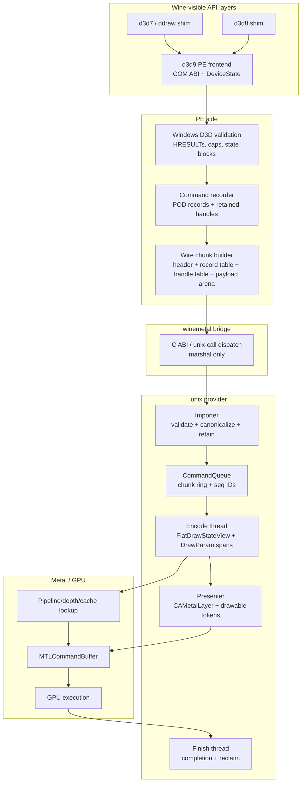

Ownership is intentionally DXMT-shaped: API calls update state and record work;
Metal execution happens later on queue-owned threads. dxmt9 differs from
upstream DXMT where Wine requires a C ABI and POD wire records instead of
in-process C++ command objects.

---

## 2. Data Layout Strategy

The hot path follows a flat-record pipeline:

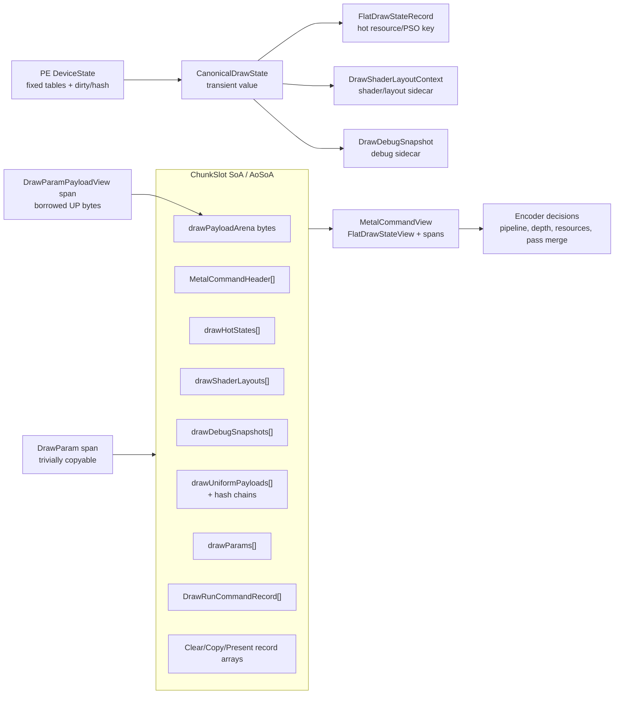

The design uses SoA for queue-owned execution storage and AoSoA where a command
header indexes one type-specific record array. This keeps replay linear while
avoiding a single fat command union that carries every possible payload.

### 2.1 Boundary Forms

| Boundary | Form | Ownership rule |
|---|---|---|
| API layer to D3D9 frontend | COM calls + PE `DeviceState` | PE owns Windows-visible state and validation |
| D3D9 frontend to backend facade | `CanonicalDrawState`, `DrawUniformPayload`, `span<DrawParam>`, `span<DrawParamPayloadView>` | Borrowed spans are immediate-use only |
| CommandQueue to ChunkSlot | SoA arrays and byte arena | Queue owns copied records after append |
| ChunkSlot to encoder | `MetalCommandView`, `FlatDrawStateView`, `span<DrawParam>`, payload span | Borrowed view over queue-owned slot storage |
| PE bridge | POD wire blob | Header/table/arena offsets validated before import |
| Importer to queue | Compact imported records and handles | unix side owns retained handles and replay data |

### 2.2 Copy Policy

Allowed copies:

- borrowed span to queue-owned storage;
- user-provided UP memory into payload/staging arenas;
- PE wire sections into a contiguous C ABI blob;
- decoded/canonicalized records into queue-local storage;
- uniform payload intern append on cache miss.

Copies that should be treated as regressions:

- one heap allocation per ordinary draw after warm-up;
- one bridge call per `Set*` or draw;
- copying PE COM state into backend execution records;
- storing process-local pointers in wire payloads;
- rebuilding large shader/layout payloads when hashes or handles are enough.

---

## 3. CPU-Bound Submission Sequence

The CPU-bound path should be dominated by validation, flat state/key creation,
record append, and one chunk commit. It should not block on Metal API work.

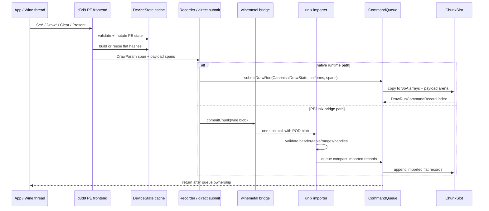

CPU-bound design rules:

- `Set*` updates PE state and invalidates derived flat-state caches; it does not
  call Metal.
- Ordinary draws submit `DrawParam` spans and payload spans. Queue append owns
  the copied data before returning.
- `ChunkSlot` arrays reserve capacity and retain capacity after `clear()`, so
  warm frames should not allocate per ordinary draw.
- Importer coalescing may use temporary `DrawParam` vectors. That cost is
  acceptable unless bridge-heavy benchmarks show it as CPU-bound.

---

## 4. GPU-Bound Execution Sequence

GPU-bound work starts after queue ownership. The encoder consumes views over
queue-owned data and can batch render passes when hazards allow.

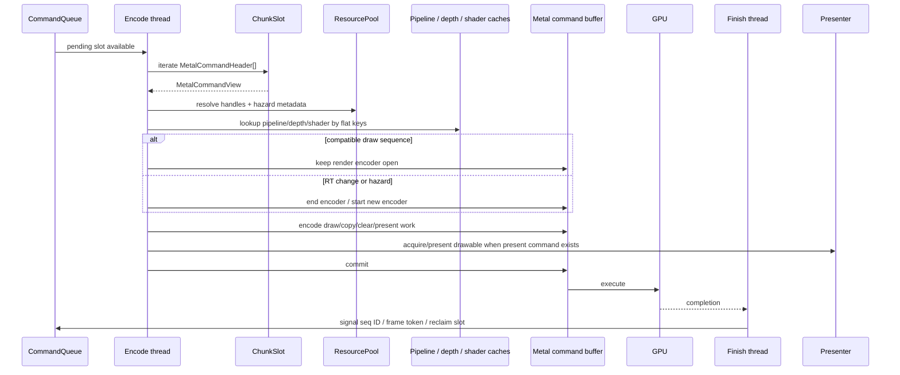

GPU-bound design rules:

- Pass merge/split decisions consume `FlatDrawStateView`, attachment keys, and
  exact hazard read/write handle sets, not PE state or Bloom false positives.
- Pipeline and depth decisions consume compact flat keys and shader/layout
  context.
- Uniform payloads are interned in slot-local storage and referenced by handles
  in draw-run records.
- Present metadata travels with the queued command and is completed through the
  queue sequence/frame-token path.

---

## 5. Render Flow

The render flow is the whole frame path, not just `Draw*`. It includes D3D9 state
mutation, draw/clear/copy/readback packet formation, queue ownership, Metal
encoding, GPU completion, and presentation.

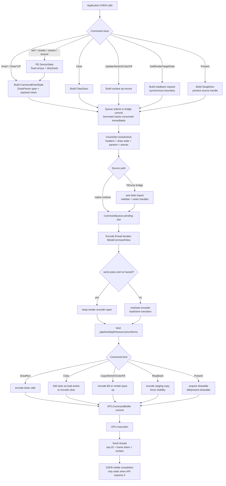

Render-flow invariants:

- `Set*` stays CPU-side and only affects later command records.
- Draw preparation may build canonical values, but queue storage owns flat records
  and spans before the API call returns.
- Clear, copy, stretch, readback, and present use the same queue ordering model as
  draw work unless the D3D9 API requires a synchronous result.
- The encoder is the first point that may make Metal render-pass decisions.
- Completion is reported through sequence IDs and frame tokens, not by exposing
  Metal objects to the PE side.

---

## 6. Concurrency Model

The concurrency model is producer/consumer with bounded queue ownership. The
application-visible thread records D3D9 work and hands it to queue-owned storage;
the encode thread, Metal/GPU, and finish thread advance that work after the API
call has returned unless an explicit synchronization boundary applies.

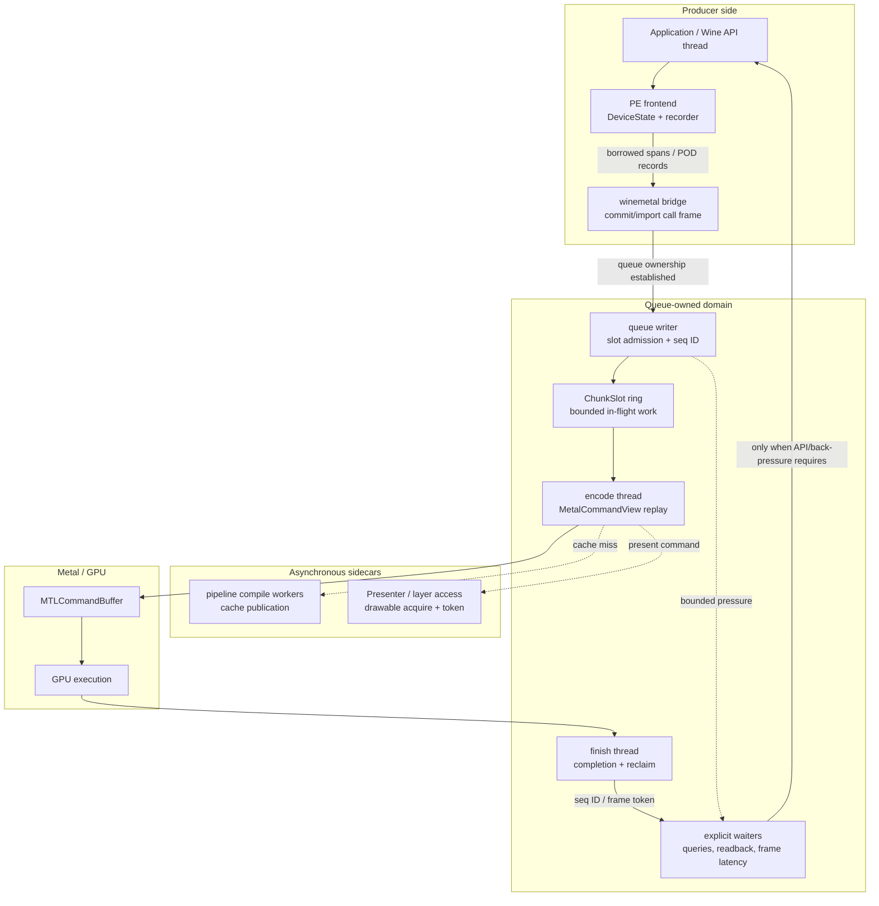

### 6.1 Agents And Ownership

| Agent | Owns | May run in parallel with | Must not do |
|---|---|---|---|
| Application / Wine API thread | D3D9-visible call order, PE validation, PE `DeviceState` mutation | encode thread, GPU execution of older chunks, finish thread | call Metal directly or keep backend-owned pointers |
| PE recorder / bridge call frame | POD chunk construction, local wire blob lifetime | prior GPU work, async pipeline compilation | expose PE COM pointers or borrowed stack spans after return |
| Queue writer / importer | slot admission, record validation, retained handles, sequence ID assignment | application recording future work, encode thread on older slots | enqueue unbounded work or accept malformed records |
| Encode thread | queue-local replay state, active Metal encoder, render-pass merge/split decisions | application submission, GPU execution of older command buffers | read PE `DeviceState` or expose partially encoded command buffers |
| Pipeline compile workers | sidecar PSO compilation and cache publication | encode thread and GPU work | change D3D9 command order or mutate queue records |
| Metal/GPU | asynchronous execution of committed command buffers | CPU recording and encoding later work | signal D3D9-visible completion directly |
| Finish thread | completed sequence IDs, frame-token signaling, resource reclaim | application submission and encode thread | free resources before their last-use sequence completes |
| Presenter / layer access | drawable acquisition, layer property updates, present token relation | encode thread up to the point of drawable use | let PE code own `CAMetalLayer` or `CAMetalDrawable` |

### 6.2 Fire-And-Forget Taxonomy

| Operation class | Return point | Synchronization policy |
|---|---|---|
| `Set*` state mutation | PE state is updated | no queue or GPU wait |
| Ordinary `Draw*` / `Clear` | command data is copied/imported into queue-owned storage | fire-and-forget after queue ownership |
| Queued surface copy / stretch / color fill | command is queued and referenced resources are retained | fire-and-forget unless the API requires a visible result |
| `Present` | present command is accepted after any configured frame-latency gate | may wait for older present tokens, but not for the submitted present's GPU completion by default |
| `GetRenderTargetData` / synchronous readback | destination data is CPU-visible and complete | explicit GPU/queue drain boundary |
| Query `GetData` without flush | current completion waterline is inspected | no forced wait |
| Query `GetData` with `D3DGETDATA_FLUSH` | queued work needed for the query has been committed and eventually completed | explicit progress boundary; may spin/poll according to D3D9 contract |
| `WaitForVBlank` | vblank/presenter wait completes | explicit display synchronization boundary |
| reset/lost-device drain and shutdown | in-flight queue work has reached the required safe point | explicit lifecycle synchronization boundary |

Fire-and-forget means the API call no longer needs the caller's transient memory
or PE object pointers after it returns. It does not mean resources may be freed
immediately; queue retention and sequence IDs continue to own lifetime.

### 6.3 CPU/GPU Overlap Sequence

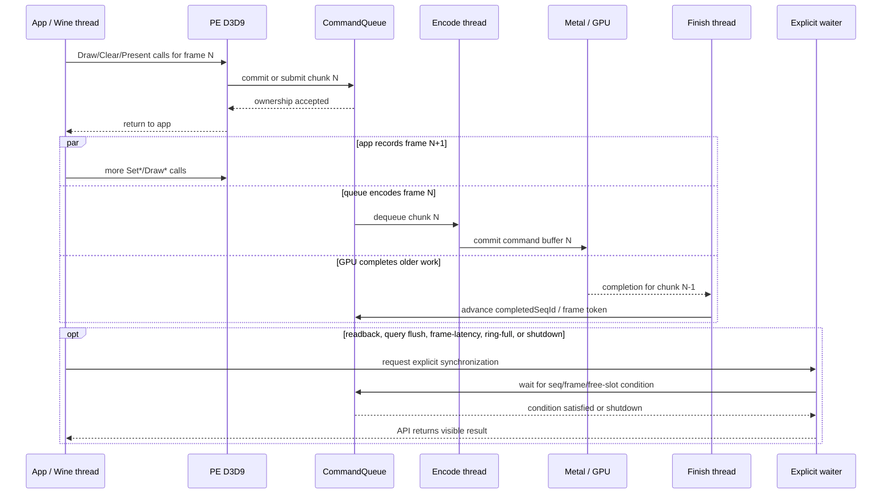

### 6.4 Ordering And Safety Rules

- D3D9 command order is preserved by queue order and sequence IDs, even when CPU,
  encode, GPU, and finish work overlap.
- Back-pressure is deterministic: ring slots, chunk limits, and frame-latency
  tokens bound how far the CPU can run ahead.
- A command buffer completion may advance `completedSeqId`; a present-bearing
  command buffer completion may additionally advance the present frame token.
- Resource destruction is deferred until `completedSeqId` reaches the last use of
  the resource.
- The presenter can block on drawable acquisition or layer synchronization, but
  that wait is accounted as present/WSI pacing, not general draw submission.
- Sidecar parallelism such as pipeline compilation must publish results through
  thread-safe caches and must not reorder already accepted D3D9 work.

---

## 7. Expected Performance Bottlenecks

The expected bottlenecks are workload-dependent. The architecture should identify
which stage dominates before changing data layout or synchronization policy.

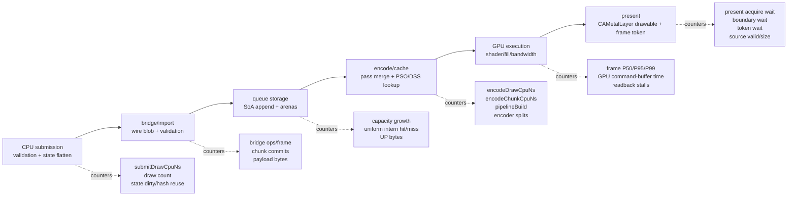

| Stage | Expected bottleneck when | Bound | Existing or required evidence | First response |
|---|---|---|---|---|
| PE validation and state flattening | many small draws or high `Set*` churn rebuild canonical state every draw | CPU | `submitDrawCpuNs`, draw count, state dirty/hash reuse counters | preserve fixed arrays and dirty masks; cache flat state slices before changing bridge shape |
| Wire blob build/import | bridge payload bytes or validation work grows with draw count instead of chunk count | CPU/boundary | bridge ops/frame, chunk commits, record count, payload bytes, import validation timing | keep chunk granularity; optimize direct section writes only after payload bytes dominate |
| Queue slot append | warm frames still grow vectors or copy large UP/uniform payloads per draw | CPU memory bandwidth | capacity-growth counters, UP bytes/frame, uniform intern hit/miss | reserve slot arrays, intern repeated uniform payloads, stage UP data through arenas |
| Queue mutex and ring pressure | writer waits or commit waits rise while GPU is not saturated | CPU/concurrency | queue writer wait, commit wait, slot occupancy, chunk count | adjust chunk flush policy and ring depth before adding new cross-thread paths |
| Encoder pass decisions | render-target changes, exact hazards, or clears split encoders too often | CPU/GPU | encoder split count, render-pass count, exact hazard/Bloom false-positive counters, encode chunk CPU time | keep exact hazard classification as the split source and fold clears/load actions |
| Pipeline/depth/shader cache | cold or state-alternating workloads rebuild PSO/DSS entries | CPU/stutter | `pipelineBuild`, cold/warm first-frame benchmark, cache hit/miss | stabilize flat keys, use `MTLBinaryArchive`, prewarm common variants |
| Resource upload/readback | texture streaming or readbacks force staging pressure or CPU waits | CPU/GPU sync | transient upload CPU time, sync wait, readback MB/s | use ring staging and batch copies; keep `GetRenderTargetData` as an explicit synchronous boundary |
| GPU shader/fill/bandwidth | command submission is cheap but GPU frame time dominates | GPU | GPU command-buffer time, frame P50/P95/P99, Metal capture | optimize render-pass merging, avoid redundant blits, then tune shader/format paths |
| Present/drawable pacing | frame token or drawable acquisition waits dominate frame time after present source is valid | display/WSI | present source valid/size, present acquire wait, boundary wait, token wait, pre-acquire hit/miss | tune drawable pre-acquire and frame-latency policy only after draw/hazard signals are clean |

The highest-risk architecture regressions are still CPU-side: per-call bridge
fallback, per-draw heap growth after warm-up, and rebuilding large state payloads
instead of using flat hashes, handles, and interned slot-local storage. GPU-bound
workloads should be treated separately; changing the PE/unix boundary will not
fix shader, fill-rate, or drawable pacing limits.

---

## 8. Wire Blob Sequence

The PE/unix boundary uses a contiguous wire blob so the bridge can validate and
import command batches with one ABI call.

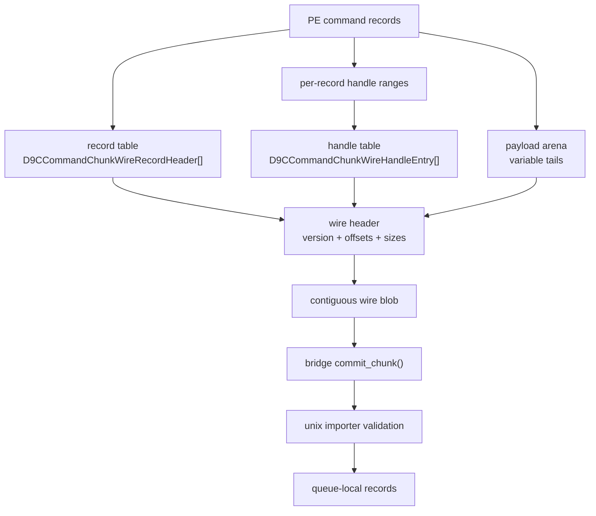

Wire design rules:

- The blob layout is header, record table, handle table, payload arena.
- Record payloads are addressed by offset/size into the payload arena.
- Handle references are addressed by first/count into the handle table.
- Reserved fields are zero on produce and validated as zero on import.
- Final blob copies are acceptable at the C ABI boundary. They become a
  benchmark-driven optimization only if bridge payload bytes dominate CPU time.

---

## 9. CPU-Bound Versus GPU-Bound Signals

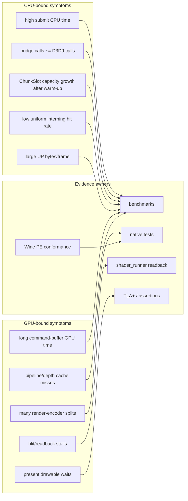

Architecture regressions are not limited to incorrect pixels. A rendering-correct
change can still fail if it regresses to per-call bridge submission, reintroduces
hot-path heap churn, or breaks DXMT-style queue ownership.

---

## 10. Reference And License Flow

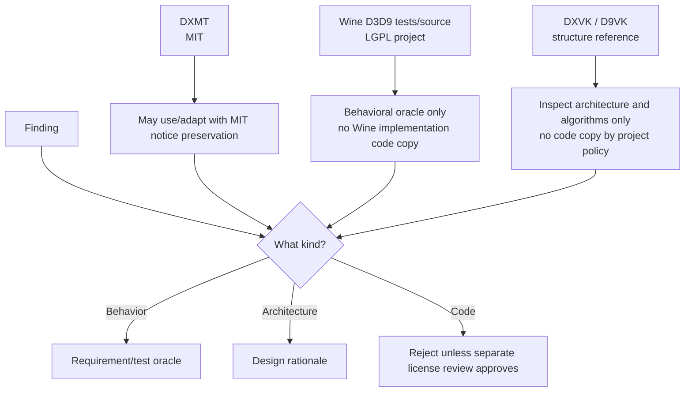

The license policy is conservative by design:

- MIT-compatible project code may incorporate DXMT MIT material with notices.
- Wine-oracle behavior is acceptable as an oracle; Wine implementation structure
  is not an architecture requirement.
- DXVK/D9VK are useful references for structure and tradeoffs, but dxmt9 does
  not copy their code.
- Any external artifact that becomes a committed test/corpus/fixture needs
  provenance metadata.

---

## 11. Verification Mapping

| Requirement area | Evidence |
|---|---|
| `R-ARCH-1.*` DXMT ownership | `specs/backend/design.md`, command queue tests, import tests, gap row for merge readiness |
| `R-ARCH-2.*` DOD layout | `dxmt9-state-draw-transform-spec`, chunk/import specs, backend key/pipeline specs |
| `R-ARCH-3.*` boundaries | `dxmt9-chunk-record-import-spec`, resource hazard spec, TLA+ queue/resource models |
| `R-ARCH-4.*` provenance | specs review, conformance manifest provenance, license review before imports |
| `R-ARCH-5.*` verification | `specs/verification/`, `specs/tests/`, `specs/benchmarks/`, `specs/gap.md` |
| `R-ARCH-6.*` concurrency | `CommandQueue.tla`, `QueueLifecycleRefinement.tla`, `PresentFrameLatency.tla`, `ResourceLifetime.tla`, `EncoderLifecycle.tla`, `QuerySeqId.tla`, queue observer tests, wait/perf counters |

Current known partial evidence remains tracked in `specs/gap.md`, especially the
DOD / DXMT ownership acceptance row.
