# Architecture Spec

This document describes the project-wide architecture that satisfies
[`requirements.md`](requirements.md). Subsystem designs remain authoritative for
local details; this file owns the whole-system shape, data boundaries, and
CPU/GPU sequencing, render flow, concurrency, and bottleneck analysis.

---

## 1. Ownership Map

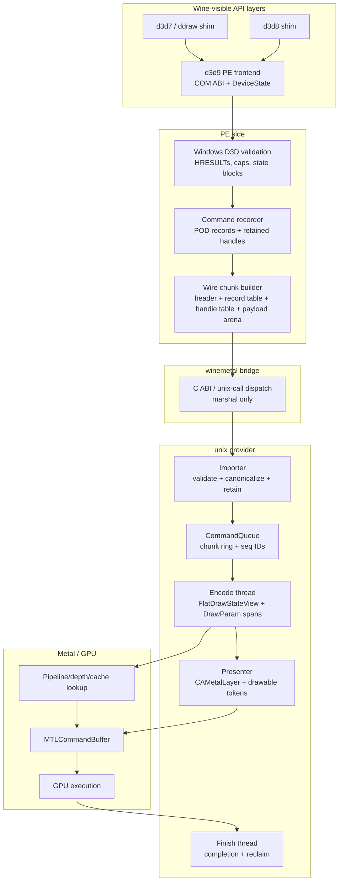

Ownership is intentionally DXMT-shaped: API calls update state and record work;
Metal execution happens later on queue-owned threads. dxmt9 differs from
upstream DXMT where Wine requires a C ABI and POD wire records instead of
in-process C++ command objects.

---

## 2. Data Layout Strategy

The current compatibility hot path follows a flat-record pipeline. The target
serial provider removes the complete final SoA stage and consumes the immutable
source through a direct cursor; only the experimental parallel provider may
materialize a pass-local compact indexed SoA.

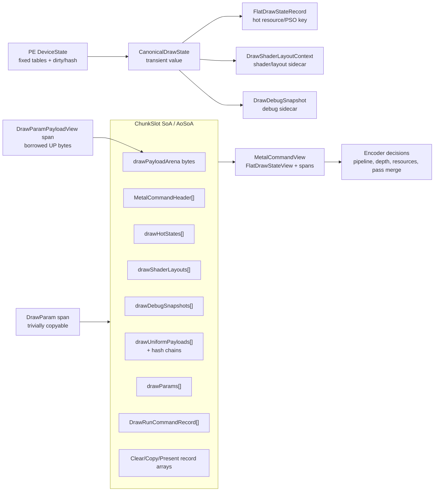

The current design uses SoA for queue-owned execution storage and AoSoA where a
command header indexes one type-specific record array. This remains a migration
representation, not the target serial contract. Compact indexed SoA is retained
only as an accepted-pass representation for explicit parallel execution.

### 2.1 Boundary Forms

| Boundary | Form | Ownership rule |
|---|---|---|
| API layer to D3D9 frontend | COM calls + PE `DeviceState` | PE owns Windows-visible state and validation |
| D3D9 frontend to backend facade | `CanonicalDrawState`, `DrawUniformPayload`, `span<DrawParam>`, `span<DrawParamPayloadView>` | Borrowed spans are immediate-use only |
| Replay to serial encoder (target) | direct cursor plus compact sidecar | Source lease and cursor callback bound the borrow; no complete final SoA |
| Replay to explicit parallel encoder (experimental) | accepted pass-local compact indexed SoA | Queue owns the bounded pass representation until joined encoding completes |
| CommandQueue to ChunkSlot (compatibility) | SoA arrays and byte arena | Queue owns copied records after append |
| ChunkSlot to encoder (compatibility) | `MetalCommandView`, `FlatDrawStateView`, `span<DrawParam>`, payload span | Borrowed view over queue-owned slot storage |
| PE bridge | POD wire blob | Header/table/arena offsets validated before import |
| Importer to queue | Compact imported records and handles | unix side owns retained handles and replay data |

### 2.2 Copy Policy

This is the design companion to the normative Minimal-Copy Policy
(`requirements.md` §7, R-ARCH-7.1–7.6). The floor is: each unique
encoder-visible record or payload reaches owned storage at most once, and only
when the encoder will read it.

Allowed copies (R-ARCH-7.1):

- borrowed span to queue-owned storage;
- user-provided UP memory into payload/staging arenas;
- PE wire sections into a contiguous C ABI blob;
- decoded/canonicalized records into queue-local storage;
- uniform payload intern append on cache miss.

Copies that should be treated as regressions:

- one heap allocation per ordinary draw after warm-up (R-ARCH-7.1);
- one bridge call per `Set*` or draw;
- copying PE COM state into backend execution records;
- storing process-local pointers in wire payloads;
- rebuilding large shader/layout payloads when hashes or handles are enough
  (R-ARCH-7.3);
- materializing per-draw state records that draw-run batching then discards —
  when a generation/lane stamp proves a shared canonical state, only the
  surviving record is materialized and per-draw deltas ride `DrawParam` +
  binding-override/snapshot payloads (R-ARCH-7.2);
- building a record in an intermediate carrier and copying it into the owned
  arena/SoA slot when the destination was already known — the target design is
  to construct directly into the owned slot instead (R-ARCH-7.4).

Construct-in-place and unified memory (R-ARCH-7.4, R-ARCH-7.5):

- Target: the producer builds the surviving canonical draw state and the
  per-draw uniform/constant bytes directly into their owned destinations — the
  ChunkSlot SoA slot and the shared-storage transient/argbuf allocation —
  rather than into a `DrawRunSubmission`-style carrier that is then copied in.
- Current status: dirty constant bytes are built directly into shared-storage
  transient/argbuf memory. Draw-run state now avoids materializing same-stamp
  N-1 non-front records in the default binding-agnostic snapshot path, and the
  queue accepts elided continuations without reducing normal compatibility
  grouping. The surviving front/materialized state still travels through
  `DrawRunSubmission` before `ChunkSlot::appendDrawRunBatch` stores it, so
  direct construction into the queue-owned slot remains open. Adjacent uniform
  payload elision is measured and rejected for 3DMark05 GT1:
  `d3d9_snapshot_uniform_elided=0`, so uniform snapshot reuse is not a live GT1
  target.
- A shared (`MTLStorageModeShared`) backing is the GPU-read allocation itself, so
  on Apple Silicon the in-place build of dirty constants is the upload; no
  separate CPU-struct-then-staging copy is required (R-BACK-5.7). The allocation
  is retained by queue sequence ID until GPU completion (R-ARCH-6.4); a reference
  handle does not extend its lifetime by itself.

The copy-class map marks each materialization point on the target warm draw path.
Green is a mandatory floor copy or construct-in-place materialization
(R-ARCH-7.1 / R-ARCH-7.5); blue is a move, reference, or direct bind that copies
no payload bytes. The diagram is the target warm draw path: the surviving front
draw state is constructed directly into the queue-owned slot (R-ARCH-7.2 /
R-ARCH-7.4), so no per-draw carrier copy appears. The current implementation is
short of that target for draw state; `gap.md` tracks the default same-stamp
state elision and the remaining direct-construct work.

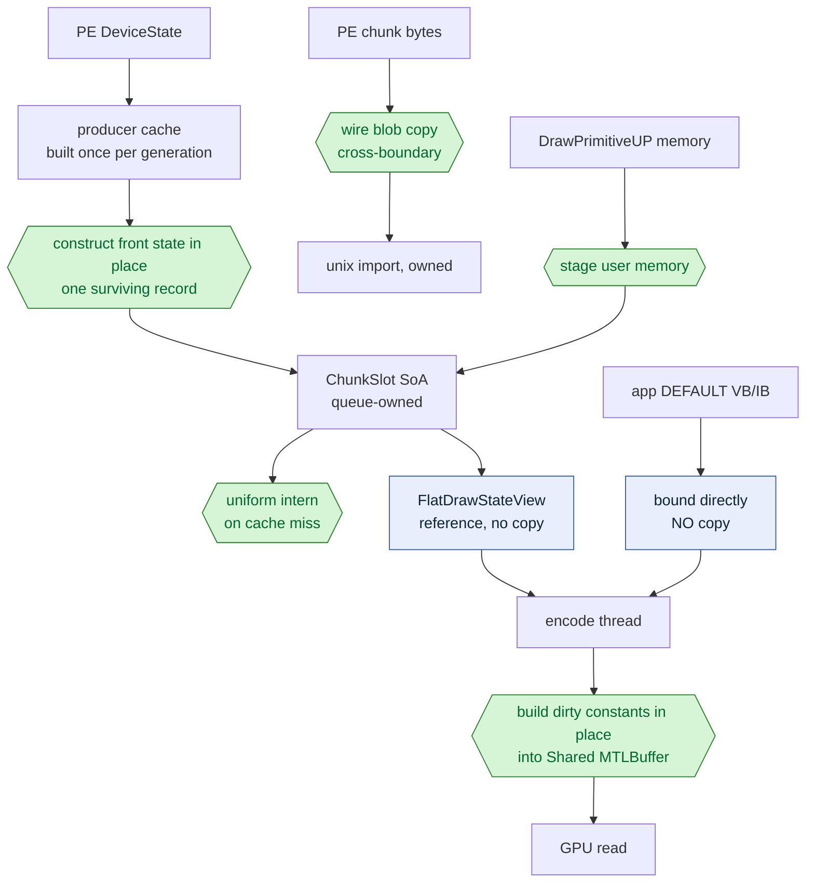

### 2.3 Copy and materialization ledger

R-ARCH-7.7 gives these identities normative meaning. `copy` means bytes are
duplicated between two live representations; `materialize` means bytes are
created in their first owned destination and is not to be counted again as a
copy. Subsystem counters may add a suffix for a bounded subtype, but must roll
up to exactly one identity below.

| Identity | Operation | Classification | Reason / target |
|---|---|---|---|
| `materialize.pe.state-shadow` | store the D3D9 value and ownership needed for later recording | necessary | preserves producer-visible D3D9 state semantics |
| `materialize.pe.semantic-owner-admission` | transfer one accepted producer record into rollback-capable typed semantic arenas and kind-qualified pins | necessary | establishes the first chunk-owned typed semantic representation |
| `materialize.pe.wire-final` | create a record, handle entry, or payload directly in the final PE wire blob | necessary | establishes pointer-free PE ownership |
| `view.pe.wire-final` | expose already-final typed regions through the bounded segmented transport descriptor | necessary | preserves direct final-region ownership without reporting a byte copy |
| `materialize.pe.builder-temporary` | create a record, handle entry, or payload in a temporary builder region later copied by seal | removable | the final wire layout is the target owner |
| `copy.pe.seal-records` | copy the temporary record table into `sealedBlob_` | removable | final offsets are knowable before construction |
| `copy.pe.seal-handles` | copy the temporary handle table into `sealedBlob_` | removable | final handle capacity is reservable transactionally |
| `copy.pe.seal-payload` | copy the temporary payload arena into `sealedBlob_` | removable | typed producers can write the final payload range |
| `copy.bridge.raw-owned` | import the authenticated wire blob into separately allocated Unix `RawCommandChunk` storage | removable | compatibility ownership transfer until `UnixOwnedSourceLeaseV1` is promoted |
| `adopt.bridge.unix-source-lease` | atomically transfer one sealed Unix-allocated source lease from PE write ownership to Unix read ownership | necessary | establishes asynchronous Unix ownership without duplicating source bytes |
| `materialize.replay-submission-carrier` | create canonical draw state, uniform, param, or payload-view values in replay scratch | removable | bounded planning can target final queue storage |
| `copy.replay-submission-carrier` | copy canonical draw state, uniforms, params, or payload views through a replay submission carrier | removable | final queue destination is known after bounded planning |
| `materialize.queue-final` | construct the surviving SoA record, owner, or byte range in `ChunkSlot` / `SourcePayloadBlockChain` | necessary | establishes immutable queue ownership |
| `copy.gpu-upload` | copy final CPU bytes to a distinct GPU-readable allocation | necessary | this class exists only when the final CPU allocation is not GPU-readable; unified-memory in-place construction uses the next class instead |
| `materialize.gpu-shared` | construct dirty GPU input directly in shared Metal storage | necessary | first and only GPU-readable owned representation |
| `copy.arena.bytes` | append payload bytes into a Unix arena-owned byte chain | necessary | establishes the queue-visible arena representation |
| `materialize.mutation.staging` | stage managed-buffer mutation bytes for deferred replay | necessary | preserves asynchronous offload ownership |
| `materialize.up.scratch` | materialize user-provided UP bytes in the PE builder scratch region | necessary | keeps pointer-free wire construction transactional |
| `materialize.pe.section-append` | append typed PE section bytes into the active builder | necessary | records the section ownership boundary before sealing |

The classification is about the required architecture, not current cost.
`gap.md` records which removable classes still exist. Each enabled ledger row
reports `{identity, classification, reason, calls, bytes, inclusive_cpu_time,
peak_retained_bytes}`. `classification` is emitted as the stable name
`necessary` or `removable`, and `reason` is a stable kebab-case name for the
ownership/ABI rationale from the table above. Peak retention increases when a
second live byte representation and decreases when that representation is
released; it is not the maximum single call size. Cross-class totals may be
shown only after every contributing row remains available. Inclusive timing
starts immediately before the class's source read/destination construction and
ends when the destination representation is live; it excludes validation,
resource resolution, queue waits, and semantic replay. Inclusive rows may
overlap and must be marked non-additive unless the observer proves disjoint
windows. Implicit Metal `newBuffer` and `replaceRegion` transfers report their
known byte/call coverage with zero `inclusive_cpu_time`; their API duration can
include allocation and driver work and is not charged to `copy_ns`. Every emitted row is prefixed with its binary-qualified owner (for
example, `binary=unix owner=unix`); PE and Unix registries are separate, and
the production PE device and Unix queue reports read only their corresponding
owner registry.

### 2.4 Ownership refinement

The architecture-wide stages from R-ARCH-7.8 specialize as follows:

| Stage | Concrete authority | Exit condition |
|---|---|---|
| `ProducerOwned` | PE state, application input, and active recorder transaction | final pointer-free wire identity committed or pre-effect rollback |
| `RawOwned` | unix-owned authenticated wire blob plus retained resolved wrappers | replay transaction begins or terminal discard |
| `ReplayBorrowed` | call-local validated record/payload/handle views under a typed replay capability | direct build commits, rolls back, or fail-stops after an effect |
| `FinalOwned` | immutable `ChunkSlot` / Arena payload chain and queue-owned re-entrant owners | synchronous encode borrow begins |
| `Encoding` | call-local views held by the serial coordinator or bounded child | queue receipt or submitted work becomes completion authority |
| `GPUInFlight` | command buffer, resource waterlines, receipt, query/frame token, and completion identity | ordered GPU/device-loss settlement |
| `Completed` | ordered completion authority after GPU/device-loss settlement | all payload/resource/receipt/callback owners are eligible for final reclaim |
| `Reclaimed` | no payload view, resource owner, receipt, or callback remains reachable | terminal |

The stage names describe refinement, not eight mandatory allocations. Direct
construction may combine representation changes within a stage, and state-only
or rejected work may take an explicit no-GPU terminal path. The encode
scheduling spec owns the concrete transaction, queue observer, and early
payload-retirement rules; the recorder spec owns the PE wire transaction and
recorder capabilities; the verification spec owns formal and executable
evidence.

The concrete lifecycle observer preserves `Completed` as a distinct owner from
`Reclaimed`. Queue-owned zero-command-buffer inline work emits an explicit
no-GPU terminal disposition from `Encoding` to `Reclaimed`; it must not invent
`GPUInFlight` or completion milestones. Observer owner metadata is diagnostic
and opt-in, with `PeImport`, `Receipt`, `SelectedParallel`, `DeviceLoss`, and
`Queue` as the bounded owner-qualified values.

### 2.5 End-to-end immutable source contract

`R-ARCH-7.11` through `R-ARCH-7.28` make one semantic source, rather than a
sequence of carriers, the architecture-wide unit of work. The terms below are
normative interfaces; subsystem specs map them to concrete types.

| Contract term | Owns | Must not own |
|---|---|---|
| `EndToEndSourceIdentity` | closed producer event/source interval, raw/source, queue sequence, storage generation, completion qualification | pointer, payload bytes, Metal object |
| `ImmutableSemanticSource` | sealed ordered records, payload bytes, qualified resource/control identities, one reclaim authority | mutable PE shadow, resolved Metal objects, completion callback |
| `SourceLease` | generation-qualified permission to keep the physical source resident and issue synchronous borrows | resolved span, Arena page pointer, session-global encoder state |
| `SynchronousSourceFacade` | call-local typed records, spans, and bounded locators over one leased source | ownership, asynchronous escape, mutable storage |
| `ResolvedSourceSidecar` | source-qualified Unix resource resolutions and compact derived planning/encode values | duplicate semantic payload, PE/ABI pointer, independent completion identity |
| `CompletionProjection` | locator-free command/source completion facts needed after payload retirement | payload pointer, facade, source page, mutable native binding shadow |

```mermaid
flowchart LR
    PE["PE semantic owner\nProducerOwned"]
    WIRE["pointer-free source\nsealed identity"]
    RAW["Unix authenticated source\nRawOwned + SourceLease"]
    VIEW["SynchronousSourceFacade\nReplayBorrowed"]
    FINAL["Direct cursor or accepted-pass compact SoA\nFinalOwned"]
    ENC["EncodeSession / child range\nEncoding"]
    GPU["receipt + resource waterlines\nGPUInFlight"]
    DONE["CompletionProjection\nCompleted"]
    FREE["one reclaim\nReclaimed"]

    PE -->|commit| WIRE
    WIRE -->|atomic copy or negotiated adoption| RAW
    RAW -->|issue generation borrow| VIEW
    VIEW -->|direct cursor; optional accepted-pass projection| FINAL
    FINAL -->|issue fresh encode borrow| ENC
    ENC -->|submit| GPU
    ENC -.->|explicit no-GPU terminal| FREE
    GPU -->|ordered settlement| DONE
    DONE -->|borrows zero + pins releasable| FREE
```

The diagram is a refinement sequence, not a mandatory allocation sequence.
The compatibility importer may own a copied contiguous `RawOwned` extent;
negotiated segmented transport may atomically adopt fixed regions. Both expose
the same checked facade and preserve the same source identity. The target
serial replay consumes that facade directly and constructs only necessary
payload ownership and compact sidecars. The experimental parallel provider may
construct one accepted pass-local compact indexed SoA; compatibility replay may
still materialize the named removable carrier. None changes command, resource,
failure, Present, or completion semantics.

The source and destination are both data-oriented, but they serve different
consumers and therefore need not share one physical schema:

| Representation | Optimized for | Ownership boundary |
|---|---|---|
| PE semantic tables plus payload arena | exact D3D9 order, bounded validation, capture, and pointer-free ABI emission | `ProducerOwned`; readable by Unix only during the active bridge call |
| Unix `RawOwned` source | asynchronous Replay residency and generation-qualified facade issuance | one Unix source lease established before bridge return |
| Serial direct cursor plus compact sidecar (target) | sequential state transition, resource qualification, immediate encode, and completion attribution | synchronous borrow over `RawOwned`; only compact derived values become `FinalOwned` |
| Pass-local compact indexed SoA (experimental) | parallel child ranges with deduplicated state/uniform/resource sets | `FinalOwned` only for one accepted sealed pass |
| Queue `ChunkSlot` / Arena SoA (compatibility) | replay scans, state/uniform interning, encode locality, and completion attribution | `FinalOwned`; constructed transactionally from the leased source |

This distinction does not require a per-command guess about whether a call is
"really synchronous." The complete committed batch crosses the lifetime cut as
one unit. Call-local typed facades are then issued mechanically from the
Unix-owned lease and become invalid when their callback returns. Commands that
require ordered control still affect replay/encode disposition, but they do not
weaken source ownership.

Before import acceptance, the PE recorder transaction owns rollback and every
producer retain. Import acceptance atomically transfers the logical reclaim
authority to the Unix source identity; the PE call may then settle its local
transaction, but no second completion owner is created. A copied bridge extent
and its PE source may overlap physically during that call only as the named
`copy.bridge.raw-owned` operation, never as two independently publishable or
reclaimable sources.

Facade construction follows three rules:

1. Validate the complete pointer-free header, region bounds, record order, and
   qualified resource identities before issuing a facade.
2. Resolve typed values only inside a non-copyable synchronous borrow. A
   segmented source uses region locators rather than pretending to have one
   contiguous base pointer.
3. Store only source-qualified locators or compact value snapshots in planners,
   sessions, partitions, and sidecars. Reacquire and revalidate a facade at the
   point of use.

The Unix side may derive a `ResolvedSourceSidecar` once validation succeeds.
Resource wrapper/Metal object references, hazard summaries, pass-action proof,
PSO keys, and first-draw snapshots belong there. A sidecar shares the source
lease and generation; only a locator-free `CompletionProjection` may survive
early payload retirement. The PE wire and facade never contain COM, Metal, or
Objective-C pointers.

Failure ownership is fixed by the first visible effect:

| Cut | Required disposition |
|---|---|
| count, reserve, validation, or adoption failure before any effect | restore the exact checkpoint; at most one typed compatibility fallback |
| partial source adoption or partial source publication | invalid; publish nothing and release all reserved credit |
| failure after adoption/receipt activation or an encoder/ordered-control effect | poison/fail-stop; never retry or duplicate the source |
| zero-GPU source | settle the source identity through an explicit terminal projection without `GPUInFlight` |
| normal/device-loss completion | settle ordered effects, return all borrows, release pins/sidecars, reclaim once, publish capacity wake |

The PE producer remains independent from Unix execution so it can record source
`N+1` while Unix replays and encodes source `N`. The target direct providers do
not add a second Unix pipeline boundary: their Replay worker is also the serial
Metal encode coordinator. Only `ExplicitParallelCompactSoA` separates Replay
from encode, using an accepted pass-local compact representation. Neither the
PE/Unix boundary nor that experimental handoff permits a large per-draw carrier.

Wine's PE and unixlib may observe the same process virtual address during a
`wine_unix_call`, but address visibility is not asynchronous ownership. Under
the current pointer-free ABI, import establishes `RawOwned` bytes before the
call returns. A future same-address path is valid only if its ABI names the
allocation, capacity, used extent, generation, transfer point, reclaim owner,
and producer wake; partial role adoption is forbidden. The expected benefit
must be measured against `copy.bridge.raw-owned` before introducing that larger
lifecycle protocol.

`DrawRunSubmission` is therefore a transitional compatibility representation,
not the architecture's source or sidecar type and not a permanent fallback
ABI. It combines optional canonical state,
uniform payload, draw parameters, borrowed payload spans, binding overrides,
and generation stamps into one replay-scoped AoS before `ChunkSlot` decomposes
it into final SoA regions. The target serial direct cursor instead advances the
same replay state and encodes without a complete final draw representation. The
experimental parallel provider performs a bounded count/dedup plan only for an
accepted sealed pass and emits compact indices plus unique value tables.
The `ResolvedSourceSidecar` contains only source-qualified resolutions and
derived planning/encode values; it must not duplicate the state, uniform, or
payload bytes that made the compatibility carrier large.

Once R-ARCH-7.22 projection and the universal direct-cursor transaction cover
all source families, R-ARCH-7.23 requires deleting this type and its public
submission APIs. Unsupported or ordered effects retain typed dispositions, not
the carrier: they seal or split final storage at the semantic boundary, execute
through the coordinator-owned control path, and preserve the same source and
completion identity.

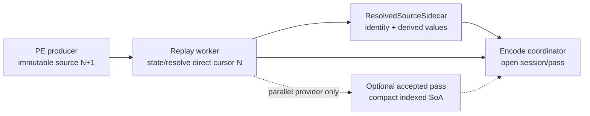

The direct path fuses replay projection and encode ownership on the Replay
worker, but it must not interpret an immutable source boundary as a Metal
render-pass or command-buffer boundary. A long-lived encode session decides
those boundaries from D3D9 semantics, hazards, ordered controls, and Present
policy.

### 2.6 Replay projection and policy boundary

Replay state is necessary even when its input is immutable. A source normally
contains deltas from the preceding source, so projection is a deterministic
state-machine transition rather than a stateless decode:

```text
ReplayState working = persistentState;
EffectiveStream effective = project(source, working);
consumeDirect(effective);
persistentState = working;  // commit only after successful consumption

// ExplicitParallelCompactSoA only, after accepted-pass certification:
CompactPassPlan plan = countAndDedup(acceptedPass(effective));
emit(compactIndexedSoA, acceptedPass(effective), plan);
```

This pseudocode specifies value and commit semantics, not mandatory physical
copies. `working` may be a versioned overlay, persistent-table root, or bounded
undo journal over `persistentState`. `EffectiveStream` may be an allocation-free
typed cursor or compact plan over the immutable source and working-state
snapshot. It must not recreate the large intermediate carrier that direct
construction is intended to remove.

`project` owns D3D9 command order, canonical decoding, backend state
transitions, draw-effective state/uniform formation, resource resolution, and
ordered-control classification. `consumeDirect` is the serial semantic oracle.
For the experimental parallel provider, `countAndDedup` owns only checked
sizes, offsets, exact-value interning, accepted-pass ranges, and sidecar
capacity; `emit` constructs the compact pass-local indexed representation.
None of these steps may decide that a logical command is unnecessary merely to
improve performance.

The state commit and direct-consumption or accepted-pass publication form one
transaction. A failure before either becomes visible restores the original
persistent state and exact destination checkpoint. Once an ordered-control,
receipt, encoder effect, or publication makes rollback impossible, the source
follows its typed fail-stop path rather than committing a partial state or
retrying through another lane. The working state is single-writer Replay data;
Encode receives only cursor-projected immutable values or the accepted compact
pass plus source-qualified sidecar data.

Optimization is a later, explicit transform:

```text
EffectiveStream effective = project(source, working);
OptimizedEffectiveStream selected =
    optimizer.admit(effective, proof) ? optimizer.apply(effective) : effective;
FinalPlan plan = countAndLayout(selected);
emit(finalSoA, selected, plan);
persistentState = working;
```

The persistent state always commits the complete unoptimized D3D9 transition,
even when an optimizer proves that an encoder-visible state command is dead.
This prevents dead-state elimination or cross-source folding from changing the
initial state seen by the next source.

| Replay core | Separate optimizer policy |
|---|---|
| canonical decoding and ordered state transition | dead-state or command elimination |
| exact count, offsets, and capacity | draw or command reordering |
| byte/value-identity interning | pass coalescing and source folding |
| resource resolution and lifetime qualification | mutation composition |
| representation-only canonicalization | partition and parallel selection |

Optimizer output must retain source-qualified command attribution and a typed
fallback relation to `EffectiveStream`. Ordered controls, queries, readback,
Present, resource lifetime, or unknown aliasing fail closed unless the policy's
own requirement proves the relevant boundary.

### 2.7 Large materialization floor

R-ARCH-7.24 permits three large representation changes on the default serial
path and one additional experimental materialization for an accepted parallel
pass:

| Stage | Permitted materialization | Required ownership result |
|---|---|---|
| PE producer | committed `LiveShadow`/`PendingDelta` → immutable semantic record/handle tables and payload arena | one `ProducerOwned` source |
| PE/unix import | compatibility: complete semantic source → copied Unix `RawOwned`; target: PE constructs directly in `UnixOwnedSourceLeaseV1` and commit transfers ownership | one asynchronous Unix source lease before bridge return; zero duplicated source bytes in the target lane |
| Serial Replay/encode | no large CPU materialization; `RawOwned` + working replay state are consumed by a bounded direct cursor | compact sidecar/payload ownership only; no complete final draw SoA |
| Explicit parallel Replay (experimental) | one accepted sealed pass → compact indexed draw columns plus unique state/uniform/resource-set tables | one bounded pass-local `FinalOwned` representation |
| Encode/Metal | direct cursor or accepted-pass compact values → Metal commands plus only required uniform, argument, UP/dynamic, or resource-upload bytes | command buffer and referenced GPU-visible resources |

The compatibility PE emission and current-ABI import may temporarily overlap
their source and destination lifetimes, but no third full representation may be
inserted between them. `UnixOwnedSourceLeaseV1` instead makes the Unix lease the
PE emission destination, so import changes ownership without duplicating the
source bytes. Parallel compact materialization occurs only after
pre-eligibility and is charged to that provider's economy. Planning uses
counts, offsets, masks, hashes, compact certificates, and source-qualified
locators. Queue publication moves a source lease; partition
and session publication moves ranges and snapshots; completion and reclaim move
waterlines and release authority. None requires O(source bytes) copying.

The final row is not a statement that Metal receives source or compact-SoA bytes
verbatim. Encode emits API commands, binds existing resources by reference, and
writes only data the GPU must consume. Copy-ledger evidence must keep known
application writes separate from command emission and from opaque
driver-internal transfer.

Subsystem traceability is intentionally bidirectional:

| Detail owner | Narrows this contract through |
|---|---|
| PE semantic owner and fixed-role transport | `specs/d3d9/recorder/requirements.md` R-CORE-REC-7.2.1 and R-CORE-REC-7.6 through R-CORE-REC-7.10 |
| Unix adoption, direct projection, typed borrow, completion/reclaim | `specs/backend/encode-scheduling/requirements.md` R-BACK-2.85 through R-BACK-2.100 |
| FrameGraph/renderer facade consumption | `specs/d3d9-renderer/requirements.md` R-BACK-32.1, R-BACK-32.8, and R-BACK-32.12 |
| Composed model, model/code trace, differential and GPU evidence | `specs/verification/requirements.md` R-VERIF-7.6 through R-VERIF-7.10 |
| Copy classification and promotion | this document §2.3 and `requirements.md` R-ARCH-7.7 through R-ARCH-7.10 |

### 2.8 Unix-owned bounded source lease

`UnixOwnedSourceLeaseV1` removes the compatibility `RawOwned` import copy by
moving allocation before PE final-wire construction. It does not make a PE
allocator or C++ object asynchronously visible to Unix.

```text
UnixSourceLeaseIdentity {
  pool_id
  slot_or_group_id
  generation
}

PeWritableSourceLease {
  identity
  records_writer_mapping, records_capacity
  handles_writer_mapping, handles_capacity
  payload_writer_mapping, payload_capacity
  maximum_source_bytes
}

CommittedUnixSourceLeaseV1 {
  identity
  canonical_wire_header
  records_used, handles_used, payload_used
  end_to_end_source_identity
}
```

Writer mappings are acquisition results, not persistent descriptor fields.
They are valid only while the lease is `PeWritable`. The committed descriptor
uses the pointer-width-independent identity and checked extents. The Unix
consumer reads its own mapping of the same regions after the bridge has revoked
the PE writer capability and completed the ownership transition.

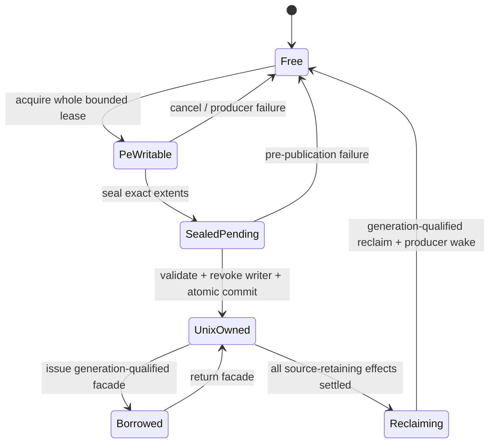

One source may occupy one region or a bounded fixed-role group. A group is one
lease: partial role publication, role-local reclaim, and mixed copied/adopted
ownership are invalid. Pool count and resident-byte limits are device-owned and
resolved before hot-path use. Exhaustion waits on a generation-qualified
reclaim signal; an implementation may retain the copied transport as a
queue-immutable rollback provider during promotion, but it may not change
transport after a source has acquired writable lease storage.

The ABI remains fixed-width C POD because PE and Unix target different platform
ABIs even when they use the same LLVM family. Writer mappings must be usable by
the active x64 or WoW64 producer, while the committed lease token, offsets, and
generations have identical meaning on both sides. Resource entries remain wire
identities; Unix still resolves and retains Metal-owning wrappers before Replay
publication.

The lease removes only `copy.bridge.raw-owned`. It does not remove canonical PE
state transition, exact count/layout, resource retention, Replay projection, or
required GPU-visible writes. The performance gate therefore compares the
measured bridge-copy saving against acquisition, protection/revocation,
back-pressure, cache-coherency, and longer residency costs rather than assuming
that zero copied bytes implies a frame-time win.

---

## 3. CPU-Bound Submission Sequence

The CPU-bound path should be dominated by validation, flat state/key creation,
record append, and one chunk commit. It should not block on Metal API work.

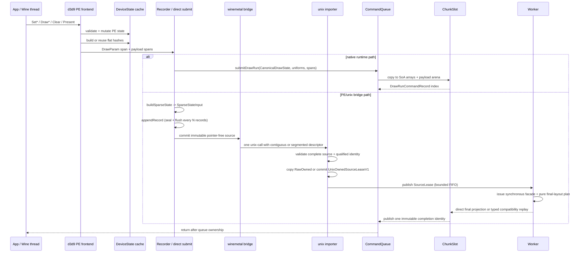

The bridge branch is two-phase since the commit-replay offload became the engine
default (`R-BACK-2.51`): validation, import, wrapper retention and bulk resource
marking stay synchronous on the app thread, and only record replay and slot
publish are deferred to the worker. `Rec` builds `SparseStateInput` directly —
there is no intermediate record format between the PE state shadow and the wire.

CPU-bound design rules:

- `Set*` updates PE state and invalidates derived flat-state caches; it does not
  call Metal.
- Ordinary draws submit bounded typed values. A synchronous facade may expose
  spans only while its `SourceLease` pins the source generation; queue-owned
  final storage or an explicit compatibility owner must exist before return.
- `ChunkSlot` arrays reserve capacity and retain capacity after `clear()`, so
  warm frames should not allocate per ordinary draw.
- Direct replay planning may own counts and locators but no `DrawParam` or
  payload carrier. Compatibility carriers remain the named removable ledger
  class and must not silently become the default for a newly supported family.

---

## 4. GPU-Bound Execution Sequence

GPU-bound work starts after queue ownership. The encoder consumes views over
queue-owned data and can batch render passes when hazards allow.

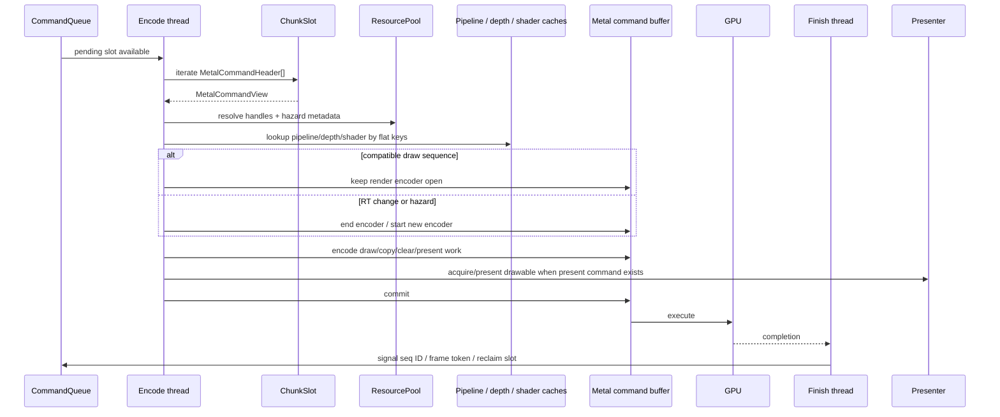

GPU-bound design rules:

- Pass merge/split decisions consume `FlatDrawStateView`, attachment keys, and
  exact hazard read/write handle sets, not PE state or Bloom false positives.
- Pipeline and depth decisions consume compact flat keys and shader/layout
  context.
- Uniform payloads are interned in slot-local storage and referenced by handles
  in draw-run records.
- Present metadata travels with the queued command and is completed through the
  queue sequence/frame-token path.

---

## 5. Render Flow

The render flow is the whole frame path, not just `Draw*`. It includes D3D9 state
mutation, draw/clear/copy/readback packet formation, queue ownership, Metal
encoding, GPU completion, and presentation.

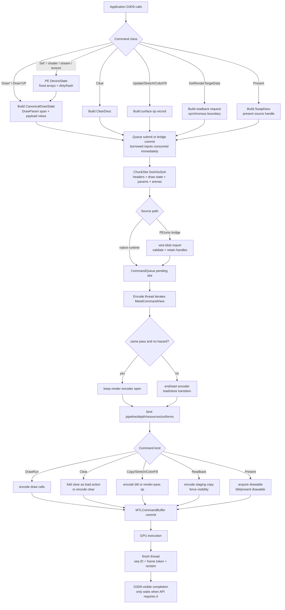

Render-flow invariants:

- `Set*` stays CPU-side and only affects later command records.
- Draw preparation may build canonical values, but queue storage owns flat records
  and spans before the API call returns.
- Clear, copy, stretch, readback, and present use the same queue ordering model as
  draw work unless the D3D9 API requires a synchronous result.
- The encoder is the first point that may make Metal render-pass decisions.
- Completion is reported through sequence IDs and frame tokens, not by exposing
  Metal objects to the PE side.

---

## 6. Concurrency Model

The concurrency model is producer/consumer with bounded queue ownership. The
application-visible thread records D3D9 work and hands it to Unix-owned storage.
Exactly one encode-execution provider then owns the source. Direct providers use
one fused Replay/encode worker; only the explicit parallel provider adds a
Replay-to-encode handoff and child workers. Metal/GPU and finish/completion work
remain asynchronous unless an explicit synchronization boundary applies.

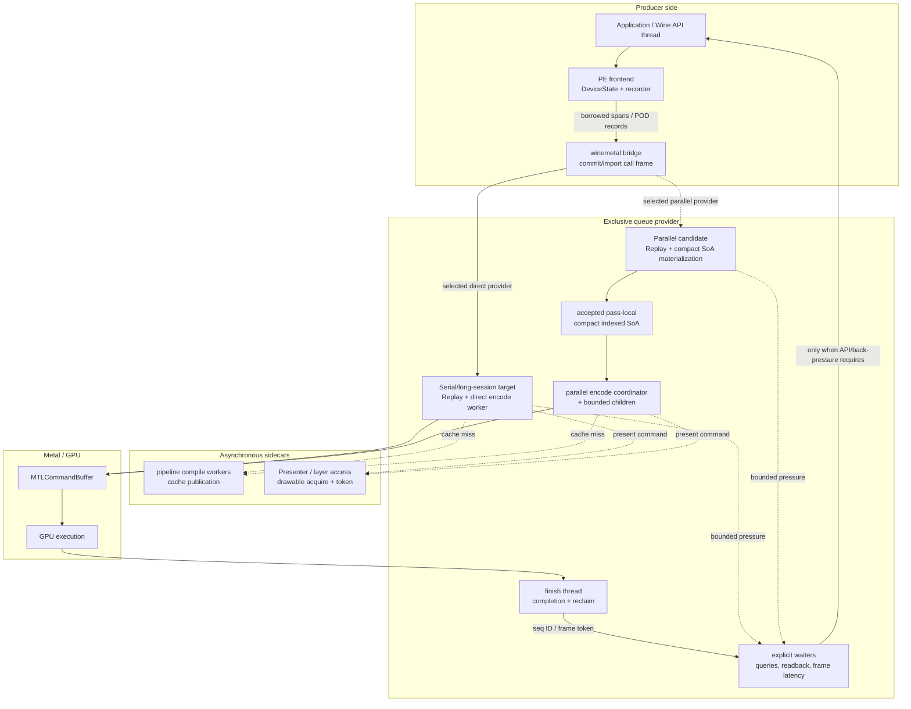

### 6.1 Agents And Ownership

| Agent | Owns | May run in parallel with | Must not do |
|---|---|---|---|
| Application / Wine API thread | D3D9-visible call order, PE validation, PE `DeviceState` mutation | Unix replay/encode worker, GPU execution of older chunks, finish thread | call Metal directly or keep backend-owned pointers |
| PE recorder / bridge call frame | POD chunk construction, local wire blob lifetime | prior GPU work, async pipeline compilation | expose PE COM pointers or borrowed stack spans after return |
| Commit synchronous half (app thread) | wire validation, unix-owned blob copy + wrapper retention, bulk resource marking, raw-queue push | worker replaying/encoding *older* chunks, GPU | hand off a record before validation and marking complete (`R-BACK-2.51(a)`) |
| Direct Replay/encode worker (device-owned) | FIFO Replay, transactional state projection, direct cursor, logical pass/session, Metal encoding, submission identity | application recording later chunks and GPU execution of older command buffers | publish a complete draw SoA to a downstream encode thread or reorder sources |
| Parallel Replay/materialization worker (experimental) | FIFO Replay, sealed-pass proof, compact indexed SoA construction | application recording later chunks and encode workers on accepted older passes | publish an unaccepted/incomplete pass or expanded per-draw state |
| Parallel encode coordinator (experimental) | accepted compact pass, Metal CB/parent encoder, child order/join, finalization and completion identities | application submission, Replay of later sources, GPU execution of older command buffers, partition workers | read PE state, mutate Replay persistent state, or delegate session-global state |
| CPU-ready store | bounded immutable source residency, admission, and publication watermarks | selected provider and GPU | infer Metal boundaries from publication or retain unbounded sources |
| Partition worker (optional) | immutable range, child/segment encoder, partition-local native binding shadow | coordinator and other partition workers after pass seal | mutate source storage, session-global hazards/actions, seqId/frame tokens, or completion lists (`R-ARCH-6.10`) |
| Pipeline compile workers | sidecar PSO compilation and cache publication | selected encode owner and GPU work | change D3D9 command order or mutate queue records |
| Metal/GPU | asynchronous execution of committed command buffers | CPU recording and encoding later work | signal D3D9-visible completion directly |
| Finish thread | completed sequence IDs, frame-token signaling, resource reclaim | application submission and selected encode owner | free resources before their last-use sequence completes |
| Presenter / layer access | drawable acquisition, layer property updates, present token relation | selected encode owner up to the point of drawable use | let PE code own `CAMetalLayer` or `CAMetalDrawable` |

### 6.2 Fire-And-Forget Taxonomy

| Operation class | Return point | Synchronization policy |
|---|---|---|
| `Set*` state mutation | PE state is updated | no queue or GPU wait |
| Ordinary `Draw*` / `Clear` | command data is copied/imported into queue-owned storage | fire-and-forget after queue ownership |
| Queued surface copy / stretch / color fill | command is queued and referenced resources are retained | fire-and-forget unless the API requires a visible result |
| `Present` | present command is accepted after any configured frame-latency gate | may wait for older present tokens, but not for the submitted present's GPU completion by default |
| `GetRenderTargetData` / synchronous readback | destination data is CPU-visible and complete | explicit GPU/queue drain boundary |
| Query `GetData` without flush | current completion waterline is inspected | no forced wait |
| Query `GetData` with `D3DGETDATA_FLUSH` | queued work needed for the query has been committed and eventually completed | explicit progress boundary; may spin/poll according to D3D9 contract |
| `WaitForVBlank` | vblank/presenter wait completes | explicit display synchronization boundary |
| reset/lost-device drain and shutdown | in-flight queue work has reached the required safe point | explicit lifecycle synchronization boundary |

Fire-and-forget means the API call no longer needs the caller's transient memory
or PE object pointers after it returns. It does not mean resources may be freed
immediately; queue retention and sequence IDs continue to own lifetime.

### 6.3 CPU/GPU Overlap Sequence

```mermaid
sequenceDiagram
    participant App as App / Wine thread
    participant D9 as PE D3D9
    participant CQ as CommandQueue
    participant Enc as Encode thread
    participant GPU as Metal / GPU
    participant Fin as Finish thread
    participant Wait as Explicit waiter

    App->>D9: Draw/Clear/Present calls for frame N
    D9->>CQ: commit or submit chunk N
    CQ-->>D9: ownership accepted
    D9-->>App: return to app

    par app records frame N+1
        App->>D9: more Set*/Draw* calls
    and queue encodes frame N
        CQ->>Enc: dequeue chunk N
        Enc->>GPU: commit command buffer N
    and GPU completes older work
        GPU-->>Fin: completion for chunk N-1
        Fin->>CQ: advance completedSeqId / frame token
    end

    opt readback, query flush, frame-latency, ring-full, or shutdown
        App->>Wait: request explicit synchronization
        Wait->>CQ: wait for seq/frame/free-slot condition
        CQ-->>Wait: condition satisfied or shutdown
        Wait-->>App: API returns visible result
    end
```

### 6.4 Ordering And Safety Rules

- D3D9 command order is preserved by queue order and sequence IDs, even when CPU,
  encode, GPU, and finish work overlap.
- Back-pressure is deterministic: ring slots, chunk limits, and frame-latency
  tokens bound how far the CPU can run ahead.
- A command buffer completion may advance `completedSeqId`; a present-bearing
  command buffer completion may additionally advance the present frame token.
- Resource destruction is deferred until `completedSeqId` reaches the last use of
  the resource.
- The presenter can block on drawable acquisition or layer synchronization, but
  that wait is accounted as present/WSI pacing, not general draw submission.
- Sidecar parallelism such as pipeline compilation must publish results through
  thread-safe caches and must not reorder already accepted D3D9 work.

### 6.5 Pacing Independence

The three progress signals — `completedSeqId`, `presentCompletedSeqId` (frame
token), and ring-slot occupancy — advance independently. The only ordering
invariant relating them is `presentCompletedSeqId ≤ completedSeqId`, which
ensures a present token never advances ahead of the underlying command buffer's
completion. Beyond that invariant, the three are decoupled.

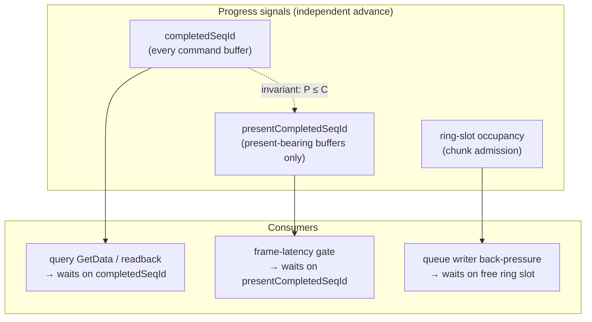

| Wait kind | Consumes | Must NOT block |
|---|---|---|
| `GetData(D3DGETDATA_FLUSH)` / `GetRenderTargetData` / readback drain | `completedSeqId` | present admission, present completion, frame-token advance |
| Frame-latency gate (`SetMaximumFrameLatency`) | `presentCompletedSeqId` | query resolution, readback completion, resource reclaim |
| Queue writer back-pressure | ring-slot occupancy | encode-thread or finish-thread progress on older slots |

Cross-axis blocking is a regression. Counters in §7 expose the spread between
the signals so that an unintended coupling (for example, a GPU stall in a
non-present command buffer that delays present-bearing completion) becomes
visible without wall-clock heuristics. Formal evidence: `QuerySeqId.tla` and
`PresentFrameLatency.tla` model the seqId and frame-token timelines as
separate variables sharing only the ordering invariant. The composite model
`ConcurrentProgressSignals.tla` (added 2026-05-09) directly proves the three
independence liveness properties — `NoQueryWaitBlocksPresent`,
`NoFrameLatencyBlocksQuery`, and `NoRingPressureBlocksPresentCompletion` —
under fairness on all six action families, with the `PacingOrdering`
invariant `presentCompletedSeqId ≤ completedSeqId` as the only relation
between the timelines.

---

## 7. Expected Performance Bottlenecks

The expected bottlenecks are workload-dependent. The architecture should identify
which stage dominates before changing data layout or synchronization policy.

> This section is the *taxonomy* — which stage can dominate, and what evidence
> settles it. For a stage-by-stage model of one real frame with the four views
> joined (sequence, state hand-off, thread concurrency, and measured per-stage
> cost), see [`docs/perfomance/frame-lifecycle.md`](../../docs/perfomance/frame-lifecycle.md).
> As of 2026-08-01 on 3DMark05 GT2 the largest owner is the encode thread. In a
> `41.10 ms` frame the encode thread is `~15.8 ms` (`~38%`, corrected for the
> `PerfScope` instrument family), the producer's D3D9 entry path is `9.14 ms`
> (`22.2%`), GPU is `1.90 ms` (`4.6%`), and the replay worker idles `25.77 ms`
> (`62.7%`) — no stage is saturated, so the frame is set by the serial
> produce → replay → encode → present chain. The earlier app-thread-saturated
> picture was superseded by the SWVP-probe removal in `83a0b085`, which cut the
> producer from `~41%` of the frame to `22%`; see
> [`docs/perfomance/state-churn-encode/state-churn-encode-append-decomposition.12.md`](../../docs/perfomance/state-churn-encode/state-churn-encode-append-decomposition.12.md).
> That is one workload, not a general verdict — GT1, GT3, and SFIV have
> different mixes.

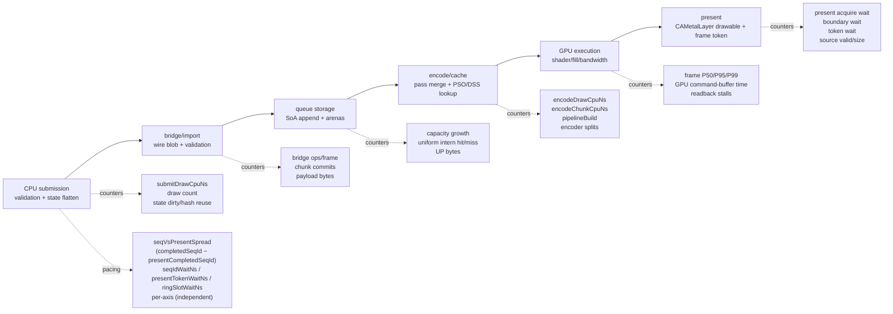

| Stage | Expected bottleneck when | Bound | Existing or required evidence | First response |
|---|---|---|---|---|
| PE validation and state flattening | many small draws or high `Set*` churn rebuild canonical state every draw | CPU | `submitDrawCpuNs`, draw count, state dirty/hash reuse counters | preserve fixed arrays and dirty masks; cache flat state slices before changing bridge shape |
| Wire blob build/import | bridge payload bytes or validation work grows with draw count instead of chunk count | CPU/boundary | bridge ops/frame, chunk commits, record count, payload bytes, import validation timing | keep chunk granularity; optimize direct section writes only after payload bytes dominate |
| Queue slot append | warm frames still grow vectors or copy large UP/uniform payloads per draw | CPU memory bandwidth | capacity-growth counters, UP bytes/frame, uniform intern hit/miss | reserve slot arrays, intern repeated uniform payloads, stage UP data through arenas |
| Queue mutex and ring pressure | writer waits or commit waits rise while GPU is not saturated | CPU/concurrency | queue writer wait, commit wait, slot occupancy, chunk count | adjust chunk flush policy and ring depth before adding new cross-thread paths |
| Encoder pass decisions | render-target changes, exact hazards, or clears split encoders too often | CPU/GPU | encoder split count, render-pass count, exact hazard/Bloom false-positive counters, encode chunk CPU time | keep exact hazard classification as the split source and fold clears/load actions |
| Pipeline/depth/shader cache | cold or state-alternating workloads rebuild PSO/DSS entries | CPU/stutter | `pipelineBuild`, cold/warm first-frame benchmark, cache hit/miss | stabilize flat keys, use `MTLBinaryArchive`, prewarm common variants |
| Resource upload/readback | texture streaming or readbacks force staging pressure or CPU waits | CPU/GPU sync | transient upload CPU time, sync wait, readback MB/s | use ring staging and batch copies; keep `GetRenderTargetData` as an explicit synchronous boundary |
| GPU shader/fill/bandwidth | command submission is cheap but GPU frame time dominates | GPU | GPU command-buffer time, frame P50/P95/P99, Metal capture | optimize render-pass merging, avoid redundant blits, then tune shader/format paths |
| Present/drawable pacing | frame token or drawable acquisition waits dominate frame time after present source is valid | display/WSI | present source valid/size, present acquire wait, boundary wait, token wait, pre-acquire hit/miss | tune drawable pre-acquire and frame-latency policy only after draw/hazard signals are clean |
| Pacing-axis coupling | a wait on one progress signal blocks progress on another beyond the `presentCompletedSeqId ≤ completedSeqId` invariant, or moves into CPU-ready admission/session/partition pressure | CPU/sync regression | `seqVsPresentSpread`, per-axis wait counters (`seqIdWaitNs`, `presentTokenWaitNs`, `ringSlotWaitNs`), CPU-ready/session/partition occupancy and waits, TLA+ liveness checks in `ConcurrentProgressSignals.tla` plus the planned admission-progress refinement | trace the offending waiter; restore independent advance per `R-ARCH-6.8`–`6.11` before tuning queue depths or frame-latency policy |

The highest-risk architecture regressions are still CPU-side: per-call bridge
fallback, per-draw heap growth after warm-up, and rebuilding large state payloads
instead of using flat hashes, handles, and interned slot-local storage. GPU-bound
workloads should be treated separately; changing the PE/unix boundary will not
fix shader, fill-rate, or drawable pacing limits.

---

## 8. Wire Blob Sequence

The PE/unix boundary uses a contiguous wire blob so the bridge can validate and
import command batches with one ABI call.

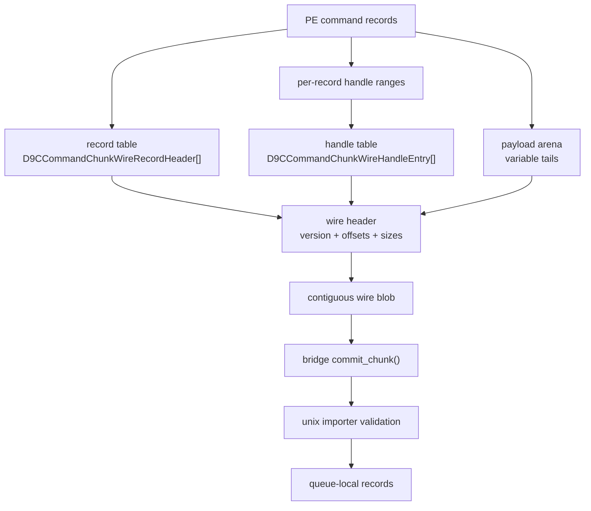

Wire design rules:

- The blob layout is header, record table, handle table, payload arena.
- Record payloads are addressed by offset/size into the payload arena.
- Handle references are addressed by first/count into the handle table.
- Reserved fields are zero on produce and validated as zero on import.
- Final blob copies are acceptable at the C ABI boundary. They become a
  benchmark-driven optimization only if bridge payload bytes dominate CPU time.

---

## 9. CPU-Bound Versus GPU-Bound Signals

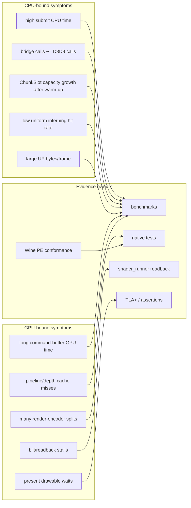

Architecture regressions are not limited to incorrect pixels. A rendering-correct
change can still fail if it regresses to per-call bridge submission, reintroduces
hot-path heap churn, or breaks DXMT-style queue ownership.

---

## 10. Reference And License Flow

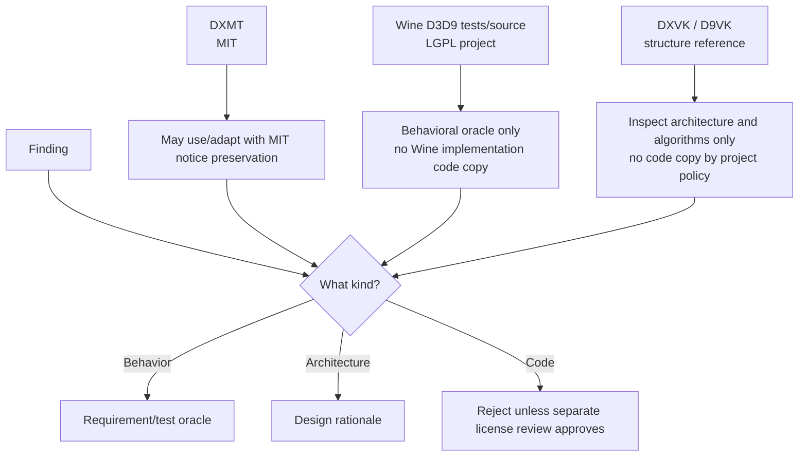

The license policy is conservative by design:

- MIT-compatible project code may incorporate DXMT MIT material with notices.
- Wine-oracle behavior is acceptable as an oracle; Wine implementation structure
  is not an architecture requirement.
- DXVK/D9VK are useful references for structure and tradeoffs, but dxmt9 does
  not copy their code.
- Any external artifact that becomes a committed test/corpus/fixture needs
  provenance metadata.

---

## 11. Verification Mapping

| Requirement area | Evidence |
|---|---|
| `R-ARCH-1.*` DXMT ownership | `specs/backend/spec.md`, command queue tests, import tests, gap row for merge readiness |
| `R-ARCH-2.*` DOD layout | `dxmt9-state-draw-transform-spec`, chunk/import specs, backend key/pipeline specs |
| `R-ARCH-3.*` boundaries | `dxmt9-chunk-record-validation-spec`, `dxmt9-chunk-record-replay-spec`, `dxmt9-resource-hazard-spec`, TLA+ queue/resource models |
| `R-ARCH-4.*` provenance | specs review, conformance manifest provenance, license review before imports |
| `R-ARCH-5.*` verification | `specs/verification/`, `specs/tests/`, `specs/benchmarks/`, `specs/archicture/gap.md` |
| `R-ARCH-6.*` concurrency | `CommandQueue.tla`, `QueueLifecycleRefinement.tla`, `PresentFrameLatency.tla`, `ResourceLifetime.tla`, `EncoderLifecycle.tla` (exact handle sets + Bloom-as-diagnostic-only invariants), `QuerySeqId.tla`, `ConcurrentProgressSignals.tla` (three-axis pacing independence), planned CPU-ready/session admission and parallel-join refinements, queue observer tests, wait/perf counters |
| `R-ARCH-7.*` minimal-copy and ownership refinement | copy/materialization ledger, PE wire and queue destination transactions, legacy/direct differential fixtures, pipeline-stage queue observer, `specs/verification/` formal refinements, GPU/Wine/wild promotion evidence |

Current known partial evidence remains tracked in `specs/archicture/gap.md`, especially the
DOD / DXMT ownership acceptance row.
