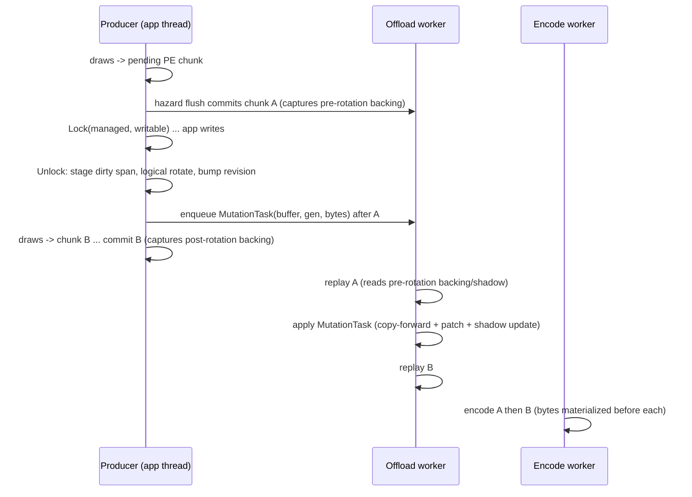

# Managed Buffer Mutation Offload — Design

Design for R-BACK-44.1..44.11 (`requirements.md`). The V1 transport is
implemented and default on; mutation composition is observer-first. The bounded
observer is installed only by the explicit diagnostic gate and records the
production Unlock, replay-use, CPU-read, barrier, completion, and Present-window
edges. It reports the decision gate but never performs composition; the separate
R-BACK-44.11 proof/promotion stack remains forbidden — see `gap.md`.

## 1. Problem shape

Before V1, a Managed-pool writable unlock ran entirely on the producer thread
inside the `dxmt9c_buffer_unlock` bridge crossing: drain the replay ledger
(R-BACK-2.51(d)), rotate the rename ring, and copy the full buffer twice
(`Pool::uploadBufferData` → `record.shadow` + `record.contents`). Measured
on GT2 (#237): `1,223` calls, `8.93GB` uploaded from partial locks,
`2,157ms/run` = `1.19ms/present` at `1.76ms/call` — the largest single
owner of the producer thread's bridge residence, on the thread that is the
workload's only saturated stage while the offload worker idles ~43%.

The split this design makes: everything a later synchronous observer can
see (backing identity, content revision, ledger publication) stays
synchronous; everything that is only byte motion (copy-forward + dirty
patch + shadow update) moves to the offload worker at the mutation's exact
FIFO position.

## 2. Why the content each draw sees is unchanged

Three existing invariants carry the proof:

1. **Capture is a value snapshot.** `Pool::captureChunkBufferBinding`
   freezes the active backing's Metal handle, contents address, byte size,
   and `contentRevision` at commit time; the draw encoder reads only the
   captured snapshot for versioned records (`dxmt9_draw_encoder_draw.mm`,
   stream/index snapshot resolution), never re-deriving from the live
   record. A later rotation cannot retarget an already-captured draw.
2. **Pre-mutation draws are sealed before the mutation.** The PE-side
   buffer hazard flush (`bufferLockRequiresHazardFlush`,
   `FlushPeRecorderForBufferHazardForChild`) commits any pending chunk
   that references the buffer before a Managed writable lock proceeds, so
   every draw recorded before the lock captures the pre-rotation backing
   before the unlock can rotate. Rotation preserves prior ring backings;
   the mutation writes only the newly selected backing.
3. **Post-mutation consumers are ordered, not synchronized — for replay.**
   Placing the mutation task at its producer-order FIFO position means
   every later chunk's replay runs after the bytes are applied. Encode is
   NOT covered by this order: encode of an *earlier* chunk may run after a
   *later* mutation applies, so R-BACK-44.4a requires every encode-side
   byte consumer of a versioned record to be snapshot-sourced (or keyed by
   captured backing + `contentRevision`) as a prerequisite. The encode
   index staging path violated this at design time (missing
   `!indexSnapshot` guard; a pre-existing latent race against the synchronous
   unlock as well, since the R-BACK-2.51(d) drain waits on
   `lastReplayedSeq` only). The snapshot-presence prerequisite is implemented
   and tracked in `gap.md`.

The one consumer class outside that order is direct unix calls that read
live record bytes (shared-buffer export today; any future readback). They
already fence through the resource-scoped replay ledger; publishing
mutation tasks to the same per-buffer `ReplayDrainTarget` extends the
existing wait to cover them (R-BACK-44.5).

## 3. Actors and ownership

| Actor | Role in this design |
|---|---|
| Producer thread (app, in `dxmt9c_buffer_unlock`) | Stage dirty span, logical rotation under buffer arena unique lock, FIFO enqueue + ledger publish. No byte materialization, no drain wait for the Managed offload case. |
| Offload worker (`ReplayOffloadQueue` drain loop) | Applies mutation tasks in FIFO order between chunk replays: copy-forward from pool shadow, dirty patch, shadow update. Fail-stop on application failure. |
| Encode worker | Unchanged. Reads captured snapshots and live shadow bytes only for chunks the worker has already replayed. |
| Direct-call readers (export/alias, future readback) | Wait on the buffer's `ReplayDrainTarget` covering both chunks and mutation tasks. |

State ownership under the R-BACK-43.5 taxonomy:

| State | Class | Note |
|---|---|---|
| Staged dirty bytes + backing lease | `worker-owned` after commit (`owner-published` at handoff) | Immutable once staged; charged against the offload queue byte bounds; the task leases the concrete ring entry (handle, pointer, generation, replay residency) and the worker applies to the leased entry, never to the then-current active backing. Freed/released by the worker after application or terminal discard. |
| `BufferRecord.buffer` / `renameActiveIndex` / `contentRevision` | `arena-protected` (unchanged) | Rotated synchronously at unlock; captured synchronously at commit. |
| `BufferRecord.shadow` / rotated backing `contents` bytes | `arena-protected`, with the new rule that in offload mode only the worker (in FIFO order) or a fenced direct call may read them for post-mutation ordinals | The reclassification R-BACK-44.6 must pin. |
| `ReplayDrainTarget.lastQueuedSeq` | `queue-shared` (unchanged) | Publication extended to mutation tasks. |

## 4. Ordering protocol



FIFO transport is one `ReplayOffloadQueue` carrying `ReplayQueueItem` values
for chunks, buffer mutations, and reservation placeholders. The worker loop
dispatches each committed alternative in queue order. There is no second queue;
that one queue is the ordering authority.

Admission is the reserve/commit transaction from R-BACK-44.2. Reserve fixes the
FIFO ordinal and charges the byte budget with no visible effect; commit is
infallible; release covers every reject/stop path. Rotation runs strictly
between reserve and commit. This prevents a concurrent producer's chunk from
overtaking the mutation and prevents a visible rotation with no committed task.

## 5. Failure behavior

- Staging or reservation failure at unlock: retryable pre-effect
  rejection (R-BACK-44.2); no rotation, no revision bump, no enqueue, and
  no lock-state clearing on any layer (PE `lastLock*`, wow64 shadow lock,
  core lock metadata are cleared only after the commit step), so a retry
  re-enters a consistent transaction.
- Worker application failure: fail-stop under the existing offload poison
  discipline; the producer observes it on its next fenced call, matching
  chunk-replay failure semantics.
- Reset/destroy/device-lost: pending mutations for a resource are applied
  or discarded in FIFO order before backing release (R-BACK-44.7);
  destroy already rides the completion watermark
  (`NoBackingFreedInFlight`), which the model extension must preserve.

## 6. Verification mapping

| Contract | Evidence (planned) |
|---|---|
| Ordering + visibility (R-BACK-44.3/44.4) | New `BufferMutationOffload.tla` (production cfg) modeling producer rotate/enqueue, worker apply, commit capture, encode read; invariant: an encode-side byte read at ordinal `k` observes every mutation with ordinal `< k` applied, and every captured snapshot's revision equals the record revision at its commit. |
| Counterexample obligation (R-BACK-44.6 via R-BACK-43.6) | `.counterexample.cfg` removing the FIFO-position premise (worker may apply the mutation after a later chunk's replay) must violate the visibility invariant; a second cfg deferring the logical rotation to the worker must violate the snapshot-revision invariant. |
| Reuse-safety of synchronous rotation | Existing `BufferBackingVersioning.tla` (R-BACK-5.11) — selection logic unchanged; the extension must not weaken `NoUploadOverwriteInFlight` / `NoBackingFreedInFlight`. |
| Model-to-code binding | Shared pure predicates header covers mutation admission, FIFO position, and direct-reader fences. `classifyComposition` is consumed by the observer and native cases; the mutation-composition generator supplies vocabulary only, while `MutationComposition.tla` retains an explicit bounded relation and documents that semantic duplication. |
| Bridge classification | `specs/backend/producer-concurrency/spec.md` classification block row for `dxmt9c_buffer_unlock` updated with the mode-conditional class; `audit_bridge_entry_classification.py` stays green. |
| Runtime mechanism proof | New counters: mutation tasks enqueued/applied, staged bytes, apply CPU on worker, producer unlock CPU delta; existing `d3d9_buffer_unlock_*` family shows the synchronous half shrinking. |
| Wild gates | R-BACK-44.8: conformance, GT1/GT3/SFIV visual anchors, GT2 matched A/B (producer wall, FPS, zero GPU errors, locality). |

## 7. Explicitly out of scope (V1)

- Mutation coalescing, dead-mutation elision, DISCARD-chain kills — the
  `.38` composition algebra; V1 is transport-only, one task per unlock.
- Default-pool dynamic buffers (rename-DISCARD/NOOVERWRITE already cheap
  and fence-bypassed), non-versioned buffers, textures/surfaces.
- Managed locks carrying `DISCARD` or `NOOVERWRITE` flags (excluded by
  R-BACK-44.1 after the 2026-08-25 review: the hazard seal skips
  `NOOVERWRITE` and `DISCARD` zero-fills beyond the staged span).
- Reducing rotation frequency or backing count for Managed buffers.
- Any change to read locks, `storage_` ownership, or PE-side hazard
  flushes.

## 8. Observer-first composition decision

The V1 task is the semantic baseline: one accepted Unlock, one ordered task,
one exact backing generation, one application. The completed observer shadows
that stream without changing it, keys events by the same resource identity,
backing generation, revision, FIFO ordinal, and captured-use identity used by
production, and classifies only adjacent candidates for which every known
barrier is absent. It also records first CPU/GPU use, non-plain dispositions,
pending/failed/discarded completion, overflow, reset, and teardown evidence.

Observer output is a decision record, not a composition plan. Completion rows
are reported with `pending`, terminal counts, and separate provisional versus
final rejection totals; the final view is rebuilt after the Present boundary
so a transient Pending rejection cannot survive as a final semantic rejection:

```text
(workload, mutation class,
 candidate calls, candidate bytes, candidate CPU time per Present,
 zero-use generations, mergeable union/overlap bytes,
 provisional/final rejection counts, completion/disposition counts,
 Render Tape identity, disabled-path audit result)
```

The decision is fixed by R-BACK-44.10: `>=0.5ms/Present` opens a separate
design; `<0.2ms/Present` closes the lane; the middle band gathers evidence but
authorizes no code. The source experiment is
`docs/perfomance/state-churn-encode/state-churn-encode-append-decomposition.38.md`.
The observer must not count time already attributed to bridge residence,
queueing, or a non-composable mutation class.

Current decision: composition is forbidden. The formal/native classifier truth
table passes and the observer emits the economic classification, but the prior
GT2 zero-candidate report is unreliable: synchronous observations used a
private CPU counter while deferred/replay observations used `replaySeq`, so
valid mixed-path adjacency could be rejected by `SourceOrder`. The observer now
assigns a shared typed, generation-qualified ordering identity at ingress;
mixed sync↔deferred witnesses cover both directions. No matched Render
Tape/runtime bundle has yet supplied the separate semantic proof, GPU/Wine
oracle, and repeatable economic result required by R-BACK-44.11; therefore this
implementation performs no composition or fusion and the economic gate must be
remeasured.

If the lane opens, the new design must explicitly model the mutation algebra
and barriers from R-BACK-44.11. In particular, chunk adjacency alone is not an
observer boundary proof, and last-writer-wins bytes do not prove that an older
generation was unused. Render Tape `ResourceMutation` events provide the
effective replay oracle; formal and native evidence must bind the exact
latest-preceding generation and failure disposition before GPU/Wine/wild
promotion. No speculative merge, upload elision, delayed success, default
change, or modification of the current V1 queue is part of this observer wave.
