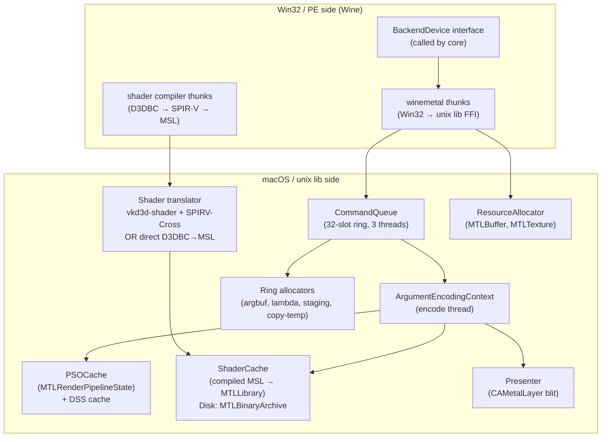
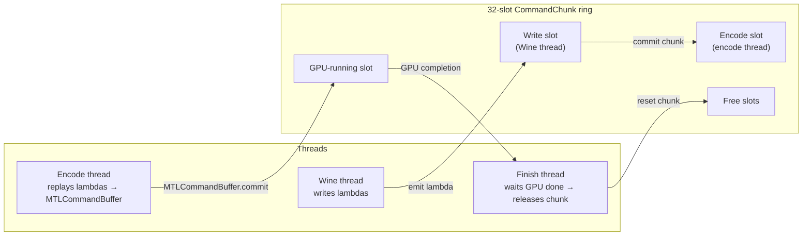
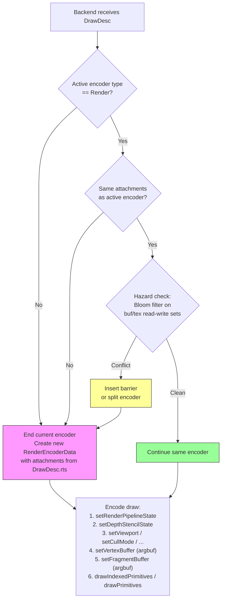
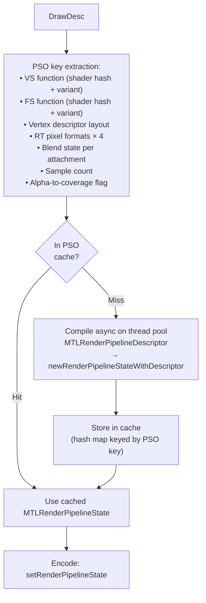
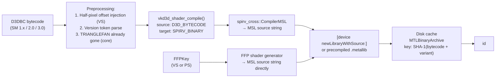
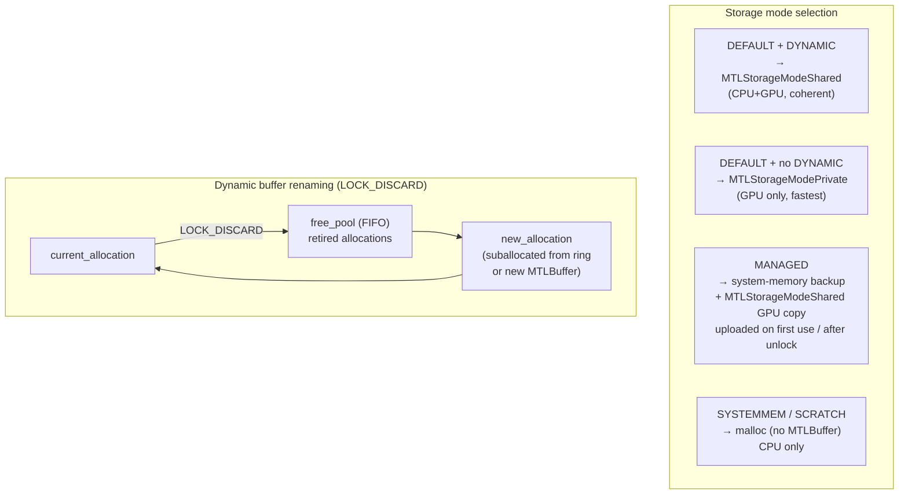
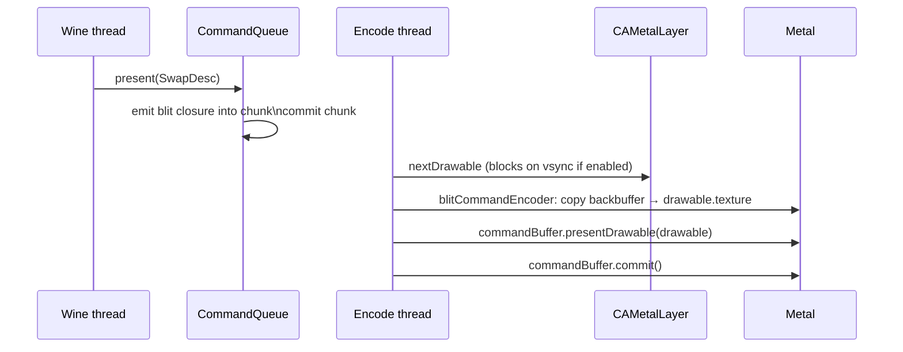

# Backend Design

---

## 1. Module Structure



---

## 2. Command Queue

The command queue is the central coordinator. It decouples the Wine thread (which
calls the backend interface) from Metal encoding (which calls Metal API).



**CommandChunk** holds:
- A linked list of closures (lambdas) emitted by the Wine thread
- Four ring sub-allocators: `staging` (CPU-visible readback), `copy_temp` (GPU private
  blit), `argbuf` (argument buffers), `lambda_store` (closure heap)
- A sequence ID used to determine when in-flight resources can be released

**Submission flow:**

1. Wine thread calls `submitDraw(DrawDesc)`.
2. Backend emits a closure into the current chunk's lambda list. The closure captures
   resource handles (not COM pointers) and all state from `DrawDesc`.
3. On `present()` or when the chunk is full, the Wine thread commits the current chunk.
4. The encode thread dequeues the chunk and replays all closures against
   `ArgumentEncodingContext`, producing Metal commands.
5. The encode thread commits the `MTLCommandBuffer`.
6. The finish thread waits for GPU completion and resets the chunk (releasing handles,
   returning ring allocator memory).

---

## 3. Encoder Lifecycle



**Clear folding:** A `ClearDesc` received before any draw on a given render target is
stored as deferred. When the first draw opens a render pass for those attachments, the
deferred clear is applied as `MTLLoadActionClear` rather than opening a separate pass.

**Encoder types:** Three encoder kinds may be active during a frame:
- `RenderEncoderData` — for draw calls
- `BlitEncoderData` — for `UpdateSurface`, `UpdateTexture`, `StretchRect`, mipmap gen
- `ComputeEncoderData` — reserved for future compute-based features (triangle fan
  expansion, point sprite expansion)

Only one encoder may be active at a time. Switching kind requires `endEncoding`.

---

## 4. Argument Buffer Binding

All shader resources for a draw call are packed into a single GPU-side argument
buffer. The shader accesses all inputs through this one buffer pointer.

```
Argument Buffer layout (per draw):
┌────────────────────────────────────┐
│ Vertex buffer slots                │  {gpu_address, stride, size}[] × 16
│ VS constant buffer (256 × float4)  │  or gpu_address if >4 KB
│ PS constant buffer (224 × float4)  │
│ VS samplers                        │  handle[] × 16
│ PS samplers                        │  handle[] × 16
│ VS textures                        │  handle[] × 16
│ PS textures                        │  handle[] × 16
└────────────────────────────────────┘
```

The argument buffer is suballocated from the `argbuf` ring allocator per draw call.
The Metal encoder receives one `setVertexBufferOffset` / `setFragmentBufferOffset`
call pointing to the base of this buffer.

---

## 5. PSO Cache



The PSO cache is an in-memory hash map (key → `MTLRenderPipelineState`). It is
populated on first use. Cache entries are never evicted during a session (PSO count
is bounded by the state space of real D3D9 applications).

The `MTLDepthStencilState` cache is separate and keyed by the DSS key (depth +
stencil compare/write state). DSS creation is cheap; the cache prevents redundant
object allocation.

---

## 6. Shader Translation



**Shader variant keys** for programmable shaders:
- Vertex: (bytecode_hash, input_layout_hash, rasterization_disabled)
- Pixel: (bytecode_hash, alpha_test_enable, alpha_test_func, fog_mode, clip_planes_mask)

Two draws with the same bytecode but different variant keys require separate
compiled `MTLFunction` objects.

---

## 7. Resource Allocation Model



**Texture upload path (MANAGED / SYSTEMMEM → GPU):**
1. Application `Lock()`s the texture surface and writes pixel data.
2. `Unlock()` marks the surface dirty.
3. On first draw that samples the texture, a blit encoder copies the dirty region
   from the CPU-accessible buffer to the private `MTLTexture`.
4. The blit is fenced so the render encoder that follows reads the updated data.

---

## 8. Presentation



The back buffer is a private `MTLTexture` owned by the swap chain. On present, it
is copied to the `CAMetalLayer` drawable via a blit encoder. The drawable is obtained
just before the blit — not before the frame — to minimize latency.

---

## 9. Dependency Tracking

Consecutive encoders may have data dependencies. The backend tracks resource access
per encoder using partitioned Bloom filters on buffer and texture handles.

For each encoder transition, the backend checks:
- `new_read ∩ prev_write` — read-after-write: must synchronize
- `new_write ∩ prev_write` — write-after-write: must synchronize
- `new_write ∩ prev_read` — write-after-read: must synchronize

If the filter indicates a possible conflict (Bloom may have false positives), a Metal
resource barrier or encoder split is emitted. False positives result in unnecessary
barriers (safe); false negatives are prevented by the over-approximation property of
the Bloom filter.

---

## 10. Fixed-Function Lighting Constants Layout

The fixed-function vertex shader receives a uniform buffer with this layout:

```
FFPVertexUniforms {
    float4x4  worldViewMatrix       // D3DTS_WORLD × D3DTS_VIEW
    float4x4  projMatrix            // D3DTS_PROJECTION
    float3x3  normalMatrix          // inverse transpose of worldViewMatrix upper 3×3
    float4x4  textureMatrix[8]      // D3DTS_TEXTURE0–7
    float2    invViewportSize       // (1/width, 1/height) for half-pixel fixup

    struct Light {
        float4  diffuse
        float4  specular
        float4  ambient
        float4  position_vs         // in view space
        float4  direction_vs        // in view space, normalized
        float   atten0, atten1, atten2
        float   range
        float   theta, phi, falloff // spot params
    } lights[8]

    float4    globalAmbient
    float4    materialDiffuse
    float4    materialAmbient
    float4    materialSpecular
    float4    materialEmissive
    float     materialSpecularPower

    float4    fogColor
    float     fogStart, fogEnd, fogDensity
}
```
