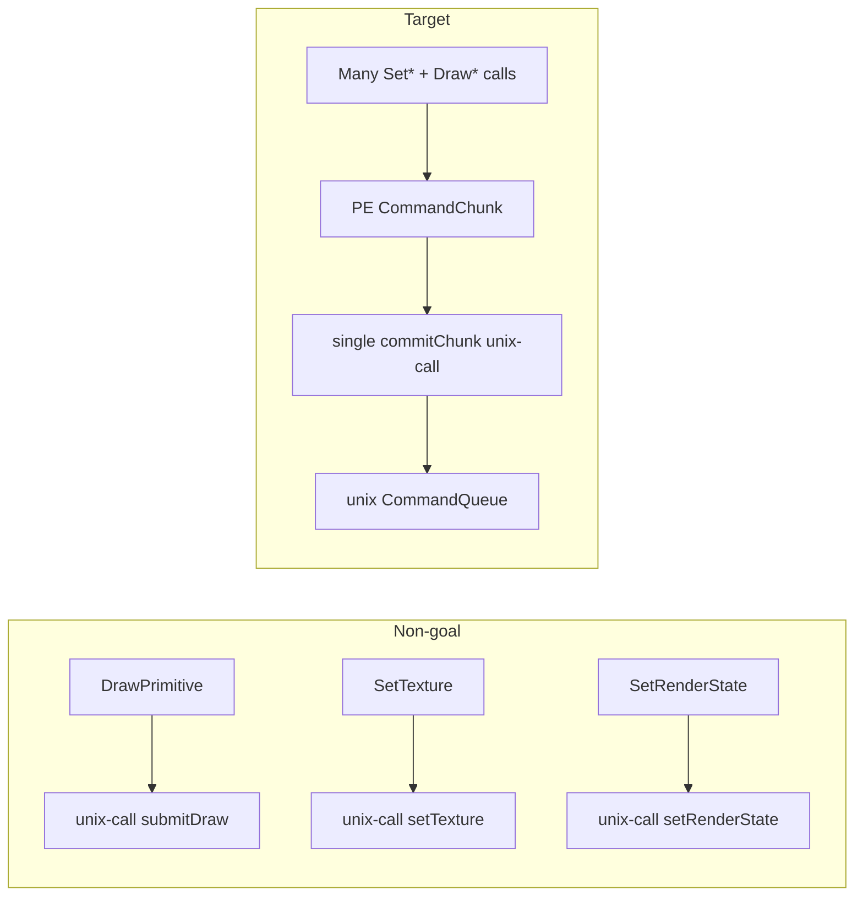
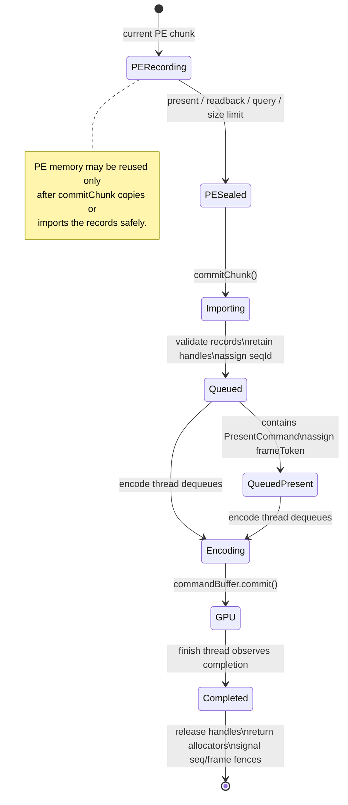
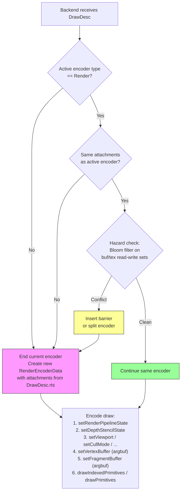
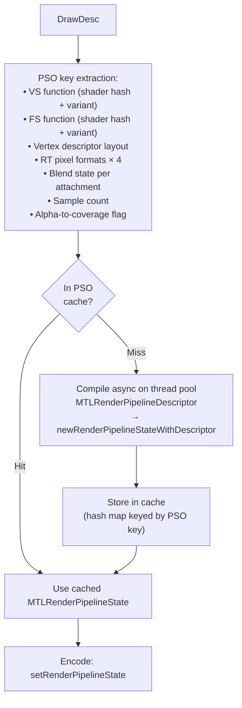
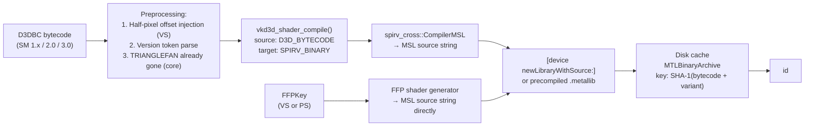
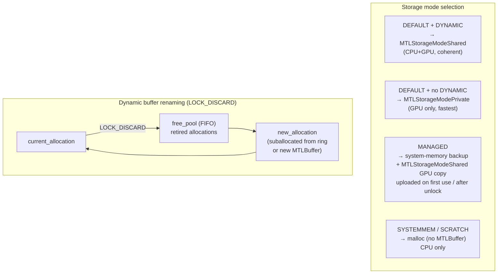
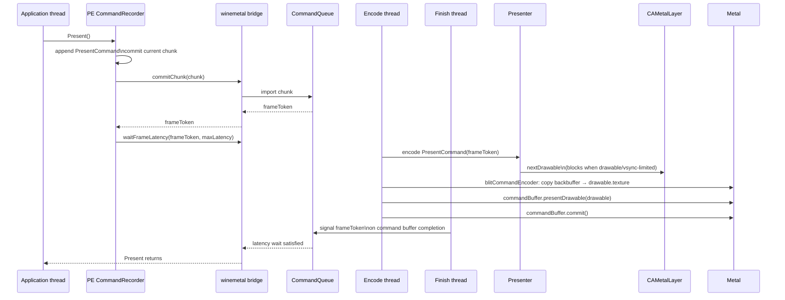
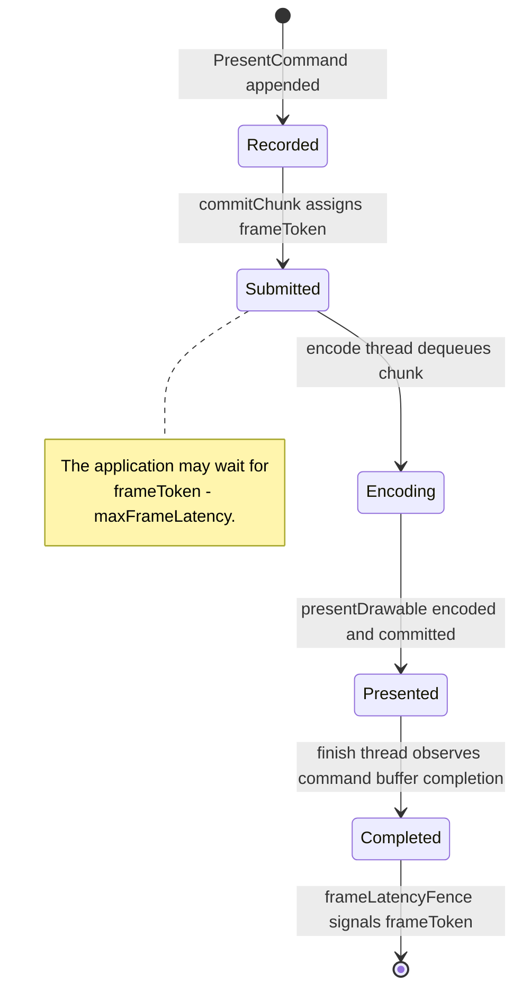

# Backend Design

---

## 1. Module Structure


### 1.1 Upstream DXMT Alignment Target

The backend target mirrors upstream DXMT's useful split: API calls record command
work first, and Metal execution happens later on queue-owned encode/completion
threads. dxmt9 differs only in the bridge payload format: D3D9 uses POD records
instead of C++ lambda captures because records cross the Wine PE/unix boundary.

```mermaid
flowchart TD
    subgraph DXMT["Upstream DXMT D3D11 shape"]
        DXCtx["D3D11 immediate context\nEmitST / EmitOP"]
        DXChunk["CommandChunk\nlambda command list"]
        DXQueue["CommandQueue\nencode + finish threads"]
        DXMetal["Metal wrapper calls"]
        DXCtx --> DXChunk --> DXQueue --> DXMetal
    end

    subgraph DXMT9["dxmt9 target shape"]
        D9Dev["D3D9 PE device\nDeviceState shadow"]
        D9Chunk["PE CommandChunk\nPOD records + handles"]
        D9Bridge["winemetal commitChunk()\none unix call"]
        D9Import["unix importer\nvalidate + retain"]
        D9Queue["CommandQueue\nencode + finish threads"]
        D9Metal["Metal wrapper calls"]
        D9Dev --> D9Chunk --> D9Bridge --> D9Import --> D9Queue --> D9Metal
    end

    subgraph NonGoal["Non-goal"]
        SetCall["SetRenderState / SetTexture"] --> PerCall["per-call unix submit"]
        DrawCall["DrawPrimitive"] --> PerCall
    end
```



The alignment requirement is about ownership and timing, not source-level identity:

- PE owns D3D API semantics, state shadowing, getters, state blocks, and command
  packet construction.
- The Wine bridge owns ABI marshalling only.
- The unix importer owns packet validation and handle retention.
- `CommandQueue` owns chunk execution, Metal command-buffer lifetime, completion,
  and frame-latency token signaling.
- `Presenter` owns drawable acquisition and `presentDrawable` encoding.

---

## 2. Command Queue

The command queue is the central coordinator. It decouples PE-side D3D9 command
recording from unix-side Metal encoding.

There are two chunk forms:

- **PE CommandChunk:** a POD command stream produced by the core without calling
  Metal or ObjC APIs.
- **Execution chunk:** the unix-side queue slot that owns retained handles,
  imported records, transient allocator ranges, and the eventual Metal command
  buffer.


**PE CommandChunk** holds:
- A compact command header array and POD payload arena
- Opaque backend handles for buffers, textures, shaders, swap chains, and queries
- No COM pointers, ObjC pointers, unix-side object pointers, or lambdas
- Command-count and byte-size fields used to bound tail latency

**Execution chunk** holds:
- Imported command records or decoded closures owned by the unix side
- Four ring sub-allocators: `staging` (CPU-visible readback), `copy_temp` (GPU private
  blit), `argbuf` (argument buffers), `lambda_store` (closure heap)
- A sequence ID used to determine when in-flight resources can be released
- Optional frame token metadata when the chunk contains a present

**Submission flow:**

1. D3D9 calls update PE-side state or append records to the current PE chunk.
2. On `Present`, readback, query ordering, resource hazard, or chunk limit, the core
   commits the PE chunk through `commitChunk()`.
3. The unix importer validates the records, retains referenced backend handles, and
   assigns a sequence ID. If the chunk contains a present, it also assigns a frame
   token.
4. The encode thread dequeues the execution chunk and replays records against
   `ArgumentEncodingContext`, producing Metal commands.
5. The encode thread commits the `MTLCommandBuffer`.
6. The finish thread waits for GPU completion, signals sequence/frame fences, releases
   handles, and returns ring allocator memory.

### 2.1 Bridge Granularity Target



The backend may keep narrow per-operation entry points for tests or bootstrap, but
the default Wine runtime path is chunk submission. A design that sends every D3D9
draw/state call through `WINE_UNIX_CALL` is non-compliant with this performance
target.

### 2.2 Chunk Lifecycle and Ownership



Ownership rules:

- The PE chunk owns its POD payload until `commitChunk()` returns.
- The importer must copy or take ownership of every record and retained handle needed
  after `commitChunk()` returns.
- Execution chunks own backend handle references until completion.
- Frame tokens exist only for chunks containing a present command.
- Sequence IDs track all chunk completion; frame tokens track present-bearing chunk
  completion.

---

## 3. Encoder Lifecycle



**Clear folding:** A `ClearDesc` received before any draw on a given render target is
stored as deferred. When the first draw opens a render pass for those attachments, the
deferred clear is applied as `MTLLoadActionClear` rather than opening a separate pass.

**Encoder types:** Three encoder kinds may be active during a frame:
- `RenderEncoderData` — for draw calls
- `BlitEncoderData` — for `UpdateSurface`, `UpdateTexture`, `StretchRect`, mipmap gen
- `ComputeEncoderData` — reserved for future compute-based features (triangle fan
  expansion, point sprite expansion)

Only one encoder may be active at a time. Switching kind requires `endEncoding`.

---

## 4. Argument Buffer Binding

All shader resources for a draw call are packed into a single GPU-side argument
buffer. The shader accesses all inputs through this one buffer pointer.

```
Argument Buffer layout (per draw):
┌────────────────────────────────────┐
│ Vertex buffer slots                │  {gpu_address, stride, size}[] × 16
│ VS constant buffer (256 × float4)  │  or gpu_address if >4 KB
│ PS constant buffer (224 × float4)  │
│ VS samplers                        │  handle[] × 16
│ PS samplers                        │  handle[] × 16
│ VS textures                        │  handle[] × 16
│ PS textures                        │  handle[] × 16
└────────────────────────────────────┘
```

The argument buffer is suballocated from the `argbuf` ring allocator per draw call.
The Metal encoder receives one `setVertexBufferOffset` / `setFragmentBufferOffset`
call pointing to the base of this buffer.

---

## 5. PSO Cache



The PSO cache is an in-memory hash map (key → `MTLRenderPipelineState`). It is
populated on first use. Cache entries are never evicted during a session (PSO count
is bounded by the state space of real D3D9 applications).

The `MTLDepthStencilState` cache is separate and keyed by the DSS key (depth +
stencil compare/write state). DSS creation is cheap; the cache prevents redundant
object allocation.

---

## 6. Shader Translation



**Shader variant keys** for programmable shaders:
- Vertex: (bytecode_hash, input_layout_hash, rasterization_disabled)
- Pixel: (bytecode_hash, alpha_test_enable, alpha_test_func, fog_mode, clip_planes_mask)

Two draws with the same bytecode but different variant keys require separate
compiled `MTLFunction` objects.

---

## 7. Resource Allocation Model



**Texture upload path (MANAGED / SYSTEMMEM → GPU):**
1. Application `Lock()`s the texture surface and writes pixel data.
2. `Unlock()` marks the surface dirty.
3. On first draw that samples the texture, a blit encoder copies the dirty region
   from the CPU-accessible buffer to the private `MTLTexture`.
4. The blit is fenced so the render encoder that follows reads the updated data.

---

## 8. Presentation



The back buffer is a private `MTLTexture` owned by the swap chain. On present, it
is copied to the `CAMetalLayer` drawable via a blit encoder. The drawable is obtained
just before the blit — not before the frame — to minimize latency.

### 8.1 Frame Latency Token

Present pacing is based on a queue-owned frame token:



The token is not the chunk dequeue ID and not the point where the encode thread starts
work. It becomes signaled only after the Metal command buffer carrying the present has
completed. This mirrors the useful part of upstream DXMT's `CommandQueue` frame
latency fence while keeping drawable and layer ownership inside the presenter.

---

## 9. Dependency Tracking

Consecutive encoders may have data dependencies. The backend tracks resource access
per encoder using partitioned Bloom filters on buffer and texture handles.

For each encoder transition, the backend checks:
- `new_read ∩ prev_write` — read-after-write: must synchronize
- `new_write ∩ prev_write` — write-after-write: must synchronize
- `new_write ∩ prev_read` — write-after-read: must synchronize

If the filter indicates a possible conflict (Bloom may have false positives), a Metal
resource barrier or encoder split is emitted. False positives result in unnecessary
barriers (safe); false negatives are prevented by the over-approximation property of
the Bloom filter.

---

## 10. Fixed-Function Lighting Constants Layout

The fixed-function vertex shader receives a uniform buffer with this layout:

```
FFPVertexUniforms {
    float4x4  worldViewMatrix       // D3DTS_WORLD × D3DTS_VIEW
    float4x4  projMatrix            // D3DTS_PROJECTION
    float3x3  normalMatrix          // inverse transpose of worldViewMatrix upper 3×3
    float4x4  textureMatrix[8]      // D3DTS_TEXTURE0–7
    float2    invViewportSize       // (1/width, 1/height) for half-pixel fixup

    struct Light {
        float4  diffuse
        float4  specular
        float4  ambient
        float4  position_vs         // in view space
        float4  direction_vs        // in view space, normalized
        float   atten0, atten1, atten2
        float   range
        float   theta, phi, falloff // spot params
    } lights[8]

    float4    globalAmbient
    float4    materialDiffuse
    float4    materialAmbient
    float4    materialSpecular
    float4    materialEmissive
    float     materialSpecularPower

    float4    fogColor
    float     fogStart, fogEnd, fogDensity
}
```

---

## 11. Clip Plane Design

D3D9 supports up to 6 user clip planes (`D3DRS_CLIPPLANEENABLE` bitmask,
`SetClipPlane(index, float[4])`). Metal surfaces these as vertex shader
`[[clip_distance]]` outputs.

### Uniform layout

Clip planes are stored in the fixed-function uniform buffer and also injected into
the programmable shader constant block:

```
// Appended to FFPVertexUniforms when any clip plane is enabled:
float4  clipPlane[6]   // in clip space (post-projection)
```

D3D9 clip planes are specified in world space. The core must transform them to
clip space before passing to the backend:

```
clipPlane_clip[i] = transpose(inverse(worldViewProj)) * clipPlane_world[i]
```

### Vertex shader emission

When `clipPlaneMask != 0`, the vertex shader must output `[[clip_distance]]` values.

**For fixed-function shaders:** the backend generates code in the FFP vertex shader:
```metal
vertex VSOut ff_vertex(...) {
    VSOut out;
    // ... standard transform ...
    out.position = projPos;
    out.clipDist[0] = dot(projPos, uniforms.clipPlane[0]);  // if bit 0 set
    out.clipDist[1] = dot(projPos, uniforms.clipPlane[1]);  // if bit 1 set
    // ... up to 6
    return out;
}
```

**For programmable shaders:** the translator injects a post-transform epilog after
the shader's `oPos` write. The clip plane values are passed as additional float4
constants above the normal constant register range (or via a separate small buffer).

### `[[clip_distance]]` declaration in MSL

```metal
struct VertexOut {
    float4 position [[position]];
    float  clipDist [[clip_distance]] [6];
    // ... other varyings
};
```

Only the enabled clip planes (per `clipPlaneMask`) need to be written; others may be
zero. Metal clips the primitive when any `clipDist[i] < 0`.

### Variant key

`clipPlaneMask` (6-bit) is part of the vertex shader variant key. Shaders compiled
without clip planes must not be reused for draws with clip planes active.

---

## 12. MSAA Design

D3D9 `D3DPRESENT_PARAMETERS.MultiSampleType` and `CreateRenderTarget` with
`MultiSample` parameter enable multisample antialiasing.

### Supported sample counts

Report the following in `CheckDeviceMultiSampleType()`:
- `D3DMULTISAMPLE_NONE` (1×) — always supported
- `D3DMULTISAMPLE_2_SAMPLES` (2×) — supported if `[device supports:MTLSampleCount2]`
- `D3DMULTISAMPLE_4_SAMPLES` (4×) — supported if `[device supports:MTLSampleCount4]`
- `D3DMULTISAMPLE_8_SAMPLES` (8×) — optional; check `MTLSampleCount8`

### Multisample render target

A multisample render target is a `MTLTexture` with `sampleCount > 1` and
`textureType = MTLTextureType2DMultisample`. It cannot be sampled directly.

The corresponding `MTLRenderPassDescriptor` attachment:
```objc
att.texture     = msaaTexture          // multisample texture
att.storeAction = MTLStoreActionMultisampleResolve
att.resolveTexture = resolveTexture    // single-sample resolve target
```

### Resolve target

Each multisample render target has an associated single-sample **resolve texture**
(`MTLTexture` with `sampleCount = 1`). The resolve texture is what the application
samples when it uses the render target as a texture.

```
MsaaRenderTarget {
    MTLTexture  msaaTex      // sampleCount = N, MTLStorageModePrivate
    MTLTexture  resolveTex   // sampleCount = 1, MTLStorageModePrivate
}
```

When the render pass closes (`endEncoding`):
- `storeAction = MTLStoreActionMultisampleResolve` automatically resolves `msaaTex`
  → `resolveTex`.
- Subsequent `SetTexture()` calls bind `resolveTex` for sampling.

### `GetRenderTargetData` on MSAA surface

Must resolve first (if not already resolved), then read back `resolveTex` via staging
buffer. The application cannot directly access the multisample texture data.
