# Backend Design

---

## 1. Module Structure

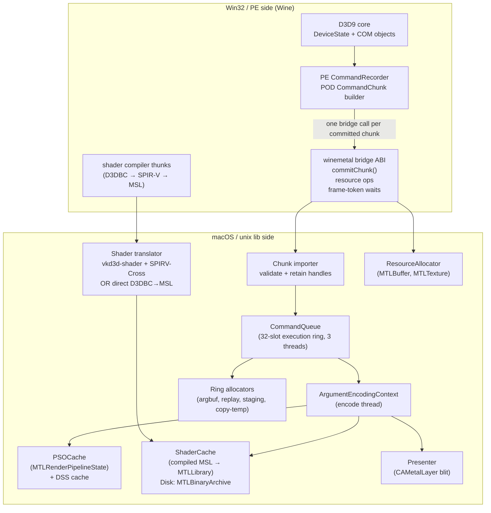

### 1.1 Upstream DXMT Alignment Target

The backend target mirrors upstream DXMT's useful split: API calls record command
work first, and Metal execution happens later on queue-owned encode/completion
threads. dxmt9 differs only in the bridge payload format: D3D9 command data crosses
the Wine PE/unix boundary as POD records that import into queue-local replay actions.

```mermaid
flowchart TD
    subgraph DXMT["Upstream DXMT D3D11 shape"]
        DXCtx["D3D11 immediate context\nEmitST / EmitOP"]
        DXChunk["CommandChunk\ncommand list"]
        DXQueue["CommandQueue\nencode + finish threads"]
        DXMetal["Metal wrapper calls"]
        DXCtx --> DXChunk --> DXQueue --> DXMetal
    end

    subgraph DXMT9["dxmt9 target shape"]
        D9Dev["D3D9 PE device\nDeviceState shadow"]
        D9Chunk["PE CommandChunk\nPOD records + handles"]
        D9Bridge["winemetal commitChunk()\none unix call"]
        D9Import["unix importer\nvalidate + retain"]
        D9Queue["CommandQueue\nencode + finish threads"]
        D9Metal["Metal wrapper calls"]
        D9Dev --> D9Chunk --> D9Bridge --> D9Import --> D9Queue --> D9Metal
    end

    subgraph NonGoal["Non-goal"]
        SetCall["SetRenderState / SetTexture"] --> PerCall["per-call unix submit"]
        DrawCall["DrawPrimitive"] --> PerCall
    end
```

The alignment requirement is about ownership and timing, not source-level identity.
Upstream DXMT remains the architectural target shape even where dxmt9 uses a
different record representation:

- PE owns D3D API semantics, state shadowing, getters, state blocks, and command
  packet construction.
- The Wine bridge owns ABI marshalling only.
- The unix importer owns packet validation, POD record import, handle lookup, and
  handle retention. It rejects malformed records before queue ownership begins.
- `CommandQueue` owns execution chunk lifecycle, chunk scheduling, encode-thread and
  finish-thread progression, Metal command-buffer lifetime, completion, sequence
  fences, and frame-latency token allocation/signaling.
- `Presenter` owns `CAMetalLayer` access, drawable acquisition, layer pacing, the
  back-buffer-to-drawable copy, and `presentDrawable` encoding.

No PE COM object, Objective-C object, process-local pointer, or per-call mutable
scratch object participates in unix-side encode ownership. The backend consumes
compact imported records and state structs; it does not reach back into the D3D9
device object to interpret commands.

---

## 2. Command Queue

The command queue is the central coordinator. It decouples PE-side D3D9 command
recording from unix-side Metal encoding.

There are two chunk forms:

- **PE CommandChunk:** a POD command stream produced by the core without calling
  Metal or ObjC APIs.
- **Execution chunk:** the unix-side queue slot that owns retained handles,
  imported records, transient allocator ranges, and the eventual Metal command
  buffer.

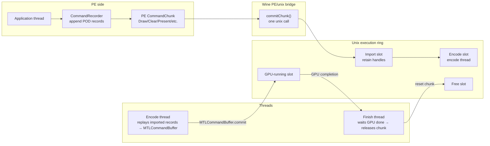

**PE CommandChunk** holds:
- A compact command header array and POD payload arena
- Opaque backend handles for buffers, textures, shaders, swap chains, and queries
- No COM pointers, ObjC pointers, unix-side object pointers, or lambdas
- Command-count and byte-size fields used to bound tail latency

**Execution chunk** holds:
- Imported command records and queue-local replay actions owned by the unix side
- Four ring sub-allocators: `staging` (CPU-visible readback), `copy_temp` (GPU private
  blit), `argbuf` (argument buffers), `replay_store` (imported replay storage)
- A sequence ID used to determine when in-flight resources can be released
- Optional frame token metadata when the chunk contains a present

**Submission flow:**

1. D3D9 calls update PE-side state or append records to the current PE chunk.
2. On `Present`, readback, query ordering, resource hazard, or chunk limit, the core
   commits the PE chunk through `commitChunk()`.
3. The unix importer validates the records, retains referenced backend handles, and
   assigns a sequence ID. If the chunk contains a present, it also assigns a frame
   token.
4. The encode thread dequeues the execution chunk and replays records against
   `ArgumentEncodingContext`, producing Metal commands.
5. The encode thread commits the `MTLCommandBuffer`.
6. The finish thread waits for GPU completion, signals sequence/frame fences, releases
   handles, and returns ring allocator memory.

### 2.1 Bridge Granularity Target

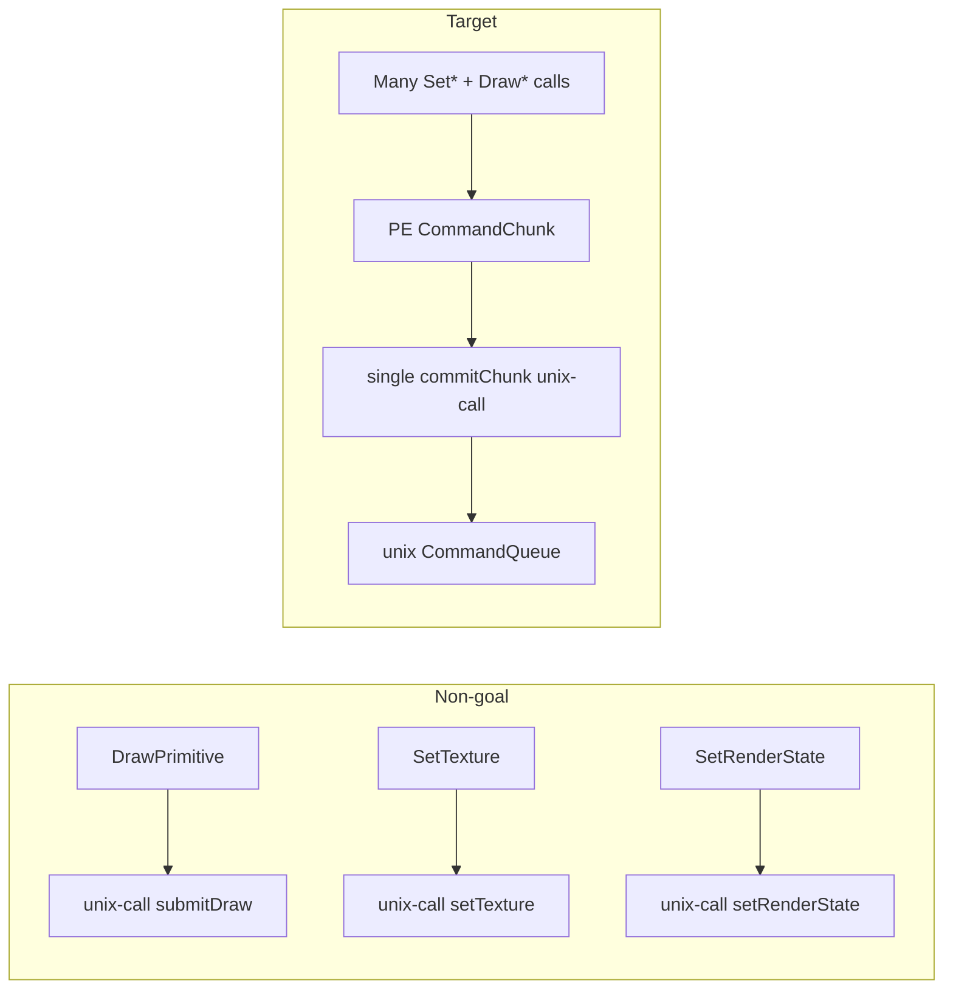

The backend may keep narrow per-operation entry points for tests or bootstrap, but
the default Wine runtime path is chunk submission. A design that sends every D3D9
draw/state call through `WINE_UNIX_CALL` is non-compliant with this performance
target.

### 2.2 Chunk Lifecycle and Ownership

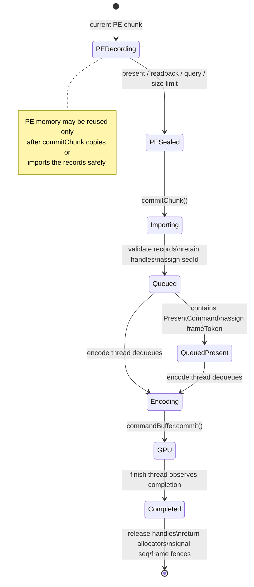

Ownership rules:

- The PE chunk owns its POD payload until `commitChunk()` returns.
- The importer must copy or take ownership of every record and retained handle needed
  after `commitChunk()` returns.
- Execution chunks own backend handle references until completion.
- Frame tokens exist only for chunks containing a present command.
- Sequence IDs track all chunk completion; frame tokens track present-bearing chunk
  completion.

### 2.2.1 Sub-CommandBuffer Chain (G axis target)

`R-BACK-2.29` permits a single execution chunk to commit through a chain
of `MTLCommandBuffer` instances on the same `MTLCommandQueue`. The
chunk's `seqId` covers the chain; `completedSeqId` advances only when
the **last** sub-CB reaches Completed.

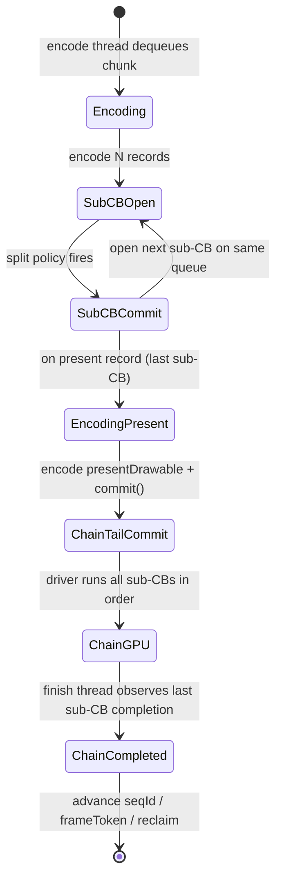

Split policy rules (R-BACK-2.31 deterministic):

- A split decision must read only imported record fields, retained
  handle metadata, and queue-local state captured at chunk admit time.
- Candidate triggers (any may be chosen, mixing is allowed if the
  composite predicate is still deterministic):
  - **per-N records** — every N records since the last commit, where
    N is a fixed encode-thread constant or env-driven knob.
  - **per-render-pass** — commit at every `flushRender` whose split
    reason is not `Final`.
  - **per-X bytes** — commit when total encoded byte count crosses a
    threshold (requires byte accounting in encode thread).
- Wallclock-time-based or GPU-feedback-based triggers are forbidden.
  They violate R-BACK-2.16 / R-BACK-2.31 determinism.

Present and chain-tail rule (R-BACK-2.30):

- The present-bearing record's encoder must be the **last** sub-CB.
  Any preceding sub-CB must not call `presentDrawable`, must not
  acquire a drawable, and must not advance the present-frame-token.
- `splitBeforeBlockingPresent()` (existing path) becomes a special
  case of mid-chunk split — the policy that always closes a sub-CB
  immediately before the present encoder opens. Other split policies
  fire earlier in the chunk.

Reclaim rule (R-BACK-2.32):

- All chunk-owned resources (transient slabs, retained handles, arg
  buffers) remain pinned until the chain's last sub-CB completes.
- Sub-CB GPU completion order is guaranteed by Metal's same-queue
  in-order submission. The queue tracker must not re-derive ordering
  per sub-CB.

Failure mode:

- A sub-CB that fails (`WMTCommandBufferStatusError`) marks the entire
  chunk failed. The chain's tail still must run completion handlers so
  the present token does not stall. The error is reported via the
  `gpu_command_buffer_errors` counter (M5) at the failure site, not
  per-sub-CB.

### 2.3 Data-Oriented Transform Boundaries

The backend command path is a sequence of data transforms. Each stage owns explicit
data and hands the next stage compact immutable records or queue-local state structs.
This keeps the unix encoder deterministic and prevents hidden dependencies on PE COM
objects or ad-hoc per-call state.

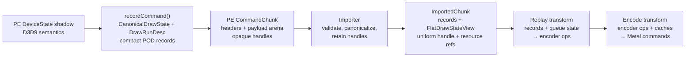

Transform boundaries:

- **Record:** PE code converts D3D9 API calls and device state into POD records. This
  is the only stage allowed to inspect COM objects or D3D9-facing state blocks.
- **Import:** unix code validates record headers, payload sizes, offsets, version
  fields, and handle liveness, then retains backend resources into queue-owned
  imported structs.
- **Replay:** the encode thread consumes imported records plus queue-local state such
  as the active encoder, deferred clears, hazard filters, and allocator cursors.
- **Encode:** `ArgumentEncodingContext`, PSO/DSS/shader caches, and the presenter
  convert replay decisions into Metal commands.

Replay/encode helpers should be deterministic functions where possible:

```
nextEncoderState = replay(record, importedState, priorEncoderState)
psoKey           = makePsoKey(flatDrawStateView)
argLayout        = buildArgumentLayout(flatDrawStateView, resourceBindings)
```

Allowed inputs are immutable imported records, retained backend handles, explicit
queue-local state structs, cache interfaces, and allocator cursors. Disallowed inputs
are PE COM objects, PE `DeviceState` pointers, implicit globals that affect command
semantics, and per-call scratch state not represented in the execution chunk.

### 2.4 CommandChunk Storage and Wire ABI

`CommandChunk` is a data-oriented wire container, not an object graph. The PE side
builds a fixed header plus contiguous sections:

```
CommandChunkWire {
    ChunkHeader          header
    CommandRecordHeader  records[header.recordCount]
    uint8_t              payloadArena[header.payloadBytes]
    HandleTableEntry     handleTable[header.handleCount]
}
```

The record header array is fixed-width and cache-friendly so the importer can scan
record kinds, sizes, offsets, and handle indices linearly before touching payloads.
Payload bytes are stored in a single arena owned by the chunk. Variable-sized command
data is addressed by `{payloadOffset, payloadSize}` pairs, never by pointers.

Wire headers are POD structs with fixed integer fields:
- `ChunkHeader`: magic, ABI version, header size, record count, payload byte count,
  handle-table count, flags, and reserved fields that must be zero.
- `CommandRecordHeader`: opcode, header size, payload offset, payload size,
  first-handle index, handle count, alignment exponent or flags, and reserved fields
  that must be zero.
- Handle table entries are opaque integer backend handles plus kind tags where
  needed for validation.

The bridge ABI must define byte order, field sizes, alignment, and packing explicitly.
All wire structs are naturally aligned to their fixed ABI alignment, and every
payload starts at an offset aligned for the payload schema. Import rejects chunks when
`sizeof`/`alignof` static assertions, negotiated header sizes, or runtime offset
checks do not match the ABI contract.

Version policy:
- The importer accepts only compatible `ChunkHeader.abiVersion` values negotiated at
  backend initialization.
- Unknown opcodes in a compatible version are rejected for normal execution. They may
  be skipped only when the record carries an explicit ignorable/diagnostic flag and
  its payload bounds validate.
- Reserved fields must be zero so future versions can extend the ABI without making
  old importers silently reinterpret data.

Handle and payload rules:
- Records refer to resources through indices into the chunk handle table. The importer
  validates index ranges, kind compatibility, liveness, and duplicate references before
  retaining backend objects.
- The handle table is immutable after the PE chunk is sealed. Imported records store
  compact retained handle references or queue-local indices, not raw bridge handles
  that require repeated lookup on the encode thread.
- Payload arena ranges must satisfy `payloadOffset + payloadSize <= payloadBytes`
  without integer overflow. Nested offsets inside a payload are relative to that
  payload and must be bounds-checked before use.
- Payload schemas must not contain process-local pointers, Objective-C object
  references, COM pointers, vtables, virtual bases, `std::function`, C++ lambdas,
  allocator-owned containers, or host-endian opaque blobs with implicit layout.

Imported records preserve the same data-oriented shape: contiguous arrays for record
headers/decoded structs, compact handle-reference arrays, and arena-backed variable
payloads. Replay should walk these arrays linearly where possible; command-specific
decode may canonicalize into queue-local POD structs but must not allocate one heap
object per command.

Hot-path allocation policy:
- PE recording appends into pre-reserved chunk arrays and arenas. If capacity is
  exhausted, the recorder seals and submits the chunk or grows only outside the draw
  hot path.
- Import may copy into a queue slot's preallocated storage or ring allocator ranges.
  It must not allocate unbounded per-command heap memory for ordinary draw/state
  records.
- Encode and GPU-facing hot paths use queue/ring allocators for argument buffers,
  staging, copy-temp, and imported replay storage. Cache misses may allocate cache
  objects, but steady-state replay of imported records must not allocate from the
  system heap.

---

## 3. Encoder Lifecycle

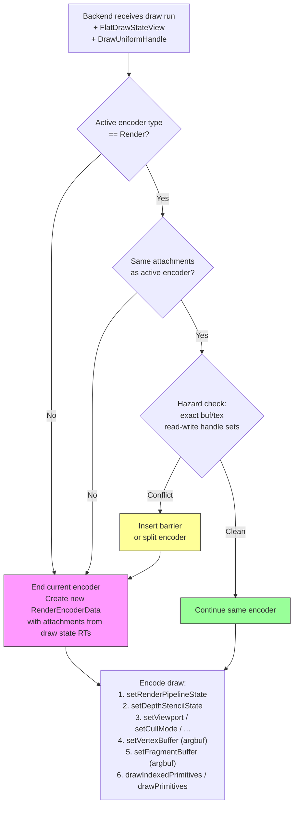

**Clear folding:** A `ClearDesc` received before any draw on a given render target is
stored as deferred. When the first draw opens a render pass for those attachments, the
deferred clear is applied as `MTLLoadActionClear` rather than opening a separate pass.

**Encoder types:** Three encoder kinds may be active during a frame:
- `RenderEncoderData` — for draw calls
- `BlitEncoderData` — for `UpdateSurface`, `UpdateTexture`, `StretchRect`, mipmap gen
- `ComputeEncoderData` — reserved for future compute-based features (triangle fan
  expansion, point sprite expansion)

Only one encoder may be active at a time. Switching kind requires `endEncoding`.

Surface operation replay details are specified in
[`surface-ops/design.md`](surface-ops/design.md). The command queue consumes imported
POD records and emits blit, render-pass, resolve, and readback actions; surface
operation data does not cross the bridge as closures or lambdas.

Per-frequency draw-uniform layout details are specified in
[`draw-uniforms/design.md`](draw-uniforms/design.md). The encoder splits the
historical 9 KB `DrawUniforms` slab into per-stage and per-frequency UBOs
(`VsConsts`, `PsConsts`, `FfpVsConsts`, `FfpPsConsts`) plus an inline 16 B
`DrawVolatile` push, gated by a backend-owned dirty bitmask derived during
chunk-record import.

Render-pass `MTLLoadAction` / `MTLStoreAction` selection (TBDR tile
preservation policy) is specified in
[`render-pass-actions/design.md`](render-pass-actions/design.md). The encoder
maintains a per-CommandQueue "touched" attachment-handle set so first-use
color attachments DontCare-load, and runs an in-chunk look-ahead at
`flushRender` time to DontCare-store depth/stencil and color attachments
that are about to be cleared or overwritten. `R-BACK-2.6` is amended in
that spec to allow conditional `MTLStoreActionDontCare` on RT change.

---

## 4. Argument Buffer Binding

All shader resources for a draw call are packed into a single GPU-side argument
buffer. The shader accesses all inputs through this one buffer pointer.

```
Argument Buffer layout (per draw):
┌────────────────────────────────────┐
│ Vertex buffer slots                │  {gpu_address, stride, size}[] × 16
│ VS constant buffer (256 × float4)  │  or gpu_address if >4 KB
│ PS constant buffer (224 × float4)  │
│ VS samplers                        │  handle[] × 16
│ PS samplers                        │  handle[] × 16
│ VS textures                        │  handle[] × 16
│ PS textures                        │  handle[] × 16
└────────────────────────────────────┘
```

The argument buffer is suballocated from the `argbuf` ring allocator per draw call.
The Metal encoder receives one `setVertexBufferOffset` / `setFragmentBufferOffset`
call pointing to the base of this buffer.

---

## 5. PSO Cache

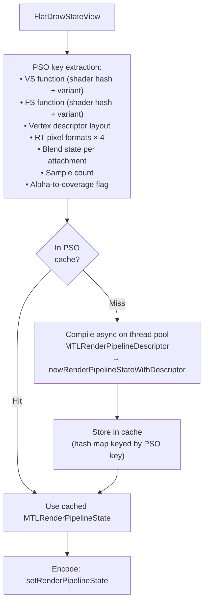

The PSO cache is an in-memory hash map (key → `MTLRenderPipelineState`). It is
populated on first use. Cache entries are never evicted during a session (PSO count
is bounded by the state space of real D3D9 applications).

The `MTLDepthStencilState` cache is separate and keyed by the DSS key (depth +
stencil compare/write state). DSS creation is cheap; the cache prevents redundant
object allocation.

### 5.1 Data-oriented Draw-Key Refinement

The draw hot path is a value pipeline:

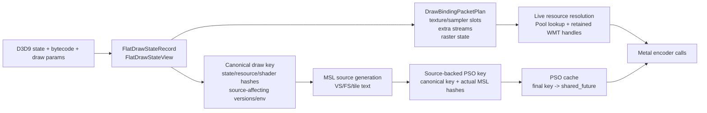

This shape is correct but still pays source-generation CPU cost before proving
that the final source-backed key is already warm. The target cache shape keeps
the final source hash in the authoritative PSO key while adding a fast index
from canonical inputs to the known final key:

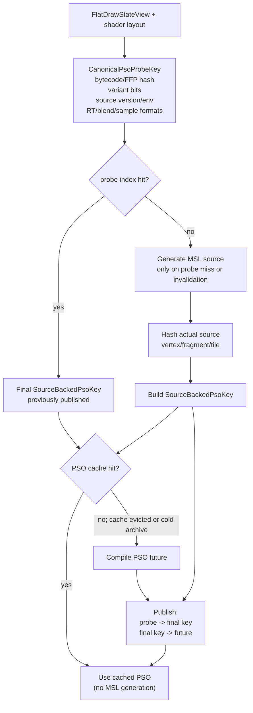

The probe key is not authoritative for correctness; it is only an index. The
final key remains source-backed, so emitter drift, debug source toggles, and tile
vs fragment source differences cannot alias to a stale PSO.

### 5.2 Uniform Range Upload Target

The current dirty tracker records high-water ranges and exposes
`ShaderConstantUploadPlan`, but the live ABI still binds full `VsConsts` and
`PsConsts` structs. The target keeps the full MSL-visible struct ABI while making
host writes range-aware:

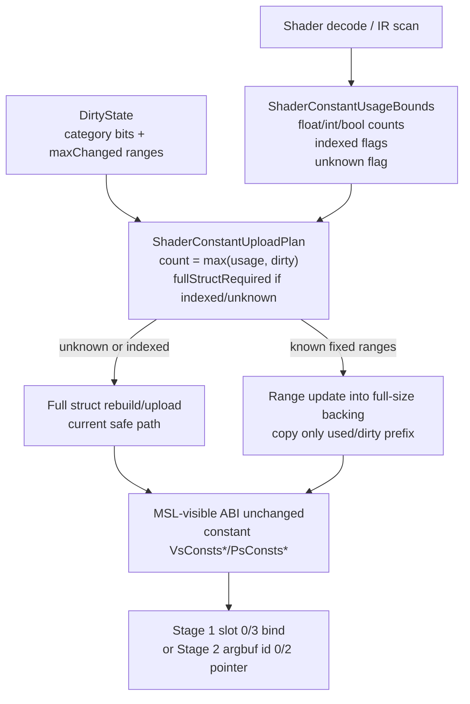

Range upload therefore does not require slicing shader-visible structs or
changing generated MSL. It requires exporting shader constant-usage metadata to
the draw/cache boundary and replacing transient full-struct rebuilds with a
full-size backing buffer whose dirty byte ranges can be updated independently.

### 5.3 Binding Packet Resolution Target

`DrawBindingPacketPlan` is intentionally value-only. Live Metal handles stay
behind the resource pool because they depend on rename rings, texture view
selection, sampler creation, and sequence-id retention:

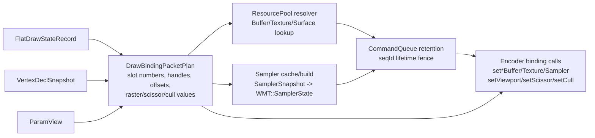

The next refinement is a resolved packet scoped to the encoder call, not to the
canonical draw state. That packet may carry live WMT handles only after the pool
has retained or otherwise proven their lifetime for the draw's sequence id.

### 5.4 Argbuf Stage 2 Texture-bound Draw Target

Stage 2 currently prioritizes uniform-only draws while texture-bound draws can
fall back to Stage 1. The target path moves texture/sampler descriptor
population under the same packet boundary and promotes the selector once
shader-runner equality is established:

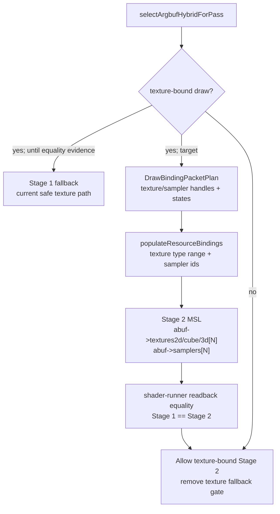

The promotion gate is evidence-driven: deterministic descriptor tests are
necessary, but texture-bound Stage 2 should not become the default until live
GPU readback proves sampling equality across representative 2D, cube, 3D,
sRGB, mip, and sampler-state cases.

### 5.5 Cache Prewarm From `MTLBinaryArchive`

Prewarming populates PSO and shader-function caches at device init by
deserializing entries already present in the on-disk `MTLBinaryArchive`,
before the first encoded draw. This eliminates first-run stutter when an app
revisits previously seen pipeline states.

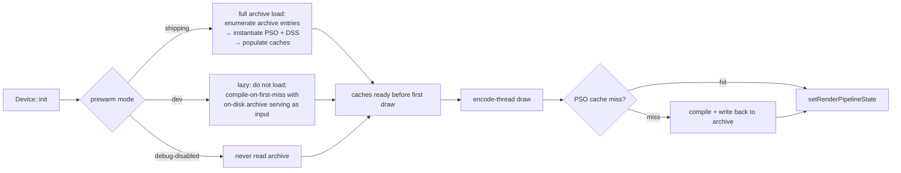

Mode selection (`R-BACK-3.8`) is a runtime config. Counters expose
`prewarmEntriesLoaded`, `prewarmLoadNs`, `prewarmFailureClass`,
`coldCompileCountAfterWarm`. The archive identity (path + version stamp) is
included in present diagnostics so support reports can confirm prewarm hit
the expected file. Failure to load the archive is non-fatal: the cache stays
empty and the path falls through to compile-and-write.

---

## 6. Shader Translation

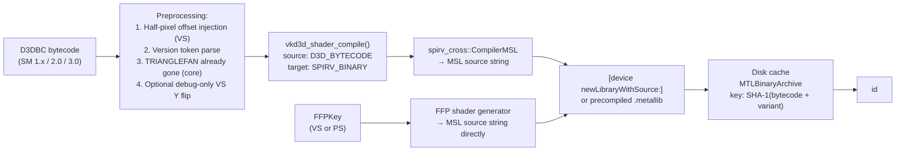

Pixel-shader texture sampling is intentionally absent from the normal
coordinate-system preprocessing list. D3D texture coordinates are passed through
to Metal sampling as D3D UVs; a global pixel V flip is only emitted when the
diagnostic `DXMT_DEBUG_FORCE_PIXEL_V_FLIP` source-contract path is enabled.

**Shader variant keys** for programmable shaders:
- Vertex: (bytecode_hash, input_layout_hash, rasterization_disabled)
- Pixel: (bytecode_hash, alpha_test_enable, alpha_test_func, fog_mode, clip_planes_mask, tile_ffp_mode)

Two draws with the same bytecode but different variant keys require separate
compiled `MTLFunction` objects. The `tile_ffp_mode` bit is set when the
fragment program is targeted at the tile-shader FFP path (§13); it forces a
distinct `MTLFunction` from the portable variant of the same bytecode.

### 6.1 Cross-Process Binary Archive

The `MTLBinaryArchive` (`R-BACK-4.8`) is shared across dxmt9 instances.

**Path & identity**
- Path: `${cache_root}/dxmt9-shaders-v${ABI}.${gpu_family}.metallib-archive`.
  The ABI version and GPU family are baked into the filename so a version or
  device-family mismatch never reads from a stale archive — they read from a
  separate file or no file at all.
- `${cache_root}` resolution order: `$DXMT9_CACHE_DIR`, then
  `$XDG_CACHE_HOME/dxmt9`, then `${HOME}/Library/Caches/dxmt9`.
- Entry key: SHA-1 over (bytecode | variant key | dxmt9 archive ABI version).

**Concurrency model (POSIX `flock`)**
- Writers acquire `LOCK_EX` on the archive file before `serializeToURL:`.
- Readers acquire `LOCK_SH` while loading; if the lock is unavailable for
  more than a short timeout (e.g., 100 ms), the loader treats the archive
  as unreadable and falls through to compile-and-write per `R-BACK-3.7`.
- A reader that holds `LOCK_SH` will see a consistent snapshot — Metal's
  archive serialization writes the whole file atomically via a temp file
  and rename, so partial reads are not possible.

**Versioning rule**
- The dxmt9 archive ABI version is bumped whenever any of these change:
  the MSL emitter output, the variant-key encoding, the
  `MTLBinaryArchive` schema, or the FFP key bit layout.
- A version bump produces a new archive filename; the old archive is left
  on disk and reclaimed by the per-version retention policy (default: keep
  the two most recent ABI versions, delete older).
- A device that bumps to a new ABI starts with an empty archive and warms
  it from compile fall-throughs.

**Failure modes**
| Failure | Detection | Action |
|---|---|---|
| File missing | `[NSURL checkResourceIsReachable]` | start with empty archive; not an error |
| File present, wrong magic / corrupt | `MTLBinaryArchive` initializer returns `nil` with `NSError` | log `prewarmFailureClass = "corrupt"`, rename file to `*.corrupt`, start empty |
| File present, schema mismatch (Metal version drift) | initializer returns `nil` with version error | log `prewarmFailureClass = "schema"`, rename to `*.outdated`, start empty |
| File present, GPU family mismatch | filename includes family; cannot happen by construction | n/a |
| Lock unavailable beyond timeout | `flock` returns `EWOULDBLOCK` | log `prewarmFailureClass = "lock_busy"`, fall through to compile-only |
| Mid-write crash by another process | Metal's atomic rename leaves either old or new file intact | next reader sees a valid archive (old or new), no recovery needed |
| Disk full on write | `serializeToURL:` returns error | log; archive grows on next successful write attempt |

A failure is non-fatal under all conditions — the runtime path always falls
through to compile-and-write. Counters distinguish failure classes so
support reports identify which path took the slow start.

**Configuration**
- Prewarm mode (`R-BACK-3.8`) is selected by build flag and runtime override:
  - default for shipping builds (release): `full`.
  - default for dev builds (`-Ddev_build=true`): `lazy`.
  - debug runtime: `disabled` via env var `DXMT9_PREWARM=off`.
- Counters: `prewarmEntriesLoaded`, `prewarmLoadNs`, `prewarmFailureClass`,
  `coldCompileCountAfterWarm`, `archiveBytes`. Present diagnostics expose
  the resolved archive path and the prewarm mode.

---

## 7. Resource Allocation Model

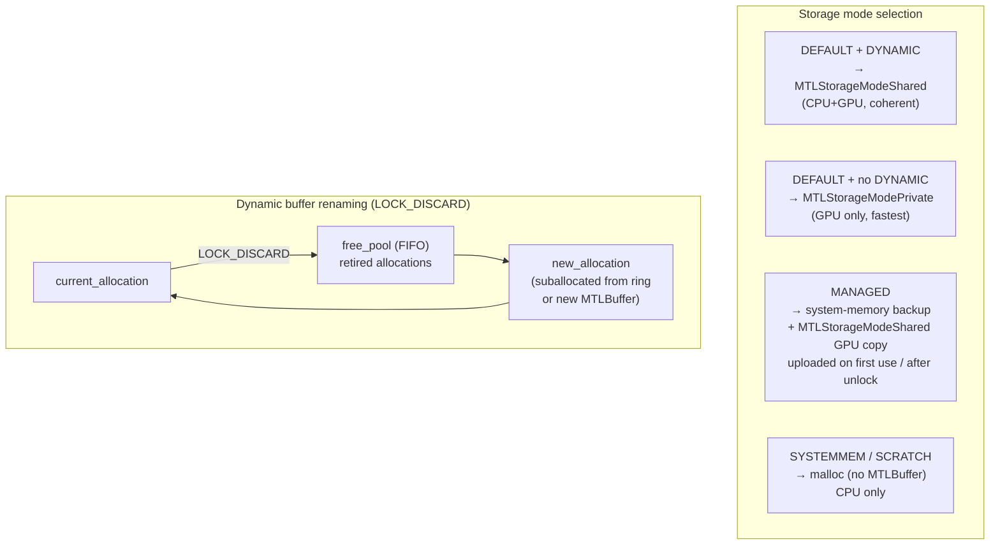

**Texture upload path (MANAGED / SYSTEMMEM → GPU):**

The path bifurcates on `MTLDevice.hasUnifiedMemory` per `R-BACK-5.7`:

*Unified-memory devices (Apple Silicon, `hasUnifiedMemory == YES`)*:
1. Application `Lock()`s the texture surface and writes pixel data into the
   `MTLStorageModeShared` backing.
2. `Unlock()` marks the surface "uploaded" — no staging copy and no blit are
   needed. CPU-written bytes are GPU-visible immediately because both sides
   share the same physical memory.
3. The next render encoder that samples the texture sees the updated data.
   No fence is required for visibility (Metal's encoder ordering is enough);
   a fence is only required if the texture is concurrently written and read
   across encoders, which is not the upload case.

*Discrete-style devices (Intel iGPU / AMD dGPU on Mac, `hasUnifiedMemory == NO`)*:
1. Application `Lock()`s the texture surface and writes pixel data into the
   CPU-accessible (`MTLStorageModeManaged`) backing.
2. `Unlock()` marks the surface dirty.
3. On first draw that samples the texture, a blit encoder copies the dirty
   region from the managed staging buffer to the private `MTLTexture`.
4. The blit is fenced so the render encoder that follows reads the updated
   data.

Counter `managedTextureUploadBlitCount` advances only on the discrete path;
on Apple Silicon it must remain 0 across a workload's lifetime. A non-zero
value on a `hasUnifiedMemory` device is a regression of `R-BACK-5.7`.

### 7.1 Pool / Usage → Storage Mode Matrix

The mapping in `R-BACK-5.7` is reproduced here as a single-page reference.
The matrix differs between unified-memory devices (Apple Silicon: M1/M2/M3,
all hasUnifiedMemory) and discrete-style devices (Intel/AMD on Mac).

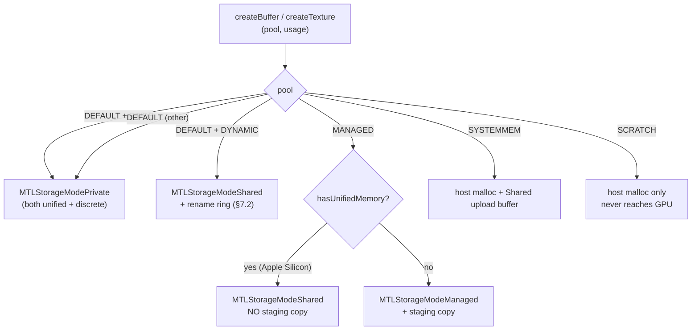

Apple Silicon's unified memory makes the `MANAGED` staging copy redundant —
both CPU and GPU view the same bytes. Detection uses `MTLDevice.hasUnifiedMemory`
at device init; the per-resource path branches once at create time and never
re-checks. On discrete-style Mac (legacy Intel iGPU + AMD dGPU) the path
preserves the conventional staging copy.

### 7.2 `D3DUSAGE_DYNAMIC` Rename Ring

Per `R-BACK-5.8`, dynamic buffers do not block on GPU completion when
`D3DLOCK_DISCARD` rotates allocations:

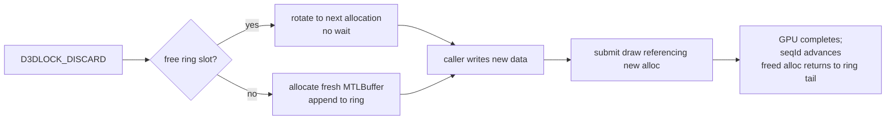

The ring is per-buffer-handle, not global, to keep rename cost local.
Capacity grows on demand and never shrinks during a session.

### 7.3 `MTLHeap` Small-Resource Pooling

Per `R-BACK-5.9` / §14, small textures and small non-dynamic buffers allocate
from `MTLHeap` instances rather than direct `newBufferWithLength` /
`newTextureWithDescriptor`.

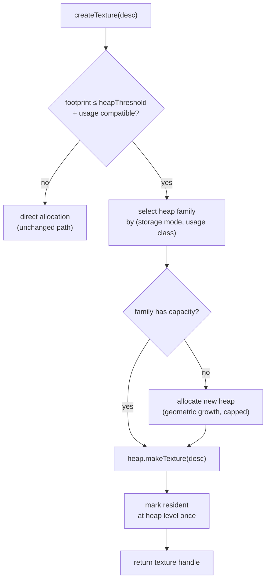

Heap families (`R-BACK-14.1`):

| Family | Storage mode | Members |
|---|---|---|
| `priv-tex` | `MTLStorageModePrivate` | `D3DPOOL_DEFAULT` non-RT non-DS small textures |
| `shared-tex-um` | `MTLStorageModeShared` (unified memory only) | `MANAGED` / `SYSTEMMEM` small textures on Apple Silicon |
| `shared-buf` | `MTLStorageModeShared` | non-dynamic vertex/index/constant buffers below threshold |

Render targets, depth buffers, and dynamic-rename buffers stay on direct
allocation. Heap residency tracking elides per-texture residency calls
because the heap is the residency unit.

---

## 8. Presentation

```mermaid
sequenceDiagram
    participant App as Application thread
    participant Rec as PE CommandRecorder
    participant BR as winemetal bridge
    participant CQ as CommandQueue
    participant ET as Encode thread
    participant FT as Finish thread
    participant PR as Presenter
    participant CL as CAMetalLayer
    participant MTL as Metal

    App->>Rec: Present()
    Rec->>Rec: append PresentCommand\ncommit current chunk
    Rec->>BR: commitChunk(chunk)
    BR->>CQ: import chunk
    CQ->>CQ: allocate frameToken
    opt boundary policy applies
        CQ->>CQ: waitFrameLatency(frameToken, maxLatency)\nwaits for older present completion
    end
    CQ-->>BR: present accepted after boundary policy
    BR-->>Rec: commitChunk returns
    Rec-->>App: Present returns

    ET->>PR: encode PresentCommand(frameToken)
    PR->>CL: nextDrawable\n(blocks when drawable/vsync-limited)
    ET->>MTL: blitCommandEncoder: copy backbuffer → drawable.texture
    ET->>MTL: commandBuffer.presentDrawable(drawable)
    ET->>MTL: commandBuffer.commit()
    FT->>CQ: signal frameToken\non command buffer completion
```

The back buffer is a private `MTLTexture` owned by the swap chain. On present, it
is copied to the `CAMetalLayer` drawable via a blit encoder. The drawable is obtained
just before the blit — not before the frame — to minimize latency.

Present instrumentation must identify which source was selected before drawable
work starts. The counter set records explicit/current-backbuffer selection, source
validity, source handle/texture, source size, format, sample count, pass source
size, and destination size. Current SFIV investigation notes expect the valid
1280x720 source lane to stay clean before async acquire or preacquire policies are
retuned.

### 8.1 Frame Latency Token

Present pacing is based on a queue-owned frame token:

```mermaid
stateDiagram-v2
    [*] --> Recorded : PresentCommand appended
    Recorded --> Submitted : commitChunk assigns frameToken
    Submitted --> Encoding : encode thread dequeues chunk
    Encoding --> Presented : presentDrawable encoded and committed
    Presented --> Completed : finish thread observes command buffer completion
    Completed --> [*] : frameLatencyFence signals frameToken

    note right of Submitted
        The application may wait for
        frameToken - maxFrameLatency
        when the boundary policy applies.
    end note
```

The token is not the chunk dequeue ID and not the point where the encode thread starts
work. It becomes signaled only after the Metal command buffer carrying the present has
completed. This mirrors the useful part of upstream DXMT's `CommandQueue` frame
latency fence while keeping drawable and layer ownership inside the presenter.

---

## 9. Dependency Tracking

Consecutive encoders may have data dependencies. The backend tracks resource access
per encoder with exact buffer/texture handle sets derived from imported record
hazards and current draw bindings.

For each encoder transition, the backend checks:
- `new_read ∩ prev_write` - read-after-write: must synchronize
- `new_write ∩ prev_write` - write-after-write: must synchronize
- `new_write ∩ prev_read` - write-after-read: must synchronize

If an exact set intersection exists, a Metal resource barrier or encoder split is
emitted. Bloom/probabilistic overlap checks may remain as counters to measure what
the old approximation would have done, but they must not decide default pass splits
because false positives create avoidable render-pass churn.

### 9.1 Exact vs Bloom — Why Exact Is the Default

DXMT uses Bloom filters (`PartitionedBloomFilter64<16>` × {buf,tex} × {r,w})
for hazard tracking. dxmt9 uses exact handle sets. This is a deliberate
divergence with a measurable cost/benefit balance, written down here so a
future reader does not relitigate it without the underlying numbers.

```mermaid
flowchart LR
    subgraph BLOOM["Pure Bloom (DXMT)"]
        BCheck["O(1) hash check"]
        BFP["false positives → unnecessary splits"]
        BFP -->|"on TBDR"| BFlush["each spurious split = tile flush\n~10–200μs"]
        BCheck -->|"~k hash ops"| BFast["per-check cost: low"]
    end
    subgraph EXACT["Pure exact (dxmt9 default)"]
        ECheck["O(n) set membership"]
        EZero["zero false positives"]
        EZero -->|"on TBDR"| ENoFlush["no spurious tile flushes"]
        ECheck -->|"n = 5–20 typical"| EFast["per-check cost: 5–50ns ≈ negligible"]
    end
    subgraph HYBRID["Bloom-pre-filter + exact (option, allowed by R-BACK-2.28)"]
        HBloom["Bloom 'definitely no'\n→ skip exact"]
        HExact["Bloom 'maybe' → exact"]
        HBloom --> HFast["common case: O(1)"]
        HExact --> HCorrect["uncommon case: exact ground truth"]
    end
```

| Axis | Pure Bloom | Pure exact (current) | Hybrid (Bloom→exact) |
|---|---|---|---|
| Per-check CPU | O(k) hash ops | O(n), n ≈ 5–20 typical → 5–50ns | O(k) common, O(n) rare |
| Memory per encoder | ~32 B fixed | grows with handle count | ~32 B + handle set |
| False-positive splits | yes (workload-dependent) | never | never (Bloom only filters "definitely no") |
| TBDR cost from FP | 0.05–4 ms/frame typical | 0 | 0 |
| Debuggability | "split happened, unknown reason" | "split caused by handle X" | "split caused by handle X" |
| Determinism | hash-function-dependent | yes | yes |
| Counter signal value | split count is noisy | split count = clean regression signal | split count = clean regression signal |

The decision rests on three observations:

1. **n is small in D3D9 workloads.** Encoders typically accumulate 5–20
   resource handles. O(n) membership at that scale is 5–50ns per check —
   negligible compared to the 10–200μs cost of one spurious tile flush
   on Apple Silicon TBDR. The CPU "saving" Bloom offers is small and the
   GPU cost it can introduce is not.

2. **"Encoder split count" is a regression signal.** §7 of `archicture/design.md`
   declares it. Bloom false positives turn that signal into noise. The whole
   architecture leans on clean signals to detect drift; weakening this one
   propagates uncertainty into benchmark interpretation.

3. **Debugging.** When an encoder splits, the question "why" must be
   answerable from the recorded state. Exact sets answer it; Bloom does not.

### 9.2 Bloom as Diagnostic and Optional Pre-Filter

`R-BACK-2.28` allows Bloom in two roles:

- **Diagnostic counter** (always permitted): maintain a Bloom in parallel
  with the exact set; record `bloomFalsePositiveCount` whenever the Bloom
  signaled "maybe" but the exact check found no overlap. This produces
  empirical FP-rate data without affecting split decisions.
- **Pre-filter** (permitted, not currently implemented): a "definitely no"
  Bloom result short-circuits the exact membership lookup. A "maybe" result
  falls through to exact. Splits are still decided by exact; Bloom never
  forces one. This preserves the current contract while collapsing the
  common-case CPU cost to O(1).

The pre-filter is a benchmark-driven addition. It is not in the current
implementation because the exact membership cost has not been shown to be
hot. If profiling on a real workload puts membership lookups in the top
encode-thread costs, the pre-filter becomes the next step. Until then it is
implementation complexity (two synchronized data structures, bimodal
latency) without a measured win.

### 9.3 What We Lose by Not Going Pure Bloom

For completeness, the costs we accept by sticking with exact:

- Encoder memory grows with handle count rather than staying bounded at
  ~32 B. For typical D3D9 encoders this is a few hundred bytes, not pages.
- The membership lookup is O(n) rather than O(k). At n ≤ 20 this is below
  measurement noise on the encode thread; at hypothetical n ≥ 200 it would
  start to matter, and the §9.2 pre-filter becomes the response.

These costs are accepted because the corresponding wins (zero FP, clean
regression signal, debuggability, determinism) are visible in everyday
operation, while the costs are bounded by the small-n regime D3D9 actually
exhibits.

---

## 10. Fixed-Function Lighting Constants Layout

The fixed-function vertex shader receives a uniform buffer with this layout:

```
FFPVertexUniforms {
    float4x4  worldViewMatrix       // D3DTS_WORLD × D3DTS_VIEW
    float4x4  projMatrix            // D3DTS_PROJECTION
    float3x3  normalMatrix          // inverse transpose of worldViewMatrix upper 3×3
    float4x4  textureMatrix[8]      // D3DTS_TEXTURE0–7
    float2    invViewportSize       // (1/width, 1/height) for half-pixel fixup

    struct Light {
        float4  diffuse
        float4  specular
        float4  ambient
        float4  position_vs         // in view space
        float4  direction_vs        // in view space, normalized
        float   atten0, atten1, atten2
        float   range
        float   theta, phi, falloff // spot params
    } lights[8]

    float4    globalAmbient
    float4    materialDiffuse
    float4    materialAmbient
    float4    materialSpecular
    float4    materialEmissive
    float     materialSpecularPower

    float4    fogColor
    float     fogStart, fogEnd, fogDensity
}
```

---

## 11. Clip Plane Design

D3D9 supports up to 6 user clip planes (`D3DRS_CLIPPLANEENABLE` bitmask,
`SetClipPlane(index, float[4])`). Metal surfaces these as vertex shader
`[[clip_distance]]` outputs.

### Uniform layout

Clip planes are stored in the fixed-function uniform buffer and also injected into
the programmable shader constant block:

```
// Appended to FFPVertexUniforms when any clip plane is enabled:
float4  clipPlane[6]   // in clip space (post-projection)
```

D3D9 clip planes are specified in world space. The core must transform them to
clip space before passing to the backend:

```
clipPlane_clip[i] = transpose(inverse(worldViewProj)) * clipPlane_world[i]
```

### Vertex shader emission

When `clipPlaneMask != 0`, the vertex shader must output `[[clip_distance]]` values.

**For fixed-function shaders:** the backend generates code in the FFP vertex shader:
```metal
vertex VSOut ff_vertex(...) {
    VSOut out;
    // ... standard transform ...
    out.position = projPos;
    out.clipDist[0] = dot(projPos, uniforms.clipPlane[0]);  // if bit 0 set
    out.clipDist[1] = dot(projPos, uniforms.clipPlane[1]);  // if bit 1 set
    // ... up to 6
    return out;
}
```

**For programmable shaders:** the translator injects a post-transform epilog after
the shader's `oPos` write. The clip plane values are passed as additional float4
constants above the normal constant register range (or via a separate small buffer).

### `[[clip_distance]]` declaration in MSL

```metal
struct VertexOut {
    float4 position [[position]];
    float  clipDist [[clip_distance]] [6];
    // ... other varyings
};
```

Only the enabled clip planes (per `clipPlaneMask`) need to be written; others may be
zero. Metal clips the primitive when any `clipDist[i] < 0`.

### Variant key

`clipPlaneMask` (6-bit) is part of the vertex shader variant key. Shaders compiled
without clip planes must not be reused for draws with clip planes active.

---

## 12. MSAA Design

D3D9 `D3DPRESENT_PARAMETERS.MultiSampleType` and `CreateRenderTarget` with
`MultiSample` parameter enable multisample antialiasing.

### Supported sample counts

Report the following in `CheckDeviceMultiSampleType()`:
- `D3DMULTISAMPLE_NONE` (1×) — always supported
- `D3DMULTISAMPLE_2_SAMPLES` (2×) — supported if `[device supports:MTLSampleCount2]`
- `D3DMULTISAMPLE_4_SAMPLES` (4×) — supported if `[device supports:MTLSampleCount4]`
- `D3DMULTISAMPLE_8_SAMPLES` (8×) — optional; check `MTLSampleCount8`

### Multisample render target

A multisample render target is a `MTLTexture` with `sampleCount > 1` and
`textureType = MTLTextureType2DMultisample`. It cannot be sampled directly.

The corresponding `MTLRenderPassDescriptor` attachment:
```objc
att.texture     = msaaTexture          // multisample texture
att.storeAction = MTLStoreActionMultisampleResolve
att.resolveTexture = resolveTexture    // single-sample resolve target
```

### Resolve target

Each multisample render target has an associated single-sample **resolve texture**
(`MTLTexture` with `sampleCount = 1`). The resolve texture is what the application
samples when it uses the render target as a texture.

```
MsaaRenderTarget {
    MTLTexture  msaaTex      // sampleCount = N, MTLStorageModePrivate
    MTLTexture  resolveTex   // sampleCount = 1, MTLStorageModePrivate
}
```

When the render pass closes (`endEncoding`):
- `storeAction = MTLStoreActionMultisampleResolve` automatically resolves `msaaTex`
  → `resolveTex`.
- Subsequent `SetTexture()` calls bind `resolveTex` for sampling.

### `GetRenderTargetData` on MSAA surface

Must resolve first (if not already resolved), then read back `resolveTex` via staging
buffer. The application cannot directly access the multisample texture data.

---

## 13. Tile-Shader FFP (Apple Silicon Fast Path)

The tile-shader FFP path runs D3D9 fixed-function fragment effects (fog,
alpha test, alpha-to-coverage) at the Metal **tile stage** instead of the
fragment stage on `MTLGPUFamilyApple3+`. Tile-stage execution lives in
on-chip tile memory and has no fragment-shader dispatch cost; for FFP-heavy
D3D9 frames this collapses two passes (fragment fog + framebuffer write)
into one tile pass.

### 13.1 Selection Flow

```mermaid
flowchart TD
    PASS["render-pass desc built\n(attachments, FFPKeyPS, GPU family)"] --> CAP{"GPU family\n≥ Apple3?"}
    CAP -->|"no"| PORT["portable fragment FFP\n(unchanged path)"]
    CAP -->|"yes"| KEY{"FFPKeyPS uses\ntile-eligible state?\n(fog, alpha-test, A2C only)"}
    KEY -->|"no"| PORT
    KEY -->|"yes"| PRECISION{"reference values\nin tile-precision range?"}
    PRECISION -->|"no"| FALLBACK["fallback:\nportable path\nincrement tileFfpFallbackCount(reason)"]
    PRECISION -->|"yes"| TILE["tile-shader FFP path"]
    TILE --> CMP["select MSL with\ntile_ffp_mode=1 variant"]
    PORT --> CMP_P["select MSL with\ntile_ffp_mode=0 variant"]
    CMP --> ENC["encoder uses\nMTLTileRenderPipelineState"]
    CMP_P --> ENC2["encoder uses\nMTLRenderPipelineState (fragment)"]
```

Selection is per-render-pass (`R-BACK-13.1`). A pass that begins as tile-FFP
cannot mid-pass switch to portable; mismatched draws within the pass force
either a pass split or a fall-through to portable for the whole pass.

### 13.2 MSL Generation

Two distinct generators emit two distinct MSL sources from the same
`FFPKeyPS`:

| Path | Generator | Output | Pipeline state |
|---|---|---|---|
| Portable | `makeFfpPixelSource()` | fragment function | `MTLRenderPipelineState` |
| Tile | `makeFfpTilePixelSource()` (new) | tile function | `MTLTileRenderPipelineState` |

The tile generator emits programmable-blending tile code that reads
attachment color directly (Apple-Silicon-only feature) instead of writing
through `out.color = ...`. This avoids round-tripping through tile memory.

PSO key includes `tile_ffp_mode` bit (`R-BACK-13.3`); the same `FFPKeyPS`
produces two compiled function pairs, one in each cache.

### 13.3 Conformance Boundary

Tile-shader FFP must produce results bit-identical to the portable path
(`R-BACK-13.2`). Where Metal's tile stage cannot match D3D9 corner cases:

| Corner | Reason class | Fallback action |
|---|---|---|
| Alpha-test reference outside `[0, 255]` integer range | `precision` | mark pass portable |
| Fog mode with non-linear scale at high z | `precision` | mark pass portable |
| Programmable blend interaction with PS-emitted alpha-to-coverage | `unsupported_state` | mark pass portable |
| Non-Apple-Silicon device | `gpu_family` | always portable, no counter increment |

Conformance evidence (`R-BACK-13.5`) is taken from the portable path only;
the tile path is judged equivalent by bit-identity to portable per
`R-BACK-13.2`. Conformance regressions in the tile path manifest as
visible-pixel differences under shader-runner readback tests, which keep
running both paths and require equality.

### 13.4 Counters

| Counter | Meaning |
|---|---|
| `tileFfpPassCount` | render passes encoded via tile path |
| `portableFfpPassCount` | render passes encoded via portable path |
| `tileFfpFallbackCount` | passes that started tile-eligible but fell back |
| `tileFfpFallbackByReason{precision \| unsupported_state \| gpu_family \| mid_pass_ineligible}` | fallback breakdown |
| `tileFfpMidPassResplitCount` | passes split because a draw mid-pass became ineligible |
| `tileFfpPassMs` / `portableFfpPassMs` | encoding time per path (sanity check) |

A regression to the portable path on an Apple Silicon device is observable
as a drop in `tileFfpPassCount` ratio without a corresponding
`tileFfpFallbackCount` increase (i.e., the selector skipped tile path for an
unaccounted reason).

### 13.5 Metal API Model

The tile-shader FFP path uses Metal's tile-render pipeline, which is a
distinct compile target from the standard render pipeline.

```mermaid
flowchart LR
    SRC["makeFfpTilePixelSource(FFPKeyPS)\n→ MSL with kernel function\nusing imageblock + threadgroup"]
    SRC --> LIB["[device newLibraryWithSource:]"]
    LIB --> FN["id<MTLFunction> (tile kernel)"]
    FN --> DESC["MTLTileRenderPipelineDescriptor\n• tileFunction = FN\n• threadgroupSizeMatchesTileSize = YES\n• colorAttachments[i].pixelFormat"]
    DESC --> CMP["[device newRenderPipelineStateWithTileDescriptor:]"]
    CMP --> TPS["MTLRenderPipelineState (tile variant)\n— shares interface with fragment PSO\nbut compiled separately"]
```

Pipeline state objects:

| Object | Used by | Notes |
|---|---|---|
| `MTLRenderPipelineState` (fragment variant) | `setRenderPipelineState:` | the portable path; unchanged |
| `MTLRenderPipelineState` (tile variant) | `setRenderPipelineState:` then `dispatchThreadsPerTile:` | encoded via the tile descriptor; produces the same opaque type but compiled with `newRenderPipelineStateWithTileDescriptor:` |
| `MTLTileRenderPipelineDescriptor` | compile-time only | dxmt9 holds it briefly during compile, never at draw time |

Both variants are cached in the same `MTLRenderPipelineState` cache (§5),
keyed by the PSO key including `tile_ffp_mode` (`R-BACK-3.3`). Variant
selection happens at draw encode time via the bit in the key.

The MSL emitter (`makeFfpTilePixelSource`) writes a tile kernel that:

- declares an `imageblock<TileColor>` to read attachment color directly
  (Apple Silicon programmable-blending).
- expresses fog blend / alpha-test / A2C as an arithmetic + conditional
  pass over the imageblock value before write-back.
- does **not** call `discard_fragment()`; alpha-test rejection becomes a
  blend-with-prior-color of the rejected fragment (alpha-test on tile is
  semantically equivalent to discarding pre-blend).

### 13.6 Mid-Pass Eligibility Policy

`R-BACK-13.1` says tile vs portable is decided per render-pass. But pass
boundaries are decided by RT changes / explicit hazards — within one pass
a state mutation can change FFP eligibility (e.g., an alpha-test reference
flips from in-range to out-of-range, or a non-tile-supported fog mode is
selected mid-pass).

```mermaid
flowchart TD
    OPEN["pass opens with first draw\n→ selector chooses tile vs portable"] --> ENC["encoder open;\npipeline = chosen variant"]
    ENC --> NEXT{"next draw"}
    NEXT -->|"FFP key still tile-eligible"| ENC
    NEXT -->|"FFP key becomes ineligible"| FORK{"current path?"}
    FORK -->|"portable already"| ENC
    FORK -->|"tile"| SPLIT["end encoder + open new encoder\n(portable variant)\nincrement tileFfpMidPassResplitCount"]
    SPLIT --> ENC
```

Rules:

- A pass opened on the **portable** path stays portable even if subsequent
  draws would have been tile-eligible. Promoting mid-pass is not allowed
  because the portable encoder cannot retroactively become a tile encoder.
- A pass opened on the **tile** path that hits an ineligible draw must end
  the current encoder and start a new portable encoder. This is an
  encoder split, counted in `tileFfpMidPassResplitCount`. The split is
  treated as an exact-hazard split for `R-BACK-2.28` purposes (counter
  signal stays clean — false-positive splits remain forbidden).
- `tileFfpFallbackByReason{mid_pass_ineligible}` advances on the same
  event for the by-reason breakdown.

### 13.7 Floating-Point Precision Boundary

`R-BACK-13.2` requires "bit-identical to the portable fragment path." This
is achievable only when both paths use the same arithmetic precision.

Precision rules:

- Both paths emit MSL with `float` (32-bit IEEE 754) for fog, alpha-test,
  and A2C arithmetic — never `half`. Apple's MSL compiler may demote to
  `half` on TBDR by default for fragment shaders; the dxmt9 emitter
  **explicitly types the affected variables as `float`** to prevent the
  demotion.
- The tile-stage emitter additionally uses `imageblock<TileColor>` with
  `TileColor` defined as `float4` (not `half4`) for color attachments
  whose pixel format is wider than 8-bit-per-channel. For 8-bit
  attachments (`A8R8G8B8` etc.) `half4` is acceptable because the
  attachment quantization already discards precision below `half`.
- Fog blends are computed in linear space; sRGB attachments are decoded
  before the blend and re-encoded after, identically on both paths.
- A precision divergence that breaks bit-identity (e.g., a float
  rounding-mode quirk on a specific GPU family) must be encoded as a
  conformance test failure → `tileFfpFallbackByReason{precision}`
  increment + the affected pass falls back. The portable path remains
  the authoritative oracle.

A future Metal version that adds full programmable-blending precision
parity may relax these rules; until then, dxmt9's tile path opts into
`float` precision unconditionally for FFP arithmetic.

---

## 14. Resource Heap Pooling Design

Backs the `MTLHeap` requirements in §7.3, `R-BACK-5.9`, `R-BACK-5.10`, and
§14 of `requirements.md`. The goal is to reduce per-resource residency and
allocation overhead for D3D9's small-texture working set (lightmaps, decals,
glyph atlases, particle sprites — typically ≤ 64 KB each, hundreds to
thousands per frame).

### 14.1 Heap Family Lifecycle

```mermaid
stateDiagram-v2
    [*] --> Available: createHeap(family, storageMode, capacity)
    Available --> Filling: makeBuffer / makeTexture from heap
    Filling --> Filling: more allocations within capacity
    Filling --> Full: capacity reached
    Full --> Growing: new heap created (geometric growth)
    Growing --> Filling: subsequent allocations target new heap
    Filling --> Reclaiming: all members destroyed,\ncompletedSeqId ≥ lastUsedSeqId
    Full --> Reclaiming: same condition
    Reclaiming --> [*]: heap released
```

Geometric growth (`R-BACK-5.10`) caps total heap memory by capping the total
heap count rather than per-heap size. Heaps grow doubling up to a soft
ceiling (`heapMaxBytesPerFamily`); past the ceiling, new heaps allocate at
the ceiling size.

### 14.2 Allocation Path

```mermaid
sequenceDiagram
    participant App as Application
    participant Be as Backend createTexture
    participant H as Heap manager
    participant MTL as Metal

    App->>Be: createTexture(W, H, fmt, pool=DEFAULT)
    Be->>Be: estimate footprint(desc)
    alt footprint > threshold OR ineligible usage
        Be->>MTL: newTextureWithDescriptor (direct)
        MTL-->>Be: MTLTexture
    else footprint ≤ threshold AND eligible
        Be->>H: alloc(family=priv-tex, desc)
        alt heap has capacity
            H->>MTL: heap.makeTexture(desc)
        else no capacity
            H->>MTL: newHeapWithDescriptor (grow)
            MTL-->>H: new MTLHeap
            H->>MTL: heap.makeTexture(desc)
        end
        MTL-->>H: MTLTexture (heap-backed)
        H-->>Be: MTLTexture + heap-backed flag
    end
    Be-->>App: texture handle
```

### 14.3 Residency

Direct allocations call `useResource:usage:` per resource per encoder
(when needed). Heap-backed allocations call `useHeap:` once per heap per
encoder. For frames with hundreds of small textures, this collapses
hundreds of `useResource:` calls into a handful of `useHeap:` calls.

The encoder maintains a per-encoder `usedHeaps` set; `useHeap:` is issued
the first time any member of that heap is bound, and per-resource residency
calls on heap members are elided.

### 14.4 Counters

| Counter | Meaning |
|---|---|
| `heap.{family}.heapCount` | live heap instances for the family |
| `heap.{family}.bytesAllocated` | total backing storage |
| `heap.{family}.allocCount` | resources allocated from this family |
| `heap.{family}.directFallbackCount` | eligible-by-size resources that took direct path due to a usage-flag mismatch |
| `heap.{family}.fragmentationFailureCount` | `heap.makeTexture` returned nil despite heap not being "full" by accounting |
| `heap.{family}.compactionCount` | how many times a heap was retired and freed because all members were destroyed |
| `useHeapPerEncoder` | average count per encoder (target: small) |
| `useResourcePerEncoder` | average count per encoder (target: dropping after heap adoption) |

### 14.5 Fragmentation Policy

A `MTLHeap` is a contiguous backing region; allocations and frees create
holes. Even when `usedSize < currentAllocatedSize`, a fresh
`heap.makeTexture(desc)` can return `nil` because the largest free hole is
smaller than the requested footprint.

```mermaid
flowchart TD
    REQ["heap.alloc(family, desc)"] --> TRY{"heap.makeTexture()"}
    TRY -->|"non-nil"| OK["return heap-backed texture"]
    TRY -->|"nil & heap usedSize < cap"| FRAG["fragmentation:\nlargest free hole < desc footprint"]
    FRAG --> NEXT{"another heap in family\nwith capacity?"}
    NEXT -->|"yes, try next"| TRY
    NEXT -->|"no"| GROW["allocate new heap (geometric)"]
    GROW --> ASSIGN["new alloc targets fresh heap"]
    TRY -->|"nil & heap full by accounting"| GROW
```

Rules:

- **No mid-heap compaction.** Metal does not expose a heap-compact API and
  resources cannot be relocated once allocated. Fragmentation is absorbed
  by adding a new heap to the family, never by moving existing allocations.
- **Failed allocation walks the family.** If the first heap returns nil,
  the next eligible heap in the family is tried before allocating a new
  heap. A bookkeeping `usedSize` per heap is a hint, not a hard predictor
  of `makeTexture` success — always probe.
- **`fragmentationFailureCount` advances** when `heap.makeTexture` returns
  nil but `usedSize < currentAllocatedSize`. Sustained growth indicates the
  family's allocation pattern produces too many holes; tune the threshold
  or add a per-family eviction policy as a follow-up.
- **Compaction by retirement** is the only reclaim mechanism. When all
  members of a heap are destroyed and `completedSeqId ≥ lastUsedSeqId` for
  the heap (`R-BACK-14.4`), the heap is released. Subsequent allocations
  do not re-target the released heap; they go to a remaining heap or grow
  a new one. `compactionCount` advances per release.

### 14.6 Allocation Failure Beyond Family Growth

If creating a new heap (`newHeapWithDescriptor:`) itself fails — typically
out-of-memory at the device level — the heap manager falls through to
direct allocation (`R-BACK-5.9`'s "fall through to direct allocation"
clause). This is recorded as `heap.{family}.directFallbackCount` and
`heap.{family}.heapAllocFailureCount`. Subsequent allocations retry heap
allocation; the manager does not give up after one failure because the
underlying memory pressure may be transient.

If direct allocation also fails, the backend returns
`D3DERR_OUTOFVIDEOMEMORY` to the D3D9 caller per the existing
out-of-memory contract. There is no "swap to system memory" fallback —
that is the D3D9 application's responsibility via pool selection.

A regression manifests as `useResourcePerEncoder` rising on workloads
previously dominated by heap allocation, or
`heap.{family}.directFallbackCount` spiking when an eligibility heuristic
becomes overly conservative.
