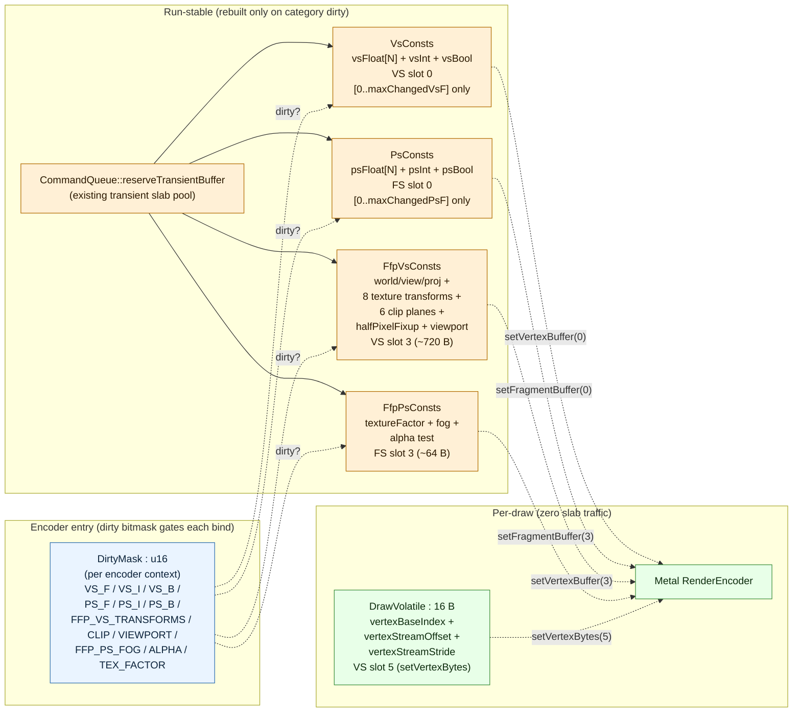
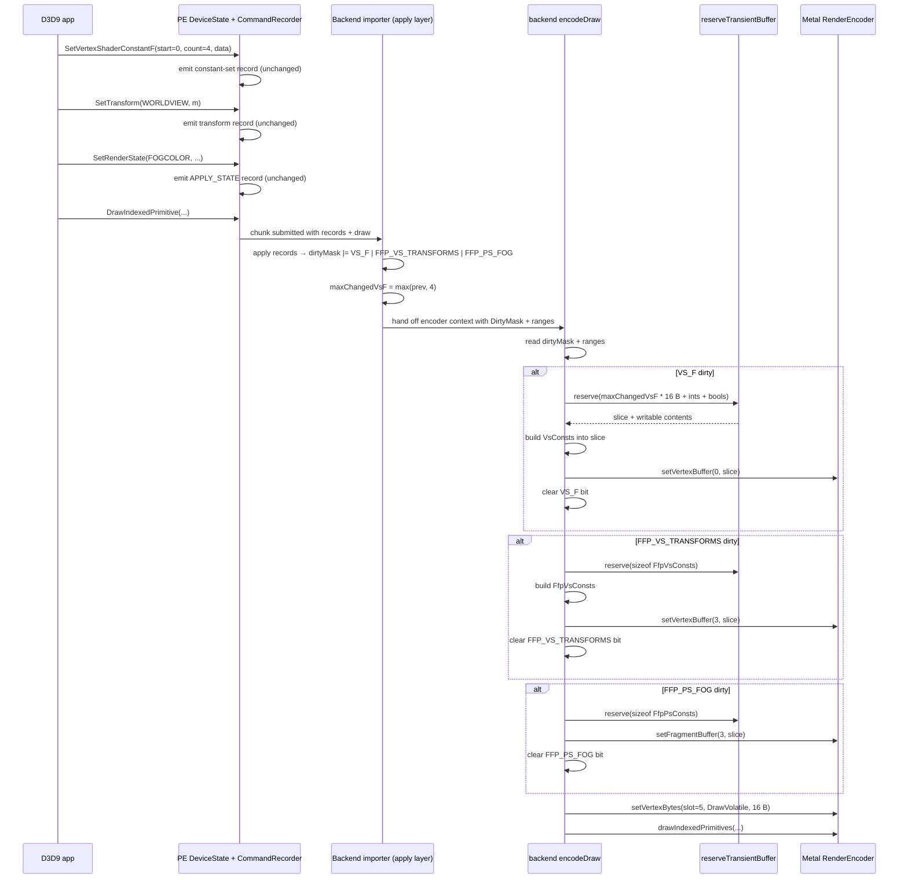
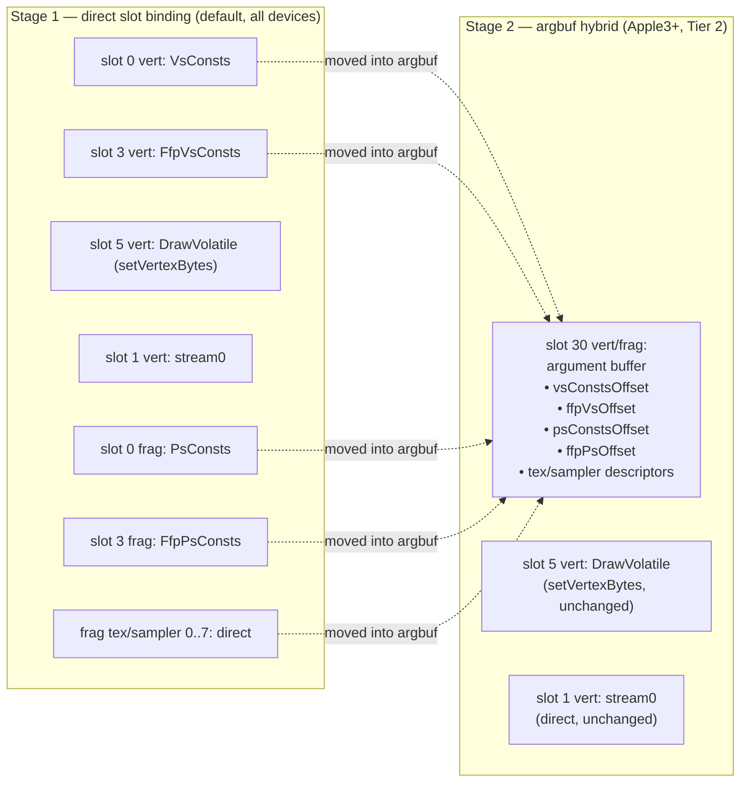
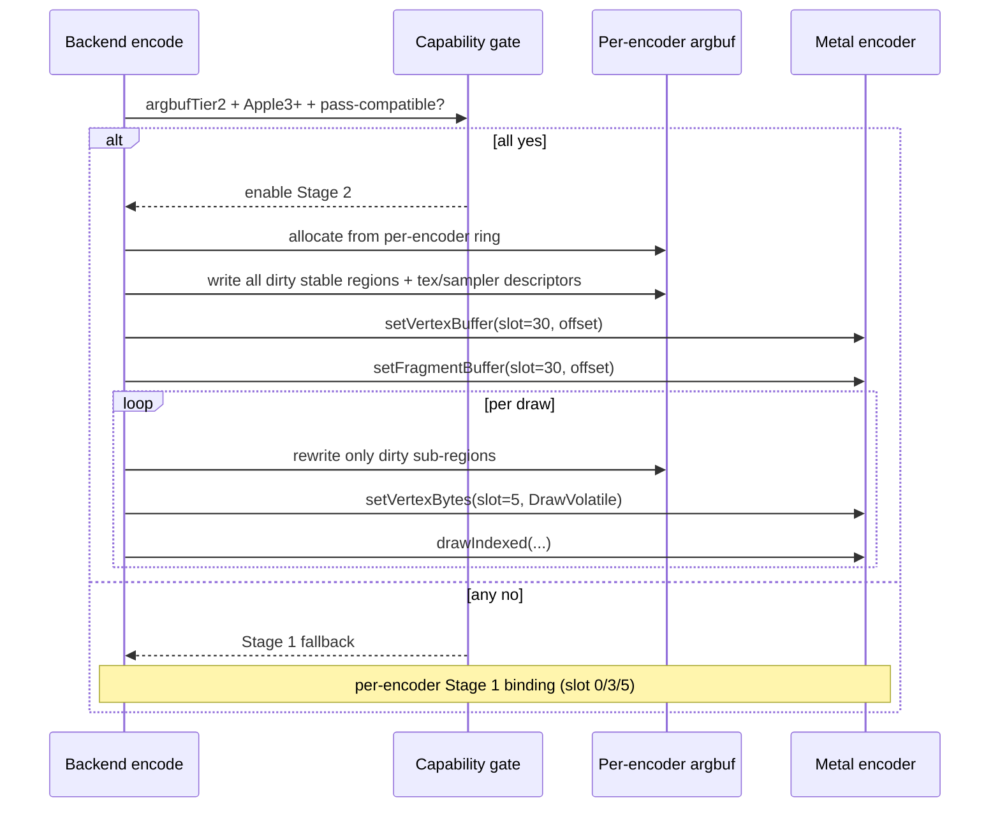

# Draw Uniforms Layout Design

This spec defines how dxmt9 splits per-draw shader uniforms and fixed-function
state across Metal binding slots. It owns the contract between the D3D9 layer's
`DeviceState` shadow, the backend's encode path, and the generated MSL shader
sources.

The goal is to remove the shared-memory write bandwidth wall observed in
`docs/perfomance-bottleneck.md` (offscreen-heavy: 1.1 GB/run written into a
single 9 KB DrawUniforms slab at ~3 GB/s effective rate, dominating the encode
path).

Reference designs that informed this layout:

- DXVK D3D9 — per-stage and per-frequency UBO split, push constants for
  scalar render state, range tracking via `maxChangedConst*`. See
  `docs/research/dxvk-d3d9.md`.
- Wine wined3d — 32-bit dirty bitmask covering 8 push-constant categories,
  vkd3d-shader compile-time field-to-offset binding. See
  `docs/research/wine-d3d9.md`.
- DXMT — per-encoder argument buffer with `setBufferOffset` updates, Metal-
  native binding model. See `docs/research/dxmt.md`.

Each reference solves a different cost dimension. dxmt9's measured bottleneck is
the per-draw write volume into Metal `MTLStorageModeShared`, so the data-shape
dimension (DXVK split + Wine bitmask) drives the design; the binding-API
dimension (DXMT argbuf) is a follow-up optimization once writes are removed.

---

## 0. Ownership

| Concern | Owner | Notes |
|---|---|---|
| D3D9 `Set*` semantics + record emission | PE `DeviceState` shadow + `CommandRecorder` | Unchanged from today; PE stays Metal-agnostic. |
| `DirtyMask` derivation from imported records | Backend importer (`device_c_*` apply layer) | Reads `D9C_COMMAND_RECORD_APPLY_STATE` / transform / light / constant records and ORs the matching backend bit. |
| Range counters (`maxChangedVsF` etc.) | Backend importer | Updated as constant-set records are applied; lives next to the encoder context, not in PE. |
| Slab sub-allocation for category UBOs | `CommandQueue::reserveTransientBuffer` | Existing API; lifetime keyed to seq-id. |
| Host-side struct build (`buildVsConsts` etc.) | `src/dxmt9/dxmt9_draw_state.{hpp,cpp}` | Pure value transforms over `FlatDrawStateView`. |
| MSL prelude declaration | `src/dxmt9/dxmt9_shader_sources.cpp::makeShaderPrelude()` | Source of truth for shader-side layout. |
| Field-to-category routing in shader | `src/dxmt9/dxmt9_shader_translator.cpp` | Each `uniforms.X` → `vsConsts.X` / `ffpVs.X` / `volatile.X` based on a static field map. |
| Per-draw `setVertexBytes` emission | `src/dxmt9/dxmt9_draw_encoder.mm` (`encodeDraw`) | Inline 16 B push, always emitted. |
| Sticky `setBuffer` emission | `src/dxmt9/dxmt9_draw_encoder.mm` (`encodeChunk` + `encodeDraw`) | Gated by dirty bits; cleared after bind. |
| `WMTRenderCommandSetVertexBytes` bridge command | `winemetal` (Metal.hpp + provider impl) | New bridge surface; section 7. |

The PE/unix boundary stays unchanged. PE never references Metal types or
binding categories; the unix encoder consumes POD records and
`FlatDrawStateView` exactly as today, but now derives a category dirty mask
during apply-time and routes per-frequency uploads accordingly.

---

## 1. Architectural Layers

The design has four orthogonal layers. Each layer reduces a different cost
dimension; they compose without conflict.

| Layer | Source | Reduces | Unit |
|---|---|---|---|
| 1. Data shape | DXVK split + sub-range upload | bytes written / draw | bytes/draw |
| 2. Dirty tracking | Wine bitmask + DXVK range counters | write frequency | category changes / draw |
| 3. Binding | sticky `setBuffer` per category | API call cost | `setBuffer*` calls / draw |
| 4. Per-draw push | Metal `setVertexBytes` | per-draw slab traffic | bytes round-tripped through slab |

Argument-buffer consolidation (DXMT-style) is captured as future work in
section 8 and is out of scope for the initial spec.

---

## 2. Binding Slot Layout



| Slot | Stage | Buffer | Update frequency | Contents |
|---:|---|---|---|---|
| 0 | VS | `VsConsts` | shader constant change | `vsFloat[0..maxChangedVsF]`, `vsInt`, `vsBool` |
| 0 | FS | `PsConsts` | shader constant change | `psFloat[0..maxChangedPsF]`, `psInt`, `psBool` |
| 1 | VS | stream0 | per draw (existing) | vertex buffer slice |
| 3 | VS | `FfpVsConsts` | FFP transform / clip / viewport change | matrices + clip planes + viewport |
| 3 | FS | `FfpPsConsts` | FFP fog / alpha / textureFactor change | small scalars (~64 B) |
| 5 | VS | `DrawVolatile` (push) | per draw (always) | `vertexBaseIndex`, stream meta |

Slot 2 and slots 4, 6+ are reserved for future categories. Texture and sampler
slots (`[[texture(0..7)]]`, `[[sampler(0..7)]]`) are unchanged.

---

## 3. Data Layouts

The host-side structs in `dxmt9_draw_state.hpp` mirror the MSL definitions
emitted by `dxmt9_shader_sources.cpp::makeShaderPrelude()`. Layout drift between
the two is a regression covered by `state_draw_transform_spec`.

### 3.1 `VsConsts` (VS slot 0)

```c
struct VsConsts {
  float4 vsFloatConst[256];   // upload only [0..maxChangedVsF]
  int4   vsIntConst[16];      // upload only [0..maxChangedVsI]
  uint   vsBoolConst[16];     // upload only [0..maxChangedVsB]
};
```

### 3.2 `PsConsts` (FS slot 0)

```c
struct PsConsts {
  float4 psFloatConst[224];
  int4   psIntConst[16];
  uint   psBoolConst[16];
};
```

### 3.3 `FfpVsConsts` (VS slot 3)

```c
struct FfpVsConsts {
  float4 ffpWorldViewProj[4];
  float4 ffpTextureTransforms[8][4];
  float4 clipPlanes[6];
  float2 halfPixelFixup;
  float2 viewportOrigin;
  float2 viewportSize;
  uint   clipPlaneMask;
};
```

### 3.4 `FfpPsConsts` (FS slot 3)

```c
struct FfpPsConsts {
  float4 textureFactor;
  float  alphaRef;
  float  fogStart;
  float  fogEnd;
  float  fogDensity;
  uint   alphaTestEnable;
  uint   alphaTestFunc;
  uint   fogMode;
};
```

### 3.5 `DrawVolatile` (VS slot 5, `setVertexBytes`)

```c
struct DrawVolatile {
  int   vertexBaseIndex;
  uint  vertexStreamOffset;
  uint  vertexStreamStride;
  uint  _pad;
};
```

`DrawVolatile` is the only structure written per draw. Padding to 16 B is to
match Metal's preferred argument alignment.

---

## 4. Dirty Tracking

The encoder context owns a `u16 dirtyMask` and per-stage range counters.

```c
enum class DirtyBit : u16 {
  VS_F = 1u << 0,  VS_I = 1u << 1,  VS_B = 1u << 2,
  PS_F = 1u << 3,  PS_I = 1u << 4,  PS_B = 1u << 5,
  FFP_VS_TRANSFORMS = 1u << 6,
  FFP_VS_CLIP       = 1u << 7,
  FFP_VS_VIEWPORT   = 1u << 8,
  FFP_PS_FOG        = 1u << 9,
  FFP_PS_ALPHA      = 1u << 10,
  FFP_PS_TEX_FACTOR = 1u << 11,
};

struct DirtyState {
  u16 dirtyMask = 0;
  u16 maxChangedVsF = 0,  maxChangedVsI = 0,  maxChangedVsB = 0;
  u16 maxChangedPsF = 0,  maxChangedPsI = 0,  maxChangedPsB = 0;
};
```

- The backend importer ORs the matching bit into `dirtyMask` as it applies
  imported chunk records (`D9C_COMMAND_RECORD_APPLY_STATE`, transform, light,
  constant-set records). The PE side does not know about Metal binding
  categories — it only emits the same records as today.
- Constant-set records (originating from `Set*ShaderConstantF/I/B`) carry the
  `(start, count)` window; the importer updates the matching backend-owned
  range counter as `max(prev, start + count)`.
- On encoder entry to a draw, the encoder consults each dirty bit. Set bits
  trigger sub-allocation from `CommandQueue::reserveTransientBuffer`, host-side
  build of the matching struct (only `[0..maxChanged]` for shader-constant
  categories), and `setVertexBuffer`/`setFragmentBuffer` to the matching slot.
  Cleared bits leave the binding sticky from the previous draw.
- On render encoder transition (new pass, new pipeline that changes binding
  layout) the encoder treats every category as dirty.
- On chunk submission, `dirtyMask` is preserved across encodeChunk calls within
  the same encoder generation; it is reset to "all dirty" when the encoder
  itself is recreated.

---

## 5. Mechanism — Per-Draw Encode Sequence



Sticky bind: a draw that does not change any category emits one
`setVertexBytes` and the `drawPrimitives*` call, with zero `setBuffer*`
overhead. This is the `offscreen-heavy` and `SFIV` common case.

---

## 6. Lifetime and Correctness

- The slab slices for `VsConsts` / `PsConsts` / `FfpVsConsts` / `FfpPsConsts`
  use the existing `transientBufferAllocations_` lifetime (sequence-id keyed,
  reclaimed by `reclaimTransientBuffersUnlocked` when the GPU completion
  watermark passes). No new lifetime tracking is introduced.
- `DrawVolatile` data lives on the encoder thread stack and is consumed
  inline by `setVertexBytes`; Metal copies into its own per-pass ring.
- The MSL prelude in `dxmt9_shader_sources.cpp` must declare `VsConsts`,
  `PsConsts`, `FfpVsConsts`, `FfpPsConsts`, `DrawVolatile` with byte layouts
  that match the host structs. Layout drift is a regression, covered by
  `state_draw_transform_spec` and a new `draw_uniforms_layout_spec`.
- Existing PSO / `MTLBinaryArchive` cache entries become invalid on adoption
  because the shader source changes. The cache key already incorporates a
  shader-source hash; no extra invalidation logic is required, but the
  on-disk cache will rebuild on first run.
- Any field that participates in a shader's behaviour must remain in exactly
  one of the four UBOs or in `DrawVolatile`. Duplicating a field across
  buffers is forbidden by spec.

---

## 7. Bridge Surface

`setVertexBytes` is not currently exposed in `winemetal`. Adoption requires:

- A new `WMTRenderCommandSetVertexBytes` command struct in the wmtcmd schema
  (mirroring the existing `WMTRenderCommandSetFragmentBytes`).
- An impl branch in `winemetal_private_api.mm` calling
  `[enc setVertexBytes:length:atIndex:]`.
- A wrapper in `Metal.hpp` matching `setFragmentBytes`'s signature.

The bridge change is local; it does not affect any record schema or PE-side
call sites until the encoder begins emitting the new command.

---

## 8. Out of Scope

- Argument-buffer consolidation (DXMT-style packed argbuf at slot 30). This
  reduces API call cost, not bandwidth, and is captured for a follow-up spec
  once the per-frequency split is measured. The four `setBuffer` calls per
  state-change can be unified into one `setBufferOffset` against a packed
  argbuf without changing the underlying data shape.
- Tier-2 argbuf with `MTLHeap`-resident stable structs and 64-bit GPU pointer
  references. Apple-native ideal; depends on argbuf consolidation as a
  prerequisite.
- vkd3d-shader-style compile-time field-to-offset parameter binding. dxmt9's
  shader generator already controls source emission, so the equivalent is the
  category routing in the shader translator (each `uniforms.X` becomes
  `vsConsts.X` / `ffpVs.X` / `volatile.X` based on a static field map). No
  separate parameter-binding facility is needed.
- Range-heap coalescing of sparse shader-constant updates (Wine GLSL backend
  pattern). Single `maxChangedConst*` counter is the small-step replacement;
  range heap is a future upgrade if a workload shows high `Set*Constant*`
  fragmentation.

---

## 9. Verification Mapping

| Requirement | Evidence target |
|---|---|
| `R-BACK-12.1` per-stage separation | `tests/native/shader/shader_transform_spec.cpp` — assert generated MSL declares `VsConsts` only on VS and `PsConsts` only on FS. |
| `R-BACK-12.2` shader / FFP separation | Same spec — assert FFP fields land in `FfpVsConsts` / `FfpPsConsts` declarations, not `VsConsts` / `PsConsts`. |
| `R-BACK-12.3` volatile / stable separation | Same spec — assert `vertexBaseIndex` etc. appear only in `DrawVolatile` declaration. |
| `R-BACK-12.4` no field duplication | New `tests/native/core/draw_uniforms_layout_spec.cpp` — assert each field name appears in exactly one struct. |
| `R-BACK-12.5` slot assignment | Same shader spec — match expected `[[buffer(N)]]` literals in MSL. |
| `R-BACK-12.6`–`12.7` unchanged slots | Existing shader spec coverage preserves these. |
| `R-BACK-12.8`–`12.12` dirty tracking | New `tests/native/core/draw_uniforms_dirty_spec.cpp` — exercise `DeviceState` shadow with mock `Set*` calls; assert `dirtyMask` bits and range counters. |
| `R-BACK-12.13`–`12.15` lifetime | `tests/native/backend/allocation_counter_spec.cpp` extension — count slab reservations per category and verify reclaim on seq-id retirement. |
| `R-BACK-12.16` host-MSL layout match | `tests/native/core/draw_uniforms_layout_spec.cpp` — `static_assert(offsetof + sizeof)` mirrored against parsed MSL prelude. |
| `R-BACK-12.17` cache key | Existing shader-source-hash cache key tests preserve this. |
| `R-BACK-12.18` static struct sizes | `static_assert` blocks in `dxmt9_draw_state.hpp` plus the layout spec. |
| `R-BACK-12.19` per-draw write bound | `experiments/apps/PerformanceProbe` rerun under `dxmt9-perf-offscreen-heavy` — assert new `uniform_*_bytes` counters scale with state churn, not draw count. |
| `R-BACK-12.20` per-draw API call bound | Same probe — assert `setBuffer*` calls/draw approach 0 on the sticky-bind common case. |
| `R-BACK-12.21` counter coverage | `scripts/assert_perf_counters.py` extension — fail if expected `uniform_*` keys missing. |

TLA+ is not required for this spec; the queue/lifetime invariants are
unchanged from the existing transient-slab model and continue to be
covered by `dxmt9-verify-tla`.

---

## 10. Trade-offs

| | |
|---|---|
| ✅ Per-draw write 9080 B → 16 B | shared-memory write bandwidth wall removed |
| ✅ Sticky bind via dirty bitmask | non-state-changing draws emit zero `setBuffer*` |
| ✅ Range-only upload of shader constants | FFP-only apps using ≪256 vs constants pay only for what they use |
| ✅ Reuses existing `reserveTransientBuffer` | no new allocation infrastructure |
| ⚠️ Up to 5 binding calls per draw on full state churn | mitigated by sticky bind; expected to be rare in real workloads |
| ⚠️ Shader generator must route every `uniforms.X` reference to the matching category | mechanical change; covered by layout spec test |
| ⚠️ One-time PSO / shader binary cache rebuild on adoption | accepted contract change; cache keys already shader-hash-aware |
| ❌ Tests in `backend_key_descriptor_spec` and `state_draw_transform_spec` reference the unified `DrawUniforms` layout | explicit update required as part of adoption |

---

## 11. Stage 2 — Argument-Buffer Hybrid (Apple Silicon)

Stage 2 layers an Apple-Silicon-only argument-buffer path on top of the
Stage 1 per-frequency UBO contract above. It is described by
`R-BACK-12.22` through `R-BACK-12.26`. Stage 1 must remain the default and
the conformance reference; Stage 2 is opt-in based on capability and
benchmark.

### 11.1 Layout transition



The vertex-stream and `DrawVolatile` paths are intentionally untouched.
Vertex streams are too large to live in argbufs; `DrawVolatile` already
uses `setVertexBytes` (Metal inline data) which is the equivalent of
push constants and beats argbuf for ≤16 B per-draw data.

### 11.2 Per-encoder argbuf shape

```
ArgumentBuffer (one per render-pass encoder, MTLStorageModeShared):
┌────────────────────────────────────────────────┐
│ vsConstsOffset  → embedded VsConsts            │
│ ffpVsOffset     → embedded FfpVsConsts         │
│ psConstsOffset  → embedded PsConsts            │
│ ffpPsOffset     → embedded FfpPsConsts         │
│ texSlots[0..7]  → MTLResourceID (texture)      │
│ samplerSlots[0..7] → MTLResourceID (sampler)   │
└────────────────────────────────────────────────┘
                       ↑
          setVertexBuffer(slot=30, offset)
          setFragmentBuffer(slot=30, offset)
          (each emitted once per encoder)
```

Tier-2 argument buffers store sampler/texture handles directly as
`MTLResourceID`. The encoder writes them into the argbuf at encoder open
and only updates them when a binding changes; this matches the dirty mask
already maintained in Stage 1.

### 11.3 Selection sequence



### 11.4 Why this is not just "single argbuf" (DXMT shape)

DXMT bundles vertex stream tables, all per-stage constants, and per-draw
arguments into one giant argbuf at slot 30. dxmt9's hybrid keeps
**volatile per-draw data on `setVertexBytes`** (push-constant shape) and
**vertex streams on direct binding**, because:

- per-draw `DrawVolatile` (16 B) is faster as inline data than as an
  argbuf offset rewrite — Metal optimizes `setVertexBytes` aggressively;
- vertex streams are too big to round-trip through argbuf write; direct
  bind is a no-op when unchanged;
- D3D9 lacks DXBC argbuf reflection metadata, so packaging streams the
  way DXMT does adds work for no gain.

The hybrid keeps Stage 1's per-frequency dirty model and only consolidates
the **stable** regions into argbuf storage.

### 11.5 Trade-offs (Stage 2)

| | |
|---|---|
| ✅ One bind per encoder for stable state | replaces 4–6 `setBufferOffset` calls per encoder |
| ✅ `useResource:`/`useHeap:` reduction | argbuf binds resources collectively |
| ✅ Dirty-mask reuse | Stage 2 inherits Stage 1's category granularity |
| ⚠️ Argbuf encode cost on first dirty | mitigated by per-encoder amortization |
| ⚠️ Capability split: behavior identical, code diverges | conformance enforced via shader-runner equality |
| ❌ Disabled on non-Apple-Silicon | acceptable; Stage 1 stays the floor |
