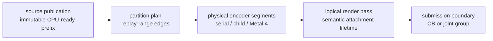
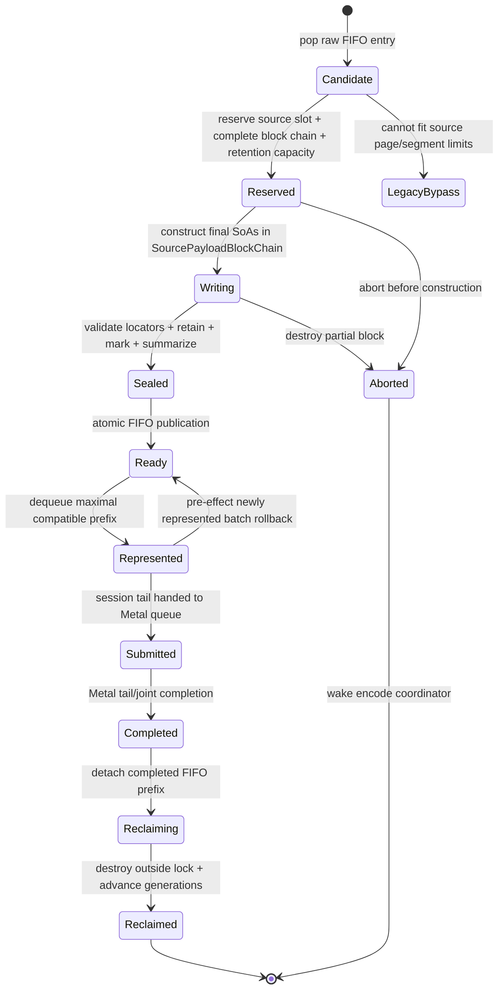
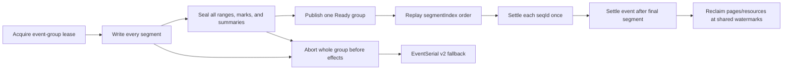

# Encode Scheduling Spec

This spec connects CPU-ready publication, bounded ready-prefix consumers,
`EncodeSession` pass streaming, production partition planning, and the optional
parallel Metal execution lanes. The parent [backend spec](../spec.md) owns the
command queue and imported record format; this topic owns scheduling after
validated immutable storage exists.

The comparative [Metal render-pass research note](../../../docs/research/metal-render-pass-lifecycle.md)
is non-normative. The requirements in this topic define dxmt9 behavior.

## 1. Boundary Vocabulary



The arrows show possible scheduling progression, not equivalence. In
particular, publishing or partitioning a source must not create a Metal
boundary. A logical pass may span several sources and, in the Metal 4 lane,
several physical command buffers. A real semantic boundary always ends the
logical pass; Metal 4 does not cross it.

## 2. Ownership

| Owner | Owns | Must not own or mutate |
|---|---|---|
| Import/replay worker | FIFO raw replay, canonical resource summaries, immutable CPU-ready publication | Metal encoders, partition-worker state, reordered replay |
| CPU-ready store | bounded source metadata, retained storage references, admission/publication watermarks, fixed pressure wake state | D3D9 semantic decisions, release fences, or GPU completion |
| Encode coordinator | `EncodeSession`, logical pass, CB or joint group, parent parallel encoder, source and partition order, finalization | PE state or worker-local child state |
| Serial executor | current range and coordinator-owned native shadow | asynchronous borrowed spans |
| Partition worker | immutable range, child/segment encoder, partition-local native shadow | session-global hazards, pass actions, completion, source storage mutation |
| Finish thread | ordered source completion expansion after tail/joint completion | pass or partition planning |
| Presenter | drawable acquisition, `presentDrawable`, present token | offscreen source publication or worker scheduling |

Published source payload remains owned by queue storage. In the promoted tape
lane, `ChunkSlot` becomes a control shell that references a
`SourcePayloadBlockChain`; it no longer owns the replayed SoA vectors. One
logical source owns the whole ordered chain and one completion identity. The
replay worker constructs every SoA and re-entrant owner, including shader-layout
context, directly in the chain's reserved page runs. Sealing hands the complete
chain to the queue in O(1) by locator. There is no `ChunkSlot -> tape` payload
copy and no independently published block. `SourcePayloadView` is the sole
read-only payload input to FrameGraph construction, replay planning, and serial
encoding. `SessionSourceRef`, FrameGraph command references, and partition
snapshots are compact generation-checked `(retainedSourceIndex, commandIndex)`
or equivalent source-qualified locators; they do not copy payload arenas or
retain transient resolved spans. `sourceOrdinal` names only the monotonic global
publication order, never a source-table index.

The physical command buffer is not call-local while `OpenStreaming`. The
coordinator-owned session envelope or pending `QueueSubmissionRecord` owns it;
each synchronous `encodeChunk()` call borrows it. Finalization moves that same
ownership into submitted queue storage, so neither the source nor a transient
encode stack frame can drop an open command buffer.

### 2.1 Direct replay construction transaction

This section specializes the architecture lifecycle and owns the proposed
`TransactionalChunkSlotAssembler`. PE final-blob construction remains owned by
the recorder spec.

The planner validates the immutable `RawOwned` blob and computes bounded
counts, alignments, page runs, source segments, and retained-resource capacity.
It may retain compact masks and source-qualified offsets, but no
encoder-visible record bytes. Queue admission then reserves the final control
shell and Arena regions. The reservation returns one move-only transaction
owner; typed sinks issued from it are non-copyable, non-movable, thread-bound,
and call-local.

```text
RawOwned --begin replay--> ReplayBorrowed
  --reserve final regions--> TransactionalChunkSlotAssembler::Reserved
  --typed build--> Building
  --validate exact prefixes/resources--> Built
  --infallible commit--> FinalOwned / immutable Ready source

Reserved | Building | Built --pre-effect failure--> rollback --> RawOwned
Building | Built --semantic/Metal effect--> fail-stop (no legacy retry)
```

The assembler owns destruction state for each constructed SoA element and
re-entrant owner. Rollback walks that state in reverse, releases retains, and
returns pages/control/sequence reservation as one transaction. Commit transfers
the same regions to the immutable source and invalidates every builder sink.
`ChunkSlot` is the queue control shell; the Arena chain is its payload
destination, not a separately published source. The encoder later reacquires a
fresh generation-checked borrow through `SourcePayloadView`.

Direct draw construction replaces the current shape
`DrawRunSubmission -> submitDrawSubmissionBatch -> ChunkSlot::appendDrawRunBatch`.
The destination sink accepts the surviving canonical state once per compatible
run, per-draw compact params and payload locators, and direct final byte ranges.
Binding snapshots and resource summaries are resolved before commit but stored
once. A conservative reservation may leave unused tail capacity; no used prefix
may be moved or recopied.

The ordinary synchronous path uses the same transaction without selecting
CPU-ready Tape. Production selection follows one default-on backend policy
constant plus the `DXMT9_DIRECT_CHUNK_SLOT_REPLAY` override and is forced off
by `DXMT_TRACE_RENDER`; exact `0` remains the Legacy rollback independently of
the policy constant.
When selected, it borrows the current compatibility source by exact
`(sourceId, storageGeneration, controlIndex, seqId, buildGeneration)`, reserves
the final `ChunkSlot` vectors, including the planner's complete nested
`clearRects` count, replays directly, and commits while leaving that slot in
`Writing`. Direct Clear values transfer their already-owned rect vectors after
reservation, so the direct append cannot allocate nested rect storage; rect
overflow is rejected before mutation. Present/Flush therefore closes the same
source, command buffer, and render-pass boundary as Legacy. Direct reservation
is admitted only on a fresh writing slot: reserving behind a used vector prefix
could relocate already-final bytes, so a populated slot is a typed pre-effect
Legacy fallback. Segmented raws, UP draws, ordered controls/readback,
standalone/nonterminal/duplicate Present, capture/trace, oversize, and
structural rejects likewise retain explicit dispositions. The narrow `optional
leading Clear + non-UP Draw/APPLY_STATE/constants + exactly one terminal Present` shape
uses the typed `DirectWithPresentTail` route: Present acquisition remains
coordinator-owned, its descriptor/source/token/boundary policy is staged in the
direct build context, and the coordinator appends it inside the assembler
transaction so its resource closure is covered by evidence; only publication
occurs after assembler evidence commits. Deferred present completion drains before
boundary application. Once replay effects begin, any generation, append, validation,
resource-closure, or
evidence failure is fail-stop and cannot retry the raw through Legacy.

The ordinary representation was promoted after the production Metal readback
oracle and the same-build GT1/GT2/GT3/SFIV wild matrix closed R-BACK-2.87 on
2026-08-31. This is a representation promotion, not an FPS claim: only the GT2
ledger run selected the Direct lane non-vacuously, and exact `0` remains the
rollback while broader Wine fault injection remains residual evidence.

The differential harness compares semantic command records and exact payload
bytes after both paths have completed their own representation-specific build.
It also compares the effective queue observer stream, retain/release counts,
pre-effect rollback, and post-effect fail-stop. Process-local addresses,
container capacity, and padding are excluded. Only the architecture copy ledger
may claim removal of `copy.replay-submission-carrier`.

The stage observer is driven by the actual transition owners and produces one
bounded event per state change:

| Abstract stage | Queue event source |
|---|---|
| `ProducerOwned -> RawOwned` | authenticated bridge adoption and wrapper ownership |
| `RawOwned -> ReplayBorrowed` | replay capability acquisition |
| `ReplayBorrowed -> FinalOwned` | assembler commit / source Ready publication |
| `FinalOwned -> Encoding` | exact source borrow by serial or selected partition execution |
| `Encoding -> GPUInFlight` | receipt activation or submitted completion authority |
| `GPUInFlight -> Completed` | ordered completion/device-loss settlement and completion-waterline publication |
| `Completed -> Reclaimed` | final resource/page/receipt release after completion authority |

Early payload retirement stutters within `GPUInFlight`: it may release payload
pages only after a receipt owns completion, and it must not claim that resource
waterlines or GPU work were reclaimed. State-only, inline zero-GPU, and
pre-effect rejected work use explicit terminal dispositions. The observer
cannot influence scheduling,
retain spans, or invent a missing milestone.

Dependencies and gates are strict: planner bounds and heterogeneous replay
projection precede the assembler; transactional rollback precedes direct build;
legacy/direct native equivalence and the formal ownership/progress refinement
precede GPU validation/readback; those precede wild counters and any default
change. Non-goals are command fusion, state or mutation merging, changed
logical-pass/CB shape, a pointer-bearing locator, unbounded reservation, and
deleting compatibility replay during this workstream.

### 2.2 Render Scheduling Provider Configuration

Scheduling policy resolves into one queue-immutable value rather than a set of
hot-path environment checks:

```text
RenderSchedulingProviderConfig {
  SourceDeliveryMode sourceDelivery       // Compatibility | Streaming
  PartitionExecutionMode partition        // IdentitySerial | ExplicitSerial | ExplicitParallel
  SegmentExecutionMode segmentation       // Disabled | Metal4
}
```

These are stable provider modes under
[`R-BACK-42.*`](../render-provider/requirements.md), including modes whose
implementation is still partial or planned. Default promotion and feature
availability are therefore separate from selector lifetime.

The axes compose without hidden implications:

| Axis | Stable modes | Ownership change | Does not change |
|---|---|---|---|
| Source delivery | `compatibility`, `streaming` | Payload-owning compatibility source versus bounded Tape publication and multi-source session admission | Effective replay semantics, partition policy, Presenter, or completion order |
| Partition execution | `identity`, `serial`, `parallel` | Identity cursor, explicit ranges on the coordinator, or explicit ranges on ordered parallel children | Source representation, logical-pass actions, command-buffer count, or semantic optimization |
| Segmentation | `off`, `metal4` | One serial/parallel command-buffer envelope versus a bounded jointly committed Metal 4 group | Logical-pass boundary, source order, or partition eligibility |

This produces deliberate comparison lanes. For example,
`compatibility + serial + off` isolates the production planner from Tape
storage, and `streaming + identity + off` isolates source streaming from
partition subdivision. `compatibility + parallel + off` remains a valid target:
workers consume immutable source-qualified locators and must not depend on
Arena page ownership. A parallel request still falls back per pass when the
pass is unsealed, too small, hazardous, or otherwise ineligible. A Metal 4
request falls back at queue creation when capability is absent and per group
when bounded validation rejects the candidate.

`DXMT9_RENDER_SOURCE_MODE`, `DXMT9_RENDER_PARTITION_MODE`, and
`DXMT9_RENDER_SEGMENT_MODE` are the canonical configuration surface. The
existing `DXMT9_CPU_READY_TAPE` spelling is only a migration alias for source
delivery. Resolution occurs once before queue-owned storage or workers are
created. The startup log and perf snapshot record both requested and resolved
values plus a typed fallback reason; no draw, source, or partition rereads the
process environment.

Provider selection is below FrameGraph semantic selection. It neither selects
`passcoalesce`/DCE nor changes `DXMT9_RENDER_MODE` or the compatibility profile.
This separation keeps a rendering-provider A/B from silently changing command
meaning. It also makes promotion monotonic: a new default may use a more capable
provider, while every earlier supported mode remains a first-class rollback and
regression lane.

## 3. CPU-Ready Tape

### 3.1 Physical Layout

`CpuReadyTape` is created with the command queue and never grows after queue
initialization. It contains:

```text
CpuReadyTapeConfig {
  pageSize, pageCount, sourceSlotCount, readyFifoCount
  retentionEntryCount, allocatorTicketCount
  maxPagesPerPayloadSegment, maxPayloadSegmentsPerSource, maxPagesPerSource
  maxRetainedHandlesPerSource
  maxSessionSources, maxSessionPages, maxSessionBytes, maxSessionDraws
  maxDirectReservationFootprint[dimension]
  successorHeadroom[dimension]
  highWater[dimension], lowWater[dimension]
}
```

Every value is immutable after queue creation. For every bounded dimension,
`0 <= lowWater < highWater <= hardCapacity`; all derived products and byte
ranges are overflow-checked before allocation or reservation. Exact defaults
are policy, but the configured values and rejected invalid configurations are
observable. For every admission dimension,
`maxSessionFootprint + successorHeadroom <= highWater`, and
`successorHeadroom >= maxDirectReservationFootprint`. The reservation footprint
includes deterministic circular-wrap padding and every descriptor or ticket
charged by construction, not only used payload pages. The default-off
compatibility profile and the opt-in streaming profile may choose different
aggregate capacities while retaining the same semantic limits; selecting a
streaming profile must not change default-off allocation or admission policy.

| Region | Shape | Owner |
|---|---|---|
| Source table | fixed ring of `CpuReadySourceSlot` control records | scheduling lock |
| Page arena | fixed-size pages in one circular backing allocation | source reservation, then finish-thread reclaim |
| Ready FIFO | fixed ring of `CpuReadySourceId` | scheduling lock |
| Retention table | bounded generation-stamped blocks of retained backend handles | source lifetime |
| Allocator tickets | bounded locators for uniform, binding, and transient ranges | source lifetime |

A source receives an ordered chain of one or more packed payload segments. Each
ordinary segment is one contiguous, non-wrapping page run no larger than
`maxPagesPerPayloadSegment`; the sum of all source runs may not exceed
`maxPagesPerSource`, and the number of ordinary plus jumbo segments may not
exceed `maxPayloadSegmentsPerSource`. When the circular tail cannot fit the next
run before the backing end, deterministic padding advances to page zero; the
padding remains unavailable until older FIFO allocations reclaim. A segment
packs consecutive regions and records without a gather copy. A record is never
split: if one canonical record does not fit the ordinary segment cap, a
dedicated jumbo segment may exceed that cap but remains subject to the source
page and segment-count limits.

```text
CpuReadySourceId  { sourceSlotIndex, sourceGeneration }
SourcePayloadBlockId { sourceSlotIndex, sourceGeneration, segmentIndex,
                       firstPage, pageCount, pageGeneration, jumbo }
SourcePayloadBlockChain { sourceId, blockIds[], totalPages, usedBytes }

SourcePayloadLayout {
  reservedBytes, usedBytes, maximumAlignment
  headerOffset, recordOffset, drawRunOffset, drawParamOffset, stateOffset
  uniformOffset, bindingOffset, ownerOffset
  exactOrUpperBoundCapacity[region], actualCount[region]
}

PublicationTicket {
  id, payloadBlockChain
  rawOrdinal, sourceOrdinal, seqId
  state: Writing | Sealed | Aborted
}

CpuReadySourceRef {
  id, payloadBlockChain
  sourceOrdinal, seqId
  recordRange, drawRunRange, drawParamRange, stateRange
  uniformRange, bindingRange, retainedHandleBlock, allocatorTickets
  accessSummary, semanticSummary
  flags: hasPresent, mayAcquireDrawable, legacyBypass
}
```

Every page in a run carries the same allocation generation and owner source ID.
Ordered reclaim first changes the slot to `Reclaiming`; resolution rejects that
state even though its generation has not advanced yet. After out-of-lock owner
destruction and resource release, reclaim increments both the source-slot
generation and reclaimed page generations in one scheduling transaction.
Resolution validates state, all generations, the declared page run, and its
byte extents before returning a span. A mismatch is stale-reference failure,
never a reason to inspect reused storage.

`SourcePayloadBlockChain` is the final home of imported command headers, typed
records, draw params, state records, uniform and binding bytes, and re-entrant
queue-local owners such as `DrawShaderLayoutContext`. Each block uses
arena-backed SoA regions constructed directly in its reserved run.
`SourcePayloadLayout` fixes aligned, non-overlapping region offsets and stable
global command indices before construction. Each region reserves its exact or
conservative upper-bound capacity once, appends without reallocation or
relocation, and publishes only `actualCount`; bounded unused slack remains
inaccessible and pinned until reclaim. Destruction at reclaim runs every block's
explicit owner destructors before any page generation advances. The
control-shell `ChunkSlot` contains only lifecycle state and IDs into this
storage. `SourcePayloadView` resolves across the chain synchronously while
presenting one logical ordered command stream; block boundaries are invisible
to FrameGraph ownership, replay order, partitioning, and completion. The
EventSerial lane has one source identity for this view. The opt-in SegmentSerial
lane may project one PE event's ordered record stream into a bounded group of
identity-bearing source segments. That projection is an identity and lifetime
boundary, not a physical-block boundary: segment records are contiguous and
complete, segment identities are strictly ordered, and a logical pass may
continue across an edge.

`Represented` and `Submitted` are lifetime pins, not locks. After the
coordinator resolves a generation-checked locator, the synchronous encode call
may borrow call-local spans with the scheduling lock released because ordered
completion prevents reclaim. Those spans cannot be stored in the session,
partition job, submission record, callback, or Metal callback. Re-entrant owner
destruction always occurs after the finish thread detaches the completed prefix
and releases the scheduling lock.

The legacy single-source lane retains its current payload-owning `ChunkSlot`, or
an equivalent dedicated `LegacyPayloadBlock`, as a no-copy rollback during
migration and for a valid source whose final chain exceeds the tape's total page
or segment-count limit. It is drained in FIFO order, disables pass streaming for
that source, and never copies a sealed source into the tape. Query-, Readback-, or
`UpdateTexture`-dependent work also remains in an explicit ordered non-payload
control/compatibility disposition until canonical Arena sizing and ownership are
defined. A source larger than both the negotiated chunk limit and the rollback
limit is rejected as already-invalid input.

### 3.2 Publication and Admission

The raw queue supplies one already assigned `rawOrdinal` and `seqId` per PE
event. After all required bounded capacity is reserved, the single replay
worker assigns global `sourceOrdinal` and segment `seqId` values in strict
event/segment order and publishes a compact `PublicationTicket`. The ticket,
not any payload block, is visible while construction continues. v2 `EventSerial`
fixes one source identity for the event and remains the compatibility path even
when v2 `SegmentSerial` is requested but cannot be proved. SegmentSerial fixes
the complete ordered event-to-segment mapping; all segment identities are
published or aborted together and are never reused. The retired
`dxmt9.render_tape.identity.v1` sidecar is rejected before staging or provider
effects and is never reinterpreted as EventSerial. No segment may become Ready
alone, and a later event cannot bypass an earlier event group.



The protocol is:

1. The replay worker pops one raw FIFO entry without holding the scheduling
   lock, validates every wire header, length, nested range, and arithmetic
   product, and computes one complete `SourcePayloadBlockChain` layout from
   structural counts only. The packing pass preserves command order and stable
   command indices, starts a new ordinary segment when the next indivisible
   record will not fit, and assigns an oversized indivisible record to one jumbo
   segment. It rejects or selects ordered legacy rollback before construction
   if the total page or segment-count limit cannot hold the source.
   Exact counts are preferred; conservative upper bounds are permitted when
   fixed by validated wire metadata. This sizing pass does not execute shader,
   state, or draw semantic transformation and cannot replay the transform twice.
   It then obtains the existing unix-owned wire/retention inputs, canonical
   resource identities, captured backing snapshots, and raw-residency tokens
   fixed synchronously at commit admission. The default-off path never enters
   this planner and retains the historical combined synchronous mark/capture.
2. Under the scheduling lock it reserves one source descriptor, every page run
   and block descriptor in the chain, retention entries, and allocator-ticket
   capacity as one transaction. Failure leaves every cursor unchanged and
   exposes no ticket. Success fixes the three identities and publishes one
   `Writing` `PublicationTicket` for the immediate successor; no payload range
   is yet resolvable.
3. It releases the lock, binds each arena-backed SoA to its precomputed block
   region with capacity reserved once, and constructs the final
   `SourcePayloadBlockChain` in place. Append cannot allocate an unplanned
   payload extent, relocate an earlier element, split a record, or leave
   growth-history extents. Only the ticket control record is visible in
   `Writing`; every source payload block and summary remains unavailable to
   scheduling.
4. It completes nested-range validation, retention, exact resource marking for
   the admitted source `seqId`, access/semantic summaries, and explicit owner
   construction. An error before seal destroys the partial block and returns the
   whole reservation; deferred replay failure follows the existing fail-stop
   contract.
5. Under the scheduling lock it seals every extent and block, changes the ticket
   to `Sealed`, publishes the source as `Ready`, retires the construction ticket,
   appends the source ID to the FIFO, and wakes the encode coordinator in one
   transaction. No segment has an intermediate Ready state. No later source can
   publish around it because the replay worker is single-writer.
6. The coordinator copies a finite FIFO prefix of IDs and summaries without
   changing ownership, then moves only its maximal compatible prefix from
   `Ready` to `Represented` in one transaction. The suffix never leaves
   `Ready`, and the coordinator retains no pointers while the lock is released.
7. After the final synchronous encode borrow, an eligible source installs a
   bounded generation-stamped completion receipt. The coordinator marks and
   detaches its payload as `Reclaiming` under the scheduling lock, destroys
   re-entrant owners outside the lock, then relocks to return physical credits
   and advance page/source generations. Submission records retain the receipt,
   callbacks/resources, and encoded-work identity. Ineligible or legacy
   identities retain the same two-phase operation after Metal completion.

### 3.2.1 v2 identity groups and settlement

`EventSerial` and `SegmentSerial` are identity projections over one PE event;
they are not aliases for physical Arena blocks. v2 EventSerial has exactly one
identity entry for the complete event record range. v2 SegmentSerial has a
bounded ordered group:

| Value | Contract |
|---|---|
| Event group | One raw FIFO event ordinal, one generation-stamped group lease, one capture token, and one complete event-local record partition. |
| Segment identity | One contiguous non-empty record range, one `segmentIndex` derived from group position, one `sourceOrdinal`, one `seqId`, one retention lifetime, and one completion source. |
| Physical block | Storage only; it carries no independent source identity, completion, DAG, or pass boundary. |
| Event settlement | A value-owned final status published only after every segment receipt settles in flattened FIFO order. |

The group lease is acquired under the tape metadata lock before any segment is
constructed. It reserves the aggregate descriptor, identity-slot, page/block,
retention, resource-mark, publication-control, and session-headroom vectors for
all segments. The lease stores the event ordinal, segment count, exact record
ranges, and the next identity pair. Assignment walks `(eventOrdinal,
segmentIndex)` in order and increments `sourceOrdinal` and `seqId` once per
segment. A failed checked sum, limit, generation, or resource claim restores
all cursors and releases the whole lease; no partially assigned identity is
observable.

The group follows one lifecycle transaction:



`Ready` is a group state, not a segment state. The encode coordinator may
consume the group through one `EncodeSession`; it must preserve segment order,
natural FIFO completion registration, and the complete event record coverage.
FrameGraph builds one DAG over the event view. A pass and its action ledger may
continue over an adjacent identity edge only when the membership pieces are
contiguous and agree on pass identity, attachment/sample shape, exact hazards,
and load/store semantics. An identity edge is never itself a DAG, logical-pass,
command-buffer, or submission boundary.

Each segment registers one generation-checked completion receipt. The finish
thread settles receipts in flattened event/segment order and emits event
settlement only after the final segment. For a resource referenced by several
segments, the retention and use stamp use the greatest applicable segment
watermark. Page runs, publication controls, and group-lease credits remain
owned until every receipt is activated, settled, and detached; an early segment
completion cannot reclaim storage needed by a later segment. Duplicate, stale,
or ABA receipts fail before callbacks, resource-watermark advancement, or
reclaim.

If v2 SegmentSerial validation fails before receipt activation, child/segment
creation, or any Metal effect, the coordinator discards the group and replays
the complete PE event through v2 EventSerial with the same record order and
Presenter/pass/action/resource contracts. After that effect boundary, failure
is fail-stop and cannot publish a mixed group or partially fall back. v1 is
never a fallback.

### 3.3 Capacity and Back-Pressure

Hard capacities are fixed at queue creation for source descriptors, pages/bytes,
ordinary pages per payload segment, payload segments per source, total pages per
source, retention entries, allocator tickets, ready FIFO entries, and session
source references. Each aggregate pressure dimension has fixed high and low
watermarks; the three per-source packing limits are validated independently
before transactional reservation.
Admission closes when the head candidate would cross any high watermark. Once a
dimension closes admission it remains closed until ordered reclaim takes that
dimension to or below its low watermark; the same head candidate is then
re-evaluated. This hysteresis and FIFO head-of-line rule make admission
independent of timing and worker scheduling.

SegmentSerial admission passes the complete bounded layout span into both begin
and wait. `cpuReadyArenaControlSlotsFreeLocked` is their single control-capacity
predicate: it checks every required slot in the contiguous ring range beginning
at `writeIndex`. The wait remains one condition-variable interval; a wake with
only a prefix free re-evaluates and parks again, while the one-source overload
delegates with a span of length one. Batch Tape waiting uses the batch admission
probe, so a later layout is validated and the request is never projected through
the first layout alone.

Before the first source of a streaming session becomes `Represented`, the
coordinator acquires one generation-stamped `SessionCapacityLease`. The lease
reserves a fixed physical-residency vector and a separate `successorHeadroom`
vector large enough for one worst-case ordinary Direct candidate. Submitted
older payload residency may delay lease acquisition until retirement or legacy
reclaim; it may not shrink a lease or force an already-open session to submit.
Acquisition atomically incorporates the already-resident Ready head into the
lease account; those pages and descriptors are not double-reserved. Actual
session sources separately charge encoded-unsubmitted source, draw, and
command-buffer work until submission. The deterministic source-work cap is
128; physical retirement cannot reduce it or choose a session boundary.

The first-acquisition observation is state-aware. `CpuReadyTape` returns a
typed snapshot with `olderUnavailable` separate from at most one unique,
generation-valid ordered-tail `Writing` publication reservation. The
coordinator credits that Writing source only when every source/page/byte/block/
Ready/retention/ticket field in its exact physical claim is no greater than the
corresponding `successorHeadroom` field. The unchanged
`SessionCapacityLeaseState::acquire` then sees only `olderUnavailable`, while
the resulting lease continues to own the complete fixed successor vector.
Abort or seal after acquisition is therefore safe: neither transition changes
the lease size or transfers lease ownership back to the writer.

All tentative representation, encoding, submitted, completed, and reclaiming
states remain in `olderUnavailable`; so does a structurally valid writer whose
claim exceeds headroom. Multiple writers or a writer without the exact
tail/publication identity invalidate the snapshot. That structural failure or
checked-add overflow poisons the queue before the capacity-generation wait.
Only a valid unavailable-capacity denial may wait for a later
capacity-releasing generation. The shared
`classifyFirstLeaseCapacityWait` action gives generation progress priority over
pressure. With no generation change, one live Arena admission waiter may spend
one local serial-progress token at most once for each exact denied
`(seqId, sourceOrdinal)` non-Present Direct Arena Ready head, only after
`FirstLeaseReadyHeadCapacityView::ordinaryShape` proves
the semantic payload-page shape against `ordinaryDirect` and
`fullReservation` independently proves payload plus circular-wrap padding
against high-water. Lease and physical-retirement accounting also retain
`fullReservation`; the typed view does not transfer, forgive, or double-count
padding ownership. The consumed identity remains unavailable even if the
capacity generation changes. When standalone execution advances the FIFO, a
different Ready identity owns a distinct finite token and may make further
progress in the same capacity generation; the fixed Ready/source bounds limit
the episode, and no identity may execute twice. A generation change still wins
classification priority over pressure.

The physical byte credit is a typed
scheduler-owned Tape charge, not a universal physical-memory measure and not
`SourceSemanticSummary::byteCount`: Arena charges its exact constructed Tape
byte extent, while Legacy charges its reserved Tape pages because its
publication extent describes compatibility payload traversal. Legacy
`ChunkSlot` vector heap bytes are outside this byte axis and are bounded only
indirectly by compatibility source and slot limits. The independent source,
page, payload-block, retention, ticket, Ready, and command-buffer credits
continue to bound the Legacy lane. Eligible sources return these physical
credits only after receipt activation and two-phase payload finish; encoded
work remains charged until deterministic submission. Present, pending clear,
query/readback/update, ordered control, and any remaining borrow are ineligible
and retain Tape ownership until normal ordered completion and reclaim.

The planner computes each candidate's complete reservation footprint before
construction, including non-wrapping segment runs, circular-wrap padding,
source/Ready descriptors, retention, and allocator tickets. A candidate within
the ordinary Direct bound is admitted only from `successorHeadroom`. A larger
candidate is classified deterministically before construction as an isolated
bounded Arena session, ordered legacy rollback, or invalid input. It never
borrows an open session's successor reserve.

Only the replay worker waits on `cpuReadyAdmissionCv`. It waits with the
scheduling lock released. The application may encounter the pre-existing bounded
raw-queue pressure, but the encode coordinator, finish thread, Presenter, and
Metal completion callbacks never wait for tape capacity. The finish thread is
the normal wake owner: after reclaim and after releasing the scheduling lock it
signals when a blocked dimension crosses its low watermark. Shutdown, device
loss, and replay poison broadcast unconditionally.

A capacity wait cannot own a resource needed by completion. In particular:

- submitted sources and completion records do not require free tape pages;
- finish-thread completion and ordered reclaim do not run on the replay worker;
- the replay worker holds no scheduling, queue, resource-pool, or raw-queue lock
  while waiting;
- a session opens only after its fixed lease is available;
- live pressure cannot post a release event; and
- the denied-first-lease exception submits at most one exact already-resident
  ordinary Direct head through the existing standalone serial path, preserving
  SegmentSerial group identity and tail settlement without reserving capacity.

Temporary pressure therefore cannot delay the completion/reclaim transition
that clears it. The bounded exception can only make the proven head a singleton;
capacity-generation timing cannot append that head, enlarge later grouping, or
re-arm another exception without an intervening reclaim transition.

### 3.4 Scoped Replay Drain

The default direct-call fence remains a full FIFO drain. A scoped drain is a
strict-prefix optimization:

1. Admission computes canonical read/write summaries and whether a record may
   observe global device state.
2. A resource-local direct call identifies the last queued ordinal that could
   conflict with its access set.
3. Replay consumes every raw entry from the head through that ordinal in FIFO
   order, then stops.
4. Unknown access, stale summary, query, reset, shutdown, or global observation
   selects the full drain.

The raw replay watermark and CPU-ready publication watermark are distinct.
Scoped drain never executes a later record before an earlier record and does
not make replay itself parallel or out of order.

### 3.5 Ordered Non-Payload Control Dispositions

Query, Readback, and `UpdateTexture` do not enter the Arena payload schema until
their exact canonical record, nested payload, retention, and fan-out sizing is
defined. Admission classifies affected work before partial Arena construction
and emits one fixed control-shell disposition at its original raw/source-order
fence:

```text
OrderedControlDisposition {
  kind: Query | Readback | UpdateTexture
  rawOrdinal, fenceSeqId, compatibilityLocator
}
```

The disposition owns no Arena payload pages and is not an empty
`SourcePayloadView`. The coordinator cannot inspect or represent a younger
source across it. It first closes the active logical pass and submits any older
session prefix required by the operation, then dispatches the existing
compatibility or synchronous direct path. Readback completes its required wait
before younger observable work; Query retains issue-point order; and
`UpdateTexture` retains its copy/initializer ordering and fan-out ownership.
The disposition is a migration boundary, not permission to duplicate the
operation in both payload and control lanes.

## 4. Ready-Prefix Consumers

The queue owns one immutable `ReadyPrefixSnapshot` over an already-ready FIFO
prefix. Snapshot construction copies generation-stamped source IDs and compact
summaries under the scheduling lock; it never exposes page pointers. The oldest
not-yet-represented source ordinal is the head-stable frontier: snapshot
exhaustion records that exact next ordinal, and later publication may satisfy
but never replace it. Payload resolution is legal only after the coordinator
atomically changes the selected source to `Represented`. Consumers use the
snapshot synchronously:

| Consumer | Reads | Does not do |
|---|---|---|
| DCE | canonical first-access/full-overwrite summaries | wait, dequeue future sources, merge DAGs |
| Session planner | compatible source refs and semantic boundary summaries | mutate source payload or infer a Metal boundary from publication |
| Partition planner | final selected replay stream and immutable entry snapshots | restore DCE-removed commands or reorder the stream |

The current DCE implementation may still inspect only the immediate successor.
The generalized design permits a bounded `N+1 ... N+k` prefix that was ready at
snapshot creation. Lack of proof is immediate conservative failure, never a
producer wait.

The serial session planner has one bounded whole-head forward-look exception.
If the frontier contains exactly one compatible present-free Ready source plus
either one current-generation ordered-tail Writing successor or one exact
queue-local next-source intent, it may reserve that whole Ready source as the
sole `TentativeRepresented` prefix and park in
either of two states:

- a fresh frontier with no session, admission, or capacity lease; or
- a live session with valid admission and lease state whose replay frontier is
  exactly `ActiveRenderComplete`.

The intent is not predicted from Ready publication. The single-consumer replay
FIFO attaches only the ordinal of an already-adopted immediate planning raw to
the current worker item. After successful semantic replay, that value is staged
in the active Arena transaction; Ready publication settles any predecessor
intent and exposes the new generation-stamped `(predecessorSeqId, rawOrdinal,
sourceOrdinal, seqId)` value before unlocking. An empty FIFO or immediate
placeholder, mutation, or StateBlock item exposes no hint. If the next raw
plans to StateOnly, Inline, Legacy, or Reject, it cancels the matching intent
before effect and wakes the same pure wait predicate. A Direct admission wait
uses the existing pressure fallback. The actual publication ticket remains the
payload/storage authority.

The active form classifies append compatibility and capacity against the live
session state and preserves its active render seed. The park does not acquire
or mutate admission, lease, completion, render-pass, or Metal state. Successor
publication first restores the older prefix, producing the ordinary two-source
Ready window consumed by the existing bounded planner; the active form passes
the unchanged seed into that planner. Every semantic, progress, pressure,
initializer, writer/intent-identity, or shutdown exit also restores first and
re-enters exact single-source replay; an exact Ready successor wins over a
simultaneous pressure observation. The retained head is never committed
directly. Section 5.2 remains the distinct effectful exception: it can retain a
value-described terminal suffix only after the current source prefix has
encoded.

Perf-enabled attribution is total at the hold decision. Every fresh or active
attempt increments exactly one held outcome or one typed rejection outcome:
borrow shape, invalid payload, terminal-suffix ownership, Present, source
compatibility, admission, capacity snapshot, missing successor identity,
invalid Writing successor, or reservation race. Therefore
`attempts = held + sum(rejections)` for a complete run. Fresh and active
attempt/held/successor-ready counters remain separate; the rejection taxonomy
is aggregate because it classifies the shared production predicate. These
counters are observational and cannot authorize a wait.

## 5. EncodeSession State Machine

### 5.1 Separate Compatibility Predicates

Source admission and active-pass continuation are separate decisions:

```text
SessionAdmissionKey {
  deviceEpoch, queueLane, captureMode, completionMode, allocatorEpoch
}

RenderContinuationKey {
  colorAttachmentKey, depthStencilKey, sampleCount, renderRoute, passActionEpoch
}

SessionAdmissionCompatible(session, sourceSummary)
RenderContinuationCompatible(activePass, sourceEntrySummary)
```

`SessionAdmissionCompatible` requires a sealed generation-valid source, the
next FIFO `sourceOrdinal`, a strictly increasing order-isomorphic `seqId` with
no intervening independent queue work, an equal `SessionAdmissionKey`, no prior
Present in the session, a valid session capacity lease, and available fixed
session source/page/byte/draw/command-buffer credits. Reset, shutdown, device loss, or
global observation that requires independent submission rejects admission. It
does not require the current render pass to continue. An admitted source may
close one pass and start another inside the same session and command-buffer
chain.

`RenderContinuationCompatible` is evaluated only when a render encoder is
active and the admitted source begins with render work. It requires the same
`RenderContinuationKey`, no pending non-foldable clear, no initializer wait,
query/readback/blit/Present/sidecar observation before the first continuing
draw, and a complete entry-state snapshot. Ordinary consecutive color or depth
writes to the already-bound attachment subresources are pass-local WAW and do
not reject continuation. Rejection is limited to an incoming sample/read/copy/
resolve/readback of an active attachment or alias, incompatible feedback or
subresource aliasing, or another exact resource transition/synchronization that
cannot be expressed inside the active render encoder. Failure ends the logical
pass but does not by itself end the session.

Each sealed source carries a compact `SourceSemanticSummary`: entry encoder
kind and attachment key, first access/hazard sets, first semantic-boundary
ordinal and kind, Present/global-observation flags, draw/byte/page counts, and
capture/initializer requirements. Its byte count is a representation-specific
publication extent for validation and telemetry: logical replay extent for
Legacy, exact constructed Tape extent for Arena. It is not a universal session
Tape-byte charge. The summary rejects quickly; replay revalidates the exact
command before Metal side effects.

An active render encoder also exposes a call-local
`ActiveRenderDependencySnapshot` by value. It contains the full attachment key
including sample count and a fixed-capacity deduplicated list of attachment
writes; it owns no Metal reference, session pointer, or borrowed span. The
coordinator may combine a bounded FIFO source window into one call-local
planning graph without waiting for a successor. Every graph
command carries its retained-source index as well as its source-local command
index. Planning maps a complete active snapshot through the resource-alias
resolver and prepends one commandless virtual predecessor to the combined
graph. Pass coalescing may then turn carried `A` plus source window `B | A`
into qualified replay `A[1], B[0]` only when reachability can relocate `B`. A
seed-to-`B` dependency plus a `B`-to-returning-`A` dependency wedges the pair
and retains natural FIFO replay.

The first cross-source lane is passcoalesce-only. The optimized plan must
contain exactly the complete no-coalesce live command set, and any command that
moves across a source edge must be a `DrawRun`. Session storage classifies its
frontier as `CleanClosedEncoderNoPendingClear`, `PendingClear`,
`ActiveRenderComplete`, `ActiveRenderUnproved`, or `ActiveBlitUnsupported`; a
sessionless injected command buffer is `InjectedUnknown`. Clean closed means no
live encoder, active-render flag, deferred-clear payload, or deferred-clear
command sidecar, not an empty command buffer. It may accept a valid same-live-
set, duplicate-free moved head without a virtual seed because no older encoder
or deferred command can constrain the current source's first command. An active
render accepts a moved head only when it belongs to the pass into which its
complete virtual predecessor was merged. Every other state retains the natural
head. Missing attachment coverage, invalid sample or target identity, capacity
overflow, incomplete snapshots, duplicate or missing qualified commands, stale
locators, cross-source non-draw movement, and unmerged seeds use the head-stable
natural FIFO plan. The complete window is validated before the first Metal
effect; there is no partial planned replay followed by fallback.
The virtual pass and its dependency edges never linearize because they own no
source command. Source/run edges do not close or open an encoder or submit a
command buffer. Completion sources are transactionally registered once in
natural FIFO order, independently of replay order, so one tail completion still
expands to the original source sequence. The normal `encodeChunk()`
attachment-key, exact-hazard, initializer, and tile-FFP eligibility checks
remain authoritative after planning. Eligibility does not override the
provider safety gate: while `R-BACK-13.7` is open, non-diagnostic `tile-auto`
still resolves to portable.

When perf counters explicitly enable collection, source-local passcoalesce also
emits bounded diagnostic counters for every unique non-adjacent source-owned
matching render-pass window it considers. Adjacent `A-A` and a pure virtual
active seed are excluded; once a seed-lineage pass absorbs any source-owned
pass, later returns from that mixed lineage are included. A call-local stable
pass-incarnation sidecar deduplicates an unchanged window across fixpoint
rescans. A merge inside that window creates a new incarnation and therefore a
new candidate shape. Terminal counts conserve candidate attempts across merged,
dependency-wedged, returning-non-draw, non-render-intervener, and malformed-
invariant outcomes. Orthogonal counts describe only the interveners inspected
through the terminal blocker and retain before/after moves, dependency-kept and
commandless passes, and semantic flags.

The production seam splits Legacy and Arena source provenance when the call-
local payload supplies it and separately records whether a generation-bearing
Tape identity was available. It then assigns every candidate-bearing source to
exactly one final replay outcome: frontier rollback, final-plan invalid,
final-natural-order, or final-reordered-activated. `FinalNaturalOrder` includes
a DCE-only drop whose replay plan activates without reordering; reordered is
counted only after the plan is installed in `EncodeChunkOptions` and passed to
the encoder. Frontier rollback is further assigned to exactly one typed reason:
invalid plan, live-set mismatch, duplicate command, or an unproved moved head.
One recorder updates the broad rollback bucket and its reason bucket together,
so reason sources, candidates, and merged counts each conserve the broad
rollback population. The older active-render-seed fallback counters remain an
orthogonal seed-applied population and must not be used as that decomposition.
Outcome source, candidate, and merged totals each conserve the corresponding
evaluated population. On valid FrameGraphs collection cannot alter dependency
classification, replay order, encoder state, or fallback and is not a
scheduling proof. Invalid command/draw ranges are separately hardened to a
conservative no-merge missing-invariant terminal.

### 5.2 Selection and Session States

```mermaid
stateDiagram-v2
  [*] --> Idle
  Idle --> OpenStreaming: attach first source
  OpenStreaming --> OpenStreaming: append compatible ready source
  OpenStreaming --> OpenStreaming: producer quiescent, no release obligation
  OpenStreaming --> DeferredSuffixHeld: encode natural prefix; exact Writing successor proved
  DeferredSuffixHeld --> SuccessorTentative: exact successor becomes Ready
  SuccessorTentative --> OpenStreaming: pre-effect rejection; restore successor and natural-drain suffix
  SuccessorTentative --> OpenStreaming: join successor A, then older Clear(B), B suffix
  DeferredSuffixHeld --> OpenStreaming: release/invalidation; natural-drain suffix
  OpenStreaming --> PrefixSubmit: ordered queue/API release event
  OpenStreaming --> PassSealed: semantic end or bounded complete pass known
  PassSealed --> Serial: identity or serial explicit plan
  PassSealed --> ParallelParent: eligible parallel plan
  PassSealed --> Metal4Segments: eligible bounded Metal 4 group
  Serial --> Joined
  ParallelParent --> Joined: all children ended
  Metal4Segments --> Joined: group validated
  Joined --> Finalized
  PrefixSubmit --> Finalized
  Finalized --> Completed: tail or joint completion
  Completed --> Idle
```

`OpenStreaming` means future source content and the logical pass tail may be
unknown. It may encode incrementally only through the serial lane. Parallel or
Metal 4 selection requires `PassSealed`: the finite pass content, actions,
side effects, query status, and terminal boundary are known.

A bounded cross-source serial plan is selected transactionally. While holding
the scheduling mutex, the queue reserves the complete chosen Ready prefix as
`TentativeRepresented`, resolves its sealed payload views, and snapshots the
exact source locators and generations, ordered-release fence, capacity-lease
generation, capture and initializer boundaries, and replay frontier. It then
releases the scheduling mutex before combined FrameGraph construction,
resource-alias resolution, and plan validation. After planning it reacquires
the mutex and revalidates that complete snapshot and the exact FIFO prefix.
Only a successful revalidation may commit the batch to `Represented` or
`Encoding`. A stale snapshot discards the plan and restores the exact prefix to
its original Ready positions without consuming a command, advancing a release,
registering a completion source, or invoking the transaction observer.
Borrowed payload views remain valid only while the tentative reservation pins
the sealed sources and during the synchronous represented-prefix encode; they
are never retained by the graph, session, submission, or callback.

Replay range identity and completion identity are separate values. A qualified
plan is lowered to maximal contiguous same-source command runs; every run uses
the source's true locator, slot, and `seqId` for resource lifetime, diagnostics,
and command attribution. The session transactionally pre-registers the complete
source list once in original FIFO order, and fragment replay does not append it
again. The fragment carrier fold combines command-buffer-chain metadata,
samples, callbacks, capture ownership, and retained payloads without assuming
that fragment `seqId`s are monotonic. It neither reads nor mutates completion
sources. Session finalization publishes the pre-registered FIFO list and then
normalizes submission-level diagnostic identity to its natural tail.

Only a validated reordered plan enters the exact fragment transaction.
`NaturalAfterMerge`, `NoMerge`, `NoActiveTargetMatch`, rejected permutations,
and unproved moved heads stay on the pre-effect source-local fallback. A
combined merge whose locators remain natural may therefore be lost to
source-local backend replanning; executing that result is an open scheduling
and progress gap rather than part of the current contract.

#### 5.2.1 Coordinator-owned deferred terminal suffix

The terminal-suffix lane is a bounded exception inside the source-local branch,
after the current source is `Represented` and admitted but before its terminal
Clear has any Metal effect. It is enabled only inside the opt-in CPU-ready Tape
loop for the FrameGraph backend with the progressive profile, `passcoalesce`
enabled, and DCE disabled. It recognizes exactly
`DrawRun(A), Clear(B), DrawRun(B) | DrawRun(A)` and may replay
`A -> A | Clear(B) -> B`. It bypasses, but does not weaken, the universal
cross-source validator, which still rejects every permutation in which a
DrawRun crosses another source's non-draw command.

The implemented value vocabulary is:

| Type/value | Exact retained content |
|---|---|
| `DeferredTerminalSuffixSourceIdentity` | generation-stamped `SourceRef`, optional `rawOrdinal`, exact `sourceOrdinal`, and exact `seqId` |
| `SourceCommandRange` | `SourceRef`, `sourceOrdinal`, `seqId`, `commandBegin`, and `commandCount` |
| `DeferredTerminalSuffixProof` | current prefix/suffix and successor-head ranges; `ActiveRenderPlanningSeed`; exact `AttachmentSet` values for `A` and `B`; fixed four-command natural and joined locator arrays |
| `DeferredTerminalSuffixState` | phase; current `ReadySlotSnapshot` and `QueueCompletionSource`; current/successor identities; current/successor admission and charges; current ranges; Writing and physical-headroom claims; lease reserved/used/successor-remaining values and generation; `SessionReleaseSnapshot`; optional attached proof; pre-registered fragment accumulator |
| Prefix-time coordinator snapshots | `EncodeSessionReplayFrontierState`, complete `ActiveRenderDependencySnapshot`, `RenderPassInstanceToken`, and the full capture-boundary Boolean |

`DeferredTerminalSuffixState`, its identities, ranges, proof, and observation
are standard-layout trivially copyable values; the proof is statically bounded
to 1,024 bytes. The full capture boundary is true when the capture controller is
enabled or the pending carrier has a capture object or reports capture already
started. Payload resolution is repeated synchronously from generation-checked
sources for planning, revalidation, and replay. No `SourcePayloadView`, span,
page pointer, session pointer, Metal object, or callback survives the park.

The transaction is:

1. Require either a fresh planning frontier or a carried session whose replay
   frontier is exactly `ActiveRenderComplete`, with one represented candidate
   and no full capture boundary. The current source must contain exactly
   `DrawRun(A), Clear(B), DrawRun(B)`, and the capacity snapshot must expose one
   exact ordered-tail Writing successor with a valid physical claim inside
   successor headroom. Pre-register current completion once after any carried
   FIFO prefix, admit and charge it once, and encode only command 0 with backend
   replanning suppressed and a pre-registered fragment accumulator. A carried
   form injects the existing command buffer and folds the prefix result into
   the existing submission carrier; it does not replace the session, active
   render seed, completion prefix, callbacks, or capture ownership.
2. At prefix completion, snapshot the replay frontier, complete active-render
   dependency state, active render-pass instance token, and full capture
   boundary. Retain the current Ready/completion/admission/range values, the
   expected successor identity and Writing claim, lease generation and
   reserved/used/successor-remaining values, and ordered-release snapshot.
3. Clear the call-local current payload view and park with the scheduling mutex
   released. The current source remains `Represented`; its residency and
   encoded work remain charged once, while the writer, completion, and reclaim
   paths remain runnable.
4. Semantic drains are classified before readiness: ordered release, producer
   wait, initializer or control work, capture-boundary change, shutdown/loss,
   writer loss, or lease/headroom invalidation drains the older suffix
   naturally. Once none applies, the exact Ready identity wins simultaneous
   admission or writer pressure; pressure without that identity drains.
5. Reserve only that Ready successor as `TentativeRepresented`. Re-resolve both
   sources, require exact current/successor identity and FIFO adjacency, then
   run the allocation-free narrow proof: three current commands, one successor
   command, full Clear, matching `A`/`B` attachments and samples, disjoint
   aliased attachment resources, no `B` read of `A`, no successor-`A` read of
   `B`, and complete fixed natural/joined command coverage.
6. Revalidate the prefix-time replay frontier, active dependency snapshot and
   instance token, full capture boundary, exact source values, release
   snapshot, lease generation/reserved/used/successor-remaining values,
   admission, proof, and command ranges after planning, after the one real
   successor charge, and immediately before commit and replay.
7. A rejection before the first successor replay restores and uncharges only
   the unaffected successor, then encodes the represented current suffix in
   natural order. The already-effectful current prefix is never restored or
   replayed. After successor commit, replay successor command 0 and then current
   commands 1..2 with backend replanning suppressed; the first successor replay
   call is the effect boundary and every later replay/fold/publication failure
   is fail-stop.
8. Observe the composite transaction once, after all effects and carrier folds,
   in natural current-then-successor order with scheduling released. Terminal
   Clear/action/sidecar work publishes only at its ordinary later boundary.
   Current receipt activation waits for suffix completion and final borrow
   release; current and successor then retire, complete, and reclaim once in
   dense natural FIFO order.

The production policy object exposes `Empty`, `PrefixEncoded`, `Held`,
`SuccessorTentative`, and `JoinEffectful` as the bounded phase vocabulary. The
concrete coordinator uses the first successor replay call, rather than a
rollback-capable state mutation, as the `JoinEffectful` cut. No drain condition
invents a session or command-buffer boundary.

Runtime attribution separates fresh and carried-active transactions at the
prefix effect, successful join, and natural-drain outcomes. The six
`cpu_ready_terminal_suffix_{fresh,active_render}_{prefixes,joined,natural_drains}`
counters are diagnostic-only; they prove that a wild run exercised the intended
carrier form and do not participate in scheduling.

When perf counters explicitly enable collection, every bounded replay window
carries call-local, trivially copyable diagnostic provenance after its existing
preflight/planner decision. The disposition is one of ordinary,
`NaturalAfterMerge` fallback, rejected-permutation fallback, planned composite,
Present eligibility fallback, or other eligibility fallback; the stable window
identifier is the first selected `sourceOrdinal`, accompanied by source index
and source count. This provenance does not authorize replay, pass continuation,
completion ownership, or policy.
The render-pass tracker may attribute a short `A-B-A` re-entry to one natural
fallback window only when the prior `A`, every intervening physical pass, and
the current `A` carry the same valid natural-window identity. An interval that
touches natural fallback but fails that complete identity proof is cross-window.
Natural and rejected-permutation source-local fallbacks also expose
started/completed/source conservation counters. `NaturalAfterMerge` remains
non-executable through the composite transaction.

R19 refines that observation without changing execution policy. `PassState`
owns the authoritative physical render-pass instance token `(seqId,
encoderIndex)` and exposes it through a separate diagnostic accessor. It is
not a member of the semantic active-render dependency snapshot and therefore
cannot alter snapshot completeness, equality, planner acceptance, or stale
restore. Perf-enabled attribution separately captures and revalidates the
token; unavailable or changed tokens drop only ticket adoption and increment a
typed counter. At each successful active-seed passcoalesce mutation, the
planner writes the exact
return-pass first-command locator, merge ordinal, and merge distance into a
pre-sized bounded sink. It maps the flattened locator to `(retained source,
local command)`, sorts the complete set by source and command for synchronous
source-local handoff, and fails closed on overflow, an invalid mapping, a count
mismatch, or duplicate target. Aggregate merge totals never synthesize a
ticket.

Only a revalidated `NaturalAfterMerge + SeedMerged` source-local fallback with
a valid active instance and a complete nonempty witness set may receive a
call-local ticket. Planned composites and every other disposition receive
none. At the exact witnessed render-pass start, the tracker counts a seed
bridge only when the prior same-key physical token equals the ticket seed and
all one-through-four intervening physical passes carry the current Natural
window provenance. An exact witnessed command that continues the still-active
physical seed is consumed separately as `continued`, without manufacturing a
pass start. It does not relabel the seed or any earlier pass. Issued tickets
partition into reopened matched, continued, consumed mismatch, and
unconsumed/no-pass-start outcomes; witness overflow and witness inconsistency
are separate fail-closed counters. Issuance begins only when a validated
encode call has acquired its command buffer and installs the RAII terminal
owner, so pre-admission failures remain unissued and every issued call
conserves. Perf-disabled or empty-target execution skips witness collection,
lookup, pass-start classification, and ticket work.
These counters are attribution evidence only: `NaturalAfterMerge` remains
non-executable and R-BACK-2.50 promotion still requires wild locality and
correctness evidence.

R20 observes the physical close that precedes a later same-key pass without
changing replay or pass lifetime. The encode-thread lifecycle records the
authoritative pass token and attachment key before clearing them at
`endRender`, together with `EncoderSplitReason`, the queue-supplied typed
session-finalize cause. The fixed-capacity ledger allocates nothing and is inactive when
perf counters are disabled. A next-pass relation is terminal only when its
immediately prior `(seqId, encoderIndex)` matches an exact close record. A
Natural short-cross lookup likewise requires the exact last-seen same-key
token; matched split-reason buckets plus a typed missing bucket conserve that
population.

Every successfully recorded close is terminalized exactly once as immediate
same-key adjacency, immediate different-key succession, or not reopened before
the next Present. At a Present boundary the bounded ledger resolves every
remaining unterminated record and clears deterministically. Per completed
frame, therefore, `recorded = terminal_adjacent + terminal_nonadjacent +
terminal_not_reopened_before_present`; rejected invalid/full records are
reported separately as `missing`. The same equation is emitted independently
for the `EncoderSplitReason::Final` subset. Final close and adjacent same-key counters
are partitioned by `SessionCap`, independent submission, initializer wait,
producer wait, drain, and fail/other. Existing SessionCap source/page/both
demand counters remain the axis evidence; R20 does not change the ordered
event ABI. These observations select no execution policy, and R20 requires a
wild collection before naming the dominant close cause.

All run construction, exact-plan validation, source resolution, completion-list
capacity, admission accounting, and carrier-fold deterministic preconditions
must succeed before the first fragment replay. This is the last fail-open point.
After the first replay call is entered, a null encoder result, carrier mismatch,
attribution mismatch, fold failure, or finalization failure is a fatal fail-stop
condition because an internal command-buffer prefix may already have committed.
The coordinator must not restore the represented sources, inline-complete them,
or submit only the prefix of a reordered window. After every qualified fragment
and carrier fold succeeds, the coordinator releases the scheduling mutex and
invokes the transaction observer exactly once in natural FIFO source order.
Fragment calls suppress per-source backend planning and observation. The
observer therefore runs neither for a stale tentative retry nor before a
fragment-side effect that may fail.

At each composite-planning encode iteration the coordinator locks scheduling
and reserves at most `framegraph::kMaxMultiSourcePlanningSources` (currently
eight) exactly consecutive `sourceOrdinal` and `seqId` identities as
`TentativeRepresented`. The snapshot begins at the session's head-stable
frontier and cannot skip an unready or control-disposition head in favor of a
younger Ready source. DCE copies summary-only proof data and never borrows page
pointers.
`rawOrdinal` is an optional diagnostic/bookkeeping coordinate rather than a
Ready-source identity: zero is absent, and observed nonzero values must advance
monotonically but may have forward gaps for StateOnly or Legacy raw
interposition. Preflight retains the last observed nonzero raw coordinate across
missing values. Raw absence or a forward gap alone neither skips Ready/control
work nor weakens capture, initializer, ordered-release, semantic, admission,
replay, or dependency fences. The suffix remains in the ready FIFO throughout;
there is no snapshot-owned suffix state to restore.

Before planning, the coordinator resolves every tentative locator and
preflights the complete batch's exact admission order, range coverage, entry
state, completion capacity, and first semantic boundary. It snapshots the
ordered-release fence, capacity-lease generation, capture boundary, initializer
boundary, and replay frontier, releases scheduling, and performs the combined
planner and resource-alias work. After reacquiring scheduling it must resolve
the tentative prefix again and prove exact source identity and generation,
unchanged FIFO order, and unchanged fence, lease, capture, initializer, and
frontier conditions. Success commits only the maximal
`SessionAdmissionCompatible` prefix to `Represented`; failure discards the
side-effect-free plan and restores precisely that tentative prefix to Ready.
This batch-level no-effect window is the only rollback window; commands already
emitted by older session sources are not rewindable.

The session owns:

- active serial encoder or optional parallel parent;
- logical attachment key, pending clear, load/store/resolve selection;
- exact hazard sets and native state shadows;
- argument-buffer, direct-cbuf, stream, and index-buffer shadows;
- visibility/capture/perf sidecars and sample cursors;
- bounded source references, callbacks, and completion identities.

Semantic boundaries and non-boundaries are normative in `R-BACK-2.43`. An
`encodeChunk()` return, `commitChunk()`, source publication, `seqId`, or range
edge never implies `flushRender(Final)`.

For each represented source the serial session path:

1. resolves and validates its generation-stamped block and replay range;
2. appends only source ID and completion metadata to the session;
3. when render continuation is compatible, invokes the session-aware encoder
   without final flush, state reset, or pass-end sidecar publication;
4. otherwise closes the active logical pass exactly once for the actual
   semantic reason, publishes its actions/sidecars, retains the command buffer
   and session, and replays the next encoder kind or pass normally; and
5. retains the original `seqId`, retention block, allocator tickets, and
   completion identity until session completion.

A Present source may attach only as the final source. Its Present command,
canonical present-source read, and pending backbuffer identity are part of the
same Arena `SourcePayloadView` and source completion identity; its publication
does not touch the Presenter. When ordered replay reaches the Present tail, the
coordinator ends the logical pass, delegates drawable acquisition and
`presentDrawable` to the Presenter, attaches the frame token to that tail, and
finalizes immediately. No earlier source or payload block may acquire a
drawable or carry the token. Abort before Presenter handoff releases any
reserved pacing state; abort after handoff follows the existing Presenter/error
completion contract and never reports a successful present early.

### 5.3 Deterministic Release and Completion

An `OpenStreaming` session may park with an active render encoder and no ready
successor. Producer quiescence has no D3D-visible progress obligation, so ready
snapshot exhaustion is not a release reason. A later compatible source attaches
to the same session regardless of how long replay took.

Release is driven only by an ordered `SessionReleaseEvent`:

```text
SessionReleaseEvent { reason, fenceRawOrdinal, fenceSeqId }
```

Explicit API and semantic events are ordinary ordered raw control records, so
their fences inherit FIFO order without another unbounded queue. A fixed-cap
event is posted once per session at the predecessor immediately before the first
candidate that would exceed a configured session credit. Posting uses the
queue-owned fixed-capacity event transport, allocates nothing, and never waits.
The coordinator clears it only after the deterministic predecessor prefix is
submitted or proved empty. Admission and raw-writer pressure are wake
observations for progress re-evaluation only; they carry no release fence and
cannot finalize a session. Device-loss and shutdown use the accepted-work
watermark as their terminal fence.

The reasons are Present, explicit Flush, direct observation/readback, producer
wait for a covered sequence, fixed session cap, semantic independent-submission
boundary, orderly shutdown, and device loss. The event is ordered with raw work;
it cannot finalize before all older admissible sources reach the session or a
preceding semantic or fixed-cap boundary is established. The session capacity
lease prevents an open session from withholding the storage needed for its next
ordinary candidate. If older submitted residency prevents acquiring a new
lease, replay waits for reclaim before opening that session; it does not submit
another session based on current occupancy.

A ready source rejected by `SessionAdmissionCompatible` remains `Ready` and
posts the corresponding fixed-cap or semantic independent-submission event at
the predecessor fence. A `RenderContinuationCompatible` rejection closes only
the active pass and does not post a session-release event unless the exact
command also requires an independent submission.

Fixed-cap selection is a pure function of the configured credit vector and the
ordered source summaries. GPU progress can change only the wait before lease
acquisition. It cannot change the selected predecessor prefix. A first source
that exceeds the ordinary Direct footprint follows its preselected isolated or
rollback disposition rather than creating a pressure release.

Timeout, elapsed or spin budget, completion-wait/GPU state, and worker-arrival
timing are not release inputs. Consequently identical logical records and fixed
capacity configuration produce the same source/session/pass/command-buffer
shape even when replay and encode scheduling differ.

If represented work has no Present, finalization submits a normal non-present
tail with ordered completion sources. It never inline-completes visible work.
Unrepresented snapshot entries have never left `Ready`. Exact validation
failure before any Metal emission from the newly represented/preflighted batch
may atomically restore only that batch ahead of all younger sources for the
valid legacy/serial path. Any older already-emitted session prefix is finalized
and submitted when required; it is never rewound. Failure after emission from
the new batch is a fail-stop invariant breach and cannot rewind the session.

One Metal tail or joint group may cover several source IDs. Completion expands
those IDs strictly in order after the tail or joint group completes. Replay and
diagnostics attribute work with `(source ID, commandIndex)` even when a source
spans several payload blocks, but block, segment, command, graph-node, and
partition boundaries do not add completion entries. Exactly one completion and
reclaim transition applies to each logical source `seqId`. The present token
belongs only to a represented present tail.

### 5.4 Locking and Thread Ordering

| Lock/domain | Owner and permitted work | Forbidden nesting/work |
|---|---|---|
| Raw replay mutex | app-thread push; replay-worker pop | never nested with scheduling, resource, or completion locks |
| Scheduling mutex | tape metadata, Ready FIFO, state transitions, occupancy and watermarks | no payload construction/destruction, combined FrameGraph planning, resource-alias resolution, DAG observer/export or file I/O, resource retain/mark, Metal call, callback, or wait |
| Reserved page run | replay worker has exclusive write ownership while `Writing` | ticket control may be visible, but payload resolution is forbidden before seal |
| `EncodeSession` state | encode coordinator, thread-confined after `Represented` | partition workers and finish thread do not mutate it |
| Completion queue mutex | Metal callback enqueue; finish-thread dequeue | released before scheduling lock or resource reclaim |
| Resource/allocator owners | retain/mark before seal; release after completed-prefix removal | never acquired while scheduling lock is held |

There is no valid nested-lock path between raw replay, scheduling, completion,
and resource ownership. A transition that touches two domains records a
generation-stamped ticket, releases the first lock, performs the second-domain
operation, then validates the ticket before publication. Metal object creation,
encoder calls, command-buffer commit, and Presenter calls occur with every
tape, raw-queue, and completion lock released.

Combined planning follows the same ticket rule: reserve the exact prefix as
`TentativeRepresented`, snapshot its generations and boundary state, release
scheduling for planner/resource work, reacquire and revalidate, then commit or
restore the exact prefix. Transaction observation is an after-effect operation;
it runs exactly once in natural FIFO source order only after all qualified
fragment effects and carrier folds succeed, with scheduling released.

A deferred terminal suffix follows the same ticket discipline but retains no
borrow across its park. At prefix completion the coordinator keeps
`DeferredTerminalSuffixState` plus value-only snapshots of the replay frontier,
active-render dependency state and instance token, and the full controller plus
pending-carrier capture boundary. It releases scheduling before waiting,
resolves current and successor payloads anew for each synchronous proof or
replay, and revalidates those prefix-time values together with release, lease,
writer/source generations, FIFO adjacency, admission, proof, and command ranges
at every pre-effect checkpoint and immediately before successor commit/replay.

The finish thread dequeues a completion record, releases the completion lock,
then takes the scheduling lock to mark consecutive sources Completed and detach
the reclaimable prefix. It releases scheduling before destroying payload owners
or releasing resource/allocator tickets, reacquires it only to return pages and
advance generations, and signals admission after unlocking.

### 5.5 Failure and Shutdown

| Condition | Required action |
|---|---|
| Queue creation cannot allocate the bounded tape | disable the tape and retain the legacy single-source path, or fail device creation; never expose a partial tape |
| Candidate exceeds total source pages or segment count, or jumbo exceeds total source pages | ordered legacy single-source rollback with pass streaming disabled; never copy a sealed source |
| Temporary high-water pressure | replay worker waits; coordinator submits the available prefix; finish completion/reclaim remains runnable |
| Validation, owner construction, or retention failure before seal | destroy the partial block, roll back the complete reservation, then follow deferred-replay fail-stop/error policy |
| Stale source/page/retention generation | reject before dereference and poison the affected scheduling lane |
| Exact replay mismatch during whole-batch preflight | finalize and submit any older already-emitted session prefix as required; atomically restore only the newly represented batch, while the suffix remains `Ready`, then use the valid legacy/serial path if available |
| Deferred-suffix rejection before successor replay | restore and uncharge only the unaffected successor; natural-drain the represented current suffix; never restore or replay the affected prefix |
| Release, initializer, control, capture, stop/loss, writer/headroom, or lease invalidates a held suffix | natural-drain the represented suffix, then follow the ordered event; these semantic drains precede Ready handling |
| Admission or writer pressure while a suffix is held | natural-drain unless the exact successor is Ready; after semantic drains are excluded, exact Ready wins simultaneous pressure |
| Failure after Metal emission | fail-stop submission; never rewind, reuse pages, or synthesize success |
| Orderly shutdown | stop admission, broadcast admission wait, drain Ready/Represented work normally while Metal remains available, then reclaim in order |
| Device lost or Metal queue failure | stop admission, broadcast waiters, route submitted work through error completion, cancel unsubmitted reservations without successful completion, and retain storage until reuse is safe |

Warm-path capacity pressure is not system OOM: the tape and container capacities
are preallocated. Re-entrant payload owners use their reserved source arena. A
new heap allocation during steady-state source construction violates the DOD
storage contract.

## 6. Production Partition Planning

Planning consumes the final effective replay stream after backend selection,
FrameGraph reorder, and DCE. It has two phases:

1. Build immutable locator-only entry snapshots and candidate range costs.
2. Validate exact replay and parameter coverage before any Metal or session
   mutation.

The initial production heuristic subdivides only large `DrawRun` parameter
ranges. Command, clear, query, readback, initializer-wait, sidecar-observation,
and Present records stay coordinator-serial. Deterministic inputs may include
draw count, payload bytes, pass identity, and static cost classes; they exclude
wallclock, current worker availability, and GPU feedback.

Invalid or unsupported output selects the allocation-free identity cursor over
the same effective stream. This fallback cannot restore commands removed by DCE
or return to source order after FrameGraph reorder.

The implemented planner is selected by the queue-immutable `serial` and
`parallel` modes. `identity` and the unset default retain the identity cursor.
`parallel` resolves distinctly, runs the same production planner and validator,
then performs the pass-local sealed-pass classification described in §7.2. An
eligible source-local pass uses the WMT parallel parent/child executor;
ineligible passes take the typed serial fallback before effects. Unknown values
and explicitly empty values fail closed to identity. Device creation resolves
the value once and every production queue source path forwards the typed result
through `EncodeChunkOptions`; no source or draw rereads the environment.

The explicit-serial planner owns one encode-thread-reused, call-local array of
256 locator-only range snapshots. It considers a `DrawRun` only when it contains
at least 64 parameters, targets 32-draw subranges, and keeps at least 16 draws on
both sides of a candidate edge. An edge is accepted only where the existing
compatible indexed-draw merge classifier proves that no merge chain crosses the
edge. If a sufficiently large run has no such edge, that complete run remains
identity-shaped. Adjacent small or otherwise unsplit DrawRuns coalesce with
malformed or empty DrawRuns, Clear, Present, and every other complete command
into coordinator-serial command segments. Only an actually subdivided DrawRun
consumes locator-bearing draw ranges, so ordinary source command count does not
exhaust the fixed range array.

Planning runs only after `EncodePartitionReplayStream` has captured the final
Traditional or FrameGraph order and DCE subset. It builds full stream coverage,
then calls the existing exact range validator before installing the span in the
serial cursor. Invalid replay metadata, range-storage exhaustion, snapshot
failure, merge-preservation inability when no other run subdivides, or final
validation failure clears the entire scratch and uses identity over that same
effective stream. The storage contains no payload view, page pointer, Metal
object, retained owner, or asynchronous span; entry resolution remains inside
the synchronous encode call.

## 7. Execution Lanes

### 7.1 Serial

The current serial executor consumes ranges in order. A range edge changes no
Metal state and does not rerun command-level setup. This lane is the mandatory
fallback on every supported Metal version.

### 7.2 `MTLParallelRenderCommandEncoder`

This lane is selected only for a sealed, sufficiently large, independent
logical pass. The coordinator creates the parent and child encoders in draw
order. Each worker receives an immutable range and complete or proven-minimal
first-draw native snapshot. Workers do not mutate session-global hazards,
actions, caches, completion lists, or source storage. All children end before
the parent ends; then the coordinator joins sidecars and finalizes the pass.

If eligibility or snapshot validation fails before child Metal side effects,
the coordinator uses the serial plan. A failure after child emission is an
invariant failure, because Metal encoding cannot be rewound safely.

`ExplicitParallel` is a distinct queue-immutable mode. An allocation-free
producer scans the final validated `EncodePartitionReplayStream` before the
serial cursor and before Metal, queue, action, or completion effects. One fixed
source-local batch owns at most 16 pass observations, each with two to 16
ordered `DrawRun` children. A single large DrawRun is divided into draw
subranges; a multi-command pass is divided only at complete DrawRun command
boundaries. The ExplicitParallel builder does not reuse the serial planner's
32-draw target: it chooses at most `floor(totalDraws / 64)` children within the
two-to-16 bound, divides a single DrawRun evenly with remainder assigned to the
final children, and forms multi-command children at the earliest checked
prefix of at least 64 draws while leaving a complete 64-draw suffix. A final
suffix below 64 is absorbed into its predecessor, and the sixteenth child owns
all remaining complete commands. Every result is revalidated for nonempty
children, exact ordered command/draw coverage, overflow, and the 64-draw floor.
No genuine two-child work, planner invariant/search failure, child capacity,
and pass-batch capacity are distinct observations; each falls back before
effects. The producer does not depend on the explicit-serial planner having
subdivided the same pass.

The producer derives pass boundaries from the effective replay order. A proven
fresh call frontier, source-local finalization, Clear, Present, a non-child
coordinator command, or an attachment change may close or begin a logical span.
Each of those coordinator commands is recorded only as a source-qualified
coordinator locator and never becomes a child range. Multiple complete passes in
one source are considered independently. A carried leading fragment and
incomplete trailing fragment fail closed, but do not prevent a later pass
beginning at an exact local boundary from being observed. The producer never
infers a complete pass across a source, EncodeSession, or command-buffer
boundary.

Extraction is per interval. `classifyParallelPassCommandRole` maps every source
command kind onto exactly one role, so `SurfaceCopy`, `StretchRect`, `Readback`,
`ColorFill`, and `DepthResolve` segment the source instead of rejecting it. Each
of those helpers owns its own short-lived encoder, so the coordinator has ended
the render encoder before replaying it; the interval that ends there is sealed by
the same rule `Clear` and `Present` use, and `parallelPassSealingKindAccepted`
is the single predicate the producer and the semantic certificate share. The
producer reads only the immediately following replay ordinal to decide whether
the same attachment resumes across such a command. When it does, one logical
pass would be split: the interrupted interval and the interval that resumes it
both fail closed with the coordinator-command reason, and no pass is inferred
across the helper. Only a kind the classifier cannot place is `Unsupported`, and
that alone still rejects the whole source. The batch result separates
`coordinatorBoundaries` (helpers met, all kept at their serial position) from
`coordinatorSplits` (the subset that failed a pass closed), surfaced as
`parallel_pass_shadow_coordinator_boundaries` and
`parallel_pass_shadow_coordinator_splits`.

The serial coordinator consumes the result unchanged: an accepted pass advances
the cursor to `replayOrdinalEnd`, which is the coordinator command's own
ordinal, so that command is then encoded by the ordinary serial path with the
render encoder already closed. Coordinator commands therefore keep exact serial
order, action ledger, completion, and command-buffer ownership.

Query, Readback, UpdateTexture, and other helper commands cannot become
children. Extraction alone is not eligibility: a proof-producing owner must
synchronously canonicalize every resource identity and resolve every draw to
one non-Unknown, fixed route. Separate coordinator proof bits establish
query/update absence, capture inactivity, initializer independence,
ordered-control absence, sidecar observation absence, and one nonzero
pass-action epoch. The production proof is captured after source preambles and
before command effects. Missing, failed, or mixed proofs retain
candidate/sealed observation but reject static eligibility.
Attachment changes split candidates without merging their action ownership.
Fixed pass/child capacity, stale locators, incomplete resources, alias hazards,
and epoch ambiguity reject without altering the production plan.

The pass-action epoch is issued per pass. `produceSealedParallelPassSnapshots`
drives one shared `ParallelPassActionEpochState` while it walks the effective
replay order and stamps each sealed pass's `coordinatorProof` with that pass's
own epoch, keeping the source-wide coordinator facts unchanged. A source-wide
stamp would have admitted only a source's first pass. Because the stamp is
then producer-issued, `validateParallelPassSemanticPlan` does not treat it as
evidence: `deriveParallelPassActionEpoch` folds the same state machine over
the same shared `classifyParallelPassCommandRole` classifier, reading each
ordinal through the coordinator's epoch witness from ordinal zero up to the
sealed interval's start, and rejects the certificate unless the interval
begins at a pass-opening draw whose derived epoch equals the stamp. The
coordinator supplies the source-wide seed epoch to both the producer and the
witness, so the seed never comes from the snapshot under test. The fold is
pure - no clock, floating-point value, or allocation - and deterministic over
one stream. The producer additionally fails the whole source closed if its own
candidate lifecycle and the epoch fold ever disagree about whether a pass is
open. Source and storage generation checks still run first, so a stale
snapshot is rejected before the fold is entered.

The seed is one per-source constant, `kParallelPassSeedActionEpoch`, taken from
the shared header by both `encodeChunk` and the witness it publishes. It does
not depend on whether the source carries an open encode session. Making it
session-dependent - `1` on a fresh source and `0` on a carried one - was the
defect that made every eligible pass of a carried source certificate-invalid:
`ParallelPassActionEpochWitness::valid()` refuses a zero seed, so
`deriveParallelPassActionEpoch` returned nothing while the producer's own fold
kept advancing from zero and stamped later passes with `1`, `2`, ... The carried
fact belongs to `sourceStartsPass`, which already rejects the source's first
candidate with `UnsealedStart`; the passes that open at an in-source
Clear/Present/helper boundary have a fully determined epoch that the fold
reproduces. `produceSealedParallelPassSnapshots` now fails a zero-seeded source
closed with `SealedParallelPassSnapshotFallback::PassActionEpoch` before
observing any candidate, so producer and certificate share one seed
requirement and the shape cannot come back silently as a certificate residual.

Pass ends are a three-way total. `sealedAtSourceEnd` carries no locator;
`parallelPassSealingKindAccepted` carries a coordinator-owned command the
coordinator still replays serially at `replayOrdinalEnd`; and
`parallelPassAttachmentChangeSealingKind` carries the attachment-change form,
whose locator is the first draw of the next pass. That third form is what
`produceSealedParallelPassSnapshots` records when a DrawRun's attachment key
differs from the open pass's, and what `parallelPassCloseReason` already maps to
`EncoderSplitReason::RenderTargetChange`; the certificate previously rejected it
because a draw is not a coordinator-owned sealing kind, which is the second
false negative the pass-identity checkpoint owned.
`validateParallelPassSemanticPlan` now admits it only after a second, separate
`deriveParallelPassActionEpoch` call at `replayOrdinalEnd` proves that ordinal
opens a pass of its own with a different epoch. The proof is sufficient because
the interval is already closed from the other side: exact coverage requires the
children to span `[replayOrdinalBegin, replayOrdinalEnd)` and requires every
command in it to be a DrawRun whose attachment key equals the pass's, so no
Clear, Present, helper, or foreign attachment - and therefore no third pass
opening - can hide inside it.

A statically eligible observation owns only fixed locators, attachment and
canonical resource values, one fixed render route, pass boundaries,
pass-action epoch, first-draw provenance, and a bounded first-draw binding
snapshot containing the selected direct ABI, expected render PSO handle,
uniform source identities, and live constant counts. It owns no retained
`SourcePayloadView`, span, Tape page, Metal object, or mutable native binding
shadow. Immediately before parent creation the coordinator re-resolves every
locator under the synchronous source residency pin and revalidates draw kind,
attachment identity, render route, pass epoch, canonical read set, PSO key and
handle, uniform payload availability, UP absence, tile-FFP absence, and
complete late Store actions for every command and draw. Any mismatch is a
pre-effect serial fallback.

The WMT adapter creates one `MTLParallelRenderCommandEncoder` and child render
encoders in plan order. A persistent concurrent executor submits at most 16
bounded child tasks and joins them before child and parent `endEncoding`.
Each child owns a distinct `BindingState`, starts with every uniform class
dirty, configures its own viewport/raster/heap residency, and replays only its
immutable DrawRun span. Resource-pool reads and pipeline-cache lookups remain
shared read-only/synchronized operations; transient uploads use the
queue-locked resource arena. The coordinator alone publishes pass actions,
attachment-touch state, sidecars, completion, and command-buffer ownership.

The production lane selects one immutable direct ABI for the complete pass:
portable Stage 1, or Stage 2b with direct VS/PS constant buffers at slot 0 and
direct FFP payloads at slot 3. Every draw must resolve to that same ABI. Missing
PSO metadata, a slot-30 Stage 2 table, a resource-array PSO, a mixed Stage
1/Stage 2b pass, or an override that can rebuild the prefetched PSO is a typed,
mutually exclusive pre-effect rejection. Stage 2b passes call the ordinary
draw encoder with the actual hybrid/direct-cbuf flags and a null argument-table
constant cache; the queue-owned argument encoder, mutable table shadow, and
table cache are never shared across children. Tile FFP, UP payloads, active
diagnostic sidecars, unresolved late Store actions, carried/incomplete passes,
and per-record command-buffer splitting remain fail-closed serial fallbacks.
Cross-source and carried-session pass sealing remain outside this lane.

Complete preflight also builds an allocation-free economics summary with
conserving Stage 1/Stage 2b draw volume, child count, minimum child draw count,
maximum child draw count, and PSO/uniform identity changes only across produced
child boundaries from the prior child's last draw to the next child's first.
Internal serial-order churn is excluded because it cannot pay for a child
first-bind reset. A pure classifier rejects invalid or overflowing summaries,
forced Stage 1 volume, children below the existing 64-draw planner threshold,
maximum-minus-minimum child imbalance greater than that same quantum, or any
extra child whose boundary lacks either a PSO or uniform identity change. The
decision is enforced after every locator, ABI, PSO, uniform, and draw has been
re-resolved, but before render-pass preparation and parent creation. Rejection
returns to the ordinary serial cursor with no parallel Metal effects.
Perf-enabled accounting records exact nonoverlapping accepted and
serial-fallback volume, min/max/imbalance totals, boundary-transition totals,
and conserving considered count and typed reasons; perf-disabled execution
skips counter clocks and atomics but still performs the proof and required
policy summary. No environment knob, hardware-worker cap, or serial partition
constant is introduced.

The pure bounded seam classifies sealed-plan eligibility and selection with a
typed fallback reason, copies at most 16 locator-only child plans, assigns a
distinct child-local shadow ordinal, and requires a complete first-draw
snapshot plus forced full first-draw binding for every child. Its deterministic
fake executor fixes child creation order, permits an arbitrary validated join
permutation, keeps pass actions, sidecars, and completion coordinator-owned,
joins all children before parent end, falls back only before the first effect,
and fail-stops afterward. Before parent preparation it revalidates every child
plan's bounded draw-range shape, ordered non-overlapping source/command
locators, child and local-shadow identities, exact first-draw provenance, and
forced full first-draw binding. Every failure at or after the effect boundary
invokes one terminal fail-stop cleanup hook; native injection covers every
effectful phase and every child emission/end position. A Metal-backed native
fixture creates, joins, commits, and completes the real parent/child pass under
the validation layer. The provider remains explicit opt-in. A matched GT2
identity/parallel pair measured 21.087975 versus 19.729740 fps (-6.44%) with
conserved command-buffer, pass, and tile shape. Although encode stage wall
decreased 8.9%, summed `encode_draw` rose from 14.22 to 31.92 ms/Present and
worker CPU reached 26.91 ms/Present; all 2,670 selected passes were safe Stage
2b, while all were rejected by the economics gate as thin-child observations
(33,244 children / 1,017,361 draws, 30.60 draws/child). This evidence motivates
the enforced gate and 64-draw child floor but is not a speedup or promotion
claim. `identity` therefore remains the default.

### 7.2.1 Algebraic policy contract

The policy decision is a value refinement over one sealed effective replay
stream. Let `D(S)` be the ordered sequence of all draw entries in the serial
stream `S`, and let `K(S)` be the coordinator-command entries (Clear, Present,
query, readback, update, wait, sidecar, and other non-child work). A candidate
plan `P` contains a source-qualified range vector, a pass-wide proof, and an
economics record:

```text
Coverage(P, S) :=
  ranges(P) are ordered, contiguous, non-overlapping, and DrawRun-only
  ∧ flatten(ranges(P)) = D(S) exactly once
  ∧ every range has complete parameter coverage
  ∧ K(S) remains at its serial coordinator position

Safe(P, S) :=
  sealed(S) ∧ Coverage(P, S)
  ∧ attachmentAndSampleIdentity(P) is complete and pass-wide
  ∧ exactHazards(P) cover the complete pass
  ∧ actionEpoch(P) is one nonzero unambiguous epoch
  ∧ routeAndAbi(P) are uniform across the pass
  ∧ firstDrawSnapshot(P) is complete for every child
  ∧ locators, generations, counts, and capacity arithmetic are valid

Selected(P, S) := Safe(P, S) ∧ score(P) is maximal among Safe candidates
```

`Safe` is the semantic proof predicate. It is evaluated before any score is
read and is independent of child cost, worker count, or expected overlap. The
economics record is a checked fixed-point transform over bounded integer
observations from the same snapshot. It cannot add a candidate to `Safe`.
Checked arithmetic, deterministic normalization, and a canonical plan key are
part of the value contract. Equal safe scores prefer fewer children, followed
by the lexicographic source/range vector; no wallclock, worker order, GPU
progress, allocation address, or floating-point operation participates.

The proof-core API models that a coordinator may pass only a `Selected`
certificate to parent/child or segmented Metal preparation. The production
coordinator owns exactly one adapter into it,
`runParallelPassProofCoreAdapter`, invoked from `tryEncodeParallelPass` after
every locator, ABI, PSO, uniform, route, and resource identity has been
re-resolved under the residency pin, and before render-pass preparation or any
parent/child effect. The adapter supplies two owner-issued value resolvers:
`resolveParallelPassSnapshotAuthority` re-reads the pass from the producer's
own sealed-pass batch by exact source/sequence/interval identity and fails
closed on a missing or ambiguous entry, and `resolveParallelPassCoverage`
re-reads every command a child owns from the live source, checks attachment and
route identity per command, and canonicalizes reads and writes through the same
proof owner the producer used. A third owner-issued resolver,
`resolveParallelPassActionEpochFact`, returns the epoch-relevant
classification of exactly one replay ordinal - command kind, attachment key,
and whether a `Clear` carries rects - so the certificate can fold the epoch
itself instead of receiving a finished number to trust.

Per-child coverage is streamed, not stored. `ParallelPassCoverageFold` holds
the first resolved command, the previous command index and DrawParam
boundary, exact running command and draw totals, and a first-failure reason
plus locator; its state is constant in the number of commands a child owns, so
a child owning 26, 38, or 52 commands is an ordinary input where the previous
16-row array was a rejection. Its accumulators are exact by construction -
there is no hash anywhere in the type, because a colliding summary would admit
a false accept. Order, non-emptiness, DrawParam arithmetic, non-overlap, and
whole-command contiguity are enforced at append time against the previous
boundary; the fold's fields are private, so a resolver can only reach a state
its own appends produced. One predicate is deliberately stronger than the
array form it replaces: whole-command rows must carry strictly increasing
command indices, which implies the duplicate-freedom the old O(n) scan
checked and additionally rejects an out-of-order row set that scan accepted.
That direction only shrinks the accepted set. `resolveParallelPassCoverage`
opens the fold once per child and appends each command it re-reads;
`validateParallelPassSemanticPlan` and
`validateParallelPassSemanticPlanCoverage` then compare the fold's totals and
first command against the child plan's claimed replay span, command index,
DrawParam begin, and draw count. Nothing downstream of validation reads
coverage rows: the certificate carries only the snapshot and child plans, and
the executor consumes child ranges.

`buildParallelPassCandidateCost` derives the
checked fixed-point record from certified integers only: serial work is the
pass draw total, the critical path is the widest child, child setup is
`kParallelPassChildSetupDrawEquivalents` (2) draw-equivalents per child,
imbalance is widest minus narrowest, and the pass additionally pays a fixed
`kParallelPassPerPassOverheadDrawEquivalents` (32) draw-equivalents of
coordinator dispatch/join overhead that does not scale with child count. Both
constants are calibrated from the 2026-08-18 GT2 `DXMT9_PERF_PARALLEL_CHILD_SPLIT`
measurement (per-child setup+end ≈15µs ≈1.6 draw-equivalents at the measured
9.06µs/draw serial encode rate; per-pass join/prep ≈0.3ms ≈33 draw-equivalents)
and are documented at their definitions with the measurement provenance;
changing either requires a new measurement, and both only ever increase cost,
so recalibration in this form can only shrink the selected set.

The adapter is a gate, never a relaxation. A certificate-invalid candidate can
never reach the selector, and an unselected candidate can never reach child
creation. The pre-existing economics classifier is unchanged and is still
evaluated for every candidate the coordinator considered, so its attribution
keeps its meaning; it can only add a rejection. Execution requires the
certificate, the classifier, and the selector to agree. The typed counters
`parallel_pass_adapter_{considered,certificate_valid,certificate_invalid,
selected,serial_fallback}` conserve `considered = certificate_valid +
certificate_invalid`, `considered = selected + serial_fallback`, and
`selected <= certificate_valid`. In the proof core, any invalid, stale,
incomplete, unknown, or overflowed proof, score, or tie-break key returns the
exact effective stream to the serial cursor before child creation, pass-action
mutation, completion registration, or submission. Once the first child/segment
effect occurs, a failure is a fail-stop invariant breach and cannot be treated
as a policy rejection.

The contract is monotone: strengthening the negative evidence with a
coordinator command, exact hazard, attachment ambiguity, action-epoch or ABI
mismatch, missing first-draw fact, stale generation, capacity violation, or
overflow can only preserve or shrink the eligible set. It cannot create a
parallel plan. Economics may reorder already-safe candidates, but it cannot
weaken this safety monotonicity. This makes semantic proof and economics
reviewable as separate artifacts even when one production preflight computes
both values.

`ParallelDrawBinding.tla` owns the source-local binding, ABI, draw ownership,
child join, parent-end, and completion transition. `RenderTapeParallelJoin.tla`
owns the bounded Clear → full-snapshot DrawRun → child join → Present identity
refinement. Neither model proves driver behavior, shader/resource bytes,
floating-point output, pixels, or performance. Exhaustive/SMT evidence owns
the finite static coverage, overflow, monotonicity, and selection relation;
Render Tape owns deterministic production-import/replay comparison; Metal
readback owns concrete binding and pixel evidence. These roles must not be
substituted for one another.

The provider remains default-off. A green algebraic classifier, TLC run,
exhaustive/SMT result, Render Tape comparison, or Metal validation run is not a
promotion claim. Promotion still requires the ordered semantic, formal,
model-to-code, GPU, wild, locality, and performance gates in `R-BACK-2.50`
and `R-VERIF-6.4`; `identity` and the serial fallback remain reachable.

### 7.3 Metal 4 Suspend/Resume

This optional capability lane stitches physical command-buffer segments into
one logical GPU render pass. Before encoding, the coordinator gathers a finite
bounded group and knows which segment is first, intermediate, and last. It then
assigns suspending/resuming options and commits the entire ordered group
together.

No compute, blit, query, readback, initializer wait, or Present command may be
intermixed in the stitched group. An already committed buffer cannot later be
resumed. The lane therefore preserves, rather than crosses, the semantic
logical-pass boundary.

## 8. Logical-Pass Actions

Load/store policy runs once for the logical pass:

| Event | Owner and timing |
|---|---|
| Load or deferred clear | First logical segment before its first draw |
| Store or resolve | Last logical segment after its final draw |
| Touched-attachment update | Logical pass close |
| Visibility/capture/diagnostic sidecars | Logical pass close or explicit observation boundary |
| Tile-preservation counters | Once per logical attachment action, not per child or segment |

Parallel children and intermediate Metal 4 segments do not independently
select pass actions or publish pass-end sidecars.

## 9. Observability and Promotion

Required scheduling counters include:

- requested and resolved source-delivery, partition-execution, and segment-
  execution provider modes plus EventSerial/SegmentSerial identity mode,
  including default, legacy-alias, parse-rejection, capability-fallback,
  complete-event fallback, and per-pass lane-selection reasons;
- CPU-ready source/page/byte/retention/ticket current and peak occupancy,
  per-dimension high-water closes and low-water reopen/reclaim wakeups;
- admission wait time/count, head candidate dimensions, wrap padding,
  payload reserved/used/slack bytes, segments per source, jumbo records/pages,
  pre-seal rollback, legacy oversize bypass, and stale-generation rejection;
- session-lease current/peak/denial and wait, reserved/used/slack credits by
  dimension, successor-headroom current/minimum, isolated-source reason, and
  deterministic session-cap releases by limiting dimension;
- accepted source/page session-cap demand: source-only, page-only, and combined
  event counts plus peak predecessor sources/pages, candidate payload/wrap/
  required pages, and required total sources/pages;
- state-transition counts for Writing, Sealed, Aborted, Ready, Represented,
  restored, Submitted, Completed, Reclaiming, and Reclaimed;
- unsubmitted session current/peak occupancy, admitted sources/bytes/draws,
  open-session park/wake count and duration, render-continuation allow/reject
  reason, and release-event reason/fence/watermark;
- raw replay ordinal, published global `sourceOrdinal`, published `seqId`,
  source-qualified command attribution, event-group and segment counts,
  group-lease reserve/abort, exact identity assignment, per-segment completion,
  final event settlement, shared-resource completion watermark, and page reclaim
  watermark;
- identity/explicit partition counts, draws and cost per range, planner CPU
  time, validation fallback, and parallel eligibility/rejection;
- partition-job current/peak occupancy, worker CPU, join wait, and lane;
- existing queue writer, offload drain, sequence, completion-wait, command
  buffer, pass, load/store, and tile-preservation counters.

Promotion uses the ordered gates in `R-BACK-2.50`. Moving a wait between
counters or saturating a new bounded queue is not overlap progress.
`admissionPressureRelease` and `rawWriterPressureRelease` are forbidden steady-
state release reasons; any nonzero pressure-created release fails promotion.
The current provider default remains `compatibility + event + identity + off` until
those gates pass. Promoting another default must not make an already supported
provider mode unreachable. Treating the Arena as unconditional or deleting a
fallback is a provider-lifecycle decision, not a storage-only refactor.

### Parallel partition lane: measured position and reopen trigger

The `ExplicitParallel` lane concluded its 2026-08 calibration track as a
complete, safety-proven, economics-calibrated provider that is
performance-neutral on every measured workload, and it is deliberately parked
rather than promoted. The measured basis: on GT2 the encode stage is not the
critical path — the encode thread's ready-queue depth never exceeds one, it
waits 10-11ms p50 per source for the producer, and matched pairs across
identity/parallel shapes agree within 1.5% average fps with zero GPU errors —
so parallelizing encode moves nothing while the frame is producer-paced. The
lane's economics are no longer estimates: the benefit relation charges the
measured two draw-equivalents per child and thirty-two draw-equivalents of
per-pass dispatch/join overhead, which correctly excludes small-pass workloads
(SFIV) and leaves large-pass selection unchanged.

The lane's role is therefore a preserved provider option in the R-BACK-2.66
sense, not a dormant experiment: the certificate, typed attribution, and
calibrated selector remain production-ready behind the opt-in. The reopen
trigger is observable without new instrumentation — a workload or a future
producer-cost reduction where the encode stage becomes the pacer, visible as
`completion_no_enqueue_wait_to_encode_dequeue` collapsing toward zero while
the encode stage wall approaches the frame wall. Until that trigger fires,
new parallel-lane work should be limited to keeping the seam compiling and
verified; repeated performance matrices on producer-paced workloads are not
evidence and should not be scheduled.

### Capture and first-lease diagnostic frontier

`R-BACK-2.82` is observation-only. PE capture breadcrumbs are emitted only
inside an enabled capture lifecycle. `bootstrap_overlay_complete` follows
successful overlay seal and validation; `bootstrap_closure_complete` follows
successful generation-qualified closure construction; `bootstrap_complete`
follows complete seed construction; and `arm_complete` follows accepted arm,
interval start, object/mutation seed replay, and capture-token assignment. The
next Present separately brackets `captured_present_reserve_begin/end`; its
existing identity attachment and publisher call remain the settlement and
closure authorities. `alias_pending_flush_end` records both success and failure
before the replacement path recurses or aborts.

The backend diagnostic binds directly to two production classifiers:

| Frontier | Production authority | Observation |
|---|---|---|
| First-lease eligibility | `classifyFirstLeaseReadyHeadEligibility` | exact non-Arena, Present, ordinary-capacity, and high-water disqualifiers |
| First-lease action | `classifyFirstLeaseCapacityWait` | wait, retry-generation, admission-pressure-serial, producer-wait-serial, stop, plus no-pressure and exhausted-credit wait causes |
| Arena admission | `classifyCpuReadyAdmissionGate` | wait enter/current and retry/stop exit |
| Replay drain | `ReplayOffloadQueue` plus `ReplayOffloadWorker` | drain/push waiter gauges, raw in-flight, and `plan`/`arena_admission`/`encode`/`done` stage |

All values are stored only under `DXMT_PERF_COUNTERS`. The existing
`SchedulingProgressWatchdog` sampler emits the compact frontier snapshot when
an obligation crosses `DXMT9_SCHEDULING_PROGRESS_WATCHDOG_MS`; reporting does
not depend on the Present-count periodic reporter and does not add a recovery
edge.

The GT2 identity-v2 r14 diagnostic
`experiments/output/render-tape-gt2-identity-v2-r14-frontier/r14-console.log`
reached `bootstrap_complete` and `arm_complete`, then stopped after
`captured_present_reserve_begin`. Its frontier held one replay raw in
ArenaAdmission and one denied first lease at seq/source 6978 with observed and
current generation 13965, while Arena admission enter/retry grew by tens of
millions and ordinary-capacity ineligibility reached 30. This is the concrete
counterexample for the two projections above: the wait saw the first control as
free while a later batch control remained occupied, and wrap padding made a
max-payload Ready head fail the payload-shape ordinary test. The bounded fixes
add no release event, capacity, or ownership transition; no new wild run is
claimed here.

The follow-up GT2 identity-v2 r15 diagnostic
`experiments/output/render-tape-gt2-identity-v2-r15-post-progress-fix/r15-console.log`
also completed bootstrap/arm and reached `captured_present_reserve_begin`, then
held a stable frontier for more than 30 seconds. The denied first-lease head was
seq/source 7204 at unchanged observed/current generation 14416; one admission
waiter had 122 enters and 121 retry exits, replay raw one remained in
ArenaAdmission with pending publication 7205..7234, pressure-serial was 113,
credit-exhausted was 42, and both ordinary/high-water ineligibility counters
were zero. This confirms the r14 batch and wrap-shape fixes and isolates the
remaining defect: the generation-scoped escape credit could not rearm after the
FIFO head changed within the same generation. The bounded repair above changes
only the token key from capacity generation to exact Ready-head identity; it
adds no capacity, release event, ownership/lifetime transition, or eligibility
relaxation. No post-fix wild run is claimed here.

The GT2 identity-v2 r16 diagnostic
`experiments/output/render-tape-gt2-identity-v2-r16-exact-head/r16-console.log`
shows the post-admission suffix missed by r15. Capture reserve had drained replay
and cleared Arena admission, yet the first lease remained parked at seq/source
7060 with observed/current generation 14057, `producerSequenceWait` active,
`arena_admission_wait_current=0`, replay in-flight/stage zero, and
`no_admission_pressure=409`. The classifier now consumes the queue's exact
`waitForSequence` target: only fresh eligible FIFO heads covered by that target
may take the separately attributed producer-wait standalone action. The
31-source production composition registers the real replay drain, directly
invokes the real queue `waitForSequence` path, and proves one Present, seven
admission escapes, the remaining 23 producer-fence escapes, explicit completion
through the fence, and the later `D3DERR_NOTAVAILABLE` reserve disposition with
exact CV/count conservation and no pressure release, session widening, or
capacity-generation transition. The r17 follow-up under
`experiments/output/render-tape-gt2-identity-v2-r17-producer-wait/` binds the
repair through the actual capture reserve path: reserve begins and ends with a
reserved disposition, the final snapshot records 672 producer-wait standalone
actions with no current first-lease or Arena-admission waiter, and the run
publishes a capture-authority v2 sidecar with 147 completed source segments and
43 settlement rows. No watchdog or GPU error is present. This is progress and
identity evidence only; the full-frame provider oracle mismatch prevents a
promotion claim.

## 10. Fixed-role SegmentedTransportV1

The next CPU-ready Tape transport is intentionally fixed-role. One immutable
semantic batch crosses three ordered roles only:

```text
ReserveRole -- ReserveAll --> AdoptRole -- AdoptAll --> EmitRole -- ExactFixed --> settle
```

The recorder-side owner performs pure exact count/dedup before this pipeline,
including the complete final wire extent. The extent includes header,
record/handle tables, payload, alignment, and padding and is capped at 32 MiB.
The canonical D9C V2 sizes are 48 bytes for the header, 32 bytes for each
record row, 16 bytes for each handle row, and 16 bytes for each section
descriptor. The fixed `D9CCommandChunkSegmentedTransportV1` descriptor is 112
bytes, ending with 16 bytes for the capture token and event ordinal; role byte
counts exclude inter-table alignment, which the importer reconstructs from
header offsets.
Trusted in-process recorder pointers are permitted only for synchronous,
validated reads before the boundary; all queue/Tape values are bounded,
generation-qualified, and pointer-free.

`ReserveAll` reserves every final region and ownership/capacity credit before
any adoption. `AdoptAll` atomically adopts all records, qualified handle
retains, resource marks, and semantic-ledger entries; no segment or partial
ledger may be independently Ready. `ExactFixed` is a later stage that visits
the same batch once and emits one contiguous final CPU Tape extent.

Before adoption and effects, rollback restores the exact checkpoint and may
take one contiguous legacy/EventSerial fallback, once. After adoption,
receipt activation, child creation, or any encoder effect, failure is poison
and fail-stop; no fallback or retry is legal. Settlement consumes segments in
FIFO order and releases the retained/capacity/ledger credits only after the
final segment. Reclaim wakes a blocked producer through the generation-tested
condition-variable predicate.

The bridge half is implemented behind opt-in
`DXMT9_PE_SEGMENTED_TRANSPORT`: PE lends exactly three immutable regions,
WoW64 bounds each guest range, and Unix validates/copies/retains one complete
candidate before publication. The candidate owns one aligned pooled live-
region extent with typed offsets for records, handles, and payload. It performs
three scatter copies, not a contiguous gather or zero-copy handoff, and settles
the exact admission ledger through a move-only charge bound to the original
sink. Contiguous V2 remains the default fallback.
The host-only semantic-batch owner and ExactFixed fixture bind the bounded
value algebra and all 21 canonical producer families. Production CPU-ready
Tape does not yet consume that owner, so the Reserve/Adopt/Emit queue-role
refinement, GPU behavior, pixels, locality, and performance remain open. The
bounded protocol is checked by `tla/SegmentedTransportV1.tla` and its
production/negative configurations.

### 10.1 Source lease, facade, and completion projection

This subsystem specializes R-ARCH-7.11 through R-ARCH-7.19. Authenticated
contiguous V2 and segmented fixed regions are physical representations of one
`ImmutableSemanticSource`; their import paths bind the same
`EndToEndSourceIdentity`. `GenerationQualifiedSourceBorrow` and
`SynchronousSourcePayloadBorrow` are the queue-issued `SourceLease` and
`SynchronousSourceFacade` enforcement surfaces. `SourcePayloadView` is a
call-local facade projection used inside that borrow, not a stored owner.

`TransactionalChunkSlotAssembler` consumes the facade and constructs final
queue storage. Compatibility replay may use the explicitly measured carrier,
but it may not alter identity, completion, or failure semantics. FrameGraph,
EncodeSession, DCE, and partition workers retain only qualified locators or
compact value snapshots and reacquire the facade under the same generation at
use. Resource resolution and pass/hazard/binding summaries form the
`ResolvedSourceSidecar`; `PostEncodeCompletionLedger` and pending completion
records may retain only the locator-free `CompletionProjection` after early
payload retirement. R-BACK-2.95 owns these mappings and R-VERIF-7.9 owns their
composed trace.

## 11. Verification Mapping

| Contract | Evidence |
|---|---|
| Existing one-successor DCE | `DceChunkLookahead.tla` and FrameGraph native specs |
| General bounded ready-prefix DCE | missing extension or refinement model plus pure summary tests |
| Tape layout and ABA | `SegmentedTransportV1.tla` now covers the fixed-role semantic-batch handoff, complete reservation/adoption, exact contiguous emission, checkpoint rollback, FIFO settlement, and wake protocol; broader physical multi-segment packing, jumbo/non-wrapping page layout, generation rejection, ordered reclaim, and oversize rollback remain separate obligations |
| Fixed-role `SegmentedTransportV1` / later `ExactFixed` (`R-BACK-2.90`–`2.94`) | opt-in fixed-region bridge plus host immutable-owner/21-family ExactFixed binding; bounded TLA model and six expected-failure configurations; production CPU-ready Tape role binding and promotion evidence remain open |
| End-to-end source lease/facade/completion composition (R-BACK-2.95, R-ARCH-7.11–7.19) | Existing pipeline lifecycle and typed-borrow evidence covers Unix stages; R-VERIF-7.9 requires the missing PE-to-reclaim identity-qualified composed trace and counterexamples |
| CPU-ready admission and session progress | native admission policy specs cover exact Writing/headroom qualification, real lease charge, stale identity, the complete typed drain matrix, unlocked wait, semantic-drain priority, and exact Ready over admission/writer pressure. The production join spec fills all 31 Ready controls and composes the real replay-drain queue with a direct real `QueueLifecycleController::waitForSequence` call, proving one Present plus seven admission escapes and 23 exact producer-fence escapes cover the complete fence in FIFO order without a capacity-generation transition. Exact-head at-most-once tokens, target coverage, restore eligibility, ownership conservation, admission retry, completion-fence return, and distinct counters are pinned through production CVs. GT2 r17 binds the actual reserve path, records 672 producer-wait escapes, returns from reserve, and publishes a fully settled 147-segment v2 sidecar with zero watchdog/GPU errors. Four sibling cases retain Present, non-Arena, ordinary-capacity, and high-water ineligibility without token consumption; generation retry retains priority. Seeded `EncodeSchedulingProgress` composes admission progress followed by the post-admission producer fence and return. |
| Pass streaming | planner specs cover the allocation-free exact four-command proof, malformed/unsupported shapes, identity/attachment/alias hazards, complete coverage, and the unchanged universal validator. Production specs cover default-off natural replay, exact joined replay, render-pass begin/end `3 -> 2`, one removed mid-chunk split, stale pre-effect restore, ordered-release and stop drains, pending-carrier capture-start drain through the full capture predicate, one observer, natural FIFO completion, receipt-backed retirement/reclaim, and the independent 8+1 bounded-window edge. |
| Ordered session completion | existing `EncodeSessionCompletion.tla` and completion-source native spec; extend with source-qualified command attribution, multi-block tape pins, generation advance after source-granular completion, and joint groups |
| Partition plan validation | partition snapshot/serial specs cover locator validation, threshold edges, deterministic subdivision, mixed and active-order streams, DCE-empty replay, segmented Arena consumption, merge-preservation identity, bounded overflow/malformed fail-open, and canonical selector resolution. EncodeSession lifecycle coverage compares production identity and explicit-serial execution and proves command-once, equal pass begin/end, equal split-policy and upload shape, and complete draw consumption. Wild explicit-plan evidence remains missing. |
| Stable provider configuration | partition-axis pure resolver coverage pins unset, identity, serial, distinct `ExplicitParallel`, empty, and unknown behavior plus queue forwarding; partition requested/resolved counters are implemented. Source/segment-axis resolvers, the unified mode matrix, process-separated selector precedence/default/fallback evidence, and requested/resolved source/segment perf observability remain missing. |
| Parallel order and join | Deterministic Metal-free fake-child coverage proves ordered creation, arbitrary completion join, distinct local shadows, forced full first-draw binding, command/draw once, coordinator-owned actions/sidecars/completion, join-before-parent-end, pre-effect fallback, and post-effect fail-stop. Native producer coverage pins active final replay order, Clear/Present coordinator boundaries, partial Clear epochs, multi-pass and attachment splitting, helper/control exclusion, carried/incomplete fragments, canonical alias hazards/proof failure, unknown route, zero/mismatched epoch, exact 16-pass capacity/overflow, 2..16 child bounds, unchanged serial coverage, and perf-off zero counter work. Production publishes source-local snapshots, re-resolves their locators under the residency pin, then uses the WMT parent/child adapter and bounded concurrent executor. The provider remains opt-in: GT1 wild execution exposed intermittent large black polygons before the final scene despite zero Metal/GPU errors, so the prior wild-correctness evidence is invalid. Matched GT2 proves worker overlap but rejects default promotion on throughput. `ParallelDrawBinding.tla`, the shared model-to-code transition pins in `dxmt9-draw-uniforms-dirty-spec`, and the 100-iteration Stage 2b slot-0/3 serial/parallel readback in `dxmt9-parallel-draw-binding-metal-spec` close the source-local binding/order ladder. Cross-source/carried-session sealing and repeated wild pixel evidence remain missing under `R-VERIF-1.5`–`1.8` and `R-VERIF-2.15`; Metal 4 segment completion remains open. |
| Logical-pass actions across segments | Native deferred-suffix specs prove no held-edge Store/action/sidecar/completion publication and exactly-once terminal resolution for serial join and natural drain. Source-local parallel integration prepares one coordinator-owned descriptor, applies load/clear once, requires resolved late Store actions before effects, and publishes actions/completion once after parent join. Metal 4 first/intermediate/last segment ownership remains missing. |
| Post-encode deferred-suffix retirement | native retirement evidence blocks receipt/detach until suffix consumption, final borrow release, and all effects; it then proves command-once, current-before-successor receipt/completion/reclaim, residency/work conservation, and zero final receipt depth. `PostEncodePayloadRetirement` checks the corresponding safety and temporal properties and is green under `dxmt9-verify-tla`. |
| Metal 4 capability lane | missing capability/fallback unit evidence, Metal integration, and visual/locality A/B |
| Composed end-to-end progress (`R-BACK-2.67`) | `EncodeSchedulingProgress.tla` composes the interfaces of `CpuReadySessionProgress`, `SessionCapacityLease`, `ConcurrentProgressSignals`, `EncodeSessionCompletion`, `PostEncodePayloadRetirement`, and `PresentFrameLatency`. It proves bounded ownership/conservation, FIFO session/completion order, sticky accepted/released and Present obligations, capacity/encoder lost-wakeup freedom, accepted-source release, explicit Present publish-or-skip, and Present settlement. Source arrival is an explicit environment assumption that makes the liveness antecedents non-vacuous; GPU settlement remains a separate environment action. Terminal admission, lease, Ready, and encoded-session drains are distinct from Present skip, ordered release, and settlement, while submitted work continues through GPU completion. Production predicates delegate to `render/encode_scheduling_progress.hpp`; tests park on production-owned CVs and invoke the actual Initializer, terminal, poison, abort, and pending-stop owners. The CommandQueue-owned fixed ledger serializes each generation-stamped slot across writers and sampling, and emits rate-limited phase/age diagnostics only when both perf counters and `DXMT9_SCHEDULING_PROGRESS_WATCHDOG_MS` are enabled. Suspend attribution is intentionally absent until the Metal 4 lane supplies a real tested disposition. |

The current status and historical performance evidence are tracked in
[gap.md](gap.md), not in these normative design sections.
