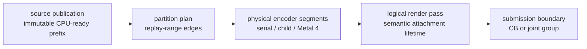
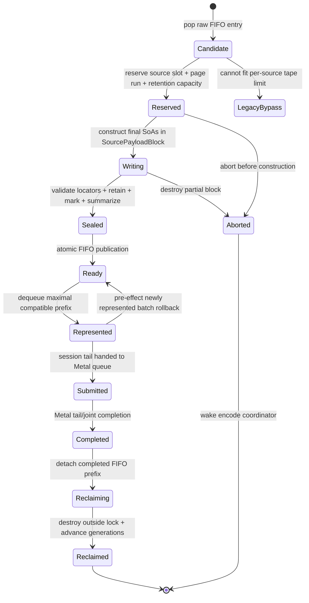

# Encode Scheduling Spec

This spec connects CPU-ready publication, bounded ready-prefix consumers,
`EncodeSession` pass streaming, production partition planning, and the optional
parallel Metal execution lanes. The parent [backend spec](../spec.md) owns the
command queue and imported record format; this topic owns scheduling after
validated immutable storage exists.

The comparative [Metal render-pass research note](../../../docs/research/metal-render-pass-lifecycle.md)
is non-normative. The requirements in this topic define dxmt9 behavior.

## 1. Boundary Vocabulary



The arrows show possible scheduling progression, not equivalence. In
particular, publishing or partitioning a source must not create a Metal
boundary. A logical pass may span several sources and, in the Metal 4 lane,
several physical command buffers. A real semantic boundary always ends the
logical pass; Metal 4 does not cross it.

## 2. Ownership

| Owner | Owns | Must not own or mutate |
|---|---|---|
| Import/replay worker | FIFO raw replay, canonical resource summaries, immutable CPU-ready publication | Metal encoders, partition-worker state, reordered replay |
| CPU-ready store | bounded source metadata, retained storage references, admission/publication watermarks, fixed pressure-release latches | D3D9 semantic decisions or GPU completion |
| Encode coordinator | `EncodeSession`, logical pass, CB or joint group, parent parallel encoder, source and partition order, finalization | PE state or worker-local child state |
| Serial executor | current range and coordinator-owned native shadow | asynchronous borrowed spans |
| Partition worker | immutable range, child/segment encoder, partition-local native shadow | session-global hazards, pass actions, completion, source storage mutation |
| Finish thread | ordered source completion expansion after tail/joint completion | pass or partition planning |
| Presenter | drawable acquisition, `presentDrawable`, present token | offscreen source publication or worker scheduling |

Published source payload remains owned by queue storage. In the promoted tape
lane, `ChunkSlot` becomes a control shell that references a
`SourcePayloadBlock`; it no longer owns the replayed SoA vectors. The replay
worker constructs every SoA and re-entrant owner, including shader-layout
context, directly in the block's reserved page run. Sealing hands the block to
the queue in O(1) by locator. There is no `ChunkSlot -> tape` payload copy.
`SessionSourceRef` and partition snapshots are compact generation-checked
locators; they do not copy payload arenas or retain transient resolved spans.

The physical command buffer is not call-local while `OpenStreaming`. The
coordinator-owned session envelope or pending `QueueSubmissionRecord` owns it;
each synchronous `encodeChunk()` call borrows it. Finalization moves that same
ownership into submitted queue storage, so neither the source nor a transient
encode stack frame can drop an open command buffer.

## 3. CPU-Ready Tape

### 3.1 Physical Layout

`CpuReadyTape` is created with the command queue and never grows after queue
initialization. It contains:

```text
CpuReadyTapeConfig {
  pageSize, pageCount, sourceSlotCount, readyFifoCount
  retentionEntryCount, allocatorTicketCount
  maxPagesPerSource, maxRetainedHandlesPerSource
  maxSessionSources, maxSessionPages, maxSessionBytes, maxSessionDraws
  highWater[dimension], lowWater[dimension]
}
```

Every value is immutable after queue creation. For every bounded dimension,
`0 <= lowWater < highWater <= hardCapacity`; all derived products and byte
ranges are overflow-checked before allocation or reservation. Exact defaults
are policy, but the configured values and rejected invalid configurations are
observable.

| Region | Shape | Owner |
|---|---|---|
| Source table | fixed ring of `CpuReadySourceSlot` control records | scheduling lock |
| Page arena | fixed-size pages in one circular backing allocation | source reservation, then finish-thread reclaim |
| Ready FIFO | fixed ring of `CpuReadySourceId` | scheduling lock |
| Retention table | bounded generation-stamped blocks of retained backend handles | source lifetime |
| Allocator tickets | bounded locators for uniform, binding, and transient ranges | source lifetime |

A source receives one contiguous, non-wrapping page run. When the circular tail
cannot fit the run before the backing end, deterministic padding advances to
page zero; the padding remains unavailable until older FIFO allocations reclaim.
This keeps every typed SoA contiguous and lets existing encoder paths resolve
one span without a gather copy.

```text
CpuReadySourceId  { sourceSlotIndex, sourceGeneration }
SourcePayloadBlockId { sourceSlotIndex, sourceGeneration, firstPage, pageCount,
                       pageGeneration }

SourcePayloadLayout {
  reservedBytes, usedBytes, maximumAlignment
  headerOffset, recordOffset, drawRunOffset, drawParamOffset, stateOffset
  uniformOffset, bindingOffset, ownerOffset
  exactOrUpperBoundCapacity[region], actualCount[region]
}

PublicationTicket {
  id, payloadBlock
  rawOrdinal, sourceOrdinal, seqId
  state: Writing | Sealed | Aborted
}

CpuReadySourceRef {
  id, payloadBlock
  sourceOrdinal, seqId
  recordRange, drawRunRange, drawParamRange, stateRange
  uniformRange, bindingRange, retainedHandleBlock, allocatorTickets
  accessSummary, semanticSummary
  flags: hasPresent, mayAcquireDrawable, legacyBypass
}
```

Every page in a run carries the same allocation generation and owner source ID.
Ordered reclaim first changes the slot to `Reclaiming`; resolution rejects that
state even though its generation has not advanced yet. After out-of-lock owner
destruction and resource release, reclaim increments both the source-slot
generation and reclaimed page generations in one scheduling transaction.
Resolution validates state, all generations, the declared page run, and its
byte extents before returning a span. A mismatch is stale-reference failure,
never a reason to inspect reused storage.

`SourcePayloadBlock` is the final home of imported command headers, typed
records, draw params, state records, uniform and binding bytes, and re-entrant
queue-local owners such as `DrawShaderLayoutContext`. Its fields use arena-backed
SoA containers constructed directly in the reserved run. `SourcePayloadLayout`
fixes aligned, non-overlapping region offsets before construction. Each region
reserves its exact or conservative upper-bound capacity once, appends without
reallocation or relocation, and publishes only `actualCount`; bounded unused
slack remains inaccessible and pinned until reclaim. Destruction at reclaim runs
the block's explicit owner destructors before page generations advance. The
control-shell `ChunkSlot` contains only lifecycle state and IDs into this storage.

`Represented` and `Submitted` are lifetime pins, not locks. After the
coordinator resolves a generation-checked locator, the synchronous encode call
may borrow call-local spans with the scheduling lock released because ordered
completion prevents reclaim. Those spans cannot be stored in the session,
partition job, submission record, callback, or Metal callback. Re-entrant owner
destruction always occurs after the finish thread detaches the completed prefix
and releases the scheduling lock.

The legacy single-source lane retains its current payload-owning `ChunkSlot`, or
an equivalent dedicated `LegacyPayloadBlock`, as a no-copy bypass during
migration and for a valid source whose final block size exceeds the tape's
per-source limit. It is drained in FIFO order, disables pass streaming for that
source, and never copies a sealed slot into the tape. A source larger than both
the negotiated chunk limit and the bypass limit is rejected as already-invalid
input.

### 3.2 Publication and Admission

The raw queue supplies one already assigned `rawOrdinal` and `seqId` per logical
source. After all required bounded capacity is reserved, the single replay
worker assigns `sourceOrdinal` in the same strict order and publishes a compact
`PublicationTicket`. The ticket, not the payload, is visible while construction
continues. Its three identities are fixed through seal, ordered legacy bypass,
or abort and are never reused. There is a one-to-one, order-isomorphic mapping
for admitted sources. A future source split must allocate independent sequence
identities before admission and is not implicit in this design.



The protocol is:

1. The replay worker pops one raw FIFO entry without holding the scheduling
   lock, validates every wire header, length, nested range, and arithmetic
   product, and computes one `SourcePayloadLayout` from structural counts only.
   Exact counts are preferred; conservative upper bounds are permitted when
   fixed by validated wire metadata. This sizing pass does not execute shader,
   state, or draw semantic transformation and cannot replay the transform twice.
   It then obtains the existing unix-owned wire/retention inputs.
2. Under the scheduling lock it reserves one source descriptor, one page run,
   retention entries, and allocator-ticket capacity as one transaction. Failure
   leaves every cursor unchanged and exposes no ticket. Success fixes the three
   identities and publishes one `Writing` `PublicationTicket` for the immediate
   successor; no payload range is yet resolvable.
3. It releases the lock, binds each arena-backed SoA to its precomputed region
   with capacity reserved once, and constructs the final `SourcePayloadBlock` in
   place. Append cannot allocate another payload extent, relocate an earlier
   element, or leave growth-history extents. Only the ticket control record is
   visible in `Writing`; source payload and summaries remain unavailable to
   scheduling.
4. It completes nested-range validation, retention, resource marking for the
   raw entry's `seqId`, access/semantic summaries, and explicit owner
   construction. An error before seal destroys the partial block and returns the
   whole reservation; deferred replay failure follows the existing fail-stop
   contract.
5. Under the scheduling lock it seals every extent, changes the ticket to
   `Sealed`, publishes the source as `Ready`, retires the construction ticket,
   appends the source ID to the FIFO, and wakes the encode coordinator in one
   transaction. No later source can publish around it because the replay worker
   is single-writer.
6. The coordinator copies a finite FIFO prefix of IDs and summaries without
   changing ownership, then moves only its maximal compatible prefix from
   `Ready` to `Represented` in one transaction. The suffix never leaves
   `Ready`, and the coordinator retains no pointers while the lock is released.
7. Submission records store the represented source IDs. Metal completion moves
   them to `Completed`; the finish thread marks and detaches only the completed
   FIFO prefix as `Reclaiming`, releases the scheduling lock, destroys owners
   and retention and releases allocator tickets, then reacquires the lock to
   return pages and advance generations atomically.

### 3.3 Capacity and Back-Pressure

Hard capacities are fixed at queue creation for source descriptors, pages/bytes,
per-source pages/bytes, retention entries, allocator tickets, ready FIFO entries,
and session source references. Each dimension has fixed high and low watermarks.
Admission closes when the head candidate would cross any high watermark. Once a
dimension closes admission it remains closed until ordered reclaim takes that
dimension to or below its low watermark; the same head candidate is then
re-evaluated. This hysteresis and FIFO head-of-line rule make admission
independent of timing and worker scheduling.

Only the replay worker waits on `cpuReadyAdmissionCv`. It waits with the
scheduling lock released. The application may encounter the pre-existing bounded
raw-queue pressure, but the encode coordinator, finish thread, Presenter, and
Metal completion callbacks never wait for tape capacity. The finish thread is
the normal wake owner: after reclaim and after releasing the scheduling lock it
signals when a blocked dimension crosses its low watermark. Shutdown, device
loss, and replay poison broadcast unconditionally.

A capacity wait cannot own a resource needed by completion. In particular:

- submitted sources and completion records do not require free tape pages;
- finish-thread completion and ordered reclaim do not run on the replay worker;
- the replay worker holds no scheduling, queue, resource-pool, or raw-queue lock
  while waiting; and
- admission or raw-writer pressure posts an ordered session-release event, and
  the encode coordinator submits a represented visible prefix before waiting
  for the capacity-dependent tail.

Temporary pressure therefore delays new publication but cannot delay the
completion/reclaim transition that clears it.

### 3.4 Scoped Replay Drain

The default direct-call fence remains a full FIFO drain. A scoped drain is a
strict-prefix optimization:

1. Admission computes canonical read/write summaries and whether a record may
   observe global device state.
2. A resource-local direct call identifies the last queued ordinal that could
   conflict with its access set.
3. Replay consumes every raw entry from the head through that ordinal in FIFO
   order, then stops.
4. Unknown access, stale summary, query, reset, shutdown, or global observation
   selects the full drain.

The raw replay watermark and CPU-ready publication watermark are distinct.
Scoped drain never executes a later record before an earlier record and does
not make replay itself parallel or out of order.

## 4. Ready-Prefix Consumers

The queue owns one immutable `ReadyPrefixSnapshot` over an already-ready FIFO
prefix. Snapshot construction copies generation-stamped source IDs and compact
summaries under the scheduling lock; it never exposes page pointers. Payload
resolution is legal only after the coordinator atomically changes the selected
source to `Represented`. Consumers use the snapshot synchronously:

| Consumer | Reads | Does not do |
|---|---|---|
| DCE | canonical first-access/full-overwrite summaries | wait, dequeue future sources, merge DAGs |
| Session planner | compatible source refs and semantic boundary summaries | mutate source payload or infer a Metal boundary from publication |
| Partition planner | final selected replay stream and immutable entry snapshots | restore DCE-removed commands or reorder the stream |

The current DCE implementation may still inspect only the immediate successor.
The generalized design permits a bounded `N+1 ... N+k` prefix that was ready at
snapshot creation. Lack of proof is immediate conservative failure, never a
producer wait.

## 5. EncodeSession State Machine

### 5.1 Separate Compatibility Predicates

Source admission and active-pass continuation are separate decisions:

```text
SessionAdmissionKey {
  deviceEpoch, queueLane, captureMode, completionMode, allocatorEpoch
}

RenderContinuationKey {
  colorAttachmentKey, depthStencilKey, sampleCount, renderRoute, passActionEpoch
}

SessionAdmissionCompatible(session, sourceSummary)
RenderContinuationCompatible(activePass, sourceEntrySummary)
```

`SessionAdmissionCompatible` requires a sealed generation-valid source, the
next FIFO `sourceOrdinal`, a strictly increasing order-isomorphic `seqId` with
no intervening independent queue work, an equal `SessionAdmissionKey`, no prior
Present in the session, and available fixed session
source/page/byte/draw/command-buffer caps. Reset, shutdown, device loss, or
global observation that requires independent submission rejects admission. It
does not require the current render pass to continue. An admitted source may
close one pass and start another inside the same session and command-buffer
chain.

`RenderContinuationCompatible` is evaluated only when a render encoder is
active and the admitted source begins with render work. It requires the same
`RenderContinuationKey`, no pending non-foldable clear, no initializer wait,
query/readback/blit/Present/sidecar observation before the first continuing
draw, and a complete entry-state snapshot. Ordinary consecutive color or depth
writes to the already-bound attachment subresources are pass-local WAW and do
not reject continuation. Rejection is limited to an incoming sample/read/copy/
resolve/readback of an active attachment or alias, incompatible feedback or
subresource aliasing, or another exact resource transition/synchronization that
cannot be expressed inside the active render encoder. Failure ends the logical
pass but does not by itself end the session.

Each sealed source carries a compact `SourceSemanticSummary`: entry encoder
kind and attachment key, first access/hazard sets, first semantic-boundary
ordinal and kind, Present/global-observation flags, draw/byte/page counts, and
capture/initializer requirements. The summary rejects quickly; replay
revalidates the exact command before Metal side effects.

### 5.2 Selection and Session States


`OpenStreaming` means future source content and the logical pass tail may be
unknown. It may encode incrementally only through the serial lane. Parallel or
Metal 4 selection requires `PassSealed`: the finite pass content, actions,
side effects, query status, and terminal boundary are known.

At each encode iteration the coordinator locks scheduling once and copies at
most `kMaxReadyPrefixSources` consecutive IDs and compact summaries without
changing source state. DCE copies summary-only proof data and never borrows page
pointers. The coordinator then moves only the maximal
`SessionAdmissionCompatible` prefix atomically from `Ready` to `Represented`.
The suffix remains in the ready FIFO throughout; there is no snapshot-owned
suffix state to restore. Before emitting any Metal command from this newly
represented batch, the coordinator resolves every locator and preflights the
complete batch's exact admission order, range coverage, entry state, and first
semantic boundary. This batch-level no-effect window is the only rollback
window; commands already emitted by older session sources are not rewindable.

The session owns:

- active serial encoder or optional parallel parent;
- logical attachment key, pending clear, load/store/resolve selection;
- exact hazard sets and native state shadows;
- argument-buffer, direct-cbuf, stream, and index-buffer shadows;
- visibility/capture/perf sidecars and sample cursors;
- bounded source references, callbacks, and completion identities.

Semantic boundaries and non-boundaries are normative in `R-BACK-2.43`. An
`encodeChunk()` return, `commitChunk()`, source publication, `seqId`, or range
edge never implies `flushRender(Final)`.

For each represented source the serial session path:

1. resolves and validates its generation-stamped block and replay range;
2. appends only source ID and completion metadata to the session;
3. when render continuation is compatible, invokes the session-aware encoder
   without final flush, state reset, or pass-end sidecar publication;
4. otherwise closes the active logical pass exactly once for the actual
   semantic reason, publishes its actions/sidecars, retains the command buffer
   and session, and replays the next encoder kind or pass normally; and
5. retains the original `seqId`, retention block, allocator tickets, and
   completion identity until session completion.

A Present source may attach only as the final source. The coordinator ends the
logical pass, delegates drawable acquisition and `presentDrawable` to the
Presenter, attaches the frame token to that tail, and finalizes immediately.
No earlier source may acquire a drawable or carry the token.

### 5.3 Deterministic Release and Completion

An `OpenStreaming` session may park with an active render encoder and no ready
successor. Producer quiescence has no D3D-visible progress obligation, so ready
snapshot exhaustion is not a release reason. A later compatible source attaches
to the same session regardless of how long replay took.

Release is driven only by an ordered `SessionReleaseEvent`:

```text
SessionReleaseEvent { reason, fenceRawOrdinal, fenceSeqId }
```

Explicit API and semantic events are ordinary ordered raw control records, so
their fences inherit FIFO order without another unbounded queue. The two events
that can arise when the raw path itself cannot advance use fixed queue-owned
coalescing latches: `admissionPressureRelease` fences immediately before the
capacity-blocked candidate, and `rawWriterPressureRelease` fences at the last
accepted raw ordinal. Posting either latch allocates nothing and never waits.
The coordinator clears a latch only after the fenced prefix is submitted or
proved empty. Device-loss and shutdown use the accepted-work watermark as their
terminal fence.

The reasons are Present, explicit Flush, direct observation/readback, producer
wait for a covered sequence, admission or raw-writer capacity dependency, fixed
session cap, semantic independent-submission boundary, orderly shutdown, and
device loss. The event is ordered with raw work; it cannot finalize before all
older admissible sources reach the session or a preceding semantic/capacity
boundary is established. Admission pressure posts the event before the replay
worker waits, and a writer-capacity event is posted before the producer depends
on encode/submit progress. This prevents an open session from withholding the
completion needed to release its own producer or storage pressure.

A ready source rejected by `SessionAdmissionCompatible` remains `Ready` and
posts the corresponding fixed-cap or semantic independent-submission event at
the predecessor fence. A `RenderContinuationCompatible` rejection closes only
the active pass and does not post a session-release event unless the exact
command also requires an independent submission.

Timeout, elapsed or spin budget, completion-wait/GPU state, and worker-arrival
timing are not release inputs. Consequently identical logical records and fixed
capacity configuration produce the same source/session/pass/command-buffer
shape even when replay and encode scheduling differ.

If represented work has no Present, finalization submits a normal non-present
tail with ordered completion sources. It never inline-completes visible work.
Unrepresented snapshot entries have never left `Ready`. Exact validation
failure before any Metal emission from the newly represented/preflighted batch
may atomically restore only that batch ahead of all younger sources for the
valid legacy/serial path. Any older already-emitted session prefix is finalized
and submitted when required; it is never rewound. Failure after emission from
the new batch is a fail-stop invariant breach and cannot rewind the session.

One Metal tail or joint group may cover several source IDs. Completion expands
those IDs strictly in order after the tail or joint group completes. The
present token belongs only to a represented present tail.

### 5.4 Locking and Thread Ordering

| Lock/domain | Owner and permitted work | Forbidden nesting/work |
|---|---|---|
| Raw replay mutex | app-thread push; replay-worker pop | never nested with scheduling, resource, or completion locks |
| Scheduling mutex | tape metadata, Ready FIFO, state transitions, occupancy and watermarks | no payload construction/destruction, resource retain/mark, Metal call, callback, or wait |
| Reserved page run | replay worker has exclusive write ownership while `Writing` | ticket control may be visible, but payload resolution is forbidden before seal |
| `EncodeSession` state | encode coordinator, thread-confined after `Represented` | partition workers and finish thread do not mutate it |
| Completion queue mutex | Metal callback enqueue; finish-thread dequeue | released before scheduling lock or resource reclaim |
| Resource/allocator owners | retain/mark before seal; release after completed-prefix removal | never acquired while scheduling lock is held |

There is no valid nested-lock path between raw replay, scheduling, completion,
and resource ownership. A transition that touches two domains records a
generation-stamped ticket, releases the first lock, performs the second-domain
operation, then validates the ticket before publication. Metal object creation,
encoder calls, command-buffer commit, and Presenter calls occur with every
tape, raw-queue, and completion lock released.

The finish thread dequeues a completion record, releases the completion lock,
then takes the scheduling lock to mark consecutive sources Completed and detach
the reclaimable prefix. It releases scheduling before destroying payload owners
or releasing resource/allocator tickets, reacquires it only to return pages and
advance generations, and signals admission after unlocking.

### 5.5 Failure and Shutdown

| Condition | Required action |
|---|---|
| Queue creation cannot allocate the bounded tape | disable the tape and retain the legacy single-source path, or fail device creation; never expose a partial tape |
| Candidate exceeds the per-source tape bound | ordered legacy single-source bypass with pass streaming disabled; never copy a sealed slot |
| Temporary high-water pressure | replay worker waits; coordinator submits the available prefix; finish completion/reclaim remains runnable |
| Validation, owner construction, or retention failure before seal | destroy the partial block, roll back the complete reservation, then follow deferred-replay fail-stop/error policy |
| Stale source/page/retention generation | reject before dereference and poison the affected scheduling lane |
| Exact replay mismatch during whole-batch preflight | finalize and submit any older already-emitted session prefix as required; atomically restore only the newly represented batch, while the suffix remains `Ready`, then use the valid legacy/serial path if available |
| Failure after Metal emission | fail-stop submission; never rewind, reuse pages, or synthesize success |
| Orderly shutdown | stop admission, broadcast admission wait, drain Ready/Represented work normally while Metal remains available, then reclaim in order |
| Device lost or Metal queue failure | stop admission, broadcast waiters, route submitted work through error completion, cancel unsubmitted reservations without successful completion, and retain storage until reuse is safe |

Warm-path capacity pressure is not system OOM: the tape and container capacities
are preallocated. Re-entrant payload owners use their reserved source arena. A
new heap allocation during steady-state source construction violates the DOD
storage contract.

### 5.6 H229 Refinement Mapping

The current opt-in `DXMT9_OPEN_CB_CARRIER` is a partial refinement, not the
CPU-ready-tape implementation:

| Concrete H229 element | Target transition/owner | Disposition |
|---|---|---|
| ready `ChunkSlot` FIFO | `Ready -> Represented` | reuse ordering and dequeue semantics; replace payload-owning slot with control shell plus block ID |
| `EncodeChunkSessionState` | `OpenStreaming` coordinator state | reuse and extend with source IDs, compatibility summaries, and caps |
| session-aware `encodeChunk` and serial partition cursor | source-edge continuation procedure | reuse; preserve no-final-flush behavior |
| `finalizeEncodeChunkSessionIntoSubmission` | `Finalized -> Submitted` | reuse as the single finalization seam |
| fixed completion-source expansion | `Submitted -> Completed` | reuse and extend evidence to tape generations and reclaim |
| final Present-tail split | Present-tail finalization | reuse Presenter and frame-token ownership |
| slot residency until GPU completion | tape block/source lifetime | replace; slots become shells and pages reclaim by completion prefix |
| parked carrier wait seam | `OpenStreaming` producer-quiescent state | reuse without completion-wait or timeout-based release |
| reactive completion-wait release decisions | ordered `SessionReleaseEvent` fence | replace with D3D-visible/queue-progress events and fixed caps |

The existing carrier and end-to-end lifecycle specs remain evidence for session
carry, finalization, Present ownership, and ordered completion. They do not prove
page admission, generation/ABA safety, pressure progress, direct construction,
or the two new compatibility predicates.

## 6. Production Partition Planning

Planning consumes the final effective replay stream after backend selection,
FrameGraph reorder, and DCE. It has two phases:

1. Build immutable locator-only entry snapshots and candidate range costs.
2. Validate exact replay and parameter coverage before any Metal or session
   mutation.

The initial production heuristic subdivides only large `DrawRun` parameter
ranges. Command, clear, query, readback, initializer-wait, sidecar-observation,
and Present records stay coordinator-serial. Deterministic inputs may include
draw count, payload bytes, pass identity, and static cost classes; they exclude
wallclock, current worker availability, and GPU feedback.

Invalid or unsupported output selects the allocation-free identity cursor over
the same effective stream. This fallback cannot restore commands removed by DCE
or return to source order after FrameGraph reorder.

## 7. Execution Lanes

### 7.1 Serial

The current serial executor consumes ranges in order. A range edge changes no
Metal state and does not rerun command-level setup. This lane is the mandatory
fallback on every supported Metal version.

### 7.2 `MTLParallelRenderCommandEncoder`

This lane is selected only for a sealed, sufficiently large, independent
logical pass. The coordinator creates the parent and child encoders in draw
order. Each worker receives an immutable range and complete or proven-minimal
first-draw native snapshot. Workers do not mutate session-global hazards,
actions, caches, completion lists, or source storage. All children end before
the parent ends; then the coordinator joins sidecars and finalizes the pass.

If eligibility or snapshot validation fails before child Metal side effects,
the coordinator uses the serial plan. A failure after child emission is an
invariant failure, because Metal encoding cannot be rewound safely.

### 7.3 Metal 4 Suspend/Resume

This optional capability lane stitches physical command-buffer segments into
one logical GPU render pass. Before encoding, the coordinator gathers a finite
bounded group and knows which segment is first, intermediate, and last. It then
assigns suspending/resuming options and commits the entire ordered group
together.

No compute, blit, query, readback, initializer wait, or Present command may be
intermixed in the stitched group. An already committed buffer cannot later be
resumed. The lane therefore preserves, rather than crosses, the semantic
logical-pass boundary.

## 8. Logical-Pass Actions

Load/store policy runs once for the logical pass:

| Event | Owner and timing |
|---|---|
| Load or deferred clear | First logical segment before its first draw |
| Store or resolve | Last logical segment after its final draw |
| Touched-attachment update | Logical pass close |
| Visibility/capture/diagnostic sidecars | Logical pass close or explicit observation boundary |
| Tile-preservation counters | Once per logical attachment action, not per child or segment |

Parallel children and intermediate Metal 4 segments do not independently
select pass actions or publish pass-end sidecars.

## 9. Observability and Promotion

Required scheduling counters include:

- CPU-ready source/page/byte/retention/ticket current and peak occupancy,
  per-dimension high-water closes and low-water reopen/reclaim wakeups;
- admission wait time/count, head candidate dimensions, wrap padding,
  payload reserved/used/slack bytes, pre-seal rollback, legacy oversize bypass,
  and stale-generation rejection;
- state-transition counts for Writing, Sealed, Aborted, Ready, Represented,
  restored, Submitted, Completed, Reclaiming, and Reclaimed;
- unsubmitted session current/peak occupancy, admitted sources/bytes/draws,
  open-session park/wake count and duration, render-continuation allow/reject
  reason, and release-event reason/fence/watermark;
- raw replay ordinal, published `sourceOrdinal`, published `seqId`, completion
  watermark, and reclaim watermark;
- identity/explicit partition counts, draws and cost per range, planner CPU
  time, validation fallback, and parallel eligibility/rejection;
- partition-job current/peak occupancy, worker CPU, join wait, and lane;
- existing queue writer, offload drain, sequence, completion-wait, command
  buffer, pass, load/store, and tile-preservation counters.

Promotion uses the ordered gates in `R-BACK-2.50`. Moving a wait between
counters or saturating a new bounded queue is not overlap progress.

## 10. Verification Mapping

| Contract | Evidence |
|---|---|
| Existing one-successor DCE | `DceChunkLookahead.tla` and FrameGraph native specs |
| General bounded ready-prefix DCE | missing extension or refinement model plus pure summary tests |
| Tape layout and ABA | missing pure specs for non-wrapping reserve/wrap padding, all-or-nothing rollback, generation rejection, ordered reclaim, and oversize bypass |
| CPU-ready admission and session progress | missing `CpuReadySessionProgress` model plus fake actors covering high/low hysteresis, replay-only admission wait, producer-quiescent session parking, ordered progress-event release, finish wake, shutdown, and no progress cycle |
| Pass streaming | extend the existing lifecycle spec for admission-vs-render predicates, cross-source active-pass continuation, suffix-stays-Ready selection, ordered event-driven non-present release, producer-quiescent parking, and Present-tail ownership |
| Ordered session completion | existing `EncodeSessionCompletion.tla` and completion-source native spec; extend with tape pins, generation advance after completion, and joint groups |
| Partition plan validation | existing partition snapshot/serial native specs; production planner evidence missing |
| Parallel order and join | missing fake-child executor spec and formal/refinement evidence |
| Logical-pass actions across segments | render-pass-actions native spec extension and Metal integration evidence |
| Metal 4 capability lane | missing capability/fallback unit evidence, Metal integration, and visual/locality A/B |

The current status and historical performance evidence are tracked in
[gap.md](gap.md), not in these normative design sections.
