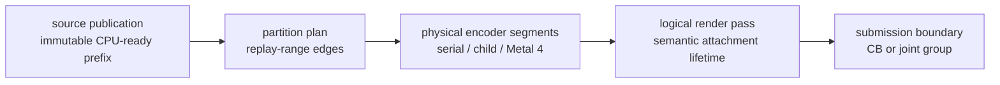
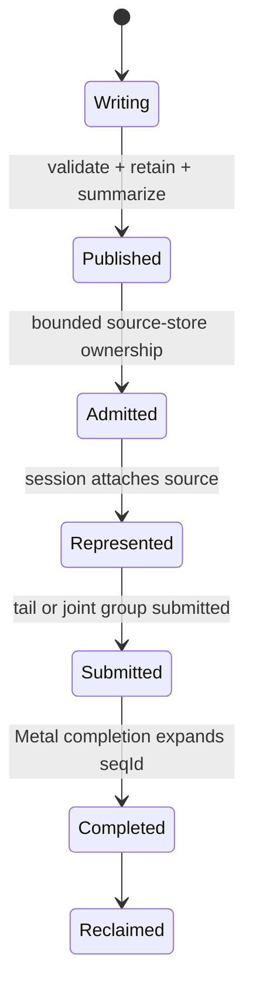
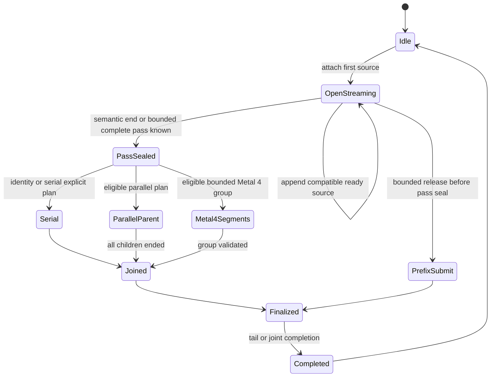

# Encode Scheduling Spec

This spec connects CPU-ready publication, bounded ready-prefix consumers,
`EncodeSession` pass streaming, production partition planning, and the optional
parallel Metal execution lanes. The parent [backend spec](../spec.md) owns the
command queue and imported record format; this topic owns scheduling after
validated immutable storage exists.

The comparative [Metal render-pass research note](../../../docs/research/metal-render-pass-lifecycle.md)
is non-normative. The requirements in this topic define dxmt9 behavior.

## 1. Boundary Vocabulary



The arrows show possible scheduling progression, not equivalence. In
particular, publishing or partitioning a source must not create a Metal
boundary. A logical pass may span several sources and, in the Metal 4 lane,
several physical command buffers. A real semantic boundary always ends the
logical pass; Metal 4 does not cross it.

## 2. Ownership

| Owner | Owns | Must not own or mutate |
|---|---|---|
| Import/replay worker | FIFO raw replay, canonical resource summaries, immutable CPU-ready publication | Metal encoders, partition-worker state, reordered replay |
| CPU-ready store | bounded source metadata, retained storage references, admission and publication watermarks | D3D9 semantic decisions or GPU completion |
| Encode coordinator | `EncodeSession`, logical pass, CB or joint group, parent parallel encoder, source and partition order, finalization | PE state or worker-local child state |
| Serial executor | current range and coordinator-owned native shadow | asynchronous borrowed spans |
| Partition worker | immutable range, child/segment encoder, partition-local native shadow | session-global hazards, pass actions, completion, source storage mutation |
| Finish thread | ordered source completion expansion after tail/joint completion | pass or partition planning |
| Presenter | drawable acquisition, `presentDrawable`, present token | offscreen source publication or worker scheduling |

Published source payload remains owned by queue storage. `SessionSourceRef` and
partition snapshots are compact locators; they do not copy payload arenas or
retain transient resolved spans.

## 3. CPU-Ready Publication and Admission

The producer publishes only a complete immutable prefix:

```text
CpuReadySourceRef {
  sourceOrdinal, seqId
  recordRange, retainedHandleRange, allocatorRanges
  canonicalReadSet, canonicalWriteSet
  observesGlobalState
  hasPresent, mayAcquireDrawable
}
```

The physical representation may be a slot, bounded tape segment, or arena
range. Its storage lifetime and admission capacity are distinct from logical
source identity. This prevents source-grain scheduling from consuming one
GPU-reclaimed ring slot for every publication checkpoint.

Publication state is monotonic:



The publisher does not choose command buffers. Admission failure applies
bounded back-pressure or leaves the unconsumed source on its prior FIFO owner;
it never makes a partial source visible.

### 3.1 Scoped Replay Drain

The default direct-call fence remains a full FIFO drain. A scoped drain is a
strict-prefix optimization:

1. Admission computes canonical read/write summaries and whether a record may
   observe global device state.
2. A resource-local direct call identifies the last queued ordinal that could
   conflict with its access set.
3. Replay consumes every raw entry from the head through that ordinal in FIFO
   order, then stops.
4. Unknown access, stale summary, query, reset, shutdown, or global observation
   selects the full drain.

The raw replay watermark and CPU-ready publication watermark are distinct.
Scoped drain never executes a later record before an earlier record and does
not make replay itself parallel or out of order.

## 4. Ready-Prefix Consumers

The queue owns one immutable `ReadyPrefixSnapshot` over an already-ready FIFO
prefix. Consumers borrow it synchronously:

| Consumer | Reads | Does not do |
|---|---|---|
| DCE | canonical first-access/full-overwrite summaries | wait, dequeue future sources, merge DAGs |
| Session planner | compatible source refs and semantic boundary summaries | mutate source payload or infer a Metal boundary from publication |
| Partition planner | final selected replay stream and immutable entry snapshots | restore DCE-removed commands or reorder the stream |

The current DCE implementation may still inspect only the immediate successor.
The generalized design permits a bounded `N+1 ... N+k` prefix that was ready at
snapshot creation. Lack of proof is immediate conservative failure, never a
producer wait.

## 5. EncodeSession State Machine



`OpenStreaming` means future source content and the logical pass tail may be
unknown. It may encode incrementally only through the serial lane. Parallel or
Metal 4 selection requires `PassSealed`: the finite pass content, actions,
side effects, query status, and terminal boundary are known.

The session owns:

- active serial encoder or optional parallel parent;
- logical attachment key, pending clear, load/store/resolve selection;
- exact hazard sets and native state shadows;
- argument-buffer, direct-cbuf, stream, and index-buffer shadows;
- visibility/capture/perf sidecars and sample cursors;
- bounded source references, callbacks, and completion identities.

Semantic boundaries and non-boundaries are normative in `R-BACK-2.43`. An
`encodeChunk()` return, `commitChunk()`, source publication, `seqId`, or range
edge never implies `flushRender(Final)`.

### 5.1 Fail-Open and Completion

If the session cannot attach another compatible source by its bounded release
point, it submits the represented prefix as a normal non-present submission.
An unrepresented suffix returns to the ready FIFO in its original order. Once
Metal-visible side effects occur, a validation mismatch is an invariant failure;
the implementation must not rewind or inline-complete the work.

One Metal tail or joint group may cover several source IDs. Completion expands
those IDs strictly in order after the tail or joint group completes. The
present token belongs only to a represented present tail.

## 6. Production Partition Planning

Planning consumes the final effective replay stream after backend selection,
FrameGraph reorder, and DCE. It has two phases:

1. Build immutable locator-only entry snapshots and candidate range costs.
2. Validate exact replay and parameter coverage before any Metal or session
   mutation.

The initial production heuristic subdivides only large `DrawRun` parameter
ranges. Command, clear, query, readback, initializer-wait, sidecar-observation,
and Present records stay coordinator-serial. Deterministic inputs may include
draw count, payload bytes, pass identity, and static cost classes; they exclude
wallclock, current worker availability, and GPU feedback.

Invalid or unsupported output selects the allocation-free identity cursor over
the same effective stream. This fallback cannot restore commands removed by DCE
or return to source order after FrameGraph reorder.

## 7. Execution Lanes

### 7.1 Serial

The current serial executor consumes ranges in order. A range edge changes no
Metal state and does not rerun command-level setup. This lane is the mandatory
fallback on every supported Metal version.

### 7.2 `MTLParallelRenderCommandEncoder`

This lane is selected only for a sealed, sufficiently large, independent
logical pass. The coordinator creates the parent and child encoders in draw
order. Each worker receives an immutable range and complete or proven-minimal
first-draw native snapshot. Workers do not mutate session-global hazards,
actions, caches, completion lists, or source storage. All children end before
the parent ends; then the coordinator joins sidecars and finalizes the pass.

If eligibility or snapshot validation fails before child Metal side effects,
the coordinator uses the serial plan. A failure after child emission is an
invariant failure, because Metal encoding cannot be rewound safely.

### 7.3 Metal 4 Suspend/Resume

This optional capability lane stitches physical command-buffer segments into
one logical GPU render pass. Before encoding, the coordinator gathers a finite
bounded group and knows which segment is first, intermediate, and last. It then
assigns suspending/resuming options and commits the entire ordered group
together.

No compute, blit, query, readback, initializer wait, or Present command may be
intermixed in the stitched group. An already committed buffer cannot later be
resumed. The lane therefore preserves, rather than crosses, the semantic
logical-pass boundary.

## 8. Logical-Pass Actions

Load/store policy runs once for the logical pass:

| Event | Owner and timing |
|---|---|
| Load or deferred clear | First logical segment before its first draw |
| Store or resolve | Last logical segment after its final draw |
| Touched-attachment update | Logical pass close |
| Visibility/capture/diagnostic sidecars | Logical pass close or explicit observation boundary |
| Tile-preservation counters | Once per logical attachment action, not per child or segment |

Parallel children and intermediate Metal 4 segments do not independently
select pass actions or publish pass-end sidecars.

## 9. Observability and Promotion

Required scheduling counters include:

- CPU-ready source current/peak occupancy and admission wait;
- unsubmitted session current/peak occupancy and bounded-release reason;
- raw replay and published-source watermarks;
- identity/explicit partition counts, draws and cost per range, planner CPU
  time, validation fallback, and parallel eligibility/rejection;
- partition-job current/peak occupancy, worker CPU, join wait, and lane;
- existing queue writer, offload drain, sequence, completion-wait, command
  buffer, pass, load/store, and tile-preservation counters.

Promotion uses the ordered gates in `R-BACK-2.50`. Moving a wait between
counters or saturating a new bounded queue is not overlap progress.

## 10. Verification Mapping

| Contract | Evidence |
|---|---|
| Existing one-successor DCE | `DceChunkLookahead.tla` and FrameGraph native specs |
| General bounded ready-prefix DCE | missing extension or refinement model plus pure summary tests |
| CPU-ready admission and session progress | missing `CpuReadySessionProgress` model and queue-observer spec |
| Ordered session completion | existing `EncodeSessionCompletion.tla` and completion-source native spec; must be extended for joint groups |
| Partition plan validation | existing partition snapshot/serial native specs; production planner evidence missing |
| Parallel order and join | missing fake-child executor spec and formal/refinement evidence |
| Logical-pass actions across segments | render-pass-actions native spec extension and Metal integration evidence |
| Metal 4 capability lane | missing capability/fallback unit evidence, Metal integration, and visual/locality A/B |

The current status and historical performance evidence are tracked in
[gap.md](gap.md), not in these normative design sections.
