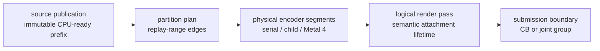
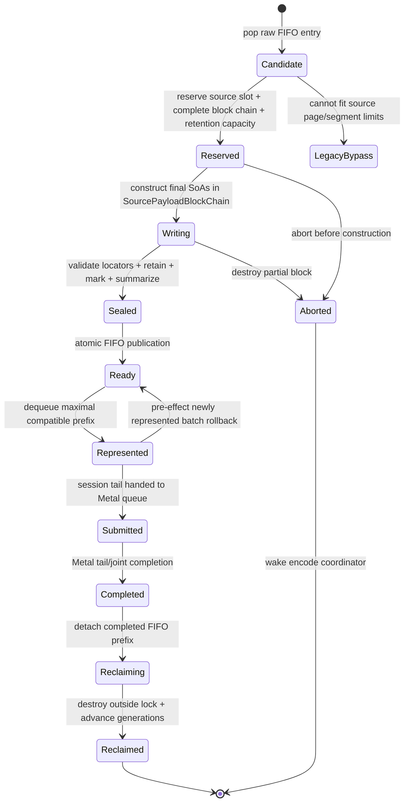

# Encode Scheduling Spec

This spec connects CPU-ready publication, bounded ready-prefix consumers,
`EncodeSession` pass streaming, production partition planning, and the optional
parallel Metal execution lanes. The parent [backend spec](../spec.md) owns the
command queue and imported record format; this topic owns scheduling after
validated immutable storage exists.

The comparative [Metal render-pass research note](../../../docs/research/metal-render-pass-lifecycle.md)
is non-normative. The requirements in this topic define dxmt9 behavior.

## 1. Boundary Vocabulary



The arrows show possible scheduling progression, not equivalence. In
particular, publishing or partitioning a source must not create a Metal
boundary. A logical pass may span several sources and, in the Metal 4 lane,
several physical command buffers. A real semantic boundary always ends the
logical pass; Metal 4 does not cross it.

## 2. Ownership

| Owner | Owns | Must not own or mutate |
|---|---|---|
| Import/replay worker | FIFO raw replay, canonical resource summaries, immutable CPU-ready publication | Metal encoders, partition-worker state, reordered replay |
| CPU-ready store | bounded source metadata, retained storage references, admission/publication watermarks, fixed pressure wake state | D3D9 semantic decisions, release fences, or GPU completion |
| Encode coordinator | `EncodeSession`, logical pass, CB or joint group, parent parallel encoder, source and partition order, finalization | PE state or worker-local child state |
| Serial executor | current range and coordinator-owned native shadow | asynchronous borrowed spans |
| Partition worker | immutable range, child/segment encoder, partition-local native shadow | session-global hazards, pass actions, completion, source storage mutation |
| Finish thread | ordered source completion expansion after tail/joint completion | pass or partition planning |
| Presenter | drawable acquisition, `presentDrawable`, present token | offscreen source publication or worker scheduling |

Published source payload remains owned by queue storage. In the promoted tape
lane, `ChunkSlot` becomes a control shell that references a
`SourcePayloadBlockChain`; it no longer owns the replayed SoA vectors. One
logical source owns the whole ordered chain and one completion identity. The
replay worker constructs every SoA and re-entrant owner, including shader-layout
context, directly in the chain's reserved page runs. Sealing hands the complete
chain to the queue in O(1) by locator. There is no `ChunkSlot -> tape` payload
copy and no independently published block. `SourcePayloadView` is the sole
read-only payload input to FrameGraph construction, replay planning, and serial
encoding. `SessionSourceRef`, FrameGraph command references, and partition
snapshots are compact generation-checked `(retainedSourceIndex, commandIndex)`
or equivalent source-qualified locators; they do not copy payload arenas or
retain transient resolved spans. `sourceOrdinal` names only the monotonic global
publication order, never a source-table index.

The physical command buffer is not call-local while `OpenStreaming`. The
coordinator-owned session envelope or pending `QueueSubmissionRecord` owns it;
each synchronous `encodeChunk()` call borrows it. Finalization moves that same
ownership into submitted queue storage, so neither the source nor a transient
encode stack frame can drop an open command buffer.

## 3. CPU-Ready Tape

### 3.1 Physical Layout

`CpuReadyTape` is created with the command queue and never grows after queue
initialization. It contains:

```text
CpuReadyTapeConfig {
  pageSize, pageCount, sourceSlotCount, readyFifoCount
  retentionEntryCount, allocatorTicketCount
  maxPagesPerPayloadSegment, maxPayloadSegmentsPerSource, maxPagesPerSource
  maxRetainedHandlesPerSource
  maxSessionSources, maxSessionPages, maxSessionBytes, maxSessionDraws
  maxDirectReservationFootprint[dimension]
  successorHeadroom[dimension]
  highWater[dimension], lowWater[dimension]
}
```

Every value is immutable after queue creation. For every bounded dimension,
`0 <= lowWater < highWater <= hardCapacity`; all derived products and byte
ranges are overflow-checked before allocation or reservation. Exact defaults
are policy, but the configured values and rejected invalid configurations are
observable. For every admission dimension,
`maxSessionFootprint + successorHeadroom <= highWater`, and
`successorHeadroom >= maxDirectReservationFootprint`. The reservation footprint
includes deterministic circular-wrap padding and every descriptor or ticket
charged by construction, not only used payload pages. The default-off
compatibility profile and the opt-in streaming profile may choose different
aggregate capacities while retaining the same semantic limits; selecting a
streaming profile must not change default-off allocation or admission policy.

| Region | Shape | Owner |
|---|---|---|
| Source table | fixed ring of `CpuReadySourceSlot` control records | scheduling lock |
| Page arena | fixed-size pages in one circular backing allocation | source reservation, then finish-thread reclaim |
| Ready FIFO | fixed ring of `CpuReadySourceId` | scheduling lock |
| Retention table | bounded generation-stamped blocks of retained backend handles | source lifetime |
| Allocator tickets | bounded locators for uniform, binding, and transient ranges | source lifetime |

A source receives an ordered chain of one or more packed payload segments. Each
ordinary segment is one contiguous, non-wrapping page run no larger than
`maxPagesPerPayloadSegment`; the sum of all source runs may not exceed
`maxPagesPerSource`, and the number of ordinary plus jumbo segments may not
exceed `maxPayloadSegmentsPerSource`. When the circular tail cannot fit the next
run before the backing end, deterministic padding advances to page zero; the
padding remains unavailable until older FIFO allocations reclaim. A segment
packs consecutive regions and records without a gather copy. A record is never
split: if one canonical record does not fit the ordinary segment cap, a
dedicated jumbo segment may exceed that cap but remains subject to the source
page and segment-count limits.

```text
CpuReadySourceId  { sourceSlotIndex, sourceGeneration }
SourcePayloadBlockId { sourceSlotIndex, sourceGeneration, segmentIndex,
                       firstPage, pageCount, pageGeneration, jumbo }
SourcePayloadBlockChain { sourceId, blockIds[], totalPages, usedBytes }

SourcePayloadLayout {
  reservedBytes, usedBytes, maximumAlignment
  headerOffset, recordOffset, drawRunOffset, drawParamOffset, stateOffset
  uniformOffset, bindingOffset, ownerOffset
  exactOrUpperBoundCapacity[region], actualCount[region]
}

PublicationTicket {
  id, payloadBlockChain
  rawOrdinal, sourceOrdinal, seqId
  state: Writing | Sealed | Aborted
}

CpuReadySourceRef {
  id, payloadBlockChain
  sourceOrdinal, seqId
  recordRange, drawRunRange, drawParamRange, stateRange
  uniformRange, bindingRange, retainedHandleBlock, allocatorTickets
  accessSummary, semanticSummary
  flags: hasPresent, mayAcquireDrawable, legacyBypass
}
```

Every page in a run carries the same allocation generation and owner source ID.
Ordered reclaim first changes the slot to `Reclaiming`; resolution rejects that
state even though its generation has not advanced yet. After out-of-lock owner
destruction and resource release, reclaim increments both the source-slot
generation and reclaimed page generations in one scheduling transaction.
Resolution validates state, all generations, the declared page run, and its
byte extents before returning a span. A mismatch is stale-reference failure,
never a reason to inspect reused storage.

`SourcePayloadBlockChain` is the final home of imported command headers, typed
records, draw params, state records, uniform and binding bytes, and re-entrant
queue-local owners such as `DrawShaderLayoutContext`. Each block uses
arena-backed SoA regions constructed directly in its reserved run.
`SourcePayloadLayout` fixes aligned, non-overlapping region offsets and stable
global command indices before construction. Each region reserves its exact or
conservative upper-bound capacity once, appends without reallocation or
relocation, and publishes only `actualCount`; bounded unused slack remains
inaccessible and pinned until reclaim. Destruction at reclaim runs every block's
explicit owner destructors before any page generation advances. The
control-shell `ChunkSlot` contains only lifecycle state and IDs into this
storage. `SourcePayloadView` resolves across the chain synchronously while
presenting one logical ordered command stream; block boundaries are invisible
to FrameGraph ownership, replay order, partitioning, and completion.

`Represented` and `Submitted` are lifetime pins, not locks. After the
coordinator resolves a generation-checked locator, the synchronous encode call
may borrow call-local spans with the scheduling lock released because ordered
completion prevents reclaim. Those spans cannot be stored in the session,
partition job, submission record, callback, or Metal callback. Re-entrant owner
destruction always occurs after the finish thread detaches the completed prefix
and releases the scheduling lock.

The legacy single-source lane retains its current payload-owning `ChunkSlot`, or
an equivalent dedicated `LegacyPayloadBlock`, as a no-copy rollback during
migration and for a valid source whose final chain exceeds the tape's total page
or segment-count limit. It is drained in FIFO order, disables pass streaming for
that source, and never copies a sealed source into the tape. Query-, Readback-, or
`UpdateTexture`-dependent work also remains in an explicit ordered non-payload
control/compatibility disposition until canonical Arena sizing and ownership are
defined. A source larger than both the negotiated chunk limit and the rollback
limit is rejected as already-invalid input.

### 3.2 Publication and Admission

The raw queue supplies one already assigned `rawOrdinal` and `seqId` per logical
source. After all required bounded capacity is reserved, the single replay
worker assigns global `sourceOrdinal` in the same strict order and publishes a
compact `PublicationTicket`. The ticket, not any payload block, is visible while
construction continues. Its three identities are fixed through complete-chain
seal, ordered legacy rollback, or abort and are never reused. There is a
one-to-one, order-isomorphic mapping for logical sources; adding payload segments
does not split that mapping or allocate additional sequence identities.



The protocol is:

1. The replay worker pops one raw FIFO entry without holding the scheduling
   lock, validates every wire header, length, nested range, and arithmetic
   product, and computes one complete `SourcePayloadBlockChain` layout from
   structural counts only. The packing pass preserves command order and stable
   command indices, starts a new ordinary segment when the next indivisible
   record will not fit, and assigns an oversized indivisible record to one jumbo
   segment. It rejects or selects ordered legacy rollback before construction
   if the total page or segment-count limit cannot hold the source.
   Exact counts are preferred; conservative upper bounds are permitted when
   fixed by validated wire metadata. This sizing pass does not execute shader,
   state, or draw semantic transformation and cannot replay the transform twice.
   It then obtains the existing unix-owned wire/retention inputs, canonical
   resource identities, captured backing snapshots, and raw-residency tokens
   fixed synchronously at commit admission. The default-off path never enters
   this planner and retains the historical combined synchronous mark/capture.
2. Under the scheduling lock it reserves one source descriptor, every page run
   and block descriptor in the chain, retention entries, and allocator-ticket
   capacity as one transaction. Failure leaves every cursor unchanged and
   exposes no ticket. Success fixes the three identities and publishes one
   `Writing` `PublicationTicket` for the immediate successor; no payload range
   is yet resolvable.
3. It releases the lock, binds each arena-backed SoA to its precomputed block
   region with capacity reserved once, and constructs the final
   `SourcePayloadBlockChain` in place. Append cannot allocate an unplanned
   payload extent, relocate an earlier element, split a record, or leave
   growth-history extents. Only the ticket control record is visible in
   `Writing`; every source payload block and summary remains unavailable to
   scheduling.
4. It completes nested-range validation, retention, exact resource marking for
   the admitted source `seqId`, access/semantic summaries, and explicit owner
   construction. An error before seal destroys the partial block and returns the
   whole reservation; deferred replay failure follows the existing fail-stop
   contract.
5. Under the scheduling lock it seals every extent and block, changes the ticket
   to `Sealed`, publishes the source as `Ready`, retires the construction ticket,
   appends the source ID to the FIFO, and wakes the encode coordinator in one
   transaction. No segment has an intermediate Ready state. No later source can
   publish around it because the replay worker is single-writer.
6. The coordinator copies a finite FIFO prefix of IDs and summaries without
   changing ownership, then moves only its maximal compatible prefix from
   `Ready` to `Represented` in one transaction. The suffix never leaves
   `Ready`, and the coordinator retains no pointers while the lock is released.
7. After the final synchronous encode borrow, an eligible source installs a
   bounded generation-stamped completion receipt. The coordinator marks and
   detaches its payload as `Reclaiming` under the scheduling lock, destroys
   re-entrant owners outside the lock, then relocks to return physical credits
   and advance page/source generations. Submission records retain the receipt,
   callbacks/resources, and encoded-work identity. Ineligible or legacy
   identities retain the same two-phase operation after Metal completion.

### 3.3 Capacity and Back-Pressure

Hard capacities are fixed at queue creation for source descriptors, pages/bytes,
ordinary pages per payload segment, payload segments per source, total pages per
source, retention entries, allocator tickets, ready FIFO entries, and session
source references. Each aggregate pressure dimension has fixed high and low
watermarks; the three per-source packing limits are validated independently
before transactional reservation.
Admission closes when the head candidate would cross any high watermark. Once a
dimension closes admission it remains closed until ordered reclaim takes that
dimension to or below its low watermark; the same head candidate is then
re-evaluated. This hysteresis and FIFO head-of-line rule make admission
independent of timing and worker scheduling.

Before the first source of a streaming session becomes `Represented`, the
coordinator acquires one generation-stamped `SessionCapacityLease`. The lease
reserves a fixed physical-residency vector and a separate `successorHeadroom`
vector large enough for one worst-case ordinary Direct candidate. Submitted
older payload residency may delay lease acquisition until retirement or legacy
reclaim; it may not shrink a lease or force an already-open session to submit.
Acquisition atomically incorporates the already-resident Ready head into the
lease account; those pages and descriptors are not double-reserved. Actual
session sources separately charge encoded-unsubmitted source, draw, and
command-buffer work until submission. The deterministic source-work cap is
128; physical retirement cannot reduce it or choose a session boundary.

The first-acquisition observation is state-aware. `CpuReadyTape` returns a
typed snapshot with `olderUnavailable` separate from at most one unique,
generation-valid ordered-tail `Writing` publication reservation. The
coordinator credits that Writing source only when every source/page/byte/block/
Ready/retention/ticket field in its exact physical claim is no greater than the
corresponding `successorHeadroom` field. The unchanged
`SessionCapacityLeaseState::acquire` then sees only `olderUnavailable`, while
the resulting lease continues to own the complete fixed successor vector.
Abort or seal after acquisition is therefore safe: neither transition changes
the lease size or transfers lease ownership back to the writer.

All tentative representation, encoding, submitted, completed, and reclaiming
states remain in `olderUnavailable`; so does a structurally valid writer whose
claim exceeds headroom. Multiple writers or a writer without the exact
tail/publication identity invalidate the snapshot. That structural failure or
checked-add overflow poisons the queue before the capacity-generation wait.
Only a valid unavailable-capacity denial may wait for a later
capacity-releasing generation.

The physical byte credit is a typed
scheduler-owned Tape charge, not a universal physical-memory measure and not
`SourceSemanticSummary::byteCount`: Arena charges its exact constructed Tape
byte extent, while Legacy charges its reserved Tape pages because its
publication extent describes compatibility payload traversal. Legacy
`ChunkSlot` vector heap bytes are outside this byte axis and are bounded only
indirectly by compatibility source and slot limits. The independent source,
page, payload-block, retention, ticket, Ready, and command-buffer credits
continue to bound the Legacy lane. Eligible sources return these physical
credits only after receipt activation and two-phase payload finish; encoded
work remains charged until deterministic submission. Present, pending clear,
query/readback/update, ordered control, and any remaining borrow are ineligible
and retain Tape ownership until normal ordered completion and reclaim.

The planner computes each candidate's complete reservation footprint before
construction, including non-wrapping segment runs, circular-wrap padding,
source/Ready descriptors, retention, and allocator tickets. A candidate within
the ordinary Direct bound is admitted only from `successorHeadroom`. A larger
candidate is classified deterministically before construction as an isolated
bounded Arena session, ordered legacy rollback, or invalid input. It never
borrows an open session's successor reserve.

Only the replay worker waits on `cpuReadyAdmissionCv`. It waits with the
scheduling lock released. The application may encounter the pre-existing bounded
raw-queue pressure, but the encode coordinator, finish thread, Presenter, and
Metal completion callbacks never wait for tape capacity. The finish thread is
the normal wake owner: after reclaim and after releasing the scheduling lock it
signals when a blocked dimension crosses its low watermark. Shutdown, device
loss, and replay poison broadcast unconditionally.

A capacity wait cannot own a resource needed by completion. In particular:

- submitted sources and completion records do not require free tape pages;
- finish-thread completion and ordered reclaim do not run on the replay worker;
- the replay worker holds no scheduling, queue, resource-pool, or raw-queue lock
  while waiting;
- a session opens only after its fixed lease is available; and
- live admission or raw-writer pressure may wake a progress re-evaluation but
  cannot post a release event or choose a submission boundary.

Temporary pressure therefore delays lease acquisition or new publication but
cannot delay the completion/reclaim transition that clears it and cannot alter
the session grouping produced from identical source summaries and configuration.

### 3.4 Scoped Replay Drain

The default direct-call fence remains a full FIFO drain. A scoped drain is a
strict-prefix optimization:

1. Admission computes canonical read/write summaries and whether a record may
   observe global device state.
2. A resource-local direct call identifies the last queued ordinal that could
   conflict with its access set.
3. Replay consumes every raw entry from the head through that ordinal in FIFO
   order, then stops.
4. Unknown access, stale summary, query, reset, shutdown, or global observation
   selects the full drain.

The raw replay watermark and CPU-ready publication watermark are distinct.
Scoped drain never executes a later record before an earlier record and does
not make replay itself parallel or out of order.

### 3.5 Ordered Non-Payload Control Dispositions

Query, Readback, and `UpdateTexture` do not enter the Arena payload schema until
their exact canonical record, nested payload, retention, and fan-out sizing is
defined. Admission classifies affected work before partial Arena construction
and emits one fixed control-shell disposition at its original raw/source-order
fence:

```text
OrderedControlDisposition {
  kind: Query | Readback | UpdateTexture
  rawOrdinal, fenceSeqId, compatibilityLocator
}
```

The disposition owns no Arena payload pages and is not an empty
`SourcePayloadView`. The coordinator cannot inspect or represent a younger
source across it. It first closes the active logical pass and submits any older
session prefix required by the operation, then dispatches the existing
compatibility or synchronous direct path. Readback completes its required wait
before younger observable work; Query retains issue-point order; and
`UpdateTexture` retains its copy/initializer ordering and fan-out ownership.
The disposition is a migration boundary, not permission to duplicate the
operation in both payload and control lanes.

## 4. Ready-Prefix Consumers

The queue owns one immutable `ReadyPrefixSnapshot` over an already-ready FIFO
prefix. Snapshot construction copies generation-stamped source IDs and compact
summaries under the scheduling lock; it never exposes page pointers. The oldest
not-yet-represented source ordinal is the head-stable frontier: snapshot
exhaustion records that exact next ordinal, and later publication may satisfy
but never replace it. Payload resolution is legal only after the coordinator
atomically changes the selected source to `Represented`. Consumers use the
snapshot synchronously:

| Consumer | Reads | Does not do |
|---|---|---|
| DCE | canonical first-access/full-overwrite summaries | wait, dequeue future sources, merge DAGs |
| Session planner | compatible source refs and semantic boundary summaries | mutate source payload or infer a Metal boundary from publication |
| Partition planner | final selected replay stream and immutable entry snapshots | restore DCE-removed commands or reorder the stream |

The current DCE implementation may still inspect only the immediate successor.
The generalized design permits a bounded `N+1 ... N+k` prefix that was ready at
snapshot creation. Lack of proof is immediate conservative failure, never a
producer wait.

The serial session planner has one narrower fresh-frontier forward-look
exception. If no session, admission, or capacity lease exists, and the frontier
contains exactly one compatible present-free Ready source plus exactly one
current-generation ordered-tail Writing successor, it may reserve that whole
Ready source as the sole `TentativeRepresented` prefix and park. The park does
not acquire or mutate admission or lease state. Successor publication first
restores the older prefix, producing the ordinary two-source Ready window
consumed by the existing bounded planner. Every semantic, progress, pressure,
initializer, writer-identity, or shutdown exit also restores first and re-
enters exact single-source replay; an exact Ready successor wins over a
simultaneous pressure observation. The retained head is never committed
directly. Once a session is active, a sole Ready head is consumed immediately;
active-session retention is not a scheduling option.

## 5. EncodeSession State Machine

### 5.1 Separate Compatibility Predicates

Source admission and active-pass continuation are separate decisions:

```text
SessionAdmissionKey {
  deviceEpoch, queueLane, captureMode, completionMode, allocatorEpoch
}

RenderContinuationKey {
  colorAttachmentKey, depthStencilKey, sampleCount, renderRoute, passActionEpoch
}

SessionAdmissionCompatible(session, sourceSummary)
RenderContinuationCompatible(activePass, sourceEntrySummary)
```

`SessionAdmissionCompatible` requires a sealed generation-valid source, the
next FIFO `sourceOrdinal`, a strictly increasing order-isomorphic `seqId` with
no intervening independent queue work, an equal `SessionAdmissionKey`, no prior
Present in the session, a valid session capacity lease, and available fixed
session source/page/byte/draw/command-buffer credits. Reset, shutdown, device loss, or
global observation that requires independent submission rejects admission. It
does not require the current render pass to continue. An admitted source may
close one pass and start another inside the same session and command-buffer
chain.

`RenderContinuationCompatible` is evaluated only when a render encoder is
active and the admitted source begins with render work. It requires the same
`RenderContinuationKey`, no pending non-foldable clear, no initializer wait,
query/readback/blit/Present/sidecar observation before the first continuing
draw, and a complete entry-state snapshot. Ordinary consecutive color or depth
writes to the already-bound attachment subresources are pass-local WAW and do
not reject continuation. Rejection is limited to an incoming sample/read/copy/
resolve/readback of an active attachment or alias, incompatible feedback or
subresource aliasing, or another exact resource transition/synchronization that
cannot be expressed inside the active render encoder. Failure ends the logical
pass but does not by itself end the session.

Each sealed source carries a compact `SourceSemanticSummary`: entry encoder
kind and attachment key, first access/hazard sets, first semantic-boundary
ordinal and kind, Present/global-observation flags, draw/byte/page counts, and
capture/initializer requirements. Its byte count is a representation-specific
publication extent for validation and telemetry: logical replay extent for
Legacy, exact constructed Tape extent for Arena. It is not a universal session
Tape-byte charge. The summary rejects quickly; replay revalidates the exact
command before Metal side effects.

An active render encoder also exposes a call-local
`ActiveRenderDependencySnapshot` by value. It contains the full attachment key
including sample count and a fixed-capacity deduplicated list of attachment
writes; it owns no Metal reference, session pointer, or borrowed span. The
coordinator may combine a bounded FIFO source window into one call-local
planning graph without waiting for a successor. Every graph
command carries its retained-source index as well as its source-local command
index. Planning maps a complete active snapshot through the resource-alias
resolver and prepends one commandless virtual predecessor to the combined
graph. Pass coalescing may then turn carried `A` plus source window `B | A`
into qualified replay `A[1], B[0]` only when reachability can relocate `B`. A
seed-to-`B` dependency plus a `B`-to-returning-`A` dependency wedges the pair
and retains natural FIFO replay.

The first cross-source lane is passcoalesce-only. The optimized plan must
contain exactly the complete no-coalesce live command set, and any command that
moves across a source edge must be a `DrawRun`. Session storage classifies its
frontier as `CleanClosedEncoderNoPendingClear`, `PendingClear`,
`ActiveRenderComplete`, `ActiveRenderUnproved`, or `ActiveBlitUnsupported`; a
sessionless injected command buffer is `InjectedUnknown`. Clean closed means no
live encoder, active-render flag, deferred-clear payload, or deferred-clear
command sidecar, not an empty command buffer. It may accept a valid same-live-
set, duplicate-free moved head without a virtual seed because no older encoder
or deferred command can constrain the current source's first command. An active
render accepts a moved head only when it belongs to the pass into which its
complete virtual predecessor was merged. Every other state retains the natural
head. Missing attachment coverage, invalid sample or target identity, capacity
overflow, incomplete snapshots, duplicate or missing qualified commands, stale
locators, cross-source non-draw movement, and unmerged seeds use the head-stable
natural FIFO plan. The complete window is validated before the first Metal
effect; there is no partial planned replay followed by fallback.
The virtual pass and its dependency edges never linearize because they own no
source command. Source/run edges do not close or open an encoder or submit a
command buffer. Completion sources are transactionally registered once in
natural FIFO order, independently of replay order, so one tail completion still
expands to the original source sequence. The normal `encodeChunk()` attachment-
key, exact-hazard, initializer, and tile-FFP checks remain authoritative after
planning.

When perf counters explicitly enable collection, source-local passcoalesce also
emits bounded diagnostic counters for every unique non-adjacent source-owned
matching render-pass window it considers. Adjacent `A-A` and a pure virtual
active seed are excluded; once a seed-lineage pass absorbs any source-owned
pass, later returns from that mixed lineage are included. A call-local stable
pass-incarnation sidecar deduplicates an unchanged window across fixpoint
rescans. A merge inside that window creates a new incarnation and therefore a
new candidate shape. Terminal counts conserve candidate attempts across merged,
dependency-wedged, returning-non-draw, non-render-intervener, and malformed-
invariant outcomes. Orthogonal counts describe only the interveners inspected
through the terminal blocker and retain before/after moves, dependency-kept and
commandless passes, and semantic flags.

The production seam splits Legacy and Arena source provenance when the call-
local payload supplies it and separately records whether a generation-bearing
Tape identity was available. It then assigns every candidate-bearing source to
exactly one final replay outcome: frontier rollback, final-plan invalid,
final-natural-order, or final-reordered-activated. `FinalNaturalOrder` includes
a DCE-only drop whose replay plan activates without reordering; reordered is
counted only after the plan is installed in `EncodeChunkOptions` and passed to
the encoder. Frontier rollback is further assigned to exactly one typed reason:
invalid plan, live-set mismatch, duplicate command, or an unproved moved head.
One recorder updates the broad rollback bucket and its reason bucket together,
so reason sources, candidates, and merged counts each conserve the broad
rollback population. The older active-render-seed fallback counters remain an
orthogonal seed-applied population and must not be used as that decomposition.
Outcome source, candidate, and merged totals each conserve the corresponding
evaluated population. On valid FrameGraphs collection cannot alter dependency
classification, replay order, encoder state, or fallback and is not a
scheduling proof. Invalid command/draw ranges are separately hardened to a
conservative no-merge missing-invariant terminal.

### 5.2 Selection and Session States


`OpenStreaming` means future source content and the logical pass tail may be
unknown. It may encode incrementally only through the serial lane. Parallel or
Metal 4 selection requires `PassSealed`: the finite pass content, actions,
side effects, query status, and terminal boundary are known.

A bounded cross-source serial plan is selected transactionally. While holding
the scheduling mutex, the queue reserves the complete chosen Ready prefix as
`TentativeRepresented`, resolves its sealed payload views, and snapshots the
exact source locators and generations, ordered-release fence, capacity-lease
generation, capture and initializer boundaries, and replay frontier. It then
releases the scheduling mutex before combined FrameGraph construction,
resource-alias resolution, and plan validation. After planning it reacquires
the mutex and revalidates that complete snapshot and the exact FIFO prefix.
Only a successful revalidation may commit the batch to `Represented` or
`Encoding`. A stale snapshot discards the plan and restores the exact prefix to
its original Ready positions without consuming a command, advancing a release,
registering a completion source, or invoking the transaction observer.
Borrowed payload views remain valid only while the tentative reservation pins
the sealed sources and during the synchronous represented-prefix encode; they
are never retained by the graph, session, submission, or callback.

Replay range identity and completion identity are separate values. A qualified
plan is lowered to maximal contiguous same-source command runs; every run uses
the source's true locator, slot, and `seqId` for resource lifetime, diagnostics,
and command attribution. The session transactionally pre-registers the complete
source list once in original FIFO order, and fragment replay does not append it
again. The fragment carrier fold combines command-buffer-chain metadata,
samples, callbacks, capture ownership, and retained payloads without assuming
that fragment `seqId`s are monotonic. It neither reads nor mutates completion
sources. Session finalization publishes the pre-registered FIFO list and then
normalizes submission-level diagnostic identity to its natural tail.

Only a validated reordered plan enters the exact fragment transaction.
`NaturalAfterMerge`, `NoMerge`, `NoActiveTargetMatch`, rejected permutations,
and unproved moved heads stay on the pre-effect source-local fallback. A
combined merge whose locators remain natural may therefore be lost to
source-local backend replanning; executing that result is an open scheduling
and progress gap rather than part of the current contract.

When perf counters explicitly enable collection, every bounded replay window
carries call-local, trivially copyable diagnostic provenance after its existing
preflight/planner decision. The disposition is one of ordinary,
`NaturalAfterMerge` fallback, rejected-permutation fallback, planned composite,
Present eligibility fallback, or other eligibility fallback; the stable window
identifier is the first selected `sourceOrdinal`, accompanied by source index
and source count. This provenance does not authorize replay, pass continuation,
completion ownership, or policy.
The render-pass tracker may attribute a short `A-B-A` re-entry to one natural
fallback window only when the prior `A`, every intervening physical pass, and
the current `A` carry the same valid natural-window identity. An interval that
touches natural fallback but fails that complete identity proof is cross-window.
Natural and rejected-permutation source-local fallbacks also expose
started/completed/source conservation counters. `NaturalAfterMerge` remains
non-executable through the composite transaction.

R19 refines that observation without changing execution policy. `PassState`
owns the authoritative physical render-pass instance token `(seqId,
encoderIndex)` and exposes it through a separate diagnostic accessor. It is
not a member of the semantic active-render dependency snapshot and therefore
cannot alter snapshot completeness, equality, planner acceptance, or stale
restore. Perf-enabled attribution separately captures and revalidates the
token; unavailable or changed tokens drop only ticket adoption and increment a
typed counter. At each successful active-seed passcoalesce mutation, the
planner writes the exact
return-pass first-command locator, merge ordinal, and merge distance into a
pre-sized bounded sink. It maps the flattened locator to `(retained source,
local command)`, sorts the complete set by source and command for synchronous
source-local handoff, and fails closed on overflow, an invalid mapping, a count
mismatch, or duplicate target. Aggregate merge totals never synthesize a
ticket.

Only a revalidated `NaturalAfterMerge + SeedMerged` source-local fallback with
a valid active instance and a complete nonempty witness set may receive a
call-local ticket. Planned composites and every other disposition receive
none. At the exact witnessed render-pass start, the tracker counts a seed
bridge only when the prior same-key physical token equals the ticket seed and
all one-through-four intervening physical passes carry the current Natural
window provenance. An exact witnessed command that continues the still-active
physical seed is consumed separately as `continued`, without manufacturing a
pass start. It does not relabel the seed or any earlier pass. Issued tickets
partition into reopened matched, continued, consumed mismatch, and
unconsumed/no-pass-start outcomes; witness overflow and witness inconsistency
are separate fail-closed counters. Issuance begins only when a validated
encode call has acquired its command buffer and installs the RAII terminal
owner, so pre-admission failures remain unissued and every issued call
conserves. Perf-disabled or empty-target execution skips witness collection,
lookup, pass-start classification, and ticket work.
These counters are attribution evidence only: `NaturalAfterMerge` remains
non-executable and R-BACK-2.50 promotion still requires wild locality and
correctness evidence.

R20 observes the physical close that precedes a later same-key pass without
changing replay or pass lifetime. The encode-thread lifecycle records the
authoritative pass token and attachment key before clearing them at
`endRender`, together with `EncoderSplitReason`, the queue-supplied typed
session-finalize cause. The fixed-capacity ledger allocates nothing and is inactive when
perf counters are disabled. A next-pass relation is terminal only when its
immediately prior `(seqId, encoderIndex)` matches an exact close record. A
Natural short-cross lookup likewise requires the exact last-seen same-key
token; matched split-reason buckets plus a typed missing bucket conserve that
population.

Every successfully recorded close is terminalized exactly once as immediate
same-key adjacency, immediate different-key succession, or not reopened before
the next Present. At a Present boundary the bounded ledger resolves every
remaining unterminated record and clears deterministically. Per completed
frame, therefore, `recorded = terminal_adjacent + terminal_nonadjacent +
terminal_not_reopened_before_present`; rejected invalid/full records are
reported separately as `missing`. The same equation is emitted independently
for the `EncoderSplitReason::Final` subset. Final close and adjacent same-key counters
are partitioned by `SessionCap`, independent submission, initializer wait,
producer wait, drain, and fail/other. Existing SessionCap source/page/both
demand counters remain the axis evidence; R20 does not change the ordered
event ABI. These observations select no execution policy, and R20 requires a
wild collection before naming the dominant close cause.

All run construction, exact-plan validation, source resolution, completion-list
capacity, admission accounting, and carrier-fold deterministic preconditions
must succeed before the first fragment replay. This is the last fail-open point.
After the first replay call is entered, a null encoder result, carrier mismatch,
attribution mismatch, fold failure, or finalization failure is a fatal fail-stop
condition because an internal command-buffer prefix may already have committed.
The coordinator must not restore the represented sources, inline-complete them,
or submit only the prefix of a reordered window. After every qualified fragment
and carrier fold succeeds, the coordinator releases the scheduling mutex and
invokes the transaction observer exactly once in natural FIFO source order.
Fragment calls suppress per-source backend planning and observation. The
observer therefore runs neither for a stale tentative retry nor before a
fragment-side effect that may fail.

At each composite-planning encode iteration the coordinator locks scheduling
and reserves at most `framegraph::kMaxMultiSourcePlanningSources` (currently
eight) exactly consecutive `sourceOrdinal` and `seqId` identities as
`TentativeRepresented`. The snapshot begins at the session's head-stable
frontier and cannot skip an unready or control-disposition head in favor of a
younger Ready source. DCE copies summary-only proof data and never borrows page
pointers.
`rawOrdinal` is an optional diagnostic/bookkeeping coordinate rather than a
Ready-source identity: zero is absent, and observed nonzero values must advance
monotonically but may have forward gaps for StateOnly or Legacy raw
interposition. Preflight retains the last observed nonzero raw coordinate across
missing values. Raw absence or a forward gap alone neither skips Ready/control
work nor weakens capture, initializer, ordered-release, semantic, admission,
replay, or dependency fences. The suffix remains in the ready FIFO throughout;
there is no snapshot-owned suffix state to restore.

Before planning, the coordinator resolves every tentative locator and
preflights the complete batch's exact admission order, range coverage, entry
state, completion capacity, and first semantic boundary. It snapshots the
ordered-release fence, capacity-lease generation, capture boundary, initializer
boundary, and replay frontier, releases scheduling, and performs the combined
planner and resource-alias work. After reacquiring scheduling it must resolve
the tentative prefix again and prove exact source identity and generation,
unchanged FIFO order, and unchanged fence, lease, capture, initializer, and
frontier conditions. Success commits only the maximal
`SessionAdmissionCompatible` prefix to `Represented`; failure discards the
side-effect-free plan and restores precisely that tentative prefix to Ready.
This batch-level no-effect window is the only rollback window; commands already
emitted by older session sources are not rewindable.

The session owns:

- active serial encoder or optional parallel parent;
- logical attachment key, pending clear, load/store/resolve selection;
- exact hazard sets and native state shadows;
- argument-buffer, direct-cbuf, stream, and index-buffer shadows;
- visibility/capture/perf sidecars and sample cursors;
- bounded source references, callbacks, and completion identities.

Semantic boundaries and non-boundaries are normative in `R-BACK-2.43`. An
`encodeChunk()` return, `commitChunk()`, source publication, `seqId`, or range
edge never implies `flushRender(Final)`.

For each represented source the serial session path:

1. resolves and validates its generation-stamped block and replay range;
2. appends only source ID and completion metadata to the session;
3. when render continuation is compatible, invokes the session-aware encoder
   without final flush, state reset, or pass-end sidecar publication;
4. otherwise closes the active logical pass exactly once for the actual
   semantic reason, publishes its actions/sidecars, retains the command buffer
   and session, and replays the next encoder kind or pass normally; and
5. retains the original `seqId`, retention block, allocator tickets, and
   completion identity until session completion.

A Present source may attach only as the final source. Its Present command,
canonical present-source read, and pending backbuffer identity are part of the
same Arena `SourcePayloadView` and source completion identity; its publication
does not touch the Presenter. When ordered replay reaches the Present tail, the
coordinator ends the logical pass, delegates drawable acquisition and
`presentDrawable` to the Presenter, attaches the frame token to that tail, and
finalizes immediately. No earlier source or payload block may acquire a
drawable or carry the token. Abort before Presenter handoff releases any
reserved pacing state; abort after handoff follows the existing Presenter/error
completion contract and never reports a successful present early.

### 5.3 Deterministic Release and Completion

An `OpenStreaming` session may park with an active render encoder and no ready
successor. Producer quiescence has no D3D-visible progress obligation, so ready
snapshot exhaustion is not a release reason. A later compatible source attaches
to the same session regardless of how long replay took.

Release is driven only by an ordered `SessionReleaseEvent`:

```text
SessionReleaseEvent { reason, fenceRawOrdinal, fenceSeqId }
```

Explicit API and semantic events are ordinary ordered raw control records, so
their fences inherit FIFO order without another unbounded queue. A fixed-cap
event is posted once per session at the predecessor immediately before the first
candidate that would exceed a configured session credit. Posting uses the
queue-owned fixed-capacity event transport, allocates nothing, and never waits.
The coordinator clears it only after the deterministic predecessor prefix is
submitted or proved empty. Admission and raw-writer pressure are wake
observations for progress re-evaluation only; they carry no release fence and
cannot finalize a session. Device-loss and shutdown use the accepted-work
watermark as their terminal fence.

The reasons are Present, explicit Flush, direct observation/readback, producer
wait for a covered sequence, fixed session cap, semantic independent-submission
boundary, orderly shutdown, and device loss. The event is ordered with raw work;
it cannot finalize before all older admissible sources reach the session or a
preceding semantic or fixed-cap boundary is established. The session capacity
lease prevents an open session from withholding the storage needed for its next
ordinary candidate. If older submitted residency prevents acquiring a new
lease, replay waits for reclaim before opening that session; it does not submit
another session based on current occupancy.

A ready source rejected by `SessionAdmissionCompatible` remains `Ready` and
posts the corresponding fixed-cap or semantic independent-submission event at
the predecessor fence. A `RenderContinuationCompatible` rejection closes only
the active pass and does not post a session-release event unless the exact
command also requires an independent submission.

Fixed-cap selection is a pure function of the configured credit vector and the
ordered source summaries. GPU progress can change only the wait before lease
acquisition. It cannot change the selected predecessor prefix. A first source
that exceeds the ordinary Direct footprint follows its preselected isolated or
rollback disposition rather than creating a pressure release.

Timeout, elapsed or spin budget, completion-wait/GPU state, and worker-arrival
timing are not release inputs. Consequently identical logical records and fixed
capacity configuration produce the same source/session/pass/command-buffer
shape even when replay and encode scheduling differ.

If represented work has no Present, finalization submits a normal non-present
tail with ordered completion sources. It never inline-completes visible work.
Unrepresented snapshot entries have never left `Ready`. Exact validation
failure before any Metal emission from the newly represented/preflighted batch
may atomically restore only that batch ahead of all younger sources for the
valid legacy/serial path. Any older already-emitted session prefix is finalized
and submitted when required; it is never rewound. Failure after emission from
the new batch is a fail-stop invariant breach and cannot rewind the session.

One Metal tail or joint group may cover several source IDs. Completion expands
those IDs strictly in order after the tail or joint group completes. Replay and
diagnostics attribute work with `(source ID, commandIndex)` even when a source
spans several payload blocks, but block, segment, command, graph-node, and
partition boundaries do not add completion entries. Exactly one completion and
reclaim transition applies to each logical source `seqId`. The present token
belongs only to a represented present tail.

### 5.4 Locking and Thread Ordering

| Lock/domain | Owner and permitted work | Forbidden nesting/work |
|---|---|---|
| Raw replay mutex | app-thread push; replay-worker pop | never nested with scheduling, resource, or completion locks |
| Scheduling mutex | tape metadata, Ready FIFO, state transitions, occupancy and watermarks | no payload construction/destruction, combined FrameGraph planning, resource-alias resolution, DAG observer/export or file I/O, resource retain/mark, Metal call, callback, or wait |
| Reserved page run | replay worker has exclusive write ownership while `Writing` | ticket control may be visible, but payload resolution is forbidden before seal |
| `EncodeSession` state | encode coordinator, thread-confined after `Represented` | partition workers and finish thread do not mutate it |
| Completion queue mutex | Metal callback enqueue; finish-thread dequeue | released before scheduling lock or resource reclaim |
| Resource/allocator owners | retain/mark before seal; release after completed-prefix removal | never acquired while scheduling lock is held |

There is no valid nested-lock path between raw replay, scheduling, completion,
and resource ownership. A transition that touches two domains records a
generation-stamped ticket, releases the first lock, performs the second-domain
operation, then validates the ticket before publication. Metal object creation,
encoder calls, command-buffer commit, and Presenter calls occur with every
tape, raw-queue, and completion lock released.

Combined planning follows the same ticket rule: reserve the exact prefix as
`TentativeRepresented`, snapshot its generations and boundary state, release
scheduling for planner/resource work, reacquire and revalidate, then commit or
restore the exact prefix. Transaction observation is an after-effect operation;
it runs exactly once in natural FIFO source order only after all qualified
fragment effects and carrier folds succeed, with scheduling released.

The finish thread dequeues a completion record, releases the completion lock,
then takes the scheduling lock to mark consecutive sources Completed and detach
the reclaimable prefix. It releases scheduling before destroying payload owners
or releasing resource/allocator tickets, reacquires it only to return pages and
advance generations, and signals admission after unlocking.

### 5.5 Failure and Shutdown

| Condition | Required action |
|---|---|
| Queue creation cannot allocate the bounded tape | disable the tape and retain the legacy single-source path, or fail device creation; never expose a partial tape |
| Candidate exceeds total source pages or segment count, or jumbo exceeds total source pages | ordered legacy single-source rollback with pass streaming disabled; never copy a sealed source |
| Temporary high-water pressure | replay worker waits; coordinator submits the available prefix; finish completion/reclaim remains runnable |
| Validation, owner construction, or retention failure before seal | destroy the partial block, roll back the complete reservation, then follow deferred-replay fail-stop/error policy |
| Stale source/page/retention generation | reject before dereference and poison the affected scheduling lane |
| Exact replay mismatch during whole-batch preflight | finalize and submit any older already-emitted session prefix as required; atomically restore only the newly represented batch, while the suffix remains `Ready`, then use the valid legacy/serial path if available |
| Failure after Metal emission | fail-stop submission; never rewind, reuse pages, or synthesize success |
| Orderly shutdown | stop admission, broadcast admission wait, drain Ready/Represented work normally while Metal remains available, then reclaim in order |
| Device lost or Metal queue failure | stop admission, broadcast waiters, route submitted work through error completion, cancel unsubmitted reservations without successful completion, and retain storage until reuse is safe |

Warm-path capacity pressure is not system OOM: the tape and container capacities
are preallocated. Re-entrant payload owners use their reserved source arena. A
new heap allocation during steady-state source construction violates the DOD
storage contract.

### 5.6 H229 Refinement Mapping

The current opt-in `DXMT9_OPEN_CB_CARRIER` is a partial refinement, not the
CPU-ready-tape implementation:

| Concrete H229 element | Target transition/owner | Disposition |
|---|---|---|
| ready `ChunkSlot` FIFO | `Ready -> Represented` | reuse ordering and dequeue semantics; replace payload-owning slot with control shell plus block ID |
| `EncodeChunkSessionState` | `OpenStreaming` coordinator state | reuse and extend with source IDs, compatibility summaries, and caps |
| session-aware `encodeChunk` and serial partition cursor | source-edge continuation procedure | reuse; preserve no-final-flush behavior |
| `finalizeEncodeChunkSessionIntoSubmission` | `Finalized -> Submitted` | reuse as the single finalization seam |
| fixed completion-source expansion | `Submitted -> Completed` | reuse and extend evidence to tape generations and reclaim |
| final Present-tail split | Present-tail finalization | reuse Presenter and frame-token ownership |
| slot residency until GPU completion | tape block/source lifetime | replace; slots become shells and pages reclaim by completion prefix |
| parked carrier wait seam | `OpenStreaming` producer-quiescent state | reuse without completion-wait or timeout-based release |
| reactive completion-wait release decisions | ordered `SessionReleaseEvent` fence | replace with D3D-visible/queue-progress events and fixed caps |

The existing carrier and end-to-end lifecycle specs remain evidence for session
carry, finalization, Present ownership, and ordered completion. They do not prove
page admission, generation/ABA safety, pressure progress, direct construction,
or the two new compatibility predicates.

## 6. Production Partition Planning

Planning consumes the final effective replay stream after backend selection,
FrameGraph reorder, and DCE. It has two phases:

1. Build immutable locator-only entry snapshots and candidate range costs.
2. Validate exact replay and parameter coverage before any Metal or session
   mutation.

The initial production heuristic subdivides only large `DrawRun` parameter
ranges. Command, clear, query, readback, initializer-wait, sidecar-observation,
and Present records stay coordinator-serial. Deterministic inputs may include
draw count, payload bytes, pass identity, and static cost classes; they exclude
wallclock, current worker availability, and GPU feedback.

Invalid or unsupported output selects the allocation-free identity cursor over
the same effective stream. This fallback cannot restore commands removed by DCE
or return to source order after FrameGraph reorder.

## 7. Execution Lanes

### 7.1 Serial

The current serial executor consumes ranges in order. A range edge changes no
Metal state and does not rerun command-level setup. This lane is the mandatory
fallback on every supported Metal version.

### 7.2 `MTLParallelRenderCommandEncoder`

This lane is selected only for a sealed, sufficiently large, independent
logical pass. The coordinator creates the parent and child encoders in draw
order. Each worker receives an immutable range and complete or proven-minimal
first-draw native snapshot. Workers do not mutate session-global hazards,
actions, caches, completion lists, or source storage. All children end before
the parent ends; then the coordinator joins sidecars and finalizes the pass.

If eligibility or snapshot validation fails before child Metal side effects,
the coordinator uses the serial plan. A failure after child emission is an
invariant failure, because Metal encoding cannot be rewound safely.

### 7.3 Metal 4 Suspend/Resume

This optional capability lane stitches physical command-buffer segments into
one logical GPU render pass. Before encoding, the coordinator gathers a finite
bounded group and knows which segment is first, intermediate, and last. It then
assigns suspending/resuming options and commits the entire ordered group
together.

No compute, blit, query, readback, initializer wait, or Present command may be
intermixed in the stitched group. An already committed buffer cannot later be
resumed. The lane therefore preserves, rather than crosses, the semantic
logical-pass boundary.

## 8. Logical-Pass Actions

Load/store policy runs once for the logical pass:

| Event | Owner and timing |
|---|---|
| Load or deferred clear | First logical segment before its first draw |
| Store or resolve | Last logical segment after its final draw |
| Touched-attachment update | Logical pass close |
| Visibility/capture/diagnostic sidecars | Logical pass close or explicit observation boundary |
| Tile-preservation counters | Once per logical attachment action, not per child or segment |

Parallel children and intermediate Metal 4 segments do not independently
select pass actions or publish pass-end sidecars.

## 9. Observability and Promotion

Required scheduling counters include:

- CPU-ready source/page/byte/retention/ticket current and peak occupancy,
  per-dimension high-water closes and low-water reopen/reclaim wakeups;
- admission wait time/count, head candidate dimensions, wrap padding,
  payload reserved/used/slack bytes, segments per source, jumbo records/pages,
  pre-seal rollback, legacy oversize bypass, and stale-generation rejection;
- session-lease current/peak/denial and wait, reserved/used/slack credits by
  dimension, successor-headroom current/minimum, isolated-source reason, and
  deterministic session-cap releases by limiting dimension;
- accepted source/page session-cap demand: source-only, page-only, and combined
  event counts plus peak predecessor sources/pages, candidate payload/wrap/
  required pages, and required total sources/pages;
- state-transition counts for Writing, Sealed, Aborted, Ready, Represented,
  restored, Submitted, Completed, Reclaiming, and Reclaimed;
- unsubmitted session current/peak occupancy, admitted sources/bytes/draws,
  open-session park/wake count and duration, render-continuation allow/reject
  reason, and release-event reason/fence/watermark;
- raw replay ordinal, published global `sourceOrdinal`, published `seqId`,
  source-qualified command attribution, completion watermark, and reclaim
  watermark;
- identity/explicit partition counts, draws and cost per range, planner CPU
  time, validation fallback, and parallel eligibility/rejection;
- partition-job current/peak occupancy, worker CPU, join wait, and lane;
- existing queue writer, offload drain, sequence, completion-wait, command
  buffer, pass, load/store, and tile-preservation counters.

Promotion uses the ordered gates in `R-BACK-2.50`. Moving a wait between
counters or saturating a new bounded queue is not overlap progress.
`admissionPressureRelease` and `rawWriterPressureRelease` are forbidden steady-
state release reasons; any nonzero pressure-created release fails promotion.
`DXMT9_CPU_READY_TAPE` remains default off and the payload-owning legacy lane
remains available until those gates pass. Treating the Arena as unconditional
or deleting rollback is a promotion decision, not a storage-only refactor.

## 10. Verification Mapping

| Contract | Evidence |
|---|---|
| Existing one-successor DCE | `DceChunkLookahead.tla` and FrameGraph native specs |
| General bounded ready-prefix DCE | missing extension or refinement model plus pure summary tests |
| Tape layout and ABA | missing pure specs for multi-segment packing, non-wrapping reserve/wrap padding, indivisible jumbo records, all-or-nothing chain rollback, generation rejection, ordered reclaim, and oversize rollback |
| CPU-ready admission and session progress | missing `CpuReadySessionProgress` model plus fake actors covering high/low hysteresis, replay-only admission wait, fixed session-lease acquisition, successor reserve, deterministic cap selection, completion-schedule-independent grouping, finish wake, shutdown, and no progress cycle |
| Pass streaming | active-render seed planner specs cover legal `A + B,A -> A,B`, invalid/incomplete/overflow and dependency-wedged natural fallback; the production lifecycle spec covers mixed Legacy/Arena DrawRun carry, pass shape, one carrier, and ordered completion. Admission-vs-render predicates, suffix-stays-Ready selection, ordered control dispositions, event-driven non-present release, producer-quiescent parking, Arena Present-tail ownership, and wild GT2 locality remain broader evidence. |
| Ordered session completion | existing `EncodeSessionCompletion.tla` and completion-source native spec; extend with source-qualified command attribution, multi-block tape pins, generation advance after source-granular completion, and joint groups |
| Partition plan validation | existing partition snapshot/serial native specs; production planner evidence missing |
| Parallel order and join | missing fake-child executor spec and formal/refinement evidence |
| Logical-pass actions across segments | render-pass-actions native spec extension and Metal integration evidence |
| Metal 4 capability lane | missing capability/fallback unit evidence, Metal integration, and visual/locality A/B |

The current status and historical performance evidence are tracked in
[gap.md](gap.md), not in these normative design sections.
