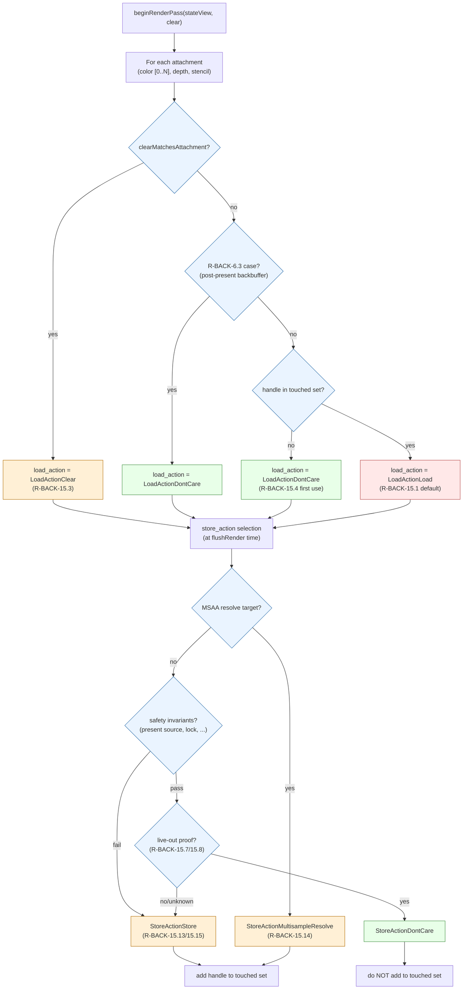
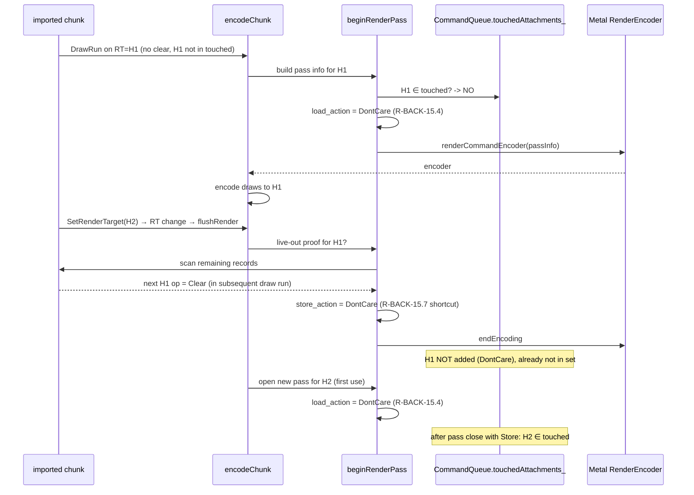

# Render-Pass Load/Store Action Spec

This spec defines how dxmt9 selects `MTLLoadAction` and `MTLStoreAction`
for each color, depth, and stencil attachment at render-pass boundaries
on Apple-Silicon TBDR hardware. The contract owns the encode-thread side
of `beginRenderPass` and `flushRender` plus the per-command-buffer
"touched" tracking that gates first-use DontCare-load.

The motivation is the SFIV `-benchmark` measurement
(`docs/perfomance-bottleneck.md`): 1272 frames × ~20 render passes
each, of which 75% pay full `MTLLoadActionLoad` + `MTLStoreActionStore`
cost. On a 1280 × 720 RGBA8 RT this is ~7.4 MB/pass of pure tile
preservation traffic — ~150 MB/frame, ~185 GB total over the benchmark
run. wined3d on OpenGL pays no such cost because GL has no explicit
render-pass model; on Metal these costs are unavoidable per pass but
can be eliminated when the contents are not actually live at the
boundary.

## 0. Ownership

| Concern | Owner | Notes |
|---|---|---|
| Default `LoadAction` / provisional Store selection | `src/dxmt9/dxmt9_draw_encoder.mm::beginRenderPass` | Loads are final at open; only recoverable bounded-suffix exhaustion may select `Unknown`. |
| Touched-attachment-handle set (color RTs) | `CommandQueue` (per command buffer) | Reuses existing `currentBackBuffer_` / `backBufferDiscardAfterPresent_` precedent. |
| Live-out proof for depth/stencil | Encode-thread look-ahead over imported chunk records | Stateless synchronous walk; depth and stencil classify full clears independently. |
| Late Store resolution | `EncodeSession` pass state + `LifecycleRuntime::endRender` | Fixed copied ledger; no payload view/span retention; narrow WMT setters run before `endEncoding`. |
| Counter emission | `src/dxmt9/dxmt9_perf_counters.{hpp,cpp}` | New `count*` helpers, same pattern as `R-BACK-15.10`–`15.12`. |
| Logical-pass action state | Encode coordinator / `EncodeSession` | Owns first/last physical segment and publishes actions and sidecars once (`R-BACK-15.17`). |
| Amendment to `R-BACK-2.6` | `specs/backend/requirements.md` | Edited in same PR. |
| Backbuffer post-present DontCare-load | Existing — `R-BACK-6.3` | Unchanged; this spec extends to other RTs. |

The PE/unix boundary is unchanged. PE never reasons about Metal load/store
actions; the encoder owns the policy entirely.

---

## 1. Architectural Layers

The design layers four orthogonal optimizations. Each addresses a
distinct cost source; they compose without conflict.

| Layer | Reduces | Implementation surface |
|---|---|---|
| 1. Color first-use DontCare-load | tile load on first write to a fresh RT | per-CB `touched` set + `beginRenderPass` check |
| 2. Color live-out DontCare-store | tile store on RT whose contents are about to be discarded | look-ahead over remaining chunk records |
| 3. Depth/stencil DontCare-store | tile store on transient depth | live-out proof, easier than color (depth rarely sampled) |
| 4. Counter coverage | empirical visibility | new perf counters per `R-BACK-15.10`–`15.12` |

Layers 1 and 3 are the high-ROI starting points. Layer 2 requires
non-trivial look-ahead and lands later. Layer 4 is the validation
substrate for all three.

---

## 2. Policy Decision Tree



### 2.1 Load action selection (per attachment)

Order of precedence, first match wins:

1. `R-BACK-15.3` clear-as-load → `LoadActionClear`.
2. `R-BACK-6.3` post-present backbuffer (existing) → `LoadActionDontCare`.
3. `R-BACK-15.4` first-use (handle not in touched set) → `LoadActionDontCare`.
4. `R-BACK-15.1` default → `LoadActionLoad`.

### 2.2 Store action selection (per attachment, at `flushRender`)

Order of precedence, first match wins:

1. `R-BACK-15.14` MSAA resolve → `StoreActionMultisampleResolve`.
2. `R-BACK-15.13` / `R-BACK-15.15` safety invariants fail → `StoreActionStore`.
3. `R-BACK-15.7` / `R-BACK-15.8` live-out proof holds → `StoreActionDontCare`.
4. `R-BACK-15.2` default → `StoreActionStore`.

For a deferred session, step 4 may provisionally select
`WMTStoreActionUnknown` only when the proof is `BlockNoLookahead`, its cause is
selected-suffix exhaustion or fixed-storage truncation, a future source may
arrive, and neither resolve nor present-source constraints apply. Actual replay
then resolves exactly once before `endEncoding`: an exact full Clear yields
`DontCare`; every other physical close yields `Store`. Compatible draws that
continue the same encoder do not resolve the pending action.

When step 4 selects `Store` (or step 1 selects MSAA resolve), the
attachment's handle is added to the touched set. When step 3 selects
DontCare, the handle is removed from the touched set (or never added).

---

## 3. Touched Attachment Set

```mermaid
flowchart LR
  CB1["encodeChunk entry"] --> Init["touched = previous_chunk.touched\n(NOT cleared per CB)"]
  Init --> Pass1["render_pass A → handle H1"]
  Pass1 -->|store=Store| AddH1["touched ∪= {H1}"]
  AddH1 --> Pass2["render_pass B → handle H2"]
  Pass2 -->|first use, dontcare-load| Pass2Store
  Pass2Store["store=Store"] --> AddH2["touched ∪= {H2}"]
  AddH2 --> Pass3["render_pass C → handle H1"]
  Pass3 -->|H1 in touched, load=Load| Pass3Store
  Pass3Store["store=DontCare\n(live-out proof)"] --> RemoveH1["touched ∖= {H1}"]
  RemoveH1 --> Stretch["StretchRect(H2, dst=...)\noverwrites H2"]
  Stretch --> RemoveH2["touched ∖= {H2}\n(R-BACK-15.5)"]

  classDef cb fill:#fff0d6,stroke:#b26b00
  classDef set fill:#eaf4ff,stroke:#2f6fad
  classDef pass fill:#e8ffe8,stroke:#3c8f3c
  class CB1,Init cb
  class AddH1,AddH2,RemoveH1,RemoveH2 set
  class Pass1,Pass2,Pass3,Stretch pass
```



The touched set lives on `CommandQueue` (queue-local). It is **not**
reset at command-buffer boundaries — see `R-BACK-15.6`. Resets occur on:

- Application-initiated resource invalidation: D3D9 resource recreation,
  device reset.
- `R-BACK-15.5` overwrite operations: `StretchRect`, `SurfaceCopy`,
  `ColorFill`, `Readback` whose destination is the tracked handle.
- `R-BACK-6.3` backbuffer post-present (handle moves to "discard" state).

Storage: `std::flat_set<u64>` keyed on `colorAttachments[i].handle.value`.
Expected steady-state size is small (a handful of unique RT handles per
scene); the flat_set is fine. No mutex is needed because the encode
thread is the sole writer and reader.

---

## 4. Live-Out Proof Look-Ahead

For `R-BACK-15.7` / `R-BACK-15.8`, the encode thread inspects the records
after the pass-opening draw to decide whether the attachment about to be
unbound is live-out. An implementation may evaluate this when the pass opens
or at `flushRender`, but a pass-open proof must first skip the DrawRun prefix
that the encoder will keep inside that same Metal render pass.

The inspected sequence is the sequence the encoder will actually replay. A
source-order chunk scans increasing command indices. A chunk with a validated,
complete command permutation scans the permutation suffix after the
pass-opening draw's replay ordinal. The same-pass DrawRun-prefix exception is
applied to that suffix. An out-of-range command index or unavailable suffix is
`BlockNoLookahead`, never an optimistic proof.

```mermaid
flowchart TD
  Flush["flushRender(splitReason)"] --> ForEach["For each attachment\nbeing released"]
  ForEach --> ScanAhead["Scan remaining chunk records\n(only — no cross-chunk)"]
  ScanAhead --> Found{"Next op on this handle"}
  Found -->|Clear| ProofClear["proof: contents discarded\n→ DontCare allowed"]
  Found -->|Read / Sample / Bind as RT| ProofLive["proof: live-out\n→ Store required"]
  Found -->|Overwrite (StretchRect dst, ColorFill)| ProofOverwrite["proof: contents discarded\n→ DontCare allowed"]
  Found -->|Lock / GetRenderTargetData| ProofLock["proof: contents needed by host\n→ Store required (R-BACK-15.15)"]
  Found -->|None in this chunk| Defensive["unknown → Store\n(R-BACK-15.9)"]

  classDef good fill:#e8ffe8,stroke:#3c8f3c
  classDef bad fill:#ffe8e8,stroke:#b64242
  classDef defensive fill:#fff0d6,stroke:#b26b00
  class ProofClear,ProofOverwrite good
  class ProofLive,ProofLock bad
  class Defensive defensive
```

### 4.1 Look-ahead scope

The walk stops at:
- A control-flow record that ends the chunk (Present, Submit boundary).
- The end of the chunk's record stream.
- A definitive proof (positive or negative) is found.

The walk must not block, allocate, or take the chunk lock. It is a
read-only iteration over already-imported records. Worst case it is
O(remaining_records); typical case is small because most live-out proofs
appear within a few records of the boundary.

### 4.2 Depth/stencil heuristic shortcut

A simpler-and-conservative shortcut for depth/stencil:

- If the next render-pass record on this depth handle has a depth-clear
  on the same handle as its first operation, store action may be
  `DontCare`.
- If the next operation is a `Present` or chunk end, store must be
  `Store` (defensive).
- Otherwise, store must be `Store`.

This shortcut is `R-BACK-15.7` minus the "next op is a copy" branch; it
catches the most common SFIV pattern (per-pass scene depth, cleared at
next pass start) without requiring a copy-record walk.

### 4.3 Same-pass DrawRun prefix

A DrawRun that follows the pass-opening DrawRun is not a live-out use when all
of the following hold:

- its complete color/depth/sample attachment key matches the pass-opening key;
- its read set has no exact overlap with the active attachment write set; and
- the selected encoder route cannot require a mid-pass split.

The proof skips such records and continues to the first operation after the
logical pass. A texture sample of the attachment or its texture alias remains
a live read and forces `Store`. Attachment changes and helper operations end
the same-pass prefix. The tile-FFP route stays conservative because a later
eligibility transition can split an otherwise matching attachment sequence.
This distinction prevents ordinary same-pass DrawRuns from hiding a following
Clear and turning every pass into a false `BlockDrawTarget` /
`BlockDrawDepth` result.

For source-local optimized replay, the fixed proof view is composite: it starts
after the pass-opening command in the current source's validated replay order,
then appends retained source ranges beginning at retained source 1. Retained
source 0 is used only to validate the exact current source/range identity; its
natural-order range is never replayed again. The builder is synchronous and
allocation-free, and no payload or command-order span enters session storage.
Any identity/range/ordinal mismatch or descriptor-capacity overflow marks the
whole composite proof `Invalid`, so it cannot resolve an attachment to
`DontCare` or provisionally select `Unknown`.

### 4.4 Session-owned late proof state

The active pass owns a fixed array of copied facts per included attachment:
surface handle, texture alias, color slot or depth/stencil aspect, estimated
pixel bytes, provisional/concrete action, and an exactly-once accounting bit.
It owns no `SourcePayloadView`, borrowed span, command pointer, or future
payload owner. `ClearCommandView` is consumed synchronously before the
ClearBarrier closes the pass.

Depth and stencil decisions remain independent even when they share one Metal
texture handle. A depth-only clear cannot discard stencil, a stencil-only clear
cannot discard depth, and color must match the exact MRT slot and handle.
Partial or same-attachment mismatched clears require `Store`. Static look-ahead
may continue past a clear that does not carry the evaluated attachment; late
runtime resolution is conservative once the active encoder actually closes.

`LifecycleRuntime::endRender` is the single physical close point. Command paths
with a known close cause resolve before calling it; `endRender` supplies the
ordered/final/drain/error fallback, then emits resolved Store histograms, tile
Store bytes, and the pass summary once. A null encoder-open result immediately
clears its provisional ledger.

---

## 5. Mechanism — End-to-End



---

## 6. Verification Mapping

| Requirement | Evidence target |
|---|---|
| `R-BACK-15.1` / `R-BACK-15.2` defaults | `tests/native/backend/render_pass_actions_spec.cpp` (new) — synthetic chunk with no rules triggered, assert Load+Store. |
| `R-BACK-15.3` clear precedence | Same spec — clear-bound attachment selects Clear over DontCare. |
| `R-BACK-15.4` first-use DontCare-load | Same spec — fresh handle gets DontCare. |
| `R-BACK-15.5` set invalidation | Same spec — StretchRect overwrite removes from set. |
| `R-BACK-15.6` cross-frame retention | Same spec — second chunk reuses handle, gets Load (not DontCare). |
| `R-BACK-15.7` depth DontCare-store on next-clear | Same spec — synthetic chunk with depth then depth-clear. |
| `R-BACK-15.8` color DontCare-store on overwrite | Same spec — color RT then StretchRect dst. |
| `R-BACK-15.7` / `R-BACK-15.8` reordered Store proof | Same spec — a complete command permutation moves a same-pass draw before a source-order clear; assert replay-order blocking without active-pass context, same-pass-prefix skipping with context, replay-ordinal distance, and defensive fallback for an invalid index. |
| `R-BACK-15.9` no cross-chunk look-ahead | Same spec — chunk ends without proof, must Store. |
| `R-BACK-15.10`–`15.12` counters | `tests/native/backend/allocation_counter_spec.cpp` extension or new — assert keys present, sums match. |
| `R-BACK-15.13`–`15.15` safety invariants | Same spec — present source / lock / MSAA resolve forces Store. |
| `R-BACK-15.16` test coverage | Spec lands the test fixture above. |
| `R-BACK-15.17` segmented logical pass | Extend the native spec with fake parallel children and Metal 4 segments: one load/clear, one final store/resolve, no duplicated touched/sidecar/counter publication; add Metal integration evidence when either lane exists. |
| `R-BACK-15.18` late Store resolution | `render_pass_actions_spec.cpp` pins recoverable truncation/exhaustion eligibility, invalid/empty exclusion, exact aspect/slot/full-clear rules, MSAA/present exclusion, and >8-source pure look-ahead. `encode_session_lifecycle_spec.cpp` pins copied-state carry across ten FIFO sources, compatible continuation, exact Clear resolution, draw/sample controls, every finalize mapping, ordered close, and null-open cleanup. `wmt_store_action_dispatch_spec.cpp` pins all three narrow WMT setters. |

GPU pixel correctness for the new policy is covered by the existing
`tests/shader_runner/corpus/` runs; they must continue to pass with the
new policy active. Any pixel divergence is a regression of the
implementation, not the spec.

---

## 7. Trade-offs

| | |
|---|---|
| ✅ Per-frame tile preservation traffic reduced (target ≥ 30% Load reduction, ≥ 50% depth Store reduction). | Direct GPU-time win on Apple TBDR. |
| ✅ Layered design — Layer 1 (first-use load) lands first as smallest atomic change. | Each layer measurable independently. |
| ✅ Reuses existing `currentBackBuffer_` / `backBufferDiscardAfterPresent_` precedent. | No new lifetime surface. |
| ✅ Sequence-id keyed safety preserved (touched set lives until explicit invalidation). | No GPU correctness risk from auto-reset. |
| ⚠️ Look-ahead walk in `flushRender` adds CPU work per render pass close. | Bounded O(remaining_records); expected to be small. |
| ⚠️ Live-out proof can produce false negatives (next op unknown → defensive Store). | Acceptable: false negative is "no win", not "wrong pixels". |
| ⚠️ Depth/stencil DontCare-store is risky if app samples depth across passes (rare in D3D9 fixed-function but possible in shader-mode apps). | Mitigated by `R-BACK-15.7` proof requirement; shortcut only fires on next-clear. |
| ❌ Implementations must not regress to "always DontCare for speed" without a proof. | Hard rule; defensive Store is the correct fallback. |

---

## 8. Out of Scope

- **Unknown-future look-ahead.** `R-BACK-15.9` forbids waiting for unpublished
  work. A sealed EncodeSession may inspect its already-admitted immutable suffix
  under `R-BACK-15.17`, but may not infer actions from unknown future sources.
- **Tile-shader integration with depth.** `R-BACK-13` (tile-FFP) is
  separate. Non-diagnostic `tile-auto` cannot create a tile-active pass while
  `R-BACK-13.7` is open; diagnostic `force` and any future promoted provider
  leave depth handling to that spec's contract.
- **Programmable blending / framebuffer fetch.** A future Apple-only
  optimization. Not addressed here.
- **`MTLHazardTrackingMode` tuning.** Touched-set-style tracking is not
  a substitute for hazard tracking; both coexist.
- **Heap residency interactions (`R-BACK-14`).** Heap members do not
  affect load/store action choice; this spec is orthogonal.
