# Backend Spec

---

## 1. Module Structure

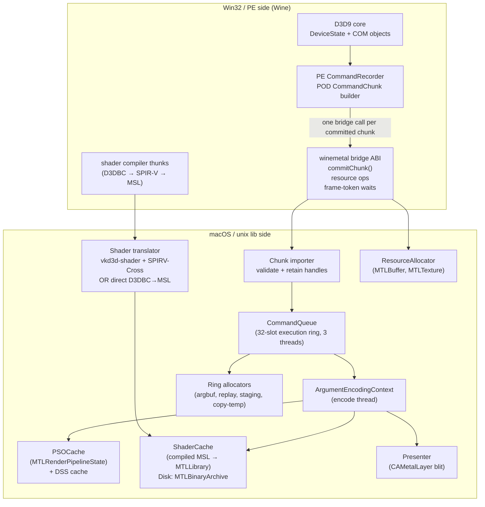

### 1.1 Upstream DXMT Alignment Target

The backend target mirrors upstream DXMT's useful split: API calls record command
work first, and Metal execution happens later on queue-owned encode/completion
threads. dxmt9 differs only in the bridge payload format: D3D9 command data crosses
the Wine PE/unix boundary as POD records that import into queue-local replay actions.

```mermaid
flowchart TD
    subgraph DXMT["Upstream DXMT D3D11 shape"]
        DXCtx["D3D11 immediate context\nEmitST / EmitOP"]
        DXChunk["CommandChunk\ncommand list"]
        DXQueue["CommandQueue\nencode + finish threads"]
        DXMetal["Metal wrapper calls"]
        DXCtx --> DXChunk --> DXQueue --> DXMetal
    end

    subgraph DXMT9["dxmt9 target shape"]
        D9Dev["D3D9 PE device\nDeviceState shadow"]
        D9Chunk["PE CommandChunk\nPOD records + handles"]
        D9Bridge["winemetal commitChunk()\none unix call"]
        D9Import["unix importer\nvalidate + retain"]
        D9Queue["CommandQueue\nencode + finish threads"]
        D9Metal["Metal wrapper calls"]
        D9Dev --> D9Chunk --> D9Bridge --> D9Import --> D9Queue --> D9Metal
    end

    subgraph NonGoal["Non-goal"]
        SetCall["SetRenderState / SetTexture"] --> PerCall["per-call unix submit"]
        DrawCall["DrawPrimitive"] --> PerCall
    end
```

The alignment requirement is about ownership and timing, not source-level identity.
Upstream DXMT remains the architectural target shape even where dxmt9 uses a
different record representation:

- PE owns D3D API semantics, state shadowing, getters, state blocks, and command
  packet construction.
- The Wine bridge owns ABI marshalling only.
- The unix importer owns packet validation, POD record import, handle lookup, and
  handle retention. It rejects malformed records before queue ownership begins.
- `CommandQueue` owns execution chunk lifecycle, chunk scheduling, encode-thread and
  finish-thread progression, Metal command-buffer lifetime, completion, sequence
  fences, and frame-latency token allocation/signaling.
- `Presenter` owns `CAMetalLayer` access, drawable acquisition, layer pacing, the
  back-buffer-to-drawable copy, and `presentDrawable` encoding.

No PE COM object, Objective-C object, process-local pointer, or per-call mutable
scratch object participates in unix-side encode ownership. The backend consumes
compact imported records and state structs; it does not reach back into the D3D9
device object to interpret commands.

---

## 2. Command Queue

The command queue is the central coordinator. It decouples PE-side D3D9 command
recording from unix-side Metal encoding.

There are two chunk forms:

- **PE CommandChunk:** a POD command stream produced by the core without calling
  Metal or ObjC APIs.
- **Execution chunk:** the unix-side queue slot that owns retained handles,
  imported records, transient allocator ranges, and the eventual Metal command
  buffer.

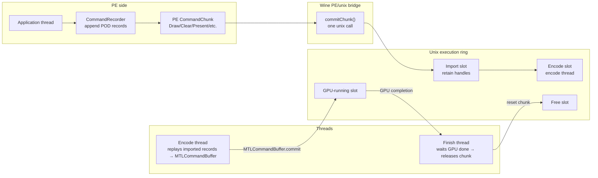

**PE CommandChunk** holds:
- A compact command header array and POD payload arena
- Canonical numeric-version-2 grammar: stable object-ID/generation table entries for buffers, textures,
  surfaces, shaders, vertex declarations, and queries
- No raw pointer-typed fields, COM pointers, ObjC pointers, lambdas, or owning
  C++ containers in the wire image
- Command-count and byte-size fields used to bound tail latency

**Execution chunk** holds:
- Imported command records and queue-local replay actions owned by the unix side
- Four ring sub-allocators: `staging` (CPU-visible readback), `copy_temp` (GPU private
  blit), `argbuf` (argument buffers), `replay_store` (imported replay storage)
- A sequence ID used to determine when in-flight resources can be released
- Optional frame token metadata when the chunk contains a present

**Submission flow:**

1. D3D9 calls update PE-side state or append records to the current PE chunk.
2. On `Present`, readback, query ordering, resource hazard, or chunk limit, the core
   commits the PE chunk through `commitChunk()`.
3. The unix importer validates the records, retains referenced backend handles, and
   assigns a sequence ID. If the chunk contains a present, it also assigns a frame
   token.
4. The encode thread dequeues the execution chunk and replays records against
   `ArgumentEncodingContext`, producing Metal commands.
5. The encode thread commits the `MTLCommandBuffer`.
6. The finish thread waits for GPU completion, signals sequence/frame fences, releases
   handles, and returns ring allocator memory.

### 2.1 Bridge Granularity Target

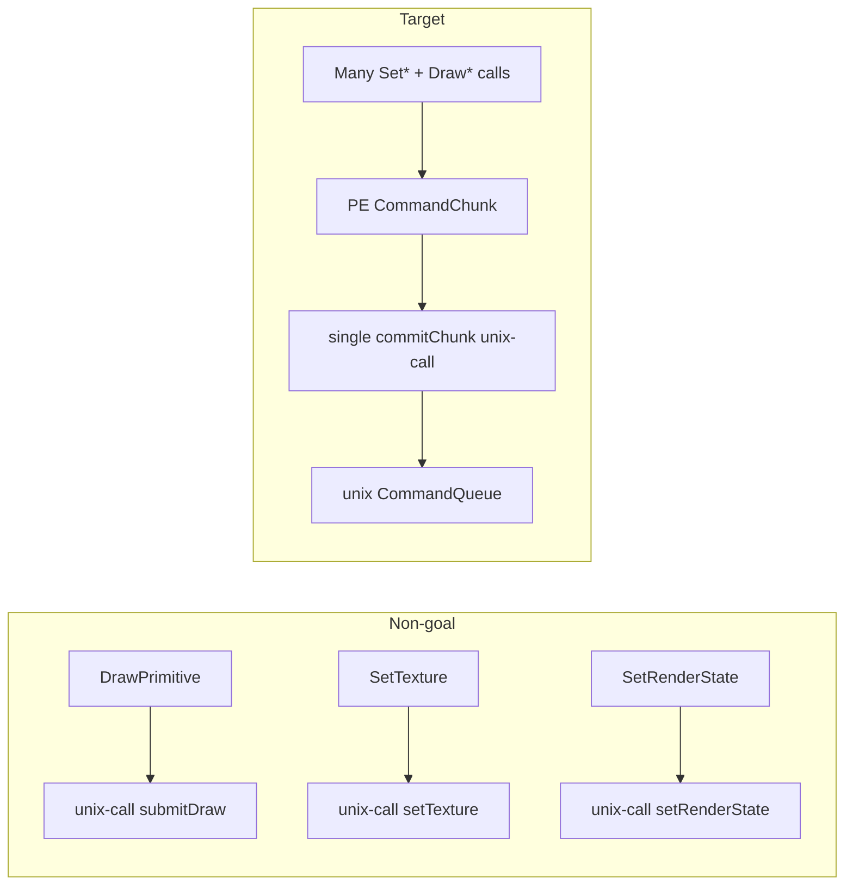

The backend may keep narrow per-operation entry points for tests or bootstrap, but
the default Wine runtime path is chunk submission. A design that sends every D3D9
draw/state call through `WINE_UNIX_CALL` is non-compliant with this performance
target.

### 2.2 Chunk Lifecycle and Ownership

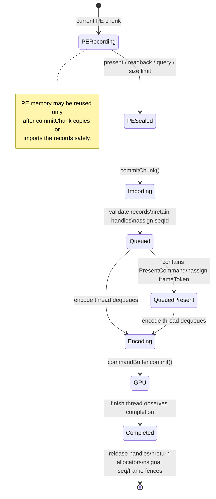

Ownership rules:

- The PE chunk owns its POD payload until `commitChunk()` returns.
- The importer must copy or take ownership of every record and retained handle needed
  after `commitChunk()` returns.
- Execution chunks own backend handle references until completion.
- Frame tokens exist only for chunks containing a present command.
- Sequence IDs track all chunk completion; frame tokens track present-bearing chunk
  completion.

Immutability model (owners: R-BACK-2.51(i), R-BACK-2.59). Each hand-off in the
lifecycle freezes the data it publishes; downstream stages read, they do not
edit:

| Stage artifact | Frozen at | Consume-side mutations permitted |
|---|---|---|
| PE wire chunk (record + handle tables, payload arena) | `PESealed` | none — the importer copies or takes ownership |
| Raw-chunk queue entry (unix-owned wire copy + retained wrappers) | push onto the offload queue | none; consumed exactly once, FIFO (R-BACK-2.51(i)) |
| Published `ChunkSlot` storage (headers, records, params, arenas, uniform payloads, binding bytes, handle tables) | leaving `Writing` | lifecycle state field; the encode worker's pipeline-prefetch memo (resolved PSO/DSS handle annotations on `DrawRun` records + prefetch cursor/seal); clearing at reclaim (R-BACK-2.59) |
| Partition-entry snapshots and resolved views over a slot | build/resolution time | none — call-local, never retained (R-BACK-2.57/2.58) |

The prefetch memo is the one deliberate carve-out: it annotates `DrawRun`
records with already-resolved pipeline handles on the encode worker before the
encode step reads them, and never rewrites imported payload bytes. Everything
downstream of a publish boundary may therefore assume stable storage — the
premise that pass-streaming reference-consumption (R-BACK-2.46), partition
snapshots (R-BACK-2.57/2.58), and any future parallel-partition executor or
resource-scoped drain fence build on.

### 2.2.1 Sub-CommandBuffer Chain (G axis target)

`R-BACK-2.29` permits a single execution chunk to commit through a chain
of `MTLCommandBuffer` instances on the same `MTLCommandQueue`. The
chunk's `seqId` covers the chain; `completedSeqId` advances only when
the **last** sub-CB reaches Completed.

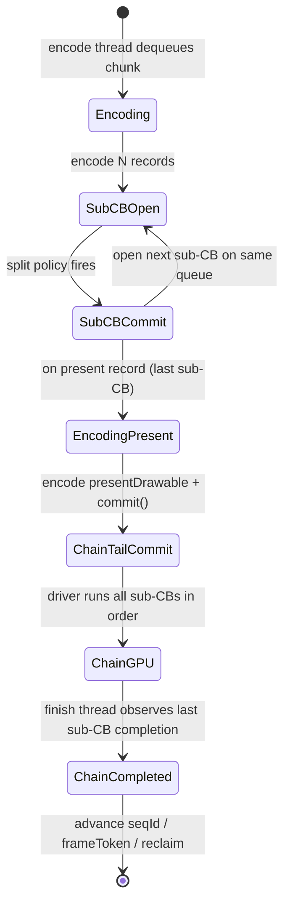

Split policy rules (R-BACK-2.31 deterministic):

- A split decision must read only imported record fields, retained
  handle metadata, and queue-local state captured at chunk admit time.
- Candidate triggers (any may be chosen, mixing is allowed if the
  composite predicate is still deterministic):
  - **per-N records** — every N records since the last commit, where
    N is a fixed encode-thread constant or env-driven knob.
  - **per-render-pass** — commit at every `flushRender` whose split
    reason is not `Final`.
  - **per-X bytes** — commit when total encoded byte count crosses a
    threshold (requires byte accounting in encode thread).
- Wallclock-time-based or GPU-feedback-based triggers are forbidden.
  They violate R-BACK-2.16 / R-BACK-2.31 determinism.

Present and chain-tail rule (R-BACK-2.30):

- The present-bearing record's encoder must be the **last** sub-CB.
  Any preceding sub-CB must not call `presentDrawable`, must not
  acquire a drawable, and must not advance the present-frame-token.
- `splitBeforeBlockingPresent()` (existing path) becomes a special
  case of mid-chunk split — the policy that always closes a sub-CB
  immediately before the present encoder opens. Other split policies
  fire earlier in the chunk.

Reclaim rule (R-BACK-2.32):

- All chunk-owned resources (transient slabs, retained handles, arg
  buffers) remain pinned until the chain's last sub-CB completes.
- Sub-CB GPU completion order is guaranteed by Metal's same-queue
  in-order submission. The queue tracker must not re-derive ordering
  per sub-CB.

Failure mode:

- A sub-CB that fails (`WMTCommandBufferStatusError`) marks the entire
  chunk failed. The chain's tail still must run completion handlers so
  the present token does not stall. The error is reported via the
  `gpu_command_buffer_errors` counter (M5) at the failure site, not
  per-sub-CB.

### 2.2.2 Encode Scheduling

CPU-ready publication, ready-prefix ownership, EncodeSession pass streaming,
partition planning, and the serial, parallel, and Metal 4 execution lanes are
owned by [Encode Scheduling](encode-scheduling/spec.md). Its
[requirements](encode-scheduling/requirements.md) are authoritative for
`R-BACK-2.35`–`R-BACK-2.50` and `R-BACK-2.57`–`R-BACK-2.66`.

The parent command-queue design preserves three integration rules:

- source publication, partition edges, physical encoder segments, logical
  render-pass boundaries, and submission boundaries are distinct;
- the Presenter remains the only drawable and present-token owner; and
- completion and resource reclamation remain ordered by source `seqId` even
  when one Metal tail or joint group represents several sources.

Historical carrier and partition evidence is retained in
[the encode-scheduling gap](encode-scheduling/gap.md) and linked performance
notes rather than duplicated here.

### 2.2.3 Render Provider Policy

The cross-domain lifecycle and composition registry for renderer, producer,
scheduling, submission, binding, FFP, and Present choices is owned by
[Render Provider Policy](render-provider/spec.md). Its
[requirements](render-provider/requirements.md) are authoritative for
`R-BACK-42.1`–`R-BACK-42.7`. Domain requirements continue to own the semantics
of each mode; the registry prevents experimental and diagnostic selectors from
silently becoming compatibility promises.


#### Commit-Replay Offload (engine default ON)

The commit-replay offload (`DXMT9_OFFLOAD_COMMIT_REPLAY`, **engine default ON
since 2026-07-10**, `d45af067` — explicit `0` opts out;
`DXMT9_OPTIMIZE_OPAQUE_DEPTH_INDEX_CACHE` unset follows the offload state
because the pair is coupled) moves the record-replay phase of
`dxmt9c_device_commit_chunk` off the app thread onto a device-owned replay
worker (design: `docs/superpowers/specs/2026-07-05-commit-replay-offload-design.md`).
The observable contract is `R-BACK-2.51`. The mechanics:

- The synchronous phase always keeps wire header/range validation, handle
  generation checks, canonical resource identities, backing snapshots, raw
  residency, and wrapper retention. With the CPU-ready promotion gate off, it
  also keeps the historical combined `markChunkResources` + backing-capture
  operation before handoff, and the worker skips structural planning and
  directly uses Legacy replay. With the gate on, a Direct candidate applies
  the exact strict source `seqId` mark after admission and before seal/Ready;
  StateOnly emits no mark, and a planned Legacy lane marks before semantic
  replay. The replay boundary remains the existing
  `noteCommitChunkReplayStartForCompletionGap()` marker. Worker-owned record
  replay, draw-submission construction, and publication consume the bounded
  FIFO's unix-owned wire copy and addref'd resolved wrappers.
- Present pacing re-anchors on the app thread: present-bearing commits wait a
  present-ordinal frame-latency boundary
  (`CommandQueue::waitPresentOrdinalBoundary`, pure mapping
  `planPresentOrdinalWait`) that honors the resolved `BoundaryPolicy`, is
  order-isomorphic to the inline present boundary (TLA
  `PresentFrameLatency` ordinal variant, `PresentOrdinalWaitIsomorphism`),
  and caps its effective latency against the committing chunk's swapchain
  `backBufferCount` via `dxmt9::cappedFrameLatency` whenever
  `DXMT9_CAP_FRAME_LATENCY_TO_BACKBUFFERS` is set — the same cap
  `presentBoundaryLatency()` applies to the inline boundary. The worker
  itself is never parked on pacing.
- `submitPresent` suppresses its inline seqId-based boundary only for the
  specific present that the app thread just paced through
  `waitPresentOrdinalBoundary`: `dxmt9c_device_commit_chunk`'s offload branch
  calls `replayResolvedChunk(..., pacedByPresentOrdinal=true)` for the raw
  chunk the worker later replays, and only that Present record's
  `dxmt9c_device_present` call marks the next `core::Device::presentEx()`
  call's `SwapDesc::pacedByPresentOrdinal`
  (`core::Device::setNextPresentPacedByOrdinal`). The synchronous
  (non-offload) replay tail passes `pacedByPresentOrdinal=false` explicitly.
  Any present whose `SwapDesc` was not stamped this way — a direct
  (non-chunk) COM present in the same process, or a present replayed by the
  synchronous tail — keeps the inline boundary
  (`dxmt9::resolvePresentBoundaryAction`), even while
  `DXMT9_OFFLOAD_COMMIT_REPLAY` is globally enabled for other presents. This
  flag rides `core::SwapDesc` only; it is unix/core-side and does not cross
  the PE/unix wire (the wire's `D9CCommandRecordPresent` is unchanged).
- A device-owned `ReplayDrainLedger`, independent of the lazily-created replay
  worker, assigns each accepted raw chunk a FIFO replay sequence and records
  per-core-buffer-identity `lastQueuedSeq`/`lastReplayedSeq` watermarks. Shared
  handles reopened on the same device therefore reuse one target even though
  they have distinct `D9CBuffer` wrappers. Admission first owns
  the raw entry under the queue lock and then publishes its ledger targets;
  the sole nested lock order is queue then ledger. A stopped/refused push
  publishes no watermark. Replay completion, clean stop, and poison update
  their predicates and notify scoped waiters while holding the ledger lock, so
  waiters cannot miss either catch-up or terminal state. The core-handle target
  cache stores weak values and periodically erases expired generations at a
  live-set-relative growth threshold, so buffer churn cannot retain one map
  node for every historical generated handle.
- The synchronous admission phase captures the concrete backing generation for
  every imported buffer handle and stores the immutable handle-to-snapshot
  table in the raw entry. Each captured rename-ring backing also lends the raw
  entry a residency token; popping transfers the token from queued ownership to
  the single replay-worker in-flight state without releasing it. Rotation
  cannot select that entry until replay completion, clean stop, or poison
  releases the token, independently of GPU seqId retirement. The PE recorder
  must seal a raw chunk before an
  operation that can rotate a backing, including writable managed-buffer
  publication, so one buffer handle denotes one backing generation within an
  admitted PE raw chunk. Chunk replay resolves draw bindings only from that
  captured table and fails closed on a missing required entry. The table is
  sorted once at admission; replay attaches the 832-byte binding payload only
  to a draw that actually resolves at least one captured backing. Direct draws
  do not install a chunk resolver and retain the existing live-backing lookup.
- Direct buffer lock and unlock are the initial resource-scoped allowlist.
  Plain, read-only, and managed locks wait only while their target buffer's
  queued watermark exceeds its replayed watermark. A valid dynamic
  `D3DLOCK_DISCARD` lock may bypass replay waiting only when the upper device
  reports runtime dynamic renaming enabled, because it then renames to a fresh
  or idle non-in-flight and non-raw-resident backing; `NOOVERWRITE` may bypass
  under its existing caller-owned non-overlap contract. Unlock may reuse a
  bypass class only when its paired lock completed successfully. All unclassified,
  multi-resource, device-wide, readback, present, reset, shutdown, query, and
  state-block calls retain the whole-device drain and propagate its fail-stop
  result before provider entry. A stopped or poisoned scoped fence runs that
  fallback and returns
  `D3DERR_DEVICELOST` without entering the buffer provider. Calls that only
  create or inspect wrapper-cached metadata retain their no-drain fast path,
  but acquire-check the same device-owned atomic terminal state before
  provider entry. This includes `BeginScene` / `EndScene`, shader and
  vertex-declaration creation or inspection, texture/surface/buffer metadata,
  swapchain getters, and query type/size getters. Lifetime-only addref/release
  calls remain reachable so terminal teardown cannot leak wrappers.
- This single-core-buffer watermark lane is the currently implemented scoped
  special case. `encode-scheduling/requirements.md` `R-BACK-2.61` owns the
  future generalized multi-resource conflict-prefix design. Until that design
  has complete canonical access summaries and its conservative fallback, calls
  outside the buffer allowlist continue to use the full drain described above.
- Replay failures fail-stop the worker (debug asserts; release poisons later
  commits, wake scoped waiters without acknowledging failed or abandoned
  chunks, release retained wrappers, and abort pending ordinal waits). Failure
  publication is ordered before completion: publish the worker/device terminal
  state, poison the ledger, stop queue admission, release the failed raw entry,
  and only then clear the queue's in-flight marker and notify drain waiters. A
  clean worker stop also wakes scoped waiters with a non-success stopped result. The
  historical per-record synchronous HRESULT
  short-circuit of `commit_chunk` does not hold in offload mode.
- With the flag explicitly set to `0` (the opt-out), the same admitted canonical
  representation and captured binding bytes pass through the same device-owned
  ledger and are replayed inline instead of being queued to the worker; inline
  success publishes the matching replayed watermarks before returning.

All three former promotion blockers are resolved. The two boundary-pacing
gaps (global-only inline-boundary suppression; ordinal wait ignoring
`DXMT9_CAP_FRAME_LATENCY_TO_BACKBUFFERS`) fell to R-BACK-2.51(g)/(h)
(`72132513`), and the offload-forced native-spec crashes that looked like a
replay-worker resource-retention defect were root-caused as a test-harness
drain gap, not a production race — the two specs passed stack-allocated wire
wrappers and bypassed the `drainDeferredReplay()` fence every real bridge
call gets (`cad446ce`, regression-pinned by the `-offload` spec variants).
The engine default flipped to ON on 2026-07-10 (`d45af067`; H216 in
`docs/perfomance/present-pacing/log.md`). See the `specs/backend/gap.md`
"Commit-replay offload" row for the full evidence chain.

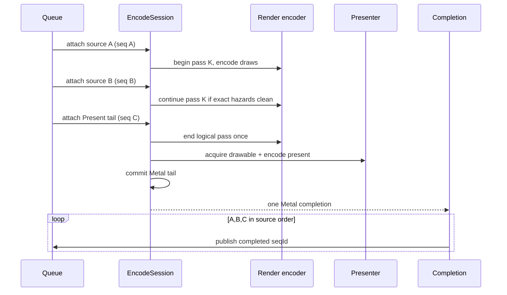

#### Inline Const Delta (experimental candidate)

`DXMT9_PE_INLINE_CONST_DELTA=1` folds the shader-constant deltas a draw
consumes into that draw's packet instead of emitting standalone
`D9C_COMMAND_RECORD_SET_*_CONST_*` records. The observable contract is
`R-BACK-2.52`. Motivation: H213
(`docs/perfomance/present-pacing/present-pacing-decimated-pe-stats.200.md`)
sized the PE const chain at `~5.1-5.6ms/present` in 3DMark05 GT1 — `~645`
standalone const records per present whose cost is per-event funnel/walk
logic under Rosetta, not byte volume — giving this fold a `~+10%` FPS
ceiling. The mechanics:

- **PE recorder** owns the fold: `buildDrawPrimitivePacket` consumes the six
  const shadows' merged dirty ranges (`touchConstShadow` dedup and range
  tracking are unchanged) directly into packet sections and marks them clean.
  The pre-draw `flushConstShadow` record-emission step is skipped only for
  ranges the packet carries. Non-draw const consumers (`ProcessVertices`,
  chunk-barrier/chunk-end drains) keep the standalone-record flush path
  verbatim, flag on or off.
- **Wire**: each section mirrors the `D9CCommandRecordSetConst` element-size
  rules (`float4`/`int4` = 16 bytes per register, bool = 4). Sections ride the
  existing variable draw-packet serialization; caps are the D3D9 register-file
  limits, so a section can never legally exceed one full register file.
- **Unix importer** validates sections (range + payload length against the
  record header) before retention/apply, rejecting the chunk on violation like
  any malformed packet, then applies sections to the server-side const shadow
  immediately before the draw's state delta so ordering is isomorphic to the
  standalone-record wire. The run coalescer treats a const-bearing packet as
  state-delta-bearing (run break), which is exactly where the equivalent
  standalone const record breaks a run today (`const_upload` is already the
  dominant break class), satisfying R-BACK-2.52(f) with no coalescer change.
- **Failure behavior**: section validation failure is a chunk import rejection
  (`E_INVALIDARG` class) before any handle retention, identical to other
  packet bounds violations.
- **Verification**: PE record byte-pinning specs (off path unchanged + new
  section rows), an on/off replay-equivalence spec
  (`pe_full_snapshot_equivalence_spec` pattern: same call stream, compare
  server-side effective state per draw), ABI-hash lockstep rebuild, and
  runtime judgment by decimated PE stats (`DXMT9_PE_STATS_DECIMATION`)
  plus paired no-gputrace presents scouts.

#### Encode Scheduling Integration

Fail-open publication, Metal execution constraints, minimal-copy source views,
serial partition traversal, parallel execution, Metal 4 segmentation, and the
ordered verification gates are defined in
[Encode Scheduling](encode-scheduling/spec.md). The detailed implementation and
evidence status is tracked in its [gap](encode-scheduling/gap.md).


### 2.3 Data-Oriented Transform Boundaries

The backend command path is a sequence of data transforms. Each stage owns explicit
data and hands the next stage compact immutable records or queue-local state structs.
This keeps the unix encoder deterministic and prevents hidden dependencies on PE COM
objects or ad-hoc per-call state.

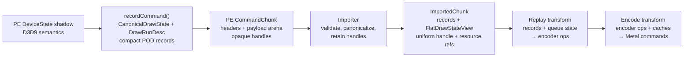

Transform boundaries:

- **Record:** PE code converts D3D9 API calls and device state into POD records. This
  is the only stage allowed to inspect COM objects or D3D9-facing state blocks.
- **Import:** unix code validates record headers, payload sizes, offsets, version
  fields, and handle liveness, then retains backend resources into queue-owned
  imported structs.
- **Replay:** the encode thread consumes imported records plus queue-local state such
  as the active encoder, deferred clears, hazard filters, and allocator cursors.
- **Encode:** `ArgumentEncodingContext`, PSO/DSS/shader caches, and the presenter
  convert replay decisions into Metal commands.

Replay/encode helpers should be deterministic functions where possible:

```
nextEncoderState = replay(record, importedState, priorEncoderState)
psoKey           = makePsoKey(flatDrawStateView)
argLayout        = buildArgumentLayout(flatDrawStateView, resourceBindings)
```

Allowed inputs are immutable imported records, retained backend handles, explicit
queue-local state structs, cache interfaces, and allocator cursors. Disallowed inputs
are PE COM objects, PE `DeviceState` pointers, implicit globals that affect command
semantics, and per-call scratch state not represented in the execution chunk.

### 2.4 CommandChunk Storage and Wire ABI

`CommandChunk` is a data-oriented wire container, not an object graph. The PE side
builds a fixed header plus contiguous sections:

```
CommandChunkWire {
    ChunkHeader          header
    CommandRecordHeader  records[header.recordCount]
    HandleTableEntry     handleTable[header.handleCount]
    uint8_t              payloadArena[header.payloadBytes]
}
```

The record header array is fixed-width and cache-friendly so the importer can scan
record kinds, sizes, offsets, and handle indices linearly before touching payloads.
Payload bytes are stored in a single arena owned by the chunk. Variable-sized command
data is addressed by `{payloadOffset, payloadSize}` pairs, never by pointers.

Wire headers are POD structs with fixed integer fields:
- `ChunkHeader`: magic, ABI version, header size, record count, payload byte count,
  handle-table count, flags, and reserved fields that must be zero.
- `CommandRecordHeader`: opcode, header size, payload offset, payload size,
  first-handle index, handle count, alignment exponent or flags, and reserved fields
  that must be zero.
- Handle table entries are opaque integer backend handles plus kind tags where
  needed for validation.

The bridge ABI must define byte order, field sizes, alignment, and packing explicitly.
All wire structs are naturally aligned to their fixed ABI alignment, and every
payload starts at an offset aligned for the payload schema. Import rejects chunks when
`sizeof`/`alignof` static assertions, negotiated header sizes, or runtime offset
checks do not match the ABI contract.

Version policy:
- The importer accepts only compatible `ChunkHeader.abiVersion` values negotiated at
  backend initialization.
- Unknown opcodes in a compatible version are rejected for normal execution. They may
  be skipped only when the record carries an explicit ignorable/diagnostic flag and
  its payload bounds validate.
- Reserved fields must be zero so future versions can extend the ABI without making
  old importers silently reinterpret data.

Handle and payload rules:
- Records refer to resources through indices into the chunk handle table. The importer
  validates index ranges, kind compatibility, liveness, and duplicate references before
  retaining backend objects.
- The handle table is immutable after the PE chunk is sealed. Imported records store
  compact retained handle references or queue-local indices, not raw bridge handles
  that require repeated lookup on the encode thread.
- Payload arena ranges must satisfy `payloadOffset + payloadSize <= payloadBytes`
  without integer overflow. Nested offsets inside a payload are relative to that
  payload and must be bounds-checked before use.
- Payload schemas must not contain process-local pointers, Objective-C object
  references, COM pointers, vtables, virtual bases, `std::function`, C++ lambdas,
  allocator-owned containers, or host-endian opaque blobs with implicit layout.

Imported records preserve the same data-oriented shape: contiguous arrays for record
headers/decoded structs, compact handle-reference arrays, and arena-backed variable
payloads. Replay should walk these arrays linearly where possible; command-specific
decode may canonicalize into queue-local POD structs but must not allocate one heap
object per command.

Hot-path allocation policy:
- PE recording appends into pre-reserved chunk arrays and arenas. If capacity is
  exhausted, the recorder seals and submits the chunk or grows only outside the draw
  hot path.
- Import may copy into a queue slot's preallocated storage or ring allocator ranges.
  It must not allocate unbounded per-command heap memory for ordinary draw/state
  records.
- Encode and GPU-facing hot paths use queue/ring allocators for argument buffers,
  staging, copy-temp, and imported replay storage. Cache misses may allocate cache
  objects, but steady-state replay of imported records must not allocate from the
  system heap.

#### 2.4.1 Promotion History: Retired Pointer-Bearing Contract

The numeric wire version 1 grammar was retired when numeric wire version 2 was
promoted to the suffixless canonical contract. PE and unix now advertise and
emit only the canonical contract, and commit/offload replay rejects every other
outer version. The retired envelope/import/replay/parity fixture corpus was
removed on 2026-07-19; layout, malformed-input, hazard, replay, marshalling, and
allocation evidence now uses canonical typed fixtures. The shared
`D9CCommandRecord*` semantic value structs and the conversion adapter are also
gone: the recorder builds `SparseStateInput` directly, so there is no staging
form left to convert.

This section is history, not a supported lane. The retired grammar had a sound
bounds-checkable outer shape, but its resource representation was transitional:
payload fields and `D9CCommandChunkWireHandleEntry::opaqueHandle` contained a server-side `D9C*`
wrapper address cast to `uint64_t`. This violated the pointer-free target in
`R-BACK-2.21` and is why it cannot remain as a fallback.

The historical hardened importer applied these invariants before dispatching
any record. They are retained here as design history, not as an active fixture
or conformance contract:

- Record handle slices are canonical and contiguous: record N starts where
  record N-1 ends, including zero-length slices, and the final slice consumes the
  entire table.
- A record slice is exactly the deduplicated set of direct, non-null handles
  encoded in that record payload. Validation is bidirectional, so missing,
  extra, wrong-kind, orphan, and duplicate-substitution entries reject the
  chunk. Query records use `D9C_CHUNK_HANDLE_KIND_QUERY` and participate in the
  same retention rule.
- `DrawPrimitiveUP` owns `[fixedHeaderEnd, vertexEnd)` followed by optional
  inline constants. `DrawIndexedPrimitiveUP` owns a contiguous index range,
  then a contiguous vertex range, then optional inline constants. Overlap,
  gaps, overflow, and unowned trailing bytes reject the whole chunk.
- A full state snapshot sets every texture and stream slot mask bit and writes
  null handles for unbound slots. Without those explicit nulls, replay could
  retain bindings from the prior unix state.
- Bulk resource marking covers only direct retired-payload references. Normal
  per-draw resource marking remains enabled because the effective unix state
  can contain bindings not repeated by a sparse delta.

The retired PE pending-command retainer was one capacity-preserving flat entry arena.
Each record starts with a checkpoint; failure releases and removes only the
checkpoint suffix. Query, shader, declaration, surface, texture, and buffer
wrappers use the same exact deduplication path. Unix commit/replay uses a
thread-local `ReplayScratchArena` for resolved core handles, pending draw
submissions, run parameters, binding overrides, and payload views; vector
capacity survives calls. These changes close the known per-record container
churn, but do not by themselves prove the complete no-system-allocation target
in `R-BACK-2.27`.

Historically, because the generated bridge hash canonicalizes function
prototypes rather than nested record layouts, every incompatible record-grammar change also
bumps `ABI_HASH_VERSION_TAG`. The exact-slice/Query contract uses bridge ABI
generation `dxmt9-bridge-abi-v3`, preventing an older PE recorder from attaching
to a hardened unix importer (or the reverse) under the same outer
`commit_chunk` prototype.

#### 2.4.2 Canonical Stable-Index and Sparse Draw Design

The canonical format (numeric wire version 2) keeps the outer header/record-
table/handle-table/payload-arena shape and removes process-local identity:

```text
HandleTableEntry {
  u32 kind
  u32 generation
  u64 objectId
}

PayloadHandleRef = u32 absoluteHandleIndex
NullHandleIndex  = 0xffffffff
```

`objectId` is allocated by the bridge-visible object registry and remains
stable for one wrapper lifetime; `generation` changes before an ID can be
reused. A payload reference is an absolute table index within its record's
`[firstHandle, firstHandle + handleCount)` slice. The entry kind must match the
payload field schema. Null is the sentinel and never consumes a table entry.
Slices may repeat the same object across different records to keep validation,
retention, and offload ownership linear and record-local.

A canonical draw payload is sparse. It carries only the state sections a draw
actually changed, rather than the fixed full-state slab used by the retired grammar, whose
`D9CDrawPrimitivePacket` was deleted along with the rest of the legacy format
(the name survives here only to describe what the sparse form replaced):

```text
DrawRecord {
  DrawHeader       drawArgsAndFlags
  SectionDesc      sections[sectionCount]
  byte               sectionPayload[]
}

SectionDesc {
  u16 kind
  u16 elementSize
  u32 count
  u32 payloadOffset
  u32 byteSize
}
```

Descriptors are unique and sorted by `kind`; payload starts are naturally
aligned and alignment padding is zero. The initial section vocabulary is:

| Section family | Contents |
|---|---|
| Render state | `(state, value)` deltas |
| Textures / streams | slot plus handle index; stream also carries offset/stride/frequency |
| Shaders / declaration / FVF / index buffer | explicit validity plus value or handle index |
| RT / DS | slot plus handle index, including the null sentinel for detach |
| Viewport / scissor / material / clip | typed values with explicit validity |
| TSS / sampler | sparse `(slot, state, value)` entries |
| Transform / light | sparse state or slot records; light enable is independent |
| Shader constants | VS/PS float/int/bool register ranges and bytes |
| UP data | index and vertex byte sections; indexed-UP requires both in canonical order |

Absent sections mean “no delta.” Explicit validity plus a null handle index
means “unbind.” A full snapshot sets a header flag and carries complete texture
and stream sections, including null entries; the importer rejects a flagged
snapshot that omits a required slot. Direct, indexed, direct-UP, and indexed-UP
draws share the section machinery and differ only in fixed draw arguments and
required UP/index sections.

Import is transactional and ordered:

1. Validate chunk/header versions, table ranges, sizes, reserved fields, and
   canonical record handle slices.
2. Validate every record header and every section descriptor with widened
   arithmetic; reject duplicate kinds, misalignment, overlap, wrong element
   sizes, invalid counts, non-zero padding, and unowned tail bytes.
3. Validate every payload handle index against its record slice, entry kind,
   object-ID registry entry, and generation; compare the payload reference set
   with the slice in both directions.
4. Resolve and retain all referenced objects into queue/offload ownership.
5. Only after the entire chunk passes steps 1–4 may replay mutate device state
   or submit queue work.

Numeric wire version 2 is selected only after PE/unix capability negotiation
and the generated bridge ABI-hash handshake agree. Production supports exactly
the canonical format: there is no fallback grammar and no mixed-version record
mode. The registry, producer, importer, native parity tests, PE x64/x86 builds,
and runtime bridge-op gates
passed before the canonical promotion.

### 2.5 Draw-Run Batch Compatibility

Draw-run batching coalesces adjacent draws that share one canonical render state
into a single execution record, so the encoder binds state once and issues N draw
calls. Each queued submission carries a `{stateGeneration,stateLane}` stamp. The
stamp is the producer's witness that two `DrawRunSubmission`s were snapshotted
from the same stable cache object (`cachedBaseDrawStateForSubmissionBatch()`),
which is sufficient for them to share one canonical state. Per-draw differences
ride `DrawParam`, the binding-override / snapshot payloads, and per-draw uniform
payload identity. The per-draw binding rides a `DrawBindingOverride` built from
the live `DeviceState`, so `state.hot` is binding-agnostic
(`clearDrawStateBindingFields`).

The default path materializes a canonical state only when the stamp changes from
the previous queued submission, then elides the `state.hot` / `shaderLayout`
copy for same-stamp continuations. `CommandQueue::submitDrawRunBatch` keeps the
normal compatibility policy: same-stamp candidates use the generation fast path,
other materialized candidates fall back to the deep compatibility compare, and
an elided candidate may inherit compatibility from the previous accepted draw
when it shares that draw's stamp. This removes materialized-but-discarded
non-front state without reducing the normal compatibility batch width.

The opt-in `DXMT9_DRAWRUN_GROUP_BY_GEN_LANE=1` path is stricter diagnostic
batching: it groups adjacent submissions only when their stamps match, so no
deep compatibility fallback is used. It remains useful for paired A/B runs that
want to isolate stamp-only batching behavior from the default broader grouping.

`ChunkSlot::appendDrawRunBatch` stores the batch-front state once. For same-stamp
continuations, the only canonical state materialized is the one the batch keeps
or a materialized candidate needed by the normal deep-compare path — the
no-discarded-materialization floor for the same-stamp draw-state class
(R-ARCH-7.2, carrier part of R-ARCH-7.4).

The same carrier also stamps `uniformGeneration` and has an opt-in uniform
payload elision path that can reuse the previous `DrawUniformHandle` when
adjacent submissions share both state stamp and uniform generation. 3DMark05 GT1
currently rejects this as an optimization target: the state path elides hundreds
of thousands of non-front submissions, but `d3d9_snapshot_uniform_elided` remains
zero because the same-state groups still change uniform generation.

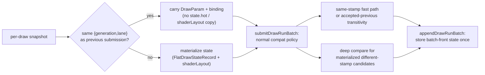

**Invariants.**

- *Stamp soundness.* Equal `{generation, lane}` implies byte-equal batch-consumed
  state. Only `front().state` is consumed downstream — by `makeDrawPsoSubview`,
  the `DrawRunInvariant` (render / decl / texture / sampler / stream masks and
  hashes), resource marking (`markDrawResources`), the back-buffer handle, and
  encode; every batch-front read addresses `front()`, never `back()`. The stamp
  covers every field those readers touch: constant-value drift within a generation
  is safe (none read the constant hashes — constants ride the per-draw
  `DrawUniformHandle`), and binding-field drift is safe (binding-agnostic
  `state.hot` clears those fields and the encoder binds from the per-draw
  `DrawBindingOverride`). Any field a mid-generation refresh (uniform refresh,
  binding-layout stride refresh) can change while the stamp stays equal, and that
  a front reader also consumes, forces a new generation or is excluded from the
  elided record.
- *Run-front availability.* Every queue batch front is materialized. Snapshot
  elision is only relative to the previous queued submission, so the first
  submission in the pending vector and every stamp-change submission owns a
  state. If normal compatibility grouping accepts a materialized different-stamp
  submission and the following submission is elided from it, the queue accepts
  that elided candidate through the already accepted previous draw rather than
  trying to deep-compare missing state.

**Strict stamp-only grouping.** `DXMT9_DRAWRUN_GROUP_BY_GEN_LANE=1` changes the
queue scan to read only the stamp, never a non-front `state.hot`, so an elided
continuation never needs a materialized state for a state-reading fallback.
Batching granularity is therefore snapshot identity: a stamp-run is as long as
the stable-state-generation run that produced it, so the producer keeps the
cache snapshot stable across compatible draws to keep runs long.

**Evidence counters.** The default path exposes
`d3d9_snapshot_state_materialized`,
`d3d9_snapshot_state_materialized_bytes`, `d3d9_snapshot_state_elided`, and
`d3d9_snapshot_state_elided_bytes` alongside the existing
`d3d9_snapshot_state_copy_cpu_ms`, draw-run batch counters, and
`submit_draw_run_batch_discarded_state_{records,bytes}`. A valid regression
check must show discarded state stays zero for same-stamp continuations and that
copy-byte elimination does not come with a larger batching/encode loss.

---

## 3. Encoder Lifecycle

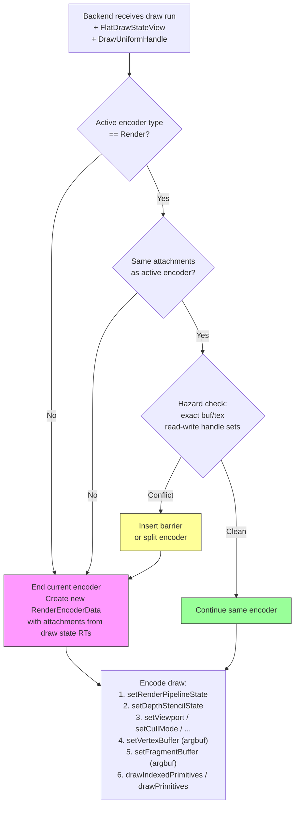

**Clear folding:** A `ClearDesc` received before any draw on a given render target is
stored as deferred. When the first draw opens a render pass for those attachments, the
deferred clear is applied as `MTLLoadActionClear` rather than opening a separate pass.

**Encoder types:** Three encoder kinds may be active during a frame:
- `RenderEncoderData` — for draw calls
- `BlitEncoderData` — for `UpdateSurface`, `UpdateTexture`, `StretchRect`, mipmap gen
- `ComputeEncoderData` — reserved for future compute-based features (triangle fan
  expansion, point sprite expansion)

Only one encoder may be active at a time. Switching kind requires `endEncoding`.

Surface operation replay details are specified in
[`surface-ops/spec.md`](surface-ops/spec.md). The command queue consumes imported
POD records and emits blit, render-pass, resolve, and readback actions; surface
operation data does not cross the bridge as closures or lambdas.

Per-frequency draw-uniform layout details are specified in
[`draw-uniforms/spec.md`](draw-uniforms/spec.md). The encoder splits the
historical 9 KB `DrawUniforms` slab into per-stage and per-frequency UBOs
(`VsConsts`, `PsConsts`, `FfpVsConsts`, `FfpPsConsts`) plus an inline 16 B
`DrawVolatile` push, gated by a backend-owned dirty bitmask derived during
chunk-record import.

Render-pass `MTLLoadAction` / `MTLStoreAction` selection (TBDR tile
preservation policy) is specified in
[`render-pass-actions/spec.md`](render-pass-actions/spec.md). The encoder
maintains a per-CommandQueue "touched" attachment-handle set so first-use
color attachments DontCare-load, and runs an in-chunk look-ahead at
`flushRender` time to DontCare-store depth/stencil and color attachments
that are about to be cleared or overwritten. `R-BACK-2.6` is amended in
that spec to allow conditional `MTLStoreActionDontCare` on RT change.

### 3.1 `IDecisionRecorder` divergence seam (R-BACK-39.3)

The modern-renderer transition (`specs/d3d9-renderer/`) needs a way to compare
the modern path's per-chunk decisions against what the traditional encode path
above would have decided, behind `DXMT9_RENDERER_LOG_DIVERGENCE=1`. The
backend owns the recording interface because the decisions being compared
(pass begin, per-draw PSO/draw, per-attachment load/store action, encoder
split) are encode-lifecycle decisions described in this section. This is the
cross-spec ownership noted in `specs/d3d9-renderer/spec.md` §15.4.

`IDecisionRecorder` (`src/dxmt9/render/decision_recorder.hpp`) is a small,
POD-friendly recording interface with four record points that mirror the real
encode decision sites:

| Record point | Mirrors |
|---|---|
| `recordPassBegin(rt0, depth, colorCount)` | `encoders::beginRenderPass` attachment selection |
| `recordDraw(psoKey, count, flags)` | `encoders::encodeDraw` |
| `recordLoadStore(handle, load, storeOrProof)` | `RenderPass{Depth,Color}StoreProof` selection |
| `recordEncoderSplit(reason)` | `perf::EncoderSplitReason` boundary |

`DecisionRecord` is a flat POD (kind enum + three `u64` lanes) with no owning
pointers, so a recorded sequence is trivially copyable and comparable.
`VectorDecisionRecorder` appends records to a `std::vector` it exclusively
owns, and `compareDecisions(modern, reference)` is a pure helper that reports
whether two sequences diverge and at which index.

**Side-effect neutrality (R-BACK-39.3).** A recorder is a pure observer: an
implementation must not call any Metal API, allocate/commit an
`MTLCommandBuffer`, invoke the presenter, mutate the PSO/shader cache or
`MTLBinaryArchive`, touch `MTLHeap` residency or retained-handle sets, or
update queue-level fence state. A divergence run must never change which Metal
commands a non-divergence run would emit. `VectorDecisionRecorder` satisfies
this by mutating only its own storage.

**L0 scope / L1 deferral.** At L0 the FrameGraph backend is a pure delegate
(byte-identical to traditional), so there is nothing to diverge yet. L0 lands
only the interface, the POD record, the vector-backed recorder, the env
resolver (`resolveLogDivergence` / `logDivergenceEnabledFromEnv`), and the
unit-tested `compareDecisions` helper. The full dry-run engine — walking a
chunk through a recorder-only adapter that reproduces the `TraditionalBackend`
decision sequence and emitting per-chunk divergence points — is **deferred to
L1**, when FrameGraph builds a DAG and a real divergence exists to detect.

---

## 4. Argument Buffer Binding

The production Stage 2 argument-buffer path is constants-only. When the
capability gate (`argumentBuffersSupport >= Tier2` and Apple GPU family support)
holds, texture-free and texture-bound draws select the Stage 2 PSO variant and
bind one slot-30 argument buffer for the four per-frequency constant-buffer
pointers:

```
Stage 2 ArgbufLayout (slot 30):
┌──────────────────────────────────────────────┐
│ id(0): constant VsConsts*                    │
│ id(1): constant FfpVsConsts*                 │
│ id(2): constant PsConsts*                    │
│ id(3): constant FfpPsConsts*                 │
└──────────────────────────────────────────────┘
```

Texture and sampler resources intentionally stay on the direct Metal encoder
lane (`setVertexTexture` / `setVertexSamplerState` /
`setFragmentTexture` / `setFragmentSamplerState`). The shader source for
texture-bound Stage 2 draws therefore combines a slot-30 argbuf uniform
parameter with direct `[[texture(N)]]` / `[[sampler(N)]]` parameters. This is
the current hot path contract: Stage 2 removes the direct slot 0/3 uniform
bindings, but it does not move texture or sampler resources into Metal
argument-buffer resource arrays.

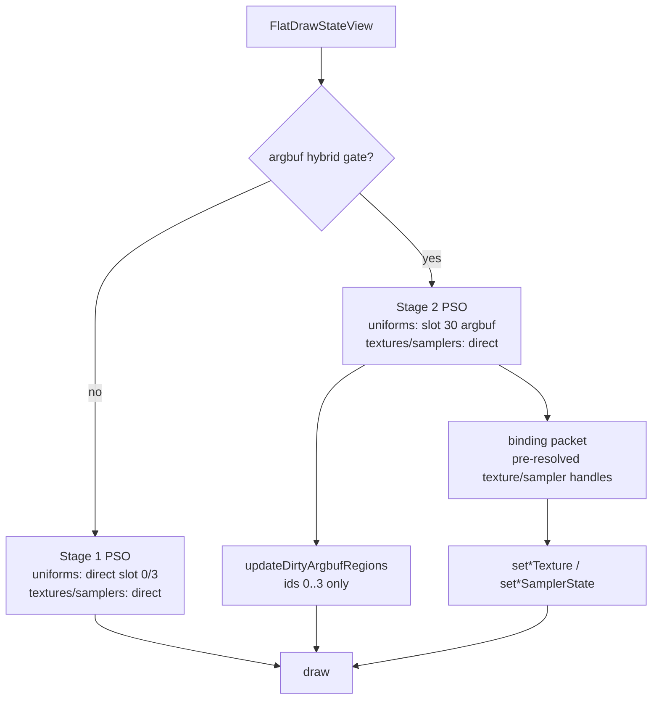

The fully packed "texture/sampler resource-array" lane remains an experimental
candidate, not the default path. It can be attractive for draw streams that bind
many textures/samplers and reuse the same binding packet, but it does not make
Metal-side writes disappear: the encoder still has to patch the argument buffer,
retain or mark resources resident, and keep sampler/resource lifetimes valid
until command-buffer completion. For small binding counts or frequently changing
D3D9 sampler state, direct `setTexture` / `setSamplerState` calls may be cheaper
and are much easier to validate.

The last resource-array attempt faulted on a representative texture corpus case.
Current fault candidates are:

- sampler objects not created or bridged with argument-buffer resource support
  (`supportArgumentBuffers` / resource-id path);
- sampler lifetime not retained through the command-buffer completion sequence;
- texture or sampler `MTLResourceID` encoding mismatch across the WMT bridge;
- missing or incorrectly scoped `useResource` / `useHeap` residency for
  argbuf-pointed resources;
- MSL/argument-encoder layout mismatch for resource arrays or root argbuf
  reference shape.

Any future promotion of texture/sampler resource arrays must land behind a
separate feature flag and prove, in order: texture-only argbuf sampling,
sampler-only argbuf sampling, combined 2D sampling, cube/3D/volume coverage,
sampler filter/address/sRGB/mip coverage, and paired Stage 1 vs Stage 2
shader-corpus pixel equality. Until that evidence exists, the default Stage 2
path stays constants-only with direct texture/sampler binding.

---

## 5. PSO Cache

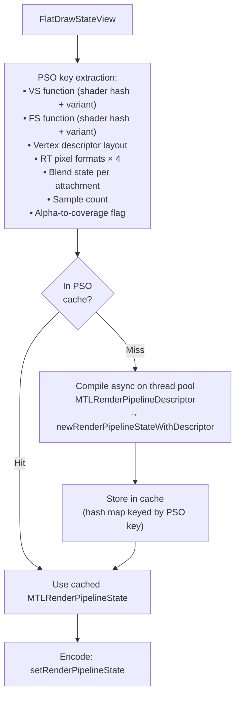

The PSO cache is an in-memory hash map (key → `MTLRenderPipelineState`). It is
populated on first use. Cache entries are never evicted during a session (PSO count
is bounded by the state space of real D3D9 applications).

The `MTLDepthStencilState` cache is separate and keyed by the DSS key (depth +
stencil compare/write state). DSS creation is cheap; the cache prevents redundant
object allocation.

### 5.1 Cache Prewarm From `MTLBinaryArchive`

Prewarming populates PSO and shader-function caches at device init by
deserializing entries already present in the on-disk `MTLBinaryArchive`,
before the first encoded draw. This eliminates first-run stutter when an app
revisits previously seen pipeline states.

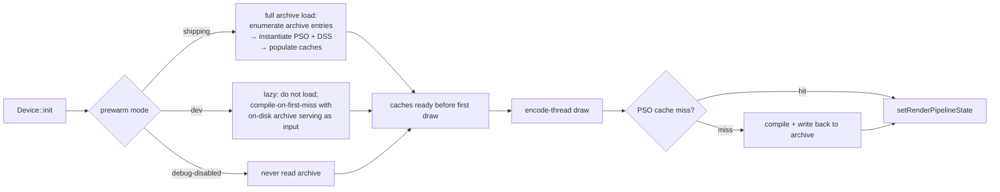

Mode selection (`R-BACK-3.8`) is a runtime config. Counters expose
`prewarmEntriesLoaded`, `prewarmLoadNs`, `prewarmFailureClass`,
`coldCompileCountAfterWarm`. The archive identity (path + version stamp) is
included in present diagnostics so support reports can confirm prewarm hit
the expected file. Failure to load the archive is non-fatal: the cache stays
empty and the path falls through to compile-and-write.

---

## 6. Shader Translation

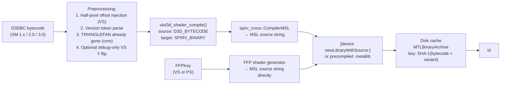

Pixel-shader texture sampling is intentionally absent from the normal
coordinate-system preprocessing list. D3D texture coordinates are passed through
to Metal sampling as D3D UVs; a global pixel V flip is only emitted when the
diagnostic `DXMT_DEBUG_FORCE_PIXEL_V_FLIP` source-contract path is enabled.

**Shader variant keys** for programmable shaders:
- Vertex: (bytecode_hash, input_layout_hash, rasterization_disabled)
- Pixel: (bytecode_hash, alpha_test_enable, alpha_test_func, fog_mode, clip_planes_mask, tile_ffp_mode)

Two draws with the same bytecode but different variant keys require separate
compiled `MTLFunction` objects. The `tile_ffp_mode` bit is set when the
fragment program is targeted at the tile-shader FFP path (§13); it forces a
distinct `MTLFunction` from the portable variant of the same bytecode.

### 6.1 Cross-Process Binary Archive

The `MTLBinaryArchive` (`R-BACK-4.8`) is shared across dxmt9 instances.

**Path & identity**
- Path: `${cache_root}/dxmt9-shaders-v${ABI}.${gpu_family}.metallib-archive`.
  The ABI version and GPU family are baked into the filename so a version or
  device-family mismatch never reads from a stale archive — they read from a
  separate file or no file at all.
- `${cache_root}` resolution order: `$DXMT9_CACHE_DIR`, then
  `$XDG_CACHE_HOME/dxmt9`, then `${HOME}/Library/Caches/dxmt9`.
- Entry key: SHA-1 over (bytecode | variant key | dxmt9 archive ABI version).

**Concurrency model (POSIX `flock`)**
- Writers acquire `LOCK_EX` on the archive file before `serializeToURL:`.
- Readers acquire `LOCK_SH` while loading; if the lock is unavailable for
  more than a short timeout (e.g., 100 ms), the loader treats the archive
  as unreadable and falls through to compile-and-write per `R-BACK-3.7`.
- A reader that holds `LOCK_SH` will see a consistent snapshot — Metal's
  archive serialization writes the whole file atomically via a temp file
  and rename, so partial reads are not possible.

**Versioning rule**
- The dxmt9 archive ABI version is bumped whenever any of these change:
  the MSL emitter output, the variant-key encoding, the
  `MTLBinaryArchive` schema, or the FFP key bit layout.
- A version bump produces a new archive filename; the old archive is left
  on disk and reclaimed by the per-version retention policy (default: keep
  the two most recent ABI versions, delete older).
- A device that bumps to a new ABI starts with an empty archive and warms
  it from compile fall-throughs.

**Failure modes**
| Failure | Detection | Action |
|---|---|---|
| File missing | `[NSURL checkResourceIsReachable]` | start with empty archive; not an error |
| File present, wrong magic / corrupt | `MTLBinaryArchive` initializer returns `nil` with `NSError` | log `prewarmFailureClass = "corrupt"`, rename file to `*.corrupt`, start empty |
| File present, schema mismatch (Metal version drift) | initializer returns `nil` with version error | log `prewarmFailureClass = "schema"`, rename to `*.outdated`, start empty |
| File present, GPU family mismatch | filename includes family; cannot happen by construction | n/a |
| Lock unavailable beyond timeout | `flock` returns `EWOULDBLOCK` | log `prewarmFailureClass = "lock_busy"`, fall through to compile-only |
| Mid-write crash by another process | Metal's atomic rename leaves either old or new file intact | next reader sees a valid archive (old or new), no recovery needed |
| Disk full on write | `serializeToURL:` returns error | log; archive grows on next successful write attempt |

A failure is non-fatal under all conditions — the runtime path always falls
through to compile-and-write. Counters distinguish failure classes so
support reports identify which path took the slow start.

**Configuration**
- Prewarm mode (`R-BACK-3.8`) is selected by build flag and runtime override:
  - default for shipping builds (release): `full`.
  - default for dev builds (`-Ddev_build=true`): `lazy`.
  - debug runtime: `disabled` via env var `DXMT9_PREWARM=off`.
- Counters: `prewarmEntriesLoaded`, `prewarmLoadNs`, `prewarmFailureClass`,
  `coldCompileCountAfterWarm`, `archiveBytes`. Present diagnostics expose
  the resolved archive path and the prewarm mode.

---

## 7. Resource Allocation Model

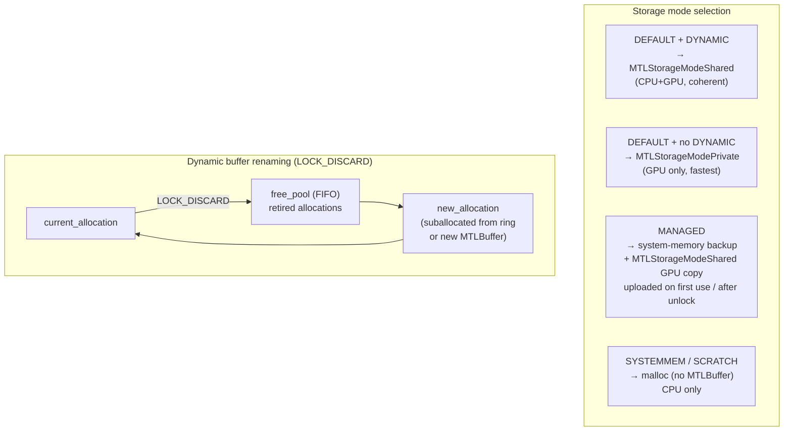

**Texture upload path (MANAGED / SYSTEMMEM → GPU):**

The path bifurcates on `MTLDevice.hasUnifiedMemory` per `R-BACK-5.7`:

*Unified-memory devices (Apple Silicon, `hasUnifiedMemory == YES`)*:
1. Application `Lock()`s the texture surface and writes pixel data into the
   `MTLStorageModeShared` backing.
2. `Unlock()` marks the surface "uploaded" — no staging copy and no blit are
   needed. CPU-written bytes are GPU-visible immediately because both sides
   share the same physical memory.
3. The next render encoder that samples the texture sees the updated data.
   No fence is required for visibility (Metal's encoder ordering is enough);
   a fence is only required if the texture is concurrently written and read
   across encoders, which is not the upload case.

*Discrete-style devices (Intel iGPU / AMD dGPU on Mac, `hasUnifiedMemory == NO`)*:
1. Application `Lock()`s the texture surface and writes pixel data into the
   CPU-accessible (`MTLStorageModeManaged`) backing.
2. `Unlock()` marks the surface dirty.
3. On first draw that samples the texture, a blit encoder copies the dirty
   region from the managed staging buffer to the private `MTLTexture`.
4. The blit is fenced so the render encoder that follows reads the updated
   data.

Counter `managedTextureUploadBlitCount` advances only on the discrete path;
on Apple Silicon it must remain 0 across a workload's lifetime. A non-zero
value on a `hasUnifiedMemory` device is a regression of `R-BACK-5.7`.

### 7.1 Pool / Usage → Storage Mode Matrix

The mapping in `R-BACK-5.7` is reproduced here as a single-page reference.
The matrix differs between unified-memory devices (Apple Silicon: M1/M2/M3,
all hasUnifiedMemory) and discrete-style devices (Intel/AMD on Mac).

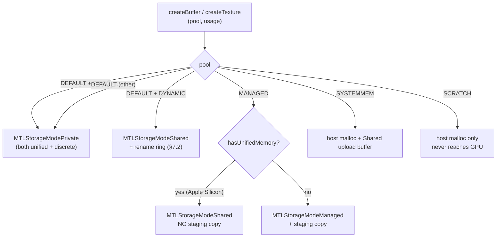

Apple Silicon's unified memory makes the `MANAGED` staging copy redundant —
both CPU and GPU view the same bytes. Detection uses `MTLDevice.hasUnifiedMemory`
at device init; the per-resource path branches once at create time and never
re-checks. On discrete-style Mac (legacy Intel iGPU + AMD dGPU) the path
preserves the conventional staging copy.

### 7.2 `D3DUSAGE_DYNAMIC` Rename Ring

Per `R-BACK-5.8`, dynamic buffers do not block on GPU completion when
`D3DLOCK_DISCARD` rotates allocations:

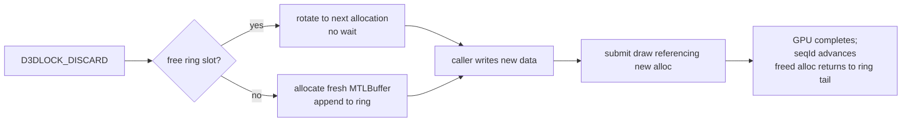

The ring is per-buffer-handle, not global, to keep rename cost local.
Capacity grows on demand and never shrinks during a session.

### 7.3 `MTLHeap` Small-Resource Pooling

Per `R-BACK-5.9` / §14, small textures and small non-dynamic buffers allocate
from `MTLHeap` instances rather than direct `newBufferWithLength` /
`newTextureWithDescriptor`.

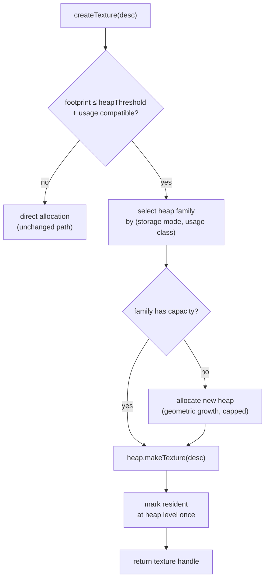

Heap families (`R-BACK-14.1`):

| Family | Storage mode | Members |
|---|---|---|
| `priv-tex` | `MTLStorageModePrivate` | `D3DPOOL_DEFAULT` non-RT non-DS small textures |
| `shared-tex-um` | `MTLStorageModeShared` (unified memory only) | `MANAGED` / `SYSTEMMEM` small textures on Apple Silicon |
| `shared-buf` | `MTLStorageModeShared` | non-dynamic vertex/index/constant buffers below threshold |

Render targets, depth buffers, and dynamic-rename buffers stay on direct
allocation. Heap residency tracking elides per-texture residency calls
because the heap is the residency unit.

---

## 8. Presentation

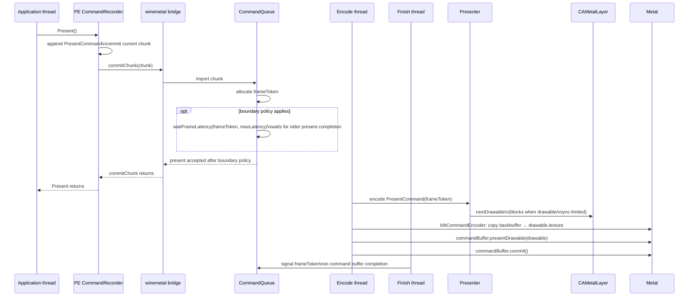

The back buffer is a private `MTLTexture` owned by the swap chain. On present, it
is copied to the `CAMetalLayer` drawable via a blit encoder. The drawable is obtained
just before the blit — not before the frame — to minimize latency.

Present instrumentation must identify which source was selected before drawable
work starts. The counter set records explicit/current-backbuffer selection, source
validity, source handle/texture, source size, format, sample count, pass source
size, and destination size. Current SFIV investigation notes expect the valid
1280x720 source lane to stay clean before async acquire or preacquire policies are
retuned.

### 8.1 Frame Latency Token

Present pacing is based on a queue-owned frame token:

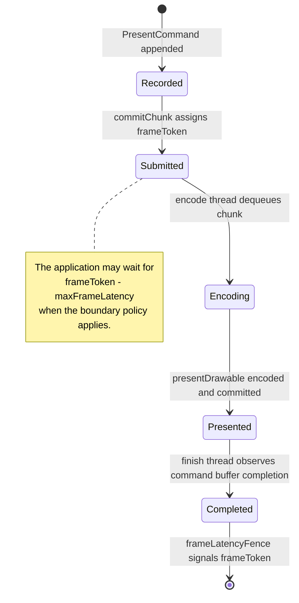

The token is not the chunk dequeue ID and not the point where the encode thread starts
work. It becomes signaled only after the Metal command buffer carrying the present has
completed. This mirrors the useful part of upstream DXMT's `CommandQueue` frame
latency fence while keeping drawable and layer ownership inside the presenter.

For `D3DPRESENT_INTERVAL_IMMEDIATE`, an untouched engine-default maximum of
four resolves to an effective present boundary of one. The API-visible maximum
remains four: the scheduler is enforcing a stricter bound within that maximum,
not rewriting D3D9Ex state. Synchronized presents retain four, while a
non-default application setting or `DXMT9_MAX_FRAME_LATENCY` value selects its
own window. `resolvedPresentFrameLatency()` composes this rule with the optional
back-buffer cap and is shared by both the inline seqId boundary and the
commit-replay present-ordinal boundary.

The policy is based on phase-aligned 3DMark05 GT2 evidence. With the default
four-frame window, present request to first GPU work was p50 `235.871ms`, the
present command buffer's GPU envelope was `35.103ms`, and GPU-end to completion
was only `0.205ms`. Resolving Immediate presents to one frame reduced
request-to-completion `274.788 -> 125.048ms`, app-present-to-display
`307.194 -> 155.734ms`, and CoreAnimation drawable waits `146 -> 0`, while
frame-sampled GT2 and GT1 throughput remained within `1%`. The invariant is
therefore completion-owned run-ahead control; drawable acquisition location or
the early CoreAnimation presented handler must not substitute for it.

### 8.2 Typed Presenter Policies

Presenter resolves drawable acquisition to `AcquirePolicy` once at
construction. `Sync` is the default; the legacy boolean selectors resolve with
`Async > SyncOnSubmit > PreAcquire > Sync`. All four are stable policy modes,
but changing the default requires drawable-wait, latency, visual, and completion
evidence.

The queue and Presenter share one process-cached `BoundaryPolicy` resolution.
Precedence is `Disabled > DeferredPresentCompletion > PresentCompletion >
Completion > AfterAcquire > Default`. `PresentCompletion` is the stable default;
the other non-deferred wait targets are stable rollback or app-class modes.
`DeferredPresentCompletion` is an experimental candidate, while `Disabled` is a
diagnostic override and cannot be promoted without a new completion contract.
The multiple environment booleans are legacy spellings for these typed values,
not independent features.

---

## 9. Dependency Tracking

Consecutive encoders may have data dependencies. The backend tracks resource access
per encoder with exact buffer/texture handle sets derived from imported record
hazards and current draw bindings.

For each encoder transition, the backend checks:
- `new_read ∩ prev_write` - read-after-write: must synchronize
- `new_write ∩ prev_write` - write-after-write: must synchronize
- `new_write ∩ prev_read` - write-after-read: must synchronize

If an exact set intersection exists, a Metal resource barrier or encoder split is
emitted. Bloom/probabilistic overlap checks may remain as counters to measure what
the old approximation would have done, but they must not decide default pass splits
because false positives create avoidable render-pass churn.

### 9.1 Exact vs Bloom — Why Exact Is the Default

DXMT uses Bloom filters (`PartitionedBloomFilter64<16>` × {buf,tex} × {r,w})
for hazard tracking. dxmt9 uses exact handle sets. This is a deliberate
divergence with a measurable cost/benefit balance, written down here so a
future reader does not relitigate it without the underlying numbers.

```mermaid
flowchart LR
    subgraph BLOOM["Pure Bloom (DXMT)"]
        BCheck["O(1) hash check"]
        BFP["false positives → unnecessary splits"]
        BFP -->|"on TBDR"| BFlush["each spurious split = tile flush\n~10–200μs"]
        BCheck -->|"~k hash ops"| BFast["per-check cost: low"]
    end
    subgraph EXACT["Pure exact (dxmt9 default)"]
        ECheck["O(n) set membership"]
        EZero["zero false positives"]
        EZero -->|"on TBDR"| ENoFlush["no spurious tile flushes"]
        ECheck -->|"n = 5–20 typical"| EFast["per-check cost: 5–50ns ≈ negligible"]
    end
    subgraph HYBRID["Bloom-pre-filter + exact (option, allowed by R-BACK-2.28)"]
        HBloom["Bloom 'definitely no'\n→ skip exact"]
        HExact["Bloom 'maybe' → exact"]
        HBloom --> HFast["common case: O(1)"]
        HExact --> HCorrect["uncommon case: exact ground truth"]
    end
```

| Axis | Pure Bloom | Pure exact (current) | Hybrid (Bloom→exact) |
|---|---|---|---|
| Per-check CPU | O(k) hash ops | O(n), n ≈ 5–20 typical → 5–50ns | O(k) common, O(n) rare |
| Memory per encoder | ~32 B fixed | grows with handle count | ~32 B + handle set |
| False-positive splits | yes (workload-dependent) | never | never (Bloom only filters "definitely no") |
| TBDR cost from FP | 0.05–4 ms/frame typical | 0 | 0 |
| Debuggability | "split happened, unknown reason" | "split caused by handle X" | "split caused by handle X" |
| Determinism | hash-function-dependent | yes | yes |
| Counter signal value | split count is noisy | split count = clean regression signal | split count = clean regression signal |

The decision rests on three observations:

1. **n is small in D3D9 workloads.** Encoders typically accumulate 5–20
   resource handles. O(n) membership at that scale is 5–50ns per check —
   negligible compared to the 10–200μs cost of one spurious tile flush
   on Apple Silicon TBDR. The CPU "saving" Bloom offers is small and the
   GPU cost it can introduce is not.

2. **"Encoder split count" is a regression signal.** §7 of `archicture/spec.md`
   declares it. Bloom false positives turn that signal into noise. The whole
   architecture leans on clean signals to detect drift; weakening this one
   propagates uncertainty into benchmark interpretation.

3. **Debugging.** When an encoder splits, the question "why" must be
   answerable from the recorded state. Exact sets answer it; Bloom does not.

### 9.2 Bloom as Diagnostic and Optional Pre-Filter

`R-BACK-2.28` allows Bloom in two roles:

- **Diagnostic counter** (always permitted): maintain a Bloom in parallel
  with the exact set; record `bloomFalsePositiveCount` whenever the Bloom
  signaled "maybe" but the exact check found no overlap. This produces
  empirical FP-rate data without affecting split decisions.
- **Pre-filter** (permitted, not currently implemented): a "definitely no"
  Bloom result short-circuits the exact membership lookup. A "maybe" result
  falls through to exact. Splits are still decided by exact; Bloom never
  forces one. This preserves the current contract while collapsing the
  common-case CPU cost to O(1).

The pre-filter is a benchmark-driven addition. It is not in the current
implementation because the exact membership cost has not been shown to be
hot. If profiling on a real workload puts membership lookups in the top
encode-thread costs, the pre-filter becomes the next step. Until then it is
implementation complexity (two synchronized data structures, bimodal
latency) without a measured win.

### 9.3 What We Lose by Not Going Pure Bloom

For completeness, the costs we accept by sticking with exact:

- Encoder memory grows with handle count rather than staying bounded at
  ~32 B. For typical D3D9 encoders this is a few hundred bytes, not pages.
- The membership lookup is O(n) rather than O(k). At n ≤ 20 this is below
  measurement noise on the encode thread; at hypothetical n ≥ 200 it would
  start to matter, and the §9.2 pre-filter becomes the response.

These costs are accepted because the corresponding wins (zero FP, clean
regression signal, debuggability, determinism) are visible in everyday
operation, while the costs are bounded by the small-n regime D3D9 actually
exhibits.

---

## 10. Fixed-Function Lighting Constants Layout

The fixed-function vertex shader receives a uniform buffer with this layout:

```
FFPVertexUniforms {
    float4x4  worldViewMatrix       // D3DTS_WORLD × D3DTS_VIEW
    float4x4  projMatrix            // D3DTS_PROJECTION
    float3x3  normalMatrix          // inverse transpose of worldViewMatrix upper 3×3
    float4x4  textureMatrix[8]      // D3DTS_TEXTURE0–7
    float2    invViewportSize       // (1/width, 1/height) for half-pixel fixup

    struct Light {
        float4  diffuse
        float4  specular
        float4  ambient
        float4  position_vs         // in view space
        float4  direction_vs        // in view space, normalized
        float   atten0, atten1, atten2
        float   range
        float   theta, phi, falloff // spot params
    } lights[8]

    float4    globalAmbient
    float4    materialDiffuse
    float4    materialAmbient
    float4    materialSpecular
    float4    materialEmissive
    float     materialSpecularPower

    float4    fogColor
    float     fogStart, fogEnd, fogDensity
}
```

---

## 11. Clip Plane Design

D3D9 supports up to 6 user clip planes (`D3DRS_CLIPPLANEENABLE` bitmask,
`SetClipPlane(index, float[4])`). Metal surfaces these as vertex shader
`[[clip_distance]]` outputs.

### Uniform layout

Clip planes are stored in the fixed-function uniform buffer used by both generated
and translated vertex shaders:

```
// Appended to FFPVertexUniforms when any clip plane is enabled:
float4  clipPlane[6]   // in clip space (post-projection)
```

D3D9 assigns the plane coordinate space according to the active vertex pipeline.
For fixed function, the app coefficients are in world space. With the core's
D3D row-vector matrix storage, the clip-space coefficients are:

```
clipPlane_clip[i] = inverse(view * projection) * clipPlane_world[i]
```

The world matrix is excluded because fixed-function vertices have already entered
world space before the clip-plane test. For a programmable vertex shader, the app
coefficients are already in the same clip space as the shader's output position
and must be copied unchanged.

### Vertex shader emission

When `clipPlaneMask != 0`, the vertex shader outputs one Metal
`[[clip_distance]]` value containing the minimum distance over all enabled D3D9
planes. A negative distance from any source plane therefore clips the primitive.

**For fixed-function shaders:** the backend generates code in the FFP vertex shader:
```metal
vertex VSOut ff_vertex(...) {
    VSOut out;
    // ... standard transform ...
    out.position = projPos;
    out.clipDist = min_enabled_dot(projPos, uniforms.clipPlane,
                                   uniforms.clipPlaneMask);
    return out;
}
```

**For programmable shaders:** the translator injects a post-transform epilog after
the shader's `oPos` write and computes the same minimum from the unmodified
app-provided clip-space planes.

### `[[clip_distance]]` declaration in MSL

```metal
struct VertexOut {
    float4 position [[position]];
    float  clipDist [[clip_distance]];
    // ... other varyings
};
```

Only enabled planes participate in the minimum. Metal clips the primitive when
`clipDist < 0`.

### Variant key

`clipPlaneMask` (6-bit) is part of the vertex shader variant key. Shaders compiled
without clip planes must not be reused for draws with clip planes active.

---

## 12. MSAA Design

D3D9 `D3DPRESENT_PARAMETERS.MultiSampleType` and `CreateRenderTarget` with
`MultiSample` parameter enable multisample antialiasing.

### Supported sample counts

Report the following in `CheckDeviceMultiSampleType()`:
- `D3DMULTISAMPLE_NONE` (1×) — always supported
- `D3DMULTISAMPLE_2_SAMPLES` (2×) — supported if `[device supports:MTLSampleCount2]`
- `D3DMULTISAMPLE_4_SAMPLES` (4×) — supported if `[device supports:MTLSampleCount4]`
- `D3DMULTISAMPLE_8_SAMPLES` (8×) — optional; check `MTLSampleCount8`

### Multisample render target

A multisample render target is a `MTLTexture` with `sampleCount > 1` and
`textureType = MTLTextureType2DMultisample`. It cannot be sampled directly.

The corresponding `MTLRenderPassDescriptor` attachment:
```objc
att.texture     = msaaTexture          // multisample texture
att.storeAction = MTLStoreActionMultisampleResolve
att.resolveTexture = resolveTexture    // single-sample resolve target
```

### Resolve target

Each multisample render target has an associated single-sample **resolve texture**
(`MTLTexture` with `sampleCount = 1`). The resolve texture is what the application
samples when it uses the render target as a texture.

```
MsaaRenderTarget {
    MTLTexture  msaaTex      // sampleCount = N, MTLStorageModePrivate
    MTLTexture  resolveTex   // sampleCount = 1, MTLStorageModePrivate
}
```

When the render pass closes (`endEncoding`):
- `storeAction = MTLStoreActionMultisampleResolve` automatically resolves `msaaTex`
  → `resolveTex`.
- Subsequent `SetTexture()` calls bind `resolveTex` for sampling.

### `GetRenderTargetData` on MSAA surface

Must resolve first (if not already resolved), then read back `resolveTex` via staging
buffer. The application cannot directly access the multisample texture data.

---

## 13. Tile-Shader FFP (Apple Silicon Candidate)

The tile-shader FFP candidate moves selected D3D9 fixed-function fragment
effects (fog, alpha test, alpha-to-coverage) into a Metal tile stage on
`MTLGPUFamilyApple3+`. The current implementation is a two-stage operation:
it rasterizes base colour through a fragment draw, then runs an
attachment-wide tile dispatch. This is not a stable render provider because
the second stage lacks the owning draw's coverage and pre-draw destination
colour. Portable fragment FFP remains authoritative.

### 13.1 Selection Flow

```mermaid
flowchart TD
    PASS["render-pass desc built\n(attachments, FFPKeyPS, GPU family)"] --> MODE{"resolved provider"}
    MODE -->|"portable or auto"| PORT["portable fragment FFP\n(stable path)"]
    MODE -->|"diagnostic force"| CAP{"GPU family\n≥ Apple3?"}
    CAP -->|"no"| PORT
    CAP -->|"yes"| KEY{"FFPKeyPS uses\ntile-eligible state?\n(fog, alpha-test, A2C only)"}
    KEY -->|"no"| PORT
    KEY -->|"yes"| PRECISION{"reference values\nin tile-precision range?"}
    PRECISION -->|"no"| FALLBACK["fallback:\nportable path\nincrement reason counter"]
    PRECISION -->|"yes"| TILE["tile-shader FFP path"]
    TILE --> CMP["select MSL with\ntile_ffp_mode=1 variant"]
    PORT --> CMP_P["select MSL with\ntile_ffp_mode=0 variant"]
    CMP --> ENC["encoder uses tile-descriptor\nMTLRenderPipelineState"]
    CMP_P --> ENC2["encoder uses\nMTLRenderPipelineState (fragment)"]
```

Selection is per-render-pass (`R-BACK-13.1`). A pass that begins as tile-FFP
cannot mid-pass switch to portable; mismatched draws within the pass force
either a pass split or a fall-through to portable for the whole pass. The
current attachment-wide post-process does not satisfy `R-BACK-13.7`, so
non-diagnostic `tile-auto` requests resolve to portable and only the diagnostic
`force` route can exercise the candidate pipeline.

### 13.2 MSL Generation

Two distinct generators emit two distinct MSL sources from the same
`FFPKeyPS`:

| Path | Generator | Output | Pipeline state |
|---|---|---|---|
| Portable | `makeFfpPixelSource()` | fragment function | `MTLRenderPipelineState` |
| Tile | `makeFfpTilePixelSource()` | tile function | tile-descriptor `MTLRenderPipelineState` |

The tile generator emits programmable-blending tile code that reads attachment
color directly. That access alone does not establish D3D9 draw semantics: a
mid-render tile dispatch covers the attachment, not the rasterized fragment
coverage of the immediately preceding draw.

PSO key includes `tile_ffp_mode` bit (`R-BACK-13.3`); the same `FFPKeyPS`
produces two compiled function pairs, one in each cache.

### 13.3 Conformance Boundary

Tile-shader FFP must produce results bit-identical to the portable path
(`R-BACK-13.2`). Where Metal's tile stage cannot match D3D9 corner cases:

| Corner | Reason class | Fallback action |
|---|---|---|
| Alpha-test reference outside `[0, 255]` integer range | `precision` | mark pass portable |
| Fog mode with non-linear scale at high z | `precision` | mark pass portable |
| Programmable blend interaction with PS-emitted alpha-to-coverage | `unsupported_state` | mark pass portable |
| Non-Apple-Silicon device | `gpu_family` | always portable, no counter increment |

Conformance evidence (`R-BACK-13.5`) is taken from the portable path only.
The full-attachment single-draw equality fixture proves only that narrow
shape. The partial-rectangle readback fixture proves that the current tile
candidate is not generally equivalent, so `auto` must remain portable.
Promotion requires the equality matrix in §13.7; performance evidence is
considered only after that matrix passes.

### 13.4 Counters

| Counter | Meaning |
|---|---|
| `tile_ffp_pass_count` | render passes encoded via the diagnostic tile route |
| `portable_ffp_pass_count` | render passes encoded via the portable provider |
| `tile_ffp_fallback_{precision,unsupported_state,gpu_family,mid_pass_ineligible}` | diagnostic eligibility fallback breakdown |
| `tile_ffp_mid_pass_resplit_count` | diagnostic tile passes split by a later ineligible draw |
| `tile_ffp_routed_{tile,portable}_{draws,primitives,vertices}` | draw-volume attribution by resolved route |
| `tile_ffp_eligible_{draws,primitives,vertices}` | candidate opportunity volume before route resolution |

While `R-BACK-13.7` is open, a non-diagnostic `auto` request producing any
`tile_ffp_pass_count` is a safety regression. Candidate coverage and route
volume remain observable under diagnostic `force`; requested/resolved provider
reporting remains owned by the render-provider gap.

### 13.5 Metal API Model

The tile-shader FFP candidate uses Metal's tile-render pipeline, which is a
distinct compile target from the standard render pipeline.

```mermaid
flowchart LR
    SRC["makeFfpTilePixelSource(FFPKeyPS)\n→ MSL with kernel function\nusing imageblock + threadgroup"]
    SRC --> LIB["[device newLibraryWithSource:]"]
    LIB --> FN["id<MTLFunction> (tile kernel)"]
    FN --> DESC["MTLTileRenderPipelineDescriptor\n• tileFunction = FN\n• threadgroupSizeMatchesTileSize = YES\n• colorAttachments[i].pixelFormat"]
    DESC --> CMP["[device newRenderPipelineStateWithTileDescriptor:]"]
    CMP --> TPS["MTLRenderPipelineState (tile variant)\n— shares interface with fragment PSO\nbut compiled separately"]
```

Pipeline state objects:

| Object | Used by | Notes |
|---|---|---|
| `MTLRenderPipelineState` (fragment variant) | `setRenderPipelineState:` | the portable path; unchanged |
| `MTLRenderPipelineState` (tile variant) | `setRenderPipelineState:` then `dispatchThreadsPerTile:` | encoded via the tile descriptor; produces the same opaque type but compiled with `newRenderPipelineStateWithTileDescriptor:` |
| `MTLTileRenderPipelineDescriptor` | compile-time only | dxmt9 holds it briefly during compile, never at draw time |

Both variants are cached in the same `MTLRenderPipelineState` cache (§5),
keyed by the PSO key including `tile_ffp_mode` (`R-BACK-3.3`). Variant
selection happens at draw encode time via the bit in the key.

The MSL emitter (`makeFfpTilePixelSource`) writes a tile kernel that:

- declares an `imageblock<TileColor>` to read attachment color directly
  (Apple Silicon programmable-blending).
- expresses fog blend / alpha-test / A2C as an arithmetic + conditional
  pass over the imageblock value before write-back.
- does **not** call `discard_fragment()`.

The present two-stage implementation rasterizes base colour and then invokes
`dispatchThreadsPerTile`. It is correct only for the narrow full-attachment
single-draw fixture: the dispatch also fogs uncovered clear pixels, and an
alpha-test return cannot restore the attachment value already overwritten by
the base draw. A promotable design therefore needs draw coverage and the
pre-draw destination colour in tile memory, for example a bounded memoryless
coverage/prior-colour composition. Partial rectangles, overlapping draws, and
multiple eligible draws in one pass are mandatory equality cases before the
selector may resolve `tile-auto` to tile.

### 13.6 Mid-Pass Eligibility Policy

`R-BACK-13.1` says tile vs portable is decided per render-pass. But pass
boundaries are decided by RT changes / explicit hazards — within one pass
a state mutation can change FFP eligibility (e.g., an alpha-test reference
flips from in-range to out-of-range, or a non-tile-supported fog mode is
selected mid-pass).

```mermaid
flowchart TD
    OPEN["pass opens with first draw\n→ selector chooses tile vs portable"] --> ENC["encoder open;\npipeline = chosen variant"]
    ENC --> NEXT{"next draw"}
    NEXT -->|"FFP key still tile-eligible"| ENC
    NEXT -->|"FFP key becomes ineligible"| FORK{"current path?"}
    FORK -->|"portable already"| ENC
    FORK -->|"tile"| SPLIT["end encoder + open new encoder\n(portable variant)\nincrement tileFfpMidPassResplitCount"]
    SPLIT --> ENC
```

Rules:

- These split rules describe only the diagnostic candidate and a future
  correctness-complete provider. Non-diagnostic `auto` does not open a tile
  pass while `R-BACK-13.7` is open.
- A pass opened on the **portable** path stays portable even if subsequent
  draws would have been tile-eligible. Promoting mid-pass is not allowed
  because the portable encoder cannot retroactively become a tile encoder.
- A pass opened on the **tile** path that hits an ineligible draw must end
  the current encoder and start a new portable encoder. This is an
  encoder split, counted in `tileFfpMidPassResplitCount`. The split is
  treated as an exact-hazard split for `R-BACK-2.28` purposes (counter
  signal stays clean — false-positive splits remain forbidden).
- `tileFfpFallbackByReason{mid_pass_ineligible}` advances on the same
  event for the by-reason breakdown.

### 13.7 Coverage and Prior-Colour Contract

A promotable tile provider must carry enough per-draw information to compose
only the samples produced by that draw. The representation may use a
memoryless sidecar, an imageblock payload, or another bounded Metal mechanism,
but it must establish all of the following before the tile effect runs:

- exact raster coverage, including scissor, viewport, sample mask, and A2C;
- the destination colour that existed before the owning draw;
- ordered ownership when eligible draws overlap or when an earlier draw is
  revisited by a later attachment-wide operation;
- alpha-test rejection that leaves the prior destination untouched; and
- one effect application per covered sample, with no reprocessing of earlier
  draws in the same pass.

Required GPU readback evidence is: partial rectangle over a contrasting clear,
two overlapping eligible draws with different fog state, alpha rejection over
existing colour, and multiple eligible draws in one render pass. Each fixture
must compare portable with the candidate route and must also assert zero Metal
validation errors. Only after these pass may workload coverage and performance
be used to consider resolving `tile-auto` to tile.

### 13.8 Floating-Point Precision Boundary

`R-BACK-13.2` requires "bit-identical to the portable fragment path." This
is achievable only when both paths use the same arithmetic precision.

Precision rules:

- Both paths emit MSL with `float` (32-bit IEEE 754) for fog, alpha-test,
  and A2C arithmetic — never `half`. Apple's MSL compiler may demote to
  `half` on TBDR by default for fragment shaders; the dxmt9 emitter
  **explicitly types the affected variables as `float`** to prevent the
  demotion.
- The tile-stage emitter additionally uses `imageblock<TileColor>` with
  `TileColor` defined as `float4` (not `half4`) for color attachments
  whose pixel format is wider than 8-bit-per-channel. For 8-bit
  attachments (`A8R8G8B8` etc.) `half4` is acceptable because the
  attachment quantization already discards precision below `half`.
- Fog blends are computed in linear space; sRGB attachments are decoded
  before the blend and re-encoded after, identically on both paths.
- A precision divergence that breaks bit-identity (e.g., a float
  rounding-mode quirk on a specific GPU family) must be encoded as a
  conformance test failure → `tile_ffp_fallback_precision`
  increment + the affected pass falls back. The portable path remains
  the authoritative oracle.

### 13.9 Verification Mapping

| Contract | Evidence | Current verdict |
|---|---|---|
| Selector eligibility and reason taxonomy | `dxmt9-tile-ffp-selector-spec` | Implemented for the diagnostic candidate |
| Non-diagnostic `auto` fail-closed policy | `dxmt9-tile-ffp-auto-fallback-spec` | Passes; eligible Linear fog resolves portable |
| Tile MSL and variant shape | `dxmt9-tile-ffp-msl-spec` | Implemented; not pixel-correctness evidence |
| Full-attachment single draw | `dxmt9-tile-ffp-force-fullscreen-equality` | Passes under diagnostic `force`; narrow evidence only |
| Partial coverage safety | `dxmt9-tile-ffp-auto-partial-coverage-safety` plus the default corpus fixture | Stable route passes by resolving portable |
| Candidate partial coverage equality | the same partial fixture under diagnostic `force` | Fails: uncovered clear pixel is modified |
| Overlap, alpha reject, and multiple draws | new shader-runner GPU readback fixtures | Missing; required by `R-BACK-13.7` |

The failed diagnostic candidate is retained as negative evidence. It must not
be relabelled as a passing conformance provider merely because non-diagnostic `auto`
falls back before reaching it.

A future Metal version that adds full programmable-blending precision
parity may relax these rules; until then, dxmt9's tile path opts into
`float` precision unconditionally for FFP arithmetic.

---

## 14. Resource Heap Pooling Design

Backs the `MTLHeap` requirements in §7.3, `R-BACK-5.9`, `R-BACK-5.10`, and
§14 of `requirements.md`. The goal is to reduce per-resource residency and
allocation overhead for D3D9's small-texture working set (lightmaps, decals,
glyph atlases, particle sprites — typically ≤ 64 KB each, hundreds to
thousands per frame).

### 14.1 Heap Family Lifecycle

```mermaid
stateDiagram-v2
    [*] --> Available: createHeap(family, storageMode, capacity)
    Available --> Filling: makeBuffer / makeTexture from heap
    Filling --> Filling: more allocations within capacity
    Filling --> Full: capacity reached
    Full --> Growing: new heap created (geometric growth)
    Growing --> Filling: subsequent allocations target new heap
    Filling --> Reclaiming: all members destroyed,\ncompletedSeqId ≥ lastUsedSeqId
    Full --> Reclaiming: same condition
    Reclaiming --> [*]: heap released
```

Geometric growth (`R-BACK-5.10`) caps total heap memory by capping the total
heap count rather than per-heap size. Heaps grow doubling up to a soft
ceiling (`heapMaxBytesPerFamily`); past the ceiling, new heaps allocate at
the ceiling size.

### 14.2 Allocation Path

```mermaid
sequenceDiagram
    participant App as Application
    participant Be as Backend createTexture
    participant H as Heap manager
    participant MTL as Metal

    App->>Be: createTexture(W, H, fmt, pool=DEFAULT)
    Be->>Be: estimate footprint(desc)
    alt footprint > threshold OR ineligible usage
        Be->>MTL: newTextureWithDescriptor (direct)
        MTL-->>Be: MTLTexture
    else footprint ≤ threshold AND eligible
        Be->>H: alloc(family=priv-tex, desc)
        alt heap has capacity
            H->>MTL: heap.makeTexture(desc)
        else no capacity
            H->>MTL: newHeapWithDescriptor (grow)
            MTL-->>H: new MTLHeap
            H->>MTL: heap.makeTexture(desc)
        end
        MTL-->>H: MTLTexture (heap-backed)
        H-->>Be: MTLTexture + heap-backed flag
    end
    Be-->>App: texture handle
```

### 14.3 Residency

Direct allocations call `useResource:usage:` per resource per encoder
(when needed). Heap-backed allocations call `useHeap:` once per heap per
encoder. For frames with hundreds of small textures, this collapses
hundreds of `useResource:` calls into a handful of `useHeap:` calls.

The encoder maintains a per-encoder `usedHeaps` set; `useHeap:` is issued
the first time any member of that heap is bound, and per-resource residency
calls on heap members are elided.

### 14.4 Counters

| Counter | Meaning |
|---|---|
| `heap.{family}.heapCount` | live heap instances for the family |
| `heap.{family}.bytesAllocated` | total backing storage |
| `heap.{family}.allocCount` | resources allocated from this family |
| `heap.{family}.directFallbackCount` | eligible-by-size resources that took direct path due to a usage-flag mismatch |
| `heap.{family}.fragmentationFailureCount` | `heap.makeTexture` returned nil despite heap not being "full" by accounting |
| `heap.{family}.compactionCount` | how many times a heap was retired and freed because all members were destroyed |
| `useHeapPerEncoder` | average count per encoder (target: small) |
| `useResourcePerEncoder` | average count per encoder (target: dropping after heap adoption) |

### 14.5 Fragmentation Policy

A `MTLHeap` is a contiguous backing region; allocations and frees create
holes. Even when `usedSize < currentAllocatedSize`, a fresh
`heap.makeTexture(desc)` can return `nil` because the largest free hole is
smaller than the requested footprint.

```mermaid
flowchart TD
    REQ["heap.alloc(family, desc)"] --> TRY{"heap.makeTexture()"}
    TRY -->|"non-nil"| OK["return heap-backed texture"]
    TRY -->|"nil & heap usedSize < cap"| FRAG["fragmentation:\nlargest free hole < desc footprint"]
    FRAG --> NEXT{"another heap in family\nwith capacity?"}
    NEXT -->|"yes, try next"| TRY
    NEXT -->|"no"| GROW["allocate new heap (geometric)"]
    GROW --> ASSIGN["new alloc targets fresh heap"]
    TRY -->|"nil & heap full by accounting"| GROW
```

Rules:

- **No mid-heap compaction.** Metal does not expose a heap-compact API and
  resources cannot be relocated once allocated. Fragmentation is absorbed
  by adding a new heap to the family, never by moving existing allocations.
- **Failed allocation walks the family.** If the first heap returns nil,
  the next eligible heap in the family is tried before allocating a new
  heap. A bookkeeping `usedSize` per heap is a hint, not a hard predictor
  of `makeTexture` success — always probe.
- **`fragmentationFailureCount` advances** when `heap.makeTexture` returns
  nil but `usedSize < currentAllocatedSize`. Sustained growth indicates the
  family's allocation pattern produces too many holes; tune the threshold
  or add a per-family eviction policy as a follow-up.
- **Compaction by retirement** is the only reclaim mechanism. When all
  members of a heap are destroyed and `completedSeqId ≥ lastUsedSeqId` for
  the heap (`R-BACK-14.4`), the heap is released. Subsequent allocations
  do not re-target the released heap; they go to a remaining heap or grow
  a new one. `compactionCount` advances per release.

### 14.6 Allocation Failure Beyond Family Growth

If creating a new heap (`newHeapWithDescriptor:`) itself fails — typically
out-of-memory at the device level — the heap manager falls through to
direct allocation (`R-BACK-5.9`'s "fall through to direct allocation"
clause). This is recorded as `heap.{family}.directFallbackCount` and
`heap.{family}.heapAllocFailureCount`. Subsequent allocations retry heap
allocation; the manager does not give up after one failure because the
underlying memory pressure may be transient.

If direct allocation also fails, the backend returns
`D3DERR_OUTOFVIDEOMEMORY` to the D3D9 caller per the existing
out-of-memory contract. There is no "swap to system memory" fallback —
that is the D3D9 application's responsibility via pool selection.

A regression manifests as `useResourcePerEncoder` rising on workloads
previously dominated by heap allocation, or
`heap.{family}.directFallbackCount` spiking when an eligibility heuristic
becomes overly conservative.
