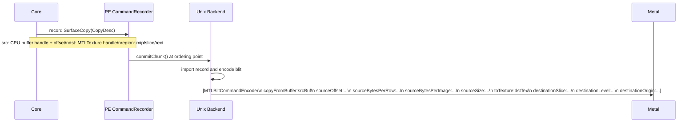
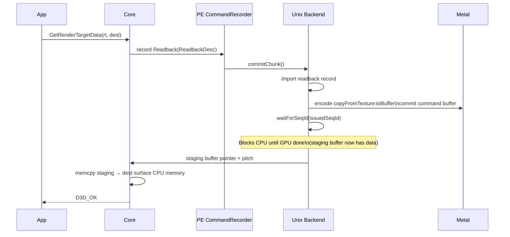
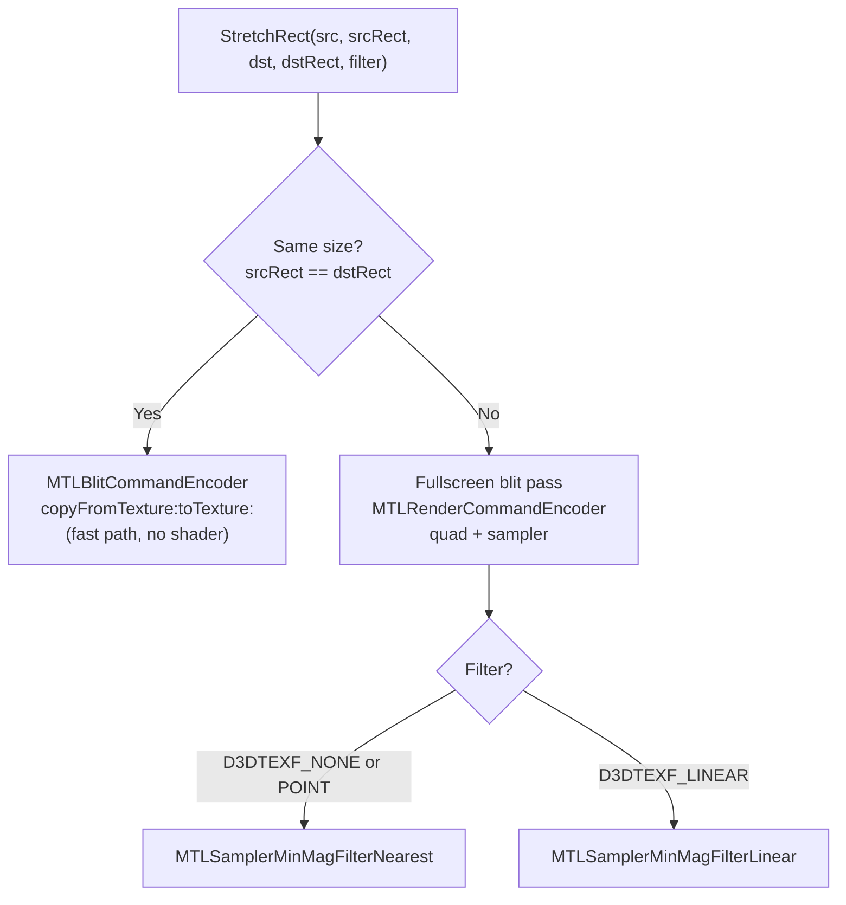

# Surface Operations Spec

Surface operations are non-draw GPU commands that copy, scale, or fill texture data.
They are distinct from draw calls and use a `MTLBlitCommandEncoder` (or a fullscreen
blit pass for scaled copies).

---

## 1. Operations in Scope

| D3D9 API | Description |
|---|---|
| `UpdateSurface(src, srcRect, dst, dstPoint)` | GPU copy: surface → surface (same size, no stretch) |
| `UpdateTexture(src, dst)` | GPU copy: SYSTEMMEM texture → DEFAULT texture (full mip chain) |
| `GetRenderTargetData(rt, dst)` | GPU readback: render target → SYSTEMMEM surface |
| `StretchRect(src, srcRect, dst, dstRect, filter)` | GPU copy or blit with optional scaling and filtering |
| `ColorFill(surface, rect, color)` | Fill a region of a surface with a solid color |

---

## 2. UpdateSurface

`IDirect3DDevice9::UpdateSurface(pSourceSurface, pSourceRect, pDestSurface, pDestPoint)`

**Constraints (from D3D9 spec):**
- Source must be `D3DPOOL_SYSTEMMEM`.
- Destination must be `D3DPOOL_DEFAULT`.
- Formats must be compatible (same bit depth; no format conversion).
- No stretching — source and destination rects must be the same size.

**Backend design:**



The source surface is a CPU-mapped buffer (`D3DPOOL_SYSTEMMEM`). The backend copies
from the CPU buffer to the `MTLTexture` via `copyFromBuffer:toTexture:`. No GPU
→ GPU blit is needed; this is a CPU→GPU upload.

**Format note:** If the source format requires CPU-side conversion (see
`formats.md §7`), the conversion is performed by the core before calling the backend.
The backend receives data in the Metal-native format.

---

## 3. UpdateTexture

`IDirect3DDevice9::UpdateTexture(pSourceTexture, pDestTexture)`

Copies all dirty mip levels and array slices from a `SYSTEMMEM` texture to a
`DEFAULT` texture. Equivalent to calling `UpdateSurface` for each mip/face.

**Design:** The backend iterates all mip levels and cube faces. For each level:
1. Get the CPU buffer and row pitch from the source `SYSTEMMEM` allocation.
2. Issue a `copyFromBuffer:toTexture:` blit for that level.

For mip level `i`:
- `sourceBytesPerRow` = `max(1, width >> i) * blockSize` (or `rowPitch` from lock)
- `sourceBytesPerImage` = `sourceBytesPerRow * max(1, height >> i)` (for volume)
- `destinationLevel` = `i`
- `destinationSlice` = cube face index or 0

---

## 4. GetRenderTargetData

`IDirect3DDevice9::GetRenderTargetData(pRenderTarget, pDestSurface)`

Copies a GPU render target to a `SYSTEMMEM` or `D3DPOOL_SCRATCH` surface. This is a
GPU readback — it stalls the CPU until the GPU has finished rendering to the source
render target.

**Design:**



The staging buffer is in `MTLStorageModeShared`. After the GPU writes to it, the CPU
reads it directly. The blit encoder call is:
```objc
[enc copyFromTexture:rtTex
        sourceSlice:0 sourceLevel:0
       sourceOrigin:MTLOriginMake(0,0,0)
         sourceSize:MTLSizeMake(w,h,1)
           toBuffer:stagingBuf
  destinationOffset:0
destinationBytesPerRow:pitch
destinationBytesPerImage:pitch*h]
```

**Performance note:** `GetRenderTargetData` is a stalling operation by D3D9 spec.
dxmt9 must not attempt to hide this stall; applications that call it are aware of
the cost.

---

## 5. StretchRect

`IDirect3DDevice9::StretchRect(pSrc, pSrcRect, pDst, pDstRect, Filter)`

Copies a surface region to another surface region, with optional scaling and
filtering.

**Cases:**



### 5.1 Same-size blit (no scaling)

Use `MTLBlitCommandEncoder`:
```objc
[enc copyFromTexture:srcTex
        sourceSlice:0 sourceLevel:0
       sourceOrigin:MTLOriginMake(srcX, srcY, 0)
         sourceSize:MTLSizeMake(w, h, 1)
          toTexture:dstTex
   destinationSlice:0 destinationLevel:0
destinationOrigin:MTLOriginMake(dstX, dstY, 0)]
```

### 5.2 Scaled blit

Open a `MTLRenderCommandEncoder` targeting `dstTex`:
- Render a full-screen triangle (no vertex buffer — generated in vertex shader from
  `vertex_id`).
- Fragment shader samples `srcTex` with a sampler matching `Filter`.
- UV coordinates map from `dstRect` in normalized coords back to `srcRect`.
- No depth attachment; color attachment is `dstTex` at `dstRect` clip.

The scaled blit pass uses a cached `MTLRenderPipelineState` (shared across all
StretchRect calls; varies only by pixel format and filter type).

### 5.3 Format Compatibility

`StretchRect` between surfaces of different formats is only supported between formats
of the same storage size or where Metal's `copyFromTexture:toTexture:` supports the
pair. If not compatible → return `D3DERR_INVALIDCALL` from the core.

---

## 6. ColorFill

`IDirect3DDevice9::ColorFill(pSurface, pRect, color)`

Fills a rect on a plain surface or render target with a solid color. Applies only to
`D3DPOOL_DEFAULT` surfaces.

**Design:** Open a `MTLRenderCommandEncoder` with `loadAction = MTLLoadActionClear`
and `clearColor` set to the D3D9 color value:

```objc
rpd.colorAttachments[0].texture    = surface.texture
rpd.colorAttachments[0].loadAction = MTLLoadActionClear
rpd.colorAttachments[0].clearColor = MTLClearColorMake(r, g, b, a)
rpd.colorAttachments[0].storeAction = MTLStoreActionStore
// scissor to pRect if not full surface
```

Immediately `endEncoding` with no draw calls. This is equivalent to a zero-draw
render pass and costs almost nothing on TBDR GPUs.

If `pRect` is a partial rect, set the scissor rect on the encoder before endEncoding.
For partial fills, `loadAction` must be `MTLLoadActionLoad` (not Clear), and the fill
must use a fullscreen-triangle fragment shader that writes the constant color within
the scissored region.

---

## 7. Interaction with the Command Queue

All surface operations are recorded as POD command records into the current PE-side
`CommandChunk`, just like draw calls. The unix-side importer may decode those records
into closures or replay them directly during encoding. They do not require a separate
per-operation bridge path.

Exception: `GetRenderTargetData` is a synchronous readback. It must:
1. Record the readback command.
2. Immediately commit the current chunk.
3. Block the Wine thread on `completedSeqId`.
4. Return the staging data once the GPU is done.

This is the only surface operation that stalls the Wine thread on GPU completion.
