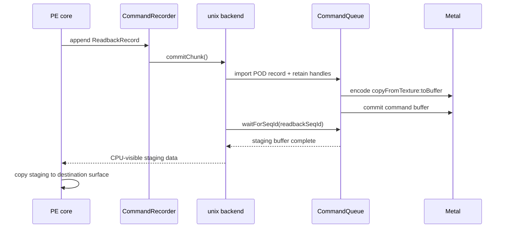

# Surface Operations Spec

Surface operations replay as unix-side actions derived from imported POD command
records. They are non-draw GPU commands, but they share the same command queue,
sequence IDs, resource retention, and encoder lifecycle as draw and present work.

---

## 1. Metal Encoder Selection

| Operation | Preferred Metal path |
|---|---|
| `UpdateSurface` | `MTLBlitCommandEncoder copyFromBuffer:toTexture:` |
| `UpdateTexture` | One or more `copyFromBuffer:toTexture:` uploads |
| Same-size `StretchRect` | `MTLBlitCommandEncoder copyFromTexture:toTexture:` |
| Scaled `StretchRect` | `MTLRenderCommandEncoder` textured triangle pass |
| Full-surface `ColorFill` | Render pass `MTLLoadActionClear` |
| Partial `ColorFill` | Scissored render pass with constant-color shader |
| `GetRenderTargetData` | `copyFromTexture:toBuffer:` plus command-buffer wait |

Only one Metal encoder may be active at a time. Replaying a surface operation ends
any incompatible active encoder before opening a blit or render encoder.

---

## 2. Upload Copies

### 2.1 `UpdateSurface`

The source is CPU memory backing a SYSTEMMEM surface. The destination is a Metal
texture backing a DEFAULT surface. Replay encodes a CPU-buffer-to-texture upload:

```objc
[enc copyFromBuffer:srcBuf
       sourceOffset:srcOffset
  sourceBytesPerRow:srcRowPitch
sourceBytesPerImage:srcSlicePitch
         sourceSize:MTLSizeMake(width, height, 1)
          toTexture:dstTex
   destinationSlice:dstSlice
   destinationLevel:dstLevel
  destinationOrigin:MTLOriginMake(dstX, dstY, 0)]
```

The imported record carries the canonicalized source offset, source row pitch,
source slice pitch, destination mip level, destination slice, copy size, and
destination origin. The backend does not infer these values from D3D9 objects.

### 2.2 `UpdateTexture`

The core records one upload action for each dirty mip/face/slice that must become
visible in the destination texture. The unix replay path treats those actions as a
linear sequence of imported copy records.

For each level `i` and slice/face `s`:

- `sourceBytesPerRow` comes from the locked source allocation or canonical row pitch.
- `sourceBytesPerImage` is the source slice pitch for volume or array data, otherwise
  the row pitch multiplied by the block-adjusted height.
- `destinationLevel` is `i`.
- `destinationSlice` is the cube face, array slice, or `0` for ordinary 2D textures.
- `sourceSize` uses block-adjusted dimensions for compressed formats and
  `max(1, base >> i)` dimensions for uncompressed mips.

The command queue may keep one blit encoder open across adjacent upload records when
there is no ordering hazard and the active encoder type remains blit.

---

## 3. `StretchRect`

### 3.1 Fast Same-Size Path

If source and destination rectangles have identical dimensions and the imported
format pair is compatible with Metal texture copies, replay uses a blit copy:

```objc
[enc copyFromTexture:srcTex
        sourceSlice:srcSlice
        sourceLevel:srcLevel
       sourceOrigin:MTLOriginMake(srcX, srcY, 0)
         sourceSize:MTLSizeMake(width, height, 1)
          toTexture:dstTex
   destinationSlice:dstSlice
   destinationLevel:dstLevel
  destinationOrigin:MTLOriginMake(dstX, dstY, 0)]
```

This path performs no filtering and no format conversion.

### 3.2 Scaled Render-Pass Path

Scaled copies use a render pass targeting the destination texture:

- End any active blit or incompatible render encoder.
- Open a render encoder with the destination texture as color attachment.
- Use `MTLLoadActionLoad` because only `dstRect` is modified.
- Set a viewport or scissor matching `dstRect`.
- Draw a generated fullscreen triangle or rectangle covering `dstRect`.
- The fragment shader samples `srcTex` with UVs that map destination pixels back to
  `srcRect`.
- Select nearest filtering for `D3DTEXF_NONE` and `D3DTEXF_POINT`; select linear
  filtering for `D3DTEXF_LINEAR`.

Pipeline state is cached by destination pixel format, source sampling class, and any
shader variant needed for texture type or format handling. The pass has no depth or
stencil attachment.

---

## 4. `ColorFill`

### 4.1 Full-Surface Fill

A full-surface fill opens a render pass whose color attachment is the destination
surface:

```objc
rpd.colorAttachments[0].texture = surfaceTex;
rpd.colorAttachments[0].loadAction = MTLLoadActionClear;
rpd.colorAttachments[0].clearColor = MTLClearColorMake(r, g, b, a);
rpd.colorAttachments[0].storeAction = MTLStoreActionStore;
```

Replay immediately ends the encoder without draw calls. This maps to tile clears on
TBDR GPUs and is the required full-surface path.

### 4.2 Partial Fill

A partial fill must preserve pixels outside the requested rectangle:

- Open a render encoder with `MTLLoadActionLoad`.
- Set a scissor rectangle matching the imported D3D rectangle.
- Bind a cached constant-color fill pipeline for the destination format.
- Draw a generated triangle or rectangle that covers the scissored destination.
- Store the attachment.

The backend must not use `MTLLoadActionClear` for partial fills because that would
clear pixels outside the requested rectangle.

---

## 5. `GetRenderTargetData`

Readback replay is a strict ordering point:



For ordinary single-sample render targets, the encoded copy is:

```objc
[enc copyFromTexture:rtTex
         sourceSlice:0
         sourceLevel:0
        sourceOrigin:MTLOriginMake(0, 0, 0)
          sourceSize:MTLSizeMake(width, height, 1)
            toBuffer:stagingBuf
   destinationOffset:stagingOffset
destinationBytesPerRow:dstPitch
destinationBytesPerImage:dstSlicePitch]
```

For multisample render targets, replay resolves to the associated single-sample
resolve texture first, then copies from that resolve texture into the staging buffer.

The staging buffer uses CPU-visible storage. After the sequence wait completes, the
CPU may read it directly and copy into the D3D9 destination allocation.

---

## 6. Command-Queue Interaction

Surface operation records are imported into queue-owned execution chunks:

- Import validates the POD record and retains the referenced buffer or texture
  handles.
- Replay linearly walks imported records and emits queue-local blit, render-pass,
  resolve, or readback actions.
- The active encoder is ended before switching between render and blit operations.
- Surface operations participate in the same hazard tracking as draws. A read after
  a write, write after a read, or write after a write on the same resource forces an
  encoder split or barrier.
- Sequence IDs cover surface operations exactly like draw and present work.
- `GetRenderTargetData` commits immediately and waits for the resulting sequence ID;
  other surface operations wait only when ordinary chunk boundaries or hazards
  require it.

No surface operation uses a per-operation bridge entry point in the runtime path. The
bridge carries POD chunk bytes, and the unix side replays imported records into Metal
commands.
