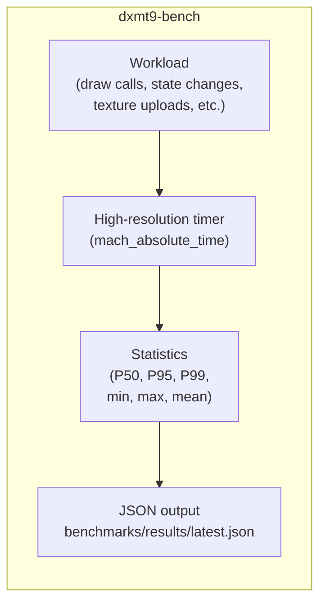

# Benchmarks Design

---

## 1. Harness Structure

The benchmark harness is a single native macOS executable `dxmt9-bench` that
drives the `BackendDevice` interface directly. No Wine, no D3D9 COM.



Each workload runs for a fixed number of iterations (warm-up + measured),
discards the warm-up results, and reports statistics over the measured window.

---

## 2. Timing

All timing uses `mach_absolute_time()` converted via `mach_timebase_info` to
nanoseconds. Wall-clock time, not CPU time — measures end-to-end latency
including GPU scheduling.

For GPU-bound workloads, timing includes a `flush()` + GPU wait to ensure the
GPU has completed before the timer stops.

For CPU-bound workloads (draw call throughput), the GPU is intentionally
kept behind; only CPU submission time is measured.

```
warm-up: 1000 iterations (discarded)
measured: 5000 iterations
report: P50, P95, P99, min, max, mean of per-iteration time
```

---

## 3. Draw Call Throughput Workload

```
for each iteration:
  begin_frame()
  for i in 0..N_DRAWS:
    submitDraw(desc[i])   ; desc varies by sub-workload
  flush()                 ; submit without GPU wait
  end_frame()
timer measures: time from begin_frame to flush()
```

Three sub-workloads:
- **Identical state**: all `desc[i]` identical. Measures minimum per-draw overhead.
- **State change**: `desc[i]` alternates between two different render states.
  Forces PSO cache lookup on every draw.
- **Unique shader**: `desc[i]` uses a different pre-compiled shader each time.
  Exercises the shader variant dispatch path.

---

## 4. PSO Compile Workload

**Cold (empty cache):**
1. Delete `~/Library/Caches/dxmt9/` before run
2. Submit a draw that requires a new PSO
3. Wait for PSO future to resolve
4. Measure total time from draw submission to PSO ready

**Warm (disk cache populated):**
1. Run cold workload once to populate `MTLBinaryArchive`
2. Restart harness (new process, empty in-memory cache)
3. Repeat same draw submission
4. Measure time to PSO ready — should hit `MTLBinaryArchive`

---

## 5. Comparison Script

`scripts/bench_compare.sh` takes two JSON files and produces a report:

```
Workload                          dxmt9       wined3d     ratio
─────────────────────────────────────────────────────────────────
draw_throughput_identical         1,850K/s    420K/s      4.4×
draw_throughput_state_change        920K/s    210K/s      4.4×
pso_cold_first_frame                340ms     890ms       2.6×
pso_warm_first_frame                 12ms      45ms       3.8×
frame_time_simple_p50               2.1ms      8.4ms      4.0×
frame_time_simple_p99               3.8ms     24.1ms      6.3×
```

A regression marker `↓` is shown if dxmt9 result is >5% worse than its own
stored baseline.

---

## 6. File Layout

```
benchmarks/
├── baselines/
│   ├── dxmt9.json          dxmt9 stored baseline (committed)
│   ├── wined3d.json        wined3d reference (committed)
│   └── dxvk_mvk.json       DXVK+MoltenVK reference (committed)
└── results/                Run output (gitignored)
    └── .gitkeep
scripts/
└── bench_compare.sh        Regression comparison + report
tests/
└── bench.cpp               dxmt9-bench source
```
