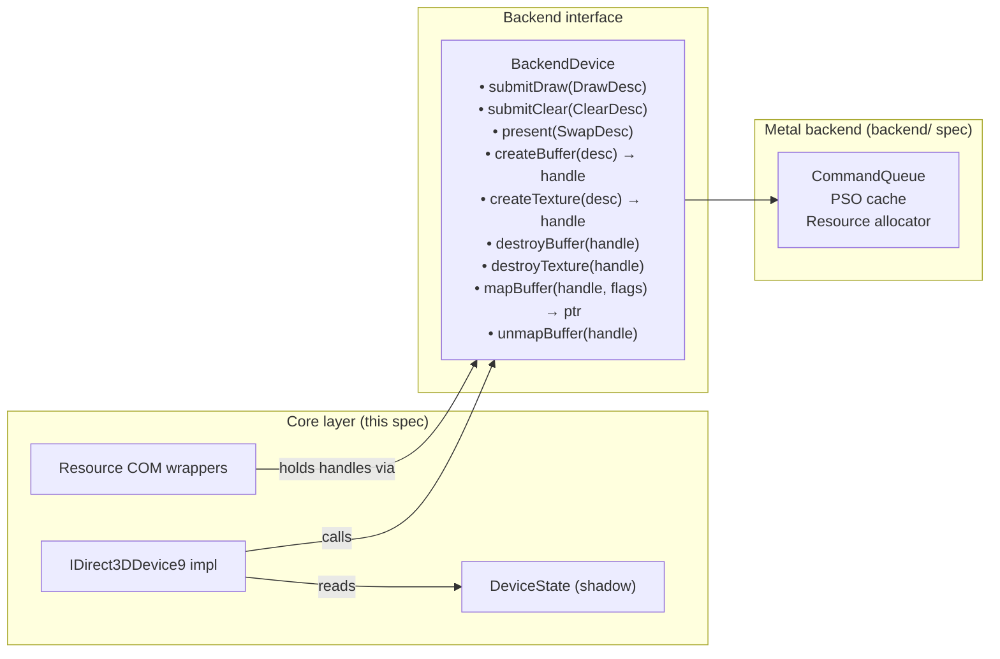
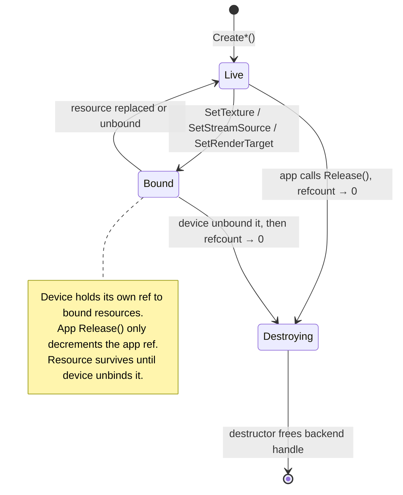

# Core Layer Design

---

## 1. Object Model

The core layer exposes the standard D3D9 COM hierarchy. Each COM object wraps an
internal implementation object and bridges to the backend through a defined interface.


Every COM object is reference-counted. The internal implementation object is destroyed
when the COM reference count reaches zero. Device children hold a back-reference to
their owning device (incrementing its count), which is released in the child's
destructor.

---

## 2. Device State Structure

The device maintains a single state bag that is the authoritative source for all
mutable D3D9 state. No state lives implicitly in the backend.

```
DeviceState {
    // Rasterizer
    D3DVIEWPORT9        viewport
    RECT                scissorRect
    DWORD               renderState[D3DRS_COUNT]

    // Output merger
    IDirect3DSurface9*  renderTarget[4]             // MRT, index 0 is primary
    IDirect3DSurface9*  depthStencilSurface

    // Input assembler
    StreamBinding       streams[16]                 // {VB*, offset, stride}
    IDirect3DIndexBuffer9* indexBuffer
    IDirect3DVertexDeclaration9* vertexDecl
    DWORD               fvf

    // Shaders
    IDirect3DVertexShader9* vertexShader
    IDirect3DPixelShader9*  pixelShader
    float               vsConstF[256][4]
    int                 vsConstI[16][4]
    BOOL                vsConstB[16]
    float               psConstF[224][4]
    int                 psConstI[16][4]
    BOOL                psConstB[16]

    // Fixed-function
    D3DMATRIX           transform[D3DTS_TEXTURE7+1]
    D3DLIGHT9           lights[8]
    BOOL                lightEnabled[8]
    D3DMATERIAL9        material

    // Texture and sampler
    IDirect3DBaseTexture9* texture[16]
    DWORD               textureStageState[8][D3DTSS_COUNT]
    DWORD               samplerState[16][D3DSAMP_COUNT]

    // Clip planes
    float               clipPlane[6][4]

    // Scene gate
    bool                inScene
}
```

The state bag is read by the backend when processing draw calls. The backend treats
the state bag as a snapshot taken at draw-call time.

---

## 3. Core / Backend Boundary

The core layer and the Metal backend communicate through a defined interface. The core
knows nothing about Metal objects; the backend knows nothing about D3D9 COM.



**`DrawDesc`** — the snapshot passed to the backend for each draw call:

```
DrawDesc {
    PrimitiveType       primitiveType       // no TRIANGLEFAN; decomposed by core
    uint32_t            primitiveCount
    uint32_t            startVertex
    uint32_t            baseVertexIndex     // indexed draws
    uint32_t            startIndex          // indexed draws
    BufferHandle        indexBuffer         // null for non-indexed
    IndexType           indexType           // 16-bit or 32-bit

    VertexDeclSnapshot  vertexDecl          // stream layouts + attribute semantics
    ShaderRef           vs                  // bytecode handle OR FFPKeyVS
    ShaderRef           ps                  // bytecode handle OR FFPKeyPS
    ConstantSnapshot    vsConst
    ConstantSnapshot    psConst

    TextureBinding      textures[16]        // handle + stage states
    SamplerSnapshot     samplers[16]

    RenderStateSnapshot rs                  // states that affect PSO or encoder
    RenderTargetSnapshot rts               // color + depth handles
    ViewportScissor     viewport
}
```

The core constructs `DrawDesc` from `DeviceState` immediately before the call. No
D3D9 COM objects are referenced inside `DrawDesc` — only opaque backend handles.

---

## 4. Resource Ownership Model



**Pool semantics:**

| Pool | GPU allocation | CPU accessible | Survives Reset() |
|---|---|---|---|
| DEFAULT | Yes | No (use staging) | No — destroyed on Reset |
| MANAGED | Yes (auto-synced) | Yes (system copy) | Yes |
| SYSTEMMEM | No | Yes | Yes |
| SCRATCH | No | Yes | Yes |

---

## 5. Fixed-Function Pipeline Key

When no vertex or pixel shader is bound, the core derives a compact key from
`DeviceState` and passes it to the backend as a `ShaderRef`. The backend generates or
caches the Metal shader for that key.

The key is a value type. Two keys that compare equal must produce identical shader
behavior. The key must not contain any pointers or handles — only scalar state.

**FFPKeyVS** encodes (all fields bit-packed):
- `lightingEnabled`, `specularEnabled`, `normalizeNormals`
- Per-light: `enabled`, `type` (directional / point / spot) for lights 0–7
- `colorMaterialMode` per channel (emissive, ambient, diffuse, specular)
- `fogMode`, `fogFromVertex`, `rangeFog`
- Per stage: `texCoordGen` (TCI mode), `texTransformFlags`
- `vertexBlend`, `indexedVertexBlend`

**FFPKeyPS** encodes (all fields bit-packed):
- Per stage: `colorOp`, `colorArg1`, `colorArg2`, `alphaOp`, `alphaArg1`,
  `alphaArg2`, `resultArg`, `texType`, `texCoordIndex`
- `fogMode` (for pixel fog when `!fogFromVertex`)
- `alphaTestEnable`, `alphaTestFunc`

---

## 6. Triangle Fan Decomposition

`D3DPT_TRIANGLEFAN` must be decomposed in the core before submission to the backend.
The backend never sees `D3DPT_TRIANGLEFAN`.

For fan `[v0, v1, v2, …, vN]` (primitive count = N−1):
- Non-indexed: copy vertices into a temporary triangle list buffer.
- Indexed: read original indices and write a new index sequence into a temporary
  index buffer.

The temporary buffer is valid until the draw call returns. The backend must copy or
consume it before returning.

---

## 7. Half-Pixel Offset Correction

D3D9 pixel centers are at integer screen coordinates; Metal pixel centers are at
half-integers. Without correction, all 3D geometry renders shifted by 0.5 pixels.

**For programmable vertex shaders:** inject a fixup into the shader before translation.
In bytecode terms, after the instruction that writes `oPos` (or `o0` in vs_3_0),
add: `oPos.xy += c_fixup.xy * oPos.w`, where `c_fixup` is injected as a constant
containing `(1/viewportWidth, 1/viewportHeight)`.

**For fixed-function shaders:** the backend includes the fixup in the generated MSL.

**For `D3DFVF_XYZRHW` (pre-transformed) inputs:** screen-space `(x, y, z, 1/w)` must
be converted to Metal NDC in the vertex shader:
```
metal_ndc.x =  (x / vp.Width)  * 2.0 − 1.0
metal_ndc.y = 1.0 − (y / vp.Height) * 2.0
metal_ndc.z = z
metal_ndc.w = 1.0 / rhw
```

---

## 8. Alpha Test

`D3DRS_ALPHATESTENABLE` with `D3DRS_ALPHAFUNC` / `D3DRS_ALPHAREF` has no Metal
hardware equivalent. It is encoded into `FFPKeyPS` (or a programmable shader variant
key) and emitted as a `discard_fragment()` conditional at the end of the pixel shader.

The test condition in MSL for function `D3DCMP_LESS`, reference `r`:
```metal
if (!(outColor.a < r)) discard_fragment();
```

Each distinct (`alphaTestEnable`, `alphaTestFunc`) combination must produce a
separately cached shader variant.
