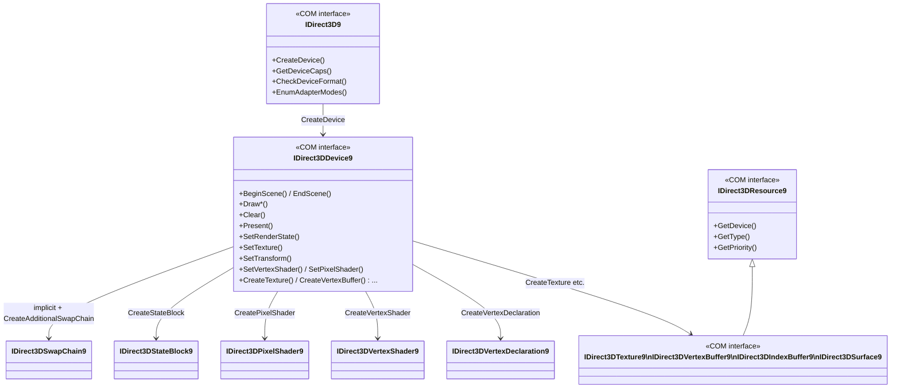
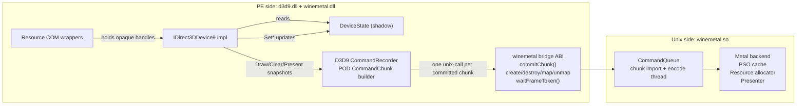
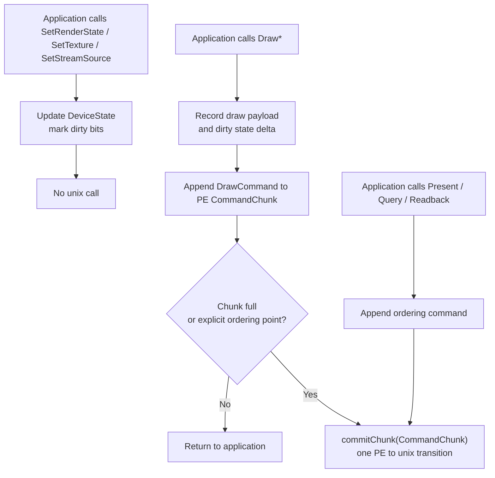
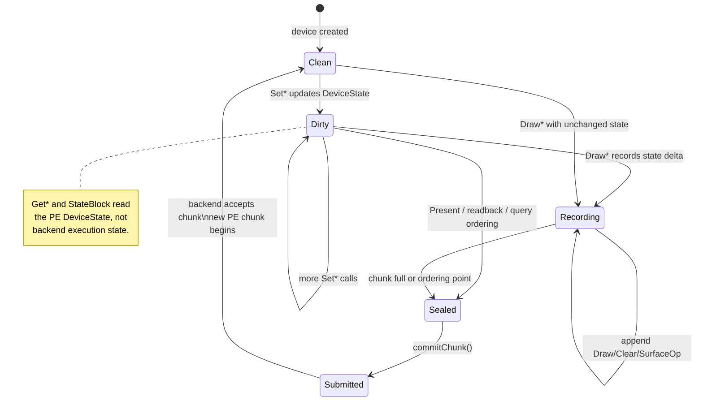
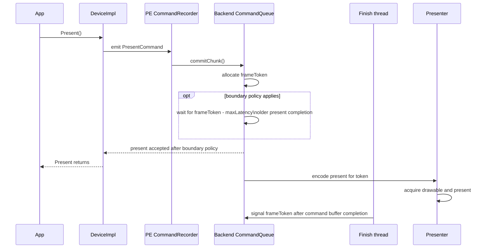
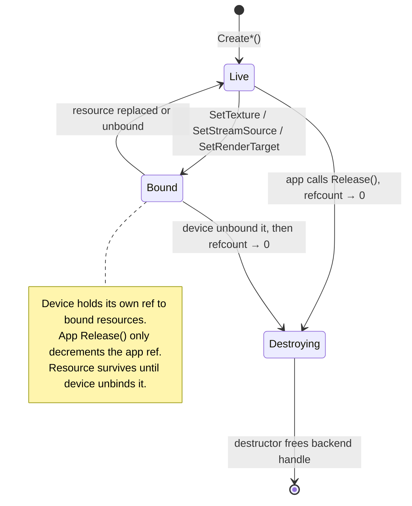
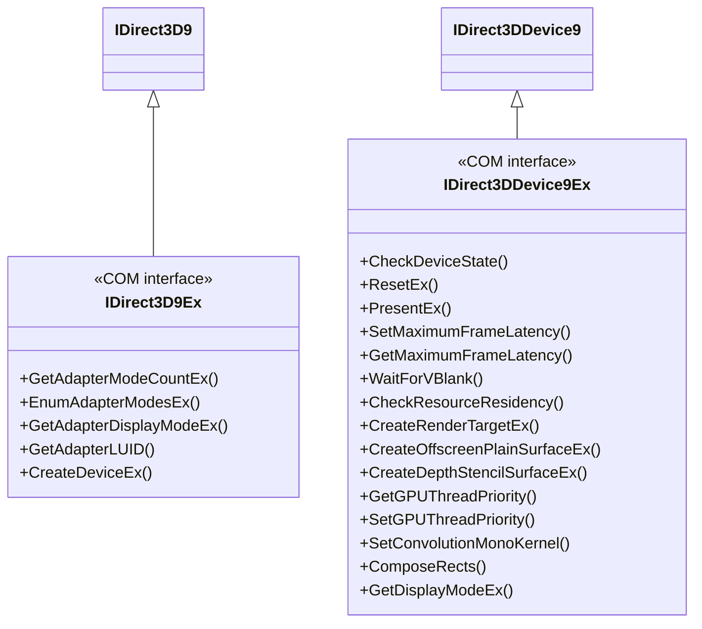
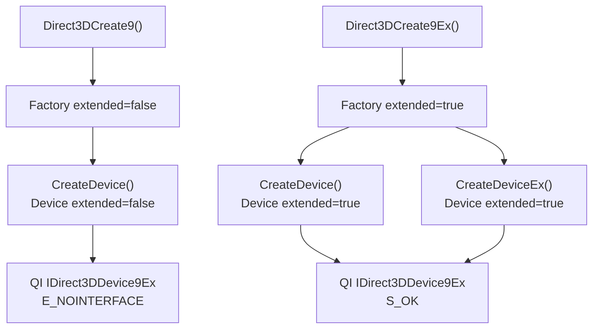

# Core Layer Design

---

## 1. Object Model

The core layer exposes the standard D3D9 COM hierarchy. Each COM object wraps an
internal implementation object and bridges to the backend through a defined interface.



Every COM object is reference-counted. The internal implementation object is destroyed
when the COM reference count reaches zero. Device children hold a back-reference to
their owning device (incrementing its count), which is released in the child's
destructor.

Factory and device objects also carry an `extended` creation flag. The concrete
implementation may share one class for base and Ex objects, but
`QueryInterface()` must gate Ex interfaces on that flag:

- `Direct3DCreate9()` creates `extended = false`; `IID_IDirect3D9Ex` and
  `IID_IDirect3DDevice9Ex` queries fail with `E_NOINTERFACE`.
- `Direct3DCreate9Ex()` creates `extended = true`; both the factory and devices
  created from it expose their Ex interfaces.
- `IDirect3D9Ex::CreateDevice()` still creates an Ex-capable device because the
  capability follows the parent factory, not the specific creation method.

---

## 2. Device State Structure

The device maintains a single state bag that is the authoritative source for all
mutable D3D9 state. No state lives implicitly in the backend.

```
DeviceState {
    // Rasterizer
    D3DVIEWPORT9        viewport
    RECT                scissorRect
    DWORD               renderState[D3DRS_COUNT]

    // Output merger
    IDirect3DSurface9*  renderTarget[4]             // MRT, index 0 is primary
    IDirect3DSurface9*  depthStencilSurface

    // Input assembler
    StreamBinding       streams[16]                 // {VB*, offset, stride}
    IDirect3DIndexBuffer9* indexBuffer
    IDirect3DVertexDeclaration9* vertexDecl
    DWORD               fvf

    // Shaders
    IDirect3DVertexShader9* vertexShader
    IDirect3DPixelShader9*  pixelShader
    float               vsConstF[256][4]
    int                 vsConstI[16][4]
    BOOL                vsConstB[16]
    float               psConstF[224][4]
    int                 psConstI[16][4]
    BOOL                psConstB[16]

    // Fixed-function
    D3DMATRIX           transform[D3DTS_TEXTURE7+1]
    D3DLIGHT9           lights[8]
    BOOL                lightEnabled[8]
    D3DMATERIAL9        material

    // Texture and sampler
    IDirect3DBaseTexture9* texture[16]
    DWORD               textureStageState[8][D3DTSS_COUNT]
    DWORD               samplerState[16][D3DSAMP_COUNT]

    // Clip planes
    float               clipPlane[6][4]

    // Scene gate
    bool                inScene
}
```

The state bag is read by the core when recording draw commands. The backend receives
only value snapshots extracted from this bag; it never observes or mutates the live
D3D9 state bag directly.

### 2.1 State Blocks

State blocks are PE-side snapshots or deltas of `DeviceState`; capture and apply
must not cross the Wine PE/unix boundary solely to observe mutable D3D9 state.

`CreateStateBlock()` uses the requested `D3DSTATEBLOCKTYPE` to select a state
mask:

| Type | Captured state |
|---|---|
| `D3DSBT_ALL` | render, texture/sampler, transforms, lights/material, shaders, constants, stream/index bindings, viewport/scissor, render targets |
| `D3DSBT_PIXELSTATE` | pixel-shader state, pixel constants, textures, sampler/TSS state, render states that affect raster/output/pixel processing |
| `D3DSBT_VERTEXSTATE` | vertex-shader state, vertex constants, transforms, lights/material, FVF/declaration, stream/index bindings, render states that affect vertex processing |

`BeginStateBlock()` records the delta between the base state and subsequent
state-setting calls. While recording is active, nested `BeginStateBlock()` and
existing state block `Capture()` / `Apply()` calls fail. The implementation must
preserve the D3D9 quirks covered by Wine's `stateblock.c`, including the
difference between `CreateStateBlock(D3DSBT_ALL)` snapshots and explicitly
recorded state blocks.

---

## 3. Core / Backend Boundary

The core layer and the Metal backend communicate through a coarse command-stream
interface. The core knows nothing about Metal objects; the backend knows nothing
about D3D9 COM.

The Wine PE/unix boundary is performance-sensitive. D3D9 hot-path calls must not
cross it one call at a time. The core records draw, clear, surface, query, and
present work into a PE-side command chunk. The chunk is committed to the unix-side
backend as a single bridge operation when it is full or when ordering requires it.



The bridge may expose resource lifecycle and map/unmap operations separately because
they are not per-draw hot-path calls. Draw/state submission itself is chunked.

### 3.1 Hot-Path Recording Model



This model follows upstream DXMT's important property: API calls record work on the
PE side, while backend execution and Metal calls happen later. dxmt9 must not depend
on a unix transition for every `DrawPrimitive`, `DrawIndexedPrimitive`, or `Set*`
call.

### 3.2 D3D9 Recorder Invariants

The recorder is a D3D9 state machine first and a batching optimization second. It
must preserve immediate API semantics even though execution is deferred.



Required invariants:

- Dirty bits are an optimization only; the `DeviceState` value is authoritative.
- A recorded draw owns a complete effective state after ordered replay of prior
  state-delta records against the server-side shadow. The canonical wire packet may
  carry only deltas; full self-contained snapshots are debug/stress mode.
- Later `Set*` calls only affect later records. If a barrier command occurs while
  state is dirty, the recorder must append an `APPLY_STATE` record before the
  barrier.
- `DrawPrimitiveUP` / `DrawIndexedPrimitiveUP` copy caller memory into chunk-owned
  payload or staging storage before returning.
- Recorded chunks retain opaque backend handles, never COM objects.
- `Present`, synchronous readback, event-query ordering, explicit flush, chunk size
  limits, and non-representable lifetime hazards seal the current chunk.

### 3.3 Draw and Chunk Payloads

**Conceptual `DrawDesc`** — the effective state the backend encodes for a draw:

```
DrawDesc {
    PrimitiveType       primitiveType       // no TRIANGLEFAN; decomposed by core
    uint32_t            primitiveCount
    uint32_t            startVertex
    uint32_t            baseVertexIndex     // indexed draws
    uint32_t            startIndex          // indexed draws
    BufferHandle        indexBuffer         // null for non-indexed
    IndexType           indexType           // 16-bit or 32-bit

    VertexDeclSnapshot  vertexDecl          // stream layouts + attribute semantics
    ShaderRef           vs                  // bytecode handle OR FFPKeyVS
    ShaderRef           ps                  // bytecode handle OR FFPKeyPS
    ConstantSnapshot    vsConst
    ConstantSnapshot    psConst

    TextureBinding      textures[16]        // handle + stage states
    SamplerSnapshot     samplers[16]

    RenderStateSnapshot rs                  // states that affect PSO or encoder
    RenderTargetSnapshot rts               // color + depth handles
    ViewportScissor     viewport
}
```

The PE wire format does not need to carry this full structure in every draw record.
The canonical command stream carries a compact state delta plus draw payload; the
unix importer applies those deltas in order to a server-side shadow. The resulting
effective state is equivalent to the conceptual `DrawDesc` above before encoding.
No D3D9 COM objects are referenced across the bridge — only opaque backend handles.
`DXMT9_PE_DRAW_FULL_SNAPSHOT=1` may force self-contained draw packets, but that is a
debug/stress mode because it increases wire size and disables cheap run coalescing.

**`CommandChunk`** — the bridge payload committed to the backend:

```
CommandChunk {
    uint64_t            chunkId
    uint32_t            commandCount
    uint32_t            byteSize
    CommandRecord[]     records          // Draw, Clear, SurfaceOp, Present, Query
    HandleRef[]         retainedHandles  // opaque backend handles referenced by records
}
```

The chunk is a POD command stream. It must not contain COM interface pointers,
Objective-C pointers, C++ lambdas, or process-local references that are invalid
after crossing the Wine PE/unix boundary.

### 3.4 Frame Pacing Ownership

Frame latency is owned by the swap chain, presenter, and backend command queue. The
device implementation initiates present, but it does not define the wait token.



When the boundary policy applies, the wait is based on present-bearing command
completion, not on whether the encode thread has merely dequeued or started a
chunk. This keeps pacing attached to the queue/presenter timeline and prevents the
front-end device object from becoming the owner of frame scheduling.

---

## 4. Resource Ownership Model



**Pool semantics:**

| Pool | GPU allocation | CPU accessible | Survives Reset() |
|---|---|---|---|
| DEFAULT | Yes | No (use staging) | No — destroyed on Reset |
| MANAGED | Yes (auto-synced) | Yes (system copy) | Yes |
| SYSTEMMEM | No | Yes | Yes |
| SCRATCH | No | Yes | Yes |

Public COM refcounts are part of the compatibility surface. Backend handle
retention for deferred command chunks is private and must not be visible through
`AddRef()` / `Release()` probes. `Get*` calls that return COM interfaces add a
public reference; state-setting calls follow D3D9's observed rules, including
`SetVertexDeclaration()` not adding a public reference and FVF conversion using
stable cached vertex declarations.

---

## 5. Fixed-Function Pipeline Key

When no vertex or pixel shader is bound, the core derives a compact key from
`DeviceState` and passes it to the backend as a `ShaderRef`. The backend generates or
caches the Metal shader for that key.

The key is a value type. Two keys that compare equal must produce identical shader
behavior. The key must not contain any pointers or handles — only scalar state.

**FFPKeyVS** encodes (all fields bit-packed):
- `lightingEnabled`, `specularEnabled`, `normalizeNormals`
- Per-light: `enabled`, `type` (directional / point / spot) for lights 0–7
- `colorMaterialMode` per channel (emissive, ambient, diffuse, specular)
- `fogMode`, `fogFromVertex`, `rangeFog`
- Per stage: `texCoordGen` (TCI mode), `texTransformFlags`
- `vertexBlend`, `indexedVertexBlend`

**FFPKeyPS** encodes (all fields bit-packed):
- Per stage: `colorOp`, `colorArg1`, `colorArg2`, `alphaOp`, `alphaArg1`,
  `alphaArg2`, `resultArg`, `texType`, `texCoordIndex`
- `fogMode` (for pixel fog when `!fogFromVertex`)
- `alphaTestEnable`, `alphaTestFunc`

---

## 6. Triangle Fan Decomposition

`D3DPT_TRIANGLEFAN` must be decomposed in the core before submission to the backend.
The backend never sees `D3DPT_TRIANGLEFAN`.

For fan `[v0, v1, v2, …, vN]` (primitive count = N−1):
- Non-indexed: copy vertices into a temporary triangle list buffer.
- Indexed: read original indices and write a new index sequence into a temporary
  index buffer.

The temporary buffer is valid until the draw call returns. The backend must copy or
consume it before returning.

---

## 7. Half-Pixel Offset Correction

D3D9 pixel centers are at integer screen coordinates; Metal pixel centers are at
half-integers. Without correction, all 3D geometry renders shifted by 0.5 pixels.

**For programmable vertex shaders:** inject a fixup into the shader before translation.
In bytecode terms, after the instruction that writes `oPos` (or `o0` in vs_3_0),
add: `oPos.xy += c_fixup.xy * oPos.w`, where `c_fixup` is injected as a constant
containing `(1/viewportWidth, 1/viewportHeight)`.

**For fixed-function shaders:** the backend includes the fixup in the generated MSL.

**For `D3DFVF_XYZRHW` (pre-transformed) inputs:** screen-space `(x, y, z, 1/w)` must
be converted to Metal NDC in the vertex shader:
```
metal_ndc.x =  (x / vp.Width)  * 2.0 − 1.0
metal_ndc.y = 1.0 − (y / vp.Height) * 2.0
metal_ndc.z = z
metal_ndc.w = 1.0 / rhw
```

---

## 8. Alpha Test


`D3DRS_ALPHATESTENABLE` with `D3DRS_ALPHAFUNC` / `D3DRS_ALPHAREF` has no Metal
hardware equivalent. It is encoded into `FFPKeyPS` (or a programmable shader variant
key) and emitted as a `discard_fragment()` conditional at the end of the pixel shader.

The test condition in MSL for function `D3DCMP_LESS`, reference `r`:
```metal
if (!(outColor.a < r)) discard_fragment();
```

Each distinct (`alphaTestEnable`, `alphaTestFunc`) combination must produce a
separately cached shader variant.

---

## 9. IDirect3DDevice9Ex Extension

`IDirect3D9Ex` and `IDirect3DDevice9Ex` extend the base interfaces without
replacing them. The implementation reuses the existing class hierarchy.



**Class layout:** `Direct3D9ExImpl` inherits `IDirect3D9Ex` (which inherits
`IDirect3D9`) and delegates all base methods to the existing `Factory`
implementation. `Direct3DDevice9ExImpl` inherits `IDirect3DDevice9Ex` and
delegates all base methods to the existing `Direct3DDevice9Impl`. Base-vs-Ex
availability is controlled by the `extended` creation flag rather than by a
separate backend implementation.

The shared implementation is still split logically by `extended` mode. This is
the Wine-compatible rule:



**Ex-only method mappings:**

| Ex method | Implementation |
|---|---|
| `CheckDeviceState()` | `deviceLost_` flag; adds `S_PRESENT_OCCLUDED` for minimised window |
| `ResetEx()` | `reset()` + `normalizePresentParameters()` with `D3DDISPLAYMODEEX` |
| `PresentEx()` | `present()` — dirty-rect and rotation hints ignored |
| `SetMaximumFrameLatency()` | `backend_->setMaxFrameLatency(n)` (new backend method) |
| `GetMaximumFrameLatency()` | Returns `maxFrameLatency_` |
| `WaitForVBlank()` | `CAMetalLayer` drawable wait or `CVDisplayLink` callback |
| `CheckResourceResidency()` | Always `S_OK` — Metal manages residency |
| `GetAdapterLUID()` | Synthesised from `MTLDevice.registryID` |
| `GetGPUThreadPriority()` | Always returns 0 |
| `SetGPUThreadPriority()` | No-op, returns `D3D_OK` |
| `SetConvolutionMonoKernel()` | `E_NOTIMPL` |
| `ComposeRects()` | `E_NOTIMPL` |
| `CreateRenderTargetEx()` | Delegates to `CreateRenderTarget()`; `*pSharedHandle = NULL` |
| `CreateOffscreenPlainSurfaceEx()` | Delegates to `CreateOffscreenPlainSurface()`; `*pSharedHandle = NULL` |
| `CreateDepthStencilSurfaceEx()` | Delegates to `CreateDepthStencilSurface()`; `*pSharedHandle = NULL` |
