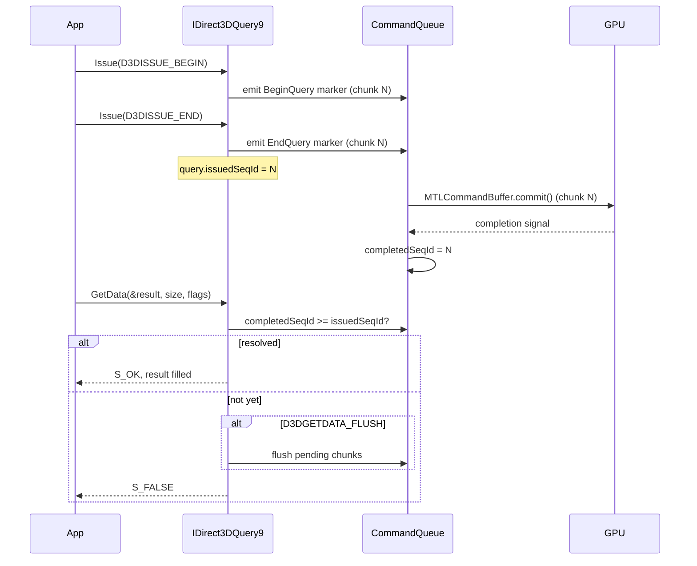

# Query Design Spec

D3D9 queries let the application probe GPU state asynchronously. Because dxmt9 uses
a deferred command queue (commands are encoded on a separate thread), query results
are not available until the GPU has processed the commands that surround the query.
This spec defines how each query type is implemented in the deferred model.

---

## 1. Query Types in Scope

| D3DQUERYTYPE | Priority | Notes |
|---|---|---|
| D3DQUERYTYPE_EVENT | **Required** | GPU fence — most common synchronization primitive |
| D3DQUERYTYPE_OCCLUSION | **Required** | Sample count from visibility result |
| D3DQUERYTYPE_TIMESTAMP | Optional | GPU timestamp; requires Metal counter support |
| D3DQUERYTYPE_TIMESTAMPDISJOINT | Optional | Always non-disjoint on Metal (clocks are stable) |
| D3DQUERYTYPE_TIMESTAMPFREQ | Optional | Nanoseconds per tick |
| D3DQUERYTYPE_VCACHE | Omit | Driver cache stats; always return zeros |
| D3DQUERYTYPE_RESOURCEMANAGER | Omit | Memory stats; always return zeros |
| D3DQUERYTYPE_VERTEXSTATS | Omit | VS invocations; not exposed by Metal |

---

## 2. Sequence ID Fence Mechanism

The command queue assigns a monotonically increasing **sequence ID** to each
committed `CommandChunk`. The finish thread increments a CPU-visible `completedSeqId`
counter after the GPU signals completion for each chunk.

```
CommandQueue state:
  currentSeqId:   uint64   (incremented on CommitChunk)
  completedSeqId: atomic<uint64>  (incremented by finish thread on GPU completion)
```

A query is "resolved" when `completedSeqId >= query.issuedSeqId`.



---

## 3. D3DQUERYTYPE_EVENT

An event query is a pure GPU fence — no data is returned, only a completion signal.

**`Issue(D3DISSUE_END)`:**
- Emits a marker lambda into the current chunk that records the chunk's seq ID in
  `query.issuedSeqId` when the lambda executes on the encode thread.
- No Metal API call is needed; completion is tracked via `completedSeqId`.

**`GetData(NULL, 0, flags)`:**
- If `completedSeqId >= query.issuedSeqId` → return `S_OK`.
- Otherwise:
  - If `flags & D3DGETDATA_FLUSH`: flush any uncommitted chunks (commit current chunk
    to ensure it reaches the GPU).
  - Return `S_FALSE`.

**`GetData` with `D3DGETDATA_FLUSH` and busy-wait:**
Many D3D9 apps do:
```cpp
while (pQuery->GetData(NULL, 0, D3DGETDATA_FLUSH) == S_FALSE) { /* spin */ }
```
dxmt9 must not deadlock here. The flush must commit the chunk containing the END
marker; the finish thread must then be able to signal completion.

---

## 4. D3DQUERYTYPE_OCCLUSION

An occlusion query counts the number of samples (pixels × MSAA samples) that pass
the depth-stencil test between `BEGIN` and `END`.

Metal provides visibility result buffers: a `MTLBuffer` where the GPU writes a
per-render-pass sample count.

**Design:**

```
OcclusionQueryPool:
  visibilityBuffer: MTLBuffer   // shared storage, large enough for N concurrent queries
  slotAllocator: ring           // allocate 8-byte slots per active query
```

**`Issue(D3DISSUE_BEGIN)`:**
- Allocate a slot (8-byte aligned offset) from `visibilityBuffer`.
- Emit a lambda that calls `setVisibilityResultMode:MTLVisibilityResultModeCounting
  offset:slot` on the current `MTLRenderCommandEncoder`.
- Store `slot` in `query.visibilitySlot`.

**`Issue(D3DISSUE_END)`:**
- Emit a lambda that calls `setVisibilityResultMode:MTLVisibilityResultModeDisabled
  offset:0`.
- Record `query.issuedSeqId`.

**`GetData(&count, sizeof(DWORD), flags)`:**
- If `completedSeqId < query.issuedSeqId` → return `S_FALSE` (buffer not yet written).
- Read `uint64` from `visibilityBuffer` at `query.visibilitySlot`.
- Write `min(value, UINT32_MAX)` into `*count`.
- Return `S_OK`.

**Notes:**
- Visibility result buffers must be in `MTLStorageModeShared` to be CPU-readable.
- The pool is reset at the start of each frame (slot allocator resets when the
  corresponding chunks complete).
- Queries that span render pass boundaries accumulate counts from all passes that
  had the query active. If the encoder splits mid-query, the new encoder must also
  set `setVisibilityResultMode` at the same slot.

---

## 5. D3DQUERYTYPE_TIMESTAMP

GPU timestamps report the GPU clock at a point in the command stream.

**Metal mechanism:** `sampleTimestamps` and `MTLCounterSampleBuffer` (Metal 3+).

**`Issue(D3DISSUE_END)`:**
- Emit a lambda that calls `sampleCounters:inBuffer:atSampleIndex:withBarrier:` on
  the current command encoder (compute or render), writing to a
  `MTLCounterSampleBuffer` at the query's reserved index.
- Record `query.issuedSeqId`.

**`GetData(&timestamp, sizeof(UINT64), flags)`:**
- If not resolved → `S_FALSE`.
- Read the raw counter value from the `MTLCounterSampleBuffer`.
- Resolve via `resolveCounterRange:intoBuffer:destinationOffset:withRange:` if not
  auto-resolved.
- Return the nanosecond timestamp in `*timestamp`.

**`D3DQUERYTYPE_TIMESTAMPFREQ`:**
- Return `1000000000` (1 GHz = 1 tick per nanosecond). Metal timestamps are in
  nanoseconds after resolution.

**`D3DQUERYTYPE_TIMESTAMPDISJOINT`:**
- Always return `Disjoint = FALSE`, `Frequency = 1000000000`.
- Metal's GPU clock is continuous and stable within a frame.

**Fallback:** If `MTLCounterSampleBuffer` is unavailable (Metal < 3 / older GPUs),
return `D3DERR_NOTAVAILABLE` from `CreateQuery(D3DQUERYTYPE_TIMESTAMP)`.

---

## 6. IDirect3DQuery9 Object Lifecycle

```mermaid
stateDiagram-v2
    [*] --> Created : CreateQuery(type)
    Created --> Issued : Issue(D3DISSUE_END)
    Issued --> Pending : chunk committed to GPU
    Pending --> Resolved : completedSeqId >= issuedSeqId
    Resolved --> Created : Issue(D3DISSUE_BEGIN or END) resets query
    Created --> [*] : Release()
    Issued --> [*] : Release() while pending — safe; slot recycled after GPU done
```



A query object may be reused (re-issued) after it has been resolved. Re-issuing a
pending query (before resolution) is not allowed by D3D9 spec; behavior is undefined.

---

## 7. Multi-Query Ordering

When multiple queries are issued in the same frame chunk, they share the same
`issuedSeqId`. They are all considered resolved when `completedSeqId` reaches that
seq ID. There is no per-query GPU signal — resolution is chunk-granular.

This is correct because all commands in a chunk execute in order on the GPU, so if
the chunk completed, all END markers within it have executed.
