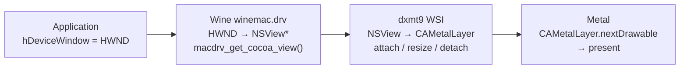

# Window System Integration Spec

WSI (Window System Integration) defines how a Win32 window handle (`HWND`) maps to
a Metal presentation surface (`CAMetalLayer`), and how the swap chain stays in sync
with the window through resize, minimize, and mode changes.

---

## 1. The Problem

D3D9's `CreateDevice()` and `CreateAdditionalSwapChain()` receive a Win32 `HWND`. On
macOS under Wine, an `HWND` is a Wine internal handle backed by a macOS `NSWindow` /
`NSView`. Metal presents to a `CAMetalLayer` attached to an `NSView`. The WSI layer
must bridge these.



---

## 2. HWND → NSView Resolution

Wine's macOS window driver (`winemac.drv`) already exports:

```c
/* Available in any Wine build on macOS — no fork required */
NSView* macdrv_get_cocoa_view(HWND hwnd);
```

`libdxmt9.dylib` resolves this symbol at runtime via `dlopen` / `dlsym`:

```c
static NSView* get_nsview(HWND hwnd) {
    static auto fn = (NSView*(*)(HWND))
        dlsym(dlopen("winemac.drv", RTLD_NOLOAD | RTLD_LAZY), "macdrv_get_cocoa_view");
    return fn ? fn(hwnd) : nullptr;
}
```

If the symbol is absent (non-Wine environment, unit tests) the function returns
`nullptr` and device creation fails gracefully with `D3DERR_INVALIDCALL`.

---

## 3. Layer Lifecycle

### 3.1 Creation (at CreateDevice / CreateAdditionalSwapChain)

1. Resolve `HWND` to `NSView*` via `macdrv_get_cocoa_view(hwnd)`.
2. Create and attach a `CAMetalLayer` as the view's backing layer:
   ```objc
   CAMetalLayer *layer = [CAMetalLayer layer];
   layer.device          = mtlDevice;
   layer.pixelFormat     = MTLPixelFormatBGRA8Unorm;
   layer.drawableSize    = CGSizeMake(pp.BackBufferWidth, pp.BackBufferHeight);
   layer.displaySyncEnabled = (pp.PresentationInterval != D3DPRESENT_INTERVAL_IMMEDIATE);
   layer.maximumDrawableCount = 3;
   layer.framebufferOnly = YES;
   nsView.wantsLayer     = YES;
   nsView.layer          = layer;
   ```
3. Store `CAMetalLayer*` in the `SwapChain` object.

### 3.2 Resize

When `Reset()` or `IDirect3DSwapChain9::Reset()` is called with new dimensions:

1. Drain all in-flight command buffers (wait for GPU completion).
2. Update `layer.drawableSize`.
3. Recreate the back-buffer `MTLTexture` at the new size.

Resize is also triggered by `NSViewFrameDidChangeNotification`. In windowed mode
this is handled silently (no device lost). In fullscreen mode it surfaces as
`D3DERR_DEVICELOST`.

### 3.3 Destruction

On `IDirect3DDevice9::Release()` or swap chain destruction:

1. Drain GPU.
2. `nsView.layer = nil` — removes and releases the `CAMetalLayer`.

---

## 4. Windowed vs Fullscreen

### Windowed Mode (`Windowed = TRUE`)

- `layer.drawableSize` = `D3DPRESENT_PARAMETERS.BackBufferWidth/Height`.
- `displaySyncEnabled` controlled by `PresentationInterval`.

### Fullscreen Mode (`Windowed = FALSE`)

Not required for Phase 1. When implemented:

- Exclusive fullscreen requires `NSScreen` mode switching (`CGDisplayCapture`).
- `D3DPRESENT_INTERVAL_ONE` → `displaySyncEnabled = YES`.
- Return `D3DERR_NOTAVAILABLE` from `CreateDevice` for fullscreen until implemented.

---

## 5. Multi-Monitor

`IDirect3D9::GetAdapterCount()` returns the number of `MTLDevice` + `NSScreen` pairs.
For a single GPU with multiple monitors, one `MTLDevice` drives all screens.

The `AdapterIdentifier` for each adapter must include the monitor's `CGDirectDisplayID`.

---

## 6. WinemetalApi — Reduced Scope

The original design routed all window/layer operations through a `WinemetalApi`
callback table that a Wine fork had to populate. Since `macdrv_get_cocoa_view` and
`CAMetalLayer` manipulation are available without any Wine patching, the table is
reduced to one optional callback:

| Function pointer | Purpose | Required? |
|---|---|---|
| `compile_shader` | Wine-side MSL compilation (Apple shader converter) | Optional |

All window/layer functions (`get_view`, `create_layer`, `resize_layer`,
`set_sync`, `destroy_layer`, `next_drawable`, `present_drawable`) are implemented
directly in `libdxmt9.dylib` using `macdrv_get_cocoa_view` + ObjC Metal APIs.
They are removed from `WinemetalApi`.

The stub `WinemetalApi` registered in `d3d9.dll`'s `DllMain` remains as a
no-op fallback for non-Wine environments (testing, future ports).

---

## 7. Pixel Format for Presentation

`CAMetalLayer.pixelFormat` is always `MTLPixelFormatBGRA8Unorm`. The back buffer is
an internal `MTLTexture`; it is blitted to the BGRA drawable during present.

If `BackBufferFormat == D3DFMT_A8R8G8B8` or `D3DFMT_X8R8G8B8`, the blit is a
direct copy. For other formats a format-conversion pass is required.

---

## 8. Device Lost due to Window Events

| Event | Required action |
|---|---|
| Window destroyed while device alive | `TestCooperativeLevel()` → `D3DERR_DEVICELOST` |
| Display mode change (fullscreen) | `D3DERR_DEVICELOST` → `D3DERR_DEVICENOTRESET` after drain |
| GPU reset / Metal device removal | `D3DERR_DEVICELOST` |

Windowed resize does **not** cause device lost.

---

## 9. Win32 PE Wrapper and Initialization

`libdxmt9.dylib` is a native Mach-O ARM64 dylib compiled with Apple clang.
`d3d9.dll` is a PE32+ ARM64 DLL cross-compiled with llvm-mingw, living in
`src/win32/` of this repository. On Apple Silicon, Wine's PE and native code
share the ARM64 address space, so calls from the PE DLL into the dylib are
direct function calls — no thunking needed.

### 9.1 Initialization Sequence

`d3d9.dll`'s `DllMain(DLL_PROCESS_ATTACH)`:

1. Registers a stub `WinemetalApi` via `dxmt9_winemetal_set_api(&kStubApi)`.
   (A future Wine build with Apple shader converter support would call this
   again with a real `compile_shader` implementation.)
2. Exports `Direct3DCreate9` / `Direct3DCreate9Ex`, each calling
   `dxmt9c_factory_create()` and wrapping the result in a COM object.

### 9.2 Installation

```sh
cp build/src/libdxmt9.dylib   ~/.wine/drive_c/windows/system32/dxmt9.dll
cp build-win32/src/win32/d3d9.dll ~/.wine/drive_c/windows/system32/d3d9.dll
WINEDLLOVERRIDES="d3d9=n,b" wine app.exe
```

Works with any Wine on macOS that includes `winemac.drv` (stock Wine, GPTK,
CrossOver) — no Wine fork required.
