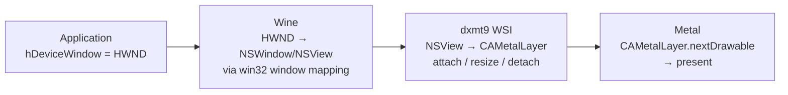

# Window System Integration Spec

WSI (Window System Integration) defines how a Win32 window handle (`HWND`) maps to
a Metal presentation surface (`CAMetalLayer`), and how the swap chain stays in sync
with the window through resize, minimize, and mode changes.

---

## 1. The Problem

D3D9's `CreateDevice()` and `CreateAdditionalSwapChain()` receive a Win32 `HWND`. On
macOS under Wine, an `HWND` is a Wine internal handle backed by a macOS `NSWindow` /
`NSView`. Metal presents to a `CAMetalLayer` attached to an `NSView`. The WSI layer
must bridge these.



---

## 2. Layer Lifecycle

### 2.1 Creation (at CreateDevice / CreateAdditionalSwapChain)

1. Resolve `HWND` to a macOS `NSView*` via Wine's `winemetal` window query API
   (`winemetal_get_view_for_hwnd(hwnd) → view_handle`).
2. Create a `CAMetalLayer` and attach it as the view's backing layer:
   ```objc
   CAMetalLayer *layer = [CAMetalLayer layer];
   layer.device          = mtlDevice;
   layer.pixelFormat     = MTLPixelFormatBGRA8Unorm;  // always BGRA for display
   layer.drawableSize    = CGSizeMake(pp.BackBufferWidth, pp.BackBufferHeight);
   layer.displaySyncEnabled = (pp.PresentationInterval != D3DPRESENT_INTERVAL_IMMEDIATE);
   layer.maximumDrawableCount = 3;
   layer.framebufferOnly = YES;  // no sampling from drawable; blit-only
   nsView.layer          = layer;
   nsView.wantsLayer     = YES;
   ```
3. Store the `CAMetalLayer*` in the `SwapChain` object as an opaque handle (crossed
   via `winemetal` for Wine builds).

### 2.2 Resize

When the application calls `Reset()` or `IDirect3DSwapChain9::Reset()` with new
`BackBufferWidth` / `BackBufferHeight`:

1. Drain all in-flight command buffers (wait for GPU completion).
2. Update `layer.drawableSize`.
3. Recreate the back-buffer `MTLTexture` at the new size.
4. The `CAMetalLayer` handles resizing internally; no layer detach/reattach is needed.

Resize must also be triggered when the underlying `NSView` bounds change (e.g., user
drags the window border in windowed mode). The WSI layer must register for
`NSViewFrameDidChangeNotification` and update `drawableSize` accordingly, queueing
a resize event that dxmt9 surfaces as `D3DERR_DEVICELOST` (or handles silently for
windowed mode).

### 2.3 Destruction

On `IDirect3DDevice9::Release()` or swap chain destruction:
1. Drain GPU.
2. Remove the `CAMetalLayer` from the view (`nsView.layer = nil`).
3. Release the `CAMetalLayer` reference.

---

## 3. Windowed vs Fullscreen

### Windowed Mode (`Windowed = TRUE`)

- `CAMetalLayer.drawableSize` = `D3DPRESENT_PARAMETERS.BackBufferWidth/Height`.
- The layer is sized to match the back buffer, which may differ from window client
  area (stretch-to-fit is handled by `CALayer` autoresizing or by Metal's present
  scaling).
- `displaySyncEnabled` is controlled by `PresentationInterval`.

### Fullscreen Mode (`Windowed = FALSE`)

D3D9 fullscreen is not required for Phase 1. When implemented:
- Exclusive fullscreen requires `NSScreen` mode switching (via `CGDisplayCapture`).
- The Metal layer must cover the entire screen.
- `D3DPRESENT_INTERVAL_ONE` → `displaySyncEnabled = YES` with refresh rate matching.
- Return `D3DERR_NOTAVAILABLE` from `CreateDevice` for fullscreen until implemented.

---

## 4. Multi-Monitor

`IDirect3D9::GetAdapterCount()` returns the number of `MTLDevice` + `NSScreen` pairs.
For the common single-GPU multi-monitor case, one `MTLDevice` drives all screens.
Each adapter reports one primary `NSScreen`.

The `AdapterIdentifier` for each adapter must include the monitor's `CGDirectDisplayID`
so applications can identify physical displays.

---

## 5. Wine Bridge Requirements

Under Wine, all `NSView` and `CAMetalLayer` manipulation must happen on the macOS
(unix lib) side via the `winemetal` thunk interface. The following calls must be
available:

| Function | Description |
|---|---|
| `winemetal_get_view_for_hwnd(hwnd)` | Returns a `view_handle` for the Win32 HWND |
| `winemetal_create_metal_layer(view_handle, device_handle, params)` | Creates and attaches `CAMetalLayer`, returns `layer_handle` |
| `winemetal_resize_metal_layer(layer_handle, width, height)` | Updates `drawableSize` |
| `winemetal_set_sync_enabled(layer_handle, enabled)` | Sets `displaySyncEnabled` |
| `winemetal_destroy_metal_layer(layer_handle)` | Removes layer and releases it |
| `winemetal_next_drawable(layer_handle)` | Returns `drawable_handle` (blocks on vsync if enabled) |
| `winemetal_present_drawable(cmdbuf_handle, drawable_handle)` | Encodes present into command buffer |

All handles are opaque integers crossing the Win32/unix boundary.

---

## 6. Pixel Format for Presentation

The `CAMetalLayer.pixelFormat` must always be `MTLPixelFormatBGRA8Unorm` for display
output, regardless of the `D3DPRESENT_PARAMETERS.BackBufferFormat`. The back buffer
is an internal `MTLTexture` in the format matching the requested format
(see `formats.md`); it is blitted to the BGRA drawable during present.

If `BackBufferFormat == D3DFMT_A8R8G8B8` or `D3DFMT_X8R8G8B8`, the back buffer is
`MTLPixelFormatBGRA8Unorm` and the blit is a direct copy with no format conversion.

If the back buffer format differs (e.g., `D3DFMT_A16B16G16R16F`), the present blit
must include a format conversion pass (fullscreen triangle with a sampler and tone-
mapping if applicable, or a simple format-conversion blit if no HDR → SDR mapping
is needed).

---

## 7. Device Lost due to Window Events

The following events must trigger device-lost behavior:

| Event | Required action |
|---|---|
| Window destroyed while device alive | `TestCooperativeLevel()` → `D3DERR_DEVICELOST` |
| Display mode change (fullscreen) | `TestCooperativeLevel()` → `D3DERR_DEVICELOST` → `D3DERR_DEVICENOTRESET` after drain |
| GPU reset / Metal device removal | `TestCooperativeLevel()` → `D3DERR_DEVICELOST` |

In windowed mode, window resize does **not** cause device lost. The swap chain
silently resizes.
