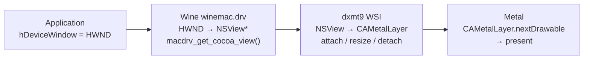

# Window System Integration Spec

WSI (Window System Integration) defines how a Win32 window handle (`HWND`) maps to
a Metal presentation surface (`CAMetalLayer`), and how the swap chain stays in sync
with the window through resize, minimize, and mode changes.

---

## 1. The Problem

D3D9's `CreateDevice()` and `CreateAdditionalSwapChain()` receive a Win32 `HWND`. On
macOS under Wine, an `HWND` is a Wine internal handle backed by a macOS `NSWindow` /
`NSView`. Metal presents to a `CAMetalLayer` attached to an `NSView`. The WSI layer
must bridge these.



---

## 2. HWND → Cocoa View Resolution

`winemetal.so` supports two Wine host paths:

1. Legacy direct symbol path:
   - `macdrv_get_cocoa_view(HWND)` returns the backing `NSView*`
2. Builtin-module fallback path used by Heroic Wine 11.5:
   - `macdrv_functions[3]` returns a `WineWindow*`
   - `winemetal.so` resolves `-[WineWindow contentView]` on the Cocoa main queue
   - `macdrv_functions[6]` creates a `WineMetalView*` from that
     `WineContentView*`
   - `macdrv_functions[7]` returns the `CAMetalLayer*`

The resolution order is:

```c
// 1. Try legacy direct NSView export
macdrv_get_cocoa_view(hwnd)

// 2. Otherwise fall back to Heroic/DXMT-style function table
macdrv_functions[3] -> WineWindow*
WineWindow.contentView -> WineContentView*
macdrv_functions[6](WineContentView*, metal_device) -> WineMetalView*
macdrv_functions[7](WineMetalView*) -> CAMetalLayer*
```

`winemetal.so` resolves the legacy symbol or function table at runtime via
`dlsym(RTLD_DEFAULT, ...)`. If neither path is available (non-Wine environment,
unit tests, or an older Wine build), the function returns `nullptr`; `Present`
becomes a no-op and the device remains usable for offscreen rendering and
`GetRenderTargetData` readback.

---

## 3. Layer Lifecycle

### 3.1 Creation (at CreateDevice / CreateAdditionalSwapChain)

1. Resolve `HWND` to either:
   - `NSView*` directly through `macdrv_get_cocoa_view(hwnd)`, or
   - `WineWindow* -> contentView -> WineMetalView -> CAMetalLayer*` through the
     `macdrv_functions` fallback path.
2. If using the legacy `NSView*` path, create and attach a `CAMetalLayer` as
   the view's backing layer:
   ```objc
   CAMetalLayer *layer = [CAMetalLayer layer];
   layer.device          = mtlDevice;
   layer.pixelFormat     = MTLPixelFormatBGRA8Unorm;
   layer.drawableSize    = CGSizeMake(pp.BackBufferWidth, pp.BackBufferHeight);
   layer.displaySyncEnabled = (pp.PresentationInterval != D3DPRESENT_INTERVAL_IMMEDIATE);
   layer.maximumDrawableCount = 3;
   layer.framebufferOnly = YES;
   nsView.wantsLayer     = YES;
   nsView.layer          = layer;
   ```
3. If using the `WineMetalView` fallback path, store the returned
   `WineMetalView*` for later release and use its `CAMetalLayer*` directly.
4. Store `CAMetalLayer*` in the `SwapChain` object.

### 3.2 Resize

When `Reset()` or `IDirect3DSwapChain9::Reset()` is called with new dimensions:

1. Drain all in-flight command buffers (wait for GPU completion).
2. Update `layer.drawableSize`.
3. Recreate the back-buffer `MTLTexture` at the new size.

Resize is also triggered by `NSViewFrameDidChangeNotification`. In windowed mode
this is handled silently (no device lost). In fullscreen mode it surfaces as
`D3DERR_DEVICELOST`.

### 3.3 Destruction

On `IDirect3DDevice9::Release()` or swap chain destruction:

1. Drain GPU.
2. `nsView.layer = nil` — removes and releases the `CAMetalLayer`.

---

## 4. Windowed vs Fullscreen

### Windowed Mode (`Windowed = TRUE`)

- `layer.drawableSize` = `D3DPRESENT_PARAMETERS.BackBufferWidth/Height`.
- `displaySyncEnabled` controlled by `PresentationInterval`.

### Fullscreen Mode (`Windowed = FALSE`)

Not required for Phase 1. When implemented:

- Exclusive fullscreen requires `NSScreen` mode switching (`CGDisplayCapture`).
- `D3DPRESENT_INTERVAL_ONE` → `displaySyncEnabled = YES`.
- Return `D3DERR_NOTAVAILABLE` from `CreateDevice` for fullscreen until implemented.

---

## 5. Multi-Monitor

`IDirect3D9::GetAdapterCount()` returns the number of `MTLDevice` + `NSScreen` pairs.
For a single GPU with multiple monitors, one `MTLDevice` drives all screens.

The `AdapterIdentifier` for each adapter must include the monitor's `CGDirectDisplayID`.

---

## 6. PE Bridge and Unix Module Split

The Wine-facing runtime follows the upstream DXMT `winemetal` split. API DLLs
remain PE images loaded by the Windows application, while all ObjC/Metal work is
hosted by the paired Wine unix module:

| Binary | Kind | Role |
|---|---|---|
| `d3d9.dll` | PE DLL | User-facing D3D9 COM exports (`Direct3DCreate9`, `Direct3DCreate9Ex`, `Direct3DShaderValidatorCreate9`, `D3DPERF_*`, `DebugSetMute`, loader-safe auxiliary stubs), D3D9 state shadow, and hot-path command recording |
| `winemetal.dll` | Wine builtin PE DLL | Shared bridge/service DLL imported by `d3d9.dll`; initializes Wine unix-call dispatch and exposes chunk/resource/frame-token ABI |
| `winemetal.so` | Wine unix module | Native Mach-O module that hosts ObjC/Metal WSI, shader translation, provider/runtime handlers, and GPU execution |

`d3d9.dll` imports `winemetal.dll` as a normal Windows dependency. `winemetal.dll`
then communicates with `winemetal.so` through Wine's PE↔unix thunk mechanism.
On macOS, `winemetal.so` is a Mach-O binary, but it follows Wine's `.so` naming
and loader conventions. No PE DLL may import a Mach-O `.dylib` or `.so` as if it
were a Windows DLL.

All window/layer functions (`get_view`, `create_layer`, `resize_layer`,
`set_sync`, `destroy_layer`, `next_drawable`, `present_drawable`) live in
`winemetal.so` using `macdrv_get_cocoa_view` + ObjC Metal APIs. The PE side owns
COM entry points, D3D9 state tracking, POD command chunk construction, opaque
handles, C ABI forwarding, and Wine-visible thunk entry points. It does not own ObjC
or Metal objects.

---

## 7. Pixel Format for Presentation

`CAMetalLayer.pixelFormat` is always `MTLPixelFormatBGRA8Unorm`. The back buffer is
an internal `MTLTexture`; it is blitted to the BGRA drawable during present.

If `BackBufferFormat == D3DFMT_A8R8G8B8` or `D3DFMT_X8R8G8B8`, the blit is a
direct copy. For other formats a format-conversion pass is required.

---

## 8. Device Lost due to Window Events

| Event | Required action |
|---|---|
| Window destroyed while device alive | `TestCooperativeLevel()` → `D3DERR_DEVICELOST` |
| Display mode change (fullscreen) | `D3DERR_DEVICELOST` → `D3DERR_DEVICENOTRESET` after drain |
| GPU reset / Metal device removal | `D3DERR_DEVICELOST` |

Windowed resize does **not** cause device lost.

---

## 9. PE DLL, Bridge DLL, and Unix Module Initialization

`d3d9.dll` is the user-facing PE32+ D3D9 module loaded by the application.
`winemetal.dll` is the upstream-DXMT-style PE bridge/service DLL loaded by
`d3d9.dll`. `winemetal.so` is the unix-side Wine module that contains the native
Metal and WSI implementation.

On the common macOS Wine64 / Rosetta path:

- `d3d9.dll` target: `x86_64-w64-mingw32`
- `winemetal.dll` target: `x86_64-w64-mingw32`
- `winemetal.so` target: host-side x86_64 Mach-O module loaded through Wine's unix
  loader path

32-bit x86 is not the primary target. The architecture split is therefore:

1. `d3d9.dll` handles COM entry points, user-visible D3D9 ABI, state shadowing, and
   PE-side command recording.
2. `winemetal.dll` handles plain-C chunk/resource/frame-token forwarding and Wine
   unix-call dispatch.
3. `winemetal.so` handles ObjC, Metal, `macdrv_get_cocoa_view`, command execution,
   and GPU/presenter completion signaling.

### 9.1 Initialization Sequence

`d3d9.dll`'s `DllMain(DLL_PROCESS_ATTACH)`:

1. Initializes the D3D9-side wrapper state and PE-side command recorder.
2. Ensures `winemetal.dll` is loaded as its PE bridge/service dependency.
3. Exports the Windows D3D9-compatible entry-point surface validated against
   Wine/Windows export profiles. The factory exports call through the provider C
   ABI exposed by `winemetal.dll`; auxiliary exports such as `D3DPERF_*`,
   `DebugSetMute`, and unsupported loader-only entries remain PE-side no-op or
   failure stubs.

`winemetal.dll` then:

1. Runs Wine's unixlib initialization during process attach.
2. Marshals committed command chunks, coarse resource operations, WSI, shader, and
   `winemetal` requests into `winemetal.so`.
3. Never imports `winemetal.so` as a normal PE dependency; the handoff is through
   Wine's unix-call / unixlib path only.

`winemetal.so` then:

1. Resolves `macdrv_get_cocoa_view` from `RTLD_DEFAULT`.
2. Creates `CAMetalLayer` objects on demand.
3. Owns all Metal device, queue, shader, and presentation state.

### 9.2 Installation (x86_64 / Rosetta)

The primary supported path is x86_64 Wine running under Rosetta 2 on Apple
Silicon. The Wine host may be GPTK, CrossOver, or a recent vanilla Wine build
for macOS, as long as it provides:

- Wine unixlib support
- `winemac.drv`
- the standard `x86_64-windows` and `x86_64-unix` runtime directories

Confirmed host:

- Heroic Wine on macOS with the builtin-module layout: `winemetal.dll` loads as
  a Wine builtin PE bridge, `winemetal.so` loads as the unix module, and the
  full 180-frame `wsi_present_x64.exe` smoke passes

Known unsupported host:

- GPTK 1.1 / Wine 7.7, which does not provide the required unixlib bridge path

```sh
# Build prerequisites for Wine builtin modules:
# - winebuild
# - libwinecrt0.a
# - libntdll.a
# - libdbghelp.a
# - x86_64-unix/winemac.so
# - x86_64-unix/ntdll.so
#
# These may come from a Wine build tree or from a separate Wine toolchain
# install tree. A runtime-only Wine app bundle is not sufficient unless it
# ships those build-time assets.

# Build x86_64 winemetal.so unix module as a Wine unix module:
meson setup build-x86_64-builtin \
  --native-file cross/x86_64-macos.ini \
  -Dwine_install_path=<wine-toolchain-root>
meson compile -C build-x86_64-builtin

# Build x86_64 d3d9.dll and winemetal.dll as Wine builtin PE modules:
meson setup build-win32-x64-builtin \
  --cross-file cross/x86_64-windows.ini \
  -Dwine_builtin_dll=true \
  -Dwine_install_path=<wine-toolchain-root>
meson compile -C build-win32-x64-builtin

# Install the user-facing D3D9 override into the Wine prefix:
cp build-win32-x64-builtin/src/win32/d3d9.dll \
  <wine-prefix>/drive_c/windows/system32/d3d9.dll

# Install the internal bridge and unix module into Wine's module directories:
cp build-win32-x64-builtin/src/winemetal/winemetal.dll \
  <wine-root>/lib/wine/x86_64-windows/winemetal.dll
cp build-x86_64-builtin/src/winemetal/unix/winemetal.so \
  <wine-root>/lib/wine/x86_64-unix/winemetal.so

WINEDLLOVERRIDES="d3d9=n,b" wine app.exe
```

No custom Wine fork is required. On a compatible macOS Wine host, `winemetal.so`
finds either the legacy `macdrv_get_cocoa_view` export or the `macdrv_functions`
fallback table via `dlsym(RTLD_DEFAULT, ...)` at the first `Present` call.

Current implementation note: the default installation layout is now:

- `d3d9.dll` in `<wine-prefix>/drive_c/windows/system32`
- `winemetal.dll` in `<wine-root>/lib/wine/x86_64-windows`
- `winemetal.so` in `<wine-root>/lib/wine/x86_64-unix`

`winemetal.dll` is not copied into `system32` by default. It is a shared Wine
builtin bridge/service module, matching upstream DXMT's deployment shape.
