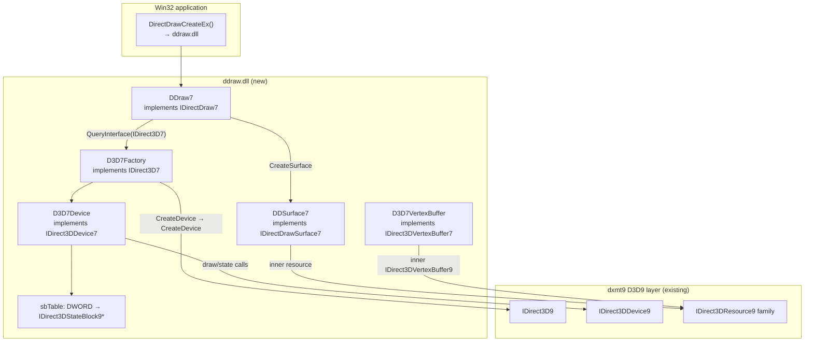
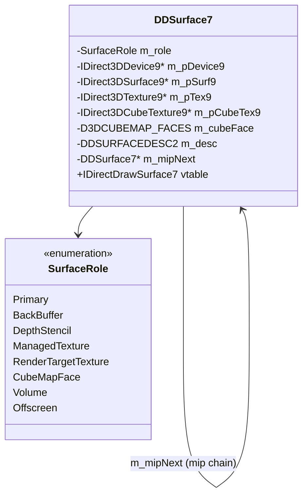
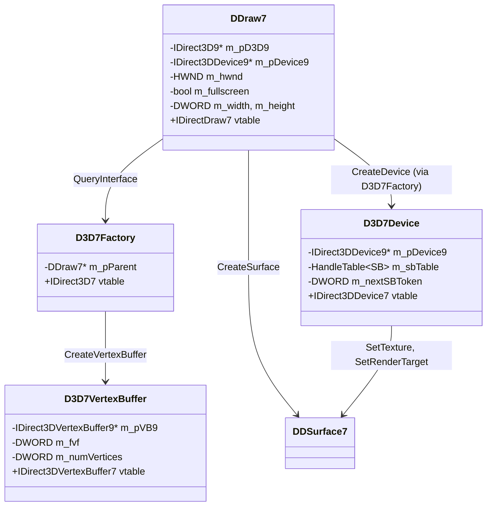
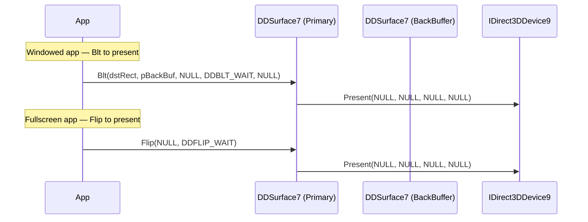

# D3D7 / DirectDraw 7 Layer Spec

---

## 1. Architecture

The D3D7 layer is a translation shim. All GPU work flows through the existing
D3D9 layer. The central design challenge is the `IDirectDrawSurface7` object,
which must play multiple roles (front buffer, back buffer, depth buffer, managed
texture, render-target texture, cube face) depending on the `DDSCAPS2` flags
it was created with.



---

## 2. DDSurface7 — Unified Surface Wrapper

`DDSurface7` is the most complex object in the D3D7 layer. At creation time it
examines the `DDSCAPS2` flags and allocates the appropriate D3D9 resource. After
creation the role is fixed.



### Classification Logic

```cpp
SurfaceRole Classify(const DDSURFACEDESC2& desc) {
    const DWORD caps  = desc.ddsCaps.dwCaps;
    const DWORD caps2 = desc.ddsCaps.dwCaps2;

    if (caps & DDSCAPS_PRIMARYSURFACE)
        return SurfaceRole::Primary;
    if (caps & DDSCAPS_BACKBUFFER)
        return SurfaceRole::BackBuffer;
    if (caps & DDSCAPS_ZBUFFER)
        return SurfaceRole::DepthStencil;
    if (caps2 & DDSCAPS2_CUBEMAP)
        return SurfaceRole::CubeMapFace;
    if (caps2 & DDSCAPS2_VOLUME)
        return SurfaceRole::Volume;
    if (caps & DDSCAPS_TEXTURE) {
        if (caps & DDSCAPS_3DDEVICE)
            return SurfaceRole::RenderTargetTexture;
        if (caps2 & (DDSCAPS2_D3DTEXTUREMANAGE | DDSCAPS2_TEXTUREMANAGE))
            return SurfaceRole::ManagedTexture;
    }
    return SurfaceRole::Offscreen;
}
```

### Resource Allocation per Role

| Role | D3D9 creation call |
|---|---|
| Primary | No resource — delegates Flip/Blt to device Present |
| BackBuffer | GetBackBuffer(0, 0) |
| DepthStencil | CreateDepthStencilSurface(w, h, fmt, NONE, 0, FALSE) |
| ManagedTexture | CreateTexture(w, h, mips, 0, fmt, MANAGED) |
| RenderTargetTexture | CreateTexture(w, h, mips, RENDERTARGET, fmt, DEFAULT) |
| CubeMapFace | CreateCubeTexture(size, mips, 0, fmt, MANAGED) + GetCubeMapSurface |
| Volume | CreateVolumeTexture(w, h, d, mips, 0, fmt, MANAGED) |
| Offscreen | CreateOffscreenPlainSurface(w, h, fmt, SYSTEMMEM) |

---

## 3. Object Model



---

## 4. Render State Mapping

D3D7 render state enum values are numerically different from D3D9 in several
cases. The mapping is implemented as a lookup table computed at compile time.

Key translations required at runtime:

```cpp
D3DRENDERSTATETYPE TranslateRS(DWORD d3d7rs) {
    // Most values are identical — direct pass-through is safe for the common set.
    // Special cases:
    switch (d3d7rs) {
    case 2:   return (D3DRENDERSTATETYPE)0; // ANTIALIAS → ignore
    case 4:   return (D3DRENDERSTATETYPE)0; // TEXTUREPERSPECTIVE → ignore (always on)
    case 11:  return (D3DRENDERSTATETYPE)0; // MONOENABLE → ignore
    case 12:  return (D3DRENDERSTATETYPE)0; // ROP2 → ignore
    case 13:  return (D3DRENDERSTATETYPE)0; // PLANEMASK → ignore
    case 17:  return (D3DRENDERSTATETYPE)0; // ANISOTROPY → ignore (use sampler state)
    case 50:  return (D3DRENDERSTATETYPE)0; // FLUSHBATCH → ignore
    case 51:  return (D3DRENDERSTATETYPE)0; // TRANSLUCENTSORTINDEPENDENT → ignore
    case 138: return (D3DRENDERSTATETYPE)0; // EXTENTS → ignore
    case 153: return (D3DRENDERSTATETYPE)0; // SOFTWAREVERTEXPROCESSING → ignore
    default:  return (D3DRENDERSTATETYPE)d3d7rs; // value-identical in both APIs
    }
}
// Return value 0 means "silently ignore this state" — return DD_OK without calling D3D9.
```

---

## 5. Transform State Mapping

D3D7 transform state constants differ from D3D9 macros for the world matrices:

```cpp
D3DTRANSFORMSTATETYPE TranslateTransform(DWORD d3d7state) {
    switch (d3d7state) {
    case 1: return D3DTS_WORLD;       // D3DTRANSFORMSTATE_WORLD
    case 2: return D3DTS_VIEW;        // same
    case 3: return D3DTS_PROJECTION;  // same
    case 4: return D3DTS_WORLD1;      // D3DTRANSFORMSTATE_WORLD1 = 257 in D3D9 macro
    case 5: return D3DTS_WORLD2;
    case 6: return D3DTS_WORLD3;
    default:
        if (d3d7state >= 16 && d3d7state <= 23)
            return D3DTS_TEXTURE0 + (d3d7state - 16); // texture stages
        return (D3DTRANSFORMSTATETYPE)d3d7state;
    }
}
```

---

## 6. Strided Vertex Packing

`DrawPrimitiveStrided` and `DrawIndexedPrimitiveStrided` provide vertex data in
separate per-component arrays rather than an interleaved buffer. The D3D9 layer
requires a unified buffer. The packing is performed in a temporary heap allocation:

```cpp
std::vector<uint8_t> PackStrided(
    const D3DDRAWPRIMITIVESTRIDEDDATA* pStrided,
    DWORD fvf, DWORD vertexCount)
{
    DWORD stride = ComputeFVFStride(fvf);
    std::vector<uint8_t> buf(stride * vertexCount, 0);

    for (DWORD i = 0; i < vertexCount; i++) {
        uint8_t* dst = buf.data() + i * stride;
        DWORD off = 0;

        if (fvf & D3DFVF_XYZ) {
            memcpy(dst + off, (uint8_t*)pStrided->position.lpvData + i * pStrided->position.dwStride, 12);
            off += 12;
        }
        // ... repeat for NORMAL, DIFFUSE, SPECULAR, TEX0–7 per FVF flag
    }
    return buf;
}
```

The packed buffer is passed directly to `DrawPrimitiveUP` / `DrawIndexedPrimitiveUP`.

---

## 7. Presentation Flow



Both paths call the same `IDirect3DDevice9::Present`. The distinction between
windowed Blt and fullscreen Flip is only in the call site; the Metal presentation
path is identical.

---

## 8. File Layout

```
src/d3d7/
    entry.cpp          DllMain; DirectDrawCreate/Ex; DirectDrawEnumerate stubs
    ddraw7.cpp         DDraw7 — IDirectDraw7 impl
    d3d7factory.cpp    D3D7Factory — IDirect3D7 impl
    device7.cpp        D3D7Device — IDirect3DDevice7 impl, state block table
    surface7.cpp       DDSurface7 — IDirectDrawSurface7 impl, classification, Lock/Unlock/Blt/Flip
    vertexbuffer7.cpp  D3D7VertexBuffer — IDirect3DVertexBuffer7 impl
    rs_map.cpp         TranslateRS / TranslateTransform lookup tables
    pixel_format.cpp   DDPIXELFORMAT → D3DFORMAT parser
    ddraw.def          PE export table
```

---

## 9. PE Bridge Integration

`ddraw.dll` follows the same upstream-DXMT-style `winemetal` bridge model:

```
ddraw.dll  (PE, user-facing, new)
  └── imports winemetal.dll
        └── dispatches to winemetal.so (Wine unix module, Metal backend)
```

`ddraw.dll` does not need to use the provider C ABI directly. It talks to the
Metal backend through the in-process `IDirect3D9` / `IDirect3DDevice9` COM
interfaces already exposed by the D3D9 layer, while `winemetal.dll` remains the
only PE bridge to the unix-side Metal module.

---

## 10. Mip Chain Traversal

When a surface is created with `DDSCAPS_MIPMAP | DDSCAPS_COMPLEX`, the
`IDirectDraw7::CreateSurface` call creates the root mip level and a linked chain
of attached sub-surfaces, each representing the next smaller mip level.

```cpp
// On CreateSurface with mip chain:
// 1. Create IDirect3DTexture9 with dwMipMapCount levels.
// 2. For each mip level i > 0, create a DDSurface7 backed by
//    IDirect3DTexture9::GetSurfaceLevel(i), linked via m_mipNext.
// 3. Root surface's m_mipNext → level-1 wrapper → level-2 wrapper → nullptr.

DDSurface7* DDSurface7::GetAttachedMip() {
    return m_mipNext;  // IDirectDrawSurface7::GetAttachedSurface(DDSCAPS_MIPMAP)
}
```

Each mip-level wrapper holds a reference to the parent texture to prevent
premature destruction.
