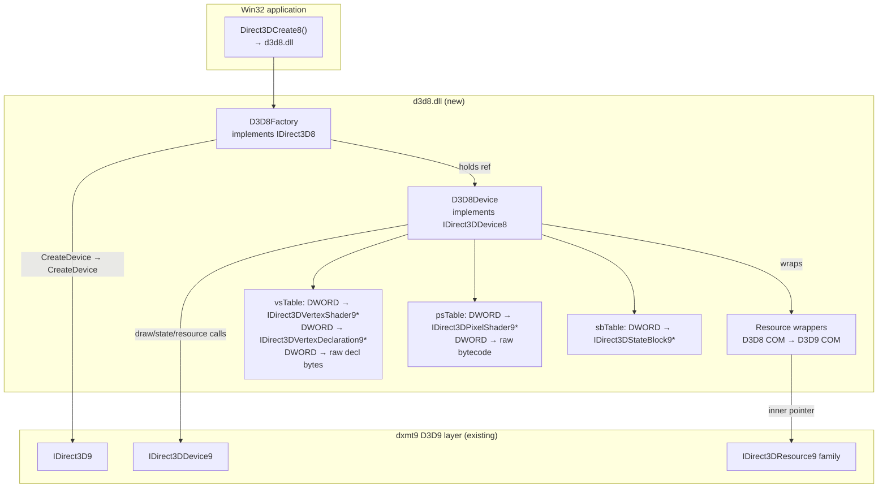
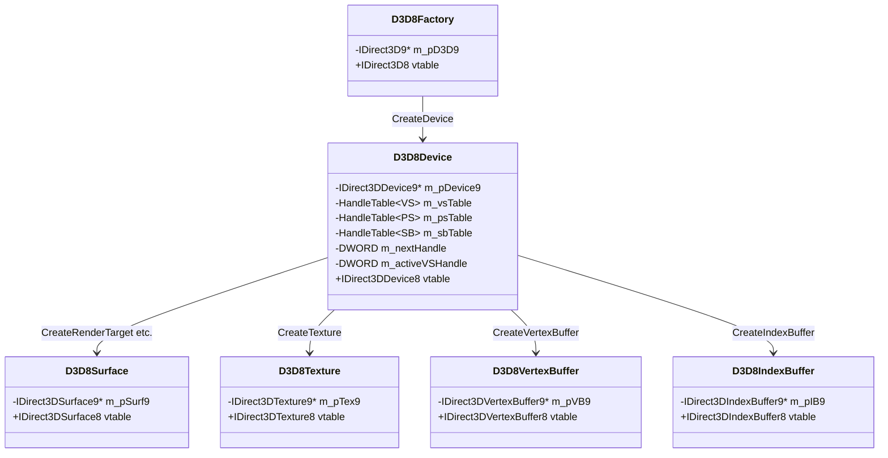
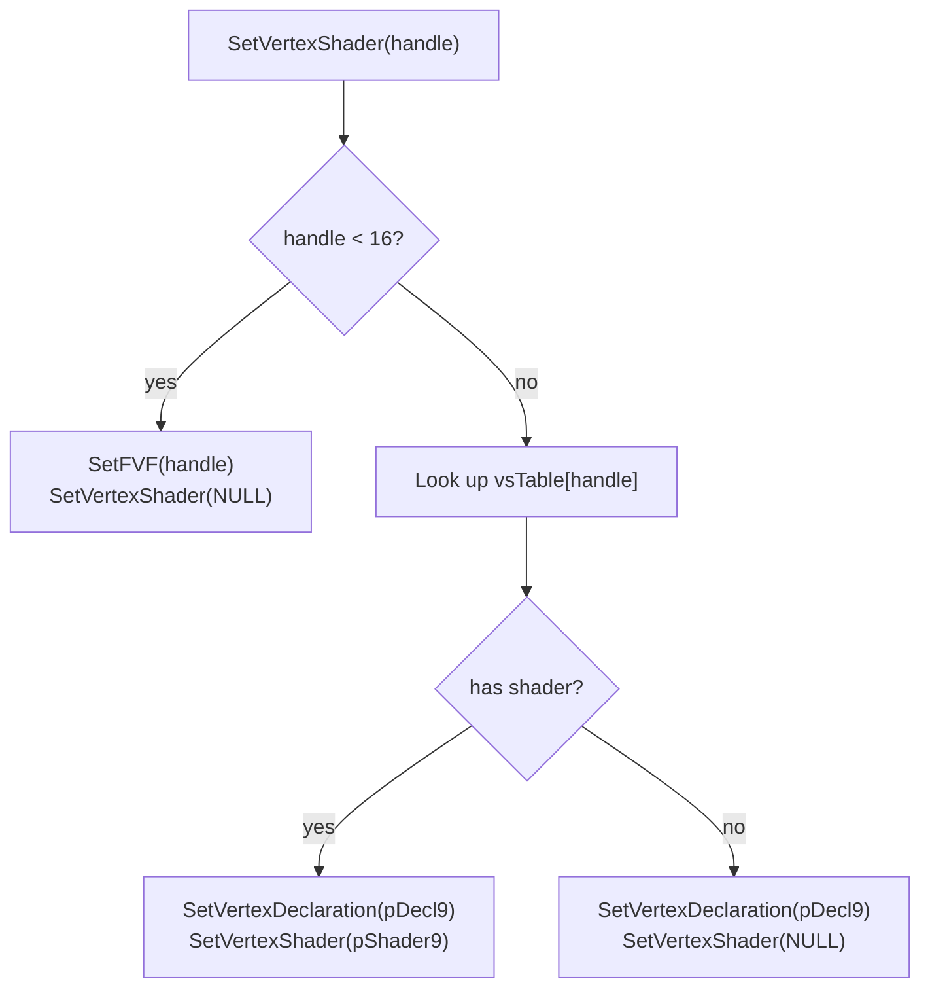

# D3D8 Layer Design

---

## 1. Architecture

The D3D8 layer is a pure translation shim. It never talks to the Metal backend
directly; all GPU work flows through the existing D3D9 layer.



---

## 2. Object Model

Each D3D8 COM object is a thin wrapper around the corresponding D3D9 object.
The wrapper holds a pointer to the inner D3D9 object and exposes the D3D8
vtable. Reference counting is independent: the wrapper's refcount governs its
lifetime; the inner D3D9 object is released when the wrapper is destroyed.



---

## 3. Handle Table

Both the vertex shader table and pixel shader table use the same monotonic
counter starting at `D3DVS_MAXTYPES` (16). This guarantees no handle value
can be confused with an FVF code.

```cpp
struct VSEntry {
    IDirect3DVertexShader9*      pShader9;  // may be nullptr (decl-only)
    IDirect3DVertexDeclaration9* pDecl9;
    std::vector<DWORD>           rawDecl;   // original D3D8 token stream
    std::vector<DWORD>           rawFunc;   // original bytecode
};

struct PSEntry {
    IDirect3DPixelShader9* pShader9;
    std::vector<DWORD>     rawFunc;
};

struct SBEntry {
    IDirect3DStateBlock9* pSB9;
};

class HandleTable {
    std::unordered_map<DWORD, VSEntry> vs;
    std::unordered_map<DWORD, PSEntry> ps;
    std::unordered_map<DWORD, SBEntry> sb;
    DWORD nextHandle = D3DVS_MAXTYPES;

    DWORD alloc() { return nextHandle++; }
};
```

`SetVertexShader` dispatch logic:



---

## 4. Vertex Declaration Parser

The D3D8 declaration token stream is parsed once at `CreateVertexShader` time.
The result is a static `D3DVERTEXELEMENT9[]` stored in the handle table entry.

```cpp
std::vector<D3DVERTEXELEMENT9> ParseD3D8Decl(const DWORD* pDecl) {
    std::vector<D3DVERTEXELEMENT9> out;
    WORD stream = 0;
    WORD offset = 0;

    static const BYTE vsdt_size[] = {4, 8, 12, 16, 4, 4, 4, 8}; // bytes per D3DVSDT_*

    // D3DVSDE_* → (D3DDECLUSAGE, UsageIndex)
    static const struct { BYTE usage; BYTE idx; } vsde_map[] = {
        {D3DDECLUSAGE_POSITION,    0}, // 0 POSITION
        {D3DDECLUSAGE_BLENDWEIGHT, 0}, // 1
        {D3DDECLUSAGE_BLENDINDICES,0}, // 2
        {D3DDECLUSAGE_NORMAL,      0}, // 3
        {D3DDECLUSAGE_PSIZE,       0}, // 4
        {D3DDECLUSAGE_COLOR,       0}, // 5 DIFFUSE
        {D3DDECLUSAGE_COLOR,       1}, // 6 SPECULAR
        {D3DDECLUSAGE_TEXCOORD,    0}, // 7–14 TEX0–7
        {D3DDECLUSAGE_TEXCOORD,    1},
        {D3DDECLUSAGE_TEXCOORD,    2},
        {D3DDECLUSAGE_TEXCOORD,    3},
        {D3DDECLUSAGE_TEXCOORD,    4},
        {D3DDECLUSAGE_TEXCOORD,    5},
        {D3DDECLUSAGE_TEXCOORD,    6},
        {D3DDECLUSAGE_TEXCOORD,    7},
        {D3DDECLUSAGE_POSITION,    1}, // 15 POSITION2
        {D3DDECLUSAGE_NORMAL,      1}, // 16 NORMAL2
    };

    for (; *pDecl != 0xFFFFFFFF; pDecl++) {
        DWORD tok  = *pDecl;
        DWORD type = (tok >> 29) & 0x7;
        if (type == 1) {                    // D3DVSD_STREAM
            stream = tok & 0xFFFF;
            offset = 0;
        } else if (type == 2) {             // D3DVSD_REG
            BYTE vsde  = (tok >> 16) & 0x1F;
            BYTE vsdt  = tok & 0xF;
            D3DVERTEXELEMENT9 e = {
                stream, offset,
                (BYTE)vsdt,                 // D3DVSDT matches D3DDECLTYPE 0–7
                D3DDECLMETHOD_DEFAULT,
                vsde_map[vsde].usage,
                vsde_map[vsde].idx,
            };
            out.push_back(e);
            offset += vsdt_size[vsdt];
        } else if (type == 3) {             // D3DVSD_SKIP
            offset += ((tok & 0xF) + 1) * 4;
        }
        // D3DVSD_CONST tokens ignored (section R-D3D8-4.5)
    }
    out.push_back(D3DDECL_END());
    return out;
}
```

---

## 5. TSS → Sampler State Remapping

A compile-time lookup table drives `SetTextureStageState` / `GetTextureStageState`
dispatch. Only ten indices are redirected; all others pass through unchanged.

```cpp
// Returns the D3DSAMPLERSTATETYPE if this TSS index is a sampler state,
// or 0 if it should remain a TSS call.
static D3DSAMPLERSTATETYPE tss_to_samp(D3DTEXTURESTAGESTATETYPE tss) {
    switch (tss) {
    case 13: return D3DSAMP_ADDRESSU;
    case 14: return D3DSAMP_ADDRESSV;
    case 15: return D3DSAMP_BORDERCOLOR;
    case 16: return D3DSAMP_MAGFILTER;
    case 17: return D3DSAMP_MINFILTER;
    case 18: return D3DSAMP_MIPFILTER;
    case 19: return D3DSAMP_MIPMAPLODBIAS;
    case 20: return D3DSAMP_MAXMIPLEVEL;
    case 21: return D3DSAMP_MAXANISOTROPY;
    case 25: return D3DSAMP_ADDRESSW;
    default: return (D3DSAMPLERSTATETYPE)0;
    }
}

HRESULT D3D8Device::SetTextureStageState(DWORD Stage, D3DTEXTURESTAGESTATETYPE Type, DWORD Value) {
    auto samp = tss_to_samp(Type);
    if (samp)
        return m_pDevice9->SetSamplerState(Stage, samp, Value);
    return m_pDevice9->SetTextureStageState(Stage, Type, Value);
}
```

---

## 6. Present Parameters Translation

```cpp
D3DPRESENT_PARAMETERS9 Translate(const D3DPRESENT_PARAMETERS8& pp8) {
    D3DPRESENT_PARAMETERS9 pp9 = {};
    pp9.BackBufferWidth              = pp8.BackBufferWidth;
    pp9.BackBufferHeight             = pp8.BackBufferHeight;
    pp9.BackBufferFormat             = pp8.BackBufferFormat;
    pp9.BackBufferCount              = pp8.BackBufferCount;
    pp9.MultiSampleType              = pp8.MultiSampleType;
    pp9.MultiSampleQuality           = 0;   // not in D3D8
    pp9.SwapEffect                   = pp8.SwapEffect == D3DSWAPEFFECT_COPY_VSYNC
                                       ? D3DSWAPEFFECT_COPY
                                       : pp8.SwapEffect;
    pp9.hDeviceWindow                = pp8.hDeviceWindow;
    pp9.Windowed                     = pp8.Windowed;
    pp9.EnableAutoDepthStencil       = pp8.EnableAutoDepthStencil;
    pp9.AutoDepthStencilFormat       = pp8.AutoDepthStencilFormat;
    pp9.Flags                        = pp8.Flags;
    pp9.FullScreen_RefreshRateInHz   = pp8.FullScreen_RefreshRateInHz;
    pp9.PresentationInterval         = pp8.FullScreen_PresentationInterval;
    // Upgrade COPY_VSYNC's interval
    if (pp8.SwapEffect == D3DSWAPEFFECT_COPY_VSYNC)
        pp9.PresentationInterval = D3DPRESENT_INTERVAL_ONE;
    return pp9;
}
```

---

## 7. Resource Wrapper Unwrapping

Every D3D8 resource COM pointer passed into the device must be unwrapped to its
inner D3D9 pointer before forwarding. The idiomatic approach is a helper:

```cpp
template<typename D3D8T, typename D3D9T>
D3D9T* Unwrap(D3D8T* p) {
    if (!p) return nullptr;
    // Every D3D8 wrapper derives from a base that exposes GetInner():
    return static_cast<D3D8Wrapper<D3D9T>*>(p)->GetInner();
}
```

All `IDirect3DSurface8*`, `IDirect3DTexture8*`, `IDirect3DVertexBuffer8*`, and
`IDirect3DIndexBuffer8*` parameters must be unwrapped before the delegate call.

---

## 8. File Layout

```
src/d3d8/
    entry.cpp        DllMain; Direct3DCreate8; ValidatePixelShader stub
    factory.cpp      D3D8Factory — IDirect3D8 impl, delegates to IDirect3D9
    device.cpp       D3D8Device — IDirect3DDevice8 impl, handle tables
    shader.cpp       ParseD3D8Decl; tss_to_samp table
    resources.cpp    D3D8Surface/Texture/VB/IB/CubeTexture/VolumeTexture wrappers
    d3d8.def         PE export table
```

---

## 9. PE Bridge Integration

`d3d8.dll` follows the same upstream-DXMT-style `winemetal` bridge model as the
D3D9 PE layer:

```
d3d8.dll  (PE, user-facing)
  └── imports winemetal.dll
        └── dispatches to winemetal.so (Wine unix module, Metal backend)
```

`d3d8.dll` is built with the same `llvm-mingw` cross-compile setup used for
`d3d9.dll`. It may use the same provider C ABI exposed through `winemetal.dll`
if needed, but in practice it should delegate through the in-process
`IDirect3D9` / `IDirect3DDevice9` COM interfaces exposed by the D3D9 layer.
