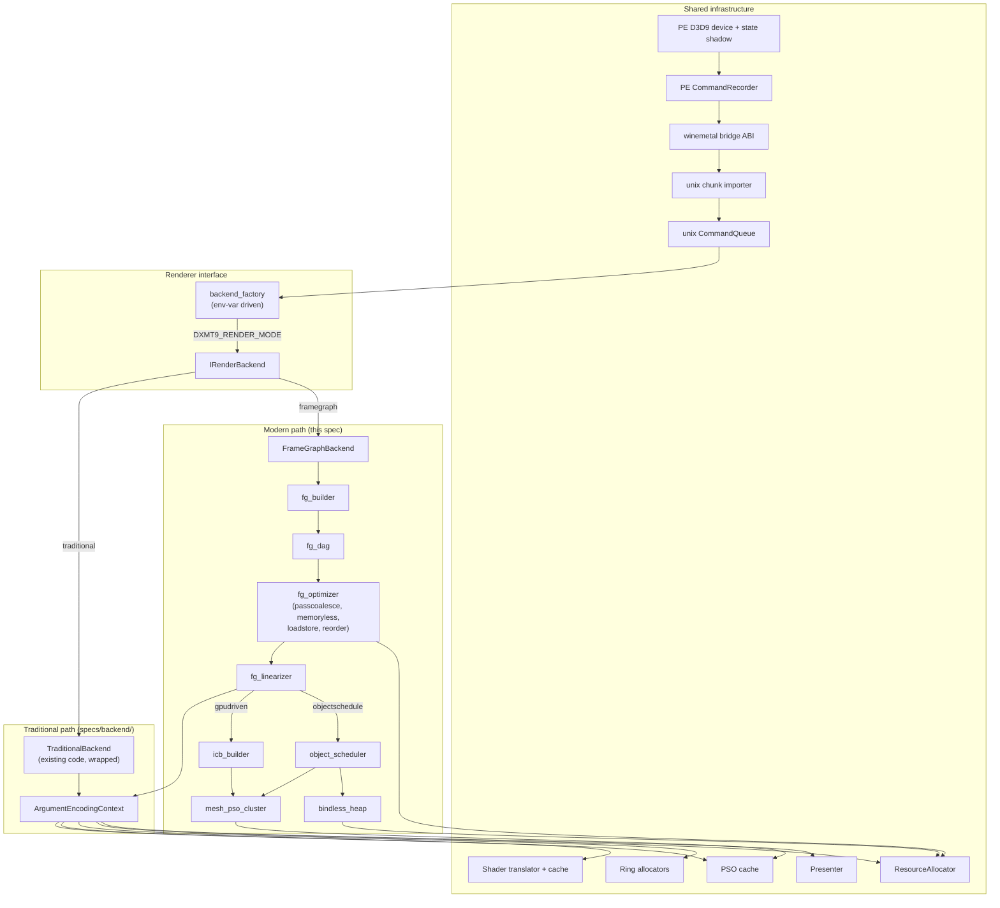

# D3D9 Renderer (Modern Path) Spec

This document describes the implementation shape of the modern renderer
required by `requirements.md`. It defines module structure, data shapes, the
optimizer pipeline, the object/mesh shader pipeline, the bindless heap, the
ICB execution path, and the rollout staging. It does not duplicate
contract-level statements; every "must" lives in `requirements.md` and is
referenced here by `R-BACK-N.M`.

The design assumes the modern path runs **inside the existing unix-side
CommandQueue**, consumes the same `CommandChunk` records the traditional path
consumes (`specs/backend/spec.md` §4-§5), and shares the PSO cache, ring
allocators, shader translator, presenter, and completion fence layer.

---

## 1. Module Structure



### 1.1 Filesystem layout

```
src/dxmt9/
  render/
    backend_interface.hpp           # IRenderBackend (R-BACK-30.5)
    backend_factory.{hpp,cpp}       # env resolution + construction (R-BACK-31.1, R-BACK-31.6)
    traditional_backend.{hpp,cpp}   # wraps existing flow as IRenderBackend
    framegraph_backend.{hpp,cpp}    # modern entry point

  framegraph/
    fg_dag.{hpp,cpp}                # PassNode, ResourceNode, Edge, FrameGraph
    fg_builder.{hpp,cpp}            # chunk-record → DAG
    fg_optimizer/
      dce.cpp                       # dead-pass elimination
      lifetime.cpp                  # resource lifetime
      memoryless.cpp                # R-BACK-33
      passcoalesce.cpp              # R-BACK-34
      loadstore.cpp                 # store action selection
      reorder.cpp                   # dependency-respecting reorder
    fg_linearizer.{hpp,cpp}         # DAG → ordered call sequence
    fg_debug_export.{hpp,cpp}       # DAG → JSON/.dot/mermaid debug artifact (R-BACK-39.7)

  gpudriven/
    object_scheduler.{hpp,cpp}      # CPU side; emits mesh dispatches
    object_shader.metal             # GPU side; cull + batch + ICB emit
    mesh_pso_cluster.{hpp,cpp}      # PSO clustering and promotion
    mesh_shader_lib.metal           # shared mesh shader utilities
    bindless_heap.{hpp,cpp}         # texture/sampler heap, per-frame dedupe
    icb_builder.{hpp,cpp}           # ICB lifecycle + sub-pass split
```

No file under `src/d3d9/` or `src/winemetal/` changes. Bridge ABI is unchanged
per `R-BACK-30.6`.

### 1.2 Test layout

```
tests/native/
  render/
    backend_interface_spec.cpp      # factory selection, fallback rules
    parity_harness_spec.cpp         # R-BACK-39.1 framework primitives
  framegraph/
    fg_dag_spec.cpp                 # DAG invariants, deterministic construction
    fg_builder_spec.cpp             # chunk-record → DAG mapping
    fg_optimizer_spec.cpp           # per-pass golden outputs
    fg_linearizer_spec.cpp          # call sequence golden
    fg_debug_export_spec.cpp        # golden JSON snapshot; side-effect-neutral (R-BACK-39.7)
  gpudriven/
    object_scheduler_spec.cpp       # cull, batch, dispatch shape
    mesh_pso_cluster_spec.cpp       # cluster picking, promotion
    bindless_heap_spec.cpp          # dedupe, overflow, demote
    icb_builder_spec.cpp            # subpass split, capacity
```

Test specs follow the existing `tests/native/backend/` conventions:
deterministic input, asserted Metal calls, no MTLDevice required.

---

## 2. IRenderBackend Interface

```cpp
namespace dxmt9::render {

enum class BackendMode { Traditional, FrameGraph };

struct BackendCaps {
  bool supports_mesh;             // Metal 3 + macOS 14+
  bool supports_icb;
  bool supports_argbuf_tier2;
  uint32_t max_mesh_threadgroup;
};

class IRenderBackend {
public:
  virtual ~IRenderBackend() = default;

  // Lifecycle
  virtual void onDeviceCreated(const DeviceContext&) = 0;
  virtual void onDeviceDestroyed() = 0;
  virtual void onFrameBegin(uint64_t frame_id) = 0;
  virtual void onFrameEnd() = 0;

  // Logical source consumer (R-BACK-30.2, R-BACK-32.1)
  virtual void onSourceReady(SourcePayloadView source, ImportContext& ctx) = 0;

  // Resource hooks (memoryless classifier needs these)
  virtual void onSurfaceLock(SurfaceHandle, LockFlags) = 0;
  virtual void onSurfaceRead(SurfaceHandle, ReadKind) = 0;
  virtual void onSurfaceCrossFrameUse(SurfaceHandle) = 0;

  // Introspection
  virtual BackendMode mode() const = 0;
  virtual void emitCounters(CounterSink&) const = 0;
};

}  // namespace dxmt9::render
```

`backend_factory::create(EnvContext)` resolves `DXMT9_RENDER_MODE`, validates
the feature dependency graph from `R-BACK-31.4`, and returns either
`TraditionalBackend` or `FrameGraphBackend`. Construction failures fall back
to `TraditionalBackend` with a single warning. The factory is called once at
`onDeviceCreated`; the returned backend is owned by `CommandQueue` per
`R-BACK-31.7`. An unset mode resolves to `FrameGraphBackend`; its unset profile
and feature list resolve to `progressive + passcoalesce`. Explicit
`traditional`, `strict`, or an empty/`0` feature list preserve the rollback
paths from R-BACK-30.1.

`TraditionalBackend` is a thin adapter over the existing `CommandQueue`
encoding flow; its implementation is a forwarding shim that does not change
any existing call sites.

### 2.1 Implementation name mapping (spec concept → code symbol)

This spec and `specs/backend/spec.md` use conceptual names that do **not**
exist as code symbols. The implementation maps them onto the existing
data-oriented encode path, which is already function-separated (so the §15
"split" is interface introduction, not a class refactor):

| Spec concept | Actual code symbol | Location |
|---|---|---|
| `ArgumentEncodingContext` (AEC) | `encoders::EncodeContext` (a view bundle, **not** a stateful class) + the free functions `encoders::beginRenderPass` / `encodeDraw` / `encodeChunk` | `src/dxmt9/dxmt9_draw_encoder.{hpp,mm}` |
| `SourcePayloadView` | `core::SourcePayloadView`, an immutable borrowed logical-source view. The legacy adapter wraps one `core::ChunkSlot`; the Arena adapter resolves one complete packed payload-block chain without exposing page pointers. | `src/dxmt9/dxmt9_source_payload.{hpp,cpp}` |
| `ImportContext` / the source-ready hook | `render::IRenderBackend::onSourceReady` carries one `core::SourcePayloadView` plus source identity and encode-session context. The `onChunkReady` compatibility adapter constructs the same logical view from a legacy `ChunkSlot`. | `src/dxmt9/render/backend_interface.hpp`, `src/dxmt9/render/{traditional_backend,framegraph_backend}.cpp` |
| AEC "encoder lifecycle" vs "draw emission" split (§15) | already distinct functions: `beginRenderPass` (open) / `encodeDraw` (+ a clear-within-pass) (emit) / `endEncoding` (close) | `src/dxmt9/dxmt9_draw_encoder.mm` |
| `IExternalDrawEmitter` | new interface wrapping `encoders::encodeDraw` + a clear emitter; `endEncoding`/`beginRenderPass` stay caller-owned | new `src/dxmt9/render/` |
| DAG observe + export side-channel (R-BACK-39.7) | `render::DagObserver` — a shared, backend-agnostic observer owned by both `TraditionalBackend` and `FrameGraphBackend`; `onSourceReady` invokes `observer_.observeAndExport(payload, seqId, aliasResolver)` with the same logical `SourcePayloadView` consumed by replay. It carries the owning backend's resolved `framegraph::OptimizerOptions` (default/all-off for traditional) plus the encode-thread-local `observe_frame_` counter. | `src/dxmt9/render/dag_observer.{hpp,cpp}` |

The target Frame Graph backend consumes `SourcePayloadView`, not the PE-side
`D9CCommandRecord*` wire records. The legacy adapter resolves the same
`ChunkSlot.commandHeaders` input that `encoders::encodeChunk` consumes; the
Arena adapter resolves the equivalent ordered command stream across the
source's packed block chain. Both adapters expose stable
`(retainedSourceIndex, commandIndex)` attribution and call-local typed record
resolution. The view owns no payload: queue storage remains pinned through the
source completion contract in `specs/backend/encode-scheduling/requirements.md`.

---

## 3. Frame Graph Data Structures

### 3.1 PassNode

```cpp
enum class PassKind { Render, Compute, Blit, Present, Sync };

struct AttachmentSet {
  std::array<TextureHandle, 8> color;
  TextureHandle depth;
  uint32_t color_count;
};

struct DrawRange { uint32_t first; uint32_t count; };

struct PassNode {
  PassKind kind;
  AttachmentSet targets;
  DrawRange draws;             // indices into FrameGraph::draws
  StateProfile state;          // dominant PSO/state hash (for merge)
  LoadStorePolicy load_store;  // updated by optimizer
  Flags flags;                 // contains_lock, contains_query, etc.
};
```

### 3.2 ResourceNode

```cpp
enum class ResidencyClass { Persistent, MemorylessCandidate, Memoryless };

struct AccessLog {
  uint32_t pass_index;
  uint8_t  access_kind;        // read|write|read_write|preserve|clear
  uint8_t  stage;              // vertex|fragment|compute|copy
};

struct ResourceNode {
  ResourceHandle handle;
  Vector<AccessLog> accesses;  // chronological
  uint32_t first_use_pass;
  uint32_t last_use_pass;
  ResidencyClass residency;
  uint8_t  classifier_flags;   // lock_seen, readback_seen, cross_frame_seen
};
```

### 3.3 DrawDescriptor

Sized at D3D9 caps so the mesh-eligibility test in `R-BACK-35.3` is a cap
check, not an under-sized descriptor fallback. Layout consumed by both
CPU-side scheduler and GPU-side object shader / mesh shader:

```cpp
struct alignas(16) DrawDescriptor {
  uint32_t pso_id;                     // index into per-pass PSO table
  uint16_t topology;                   // L2/L3 landing: only D3DPT_TRIANGLELIST honored
  uint16_t flavor;                     // 0 = indexed (L2/L3 default; future may
                                       //     extend to TRIANGLESTRIP/FAN),
                                       // 1 = non-indexed DrawPrimitive (future, §16)

  // ─── D3D9 DrawIndexedPrimitive contract (flavor=0) ───
  // From IDirect3DDevice9::DrawIndexedPrimitive(PrimType, BaseVertexIndex,
  //   MinVertexIndex, NumVertices, StartIndex, PrimCount):
  uint64_t ib_pointer;                 // device pointer to IB buffer
  uint32_t ib_format;                  // 16 or 32 bit indices
  uint32_t start_index;                // D3D9 StartIndex (offset into IB, in indices)
  int32_t  base_vertex_index;          // D3D9 BaseVertexIndex (signed; added to each
                                       //   fetched index before VB lookup)
  uint32_t min_vertex_index;           // D3D9 MinVertexIndex (VB extent lower bound;
                                       //   informational hint to mesh shader for
                                       //   VB residency / register pressure)
  uint32_t num_vertices;               // D3D9 NumVertices  (VB extent length)

  // ─── D3D9 DrawPrimitive contract (flavor=1; future expansion) ───
  uint32_t start_vertex;               // D3D9 StartVertex (ignored at L2/L3 landing)

  // ─── Common (both flavors) ───
  uint32_t prim_count;                 // D3D9 PrimitiveCount; for TRIANGLELIST,
                                       //   index/vertex count = prim_count * 3.
                                       //   Dispatch sizing must use this field,
                                       //   not a derived ib_count.

  // D3D9 MaxStreams = 16 (specs/d3d9/caps/)
  uint64_t vb_pointers[16];            // device pointers; 0 = unbound
  uint32_t vb_strides[16];
  uint32_t vb_offsets[16];

  uint64_t vs_cb_pointer;
  uint64_t ps_cb_pointer;

  // D3D9 sampler stages: 16 PS + 4 VS = 20
  // R-BACK-37.1: slot fields must address heap caps R-BACK-37.3
  // (4096 textures, 1024 samplers default). uint8_t is disallowed.
  uint16_t texture_indices[20];        // bindless heap indices; 0xFFFF = unbound
  uint16_t sampler_indices[20];        // bindless heap indices; 0xFFFF = unbound

  // R-BACK-37.1 batching predicate hash. Stable canonical hash over the
  // active texture+sampler binding set; consumed by object shader
  // R-BACK-35.6 batching decision without re-walking the slot arrays.
  uint64_t bindless_key_hash;

  uint32_t render_state_packed;

  // Bounding box used by R-BACK-35.5 conservative frustum cull.
  // OPTIONAL: a CommandChunk does not carry app-side bbox hints today and
  // R-BACK-30.6 forbids changing the PE recording shape to add them.
  // When bbox is unknown, set bbox_min = {-INF, -INF, -INF} and
  // bbox_max = {+INF, +INF, +INF} (the "no bbox" sentinel), or set
  // flags.bbox_valid = 0. The object scheduler must treat any draw
  // without a valid bbox as "never cull" — frustum cull becomes a no-op
  // for that draw and the win is opportunistic.
  //
  // bbox sources (allowed at L2/L3, none mandatory):
  //   - per-app hint table keyed by VB+IB hash (catalogue-listed),
  //   - explicit `DXMT9_RENDERER_BBOX_SOURCE=vb_scan` opt-in that scans
  //     mapped VB content on the encode thread (expensive; off by default),
  //   - mesh PSO cluster-level static bbox annotations.
  // Guessing a bbox without one of these sources is forbidden because
  // an under-sized bbox would silently drop visible draws.
  float    bbox_min[4];                // 4th lane = padding; INF = "no bbox"
  float    bbox_max[4];

  uint32_t flags;                      // ffp / indexed / culled /
                                       // fallback / batch_eligible (R-BACK-35.6)
                                       // bbox_valid (new; clear when bbox is INF)
  uint32_t _padding[1];                // align to 16
};
// sizeof ≈ 388 B; exact size enforced by static_assert at L0 landing.
```

Notes:
- VB stream count fields size at the D3D9 `MaxStreams=16` cap; ineligible
  streams use `vb_pointers[i] = 0`.
- Texture / sampler index fields size at the full D3D9 stage cap of 20
  (16 PS + 4 VS); ineligible stages use the sentinel values above.
- `flags.batch_eligible` is set by the CPU-side optimizer only when the
  draw passes every R-BACK-35.6 batching predicate; the object shader uses
  this single bit instead of re-evaluating the predicate on the GPU.
- At ~388 B / descriptor and GT1 frame-120 baseline (~913k draws / frame)
  the worst-case descriptor traffic projects to ~338 MiB. The CPU-side
  optimizer must allocate per-pass slices (not per-frame monoliths) and
  rely on DCE / `passcoalesce` (§5) to shrink the working set before mesh
  routing engages on the hot rows. Memory budget is tracked in §15 open
  questions.

CPU writes descriptors into a per-pass ring allocator slice. Object shader
reads them as a structured buffer.

### 3.4 FrameGraph container

```cpp
struct FrameGraph {
  Vector<PassNode> passes;
  Vector<ResourceNode> resources;
  Vector<Edge> edges;                 // (src_pass, dst_pass, resource)
  Vector<DrawDescriptor> draws;
  uint64_t frame_id;
  Flags flush_boundary;               // R-BACK-32.4
};
```

The DAG is rebuilt every frame. Inter-frame reuse is limited to the
ResourceNode pool (`memoryless_candidate` carries forward); pass and edge
storage is reset.

### 3.5 DAG Debug Export (R-BACK-39.7)

`framegraph/fg_debug_export.{hpp,cpp}` serializes a `FrameGraph` to a
development-only artifact. It is a **pure read transform** over the
in-memory DAG — it takes a `const FrameGraph&` plus the caller-supplied
source `seqId`, global `sourceOrdinal`, and `stage` label (the `FrameGraph`
carries `frame_id` but not queue completion identity)
and returns owned bytes; it holds no Metal, queue, cache, or pool
reference, so it cannot perturb the state R-BACK-39.7 requires it to
leave untouched.

Every command-level diagnostic key is source-qualified. A `commandIndex` is
meaningful only together with `sourceOrdinal` or the generation-checked source
ID; payload block and segment indices may be reported as storage detail but are
never used as replay or completion identity.

The shared `render::DagObserver` (§2.1; `render/dag_observer.{hpp,cpp}`) drives
this at two points when `DXMT9_RENDERER_DUMP_DAG` is set: once right after
`fg_builder` finishes (`stage="pre-opt"`) and once right after the optimizer
pipeline finishes (`stage="post-opt"`). Emitting both lets a reader diff exactly
what `dce` / `passcoalesce` / `memoryless` / `reorder` / `loadstore` changed.

**Post-opt optimizer override (`DXMT9_RENDERER_DUMP_DAG_OPTIMIZE`, R-BACK-39.7).**
The `post-opt` snapshot honors an analysis-only override: when
`DXMT9_RENDERER_DUMP_DAG_OPTIMIZE` is set, the observer's `post-opt`
`runOptimizer` uses the `OptimizerOptions` parsed from that comma-token list
(`framegraph::dumpDagOptimizeOverride().value_or(options_)`) instead of the
backend's `options_`. The `pre-opt` snapshot is left unchanged — it stays the
un-optimized builder baseline — so the `pre`/`post` diff equals what the
chosen passes did (e.g. a device-gated "what would `passcoalesce` do" run on a
3DMark05 frame). Because `DagObserver` never drives the Metal encode, the
override cannot change rendered output; it is independent of
`DXMT9_RENDERER_FEATURES` / `compat_profile` (which gate the production encode)
because it is purely an observe-side analysis selector. The same
`value_or(options_)` wiring lives in all three post-opt sites
(`observeAndExport`, `observeAndExportDagToDir`,
`observeAndExportDagToDirForFrame`), so the env override and the test seams
behave identically.

The dump is a **backend-agnostic perf/debug side-channel, not an encode input**
(R-BACK-39.7). The same `render::DagObserver` is owned by both backends — each
holds a `DagObserver observer_` member and calls
`observer_.observeAndExport(payload, seqId, aliasResolver)` from
`onSourceReady` before delegating to source replay. Which backend
encodes is irrelevant to the observation: on `traditional` the observer is
constructed with default (all-off) `OptimizerOptions{}`, so the observed
post-opt DAG reflects the order-preserving baseline while the traditional encode
path stays unchanged and byte-identical; on `framegraph` the observer carries
that backend's resolved feature options. The path is gated purely on
`DXMT9_RENDERER_DUMP_DAG` — with the dump dir unset `observeAndExport` returns
after one cached-optional check, so the default render path on either backend
pays no observe cost and emits the identical Metal stream. The export itself
(`serializeDagJson` / `writeDagDump`) records the small `framegraph_*` perf
counters; those are process-global atomics that no-op unless `DXMT_PERF_COUNTERS`
is set, keeping the channel observation-only.

JSON is the primary format (one object per logical source):

```json
{
  "frame_id": 60,
  "source_ordinal": 73,
  "source_seq_id": 1422,
  "stage": "post-opt",
  "passes": [
    { "index": 0, "kind": "Render",
      "color": ["0x...:rt0"], "depth": "0x...:ds",
      "draws": { "first": 0, "count": 187 },
      "state_profile": "0x...",
      "load_store": { "color": ["Clear/Store"], "depth": "Clear/Store" } }
  ],
  "resources": [
    { "handle": "0x...", "residency": "Persistent",
      "first_use_pass": 0, "last_use_pass": 2,
      "accesses": [ { "pass": 0, "kind": "write", "stage": "fragment" },
                    { "pass": 2, "kind": "read",  "stage": "fragment" } ] }
  ],
  "edges": [ { "src_pass": 0, "dst_pass": 2, "resource": "0x..." } ]
}
```

The `resources[].accesses` log and the `edges` set are the pass/resource-level
producer→consumer surface the render-pass re-entry investigation needs: an
`A → B → A` attachment re-entry appears as two edges sharing the same
`resource` with `src_pass` alternating, directly readable from the JSON.

**Optional per-draw D3D9 detail (`DXMT9_RENDERER_DUMP_DAG_DRAWS`, L1-debug).**
A pass node may carry a `draws_detail` array (one entry per draw-call ordinal in
its `DrawRange`) when the export is given the source `SourcePayloadView` AND
`DXMT9_RENDERER_DUMP_DAG_DRAWS` is set. The view is threaded through as an
OPTIONAL parameter: `buildSnapshot(fg, seq, stage, source=nullptr)`,
`serializeDagJson(fg, seq, stage, source=nullptr)`, and
`writeDagDump(fg, frame, seq, stage, source=nullptr)` all default the view to
`nullptr`; `render::DagObserver` passes the represented source view, while the
pure FrameGraph-only overloads (and the device-free golden tests) pass none.
During migration the legacy adapter supplies the current `ChunkSlot`-backed
view. When the view is null or the flag is off, no draw is resolved (zero extra cost)
and the JSON is byte-identical to the shape above — so `draws_detail` is
strictly additive and off by default. When both are present, `buildSnapshot`
walks each pass's `DrawRange → FrameGraph.draws[i]` (a source-qualified
`DrawRef`) → `source.drawRunCommandAt(command_index)` and copies a BOUNDED
hot-state summary:

```json
"draws_detail": [
  { "command_index": 0, "draw_ordinal": 0,
    "primitive_type": 3, "primitive_count": 5,
    "vs_hash": "0x111", "ps_hash": "0x222", "texture_mask": 1,
    "alpha_blend": 1, "z_enable": 1, "z_write": 0, "z_func": 4,
    "alpha_test": 0, "cull": 0, "stream0_stride": 32 }
]
```

Field sources (no geometry bytes are decoded): `primitive_type`/
`primitive_count` from the per-ordinal `core::DrawParam`; `vs_hash`/`ps_hash`
from the `core::DrawDebugSnapshot` (the same hashes the 3DMark05 indexed-probe
CSV reports); `texture_mask` / `stream0_stride` from the
`core::FlatDrawStateRecord`; and the render states via `core::flatStateOr` on
the hot `FlatStateSet` (`RS_*` ids, with the encoder's `DrawDebugRecord`
defaults). `resolveDumpDagDraws(env)` is the pure resolver and `dumpDagDraws()`
reads the env once (static-const, mirroring `dumpDagDir()`). This is the SAME
side-effect-neutral read transform as the rest of §3.5: it is **L1-debug only**
and is NOT the deferred L2 production `DrawDescriptor` of §3.3 (per-draw
geometry / bindless bindings for the mesh / GPU-driven path), which stays a
separate, deferred production data structure.

`DXMT9_RENDERER_DUMP_DAG_FORMATS` (comma list, default `json`) selects
additional human-visual renderings beside the JSON. Both extra formats
consume the same `DagSnapshot` struct the JSON path builds — neither
re-walks the DAG:

- `dot` — Graphviz: passes as nodes, resource edges as labeled arcs.
- `mermaid` — a `flowchart TD` of the same nodes/edges. This is the
  preferred form: `docs/perfomance/` and these specs already render Mermaid
  inline, so a dumped pass/resource graph pastes straight into a leaf doc
  with no Graphviz install. A re-entry shows as two edges sharing a
  `resource` arriving at the same later pass:

  ```mermaid
  flowchart TD
    P0["pass0 Render · rt0,ds · draws 0..187"]
    P2["pass2 Render · rt0,ds · draws 240..260"]
    P0 -->|"0x..:rt0"| P2
    P0 -->|"0x..:ds"| P2
  ```

Output path: `DXMT9_RENDERER_DUMP_DAG` is a directory; files are named
`dag-frame<frame_id>-source<ordinal>-seq<seq>-<stage>.{json,dot,mermaid}` per selected
format. The exporter never creates the directory implicitly and skips
silently (single warning, once) if the path is unwritable, so a dump
misconfiguration cannot fail a render.

**Per-frame source filter (`DXMT9_RENDERER_DUMP_DAG_FRAME`).** Because a real
app emits thousands of logical sources per frame, the shared `render::DagObserver`
carries a private inter-present frame counter `observe_frame_` (1-based). It is
touched only on the encode thread (`observeAndExport` is the single writer), so
it needs no atomic. A "frame" is the inter-present interval: every source belongs
to the current `observe_frame_`, and a source that **contains** a Present is the
last source of that frame, so `observe_frame_` advances *after* processing it.
The advance happens whether or not the source was dumped, so all of frame N's
sources dump before the counter moves to N+1. During migration the legacy view
implements this test with `chunkContainsPresent(slot)`.

`framegraph::resolveDumpDagFrame(env)` resolves `DXMT9_RENDERER_DUMP_DAG_FRAME`
to `std::optional<u64>`: nullptr / empty / `"0"` / non-numeric → `nullopt`
("dump every chunk", the historical behavior); a positive decimal → that
frame. `dumpDagFrame()` reads the env once with the same static-const pattern
as `dumpDagDir()`.

**Window radius (`DXMT9_RENDERER_DUMP_DAG_FRAME_RADIUS`).** The single-frame
target may be widened to a ±radius window.
`framegraph::resolveDumpDagFrameRadius(env)` resolves the env to a `u64`:
nullptr / empty / `"0"` / non-numeric → `0` (single frame); a positive decimal
→ that radius `R`. `dumpDagFrameRadius()` reads the env once with the same
static-const pattern. The membership test is the file-local helper
`frameInDumpWindow(frame, target, radius)` in `dag_observer.cpp`: a chunk
dumps when `observe_frame_` is in the inclusive window
`[max(1, target-radius), target+radius]`. The low end is clamped at `1`
(inter-present frames are 1-based, so a wide radius never selects `frame 0`),
and `radius == 0` degenerates to the original `frame == target` test. The radius
is honored only when a target frame is set; an unset target still dumps every
chunk.

When the source's observe frame is outside the window, `observeAndExport`
runs only the Present scan, advances the counter if a Present was seen, and
returns **before** building the FrameGraph — so a filtered-out chunk costs no
build / optimizer / serialize / write work, and the counter still advances so
the window is reached and then left correctly. The
`frame_id` passed to `writeDagDump` (and stamped into the filename and JSON) is
`observe_frame_`, the inter-present frame number, so filenames read
`dag-frame<N>-source<ordinal>-seq<seq>-<stage>.json` meaningfully; the JSON keeps
both `source_ordinal` and `source_seq_id`. The frame-filter path is exercised device-free by
`framegraph_observe_spec.cpp` through the testable
`observeAndExportDagToDirForFrame(slot, dir, targetFrame, radius)` seam (which
takes the resolved target frame + radius as arguments, bypassing the static env
caches) plus direct `resolveDumpDagFrame` / `resolveDumpDagFrameRadius` /
`chunkContainsPresent` assertions.

`fg_debug_export` emits no `framegraph_*` counter and is excluded from the
parity harness (R-BACK-39.1): an enabled dump must produce a byte-identical
Metal stream to a disabled run, which the parity gate verifies by running
with the dump off.

---

## 4. Frame Graph Builder

### 4.1 Logical source → DAG mapping

The builder runs on the unix-side encode thread and operates on **one logical
`SourcePayloadView` at a time** per `R-BACK-32.1`. The legacy adapter presents
one `CommandChunk`; the Arena adapter presents the complete ordered payload-block
chain of one source. Each source-ready invocation builds a fresh `FrameGraph`
over exactly that view. Segment boundaries do not finalize the graph or create
additional completion sources. The opt-in R-BACK-32.10 scheduler may retain one
source and inspect an immutable summary for its already-ready immediate FIFO
successor. R-BACK-32.11 permits a future bounded ready-prefix summary. Those DCE
summary paths do not merge records, passes, or edges across logical sources.
Separately, the `R-BACK-2.43` EncodeSession planner may build one bounded call-
local composite graph from complete retained source DAGs, with every command
kept source-qualified; only its planning graph and replay order combine, never
payload ownership or completion identity. The queue remains the only ready-
prefix owner. The source's
`completedSeqId` advances exactly once after its session tail completes;
FrameGraph replay and diagnostics retain `(retainedSourceIndex, commandIndex)`
attribution without turning command or block boundaries into completion
boundaries. The mapping is small and explicit:

| Chunk record kind | Builder action |
|---|---|
| `SetRenderTarget`/`SetDepthStencilSurface` | If no current pass or attachments differ, finalize current pass and start new `PassNode`. |
| `Clear` | Update the pending `LoadStorePolicy`; if no current pass, force one. |
| `Draw*` | Emit `DrawDescriptor`; append to current `PassNode.draws`. |
| `SetTexture`/`SetSampler`/`SetVertexShader`/`SetPixelShader` | Update current pending state; persisted into the next `DrawDescriptor`. |
| `BeginQuery`/`EndQuery` | Legacy/compatibility view only: edge to the current pass and record into `PassNode.flags`. Arena admission emits an ordered non-payload Query disposition until canonical sizing exists. |
| `Present` | Finalize current pass, emit `PassNode`, record a Read of the canonical present source, and mark the frame boundary. The source view owns the record and backbuffer identity; the Presenter owns drawable acquisition and pacing at linearization. |
| `LockRect`/`UnlockRect` (deferred record) | Force flush boundary per `R-BACK-32.4`. |
| `StretchRect` | Either fuse into pass (same source/dest pass) or emit `PassNode`. |
| `SetMarker` (debug) | Annotate pass; ignored by optimizer. |

The builder is a single forward pass; no lookahead is required for DAG
construction. `SourcePayloadView` resolves each typed record only for the
duration of that forward step; the graph stores the source-qualified command
locator and never a page pointer. Lookahead happens in the optimizer phase
(§5). Readback and `UpdateTexture`, like Arena Query, remain ordered non-payload
control/compatibility dispositions and therefore are not builder inputs until
their canonical Arena layouts are specified.

### 4.2 Dependency edge inference

The edge set is a **hazard model**, not merely producer→consumer: it must
capture **true (RAW), anti (WAR), and output (WAW)** dependencies. This is a
correctness requirement, not analysis convenience — the edge-consuming
optimizer passes `reorder` (§5.6 topological sort over the edge set) and
`passcoalesce` (§5.4 intervening-pass relocation, decided by reachability over
the edge set) would otherwise legally move a write before a prior read (WAR) or
swap two writes to the same resource (WAW) and corrupt frame contents
(R-BACK-32.9). Every edge points `earlier_pass → later_pass` — the `dst` pass
must run after `src` (prior accesses always have `pass ≤ current`, and
self-edges are dropped, so `src < dst`).

For each resource access the builder records, against the **strictly-prior**
access log of that resource:

| New access | Edges added (`src → dst`, src = prior pass) |
|---|---|
| Read | **RAW**: most-recent prior Write → this read |
| Write | **WAW**: most-recent prior Write → this write; **WAR**: every prior Read after that write → this write |
| ReadWrite | both rows above (it is a read *and* a write) |

`Clear` counts as a Write. Self-edges (same pass — e.g. multiple draws in one
pass touching the same resource) are omitted; duplicate `(src, dst, resource)`
edges are suppressed. Edges are stored as a flat `Vector<Edge>` and iterated by
§5 reorder/passcoalesce and serialized by the §3.5 debug export. The
`A → B → A` attachment re-entry that is a clear-then-write therefore surfaces as
a WAW edge `P_a → P_a'` (in addition to its resource access log).

Before access logging, surface-backed attachment/blit handles are
canonicalized to `SurfaceRecord::aliasTexture` when present. Shader texture
reads already carry that texture handle and are not looked up again.
`AttachmentSet` keeps the original surface handles: alias canonicalization is
only the hazard-resource identity, not a pass-compatibility rewrite. Treating
the entire owning texture as the hazard unit is intentionally conservative for
multi-mip/cube resources, because a shader read may select mip or face
dynamically. Without this normalization, a `surface write → texture sample →
surface write` chain would be split across two `ResourceNode`s and
`passcoalesce` could move the sample before its producer.

### 4.3 Determinism

The builder must not read clock, thread id, or mutable scheduling state. Its
inputs are the logical source view and the retained resource records used to
resolve surface-to-texture aliases; those records and every payload block are
immutable for the represented lifetime of the source. This satisfies
`R-BACK-32.2`.

---

## 5. Optimizer Pipeline

Six passes in the fixed order from `R-BACK-32.5`:
**lifetime → passcoalesce → memoryless → dce → reorder → loadstore**.
The ordering is load-bearing: memoryless eligibility (§5.3) requires that
the producing pass and every consuming pass collapse to a single Metal
render pass, which only exists after passcoalesce mutates the pass graph;
DCE (§5.1) consults memoryless-eligibility as a cross-chunk safety gate
per R-BACK-32.5 and spec.md §5.1, so it must run after memoryless;
load/store action selection (§5.5) must run **after** reorder because
reorder can change which pass is the first or last access of an
attachment — running load/store first would mis-select `Load`, `Store`,
or `DontCare` for the final linearized order. Each pass operates on the
in-memory `FrameGraph` and may mutate `PassNode` flags, `ResourceNode`
residency, edge set (only reorder pass), and the linearized pass order
(reorder pass only).

### 5.1 dce.cpp — Dead-Pass Elimination (Source-Conservative)

Each Frame Graph covers one logical `SourcePayloadView` (R-BACK-32.1). A pass
whose written output is unread inside the source **may still be read by a future
source**; without an R-BACK-32.10 successor summary the DCE pass cannot prove
cross-source dead-ness. `specs/backend/render-pass-actions/requirements.md` §6
(live-out contracts) requires preservation whenever future use is unknown at
source end. DCE therefore defaults off and drops passes only under conservative,
explicit proof gates.

DCE is **opt-in** via a separate feature token `dce` added to
`DXMT9_RENDERER_FEATURES` (R-BACK-31.3). When `dce` is not in the feature
set, no pass is ever dropped — every pass linearizes into its Metal call
sequence regardless of in-source read shape. This is the parity baseline.

When `dce` **is** enabled, a pass is dead **only when all** of:

- It writes to a resource whose `last_use_pass <= pass_index` within the
  same source for **read** accesses (i.e. nothing inside the source reads
  the write).
- The resource has no CPU readback (`classifier_flags.readback_seen == 0`)
  inside the source.
- The pass kind is not `Present`.
- The pass does **not** contain an occlusion or event query record
  (`PassNode.flags.contains_occlusion_query == 0`,
  `PassNode.flags.contains_event_query == 0`). D3D9 query semantics from
  R-BACK-38.2 require the query to be honored at issue point regardless
  of whether its color/depth output is consumed; dropping a pass that
  records `BeginOcclusionQuery`/`Issue(D3DISSUE_BEGIN)` /
  `EndOcclusionQuery`/`Issue(D3DISSUE_END)` would invalidate the
  application-visible `GetData` result.
- The pass does not bind a visibility-tracking attachment that a later
  pass or source reads through a query result.
- The pass is not annotated with a debug marker the user explicitly
  requested via `DXMT9_RENDERER_LOG_DIVERGENCE`.
- **Cross-source safety**: at least one of (a) the written resource is
  memoryless-eligible by R-BACK-33.2 (so prior-frame observation proves no
  cross-source read of its stored contents), or (b) the resource is
  provably fully-overwritten by a later record inside the **same** source
  (e.g. a same-source `Clear` of the same handle, or a same-source
  `StretchRect`/copy whose destination covers the full subresource), or
  (c) an already-ready proof source's first canonical access is a
  full-subresource Clear. The implemented baseline uses only the immediate FIFO
  successor; R-BACK-32.11 may scan a bounded ready prefix until a conclusive
  first access or proof-stopping boundary. The condition is ANDed across every resource the pass
  writes. Rectangular Clears are `ReadWrite` and do not qualify. A
  depth/stencil Clear is also `ReadWrite` unless its flags cover every aspect
  present in the retained surface format; a depth-only Clear of D24X8 therefore
  qualifies, while a depth-only Clear of D24S8 does not. Present is a read of
  its canonical source, so the in-source unread gate keeps a final backbuffer
  writer alive. Otherwise the pass stays alive.

Dead passes are kept in the array for counter reporting. The production v2
linearizer validates that every source command belongs to exactly one live or
dead pass, then emits a duplicate-free ordered subset that omits only dead-pass
commands. An empty subset is represented explicitly rather than confused with
the source-order default. `framegraph_dce_dropped`,
`framegraph_dce_preserved_unprovable`,
`framegraph_dce_cross_chunk_proof_resources`, and
`framegraph_dce_replay_commands_omitted` expose the proof and replay effect.

The queue owns the bounded successor selection. It may keep one dequeued source
in `Encoding` while a proof-independent prefix of the passcoalesce-optimized
command permutation is appended to an unsubmitted `EncodeSession`. The prefix
ends before the first pass whose liveness could depend on successor proof. A
prior observed overwrite set, or a bootstrap set containing every current
resource, chooses only this scheduling checkpoint.

After prefix encode the queue checks the ready FIFO once under the queue lock.
The implemented baseline snapshots only `N+1` when ready; otherwise N is
finalized immediately without cross-chunk proof. The R-BACK-32.11 design instead
borrows a bounded `ReadyPrefixSnapshot` shared with encode scheduling and scans
only its canonical summaries. Neither form waits, dequeues a proof source, or
merges DAG ownership. The final plan re-runs passcoalesce and DCE, preserves
any already-encoded pass that a changed proof would otherwise remove, and
requires the encoded commands to be an exact prefix of the final live-command
permutation. N remains ordered before N+1 whether they share an EncodeSession
tail or use separate submissions, and each publishes only its original source
completion identity. The implemented state machine is checked by
`specs/verification/tla/DceChunkLookahead.tla`; generalized bounded-prefix
model work is tracked in `specs/verification/gap.md`.

`dce` is accepted only as an explicit feature token under the implemented
`progressive` profile. An unset feature list still enables only
`passcoalesce`; `strict` rejects the token, and `aggressive` profile resolution
is not implemented.

### 5.2 lifetime.cpp — Resource Lifetime

Computes `first_use_pass` and `last_use_pass` for every `ResourceNode` by
scanning `accesses`. Updates `flags.transient = (first_use_pass ==
last_use_pass)`. Required input for `memoryless` and `reorder`.

### 5.3 memoryless.cpp — R-BACK-33

The shared `ResourceAllocator` storage-mode contract is immutable
(`specs/backend/requirements.md` R-BACK-5.*). This pass therefore does **not**
re-allocate the D3D9 surface. It allocates per-pass **alias textures** from a
chunk-local transient attachment pool and rewrites the producing pass's
attachment to point at the alias.

```cpp
struct TransientAttachmentKey {
  PixelFormat format;
  uint32_t width, height;
  uint32_t sample_count;
  TextureUsage usage;
};

class TransientAttachmentPool {
  // chunk-local, cleared at chunk finalize per R-BACK-32.8
  std::unordered_map<TransientAttachmentKey, Vector<MTLTexture>> free_list;
  Vector<std::pair<TransientAttachmentKey, MTLTexture>> in_use;

public:
  MTLTexture acquire(TransientAttachmentKey k);  // returns Memoryless tex
  void releaseAll();                              // at chunk end
};
```

Each `ResourceNode` carries a per-surface **observation counter** initialized
to zero at device creation and incremented per frame the surface satisfies
R-BACK-33.2's gates. The counter must reach
`DXMT9_RENDERER_MEMORYLESS_OBSERVATION_FRAMES` (default `8`) before any
promotion decision; failing any gate resets the counter to zero. This is
the prior-frame observation gate from R-BACK-33.2 — the optimizer does
**not** predict future-chunk behavior.

For each `ResourceNode`:
1. Skip if the per-surface observation counter has not reached the
   threshold (prior-frame observation gate, R-BACK-33.2).
2. Skip if `classifier_flags` for the current chunk has `lock_seen |
   readback_seen | cross_pass_read_seen` (current-chunk gate).
3. Skip if `flags.bound_as_backbuffer`.
4. Skip if `first_use_pass != last_use_pass` after `passcoalesce` —
   `MTLStorageModeMemoryless` content does not survive pass boundaries.
5. Acquire an alias from the pool with the surface's format/size/usage.
6. Rewrite the producing `PassNode.targets` so the alias replaces the
   persistent backing for that pass only. The persistent `MTLTexture`
   is unchanged.

The pool is reset at chunk finalize (no cross-chunk alias reuse). The
persistent surface's `MTLTexture` is never reallocated or modified.

**Misclassification handling (no post-fact recovery, per R-BACK-33.4).**
A blit from alias to persistent **after** the encoder ends is impossible:
`MTLStorageModeMemoryless` contents are discarded by Metal at encoder end
and cannot be read back. If a later chunk in the same or future frame
unexpectedly reads the persistent backing of an aliased surface, that
backing is stale; the application observes the value the persistent texture
held before the aliased pass. The linearizer must not encode an
impossible "alias→persistent blit" recovery. Instead, the linearizer:

1. Increments `framegraph_virtual_attachment_misclassification_stale_persistent`.
2. Resets the surface's observation counter to zero so the next promotion
   requires a fresh observation window.
3. Routes future accesses to the persistent backing for the remainder of
   the surface's lifetime within the current N-frame quarantine window.

The visual artifact from a misclassification is bounded to the frame where
the late access first arrived; subsequent frames write to the persistent
backing again. Under `strict` `compat_profile` this path is unreachable
because promotion never occurs (R-BACK-38.6). Under `progressive` and
`aggressive` profiles the bounded artifact is accepted as the trade-off
for the per-chunk bandwidth saving.

A research-only same-pass tile-shader alias→persistent copy is recorded
in §16 open questions; it is not part of this spec's contract.

### 5.4 passcoalesce.cpp — R-BACK-34

Pairs `(P_a, P_b)` with matching `AttachmentSet` are candidates. For each
candidate:
1. Compute the set `I = {P_x | a < x < b}` of intervening passes.
2. For every `P_x ∈ I`, check dependency edges to `P_a` and `P_b`.
3. If all `P_x` can be reordered before `P_a` or after `P_b` without breaking
   edges, coalesce.
4. The merged pass keeps `P_a` and `P_b`'s draws in submission order; the
   intervening passes are pushed before `P_a` or after `P_b` in the
   linearized order.

The cost comparison uses integer byte estimates only (`R-BACK-34.2`).

### 5.5 loadstore.cpp — Load/Store Action Selection

For each `PassNode`:
- First access of a color attachment in the pass:
  - If preceded by `Clear` on the same handle in the pending state → `Clear`.
  - Else → `Load`.
- Last access of a color attachment:
  - If `R-BACK-15.7` / `R-BACK-15.8` proofs apply or the handle is
    `Memoryless` → `DontCare`.
  - Else → `Store`.

Same rules apply to depth/stencil with the depth-specific proofs from
`render-pass-store-dontcare.01`.

### 5.6 reorder.cpp — Dependency-Respecting Reorder

Topological sort with a tie-breaker that minimizes state-change cost. The
cost model is a small lookup table (state-change → integer weight) defined
in `fg_optimizer/reorder.cpp` and audited via a test golden. No
floating-point cost.

---

## 6. Linearizer

The linearizer reads the optimized `FrameGraph`, resolves each command locator
through the same represented `SourcePayloadView`, and emits Metal calls. The
resolved span is call-local and never retained by the graph, session, or a
partition worker. For each `PassNode` in order:

```
beginRenderEncoder(targets, load_store)
  for each draw_descriptor in pass.draws:
    if mesh && draw_descriptor.flags.mesh_eligible:
      bind PSO from mesh_pso_cluster
      route to object_scheduler OR direct mesh dispatch (per gpudriven)
    else:
      route to AEC traditional draw path
endRenderEncoder
```

The AEC traditional path is the same code the `TraditionalBackend` uses;
mixed-path coexistence (`R-BACK-35.7`) is mechanical because the same encoder
is reused.

A `Present` node closes the current logical pass and delegates its canonical
backbuffer identity to the Presenter. Publication and graph construction do not
acquire a drawable or pacing token. The Presenter performs those actions only
at this ordered tail, and the source remains the single completion owner.

---

## 7. Object Shader Scheduler

Two variants per R-BACK-31.4. The CPU-side variant lands in L2 and does
not touch the GPU; the GPU-side variant lands in L3 and runs the object
shader as a compute pre-pass.

### 7.1 CPU-side variant — L2 (`object_scheduler.cpp`, no GPU shader, no ICB)

Selected by feature set `mesh+bindless+objectschedule` **without**
`gpudriven` (routing table §11 row 6). The scheduler runs on the encode
thread immediately before pass linearization:

```
for each render pass P with objectschedule (no gpudriven):
  allocate per-pass DrawDescriptor slice from ring allocator
  populate descriptors from DAG draws (linearization §6)
  for desc in descriptors:
    if conservative_frustum_cull(desc.bbox, P.viewProj):
      continue
    if desc.flags.batch_eligible and can_merge_with_pending(desc):
      pending_batch.add(desc); continue
    emit_pending_batch_via_cpu_api(P.encoder)   // direct draw / mesh dispatch
    pending_batch.start(desc)
  emit_pending_batch_via_cpu_api(P.encoder)
```

The CPU scheduler calls Metal's `MTLRenderCommandEncoder.drawMeshThreadgroups(...)`
directly. No `MTLIndirectCommandBuffer` is allocated, no object compute
shader runs, no `executeCommandsInBuffer` is issued. This variant is the
"route equality vs traditional" acceptance shape from R-BACK-41.6 / §14 L2.

### 7.2 GPU-side variant — L3 (`object_shader.metal`, compute pre-pass + ICB)

Selected by feature set `mesh+bindless+objectschedule+gpudriven`
(routing table §11 row 8). The scheduler now runs on the GPU:

1. Allocate per-pass `DrawDescriptor` slice from ring allocator.
2. Write descriptors during linearization §6.
3. Allocate per-pass `MTLIndirectCommandBuffer` (§10).
4. At pass start, dispatch the object shader as a compute pre-pass.
5. Object shader writes ICB commands.
6. After object shader completion, `executeCommandsInBuffer` runs the ICB.

### 7.3 Shared GPU algorithm (`object_shader.metal`)

Threadgroup size = `min(draw_count, 256)`. The CPU-side optimizer is
responsible for proving R-BACK-35.6 batching eligibility and setting
`DrawDescriptor.flags.batch_eligible` for any draw that is allowed to merge
with its predecessor. The GPU side trusts this bit and does not re-derive
the proof.

Per-thread algorithm:

```
draw_id = tid.x
if draw_id >= passContext.drawCount: return
desc = drawDescriptors[draw_id]

// Phase 1: frustum cull (R-BACK-35.5)
if conservative_frustum_cull(desc.bbox, passContext.viewProj):
  return

// Phase 2: batch decision (R-BACK-35.6)
// Default: emit one mesh dispatch per D3D9 draw call.
// Merge with previous only when the CPU-side optimizer set both
// desc.flags.batch_eligible AND prev.flags.batch_eligible, AND the
// previous draw shares the dispatch (same psoId / bindless key / state).
if desc.flags.batch_eligible:
  prev = drawDescriptors[draw_id - 1]
  if prev.flags.batch_eligible &&
     prev.pso_id == desc.pso_id &&
     prev.bindless_key_hash == desc.bindless_key_hash &&
     prev.render_state_packed == desc.render_state_packed:
    atomic_add(activeBatchPrimCount, desc.prim_count)
    return

// Phase 3: emit mesh dispatch.
// For TRIANGLELIST: one threadgroup per MESH_TG_SIZE primitives (~128 tris).
// dispatch size is derived from desc.prim_count, NOT ib_count, so the
// math is correct under non-zero start_index and base_vertex_index.
threadgroup_count = (desc.prim_count + MESH_TG_SIZE - 1) / MESH_TG_SIZE
icb_index = atomic_fetch_add(icbCounter, 1)
icb[icb_index] = encode_mesh_dispatch(
  pso = psoTable[desc.pso_id],
  threadgroups = threadgroup_count,
  payload = draw_id)
```

R-BACK-35.6's order-independent proof (opaque depth-writer set, no blend,
no stencil writes, no scissor / clip-plane change, no discard) is evaluated
once on the CPU during DAG build and recorded as the single
`batch_eligible` bit; the GPU never sees the full predicate. Draws marked
ineligible take the default per-draw mesh dispatch path even if their
PSO / bindless / state hashes happen to match the previous draw.

---

## 8. Mesh Shader

### 8.1 Compilation strategy (`mesh_pso_cluster.cpp`)

D3D9 vertex shaders are partitioned into clusters by signature:

| Cluster axis | Granularity |
|---|---|
| FVF / vertex declaration shape | exact |
| Output varying width bucket | small / medium / large |
| Instruction count bucket | tiny / small / medium / large |
| Texture stage count | exact (0..8) |

Each cluster shares one templated mesh shader written in MSL. A small uniform
indirection (`mesh_template_params`) selects per-cluster constants
(varying field offsets, FFP combiner mode). The cluster decision is cached
per VS hash; the cache is part of the persistent shader archive.

Promotion to per-VS-hash mesh PSO (`R-BACK-35.2`) happens when a cluster's
runtime cost — measured by `framegraph_mesh_dispatch_count` per cluster
against an offline-tuned baseline — diverges past a threshold. Promotion is
sticky for the device lifetime.

### 8.2 GPU side (`mesh_shader_lib.metal`)

```
mesh_shader(...) [[mesh, max_vertices(128), max_primitives(128)]]:
  draw_id = (pushed by ICB or CPU dispatch payload)
  desc    = drawDescriptors[draw_id]

  // L2/L3 landing assumes TRIANGLELIST + indexed (flavor=0).
  // R-BACK-35.3 eligibility blocks every other case before reaching here.
  base_primitive = threadgroup_id * MESH_TG_SIZE
  local_pid      = thread_id_in_threadgroup
  global_pid     = base_primitive + local_pid
  if global_pid >= desc.prim_count: return

  // Phase 1: fetch the three indices for this triangle.
  // TRIANGLELIST IB layout: [i0 i1 i2 | i3 i4 i5 | ...].
  // D3D9 StartIndex offsets the IB read; BaseVertexIndex (signed) is
  // added to each fetched index BEFORE the VB lookup.
  ib_offset = desc.start_index + global_pid * 3
  raw_idx   = pull_index_triplet(desc.ib_pointer, desc.ib_format, ib_offset)
  vidx      = uint3(int3(raw_idx) + int3(desc.base_vertex_index))

  // Phase 2: per-vertex transform via PVP; dedupe in threadgroup-shared
  // memory so a vertex shared by two triangles in the same threadgroup
  // is transformed once. MinVertexIndex / NumVertices inform residency
  // and shader-template register pressure but not this math.
  for k in 0..2:
    slot = local_slot_for(vidx[k])    // hash to threadgroup-shared slot
    if !shared_seen[slot]:
      v       = pull_vertex_pvp(desc, vidx[k])
      shared_vertices[slot] = invoke_vs_template(desc.pso_id, v,
                                                 desc.vs_cb_pointer)
      shared_seen[slot] = true
  threadgroup_barrier()

  // Phase 3: per-prim cull + emit. Primitive output uses local slots, not
  // raw vidx values.
  if backface_or_zero_area(shared_vertices, vidx):
    return
  set_primitive_count(active_primitive_count)
  for k in 0..2:
    set_vertex(local_slot_for(vidx[k]),
               shared_vertices[local_slot_for(vidx[k])])
  set_primitive(local_pid, uint3(local_slot_for(vidx[0]),
                                  local_slot_for(vidx[1]),
                                  local_slot_for(vidx[2])))
```

PVP (programmable vertex pulling) reads VB/IB through buffer pointers
embedded in `DrawDescriptor`. FVF decode is done in shader using template
indirection. The pseudo-code above relies on `desc.prim_count`,
`desc.start_index`, and `desc.base_vertex_index` rather than a derived
`ib_count`; this preserves D3D9 DrawIndexedPrimitive semantics under
non-zero `StartIndex` and signed `BaseVertexIndex`.

---

## 9. Bindless Heap

### 9.1 Implementation (`bindless_heap.cpp`)

Argument buffer Tier 2 backs both heaps. Per frame:

```
struct BindlessHeap {
  MTLBuffer argbuf;              // tier 2 argbuf
  Vector<TextureKey> texture_slot_to_key;
  std::unordered_map<TextureKey, uint32_t> key_to_texture_slot;
  Vector<SamplerKey> sampler_slot_to_key;
  std::unordered_map<SamplerKey, uint32_t> key_to_sampler_slot;
};
```

Slots are reused across draws within a frame: a duplicate
`SetTexture(stage, T)` call resolves to the same slot. Slots are reused
across frames when the same `D3D9Handle` resolves to the same key.

Overflow (`R-BACK-37.3`): when allocation fails, the offending draw's
`DrawDescriptor.flags.fallback_traditional` is set. Linearizer routes it
through the traditional encoder API inside the same render pass.

### 9.2 Bindless heap residency

Bindless textures must be made `MTLResidencyResident` for the duration of
the pass. The heap maintains a residency set that is updated when a slot is
reused; the `MTLCommandBuffer.useResource:usage:` calls happen at pass
begin, batched.

### 9.3 Mesh-path buffer residency (R-BACK-37.5)

Raw GPU-address buffers (IB, VB streams, VS/PS constant buffers) carried
in `DrawDescriptor` do not flow through the bindless heap; they need
explicit `useResource` calls and the same chunk-local retained handle
set the traditional path uses. The linearizer's per-pass open routine
must:

```cpp
// pseudo-code, runs in fg_linearizer::beginPass(...)
std::unordered_set<BufferHandle> mesh_path_buffers;
for (const DrawDescriptor& d : pass.draws) {
  if (d.flavor == 0) mesh_path_buffers.insert(handle_from(d.ib_pointer));
  for (int s = 0; s < 16; ++s)
    if (d.vb_pointers[s]) mesh_path_buffers.insert(handle_from(d.vb_pointers[s]));
  if (d.vs_cb_pointer) mesh_path_buffers.insert(handle_from(d.vs_cb_pointer));
  if (d.ps_cb_pointer) mesh_path_buffers.insert(handle_from(d.ps_cb_pointer));
}

// Merge with AEC's traditional-path residency set (mixed pass case).
mesh_path_buffers.merge_into(pass_ctx.traditional_path_buffers);

// Issue useResource per unique handle, with the consumer stage mask.
for (BufferHandle h : mesh_path_buffers) {
  auto stages = stage_mask_for(h, pass);
  encoder.useResource(h.metal_buffer(), .read, stages);
  pool->retainForChunk(h, chunk_seq_id);  // shared retention map
  pass.hazard_tracker.recordRead(h);      // existing R-BACK-2.4 path
}

// MTLHeap-backed buffers also need useHeap; the existing traditional-
// path heap walk handles them. The modern linearizer must not bypass it.
for (Heap heap : touched_heaps_for(mesh_path_buffers))
  encoder.useHeap(heap);
```

`handle_from(gpu_pointer)` resolves a device pointer back to the
owning `BufferHandle` using the unix-side `Pool`'s pointer→handle index;
the index is maintained by the existing `Pool::createBuffer` /
`Pool::destroyBuffer` paths. Buffers whose pointer cannot resolve to a
known handle (pointer escape / stale pointer) must fail the chunk per
R-BACK-32.8 fence safety; the renderer must not pass an unknown
pointer to `useResource`.

The mesh-path residency set is a strict superset of the traditional
path's residency set for the same pass when mesh and traditional draws
mix; the merge above guarantees each handle's `useResource` is issued
once per pass-open. The hazard tracker that
`specs/backend/requirements.md` R-BACK-2.4 specifies for the
traditional path is reused unchanged — it just sees a larger touched
set per pass.

---

## 10. ICB Builder

### 10.1 Allocation

Per pass, one ICB sized to `pass.draws.size()`. Memory comes from the same
ring allocator that backs `DrawDescriptor`. Allocation is at pass begin; no
growth.

### 10.2 PSO selection model (R-BACK-36.2)

Per R-BACK-36.2 the renderer must choose one of two Metal-supported
modes per pass. The choice is determined by the optimizer once the
pass's `DrawDescriptor` slice is finalized:

```cpp
// Mode A — per-command PSO encode (heterogeneous mesh PSOs in the pass)
auto cmd = icb.indirectRenderCommand(at: i);
cmd.setRenderPipelineState(mesh_pso_table[desc.pso_id]);
cmd.drawMeshThreadgroups(threadgroups, ...);

// Mode B — single-PSO subpass with inheritance
icb_descriptor.inheritPipelineState = YES;
icb_descriptor.commandTypes = {.drawMesh};  // no setRenderPipelineState bit
encoder.setRenderPipelineState(the_only_mesh_pso);
auto cmd = icb.indirectRenderCommand(at: i);
cmd.drawMeshThreadgroups(threadgroups, ...);
encoder.executeCommandsInBuffer(icb, range);
```

The optimizer picks Mode B when the pass's unique mesh PSO set has
size 1; otherwise Mode A. `icb_descriptor.commandTypes` must include
`.setRenderPipelineState` bit when Mode A is selected; the bit must
**not** be set when Mode B is chosen so the indirect command size
stays at the single-PSO encoding size. There is no "pre-bound PSO
indirection table" — that would not match Metal's
`MTLIndirectCommandEncoder.h` contract. Sub-pass splits, when used,
are CPU-side splits of the `DrawDescriptor` slice when Mode B would
produce too many sub-passes; the split is observable via
`framegraph_icb_subpass_splits`. Counters
`framegraph_icb_subpass_single_pso` and
`framegraph_icb_subpass_multi_pso` report Mode B / Mode A pass counts.

### 10.3 Execution

```
encoder.useResource(bindless.argbuf, .read, .stage_vertex | .stage_fragment)
// Mode B only: bind the single mesh PSO before executeCommandsInBuffer.
if mode == .singlePsoSubpass:
  encoder.setRenderPipelineState(the_only_mesh_pso)
encoder.executeCommandsInBuffer(icb, range: 0..draw_count)
```

The ICB descriptor must set `inheritBuffers = true` so the bindless
argbuf and constant buffers bound by the linearizer are visible inside
indirect commands. `inheritPipelineState` is set by the mode choice in
§10.2.

### 10.4 Staged classic-draw materialization lane (R-BACK-36.5)

The mesh/objectschedule ladder above is the full modern path. R-BACK-36.5
stages a shallower lane that keeps classic draws and offloads only the
per-draw Metal materialization cost. Its design shape, for when its
prerequisites are met:

```
[render pass open]                       — CPU, session/boundary logic unchanged
  executeCommandsInBuffer(icb, range A)  — expressible draw era
  setDepthStencilState(...)              — statically pre-encoded state call
  executeCommandsInBuffer(icb, range B)  — next era
  <direct-encoded draws>                 — non-expressible fallback, source order
[render pass close]
```

The tape is a per-pass array of POD draw descriptors resolved from
queue-owned slot storage (`drawParams`, uniform/argbuf offsets, prefetched
PSO handles per the R-BACK-2.59 prefetch-memo carve-out) — the same data the
serial encoder consumes today, reformatted with GPU-resolvable addresses via
the §9 bindless model. Range boundaries are known at CPU encode time from
the tape, so the state sandwich is fully pre-encoded: no runtime CPU
round-trip, no pass or command-buffer split (the failure shape measured as
CB +127% in the tape-integration experiment must not recur here). Pass
structure, hazard splits, clear folding, present, PSO compilation, and
residency declaration remain CPU-owned. The prerequisite measurement
(encoder-dynamic-state transition histogram) and gating are normative in
R-BACK-36.5; this section is the design sketch only.

---

## 11. Compatibility Routing

The linearizer makes one decision per draw using the table:

| Mode | Feature set | Draw eligibility | Routing |
|---|---|---|---|
| traditional | n/a | n/a | AEC traditional draw |
| framegraph | empty (= `strict` baseline) | n/a | AEC traditional draw (wrapper mode) |
| framegraph | `passcoalesce` / `memoryless` | n/a | AEC traditional draw (optimizer-shaped pass) |
| framegraph | `+bindless` | bindless-fit | AEC traditional draw with bindless table |
| framegraph | `+mesh` | mesh-eligible | mesh dispatch via direct CPU API; one dispatch per draw unless `batch_eligible` |
| framegraph | `+mesh +objectschedule` | mesh-eligible | CPU-side object scheduler iterates `DrawDescriptor[]`, emits frustum-culled mesh dispatches via direct CPU API (no ICB) |
| framegraph | `+mesh +gpudriven` | mesh-eligible | mesh dispatch via ICB (CPU-pre-fills ICB; no GPU scheduler) |
| framegraph | `+mesh +objectschedule +gpudriven` | mesh-eligible | object shader runs as GPU compute pre-pass, emits mesh dispatches into ICB; full GPU-driven path |

Eligibility checks happen in §6 linearizer; ineligible draws follow
`R-BACK-31.5` `allow|strict`. The `+mesh +objectschedule` row is the L2
CPU-side prototype shape (`R-BACK-31.4` allows `objectschedule` without
`gpudriven`); the `+gpudriven` rows are L3.

---

## 12. Counter Wiring

Counter additions follow the existing `perf::count*` pattern in
`src/dxmt9/dxmt9_perf_counters.{hpp,cpp}`. Each new counter has:

1. An enum entry in the `Counters` table.
2. A `count*()` method.
3. A `kCounterTable` row entry.
4. At least one production callsite (audited by
   `scripts/check/audit_perf_counter_callsites.py`).
5. A test in `tests/native/framegraph/` or `tests/native/gpudriven/` that
   asserts the counter on golden input.

All counters use the `framegraph_*` prefix as required by `R-BACK-39.2`.

---

## 13. Parity Harness

`parity_harness_spec.cpp` implements the cross-renderer replay:

```cpp
struct ParityConfig {
  ChunkStreamView chunk_stream;
  CompareMode { Exact, Lsb1, Ssim };
  std::vector<std::string> counter_allowlist;  // invariant subset
};

ParityResult run_parity(ParityConfig cfg) {
  auto trad_result = replay(cfg.chunk_stream, BackendMode::Traditional);
  auto fg_result   = replay(cfg.chunk_stream, BackendMode::FrameGraph);
  compare_backbuffer(trad_result.backbuffer, fg_result.backbuffer, cfg.compare_mode);
  compare_counters(trad_result.counters, fg_result.counters, cfg.counter_allowlist);
  compare_locks(trad_result.locks, fg_result.locks);
  return ...;
}
```

The harness is built on top of the existing `tests/native/backend/` mocking
infrastructure. It does not require a real MTLDevice for the per-pass
golden assertions; it does require a Metal device for backbuffer comparison.

CI runs the harness on a fixed set of `.d3d9chunk` captures recorded from
the experiments catalogue.

---

## 14. Phasing Implementation Map

Mapped to `R-BACK-41` layers:

| Layer | Modules to land | Tests to land | Acceptance |
|---|---|---|---|
| **L0 — Refactor** | `render/backend_interface.hpp`, `render/backend_factory.{hpp,cpp}`, `render/traditional_backend.{hpp,cpp}` (wrapper), `render/framegraph_backend.{hpp,cpp}` (no-feature), AEC split per §15 | `backend_interface_spec.cpp`, `parity_harness_spec.cpp`, `external_draw_emitter_spec.cpp` | Existing conformance pass rate unchanged. `traditional` and `framegraph` (empty features) produce byte-identical Metal call sequences on the parity capture set. GT1 perf unchanged (no claim either direction). |
| **L1 — FG** | `framegraph/fg_dag.{hpp,cpp}`, `fg_builder.{hpp,cpp}`, `fg_optimizer/{dce,lifetime,memoryless,passcoalesce,loadstore,reorder}.cpp`, `fg_linearizer.{hpp,cpp}`, `fg_debug_export.{hpp,cpp}` (§3.5, R-BACK-39.7), `TransientAttachmentPool` (§5.3) | `fg_dag_spec.cpp`, `fg_builder_spec.cpp`, `fg_optimizer_spec.cpp`, `fg_linearizer_spec.cpp`, `fg_debug_export_spec.cpp` | **passcoalesce-only mode** is the promoted default after complete replay/order proof and clean alias-aware GT1/GT2/GT3 wild captures; device-backed R-BACK-39.1 pixel parity remains evidence debt. The DAG debug-export (R-BACK-39.7) lands here; its acceptance is golden pre-opt/post-opt JSON on the parity capture set plus a side-effect-neutrality check (dump-on vs dump-off produce a byte-identical Metal stream). **memoryless** ships with a **separate, weaker** acceptance gate (memoryless is a semantic relaxation per R-BACK-40.4 and is excluded from byte-exact parity by construction): (i) route equality vs `passcoalesce`-only on the conformance set, (ii) `framegraph_virtual_attachment_misclassification_stale_persistent == 0` across the wild-test catalogue captures that listed `memoryless_one_frame_artifact` in `semantic_relaxations`, (iii) `framegraph_virtual_attachment_*` counters reflect optimizer decisions exactly. Memoryless never enters the same parity gate as passcoalesce. GT1 delta observed but not a pass criterion. |
| **L2 — Mesh+Bindless (no GPU scheduler)** | `gpudriven/mesh_pso_cluster.{hpp,cpp}`, `gpudriven/mesh_shader_lib.metal`, `gpudriven/bindless_heap.{hpp,cpp}`, CPU-side `object_scheduler.cpp` (no GPU shader) | `mesh_pso_cluster_spec.cpp`, `bindless_heap_spec.cpp`, `object_scheduler_cpu_spec.cpp` | **Route equality**: for every mesh-eligible D3D9 draw the per-draw counter family records the same dispatch count the CPU scheduler predicted; zero dropped / duplicated draws vs traditional. **Per-encoder counter equality** against L1 on the parity capture set (bound resources, PSO, viewport, scissor match). **Reduced-counter A/B**: `framegraph_*` counter subset matches between L1 and L2 on the conformance set. GT1 frame-time delta diagnostic only; not a pass criterion (per R-BACK-41.6 and `docs/perfomance/overview-3dmark05-gt1.md`). |
| **L3 — GPU-Driven** | `gpudriven/object_shader.metal`, `gpudriven/icb_builder.{hpp,cpp}` (CPU prefill + GPU emit) | `object_shader_spec.cpp`, `icb_builder_spec.cpp` | **Route equality** vs L2: ICB dispatch count, mesh PSO indices, threadgroup counts identical to L2's CPU prefill on the same input. **Per-encoder counter equality** against L2 and L1. **Reduced-counter A/B** on the conformance set. GT1 frame-time delta diagnostic only. |

Layers below L0 must not be skipped; L0 is the safety net for all
subsequent work. Layers L1-L3 may proceed in parallel only after L0 lands.
GT1 frame-time measurement is allowed in any layer for investigation but is
**not** an acceptance gate for promoting a layer into a `compat_profile`
default; per R-BACK-41.6 the gates are route equality + counter equality
on the conformance set.

---

## 15. ExternalDrawEmitter — AEC Split for Per-Draw Fallback

Per R-BACK-31.8, the modern linearizer owns the
`MTLRenderCommandEncoder` for each pass it opens. A per-draw fallback to
the traditional encoder must execute inside that same encoder. The
existing `ArgumentEncodingContext` defined in `specs/backend/spec.md` §4
currently owns both the encoder lifecycle and the draw-emission code path
as one combined component; this design requires those two responsibilities
to be separable.

### 15.1 Split shape

```cpp
namespace dxmt9::backend {

// Existing: owns encoder open/close + draw emission. Used by TraditionalBackend.
class ArgumentEncodingContext { /* unchanged public surface */ };

// Per-pass + per-queue state the AEC consults during draw emission.
// Populated by the modern linearizer from its DAG; passed in by the
// modern path because the external emitter has no AEC self-state to
// consult.
struct ExternalPassContext {
  // Pass-local state used by load/store proofs in
  // specs/backend/render-pass-actions/requirements.md §5
  TouchedAttachmentSet touched_color;       // R-BACK-15.4 touched-color set
  TouchedAttachmentSet touched_depth;       // R-BACK-15.5 touched-depth set
  LoadStorePolicy      active_load_store;   // current encoder's load/store state

  // Cross-frame retention map (specs/backend/requirements.md R-BACK-2.*)
  CrossFrameRetentionView retention;

  // Queue-local fences/state (specs/backend/requirements.md R-BACK-15.6)
  uint64_t completed_seq_id;
  uint64_t current_chunk_seq_id;

  // Shared shader/PSO caches (the AEC consults its own; the external
  // emitter must consult the same instances rather than maintaining a
  // parallel cache)
  PsoCache*      pso_cache;
  SamplerCache*  sampler_cache;
};

// New: just draw emission. Implemented by AEC. Used by FrameGraphBackend
// when it needs to fall back a single draw into an externally-owned encoder.
class IExternalDrawEmitter {
public:
  virtual ~IExternalDrawEmitter() = default;

  virtual void emitTraditionalDraw(
      WMT::RenderCommandEncoder encoder,        // owned by caller
      ExternalPassContext&       pass_ctx,      // see above
      const CanonicalDrawState&  state,
      const DrawRunDesc&         draw,
      const DrawUniformPayload&  uniforms,
      const ResourceBindingPlan& bindings) = 0;

  virtual void emitClearWithinPass(
      WMT::RenderCommandEncoder encoder,
      ExternalPassContext&       pass_ctx,
      const ClearDesc&           clear) = 0;
};

}  // namespace dxmt9::backend
```

`ArgumentEncodingContext` must implement `IExternalDrawEmitter`. The
implementation reads the externally provided `pass_ctx` for touched-set
and retention state, **mutates** the same `pass_ctx` to record any
side-effects (touched-color set update, retention map insert, sampler
cache hit), and consults its own PSO / argbuf caches through the
`pso_cache` / `sampler_cache` pointers handed in by the modern linearizer.
The implementation must **not** call any pass-lifecycle method
(`startRenderPass`, `endEncoder`, `flushRender`).

### 15.2 Linearizer use

When the modern linearizer hits a draw that is not mesh-eligible
(R-BACK-35.3) or is bindless-overflow (R-BACK-37.3) under `allow`
fallback mode, the per-draw fallback executes inside the modern-owned
encoder using the `ExternalPassContext` the linearizer maintains for
the current pass:

```cpp
// inside fg_linearizer pass-walk
// pass_ctx_ was constructed when the pass began and is updated as draws
// emit; it is the same instance for every draw in this pass.
if (draw.flags.fallback_traditional) {
  external_emitter_->emitTraditionalDraw(
      current_render_encoder_, /* opened earlier in this pass */
      pass_ctx_,               /* mutated by AEC; required argument */
      draw.canonical_state,
      draw.run,
      draw.uniforms,
      draw.bindings);
} else {
  // mesh dispatch (object scheduler / direct API per §7)
}
```

`pass_ctx_` is required on every external-emitter call; AEC reads and
mutates it to keep touched-set, retention, and PSO/sampler-cache state
consistent across the mixed pass. Mesh dispatches and traditional draws
within the same pass interleave in submission order; the encoder
boundary stays where the linearizer placed it.

### 15.3 Test contract

`tests/native/render/external_draw_emitter_spec.cpp` must verify:
- AEC's pass-lifecycle code path does **not** execute when only the external
  emitter API is called.
- A traditional draw emitted through `IExternalDrawEmitter` produces the
  same Metal call sequence (modulo encoder ownership) as the same draw
  emitted through the traditional path.
- Mixed mesh + traditional draws within one pass preserve D3D9 submission
  order at the Metal call site.

### 15.4 Cross-spec ownership note

This split is a **backend-spec change** (`specs/backend/spec.md`) that
this spec depends on. The L0 layer in §14 lands the AEC split together
with the renderer factory; it is not optional. Tracked in `specs/d3d9-renderer/gap.md`
under the modern renderer row.

### 15.5 Whole-pass fallback escape valve (R-BACK-31.8 last paragraph)

`IExternalDrawEmitter` is the per-draw fallback API. It assumes the
modern linearizer can construct a faithful `ExternalPassContext` for the
encoder it owns. When the linearizer cannot — for example, the
`passcoalesce` optimizer (§5.4) merged two passes whose touched-set
union the AEC cannot reproduce without observing the original boundary,
or a virtual-attachment alias (§5.3) replaced the persistent backing
the AEC's load/store proofs were tracking — the modern path must fall
back the **whole render pass** rather than a single draw.

**Critical timing rule.** Metal command encoding is **not rewindable**.
Once a render encoder has issued any `draw*` call into a pass, that work
is committed; re-emitting the pass through AEC would produce duplicate
draws on the GPU. Whole-pass fallback must therefore be decided **before
the modern path opens the render encoder for the pass**, and must be
**strictly narrower** than per-draw fallback — having one mesh-incompatible
draw in a pass is **not** sufficient justification for whole-pass
fallback under `R-BACK-31.5` `allow` mode.

1. **Per-draw fallback (R-BACK-31.5 `allow`) is the default route** for
   a single incompatible draw: the modern path opens its own encoder for
   the pass, emits compatible draws as mesh dispatches, calls
   `IExternalDrawEmitter::emitTraditionalDraw` for each incompatible draw
   inside the same encoder (§15.2), and closes the encoder normally.
   Mixed mesh + traditional draws coexist in this path.

2. **Whole-pass fallback is reserved for the case where
   `ExternalPassContext` cannot be faithfully constructed** for the pass.
   Concretely: `passcoalesce` (§5.4) merged two passes whose touched-set
   union the AEC cannot reproduce without observing the original
   boundary; a virtual-attachment alias (§5.3) replaced the persistent
   backing the AEC's load/store proofs were tracking; the retention map
   for a resource referenced by the pass is inconsistent with the
   chunk-local view; or the per-pass PSO indirection table size
   (R-BACK-36.2) exceeds the Metal cap so AEC must own the PSO sequencing.
   In any of these cases the linearizer routes the **entire pass** to
   the AEC up-front and does not open a modern-owned encoder for that
   pass.

3. The linearizer evaluates whole-pass eligibility during per-pass
   preparation, **before** calling
   `beginRenderEncoder(targets, load_store)` (linearizer §6). The
   evaluation is deterministic and depends only on the optimizer's
   already-finalized DAG and the resource state at chunk start;
   per-draw mesh-eligibility decisions do not enter this evaluation.

4. Mid-pass discovery that an `ExternalPassContext` invariant was
   actually broken (despite passing step 3) is a **chunk-level failure**:
   the modern path must terminate the current chunk submission
   (encoders already issued must complete on the GPU), record the
   incident via `framegraph_chunk_fallback_mid_pass_discovery`, and route
   every remaining chunk for the rest of the device lifetime through the
   `traditional` backend (process-level demotion per R-BACK-40.3
   `aggressive → strict`). Mid-pass discovery is a correctness incident,
   not a normal fallback path; recurring incidents must investigate and
   remove the predictor gap rather than expand the recovery code.

Whole-pass fallback runs (when predicted up-front):

1. The linearizer skips opening a modern encoder for the pass.
2. It hands the pass's full `DrawDescriptor` slice plus its
   reconstructed `ExternalPassContext` to a separate
   `IExternalPassEmitter` entry point on the AEC:
   ```cpp
   class IExternalPassEmitter {
   public:
     virtual ~IExternalPassEmitter() = default;
     virtual void emitTraditionalPass(
         const PassNode&              pass,
         ExternalPassContext&         pass_ctx,
         const Span<DrawDescriptor>&  draws) = 0;
   };
   ```
3. The AEC opens its own `MTLRenderCommandEncoder` for the pass (now
   AEC-owned), iterates the draws in submission order, and closes the
   encoder. Touched-set and retention updates flow back through
   `pass_ctx` so the rest of the DAG keeps consistent state.
4. The linearizer resumes the next pass under the modern path.

Whole-pass fallback must be observable as
`framegraph_draw_fallback_whole_pass` (added to §12) and mid-pass
discovery as `framegraph_chunk_fallback_mid_pass_discovery`. High
whole-pass fallback rates indicate the optimizer is making decisions
the external emitter contract cannot represent; recurring mid-pass
discovery is a spec or AEC-split bug, not an acceptable runtime mode.

---

## 16. Shared Cache Namespace Isolation (R-BACK-31.9)

The PSO cache, the shader IR/MSL cache, and the on-disk
`MTLBinaryArchive` are shared between the `TraditionalBackend` and
`FrameGraphBackend` per R-BACK-31.7. R-BACK-31.9 requires the
shared-key surface to namespace-isolate the two paths so a `traditional`
cache lookup cannot accidentally resolve to a modern-path compiled
variant. This section defines the key extension.

### 16.1 RendererVariantKey shape

```cpp
namespace dxmt9::shaders {

enum class RendererMode : uint8_t {
  Traditional = 0,
  FrameGraph  = 1,
};

enum class RendererShaderStage : uint8_t {
  Vertex = 0,
  Pixel  = 1,
  Mesh   = 2,     // FrameGraph only
  Object = 3,     // FrameGraph only
};

struct RendererVariantKey {
  RendererMode        mode;
  RendererShaderStage stage;
  uint32_t            feature_variant_bits;   // bindless, mesh_clusters,
                                              // gpudriven, etc.
};
static_assert(sizeof(RendererVariantKey) == 8);

}  // namespace dxmt9::shaders
```

### 16.2 Existing keys gain a leading variant tag

Every shared cache key — `ShaderVariantKey` (PSO + DSS cache),
`ShaderSourceKey` (translator cache), `MTLBinaryArchive` entry key —
must encode `RendererVariantKey` as its **leading** component. The
existing variant bits (`argbufHybridMode`, `tileFfpMode`, etc.) stay
subordinate. A `traditional` lookup constructs the key with
`mode=Traditional`, an empty `feature_variant_bits`, and the existing
backend variant bits; a `framegraph` lookup constructs with
`mode=FrameGraph` and the active feature variant bitmask. The two key
spaces are disjoint by construction.

### 16.3 On-disk archive layout

`MTLBinaryArchive` files are not split per backend. A single archive
stores both variant sets, distinguished by the leading
`RendererVariantKey` of each entry. Prewarm (`R-BACK-3.7`) must filter
entries by the active backend's `RendererMode` so the traditional path
does not eagerly load mesh PSO entries that it cannot use.

### 16.4 Test contract

`tests/native/render/shared_cache_namespace_spec.cpp` must verify:

- Same logical shader compiled under traditional vs framegraph produces
  two distinct cache entries.
- A traditional lookup never resolves to a framegraph entry under any
  variant combination.
- Prewarm under traditional mode rejects mesh / object stage entries.
- Removing the renderer-variant tag from any key path is caught by a
  failing static assertion on key size at L0 landing.

### 16.5 Cross-spec ownership

This change lands together with the AEC split (§15.4) as part of the
L0 refactor (`R-BACK-41.1`). The `RendererVariantKey` type lives in
`src/dxmt9/dxmt9_shader_variant_key.hpp` and is included by both
`TraditionalBackend` and `FrameGraphBackend` plus by
`PsoCache`/`ShaderCache` in `specs/backend/`. Cross-spec dependency
tracked in `specs/d3d9-renderer/gap.md` under the modern renderer row.

---

## 17. Open Questions

Recorded explicitly so future iteration knows what is not yet decided.

- **Mesh PSO cluster axes**: the four axes in §8.1 are a starting cut; the
  cluster choice may need a fifth axis (texture filter mode) once measured.
- **Object shader culling fidelity**: §7.2 phase 1 is frustum-only;
  hierarchical Z-buffer culling is deferred to a future layer.
- **Bindless heap eviction policy**: §9 has no cross-frame eviction strategy
  beyond "key match → reuse"; under memory pressure an LRU policy will be
  required.
- **D3D9 surface lock racing memoryless promotion**: §4.4 requires one
  observed frame before promotion; the exact frame-count window for steady
  classification needs measurement.
- **ICB sub-pass split cost vs benefit**: §10.2 splits when the PSO table
  exceeds Metal's cap; whether the split is cheaper than falling back to
  traditional for the excess draws is unmeasured.
- **Counter subset that must match in parity**: §13 expects a curated
  allowlist of renderer-invariant counters; the exact list is decided at
  L0 landing.

---

## 18. References

- `requirements.md` — every "must" in this design maps to an `R-BACK-N.M`.
- `specs/backend/spec.md` — shared Metal infrastructure this design
  consumes (`AEC`, `PSOCache`, ring allocators, `Presenter`).
- `specs/backend/render-pass-actions/requirements.md` — store-action proofs
  the loadstore optimizer reuses.
- `docs/perfomance/render-pass-store/render-pass-store-memoryless.01.md` —
  open design discussion for the §4 surface.
- `docs/research/dxvk-d3d9.md` — comparable command-stream translator
  shape (still useful for the L0 refactor sanity check).
- `docs/research/dxmt.md` — upstream DXMT reference shape.
- `agents/rules/environment_variables.rules.md` — register new
  `DXMT9_RENDER_*` and `DXMT9_RENDERER_*` env vars here when L0 lands.
