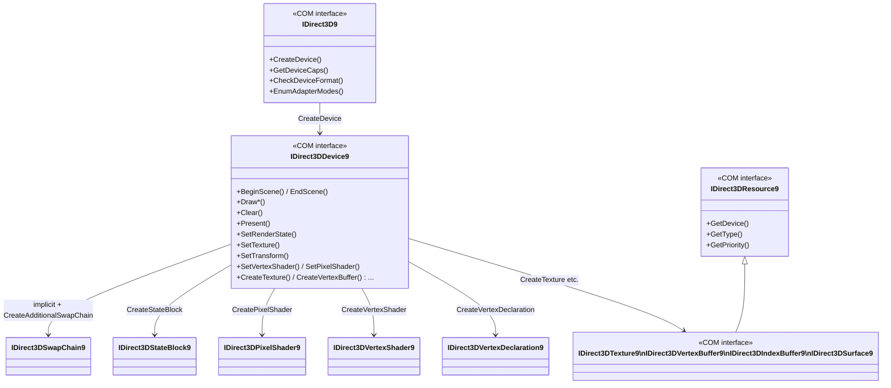
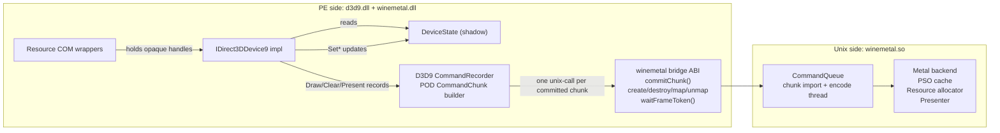
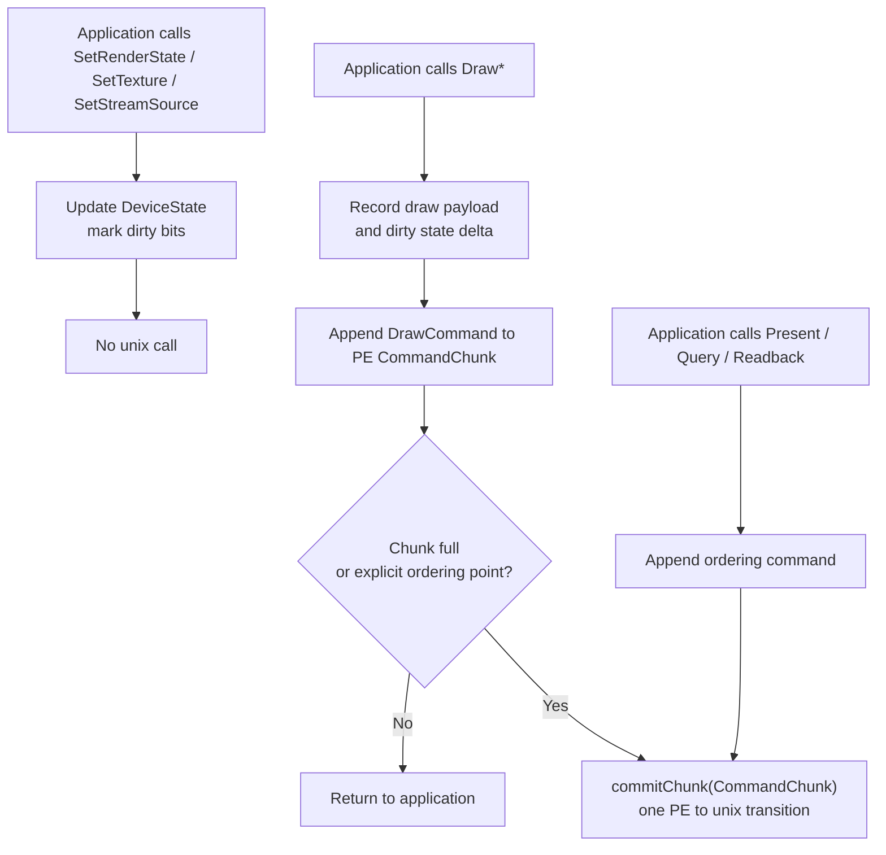
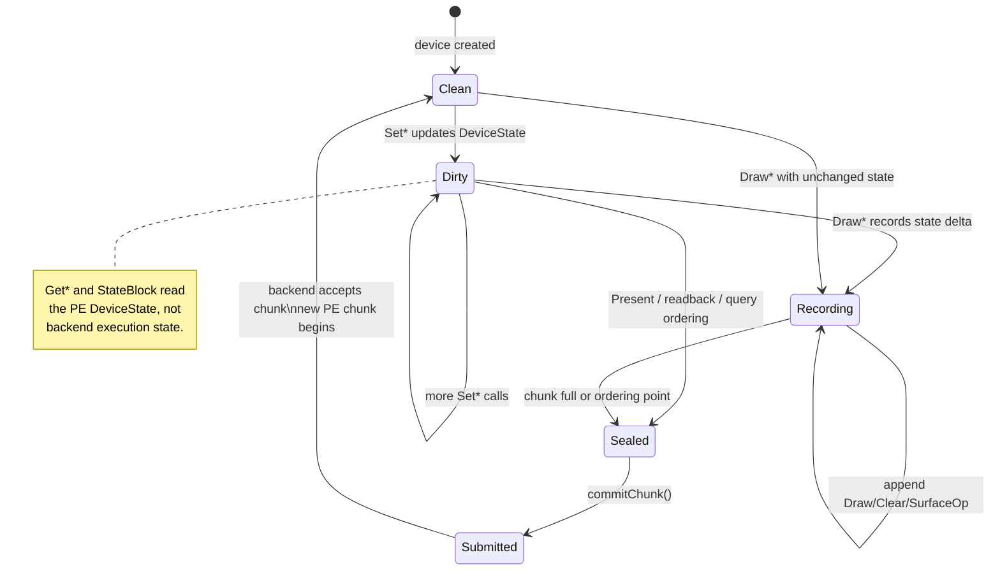
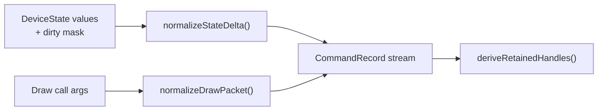
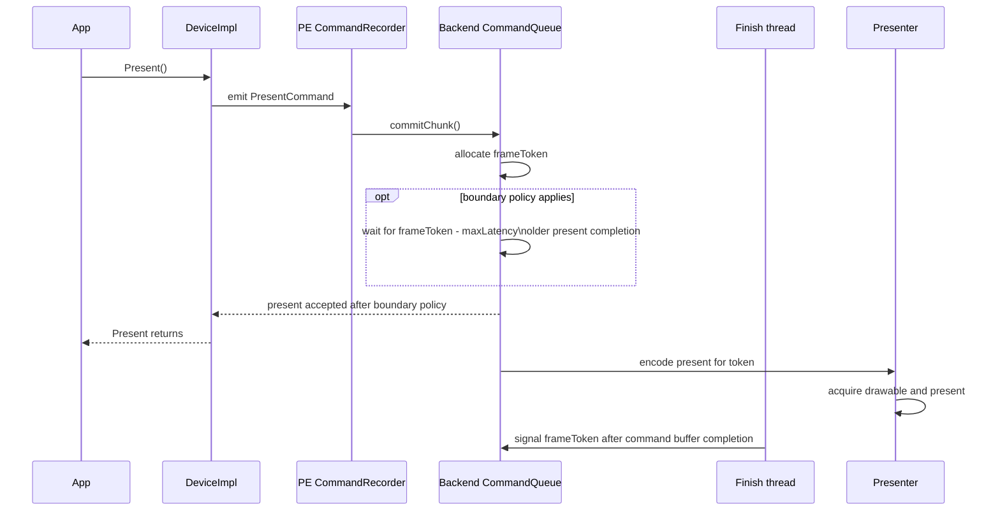
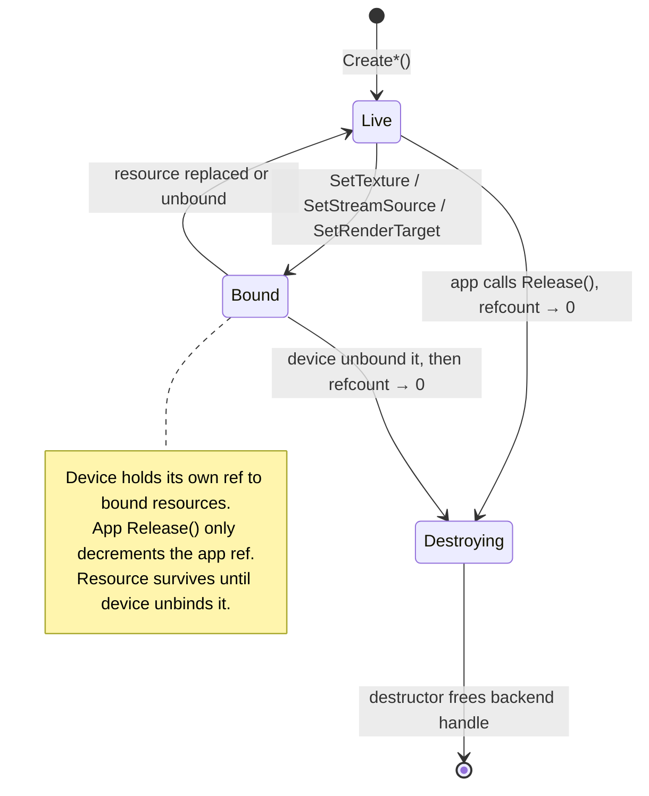
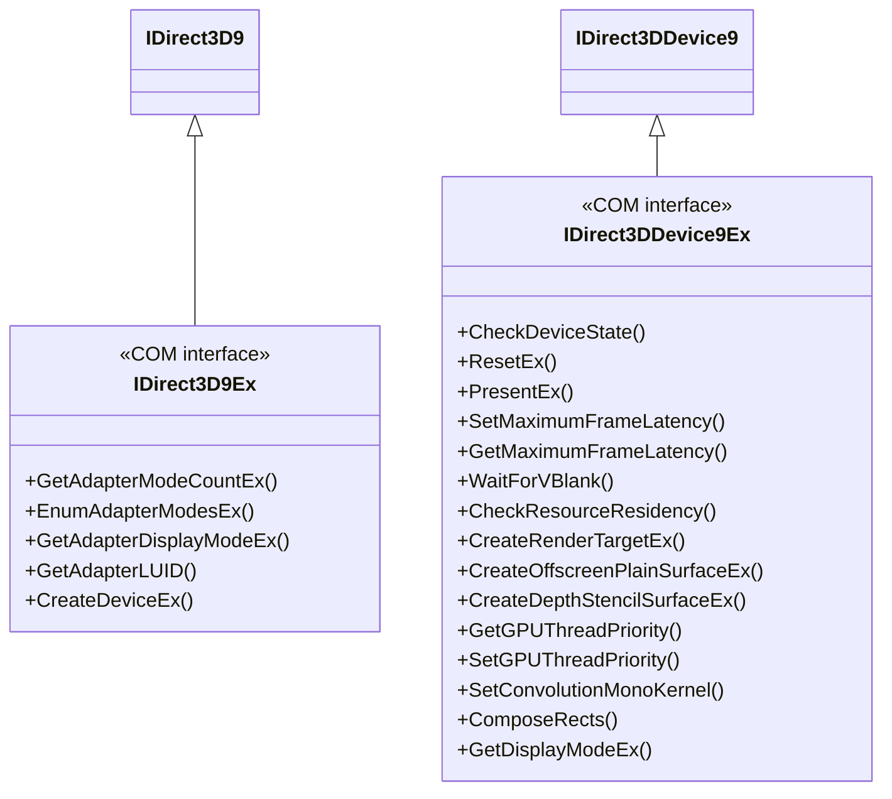
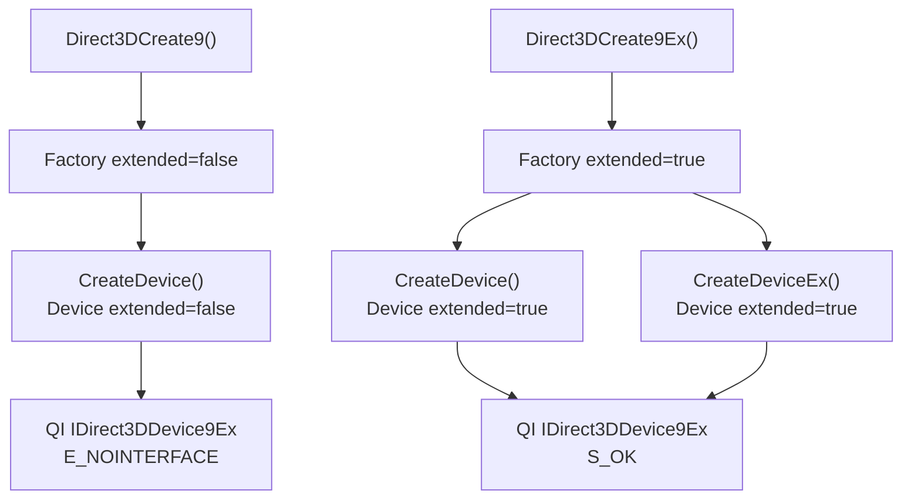

# D3D9 Layer Design

Detailed subtopic designs live in:

- `caps/design.md` for concrete `D3DCAPS9` reported values.
- `formats/design.md` for D3D9-to-Metal format mapping tables.
- `queries/design.md` for deferred query sequencing and backend query records.
- `wsi/design.md` for HWND-to-CAMetalLayer resolution and presentation lifecycle.

---

## 1. Object Model

The D3D9 layer exposes the standard D3D9 COM hierarchy. Each COM object wraps an
internal implementation object and bridges to the backend through a defined interface.



Every COM object is reference-counted. The internal implementation object is destroyed
when the COM reference count reaches zero. Device children hold a back-reference to
their owning device (incrementing its count), which is released in the child's
destructor.

Factory and device objects also carry an `extended` creation flag. The concrete
implementation may share one class for base and Ex objects, but
`QueryInterface()` must gate Ex interfaces on that flag:

- `Direct3DCreate9()` creates `extended = false`; `IID_IDirect3D9Ex` and
  `IID_IDirect3DDevice9Ex` queries fail with `E_NOINTERFACE`.
- `Direct3DCreate9Ex()` creates `extended = true`; both the factory and devices
  created from it expose their Ex interfaces.
- `IDirect3D9Ex::CreateDevice()` still creates an Ex-capable device because the
  capability follows the parent factory, not the specific creation method.

### 1.1 Factory Validation

The factory front-end performs Windows D3D9-compatible argument validation,
using Wine D3D9 tests as the behavioural oracle, before calling backend
capability code:

| Method | Front-end validation |
|---|---|
| `GetAdapterDisplayMode()` / `GetAdapterDisplayModeEx()` / `GetDisplayMode()` | Expose display modes as D3D9 adapter formats. If the internal backend or back-buffer mode is `A8R8G8B8`, report `X8R8G8B8` so apps do not reuse alpha formats as adapter formats. |
| `GetAdapterModeCount()` / `EnumAdapterModes()` | Enumerate Windows D3D9-compatible adapter mode formats only: `X8R8G8B8` and `R5G6B5`. `A8R8G8B8` remains a resource/back-buffer format, not an adapter mode format. |
| `CheckDeviceType()` | Reject invalid adapter indices with `D3DERR_INVALIDCALL`; reject valid but unavailable device types with `D3DERR_NOTAVAILABLE`; reject invalid non-D3D9 device-type enum values with `D3DERR_INVALIDCALL`; reject fullscreen display formats other than `X8R8G8B8` and `R5G6B5` with `D3DERR_NOTAVAILABLE`. |
| `CheckDeviceFormat()` | Accept only adapter formats `X8R8G8B8`, `R5G6B5`, and `X1R5G5B5`; return `D3DERR_INVALIDCALL` for `UNKNOWN`, `D3DERR_NOTAVAILABLE` for other invalid non-zero adapter formats, and `D3DERR_INVALIDCALL` for unsupported resource types. |
| `CheckDeviceMultiSampleType()` | Validate adapter and device-type enum before backend sample-count checks; invalid multisample enum values return `D3DERR_INVALIDCALL`; `D3DMULTISAMPLE_NONE` succeeds and reports one quality level; well-formed unsupported sample counts return `D3DERR_NOTAVAILABLE` and preserve/write `pQualityLevels` according to Wine-test-observed Windows D3D9 behaviour. |
| `CheckDeviceFormatConversion()` | Validate adapter and device type before testing conversion support; identical source/destination formats return `D3D_OK`; unsupported well-formed conversions return `D3DERR_NOTAVAILABLE`. |
| `CreateDevice()` / `CreateDeviceEx()` | Validate presentation parameters, normalize the caller-visible `D3DPRESENT_PARAMETERS` on success, and return the exact creation failure `HRESULT` instead of collapsing failures to a null pointer. |

The bridge-facing factory creation call should therefore be status-based:

```c
HRESULT dxmt9c_factory_create_device2(
    D9CFactory *factory,
    uint32_t adapter,
    const D9CPresentParams *params,
    uint32_t behavior_flags,
    const D9CDisplayModeEx *fullscreen_mode,
    D9CDevice **out_device);
```

Older pointer-returning helpers may remain as compatibility shims, but the PE
COM implementation must use a path that preserves validation, provider-load,
allocation, and backend HRESULTs.

The PE `d3d9.dll` export table is also part of the factory-facing Windows D3D9
compatibility surface. Besides `Direct3DCreate9`, `Direct3DCreate9Ex`, and
`Direct3DShaderValidatorCreate9`, it must provide auxiliary exports observed in
Wine/Windows D3D9 export profiles, such as `D3DPERF_*`, `DebugSetMute`, and
loader-safe `Direct3DCreate9On12` stubs, so applications with static imports do
not fail before reaching factory creation.

Auxiliary exports are deliberately implemented on the PE side. They must not
force `winemetal.so` provider loading, and their safe-call behaviour is covered
by the Wine-oracle conformance harness:

| Export / interface | PE-side behaviour |
|---|---|
| `Direct3DShaderValidatorCreate9()` | Return a stable non-validating singleton with callable `QueryInterface`, `AddRef`, `Release`, `Begin`, `Instruction`, and `End` methods. |
| `D3DPERF_*` / `DebugSetMute` | No-op compatibility helpers with Wine/Windows-compatible return values; no backend interaction. |
| `Direct3DCreate9On12()` | Loader-safe entry point. It may create a normal Ex-capable D3D9 factory when 9On12 is disabled, but D3D12 interop interfaces remain query-safe stubs unless explicitly implemented. |

---

## 2. Device State Structure

The device maintains a single state bag that is the authoritative source for all
mutable D3D9 state. No state lives implicitly in the backend.

```
DeviceState {
    // Rasterizer
    D3DVIEWPORT9        viewport
    RECT                scissorRect
    DWORD               renderState[D3DRS_COUNT]

    // Output merger
    IDirect3DSurface9*  renderTarget[4]             // MRT, index 0 is primary
    IDirect3DSurface9*  depthStencilSurface

    // Input assembler
    StreamBinding       streams[16]                 // {VB*, offset, stride}
    IDirect3DIndexBuffer9* indexBuffer
    IDirect3DVertexDeclaration9* vertexDecl
    DWORD               fvf

    // Shaders
    IDirect3DVertexShader9* vertexShader
    IDirect3DPixelShader9*  pixelShader
    float               vsConstF[256][4]
    int                 vsConstI[16][4]
    BOOL                vsConstB[16]
    float               psConstF[224][4]
    int                 psConstI[16][4]
    BOOL                psConstB[16]

    // Fixed-function
    D3DMATRIX           transform[D3DTS_TEXTURE7+1]
    D3DLIGHT9           lights[8]
    BOOL                lightEnabled[8]
    D3DMATERIAL9        material

    // Texture and sampler
    IDirect3DBaseTexture9* texture[16]
    DWORD               textureStageState[8][D3DTSS_COUNT]
    DWORD               samplerState[16][D3DSAMP_COUNT]

    // Clip planes
    float               clipPlane[6][4]

    // Scene gate
    bool                inScene
}
```

The state bag is read by the core when recording draw commands. The backend receives
only value records derived from this bag: full snapshots where needed, compact
state deltas on the canonical hot path, and opaque backend handles. It never
observes or mutates the live D3D9 state bag directly.

### 2.1 State Blocks

State blocks are PE-side snapshots or deltas of `DeviceState`; capture and apply
must not cross the Wine PE/unix boundary solely to observe mutable D3D9 state.

`CreateStateBlock()` uses the requested `D3DSTATEBLOCKTYPE` to select a state
mask:

| Type | Captured state |
|---|---|
| `D3DSBT_ALL` | render, texture/sampler, transforms, lights/material, shaders, constants, stream/index bindings, viewport/scissor, render targets |
| `D3DSBT_PIXELSTATE` | pixel-shader state, pixel constants, textures, sampler/TSS state, render states that affect raster/output/pixel processing |
| `D3DSBT_VERTEXSTATE` | vertex-shader state, vertex constants, transforms, lights/material, FVF/declaration, stream/index bindings, render states that affect vertex processing |

`BeginStateBlock()` records the delta between the base state and subsequent
state-setting calls. While recording is active, nested `BeginStateBlock()` and
existing state block `Capture()` / `Apply()` calls fail. The implementation must
preserve the D3D9 quirks covered by Wine's `stateblock.c`, including the
difference between `CreateStateBlock(D3DSBT_ALL)` snapshots and explicitly
recorded state blocks.

After `Apply()`, every derived cache that depends on stream bindings, index
buffers, textures, autogen-mipmap bits, render targets, shaders, or FVF-derived
declarations must be recomputed or marked dirty. Wine refreshes these side
caches after applying a state block; dxmt9 must do the equivalent for recorder
state and backend handle caches.

---

## 3. Core / Backend Boundary

The D3D9 layer and the Metal backend communicate through a coarse command-stream
interface. The core knows nothing about Metal objects; the backend knows nothing
about D3D9 COM.

The Wine PE/unix boundary is performance-sensitive. D3D9 hot-path calls must not
cross it one call at a time. The core records draw, clear, surface, query, and
present work into a PE-side command chunk. The chunk is committed to the unix-side
backend as a single bridge operation when it is full or when ordering requires it.



The bridge may expose resource lifecycle and map/unmap operations separately because
they are not per-draw hot-path calls. Draw/state submission itself is chunked.

### 3.1 Hot-Path Recording Model



This model follows upstream DXMT's important property: API calls record work on the
PE side, while backend execution and Metal calls happen later. dxmt9 must not depend
on a unix transition for every `DrawPrimitive`, `DrawIndexedPrimitive`, or `Set*`
call.

The ownership shape remains DXMT-like even when the implementation is highly
data-oriented: `DeviceImpl` owns D3D9 COM validation and the authoritative
`DeviceState`; `CommandRecorder` / `CommandChunk` own packet construction; and the
unix-side `CommandQueue` owns ordered import, backend shadow replay, Metal encoding,
and presentation pacing.


### 3.2 DXMT Concept Mapping and Intentional Divergence

dxmt9 maps DXMT concepts to the D3D9 PE/unix split by preserving ownership and
submission timing while changing the command representation. Upstream DXMT can use
C++ command objects and lambda captures inside one native process; dxmt9 records
versioned POD packets because command chunks cross the Wine PE/unix boundary.

| Upstream DXMT shape | dxmt9 shape |
|---|---|
| Immediate context owns API state and validation | PE `DeviceImpl` owns COM validation, getters, state blocks, and the authoritative `DeviceState` |
| Command recorder appends executable command objects | PE `CommandRecorder` appends POD records and inline payloads to a `CommandChunk` |
| `CommandChunk` carries native command objects/lambdas | `CommandChunk` carries only bridge-stable records, scalar payloads, and opaque backend handles |
| In-process backend calls can share native pointer types | The `winemetal` bridge ABI marshals chunk commits, coarse resource operations, map/unmap, and frame-token waits; no COM, Objective-C, unix C++ object pointer, or lambda crosses it |
| `CommandQueue` owns deferred execution and Metal command-buffer completion | unix `CommandQueue` owns ordered import, backend shadow replay, Metal encoding, sequence fences, and present-bearing frame tokens |
| Deferred resource safety is private to queue execution | Resource lifetime is pinned by handle-retention lists derived from serialized records; public COM refcounts and D3D9 bindings remain PE-side semantics |
| Helper preparation may be embedded in command objects | State deltas, draw packets, shader lowering, format conversion, FFP keys, barriers, and retention scans are stateless value transforms wherever possible |

The divergence is intentional: POD records make ABI versioning, validation,
record replay, and unit tests explicit. They must not change the DXMT ownership
model: PE code records D3D9 work, the bridge transports records, and the unix
queue owns execution, fences, and frame pacing.

### 3.3 D3D9 Recorder Invariants

The recorder is a D3D9 state machine first and a batching optimization second. It
must preserve immediate API semantics even though execution is deferred.



Required invariants:

- Dirty bits are an optimization only; the `DeviceState` value is authoritative.
- A recorded draw owns a complete effective state after ordered replay of prior
  state-delta records against the server-side shadow. The canonical wire packet may
  carry only deltas; full self-contained snapshots are debug/stress mode.
- Later `Set*` calls only affect later records. If a barrier command occurs while
  state is dirty, the recorder must append an `APPLY_STATE` record before the
  barrier.
- D3D9 state normalization, draw packet construction, shader decode/lowering/MSL
  generation, and resource-retention extraction should be modeled as pure
  data-transform functions wherever possible. Their inputs are explicit value
  structs or packet spans; their outputs are normalized packets, shader IR/MSL,
  derived handles, diagnostics, or errors. They must not observe live COM objects,
  mutate `DeviceState`, or cross the PE/unix boundary as hidden side effects.
- `DrawPrimitiveUP` / `DrawIndexedPrimitiveUP` copy caller memory into chunk-owned
  payload or staging storage before returning.
- Recorded chunks retain opaque backend handles, never COM objects.
- `Present`, synchronous readback, event-query ordering, explicit flush, chunk size
  limits, and non-representable lifetime hazards seal the current chunk.

### 3.4 Draw and Chunk Payloads

**Canonical draw input** - the effective production data the backend encodes for
a draw run:

```
CanonicalDrawState {
    FlatDrawStateRecord       hot           // PSO, attachments, bindings, hashes
    DrawShaderLayoutContext   shaderLayout  // shader refs, clip variant, vertex layout
    DrawDebugSnapshot         debug         // cold diagnostics only
}

DrawRunDesc {
    CanonicalDrawState state
    DrawParam          draws[]              // no TRIANGLEFAN; decomposed by core
    uint8_t            payloadArena[]       // UP vertex/index data ranges
    DrawUniformPayload uniforms             // constants, matrices, clip planes
}
```

The PE wire format does not need to carry this full structure in every draw
record. The canonical command stream carries a compact state delta plus draw
payload; the unix importer applies those deltas in order to a server-side shadow.
The resulting effective state is exposed to the backend as `FlatDrawStateView`
plus draw parameters before encoding. The queue stores large uniform data in a
draw-uniform payload arena and records `{index, generation, hash}` handles on
draw-run records, so hot PSO/resource decisions do not carry full constant arrays.
No D3D9 COM objects are referenced across the bridge - only opaque backend handles.
`fixture::DrawDesc` is retained for tests/offline transforms only and is not a
production backend input.
`DXMT9_PE_DRAW_FULL_SNAPSHOT=1` may force self-contained draw packets, but that is a
debug/stress mode because it increases wire size and disables cheap run coalescing.

Ordinary `DrawIndexedPrimitive` records remain indexed through the default
production path. The backend should issue direct indexed draws using the bound
index buffer or UP index payload; expanding indexed geometry into a transient
non-indexed vertex stream is an opt-in diagnostic path under
`DXMT_FORCE_EXPAND_INDEXED=1`, not a default draw policy.

State and draw packet normalization are pure transforms over value data. A typical
path is:



This keeps API ownership and packet semantics separate: `DeviceImpl` updates the
authoritative state bag, while unit-testable normalizers decide how that state is
represented in compact bridge records.

**`CommandChunk`** — the bridge payload committed to the backend:

```
CommandChunk {
    uint64_t            chunkId
    uint32_t            commandCount
    uint32_t            byteSize
    CommandRecord[]     records          // Draw, Clear, SurfaceOp, Present, Query
    HandleRef[]         retainedHandles  // opaque backend handles referenced by records
}
```

The chunk is a POD command stream. It must not contain COM interface pointers,
Objective-C pointers, C++ lambdas, or process-local references that are invalid
after crossing the Wine PE/unix boundary. `retainedHandles` is derived from the
serialized command records and inline payloads, not maintained as an independent
semantic source of truth.

### 3.5 Frame Pacing Ownership

Frame latency is owned by the swap chain, presenter, and backend command queue. The
device implementation initiates present, but it does not define the wait token.



When the boundary policy applies, the wait is based on present-bearing command
completion, not on whether the encode thread has merely dequeued or started a
chunk. This keeps pacing attached to the queue/presenter timeline and prevents the
front-end device object from becoming the owner of frame scheduling.

---

## 4. Resource Ownership Model



**Pool semantics:**

| Pool | GPU allocation | CPU accessible | Survives Reset() |
|---|---|---|---|
| DEFAULT | Yes | No (use staging) | No — destroyed on Reset |
| MANAGED | Yes (auto-synced) | Yes (system copy) | Yes |
| SYSTEMMEM | No | Yes | Yes |
| SCRATCH | No | Yes | Yes |

Public COM refcounts are part of the compatibility surface. Backend handle
retention for deferred command chunks is private and must not be visible through
`AddRef()` / `Release()` probes. `Get*` calls that return COM interfaces add a
public reference; state-setting calls follow D3D9's observed rules, including
`SetVertexDeclaration()` not adding a public reference and FVF conversion using
stable cached vertex declarations.

### 4.1 Private Data and Shared Handles

All resource private-data methods use one helper equivalent to Wine's
`d3d9_resource_*_private_data()` path. The helper stores raw blobs and
`IUnknown` values, validates `D3DSPD_IUNKNOWN` size exactly, preserves existing
entries on failed `SetPrivateData()`, AddRefs `IUnknown` values on successful
`GetPrivateData()`, and leaves the caller's `SizeOfData` untouched when a GUID
is not found.

Shared-handle handling is validated at the PE COM boundary before backend
resource creation. Non-Ex devices return `E_NOTIMPL` for non-null
`pSharedHandle`. Ex devices may support Wine-test-observed Windows D3D9
user-memory `D3DPOOL_SYSTEMMEM` texture/surface cases, but unsupported sharing
must fail with the resource-class-specific Windows D3D9 error instead of
silently ignoring the handle.

| Resource path | Non-null `pSharedHandle` behaviour |
|---|---|
| Non-Ex resource creation | Return `E_NOTIMPL`; never create a resource while ignoring the handle. |
| Ex `CreateTexture()` with `D3DPOOL_SYSTEMMEM`, exactly one mip level, and caller memory | Create a user-memory texture; `LockRect()` returns the caller pointer and pitch. |
| Ex `CreateTexture()` with `D3DPOOL_SYSTEMMEM` and zero or multiple mip levels | Return `D3DERR_INVALIDCALL`. |
| Ex `CreateOffscreenPlainSurface()` / `CreateOffscreenPlainSurfaceEx()` with `D3DPOOL_SYSTEMMEM` and caller memory | Create a user-memory surface; `LockRect()` returns the caller pointer and pitch. |
| Ex vertex/index buffers with `D3DPOOL_SYSTEMMEM` and caller memory | Return Windows D3D9-compatible resource-class failure, currently `D3DERR_NOTAVAILABLE`. |
| Ex cube textures, volume textures, `D3DPOOL_SCRATCH`, or unsupported pools with caller memory | Return `D3DERR_INVALIDCALL` unless the Wine behavioural oracle documents a stricter resource-specific code. |
| Ex default-pool cross-process sharing | Return `E_NOTIMPL` until real shared-handle interop exists. |

### 4.2 Reset Rebinding

`Reset()` / `ResetEx()` rebuild the default swap-chain attachments and restore
Windows D3D9-visible bindings. Render target slot 0 is rebound to the new back
buffer, render target slots above 0 are unbound, the auto depth-stencil binding
follows the new presentation parameters, active scene recording is cleared, and
viewport and scissor state are reset from the new back-buffer dimensions.

On failed base `Reset()` calls, the device may remain in lost/not-reset state
according to the Wine-test-observed Windows D3D9 failure. Ex reset failures are
surfaced through `ResetEx()` and subsequent `CheckDeviceState()` rather than through
`TestCooperativeLevel()`. Ex old back-buffer objects may survive as standalone
COM objects while public references exist, but they are no longer bound to the
device after a successful reset.

### 4.3 Resource Wrapper Conformance

Resource wrapper behaviour is tested at the D3D9 COM boundary because many
applications depend on exact wrapper semantics rather than only rendered output.
The PE resource layer owns these rules:

- `GetContainer()` / `GetLevelDesc()` must return Wine-test-observed
  `HRESULT`s, AddRef behaviour, and out-pointer state for texture, cube,
  volume, surface, and volume-level wrappers.
- `LockRect()` / `LockBox()` validation must cover invalid rectangles, block
  compressed alignment, nested lock/unlock calls, and caller-memory resources.
- `GetDC()` / `ReleaseDC()` support is format- and pool-sensitive and must
  preserve data visible through subsequent D3D9 locks or copies.
- `SetLOD()` / `GetLOD()`, autogen mipmap filters, and `GenerateMipSubLevels()`
  are part of the observable texture wrapper contract even when the backend
  implements uploads lazily.
- `D3DFMT_UNKNOWN` resource creation failures must return exact public
  `HRESULT`s and must leave out pointers in the Wine behavioural oracle state.

---

## 5. Fixed-Function Pipeline Key

When no vertex or pixel shader is bound, the core derives a compact key from
`DeviceState` and passes it to the backend as a `ShaderRef`. The backend generates or
caches the Metal shader for that key.

The key is a value type. Two keys that compare equal must produce identical shader
behavior. The key must not contain any pointers or handles — only scalar state.

**FFPKeyVS** encodes (all fields bit-packed):
- `lightingEnabled`, `specularEnabled`, `normalizeNormals`
- Per-light: `enabled`, `type` (directional / point / spot) for lights 0–7
- `colorMaterialMode` per channel (emissive, ambient, diffuse, specular)
- `fogMode`, `fogFromVertex`, `rangeFog`
- Per stage: `texCoordGen` (TCI mode), `texTransformFlags`
- `vertexBlend`, `indexedVertexBlend`

**FFPKeyPS** encodes (all fields bit-packed):
- Per stage: `colorOp`, `colorArg1`, `colorArg2`, `alphaOp`, `alphaArg1`,
  `alphaArg2`, `resultArg`, `texType`, `texCoordIndex`
- `fogMode` (for pixel fog when `!fogFromVertex`)
- `alphaTestEnable`, `alphaTestFunc`

---

## 6. Triangle Fan Decomposition

`D3DPT_TRIANGLEFAN` must be decomposed in the core before submission to the backend.
The backend never sees `D3DPT_TRIANGLEFAN`.

This primitive conversion is separate from the ordinary indexed-draw policy above:
indexed triangle-list/triangle-strip draws stay direct indexed draws by default.

For fan `[v0, v1, v2, …, vN]` (primitive count = N−1):
- Non-indexed: copy vertices into a temporary triangle list buffer.
- Indexed: read original indices and write a new index sequence into a temporary
  index buffer.

The temporary buffer is valid until the draw call returns. The backend must copy or
consume it before returning.

---

## 7. Half-Pixel Offset Correction

D3D9 pixel centers are at integer screen coordinates; Metal pixel centers are at
half-integers. Without correction, all 3D geometry renders shifted by 0.5 pixels.

**For programmable vertex shaders:** inject a fixup into the shader before translation.
In bytecode terms, after the instruction that writes `oPos` (or `o0` in vs_3_0),
add: `oPos.xy += c_fixup.xy * oPos.w`, where `c_fixup` is injected as a constant
containing `(1/viewportWidth, 1/viewportHeight)`.

**For fixed-function shaders:** the backend includes the fixup in the generated MSL.

**For `D3DFVF_XYZRHW` (pre-transformed) inputs:** screen-space `(x, y, z, 1/w)` must
be converted to Metal NDC in the vertex shader:
```
metal_ndc.x =  (x / vp.Width)  * 2.0 − 1.0
metal_ndc.y = 1.0 − (y / vp.Height) * 2.0
metal_ndc.z = z
metal_ndc.w = 1.0 / rhw
```

**Texture coordinate orientation:** programmable pixel shaders preserve D3D UVs.
The translator must not add a default `v = 1.0 - v` transform around `texld`,
`TEX`, `TEXLDB`, `TEXLDP`, `TEXLDD`, or `TEXLDL` sampling. If a texture appears
vertically inverted, the bug belongs to resource upload/readback orientation,
surface addressing, viewport/vertex mapping, or a caller's own shader math, not
to a global pixel-shader fixup.

Two debug-only bisect flags intentionally keep these contracts separate:

| Flag | Scope | Default contract |
|---|---|---|
| `DXMT_DEBUG_FLIP_VERTEX_Y` | Translated vertex shader clip-space output | Off by default; may emit `out.position.y = -out.position.y` only for vertex/raster debugging. |
| `DXMT_DEBUG_FORCE_PIXEL_V_FLIP` | Translated pixel shader texture sampling | Off by default; may emit `1.0f - v` only to prove a regression is caused by an accidental pixel-sampler V inversion. |

---

## 8. Alpha Test


`D3DRS_ALPHATESTENABLE` with `D3DRS_ALPHAFUNC` / `D3DRS_ALPHAREF` has no Metal
hardware equivalent. It is encoded into `FFPKeyPS` (or a programmable shader variant
key) and emitted as a `discard_fragment()` conditional at the end of the pixel shader.

The test condition in MSL for function `D3DCMP_LESS`, reference `r`:
```metal
if (!(outColor.a < r)) discard_fragment();
```

Each distinct (`alphaTestEnable`, `alphaTestFunc`) combination must produce a
separately cached shader variant.

---

## 9. IDirect3DDevice9Ex Extension

`IDirect3D9Ex` and `IDirect3DDevice9Ex` extend the base interfaces without
replacing them. The implementation reuses the existing class hierarchy.



**Class layout:** `Direct3D9ExImpl` inherits `IDirect3D9Ex` (which inherits
`IDirect3D9`) and delegates all base methods to the existing `Factory`
implementation. `Direct3DDevice9ExImpl` inherits `IDirect3DDevice9Ex` and
delegates all base methods to the existing `Direct3DDevice9Impl`. Base-vs-Ex
availability is controlled by the `extended` creation flag rather than by a
separate backend implementation.

The shared implementation is still split logically by `extended` mode. This is
the Windows D3D9-compatible rule validated by Wine D3D9 tests:



**Ex-only method mappings:**

| Ex method | Implementation |
|---|---|
| `CheckDeviceState()` | `deviceLost_` flag; adds `S_PRESENT_OCCLUDED` for minimised window |
| `ResetEx()` | Validate `Windowed`/`D3DDISPLAYMODEEX` relation and back-buffer size match, then `reset()` + `normalizePresentParameters()` |
| `PresentEx()` | `present()` — dirty-rect and rotation hints ignored |
| `SetMaximumFrameLatency()` | `backend_->setMaxFrameLatency(n)` (new backend method) |
| `GetMaximumFrameLatency()` | Returns `maxFrameLatency_` |
| `WaitForVBlank()` | `CAMetalLayer` drawable wait or `CVDisplayLink` callback |
| `CheckResourceResidency()` | Always `S_OK` — Metal manages residency |
| `GetAdapterLUID()` | Synthesised from `MTLDevice.registryID` |
| `GetAdapterDisplayModeEx()` / `EnumAdapterModesEx()` | Validate structure sizes and filters, report D3D9 adapter formats, and pass through host scanline ordering / rotation when available instead of hardcoding identity/progressive. |
| `IDirect3DSwapChain9Ex::GetDisplayModeEx()` | Return the active swap-chain display mode with size validation and the same format normalization as base display-mode methods. |
| `GetGPUThreadPriority()` | Always returns 0 |
| `SetGPUThreadPriority()` | No-op, returns `D3D_OK` |
| `SetConvolutionMonoKernel()` | `E_NOTIMPL` |
| `ComposeRects()` | `E_NOTIMPL` |
| `CreateRenderTargetEx()` | Rejects invalid `Usage`, then follows shared-handle policy and delegates to `CreateRenderTarget()` |
| `CreateOffscreenPlainSurfaceEx()` | Wine-test-observed Windows D3D9 user-memory/shared-handle policy from section 4.1; if the path is otherwise unsupported, return a validated Windows D3D9-compatible failure and never silently ignore `pSharedHandle` |
| `CreateDepthStencilSurfaceEx()` | Rejects invalid `Usage`, then follows shared-handle policy and delegates to `CreateDepthStencilSurface()` |

`IDirect3DSwapChain9Ex::GetLastPresentCount()` and `GetPresentStatistics()` may
remain Windows D3D9-compatible stubs that return `D3D_OK` and zero their output
when the pointer is non-null.
