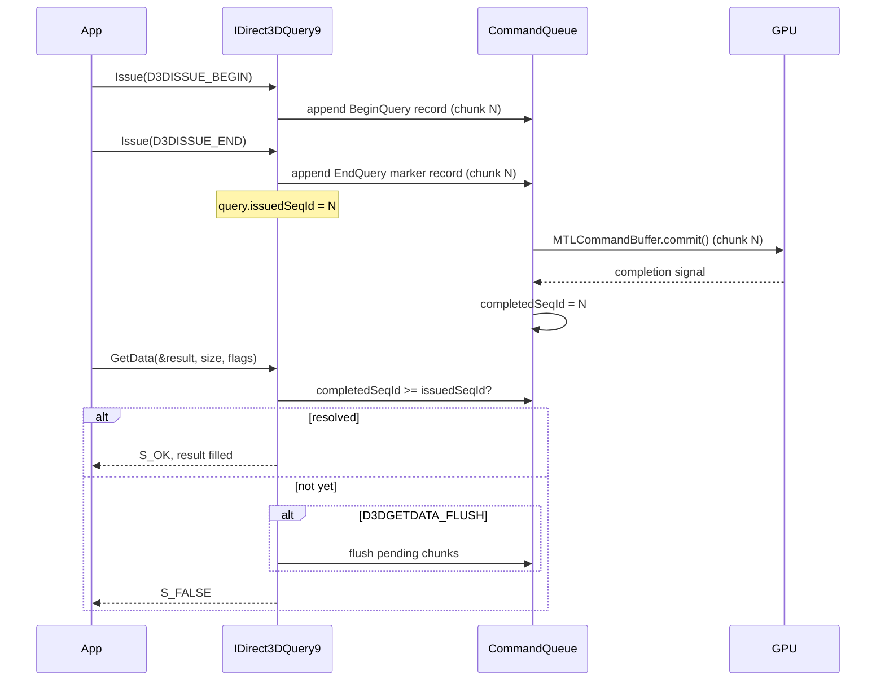

# Query Spec

D3D9 queries let the application probe GPU state asynchronously. Because dxmt9
uses a deferred command queue, query results are not available until the GPU has
processed the commands that surround the query. The implementation uses POD
query records in command chunks plus a CPU-visible sequence ID fence.

---

## 1. Query Types in Scope

| D3DQUERYTYPE | Priority | Notes |
|---|---|---|
| D3DQUERYTYPE_EVENT | Required | GPU fence; most common synchronization primitive |
| D3DQUERYTYPE_OCCLUSION | Required | Sample count from visibility result |
| D3DQUERYTYPE_TIMESTAMP | Optional | GPU timestamp; requires Metal counter support |
| D3DQUERYTYPE_TIMESTAMPDISJOINT | Optional | Always non-disjoint on Metal when timestamps are exposed |
| D3DQUERYTYPE_TIMESTAMPFREQ | Optional | Nanoseconds per tick |
| D3DQUERYTYPE_VCACHE | Omit | Driver cache stats; deterministic zero-compatible data or unavailable |
| D3DQUERYTYPE_RESOURCEMANAGER | Omit | Memory stats; deterministic zero-compatible data or unavailable |
| D3DQUERYTYPE_VERTEXSTATS | Omit | VS invocations; not exposed by Metal |

---

## 2. Sequence ID Fence Mechanism

The command queue assigns a monotonically increasing sequence ID to each
committed `CommandChunk`. The finish thread increments a CPU-visible
`completedSeqId` counter after the GPU signals completion for each chunk.

```
CommandQueue state:
  currentSeqId:    uint64
  completedSeqId:  atomic<uint64>
```

A query is resolved when `completedSeqId >= query.issuedSeqId`.



---

## 3. D3DQUERYTYPE_EVENT

An event query is a pure GPU fence. It returns no data; it only reports
completion.

`Issue(D3DISSUE_END)` appends a queue-local EVENT END marker record to the
current chunk and stores that chunk's sequence ID in `query.issuedSeqId`. No
Metal query object is required; completion is tracked through `completedSeqId`.

`GetData(NULL, 0, flags)` compares `completedSeqId` with `issuedSeqId`. If the
query is unresolved and `D3DGETDATA_FLUSH` is set, the recorder commits the
current chunk so the END marker can reach the GPU.

```cpp
while (pQuery->GetData(NULL, 0, D3DGETDATA_FLUSH) == S_FALSE) {
  /* spin */
}
```

The flush path is the deadlock breaker for this loop. It submits the chunk that
contains the END marker; the finish thread then advances `completedSeqId` when
the GPU completes the chunk.

---

## 4. D3DQUERYTYPE_OCCLUSION

An occlusion query counts the number of samples that pass the depth-stencil test
between `BEGIN` and `END`.

Metal provides visibility result buffers: a `MTLBuffer` where the GPU writes a
per-render-pass sample count.

```
OcclusionQueryPool:
  visibilityBuffer: MTLBuffer
  slotAllocator: ring
```

`Issue(D3DISSUE_BEGIN)` allocates an 8-byte aligned slot from the shared
visibility buffer and appends a BEGIN record carrying the opaque visibility
buffer handle and slot offset. Queue replay enables
`MTLVisibilityResultModeCounting` on the active render encoder.

`Issue(D3DISSUE_END)` appends an END record. Queue replay disables visibility
counting on the active render encoder, and the frontend records the issuing
chunk sequence ID.

`GetData(&count, sizeof(DWORD), flags)` returns `S_FALSE` until the issuing chunk
is complete. Once resolved, it reads the shared visibility slot, clamps the
`uint64` count to `DWORD`, writes the public result, and returns `S_OK`.

Visibility result buffers must use CPU-readable storage. Slot reuse is delayed
until every chunk that can write the slot has completed. Queries that span
render pass boundaries accumulate counts from all passes that had the query
active; if replay opens a new render encoder while the query is active, replay
re-enables visibility counting for the same slot.

---

## 5. D3DQUERYTYPE_TIMESTAMP

GPU timestamps report the GPU clock at a point in the command stream.

When Metal counter sampling is available, `Issue(D3DISSUE_END)` appends a
timestamp sample record carrying the opaque counter sample buffer handle and
reserved sample index. Queue replay samples the active command encoder and the
frontend records `query.issuedSeqId`.

`GetData(&timestamp, sizeof(UINT64), flags)` returns `S_FALSE` until resolved.
After completion, the backend resolves the counter range when needed and returns
a nanosecond timestamp.

`D3DQUERYTYPE_TIMESTAMPFREQ` returns `1000000000`. `D3DQUERYTYPE_TIMESTAMPDISJOINT`
returns `Disjoint = FALSE` with the same frequency when the timestamp path is
enabled. If counter sampling is unavailable, timestamp query creation fails with
`D3DERR_NOTAVAILABLE`.

---

## 6. Object Lifecycle

```mermaid
stateDiagram-v2
    [*] --> Created : CreateQuery(type)
    Created --> Issued : Issue(D3DISSUE_END)
    Issued --> Pending : chunk committed to GPU
    Pending --> Resolved : completedSeqId >= issuedSeqId
    Resolved --> Created : Issue(D3DISSUE_BEGIN or END) resets query
    Created --> [*] : Release()
    Issued --> [*] : Release() while pending; backend storage retained by chunk
```



The COM object may be released while a backend record is in flight. Command chunk
retention keeps backend handles and result storage alive until GPU completion,
without depending on public COM references.
