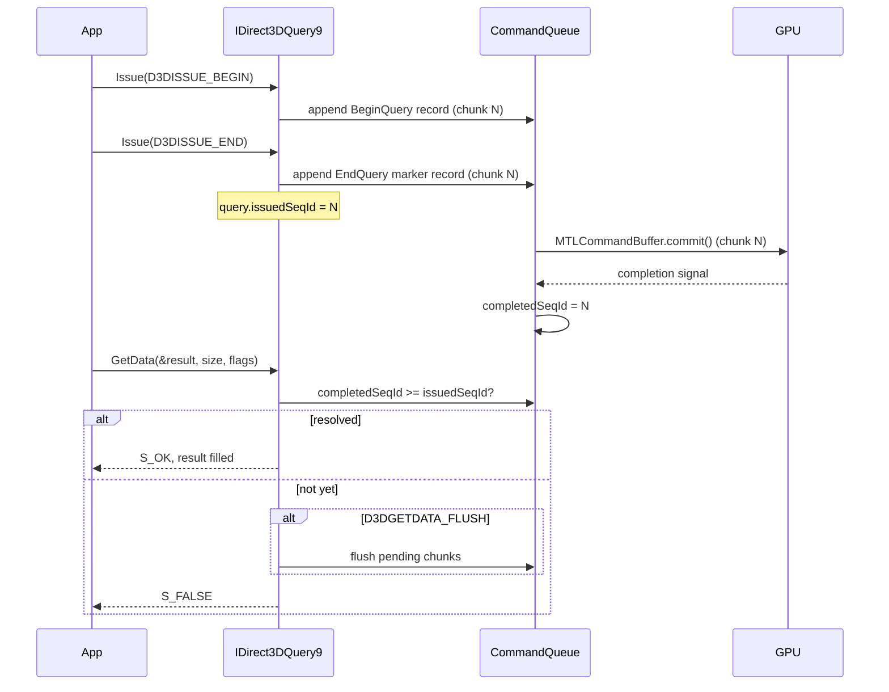
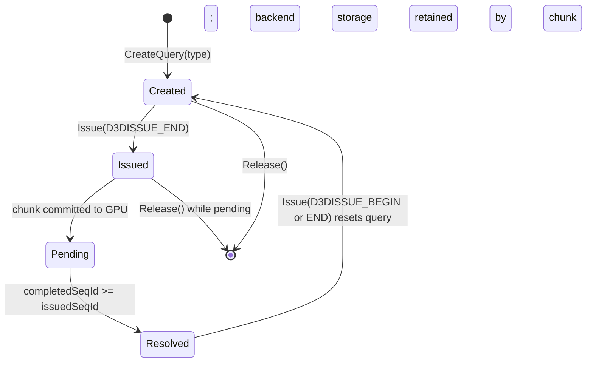

# Query Spec

D3D9 queries let the application probe GPU state asynchronously. Because dxmt9
uses a deferred command queue, query results are not available until the GPU has
processed the commands that surround the query. The implementation uses POD
query records in command chunks plus a CPU-visible sequence ID fence.

---

## 1. Query Types in Scope

| D3DQUERYTYPE | Priority | Notes |
|---|---|---|
| D3DQUERYTYPE_EVENT | Required | GPU fence; most common synchronization primitive |
| D3DQUERYTYPE_OCCLUSION | Required | Sample count from visibility result |
| D3DQUERYTYPE_TIMESTAMP | Optional | GPU timestamp; requires Metal counter support |
| D3DQUERYTYPE_TIMESTAMPDISJOINT | Optional | Always non-disjoint on Metal when timestamps are exposed |
| D3DQUERYTYPE_TIMESTAMPFREQ | Optional | Nanoseconds per tick |
| D3DQUERYTYPE_VCACHE | Omit | Driver cache stats; deterministic zero-compatible data or unavailable |
| D3DQUERYTYPE_RESOURCEMANAGER | Omit | Memory stats; deterministic zero-compatible data or unavailable |
| D3DQUERYTYPE_VERTEXSTATS | Omit | VS invocations; not exposed by Metal |

---

## 2. Sequence ID Fence Mechanism

The command queue assigns a monotonically increasing sequence ID to each
committed `CommandChunk`. The finish thread increments a CPU-visible
`completedSeqId` counter after the GPU signals completion for each chunk.

```
CommandQueue state:
  currentSeqId:    uint64
  completedSeqId:  atomic<uint64>
```

A query is resolved when `completedSeqId >= query.issuedSeqId`.


```mermaid
sequenceDiagram
    participant App
    participant Core as IDirect3DQuery9
    participant CQ as CommandQueue
    participant GPU

    App->>Core: Issue(D3DISSUE_BEGIN)
    Core->>CQ: append BeginQuery record (chunk N)

    App->>Core: Issue(D3DISSUE_END)
    Core->>CQ: append EndQuery marker record (chunk N)
    Note over Core: query.issuedSeqId = N

    CQ->>GPU: MTLCommandBuffer.commit() (chunk N)
    GPU-->>CQ: completion signal
    CQ->>CQ: completedSeqId = N

    App->>Core: GetData(&result, size, flags)
    Core->>CQ: completedSeqId >= issuedSeqId?
    alt resolved
        Core-->>App: S_OK, result filled
    else not yet
        alt D3DGETDATA_FLUSH
            Core->>CQ: flush pending chunks
        end
        Core-->>App: S_FALSE
    end
```

---

## 3. D3DQUERYTYPE_EVENT

An event query is a pure GPU fence. It returns no data; it only reports
completion.

`Issue(D3DISSUE_END)` appends a queue-local EVENT END marker record to the
current chunk and stores that chunk's sequence ID in `query.issuedSeqId`. No
Metal query object is required; completion is tracked through `completedSeqId`.

`GetData(NULL, 0, flags)` compares `completedSeqId` with `issuedSeqId`. If the
query is unresolved and `D3DGETDATA_FLUSH` is set, the recorder commits the
current chunk so the END marker can reach the GPU.

```cpp
while (pQuery->GetData(NULL, 0, D3DGETDATA_FLUSH) == S_FALSE) {
  /* spin */
}
```

The flush path is the deadlock breaker for this loop. It submits the chunk that
contains the END marker; the finish thread then advances `completedSeqId` when
the GPU completes the chunk.

---

## 4. D3DQUERYTYPE_OCCLUSION

An occlusion query counts the number of samples that pass the depth-stencil test
between `BEGIN` and `END`.

Metal provides visibility result buffers: a `MTLBuffer` where the GPU writes a
per-render-pass sample count.

```
OcclusionQueryPool:
  visibilityBuffer: MTLBuffer
  slotAllocator: ring
```

`Issue(D3DISSUE_BEGIN)` allocates an 8-byte aligned slot from the shared
visibility buffer and appends a BEGIN record carrying the opaque visibility
buffer handle and slot offset. Queue replay enables
`MTLVisibilityResultModeCounting` on the active render encoder.

`Issue(D3DISSUE_END)` appends an END record. Queue replay disables visibility
counting on the active render encoder, and the frontend records the issuing
chunk sequence ID.

`GetData(&count, sizeof(DWORD), flags)` returns `S_FALSE` until the issuing chunk
is complete. Once resolved, it reads the shared visibility slot, clamps the
`uint64` count to `DWORD`, writes the public result, and returns `S_OK`.

Visibility result buffers must use CPU-readable storage. Slot reuse is delayed
until every chunk that can write the slot has completed. Queries that span
render pass boundaries accumulate counts from all passes that had the query
active; if replay opens a new render encoder while the query is active, replay
re-enables visibility counting for the same slot.

---

## 5. D3DQUERYTYPE_TIMESTAMP

GPU timestamps report the GPU clock at a point in the command stream.

When Metal counter sampling is available, `Issue(D3DISSUE_END)` appends a
timestamp sample record carrying the opaque counter sample buffer handle and
reserved sample index. Queue replay samples the active command encoder and the
frontend records `query.issuedSeqId`.

`GetData(&timestamp, sizeof(UINT64), flags)` returns `S_FALSE` until resolved.
After completion, the backend resolves the counter range when needed and returns
a nanosecond timestamp.

`D3DQUERYTYPE_TIMESTAMPFREQ` returns `1000000000`. `D3DQUERYTYPE_TIMESTAMPDISJOINT`
returns `Disjoint = FALSE` with the same frequency when the timestamp path is
enabled. If counter sampling is unavailable, timestamp query creation fails with
`D3DERR_NOTAVAILABLE`.

---

## 6. Object Lifecycle


```mermaid
stateDiagram-v2
    [*] --> Created : CreateQuery(type)
    Created --> Issued : Issue(D3DISSUE_END)
    Issued --> Pending : chunk committed to GPU
    Pending --> Resolved : completedSeqId >= issuedSeqId
    Resolved --> Created : Issue(D3DISSUE_BEGIN or END) resets query
    Created --> [*] : Release()
    Issued --> [*] : Release() while pending; backend storage retained by chunk
```

The COM object may be released while a backend record is in flight. Command chunk
retention keeps backend handles and result storage alive until GPU completion,
without depending on public COM references.

## 7. Published-prefix asynchronous candidate

`DXMT9_ASYNC_QUERY_FENCES` is an opt-in implementation of R-CORE-11.5(a).
END first settles any compatibility draw batch, then publishes the ordinary
queue writer and obtains `{queue incarnation, published sequence}` under the
queue mutex. With no writer it captures the existing published prefix, including
zero for a genuinely empty queue. It does not invent a Query GPU command or
use the core operation counter as a queue sequence. Active Arena/direct build
transactions reject the operation rather than returning a deferred receipt.

The initializer's separate upload stream is also part of the receipt. END
flushes pending initializer uploads without waiting and captures its submitted
shared-event value under the queue mutex. Poll requires both the ordinary
completion waterline and this initializer event value. A bounded FIFO of 64
retained upload command buffers additionally proves successful upload completion;
an error, missing event, exhausted counter or full tracker fails closed rather
than dropping an unobserved upload. Ordinary queue GPU errors also invalidate
query success independently of the resource-reclamation waterline. A failed initializer
flush yields no receipt and fail-stops; absence of ordinary commands must not
hide pending uploads. The native exhaustive product table covers both axes;
`QueryPublicationFence.tla` abstracts the initializer/Metal event axis out.

The core query retains this value with its issue ordinal and device-reset
epoch. There is no callback retaining or mutating the public query object:
polling reads the queue-owned completion waterline, so destruction/reissue
cannot redirect a late callback. Reset invalidates earlier issue epochs.

FLUSH on a pending receipt raises a sticky queue submission target and wakes
the encode coordinator. It does not enter `waitForSequence`, nor does it call
`completeUpTo`. The request participates in the encoder's existing ordered
progress decisions and remains active after the producer returns. Readback,
reset and teardown continue to use their blocking contracts. An already
complete query does not request submission of a newer suffix.

The shared pure predicates in `include/dxmt9/query_fence.hpp` distinguish
invalid/failed/pending/complete and retire async progress only after its exact
target completes. Formal/native evidence must cover delayed completion,
queue-incarnation mismatch, old/new issue receipts, empty prefix, terminal
state, reset, and persistent wakeup. END publication may change batching;
performance and command-buffer locality are explicit promotion gates.

`DXMT9_QUERY_OBSERVER` is separate, bounded, default-off evidence. It reports
query kind, identity/issue, FLUSH, result, core ordinal, published fence and
queue waterlines. Legacy observations must label the absence of an authoritative
query fence; matching aggregate counters are not identity binding. Observer-off
must not construct reports, read clocks, or acquire diagnostic locks.
Elapsed poll scopes cover core `Device::getQueryData`, not PE recorder flush
or bridge replay drain. Issue events report core/replay disposition; a recorded
PE Issue may already have returned before replay encounters a failure.
Logged queue waterlines are sampled after the call;
they may advance after an `S_FALSE` decision and are not its linearization
snapshot. Event quotas reserve 128 Issue rows independently from up to 384
poll rows; omitted rows are counted. These bounded diagnostics do not claim a
complete per-query lifecycle trace for a long game run.

The current core occlusion/timestamp value providers are not made into real
Metal visibility/timestamp results by this change. Their data semantics remain
a separate type-specific gap, even when completion fencing is sound.
