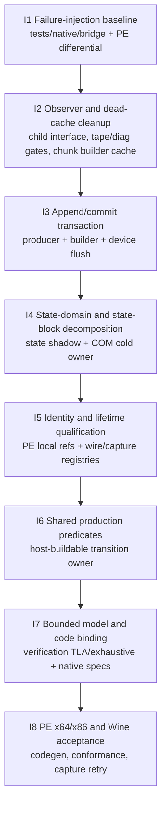

# PE Recorder Spec

Companion to [requirements.md](requirements.md). This document owns the target
design; [gap.md](gap.md) records where the current implementation or evidence
does not yet satisfy it.

## 1. Ownership and boundaries

| Concern | Exact owner | Must not own |
|---|---|---|
| COM validation, app-visible state, getters | `D3D9DeviceImpl` in `src/d3d9/d3d9_pe_device_impl.hpp` and its cold COM TUs | Metal objects, unix queue state |
| State-domain value types and typed keys | `src/d3d9/d3d9_pe_state_shadow.hpp`, `d3d9_pe_const_shadow.hpp` | COM lifetime, capture journaling |
| Sparse normalization | `buildSparseState` / `addChunkContextSections` in `src/d3d9/d3d9_pe_producer.cpp` | consuming pending state before append acceptance |
| Record/chunk transaction | `CommandChunkBuilder` in `src/d3d9/d3d9_pe_chunk_builder.*` and `D3D9DeviceImpl::appendRecord` / `flushPendingCommandChunk` | D3D9 getter authority, Metal execution |
| PE local pinning | `D3D9PePendingCommandRetainer` in `src/d3d9/d3d9_pe_retainer.*` | wire identity semantics |
| Wire registry resolution | `WireObjectRegistry` in `src/d3d9/device_c_chunk_registry.*` | PE wrapper-pointer identity |
| Capture registry and settlement | Nullable heap-owned `PeCaptureState` in `src/d3d9/d3d9_pe_capture_state.hpp`, operated by `D3D9DeviceImpl` cold methods in `d3d9_pe_device_tape.cpp` | changes to app HRESULT or capture-off cadence |
| PE recorder diagnostics | Optional `PeDiagnosticsState` in `src/d3d9/d3d9_pe_diagnostics_state.hpp`, operated by cold helpers in `d3d9_pe_device_diag.cpp` and nullable hot gates | recorder protocol counters, pacing limits, semantic shadows, capture transaction state |
| State-block wrapper snapshot | `D3D9StateBlockImpl` in `d3d9_pe_device_child_misc.cpp` and `D3D9StateBlockShadow` in `d3d9_pe_stateblock_shadow.hpp` | expanding the tracked set during Capture |
| Import, replay, execution | unix importer and `CommandQueue` | reading PE `LiveShadow` or COM pointers |

`D3D9DeviceImpl::QueryInterface` remains declaration-only in
`src/d3d9/d3d9_pe_device_impl.hpp`, with its unchanged body out-of-line in
`src/d3d9/d3d9_pe_device.cpp`. It is the first declared non-pure, non-inline
virtual and deliberately anchors the vtable and inline virtual bodies in the
owning TU. `FlushPeRecorderForChild` is a private nonvirtual helper. Cold-
interface cleanup must preserve the QueryInterface placement unless codegen
measurement authorizes a different one.

## 2. State model

For a category `c` and qualified key `k`, recorder state is:

```text
S = <LiveShadow, PendingDelta, StateBlockRecorded, Builder, CaptureLedger>
LiveShadow[c, k]          = current D3D9-visible value
PendingDelta[c, k]        = newest value not represented by an accepted record
StateBlockRecorded[c, k]  = value in the fixed tracked set of a state block
```

`LiveShadow` is total over supported getter-visible state after defaults are
established. `PendingDelta` and `StateBlockRecorded` are partial maps. Typed
keys prevent accidental equality across domains such as render-state slot 7
and sampler slot 7. Their factories return a one-word bounded value or an
invalid sentinel; recorder boundaries reject the sentinel before mutation or
retain. `PeHotStateShadow::Transition`, private `Maintenance`, `Snapshot`, and
`Consumer` separate atomic live-plus-pending mutation, bounded maintenance,
read-only observation, and exact pending settlement. “Snapshot” is
a capability boundary, not global object immutability: the owning recorder may
continue mutation through its writer while readers cannot obtain mutable table
or category access. The StateBlock transaction exposes phase-checked
`withRecordingWriter` callbacks and
`recordedSnapshot()`; wrapper snapshots use their own writer/snapshot views.
Flat storage and raw category enumeration remain implementation details.

### 2.1 Category table

| Category | Qualified key / value | `LiveShadow` owner | `PendingDelta` form | `StateBlockRecorded` policy | Wire/cold disposition |
|---|---|---|---|---|---|
| Render state | `RenderStateSlot -> u32` | `renderStateShadow` | `pendingRenderStates` | last explicit write per touched key; recording does not mutate primary state | render-state sparse section |
| Texture-stage state | `(TextureStageIndex, TextureStageStateType) -> u32` | `tssShadow` | `pendingTss` | last write per touched pair | TSS sparse section |
| Sampler state | `(SamplerIndex, SamplerStateType) -> u32` | `samplerStateShadow` | `pendingSamplerStates` | last write per touched pair | sampler sparse section |
| Texture binding | `(TextureKind, SamplerIndex) -> PeWireObjectRef?` | `textures_` plus binding view | `pendingTextureMask` + live ref | last binding per touched slot | texture handle section |
| Stream source / frequency | `(BufferKind, stream) -> {ref, offset, stride}` plus `(stream) -> frequency` | `streamSrc_`, `streamOff_`, `streamStr_`, `streamFreq_` | source mask and live binding; frequency is an independent tracked table | each explicit setter tracks only its semantic aspect; Apply preserves the unrecorded aspect | stream source section plus explicit frequency |
| Vertex/pixel shader | `(ShaderKind, stage) -> ref?` | `vs_`, `ps_` | `pendingVs`, `pendingPs` | last binding per touched stage | shader handle section |
| Vertex input | `FvfKey` or `(VertexDeclKind, singleton)` | `fvf_`, borrowed `vdecl_` | `pendingFvf`, `pendingVdecl` | declaration touch fixes the tracked singleton; candidate/saved wrapper owns the AddRef through synchronous Apply, and Commit borrows without an extra retain/transfer | vertex-input section |
| Index buffer | `(BufferKind, singleton) -> ref?` | `indexBuf_` | `pendingIb` | last binding | indexed-draw index section only |
| Render targets/depth | `(SurfaceKind, rtSlot)` / `(SurfaceKind, depth)` | `rtSlots_`, `dsSurface_` and explicit masks | `pendingRtMask`, `pendingDs` | last binding per touched slot | attachment sections |
| Viewport/scissor/material | singleton typed value | dedicated PE value | one pending bit each | last touched singleton | scalar sparse section |
| Transform | `TransformState -> D9CMatrix` | `transformShadow` | `pendingTransforms` | `SetTransform` records last value; `MultiplyTransform` is the enumerated prior-value operation and Wine-compatible capture exception | transform sparse section |
| Clip plane | `clipPlane[0..5] -> float4` | `clipPlaneShadow` | pending mask | last value per touched plane | clip-plane section |
| Light / enable | `lightSlot -> D9CLight/bool` | light arrays/mask | separate value and enable masks | last value per touched slot | light and enable sections |
| Shader constants | `(stage, scalarKind, registerRange) -> bytes` | `PeConstShadowBlock` values | dirty ranges | fixed tracked ranges; Capture refreshes values only | standalone or inline constant-range section |
| Ordered commands | command ordinal | not state | not commutative state | not captured as ordinary state unless D3D9 explicitly says so | command record / barrier |

`PeWireObjectRef::object` is a local lifetime aid in the table, never a wire
field. Any PE-local lookup or pending-lifetime query uses the qualified pair
`(identity.kind, object)`; the builder's presence accelerator and its bounded
overflow fallback preserve that qualification. The wire form is always
`(kind, generation, objectId)`.

### 2.2 Algebra

For an ordinary validated setter outside state-block recording:

```text
Set(c, k, v):
  if LiveShadow[c, k] = v and k notin PendingDelta[c]: no-op
  else LiveShadow'[c, k] = v
       PendingDelta'[c, k] = v
```

For the same key, `Set(k, a); Set(k, b)` is observationally equivalent to
`Set(k, b)` at the next record boundary. For independent keys, the final maps
commute and canonical serialization may order by qualified key. These equations
do not permit reordering across a command ordinal, Begin/End, barrier,
resource/alias transition, or prior-value operation.

Preparing a record computes a non-owning candidate projection:

```text
Candidate = Normalize(LiveShadow, PendingDelta, explicit draw/control input)
```

Only accepted settlement through the consume capability may perform:

```text
PendingDelta' = PendingDelta \ represented(Candidate)
```

Thus an accepted record followed by ordered unix replay reconstructs the same
effective state as `LiveShadow` at that record's ordinal. Failure returns the
pre-attempt state, including dirty constant ranges and oversized-table rows.
Acceptance validates every bounded wire key first, so one malformed row cannot
partially erase an otherwise valid batch.

The effective `FULL_SNAPSHOT` disposition is part of the prepared producer
state and remains attached through emission and settlement. A snapshot
projects clean `LiveShadow` scalar rows without requiring fabricated
`PendingDelta` tokens. Every represented pending row undergoes canonical-order
and exact category/key/index/value validation and is consumed exactly once.
When the default-off cold scalar observer is enabled, that same transition also
checks its setter-source and builder-record ordinals; this conditional witness
does not prove that the default path retains a source ordinal. Rows not
represented by a bounded projection remain pending. If an accepted append
cannot settle, the recorder enters the existing fail-stop state instead of
returning `S_OK` with stale state.

### 2.3 State-block transitions

| Operation | Success transition | Failure transition |
|---|---|---|
| Begin | flush older pending work; create an empty recorded domain; enter Recording | preserve prior domains; do not enter Recording |
| Explicit Set while Recording | validate; last-write-wins in `StateBlockRecorded` only; do not mutate `LiveShadow`, `PendingDelta`, or backend primary state | no new tracked key or value |
| Prior-value operation while Recording | apply to primary live/backend state without enlarging `StateBlockRecorded`; `MultiplyTransform` is the current enumerated case | preserve primary and recorded domains on pre-effect failure |
| End | flush ordering work; freeze the tracked set; create the wrapper-owned snapshot; leave Recording without a restore replay | pre-backend failure preserves Recording; backend failure after entry or wrapper allocation failure after accepted backend End leaves Recording, discards the unpublished PE candidate, and poisons the recorder |
| Capture | refresh values for the existing tracked keys/ranges only | preserve prior captured snapshot |
| Apply | flush and prevalidate the fixed set, apply the backend once, then publish the fixed PE shadow directly without allocation or fallible setters | pre-backend failure preserves PE/backend state; a backend failure latches recorder poison because the unix operation may have partially mutated |

The implemented PE recorder owns one closed `PeStateBlockTransactionState`
whose API advances Recording, inside-End publication, poison/reset, candidate
release, and prepared-Apply transfer as one transaction domain. It contains
one fixed typed `StateBlockRecorded` candidate
covering keyed render/TSS/sampler/transform state, texture, and independently
tracked stream source tuples (buffer/offset/stride) and stream frequencies,
index/VS/PS/FVF/vdecl bindings,
render-target/depth attachments, viewport/scissor/material, clip planes,
lights/enables, and all six shader-constant kinds. Pointer slots are opaque in
the native value owner; the PE device takes and releases their COM references
at candidate replacement, End snapshot, Capture refresh, and Begin/reset
boundaries. Apply staging uses category-qualified texture, stream, shader,
index, render-target, and depth values with private occupancy masks; identical
COM identities in multiple occupied slots retain and settle independently.
A second write to one occupied qualified staging cell is rejected before
AddRef and leaves the first value intact, so the occupancy bit and retained
owner cannot diverge. A successful Begin increments a monotonic recording
epoch. `RecordingCapability` captures that epoch and rechecks both it and the
Recording phase on every scoped writer call; Reset does not rewind the epoch,
and exhaustion poisons instead of wrapping.
`CandidateOwnedVertexDeclaration` is the candidate snapshot's one owned retain
of a vertex declaration. The device's bound `vdecl_` slot is borrowed: binding
and clearing it do not AddRef/Release that slot; an implicit-FVF declaration is
kept alive only by `fvfDeclCache_`, while candidate capture/End ownership is
settled through the transaction visitor. This distinction is pinned by the
native duplicate-retain lifecycle case.
Explicit setters route to this candidate while recording, so
`LiveShadow`, `PendingDelta`, getters, backend state, and capture journaling
remain unchanged. Initial `CreateStateBlock` snapshots establish bounded
tracked sets from the current PE shadows using the typed `ALL`, `VERTEXSTATE`,
or `PIXELSTATE` disposition (including exact render/TSS/sampler key masks);
Begin/End snapshots use `Explicit` and copy only explicitly touched candidate
keys; later Capture refreshes those keys without enlargement. A source-only
record never changes the saved frequency, and a frequency-only record never
changes the saved source tuple.
`MultiplyTransform` uses the prior-value transition, persists primary live
state, and never enlarges the recorded transform set. Consequently the
sequence `SetTransform(B); MultiplyTransform(C)` inside Begin/End records `B`
while the multiply reads the pre-Begin primary value and publishes only its
result to primary state.

`d3d9_pe_stateblock_transition_table.inc` is the canonical serial/reference
matrix for Begin, End, Capture, Apply, Reset, and teardown. Production calls
`planPeStateBlockTransition`; the generator emits
`PeStateBlockTransitionTable.tla`, checks enum/table completeness, and the
bounded model requires each step to match its generated row. The model carries
duplicate-retain cardinality only. Native fake-COM tests separately demonstrate
one retain and one release or transfer per occupied category/slot for repeated
object identities; the model is not a proof of COM implementation behavior.
The same model retains an issued capability across End/Reset and a second
Begin. `StaleCapability` deliberately checks phase without epoch and must
violate `NoStaleCapabilityWrite`; the native witness binds that abstract ABA
trace to the production capability. Concrete same-slot overwrite/AddRef
conservation remains native evidence rather than an abstract COM model.
The same table defines `PoisonRequested` for every non-terminal phase. Its
production effect discards candidate ownership, releases all occupied Apply
staging, preserves capture, and enters or remains in `Poisoned`. There is no
`Terminal` poison row: teardown is absorbing and writes are rejected. The
`PoisonLeak` TLC mutation preserves ownership and must violate
`PoisonOwnsNoCandidateOrRefs`.

The conditional recorder lock is one shared production guard. It covers
Create/Begin/EndStateBlock, Capture, Apply, every PE shadow/recording setter,
and Render Tape child destruction/mutation/ordered-control callbacks that
mutate `PeCaptureState` or its registry when `D3DCREATE_MULTITHREADED` or the
forced-lock setting requires it; the guard is a one-branch no-op on the
ordinary single-threaded hot path. The existing recursive contract permits
bounded internal append/flush re-entry, while callback validation remains
fail-closed and no external callback is invoked under a newly acquired lock.
Default-pool child ownership callbacks use this same guard, so `Reset`'s
legality read is serialized with concurrent resource creation/destruction on a
multithreaded device; the disabled lane keeps the existing plain counter and
only the guard's branch.
Apply preparation reserves live constant capacity and resolves implicit FVF
declarations before backend mutation. A live `SetFVF` resolves and publishes
its cached implicit declaration transaction before changing FVF/declaration
shadows or pending bits; backend null, wrapper null/allocation, and cache
allocation failures release their current owner exactly once and return a
failure HRESULT through the `noexcept` COM boundary. A failed backend Apply
enters explicit recorder poison and subsequent recording writes return `D3DERR_DEVICELOST`
deterministically, avoiding a second divergent stream when rollback is
unavailable. A backend Capture failure uses the same conservative poison
boundary; candidate/snapshot publication still occurs only after Capture
accepts. End backend/wrapper failure uses the same poison boundary because the
unix End owner consumes its recording flag before its remaining fallible work;
the specialized `SetRenderState` entry checks poison before its diagnostic/core
bypass. Poison survives failed Reset/ResetEx, including validation/backend
failure, together with pre-effect Apply staging. A successful backend
Reset/ResetEx clears poison and discards staged Apply retains only after the
backend accepts, restoring the PE recorder for subsequent writes.

## 3. Record and chunk transactions

### 3.1 Append transaction

The builder checkpoints record count, handle count, payload size, and retainer
acquisition before mutation. `PendingDelta` needs an equivalent represented-set
checkpoint even though it is owned outside the builder.

| Outcome | Builder | Retainer | `PendingDelta` | App result |
|---|---|---|---|---|
| pre-capacity flush fails | prior builder remains sealed or unsealed according to its own settlement; new record is unattempted | prior pins retained | new prepared token unchanged | failure; no emitter call |
| preparation/validation fails | unchanged | unchanged | unchanged | failure |
| payload/handle/retain append fails | rollback to all checkpoints | rollback new pins | unchanged | failure |
| `commitRecord` fails | rollback active record | rollback new pins | unchanged | failure |
| `commitRecord` succeeds | record becomes durable in current builder | pins owned by builder | remove exactly represented entries | success or continue to capacity settlement |
| post-append capacity commit is effect-unknown | sealed accepted record remains owned for Reset/teardown cleanup, not ordinary retry | pins retained | entries remain represented by the accepted record, not reintroduced as a duplicate | failure and recorder poison |

`buildSparseState` and every typed `prepare*Batch` are non-consuming.
`acceptPreparedSparseState`, `acceptInlineConstantDelta`, standalone constant
flush, and the four oversized adapters all consume through an Accepted
`AppendPlan`; Failed and Discarded plans retain pending state and the prepared
retry witness.

### 3.2 Seal, commit, retry, and capture settlement

| Event | Command disposition | Capture disposition | Lifetime/reset disposition |
|---|---|---|---|
| seal allocation/validation failure | no bridge effect; retry or explicit discard | no event | builder and pins retained |
| repeated seal | byte-identical view of the same builder | no duplicate event | no epoch advance |
| capture preparation rejects before bridge | command may still proceed under normal semantics | abort/reject diagnostic | capture must not alter chunk boundary or HRESULT |
| commit call not entered because a local pre-effect gate fails | no unix effect; exact sealed projection retryable | no materialization | builder and pending refs retained; no reset |
| entered bridge commit fails with no ABI disposition | effect unknown; fail-stop, never ordinary retry | abort current capture attempt; no capture publication | sealed builder and refs retained until successful Reset/teardown discard |
| bridge commit succeeds, capture off | accepted | no work beyond one disabled branch | drain logical refs without capture events as applicable; reset; warm epoch advances |
| bridge commit succeeds, capture active | accepted | materialize referenced objects and append exact command event first | drain pending refs; emit each admitted alias-before-parent destroy once; reset; warm epoch advances |
| explicit discard / poisoned Reset / teardown | never submitted | no command-dependent destroy | drain logical pending refs; release all current and warm pins; clear builder |
| healthy Reset/ResetEx | queued chunk is submitted at the ordering boundary before backend reset | settle as an ordinary accepted command | backend reset then clears PE state; a failed flush preserves the queue and does not enter reset teardown |

The production source of truth for this settlement is the fixed-size
`settleRecorderCommit` algebra in
`src/d3d9/d3d9_pe_commit_transition.hpp`. `flushPendingCommandChunk` binds
each seal, bridge, capture, drain, builder-reset, and warm-retainer transition
to that algebra while retaining the existing successful command cadence.
The current PE/unix ABI returns one HRESULT and cannot distinguish a
pre-effect rejection from a failure after publication or replay. Production
therefore maps every failed entered bridge call to the conservative
effect-unknown/fail-stop disposition. The sealed byte/count/handle/pin
projection remains intact only for Reset/teardown cleanup, not for ordinary
retry. Capture materialization rejection settles only the capture disposition
after an accepted command; it never retracts the command or resets the builder.
Pending Render Tape aliases are retired before their
parent, each ObjectDestroy is admitted once, and reset/warm-epoch advancement
occurs only after all pending references are drained. Explicit discard,
poisoned device reset, and teardown clear the logical builder and retained pins
without command-dependent destroy events or a warm-epoch advance. A healthy
device reset uses ordinary submit first, so queued observable work is not
silently dropped before the backend reset; only after that flush succeeds does
the existing reset-state teardown run.

### 3.3 Public failure containment

PE wrapper factories use non-throwing allocation plus constructor-exception
containment, clear caller outputs before creation, and release a backend handle
when wrapper publication fails. The device takes its factory reference only
after fallible construction work, and device/factory logging swallows its own
diagnostic allocation failures. Cache insertion catches allocation separately
so a recoverable failure maps to `E_OUTOFMEMORY` with both the cache and caller
retains balanced. Provider replay owns retained wrappers through an RAII guard;
presence-accelerator allocation failure selects the complete linear truth
source instead of escaping the C boundary. The unix
offload queue reports `RejectedPreEffect`, `Accepted`, or `EffectUnknown`:
`queuedBytes` and the ledger watermark publish only after deque adoption, and
effect-unknown ownership is drained by the fail-stop queue rather than released
again by the producer. Worker ownership is installed only after thread startup.
Deterministic native injection covers allocation before/after adoption and
thread-start rollback; the recorder settlement matrix separately covers bridge
pre-effect and entered-call effect-unknown behavior.

`RecorderSettlementProjection` is the bounded composition witness. It carries
one category/key/value/ordinal pending token, the concrete builder's active
record ordinal plus record/handle/payload counts, and the seal/bridge/capture/
drain/reset phase. `appendRecord`, `CommandChunkBuilder`, and
`flushPendingCommandChunk` use the same pure dispositions at their existing
branches; no new allocation, virtual call, wire field, or Metal owner is added.
Exact sealed bytes remain a native equality witness. The finite projection is
not a proof of vector layout, allocator behavior, C++ object representation,
or the cross-process ABI.

For one builder, `pendingChunkRefs` is boolean-shaped: a logical identity owns
zero or one pending reference regardless of wrapper release/reacquire churn.
Last-wrapper release transfers to this pending reference while the builder names
the identity. A successful commit settles command capture before the reference;
a failed commit preserves both. Texture-derived aliases remain generation
qualified until parent settlement. A pending alias may force one flush and one
lookup restart before replacement; exhaustion rejects capture without changing
capture-off behavior.

## 4. Identity and callback contracts

Two different relations are intentional:

```text
LocalIdentity = <kind, wrapperPointer>
WireIdentity  = <kind, generation, objectId>
```

Local dedup may compare both relations to detect an impossible identity/pointer
collision. Wire import first validates the complete handle array, then resolves
and retains in entry order. The current `WireObjectRegistry::resolveAndRetain`
holds its mutex while invoking the retain callback; this is safe only while the
callback is `noexcept`, direct AddRef/pin work, and non-reentrant. That premise
must be a predicate and a negative-control test, not an informal assumption.

The PE `g_wireObjectCache` was written by publication and destruction paths
but had no lookup consumer. It was dead global state, not an identity owner,
and is removed; any future local cache must key by `LocalIdentity`, declare
lifetime/eviction, and preserve the disabled-observer budget.

`WireObjectRegistry::RetainFn` is a `noexcept`, direct-retain callback. The
registry invokes it while holding the registry mutex so the resolved wrapper
cannot be erased between validation and AddRef/pin. Every registry entry point
fails callback re-entry closed before taking that mutex in every build type;
moving the callback outside the lock would require a separate pin-before-unlock
protocol and is not permitted as a shortcut.

PE COM operands use allocation-free concrete membership boundaries beside the
final wrapper classes. Each boundary first `dynamic_cast`s the public interface
to the exact local final type, then validates the owner, canonical public
subobject address, concrete/wire kind, nonzero generation/object ID, and any
surface-alias qualification before copying a kind-qualified raw/wire POD ref to
device code. SetTexture, render/depth targets, declarations/shaders,
streams/indices, UpdateTexture/UpdateSurface, StretchRect, ColorFill,
GetRenderTargetData, and ProcessVertices all use these gates before mutation.
Wrappers carry neither a second private `IUnknown` vptr nor a stored token.
This check rejects malformed cached identities but does not prove that a
generation remains live; live stale-generation rejection belongs to the unix
`WireObjectRegistry` batch-resolution boundary.

## 5. Hot/cold and observer boundary

The release path is judged with every diagnostic disabled. `appendRecord`,
state setters, draw construction, the builder, typed keys, and required pins are
hot. Render Tape, PE call history, formatting, stack capture, failure reports,
and state-block orchestration are cold, even where a hot method can branch to
them.

An enabled callback is synchronous and call-local. Its input includes the
qualified identity and exact span; it cannot retain the span, reenter the
recorder/registry, or add a flush. Disabled Render Tape and PE-call tracking do
not justify a virtual call or RAII scope per COM call. The diagnostic methods
have therefore been removed from the recorder boundary, and the device/child
entry helpers branch on their cached nullable owner or observer before an
enabled-only `PeCallScope` or `D3D9PeChildCallScope` lifetime begins. Within an
enabled owner, feature-specific cached gates ensure module-map, thread-sampler,
and debug-only enablement does not construct unrelated call scopes/timers or
read clocks. The null edge enters the functional core without scope
construction, timestamp reads, TLS/sample mutation, or a diagnostic callback.
Generic callbacks below a `noexcept` boundary are constrained by their exact
invocation signature. Recording writers, binding transitions, and both child
call-scope branches reject a potentially throwing callable at compile time;
the constraint adds no runtime state or branch.

`PeRecorderState` owns the producer-owned live/pending shadow, the separate
`StateBlockRecorded` domain, constant shadows, reusable binding/build scratch,
command builder, lock witness, and protocol counters. Keeping the recorded
domain outside `PeHotStateShadow` prevents state-block-only tables from being
part of the ordinary live/pending shadow layout.
`D3D9DeviceImpl` reads the transaction through `recorderState_` directly; the
device carries no reference aliases to recorder fields. This keeps ownership
auditable without changing the COM surface, adding a hot-path allocation or
moving the first declared virtual key function. Non-null app-supplied COM
operands take the TU-local concrete-membership gate; validation is confined to
the public bind/copy call and is not repeated during internal draw packet
construction. The result is a kind-qualified capability containing the exact
public-interface address, raw provider handle, wire ref, and concrete kind.
Binding setters cache the wire ref and StateBlock ownership traversal uses
typed policies, so no public `void*` ownership callback or trusted raw-cast wire
extractor remains.
`D3D9DeviceImpl` remains one concrete COM object with direct `PeRecorderState`
ownership. Its compact declaration shell preserves COM order while real hot and
cold translation units retain staged method definitions. Six independent plain
contexts — StateBlock, Buffer, SurfaceTexture, Query, Presentation, and
ShaderDeclaration — each contain one device pointer and only family-consumed
`noexcept` operations; `QueryInterface` remains the out-of-line key function in
`d3d9_pe_device.cpp`, while `FlushPeRecorderForChild` is nonvirtual.

The target internal boundary does not remove the Windows COM vtable. It splits
recorder operations by consumer into six independent typed contexts. Each
wrapper replaces its existing recorder pointer with one kind-scoped non-owning
context pointer and reaches private `.cpp` helpers, so wrapper size and vptr
count do not grow.
The device header then becomes a COM declaration/ownership shell over DOD state
aggregates; hot recorder, cold COM, Render Tape, diagnostics, and SWVP method
bodies stay out of line in their owning translation units. This migration must
preserve COM declaration order and the existing key-function anchor.
One nullable heap-owned `PeCaptureState` owns the complete Render Tape lifecycle: session,
live registry, oracle/digest/pixel/output storage, arm phase and ordinals,
tokens and skip selector, arm snapshots, admitted identities, first-access
ledger, abort reason, and completion ordinal. `makePeCaptureState` leaves that
owner null when capture/tracking is off, so the normal renderer carries only
one pointer and constructs no capture storage.

One independent optional `PeDiagnosticsState` owns PE recorder statistics,
decimated-scope accumulators, append/call attribution, present-cadence atomics,
VS-constant range buckets, and the sampler handle. It is allocated only when at
least one PE diagnostic gate is enabled. Chunk-commit clocks and accumulation,
UP-copy counters, append-family/call-name TLS writes, and hot setter timers are
all reached through its nullable gate. The pending-command retainer reserves
its entry arena and hash index from the builder handle capacity, so the >64
handle and default 256-handle retry paths remain warm without capacity growth.
Child wrappers keep a nullable concrete
`D3D9PeDiagnosticObserver`; diagnostic entry/return methods are not part of any
child service context. Object definition and state-shadow invalidation remain
private device operations.

Ordinary PE COM wrappers retain non-atomic reference counts under the D3D9
device/COM ownership contract. `D3D9StateBlockImpl` is the explicit atomic
exception because its snapshot ownership crosses device/child lifetime paths;
backend chunk retains remain private and do not alter public COM refcount
observations. The prepare/accept boundary is non-reentrant: preparation reads
into reusable scratch, and only acceptance settles pending state, so a failed
append cannot erase a later mutation.

## 6. Shared predicates and counterexamples

Implementation must provide one host-buildable, production-used transition
surface (names may follow local style) equivalent to:

| Predicate / transition | Production caller | Required bounded pins |
|---|---|---|
| `applyRecorderStateWrite` | every PE state setter | same-value, A→B→A, same-key LWW, independent-key permutation, prior-value exception |
| `settleRecorderAppend` | sparse append envelope and oversized/constant drains | failure at every allocation/append phase; no lost/duplicated pending entry |
| `settleRecorderCommit` / `planRecorderSettlement` | `flushPendingCommandChunk` / append capacity edges | seal fail, pre-effect retry, effect-unknown fail-stop, success, discard |
| `settleCapturePendingReference` | capture registry drain/replacement | wrapper churn, pending last release, alias-before-parent, bounded restart |
| `wireIdentityMayResolve` | builder and `WireObjectRegistry` | all kinds, zero/wrong/stale/cross-registry, slot reuse/exhaustion |
| `observerMayRun` | hot call and child-wrapper gates | disabled zero-work, enabled exact call-local callback, reentrancy rejection |

Minimal counterexamples that must stay executable:

1. Dirty constant range is projected, append fails, retry emits the range once.
2. An oversized pending table removes one batch, append fails, retry loses no row.
3. Two identity kinds reuse one pointer value; unqualified pointer caching must fail.
4. A local bridge pre-effect gate fails and preserves identical sealed bytes for
   retry; a failed entered call instead poisons and retains pins for recovery.
5. A last wrapper releases while its alias is pending; replacement before
   flush must fail, one flush-and-restart must preserve generation identity.
6. Capture preparation/event append fails; accepted app command and HRESULT are
   unchanged.
7. Observer disabled; no callback/scope/timestamp/cache write occurs.
8. Retain callback reenters registry while its lock is held; the guarded
   configuration must reject or the expected-failure control must deadlock/fail.
9. A newer pending `(key,value,ordinal)` follows an older durable row with the
   same key; value-only or ordinal-only mismatch must prevent the older row
   from settling the newer token.

`PeRecorderTransition.tla` checks the qualified state-write and append
prepare/accept/fail/discard transitions, including weak-fair settlement and
replay. Pending snapshots, durable records, and consumption witnesses carry
the per-key qualified `(key,value,ordinal)` token. `OnlyAcceptedConsumes`
forbids a consumption witness outside Accepted, while `AcceptedExactlyRepresented`
requires the Accepted witness to equal the prepared token set. Its
`ConsumeOnPrepare` configuration must violate `NoLostPending`, and its
`KeyOnly` stale-token configuration must violate `DurableTokenMatchesPayload`.
Independent `ConsumeOnFailure` and `UnderRepresentAccepted` controls must
violate `OnlyAcceptedConsumes` and `AcceptedExactlyRepresented`, respectively;
the `PreserveExisting` prior-value control must violate
`PendingMatchesLive` on the history-free `A -> B -> A` live-phase replacement
trace.
State-write and append rows are generated from their canonical table. Commit
rows are generated directly from `settleRecorderCommit` by
`gen_pe_commit_transition_table.py`; the verifier checks that generated matrix
before TLC and every commit action asserts its matching row. This keeps the
capture-skipped and WarmAdvanced-to-Unsealed edges tied to the production
algebra without duplicating a second hand-maintained C++ table.
`MaxOperations=2` is the explicit proof split: it covers the distinguishing
live `A -> B -> A` replacement and keeps End enabled so `Begin -> Set -> End`
still completes at the bound. Longer state-block write compositions remain in
the exhaustive native and PE layers rather than this temporal state space.
The `PeRecorderCommit.tla` model carries byte/count/handle/pin/pending-reference
tokens through pre-effect retry, all three capture dispositions (materialized, rejected,
and skipped), alias-before-parent destruction, reset, warm advancement, and
discard. `MaxOperations=8` bounds the combined seal/bridge retry budget while
successful phase/token transitions are finite. A successful settlement clears
the accepted-command witness and rearms a bounded next transaction, so the
`WarmAdvanced -> Unsealed` reuse edge is covered by safety and liveness; the
stuck-success mutation is an executable expected failure. The
parent-before-alias and early-reset mutations remain independent ordering
controls.
The bounded native transaction witness covers prepare/backend/commit failure
ordering and the conditional whole-operation lock interval. Production Apply
backend failure is fail-stop rather than rollback because the backend can
partially mutate; the poison latch is the explicit safety boundary. The
companion `PeStateBlockTransaction.tla` model checks staged-reference release,
capture disposition, poison, monotonic Recording epochs, stale-capability
rejection, and Reset recovery; successful Reset is the
coordinated task-1B policy, while Terminal is reserved for explicit teardown.
The commit model includes seal/bridge/capture-journal settlement, and the
native witness exercises bridge pre-effect retry, effect-unknown poison, and
capture rejection through the same pure helpers.

## 7. Acceptance matrix

### 7.0 PE ABI and codegen audit

The canonical audit is `scripts/check/audit_d3d9_pe_abi_codegen.py` with
`scripts/check/pe_device_abi_manifest.toml`. Its source-only invocation is a
native test and verifies declaration order, owner markers, state-size pins,
export contract, and fragment removal without opening a PE artifact. Cross
verification invokes the same tool once for each true builtin x64/x86 build.
The artifact lane first proves `wine_builtin_dll=true` and a matching release
toolchain/configuration; a directory name or a DLL's presence is never enough.
Per-symbol hot measurements are normalized to byte length, non-padding
instruction count, and direct-call count; linker fill instructions are
excluded from instruction counts while retained in byte length. The default
hot VS/PS constant-F setters additionally require a separate zero-delta proof
for bytes, non-padding instructions, and direct calls. Absolute addresses, timestamps, archive/relocation
ordering, whole-object hashes, and aggregate text size are intentionally
excluded because they are unstable or compiler-noisy.
The current manifest applies a strict zero-delta policy to every representative
hot symbol; any future exception must be a narrow, per-symbol documented policy
entry rather than an unbounded delta allowance.

The key function remains the out-of-line `QueryInterface` in
`d3d9_pe_device.cpp`; AddRef/Release and audited hot append/state/draw/Present
definitions remain inline where their measurements require it. Cold symbol
owners are explicit in the manifest, and the bridge schema/hash is unchanged.

| Contract | Exact owner | Current evidence | Acceptance still required |
|---|---|---|---|
| `R-CORE-REC-1.*`, `2.*` | PE state/constant shadows and producer | `dxmt9-pe-transition-algebra-spec`, `dxmt9-pe-shadow-native-spec`, `dxmt9-pe-typed-slot-spec`, `dxmt9-pe-stateblock-category-spec`, `dxmt9-pe-producer-differential-spec`, `dxmt9-core-stateblock-restore-spec`; compile-time closure rejects raw construction and mutable table/transaction access, while native malformed-batch rows prove all-or-nothing consumption; canonical x64/x86 PE builds pass | Wine/wild rerun for the changed wrapper; non-keyed category expansion remains outside this transition increment |
| `R-CORE-REC-3.1`, `3.1.1` | builder + append envelope | production `settleRecorderAppend`; builder rollback; failed-retry/exactly-once tests for inline constants, normal sparse state, and all four oversized typed tables. `CommandChunkBuilder` keeps raw byte append/overwrite private; closed POD registries and rule-checked section/constant/UP/Clear/table adapters cover every production variable-size callsite. Native concepts reject raw access and pointer-bearing/unregistered section types, while producer-matrix tests execute the typed paths. | no append-local gap in the scoped state families; the closed registry proves admission/type shape, not compiler-independent recursive reflection over arbitrary C structs; bridge/seal settlement is tracked below |
| `R-CORE-REC-3.2`–`3.6` | seal/commit/capture settlement and public failure containment | builder seal/rollback tests; production composed settlement and commit tables; composed capacity-pre flush/capture/drain/reset/warm plus CapacityPost model; four composed controls; `testPendingChunkLifetimeTruthTable`; `dxmt9-replay-offload-queue-spec` uses a real failing allocator and throwing replay callbacks with exact wrapper ownership checks, while labeling the post-adoption ambiguity control synthetic. Exact changed-model state counts are intentionally not reused. | Wine bridge/capture fault injection remains open; entered-call ambiguity is fail-stop under the unchanged ABI and recovers only through explicit Reset/teardown discard |
| `R-CORE-REC-4.*` | `PeWireObjectRef`, builder dedup, `WireObjectRegistry`, capture registry, TU-local concrete COM membership | `dxmt9-chunk-record-registry-spec` includes all-method callback re-entry rejection; `WireObjectRegistry.tla`; render-tape identity tests; `dxmt9-pe-com-membership-spec` covers the post-RTTI ten-kind owner/public/wire/alias member matrix; canonical x64/x86 PE builds instantiate the RTTI boundary | Wine foreign-wrapper COM-boundary conformance remains required; native predicates do not prove runtime Wine membership behavior |
| `R-CORE-REC-5.1` | `D3D9DeviceImpl::assertRecorderThreadConfined` / recorder lock | `R-BACK-43.5` audit and shared helper | retain exact owner declarations as decomposition lands |
| `R-CORE-REC-5.2`–`5.3` | `PeRecorderState`, nullable `PeCaptureState`, nullable `PeDiagnosticsState`, hot device TU, cold tape/diag TUs, child interface | direct `recorderState_` ownership with audited reference aliases removed; compile-time `PeRecorderState` pins exclude the default-off scalar ledger, whose nullable cold owner allocates only under its explicit gate; capture/diagnostic lifecycle tests cover disabled/enabled allocation, callback, clock, owner/source, observer-vtable, COM-ref, and key-function pins | broaden instruction/code-size coverage across representative methods and add Wine/wild enabled-diagnostic evidence; no runtime performance result is claimed by native pins |
| `R-CORE-REC-6.*` | shared transition table plus verification owners | Production transition/commit/settlement/value tables feed generated TLA tables; freshness checks precede TLC; native exhaustive rows cover state-write, recorder settlement, repeated Capture/Apply values, and failure controls. The complete `dxmt9-verify-tla` multi-model bundle passes in the integrated tree. | exact semantic cross-projection across the heterogeneous append envelope and Wine bridge/capture fault injection remain open |

The host suite can compile shared headers and extracted value/predicate owners,
but cannot directly compile or execute the Windows-only COM TUs. Therefore
host-native predicates and differential fixtures must be paired with PE x64/x86
build/conformance evidence rather than described as substitutes for it.

## 8. Sequential implementation DAG

Ordering is normative because later steps depend on failure semantics proved by
earlier steps and several steps touch the same hot files.



At each step, preserve the PE/unix ABI, `QueryInterface` key-function
placement, and capture-off chunk cadence unless that step explicitly owns and
measures the change. No step may use a later wild run to waive an earlier
transaction or model/code gate.
