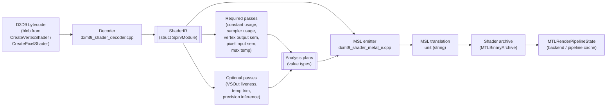

# Shader IR and Translator Design

This document describes how the dxmt9 shader translator implements the
contracts in `requirements.md`. It owns the ordering, ownership, and failure
behaviour of the path from D3D9 bytecode to a Metal-compilable MSL translation
unit, and it records the performance-driven design decisions that shaped the
current pass / emit architecture.

Two themes run through every section:

1. **The IR is dxmt9's own internal IR**, not SPIR-V, AIR, LLVM IR, or DXIL.
   The current struct is misleadingly named `SpirvModule`; the spec-level
   term is *ShaderIR*. Renaming is tracked as a non-blocking cleanup in
   `specs/gap.md`.
2. **Every pass is a pure value transform.** The translator must remain
   exercisable without Wine, Metal, or GPU timing. This is the
   `codebase_conventions` rule applied to the shader layer.

---

## 1. Pipeline Overview



Ownership map:

| Stage | File | Owns |
|---|---|---|
| Decode | `dxmt9_shader_decoder.cpp` | bytecode → IR, hash, semantic decode |
| Required passes | `dxmt9_shader_decoder.cpp` (collect* helpers) | constant, sampler, VS/PS semantic, max temp |
| Optional passes | (mixed; some inline in emitter today) | liveness, trim, precision |
| Emit | `dxmt9_shader_metal_ir.cpp` | IR + plans → MSL string |
| Cache | `dxmt9_shader_archive.cpp`, `dxmt9_pipeline_cache.cpp` | hash key, archive load/save, prewarm |
| FFP path | `dxmt9_ffp_shaders.cpp` | `FFPKeyVS` / `FFPKeyPS` → MSL string |

Failure model:

- Decode failure → translator error returned to the D3D9 frontend; no IR.
- Pass failure → assert in debug, surfaced as translator error in release;
  the emitter must never run on an invalid plan.
- Emit failure → assert. A well-formed IR + plan combination is a translator
  contract (§5 of `requirements.md`).
- MSL compile failure at archive build → translator bug; surfaced as an
  archive load error and a `dxmt9-metal` log line.

---

## 2. IR Data Model

### 2.1 Struct Shape

```cpp
struct SpirvModule {              // spec name: ShaderIR
  std::vector<u32> words;         // raw D3D9 token stream
  u64 hash = 0;                   // stable 64-bit hash of `words`
  bool usesTexture = false;
  D3DShaderStage stage = D3DShaderStage::Vertex;
  u32 major = 0;
  u32 minor = 0;
  std::array<TextureType, kMaxSamplers> samplerTextureTypes{};
  std::vector<D3DDecodedInstruction> instructions;
};
```

Properties:

- `words` is the canonical hash input. Two shaders with byte-identical
  `words` are byte-identical inputs (R-CORE-SHADER-1.4).
- `instructions` is the decoded form consumed by every analysis pass and by
  the emitter. It owns its operand storage; passes treat instructions as
  read-only value views.
- `samplerTextureTypes` is filled by the decoder from `dcl_*` sampler
  declarations and feeds the precision pass's "texture-coordinate at sample
  site" rule (R-CORE-SHADER-3.4).

### 2.2 Decoded Instruction

`D3DDecodedInstruction` (in `dxmt9_d3d9_bytecode.hpp`) preserves:

- opcode token;
- operand list with `D3DRegisterRef` (kind + index + relative-address flag);
- per-operand swizzle, write mask, source modifier, dest modifier;
- `_pp` (partial precision) hint flag;
- relative-address tokens parallel to operands (when present).

The `_pp` flag is the load-bearing input to the precision pass (§4). It must
survive decoding intact.

### 2.3 Naming Cleanup

The `SpirvModule` name predates the dxmt9 fork and is retained today to avoid
a wide rename churn. The migration target is:

- Spec text: always *ShaderIR* or *IR*.
- Source: alias `using ShaderIR = SpirvModule;` introduced at the decoder
  header, then incrementally rename callers. Tracked as a `gap.md` cleanup
  row.

---

## 3. Semantic Translation

This section migrates content from `specs/d3d9/design.md` §5 / §7 / §8 so
that semantic rewrites and the IR live in one place. `specs/d3d9/design.md`
will carry a short summary and a cross-reference to this section.

### 3.1 Fixed-Function Pipeline Key

When `IDirect3DDevice9::SetVertexShader(NULL)` or
`SetPixelShader(NULL)` is in effect, the D3D9 core derives `FFPKeyVS` /
`FFPKeyPS` from `DeviceState`. Both keys are value types and carry no
pointers (R-CORE-SHADER-2.1).

**FFPKeyVS** encodes (bit-packed):

- `lightingEnabled`, `specularEnabled`, `normalizeNormals`.
- Per-light `(enabled, type)` for lights 0..7.
- `colorMaterialMode` per channel (emissive, ambient, diffuse, specular).
- `fogMode`, `fogFromVertex`, `rangeFog`.
- Per stage: `texCoordGen` (TCI mode), `texTransformFlags`.
- `vertexBlend`, `indexedVertexBlend`.

**FFPKeyPS** encodes (bit-packed):

- Per stage: `colorOp`, `colorArg1`, `colorArg2`, `alphaOp`, `alphaArg1`,
  `alphaArg2`, `resultArg`, `texType`, `texCoordIndex`.
- `fogMode` (for pixel fog when `!fogFromVertex`).
- `alphaTestEnable`, `alphaTestFunc`.

The FFP path emits MSL directly without IR construction; the cache key is
the FFP key itself plus the same per-context inputs as the bytecode path
(see §7).

### 3.2 Half-Pixel Offset Injection

D3D9 pixel centres sit at integer screen coordinates; Metal centres sit at
half-integer coordinates. Without correction every 3D draw is shifted by
0.5 pixels.

**Programmable VS**: after the instruction that writes `oPos` (or `o0` in
vs_3_0), inject `oPos.xy += c_fixup.xy * oPos.w`. `c_fixup` is supplied
through the translator-injected constant block as
`(1 / viewportWidth, 1 / viewportHeight)`.

**FFP shaders**: the FFP emitter includes the same `c_fixup` add in the
generated MSL.

**`D3DFVF_XYZRHW` (pre-transformed) inputs**: convert screen-space
`(x, y, z, 1/w)` to Metal NDC inside the vertex shader:

```
metal_ndc.x =  (x / vp.Width)  * 2.0 - 1.0
metal_ndc.y = 1.0 - (y / vp.Height) * 2.0
metal_ndc.z = z
metal_ndc.w = 1.0 / rhw
```

### 3.3 Texture V-Axis

Programmable pixel shaders preserve D3D9 UVs verbatim. The translator must
not add a default `v = 1.0 - v` rewrite around any sample opcode
(R-CORE-SHADER-2.6).

If a texture appears vertically inverted, the bug lives in:

- resource upload / readback orientation;
- surface addressing;
- viewport / vertex mapping;
- the application's own shader math.

It does not live in the translator. Two debug-only bisect flags
intentionally keep these contracts separable:

| Flag | Scope | Default contract |
|---|---|---|
| `DXMT_DEBUG_FLIP_VERTEX_Y` | translated VS clip-space output | off; may emit `out.position.y = -out.position.y` for raster-debug only |
| `DXMT_DEBUG_FORCE_PIXEL_V_FLIP` | translated PS texture sampling | off; may emit `1.0 - v` only to prove a regression is caused by an accidental sampler V inversion |

### 3.4 Alpha Test

`D3DRS_ALPHATESTENABLE` / `D3DRS_ALPHAFUNC` / `D3DRS_ALPHAREF` has no Metal
hardware equivalent. The translator emits a `discard_fragment()` conditional
at the end of the pixel shader:

```metal
// for D3DCMP_LESS, reference value r:
if (!(outColor.a < r)) discard_fragment();
```

The reference value rides the translator-injected constant block. Each
distinct `(alphaTestEnable, alphaTestFunc)` pair maps to its own cached
shader variant (R-CORE-SHADER-2.9).

The alpha-test variant key is part of `ShaderSourceContext` and participates
in the IR cache key (§7).

---

## 4. Precision Inference Pass

This pass is the architectural successor to the current text-rewrite
`DXMT9_FS_HALF_PRECISION` path. It does not exist in the codebase today; a
`gap.md` row tracks its implementation work. The design below specifies the
shape it must have when implemented.

### 4.1 Inputs and Outputs

Input:

- The IR (`SpirvModule`).
- An optional paired-stage plan: for a VS this is the FS pixel-input
  semantics + (when available) the FS precision plan; for a FS this is the
  VS output precision plan.

Output: `ShaderPrecisionPlan`, a value type:

```cpp
enum class Precision : u8 { Float, Half };

struct ShaderPrecisionPlan {
  std::vector<Precision> tempRegPrecision;   // r0..rN
  std::vector<Precision> outRegPrecision;    // oT0..oTN, oD, oPos, etc.
  std::vector<u32>       boundaryCastSites;  // instruction indices where
                                             // emitter must cast operand
};
```

### 4.2 Algorithm

The pass is a forward dataflow on a small register file:

1. Seed every register's precision from the §3.4 mandatory-Float regions:
   - position output, depth output: `Float`.
   - texture-coordinate operand at every sample site: `Float`.
   - every register sourced by a Float-only opcode: `Float`.
2. Seed remaining temps with `_pp` hint: `Half` if `_pp` set on at least one
   write; otherwise `Float` (conservative).
3. Propagate `Float` forward: any temp written from a `Float` source becomes
   `Float`.
4. Insert boundary cast sites where a `Half`-classified value flows into a
   `Float`-classified consumer or vice versa.

The pass terminates because the lattice has two values and propagation is
monotonically Float-ward.

### 4.3 Boundary Cast Policy

A cast site is `(instruction index, operand index, target precision)`. The
emitter is responsible for emitting the cast when it reaches that operand;
the pass does not modify the IR.

Cast direction is `half ↔ float` only. Vector width is preserved.

### 4.4 VS-First Strategy

The performance evidence in §8 motivates emitting `Half` for VS outputs
*before* converting fragment shader bodies. A VS-only precision plan with
`tempRegPrecision = Float` and `outRegPrecision = Half` (subject to §3.4)
exercises the half-precision path without crossing FS-side boundary
hazards.

This makes the first useful implementation step relatively small:

1. Implement the pass with `outRegPrecision` populated and
   `tempRegPrecision` left at `Float`.
2. Extend `ShaderSourceContext` to carry an `enableHalfVSOut` flag.
3. Have the VS emitter respect `outRegPrecision` for the VSOut struct.
4. Have the FS emitter accept `half` stage-in fields for matching slots.

### 4.5 Cache Key Contribution

The plan contributes to the cache key by serialising
`(outRegPrecision, tempRegPrecision)` into a fixed-width descriptor and
mixing it into the hash. `boundaryCastSites` is derived from the
precision vectors and need not be hashed separately.

---

## 5. Other Analysis Passes

### 5.1 Required Passes (Already Implemented)

Implemented in `dxmt9_shader_decoder.{hpp,cpp}` as free `collect*` helpers.
Each is a pure function over `const SpirvModule&`:

| Pass | Output | Drives |
|---|---|---|
| `decodeVertexShaderInputLayout` | `VertexShaderInputLayout` | VS input attribute layout |
| `collectVertexOutputSemantics` | `VertexOutputSemantics` | which VS outputs are written and to what D3DDECLUSAGE |
| `collectPixelInputSemantics` | `PixelInputSemantics` | which PS inputs are read and centroid mode |
| `pixelColorOutputCount` | `u32` | how many MRT outputs |
| `pixelWritesDepth` | `bool` | whether `oDepth` is written |
| `pixelUsesTexcoordOut` | `bool` | drives VSOut layout selection |
| `collectPixelSamplerUsage` | per-slot `bool` | sampler binding minimisation |
| `collectConstantUsage` | `ConstantUsage` | constant-buffer slot range |
| `shaderUsesPredicateRegisters` | `bool` | predicate emission |
| `maxTempIndex` (inside `ConstantUsage`) | `u32` | sizes the emitted `r[]` array |

These passes are the minimum set required for a correct default emit
(R-CORE-SHADER-4.5).

### 5.2 Optional Passes

| Pass | Current opt-in | Status | gap.md row |
|---|---|---|---|
| VSOut liveness | `DXMT9_TRIM_UNUSED_VARYINGS` | implemented, opt-in | tracked |
| Vertex temp-array trim | `DXMT9_TRIM_VERTEX_TEMPS` | implemented, opt-in | tracked |
| VS output scratch trim | `DXMT9_TRIM_VS_OUTPUT_SCRATCH` | implemented, opt-in | tracked |
| Precision inference (§4) | (target: extend `DXMT9_FS_HALF_PRECISION`) | not implemented | new row |

Each optional pass produces a value-type plan and participates in the cache
key only when enabled (R-CORE-SHADER-4.7). When disabled, the emit must match
the historical default; this is the property that prevents archive
invalidation when a pass is added.

### 5.3 VSOut Liveness Pass

Input: VS IR, FS pixel-input semantics.

Output: `VSOutLayout` (per-field emit/omit booleans for texcoords, color,
secondary color, fog factor, point size). Position is always emitted.

The pass walks every VS instruction that writes an `oT*`, `oD*`, `oFog`, or
`oPts` register and intersects the writer set with the FS reader set. A
field is emitted only when both sides reference it.

The probe variants `DXMT9_TRIM_UNUSED_VARYINGS`, `minimalVSOutLayout`,
`positionOnlyVSOutLayout`, and `applyVSOutProbeOverrides` are the current
opt-in surface and remain available for A/B experiments.

---

## 6. MSL Emitter

### 6.1 Inputs

The emitter accepts:

- the IR;
- the `ShaderSourceContext` (FFP variant key, prelude options, argbuf
  layout id, alpha-test variant key, debug-toggle state);
- every enabled pass's plan output (precision plan, VSOut layout, trim
  plans).

### 6.2 Output

One MSL translation unit string per shader stage. The string is the unit of
storage in the shader archive (§7).

### 6.3 Determinism Rules

- Internal traversal order must be deterministic. Iteration over per-slot
  arrays uses index order; iteration over instructions uses IR order.
- The emitter must not embed timestamps, pointer values, or process IDs in
  comments or whitespace.
- The shared prelude (`dxmt9_shader_sources.{hpp,cpp}`) must be byte-
  stable for a given `ShaderPreludeOptions` value.

### 6.4 No Validation

The emitter assumes its IR is well-formed (R-CORE-SHADER-1.5 enforced by the
decoder) and its plans are consistent (R-CORE-SHADER-4.9 enforced by the pass
layer). Validation in the emitter is a contract violation: every check
must live earlier.

The single exception is the precision-plan precondition assert
(R-CORE-SHADER-4.9): the emitter asserts that mandatory-Float regions are
classified `Float` before walking instructions, so the resulting MSL is
well-typed.

### 6.5 Boundary Cast Emission

When the precision plan emits a non-empty `boundaryCastSites`, the emitter
threads a small helper:

```cpp
std::string emitOperand(const D3DDecodedInstruction&, u32 operandIdx,
                        Precision target);
```

`target` is the plan-mandated precision at the consumer. The helper
returns a string with a cast wrapper iff the producer precision differs.

This is the seam where text-rewrite cannot replace IR-level inference:
operand precision is consumer-driven, and the cast string depends on the
producer's actual emitted type (`half3` vs `float3` vs scalar), which the
emitter knows only at emit time.

---

## 7. Cache and Hash

### 7.1 Hash Composition

The cache key for one emitted shader is:

```
cacheKey = hash64(
    irHash,                              // §2 hash
    shaderSourceContextKey,              // FFP variant, prelude options, alpha-test
    enabledPassPlanHashes...,            // precision, VSOut layout, trim plans
    halfPrecisionOptInBits,              // DXMT9_FS_HALF_PRECISION etc.
    debugToggleBits                      // V-flip, force-fragment-color, etc.
)
```

Every term that changes emitted MSL bytes must contribute. New optional
toggles must extend the key; new env vars that change emit must register a
bit. The audit gate `scripts/check/audit_perf_counter_callsites.py`'s sibling
for env vars is `agents/rules/environment_variables.rules.md` documentation
(R-CORE-SHADER-7.4).

### 7.2 Archive Lifecycle

- Load: at process init, when `DXMT_DISABLE_SHADER_ARCHIVE` is unset.
- Save: lazily on each successful PSO build of a not-yet-archived key.
- Prewarm: governed by `DXMT9_PREWARM`. `full` materialises every archived
  entry at init; `lazy` is the debug-build default and materialises on
  first use; `disabled` skips archive completely.

### 7.3 Stale-Cache Handling

The cache key composition above means a translator change that alters
emitted MSL for the same input automatically produces a different key.
Stale entries do not need explicit invalidation; they simply stop being
referenced and are evicted by the archive's LRU policy.

The risk surface is the opposite: a translator change that *should* alter
MSL but does not contribute a new term to the key. Audit coverage
(R-CORE-SHADER-8.1) is the primary defence.

---

## 8. Performance-Driven Decisions Log

This section folds the load-bearing findings from
`specs/perfomance.plan.md` into the IR design so future readers do not have
to mine a 19k-line file. Findings here are the basis for the precision and
VSOut architecture above.

### 8.1 Headline Finding (2026-06-04)

For 3DMark05 GT1 frame 50, the Xcode encoder counter
`VS Buffer Device Memory Bytes Written` reports **1627 MiB** of vertex-stage
buffer-write traffic. Of that, the dxmt CPU-side writers account for
**0.444 MiB**: the dominant traffic is firmware-owned Tiled Vertex Buffer
(TVB) and Parameter Buffer (PB) storage that Apple Silicon's vertex /
binning stage uses to materialise stage-out data, not an application
`MTLBuffer`.

This is the bottleneck the IR architecture targets. dxmt9 cannot reach
into the TVB / PB directly; it can only reduce the *work that the firmware
must store there*. Two levers remain:

1. **Reduce VSOut width** (already implemented as opt-in trim passes).
2. **Reduce VSOut precision** (the IR-level FP16 path, §4).

Lever 2 is the unresolved candidate. Lever 1 by itself was tested and
**did not move the VS buffer write counter** in the GT1 baseline (see
§8.2).

### 8.2 Rejected Hypotheses

Probes that were tested against the GT1 baseline and rejected as primary
owners of the VS buffer-write counter. The IR design must not bake any of
these in as the intended fix; the gap row for FP16 is the supersession.

| Hypothesis | Probe | Verdict |
|---|---|---|
| VSOut field omission moves VS buffer-write | `DXMT9_TRIM_UNUSED_VARYINGS`, `minimalVSOutLayout`, `positionOnlyVSOutLayout` | rejected — counter unchanged |
| Render-pass merge / split | (perfomance.plan probes) | rejected |
| State-bit ablation (alpha-test, cull, scissor, blend, fog) | `DXMT_DISABLE_*`, `DXMT9_PROBE_DISABLE_ALPHA_BLEND`, `DXMT9_PROBE_DEPTH_FUNC_ALWAYS` | rejected |
| RT metadata removal | `DXMT9_SUPPRESS_RT_PIXEL_FORMAT_VIEW`, `DXMT9_SUPPRESS_X8_RT_PIXEL_FORMAT_VIEW` | rejected (texture writes dropped, VS buffer-write unchanged) |
| Draw-call splits / merges | various probes | rejected (cost amplification) |
| Drop VSOut point-size only | `DXMT9_PROBE_DROP_VSOUT_POINT_SIZE` | rejected |
| Const-upload coalescing variants | `DXMT9_SPLIT_SPARSE_CONST_RECORDS` and inverse | rejected as VS-write owner |

Pattern: state-bit and RT-metadata changes do not move the firmware-side
VS write bucket because that storage is sized by *vertex count × stage-out
width × precision*, not by per-draw state shape.

### 8.3 Orthogonal Wins (Not IR-Layer)

The current best-validated GPU saving comes from runtime index-buffer
reorder for cache locality (LRU32 miss reduction):

- Opaque depth-write reorder (rows 50/0, 50/1).
- Screen-blend reorder (row 50/2, `DXMT9_OPTIMIZE_SCREEN_BLEND_INDEX_CACHE`).
- Combined with min-gain 10: **GPU −13.86%, VS buffer-write −13.19%**.

This is the perf ceiling for 3DMark05 GT1 as of 2026-06-04. It lives in
the draw-call and index-buffer path (`specs/backend/`), not in the IR
layer. The IR design records it for context only; no IR-layer change
should be motivated by index-locality findings.

### 8.4 Architectural Conclusion

The IR layer must:

1. Stop chasing VSOut width as the primary lever. Liveness passes remain
   useful for non-perf cleanliness (fewer dead fields aid readability and
   archive size) but they are not the perf fix.
2. Make **per-output VSOut precision** the load-bearing perf lever. This
   is the §4 precision pass with the §4.4 VS-first strategy.
3. Preserve the index-locality path's correctness invariants by not
   changing VSOut field *order* or *semantic mapping* in ways that would
   interact with the runtime reorder. (The reorder operates on indices,
   not on stage-out fields; the IR change is orthogonal.)

### 8.5 Out of Scope for the IR Layer

| Concern | Owner spec |
|---|---|
| `encode_draw_cpu_ms` CPU encode bottleneck | `specs/backend/` (separate track) |
| TVB / PB sizing on Apple Silicon | firmware (no dxmt9 lever; documented in `agents/rules/metal_debugging.rules.md` §5) |
| Pipeline state object selection | `specs/backend/` PSO design |
| Index reorder, draw-call batching, const-upload coalescing | `specs/backend/` |

---

## 9. Testing

### 9.1 Pass Golden Tests

Every pass listed in §4.2 (required) and §5.2 (optional, when enabled) has
a deterministic golden test:

- Input: a hand-built `SpirvModule` (or a decoded blob from a small
  reference shader).
- Output: snapshot the plan struct.
- Failure surface: any change to a pass's output shows as a snapshot
  diff; intentional changes update the snapshot.

These tests live under `dxmt9-shader-transform-spec` (or a successor
target). No Wine, no Metal, no GPU.

### 9.2 Emitter Determinism Test

For a fixed `(IR, plan, ShaderSourceContext)` triple, the emitter runs
twice and asserts byte-equal output. This catches non-deterministic
iteration sources (hash-map order, unstable sort).

### 9.3 Correctness Oracle (Half-Precision Gate)

The precision pass's promotion gate (R-CORE-SHADER-3.10) requires a
deterministic correctness oracle:

- Reference: float-emitted shader, executed on `shader_runner_dxmt9`
  against a fixed input grid.
- Candidate: half-emitted shader, same inputs.
- Compare per-pixel output within a documented tolerance (typically
  `lsb1` for colour, exact for depth).

The oracle is a gating CI test for any change that proposes to flip the
half-precision opt-in default to on.

### 9.4 Bytecode → MSL Snapshot

For the existing shader corpus (SFIV, 3DMark05 GT1, conformance
fragments), the translator emits MSL deterministically. A snapshot test
captures the MSL strings keyed by IR hash; intentional MSL changes update
the snapshot and force the reviewer to acknowledge the cache-invalidation
blast radius.

---

## 10. Verification Mapping

| Requirement | Evidence |
|---|---|
| R-CORE-SHADER-1.1..1.6 | `dxmt9-shader-bytecode-validation-spec` (decode), `dxmt9-shader-transform-spec` (IR shape), hash determinism asserted in those targets |
| R-CORE-SHADER-2.1..2.10 | `dxmt9-shader-transform-spec` semantic snapshots; runtime alpha-test, half-pixel, NDC probes in the `shader_runner_dxmt9` corpus under `tests/shader_runner/corpus/` |
| R-CORE-SHADER-3.1..3.10 | precision-pass golden test (per §9.1), half-precision correctness oracle (§9.3); both gated on the gap.md row until the IR-level pass exists |
| R-CORE-SHADER-4.1..4.11 | per-pass purity + determinism tests under `dxmt9-shader-transform-spec`; emitter precondition assert covered by emit-side cases in the same target |
| R-CORE-SHADER-5.1..5.5 | `dxmt9-shader-source-determinism-spec` (emitter determinism); MSL snapshot tests (§9.4); archive build at conformance run |
| R-CORE-SHADER-6.1..6.4 | shader-archive load/save test; env-var-flip cache-miss test |
| R-CORE-SHADER-7.1..7.4 | env-var documentation audit; dump-shader path exercised by `scripts/tools/finalize_3dmark05_perf_probe.sh` shader-dump matching |
| R-CORE-SHADER-8.1..8.5 | meson `dxmt9-shader-*` targets above; `specs/gap.md` rows for any unimplemented item |

Open gaps (live in `specs/gap.md`):

- **Precision inference pass** — not implemented; `DXMT9_FS_HALF_PRECISION`
  text-rewrite covers ~33% of SFIV's FS. Successor design above (§4).
- **VS-first half-precision opt-in flag** — design specifies; not yet
  wired (`enableHalfVSOut`).
- **Half-precision correctness oracle** — required by R-CORE-SHADER-3.10,
  R-CORE-SHADER-8.3; not yet built.
- **`SpirvModule` → `ShaderIR` rename** — naming cleanup, non-blocking.
