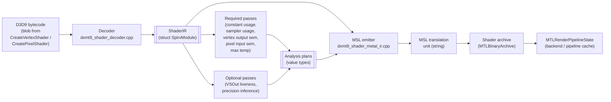

# Shader IR and Translator Spec

This document describes how the dxmt9 shader translator implements the
contracts in `requirements.md`. It owns the ordering, ownership, and failure
behaviour of the path from D3D9 bytecode to a Metal-compilable MSL translation
unit, and it records the performance-driven design decisions that shaped the
current pass / emit architecture.

Two themes run through every section:

1. **The IR is dxmt9's own internal IR**, not SPIR-V, AIR, LLVM IR, or DXIL.
   The current struct is misleadingly named `SpirvModule`; the spec-level
   term is *ShaderIR*. Renaming is tracked as a non-blocking cleanup in
   `specs/d3d9/gap.md`.
2. **Every pass is a pure value transform.** The translator must remain
   exercisable without Wine, Metal, or GPU timing. This is the
   `codebase_conventions` rule applied to the shader layer.

---

## 1. Pipeline Overview



Ownership map:

| Stage | File | Owns |
|---|---|---|
| Decode | `dxmt9_shader_decoder.cpp` | bytecode → IR, hash, semantic decode |
| Required passes | `dxmt9_shader_decoder.cpp` (collect* helpers) | constant, sampler, VS/PS semantic, max temp |
| Optional passes | (mixed; some inline in emitter today) | liveness, trim, precision |
| Emit | `dxmt9_shader_metal_ir.cpp` | IR + plans → MSL string |
| Cache | `dxmt9_shader_archive.cpp`, `dxmt9_pipeline_cache.cpp` | hash key, archive load/save, prewarm |
| FFP path | `dxmt9_ffp_shaders.cpp` | `FFPKeyVS` / `FFPKeyPS` → MSL string |

Failure model:

- Decode failure → translator error returned to the D3D9 frontend; no IR.
- Pass failure → assert in debug, surfaced as translator error in release;
  the emitter must never run on an invalid plan.
- Emit failure → assert. A well-formed IR + plan combination is a translator
  contract (§5 of `requirements.md`).
- MSL compile failure at archive build → translator bug; surfaced as an
  archive load error and a `dxmt9-metal` log line.

---

## 2. IR Data Model

### 2.1 Struct Shape

```cpp
struct SpirvModule {              // spec name: ShaderIR
  std::vector<u32> words;         // raw D3D9 token stream
  u64 hash = 0;                   // stable 64-bit hash of `words`
  bool usesTexture = false;
  D3DShaderStage stage = D3DShaderStage::Vertex;
  u32 major = 0;
  u32 minor = 0;
  std::array<TextureType, kMaxSamplers> samplerTextureTypes{};
  std::vector<D3DDecodedInstruction> instructions;
};
```

Properties:

- `words` is the canonical hash input. Two shaders with byte-identical
  `words` are byte-identical inputs (R-CORE-SHADER-1.4).
- `instructions` is the decoded form consumed by every analysis pass and by
  the emitter. It owns its operand storage; passes treat instructions as
  read-only value views.
- `samplerTextureTypes` is filled by the decoder from `dcl_*` sampler
  declarations and feeds the precision pass's "texture-coordinate at sample
  site" rule (R-CORE-SHADER-3.4).

### 2.2 Decoded Instruction

`D3DDecodedInstruction` (in `dxmt9_d3d9_bytecode.hpp`) preserves:

- opcode token;
- operand list with `D3DRegisterRef` (kind + index + relative-address flag);
- per-operand swizzle, write mask, source modifier, dest modifier;
- `_pp` (partial precision) hint flag;
- relative-address tokens parallel to operands (when present).

The `_pp` flag is an opt-in input to the precision pass (§4). It must survive
decoding intact, but it is permission to use reduced precision rather than a
request to quantize the destination value. Until a proved precision plan
classifies the complete value as `Half`, emission remains full precision.

### 2.3 Naming Cleanup

The `SpirvModule` name predates the dxmt9 fork and is retained today to avoid
a wide rename churn. The migration target is:

- Spec text: always *ShaderIR* or *IR*.
- Source: alias `using ShaderIR = SpirvModule;` introduced at the decoder
  header, then incrementally rename callers. Tracked as a `gap.md` cleanup
  row.

---

## 3. Semantic Translation

This section migrates content from `specs/d3d9/spec.md` §5 / §7 / §8 so
that semantic rewrites and the IR live in one place. `specs/d3d9/spec.md`
will carry a short summary and a cross-reference to this section.

### 3.1 Fixed-Function Pipeline Key

When `IDirect3DDevice9::SetVertexShader(NULL)` or
`SetPixelShader(NULL)` is in effect, the D3D9 core derives `FFPKeyVS` /
`FFPKeyPS` from `DeviceState`. Both keys are value types and carry no
pointers (R-CORE-SHADER-2.1).

**FFPKeyVS** encodes (bit-packed):

- `lightingEnabled`, `specularEnabled`, `normalizeNormals`.
- Per-light `(enabled, type)` for lights 0..7.
- `colorMaterialMode` per channel (emissive, ambient, diffuse, specular).
- `fogMode`, `fogFromVertex`, `rangeFog`.
- Per stage: `texCoordGen` (TCI mode), `texTransformFlags`.
- `vertexBlend`, `indexedVertexBlend`.

**FFPKeyPS** encodes (bit-packed):

- Per stage: `colorOp`, `colorArg1`, `colorArg2`, `alphaOp`, `alphaArg1`,
  `alphaArg2`, `resultArg`, `texType`, `texCoordIndex`.
- `fogMode` (for pixel fog when `!fogFromVertex`).
- `alphaTestEnable`, `alphaTestFunc`.

The FFP path emits MSL directly without IR construction; the cache key is
the FFP key itself plus the same per-context inputs as the bytecode path
(see §7).

### 3.2 Half-Pixel Offset Injection

D3D9 pixel centres sit at integer screen coordinates; Metal centres sit at
half-integer coordinates. Without correction every 3D draw is shifted by
0.5 pixels.

**Programmable VS**: after the instruction that writes `oPos` (or `o0` in
vs_3_0), inject `oPos.xy += c_fixup.xy * oPos.w`. `c_fixup` is supplied
through the translator-injected constant block as
`(1 / viewportWidth, 1 / viewportHeight)`.

**FFP shaders**: the FFP emitter includes the same `c_fixup` add in the
generated MSL.

**`D3DFVF_XYZRHW` (pre-transformed) inputs**: convert screen-space
`(x, y, z, 1/w)` to Metal NDC inside the vertex shader:

```
metal_ndc.x =  (x / vp.Width)  * 2.0 - 1.0
metal_ndc.y = 1.0 - (y / vp.Height) * 2.0
metal_ndc.z = z
metal_ndc.w = 1.0 / rhw
```

### 3.3 Texture V-Axis

Programmable pixel shaders preserve D3D9 UVs verbatim. The translator must
not add a default `v = 1.0 - v` rewrite around any sample opcode
(R-CORE-SHADER-2.6).

If a texture appears vertically inverted, the bug lives in:

- resource upload / readback orientation;
- surface addressing;
- viewport / vertex mapping;
- the application's own shader math.

It does not live in the translator. Two debug-only bisect flags
intentionally keep these contracts separable:

| Flag | Scope | Default contract |
|---|---|---|
| `DXMT_DEBUG_FLIP_VERTEX_Y` | translated VS clip-space output | off; may emit `out.position.y = -out.position.y` for raster-debug only |
| `DXMT_DEBUG_FORCE_PIXEL_V_FLIP` | translated PS texture sampling | off; may emit `1.0 - v` only to prove a regression is caused by an accidental sampler V inversion |

### 3.4 Alpha Test

`D3DRS_ALPHATESTENABLE` / `D3DRS_ALPHAFUNC` / `D3DRS_ALPHAREF` has no Metal
hardware equivalent. The translator emits a `discard_fragment()` conditional
at the end of the pixel shader:

```metal
// for D3DCMP_LESS, reference value r:
if (!(outColor.a < r)) discard_fragment();
```

The reference value rides the translator-injected constant block. Each
distinct `(alphaTestEnable, alphaTestFunc)` pair maps to its own cached
shader variant (R-CORE-SHADER-2.9).

The alpha-test variant key is part of `ShaderSourceContext` and participates
in the IR cache key (§7).

### 3.5 SM 1.x Pixel Shader Output Clamp

D3D9 specifies SM 1.x pixel shader colour output as saturated to `[0, 1]`.
Neither GLSL nor MSL clamps by default, so any reimplementation that targets
either language must add the clamp explicitly. wined3d's GLSL emitter does
this in `glsl_shader.c` for the same reason; dxmt9's MSL emitter must do
the same (R-CORE-SHADER-2.11).

The translator inspects the IR's shader-model major version. When it is `1`
(any of `ps_1_0` through `ps_1_4`), the emitter wraps the final pixel
output in `clamp(...)`:

```metal
// Float emit path, ps_1_x:
out.color = clamp(out.color, 0.0, 1.0);

// Half emit path (R-CORE-SHADER-3.7 selected Half for the output reg):
out.color = clamp(out.color, 0.0h, 1.0h);
```

SM 2.0 and 3.0 pixel shaders MUST NOT receive this clamp; they were
designed with extended dynamic range in mind, and clamping them silently
breaks HDR content. The version check is on the IR, not on a render-state
flag.

This is a translator obligation (a pure value transform per
R-CORE-SHADER-4.1), not a render-state setting. There is no D3D9 render
state to disable the clamp.

### 3.6 Reciprocal Instructions

`RCP` is emitted as a direct component-wise reciprocal. In particular, a
negative denominator remains negative and zero produces infinity. `RSQ` is
emitted as `rsqrt(abs(src))`, including the zero-to-infinity edge. An epsilon
clamp is not a legal robustness substitution for either instruction because
it changes observable D3D9 arithmetic near and below zero
(R-CORE-SHADER-2.12..2.13).

`POW` is emitted as `pow(abs(src0), src1)`. D3D9 defines the instruction over
the absolute value of the scalar base; forwarding a negative base directly to
MSL would produce NaN for non-integral exponents and can poison interpolated
vertex outputs (R-CORE-SHADER-2.14).

### 3.7 Pixel-Shader Position Input

D3D9 shader-model 3 `vPos` uses integer pixel-center coordinates; the Wine
`test_fragment_coords` oracle verifies this by requiring `frc(vPos.xy)` to be
zero. Metal fragment `[[position]]` uses half-integer pixel centers. The input
lowering therefore emits `float4(position.xy - 0.5, position.zw)` for the
position `D3DSPR_MISCTYPE` input. The conversion is local to `xy`: depth and
homogeneous components remain those supplied by Metal (R-CORE-SHADER-2.15).

### 3.8 Texture Instruction Controls

The decoder carries shader-model 2 and 3 instruction controls separately from
the `TEX` opcode. The emitter consumes that field rather than treating every
decoded `TEX` as an ordinary sample (R-CORE-SHADER-2.16):

- ordinary `TEX` samples with the supplied coordinate;
- `TEXLDP` divides a non-cube coordinate vector by its fourth component before
  selecting `xy` or `xyz` for the Metal sample;
- `TEXLDB` passes the coordinate's fourth component as a Metal LOD bias;
- when `D3DSAMP_MIPMAPLODBIAS` is also non-zero, its value is added to the
  instruction bias so neither D3D9 bias source is lost.

Cube projection follows D3D9's cube-sampler behavior and does not divide the
direction vector. FETCH4/gather selection consumes the same effective
coordinate as the ordinary sampling branch, but deliberately suppresses both
TEXLDB and sampler LOD bias because gather has no mip-bias form and D3D9 FETCH4
compatibility treats `texldb` like ordinary `texld`. Any unsupported or
combined instruction-control value is rejected before MSL can be compiled;
silently falling back to ordinary `TEX` is not a compatible recovery path.

---

## 4. Precision Inference Pass

This pass is the architectural successor to the removed text-rewrite
`DXMT9_FS_HALF_PRECISION` carrier (retired as **EXPERIMENTAL — NOT
FUNCTIONAL**; it compiled only ~33% of SFIV's fragment shaders). It does not
exist in the codebase today; a `gap.md` row tracks its implementation work.
The design below specifies the shape it must have when implemented.

### 4.1 Inputs and Outputs

Input:

- The IR (`SpirvModule`).
- An optional paired-stage plan: for a VS this is the FS pixel-input
  semantics + (when available) the FS precision plan; for a FS this is the
  VS output precision plan.

Output: `ShaderPrecisionPlan`, a value type:

```cpp
enum class Precision : u8 { Float, Half };

struct ShaderPrecisionPlan {
  std::vector<Precision> tempRegPrecision;   // r0..rN
  std::vector<Precision> outRegPrecision;    // oT0..oTN, oD, oPos, etc.
  std::vector<u32>       boundaryCastSites;  // instruction indices where
                                             // emitter must cast operand
};
```

### 4.2 Algorithm

The pass is a forward dataflow on a small register file:

1. Seed every register's precision from the §3.2 mandatory-Float regions
   (R-CORE-SHADER-3.4):
   - position output, depth output: `Float`.
   - texture-coordinate operand at every sample site: `Float`.
   - every register sourced by a Float-only opcode: `Float`.
2. Seed remaining temps and outputs from their reaching writes. A register is
   eligible for `Half` only when every reaching write is either `_pp` or comes
   from an explicit pass-owned opt-in source, and no mandatory-Float ancestry
   reaches it. `_pp` alone never inserts an eager `float -> half -> float`
   conversion. Mixed `_pp` / non-`_pp` writes collapse to `Float` unless a
   future component-local analysis proves the written components independent.
3. Propagate `Float` forward to a fixed point: any value written from a
   `Float` source, or consumed at a Float-only site, becomes `Float`.
4. Insert boundary cast sites where a `Half`-classified value flows into a
   `Float`-classified consumer or vice versa.

The pass terminates because the lattice has two values and propagation is
monotonically Float-ward.

### 4.3 Boundary Cast Policy

A cast site is `(instruction index, operand index, target precision)`. The
emitter is responsible for emitting the cast when it reaches that operand;
the pass does not modify the IR.

Cast direction is `half ↔ float` only. Vector width is preserved.

### 4.4 VS-First Strategy

The performance evidence in §8 motivates emitting `Half` for VS outputs
*before* converting fragment shader bodies. A VS-only precision plan with
`tempRegPrecision = Float` and selected user varyings in `outRegPrecision =
Half` (subject to §3.2 / R-CORE-SHADER-3.4 and paired-FS consumer safety)
exercises the half-precision path without changing arithmetic inside either
shader body.

The diagnostic implementation now wires the coarse
`DXMT9_PROBE_HALF_VSOUT` / `ShaderSourceContext::enableHalfVSOut` path:
translated and FFP VS emitters request `half4` user varyings
(color/secondary/texcoord) and `half` fog, while FS emitters cast those
stage-in fields back to `float` at the boundary. This is a mechanism probe,
not the precision pass described here: it is all-or-nothing for user
varyings, env-gated, and must not become default-on from correctness evidence
alone.

The remaining production implementation steps are:

1. Implement the pass with `outRegPrecision` populated and
   `tempRegPrecision` left at `Float`.
2. Replace the coarse probe bit with per-output precision plan emission.
3. Keep VSOut field order and semantic mapping stable while narrowing only
   selected output fields.
4. Have the FS emitter accept `half` stage-in fields for matching slots and
   insert boundary casts only where the consumer requires `float`.

### 4.5 Cache Key Contribution

The plan contributes to the cache key by serialising
`(outRegPrecision, tempRegPrecision)` into a fixed-width descriptor and
mixing it into the hash. `boundaryCastSites` is derived from the
precision vectors and need not be hashed separately.

---

## 5. Other Analysis Passes

### 5.1 Required Passes (Already Implemented)

Implemented in `dxmt9_shader_decoder.{hpp,cpp}` as free `collect*` helpers.
Each is a pure function over `const SpirvModule&`:

| Pass | Output | Drives |
|---|---|---|
| `decodeVertexShaderInputLayout` | `VertexShaderInputLayout` | VS input attribute layout |
| `collectVertexOutputSemantics` | `VertexOutputSemantics` | which VS outputs are written and to what D3DDECLUSAGE |
| `collectPixelInputSemantics` | `PixelInputSemantics` | which PS inputs are read and centroid mode |
| `pixelColorOutputCount` | `u32` | how many MRT outputs |
| `pixelWritesDepth` | `bool` | whether `oDepth` is written |
| `pixelUsesTexcoordOut` | `bool` | drives VSOut layout selection |
| `collectPixelSamplerUsage` | per-slot `bool` | sampler binding minimisation |
| `collectConstantUsage` | `ConstantUsage` | constant-buffer slot range |
| `shaderUsesPredicateRegisters` | `bool` | predicate emission |
| `maxTempIndex` (inside `ConstantUsage`) | `u32` | sizes fragment `r[]`; advisory for conservative vertex `r[]` |
| `collectVertexOutputScratchUsage` | max index + indexed-access bit | advisory output-use analysis; vertex `outTexcoord[]` remains conservatively sized |

These passes are the minimum set required for a correct default emit
(R-CORE-SHADER-4.5).

### 5.2 Optional Passes

| Pass | Current opt-in | Status | gap.md row |
|---|---|---|---|
| VSOut liveness | `DXMT9_TRIM_UNUSED_VARYINGS` | implemented, opt-in | tracked |
| Precision inference (§4) | (target: new IR-level opt-in; supersedes the removed `DXMT9_FS_HALF_PRECISION` text-rewrite) | not implemented | new row |

Each optional pass produces a value-type plan and participates in the cache
key only when enabled (R-CORE-SHADER-4.7). When disabled, the emit must match
the historical default; this is the property that prevents archive
invalidation when a pass is added.

### 5.3 VSOut Liveness Pass

Input: VS IR, FS pixel-input semantics.

Output: `VSOutLayout` (per-field emit/omit booleans for texcoords, color,
secondary color, fog factor, point size). Position is always emitted.

The pass walks every VS instruction that writes an `oT*`, `oD*`, `oFog`, or
`oPts` register and intersects the writer set with the FS reader set. A
field is emitted only when both sides reference it.

`DXMT9_TRIM_UNUSED_VARYINGS` is the current opt-in surface.
`minimalVSOutLayout` and `positionOnlyVSOutLayout` remain pure layout helpers;
the latter is also used by the fragmentless depth-only route.

---

## 6. MSL Emitter

### 6.1 Inputs

The emitter accepts:

- the IR;
- the `ShaderSourceContext` (FFP variant key, prelude options, argbuf
  layout id, alpha-test variant key, debug-toggle state);
- every enabled pass's plan output (precision plan, VSOut layout, trim
  plans).

### 6.2 Output

One MSL translation unit string per shader stage. The string is the unit of
storage in the shader archive (§7).

### 6.3 Determinism Rules

- Internal traversal order must be deterministic. Iteration over per-slot
  arrays uses index order; iteration over instructions uses IR order.
- The emitter must not embed timestamps, pointer values, or process IDs in
  comments or whitespace.
- The shared prelude (`dxmt9_shader_sources.{hpp,cpp}`) must be byte-
  stable for a given `ShaderPreludeOptions` value.

### 6.4 No Validation

The emitter assumes its IR is well-formed (R-CORE-SHADER-1.5 enforced by the
decoder) and its plans are consistent (R-CORE-SHADER-4.9 enforced by the pass
layer). Validation in the emitter is a contract violation: every check
must live earlier.

The single exception is the precision-plan precondition assert
(R-CORE-SHADER-4.9): the emitter asserts that mandatory-Float regions are
classified `Float` before walking instructions, so the resulting MSL is
well-typed.

### 6.5 Boundary Cast Emission

When the precision plan emits a non-empty `boundaryCastSites`, the emitter
threads a small helper:

```cpp
std::string emitOperand(const D3DDecodedInstruction&, u32 operandIdx,
                        Precision target);
```

`target` is the plan-mandated precision at the consumer. The helper
returns a string with a cast wrapper iff the producer precision differs.

This is the seam where text-rewrite cannot replace IR-level inference:
operand precision is consumer-driven, and the cast string depends on the
producer's actual emitted type (`half3` vs `float3` vs scalar), which the
emitter knows only at emit time.

### 6.6 Variant Specialization Policy

Every variant axis the spec defines lands in one of two implementation
buckets (R-CORE-SHADER-5.6). Misclassification has real cost: a
library-variant axis treated as a function constant produces wrong
output, while a function-constant axis treated as a library variant
inflates the archive and the cold-compile budget (`pipeline_build_*`
counters in `docs/perfomance-bottleneck.md` §"Primary Bottleneck
Classes" / Cold PSO/archive miss).

**Function-constant axes** (same MSL, runtime value supplied via
`[[function_constant]]` or pushed via a constant slot):

| Axis | Why function constant |
|---|---|
| Alpha-test reference value | scalar value only; the discard predicate code shape is fixed once enable/func is fixed |
| Fog start / end / colour | scalar; fog math shape is fixed by FFP key |
| Half-pixel `c_fixup` `(1/vpW, 1/vpH)` | scalar; the `oPos.xy += c_fixup * oPos.w` instruction is always the same |
| `D3DFVF_XYZRHW` viewport dimensions | scalar; NDC conversion code shape is fixed |
| Translator-injected SM 1.x clamp range | constant; the clamp call site is fixed |

These contribute zero new cache entries. Bind them through the same
per-frequency constant slot dxmt9 already uses for translator-injected
values.

**Library-variant axes** (different emitted MSL, new cache key entry,
separate `MTLBinaryArchive` slot):

| Axis | Why library variant |
|---|---|
| FFP key (every bit) | Each bit drives a different emit branch in the FFP generator |
| Alpha-test enable / func | enable toggles the presence of the discard block; func picks a different compare opcode |
| Shader model major (SM 1.x clamp present / absent) | clamp call site exists or not |
| Half-precision opt-in | every cast site and every typed identifier may change |
| Half-pixel emit mode (programmable VS / FFP VS) | injection site differs by stage |
| Debug toggles that change emitted code (`DXMT_DEBUG_FLIP_VERTEX_Y`, `DXMT_DEBUG_FORCE_PIXEL_V_FLIP`, `DXMT_DEBUG_FORCE_FRAGMENT_COLOR`, `DXMT_DEBUG_FORCE_FULLSCREEN_VERTEX`) | each adds or replaces an emit block |
| Per-pass plan output that changes MSL bytes (precision plan, VSOut layout when liveness is enabled) | the whole point of the pass is to change emit |

The decision rule is mechanical: *does this axis change emitted MSL
bytes for the same input IR?* If yes, library variant. If no, function
constant.

The same rule decides what enters the cache key composition in §7.1:
every library-variant axis contributes a term; no function-constant
axis does. This keeps the archive bounded by the count of distinct
emitted MSL strings, not by the cross product of every runtime knob.

---

## 7. Cache and Hash

### 7.1 Hash Composition

The cache key for one emitted shader is:

```
cacheKey = hash64(
    irHash,                              // §2 hash
    shaderSourceContextKey,              // FFP variant, prelude options, alpha-test
    enabledPassPlanHashes...,            // precision and VSOut layout plans
    halfPrecisionOptInBits,              // future precision-inference opt-in
    debugToggleBits                      // V-flip, force-fragment-color, etc.
)
```

Every term that changes emitted MSL bytes must contribute. New optional
toggles must extend the key; new env vars that change emit must register a
bit. The audit gate `scripts/check/audit_perf_counter_callsites.py`'s sibling
for env vars is `agents/rules/environment_variables.rules.md` documentation
(R-CORE-SHADER-7.4).

### 7.2 Archive Lifecycle

- Load: at process init, when `DXMT_DISABLE_SHADER_ARCHIVE` is unset.
- Save: lazily on each successful PSO build of a not-yet-archived key.
- Prewarm: governed by `DXMT9_PREWARM`. `full` materialises every archived
  entry at init; `lazy` is the debug-build default and materialises on
  first use; `disabled` skips archive completely.

### 7.3 Stale-Cache Handling

The cache key composition above means a translator change that alters
emitted MSL for the same input automatically produces a different key.
Stale entries do not need explicit invalidation; they simply stop being
referenced and are evicted by the archive's LRU policy.

The risk surface is the opposite: a translator change that *should* alter
MSL but does not contribute a new term to the key. Audit coverage
(R-CORE-SHADER-8.1) is the primary defence.

---

## 8. Performance-Driven Decisions Log

This section records the perf findings that shape the precision pass, the
VSOut layout policy, and the rejected hypotheses the shader spec must not
re-litigate. It is intentionally folded into the spec so readers do not
need an external trace log to understand why each contract is written the
way it is.

### 8.1 Headline Finding (3DMark05 GT1, 2026-06-04 baseline)

At frame 50, the Xcode encoder counter `VS Buffer Device Memory Bytes
Written` reports **1627 MiB** of vertex-stage buffer-write traffic. Of
that, the dxmt9 CPU-side writers (argbuf, transient upload, FFP/VS
constant push) account for **0.444 MiB**. The remaining ~1626 MiB is a
native Apple vertex / tiler / parameter-storage attribution bucket,
likely TVB/PB-like in the Asahi AGX model but not a public Metal ABI
object. It is not an application `MTLBuffer` and the shader IR cannot
shrink it directly; dxmt9 can only influence it indirectly through
submitted geometry, shader source, and pipeline state.

**The proven control variable for this counter is post-transform VS
invocation count.** Reordering the index buffer for better post-transform
cache locality cuts invocations, and the counter moves in lockstep:

- combined min-gain-10 index reorder (opaque depth-write rows 50/0 and
  50/1 plus screen-blend row 50/2): **GPU −13.86%, VS buffer-write
  −13.19%, VS invocations −12.29%, LRU32 miss −39.50%**;
- a stand-alone repeat100 replay of the same content with
  `cache-opt-lru32`: GPU −15.48%, VS invocations −25.93%, VS buffer-write
  −23.80% on an unchanged 9.24 M submitted-vertex set.

This control path lives in the runtime / index-buffer code, not in the
shader spec; it is owned by `specs/backend/`. The shader spec's residual
unproven candidate is **per-output VSOut precision** (the IR-level FP16
path, §4). Stage-out width reduction was tested via VSOut liveness and the
now-retired point-size / diagnostic position-only variants, plus the surviving
`minimalVSOutLayout` and `positionOnlyVSOutLayout` helpers. It did not move the
counter at the GT1 baseline scale.

### 8.2 Rejected Hypotheses

Probes that were tested against the GT1 baseline and rejected as primary
owners of the VS buffer-write counter. The IR design must not bake any of
these in as the intended fix; the gap row for FP16 is the supersession.

| Hypothesis | Probe | Verdict |
|---|---|---|
| VSOut field omission moves VS buffer-write | `DXMT9_TRIM_UNUSED_VARYINGS`, `minimalVSOutLayout`, `positionOnlyVSOutLayout` | rejected — counter unchanged |
| Render-pass merge / split | encoder-boundary probes | rejected |
| State-bit ablation (alpha-test, cull, scissor, blend, fog) | `DXMT_DISABLE_*`, `DXMT9_PROBE_DISABLE_ALPHA_BLEND`, `DXMT9_PROBE_DEPTH_FUNC_ALWAYS` | rejected |
| RT metadata removal | `DXMT9_SUPPRESS_RT_PIXEL_FORMAT_VIEW`, `DXMT9_SUPPRESS_X8_RT_PIXEL_FORMAT_VIEW` | rejected (texture writes dropped, VS buffer-write unchanged) |
| Draw-call splits / merges | various probes | rejected (cost amplification) |
| Drop VSOut point-size only | retired diagnostic variant | rejected |

Pattern: state-bit and RT-metadata changes do not move the native backend
VS write bucket. The empirically-proven control variable is post-transform
VS invocation count (§8.1 — reorder cuts invocations, counter moves in
lockstep). Stage-out width was tested at GT1 scale (varying trim,
position-only, point-size drop) and did not move the counter. Stage-out
precision is an untested hypothesis. State / semantic class matters for
whether a given reorder is *legal* (correctness — see §8.3), not for how
the counter is sized.

### 8.3 Orthogonal Wins (Not IR-Layer)

The current best-validated GPU saving comes from runtime index-buffer
reorder for cache locality (LRU32 miss reduction):

- Opaque depth-write reorder (rows 50/0, 50/1).
- Screen-blend reorder (row 50/2, `DXMT9_OPTIMIZE_SCREEN_BLEND_INDEX_CACHE`).
- Combined with min-gain 10: **GPU −13.86%, VS buffer-write −13.19%**.

This is the perf ceiling for 3DMark05 GT1 as of 2026-06-04. It lives in
the draw-call and index-buffer path (`specs/backend/`), not in the IR
layer. The IR design records it for context only; no IR-layer change
should be motivated by index-locality findings.

### 8.4 Architectural Conclusion

The shader layer must:

1. **Not regress the proven control path.** The index-locality reorder
   operates on indices, not on stage-out fields, so the IR change is
   orthogonal — but only as long as the shader layer does not change
   VSOut field *order* or *semantic mapping* in a way that interferes
   with reorder safety analysis. Keep VSOut ordering stable.
2. **Stop chasing VSOut width as the primary lever.** Liveness passes
   remain useful for non-perf cleanliness (smaller archive entries,
   fewer dead fields) and may stay opt-in, but they are not the perf
   fix.
3. **Treat per-output VSOut precision (FP16) as the next unproven
   candidate.** The coarse `DXMT9_PROBE_HALF_VSOUT` path is the current
   non-reorder mechanism probe for this candidate; the §4 precision pass
   with the §4.4 VS-first strategy is the production path. Promotion
   requires the §8.3 correctness oracle to pass across every state class
   *and* a measured Xcode VS-buffer-write decrease at baseline scale
   (R-CORE-SHADER-3.10). No measured counter movement → no default-on
   promotion, regardless of correctness evidence.

   **Why the counter gate is mandatory, not optional.** Apple's Metal
   compiler is permitted to widen emitted `half` values back to `float`
   inside the AGX backend whenever it judges the precision change
   harmful — for register pressure, varying packing, or numeric
   stability. The Asahi research notes
   (`docs/research/shader-translation-asahi-agx.md` §"ISA-Level
   Observations" and §"Open Questions") raise this risk explicitly:
   `half` is a *request*, not a *guarantee*, and the AGX hardware that
   would consume the request is downstream of the Metal compiler that
   dxmt9 cannot inspect from the outside. Without measured counter
   movement, an FP16 default-on promotion is therefore the worst of
   both worlds: correctness debt at every cast site, zero performance
   payoff, and a permanent maintenance burden on the precision pass.

### 8.5 Out of Scope for the IR Layer

| Concern | Owner spec |
|---|---|
| `encode_draw_cpu_ms` CPU encode bottleneck | `specs/backend/` (separate track) |
| Native vertex / tiler / parameter-storage sizing on Apple Silicon | Apple Metal compiler / driver; no shader-IR direct lever. Runtime locality levers belong to `specs/backend/`. |
| Pipeline state object selection | `specs/backend/` PSO design |
| Index reorder, draw-call batching, const-upload coalescing | `specs/backend/` |

---

## 9. Testing

### 9.1 Pass Golden Tests

Every pass listed in §4.2 (required) and §5.2 (optional, when enabled) has
a deterministic golden test:

- Input: a hand-built `SpirvModule` (or a decoded blob from a small
  reference shader).
- Output: snapshot the plan struct.
- Failure surface: any change to a pass's output shows as a snapshot
  diff; intentional changes update the snapshot.

These tests live under `dxmt9-shader-transform-spec` (or a successor
target). No Wine, no Metal, no GPU.

### 9.2 Emitter Determinism Test

For a fixed `(IR, plan, ShaderSourceContext)` triple, the emitter runs
twice and asserts byte-equal output. This catches non-deterministic
iteration sources (hash-map order, unstable sort).

### 9.3 Correctness Oracle (Half-Precision Gate)

The precision pass's promotion gate (R-CORE-SHADER-3.10) requires a
**multi-axis** correctness oracle (R-CORE-SHADER-8.3). A shader-local
fixed-grid comparison is necessary but not sufficient — earlier
validation work showed that reorder candidates passed shader-local
tolerance checks while still producing visible deltas under specific
state shapes. The oracle therefore expands along four axes:

**Replay axis.** Paired VS + FS run under `shader_runner_dxmt9`. The
precision boundary that FP16 exposes lives between stages (cast sites at
the VSOut consumer); a standalone single-stage replay never reaches it.

**State-class axis** (minimum five classes, each its own oracle run):

| Class | Why it isolates a different hazard surface |
|---|---|
| depth-write opaque | baseline: front-most owner enforced by depth, smallest hazard |
| depth-read no-blend | front-most owner not enforced; primitive reorder can flip the visible triangle |
| depth-read blend-off | colour-write mask cases without blend cumulation |
| depth-read alpha-blend | cumulative blend over alpha-tested coverage; rounding compounds |
| depth-read screen-blend | multiplicative compositing — most precision-sensitive class observed in prior reorder validation |

**Active-pixel gate.** Each replay reports an *active pixel ratio*
(pixels touched by ≥ 1 draw / total pixels). Replays whose ratio is
below a documented threshold MUST NOT count as oracle evidence — prior
validation work showed a candidate appearing to pass simply because too
few pixels were active to expose its regression.

**Tolerance policy** (per output channel):

- colour: `≤ 1 LSB` per channel;
- depth: **exact** — any depth rounding changes z-fight ordering and
  cascades to colour through compare;
- alpha: **exact** — alpha rounding cascades through blend equations.

**Counter gate.** Default-on promotion (R-CORE-SHADER-3.10) ALSO requires
at least one Xcode encoder export proving that
`VS Buffer Device Memory Bytes Written` actually moves off → on at the
§8.1 baseline scale. A correctness-equivalent pass that does not move the
counter is correctness debt without payoff.

The oracle is a CI-gating test set for any change proposing to flip a
half-precision opt-in default to on.

### 9.4 Bytecode → MSL Snapshot

For the existing shader corpus (SFIV, 3DMark05 GT1, conformance
fragments), the translator emits MSL deterministically. A snapshot test
captures the MSL strings keyed by IR hash; intentional MSL changes update
the snapshot and force the reviewer to acknowledge the cache-invalidation
blast radius.

### 9.5 Formal And Property Validation

The shader layer's strongest validation target is not full D3D9 semantic
equivalence after the Metal compiler. It is the set of pure value-transform
invariants that `requirements.md` makes translator-owned.

**Precision inference model** (R-CORE-SHADER-8.5). Build a bounded IR model
with:

- finite register count (`r0..rN`, outputs, stage-in fields);
- instruction edges for reaching writes, Float-only operations, sample-site
  texture coordinates, and stage-boundary consumers;
- `_pp` and non-`_pp` write flags;
- expected cast edges between producer and consumer precision.

The model checker or property-based suite asserts monotonic convergence,
mandatory-Float preservation, mixed-write conservatism, and complete boundary
cast coverage. This suite is required before the IR-level precision pass can
replace the current text rewrite.

**VSOut liveness equation** (R-CORE-SHADER-8.6). The semantic-field universe is
small enough to test exhaustively:

```
expected = (VS_written & FS_read) | mandatory
```

The exhaustive generator covers texcoords, color, secondary color, fog, point
size, and position. Position is always mandatory. The emitter-side assertion is
that the `VSOutLayout` plan is the sole struct-shape authority.

**Cache-key completeness** (R-CORE-SHADER-8.7). Generate a matrix over every
axis listed in §6.6 and §7.1. For each toggle:

- if the axis changes emitted MSL bytes, the cache key must change;
- if the axis is a function/runtime constant, the source hash must stay stable;
- two equal keys must emit byte-identical source.

This catches the highest-risk archive failure: stale MSL reused because a new
source-changing axis was not mixed into the key.

**D3DBC decoder safety** (R-CORE-SHADER-8.8). A grammar-based generator emits
valid and malformed token streams for SM 1.x / 2.x / 3.x. Sanitizer-backed fuzz
or an equivalent bounded generator proves decode failure is total: malformed
input returns a translator error and never a partial IR. Imported vkd3d oracle
fixtures stay focused and provenance-tracked rather than vendoring source.

**Emitter determinism and purity** (R-CORE-SHADER-8.9). Repeat-run tests cover
byte equality. Static audits cover forbidden dependencies: time, pointer
addresses, unordered iteration, direct Wine / Metal calls, and raw environment
reads. Any environment-derived value that changes source must first be resolved
into `ShaderSourceContext` and then into the cache key.

**SM 1.x output clamp version gating** (R-CORE-SHADER-8.10). The property is a
biconditional over the shader-model major version: SM 1.x always clamps, SM
2.0 / 3.0 never clamp. The generator emits pixel shader IRs across all three
versions plus boundary mutations (e.g. a `ps_1_4` IR retargeted to `ps_2_0`
inside the harness). The property checks emit output for the precision-aware
clamp form — `clamp(out, 0.0, 1.0)` when R-CORE-SHADER-3.7 selected `Float`
for the colour output, `clamp(out, 0.0h, 1.0h)` when `Half` was selected.
Smaller in scope than the other properties but cheap to add and the
biconditional is the kind of trivial-looking gate that silently breaks under
refactoring; pinning it as a property forecloses that drift.

---

## 10. Verification Mapping

| Requirement | Evidence |
|---|---|
| R-CORE-SHADER-1.1..1.6 | `dxmt9-shader-bytecode-validation-spec` (decode), `dxmt9-shader-transform-spec` (IR shape), hash determinism asserted in those targets |
| R-CORE-SHADER-2.1..2.16 | `dxmt9-shader-transform-spec` semantic snapshots (including SM 1.x clamp, reciprocal edges, vPos, and TEX instruction controls); runtime alpha-test, half-pixel, NDC, SM 1.x output-range, projective-TEX, and TEXLDB-plus-sampler-bias Metal readback probes in the `shader_runner_dxmt9` corpus under `tests/shader_runner/corpus/` |
| R-CORE-SHADER-3.1..3.10 | precision-pass golden test (per §9.1), half-precision correctness oracle (§9.3); both gated on the gap.md row until the IR-level pass exists |
| R-CORE-SHADER-4.1..4.11 | per-pass purity + determinism tests under `dxmt9-shader-transform-spec`; emitter precondition assert covered by emit-side cases in the same target |
| R-CORE-SHADER-5.1..5.6 | `dxmt9-shader-source-determinism-spec` (emitter determinism); MSL snapshot tests (§9.4); archive build at conformance run; variant-classification audit (R-CORE-SHADER-5.6) proving every spec axis is in exactly one of the function-constant / library-variant buckets defined in §6.6 |
| R-CORE-SHADER-6.1..6.4 | shader-archive load/save test; env-var-flip cache-miss test |
| R-CORE-SHADER-7.1..7.4 | env-var documentation audit; dump-shader path exercised by `scripts/tools/finalize_3dmark05_perf_probe.sh` shader-dump matching |
| R-CORE-SHADER-8.1..8.11 | meson `dxmt9-shader-*` targets above; formal/property suites in §9.5 (including SM 1.x clamp gating 8.10); `specs/d3d9/gap.md` rows for any unimplemented item |
| Cache observability cross-link | The backend / perf-attribution layer must surface `pipeline_build_*`, `pipeline_hit`, `pipeline_miss`, and `cold_compile_count_after_warm` counters keyed by the cache hash composed in §7.1. The shader spec defines the key composition; the backend spec defines counter publication. A backend change that breaks attribution from a hash bucket back to the spec axis that produced it is a regression. |

Open gaps (live in `specs/d3d9/gap.md`):

- **Precision inference pass** — not implemented; the removed
  `DXMT9_FS_HALF_PRECISION` text-rewrite covered only ~33% of SFIV's FS.
  Successor design above (§4).
- **VS-first half-precision diagnostic flag** — coarse
  `DXMT9_PROBE_HALF_VSOUT` / `enableHalfVSOut` is wired for mechanism
  probes; the production precision-inference pass and per-output plan are
  not yet implemented.
- **Half-precision correctness oracle** — required by R-CORE-SHADER-3.10,
  R-CORE-SHADER-8.3; not yet built.
- **Formal/property validation suite** — required by R-CORE-SHADER-8.5
  through R-CORE-SHADER-8.9; not yet built.
- **`SpirvModule` → `ShaderIR` rename** — naming cleanup, non-blocking.

---

## 11. Open Architectural Questions

These are questions raised by the sibling research notes that the spec
does not yet resolve. They are not gaps in implementation; they are
unresolved design choices that future spec revisions may close.

### 11.1 Function-Constant Prolog/Epilog Analog

Apple AGX (per `docs/research/shader-translation-asahi-agx.md`
§"Asahi Shader Pipeline" / Honeykrisp) keeps a single stable *main*
shader and pushes dynamic state — vertex attributes, fragment outputs,
blending — into compiler-generated prologs and epilogs. The native
mechanism is unavailable to dxmt9 through Metal, but
`[[function_constant]]` is the public Metal analog.

The §6.6 variant policy already routes scalar values through function
constants. The open question is whether *structural* state — alpha-test
function selection, depth-write enable, sample-mask masking, fog mode
— can also be expressed as function-constant branches around a stable
main shader, rather than as separate library variants. If yes, the
PSO key cardinality drops, archive size shrinks, and cold-compile cost
goes down without losing semantic correctness.

The cost is a more complex emitter and runtime cost from function-
constant dispatch. A controlled experiment on FFP+alpha-test variants
is the natural starting point.

### 11.2 MSL Varying Layouts and AGX 16-Bit Slots

The Asahi research note's open questions include: which MSL output
layouts cause Apple's Metal compiler to choose 16-bit varying slots,
and which keep everything at 32-bit. The IR-level precision pass (§4)
expresses *intent* for VSOut precision, but it cannot prove that the
Metal compiler honours that intent.

Open: what is the smallest MSL difference observable in the Xcode
counters that flips an output between a 32-bit and a 16-bit varying
slot? An answer would let the §4.4 VS-first strategy gate promotion
on a directly observable Metal-side signal instead of inferring it
from `VS Buffer Device Memory Bytes Written` movement.

### 11.3 Wined3d State-Key Bit Audit

The `docs/research/shader-translation-wined3d-opengl.md` reference
checklist names the wined3d state-key bits that drive variant
emission. dxmt9's cache key composition (§7.1) and FFP key (§3.1)
were derived independently. A one-pass audit comparing the two key
sets has not been done.

Open: do the dxmt9 keys miss any state bit that wined3d found
load-bearing for D3D9 conformance? Examples to check: sRGB write,
point-sprite enable / size, fog source selector (vertex vs. pixel)
when combined with FFP, vFace presence in PS, NaN/Inf input tolerance
modes for SM 1.x.

A passing Wine d3d9 conformance manifest is partial evidence that the
keys are sufficient; a complete audit would be definitive.

### 11.4 vkd3d-shader Decoder Edge Cases

The `docs/research/shader-translation-vkd3d-moltenvk.md` reference
checklist treats vkd3d's `d3dbc.c` as the public decoder oracle for
SM 1.x / 2.x / 3.x edge cases. dxmt9's decoder has independent
coverage but no recorded matrix comparison against vkd3d.

Open: which D3DBC opcodes, operand modifiers, or semantic edge cases
does vkd3d decode that dxmt9 does not? The actionable form is a
per-opcode coverage diff plus focused `.shader_test` fixtures under
`tests/shader_runner/corpus/`, with upstream URL, commit, model, opcode
coverage, license scope, and drift-check status recorded. This keeps
vkd3d a behaviour oracle instead of an implementation dependency.
