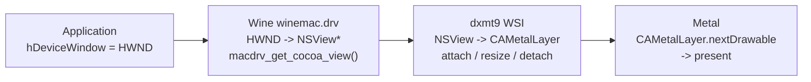

# Window System Integration Design

WSI maps a Win32 window handle (`HWND`) to a Metal presentation surface
(`CAMetalLayer`) and keeps the swap chain synchronized with resize, minimize,
and mode changes.

---

## 1. HWND to Cocoa View Resolution

D3D9's `CreateDevice()` and `CreateAdditionalSwapChain()` receive a Win32
`HWND`. On macOS under Wine, an `HWND` is a Wine internal handle backed by an
`NSWindow` / `NSView`. Metal presents to a `CAMetalLayer` attached to an
`NSView`.



`winemetal.so` supports two Wine host paths:

1. Legacy direct symbol path:
   - `macdrv_get_cocoa_view(HWND)` returns the backing `NSView*`
2. Builtin-module fallback path used by Heroic Wine 11.5:
   - `macdrv_functions[3]` returns a `WineWindow*`
   - `winemetal.so` resolves `-[WineWindow contentView]` on the Cocoa main queue
   - `macdrv_functions[6]` creates a `WineMetalView*` from that
     `WineContentView*`
   - `macdrv_functions[7]` returns the `CAMetalLayer*`

Resolution order:

```c
macdrv_get_cocoa_view(hwnd)

macdrv_functions[3] -> WineWindow*
WineWindow.contentView -> WineContentView*
macdrv_functions[6](WineContentView*, metal_device) -> WineMetalView*
macdrv_functions[7](WineMetalView*) -> CAMetalLayer*
```

`winemetal.so` resolves the legacy symbol or function table at runtime via
`dlsym(RTLD_DEFAULT, ...)`. If neither path is available, it returns a null
presentation handle and the no-window path is used.

---

## 2. Layer Lifecycle

### 2.1 Creation

At `CreateDevice()` or `CreateAdditionalSwapChain()`:

1. Resolve `HWND` to either:
   - `NSView*` directly through `macdrv_get_cocoa_view(hwnd)`, or
   - `WineWindow* -> contentView -> WineMetalView -> CAMetalLayer*` through the
     `macdrv_functions` fallback path.
2. If using the legacy `NSView*` path, create and attach a `CAMetalLayer` as
   the view's backing layer:

   ```objc
   CAMetalLayer *layer = [CAMetalLayer layer];
   layer.device = mtlDevice;
   layer.pixelFormat = MTLPixelFormatBGRA8Unorm;
   layer.drawableSize = CGSizeMake(pp.BackBufferWidth, pp.BackBufferHeight);
   layer.displaySyncEnabled = (pp.PresentationInterval != D3DPRESENT_INTERVAL_IMMEDIATE);
   layer.maximumDrawableCount = 3;
   layer.framebufferOnly = YES;
   nsView.wantsLayer = YES;
   nsView.layer = layer;
   ```

3. If using the `WineMetalView` fallback path, store the returned
   `WineMetalView*` unix-side for later release and use its `CAMetalLayer*`
   directly.
4. Store an opaque presentation handle in the PE-side `SwapChain`.

### 2.2 Resize

When `Reset()` or `IDirect3DSwapChain9::Reset()` is called with new dimensions:

1. Drain all in-flight command buffers or fence the old drawable resources.
2. Update `layer.drawableSize`.
3. Recreate the back-buffer `MTLTexture` at the new size.

Resize can also be triggered by `NSViewFrameDidChangeNotification`. In windowed
mode this is handled silently. In fullscreen mode it may surface as
`D3DERR_DEVICELOST`.

### 2.3 Destruction

On device release, swap-chain destruction, or reset replacement:

1. Drain or fence GPU work that can reference the old drawable/back buffer.
2. Release the unix-side `WineMetalView*` or detach the legacy `CAMetalLayer`.
3. Clear the PE-side opaque presentation handle.

---

## 3. Windowed, Fullscreen, and Pixel Format

Windowed mode sets `layer.drawableSize` from the normalized back-buffer width and
height. `displaySyncEnabled` follows `PresentationInterval`.

Fullscreen is not part of the initial implementation target. A future exclusive
fullscreen path requires `NSScreen` mode switching and `CGDisplayCapture`.

`CAMetalLayer.pixelFormat` is always `MTLPixelFormatBGRA8Unorm`. The back buffer
is an internal `MTLTexture` and is blitted to the BGRA drawable during present.
`D3DFMT_A8R8G8B8` and `D3DFMT_X8R8G8B8` are direct copies; other formats require
a format-conversion pass.

---

## 4. PE Bridge and Unix Module Split

The Wine-facing runtime follows the upstream DXMT `winemetal` split. API DLLs
remain PE images loaded by the Windows application, while ObjC/Metal work is
hosted by the paired Wine unix module:

| Binary | Kind | Role |
|---|---|---|
| `d3d9.dll` | PE DLL | D3D9 COM exports, D3D9 state shadow, hot-path POD command recording |
| `winemetal.dll` | Wine builtin PE DLL | Shared bridge/service DLL for unix-call dispatch and chunk/resource/frame-token ABI |
| `winemetal.so` | Wine unix module | ObjC/Metal WSI, shader translation, provider/runtime handlers, and GPU execution |

`d3d9.dll` imports `winemetal.dll` as a normal Windows dependency.
`winemetal.dll` communicates with `winemetal.so` through Wine's PE/unix thunk
mechanism. No PE DLL imports a Mach-O `.dylib` or `.so` as a Windows DLL.

All window/layer functions (`get_view`, `create_layer`, `resize_layer`,
`set_sync`, `destroy_layer`, `next_drawable`, `present_drawable`) live in
`winemetal.so`. The PE side owns COM entry points, D3D9 state tracking, POD
command chunk construction, opaque handles, C ABI forwarding, and Wine-visible
thunk entry points.

---

## 5. Initialization and Deployment

On the common macOS Wine64 / Rosetta path:

- `d3d9.dll` target: `x86_64-w64-mingw32`
- `winemetal.dll` target: `x86_64-w64-mingw32`
- `winemetal.so` target: host-side x86_64 Mach-O module loaded through Wine's
  unix loader path

`d3d9.dll` initializes the D3D9 wrapper state and PE-side command recorder during
process attach, then relies on `winemetal.dll` for Wine unix-call dispatch.
`winemetal.so` resolves `macdrv_get_cocoa_view` or the fallback
`macdrv_functions` table on demand and owns all Metal device, queue, shader, and
presentation state.

The primary supported host is x86_64 Wine under Rosetta 2 on Apple Silicon with
Wine unixlib support, `winemac.drv`, and the standard `x86_64-windows` and
`x86_64-unix` runtime directories. Heroic Wine with the builtin-module layout is
the confirmed host. GPTK 1.1 / Wine 7.7 is not supported because it lacks the
required unixlib bridge path.

Current installation layout:

- `d3d9.dll` in `<wine-prefix>/drive_c/windows/system32`
- `winemetal.dll` in `<wine-root>/lib/wine/x86_64-windows`
- `winemetal.so` in `<wine-root>/lib/wine/x86_64-unix`

`winemetal.dll` is not copied into `system32` by default. It is a shared Wine
builtin bridge/service module, matching upstream DXMT's deployment shape.
