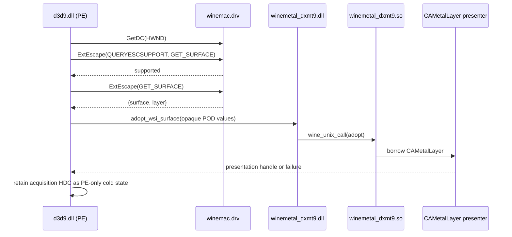

# Window System Integration Spec

WSI maps a Win32 window handle (`HWND`) to a Wine-owned Metal presentation
surface and keeps the D3D9 swap chain synchronized with resize, reset, and
destruction. The Wine surface protocol is owned by
[`specs/winemetal/requirements.md`](../../winemetal/requirements.md); this
document owns the D3D9-facing integration.

## 1. Primary `HWND` to Layer Flow

The primary path uses the `winemac.drv` `ExtEscape` proposal tracked by
[Wine MR !11058](https://gitlab.winehq.org/wine/wine/-/merge_requests/11058)
and [upstream DXMT PR #166](https://github.com/3Shain/dxmt/pull/166). Its
current declaration is:

```c
#define MACDRV_ESCAPE_GET_SURFACE     6790
#define MACDRV_ESCAPE_RELEASE_SURFACE 6791

struct macdrv_escape_surface {
  uint64_t surface;
  uint64_t layer;
};
```

These values are revision-pinned compatibility declarations, not an accepted
Wine ABI until the Wine change is merged. The canonical declaration must live
in the compatibility header required by `R-WMB-13.1`; this excerpt is
explanatory.



PE code owns GDI calls and treats both returned values as opaque `uint64_t`
tokens. The cold adoption call is separate from recorded command chunks. Only
the unix provider converts the nonzero `layer` value to a borrowed
`CAMetalLayer` reference.

If `QUERYESCSUPPORT` fails, dxmt9 may use only the old aggregate
`macdrv_functions` path for an exact Wine build declared and proven as
`legacy-macdrv-symbols:<runtime-id>`. There is no generic direct-symbol or
Cocoa fallback for current Wine 11.x builds.

## 2. Swap-Chain Lifecycle

### 2.1 Creation

At `CreateDevice()` or `CreateAdditionalSwapChain()`:

1. Validate and normalize `D3DPRESENT_PARAMETERS`.
2. Acquire the Wine client surface and layer for the selected `HWND`.
3. Pass the opaque layer token through the cold PE/unix adoption call.
4. Configure the borrowed layer and create the dxmt9-owned back buffer.
5. Store the Wine surface token in PE and an opaque presenter handle in the
   swap chain.

Failure to acquire or adopt the layer fails a windowed presenting swap chain
with `D3DERR_NOTAVAILABLE`. It must not return a device that silently presents
to no window.

The desktop HWND follows the same capability rule. If Wine resolves a real
client view/layer, creation and Present use the ordinary windowed path. If the
desktop HWND (or a NULL effective HWND) has no host view, current production
returns `D3DERR_NOTAVAILABLE`; the core-only null-Presenter path is not a
headless D3D9 implementation. The upstream Wine success behavior remains an
explicit compatibility gap until an owned offscreen target is specified.

### 2.2 Reset and Rebind

Reset acquires and validates the replacement Wine surface token first. The unix
provider serializes the swap-chain WSI lifecycle, arms the admission gate, and
drains or fences old layer users before it asks legacy macdrv for a candidate
host-view claim. Wine may return the current `WineMetalView` without retaining
it; dxmt9 therefore reference-counts logical claims by the physical pointer and
releases the macdrv view only when the final Presenter claim retires. Candidate
failure drops its claim, reopens the gate, and preserves the old registered
Presenter. PE releases the old Wine surface only after successful adoption.
The same swap-chain lock protects the `PresentId` snapshot and the complete
duration of cold Presenter mirror operations; there is no public raw-Presenter
accessor. A snapshot may become stale after the lock is released, but registry
generation validation makes that stale value resolve to no Presenter rather
than extending an unowned pointer lifetime.

### 2.3 Destruction

On swap-chain or device destruction:

1. Stop drawable acquisition.
2. Wait out an active replay arena and every already-admitted Presenter user;
   a replay-accepted Present waits behind the gate rather than being dropped.
3. Fence a live queue, or join stopped queue workers, then invalidate the
   presenter registry before destroying the unix presenter binding.
4. Issue `MACDRV_ESCAPE_RELEASE_SURFACE` exactly once with the retained surface
   token, then clear the PE token even if Wine reports a release failure. A
   persistent unix teardown/bridge failure is retried only to the bounded
   finalizer limit; the PE capability is then intentionally leaked because
   neither early release nor an unbounded destruction hang is safe.

Wine owns the client surface and `CAMetalLayer`. dxmt9 borrows the layer and
must never independently release it.

## 3. Presentation and Resize

Windowed mode sets `drawableSize` from the normalized back-buffer dimensions.
`displaySyncEnabled` follows `PresentationInterval`. Host-view resize may update
the drawable size without making a windowed device lost; reset still recreates
the back-buffer texture after old GPU use is quiescent.

The back buffer and drawable are distinct Metal objects. The back buffer is a
dxmt9-owned `MTLTexture`; `nextDrawable` is acquired only during present, and
the back buffer is copied or converted into the drawable. Consequently,
`DXMT9_LAYER_FRAMEBUFFER_ONLY` changes drawable policy but not D3D9 back-buffer
lock or readback behavior.

Fullscreen is outside the initial target and may fail cleanly with
`D3DERR_NOTAVAILABLE`. A future exclusive-fullscreen path requires an explicit
display-mode and surface-rebind contract.

## 4. PE / Unix Ownership

| Binary | Kind | WSI responsibility |
|---|---|---|
| `d3d9.dll` | PE DLL | D3D9 COM surface, `HWND`/HDC and `ExtEscape`, Wine surface-token lifetime |
| `winemetal_dxmt9.dll` | PE bridge | Validate and dispatch cold WSI adoption plus the generated dxmt9 ABI |
| `winemetal_dxmt9.so` | Wine unixlib | Borrow `CAMetalLayer`, own presenter state, drawable acquisition, Metal execution |

Recorded draw/state/resource packets remain pointer-free. The two Wine-issued
64-bit values cross only through the dedicated cold WSI bootstrap/rebind call
defined by `R-CORE-WSI-4.1` and never enter `CommandChunk`.

The suffix-qualified bridge names are required for upstream DXMT coexistence.
Upstream DXMT may continue to own `winemetal.dll` / `winemetal.so`; dxmt9 must
load only `winemetal_dxmt9.dll` / `winemetal_dxmt9.so` and verify its own ABI
handshake.

## 5. Deployment and Qualification

The runtime layout is:

- `d3d9.dll` in the selected Wine Windows or application-local directory;
- `winemetal_dxmt9.dll` in the matching Wine Windows or application-local
  directory;
- `winemetal_dxmt9.so` in the Wine unixlib or application-local directory.

The filename split does not make an unmodified Wine runtime compatible. The
primary WSI path additionally requires a Wine revision that implements the
accepted surface escape protocol. Until then, current Gcenx/Heroic Wine 11.x
without the Wine change is unsupported, while an exact Wine build qualified as
`legacy-macdrv-symbols:<runtime-id>` must retain the existing
`macdrv_functions` fallback.

## 6. Evidence

Qualification must record:

- the exact Wine root and surface-protocol declaration;
- observed acquisition path (`extescape-v1`, `legacy-macdrv-symbols`, or
  `unavailable`);
- x64 and WoW64 creation, present, reset, and balanced destruction;
- loaded paths and ABI handshake for both suffix-qualified dxmt9 modules;
- a negative unsupported-Wine run that fails without a crash or black window;
- an upstream DXMT coexistence run proving independent D3D9 and D3D11 WSI.
