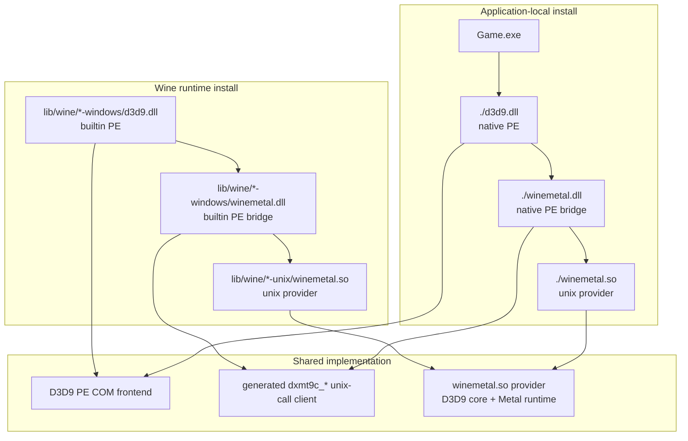
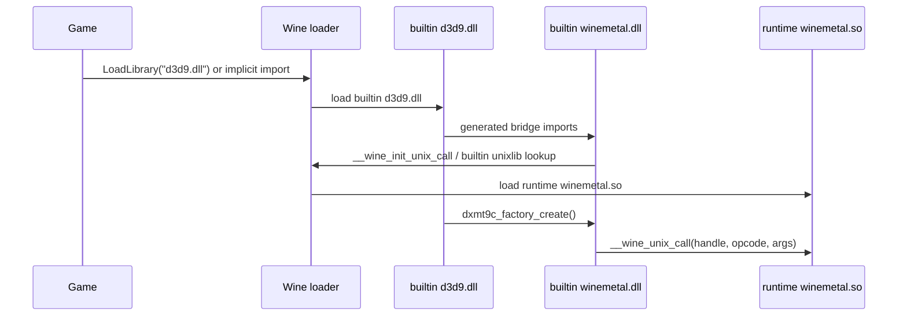
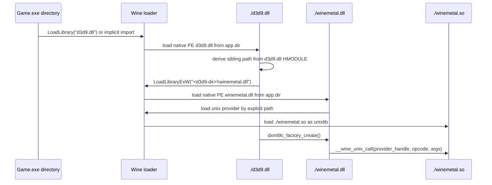
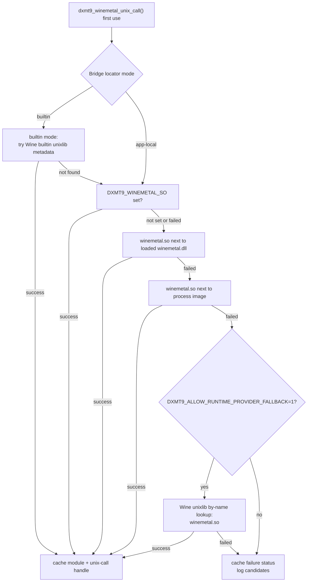

# Deployment Design

---

## 1. Overview

Deployment is split into two lanes that share the same D3D9 frontend and Metal
runtime:



The runtime lane keeps the current dxmt workflow. The app-local lane adds a
native PE `d3d9.dll` and native PE `winemetal.dll` so Wine can discover them
from the executable directory the same way DXVK-style DLL drops work.

---

## 2. Artifact Matrix

| Lane | Artifact | Build form | Install location |
|---|---|---|---|
| Runtime | `d3d9.dll` | PE DLL postprocessed as Wine builtin | `<wine-root>/lib/wine/x86_64-windows/` or `i386-windows/` |
| Runtime | `winemetal.dll` | PE DLL postprocessed as Wine builtin | matching `*-windows` runtime dir |
| Runtime | `winemetal.so` | Wine unixlib provider | `<wine-root>/lib/wine/<host>-unix/` |
| App-local | `d3d9.dll` | native PE DLL, no builtin postprocess | next to `Game.exe` |
| App-local | `winemetal.dll` | native PE DLL, no builtin postprocess | next to `Game.exe` |
| App-local | `winemetal.so` | Wine unixlib provider | next to `Game.exe` or explicit override path |

For a mixed package:

```text
package/
  pe/
    x64/
      d3d9.dll
      winemetal.dll
      libc++.dll        # only if dynamically required
      libunwind.dll     # only if dynamically required
    x86/
      d3d9.dll
      winemetal.dll
      libc++.dll
      libunwind.dll
  unix/
    x86_64-unix/
      winemetal.so
    aarch64-unix/
      winemetal.so
  dxmt9-deploy.json
```

A final app-local staging directory for one executable is flat:

```text
Game.exe
d3d9.dll
winemetal.dll
winemetal.so
```

The staging step selects exactly one PE architecture and one matching Wine host
unix provider from the manifest. A 32-bit game receives the 32-bit PE DLLs; a
64-bit game receives the 64-bit PE DLLs. The unix provider is selected from the
Wine host architecture, not from the Windows process bitness.

---

## 3. Build Lanes

### 3.1 Runtime Builtin Lane

The existing lane remains the default for Wine runtime installation:

```sh
meson setup build-x86_64-builtin \
  -Dwine_install_path="$WINE_ROOT"
meson compile -C build-x86_64-builtin

meson setup build-win32-x64-builtin \
  --cross-file cross/x86_64-windows.ini \
  -Dwine_builtin_dll=true \
  -Dwine_install_path="$WINE_ROOT"
meson compile -C build-win32-x64-builtin
```

Output consumed by the runtime installer:

```text
build-win32-x64-builtin/src/win32/d3d9.dll
build-win32-x64-builtin/src/winemetal/winemetal.dll
build-x86_64-builtin/src/winemetal/unix/winemetal.so
```

The installer copies those files into the Wine runtime and optionally mirrors
the PE DLLs into the prefix Windows directories.

### 3.2 Native App-Local Lane

The app-local lane uses the same Windows cross toolchain and disables builtin
post-processing, but that is not sufficient by itself. The native lane must
also select a `d3d9.dll` target that uses the dynamic bridge resolver described
in section 5. It must not link the D3D9 forwarder against an import dependency
that creates a mandatory PE static import of `winemetal.dll`.

```sh
meson setup build-win32-x64-native \
  --cross-file cross/x86_64-windows.ini \
  -Dwine_builtin_dll=false
meson compile -C build-win32-x64-native
```

The command above describes the native lane shape. The concrete Meson target
must produce an app-local `d3d9.dll` whose generated bridge client reaches
`dxmt9_winemetal_unix_call` through `LoadLibraryExW` and `GetProcAddress`, not
through `dxmt9_winemetal_import_dep` or another static import edge.

Required packaging outputs:

```text
build-win32-x64-native/src/win32/d3d9.dll
build-win32-x64-native/src/winemetal/winemetal.dll
build-x86_64-builtin/src/winemetal/unix/winemetal.so
```

The native `d3d9.dll` should dynamically resolve app-local `winemetal.dll`
instead of linking it as a mandatory static import. This keeps a missing
`winemetal.dll` or provider load failure in the `Direct3DCreate9` failure path,
where dxmt9 can log a useful diagnostic. Non-Wine runtime dependencies of
`d3d9.dll` itself must still be packaged or statically linked, because the
Windows loader can fail before dxmt9 code runs.

The Meson install directories do not need to match the final app-local package
layout. A packaging step should collect the artifacts into a flat app-local
directory and generate a manifest.

```sh
python3 scripts/package_app_local.py --clean --output-dir dist/dxmt9-app-local
```

---

## 4. Runtime Install Flow



This path is compatible with `WINEDLLOVERRIDES="d3d9=b"` and with the existing
runtime installer.

---

## 5. Application-Local Flow



The key difference from the runtime path is that the app-local `winemetal.dll`
cannot depend on Wine builtin metadata to find `winemetal.so`. It needs its own
provider locator.

The `winemetal.dll` PE bridge must be loaded by absolute sibling path. The
native `d3d9.dll` records its own `HMODULE` in `DllMain`, calls
`GetModuleFileNameW(d3d9_hmodule)`, replaces the final component with
`winemetal.dll`, and loads that absolute path with `LoadLibraryExW`. The load
flags should allow dependent PE DLLs to resolve from the bridge DLL directory,
for example `LOAD_WITH_ALTERED_SEARCH_PATH` or
`LOAD_LIBRARY_SEARCH_DLL_LOAD_DIR | LOAD_LIBRARY_SEARCH_DEFAULT_DIRS`. It must
not use `LoadLibraryW(L"./winemetal.dll")`, because `.` is the current working
directory rather than the module directory.

---

## 6. Provider Locator

`winemetal.dll` owns provider discovery, but the lookup mode differs by bridge
variant. The builtin bridge is allowed to use Wine builtin metadata first. The
native app-local bridge prioritizes package-local providers and only falls back
to a runtime provider when explicitly requested.



The PE bridge already dispatches generated calls through
`dxmt9_winemetal_unix_call(code, args)`. The locator extends initialization of
that function:

```cpp
enum class BridgeLocatorMode {
    Builtin,
    AppLocal,
};

struct BridgeState {
    std::once_flag initialized;
    BridgeLocatorMode mode = BridgeLocatorMode::AppLocal;
    unixlib_module_t module = 0;
    unixlib_handle_t handle = 0;
    WineUnixCallDispatcherVar dispatcher = nullptr;
    WineUnloadUnixLibFn unload = nullptr;
    NTSTATUS status = DXMT9_STATUS_DLL_NOT_FOUND;
};
```

Pseudo-code:

```cpp
static NTSTATUS tryLoadUnixlibName(const UNICODE_STRING& name,
                                   unixlib_module_t* module,
                                   unixlib_handle_t* handle) {
    auto load = resolveProc<WineLoadUnixLibFn>(ntdll, "__wine_load_unix_lib");
    if (!load)
        return DXMT9_STATUS_NOT_SUPPORTED;
    return load(&name, module, handle);
}

static NTSTATUS initializeProvider(BridgeState& state) {
    resolve ntdll exports: __wine_unix_call_dispatcher,
                           __wine_load_unix_lib,
                           __wine_unload_unix_lib;

    if (state.mode == BridgeLocatorMode::Builtin) {
        if (tryBuiltinUnixlibForCurrentModule(state) == STATUS_SUCCESS)
            return STATUS_SUCCESS;
    }

    for (const auto& candidate : appLocalProviderCandidates()) {
        NTSTATUS status = tryLoadUnixlibName(candidate.name,
                                             &state.module,
                                             &state.handle);
        log candidate and status;
        if (status == STATUS_SUCCESS)
            return STATUS_SUCCESS;
    }

    if (runtimeProviderFallbackAllowed()) {
        NTSTATUS status = tryLoadUnixlibName(makeUnicodeString(L"winemetal.so"),
                                             &state.module,
                                             &state.handle);
        log by-name fallback and status;
        if (status == STATUS_SUCCESS)
            return STATUS_SUCCESS;
    }

    return DXMT9_STATUS_DLL_NOT_FOUND;
}
```

App-local candidate path construction:

- `DXMT9_WINEMETAL_SO`: explicit override, useful for debugging and package
  layouts that keep the provider outside the executable directory.
- Module directory: `GetModuleFileNameW(winemetal.dll)` with the file name
  replaced by `winemetal.so`.
- Executable directory: `GetModuleFileNameW(NULL)` with the file name replaced
  by `winemetal.so`.
- By-name fallback: `winemetal.so`, only when
  `DXMT9_ALLOW_RUNTIME_PROVIDER_FALLBACK=1` is set.

When a Windows path is used for an explicit local file, convert it to the NT
path form accepted by Wine's unixlib loader before calling
`__wine_load_unix_lib`.

---

## 7. Package Manifest

The root mixed-architecture package step should emit `dxmt9-deploy.json`:

```json
{
  "schema": 1,
  "mode": "app-local",
  "version": "0.1.0",
  "bridge_abi_hash": "<hex>",
  "provider_schema": "dxmt9-winemetal-v1",
  "has_wow64_unix_call_table": true,
  "min_wine_unixlib_feature": "MemoryWineLoadUnixLibByName",
  "variants": [
    {
      "name": "x64-on-x86_64-unix",
      "pe_arch": "x86_64-windows",
      "unix_arch": "x86_64-unix",
      "artifacts": [
        { "path": "pe/x64/d3d9.dll", "sha256": "<hex>" },
        { "path": "pe/x64/winemetal.dll", "sha256": "<hex>" },
        { "path": "pe/x64/libc++.dll", "sha256": "<hex>" },
        { "path": "pe/x64/libunwind.dll", "sha256": "<hex>" },
        { "path": "unix/x86_64-unix/winemetal.so", "sha256": "<hex>" }
      ],
      "pe_dependencies": [
        "libc++.dll",
        "libunwind.dll"
      ],
      "unix_dependencies": [
        { "name": "winemac.so", "source": "wine-runtime" },
        { "name": "ntdll.so", "source": "wine-runtime" }
      ]
    },
    {
      "name": "x86-wow64-on-x86_64-unix",
      "pe_arch": "i386-windows",
      "unix_arch": "x86_64-unix",
      "artifacts": [
        { "path": "pe/x86/d3d9.dll", "sha256": "<hex>" },
        { "path": "pe/x86/winemetal.dll", "sha256": "<hex>" },
        { "path": "pe/x86/libc++.dll", "sha256": "<hex>" },
        { "path": "pe/x86/libunwind.dll", "sha256": "<hex>" },
        { "path": "unix/x86_64-unix/winemetal.so", "sha256": "<hex>" }
      ],
      "pe_dependencies": [
        "libc++.dll",
        "libunwind.dll"
      ],
      "unix_dependencies": [
        { "name": "winemac.so", "source": "wine-runtime" },
        { "name": "ntdll.so", "source": "wine-runtime" }
      ]
    }
  ]
}
```

The final flat staging directory for one executable may also contain a reduced
manifest with one selected variant, but that file must identify itself as a
single staged package, for example with `"mode": "app-local-staged"`. The
runtime installer can use the same schema with `"mode": "wine-runtime"` and
runtime destination paths.

Every staged binary, including optional PE runtime dependency DLLs, must appear
in `artifacts` with a checksum. The `pe_dependencies` list remains the compact
copy list for final staging.

---

## 8. Failure Behavior

Provider discovery failures must be actionable. At debug log level,
`winemetal.dll` should print:

- whether builtin lookup was attempted;
- every provider candidate path;
- the `NTSTATUS` returned for each candidate;
- the selected provider path and unix-call handle on success;
- the unix-side dependencies recorded for `winemetal.so` and whether they were
  resolved from the package or target Wine runtime;
- whether a dynamically resolved bridge dependency was missing before provider
  discovery began.

The D3D9 frontend should translate bridge initialization failure into a normal
D3D9 creation failure. App-local `d3d9.dll` therefore uses dynamic bridge
resolution so missing `winemetal.dll` and missing `winemetal.so` can be reported
from `Direct3DCreate9`. Missing dependencies of `d3d9.dll` itself are still
Windows loader failures and must be caught by packaging validation.

---

## 9. Verification Design

Runtime lane:

```sh
bash scripts/install_heroic_wine.sh --prefix "$PREFIX" --wine-root "$WINE_ROOT"
WINEPREFIX="$PREFIX" WINEDLLOVERRIDES="d3d9=b" "$WINE_ROOT/bin/wine" d3d9-smoke.exe
```

App-local lane:

```sh
tmp=$(mktemp -d)
cp d3d9-smoke.exe "$tmp/"
cp package/pe/x64/d3d9.dll "$tmp/"
cp package/pe/x64/winemetal.dll "$tmp/"
cp package/unix/x86_64-unix/winemetal.so "$tmp/"
for dep in libc++.dll libunwind.dll; do
  if [ -f "package/pe/x64/$dep" ]; then
    cp "package/pe/x64/$dep" "$tmp/"
  fi
done

WINEPREFIX="$TEMP_PREFIX" DXMT_LOG_LEVEL=debug "$WINE_ROOT/bin/wine" "$tmp/d3d9-smoke.exe"
```

The dependency copy loop represents the selected manifest variant's
`pe_dependencies`. A package that statically links those dependencies should
have an empty `pe_dependencies` list and the loop copies nothing.

Expected debug evidence:

- Wine loaded `d3d9.dll` from the smoke executable directory.
- `d3d9.dll` loaded `winemetal.dll` from the `d3d9.dll` sibling absolute path.
- `winemetal.dll` selected the app-local `winemetal.so` candidate.
- `winemetal.so` resolved Wine runtime dependencies such as `winemac.so` and
  `ntdll.so` from the target Wine runtime under test.
- `Direct3DCreate9` returned a dxmt9-backed factory and a device can present a
  frame.

Negative app-local test:

```sh
rm "$tmp/winemetal.so"
WINEPREFIX="$TEMP_PREFIX" \
DXMT_LOG_LEVEL=debug \
DXMT9_ALLOW_RUNTIME_PROVIDER_FALLBACK=0 \
"$WINE_ROOT/bin/wine" "$tmp/d3d9-smoke.exe"
```

Expected result: `Direct3DCreate9` fails cleanly and logs that no candidate
provider was available.
