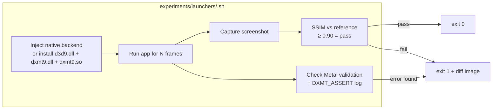

# Experiments Design

---

## 1. Structure

Each experiment is a launcher script that:
1. Injects dxmt9 as the D3D9 implementation for a real application
2. Runs the application for a fixed number of frames or wall-clock seconds
3. Captures a screenshot at a fixed point
4. Compares the screenshot against the reference image (SSIM)
5. Checks Metal validation layer output and `DXMT_ASSERT` log for errors



---

## 2. Injection Mechanism

For native macOS experiments, dxmt9 is injected via `DYLD_INSERT_LIBRARIES`:

```sh
DYLD_INSERT_LIBRARIES=/path/to/libdxmt9.dylib \
DXMT9_VALIDATE=1 \
DXMT9_LOG=/tmp/dxmt9_exp.log \
  ./app_binary --frames 300 --width 1280 --height 720
```

`DXMT9_VALIDATE=1` enables the Metal API validation layer for the duration of
the experiment. `DXMT9_LOG` captures `DXMT_ASSERT` output for post-run
analysis.

For applications that require Wine, the launcher installs the PE/user-facing DLL,
the PE bridge, and the unix module, then sets the Wine DLL override:

```sh
cp build-win32-x64/src/win32/d3d9.dll "$WINEPREFIX/drive_c/windows/system32/d3d9.dll"
cp build-win32-x64/src/win32/dxmt9.dll "<wine-root>/lib/wine/x86_64-windows/dxmt9.dll"
cp build-x86_64/src/wine/dxmt9.so "<wine-root>/lib/wine/x86_64-unix/dxmt9.so"
WINEDLLOVERRIDES="d3d9=n,b" wine app.exe
```

---

## 3. Screenshot Capture

Screenshots are captured via `CGWindowListCreateImageFromArray` (macOS
ScreenCaptureKit) or by reading back the back buffer via
`GetRenderTargetData()` at the end of a fixed frame.

Comparison uses **SSIM** (Structural Similarity Index):
- SSIM ≥ 0.90 → pass (visually equivalent)
- SSIM 0.75–0.90 → warn (investigate; may be acceptable)
- SSIM < 0.75 → fail (visible corruption)

The SSIM threshold is intentionally loose — experiments are wild tests, not
pixel-exact tests. Small differences due to driver precision or timing are
acceptable.

---

## 4. Failure Triage

When an experiment fails, the runner produces:

```
experiments/output/<app-name>/
├── actual.png          Screenshot from this run
├── reference.png       Expected screenshot (symlink)
├── diff.png            Highlighted difference image
├── ssim.txt            SSIM score
└── dxmt9.log           DXMT_ASSERT + Metal validation output
```

The diff image uses a perceptual diff algorithm (perceptualdiff or similar)
that highlights regions of visible difference in red.

---

## 5. Determinism

To make experiment runs reproducible:
- Applications must support `--frames N` or `--seed N` arguments, or be
  driven by a script that sends deterministic input events.
- Frame capture happens at a fixed frame index (e.g., frame 100 of 300),
  not at wall-clock time.
- GPU-side timing (async PSO compilation) must be masked by a warm-up pass
  of at least 60 frames before the reference frame.

---

## 6. File Layout

```
experiments/
├── CATALOGUE.toml              Machine-readable catalogue (R-WILD-5.1)
├── apps/                       Application binaries (committed or downloaded)
│   ├── BasicHLSL/
│   ├── Tutorial07/
│   └── ...
├── launchers/                  Launcher scripts
│   ├── basicherl.sh
│   ├── tutorial07.sh
│   └── ...
├── references/                 Reference screenshots (1280×720 PNG)
│   ├── basicherl.png
│   ├── tutorial07.png
│   └── ...
└── output/                     Run output (gitignored)
    └── .gitkeep
```
