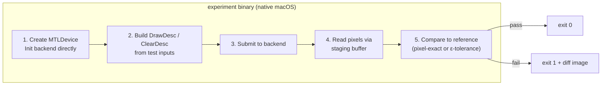
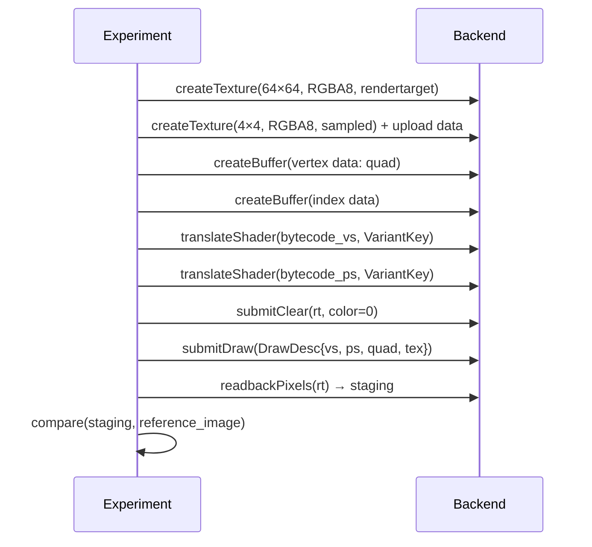

# Experiments Design

---

## 1. Structure of an Experiment

Each experiment is a self-contained program that:
1. Creates a Metal device and initializes the backend directly (no D3D9 COM)
2. Issues a specific sequence of `DrawDesc` / `ClearDesc` calls
3. Reads back the render target pixels via a staging buffer
4. Compares against expected output
5. Exits 0 (pass) or non-zero (fail)



Experiments do not link against the D3D9 COM layer. They drive the `BackendDevice`
interface directly. This makes them fast, deterministic, and independent of Wine.

---

## 2. Reference Image Generation

Reference images are small (typically 64×64 or 256×256 pixels), stored as PNG in
`tests/reference/`. They are generated once and committed.

Sources for reference values:
- **Math derivation**: for simple shaders (e.g., `mov r0, v0`), compute expected
  pixel values analytically.
- **Windows/WARP**: for complex fixed-function or shader behavior, render the same
  scene on Windows using the D3D9 WARP software rasterizer, which is specification-
  conformant.
- **DXVK on Linux**: acceptable secondary reference for shader correctness where
  WARP is unavailable.

Reference images are never regenerated by the test runner. Updating a reference image
is a deliberate act requiring code review.

---

## 3. Comparison Criteria

| Test category | Comparison method | Tolerance |
|---|---|---|
| Shader arithmetic output | Per-channel absolute difference | ≤ 1/255 (1 ULP in UNORM8) |
| Fixed-function lighting | Per-channel absolute difference | ≤ 2/255 (lighting math precision) |
| Rasterization coverage | Exact pixel coverage mask | Zero tolerance |
| Texture sampling (bilinear) | Per-channel absolute difference | ≤ 2/255 |
| Depth buffer values | Per-pixel float difference | ≤ 1e-5 |

---

## 4. Shader Translation Experiment Shape



---

## 5. Fixed-Function Key Coverage Matrix

Each cell in the matrix is one experiment. A cell is marked when the corresponding
`FFPKey` variant has a passing experiment.

| Feature | vs_ffp | ps_ffp |
|---|---|---|
| No lighting, no texture | ✗ | ✗ |
| Directional light, diffuse | ✗ | — |
| Point light + attenuation | ✗ | — |
| Spot light | ✗ | — |
| 8 mixed lights | ✗ | — |
| Specular | ✗ | — |
| Fog LINEAR vertex | ✗ | ✗ |
| Fog EXP pixel | ✗ | ✗ |
| TEXOP MODULATE | — | ✗ |
| TEXOP ADD | — | ✗ |
| TEXOP ADDSIGNED | — | ✗ |
| TEXOP DOTPRODUCT3 | — | ✗ |
| TEXOP BUMPENVMAP | — | ✗ |
| Alpha test LESS | — | ✗ |
| Alpha test GREATEREQUAL | — | ✗ |
| TexCoordGen SPHEREMAP | ✗ | — |
| Texture transform PROJECTED | ✗ | ✗ |

(✗ = not yet passing; — = not applicable to that stage)

This matrix lives in `tests/experiments/ffp_coverage.md` and is updated as
experiments are added and pass.

---

## 6. Half-Pixel Offset Experiment

The experiment renders four 1×1 pixel quads, one at each corner of a 16×16 render
target. In D3D9 screen space, the quads are positioned at:
- `(0, 0)` to `(1, 1)` — should fill pixel (0, 0)
- `(15, 0)` to `(16, 1)` — should fill pixel (15, 0)
- `(0, 15)` to `(1, 16)` — should fill pixel (0, 15)
- `(15, 15)` to `(16, 16)` — should fill pixel (15, 15)

The reference image has exactly these four pixels set and all others zero.

The experiment is parameterized by vertex type: first with `vs_2_0` writing `oPos`
in clip space, then with `D3DFVF_XYZRHW` pre-transformed inputs.

---

## 7. File Layout

```
tests/
├── smoke.cpp                 Bootstrap sanity test (already exists)
├── reference/                Reference PNG images
│   ├── shader_vs20_mad.png
│   ├── shader_ps20_tex.png
│   ├── ffp_directional.png
│   ├── halfpixel_vs.png
│   ├── halfpixel_rhw.png
│   └── ...
├── experiments/
│   ├── ffp_coverage.md       Coverage matrix
│   ├── shader_vs20.cpp       SM 2.0 vertex shader arithmetic
│   ├── shader_ps20.cpp       SM 2.0 pixel shader + texture
│   ├── shader_vs30.cpp       SM 3.0 generic outputs
│   ├── ffp_lighting.cpp      Fixed-function lighting variants
│   ├── ffp_texop.cpp         Texture stage operation variants
│   ├── ffp_fog.cpp           Fog modes
│   ├── halfpixel.cpp         Half-pixel offset correctness
│   ├── winding.cpp           Cull mode / winding order
│   ├── dynamic_vb.cpp        DISCARD / NOOVERWRITE lock semantics
│   └── managed_tex.cpp       MANAGED texture upload
└── meson.build
```
