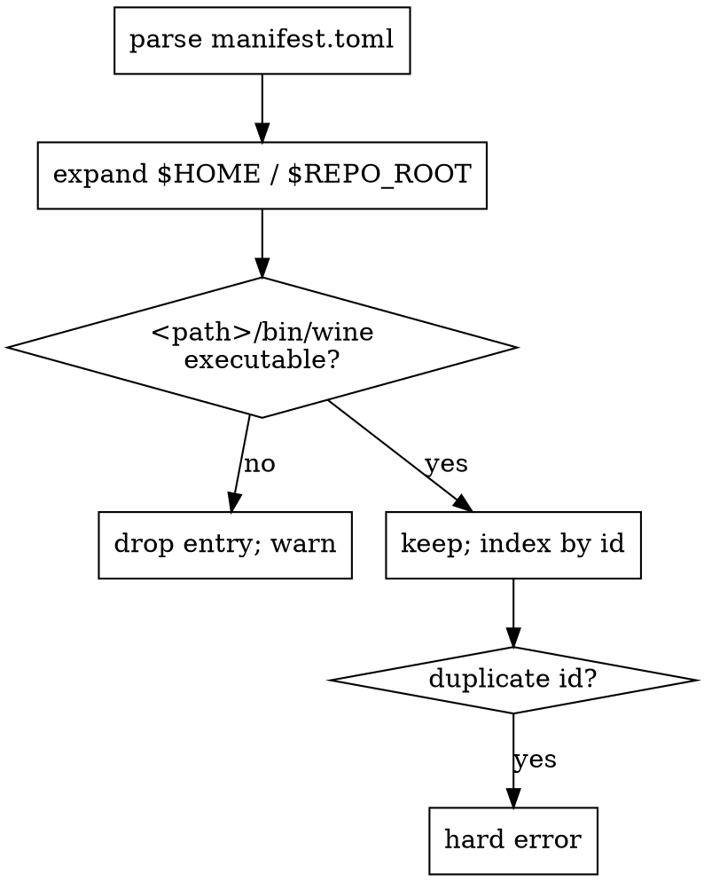
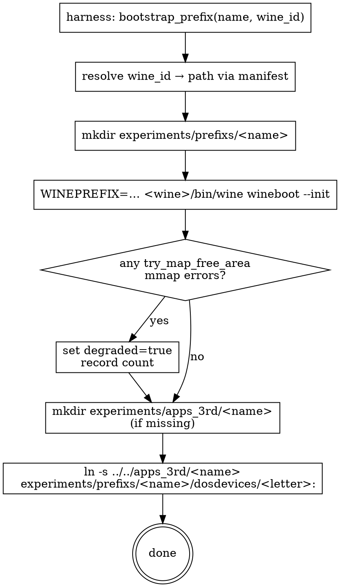
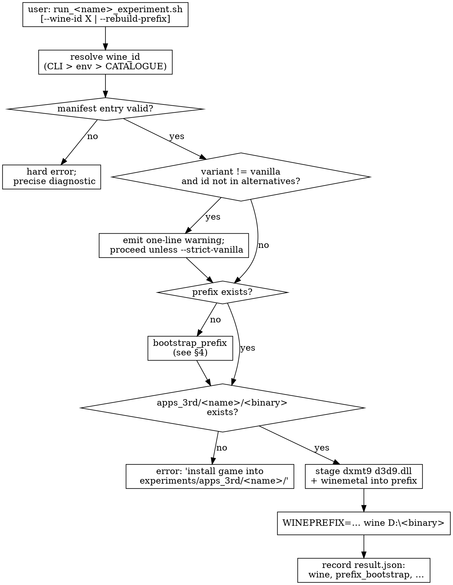
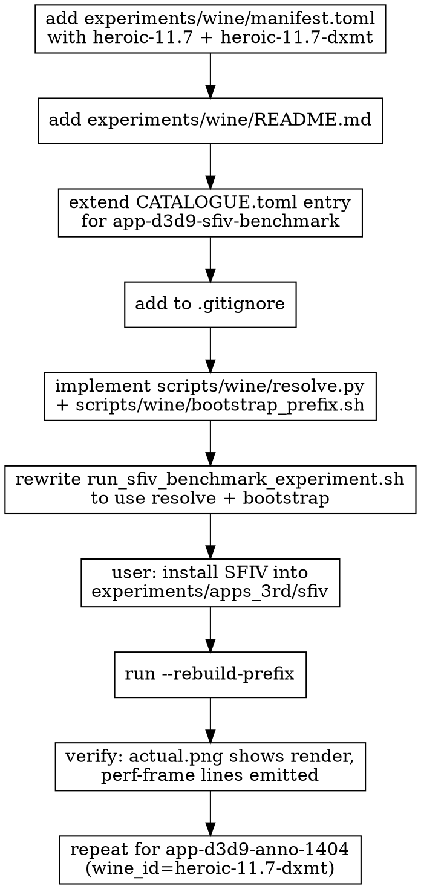

# Experiments Runtime Design — Wine, Prefix, External Apps

Implements the requirements in `specs/experiments/runtime/requirements.md`.
Defines directory layout, manifest schema, prefix↔install junction, and
harness flow.

Cross-references:
- Schema example: `specs/experiments/assets/wine-manifest.schema.toml`
- CATALOGUE additions: `specs/experiments/assets/catalogue-runtime-fields.toml`
- Operational rule: `agents/rules/test_wild.rules.md`

---

## 1. Directory Layout

```
experiments/
├── apps/                  # existing — committed fixture EXEs (D9VK, BasicHLSL)
├── apps_3rd/              # NEW   — gitignored, externally-installed apps
│   ├── sfiv/              #          (one subdir per [[app]].name in CATALOGUE)
│   └── app-d3d9-anno-1404/
├── prefixs/               # NEW   — gitignored, per-experiment Wine prefixes
│   ├── sfiv/
│   │   ├── drive_c/
│   │   ├── dosdevices/
│   │   │   ├── c: -> ../drive_c
│   │   │   └── d: -> ../../apps_3rd/sfiv      ← junction to install
│   │   └── system.reg
│   └── app-d3d9-anno-1404/
├── wine/                  # NEW   — manifest committed; wine bundles gitignored
│   ├── manifest.toml      #          committed (Wine root catalogue)
│   ├── README.md          #          committed (workflow doc)
│   └── Wine-11.7-local/   # ←       optional manually-downloaded bundle (gitignored)
├── CATALOGUE.toml         # existing — extended with runtime fields
├── launchers/             # existing
├── output/                # existing — gitignored
└── references/            # existing
```

`.gitignore` adds:

```
experiments/apps_3rd/
experiments/prefixs/
experiments/wine/*
!experiments/wine/manifest.toml
!experiments/wine/README.md
!experiments/wine/.gitkeep
```

---

## 2. Wine Manifest

The manifest is a single TOML document at `experiments/wine/manifest.toml`.
Schema example: `specs/experiments/assets/wine-manifest.schema.toml`.

Each entry registers a Wine *root directory* — the directory that contains
`bin/wine` (or `bin/wine64`) and `lib/wine/...`. The harness never invokes
a bare `wine` binary on `$PATH`; it always resolves through this manifest.

Variant taxonomy:

| `variant` | Meaning | Used as default? |
|---|---|---|
| `vanilla` | Pristine upstream Wine (Heroic vanilla, brew wine-stable, GPTK base) | yes — preferred for `wine_id` |
| `dxmt` | Patched for DXMT D3D11 (carries macdriver / wow64 patches) | no — exception only |
| `vk` | Vulkan-substituted d3d9 (Proton-style) | no — different surface area |
| `kegworks` | Wineskin / Sikarugir bundle | no — different lifecycle |
| `patched` | CrossOver and other forks | no — non-baseline |

Path resolution at load time:
- `$HOME` → user home dir
- `$REPO_ROOT` → repo top-level (computed from script location)
- Anything else is treated as an absolute path; relative paths are rejected.

Validation pass at harness startup:



---

## 3. CATALOGUE Extension

CATALOGUE additions example: `specs/experiments/assets/catalogue-runtime-fields.toml`.

Wild experiments gain four optional fields on top of the existing schema:

| Field | Default | Purpose |
|---|---|---|
| `wine_id` | (required when `requires_wine = true`) | Manifest ID for the default Wine root. |
| `wine_alternatives` | `[]` | Manifest IDs explicitly accepted for A/B runs without warning. |
| `install_drive_letter` | `"d"` | Drive letter the prefix surfaces `apps_3rd/<name>/` under. |
| `binary` | (existing) | Reinterpreted for wild apps as `D:/<path>` (a `<drive_letter>:` prefix). |

Existing non-wild apps (project-authored fixtures with
`requires_wine = true` but binaries inside the repo) remain unchanged: no
`wine_id` is added, the harness keeps the legacy injection path.

---

## 4. Prefix ↔ Install Junction

The model: prefix and install are decoupled storage but joined at runtime
via a `dosdevices/` symlink.

```
filesystem layout                       wine view (under WINEPREFIX=prefixs/sfiv)
─────────────────                       ───────────────────────────────────────
experiments/                            C:\
├── prefixs/sfiv/                          (Wine system, fonts, registry)
│   ├── drive_c/                        D:\
│   └── dosdevices/                        StreetFighterIV_Benchmark.exe   ← real file
│       ├── c:  → ../drive_c                d3d9.dll                       ← dxmt9 staged
│       └── d:  → ../../apps_3rd/sfiv      (the rest of the install)
└── apps_3rd/sfiv/         ←──────── physical install lives here
    ├── StreetFighterIV_Benchmark.exe
    ├── d3d9.dll
    └── ...
```

The game launches as `D:\StreetFighterIV_Benchmark.exe`. Registry entries
the installer writes (e.g. `HKCU\Software\Capcom\...\InstallDir = "D:\..."`)
remain valid because the drive letter is stable and the symlink target is
stable.

Bootstrap sequence:



`--rebuild-prefix` flow: `rm -rf prefixs/<name>/`, then re-run the
bootstrap. `apps_3rd/<name>/` untouched.

---

## 5. Harness Flow

Run sequence for a wild experiment:



`result.json` gains a `wine` block:

```json
{
  "wine": {
    "id": "heroic-11.7",
    "source": "heroic",
    "variant": "vanilla",
    "path": "/Users/.../Wine-11.7/.../wine"
  },
  "prefix_bootstrap": {
    "ran": false,
    "mmap_errors": 0,
    "degraded": false
  }
}
```

---

## 6. Wine Root Resolution

Resolution algorithm (R-RT-6.1) implemented in
`scripts/wine/resolve.py` (new):

```python
def resolve_wine_id(catalogue_app, cli_arg, env_var, manifest):
    candidates = [
        ("--wine-id",                   cli_arg),
        ("DXMT_EXPERIMENT_WINE_ID",     env_var),
        (f"CATALOGUE [[{name}]].wine_id", catalogue_app.get("wine_id")),
    ]
    for source, value in candidates:
        if not value:
            continue
        entry = manifest.get(value)
        if not entry:
            raise ManifestError(
              f"{source}={value} not found in experiments/wine/manifest.toml"
            )
        return entry, source
    raise ManifestError(
      f"app {name}: no wine_id resolved (CLI/env/CATALOGUE all empty)"
    )
```

This is the single source of truth — every wrapper script and every
launcher pipes through it. No script directly invokes a bare `wine` binary
on `$PATH`.

---

## 7. Migration Plan

Stepwise, one app at a time. SFIV first (driving case for this spec).



The existing prefix at `~/Games/_Prefixes/Street Fighter IV Benchmark/` was
already deleted (per current session). The user re-installs SFIV directly
into `experiments/apps_3rd/sfiv/` rather than into Heroic.

---

## 8. Test Plan

Tests for the runtime layer itself:

| Test | What | Where |
|---|---|---|
| `manifest_load_spec` | Parse known-good and known-bad `manifest.toml` examples | `tests/native/runtime/manifest_load_spec.cpp` (or python; pick one location) |
| `resolve_wine_id_spec` | Priority order CLI > env > CATALOGUE; missing-id error | same dir |
| `bootstrap_prefix_smoke` | Create a throwaway prefix, junction, verify `D:` mount | `tests/integration/` (skipped if no wine root present) |
| `gitignore_audit` | Static check that `apps_3rd/`, `prefixs/`, etc. are matched and that committed files (`manifest.toml`, README) are not | `scripts/check/audit_gitignore_runtime.py` |

Pass criteria for the spec as a whole:
1. `experiments/wine/manifest.toml` lints clean (validation §3 passes).
2. `CATALOGUE.toml` lints clean (every wild app has `wine_id` resolvable).
3. SFIV migrates end-to-end and the experiment runs to completion under
   the configured `wine_id`.
4. `agents/rules/test_wild.rules.md` is updated to point at this spec for
   the manifest mechanics; the rule itself stays focused on operational
   guidance.

---

## 9. Open Questions (deferred)

- **Auto-discovery helper** (`scripts/wine/discover.py`) is mentioned but
  optional. Implement only if manual maintenance proves painful.
- **Multi-display window placement** (the macOS Spaces issue surfaced in
  the driving session) is *not* in scope here — it's a separate harness
  concern that this spec leaves to a follow-up.
- **Snapshot/restore** of a prefix (for fast iteration on
  reproducible-state experiments) is out of scope; rebuild-from-scratch is
  cheap enough today.
