# 3DMark05 GT1 Performance Bottleneck Plan

Date: 2026-05-31

Scope:

- Target: `app-d3d9-3dmark05`, GT1 path under `DXMT_EXPERIMENT_PROFILE=perf`.
- Current trace artifacts:
  - `tmp/frame120.gputrace`
  - `tmp/frame120 Counters.csv`
  - `traces/app-d3d9-3dmark05-20260531-205116-gt1/analysis/frame120-counters-xcode.csv`
  - `traces/app-d3d9-3dmark05-20260531-205116-gt1/analysis/frame120-counters-summary.csv`
  - `traces/app-d3d9-3dmark05-20260531-205116-gt1/3dmark05-gputrace.log`
- This document keeps the existing path spelling, `perfomance.plan.md`.

## Current Evidence

### Run-Level Counters

| Area | Counter | Value | Interpretation |
|---|---:|---:|---|
| Presents | `present_encoded` | `1260` | GT1 captured run length. |
| Draw volume | `draw_calls` | `915070` | About `726 draw/present`; per-draw overhead is amplified. |
| Command buffers | `command_buffers` / `sub_command_buffers` | `5039` / `3777` | Mid-chunk render-pass splitting is active; cap reached at `4`. |
| Render passes | `render_pass_begin` | `14684` | About `11.7 pass/present`; high pass churn. |
| Split causes | `render_split_rt_change` / `render_split_clear` / `render_split_present` | `9842` / `3589` / `1253` | RT changes and clear boundaries dominate pass splitting. |
| Tile preservation | `render_pass_tile_preservation_bytes` | `167739686912` bytes, about `167.74GB` | Strong signal for store/load and attachment-preservation pressure. |
| CPU chunk encode | `encode_chunk_cpu_ms` | `20085.516` | Improved after cbuf fixes, but structurally high. |
| CPU draw encode | `encode_draw_cpu_ms` | `17342.358` | About `19.0us/draw`; still structurally large. |
| Submit path | `submit_draw_cpu_ms` | `4328.237` | Per-draw front-end remains material. |
| Argbuf cbuf traffic | `argbuf_hybrid_bytes_per_encoder` | `1064316728` | Former multi-GB VS/FFPVS write amplification is largely removed. |
| Transient upload | `transient_upload_calls` / bytes / CPU | `2.77M` / `2.11GB` / `2881.105ms` | Upload pressure is materially lower, but not the GPU limiter. |
| Buffer lock | `d3d9_buffer_lock_ms` | `3696.747` | Visible CPU cost. |
| Map wait | `map_buffer_wait_ms` | `0.000` | No current GPU completion wait on buffer map. |
| Present acquire | `present_acquire_wait_ms` | `127.137` | Not a top wall-time source in this run. |
| Present boundary | `present_boundary_wait_ms` | `0.000` | Boundary wait is not the immediate blocker. |
| Queue sequence wait | `queue_sequence_wait_ms` | `0.000` | Prior sequence-wait hypothesis is not supported by this run. |
| Draw-run submits | `commit_chunk_draw_run_submits` | `582` | Cbuf fixes do not solve batching; runs are still scarce. |
| Draw-run break | const upload / state delta / first delta | `661153` / `232307` / `0` | Const-upload records remain the largest run break class; state deltas are second. |
| State deltas | stream / IB / texture / shader / FVF | `796529` / `753409` / `234811` / `182551` / `146391` | Stream and index-buffer churn are the largest visible state-delta drivers. |
| Cold compile | `cold_compile_count_after_warm` | `523` | Still worth tracking, but not the frame120 top GPU limiter. |

### Frame 120 Xcode Counter Snapshot

`tmp/frame120 Counters.csv` is the original Xcode export. It is copied without
modification to
`traces/app-d3d9-3dmark05-20260531-205116-gt1/analysis/frame120-counters-xcode.csv`,
and a sortable reduced version is stored as
`traces/app-d3d9-3dmark05-20260531-205116-gt1/analysis/frame120-counters-summary.csv`.
The export contains 10 encoder rows. Total GPU time for the captured frame is
`33.611ms`, so this single frame alone corresponds to about `29.8 FPS` if it is
representative and GPU-limited.

Xcode's Performance view confirms the same frame shape: `4` command buffers,
`10` render encoders, `387` draw calls, and `33.61ms` GPU time. The selected
largest encoder, `cb_seq_476`
`RenderPass[rt=0x30000460000000c,depth=0x300000100000001]`, contains `179`
draw calls.

| Rank | Encoder | GPU time | Frame share | Dominant limiter shape | Xcode reported memory traffic |
|---:|---|---:|---:|---|---|
| 1 | `cb_seq_476 RenderPass[rt=0x30000460000000c,depth=0x300000100000001]` | `18.929ms` | `56.32%` | LLC `35.76%`, MMU `34.03%`, Buffer Write `20.85%`, Buffer Read `15.79%`; ALU only `5.75%`, Texture Read `2.15%` | Read `126.2MiB`, Write `1001.8MiB`, Buffer Write `981.2MiB` |
| 2 | `cb_seq_475 RenderPass[rt=0x300003d0000000b,depth=0x300000100000004]` | `8.431ms` | `25.08%` | LLC `31.29%`, MMU `24.11%`, Buffer Write `22.08%`, Buffer Read `13.31%`; Texture Read `0.00%` | Read `42.0MiB`, Write `444.6MiB`, Buffer Write `421.4MiB` |
| 3 | `cb_seq_475 RenderPass[rt=0x30000460000000c,depth=0x300000100000001]` | `5.714ms` | `17.00%` | LLC `34.28%`, Buffer Write `18.21%`, MMU `13.36%`; ALU `1.87%`, Texture Read `0.00%` | Read `18.0MiB`, Write `231.3MiB`, Buffer Write `225.4MiB` |
| 4 | Present and post passes | `0.537ms` | `1.60%` | Small full-screen/present work | Not material to the frame total. |

The top three render encoders account for `33.075ms` / `98.40%` of the frame.
Two passes with the same color/depth pair
`rt=0x30000460000000c,depth=0x300000100000001` account for `24.643ms` /
`73.32%`.

## Updated Bottleneck Interpretation

The current `frame120` capture changes the priority order:

1. The captured frame is directly GPU-heavy at `33.611ms`, and the cost is
   concentrated in three render encoders.
2. Those encoders are not primarily ALU-bound or texture-sampling-bound. The
   strongest counter signals are LLC, MMU, and buffer/device write traffic.
3. Vertex shader register/spill reduction and unused varying trimming may still
   help shader codegen, but they are not the first-order explanation for this
   frame's `33.6ms` GPU time.
4. The run-level CPU side is still expensive: draw-run batching is disabled,
   and stream/IB/state deltas force per-draw encode work.
5. `map_buffer_wait_ms`, `queue_sequence_wait_ms`, `present_boundary_wait_ms`,
   and present acquire waits are not the current top blockers.

The practical conclusion is that `30 FPS` is a reasonable description of the
current implementation on this captured frame, but it is not a reasonable
hardware ceiling for M1. The trace points to avoidable renderer/backend
pressure: excessive render-pass/store traffic, large buffer write traffic, and
per-draw encode/state churn.

### Current Source Encoder Attribution

Date: 2026-06-01

Latest validated normal-source artifacts:

- `experiments/output/app-d3d9-3dmark05-current-normal-gputrace-r1/actual.png`
- `experiments/output/app-d3d9-3dmark05-current-normal-gputrace-r1/3dmark05-perf-summary.md`
- `experiments/output/app-d3d9-3dmark05-current-normal-gputrace-r1/3dmark05-perf-encoders.csv`
- `experiments/output/app-d3d9-3dmark05-current-normal-gputrace-r1/3dmark05-perf-encoder-streams.csv`
- `traces/app-d3d9-3dmark05-current-normal-gputrace-r1/analysis/frame60-counters-xcode.csv`
- `traces/app-d3d9-3dmark05-current-normal-gputrace-r1/analysis/frame60-counters-summary.csv`
- `traces/app-d3d9-3dmark05-current-normal-gputrace-r1/analysis/frame60-xcode-dxmt-joined-summary.csv`
- `traces/app-d3d9-3dmark05-current-normal-gputrace-r1/analysis/frame60-xcode-dxmt-bottleneck-report.md`
- `traces/app-d3d9-3dmark05-current-normal-gputrace-r1/analysis/frame60-shader-dump-report.md`
- `traces/app-d3d9-3dmark05-current-normal-gputrace-r1/analysis/frame60-shader-dump-summary.csv`

Comparable historical artifacts:

- `experiments/output/app-d3d9-3dmark05-draw-size-gputrace-r1/3dmark05-perf-summary.md`
- `traces/app-d3d9-3dmark05-draw-size-gputrace-r1/analysis/frame60-counters-xcode.csv`
- `traces/app-d3d9-3dmark05-draw-size-gputrace-r1/analysis/frame60-xcode-dxmt-joined-summary.csv`
- `traces/app-d3d9-3dmark05-draw-size-gputrace-r1/analysis/frame60-xcode-dxmt-bottleneck-report.md`
- `traces/app-d3d9-3dmark05-binding-override-base-skip-nogputrace-r1/analysis/frame60-perf-counter-comparison.md`

Raw `.gputrace` bundles and embedded-performance replay bundles are treated as
temporary working data. After Xcode counters are exported and finalizer reports
are generated, keep only the reduced CSV/Markdown analysis under
`traces/<run-id>/analysis/`.

The current source has encoder-level writer/state attribution behind
`DXMT9_PERF_ENCODER_BREAKDOWN=1`. The signal is emitted as one
`[dxmt9-perf-encoder ...]` row per render encoder and optional
`[dxmt9-perf-encoder-stream ...]` rows per used stream, then joined with Xcode
encoder counters by `RenderPass[seq=...,enc=...]`.

#### Normal-Source Baseline Refresh

`app-d3d9-3dmark05-current-normal-gputrace-r1` is the current reference
baseline because it uses the normal perf profile and keeps GT1 visually valid.
The output image was checked as a normal GT1 frame, and Xcode export followed
the required sequence: open `frame60.gputrace`, export with embedded
performance data, show Performance > Counters, wait for draw-counter profiling
to finish, export encoder counters, then run the finalizer with Xcode counter,
dxmt join, top-PSO attribution, and shader-dump gates enabled.

Key frame60 numbers:

| Metric | Value |
|---|---:|
| Total GPU | `35.456ms` |
| Top 3 GPU time / share | `34.837ms` / `98.25%` |
| Top 3 buffer write | `1628.040MiB` |
| Top 3 VS buffer write | `1627.240MiB` |
| VS buffer / Xcode buffer write | `1.000x` |
| VS buffer / expected VSOut | `7.9x` |
| VS buffer / stream0 input | `33.1x` |
| VS buffer bytes / VS invocation | `1447.7B` |
| VS buffer bytes / primitive | `2385.1B` |
| Named tiled buffer total | `29.500MiB` |
| Hidden backend write estimate | `1597.296MiB` |
| Hidden backend / VS buffer write | `0.982x` |
| dxmt CPU writer bytes | `0.444MiB` |
| Unexplained Xcode buffer write | `1627.596MiB` |
| dxmt draw calls / triangles | `385` / `715,395` |
| Backend storage class | `hidden_vertex_tiler_parameter_storage:3` |

The normal-source refresh is materially the same shape as the prior
draw-size/state-attribution captures. It confirms that the current code is not
blocked by explicit dxmt writers, transient vertex/index uploads, stream input
fetch volume, or ordinary MSL `VSOut` width. The first-order owner remains
hidden Apple vertex/tiler/parameter backend storage driven by large indexed
primitive work.

The shader-dump join for this run matched `9/9` nonzero top rows. The hot
programmable VS rows still emit a `184B` visible `VSOut`, while paired fragment
shaders read only a small subset:

| seq/enc | GPU ms | VS write | FS reads | unread visible VSOut |
|---|---:|---:|---|---:|
| `60/2` | `20.028ms` | `981.185MiB` | `position`, `fogFactor`, `texcoord0` | `80.4%` |
| `60/1` | `9.061ms` | `421.124MiB` | `position`, `fogFactor`, `texcoord0` | `80.4%` |
| `60/0` | `5.748ms` | `224.931MiB` | `color`, `secondaryColor`, `fogFactor` | `71.7%` |

Prior liveness, temp, direct-texcoord, and point-size probes changed
source-visible shader shape without moving the Xcode VS buffer-write bucket.
Therefore field liveness is still useful for correctness-preserving PSO
variants, but it is not proven as the dominant GPU fix until a runtime counter
drop appears.

`DXMT9_PROBE_DISABLE_ALPHA_BLEND=1` is diagnostic only. The user-observed
solid yellow GT1 output is a correctness failure of that broad state toggle, so
the alpha-blend probe must not be used as a reference baseline or promoted as
an optimization. The Xcode export was completed for
`app-d3d9-3dmark05-probe-disable-alpha-blend-gputrace-r1` and finalized against
the normal-source baseline. It reported `36.010ms` total GPU, top-three GPU
`35.438ms`, and top-three VS buffer write `1627.268MiB`. Compared with normal
source, top-three GPU regressed from `34.837ms` to `35.438ms` (`+1.72%`), while
top-three VS buffer write stayed effectively unchanged (`1627.240MiB` to
`1627.268MiB`, `+0.00%`) and unexplained buffer write stayed unchanged
(`1627.596MiB` to `1627.599MiB`). This rejects broad alpha-blend state as the
first-order owner of the hidden VS-write bucket. The normal-source refresh
above remains the authoritative baseline for future A/B comparisons.

The narrower `large4096,screen-blend` alpha-blend disable probe was also run
after adding blend-signature class filters. It is still a correctness-invalid
diagnostic: the selected screen blend equation is real D3D9 blending
(`InvDestColor,One,Add`), not a no-op. The run captured and exported Xcode
encoder counters through
`traces/app-d3d9-3dmark05-screen-blend-class-gputrace-r1/analysis/frame60-counters-xcode.csv`,
then finalized against the current index-scout baseline. The probe applied to
only `6` draw calls (`36,411` primitives / `109,233` vertices), all in
`seq=60,enc=2`. The comparison reports a large apparent drop
(`50.832ms` to `25.417ms` total GPU, top VS buffer write `2236.981MiB` to
`1054.495MiB`), but this is not accepted as an optimization result because the
hot-row set changed materially: shared top rows are only `60/0`, `60/1`, and
`60/3`, with `60/2` and `60/8` appearing only in the probe capture. Treat this
as evidence that backend shape is sensitive to scoped blend/pass composition,
not as proof that removing blend is legal or sufficient.

The useful same-run ownership result is the remaining shape after the scoped
probe: top-three GPU is still `24.823ms`, VS buffer write is still
`1054.495MiB`, hidden backend estimate is `1037.143MiB` (`0.984x` of VS
buffer write), and dxmt CPU writer bytes are only `0.727MiB`. Even in the
mutated frame, the hot set is still vertex-stage dominated (`94.19%` weighted
vertex-stage time) and the unexplained/Xcode buffer-write ratio remains
`0.999x`. The next valid blend-related experiment must therefore preserve the
blend equation and isolate same-row backend shape, for example by a row-local
replay harness or by changing draw grouping/locality without changing
rendered blend semantics.

`DXMT9_PROBE_DISABLE_DEPTH_WRITE=1` is also diagnostic only. The frame remains
visibly wrong because depth writes are suppressed, and the Xcode comparison
rejects depth-write mode as the first-order owner of the current VS-write
bottleneck. It reduced top depth writes from `3.815MiB` to `1.188MiB`
(`-68.87%`), but top VS buffer write stayed effectively unchanged
(`1627.240MiB` to `1627.331MiB`, `+0.01%`) and top GPU time regressed from
`34.837ms` to `37.741ms` (`+8.34%`). This means depth attachment traffic is a
secondary cost, not the hidden Apple vertex/tiler/parameter storage owner.

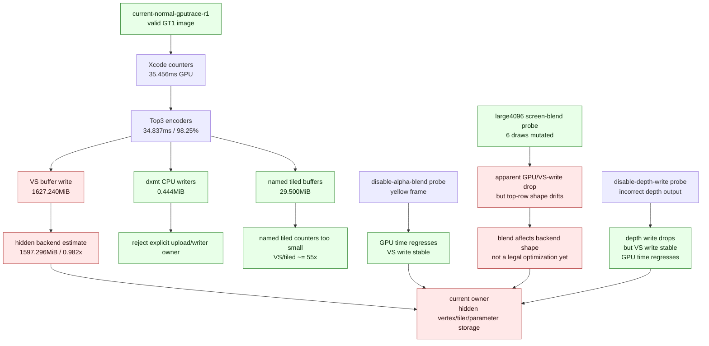
```mermaid
flowchart TD
  Normal["current-normal-gputrace-r1\nvalid GT1 image"] --> Xcode["Xcode counters\n35.456ms GPU"]
  Xcode --> Top3["Top3 encoders\n34.837ms / 98.25%"]
  Top3 --> VSWrite["VS buffer write\n1627.240MiB"]
  Top3 --> DxmtWriters["dxmt CPU writers\n0.444MiB"]
  Top3 --> NamedTiled["named tiled buffers\n29.500MiB"]

  VSWrite --> Hidden["hidden backend estimate\n1597.296MiB / 0.982x"]
  DxmtWriters --> RejectCpu["reject explicit upload/writer owner"]
  NamedTiled --> RejectNamed["named tiled counters too small\nVS/tiled ~= 55x"]
  Hidden --> Owner["current owner\nhidden vertex/tiler/parameter storage"]

  Alpha["disable-alpha-blend probe\nyellow frame"] --> AlphaReject["GPU time regresses\nVS write stable"]
  AlphaReject --> Owner
  ScopedAlpha["large4096 screen-blend probe\n6 draws mutated"] --> ScopedDelta["apparent GPU/VS-write drop\nbut top-row shape drifts"]
  ScopedDelta --> BlendCaution["blend affects backend shape\nnot a legal optimization yet"]
  BlendCaution --> Owner
  Depth["disable-depth-write probe\nincorrect depth output"] --> DepthReject["depth write drops\nbut VS write stable\nGPU time regresses"]
  DepthReject --> Owner

  classDef hot fill:#ffe8e8,stroke:#b64242,color:#2b0d0d
  classDef ok fill:#e8ffe8,stroke:#3c8f3c,color:#0d2b0d
  class VSWrite,Hidden,Owner,ScopedDelta,BlendCaution hot
  class Normal,DxmtWriters,NamedTiled,RejectCpu,RejectNamed,AlphaReject,DepthReject,ScopedAlpha ok
```

The most recent comparable artifact set is:

- `experiments/output/app-d3d9-3dmark05-state-attribution-frame60-r1/dxmt9.log`
- `experiments/output/app-d3d9-3dmark05-state-attribution-frame60-r1/3dmark05-perf-summary.md`
- `experiments/output/app-d3d9-3dmark05-state-attribution-frame60-r1/3dmark05-perf-encoders.csv`
- `experiments/output/app-d3d9-3dmark05-state-attribution-frame60-r1/3dmark05-perf-encoder-streams.csv`
- `traces/app-d3d9-3dmark05-state-attribution-frame60-r1/analysis/frame60-counters-xcode.csv`
- `traces/app-d3d9-3dmark05-state-attribution-frame60-r1/analysis/frame60-xcode-dxmt-joined-summary.csv`
- `traces/app-d3d9-3dmark05-state-attribution-frame60-r1/analysis/frame60-xcode-dxmt-bottleneck-report.md`
- `traces/app-d3d9-3dmark05-state-attribution-frame60-r1/analysis/frame60-shader-dump-report.md`

For the top three encoders in that capture, the joined dxmt buckets are:

| Seq/enc | GPU ms | Xcode VS buffer | Stream h/o/s changes | IB handle changes | Argbuf table | Argbuf cbuf | setVertexBytes | Transient V/I | Render-state shape |
|---|---:|---:|---:|---:|---:|---:|---:|---:|---|
| `60/2` | `20.094` | `981.171 MiB` | `271 / 0 / 10` | `160` | `5056 B` | `163992 B` | `2992 B` | `0 / 0 B` | `187` back-cull, `187` depth-on, `0` depth-write, `42` scissor, `145` alpha-blend |
| `60/1` | `8.988` | `421.211 MiB` | `130 / 12 / 0` | `130` | `3072 B` | `111480 B` | `2496 B` | `0 / 0 B` | `156` front-cull, `156` depth-on/write, no scissor/blend |
| `60/0` | `5.642` | `225.057 MiB` | `36 / 0 / 0` | `36` | `1152 B` | `175064 B` | `672 B` | `0 / 0 B` | `42` back-cull, `42` depth-on/write, no scissor/blend |

This closes the measurement gap for stream handle/offset/stride churn, IB
handle churn, argbuf table bytes, argbuf cbuf bytes, `setVertexBytes` bytes,
transient vertex/index bytes, and render-state shape at per-encoder
granularity. It also lets the Xcode buffer-write bucket be compared directly
against dxmt CPU-side writers.

The updated state-attribution capture reports `35.263ms` total GPU time, with
the top three render encoders taking `98.47%` of the frame and writing
`1627.438 MiB` through Xcode's VS buffer-write bucket. The dxmt-attributed CPU
writer bytes in those same encoders total only `0.444 MiB`, with no transient
vertex/index upload contribution. The resulting unexplained Xcode buffer-write
bucket remains `1627.599 MiB` (`1.000x` of the reported buffer writes), so the
current primary owner is still GPU-side vertex-stage/internal storage rather
than argbuf payloads, setVertexBytes, transient geometry uploads, or explicit
D3D9 render-state buckets.

The latest draw-size Xcode capture repeats the same shape and adds
per-encoder draw-size attribution. It reports `35.261ms` total GPU time,
top-three `34.737ms` / `98.51%`, and `1628.095 MiB` top-three Xcode buffer
write. The same joined rows attribute only `0.444 MiB` to dxmt CPU-side
writers, with `0 B` transient vertex/index traffic in the top encoders.
Top-three VS buffer write is `1447.9 B/VS invocation`, `2385.3 B/primitive`,
`2382.7 B/post-clipped primitive`, and `62.3 B/rasterized pixel`; it is
`33.1x` stream0 input and `7.9x` expected `VSOut`. The top rows are therefore
still classified as `gpu_vs_buffer_write` with high confidence, not
cbuf/setVertexBytes/transient upload ownership.

The new draw-size fields confirm that this is not a tiny-draw replay problem.
The hot top-three encoders contain only `385` draws but `715,395` triangles:
large primitive draw share is `0.56`, `0.46`, and `0.62`, with each hot row
reaching `22,622` primitives / `67,866` vertices in a single draw. Geometry
signature duplicates remain low (`330 unique / 55 duplicates`, duplicate ratio
`0.143x`). The current first-order owner is therefore real large indexed
primitive pressure interacting with Apple GPU hidden vertex/tiler/parameter
storage, not repeated small draws or explicit dxmt writer amplification.

The same run also confirms that the submission-batch stream/IB override design
does not change the GPU-side owner. It reduces CPU submission/encode overhead,
but the frame remains limited by Apple GPU vertex-stage/internal buffer writes.
This is a useful CPU fix, not the final GPU bottleneck removal.

#### Indexed Unique Vertex Probe

Date: 2026-06-02

`DXMT9_MEASURE_INDEX_REUSE=1` adds a diagnostic-only scan of indexed draw
buffers while encoder breakdown is enabled. It counts the raw indexed vertex
references submitted to Metal and a draw-local unique-index estimate. The probe
does not change draw submission, and the Xcode comparison confirms the GPU
shape is unchanged: top-three VS buffer write remains `1627.240MiB` to
`1627.285MiB` (`+0.00%`), and top-three GPU time changes only
`34.837ms` to `35.239ms` (`+1.16%`).

Artifacts:

- `experiments/output/app-d3d9-3dmark05-measure-index-reuse-gputrace-r1/3dmark05-perf-encoders.csv`
- `traces/app-d3d9-3dmark05-measure-index-reuse-gputrace-r1/analysis/frame60-counters-xcode.csv`
- `traces/app-d3d9-3dmark05-measure-index-reuse-gputrace-r1/analysis/frame60-xcode-dxmt-joined-summary.csv`
- `traces/app-d3d9-3dmark05-measure-index-reuse-gputrace-r1/analysis/frame60-xcode-dxmt-bottleneck-report.md`
- `traces/app-d3d9-3dmark05-measure-index-reuse-gputrace-r1/analysis/frame60-xcode-dxmt-comparison.md`

Top-three aggregate:

| Metric | Value | Interpretation |
|---|---:|---|
| dxmt indexed references | `2,146,185` | Same as top-three submitted vertex count. |
| dxmt draw-local unique estimate | `951,736` | Reuse ratio `2.255x`; large indexed meshes are reusing vertices materially. |
| Xcode VS invocations | `1,178,584` | `0.549x` submitted references, but `1.238x` draw-local unique estimate. |
| Xcode VS buffer write | `1627.285MiB` | `1792.9B` per draw-local unique estimate. |
| VS buffer bytes / VS invocation | `1447.8B` | Same hidden backend storage shape as baseline. |
| indexed reuse measured/skipped draws | `385 / 0` | Hot top-three draw coverage is complete. |

Per hot encoder:

| seq/enc | indexed references | unique estimate | reuse | VS invocations | VS inv / unique | VS buffer |
|---|---:|---:|---:|---:|---:|---:|
| `60/2` | `1,168,128` | `496,737` | `2.352x` | `642,001` | `1.292x` | `981.196MiB` |
| `60/1` | `686,175` | `330,867` | `2.074x` | `383,688` | `1.160x` | `421.174MiB` |
| `60/0` | `291,882` | `124,132` | `2.351x` | `152,895` | `1.232x` | `224.915MiB` |

Finite vertex-cache probe:

`DXMT9_MEASURE_INDEX_REUSE=1` now also records diagnostic LRU cache-miss
estimates for 16/32/64 vertex entries. The first no-gputrace validation run
uses `app-d3d9-3dmark05-measure-index-cache-nogputrace-r1` and confirms the
new columns are emitted and summarized correctly. This run is not a matched
Xcode frame because its encoder breakdown covers `722` draws instead of the
prior Xcode capture's `396` draws, so use it as a measurement-path validation
and trend signal, not as authoritative Xcode attribution.

| Metric | Value |
|---|---:|
| dxmt indexed references | `3,121,914` |
| dxmt draw-local unique estimate | `1,523,119` |
| cache-miss estimate, 16 entries | `2,037,449` / `1.338x` unique |
| cache-miss estimate, 32 entries | `1,944,132` / `1.276x` unique |
| cache-miss estimate, 64 entries | `1,847,341` / `1.213x` unique |

The aggregate finite-cache miss range (`1.213x-1.338x` unique) overlaps the
previous Xcode `VS invocations / unique` range (`1.160x-1.292x`) closely enough
that the remaining invocation-count gap is plausibly explained by finite
post-transform vertex-cache locality. This does not explain the hidden write
width: even after normalizing by `VS Invocations` or cache-miss estimates, the
VS buffer-write bucket remains far wider than the visible `184B` `VSOut`.

Matched Xcode validation:

`app-d3d9-3dmark05-measure-index-cache-gputrace-r1` is the first same-run
`.gputrace` + Xcode counter export with finite cache-miss estimates in the dxmt
join. Xcode Summary reports `723` draw calls, `3,121,917` vertices, and
`34.391ms` GPU time. This frame has a different hot-encoder shape from
`current-normal-gputrace-r1` (`723` draws vs the older `396`-draw reference),
so the comparison report's top-three A/B deltas must not be read as an
optimization result. Use this run for same-frame ownership and cache-correlation
evidence.

Artifacts:

- `experiments/output/app-d3d9-3dmark05-measure-index-cache-gputrace-r1/3dmark05-perf-encoders.csv`
- `traces/app-d3d9-3dmark05-measure-index-cache-gputrace-r1/frame60.gputrace`
- `traces/app-d3d9-3dmark05-measure-index-cache-gputrace-r1/analysis/frame60-performance.gputrace`
- `traces/app-d3d9-3dmark05-measure-index-cache-gputrace-r1/analysis/frame60-counters-xcode.csv`
- `traces/app-d3d9-3dmark05-measure-index-cache-gputrace-r1/analysis/frame60-xcode-dxmt-joined-summary.csv`
- `traces/app-d3d9-3dmark05-measure-index-cache-gputrace-r1/analysis/frame60-xcode-dxmt-bottleneck-report.md`

Hot-set aggregate:

| Hot set | GPU | VS write | refs | unique | cache64 | VS invocations | VS inv / unique | VS inv / cache64 | VS B / invocation | VS B / cache64 |
|---|---:|---:|---:|---:|---:|---:|---:|---:|---:|---:|
| top 3 | `27.945ms` | `1245.082MiB` | `2,580,831` | `1,256,571` | `1,522,156` | `1,485,926` | `1.183x` | `0.976x` | `878.6B` | `857.7B` |
| top 4 | `33.742ms` | `1472.747MiB` | `3,121,680` | `1,522,955` | `1,847,177` | `1,803,514` | `1.184x` | `0.976x` | `856.3B` | `836.0B` |

The top-four set is the useful whole-frame hot set for this capture because it
accounts for nearly all geometry and GPU time. Its submitted references match
Xcode Summary `Vertices` (`3,121,680` vs `3,121,917`) while Xcode
`VS Invocations` matches the 64-entry LRU cache-miss estimate closely
(`0.976x`). This strongly supports:

Tooling note: the Xcode/dxmt finalizer now accepts `--top N` and
`--hot-gpu-share PCT`. For this capture use `--top 4 --hot-gpu-share 95`
because top-three covers only `81.25%` of frame GPU time; the report's Hot Set
Aggregate then captures top-four `98.11%` and prevents top-three-only
conclusions. Cross-frame per-row comparisons are now restricted to shared
`seq/enc` rows so a changed hot-row shape cannot be accidentally rank-matched.

- `Summary Vertices` is submitted indexed references.
- `VS Invocations` is closer to finite post-transform vertex-cache misses than
  to draw-local unique vertices.
- The `VS invocations / unique ~= 1.18x` gap is mostly finite vertex-cache
  locality, not a separate hidden replay multiplier.
- The real unresolved GPU-side bottleneck is still the write width:
  `~836-879B` per cache miss / VS invocation versus `184B` visible `VSOut`.

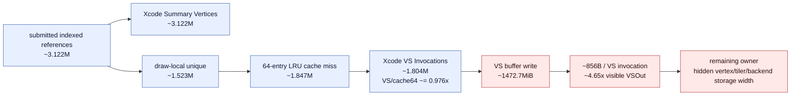
```mermaid
flowchart LR
  Refs["submitted indexed references\n~3.122M"] --> Summary["Xcode Summary Vertices\n~3.122M"]
  Refs --> Unique["draw-local unique\n~1.523M"]
  Unique --> Cache64["64-entry LRU cache miss\n~1.847M"]
  Cache64 --> VSInv["Xcode VS Invocations\n~1.804M\nVS/cache64 ~= 0.976x"]
  VSInv --> VSWrite["VS buffer write\n~1472.7MiB"]
  VSWrite --> Width["~856B / VS invocation\n~4.65x visible VSOut"]
  Width --> Owner["remaining owner\nhidden vertex/tiler/backend storage width"]

  classDef hot fill:#ffe8e8,stroke:#b64242,color:#2b0d0d
  classDef known fill:#e8f0ff,stroke:#476cb6,color:#0d1833
  class VSWrite,Width,Owner hot
  class Refs,Summary,Unique,Cache64,VSInv known
```

Interpretation:

- Xcode Summary `Vertices` follows submitted indexed references, not the
  lower `VS Invocations` counter. Use `VS Invocations` for actual vertex-stage
  work and `dxmt_indexed_unique_vertex_estimate` as the closest dxmt-side
  predictor when cache-miss estimates are unavailable.
- The hot rows are much closer to draw-local unique indexed vertices than raw
  references, so the backend is not simply writing `~1.6GiB` once per index
  reference. It is closer to post-transform / unique-vertex work plus a
  remaining `1.16x-1.29x` finite-cache locality, backend replay, clip/cull, or
  counter-accounting gap.
- Even after normalizing by unique indexed vertices, the bucket is still too
  large: `~1793B` per unique estimate versus a visible `184B` `VSOut`.
  Vertex reuse and finite-cache locality explain the invocation count, not the
  hidden write width.
- The next primitive/backend experiment should track three ratios together:
  `VS invocations / indexed_unique_estimate`, `VS buffer bytes / VS invocation`,
  `VS invocations / indexed_cache_miss_64`, and `VS buffer bytes /
  indexed_cache_miss_64`. A useful GPU fix must reduce the bytes/invocation or
  bytes/cache-miss ratio while preserving GT1 correctness.

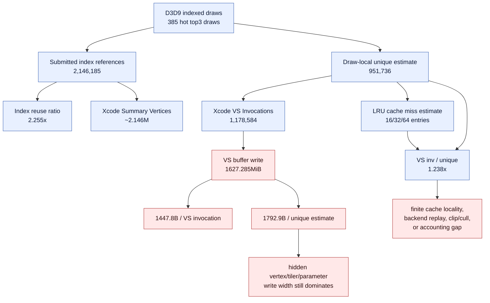
```mermaid
flowchart TD
  Draw["D3D9 indexed draws\n385 hot top3 draws"] --> Refs["Submitted index references\n2,146,185"]
  Draw --> Unique["Draw-local unique estimate\n951,736"]
  Refs --> Reuse["Index reuse ratio\n2.255x"]

  Unique --> VSInv["Xcode VS Invocations\n1,178,584"]
  Unique --> CacheMiss["LRU cache miss estimate\n16/32/64 entries"]
  Refs --> Summary["Xcode Summary Vertices\n~2.146M"]

  VSInv --> Width["VS buffer write\n1627.285MiB"]
  CacheMiss --> Gap
  Width --> PerInv["1447.8B / VS invocation"]
  Width --> PerUnique["1792.9B / unique estimate"]

  Unique --> Gap["VS inv / unique\n1.238x"]
  Gap --> BackendReplay["finite cache locality,\nbackend replay, clip/cull,\nor accounting gap"]
  PerUnique --> Hidden["hidden vertex/tiler/parameter\nwrite width still dominates"]

  classDef hot fill:#ffe8e8,stroke:#b64242,color:#2b0d0d
  classDef known fill:#e8f0ff,stroke:#476cb6,color:#0d1833
  class Width,PerInv,PerUnique,Hidden,BackendReplay hot
  class Draw,Refs,Unique,Reuse,Summary,VSInv,CacheMiss,Gap known
```

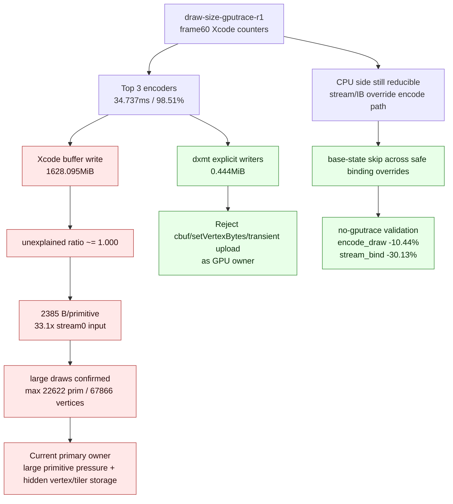
```mermaid
flowchart TD
  Run["draw-size-gputrace-r1\nframe60 Xcode counters"] --> Top3["Top 3 encoders\n34.737ms / 98.51%"]
  Top3 --> VSWrite["Xcode buffer write\n1628.095MiB"]
  Top3 --> DxmtWriters["dxmt explicit writers\n0.444MiB"]
  VSWrite --> Ratio["unexplained ratio ~= 1.000"]
  DxmtWriters --> RejectUpload["Reject cbuf/setVertexBytes/transient upload\nas GPU owner"]
  Ratio --> PrimitiveScale["2385 B/primitive\n33.1x stream0 input"]
  PrimitiveScale --> DrawSize["large draws confirmed\nmax 22622 prim / 67866 vertices"]
  DrawSize --> Owner["Current primary owner\nlarge primitive pressure + hidden vertex/tiler storage"]

  Run --> CPU["CPU side still reducible\nstream/IB override encode path"]
  CPU --> Fix["base-state skip across safe binding overrides"]
  Fix --> Verify["no-gputrace validation\nencode_draw -10.44%\nstream_bind -30.13%"]

  classDef hot fill:#ffe8e8,stroke:#b64242,color:#2b0d0d
  classDef ok fill:#e8ffe8,stroke:#3c8f3c,color:#0d2b0d
  class VSWrite,Ratio,PrimitiveScale,DrawSize,Owner hot
  class DxmtWriters,RejectUpload,Fix,Verify ok
```

The trim-varyings A/B result is important: `DXMT9_TRIM_UNUSED_VARYINGS=1`
reduced the expected VSOut payload from `184.0 B/vertex` to `40.2 B/vertex`,
but the top VS buffer-write bucket stayed effectively unchanged
(`1627.414 MiB` to `1627.321 MiB`). The top unexplained buffer-write ratio
remained `1.000`, so ordinary VSOut/varying width is not the current first-order
owner of the Xcode VS buffer-write traffic.

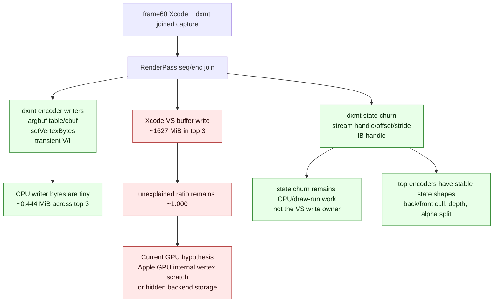
```mermaid
flowchart TD
  Capture["frame60 Xcode + dxmt joined capture"] --> Join["RenderPass seq/enc join"]
  Join --> Dxmt["dxmt encoder writers\nargbuf table/cbuf\nsetVertexBytes\ntransient V/I"]
  Join --> State["dxmt state churn\nstream handle/offset/stride\nIB handle"]
  Join --> Xcode["Xcode VS buffer write\n~1627 MiB in top 3"]

  Dxmt --> Explain["CPU writer bytes are tiny\n~0.444 MiB across top 3"]
  Xcode --> Unexplained["unexplained ratio remains ~1.000"]
  State --> CpuPath["state churn remains CPU/draw-run work\nnot the VS write owner"]
  State --> RenderState["top encoders have stable state shapes\nback/front cull, depth, alpha split"]
  Unexplained --> Next["Current GPU hypothesis\nApple GPU internal vertex scratch\nor hidden backend storage"]

  classDef hot fill:#ffe8e8,stroke:#b64242,color:#2b0d0d
  classDef known fill:#e8ffe8,stroke:#3c8f3c,color:#0d2b0d
  class Xcode,Unexplained,Next hot
  class Dxmt,State,Explain,CpuPath,RenderState known
```

Next experiment criteria:

- Keep `DXMT9_PERF_ENCODER_BREAKDOWN=1` and Xcode encoder counter export enabled
  for every GT1 perf/gputrace run.
- Enable `DXMT9_MEASURE_INDEX_REUSE=1` when testing primitive/backend pressure,
  so Xcode `VS Invocations` can be compared against dxmt submitted references
  and draw-local unique indexed vertices.
- Treat top encoder rows without `seq/enc` join or without dxmt draw
  attribution as invalid for bottleneck ownership.
- For any candidate optimization, require both Xcode-side deltas and dxmt-side
  owner deltas: if Xcode buffer write falls but dxmt writer buckets do not,
  the likely owner is GPU internal codegen/scratch; if dxmt writer buckets fall
  but Xcode does not, the candidate is not the dominant GPU bottleneck.
- The translated-VS temp/register-spill probe has now been run. Keep it as an
  opt-in diagnostic, but do not treat source-visible `r[]` width as the current
  primary fix unless a future capture shows an actual Xcode VS write delta.
- The translated VS `outTexcoord[]` scratch probe has also been run. Keep it
  as an opt-in diagnostic, but do not treat source-visible translated-local
  arrays as the current primary owner unless a future capture shows an actual
  Xcode VS write delta.
- The depth-write state-shape probe has now been run. Keep it as a
  correctness-invalid diagnostic, but do not treat depth write/store traffic as
  the primary VS-write owner unless a future legal variant moves the
  `VS Buffer Device Memory Bytes Written` bucket.
- The alpha-blend state-shape probe has now been run. Keep it as a
  correctness-invalid diagnostic, but do not treat broad blend disable as the
  primary VS-write owner: GPU time regressed and `VS Buffer Device Memory Bytes
  Written` stayed stable.
- The scoped `large4096,screen-blend` state-shape probe has also been run. It
  produced a large apparent GPU/VS-write drop, but it mutated real blend
  semantics and changed the hot-row set. Do not promote it. Use it to justify a
  stricter same-row experiment that preserves blending while testing
  primitive/backend locality or pass composition.

### Hidden Apple GPU Backend Storage Model

Date: 2026-06-01

The working term "hidden vertex/tiler/parameter backend storage" means the
part of Xcode's `VS Buffer Device Memory Bytes Written` bucket that is not
explained by dxmt's explicit CPU-side writers, source-visible MSL `VSOut`,
or frontend Metal IR scratch. It is not a single public Metal object. It is an
attribution model for Apple TBDR work that happens after dxmt submits a draw
and before the fragment stage consumes the binned primitives.

Current frame60 evidence:

- Top-three Xcode VS buffer write is about `1.627GiB`.
- dxmt-attributed CPU writer bytes are about `0.444MiB`.
- MSL `VSOut` is `184B`; offline Metal IR return is also `184B`.
- Offline Metal IR visible scratch is `128B` in the latest codegen refresh,
  and earlier trim probes showed `r[]` / `outTexcoord[]` source scratch changes
  do not move the Xcode bucket.
- Top-three geometry is real large indexed primitive pressure: about
  `715k` triangles and `2.1M` submitted dxmt vertices in the captured frame.

The Xcode encoder summarizer now emits a derived hidden-backend classifier in
`frame60-xcode-dxmt-bottleneck-report.md`. For
`app-d3d9-3dmark05-x8-alpha-fill-gputrace-r2`, the classifier subtracts
Xcode's named tiled vertex/primitive-block counters and dxmt CPU writer bytes
from the top-three VS buffer-write bucket:

| Metric | Value |
|---|---:|
| Top-three VS buffer write | `1627.246MiB` |
| Named tiled buffer total | `29.500MiB` |
| dxmt CPU writer bytes | `0.444MiB` |
| Hidden backend write estimate | `1597.301MiB` |
| Hidden backend / VS buffer write | `0.982x` |
| Backend storage class | `hidden_vertex_tiler_parameter_storage:3` |

Per hot encoder, the derived hidden ratio is `0.975x` for `60/2`, `0.991x`
for `60/1`, and `0.993x` for `60/0`. The next-probe hint for all three rows is
`primitive-backend-pressure-or-state-shape-ab`, which matches the manual model
below: the first useful experiments should try to move primitive/backend
pressure or legal backend-state shape, not explicit dxmt writer bytes.

The following model is the normalization target for future experiments.

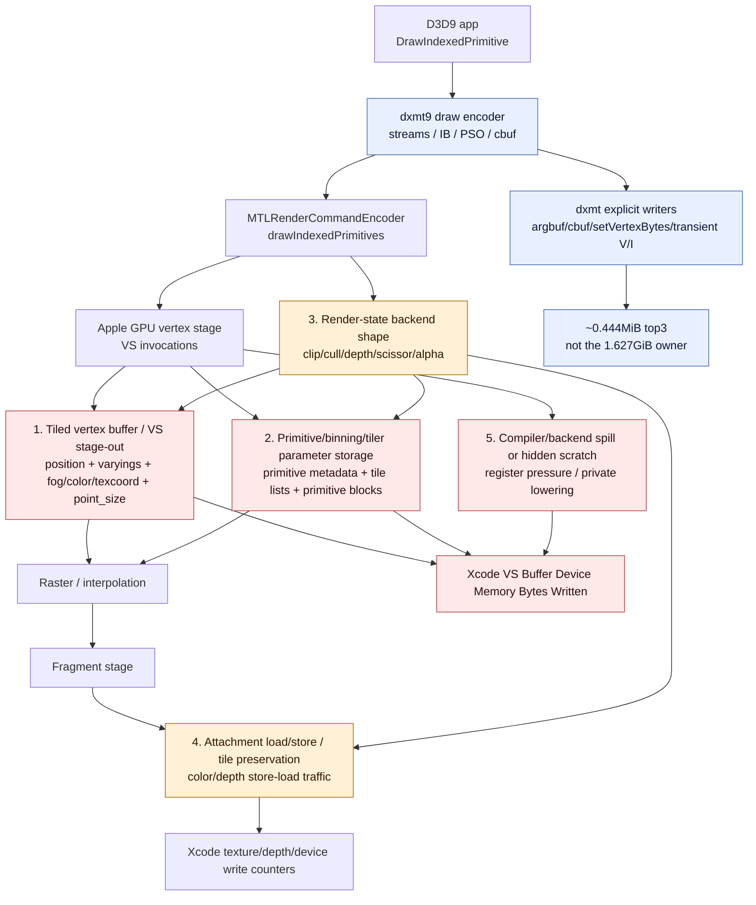
```mermaid
flowchart TD
  App["D3D9 app\nDrawIndexedPrimitive"] --> Dxmt["dxmt9 draw encoder\nstreams / IB / PSO / cbuf"]
  Dxmt --> Metal["MTLRenderCommandEncoder\ndrawIndexedPrimitives"]
  Metal --> VS["Apple GPU vertex stage\nVS invocations"]

  VS --> StageOut["1. Tiled vertex buffer / VS stage-out\nposition + varyings + fog/color/texcoord + point_size"]
  VS --> CompilerScratch["5. Compiler/backend spill or hidden scratch\nregister pressure / private lowering"]
  VS --> PrimitiveSetup["2. Primitive/binning/tiler parameter storage\nprimitive metadata + tile lists + primitive blocks"]

  StageOut --> Raster["Raster / interpolation"]
  PrimitiveSetup --> Raster
  Raster --> FS["Fragment stage"]
  FS --> Attach["4. Attachment load/store / tile preservation\ncolor/depth store-load traffic"]

  Metal --> StateShape["3. Render-state backend shape\nclip/cull/depth/scissor/alpha"]
  StateShape --> StageOut
  StateShape --> PrimitiveSetup
  StateShape --> Attach

  StageOut --> XVS["Xcode VS Buffer Device Memory Bytes Written"]
  PrimitiveSetup --> XVS
  CompilerScratch --> XVS
  Attach --> XDevice["Xcode texture/depth/device write counters"]

  Dxmt --> DxmtWriters["dxmt explicit writers\nargbuf/cbuf/setVertexBytes/transient V/I"]
  DxmtWriters --> Reject["~0.444MiB top3\nnot the 1.627GiB owner"]

  classDef hot fill:#ffe8e8,stroke:#b64242,color:#2b0d0d
  classDef state fill:#fff0d6,stroke:#b26b00,color:#2b1900
  classDef known fill:#e8f0ff,stroke:#476cb6,color:#0d1833
  class StageOut,PrimitiveSetup,CompilerScratch,XVS hot
  class StateShape,Attach state
  class Dxmt,DxmtWriters,Reject known
```

#### 1. Tiled Vertex Buffer / VS Stage-Out Storage

Meaning:

- Internal storage that preserves VS-produced `position`, varyings,
  `point_size`, `fogFactor`, colors, and texcoords until rasterization and
  fragment interpolation consume them.
- Current evidence says this is bigger than ordinary visible `VSOut`: MSL
  `VSOut = 184B`, IR return `184B`, IR scratch `128B`, but Xcode reports
  `1151-1603B / VS invocation` in the hot rows.

Counters to watch:

- `VS Buffer Device Memory Bytes Written`
- `Tiled Vertex Buffer Bytes`
- `VS Invocations`
- `Post-Clipped Primitives`
- `VS buffer bytes / VS invocation`
- `VS buffer / expected VSOut`

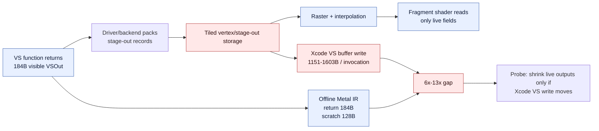
```mermaid
flowchart LR
  VS["VS function returns\n184B visible VSOut"] --> Pack["Driver/backend packs\nstage-out records"]
  Pack --> TVB["Tiled vertex/stage-out storage"]
  TVB --> Interp["Raster + interpolation"]
  Interp --> FS["Fragment shader reads\nonly live fields"]

  VS --> IR["Offline Metal IR\nreturn 184B\nscratch 128B"]
  TVB --> Xcode["Xcode VS buffer write\n1151-1603B / invocation"]

  IR --> Gap["6x-13x gap"]
  Xcode --> Gap
  Gap --> Probe["Probe: shrink live outputs only if\nXcode VS write moves"]

  classDef hot fill:#ffe8e8,stroke:#b64242,color:#2b0d0d
  classDef known fill:#e8f0ff,stroke:#476cb6,color:#0d1833
  class TVB,Xcode,Gap hot
  class VS,IR,Interp,FS known
```

#### 2. Primitive / Binning / Tiler Parameter Storage

Meaning:

- Apple TBDR must bin primitives into tiles before fragment work. That creates
  primitive metadata, tile lists, primitive block data, and related parameter
  storage that may be counted under vertex-stage buffer writes or nearby
  backend buckets.
- GT1 top-three rows are large indexed primitive pressure: about `715k`
  triangles, `2.1M` dxmt vertices, and `~1.6GiB` VS buffer write.

Counters to watch:

- `Tiled Vertex Buffer Primitive Blocks Bytes`
- `Primitive Block Tile Intersections`
- `Primitives per Tile`
- `Tiling Block Utilization`
- `Primitives`, `Post-Clipped Primitives`
- `Primitives Culled Backface/Offscreen/Clipped %`

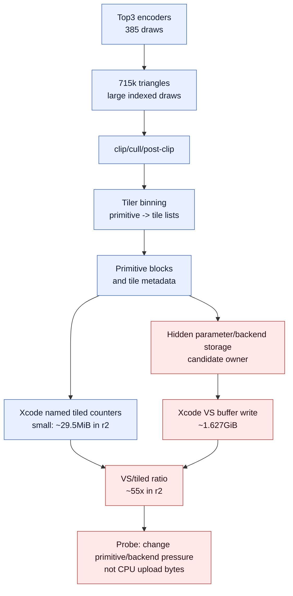
```mermaid
flowchart TD
  Draws["Top3 encoders\n385 draws"] --> Prim["715k triangles\nlarge indexed draws"]
  Prim --> ClipCull["clip/cull/post-clip"]
  ClipCull --> Bin["Tiler binning\nprimitive -> tile lists"]
  Bin --> Blocks["Primitive blocks\nand tile metadata"]
  Blocks --> Named["Xcode named tiled counters\nsmall: ~29.5MiB in r2"]
  Blocks --> Hidden["Hidden parameter/backend storage\ncandidate owner"]

  Hidden --> XVS["Xcode VS buffer write\n~1.627GiB"]
  Named --> Gap["VS/tiled ratio\n~55x in r2"]
  XVS --> Gap
  Gap --> Experiment["Probe: change primitive/backend pressure\nnot CPU upload bytes"]

  classDef hot fill:#ffe8e8,stroke:#b64242,color:#2b0d0d
  classDef known fill:#e8f0ff,stroke:#476cb6,color:#0d1833
  class Hidden,XVS,Gap,Experiment hot
  class Draws,Prim,ClipCull,Bin,Blocks,Named known
```

#### 3. Clip / Cull / Depth / Scissor / Alpha Backend Shape

Meaning:

- Even with the same visible `VSOut`, render-state can change the backend
  storage shape: clipping, culling, depth-write mode, alpha blend/test,
  scissor, and point-size handling can affect how primitives are retained or
  binned.
- Current top rows have different state shapes. `60/2` is the largest pass and
  mixes depth test without depth write, alpha blend, scissor, texturing, and
  back-cull. Other hot rows use front/back cull and depth-write combinations.

Counters to watch:

- Per-encoder cull mode
- Depth enable/write/function
- Alpha blend/test
- Scissor and clip-plane enable
- Point-size output
- Xcode VS write deltas under controlled A/B probes

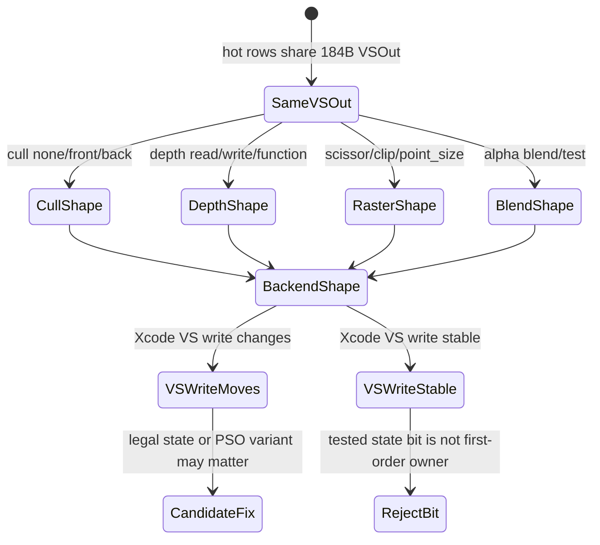
```mermaid
stateDiagram-v2
  [*] --> SameVSOut: hot rows share 184B VSOut
  SameVSOut --> CullShape: cull none/front/back
  SameVSOut --> DepthShape: depth read/write/function
  SameVSOut --> RasterShape: scissor/clip/point_size
  SameVSOut --> BlendShape: alpha blend/test

  CullShape --> BackendShape
  DepthShape --> BackendShape
  RasterShape --> BackendShape
  BlendShape --> BackendShape

  BackendShape --> VSWriteMoves: Xcode VS write changes
  BackendShape --> VSWriteStable: Xcode VS write stable

  VSWriteMoves --> CandidateFix: legal state or PSO variant may matter
  VSWriteStable --> RejectBit: tested state bit is not first-order owner
```

#### 4. Attachment Load/Store / Tile Preservation Traffic

Meaning:

- This is mostly texture/depth/device write traffic, not the current primary
  `VS Buffer` bucket. It still matters because GT1 has many render-pass splits
  and tile preservation/store-load can burn bandwidth even when the first-order
  owner is vertex-stage storage.

Counters to watch:

- Render pass begin/split counts
- Store/load action and preservation bytes
- Color/depth store bytes
- Memoryless eligibility
- Same RT/depth pass coalescing failures

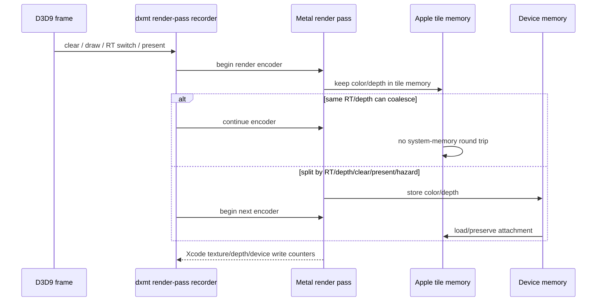
```mermaid
sequenceDiagram
  participant App as D3D9 frame
  participant DXMT as dxmt render-pass recorder
  participant Metal as Metal render pass
  participant Tile as Apple tile memory
  participant Mem as Device memory

  App->>DXMT: clear / draw / RT switch / present
  DXMT->>Metal: begin render encoder
  Metal->>Tile: keep color/depth in tile memory
  alt same RT/depth can coalesce
    DXMT->>Metal: continue encoder
    Tile->>Tile: no system-memory round trip
  else split by RT/depth/clear/present/hazard
    Metal->>Mem: store color/depth
    DXMT->>Metal: begin next encoder
    Mem->>Tile: load/preserve attachment
  end
  Metal-->>DXMT: Xcode texture/depth/device write counters
```

#### 5. Compiler / Backend Spill Or Hidden Scratch

Meaning:

- Source-visible `float4 r[32]` is already optimized away by the Metal
  compiler in the hot shaders, and local `outTexcoord[]` scratch trimming did
  not move the Xcode bucket.
- Backend register pressure, SIMD occupancy, private temporary lowering, or
  hidden backend storage below AIR can still appear as Xcode buffer-write
  pressure.

Counters and artifacts to watch:

- Offline Metal IR / `metal-objdump`
- Warnings, return aggregate size, alloca/lifetime bytes
- `VS Occupancy`
- `VS ALU Limiter`
- `VS Buffer Write Limiter`
- `VS Buffer Device Memory Bytes Written`

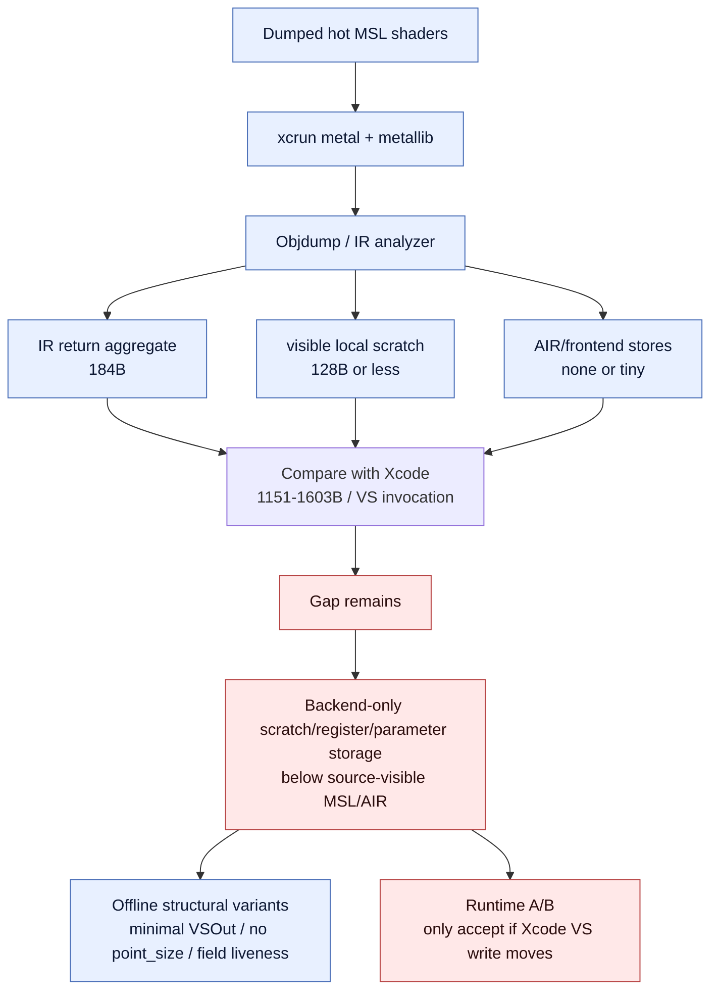
```mermaid
flowchart TD
  Dump["Dumped hot MSL shaders"] --> Compile["xcrun metal + metallib"]
  Compile --> IR["Objdump / IR analyzer"]
  IR --> Return["IR return aggregate\n184B"]
  IR --> Scratch["visible local scratch\n128B or less"]
  IR --> Stores["AIR/frontend stores\nnone or tiny"]

  Return --> Compare["Compare with Xcode\n1151-1603B / VS invocation"]
  Scratch --> Compare
  Stores --> Compare
  Compare --> Gap["Gap remains"]
  Gap --> Backend["Backend-only scratch/register/parameter storage\nbelow source-visible MSL/AIR"]

  Backend --> ProbeA["Offline structural variants\nminimal VSOut / no point_size / field liveness"]
  Backend --> ProbeB["Runtime A/B\nonly accept if Xcode VS write moves"]

  classDef hot fill:#ffe8e8,stroke:#b64242,color:#2b0d0d
  classDef known fill:#e8f0ff,stroke:#476cb6,color:#0d1833
  class Gap,Backend,ProbeB hot
  class Dump,Compile,IR,Return,Scratch,Stores,ProbeA known
```

#### Call Flow And Decision Gates

Use the existing frame60 `.gputrace`, Xcode counter CSVs, joined dxmt encoder
CSV, and shader dumps to drive small experiments. A candidate is only useful
when the expected counter bucket moves, not merely when source shape changes.

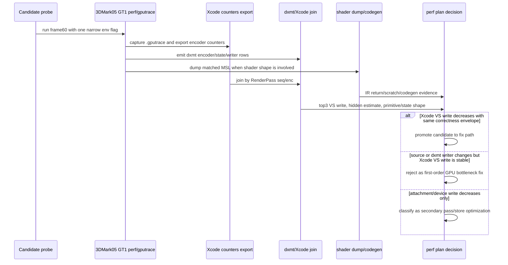
```mermaid
sequenceDiagram
  participant Probe as Candidate probe
  participant Run as 3DMark05 GT1 perf/gputrace
  participant Xcode as Xcode counters export
  participant Join as dxmt/Xcode join
  participant Shader as shader dump/codegen
  participant Plan as perf plan decision

  Probe->>Run: run frame60 with one narrow env flag
  Run->>Xcode: capture .gputrace and export encoder counters
  Run->>Join: emit dxmt encoder/state/writer rows
  Run->>Shader: dump matched MSL when shader shape is involved
  Xcode->>Join: join by RenderPass seq/enc
  Shader->>Plan: IR return/scratch/codegen evidence
  Join->>Plan: top3 VS write, hidden estimate, primitive/state shape

  alt Xcode VS write decreases with same correctness envelope
    Plan->>Plan: promote candidate to fix path
  else source or dxmt writer changes but Xcode VS write is stable
    Plan->>Plan: reject as first-order GPU bottleneck fix
  else attachment/device write decreases only
    Plan->>Plan: classify as secondary pass/store optimization
  end
```

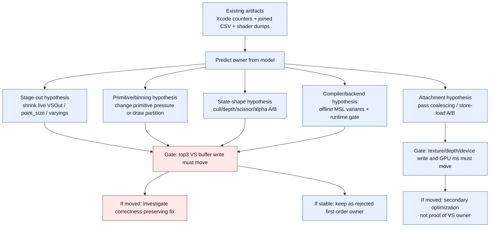
```mermaid
flowchart TD
  Evidence["Existing artifacts\nXcode counters + joined CSV + shader dumps"] --> Predict["Predict owner from model"]
  Predict --> A["Stage-out hypothesis\nshrink live VSOut / point_size / varyings"]
  Predict --> B["Primitive/binning hypothesis\nchange primitive pressure or draw partition"]
  Predict --> C["State-shape hypothesis\ncull/depth/scissor/alpha A/B"]
  Predict --> D["Attachment hypothesis\npass coalescing / store-load A/B"]
  Predict --> E["Compiler/backend hypothesis\noffline MSL variants + runtime gate"]

  A --> Gate["Gate: top3 VS buffer write must move"]
  B --> Gate
  C --> Gate
  E --> Gate
  D --> DeviceGate["Gate: texture/depth/device write and GPU ms must move"]

  Gate --> Accept["If moved: investigate correctness-preserving fix"]
  Gate --> Reject["If stable: keep as rejected first-order owner"]
  DeviceGate --> Secondary["If moved: secondary optimization\nnot proof of VS owner"]

  classDef hot fill:#ffe8e8,stroke:#b64242,color:#2b0d0d
  classDef probe fill:#e8f0ff,stroke:#476cb6,color:#0d1833
  class Gate,Accept hot
  class Evidence,Predict,A,B,C,D,E,Reject,DeviceGate,Secondary probe
```

#### Existing Dump Reuse

Existing 3DMark05 dumps should be used before adding broad runtime probes:

- Shader dumps can drive offline MSL variants: minimal `VSOut`, no
  `point_size`, pair-local varying liveness, or small source-shape changes can
  be compiled with `xcrun metal` before changing the runtime translator.
- Xcode `.gputrace` resource views can identify attachment formats,
  `PixelFormatView` usage, render-target/depth pairs, and whether an apparent
  Summary insight is on the hot encoder path or only on post/resolve passes.
- Joined encoder CSVs are the authority for deciding whether a candidate moves
  `VS Buffer Device Memory Bytes Written`, named tiled-buffer counters,
  texture/depth/device writes, or only dxmt CPU-side writer bytes.
- Texture contents from a capture are useful for understanding resource roles
  and pass dependencies, but correctness still needs a runtime image/result
  check because a dumped texture is only one captured frame state.

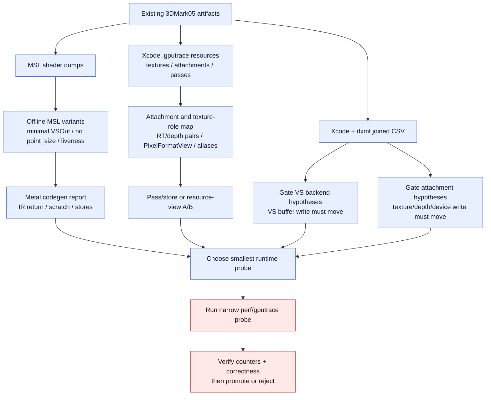
```mermaid
flowchart TD
  Dumps["Existing 3DMark05 artifacts"] --> ShaderDump["MSL shader dumps"]
  Dumps --> GpuTrace["Xcode .gputrace resources\ntextures / attachments / passes"]
  Dumps --> JoinedCsv["Xcode + dxmt joined CSV"]

  ShaderDump --> OfflineVariants["Offline MSL variants\nminimal VSOut / no point_size / liveness"]
  OfflineVariants --> Codegen["Metal codegen report\nIR return / scratch / stores"]

  GpuTrace --> AttachmentMap["Attachment and texture-role map\nRT/depth pairs / PixelFormatView / aliases"]
  AttachmentMap --> PassProbe["Pass/store or resource-view A/B"]

  JoinedCsv --> GateVS["Gate VS backend hypotheses\nVS buffer write must move"]
  JoinedCsv --> GateAttach["Gate attachment hypotheses\ntexture/depth/device write must move"]

  Codegen --> Decide["Choose smallest runtime probe"]
  PassProbe --> Decide
  GateVS --> Decide
  GateAttach --> Decide

  Decide --> Runtime["Run narrow perf/gputrace probe"]
  Runtime --> Verify["Verify counters + correctness\nthen promote or reject"]

  classDef hot fill:#ffe8e8,stroke:#b64242,color:#2b0d0d
  classDef known fill:#e8f0ff,stroke:#476cb6,color:#0d1833
  class Runtime,Verify hot
  class Dumps,ShaderDump,GpuTrace,JoinedCsv,OfflineVariants,Codegen,AttachmentMap,PassProbe,GateVS,GateAttach,Decide known
```

#### Bottleneck Prediction From The Model

The diagrams above should be used as a classifier, not just as documentation.
Start from a joined hot encoder row, derive the smallest hypothesis that can
move the observed bucket, then run only the narrow probe needed to accept or
reject that hypothesis.

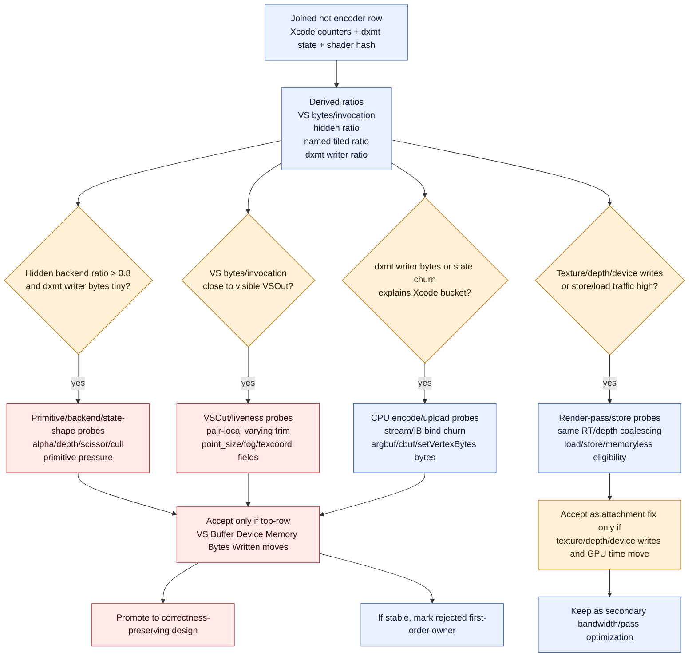
```mermaid
flowchart TD
  Row["Joined hot encoder row\nXcode counters + dxmt state + shader hash"] --> Ratios["Derived ratios\nVS bytes/invocation\nhidden ratio\nnamed tiled ratio\ndxmt writer ratio"]

  Ratios --> HiddenHigh{"Hidden backend ratio > 0.8\nand dxmt writer bytes tiny?"}
  Ratios --> VisibleHigh{"VS bytes/invocation\nclose to visible VSOut?"}
  Ratios --> AttachHigh{"Texture/depth/device writes\nor store/load traffic high?"}
  Ratios --> CpuHigh{"dxmt writer bytes or state churn\nexplains Xcode bucket?"}

  HiddenHigh -- "yes" --> BackendProbe["Primitive/backend/state-shape probes\nalpha/depth/scissor/cull\nprimitive pressure"]
  VisibleHigh -- "yes" --> StageOutProbe["VSOut/liveness probes\npair-local varying trim\npoint_size/fog/texcoord fields"]
  AttachHigh -- "yes" --> AttachProbe["Render-pass/store probes\nsame RT/depth coalescing\nload/store/memoryless eligibility"]
  CpuHigh -- "yes" --> CpuProbe["CPU encode/upload probes\nstream/IB bind churn\nargbuf/cbuf/setVertexBytes bytes"]

  BackendProbe --> GateVS["Accept only if top-row\nVS Buffer Device Memory Bytes Written moves"]
  StageOutProbe --> GateVS
  CpuProbe --> GateVS
  AttachProbe --> GateAttach["Accept as attachment fix only if\ntexture/depth/device writes and GPU time move"]

  GateVS --> Promote["Promote to correctness-preserving design"]
  GateVS --> Reject["If stable, mark rejected first-order owner"]
  GateAttach --> Secondary["Keep as secondary bandwidth/pass optimization"]

  classDef hot fill:#ffe8e8,stroke:#b64242,color:#2b0d0d
  classDef gate fill:#fff0d6,stroke:#b26b00,color:#2b1900
  classDef known fill:#e8f0ff,stroke:#476cb6,color:#0d1833
  class BackendProbe,StageOutProbe,GateVS,Promote hot
  class HiddenHigh,VisibleHigh,AttachHigh,CpuHigh,GateAttach gate
  class Row,Ratios,AttachProbe,CpuProbe,Reject,Secondary known
```

Small experiments should reuse the existing 3DMark05 dumps before adding broad
runtime instrumentation:

| Hypothesis | Dump-first check | Narrow runtime probe | Accept signal |
|---|---|---|---|
| Stage-out width is the owner | Compile dumped hot VS/FS pairs with minimal live `VSOut` fields | Pair-liveness PSO variant or field gate | Top hot-row VS buffer write drops |
| Primitive/binning storage is the owner | Compare primitives, post-clipped primitives, tile intersections, named tiled counters | Change primitive pressure or draw partition only | VS write or hidden ratio tracks primitive pressure |
| State shape changes backend storage | Compare hot-row cull/depth/scissor/alpha state with same shader hashes | One-bit A/B such as alpha blend off or depth-write off | Only matching state rows move materially |
| Attachment preservation is secondary bandwidth | Map RT/depth/texture roles in `.gputrace` resources | Render-pass coalescing or load/store action probe | Texture/depth/device writes and GPU time drop |
| Compiler/backend scratch is below AIR | Offline IR/objdump still shows small return/scratch | Runtime structural variant only after offline evidence | Xcode VS write moves despite tiny visible IR delta |

### Multi-Capture VS Buffer Scaling

Date: 2026-06-01

The joined Xcode/dxmt CSVs can now be compared across frame60 captures with:

```bash
python3 scripts/tools/analyze_vs_buffer_scaling.py \
  $(find traces -path '*analysis/frame60-xcode-dxmt-joined-summary.csv' | sort) \
  --report-output traces/analysis-vs-buffer-scaling-frame60.md \
  --aggregate-output traces/analysis-vs-buffer-scaling-frame60.csv \
  --baseline-run current-normal-gputrace-r1
```

The generated report is intentionally stored under ignored `traces/` output.
The current local report is
`traces/analysis-vs-buffer-scaling-frame60-current.md`, comparing all `45`
local frame60 captures that currently have joined Xcode/dxmt CSVs. The report
now also emits a baseline-delta triage against `current-normal-gputrace-r1`.
The triage requires top row-key equality, draw-count delta <= `1%`, and
vertex/primitive delta <= `5%` before calling an A/B run geometry-stable.

Top-three aggregate results split into three useful groups:

1. Same-row, same-geometry state/source probes remain at about `1627MiB` VS
   buffer write.
2. Correctness-invalid source-shape classifiers such as constant fragment /
   position-only reduce the bucket only slightly to about `1548MiB`, while
   proving visible VSOut width is not the first-order owner.
3. Primitive-order, cull, and row-shape classifiers can move VS write
   materially, but most do so with top-row or geometry drift and therefore
   remain diagnostic rather than optimization proof.

| Metric | Observed range |
|---|---:|
| VS buffer write | `903.327` to `2917.457 MiB` |
| Same-row/state-probe VS buffer write | `1627.233` to `1629.865 MiB` |
| dxmt CPU writer / Xcode buffer write | `0.0003x` to `0.0296x` |
| VS buffer / expected VSOut | `4.0x` to `88.4x` |
| VS buffer / stream0 input | `17.8x` to `59.4x` |
| VS buffer / named tiled-buffer counters | `27.3x` to `182.2x` |
| VS buffer bytes / VS invocation | `736.1` to `1449.9 B` |
| VS buffer bytes / primitive | `1283.0` to `4276.3 B` |

Encoder-row correlation over nonzero VS-write rows points at primitive/backend
scaling, not explicit dxmt writes:

| Candidate metric | Pearson r vs VS buffer MiB |
|---|---:|
| tiled vertex + primitive-block bytes | `0.797` |
| VS invocations | `0.718` |
| post-clipped primitives | `0.702` |
| stream0 input bytes | `0.702` |
| dxmt vertices | `0.702` |
| primitives | `0.702` |
| pixels | `0.660` |
| expected VSOut bytes | `0.637` |
| large primitive draws | `0.625` |
| dxmt CPU writer bytes | `0.409` |
| stream/IB state churn | `0.379` |
| FS invocations | `0.255` |

Baseline-delta triage sharpens the interpretation:

| Run class | Representative result | Interpretation |
|---|---|---|
| `shape-stable GPU-only` | `depth-write-row-60-2-large4096-alpha`: GPU `-4.33%`, VS write `+0.01%` | Backend state can affect timing without moving the primary bucket. |
| `shape-stable GPU-only` | `split-row-60-2-large4096`: GPU `-2.52%`, VS write `+0.16%` | Current-row draw partition is not the VS-write owner. |
| `shape-stable unchanged` | `force-fragment-color`: VS write `-4.85%` with unchanged geometry | Fragment work and visible VSOut source shape are secondary. |
| `shape-stable VS-moved` | `force-expand-indexed`: VS write `+79.29%`, GPU `+83.55%` | Destructive expansion proves indexed submission/vertex reuse matters, but is the opposite of a fix. |
| `shape-drift VS-moved` | `reverse-indexed-triangles`: VS write `-44.49%`, GPU `-37.94%`, row keys drift | Primitive/order/locality can move the hidden bucket, but current diagnostic does not prove a legal same-frame optimization. |

For rows with complete dxmt state attribution, render-state shape split is:

| Shape | Rows | GPU ms | VS buffer MiB | Share of known-state VS write | VS B/primitive | Notes |
|---|---:|---:|---:|---:|---:|---|
| `cull=back,depth=read,scissor=mixed,blend=mixed,textured=on,ffp=off,preT=off` | `42` | `618.020` | `28332.609` | `0.399` | `1761.3` | Main hot encoder family; includes depth-read, textured, mixed scissor/blend rows. |
| `cull=front,depth=write,scissor=off,blend=off,textured=off,ffp=off,preT=off` | `69` | `607.995` | `27960.106` | `0.394` | `1868.9` | Shadow/depth-like pass family. |
| `cull=back,depth=mixed,scissor=mixed,blend=off,textured=on,ffp=off,preT=off` | `26` | `160.808` | `6187.271` | `0.087` | `1293.4` | Row-shape/primitive-order diagnostic family. |
| `cull=back,depth=write,scissor=off,blend=off,textured=on,ffp=off,preT=off` | `18` | `108.458` | `4254.249` | `0.060` | `2547.2` | Textured depth-writing pass family. |

Interpretation:

- Source-visible VSOut width, translated VS temp width, translated
  `outTexcoord[]` scratch width, and FS texcoord helper copies are not the
  first-order owner. Those A/B runs materially changed source shape or expected
  VSOut bytes without moving Xcode VS buffer writes.
- Explicit dxmt CPU writers are too small by roughly four orders of magnitude
  in the top encoders.
- The bucket scales with primitive/post-clip/tiled-counter shape, but Xcode's
  named tiled vertex/primitive-block counters remain too small to be the whole
  bucket. Treat the remaining traffic as hidden Apple GPU vertex-stage
  parameter, tiler, or compiler-internal storage below the visible MSL/AIR forms
  tested so far.
- The known-state split does not point to one simple D3D9 state bit. The
  highest row has back cull, depth read, mixed scissor/blend, and texturing,
  but the next two shapes still write hundreds of MiB with different cull,
  depth-write, blend, and texture state. State toggles should therefore be
  treated as diagnostic A/B probes, not correctness-preserving fixes.
- The `DXMT9_PROBE_DISABLE_ALPHA_BLEND=1` probe produced a correctness-invalid
  yellow/clear-like GT1 frame and did not move the VS-write bucket: top-three
  VS write stayed `1627.240MiB` to `1627.268MiB` while GPU time regressed
  `+1.72%`. Broad alpha-blend disable is therefore rejected as a first-order
  owner and as an optimization path.
- `DXMT_DISABLE_CULL=1` did not reduce the top-three VS buffer-write bucket:
  it changed `1627.240MiB` to `1627.233MiB` while top-three GPU time changed
  from `34.837ms` to `35.478ms`. Draw count, vertex count, stream/IB churn,
  PSO samples, and expected VSOut stayed unchanged. The cull-state bit is
  therefore not the first-order owner of the hidden VS buffer-write traffic.
- `DXMT_DISABLE_SCISSOR=1` also did not reduce the top-three VS buffer-write
  bucket: it changed `1627.240MiB` to `1627.315MiB` while top-three GPU time
  changed from `34.837ms` to `36.295ms`. Draw count, vertex count,
  stream/IB churn, PSO samples, expected VSOut, and explicit dxmt writer bytes
  stayed unchanged. The scissor state is therefore also not the first-order
  owner of the hidden VS buffer-write traffic.
- Row-scoped depth-write and depth-func probes now join the stable same-row
  bucket: they improve or perturb GPU time but leave top-three VS write at
  `~1627MiB`. Stop spending gputrace time on depth-only state as a primary
  owner.
- The only strong VS-write movements are destructive (`force-expand-indexed`)
  or shape-drifting primitive/order/locality classifiers. The next useful fix
  path must preserve row keys and geometry while reproducing that primitive or
  backend-locality movement, or must isolate the same behavior in a row-local
  replay harness.

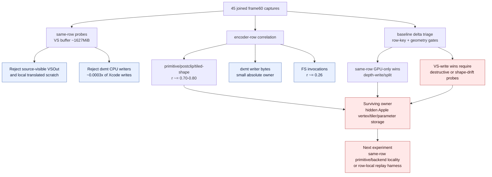
```mermaid
flowchart TD
  Joined["45 joined frame60 captures"] --> Stable["same-row probes\nVS buffer ~1627MiB"]
  Joined --> Rows["encoder-row correlation"]
  Joined --> Triage["baseline delta triage\nrow-key + geometry gates"]

  Stable --> RejectVSOut["Reject source-visible VSOut\nand local translated scratch"]
  Stable --> RejectCpu["Reject dxmt CPU writers\n~0.0003x of Xcode writes"]

  Rows --> Primitive["primitive/postclip/tiled-shape\nr ~= 0.70-0.80"]
  Rows --> CpuWeak["dxmt writer bytes\nsmall absolute owner"]
  Rows --> FsWeak["FS invocations\nr ~= 0.26"]
  Triage --> StableGpu["same-row GPU-only wins\ndepth-write/split"]
  Triage --> DriftVs["VS-write wins require\ndestructive or shape-drift probes"]

  Primitive --> Hidden["Surviving owner\nhidden Apple vertex/tiler/parameter storage"]
  StableGpu --> Hidden
  DriftVs --> Hidden
  Hidden --> NextClassify["Next experiment\nsame-row primitive/backend locality\nor row-local replay harness"]

  classDef hot fill:#ffe8e8,stroke:#b64242,color:#2b0d0d
  classDef cold fill:#e8f0ff,stroke:#476cb6,color:#0d1833
  class Hidden,NextClassify,DriftVs hot
  class RejectVSOut,RejectCpu,CpuWeak,FsWeak cold
```

### Geometry Amplification Audit

The current state-attribution run does not show dxmt inflating GT1 geometry
through its indexed-draw expansion path:

| Evidence | Value | Meaning |
|---|---:|---|
| `draw_calls` | `978,461` | Large run-level draw volume, but expected for GT1-style repeated scene draws. |
| `draw_indexed` | `978,461` | All measured draws are indexed. |
| `draw_expanded_indexed` | `0` | The Metal backend is not flattening indexed draws into expanded transient vertices. |
| `expanded_indexed_draws` | `0` | Encoder attribution agrees with the cumulative counter. |
| `primitive_count` / `triangle_estimate` | `1,481,985,970 / 1,481,985,970` | Primitive accounting is not being multiplied by triangle fan/list conversion in this run. |
| Top-three transient V/I | `0 / 0 B` | The hot captured frame is not dominated by UP or fallback geometry upload. |

This makes the primary VS buffer-write bucket look like real submitted
primitive pressure plus Apple GPU hidden backend storage, not an obvious dxmt
geometry expansion bug. The optimization route should therefore not be
"disable indexed expansion"; it is already absent in the hot path. Viable next
experiments are narrower:

- find whether a render-state or PSO shape makes Apple allocate the high
  per-primitive VS buffer bucket;
- reduce redundant scene submission before it reaches Metal, if the app is
  genuinely replaying duplicate draws;
- continue CPU-side work on const-upload/draw-run batching, because that is
  still a clear dxmt-controlled cost even if it does not explain the GPU VS
  buffer bucket.

### Draw Geometry Signature Instrumentation

Date: 2026-06-01

The previous encoder attribution could prove that the hot frame is not using
dxmt's indexed-expansion path, but it could not distinguish two remaining
cases:

- GT1 is submitting a large amount of distinct geometry that the Apple GPU
  backend stores into hidden vertex/parameter buffers; or
- dxmt is replaying the same geometry/pipeline shape repeatedly before it
  reaches Metal.

Current source now extends `DXMT9_PERF_ENCODER_BREAKDOWN=1` with an
encoder-local geometry signature:

- `draw_geometry_signature_samples`
- `draw_geometry_signature_unique`
- `draw_geometry_signature_unique_overflows`
- `draw_geometry_signature_duplicates`
- `draw_geometry_signature_consecutive_duplicates`
- `draw_geometry_signature_last`

The signature is intentionally a geometry/backend-shape diagnostic, not a
correctness proof of identical final pixels. It hashes primitive arguments,
indexed/expanded path, stream and index-buffer handles/offsets/strides, current
PSO/shader/vsout identity, selected render states, cull/fill mode, and scissor
state. It does not yet include the full constant-buffer payload or every texture
handle, so a high duplicate ratio means "same geometry/backend shape rendered
again", not necessarily "redundant draw that can be deleted".

The Python pipeline now carries the fields through:

- `scripts/tools/summarize_3dmark05_perf.py`
- `scripts/tools/summarize_xcode_encoder_counters.py`
- `scripts/tools/analyze_vs_buffer_scaling.py`

This makes the next gputrace run able to answer whether the `~1.6GiB` top-frame
VS buffer-write bucket is driven by many unique geometry submissions or by
repeated geometry shapes.

Result from
`app-d3d9-3dmark05-geometry-signature-gputrace-r2`:

- Total GPU time is `33.688ms`; top-three render encoders still account for
  `33.153ms` / `98.41%`.
- Top-three Xcode buffer write is `1628.008MiB`, of which
  `1627.192MiB` is still reported as VS buffer write.
- Top-three dxmt explicit CPU writer bytes remain only `0.444MiB`, so the
  unexplained/Xcode buffer-write ratio is still `1.000x`.
- Top-three geometry signatures are `330` unique and `55` duplicate over
  `385` draw samples. The aggregate duplicate ratio is `0.143x`, with
  `0.122x` consecutive duplicates.
- The hot encoders individually show only `0.13x` to `0.17x` geometry
  duplicate ratios while still writing `225MiB`, `421MiB`, and `981MiB` of VS
  buffer traffic.

This weakens the "redundant replay of the same geometry shape" hypothesis.
There are repeated backend shapes, but not enough to explain a `~1.6GiB`
hidden vertex-stage buffer bucket. The current owner should remain classified
as real submitted geometry/primitive pressure interacting with Apple GPU hidden
vertex, tiler, or parameter storage. Reducing duplicate draws may still be a
minor CPU/GPU improvement, but it is not the first-order GPU bottleneck.

### Draw Size Histogram Probe

Date: 2026-06-01

After the signature probe, the remaining ambiguity is whether the hot VS buffer
bucket is driven by many tiny repeated draws, or by large indexed draws that
make Apple GPU internal vertex/parameter storage scale badly. Current source
therefore extends `DXMT9_PERF_ENCODER_BREAKDOWN=1` with per-encoder draw-size
fields:

- `draw_primitive_min`, `draw_primitive_max`
- `draw_vertex_min`, `draw_vertex_max`
- `draw_primitive_bucket_1_63`, `draw_primitive_bucket_64_255`,
  `draw_primitive_bucket_256_1023`, `draw_primitive_bucket_1024_4095`,
  `draw_primitive_bucket_4096_plus`
- `draw_vertex_bucket_1_255`, `draw_vertex_bucket_256_1023`,
  `draw_vertex_bucket_1024_4095`, `draw_vertex_bucket_4096_16383`,
  `draw_vertex_bucket_16384_plus`

Validation run:

- `experiments/output/app-d3d9-3dmark05-draw-size-gputrace-r1/3dmark05-perf-summary.md`
- `traces/app-d3d9-3dmark05-draw-size-gputrace-r1/analysis/frame60-counters-xcode.csv`
- `traces/app-d3d9-3dmark05-draw-size-gputrace-r1/analysis/frame60-xcode-dxmt-bottleneck-report.md`
- `traces/app-d3d9-3dmark05-draw-size-gputrace-r1/analysis/frame60-perf-counter-comparison.md`

The same-run gputrace/Xcode export passed and is effectively run-level neutral
against the regenerated baseline (`draws_per_present +0.10%`,
`tile_preservation_mib +0.52%`, `gpu_command_buffer_time_ms +0.36%`). For
frame `seq=60`, the new dxmt histogram shows that the hot encoder shapes are
not dominated by tiny draws:

| seq/enc | draws | primitives/draw | primitive min/max | vertices/draw | vertex min/max | large primitive / vertex draw share |
|---|---:|---:|---:|---:|---:|---:|
| `60/2` | `187` | `2082.2` | `2 / 22622` | `6246.7` | `6 / 67866` | `0.56 / 0.36` |
| `60/1` | `156` | `1466.2` | `2 / 22622` | `4398.6` | `6 / 67866` | `0.46 / 0.33` |
| `60/0` | `42` | `2316.5` | `12 / 22622` | `6949.6` | `36 / 67866` | `0.62 / 0.40` |

The same-`seq/enc` join now pairs those distributions with the Xcode counters
from the same replay. Top-three VS buffer traffic is `1627.395MiB`, while
explicit dxmt writer bytes are only `0.444MiB`; the unexplained ratio remains
`1.000x`. Top-three geometry signatures are `330` unique / `55` duplicates,
so repeated geometry shapes cannot explain the bucket. The result confirms
that the hot frame is dominated by large indexed primitive pressure and a
hidden Apple GPU vertex/tiler/parameter-storage bucket.

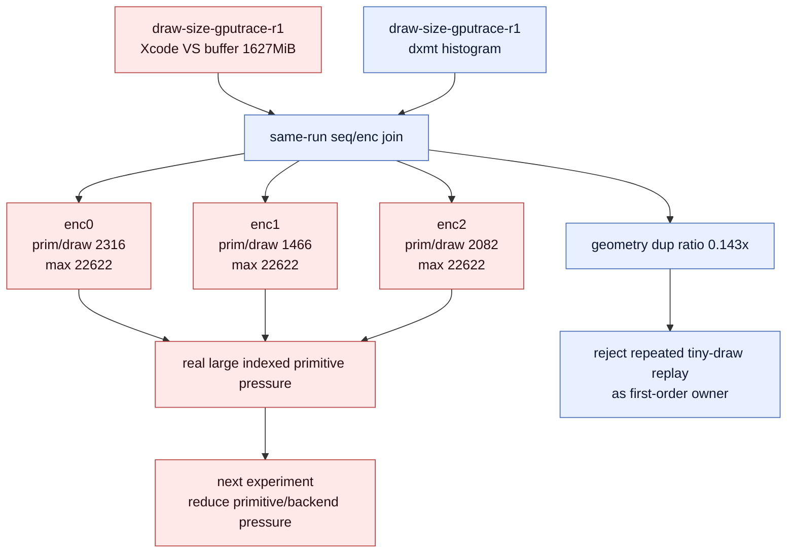
```mermaid
flowchart TD
  Xcode["draw-size-gputrace-r1\nXcode VS buffer 1627MiB"] --> SameSeq["same-run seq/enc join"]
  SizeRun["draw-size-gputrace-r1\ndxmt histogram"] --> SameSeq
  SameSeq --> Hot0["enc0\nprim/draw 2316\nmax 22622"]
  SameSeq --> Hot1["enc1\nprim/draw 1466\nmax 22622"]
  SameSeq --> Hot2["enc2\nprim/draw 2082\nmax 22622"]
  SameSeq --> Dup["geometry dup ratio 0.143x"]
  Hot0 --> Classify["real large indexed primitive pressure"]
  Hot1 --> Classify
  Hot2 --> Classify
  Dup --> RejectReplay["reject repeated tiny-draw replay\nas first-order owner"]
  Classify --> Next["next experiment\nreduce primitive/backend pressure"]

  classDef hot fill:#ffe8e8,stroke:#b64242,color:#2b0d0d
  classDef probe fill:#e8f0ff,stroke:#476cb6,color:#0d1833
  class Xcode,Hot0,Hot1,Hot2,Classify,Next hot
  class SizeRun,SameSeq,Dup,RejectReplay probe
```

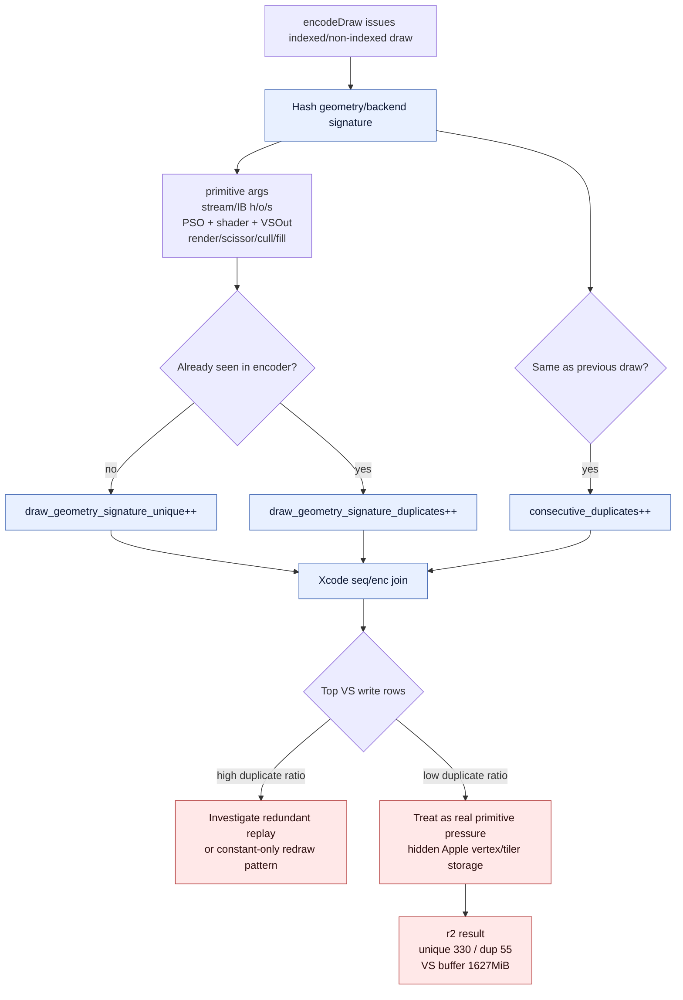
```mermaid
flowchart TD
  Draw["encodeDraw issues indexed/non-indexed draw"] --> Sig["Hash geometry/backend signature"]
  Sig --> Fields["primitive args\nstream/IB h/o/s\nPSO + shader + VSOut\nrender/scissor/cull/fill"]
  Fields --> EncoderSet{"Already seen in encoder?"}
  EncoderSet -- "no" --> Unique["draw_geometry_signature_unique++"]
  EncoderSet -- "yes" --> Dup["draw_geometry_signature_duplicates++"]
  Sig --> Consecutive{"Same as previous draw?"}
  Consecutive -- "yes" --> CDup["consecutive_duplicates++"]
  Unique --> Join["Xcode seq/enc join"]
  Dup --> Join
  CDup --> Join
  Join --> Decision{"Top VS write rows"}
  Decision -- "high duplicate ratio" --> Replay["Investigate redundant replay\nor constant-only redraw pattern"]
  Decision -- "low duplicate ratio" --> RealGeom["Treat as real primitive pressure\nhidden Apple vertex/tiler storage"]
  RealGeom --> R2["r2 result\nunique 330 / dup 55\nVS buffer 1627MiB"]

  classDef hot fill:#ffe8e8,stroke:#b64242,color:#2b0d0d
  classDef probe fill:#e8f0ff,stroke:#476cb6,color:#0d1833
  class Replay,RealGeom,R2 hot
  class Sig,Unique,Dup,CDup,Join probe
```

Render-state diagnostic A/B hooks:

```bash
# Cull diagnostic: if VS B/primitive changes sharply, cull/primitive backend
# state is part of the hidden bucket. Correctness is not expected.
scripts/tools/run_3dmark05_perf_probe.sh \
  --suffix disable-cull-frame60-r1 \
  --frame 60 \
  --disable-cull \
  --require-xcode-counter-coverage \
  --require-dxmt-join-coverage \
  --require-top-pso-attribution

# Scissor diagnostic: isolates the main shape's mixed scissor rows.
scripts/tools/run_3dmark05_perf_probe.sh \
  --suffix disable-scissor-frame60-r1 \
  --frame 60 \
  --disable-scissor \
  --require-xcode-counter-coverage \
  --require-dxmt-join-coverage \
  --require-top-pso-attribution

# Visibility/state diagnostic: disables blend write-mask hiding and should
# only be used to classify bucket ownership, not as an optimization.
scripts/tools/run_3dmark05_perf_probe.sh \
  --suffix force-visible-frame60-r1 \
  --frame 60 \
  --force-visible \
  --require-xcode-counter-coverage \
  --require-dxmt-join-coverage \
  --require-top-pso-attribution
```

Implementation hooks for these probes:

- `DXMT9_TRIM_VERTEX_TEMPS=1` now makes translated vertex shaders size
  `float4 r[]` from `collectConstantUsage().maxTempIndex + 1`, while the
  default path keeps the conservative 32-slot array.
- The shader source debug-env key includes this flag, so the PSO/source cache
  cannot reuse a stale source across the A/B.
- The GT1 probe wrapper exposes `--trim-vertex-temps` for paired
  `--dump-shaders` + gputrace runs.
- `DXMT9_TRIM_VS_OUTPUT_SCRATCH=1` now makes translated vertex shaders size
  local `float4 outTexcoord[]` from emitted/mapped texcoord output usage, while
  the default path keeps the conservative 8-slot array. Relative texcoord
  output access still promotes the scratch array to all 8 slots.
- The shader source debug-env key also includes this flag, and the GT1 probe
  wrapper exposes it as `--trim-vs-output-scratch` for paired
  `--dump-shaders` + gputrace runs.
- In the trim-varyings `frame60` shader dump, the top three VS rows still had
  `VS r[]=32`, but literal temp spans were `0`, `1`, and `0`, with no dynamic
  or relative temp access. That means the top shaders are good candidates for
  the opt-in experiment: the source-visible 512B zero-init array is present
  even where the translated body barely uses `r[]`.

Result of that probe:

- Candidate run:
  `app-d3d9-3dmark05-trim-varyings-vertex-temps-frame60-r1`
- Xcode artifacts:
  `traces/app-d3d9-3dmark05-trim-varyings-vertex-temps-frame60-r1/analysis/frame60-performance.gputrace`
  and
  `traces/app-d3d9-3dmark05-trim-varyings-vertex-temps-frame60-r1/analysis/frame60-counters-xcode.csv`
- Joined/comparison artifacts:
  `traces/app-d3d9-3dmark05-trim-varyings-vertex-temps-frame60-r1/analysis/frame60-xcode-dxmt-joined-summary.csv`,
  `traces/app-d3d9-3dmark05-trim-varyings-vertex-temps-frame60-r1/analysis/frame60-xcode-dxmt-comparison.md`,
  and
  `traces/app-d3d9-3dmark05-trim-varyings-vertex-temps-frame60-r1/analysis/frame60-shader-dump-report.md`
- `DXMT9_TRIM_VERTEX_TEMPS=1` did change the generated MSL shape. The top
  translated VS rows now emit `float4 r[1]`, with `VS temp span` `0/1/0` and no
  dynamic or relative temp access.
- The Xcode counter did not move: `top_vs_buffer_write_mib` changed from
  `1627.321` to `1627.325` MiB, and the `top_unexplained_buffer_write_ratio`
  stayed `1.000`. The finalizer correctly rejected the candidate with
  `--require-top-vs-buffer-write-decrease` and
  `--max-top-unexplained-buffer-write-ratio 0.50`.
- Total GPU time improved from `34.719ms` to `33.545ms` (`-3.38%`), but this is
  not accompanied by any corresponding VS write reduction, so it is not proof
  that temp trimming fixes the dominant bottleneck.

Follow-up `outTexcoord[]` scratch probe:

- Candidate run:
  `app-d3d9-3dmark05-trim-vs-output-scratch-frame60-r1`
- Xcode artifacts:
  `traces/app-d3d9-3dmark05-trim-vs-output-scratch-frame60-r1/analysis/frame60-performance.gputrace`
  and
  `traces/app-d3d9-3dmark05-trim-vs-output-scratch-frame60-r1/analysis/frame60-counters-xcode.csv`
- Joined/comparison artifacts:
  `traces/app-d3d9-3dmark05-trim-vs-output-scratch-frame60-r1/analysis/frame60-xcode-dxmt-joined-summary.csv`,
  `traces/app-d3d9-3dmark05-trim-vs-output-scratch-frame60-r1/analysis/frame60-xcode-dxmt-comparison.md`,
  and
  `traces/app-d3d9-3dmark05-trim-vs-output-scratch-frame60-r1/analysis/frame60-shader-dump-report.md`
- `DXMT9_TRIM_VS_OUTPUT_SCRATCH=1` did change the generated MSL shape. In the
  top three translated VS rows, the shader dump summary reports `VS outT[] = 1`
  and `VS outT over B = 0`; the candidate removed the conservative
  `float4 outTexcoord[8]` local scratch.
- The Xcode counter still did not move: `top_vs_buffer_write_mib` changed from
  `1627.325` to `1627.280` MiB (`-0.00%`), and
  `top_unexplained_buffer_write_ratio` stayed `1.000`. The finalizer correctly
  rejected the candidate with `--require-top-vs-buffer-write-decrease`,
  `--require-top-unexplained-buffer-write-decrease`, and
  `--max-top-unexplained-buffer-write-ratio 0.50`.
- Total GPU time changed from `33.545ms` to `33.922ms` (`+1.12%`), with no
  meaningful change in draw count, stream/IB churn, or CPU writer bytes.
- The regenerated bottleneck report adds primitive/binning-normalized write
  ratios. Top three aggregate VS buffer traffic is `2385.2 B/primitive`,
  `2382.4 B/post-clipped primitive`, and `3580.6 B/primitive-tile estimate`.
  That shape is far closer to hidden primitive/binning metadata than to the
  `36-68 B/vertex` source-visible stage-output payload.

Compiler IR check for the same run:

- The top three translated vertex shaders were compiled with
  `xcrun -sdk macosx metal -std=macos-metal2.4 -frecord-sources
  -gline-tables-only -c` and dumped with `xcrun metal-objdump`.
- The generated AIR for the three top VS functions has no function-local
  storage and no explicit store instructions:

| Encoder | AIR loads | AIR stores | AIR allocas | Function attr | Return payload |
|---:|---:|---:|---:|---|---|
| `60/2` | `15` | `0` | `0` | `readonly` | `position + texcoord0 + fogFactor` |
| `60/1` | `13` | `0` | `0` | `readonly` | `position + texcoord0 + fogFactor` |
| `60/0` | `13` | `0` | `0` | `readonly` | `position + color + secondaryColor + texcoord0 + fogFactor` |

- This rules out a source-visible translated local array and also rules out a
  Metal frontend AIR-level spill/store in these top shaders. The Xcode
  `VS Buffer Device Memory Bytes Written` bucket is therefore most likely
  counting hidden vertex-stage output/parameter/tiler storage below AIR, or
  another Apple GPU backend allocation that is not represented as an MSL/AIR
  `store`.

Conclusion so far: source-visible translated VS temp-array size, translated
`outTexcoord[]` scratch, and ordinary pair-local `VSOut` varying width are not
the owner of the `~1.627GiB` Xcode VS buffer-write bucket. AIR-level spills are
not the owner either for the top translated VS functions. The remaining primary
hypothesis is internal vertex scratch, tiler/parameter-buffer writes, or another
backend-generated vertex-stage storage path below AIR that is much larger than
the emitted MSL `VSOut` and independent of both local `r[]` and
`outTexcoord[]`.

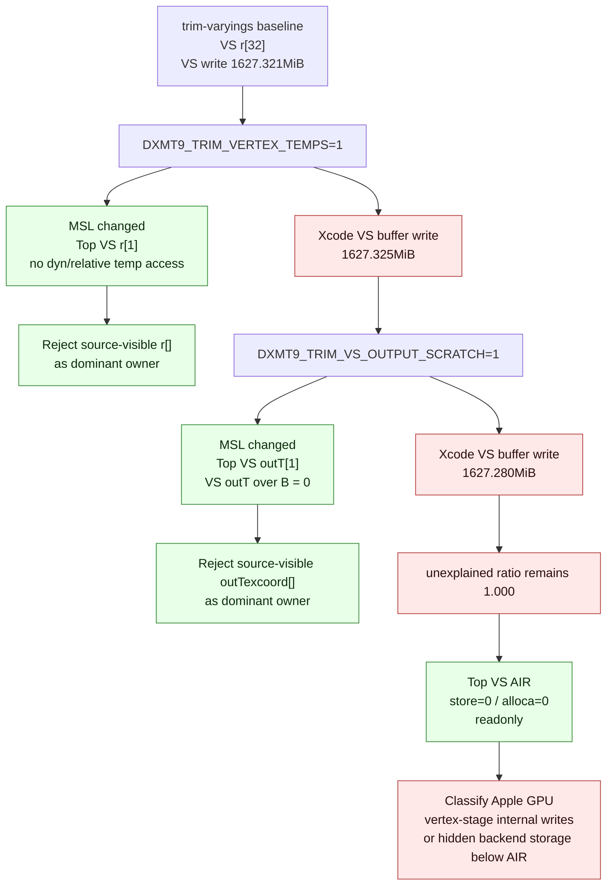
```mermaid
flowchart TD
  Baseline["trim-varyings baseline\nVS r[32]\nVS write 1627.321MiB"] --> TempProbe["DXMT9_TRIM_VERTEX_TEMPS=1"]
  TempProbe --> TempMSL["MSL changed\nTop VS r[1]\nno dyn/relative temp access"]
  TempProbe --> TempXcode["Xcode VS buffer write\n1627.325MiB"]
  TempMSL --> RejectR["Reject source-visible r[]\nas dominant owner"]
  TempXcode --> ScratchProbe["DXMT9_TRIM_VS_OUTPUT_SCRATCH=1"]
  ScratchProbe --> ScratchMSL["MSL changed\nTop VS outT[1]\nVS outT over B = 0"]
  ScratchProbe --> ScratchXcode["Xcode VS buffer write\n1627.280MiB"]
  ScratchMSL --> RejectOutT["Reject source-visible outTexcoord[]\nas dominant owner"]
  ScratchXcode --> Unchanged["unexplained ratio remains 1.000"]
  Unchanged --> AIR["Top VS AIR\nstore=0 / alloca=0\nreadonly"]
  AIR --> Next["Classify Apple GPU\nvertex-stage internal writes\nor hidden backend storage below AIR"]

  classDef hot fill:#ffe8e8,stroke:#b64242,color:#2b0d0d
  classDef done fill:#e8ffe8,stroke:#3c8f3c,color:#0d2b0d
  class TempXcode,ScratchXcode,Unchanged,Next hot
  class TempMSL,RejectR,ScratchMSL,RejectOutT,AIR done
```

## Bottleneck Map

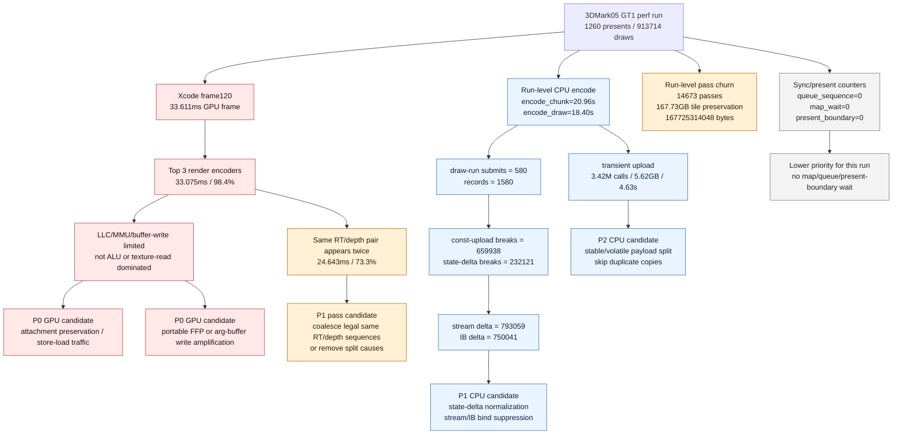
```mermaid
flowchart TD
  Run["3DMark05 GT1 perf run\n1260 presents / 913714 draws"] --> Frame["Xcode frame120\n33.611ms GPU frame"]
  Run --> CPU["Run-level CPU encode\nencode_chunk=20.96s\nencode_draw=18.40s"]
  Run --> PassRun["Run-level pass churn\n14673 passes\n167.73GB tile preservation\n167725314048 bytes"]
  Run --> Sync["Sync/present counters\nqueue_sequence=0\nmap_wait=0\npresent_boundary=0"]

  Frame --> Top3["Top 3 render encoders\n33.075ms / 98.4%"]
  Top3 --> MainRT["Same RT/depth pair appears twice\n24.643ms / 73.3%"]
  Top3 --> MemoryShape["LLC/MMU/buffer-write limited\nnot ALU or texture-read dominated"]

  MemoryShape --> CandidateA["P0 GPU candidate\nattachment preservation / store-load traffic"]
  MemoryShape --> CandidateB["P0 GPU candidate\nportable FFP or arg-buffer write amplification"]
  MainRT --> CandidateC["P1 pass candidate\ncoalesce legal same RT/depth sequences\nor remove split causes"]

  CPU --> DrawRun["draw-run submits = 580\nrecords = 1580"]
  DrawRun --> FirstDelta["const-upload breaks = 659938\nstate-delta breaks = 232121"]
  FirstDelta --> StreamIB["stream delta = 793059\nIB delta = 750041"]
  StreamIB --> CandidateD["P1 CPU candidate\nstate-delta normalization\nstream/IB bind suppression"]

  CPU --> Upload["transient upload\n3.42M calls / 5.62GB / 4.63s"]
  Upload --> CandidateE["P2 CPU candidate\nstable/volatile payload split\nskip duplicate copies"]

  Sync --> Lower["Lower priority for this run\nno map/queue/present-boundary wait"]

  classDef top fill:#ffe8e8,stroke:#b64242,color:#2b0d0d
  classDef cpu fill:#eaf4ff,stroke:#2f6fad,color:#0b2239
  classDef gpu fill:#fff0d6,stroke:#b26b00,color:#2b1900
  classDef lower fill:#f3f3f3,stroke:#777,color:#222

  class Frame,Top3,MemoryShape,CandidateA,CandidateB top
  class CPU,DrawRun,FirstDelta,StreamIB,Upload,CandidateD,CandidateE cpu
  class PassRun,MainRT,CandidateC gpu
  class Sync,Lower lower
```

## Priority DAG

```mermaid
flowchart LR
  Start["Current evidence\nframe120 Counters.csv + perf log"] --> P0["P0: explain GPU memory/write pressure"]
  Start --> P1["P1: explain pass split/store traffic"]
  Start --> P2["P2: recover draw-run or reduce per-draw encode"]
  Start --> P3["P3: reduce transient payload traffic"]
  Start --> P4["P4: keep sync/present lower priority until counters change"]

  P0 --> P0a["Rank top pass resources\nRT/depth/storage/buffer identities"]
  P0 --> P0b["Audit buffer writes in portable FFP / arg-buffer path"]
  P0 --> P0c["Check whether Xcode buffer writes map to arg-buffer payloads,\ntiled vertex buffers, or attachment storage"]

  P1 --> P1a["Break down RT-change and clear splits per frame"]
  P1 --> P1b["Detect same RT/depth re-entry with preserved attachments"]
  P1 --> P1c["Prove legal coalescing or store-action DontCare cases"]

  P2 --> P2a["Record exposed state-delta taxonomy by field"]
  P2 --> P2b["Suppress redundant stream and IB binds"]
  P2 --> P2c["Normalize recorder state so unchanged bindings\ncan form draw runs"]

  P3 --> P3a["Split stable and volatile uniforms"]
  P3 --> P3b["Hash adjacent payloads across draws"]
  P3 --> P3c["Coalesce transient slab reservations"]

  P4 --> P4a["Keep reporting map/present/queue waits"]
  P4 --> P4b["Do not tune frame latency as a first fix"]

  P0a --> Validate["Re-run perf profile + capture frame"]
  P1c --> Validate
  P2c --> Validate
  P3c --> Validate

  classDef p0 fill:#ffe8e8,stroke:#b64242,color:#2b0d0d
  classDef p1 fill:#fff0d6,stroke:#b26b00,color:#2b1900
  classDef action fill:#e8ffe8,stroke:#3c8f3c,color:#0d2b0d
  class P0,P1 p0
  class P2,P3,P4 p1
  class P0a,P0b,P0c,P1a,P1b,P1c,P2a,P2b,P2c,P3a,P3b,P3c,P4a,P4b,Validate action
```

## Frame 120 Pass Shape

```mermaid
sequenceDiagram
  participant Encode as encode thread
  participant CB475 as cb_seq_475
  participant CB476 as cb_seq_476
  participant CB478 as cb_seq_478 / present tail
  participant GPU as M1 GPU

  Encode->>CB475: RenderPass rt=...00c depth=...001
  CB475->>GPU: 5.714ms / 17.00%
  Note over GPU: LLC 34.28%, Buffer Write 18.21%

  Encode->>CB475: RenderPass rt=...00b depth=...004
  CB475->>GPU: 8.431ms / 25.08%
  Note over GPU: LLC 31.29%, MMU 24.11%, Buffer Write 22.08%

  Encode->>CB476: RenderPass rt=...00c depth=...001
  CB476->>GPU: 18.929ms / 56.32%
  Note over GPU: LLC 35.76%, MMU 34.03%, Buffer Write 20.85%

  Encode->>CB478: small post/present passes
  CB478->>GPU: 0.537ms / 1.60%

  Note over CB475,CB476: The same rt/depth pair returns after another pass.
  Note over GPU: Top-three passes dominate; optimize these before small post passes.
```

## Draw-Run Failure Shape

```mermaid
sequenceDiagram
  participant App as D3D9 app
  participant Rec as Command recorder
  participant Chunk as Pending chunk
  participant Encode as Encode thread
  participant Metal as Metal encoder

  App->>Rec: DrawIndexedPrimitive
  Rec->>Chunk: Draw record with state delta
  App->>Rec: Constant upload and stream / IB changes
  Rec->>Chunk: Const-upload record or state delta
  App->>Rec: DrawIndexedPrimitive
  Rec->>Chunk: Draw record after another break

  Note over Chunk: Current counters show const uploads dominate,
  Note over Chunk: then exposed state deltas stop most scans.
  Note over Chunk: const_upload=659938, state_delta=232121
  Note over Chunk: stream=793059, IB=750041
  Note over Chunk: draw-run submits=580, records=1580

  Encode->>Chunk: scan records
  Chunk-->>Encode: const record or state delta breaks the run
  Encode->>Metal: per-draw bind / PSO lookup / issue path

  Note over Encode,Metal: Result: stream bind, IB bind, FVF decode, PSO lookup, and upload costs repeat at draw frequency.
```

### Const-Upload Boundary Semantics

The importer scanner now reports a constant upload with an explicit
`ImportedDrawRunScanStop::ConstantUpload` stop reason instead of folding it into
generic `DifferentRecordType`. This is instrumentation and attribution only: a
constant upload between two draws cannot be blindly crossed by the current
single-uniform `drawPrimitiveRun()` representation, because each draw may need a
different `DrawUniformPayload`.

The safe current path is the pending `submitDrawRunBatch()` path. It may pass
through constant-upload records, but it snapshots uniforms per draw, so the draw
before the upload keeps the pre-upload constants and the draw after the upload
uses the post-upload constants. The native regression test pins this behavior
and the scanner test now pins the explicit constant-upload scan boundary.

```mermaid
flowchart TD
  D0["Draw A"] --> C["Const upload"]
  C --> D1["Draw B"]

  Scanner["scanImportedDrawRun"] --> Stop["stop = ConstantUpload"]
  Stop --> Reason["single drawPrimitiveRun has one\nDrawUniformPayload"]
  Reason --> Unsafe["crossing would give Draw A/B\none shared uniform snapshot"]

  Batch["submitDrawRunBatch fallback"] --> SnapA["snapshot Draw A uniforms\nbefore const upload"]
  C --> SnapB["snapshot Draw B uniforms\nafter const upload"]
  SnapA --> Safe["safe const-separated batch"]
  SnapB --> Safe

  Safe --> Next["next optimization requires\nper-draw uniform payload draw-runs\nor upstream const coalescing proof"]

  classDef hot fill:#ffe8e8,stroke:#b64242,color:#2b0d0d
  classDef ok fill:#e8f4ff,stroke:#2f6fab,color:#102033
  class Unsafe,Next hot
  class Batch,SnapA,SnapB,Safe ok
```

## Current Investigation: Store, Writes, State Churn

```mermaid
flowchart TD
  Evidence["frame120 + perf counters"] --> Store["render-pass/store traffic"]
  Evidence --> Writes["buffer write amplification"]
  Evidence --> Churn["stream/IB state churn"]

  Store --> S1["RT-change / clear / present split passes"]
  Store --> S2["color store_action is always Store/Resolve"]
  Store --> S3["stored color handles become touched\nnext same RT pass Loads"]
  Store --> S4["depth DontCare-store proof produced 0 stores in this trace"]
  S1 --> S5["14673 passes\n9844 RT-change splits\n3576 clear splits"]
  S2 --> S5
  S3 --> S5
  S4 --> S5
  S5 --> S6["167.73GB estimated tile preservation"]

  Writes --> W1["Xcode top pass reports\n981.2MiB Buffer Write"]
  Writes --> W2["argbuf hybrid opens descriptor storage\nand mirrors dirty cbuf regions"]
  Writes --> W3["DrawVolatile setVertexBytes per draw"]
  Writes --> W4["transient uploads\n3.42M calls / 5.62GB"]
  W2 --> W5["encoder attribution is known\ncbuf class split still needed"]
  W3 --> W5
  W4 --> W5

  Churn --> C1["PE draw packet carries pending stream/IB deltas"]
  Churn --> C2["importer draw-run scanner needs compatible base"]
  Churn --> C3["const uploads dominate run breaks\nstate deltas are second"]
  C1 --> C4["stream delta=793059\nIB delta=750041"]
  C2 --> C4
  C3 --> C4
  C4 --> C5["draw-run submits=580\nper-draw encode path remains hot"]

  classDef hot fill:#ffe8e8,stroke:#b64242,color:#2b0d0d
  classDef unknown fill:#fff0d6,stroke:#b26b00,color:#2b1900
  class S6,W1,C5 hot
  class W5 unknown
```

### Render-Pass / Store Traffic

This path is now a confirmed bottleneck shape, not just a hypothesis.

- In `src/dxmt9/dxmt9_draw_encoder.mm`, color attachments choose
  `DontCare` only for clear, post-present discard, or first use; otherwise
  they `Load`. The color store action is currently always `Store`, or
  `MultisampleResolve` for resolve targets.
- `flushRender()` marks every active color handle as touched because color
  DontCare-store is not implemented. A later pass on the same RT therefore
  cannot use first-use `DontCare` and pays a `Load`.
- Depth has a look-ahead proof for DontCare-store, but this run reports
  `render_pass_store_action_depth_dontcare=0`; depth preservation is therefore
  also active for all depth-storing passes.
- The split triggers match the trace shape:
  `render_split_rt_change=9844`, `render_split_clear=3576`,
  `render_split_present=1253`, with no exact hazard splits.

The practical result is repeated Store/Load preservation across many small
render passes. The strongest concrete target is same RT/depth re-entry:
`rt=0x30000460000000c,depth=0x300000100000001` appears twice in `frame120` and
accounts for `24.643ms` / `73.32%` of the frame.

Potential fixes:

- Add color live-out proof for `StoreActionDontCare` where the stored contents
  are dead before the next use.
- Current source now exposes this as an opt-in experiment:
  `DXMT9_AGGRESSIVE_COLOR_DONTCARE=1` lets color store proof return
  dead-at-end DontCare when the color handle does not reappear in the rest of
  the chunk and no Present is seen. The default remains conservative and only
  next-clear can DontCare-store color. The new
  `render_pass_color_proof_*` counters separate next-clear, draw-target,
  texture-sample, present, and disabled-dead-at-end cases.
- Add first-depth-use / dead-depth-load proof so depth can avoid `Load` when
  prior contents are irrelevant.
- Reduce split causes before store-action tuning where legal:
  clear folding, same RT/depth re-entry coalescing, and render-target-change
  batching.
- Add per-RT/depth pass-chain counters before changing policy:
  `previous_key -> next_key`, split reason, load/store actions, preserved
  bytes, and whether a later clear discards the stored data.

### Buffer Write Amplification

The symptom is confirmed by Xcode, but the exact owner of every buffer-write
byte is not yet proven. The top encoder reports about `981.2MiB` Buffer Write
and the top three passes report `981.2MiB`, `421.4MiB`, and `225.4MiB`
respectively. That is too large to explain with shader ALU or texture reads.

Likely contributors in the current code:

- Argument-buffer hybrid opens transient descriptor storage and may reopen per
  draw when resource-array bindings or changed constant payloads require a
  fresh table. This is counted as `argbuf_hybrid_encoder_count=14673` and
  `argbuf_hybrid_bytes_per_encoder=4585528936` cumulative bytes.
- Dirty argbuf constant regions are copied through `uploadTransientBuffer()`.
  This contributes to the run-level `transient_upload_calls=3424881` and
  `transient_upload_bytes=5624306980`.
- `DrawVolatile` is pushed with `setVertexBytes(slot=5)` for every draw:
  `uniform_volatile_pushes=913714`. This is only 16 bytes per draw at the API
  payload level, but it is still per-draw command/inline data traffic.
- Indexed expansion and shadow/index fallback exist, but they are not the
  primary count driver in this run: `draw_expanded_indexed=5735` out of
  `913714` draws.

The encoder-stream run now splits write attribution by encoder sequence for:

- argbuf table reservation bytes;
- total argbuf constant upload bytes;
- argbuf cbuf class and VS/FFPVS first/rewrite/field attribution in
  `3dmark05-perf-encoders.csv`;
- `setVertexBytes` bytes split by slot-5 draw volatile vs other slots;
- transient vertex/index bytes split by user-primitive preupload, declaration
  fallback, indexed expansion, and index shadow fallback.

Remaining measurement gap:

- argbuf constant upload bytes by cbuf class: done by runtime attribution and
  `experiments/output/app-d3d9-3dmark05-cbuf-class-breakdown`
- stable vs volatile constant-field bytes: done by runtime attribution and
  `experiments/output/app-d3d9-3dmark05-cbuf-field-volatility`
- live gputrace/Xcode counter join using a new unlocked run that contains the
  latest transient-source attribution fields

The stable/volatile field split proved that FFP VS was the safest first cbuf
policy change, and the follow-up FFP VS cache run reduced the latest cbuf
bucket to about `3.18GB`.

### Stream / IB State Churn

The draw-run failure was confirmed in the importer path, and the source path
has since been redesigned to carry stream/IB deltas as per-draw binding
override payloads inside a draw-run.

- PE-side `buildDrawPrimitivePacket()` copies `pendingStreamMask` into each
  draw packet and serializes stream buffer, offset, and stride for every
  pending stream.
- Indexed draw packets also carry an IB delta when `pendingIb` is set or when
  the submitted IB handle is not yet known.
- The importer scanner can now use the first stateful draw as the run base and
  carry later stream/IB changes through `DrawBindingOverride` payloads. This is
  specifically intended for the measured GT1 shape where stream and IB handle
  churn dominate offset-only changes.
- The next run reports these new counters:
  `commit_chunk_draw_run_binding_override_records`,
  `commit_chunk_draw_run_binding_override_bytes`,
  `commit_chunk_draw_run_binding_override_stream_records`, and
  `commit_chunk_draw_run_binding_override_ib_records`.
- Historical traces before this redesign reported
  `commit_chunk_draw_run_submits=580`,
  `commit_chunk_draw_run_break_type_const_upload=659938`, and
  `commit_chunk_draw_run_break_state_delta=232121`, with stream and IB deltas
  leading the state-delta counters.

This means the current source target has shifted: the implementation now has a
representable per-draw stream/IB binding payload. The missing evidence is a new
unlocked GT1 perf/gputrace run proving whether those override payloads convert
the historical state-delta breaks into larger draw-runs without moving cost
elsewhere.

That evidence is now available. The no-gputrace validation run
`app-d3d9-3dmark05-binding-override-base-skip-nogputrace-r1` compared against
`app-d3d9-3dmark05-submit-batch-normalized-fastcompare-nogputrace-r1` shows
that binding overrides are present and stable, with essentially unchanged
draw/pass/GPU-command-buffer shape:

| Metric | Before | After | Delta |
|---|---:|---:|---:|
| `draw_calls` | `1,051,353` | `1,051,189` | `-0.02%` |
| `render_pass_begin` | `16,886` | `16,886` | `0.00%` |
| `backend_draw_run_batch_records_per_group` | `1.885` | `1.884` | `-0.02%` |
| `encode_draw_stream_bind_cpu_ms` | `2620.016` | `1830.639` | `-30.13%` |
| `encode_draw_cpu_ms` | `18899.770` | `16927.368` | `-10.44%` |
| `submit_draw_cpu_ms` | `3031.493` | `2999.525` | `-1.05%` |
| `gpu_command_buffer_time_ms` | `4086.988` | `4088.416` | `+0.03%` |

The corresponding code change is intentionally conservative: binding overrides
no longer force a full base-state rebind when the active and current draw keys
are compatible after ignoring stream/IB/constant fields. Extra-stream stride
changes still force base-state rebind because those strides are baked into the
generated VS source; stream0 stride remains safe because it is passed through
`DrawVolatile`.

```mermaid
flowchart TD
  Before["draw-run param has binding override"] --> Old["old encode path\nskipBaseStateBind=false"]
  Old --> Rebind["pipeline/raster/texture base-state scan\non many override draws"]
  Rebind --> Cost["encode_draw_stream_bind_cpu_ms\n2620ms"]

  Before --> New["new encode path\ncompare base-state-compatible key"]
  New --> Check{"override changes extra-stream stride?"}
  Check -- "yes" --> RebindNeeded["rebind base state\nPSO/source may differ"]
  Check -- "no" --> Skip["skip base state\nstill bind stream/IB per draw"]
  Skip --> Result["stream_bind CPU 1831ms\nencode_draw CPU -10.44%"]

  classDef hot fill:#ffe8e8,stroke:#b64242,color:#2b0d0d
  classDef ok fill:#e8ffe8,stroke:#3c8f3c,color:#0d2b0d
  class Old,Rebind,Cost hot
  class New,Skip,Result ok
```

Potential fixes still left after that validation:

- Suppress redundant stream/IB deltas earlier in the PE recorder when the
  logical state is unchanged. The existing `SetStreamSource` and `SetIndices`
  shadows already skip exact duplicates, so the remaining signal is likely
  changing offsets/handles, not simple duplicate API calls.
- If override payload counts are high but draw-run submits remain low, target
  the next non-stream/IB stopper, especially constant-upload records.
- If draw-run submits increase but CPU encode remains high, inspect whether
  per-draw override application is forcing too much base-state rebinding inside
  `encodeDraw`.

## Encoder Breakdown Run

After adding `DXMT9_PERF_ENCODER_BREAKDOWN=1`, a GT1 run was captured at:

- `experiments/output/app-d3d9-3dmark05-encoder-breakdown/dxmt9.log`
- `experiments/output/app-d3d9-3dmark05-encoder-breakdown/encoder-breakdown-summary.md`

The per-render-encoder lines expose the missing attribution buckets:

| Metric | Value | Interpretation |
|---|---:|---|
| Encoder rows | `14986` | One row per render encoder close in the instrumented run. |
| Stream samples | `1233222` | Stream state is sampled at draw frequency and across extra streams. |
| Stream Metal binds | `1086136` | Actual Metal vertex-buffer binds remain near draw count. |
| Stream handle changes | `1009541` | Stream churn is mostly handle churn, not just offset churn. |
| Stream offset / stride changes | `93383` / `69811` | Offset/stride still matter, but less than handle changes. |
| IB samples / Metal binds | `930990` / `925201` | Index-buffer bind pressure is also near draw count. |
| IB handle changes | `758581` | IB handle churn is a primary draw-run blocker. |
| Argbuf table bytes | `22566304` | Descriptor table allocation is visible but not the largest byte bucket. |
| Argbuf cbuf bytes | `4643320552` | Main attributed write bucket: about `4.64GB`. |
| `setVertexBytes` bytes | `14895840` | DrawVolatile is frequent but small at payload level. |
| Transient vertex bytes | `1049812488` | Secondary write bucket: about `1.05GB`, concentrated in specific passes. |
| Transient index bytes | `108024` | Not a meaningful byte source in this run. |

```mermaid
flowchart TD
  Run["DXMT9_PERF_ENCODER_BREAKDOWN=1 GT1 run"] --> Argbuf["Argbuf cbuf bytes\n4.64GB"]
  Run --> Vertex["Transient vertex bytes\n1.05GB"]
  Run --> Volatile["DrawVolatile setVertexBytes\n14.9MB"]
  Run --> Stream["Stream handle changes\n1.01M"]
  Run --> IB["IB handle changes\n758k"]

  Argbuf --> A1["First fix candidate\nstable/volatile cbuf split\nskip unchanged argbuf cbuf mirrors"]
  Vertex --> V1["Second fix candidate\nidentify expansion/fallback sources per top RT"]
  Stream --> S1["Draw-run redesign\nstream handles as run invariants where possible"]
  IB --> I1["Draw-run redesign\nIB handle as run invariant where possible"]
  Volatile --> D1["Low byte priority\nstill contributes command traffic per draw"]

  classDef hot fill:#ffe8e8,stroke:#b64242,color:#2b0d0d
  classDef mid fill:#fff0d6,stroke:#b26b00,color:#2b1900
  class Argbuf,Stream,IB hot
  class Vertex,Volatile mid
```

The strongest CPU/write attribution result is now:

1. `argbuf_cbuf_bytes` is the largest measured writer at about `4.64GB`.
2. `transient_vertex_bytes` is the next measured writer at about `1.05GB`,
   with top individual encoders exceeding `10MB`.
3. Stream/IB churn is real handle churn: handle-change counts dominate
   offset/stride changes.

This moves the next implementation target from generic "buffer write
amplification" to two concrete areas:

- split or cache argbuf cbuf mirrors so unchanged per-draw constants do not
  rewrite full cbuf payloads;
- redesign draw-run compatibility around stable stream/IB handles, while
  carrying offset/range fields as per-draw parameters.

## Encoder Stream Breakdown Re-run

After extending `DXMT9_PERF_ENCODER_BREAKDOWN=1` to emit
`[dxmt9-perf-encoder-stream ...]` rows, GT1 was re-run at:

- `experiments/output/app-d3d9-3dmark05-encoder-stream-breakdown/dxmt9.log`
- `experiments/output/app-d3d9-3dmark05-encoder-stream-breakdown/result.json`
- `experiments/output/app-d3d9-3dmark05-encoder-stream-breakdown/encoder-stream-breakdown-summary.md`

The run is comparable to the const-dedupe baseline:

| Metric | Value | Interpretation |
|---|---:|---|
| `present_encoded` | `1260` | Same GT1 run length. |
| `draw_calls` | `913714` | Comparable draw volume. |
| `render_pass_begin` | `14673` | Render-pass pressure is unchanged. |
| `commit_chunk_draw_run_submits` / records | `580` / `1580` | Dedupe exposes a few draw-runs, but most scans still fail. |
| `commit_chunk_draw_run_break_type_const_upload` | `659938` | Constant-upload records remain the largest draw-run break class. |
| `commit_chunk_draw_run_break_state_delta` | `232121` | State deltas are now the second major break class. |
| `commit_chunk_draw_delta_stream` / IB | `793059` / `750041` | Stream and IB deltas remain near draw frequency. |
| `argbuf_hybrid_bytes_per_encoder` | `4585528936` | Same multi-GB argbuf cbuf traffic class. |
| `transient_upload_bytes` / CPU | `5624306980` / `4634.512ms` | Upload pressure is stable across runs. |
| `encode_draw_cpu_ms` / `submit_draw_cpu_ms` | `18403.169` / `4342.800` | CPU encode remains draw-frequency dominated. |
| `gpu_command_buffer_time_ms` | `3630.387` | GPU-side command-buffer time is not improved by this instrumentation. |
| `completion_wait_ms` | `24324.476` | Present waits still reflect slow GPU completion; queue/map waits are zero. |

Encoder-attributed totals from the new stream rows:

| Metric | Value | Interpretation |
|---|---:|---|
| Encoder rows | `14948` | One row per render encoder close. |
| Stream rows | `18006` | Used streams only; GT1 uses stream 0 and stream 1 in this run. |
| Stream samples | `1230347` | Stream state is sampled at draw frequency plus extra streams. |
| Stream Metal binds | `1083437` | Metal vertex-buffer binds remain close to draw frequency. |
| Stream handle changes | `1007089` | `81.9%` of stream samples change handle. |
| Stream offset changes | `93182` | `7.6%` of stream samples change offset. |
| Stream stride changes | `69574` | `5.7%` of stream samples change stride. |
| IB samples / Metal binds | `928724` / `922989` | Index-buffer bind pressure is also near draw frequency. |
| IB handle changes | `756672` | `81.5%` of IB samples change handle. |
| Argbuf table bytes | `22510720` | Descriptor table bytes are visible but small compared with cbuf mirrors. |
| Argbuf cbuf bytes | `4631819248` | Main measured write bucket: about `4.63GB`. |
| Transient vertex bytes | `1038672288` | Secondary measured writer: about `1.04GB`. |
| Transient index bytes | `107856` | Not a meaningful byte source. |

Stream split:

| Stream | Samples | Metal binds | Handle changes | Offset changes | Stride changes |
|---:|---:|---:|---:|---:|---:|
| `0` | `928724` | `813948` | `755388` | `69858` | `1284` |
| `1` | `301623` | `269489` | `251701` | `23324` | `68290` |

This removes an important ambiguity: the stream/IB problem is not primarily
an offset-only compatibility problem. It is handle churn. Stream 1 is the
source of almost all stride churn, but stream 0 and stream 1 both have
handle-change rates near the draw rate.

```mermaid
flowchart TD
  Run["GT1 encoder-stream run"] --> Stream0["stream 0\n928724 samples\n755388 handle changes"]
  Run --> Stream1["stream 1\n301623 samples\n251701 handle changes\n68290 stride changes"]
  Run --> IB["IB\n928724 samples\n756672 handle changes"]
  Run --> Cbuf["argbuf cbuf\n4.63GB"]
  Run --> TVertex["transient vertex\n1.04GB"]

  Stream0 --> H0["handle churn dominates\noffset changes are secondary"]
  Stream1 --> H1["handle churn + stride churn\nmulti-stream path"]
  IB --> HI["IB handle changes\nnear draw frequency"]
  Cbuf --> C1["full cbuf mirror writes\nstill main write bucket"]
  TVertex --> V1["later encoder ordinal 11\nseparate expansion/fallback bucket"]

  H0 --> FixA["draw-run redesign must handle\nper-draw resource binding changes"]
  H1 --> FixA
  HI --> FixA
  C1 --> FixB["split stable vs volatile constants\nor reduce cbuf payload writes upstream"]

  classDef hot fill:#ffe8e8,stroke:#b64242,color:#2b0d0d
  classDef mid fill:#fff0d6,stroke:#b26b00,color:#2b1900
  class Stream0,Stream1,IB,Cbuf hot
  class TVertex mid
```

Encoder ordinal split gives a useful prioritization:

| Encoder ordinal | Main signal |
|---:|---|
| `0`..`4` | The main scene region: most cbuf bytes, stream handle churn, and IB handle churn. |
| `9` and `11` | Transient vertex pressure, with ordinal `11` alone contributing about `871MB`. |
| `12`..`17` | Low draw count / low churn tail. |

The top argbuf-cbuf encoders and the top stream/IB handle-churn encoders are
the same encoder ordinal (`4`) around seq `342`..`351`. The top transient
vertex encoders are a later region (`encoder=11`, seq `1175`..`1186`) with
lower draw counts. Therefore:

1. Treat cbuf write amplification and stream/IB handle churn as the primary
   coupled bottleneck in the main scene region.
2. Treat transient vertex expansion/fallback as a secondary, separate target.
3. Do not spend effort on an offset-only draw-run compatibility model; it would
   miss the dominant handle-change signal.

## Cbuf Class Breakdown Run

The next run split `argbuf_cbuf_bytes` by the four argbuf constant-buffer
entries:

- `experiments/output/app-d3d9-3dmark05-cbuf-class-breakdown/dxmt9.log`
- `experiments/output/app-d3d9-3dmark05-cbuf-class-breakdown/result.json`
- `experiments/output/app-d3d9-3dmark05-cbuf-class-breakdown/cbuf-class-breakdown-summary.md`

The run is comparable to the previous encoder-stream run:

| Metric | Value | Interpretation |
|---|---:|---|
| `present_encoded` | `1260` | Same GT1 run length. |
| `draw_calls` | `913869` | Comparable draw volume. |
| `render_pass_begin` | `14695` | Same pass-churn class. |
| `commit_chunk_draw_run_submits` / records | `592` / `1626` | Still only a small number of draw-runs. |
| `commit_chunk_draw_run_break_type_const_upload` | `659387` | Constant upload remains the top run break. |
| `commit_chunk_draw_run_break_state_delta` | `232821` | State deltas remain the second break class. |
| `commit_chunk_draw_delta_stream` / IB | `793683` / `750663` | Stream/IB deltas remain near draw frequency. |
| `argbuf_hybrid_bytes_per_encoder` | `4582153064` | Same multi-GB argbuf traffic class. |
| `transient_upload_bytes` / CPU | `5625485036` / `4629.911ms` | Upload pressure is stable. |
| `encode_draw_cpu_ms` / `submit_draw_cpu_ms` | `18363.548` / `4414.902` | CPU encode remains draw-frequency dominated. |
| `gpu_command_buffer_time_ms` | `3711.844` | GPU command-buffer time remains in the same range. |
| `completion_wait_ms` | `24892.872` | Slow GPU completion remains visible. |

Encoder-attributed cbuf class split:

| Cbuf class | Bytes | Share |
|---|---:|---:|
| Total | `4617491264` | `100.000%` |
| VS | `2358862880` | `51.085%` |
| FFP VS | `1455155280` | `31.514%` |
| PS | `539897808` | `11.692%` |
| FFP PS | `263575296` | `5.708%` |

```mermaid
flowchart TD
  Cbuf["argbuf cbuf bytes\n4.62GB"] --> VS["VS constants\n2.36GB / 51.1%"]
  Cbuf --> FfpVs["FFP VS constants\n1.46GB / 31.5%"]
  Cbuf --> PS["PS constants\n0.54GB / 11.7%"]
  Cbuf --> FfpPs["FFP PS constants\n0.26GB / 5.7%"]

  VS --> VertexSide["vertex-side constants\n82.6% combined"]
  FfpVs --> VertexSide
  PS --> PixelSide["pixel-side constants\n17.4% combined"]
  FfpPs --> PixelSide

  VertexSide --> NextA["Next target\nstable/volatile split for VS + FFP VS"]
  PixelSide --> NextB["Secondary target\nPS/FFP PS after vertex-side payload"]

  classDef hot fill:#ffe8e8,stroke:#b64242,color:#2b0d0d
  classDef mid fill:#fff0d6,stroke:#b26b00,color:#2b1900
  class Cbuf,VS,FfpVs,VertexSide,NextA hot
  class PS,FfpPs,PixelSide,NextB mid
```

Important implication: the cbuf bucket is not primarily pixel constants. VS and
FFP VS together are `82.60%` of the measured cbuf writes. The next useful
split is therefore not just "skip PS constants"; it should identify which
fields inside `VsConsts` and `FfpVsConsts` are actually volatile per draw.

Encoder ordinal split keeps the same locality as the stream/IB run:

| Encoder ordinal | Cbuf bytes | Main signal |
|---:|---:|---|
| `1` | `1068927872` | Highest total cbuf; stream and IB handle changes both `209237`. |
| `4` | `856295576` | Top individual cbuf encoders; highest stream-handle churn. |
| `0` | `848558864` | Large cbuf plus unusually large PS share compared with other main ordinals. |
| `3` | `701045472` | Large VS/FFP VS cbuf with matching stream/IB handle changes. |
| `2` | `659202312` | Large cbuf plus multi-stream churn. |
| `11` | `329415768` | Secondary region; also carries about `871MB` transient vertex bytes. |

The strongest current cbuf conclusion is:

1. Vertex-side cbuf payloads (`VS + FFP VS`) are the primary write bucket.
2. Pixel-side cbuf payloads are secondary and should not be the first
   optimization target.
3. The next measurement must split field-level volatility inside `VsConsts`
   and `FfpVsConsts`, because a full-struct upload is currently repeated even
   when only a small subset changes.

## Cbuf Field Volatility Run

The next run compared each VS/FFP VS upload against the previous upload in the
same render encoder. The goal was to distinguish first-use bytes from repeated
rewrites and then split rewrite bytes into changed vs unchanged payload:

- `experiments/output/app-d3d9-3dmark05-cbuf-field-volatility/dxmt9.log`
- `experiments/output/app-d3d9-3dmark05-cbuf-field-volatility/result.json`
- `experiments/output/app-d3d9-3dmark05-cbuf-field-volatility/cbuf-field-volatility-summary.md`

The run is comparable for counters, but `encode_draw_cpu_ms=24342.145` should
not be used as an optimization baseline because the instrumentation performs
byte comparisons on the hot path. GPU/run-shape counters remained in the same
class:

| Metric | Value | Interpretation |
|---|---:|---|
| `present_encoded` | `1260` | Same GT1 run length. |
| `draw_calls` | `913734` | Comparable draw volume. |
| `render_pass_begin` | `14677` | Same pass-churn class. |
| `commit_chunk_draw_run_break_type_const_upload` | `659596` | Constant-upload records remain draw-frequency. |
| `commit_chunk_draw_run_break_state_delta` | `232530` | State deltas remain second. |
| `commit_chunk_draw_delta_stream` / IB | `795921` / `752933` | Stream/IB deltas remain near draw frequency. |
| `argbuf_hybrid_bytes_per_encoder` | `4584324456` | Same cbuf traffic class. |
| `gpu_command_buffer_time_ms` | `3634.590` | GPU command-buffer time remains comparable. |

Vertex-side rewrite volatility:

| Bucket | Bytes | Share |
|---|---:|---:|
| VS first upload bytes | `64242192` | `2.723%` of VS uploads |
| VS rewrite changed bytes | `164493907` | `7.166%` of VS rewrites |
| VS rewrite unchanged bytes | `2130831229` | `92.834%` of VS rewrites |
| FFP VS first upload bytes | `31604960` | `2.171%` of FFP VS uploads |
| FFP VS rewrite changed bytes | `65` | effectively `0.000%` of FFP VS rewrites |
| FFP VS rewrite unchanged bytes | `1423999695` | effectively `100.000%` of FFP VS rewrites |

Changed-byte field groups:

| Group | Changed bytes | Interpretation |
|---|---:|---|
| VS float4 constants | `164493907` | All observed VS changes are float constants. |
| VS int4 constants | `0` | No observed rewrite volatility. |
| VS bool constants | `0` | No observed rewrite volatility. |
| FFP VS matrix | `13` | Negligible changed bytes. |
| FFP VS blend matrices | `52` | Negligible changed bytes. |
| FFP VS material/light/texture-transform/clip/viewport/fog-point | `0` | Repeated unchanged payload in this run. |

```mermaid
flowchart TD
  VS["VS uploads\n2.36GB"] --> VSFirst["first bytes\n64.2MB"]
  VS --> VSRewrite["rewrite bytes\n2.30GB"]
  VSRewrite --> VSChanged["changed\n164.5MB / 7.17%"]
  VSRewrite --> VSUnchanged["unchanged\n2.13GB / 92.83%"]
  VSChanged --> VSFloat["float4 constants\n100% of VS changed bytes"]

  FFP["FFP VS uploads\n1.46GB"] --> FFPFirst["first bytes\n31.6MB"]
  FFP --> FFPRewrite["rewrite bytes\n1.42GB"]
  FFPRewrite --> FFPChanged["changed\n65 bytes"]
  FFPRewrite --> FFPUnchanged["unchanged\n1.424GB / ~100%"]

  VSUnchanged --> FixA["avoid repeated full VS prefix writes\nor split by dirty float range"]
  FFPUnchanged --> FixB["cache/repoint FFP VS slice\nor split FFP VS out of volatile path"]
  VSFloat --> FixC["next measurement\nVS float register-range volatility"]

  classDef hot fill:#ffe8e8,stroke:#b64242,color:#2b0d0d
  classDef mid fill:#fff0d6,stroke:#b26b00,color:#2b1900
  class VS,VSRewrite,VSUnchanged,FFP,FFPRewrite,FFPUnchanged,FixA,FixB hot
  class VSChanged,VSFloat,FixC mid
```

This is stronger than the class split alone:

1. `FfpVsConsts` is almost completely stable inside render encoders. Rewriting
   it per dirty cbuf update is therefore pure write amplification for GT1.
2. `VsConsts` is volatile only in float constants, and even there only about
   `7.17%` of repeated upload bytes differ from the previous upload.
3. The next implementation candidate should not be a broad "upload less PS".
   It should either:
   - keep FFP VS in a stable cached slice and avoid repointing/reuploading it
     unless its bytes actually change; or
   - split VS float constants by used/dirty register ranges so unchanged float
     prefix bytes are not rewritten.

## FFP VS Stable Slice Reuse Run

The first follow-up implementation defers FFP VS cbuf handling out of the
generic argbuf dirty mirror. `FfpVsConsts` is now built after the
pre-transformed viewport override, then compared with an encoder-local cached
host copy. If the final bytes are unchanged, the fresh argbuf table points at
the existing low-level FFP VS slice instead of uploading another transient
copy.

Validation run:

- `experiments/output/app-d3d9-3dmark05-ffpvs-cache/dxmt9.log`
- `experiments/output/app-d3d9-3dmark05-ffpvs-cache/result.json`
- `experiments/output/app-d3d9-3dmark05-ffpvs-cache/ffpvs-cache-summary.md`

The run passed image capture and used the same `1260` present GT1 window.
Compared with the field-volatility baseline:

| Metric | Field baseline | FFP VS cache | Delta |
|---|---:|---:|---:|
| `argbuf_hybrid_bytes_per_encoder` | `4584324456` | `3177699416` | `-30.68%` |
| `transient_upload_bytes` | `5628778212` | `4214189252` | `-25.13%` |
| `transient_upload_cpu_ms` | `4667.523` | `3254.799` | `-30.27%` |
| `encode_draw_cpu_ms` | `24342.145` | `20504.647` | `-15.76%` |
| `gpu_command_buffer_time_ms` | `3634.590` | `3643.395` | same class |
| `commit_chunk_draw_delta_stream` / IB | `795921` / `752933` | `793330` / `750404` | unchanged class |

Encoder-attributed cbuf bytes:

| Cbuf class | Field baseline | FFP VS cache | Delta |
|---|---:|---:|---:|
| Total | `4619656448` | `3181693928` | `-31.13%` |
| VS | `2359567328` | `2349572144` | `-0.42%` |
| FFP VS | `1455604720` | `31437480` | `-97.84%` |
| PS | `540827696` | `538140048` | `-0.50%` |
| FFP PS | `263656704` | `262544256` | `-0.42%` |

Rewrite attribution confirms that the intended bucket disappeared:

| FFP VS rewrite bucket | Field baseline | FFP VS cache |
|---|---:|---:|
| first bytes | `31604960` | `31435360` |
| rewrite changed bytes | `65` | `65` |
| rewrite unchanged bytes | `1423999695` | `2055` |

```mermaid
flowchart TD
  Dirty["kFfpVsAny dirty"] --> Defer["defer out of generic\nargbuf dirty mirror"]
  Defer --> FinalHost["build final FfpVsConsts\nafter viewport override"]
  FinalHost --> Same{"bytes equal\ncached FFP VS?"}
  Same -- "yes" --> Repoint["point argbuf id(1)\nat cached slice"]
  Same -- "no" --> Upload["upload FfpVsConsts\nand cache bytes+slice"]
  Repoint --> Draw["draw"]
  Upload --> Draw

  Result["GT1 result"] --> Drop["FFP VS cbuf\n1.46GB -> 31.4MB"]
  Drop --> Remain["GPU time unchanged class\nremaining bottleneck elsewhere"]
  Remain --> NextVS["VS float cbuf range split"]
  Remain --> NextBind["stream/IB handle churn"]
  Remain --> NextPass["render-pass/store traffic"]

  classDef hot fill:#ffe8e8,stroke:#b64242,color:#2b0d0d
  classDef ok fill:#e8f4ff,stroke:#2f6fab,color:#102033
  classDef mid fill:#fff0d6,stroke:#b26b00,color:#2b1900
  class Dirty,Upload hot
  class Repoint,Drop ok
  class Remain,NextVS,NextBind,NextPass mid
```

Conclusion: FFP VS stable-slice reuse is validated and removes about `1.42GB`
of repeated unchanged cbuf writes from GT1. It does not move
`gpu_command_buffer_time_ms`, so FFP VS cbuf traffic was a real CPU/upload
amplifier but not the final GPU limiter. The active cbuf target is now
`VsConsts`, especially unchanged float-prefix bytes around the changed float
registers.

## VS Float Range Run

The next run extended `DXMT9_PERF_ENCODER_BREAKDOWN=1` with VS upload-plan
fields:

- `argbuf_cbuf_vs_uploads`
- `argbuf_cbuf_vs_full_struct_uploads`
- `argbuf_cbuf_vs_usage_unknown_uploads`
- `argbuf_cbuf_vs_usage_indexed_float_uploads`
- `argbuf_cbuf_vs_plan_float_regs_sum/max`
- `argbuf_cbuf_vs_dirty_float_regs_sum/max`
- `argbuf_cbuf_vs_usage_float_regs_sum/max`

Validation run:

- `experiments/output/app-d3d9-3dmark05-vs-range/dxmt9.log`
- `experiments/output/app-d3d9-3dmark05-vs-range/result.json`
- `experiments/output/app-d3d9-3dmark05-vs-range/vs-range-summary.md`

The run is comparable to the FFP VS cache baseline:

| Metric | FFP VS cache | VS range run |
|---|---:|---:|
| `present_encoded` | `1260` | `1260` |
| `draw_calls` | `913739` | `913282` |
| `argbuf_hybrid_bytes_per_encoder` | `3177699416` | `3175361720` |
| `transient_upload_bytes` | `4214189252` | `4218883220` |
| `transient_upload_cpu_ms` | `3254.799` | `3250.018` |
| `gpu_command_buffer_time_ms` | `3643.395` | `3633.307` |

VS upload-plan totals:

| VS upload-plan metric | Value |
|---|---:|
| VS cbuf bytes | `2359914000` |
| VS uploads | `686711` |
| full-struct uploads | `94642` / `13.782%` |
| usage-unknown uploads | `7693` / `1.120%` |
| indexed-float uploads | `86949` / `12.662%` |
| average bytes per VS upload | `3436.546` |
| average planned float registers | `212.028` |
| average dirty float registers | `204.999` |
| average shader-used float registers | `30.885` |
| max planned / dirty / used float registers | `256` / `205` / `206` |

Weighted encoder-group percentiles:

| Range | p50 | p95 | p99 |
|---|---:|---:|---:|
| planned float registers | `211.652` | `213.384` | `256.000` |
| dirty float registers | `205.000` | `205.000` | `205.000` |
| shader-used float registers | `31.776` | `36.759` | `55.250` |
| VS bytes/upload | `3428.174` | `3466.740` | `4416.000` |

```mermaid
flowchart TD
  Upload["VS cbuf uploads\n686711"] --> Plan["planned float regs\navg 212"]
  Upload --> Dirty["dirty high-water\navg 205"]
  Upload --> Usage["shader usage\navg 31"]
  Upload --> Full["full struct uploads\n13.8%"]

  Dirty --> CauseA["dirty range dominates\nusage-only trimming cannot help"]
  Usage --> CauseA
  Full --> CauseB["indexed/unknown float usage\nrequires full backing today"]

  CauseA --> FixA["reset/split dirty ranges\nor per-range VS constant storage"]
  CauseB --> FixB["separate indexed/full fallback path"]
  FixA --> Validate["rerun GT1 + Xcode counters"]
  FixB --> Validate

  classDef hot fill:#ffe8e8,stroke:#b64242,color:#2b0d0d
  classDef mid fill:#fff0d6,stroke:#b26b00,color:#2b1900
  class Upload,Plan,Dirty,CauseA,FixA hot
  class Full,CauseB,FixB mid
```

Conclusion: the remaining VS cbuf bucket is not primarily caused by shader
usage requiring many constants. It is caused by the dirty float high-water
staying near register `205`, while the average shader actually uses only about
`31` float registers. A usage-only trim is therefore the wrong next fix. The
next implementation should either reset/split dirty ranges so unrelated high
register writes do not force every later draw to upload a large prefix, or
change the shader cbuf ABI to support per-range VS constant storage. The
`13.8%` full-struct/indexed path should be kept as a separate fallback.

## Dirty Range Reset Run

The next implementation changed `DirtyState` consumption semantics: clearing
VS/PS constant dirty bits now also clears the matching range high-water
counters. This keeps `maxChangedVsF` scoped to pending dirty work instead of
letting an old high-register write inflate every later VS upload.

Validation run:

- `experiments/output/app-d3d9-3dmark05-dirty-range-reset/dxmt9.log`
- `experiments/output/app-d3d9-3dmark05-dirty-range-reset/result.json`
- `experiments/output/app-d3d9-3dmark05-dirty-range-reset/dirty-range-reset-summary.md`

The run is comparable to the VS range baseline:

| Metric | VS range baseline | Dirty range reset | Delta |
|---|---:|---:|---:|
| `present_encoded` | `1260` | `1260` | `0.00%` |
| `draw_calls` | `913282` | `915070` | `+0.20%` |
| `argbuf_hybrid_bytes_per_encoder` | `3175361720` | `1064316728` | `-66.48%` |
| `transient_upload_bytes` | `4218883220` | `2111563388` | `-49.95%` |
| `transient_upload_cpu_ms` | `3250.018` | `2881.105` | `-11.35%` |
| `encode_draw_cpu_ms` | `20292.781` | `17342.358` | `-14.54%` |
| `gpu_command_buffer_time_ms` | `3633.307` | `3679.573` | same class |

Encoder-attributed cbuf bytes:

| Cbuf class | VS range baseline | Dirty range reset | Delta |
|---|---:|---:|---:|
| Total | `3196206320` | `1058047536` | `-66.90%` |
| VS | `2359914000` | `487548784` | `-79.34%` |
| FFP VS | `31647360` | `31808480` | same class |
| PS | `540947936` | `273205344` | `-49.50%` |
| FFP PS | `263697024` | `265484928` | same class |

VS range behavior after the fix:

| VS derived metric | VS range baseline | Dirty range reset |
|---|---:|---:|
| VS upload avg bytes | `3436.546` | `705.195` |
| planned float regs avg | `212.028` | `41.320` |
| dirty float regs avg | `204.999` | `0.382` |
| shader usage float regs avg | `30.885` | `30.876` |
| full-struct upload share | `13.782%` | `13.772%` |

```mermaid
flowchart TD
  Before["Before\nclear bit only"] --> Stale["maxChangedVsF stayed high\navg dirty regs 205"]
  Stale --> BigPrefix["VS upload prefix\navg 3437 bytes"]

  Fix["Fix\nclear bit + range counter"] --> Scoped["range scoped to pending dirty work\navg dirty regs 0.38"]
  Scoped --> SmallPrefix["VS upload prefix\navg 705 bytes"]

  BigPrefix --> OldCbuf["VS cbuf\n2.36GB"]
  SmallPrefix --> NewCbuf["VS cbuf\n0.49GB"]
  NewCbuf --> Remaining["GPU time unchanged class\nremaining bottleneck elsewhere"]
  Remaining --> StreamIB["stream/IB handle churn"]
  Remaining --> PassStore["render-pass/store traffic"]
  Remaining --> Indexed["indexed/full-struct VS fallback\n13.8%"]

  classDef hot fill:#ffe8e8,stroke:#b64242,color:#2b0d0d
  classDef ok fill:#e8f4ff,stroke:#2f6fab,color:#102033
  classDef mid fill:#fff0d6,stroke:#b26b00,color:#2b1900
  class Stale,BigPrefix,OldCbuf hot
  class Fix,Scoped,SmallPrefix,NewCbuf ok
  class Remaining,StreamIB,PassStore,Indexed mid
```

Conclusion: stale VS/PS dirty-range counters were a real cbuf write
amplifier. This fix removes most VS cbuf traffic and halves total transient
upload bytes. Because `gpu_command_buffer_time_ms` remains in the same class,
VS/FFPVS cbuf writes are no longer the primary GT1 performance limiter. The
next evidence-backed targets are stream/IB handle churn and render-pass/store
traffic, with the indexed/full-struct VS path as a smaller remaining cbuf
fallback.

## Dirty Range Reset Xcode Frame Capture

After the dirty-range reset fix, a new programmatic Metal capture was taken
with the perf profile and encoder breakdown enabled:

- Run output:
  `experiments/output/app-d3d9-3dmark05-capture-debug-frame60/`
- Raw capture:
  `traces/app-d3d9-3dmark05-20260601-capture-debug-frame60/frame60.gputrace`
- Xcode replay/export:
  `traces/app-d3d9-3dmark05-20260601-capture-debug-frame60/analysis/frame60-performance.gputrace`
- Xcode encoder counters:
  `traces/app-d3d9-3dmark05-20260601-capture-debug-frame60/analysis/frame60-counters-xcode.csv`
- Reduced summaries:
  `traces/app-d3d9-3dmark05-20260601-capture-debug-frame60/analysis/frame60-counters-summary.csv`
  and
  `traces/app-d3d9-3dmark05-20260601-capture-debug-frame60/analysis/frame60-xcode-dxmt-joined-summary.csv`

The capture is a GT1 frame (`frame60`) and Xcode reports `36.58ms` effective
GPU time, `10` render encoders, and `396` draw calls. The top three render
encoders dominate the frame:

| Encoder | RT/depth | GPU time | Device write | Buffer write | dxmt draw/stream/IB |
|---:|---|---:|---:|---:|---|
| `2` | `rt=0x300001e00000010`, `depth=0x300000100000001` | `20.75ms` | `1001.1MiB` | `981.2MiB` | `187` draws, `271` stream handle changes, `160` IB handle changes |
| `1` | `rt=0x300001e00000006`, `depth=0x300000100000004` | `9.37ms` | `444.4MiB` | `421.4MiB` | `156` draws, `129` stream handle changes, `129` IB handle changes |
| `0` | `rt=0x300001e00000010`, `depth=0x300000100000001` | `5.90ms` | `231.2MiB` | `225.4MiB` | `42` draws, `36` stream handle changes, `36` IB handle changes |

Together these three encoders account for about `98.4%` of the captured frame
GPU time and about `1.64GiB` of device-memory writes. Their dxmt-attributed
argbuf cbuf writes are only hundreds of KiB per encoder after the dirty-range
reset (`163KiB`, `111KiB`, `175KiB`), so the top-pass GPU cost is not caused by
the former multi-GB cbuf upload amplification.

```mermaid
flowchart TD
  Frame["GT1 frame60\n36.58ms GPU"] --> TopA["encoder 2\n20.75ms / 981MiB buffer writes"]
  Frame --> TopB["encoder 1\n9.37ms / 421MiB buffer writes"]
  Frame --> TopC["encoder 0\n5.90ms / 225MiB buffer writes"]

  TopA --> SameRT["same RT/depth re-entry\nrt=...10 depth=...001"]
  TopC --> SameRT
  TopB --> OtherRT["second heavy RT/depth\nrt=...06 depth=...004"]

  TopA --> ChurnA["stream handle changes 271\nIB handle changes 160"]
  TopB --> ChurnB["stream handle changes 129\nIB handle changes 129"]
  TopC --> ChurnC["stream handle changes 36\nIB handle changes 36"]

  ChurnA --> BindCost["near-draw-frequency stream/IB rebinding"]
  ChurnB --> BindCost
  ChurnC --> BindCost
  SameRT --> StoreCost["render-pass split/store traffic"]
  OtherRT --> StoreCost

  Cbuf["dirty-range reset cbuf writes\n~hundreds of KiB per top encoder"] -. not primary .-> Frame

  classDef hot fill:#ffe8e8,stroke:#b64242,color:#2b0d0d
  classDef mid fill:#fff0d6,stroke:#b26b00,color:#2b1900
  classDef ok fill:#e8f4ff,stroke:#2f6fab,color:#102033
  class TopA,TopB,TopC,StoreCost hot
  class ChurnA,ChurnB,ChurnC,BindCost,SameRT,OtherRT mid
  class Cbuf ok
```

Conclusion: the current GPU bottleneck is now confirmed in Xcode as
render-pass/device-memory write pressure plus stream/IB state churn inside the
same heavy passes. The next implementation work should prioritize render-pass
coalescing/store-action proof and stream/IB bind/run coalescing. Further cbuf
work is still useful, but it is no longer the top frame-time limiter for GT1.

## Same RT/Depth Re-entry Measurement Run

The next measurement added frame-local render-pass chain counters:

- `render_pass_same_key_adjacent`
- `render_pass_same_key_reentry`
- `render_pass_same_key_reentry_preservation_bytes`

The key is `(RT0 handle, depth handle, sample count)` and the tracker resets at
Present. `same_key_reentry` counts a pass key that was already seen in the
current frame after an intervening different pass. `same_key_adjacent` counts
the immediate-repeat case separately. The preservation byte counter estimates
the store+load attachment footprint for the re-entry (`2 * (RT0 + depth
surface bytes)`), so it should be read as a candidate budget, not as a direct
hardware counter.

Validation run:

- `experiments/output/app-d3d9-3dmark05-pass-reentry/dxmt9.log`
- `experiments/output/app-d3d9-3dmark05-pass-reentry/result.json`

The run is comparable to the dirty-range-reset baseline:

| Metric | Value | Interpretation |
|---|---:|---|
| `present_encoded` | `1260` | Same GT1 run length. |
| `draw_calls` | `916519` | Comparable draw volume. |
| `render_pass_begin` | `14684` | Same pass-churn class. |
| `render_split_rt_change` / clear / present | `9842` / `3589` / `1253` | RT changes remain the largest split class. |
| `gpu_command_buffer_time_ms` | `3625.665` | Same GPU-time class as prior runs. |
| `argbuf_hybrid_bytes_per_encoder` | `1066709720` | Dirty-range reset cbuf class remains around `1.06GB`. |
| `transient_upload_bytes` | `2118654212` | Same post-fix upload class. |
| `commit_chunk_draw_run_submits` / records | `568` / `1555` | Draw-run batching remains mostly absent. |
| stream / IB deltas | `795022` / `751831` | Stream/IB churn remains near draw frequency. |

The new pass-chain signal:

| Metric | Value | Interpretation |
|---|---:|---|
| `render_pass_tile_preservation_bytes` | `167714828288` | Same large preservation budget. |
| `render_pass_same_key_adjacent` | `0` | The problem is not immediate duplicate reopen of the same key. |
| `render_pass_same_key_reentry` | `2788` | About `2.21` re-entries per present. |
| `render_pass_same_key_reentry_preservation_bytes` | `62344134656` | About `62.34GB`, `37.2%` of estimated tile preservation bytes. |

```mermaid
flowchart TD
  Frame["GT1 frame"] --> A["Open RT/depth key A"]
  A --> B["Open different RT/depth key B"]
  B --> A2["Re-enter key A"]
  A2 --> StoreLoad["Prior A had to Store\nlater A has to Load"]
  StoreLoad --> Counter["render_pass_same_key_reentry\n2788"]
  StoreLoad --> Bytes["reentry preservation budget\n62.34GB / 37.2% of tile preservation"]

  Adjacent["same_key_adjacent = 0"] --> Meaning["not a simple immediate reopen bug"]
  Counter --> FixA["candidate: legal pass ordering/coalescing"]
  Bytes --> FixB["candidate: color/depth live-out StoreActionDontCare proof"]

  classDef hot fill:#ffe8e8,stroke:#b64242,color:#2b0d0d
  classDef mid fill:#fff0d6,stroke:#b26b00,color:#2b1900
  class StoreLoad,Counter,Bytes hot
  class FixA,FixB,Adjacent,Meaning mid
```

Conclusion: the repeated RT/depth re-entry seen in Xcode is now also visible in
run-level counters. It explains a large, actionable fraction of the estimated
store/load preservation budget. Because `same_key_adjacent=0`, the fix should
not be a trivial "avoid closing and reopening the same pass immediately".
The next render-pass work needs either:

- a legal coalescing/order change that avoids returning to the same key after
  an intervening key; or
- a color/depth live-out proof that can choose `StoreActionDontCare` for a pass
  whose contents are dead before the next same-key re-entry.

## Color Next-Clear StoreActionDontCare Run

The first StoreActionDontCare implementation added a conservative color
look-ahead proof:

- If the next later record that touches a color handle is a color Clear of that
  same handle, the previous render pass can use `StoreActionDontCare`.
- Any intervening draw target, texture sample, present, readback, copy,
  stretch, or color-fill blocks the proof.
- Unlike depth, color does not use the broader dead-at-end/no-present proof,
  because color surfaces are commonly presented, sampled, or reused across
  chunk boundaries.

Validation:

- `tests/native/backend/render_pass_actions_spec.cpp` covers the allow case
  and the draw-target, texture-sample, and present blocking cases.
- GT1 run:
  `experiments/output/app-d3d9-3dmark05-color-next-clear-dontcare/`

Compared with the same-key re-entry measurement baseline:

| Metric | Re-entry baseline | Color next-clear | Delta |
|---|---:|---:|---:|
| `present_encoded` | `1260` | `1260` | `0.00%` |
| `draw_calls` | `916519` | `916211` | same class |
| `render_pass_begin` | `14684` | `14694` | same class |
| `render_pass_store_action_dontcare` | `0` | `0` | no GT1 hits |
| `render_pass_tile_preservation_bytes` | `167714828288` | `167844290560` | same class |
| `render_pass_same_key_reentry` | `2788` | `2786` | same class |
| `render_pass_same_key_reentry_preservation_bytes` | `62344134656` | `62209916928` | same class |
| `gpu_command_buffer_time_ms` | `3625.665` | `3637.668` | same class |
| stream / IB deltas | `795022` / `751831` | `795363` / `752188` | unchanged |

```mermaid
flowchart TD
  Proof["Color next-clear StoreActionDontCare proof"] --> Safe["safe and tested"]
  Proof --> GT1["GT1 run"]
  GT1 --> NoHit["render_pass_store_action_dontcare = 0"]
  NoHit --> Meaning["GT1 re-entry is not store-before-clear"]
  Meaning --> LoadChain["contents are later loaded/preserved"]
  LoadChain --> NextA["next render-pass target:\nlegal pass reordering/coalescing"]
  LoadChain --> NextB["or stronger live-out proof\nwith concrete read/use evidence"]

  classDef hot fill:#ffe8e8,stroke:#b64242,color:#2b0d0d
  classDef ok fill:#e8f4ff,stroke:#2f6fab,color:#102033
  classDef mid fill:#fff0d6,stroke:#b26b00,color:#2b1900
  class Safe ok
  class NoHit,Meaning,LoadChain hot
  class NextA,NextB mid
```

Conclusion: this proof is worth keeping as a safe general render-pass
optimization, but it does not remove the GT1 bottleneck. GT1's same-key
re-entry is preservation-before-load, not preservation-before-clear. The next
render-pass fix must therefore attack pass ordering/coalescing under explicit
dependency checks, rather than expecting simple StoreActionDontCare to fire.

## Pass-Chain Split Measurement Run

The next measurement split the same-key re-entry preservation budget into
color and depth bytes, and classified adjacent render-pass transitions:

- `render_pass_same_key_reentry_color_preservation_bytes`
- `render_pass_same_key_reentry_depth_preservation_bytes`
- `render_pass_transition_rt_change_same_depth`
- `render_pass_transition_same_rt_depth_change`
- `render_pass_transition_rt_depth_change`

Validation run:

- `experiments/output/app-d3d9-3dmark05-pass-chain-split/`

The run is comparable to the previous color-next-clear run:

| Metric | Color next-clear | Pass-chain split | Delta |
|---|---:|---:|---:|
| `present_encoded` | `1260` | `1260` | `0.00%` |
| `draw_calls` | `916211` | `916159` | same class |
| `render_pass_begin` | `14694` | `14691` | same class |
| `render_pass_tile_preservation_bytes` | `167844290560` | `167821942784` | same class |
| `render_pass_same_key_reentry` | `2786` | `2787` | same class |
| `render_pass_same_key_reentry_preservation_bytes` | `62209916928` | `62222499840` | same class |
| `gpu_command_buffer_time_ms` | `3637.668` | `3626.690` | same class |
| stream / IB deltas | `795363` / `752188` | `795251` / `752098` | unchanged |

The new split:

| Metric | Value | Interpretation |
|---|---:|---|
| `render_pass_same_key_reentry_color_preservation_bytes` | `31111249920` | Color is half of the same-key re-entry store/load budget. |
| `render_pass_same_key_reentry_depth_preservation_bytes` | `31111249920` | Depth is the other half. |
| `render_pass_transition_rt_change_same_depth` | `2559` | About `2.03` transitions per present. |
| `render_pass_transition_same_rt_depth_change` | `0` | GT1 does not show same-color/different-depth pass switching. |
| `render_pass_transition_rt_depth_change` | `10873` | About `8.63` transitions per present; most pass switches change both RT and depth. |

```mermaid
flowchart TD
  Run["GT1 pass-chain split run"] --> Reentry["same-key re-entry\n2787"]
  Reentry --> Budget["preservation budget\n62.22GB / 37.1% of tile preservation"]
  Budget --> Color["color half\n31.11GB"]
  Budget --> Depth["depth half\n31.11GB"]

  Run --> Transitions["pass transitions"]
  Transitions --> RDS["RT changes, same depth\n2559 / 2.03 per present"]
  Transitions --> SRD["same RT, depth changes\n0"]
  Transitions --> RDD["RT and depth both change\n10873 / 8.63 per present"]

  RDD --> Meaning["dominant switching pattern changes\nboth attachment classes"]
  Meaning --> NextA["pass coalescing needs dependency-aware reordering,\nnot a single attachment store policy"]
  Color --> NextB["color store/load remains material"]
  Depth --> NextC["depth store/load remains material\nall depth proof hits are BlockDrawDepth"]

  classDef hot fill:#ffe8e8,stroke:#b64242,color:#2b0d0d
  classDef mid fill:#fff0d6,stroke:#b26b00,color:#2b1900
  class Budget,Color,Depth,RDD,Meaning hot
  class RDS,SRD,NextA,NextB,NextC mid
```

Conclusion: the same-key re-entry budget is not primarily color-only or
depth-only. Both attachments contribute equally in this run. Also, most
adjacent pass switches change both RT and depth, while same-RT/depth-change is
zero. That makes a narrow depth-only or color-next-clear proof insufficient
for GT1. The remaining render-pass target is a dependency-aware pass
ordering/coalescing design: identify whether intervening passes are independent
enough to batch same-key work together, or prove a broader live-out discard
case with concrete read/use evidence.

## Cbuf Slice Cache Experiment

A follow-up run tested an encoder-local argbuf cbuf slice cache:

- `experiments/output/app-d3d9-3dmark05-cbuf-cache/dxmt9.log`

The change keeps the fresh resource-array argbuf table per draw, but when the
uniform payload hash is unchanged and no cbuf dirty bits are pending, it points
the new table at cached low-level cbuf slices instead of uploading the same
host structs again.

| Metric | Baseline | Cbuf-cache run | Interpretation |
|---|---:|---:|---|
| Encoder rows | `14986` | `14903` | Comparable run length; small variance is normal. |
| Draw calls | `930990` | `926418` | Comparable draw volume. |
| Argbuf table bytes | `22566304` | `22444352` | Still one fresh table per resource-array draw. |
| Argbuf cbuf bytes | `4643320552` | `4618735224` | Only about `0.5%` lower. |
| Transient vertex bytes | `1049812488` | `1027860672` | Run variance / same secondary bucket. |
| `transient_upload_bytes` | `5641482380` | `5605850188` | Only about `0.6%` lower. |
| `encode_draw_cpu_ms` | `18570.558` | `18435.036` | No meaningful CPU shift. |
| `commit_chunk_draw_run_break_type_const_upload` | `885557` | `883446` | Constant uploads remain draw-frequency. |
| Stream delta | `793963` | `794299` | Stream churn unchanged. |
| IB delta | `750911` | `751386` | IB churn unchanged. |

```mermaid
flowchart TD
  FreshTable["resource-array lane\nfresh argbuf table per draw"] --> Check{"same uniform hash\nand no dirty cbuf bits?"}
  Check -- "yes" --> Repoint["repoint table entries\nto cached cbuf slices"]
  Check -- "no" --> Upload["upload dirty/all cbuf host structs"]
  Upload --> Cache["update cached cbuf slices"]
  Repoint --> Draw["draw"]
  Cache --> Draw

  GT1["3DMark05 GT1 result"] --> Dirty["const_upload records\n~883k"]
  Dirty --> Upload
  Dirty -. prevents .-> Repoint

  classDef hot fill:#ffe8e8,stroke:#b64242,color:#2b0d0d
  classDef ok fill:#e8f4ff,stroke:#2f6fab,color:#102033
  class Dirty,Upload hot
  class Repoint,Cache ok
```

Conclusion: cbuf slice reuse is structurally valid and worth keeping as a
guard against redundant table reopens, but it is not the main GT1 fix. The
dominant condition is that the recorder/importer creates constant-upload
boundaries at nearly draw frequency, so the cbuf payload is genuinely dirty
from the encoder's point of view. The next useful work is therefore upstream
of the argbuf table writer:

- reduce or coalesce constant-upload records before draw-run construction;
- split stable and volatile uniform fields so a small volatile update does not
  force a full argbuf cbuf mirror;
- keep stream/IB handle churn visible as a separate batching blocker.

## What This Changes

The earlier first-delta-only explanation is incomplete after the encoder
breakdown and const-dedupe runs. The current instrumented runs report about
`659k` constant-upload run breaks and about `232k` state-delta breaks, while
stream and IB still lead the state-delta counters at about `794k` and `751k`.
In practice this means there are two separate problems:

- constant-upload records interrupt draw-run scanning at very high frequency;
- when draw records do reach the encoder, stream/IB handle churn keeps Metal
  binding work near draw frequency.

The earlier sequence-wait/map-buffer hypothesis is also lower priority for this
run:

- `queue_sequence_wait_ms=0.000`
- `map_buffer_wait_ms=0.000`
- `present_boundary_wait_ms=0.000`
- `present_acquire_wait_ms=124.145` over the whole run

After dirty-range reset and the Xcode `frame60` capture, the strongest current
candidates are:

1. GPU-side memory/write pressure in the top three render encoders.
2. Render-pass split/store traffic, especially repeated use of the same
   RT/depth pair.
3. CPU-side stream/IB handle churn inside the same heavy passes; the top
   encoder still has `271` stream handle changes and `160` IB handle changes
   over `187` draws.
4. Residual argbuf cbuf traffic at about `1.06GB` in the latest instrumented
   run. The former dominant VS/FFP VS write amplification is largely removed;
   remaining cbuf work is mostly PS plus indexed/full-struct VS fallback.
5. CPU-side constant-upload boundaries plus stream/IB handle churn that prevent
   useful draw-run batching.
6. Transient vertex upload pressure at about `1.05GB`, concentrated in a
   smaller set of passes.

## Next Measurements

- Map Xcode top-pass resource handles to dxmt9 resources:
  - latest frame60 capture:
    `rt=0x300001e00000010`, `rt=0x300001e00000006`
  - previous frame120 capture:
    `rt=0x30000460000000c`, `rt=0x300003d0000000b`
  - `depth=0x300000100000001`
  - `depth=0x300000100000004`
- Add per-frame counters for same RT/depth re-entry:
  - count repeated RT/depth sequences: done via
    `render_pass_same_key_reentry`
  - bytes preserved between those sequences: done via
    `render_pass_same_key_reentry_preservation_bytes`
  - clear/load/store actions at each boundary
  - reason the pass could not stay open
- Add write-attribution counters for the top pass:
  - argument-buffer writes per encoder: done via
    `DXMT9_PERF_ENCODER_BREAKDOWN=1`
  - transient vertex/index bytes per encoder: done via
    `DXMT9_PERF_ENCODER_BREAKDOWN=1`
  - stream handle/offset/stride and IB handle changes per encoder: done via
    `[dxmt9-perf-encoder-stream ...]`
  - stream Metal-bind reasons per encoder:
    `stream_metal_bind_firsts`, `stream_metal_bind_handle_changes`,
    `stream_metal_bind_offset_changes`
  - draw-replay stream/IB subtype counters:
    `commit_chunk_draw_delta_stream_handle`,
    `commit_chunk_draw_delta_stream_offset`,
    `commit_chunk_draw_delta_stream_stride`,
    `commit_chunk_draw_delta_ib_handle`
  - argbuf cbuf writes by VS/FFPVS/PS/FFPPS category: done via
    `experiments/output/app-d3d9-3dmark05-cbuf-class-breakdown`
  - VS/FFP VS constants by stable/volatile field group: done via
    `experiments/output/app-d3d9-3dmark05-cbuf-field-volatility`
  - FFP VS stable-slice cache policy: implemented and validated via
    `experiments/output/app-d3d9-3dmark05-ffpvs-cache`
  - VS float constants by dirty/used register range: done via
    `experiments/output/app-d3d9-3dmark05-vs-range`
  - VS dirty range reset: implemented and validated via
    `experiments/output/app-d3d9-3dmark05-dirty-range-reset`
  - Xcode per-encoder counter export after dirty-range reset: done via
    `traces/app-d3d9-3dmark05-20260601-capture-debug-frame60/analysis/frame60-counters-xcode.csv`
  - color next-clear StoreActionDontCare proof: implemented and validated,
    but GT1 reports `render_pass_store_action_dontcare=0`, so this is not
    the GT1 fix
  - same-key re-entry color/depth byte split and pass-transition taxonomy:
    done via `experiments/output/app-d3d9-3dmark05-pass-chain-split`
  - remaining cbuf gap: indexed/full-struct VS fallback and PS cbuf traffic

## Encoder Delta Breakdown Measurement Run

Run:
`experiments/output/app-d3d9-3dmark05-encoder-delta-breakdown`

Environment:
`DXMT_EXPERIMENT_PROFILE=perf DXMT_3DMARK05_DIRECT=1 DXMT9_PERF_ENCODER_BREAKDOWN=1`

Validation:

- `git diff --check`
- `python3 scripts/check/audit_perf_counter_table.py`
- `python3 scripts/check/audit_perf_counter_callsites.py`
- `ninja -C build-x86_64-builtin src/winemetal/unix/winemetal.so`
- `python3 scripts/run_apps/run_experiment.py run app-d3d9-3dmark05 --timeout 80 --output-suffix encoder-delta-breakdown`

Key counters:

- `present_encoded=1260`
- `draw_calls=917011`
- `commit_chunk_draw_delta_stream=795814`
- `commit_chunk_draw_delta_stream_handle=1006329`
- `commit_chunk_draw_delta_stream_offset=101924`
- `commit_chunk_draw_delta_stream_stride=72366`
- `commit_chunk_draw_delta_ib=752596`
- `commit_chunk_draw_delta_ib_handle=752596`
- `bind_vertex_buffer=1071590`
- `bind_index_buffer=911184`
- `transient_upload_bytes=2120990572`
- `gpu_command_buffer_time_ms=3646.246`

Encoder-log aggregation from `dxmt9.log`:

- encoder lines: `15111`
- stream lines: `18206`
- `stream_metal_binds=1097242`
- `stream_metal_bind_firsts=18206`
- `stream_metal_bind_handle_changes=1019904`
- `stream_metal_bind_offset_changes=94372`
- `stream_stride_changes=70514`
- `ib_metal_binds=933966`
- `ib_handle_changes=765945`
- `argbuf_table_bytes=22769952`
- `argbuf_cbuf_bytes=1066185552`
- `set_vertex_bytes_bytes=15036688`
- `transient_vertex_bytes=1053302544`
- `transient_index_bytes=108948`

Interpretation:

- Stream/IB churn is overwhelmingly handle churn, not offset/stride churn.
  The new encoder counters show about `1.02M` stream Metal binds caused by
  handle changes versus about `94k` caused by offset changes.
- IB handle churn is essentially the whole IB delta story in this run:
  `commit_chunk_draw_delta_ib_handle == commit_chunk_draw_delta_ib`.
- Stride changes are visible but secondary. They do not directly force Metal
  `setVertexBuffer` calls in the current cache key, but they still fragment
  draw compatibility and vertex declaration/binding state.
- The next optimization target should therefore be resource-handle churn:
  reduce logical stream/IB object alternation before trying offset-only
  caching tricks.

## Encoder Unique Handle Breakdown Measurement Run

Run:
`experiments/output/app-d3d9-3dmark05-encoder-unique-handle-breakdown`

Additional instrumentation:

- per-encoder stream unique handle count, bytes, dynamic/write-only flags, and
  pool buckets;
- per-encoder IB unique handle count, bytes, dynamic/write-only flags, and
  pool buckets;
- overflow sentinel for the fixed-size unique-handle tracker.

Key counters:

- `present_encoded=1260`
- `draw_calls=916250`
- `draw_expanded_indexed=5837`
- `commit_chunk_draw_delta_stream=795143`
- `commit_chunk_draw_delta_stream_handle=1005779`
- `commit_chunk_draw_delta_ib=751986`
- `commit_chunk_draw_delta_ib_handle=751986`
- `transient_upload_bytes=2122823492`
- `transient_upload_cpu_ms=2881.201`
- `gpu_command_buffer_time_ms=3645.5`

Encoder-log aggregation:

- `stream_metal_binds=1096651`
- `stream_metal_bind_handle_changes=1019379`
- `stream_unique_handles=466992`
- `stream_unique_handle_overflows=0`
- `stream_unique_bytes=47818268240`
- `stream_unique_dynamic_handles=8376`
- `stream_unique_writeonly_handles=466992`
- `stream_unique_default_pool_handles=8376`
- `stream_unique_managed_pool_handles=458616`
- `ib_metal_binds=933200`
- `ib_handle_changes=765346`
- `ib_unique_handles=356186`
- `ib_unique_handle_overflows=0`
- `ib_unique_bytes=4519097808`
- `ib_unique_writeonly_handles=354295`
- `ib_unique_managed_pool_handles=356186`
- `transient_vertex_bytes=1056136680`
- `transient_index_bytes=108948`

Top encoder examples:

- `seq=1015 encoder=11`: `draws=549`, `stream_unique=184`,
  `stream_bytes=17129232`, `stream_binds=878`,
  `stream_handle_reason=765`, `ib_unique=93`, `ib_bytes=958080`,
  `ib_handle_changes=448`
- `seq=1191 encoder=11`: `draws=147`, `transient_vertex_bytes=10991952`,
  `stream_unique=48`, `stream_binds=305`, `ib_unique=24`

Interpretation:

- Stream/IB handle churn is not per-draw object creation. Heavy encoders reuse
  bounded sets such as `184` stream handles and `93` IB handles, but draw order
  repeatedly alternates among them.
- The handles are overwhelmingly managed-pool write-only buffers, not dynamic
  default-pool renames. This weakens the hypothesis that lock/rename policy is
  the direct source of the current handle churn.
- A separate buffer-write amplifier is indexed-draw auto expansion:
  `draw_expanded_indexed=5837` accounts for about `1.056GB` of encoder-reported
  transient vertex writes.

## Disable Auto Expand Indexed Experiment

Run:
`experiments/output/app-d3d9-3dmark05-no-auto-expand-indexed`

Environment:
`DXMT_EXPERIMENT_PROFILE=perf DXMT_3DMARK05_DIRECT=1 DXMT9_PERF_ENCODER_BREAKDOWN=1 DXMT_DISABLE_AUTO_EXPAND_INDEXED=1`

Code change:
`DXMT_DISABLE_AUTO_EXPAND_INDEXED` gates the compatibility heuristic in
`shouldAutoExpandIndexedDraw`; `DXMT_FORCE_EXPAND_INDEXED=1` still forces the
diagnostic expansion path.

Comparison:

| Metric | Baseline unique-handle run | `DXMT_DISABLE_AUTO_EXPAND_INDEXED=1` |
|---|---:|---:|
| `draw_expanded_indexed` | `5837` | `0` |
| `transient_vertex_bytes` from encoder log | `1056136680` | `0` |
| `transient_upload_bytes` | `2122823492` | `1064597340` |
| `encode_draw_fvf_decode_cpu_ms` | `800.333` | `361.017` |
| `encode_draw_cpu_ms` | `17174.496` | `16631.666` |
| `gpu_command_buffer_time_ms` | `3645.5` | `3535.32` |
| `bind_vertex_buffer` | `1070989` | `1059327` |
| `bind_index_buffer` | `910413` | `915203` |
| `image mean_luma` | `71.896` | `53.659` |
| `image variance` | `5974.561` | `3637.538` |

Interpretation:

- Disabling auto expansion removes the whole measured transient vertex-write
  amplifier and cuts total transient upload bytes by about half.
- GPU command-buffer time improves only modestly in the whole-run counter
  sample, so this is a real contributor but not the sole GT1 bottleneck.
- The screenshot frame/time differs between the two runs, and the image metrics
  change materially. This must be validated with same-frame capture or Xcode
  `.gputrace` before making the policy default. Treat the env gate as an
  experiment until visual correctness is proven for the affected FFP/R32F-cube
  blend cases.

### Same-Frame Xcode Validation

The no-auto-expand run was captured again at `frame60` with performance data
embedded and encoder counters exported from Xcode:

- Run output:
  `experiments/output/app-d3d9-3dmark05-no-auto-expand-gputrace-frame60/`
- Source capture:
  `traces/app-d3d9-3dmark05-20260601-no-auto-expand-frame60/frame60.gputrace`
- Xcode performance export:
  `traces/app-d3d9-3dmark05-20260601-no-auto-expand-frame60/analysis/frame60-performance.gputrace`
- Xcode encoder counters:
  `traces/app-d3d9-3dmark05-20260601-no-auto-expand-frame60/analysis/frame60-counters-xcode.csv`
- Reduced summary:
  `traces/app-d3d9-3dmark05-20260601-no-auto-expand-frame60/analysis/frame60-counters-summary.csv`
- Tentative Xcode/dxmt join:
  `traces/app-d3d9-3dmark05-20260601-no-auto-expand-frame60/analysis/frame60-xcode-dxmt-joined-summary.csv`

Xcode summary for the no-auto capture reports `35.64ms` effective GPU time,
`4` command buffers, `10` render encoders, `396` draw calls, and `2,146,296`
vertices. The previous dirty-range-reset frame60 capture reported `36.58ms`
for the same encoder/draw/vertex shape.

| Metric | Dirty-range-reset frame60 | No-auto-expand frame60 | Delta |
|---|---:|---:|---:|
| Total Xcode GPU time | `36.577ms` | `35.643ms` | `-0.934ms` |
| Top 3 encoder GPU time | `36.026ms` | `35.084ms` | `-0.942ms` |
| Top 3 device writes | `1676.657MiB` | `1676.491MiB` | `-0.166MiB` |
| Top 3 buffer writes | `1628.005MiB` | `1628.074MiB` | `+0.069MiB` |
| Top 3 LLC writes | `1677.465MiB` | `1677.354MiB` | `-0.111MiB` |
| Top 3 vertices | `2,146,185` | `2,146,185` | unchanged |
| Whole-run `draw_expanded_indexed` | nonzero in baseline class | `0` | removed |
| Whole-run `transient_vertex_bytes` | `~1.056GB` in baseline class | `0` | removed |
| Whole-run `transient_upload_bytes` | `~2.122GB` in baseline class | `1.029GB` | about half |

The three dominant no-auto Xcode encoders are still the same memory-write
shape:

| Encoder | GPU time | Device write | Buffer write | Dominant limiter shape |
|---|---:|---:|---:|---|
| `cb_seq_236 RenderPass[rt=0x300002a0000000d,depth=0x300000100000001]` | `20.669ms` | `1001.029MiB` | `981.209MiB` | LLC `36.99%`, MMU `34.02%`, Buffer Write `21.34%` |
| `cb_seq_235 RenderPass[rt=0x300001600000009,depth=0x300000100000004]` | `8.677ms` | `444.281MiB` | `421.397MiB` | LLC `32.51%`, MMU `23.76%`, Buffer Write `21.67%` |
| `cb_seq_235 RenderPass[rt=0x300002a0000000d,depth=0x300000100000001]` | `5.739ms` | `231.182MiB` | `225.468MiB` | LLC `36.93%`, Buffer Write `18.60%`, MMU `14.33%` |

Interpretation:

- `DXMT_DISABLE_AUTO_EXPAND_INDEXED=1` removes the CPU-side transient vertex
  upload amplifier and slightly reduces frame GPU time, but it does not reduce
  the Xcode-reported top-pass buffer/device writes.
- Therefore indexed auto expansion is a useful secondary cleanup, not the
  current primary GPU bottleneck.
- The primary GPU bottleneck remains render-pass/device-memory write pressure:
  the same three render encoders still account for about `98.43%` of frame GPU
  time and about `1.63GiB` of buffer writes.
- The Xcode/dxmt join should be treated as tentative for per-row dxmt draw
  counts in this no-auto capture: command-buffer labels join by `cb_seq_*`, but
  Xcode's exported `Encoder Index` does not prove a stable one-to-one mapping
  to dxmt's per-command-buffer encoder ordinal. Use it for rough state/write
  attribution only until encoder labels include the dxmt encoder ordinal.
- Follow-up instrumentation landed after this capture: Metal render encoder
  labels now include both `seq` and dxmt encoder ordinal
  (`RenderPass[seq=...,enc=...,rt=...,depth=...]`). The next Xcode encoder CSV
  can therefore join to `[dxmt9-perf-encoder seq=... encoder=...]` without
  relying on row order.

### Label-Join Xcode Validation

The labeled no-auto-expand capture was re-run at `frame60` with
`DXMT9_PERF_ENCODER_BREAKDOWN=1` and `DXMT_DISABLE_AUTO_EXPAND_INDEXED=1`.
This is the first Xcode export where each render encoder row carries
`RenderPass[seq=60,enc=N,rt=...,depth=...]`, allowing direct join to
`[dxmt9-perf-encoder seq=60 encoder=N ...]`.

- Run output:
  `experiments/output/app-d3d9-3dmark05-label-join-frame60/`
- Source capture:
  `traces/app-d3d9-3dmark05-20260601-label-join-frame60/frame60.gputrace`
- Xcode performance export:
  `traces/app-d3d9-3dmark05-20260601-label-join-frame60/analysis/frame60-performance.gputrace`
- Xcode encoder counters:
  `traces/app-d3d9-3dmark05-20260601-label-join-frame60/analysis/frame60-counters-xcode.csv`
- Reduced summaries:
  `traces/app-d3d9-3dmark05-20260601-label-join-frame60/analysis/frame60-counters-summary.csv`
  and
  `traces/app-d3d9-3dmark05-20260601-label-join-frame60/analysis/frame60-xcode-dxmt-joined-summary.csv`

Xcode reports `34.05ms` effective GPU time, `4` command buffers, `10` render
encoders, `396` draw calls, and `2,146,296` vertices. The `CommandBuffer
Label` values are replay labels (`cb_seq_235` etc.); the reliable dxmt join key
is the render encoder label's `label_seq + label_enc`.

| Encoder | Xcode GPU time | Device write | Buffer write | dxmt state/write attribution |
|---:|---:|---:|---:|---|
| `seq=60 enc=2` | `19.724ms` | `1001.0MiB` | `981.2MiB` | `187` draws, `271` stream-handle changes, `10` stride changes, `160` IB-handle changes, `163320` argbuf cbuf bytes, `0` transient vertex/index bytes |
| `seq=60 enc=1` | `8.516ms` | `444.4MiB` | `421.4MiB` | `156` draws, `129` stream-handle changes, `12` offset changes, `129` IB-handle changes, `111480` argbuf cbuf bytes, `0` transient vertex/index bytes |
| `seq=60 enc=0` | `5.265ms` | `231.2MiB` | `225.4MiB` | `42` draws, `36` stream-handle changes, `36` IB-handle changes, `175064` argbuf cbuf bytes, `0` transient vertex/index bytes |

The top three encoders account for `33.505ms` / `98.41%` of the captured
frame and about `1.63GiB` of buffer writes. Their dxmt-attributed CPU/upload
payloads are tiny by comparison: argbuf cbuf writes are only about `450KiB`
combined and transient vertex/index writes are `0` for all three rows.

```mermaid
flowchart TD
  Xcode["Xcode frame60 counters\n34.05ms GPU"] --> E2["seq=60 enc=2\n19.724ms\n981.2MiB buffer write"]
  Xcode --> E1["seq=60 enc=1\n8.516ms\n421.4MiB buffer write"]
  Xcode --> E0["seq=60 enc=0\n5.265ms\n225.4MiB buffer write"]

  E2 --> Join2["dxmt: 187 draws\n271 stream handle changes\n160 IB handle changes"]
  E1 --> Join1["dxmt: 156 draws\n129 stream handle changes\n129 IB handle changes"]
  E0 --> Join0["dxmt: 42 draws\n36 stream handle changes\n36 IB handle changes"]

  Join2 --> Churn["near-draw-frequency\nstream/IB rebinding"]
  Join1 --> Churn
  Join0 --> Churn

  E2 --> Writes["GPU buffer/device write pressure\nnot explained by argbuf/transient bytes"]
  E1 --> Writes
  E0 --> Writes

  Cbuf["top3 argbuf cbuf\n~450KiB total"] -. too small .-> Writes
  Transient["top3 transient vertex/index\n0 bytes"] -. removed by no-auto-expand .-> Writes

  Writes --> Primary["Primary current bottleneck\nrender-pass/device-memory write pressure"]
  Churn --> Secondary["Coupled CPU/backend bottleneck\nstate churn prevents batching"]

  classDef hot fill:#ffe8e8,stroke:#b64242,color:#2b0d0d
  classDef mid fill:#fff0d6,stroke:#b26b00,color:#2b1900
  classDef ok fill:#e8f4ff,stroke:#2f6fab,color:#102033
  class E2,E1,E0,Writes,Primary hot
  class Join2,Join1,Join0,Churn,Secondary mid
  class Cbuf,Transient ok
```

Conclusion: the requested per-encoder breakdown now proves the distinction
between CPU/upload attribution and the Xcode GPU write counters. `argbuf table
bytes`, `argbuf cbuf bytes`, `setVertexBytes` bytes, and
`transient vertex/index` bytes are measured per encoder; none explains the
`~1.63GiB` top-three Xcode buffer-write traffic. The remaining top-frame
problem is therefore GPU-side render-pass/device-memory write pressure, with
stream/IB handle churn as the coupled backend batching problem.

### Trim-Varyings Xcode Recheck

The same `frame60` was captured again with `DXMT9_TRIM_UNUSED_VARYINGS=1`,
`DXMT9_PERF_ENCODER_BREAKDOWN=1`, and `DXMT_DISABLE_AUTO_EXPAND_INDEXED=1`.
The Xcode export and joined summaries are:

- Run output:
  `experiments/output/app-d3d9-3dmark05-trim-varyings-frame60/`
- Source capture:
  `traces/app-d3d9-3dmark05-20260601-trim-varyings-frame60/frame60.gputrace`
- Xcode performance export:
  `traces/app-d3d9-3dmark05-20260601-trim-varyings-frame60/analysis/frame60-performance.gputrace`
- Xcode encoder counters:
  `traces/app-d3d9-3dmark05-20260601-trim-varyings-frame60/analysis/frame60-counters-xcode.csv`
- Reduced/joined summaries:
  `traces/app-d3d9-3dmark05-20260601-trim-varyings-frame60/analysis/frame60-counters-summary.csv`,
  `traces/app-d3d9-3dmark05-20260601-trim-varyings-frame60/analysis/frame60-xcode-dxmt-joined-summary.csv`,
  and
  `traces/app-d3d9-3dmark05-20260601-trim-varyings-frame60/analysis/frame60-trim-vs-baseline-comparison.csv`

| Scope | Metric | Label-join baseline | Trim-varyings | Delta |
|---|---:|---:|---:|---:|
| all render encoders | GPU time | `33.994ms` | `34.372ms` | `+0.378ms` |
| all render encoders | buffer write | `1628.023MiB` | `1628.070MiB` | `+0.047MiB` |
| all render encoders | VS buffer write | `1627.365MiB` | `1627.349MiB` | `-0.016MiB` |
| all render encoders | weighted varyings/fragment | `3.245` | `3.259` | `+0.014` |
| top 3 encoders | GPU time | `33.505ms` | `33.882ms` | `+0.377ms` |
| top 3 encoders | buffer write | `1628.023MiB` | `1628.070MiB` | `+0.047MiB` |
| top 3 encoders | VS buffer write | `1627.365MiB` | `1627.349MiB` | `-0.016MiB` |
| top 3 encoders | unexplained buffer write | `1627.579MiB` | `1627.625MiB` | `+0.046MiB` |
| top 3 encoders | unexplained / buffer write | `0.9997x` | `0.9997x` | unchanged |
| top 3 encoders | weighted varyings/fragment | `3.411` | `3.420` | `+0.009` |

The per-encoder dxmt attribution is also unchanged in the important buckets:
top-three draw calls remain `385`, stream handle changes remain `436`, stream
offset changes remain `12`, stream stride changes remain `10`, IB handle
changes remain `325`, `setVertexBytes` remains `6160` bytes, and transient
vertex/index bytes remain `0`.

```mermaid
flowchart TD
  Baseline["label-join baseline\n33.994ms\n1628.023MiB buffer write"] --> Compare["same frame60 / same encoder labels"]
  Trim["DXMT9_TRIM_UNUSED_VARYINGS=1\n34.372ms\n1628.070MiB buffer write"] --> Compare

  Compare --> Result["No material reduction\nVS buffer write unchanged"]
  Compare --> Varying["weighted varyings/fragment\n3.245 -> 3.259"]
  Compare --> State["state churn unchanged\nstream handle 436\nIB handle 326 all-frame"]

  Result --> Reject["Reject trim-varyings as current\nprimary bottleneck fix"]
  State --> Next["Focus next on draw-run batching,\nstream/IB state stability,\nand vertex-stage write source"]

  classDef bad fill:#ffe8e8,stroke:#b64242,color:#2b0d0d
  classDef mid fill:#fff0d6,stroke:#b26b00,color:#2b1900
  classDef ok fill:#e8f4ff,stroke:#2f6fab,color:#102033
  class Baseline,Trim,Result,Reject bad
  class State,Next mid
  class Compare,Varying ok
```

Interpretation: pair-local varying trimming is either not active for the
dominant GT1 shader pairs or the fields it can trim are not the source of the
Xcode `VS Buffer Device Memory Bytes Written` bucket. The decisive observation
is that `~1.627GiB` of VS buffer writes remains unchanged while GPU time gets
slightly worse. Reprocessing the same artifacts with the current joined
summary also shows the same `~1.627GiB` is still almost entirely unexplained by
dxmt CPU-side writers: top-three `dxmt_cpu_writer_mib` is only `0.444MiB`,
while `dxmt_unexplained_buffer_write_ratio` remains about `0.9997x` in both
baseline and trim. The current-source comparison report is:
`traces/app-d3d9-3dmark05-20260601-trim-varyings-frame60/analysis/frame60-xcode-dxmt-comparison.md`.
The next useful experiment should therefore isolate the vertex-stage write
source and reduce stream/IB churn, not continue broad varying trimming in its
current form.

```mermaid
flowchart TD
  Xcode["Xcode top3 buffer writes\n~1628MiB"] --> VS["VS buffer writes\n~1627MiB"]
  Xcode --> Dxmt["dxmt CPU writers\n~0.444MiB"]
  Dxmt --> Residual["unexplained buffer writes\n~1627.6MiB / 99.97%"]
  VS --> Residual
  Trim["DXMT9_TRIM_UNUSED_VARYINGS=1"] --> NoMove["no material movement\nVS -0.016MiB\nunexplained +0.046MiB"]
  NoMove --> Reject["Reject simple varying trim\nas primary fix"]
  Residual --> Next["Next candidate must reduce\nGPU-side VS/internal writes"]

  classDef hot fill:#ffe8e8,stroke:#b64242,color:#2b0d0d
  classDef mid fill:#fff0d6,stroke:#b26b00,color:#2b1900
  class Xcode,VS,Residual,NoMove,Reject hot
  class Dxmt,Trim,Next mid
```

### VS Buffer Write Density

Re-reading the labeled `frame60` Xcode export adds one important derived
metric: the top-three encoders write `~1.627GiB` through the Xcode
`VS Buffer Device Memory Bytes Written` bucket over `~1.18M` VS invocations.
That is about `1448` bytes per VS invocation. The same rows write only
`~29.5MiB` through Xcode's explicit `Tiled Vertex Buffer Bytes` +
`Tiled Vertex Buffer Primitive Blocks Bytes`, so the VS buffer-write bucket is
about `55x` larger than the named tiled-buffer counters.

| Encoder | VS buffer write | VS write / VS invocation | VS write / primitive | VS write / pixel | VS/tiled-buffer | Varyings / fragment |
|---:|---:|---:|---:|---:|---:|---:|
| `seq=60 enc=2` | `981.177MiB` | `1602.6B` | `2642.3B` | `72.5B` | `40.2x` | `9.691` |
| `seq=60 enc=1` | `421.213MiB` | `1151.1B` | `1931.0B` | `41.3B` | `118.2x` | `1.941` |
| `seq=60 enc=0` | `224.974MiB` | `1542.9B` | `2424.6B` | `66.7B` | `150.0x` | `0.000` |
| top 3 aggregate | `1627.365MiB` | `1447.9B` | `2385.3B` | `60.0B` | `55.2x` | n/a |

The same export also shows that the heavy encoders are vertex-stage dominated
without being ALU-limited:

| Scope | VS L1 write | VS LLC write | VS LLC / VS device write | Weighted vertex stage time | Weighted VS ALU limiter | Weighted VS buffer-write limiter |
|---|---:|---:|---:|---:|---:|---:|
| top 3 aggregate | `407.154MiB` | `1651.164MiB` | `1.01x` | `96.13%` | `2.39%` | `21.94%` |

```mermaid
flowchart TD
  XcodeVS["Xcode VS buffer writes\n~1.627GiB top3"] --> Density["~1448B / VS invocation"]
  Density --> TooLarge["Too large for simple VSOut\ncolor/texcoord varyings alone"]
  XcodeVS --> Enc0["enc=0 still writes 225MiB\nwith varyings/fragment = 0"]
  Enc0 --> TooLarge
  XcodeVS --> Tiled["Named tiled-buffer counters\nonly ~29.5MiB top3"]
  Tiled --> TooLarge
  XcodeVS --> Cache["VS LLC write ~1.65GiB\nVS L1 write ~407MiB"]
  Cache --> Memory["Vertex-stage memory path\nnot VS ALU"]
  Memory --> TooLarge
  Trim["DXMT9_TRIM_UNUSED_VARYINGS=1"] --> NoDrop["No material VS-write drop"]
  NoDrop --> TooLarge
  TooLarge --> NeedAttrib["Need PSO / shader variant /\nVSOut-layout attribution per encoder"]
  NeedAttrib --> NextCapture["Next unlocked frame capture\nwith extended encoder breakdown"]
  NextCapture --> Decide{"Root cause"}
  Decide --> Spill["Vertex shader register spill /\ncompiler temporary traffic"]
  Decide --> Output["Wide stage-in/output layout\nfor dominant shader pair"]
  Decide --> Other["Xcode bucket includes other\nvertex-stage device writes"]

  classDef hot fill:#ffe8e8,stroke:#b64242,color:#2b0d0d
  classDef next fill:#fff0d6,stroke:#b26b00,color:#2b1900
  class XcodeVS,Density,TooLarge hot
  class Enc0,Tiled hot
  class NeedAttrib,NextCapture,Decide,Spill,Output,Other,Memory next
```

Current source-state update: `DXMT9_PERF_ENCODER_BREAKDOWN=1` now also emits
PSO handle, shader-variant hash, VS/PS shader hashes, and `vsout_layout` key
attribution per render encoder, primitive/vertex/FFP/pre-transformed geometry
shape per encoder, and labels bound PSOs as `pso_h<hash>_vso0x<key>` while
the breakdown is active.
Existing captures do not contain these fields, so the next unlocked GT1
`.gputrace` + Xcode counter export is the first run that can distinguish "same
shader/layout writing too much" from "top pass mixes multiple VSOut layouts or
shader variants", and can also say whether the heavy pass is FFP,
pre-transformed, textured, or programmable geometry.

Interpretation update: `Varyings Per Fragment` cannot be the only driver,
because `seq=60 enc=0` reports `0.000` varyings per fragment while still
writing `224.974MiB` through the VS buffer-write bucket. Also, the named tiled
vertex/primitive-block counters are much smaller than the VS write bucket.
Treat this as broad vertex-stage/tiler scratch or spill-like device-memory
traffic until the next capture ties it to PSO/shader/VSOut labels. The low
weighted VS ALU limiter (`2.39%`) means shader ALU reduction is not the next
best target unless it also reduces the vertex-stage memory footprint.

### Draw-Run State-Delta Bucket Run

The run scanner now splits `commit_chunk_draw_run_break_state_delta` into
state-delta sub-buckets:

- `commit_chunk_draw_run_break_state_delta_stream_only`
- `commit_chunk_draw_run_break_state_delta_ib_only`
- `commit_chunk_draw_run_break_state_delta_texture_only`
- `commit_chunk_draw_run_break_state_delta_shader_only`
- `commit_chunk_draw_run_break_state_delta_fvf_vdecl_only`
- `commit_chunk_draw_run_break_state_delta_other_only`
- `commit_chunk_draw_run_break_state_delta_mixed`

Validation run:

- Command:
  `DXMT_EXPERIMENT_PROFILE=perf DXMT_3DMARK05_DIRECT=1 DXMT_DISABLE_AUTO_EXPAND_INDEXED=1 python3 scripts/run_apps/run_experiment.py run app-d3d9-3dmark05 --output-suffix state-delta-buckets-fixed --timeout 180`
- Output:
  `experiments/output/app-d3d9-3dmark05-state-delta-buckets-fixed/`

| Counter | Value | Share of state-delta breaks |
|---|---:|---:|
| `commit_chunk_draw_run_break_state_delta` | `204401` | `100.0%` |
| `commit_chunk_draw_run_break_state_delta_mixed` | `175086` | `85.66%` |
| `commit_chunk_draw_run_break_state_delta_stream_only` | `28845` | `14.11%` |
| `commit_chunk_draw_run_break_state_delta_texture_only` | `470` | `0.23%` |
| `commit_chunk_draw_run_break_state_delta_ib_only` | `0` | `0.00%` |
| `commit_chunk_draw_run_break_state_delta_shader_only` | `0` | `0.00%` |
| `commit_chunk_draw_run_break_state_delta_fvf_vdecl_only` | `0` | `0.00%` |
| `commit_chunk_draw_run_break_state_delta_other_only` | `0` | `0.00%` |

The sub-buckets sum exactly to `204401`, so they now explain the existing
`commit_chunk_draw_run_break_state_delta` counter rather than also counting
successful runs. The broader run context is:

- `commit_chunk_draw_run_scans=816974`
- `commit_chunk_draw_run_submits=562`
- `commit_chunk_draw_run_records=1550`
- `commit_chunk_draw_run_break_type=598414`
- `commit_chunk_draw_run_break_type_const_upload=594288`
- `commit_chunk_draw_delta_stream=707453`
- `commit_chunk_draw_delta_stream_handle=895054`
- `commit_chunk_draw_delta_stream_offset=89199`
- `commit_chunk_draw_delta_stream_stride=65144`
- `commit_chunk_draw_delta_ib=669126`
- `commit_chunk_draw_delta_ib_handle=669126`
- `encode_draw_cpu_ms=14913.430`
- `encode_draw_stream_bind_cpu_ms=2280.619`
- `render_pass_begin=13031`
- `render_pass_tile_preservation_bytes=146870071296`
- `map_buffer_wait_ms=0.000`
- `completion_wait_ms=22694.376`

```mermaid
flowchart TD
  Break["draw-run state-delta breaks\n204401"] --> Mixed["mixed delta\n175086 / 85.66%"]
  Break --> StreamOnly["stream-only\n28845 / 14.11%"]
  Break --> TextureOnly["texture-only\n470 / 0.23%"]
  Break --> Zero["IB/shader/FVF-vdecl/other-only\n0"]

  Mixed --> Root["Next target is not an offset-only rule\nor pure IB-only rule"]
  StreamOnly --> Stream["Stream binding normalization can help,\nbut only covers a minority alone"]
  Root --> Const["Constant-upload boundaries still dominate\n594288 type breaks"]
  Root --> Multi["Need mixed-delta compatibility or\nrecord-level coalescing before scan"]

  classDef hot fill:#ffe8e8,stroke:#b64242,color:#2b0d0d
  classDef mid fill:#fff0d6,stroke:#b26b00,color:#2b1900
  classDef ok fill:#e8f4ff,stroke:#2f6fab,color:#102033
  class Break,Mixed,Root,Const,Multi hot
  class StreamOnly,Stream mid
  class TextureOnly,Zero ok
```

Interpretation: pure IB, shader, and FVF/vdecl changes are not meaningful
standalone run breakers in this GT1 run. Most draw-run state-delta failures
are mixed deltas, and the global delta counters show stream and IB handles are
still near draw frequency. A stream-only compatibility tweak would be useful
but bounded; the larger fix needs either pre-scan record coalescing of
constant-upload/state records or draw-run compatibility that can carry
per-draw mixed stream/IB/resource deltas safely.

### Mixed State-Delta Pair Run

The mixed bucket was split again by group count, participating categories, and
pair participation. This keeps `commit_chunk_draw_run_break_state_delta_mixed`
as the parent counter and adds explanatory counters only.

Validation run:

- Command:
  `DXMT_EXPERIMENT_PROFILE=perf DXMT_3DMARK05_DIRECT=1 DXMT_DISABLE_AUTO_EXPAND_INDEXED=1 python3 scripts/run_apps/run_experiment.py run app-d3d9-3dmark05 --output-suffix mixed-delta-pairs --timeout 180`
- Output:
  `experiments/output/app-d3d9-3dmark05-mixed-delta-pairs/`

| Counter | Value |
|---|---:|
| `commit_chunk_draw_run_break_state_delta` | `182638` |
| `commit_chunk_draw_run_break_state_delta_stream_only` | `25685` |
| `commit_chunk_draw_run_break_state_delta_texture_only` | `416` |
| `commit_chunk_draw_run_break_state_delta_mixed` | `156537` |
| `commit_chunk_draw_run_break_state_delta_mixed_group2` | `151231` |
| `commit_chunk_draw_run_break_state_delta_mixed_group3` | `3081` |
| `commit_chunk_draw_run_break_state_delta_mixed_group4plus` | `2225` |
| `commit_chunk_draw_run_break_state_delta_mixed_with_stream` | `156414` |
| `commit_chunk_draw_run_break_state_delta_mixed_with_ib` | `152600` |
| `commit_chunk_draw_run_break_state_delta_mixed_with_texture` | `5429` |
| `commit_chunk_draw_run_break_state_delta_mixed_with_shader` | `2119` |
| `commit_chunk_draw_run_break_state_delta_mixed_with_fvf_vdecl` | `1132` |
| `commit_chunk_draw_run_break_state_delta_mixed_with_other` | `4043` |
| `commit_chunk_draw_run_break_state_delta_mixed_pair_stream_ib` | `152600` |
| `commit_chunk_draw_run_break_state_delta_mixed_pair_stream_texture` | `5306` |
| `commit_chunk_draw_run_break_state_delta_mixed_pair_stream_shader` | `2119` |
| `commit_chunk_draw_run_break_state_delta_mixed_pair_stream_fvf_vdecl` | `1132` |
| `commit_chunk_draw_run_break_state_delta_mixed_pair_ib_texture` | `2332` |
| `commit_chunk_draw_run_break_state_delta_mixed_pair_ib_shader` | `124` |
| `commit_chunk_draw_run_break_state_delta_mixed_pair_ib_fvf_vdecl` | `124` |
| `commit_chunk_draw_run_break_state_delta_mixed_pair_texture_shader` | `2119` |
| `commit_chunk_draw_run_break_state_delta_mixed_pair_texture_fvf_vdecl` | `1132` |
| `commit_chunk_draw_run_break_state_delta_mixed_pair_shader_fvf_vdecl` | `1132` |

The group counters sum exactly to `156537`, matching the mixed parent. The
dominant shape is two-category mixed deltas (`151231` / `96.61%` of mixed),
and nearly all mixed breaks include both stream and IB (`152600` pair hits).
Because `mixed_with_stream=156414` and `mixed_with_ib=152600`, the scanner is
mostly stopping on draw records that change stream and index-buffer state
together.

Other context from the same run:

- `commit_chunk_draw_run_scans=728545`
- `commit_chunk_draw_run_submits=474`
- `commit_chunk_draw_run_records=1286`
- `commit_chunk_draw_run_break_type_const_upload=529689`
- `commit_chunk_draw_delta_stream=630771`
- `commit_chunk_draw_delta_ib=596664`
- `encode_draw_cpu_ms=14717.562`
- `encode_draw_stream_bind_cpu_ms=2264.820`
- `render_pass_begin=11610`
- `render_pass_tile_preservation_bytes=130490023936`
- `completion_wait_ms=19172.223`

```mermaid
flowchart TD
  StateBreak["state-delta breaks\n182638"] --> StreamOnly["stream-only\n25685"]
  StateBreak --> TextureOnly["texture-only\n416"]
  StateBreak --> Mixed["mixed\n156537"]

  Mixed --> G2["2 groups\n151231 / 96.61%"]
  Mixed --> G3["3 groups\n3081"]
  Mixed --> G4["4+ groups\n2225"]

  G2 --> PairSI["stream + IB pair\n152600"]
  Mixed --> Stream["mixed with stream\n156414"]
  Mixed --> IB["mixed with IB\n152600"]
  Mixed --> Texture["mixed with texture\n5429"]

  PairSI --> Target["Best bounded draw-run target:\nper-draw stream+IB binding payload"]
  StreamOnly --> Target
  Target --> Caveat["Still does not solve const-upload boundaries\n529689 type breaks"]

  classDef hot fill:#ffe8e8,stroke:#b64242,color:#2b0d0d
  classDef mid fill:#fff0d6,stroke:#b26b00,color:#2b1900
  classDef ok fill:#e8f4ff,stroke:#2f6fab,color:#102033
  class StateBreak,Mixed,G2,PairSI,Target,Caveat hot
  class StreamOnly,Stream,IB,Texture mid
  class TextureOnly,G3,G4 ok
```

Interpretation: an offset-only draw-run compatibility rule is not aligned with
the measured shape. The first batching fix worth designing is a draw-run
payload that can carry per-draw stream and IB bindings, because stream+IB
dominates the mixed run-break bucket. That should be paired with a separate
constant-upload coalescing/reordering fix; otherwise type boundaries still
outnumber state-delta boundaries by about `2.9x` in this run.

The current backend representation explains why this is not a scanner-only
change:

- `DrawRunCommandRecord` owns one `stateIndex` and one `uniformHandle`.
- `DrawParam` carries per-draw primitive/index/UP-payload fields, but not
  per-draw stream buffers or index-buffer handles.
- `encodeDrawRunCommand` binds the run base state once, then calls
  `encodeDraw(... skipBaseStateBind=baseBound, paramOverride=&param, ...)`.
- Therefore accepting later stream+IB deltas in `scanImportedDrawRun()` would
  be incorrect unless the run payload can restore those per-draw bindings
  before each draw.

```mermaid
flowchart TD
  Scanner["scanImportedDrawRun"] --> Base["first draw delta becomes\nrun base state"]
  Base --> Record["DrawRunCommandRecord\nstateIndex + uniformHandle"]
  Record --> Params["N x DrawParam\nprimitive/index/UP ranges only"]
  Record --> Encoder["encodeDrawRunCommand"]
  Params --> Encoder
  Encoder --> BindOnce["bind base state once"]
  BindOnce --> Loop["loop DrawParam\nskipBaseStateBind after first"]

  Delta["later stream+IB delta"] --> Problem["not representable today\nno per-draw binding payload"]
  Problem --> Fix["extend DrawParam/payload or add side table\nfor per-draw stream+IB bindings"]
  Fix --> Scanner2["then scanner may accept\nstream+IB-compatible runs"]

  classDef hot fill:#ffe8e8,stroke:#b64242,color:#2b0d0d
  classDef mid fill:#fff0d6,stroke:#b26b00,color:#2b1900
  classDef ok fill:#e8f4ff,stroke:#2f6fab,color:#102033
  class Delta,Problem,Fix hot
  class Scanner,Base,Record,Params,Encoder,BindOnce,Loop mid
  class Scanner2 ok
```

### Encoder Binding/Bytes Breakdown Run

The encoder breakdown was extended to split stream/IB binding churn, argbuf
table/cbuf traffic, `setVertexBytes`, and geometry transient vertex/index
bytes per render encoder. A representative GT1 sample was captured with the
same perf/direct/no-auto-expand profile:

- Command:
  `DXMT_EXPERIMENT_PROFILE=perf DXMT_3DMARK05_DIRECT=1 DXMT_DISABLE_AUTO_EXPAND_INDEXED=1 DXMT9_PERF_ENCODER_BREAKDOWN=1 python3 scripts/run_apps/run_experiment.py run app-d3d9-3dmark05 --output-suffix encoder-binding-bytes --timeout 180`
- Output:
  `experiments/output/app-d3d9-3dmark05-encoder-binding-bytes/`
- Derived summaries:
  - `experiments/output/app-d3d9-3dmark05-encoder-binding-bytes/encoder-binding-bytes-summary.md`
  - `experiments/output/app-d3d9-3dmark05-encoder-binding-bytes/encoder-binding-bytes-top.csv`
  - `experiments/output/app-d3d9-3dmark05-encoder-binding-bytes/encoder-binding-bytes-stream-top.csv`

The runner was manually stopped after usable perf data was emitted because the
3DMark05 process stayed open after GT1; `result.json` therefore reports
`status=fail` / return code `143`. The log still contains a 1200-present sample
with `14078` encoder summary lines and `16971` stream-detail lines.

| Encoder-line metric | Value | Interpretation |
|---|---:|---|
| `draw_calls` | `882147` | Representative sample size |
| `stream_metal_binds` | `1019484` | Slightly above draw count due multi-stream draws |
| `stream_metal_bind_handle_changes` | `959520` | Handle churn dominates stream rebinding |
| `stream_metal_bind_offset_changes` | `87370` | Offset churn is secondary |
| `stream_stride_changes` | `67009` | Stride churn is smaller again |
| `ib_metal_binds` | `882147` | Effectively per draw |
| `ib_handle_changes` | `719771` | IB handle churn also dominates |
| `argbuf_table_bytes` | `21458624` | Table traffic is minor versus cbuf payload |
| `argbuf_cbuf_bytes` | `1007812488` | About 1.0GB in this 1200-present sample |
| `argbuf_cbuf_vs_bytes + argbuf_cbuf_ffp_vs_bytes` | `490925320` | About 48.7% of cbuf traffic |
| `set_vertex_bytes_bytes` | `14114352` | DrawVolatile payload is measurable but not the top byte source |
| `transient_vertex_bytes` | `0` | No per-encoder UP/expanded vertex transient in this sample |
| `transient_index_bytes` | `102816` | Tiny UP index payload |

Important accounting caveat: `transient_vertex_bytes` /
`transient_index_bytes` in `[dxmt9-perf-encoder]` are geometry-only. They are
not supposed to match global `transient_upload_bytes`, because that global
counter also includes argbuf table/cbuf uploads. In this run, geometry
transient is effectively absent; the large transient-upload total is already
explained by `argbuf_cbuf_bytes` plus table/other transient upload paths.

```mermaid
flowchart TD
  Enc["Encoder breakdown sample\n1200 presents"] --> Stream["stream Metal binds\n1019484"]
  Enc --> IB["IB Metal binds\n882147"]
  Enc --> Cbuf["argbuf cbuf bytes\n1007812488"]
  Enc --> SVB["setVertexBytes bytes\n14114352"]
  Enc --> Geo["geometry transient\nV=0 / I=102816"]

  Stream --> StreamHandle["handle changes\n959520"]
  Stream --> StreamOffset["offset changes\n87370"]
  Stream --> StreamStride["stride changes\n67009"]
  IB --> IBHandle["handle changes\n719771"]

  StreamHandle --> StateChurn["per-draw object churn\nnot offset-only"]
  IBHandle --> StateChurn
  Cbuf --> UploadAmp["constant upload amplification\nseparate from geometry transient"]
  Geo --> NotTarget["UP/expanded geometry transient\nnot current primary target"]

  classDef hot fill:#ffe8e8,stroke:#b64242,color:#2b0d0d
  classDef mid fill:#fff0d6,stroke:#b26b00,color:#2b1900
  classDef ok fill:#e8f4ff,stroke:#2f6fab,color:#102033
  class Stream,IB,Cbuf,StreamHandle,IBHandle,StateChurn,UploadAmp hot
  class StreamOffset,StreamStride,SVB mid
  class Geo,NotTarget ok
```

This reinforces the mixed-delta result: the stream/IB problem is not mostly
offset/stride churn. It is per-draw handle churn in the same hot encoders that
also carry large cbuf payloads. The next implementation target remains a
representable per-draw stream+IB binding payload for draw-run coalescing, plus
a separate constant-upload coalescing/reordering pass.

### Exact Stream+IB State-Delta Bucket

The pair-participation counter slightly overstates the target because group3/4
mixed stops can also include the stream+IB pair. A narrower counter was added:
`commit_chunk_draw_run_break_state_delta_stream_ib_only`, counted only when a
state-delta stop has exactly two groups and those groups are stream and IB.

- Command:
  `DXMT_EXPERIMENT_PROFILE=perf DXMT_3DMARK05_DIRECT=1 DXMT_DISABLE_AUTO_EXPAND_INDEXED=1 python3 scripts/run_apps/run_experiment.py run app-d3d9-3dmark05 --output-suffix stream-ib-exact --timeout 150`
- Output:
  `experiments/output/app-d3d9-3dmark05-stream-ib-exact/`
- Summary:
  `experiments/output/app-d3d9-3dmark05-stream-ib-exact/stream-ib-exact-summary.md`

The run emitted a 1200-present perf sample and was manually stopped afterward
because the 3DMark05 process stayed open, so `result.json` reports
`status=fail` / return code `143`.

| Counter | Value | Share |
|---|---:|---:|
| `commit_chunk_draw_run_break_state_delta` | `218721` | `100.00%` |
| `commit_chunk_draw_run_break_state_delta_stream_only` | `30882` | `14.12%` |
| `commit_chunk_draw_run_break_state_delta_texture_only` | `566` | `0.26%` |
| `commit_chunk_draw_run_break_state_delta_mixed` | `187273` | `85.62%` |
| `commit_chunk_draw_run_break_state_delta_mixed_group2` | `180874` | `82.70%` |
| `commit_chunk_draw_run_break_state_delta_stream_ib_only` | `179721` | `82.17%` |
| `commit_chunk_draw_run_break_state_delta_mixed_pair_stream_ib` | `182632` | `83.50%` |
| `commit_chunk_draw_run_break_type_const_upload` | `630433` | `2.88x state-delta` |

This narrows the draw-run target:

- Exact stream+IB-only state-delta stops are `82.17%` of all state-delta stops.
- Exact stream+IB-only is `95.97%` of mixed and `99.36%` of group2 mixed stops.
- Stream-only plus exact stream+IB covers `96.29%` of state-delta stops.
- Therefore the next draw-run representation should carry per-draw stream
  bindings and per-draw IB bindings first. Texture/shader/FVF-vdecl mixed
  support can remain a later extension because it is not needed for the large
  majority of state-delta run breaks.
- Constant-upload type boundaries are still larger (`2.88x` state-delta), so
  stream+IB payload is a CPU/run-coalescing fix, not the whole perf fix.

Implementation status:

- `DrawParam` now carries a serialized `DrawBindingOverride` payload range.
- Chunk replay applies the first draw's full state as the run base, carries
  later stream/IB changes as per-draw binding overrides, and advances the
  public D3D state to the final binding after run submission.
- `scanImportedDrawRun()` now accepts stream-only and stream+IB-only binding
  changes as run-compatible because they are representable per draw.
- Validation added:
  - `ninja -C build-x86_64-builtin src/winemetal/unix/winemetal.so`
  - `meson test -C build-x86_64-builtin dxmt9-state-draw-transform-spec dxmt9-chunk-record-replay-spec dxmt9-chunk-record-hazard-spec dxmt9-chunk-record-import-spec dxmt9-draw-uniforms-dirty-spec dxmt9-render-pass-actions-spec dxmt9-argbuf-populator-spec`
  - perf counter table/callsite audits and `git diff --check`

Current local validation refresh:

- `meson test -C build-x86_64-builtin dxmt9-chunk-record-replay-spec dxmt9-state-draw-transform-spec dxmt9-draw-uniforms-dirty-spec --print-errorlogs`
- `meson test -C build-x86_64-builtin dxmt9-render-pass-actions-spec dxmt9-resource-hazard-spec dxmt9-argbuf-populator-spec dxmt9-imported-apply-state-value-spec --print-errorlogs`
- `python3 tests/scripts/test_analyze_shader_dumps.py`
- `python3 -m py_compile scripts/tools/analyze_shader_dumps.py scripts/tools/summarize_3dmark05_perf.py scripts/tools/summarize_xcode_encoder_counters.py tests/scripts/test_analyze_shader_dumps.py`
- `bash -n scripts/tools/finalize_3dmark05_perf_probe.sh scripts/tools/run_3dmark05_perf_probe.sh`
- `ninja -C build-x86_64-builtin src/dxmt9/libdxmt9_runtime.a`
- `git diff --check`

The shader dump analyzer now treats ambiguous top-encoder shader-source
matches as a failed root-cause gate when `--require-shader-dump-matches` is
enabled. This prevents a source-level conclusion when a joined row has only a
shader hash and the dump directory contains multiple source-hash variants for
that shader. Current-source runs should emit
`dxmt_vertex_shader_source_last` / `dxmt_pixel_shader_source_last`; if those
fields are absent or insufficient to disambiguate, the finalizer must fail
before shader-source conclusions are recorded.

Post-implementation run status:

- A post-change GT1 perf run was attempted with
  `DXMT_EXPERIMENT_PROFILE=perf DXMT_3DMARK05_DIRECT=1
  DXMT_DISABLE_AUTO_EXPAND_INDEXED=1 DXMT9_PERF_ENCODER_BREAKDOWN=1`.
- The first attempt was invalid because `/tmp/3dmark05-direct.log` hit
  `No space left on device`. Xcode/GPUTools also held deleted `.gputrace`
  files open; closing Xcode and killing the stale GPUTools services recovered
  the missing disk space.
- A later attempt against the regular prefix initially failed the winemetal
  ABI attach path because the directly built `winemetal.so` had stale/bare
  install names. A full default `ninja -C build-x86_64-builtin` ran the
  install-name fixup, and `python3 scripts/check/audit_winemetal_install_names.py`
  then passed.
- `conf-d3d9-triangle` sanity validation passed after the install-name fix:
  `experiments/output/conf-d3d9-triangle-abi-sanity/`.
- 3DMark05 still did not reach GT1 draw submission in the latest attempts.
  Logs show only the initial factory bridge line and the auto-enter attempts;
  there are no draw/present counters. Process sampling shows the app waiting
  in the macOS/Wine message loop rather than encoding D3D work.
- A follow-up attempt used the documented 3DMark05 command-line result file
  form (`-gt1 ... dxmt9_auto.3dr`) with `DXMT_3DMARK05_AUTO_ENTER=0` to avoid
  keyboard injection. It also produced only the factory bridge line and no
  draw/present counters while the desktop was locked.
- The root launch blocker is now identified for these latest attempts:
  `ioreg -n Root -d1` reported `CGSSessionScreenIsLocked=Yes`, and a
  `screencapture` showed the macOS lock screen. 3DMark05 needs the foreground
  Wine GUI/session to be usable for either auto-enter or command-line result
  startup to proceed reliably.
- The 3DMark05 launcher now fails early in locked sessions via
  `DXMT_3DMARK05_REQUIRE_UNLOCKED=1` (default). The guard was validated with
  `DXMT_3DMARK05_DIRECT=1 DXMT_3DMARK05_STAGE=0
  DXMT_3DMARK05_KILL_SERVER=0 DXMT_3DMARK05_AUTO_ENTER=0`, returning status
  `2` before Wine was launched.
- The documented result-file startup path is now normalized as
  `DXMT_3DMARK05_RESULT_FILE=<name>.3dr`, which appends the result path after
  the test-selection args. Use this for the next unlocked perf/gputrace run to
  reduce dependence on macOS key injection, while leaving
  `DXMT_3DMARK05_AUTO_ENTER=1` available as a fallback.
- Follow-up const-upload attribution was added so the next GT1 perf line can
  split `commit_chunk_draw_run_break_type_const_upload` by record subtype:
  `commit_chunk_draw_run_break_type_const_vs_f`,
  `commit_chunk_draw_run_break_type_const_vs_i`,
  `commit_chunk_draw_run_break_type_const_vs_b`,
  `commit_chunk_draw_run_break_type_const_ps_f`,
  `commit_chunk_draw_run_break_type_const_ps_i`, and
  `commit_chunk_draw_run_break_type_const_ps_b`. These counters do not change
  replay behavior; they identify which constant register class is stopping
  draw-run scans before designing constant-upload coalescing.
- `scripts/tools/summarize_3dmark05_perf.py <experiments/output/...>` now
  summarizes `result.json` plus optional `[dxmt9-perf-encoder]` lines into a
  compact markdown report and writes normalized CSVs:
  `3dmark05-perf-encoders.csv` for per-encoder stream/IB churn plus argbuf,
  `setVertexBytes`, and transient geometry bytes, and
  `3dmark05-perf-encoder-streams.csv` for per-stream handle/offset/stride
  churn plus per-stream unique handle count, byte volume, usage, and pool
  buckets. Use it immediately after the next unlocked GT1 run to compare
  draw-run submits, const-upload subtype breaks, stream/IB churn, cbuf bytes,
  and transient geometry bytes without manually rebuilding the ad-hoc summary
  tables.
- The current-source GT1 run `current-source-frame60-r3` has now measured the
  stream/IB binding override source state under Xcode. The override path is
  active and visible, but the frame remains dominated by GPU-side VS buffer
  write traffic, not by dxmt CPU writer bytes.
  Reopening the same capture in Xcode's Performance > Counters view showed
  the same shape: frame60 reports about `35.49ms` in the UI, with
  RenderPass encoders `enc=2`, `enc=1`, and `enc=0` accounting for roughly
  `56.79%`, `24.52%`, and `17.15%` of cost. The exported joined report remains
  the authoritative CSV-backed value for comparisons:
  `total_gpu_ms=34.022`, top-three GPU `33.481ms`, top-three VS buffer write
  `1627.414MiB`, and `unexplained / Xcode buffer write = 1.000x`.
- Source-level draw-run coverage now matches the intended stream/IB override
  design: `dxmt9-chunk-record-replay-spec` proves changed stream and IB deltas
  can be carried as per-draw overrides, and
  `dxmt9-resource-hazard-spec` now proves a stateful indexed draw plus two
  param-only indexed records submit as one draw-run while preserving stream,
  index-buffer, vertex declaration, and draw parameter state. This is not a
  GT1 performance result; it only proves the source path is ready for the next
  unlocked perf/gputrace run.
- The commit-chunk fallback draw-submission batch now treats standalone
  constant-upload records as a state-shadow mutation rather than a queue
  barrier: pending draw submissions already carry copied canonical state and
  uniform payloads, so `SET_*_CONST_*` can be replayed without flushing the
  pending draw batch. The new
  `commit_chunk_draw_batch_const_upload_passthrough` counter counts how often
  this path crosses a constant upload with pending draws. This does not make
  the draw-run scanner itself cross const-upload records, but it removes the
  unnecessary `submitDrawRunBatch` fragmentation in the non-run fallback path
  and provides a measurable bridge/queue-submit candidate for the next GT1 run.

## Current-Source Frame60 Validation

The current source tree was rebuilt and captured with:

- Run output:
  `experiments/output/app-d3d9-3dmark05-current-source-frame60-r3/`
- Raw gputrace:
  `traces/app-d3d9-3dmark05-current-source-frame60-r3/frame60.gputrace`
- Embedded performance export:
  `traces/app-d3d9-3dmark05-current-source-frame60-r3/analysis/frame60-performance.gputrace`
- Xcode encoder counters:
  `traces/app-d3d9-3dmark05-current-source-frame60-r3/analysis/frame60-counters-xcode.csv`
- Joined bottleneck report:
  `traces/app-d3d9-3dmark05-current-source-frame60-r3/analysis/frame60-xcode-dxmt-bottleneck-report.md`
- Shader dump report:
  `traces/app-d3d9-3dmark05-current-source-frame60-r3/analysis/frame60-shader-dump-report.md`

The finalizer passed `--require-xcode-counter-coverage`,
`--require-dxmt-join-coverage`, `--require-top-pso-attribution`, and
`--require-shader-dump-matches`, so this capture has current-source
per-encoder dxmt attribution and unique VS/PS dump matches.

Important run-level counters:

| Metric | Value | Interpretation |
|---|---:|---|
| `present_encoded` | `1379` | Comparable GT1 run length. |
| `draw_calls` | `1006708` | Same draw-frequency class. |
| `render_pass_begin` | `16174` | Render-pass churn remains high. |
| `commit_chunk_draw_run_submits` | `79605` | Stream/IB override and const passthrough work increased run submissions dramatically versus early traces. |
| `commit_chunk_draw_run_records` | `328886` | Draw-run coverage is now real, but still below total draw count. |
| `commit_chunk_draw_run_binding_override_records` | `248205` | Per-draw stream/IB override payload is active. |
| `commit_chunk_draw_batch_const_upload_passthrough` | `760213` | Fallback draw batching crosses const-upload records frequently. |
| `commit_chunk_draw_run_break_type_const_upload` | `652335` | Const-upload records remain the largest scanner break class. |
| `commit_chunk_draw_run_break_type_const_upload_bytes` | `278141376` | Remaining const-upload breaks are still byte-heavy. |
| `commit_chunk_draw_run_break_state_delta` | `9612` | State-delta breaks are no longer the historical dominant scanner stopper. |
| `commit_chunk_draw_delta_stream_handle` | `1041751` | Logical stream handle churn remains draw-frequency scale. |
| `commit_chunk_draw_delta_ib_handle` | `752454` | IB handle churn remains draw-frequency scale. |
| `encode_draw_cpu_ms` | `61273.148` | CPU encode is still high in this instrumented/capture run. |
| `gpu_command_buffer_time_ms` | `3969.171` | Run-level GPU command time remains slow. |
| `map_buffer_wait_ms` / `queue_sequence_wait_ms` | `0.000` / `0.000` | Buffer map/queue-sequence wait is not the active blocker. |

Xcode frame60 reports `34.02ms` GPU time, `4` command buffers, `10` render
encoders, `396` draw calls, and `2,146,296` vertices. The top three render
encoders account for `33.481ms` / `98.41%` of the frame.

| Scope | Value | Interpretation |
|---|---:|---|
| Top-three buffer write | `1628.086MiB` | The frame is overwhelmingly buffer-write dominated. |
| Top-three VS buffer write | `1627.414MiB` | Almost all buffer writes are attributed by Xcode to the vertex stage. |
| Top-three dxmt CPU writer bytes | `0.444MiB` | Argbuf cbuf, setVertexBytes, and transient writers do not explain Xcode writes. |
| Unexplained Xcode buffer write | `1627.642MiB` | Treat as GPU-side vertex-stage output/spill/internal traffic. |
| VS buffer / expected VSOut | `7.9x` | Ordinary current `VSOut` stage-out width is too small to explain the traffic. |
| VS buffer / stream0 input max | `33.1x` | Input fetch volume is not the explanation either. |
| Weighted vertex-stage time | `95.96%` | The frame is vertex-stage dominated. |
| Weighted VS ALU limiter | `2.65%` | The top passes are not ALU-bound. |
| Weighted VS buffer-write limiter | `21.75%` | VS memory write pressure is a concrete limiter. |
| dxmt stream handle changes | `437` | Top-three stream handle churn remains near draw frequency. |
| dxmt IB handle changes | `326` | Top-three IB handle churn remains near draw frequency. |
| dxmt argbuf cbuf bytes | `0.430MiB` | Current per-frame cbuf writes are negligible relative to Xcode VS writes. |
| dxmt transient vertex/index bytes | `0.000MiB` | Transient geometry is absent from the top encoders. |

Per top encoder:

| Encoder | GPU ms | Xcode buffer write | VS buffer write | dxmt draw/state summary |
|---:|---:|---:|---:|---|
| `seq=60 enc=2` | `19.098ms` | `981.230MiB` | `981.173MiB` | `187` draws, `271` stream handle changes, `10` stream stride changes, `160` IB handle changes |
| `seq=60 enc=1` | `8.994ms` | `421.398MiB` | `421.185MiB` | `156` draws, `130` stream handle changes, `12` stream offset changes, `130` IB handle changes |
| `seq=60 enc=0` | `5.389ms` | `225.458MiB` | `225.056MiB` | `42` draws, `36` stream handle changes, `36` IB handle changes |

The shader dump join also matched the top shader pairs. The top three rows
have visible MSL `VSOut` width of `184` bytes, but Xcode reports `1151` to
`1603` VS buffer bytes per VS invocation. The paired FS reads only a small
subset of `VSOut` fields (`fogFactor`, `position`, and one color/texcoord
subset depending on the row), so pair-local liveness is still worth designing,
but it is not enough to explain the current `VS Buffer Device Memory Bytes
Written` bucket by itself.

```mermaid
flowchart TD
  Frame["current-source frame60\n34.02ms GPU"] --> Top3["top 3 render encoders\n33.48ms / 98.41%"]
  Top3 --> VSWrite["Xcode VS buffer writes\n1627.4MiB"]
  Top3 --> DxmtCPU["dxmt CPU writers\n0.444MiB"]
  Top3 --> Churn["stream handle 437\nIB handle 326"]

  VSWrite --> RatioA["7.9x expected VSOut width"]
  VSWrite --> RatioB["33.1x stream0 input bytes"]
  VSWrite --> Limit["vertex-stage time 95.96%\nVS write limiter 21.75%"]

  DxmtCPU --> RejectCPU["argbuf/transient/setVertexBytes\nnot the top GPU write owner"]
  Churn --> Secondary["secondary backend issue\nnear-draw-frequency rebinding remains"]

  Limit --> Primary["current primary bottleneck\nGPU-side VS buffer write pressure"]
  Secondary --> NextCPU["next CPU/backend target\nstream/IB state stability + const upload breaks"]

  classDef hot fill:#ffe8e8,stroke:#b64242,color:#2b0d0d
  classDef mid fill:#fff0d6,stroke:#b26b00,color:#2b1900
  class Frame,Top3,VSWrite,Limit,Primary hot
  class Churn,Secondary,NextCPU mid
```

Conclusion: stream/IB override instrumentation solved the main attribution gap
and removed state-delta breaks as the dominant scanner stopper, but it did not
remove the frame bottleneck. The current primary GPU bottleneck is
vertex-stage buffer write pressure reported by Xcode. The current secondary
backend bottlenecks are remaining stream/IB handle churn and const-upload
record boundaries that still keep draw-run coverage far below total draw
count.

## Sparse Const Split Run-Level Probe

Date: 2026-06-01

The opt-in constant-record candidate was run without gputrace to avoid the
current trace-volume disk limit:

```bash
scripts/tools/run_3dmark05_perf_probe.sh \
  --suffix split-sparse-const-frame60-r1 \
  --frame 60 \
  --no-gputrace \
  --split-sparse-const-records \
  --min-free-mb 64
```

Artifacts:

- `experiments/output/app-d3d9-3dmark05-split-sparse-const-frame60-r1/result.json`
- `experiments/output/app-d3d9-3dmark05-split-sparse-const-frame60-r1/3dmark05-perf-summary.md`
- `experiments/output/app-d3d9-3dmark05-split-sparse-const-frame60-r1/3dmark05-perf-encoders.csv`
- `experiments/output/app-d3d9-3dmark05-split-sparse-const-frame60-r1/3dmark05-perf-encoder-streams.csv`
- `experiments/output/app-d3d9-3dmark05-split-sparse-const-frame60-r1/compare-current-source-r3.md`

The comparison used `current-source-frame60-r3` as the run-level baseline and
passed these mechanism gates:

```bash
python3 scripts/tools/compare_3dmark05_perf_counters.py \
  experiments/output/app-d3d9-3dmark05-current-source-frame60-r3 \
  experiments/output/app-d3d9-3dmark05-split-sparse-const-frame60-r1 \
  --require-const-upload-break-bytes-decrease \
  --max-const-upload-break-count-ratio 1.02 \
  --require-const-upload-passthrough-present
```

Key deltas:

| Metric | Baseline | Sparse split | Delta |
|---|---:|---:|---:|
| `commit_chunk_draw_run_break_type_const_upload` | `652,335` | `653,190` | `+0.13%` |
| `commit_chunk_draw_run_break_type_const_upload_bytes` | `278,141,376` | `192,150,320` | `-30.92%` |
| `commit_chunk_draw_run_break_type_const_upload_registers` | `17,383,836` | `12,009,395` | `-30.92%` |
| `commit_chunk_draw_run_break_type_const_vs_f_bytes` | `273,141,584` | `188,741,648` | `-30.90%` |
| `commit_chunk_draw_run_break_type_const_ps_f_bytes` | `4,999,792` | `3,408,672` | `-31.82%` |
| `commit_chunk_draw_batch_const_upload_passthrough` | `760,213` | `927,393` | `+21.99%` |
| `commit_chunk_draw_run_records` | `328,886` | `328,592` | `-0.09%` |
| `commit_chunk_draw_run_records_per_submit` | `4.131` | `4.102` | `-0.72%` |

Interpretation:

- `DXMT9_SPLIT_SPARSE_CONST_RECORDS=1` does what it was designed to do: it
  reduces constant-upload break payload bytes/registers by about `31%` without
  exploding the constant-upload break count.
- The remaining const-upload stopper is still high-frequency: break count is
  essentially unchanged, so this probe reduces payload size but does not make
  the draw-run scanner cross constant records.
- The draw-run coverage metrics did not improve in this no-gputrace run.
  Therefore sparse splitting is useful as a byte-volume reduction candidate,
  but not sufficient as the draw-run batching fix.
- Because this run did not produce an Xcode frame replay, it does not prove any
  change to the primary GPU bottleneck (`VS Buffer Device Memory Bytes
  Written`). The next full validation must rerun this candidate with gputrace
  and Xcode encoder counters once at least `2048MiB` is free.
- The original `dxmt9.log` and `3dmark05-direct.log` for this run were removed
  after summary/CSV generation to recover disk space; `result.json`, summary,
  encoder CSVs, and comparison report are the retained evidence.

```mermaid
flowchart TD
  Base["current-source frame60-r3\nmerged const dirty range"] --> Candidate["DXMT9_SPLIT_SPARSE_CONST_RECORDS=1"]
  Candidate --> Bytes["const-upload break bytes\n278.1MB -> 192.2MB\n-30.9%"]
  Candidate --> Count["const-upload break count\n652k -> 653k\nunchanged"]
  Candidate --> Runs["draw-run records/submit\n4.13 -> 4.10\nunchanged"]

  Bytes --> Valid["mechanism validated\npayload bytes reduced"]
  Count --> Limit["not a scanner-crossing fix"]
  Runs --> Next["next const fix must coalesce/reorder\nor let scanner cross safe const records"]
  Valid --> Xcode["needs gputrace/Xcode validation\nfor GPU-frame impact"]

  classDef good fill:#e8ffe8,stroke:#3c8f3c,color:#0d2b0d
  classDef mid fill:#fff0d6,stroke:#b26b00,color:#2b1900
  classDef hot fill:#ffe8e8,stroke:#b64242,color:#2b0d0d
  class Bytes,Valid good
  class Count,Limit,Runs mid
  class Next,Xcode hot
```

### Sparse Const Split Xcode Validation

Date: 2026-06-01

After recovering disk space, the sparse-const candidate was rerun with a
same-frame `.gputrace` and exported Xcode encoder counters:

```bash
scripts/tools/run_3dmark05_perf_probe.sh \
  --suffix split-sparse-const-gputrace-r2 \
  --frame 60 \
  --timeout 180 \
  --split-sparse-const-records \
  --compare-baseline-output experiments/output/app-d3d9-3dmark05-basevertex-instrument-base-r1 \
  --baseline-joined traces/app-d3d9-3dmark05-draw-size-gputrace-r1/analysis/frame60-xcode-dxmt-joined-summary.csv \
  --require-binding-overrides-present \
  --require-draw-submission-batch-present \
  --require-const-upload-passthrough-present \
  --require-const-upload-break-bytes-decrease \
  --max-const-upload-break-count-ratio 1.02
```

Artifacts:

- `experiments/output/app-d3d9-3dmark05-split-sparse-const-gputrace-r2/`
- `traces/app-d3d9-3dmark05-split-sparse-const-gputrace-r2/analysis/frame60-counters-xcode.csv`
- `traces/app-d3d9-3dmark05-split-sparse-const-gputrace-r2/analysis/frame60-xcode-dxmt-bottleneck-report.md`
- `traces/app-d3d9-3dmark05-split-sparse-const-gputrace-r2/analysis/frame60-xcode-dxmt-comparison.md`
- `traces/app-d3d9-3dmark05-split-sparse-const-gputrace-r2/analysis/frame60-perf-counter-comparison.md`

The mechanism still works at run level: `const_upload_break_bytes_per_draw`
falls from `275.977` to `190.393` bytes (`-31.01%`), and
`const_upload_passthrough_per_draw` rises from `0.758` to `0.917`
(`+21.00%`). However, it does not improve draw-run batching:
`draw_run_records_per_submit` stays flat (`4.115 -> 4.113`), while
`draw_submission_batch_records_per_submit` regresses (`9.212 -> 8.900`).

The Xcode result rejects sparse const splitting as a primary GPU bottleneck
fix:

| Metric | Baseline | Sparse const gputrace r2 | Delta |
|---|---:|---:|---:|
| Total Xcode GPU time | `35.261ms` | `33.902ms` | `-1.359ms` |
| Top-three GPU time | `34.737ms` | `33.373ms` | `-1.363ms` |
| Top-three buffer write | `1628.095MiB` | `1628.019MiB` | `-0.076MiB` |
| Top-three VS buffer write | `1627.395MiB` | `1627.316MiB` | `-0.079MiB` |
| Top unexplained buffer write | `1627.651MiB` | `1627.575MiB` | `-0.076MiB` |
| Top unexplained / buffer write | `1.000x` | `1.000x` | unchanged |
| Top dxmt CPU writer bytes | `0.444MiB` | `0.444MiB` | unchanged |
| Top stream handle changes | `437` | `437` | unchanged |
| Top IB handle changes | `326` | `326` | unchanged |

Interpretation:

- Sparse const splitting is a valid payload-volume reduction, not a GPU
  bottleneck removal. It leaves the `~1.627GiB` Xcode VS buffer-write bucket
  unchanged.
- The apparent `-3.9%` top-frame GPU-time movement should be treated as run
  noise or secondary scheduling variance because the dominant memory-write
  counter did not move and the top encoder draw/state shape is identical.
- The constant-upload path is still a CPU/backend cleanup candidate only if a
  later design lets the scanner cross safe const records or coalesce records
  before they become draw-run barriers.
- The current primary GT1 bottleneck remains GPU-side vertex-stage/internal
  buffer write pressure; stream/IB handle churn remains the coupled secondary
  batching issue.

```mermaid
flowchart TD
  Baseline["baseline frame60\nVS buffer 1627.395MiB\ntop GPU 34.737ms"] --> Probe["DXMT9_SPLIT_SPARSE_CONST_RECORDS=1"]
  Probe --> Mechanism["const-upload break bytes/draw\n275.98B -> 190.39B\n-31.0%"]
  Probe --> Batch["draw-run records/submit\n4.115 -> 4.113\nunchanged"]
  Probe --> Xcode["Xcode r2 result\nVS buffer 1627.316MiB\nunexplained ratio 1.000x"]

  Mechanism --> CpuOnly["mechanism valid\nCPU payload cleanup"]
  Batch --> NoBatch["not a scanner-crossing fix"]
  Xcode --> Reject["reject as primary GPU fix"]
  Reject --> Next["next target:\nGPU-side VS/internal writes\nor stream/IB churn that changes batching"]

  classDef good fill:#e8ffe8,stroke:#3c8f3c,color:#0d2b0d
  classDef mid fill:#fff0d6,stroke:#b26b00,color:#2b1900
  classDef hot fill:#ffe8e8,stroke:#b64242,color:#2b0d0d
  class Mechanism,CpuOnly good
  class Batch,NoBatch mid
  class Xcode,Reject,Next hot
```

Future 3DMark05 perf validation should:

- unlock the macOS desktop before running; the launcher now enforces this
  unless `DXMT_3DMARK05_REQUIRE_UNLOCKED=0` is deliberately set;
- prefer `DXMT_3DMARK05_RESULT_FILE=dxmt9_gt1.3dr` for unattended startup,
  and keep the auto-enter path enabled only as fallback evidence if the edition
  ignores result-file command-line runs;
- run under `caffeinate -dimsu` so display sleep does not produce misleading
  black captures;
- confirm `python3 scripts/check/audit_winemetal_install_names.py` before
  staging a runtime into the 3DMark prefix;
- ensure Xcode/GPUTools has released old `.gputrace` files before long runs;
- keep at least `2048MiB` free on the repository volume before enabling
  `DXMT_METAL_CAPTURE_PATH`; the standard wrapper checks this via
  `--min-free-mb` / `DXMT_3DMARK05_MIN_TRACE_FREE_MB` and should fail before
  launching when the disk is too full. Use `--dry-run` first; dry-run and
  guard failures print `space usage hints` / `large trace/output files` when
  space is below the threshold, which identifies old trace or experiment
  artifacts to archive or remove;
- verify that the log reaches draw/present counters before comparing
  `commit_chunk_draw_run_submits`, `encode_draw_cpu_ms`, stream/IB bind
  counters, or FPS.
- run
  `python3 scripts/tools/summarize_3dmark05_perf.py experiments/output/<run>`
  before updating this document, so the new const-upload subtype counters and
  encoder aggregates are captured consistently in markdown plus
  `3dmark05-perf-encoders.csv` /
  `3dmark05-perf-encoder-streams.csv`.
- Prefer the wrapper for the next unlocked GT1 perf/gputrace run:
  `scripts/tools/run_3dmark05_perf_probe.sh --suffix <tag> --frame 60`.
  It sets `DXMT_EXPERIMENT_PROFILE=perf`, `DXMT_3DMARK05_DIRECT=1`,
  `DXMT_DISABLE_AUTO_EXPAND_INDEXED=1`, `DXMT9_PERF_ENCODER_BREAKDOWN=1`,
  `DXMT_3DMARK05_RESULT_FILE=dxmt9_gt1.3dr`, `MTL_CAPTURE_ENABLED=1`, and
  `DXMT_METAL_CAPTURE_PATH=traces/app-d3d9-3dmark05-<tag>/frame60.gputrace`
  when gputrace capture is enabled, then runs the summary script to produce
  the markdown and normalized encoder CSVs. Use `--dry-run` while the desktop
  is locked; actual 3DMark/Xcode capture still requires an unlocked macOS
  session.
- After Xcode exports `analysis/frame<N>-counters-xcode.csv`, run
  `scripts/tools/finalize_3dmark05_perf_probe.sh --suffix <tag> --frame <N>`.
  This regenerates the dxmt run summary, reduced Xcode counter summary, and
  the `frame<N>-xcode-dxmt-joined-summary.csv` join without Xcode UI, and also
  writes `frame<N>-xcode-dxmt-bottleneck-report.md` ranking the top encoders by
  GPU time, buffer/device writes, stream/IB churn, cbuf bytes, and transient
  geometry bytes. The report splits top-encoder buffer writes into VS/FS
  buffer writes, texture writes, depth writes, tiled vertex bytes, and tiled
  primitive-block bytes, plus VS-write bytes per VS invocation / fragment,
  primitive/tile counters, and cull/clip/shaded-vertex-read limiter shape, so
  the next candidate can distinguish vertex-stage write pressure from
  fragment, attachment, input-fetch, and tiler/primitive-block traffic. The
  report also includes a DXMT encoder
  writer/state table that splits stream handle/offset/stride churn, IB handle
  churn, argbuf table bytes, cbuf VS/FFPVS/PS/FFPPS bytes, `setVertexBytes`,
  transient vertex/index bytes, stream0 input-byte min/max, VS-buffer-to-stream0
  input ratio, and VS-invocation-to-dxmt-vertex ratio per top encoder. It now
  also embeds a per-stream table from `3dmark05-perf-encoder-streams.csv` for
  the top joined encoders, so stream handle/offset/stride churn can be assigned
  to a concrete stream slot in the Xcode bottleneck report. With
  current sources, the joined CSV should also
  include `vs_l1_write_mib`, `vs_llc_write_mib`,
  `vertex_stage_time_pct`, `vs_alu_limiter_pct`,
  `vs_buffer_write_limiter_pct`, plus `dxmt_pso_*`,
  `dxmt_shader_variant_*`, `dxmt_vsout_layout_*`, `dxmt_ffp_draws`,
  `dxmt_pretransformed_draws`, `dxmt_vertex_count`, and
  `dxmt_triangle_estimate` fields. The joined CSV also derives
  `dxmt_cpu_writer_bytes`, `dxmt_cpu_writer_to_buffer_write_ratio`,
  `dxmt_vs_buffer_write_share`, `dxmt_unexplained_buffer_write_mib`,
  `dxmt_unexplained_buffer_write_ratio`,
  `dxmt_argbuf_cbuf_to_buffer_write_ratio`,
  `dxmt_transient_to_buffer_write_ratio`, per-draw stream/IB churn rates,
  `dxmt_vs_buffer_bytes_per_dxmt_vertex`, decoded `dxmt_vsout_*` layout
  fields, VS-buffer-to-expected-stage-out ratio,
  `dxmt_vsout_layout_cache_hits` / `dxmt_vsout_layout_cache_misses`, and
  `dxmt_gpu_write_hint` / `dxmt_write_owner_confidence`.
  These fields make the next Xcode export answer whether top encoder write
  traffic is explained by dxmt CPU-side argbuf/transient writers, by ordinary
  VSOut stage-out width, or remains a GPU-side VS buffer-write problem.
  `dxmt_pso_state_samples_per_draw` should be near `1.0` on a current-source
  log because DrawRun iterations that skip base-state binding still record the
  PSO/VSOut attribution sample. If the dxmt attribution fields are empty or
  PSO samples cover only the first draw in a run, the dxmt log predates the
  attribution extension. Use `finalize_3dmark05_perf_probe.sh
  --require-xcode-counter-coverage --require-dxmt-join-coverage
  --require-top-pso-attribution` for the next shader/VSOut root-cause run so
  the finalizer rejects incomplete Xcode counter exports, failed Xcode/dxmt
  joins, and old/incomplete top-encoder attribution automatically
  (`dxmt_pso_state_samples / dxmt_draw_calls < 0.90` by default).
- For before/after validation, pass `--baseline-output <baseline-output-dir>`
  and `--baseline-joined <baseline>/analysis/frame<N>-xcode-dxmt-joined-summary.csv`
  to `finalize_3dmark05_perf_probe.sh`. Add gates such as
  `--require-top-gpu-decrease`, `--require-top-buffer-write-decrease`,
  `--require-stream-handle-churn-decrease`, `--require-color-dontcare-increase`,
  `--require-draw-run-records-increase`,
  `--require-draw-run-records-per-submit-increase`,
  `--require-binding-overrides-present`,
  `--require-const-upload-passthrough-present`, or
  `--require-encode-draw-cpu-decrease` so the candidate run fails fast when the
  intended bottleneck counter or batching mechanism did not move.
  Sparse/coalesced constant-upload candidates should also use
  `--require-const-upload-break-bytes-decrease` and
  `--max-const-upload-break-count-ratio <N>` so byte reduction is not accepted
  when it comes from exploding the const-upload draw-run break count.
  The run-level comparison report also derives const-upload breaks per
  draw/present, const-upload break bytes per draw/present/break, registers per
  break, const-upload passthrough per draw/present, const-upload-to-state-delta
  ratio, state-delta subtype/pair shares, stream/IB deltas per draw, VS/PS
  F/I/B subtype count/byte shares, and subtype coverage. Use
  these fields before designing a constant-upload coalescing patch: the
  aggregate `commit_chunk_draw_run_break_type_const_upload` must be split
  enough to show whether VS float constants, PS constants, or sparse int/bool
  uploads are the real draw-run stopper, and whether the stopper is byte-heavy
  or mostly high-frequency tiny state mutation.
  A new opt-in candidate flag, `DXMT9_SPLIT_SPARSE_CONST_RECORDS=1` (wrapper:
  `--split-sparse-const-records`), keeps the default PE merged-constant flush
  behavior unchanged while allowing a paired experiment that splits sparse dirty
  const ranges into actual changed-register runs. Validate it with the byte
  metrics above because it may trade fewer constant bytes for more const-upload
  records.
  These run-level gates require `--baseline-output`/`--compare-baseline-output`
  and now fail during argument validation if no baseline output is provided or
  if the provided output path does not resolve to an existing `result.json`.
  `run_3dmark05_perf_probe.sh --baseline-joined <baseline-joined.csv>
  --require-xcode-counter-coverage --require-dxmt-join-coverage
  --require-top-pso-attribution --dump-shaders` now prints the matching
  `finalize_cmd_after_xcode_export`, so the post-Xcode step does not need to
  be reconstructed by hand and keeps translated MSL/D3D bytecode under
  `traces/<run-id>/analysis/shaders/` for top shader/VSOut row inspection.
  The finalizer writes `frame<N>-shader-dump-report.md` and
  `frame<N>-shader-dump-summary.csv` by matching joined-summary
  `dxmt_vertex_shader_last` / `dxmt_pixel_shader_last` and, on current logs,
  `dxmt_vertex_shader_source_last` / `dxmt_pixel_shader_source_last` to
  `analysis/shaders/msl/*-shader-<hash>-source-<source>.metal`; use those
  files when inspecting top encoders. Current tooling also derives
  approximate MSL `VSOut` byte width, `VSOut` field types, and stage-output
  assignment count from the matched vertex shader, plus fragment stage-in
  `VSOut` read fields, texcoord read mask, emitted-but-unread `VSOut`
  fields with estimated bytes, unread byte share, local translated-VS
  `outTexcoord[]` scratch size/literal span/zero-init bytes, and Xcode
  `VS Buffer Bytes/Invocation` to dumped-MSL-`VSOut` ratio. This separates a
  genuinely wide translated output shape from source-visible local scratch and
  from spill/internal vertex-stage traffic that is much larger than the
  source-visible `VSOut`, and also verifies whether the FS actually reads the
  fields a trim candidate intends to remove. If a row is flagged
  `ambiguous_*_dump`, the shader hash produced multiple source hashes and the
  log lacked a disambiguating source hash, so the row identifies a candidate
  source rather than a unique source-level proof. Add
  `--require-shader-dump-matches` to shader root-cause captures so zero shader
  hashes, missing dumped MSL files, or ambiguous dumped-source candidates fail
  the finalizer.
  The wrapper also forwards Xcode comparison gates
  such as `--require-top-gpu-decrease`,
  `--require-top-vs-buffer-write-decrease`,
  `--require-top-unexplained-buffer-write-decrease`,
  `--max-top-unexplained-buffer-write-ratio`,
  `--require-stream-handle-churn-decrease`, and
  `--require-ib-handle-churn-decrease`; the wrapper and finalizer both reject
  those gates unless a `--baseline-joined` CSV is provided and exists.
- For the current VS-buffer-write hypothesis, use the wrapper's
  `--trim-unused-varyings` option for a paired candidate. It sets
  `DXMT9_TRIM_UNUSED_VARYINGS=1`, activating pair-local VSOut liveness and
  making `dxmt_vsout_layout_last`, `dxmt_vsout_expected_stage_out_bytes_per_vertex`,
  and `dxmt_vs_buffer_to_expected_stage_out_ratio` meaningful for the top
  encoders. Gate the candidate with
  `--baseline-joined <baseline-joined.csv>
  --require-top-vs-buffer-write-decrease
  --require-top-unexplained-buffer-write-decrease
  --max-top-unexplained-buffer-write-ratio 0.50`
  before treating VSOut trimming as a fix. The `0.50` threshold is deliberately
  strict: a real fix for this hypothesis should make the top-pass write volume
  either disappear or become explainable by dxmt-attributed cbuf/transient/
  setVertexBytes writers, not leave almost all Xcode buffer traffic in the
  unexplained GPU-side bucket.
- Existing local evidence already includes an older
  `app-d3d9-3dmark05-trim-varyings-frame60` capture. Reprocessing it with the
  current scripts produced
  `traces/app-d3d9-3dmark05-20260601-trim-varyings-frame60/analysis/frame60-xcode-dxmt-comparison-current.md`.
  In that sample, trimming did not move the top Xcode counter:
  `top_vs_buffer_write_mib` changed from `1627.365` to `1627.349` MiB
  (`-0.00%`), while top GPU time changed from `33.505` to `33.882ms`.
  Because that log predates current PSO/VSOut/hash attribution
  (`dxmt_pso_state_samples=0`, VS/PS hash fields are `0`), it does not prove
  the current source-state candidate, but it is strong evidence that simple
  VSOut field trimming alone is not the whole VS buffer-write bottleneck.
  The next unlocked capture must combine `--trim-unused-varyings`,
  `--dump-shaders`, `--require-top-pso-attribution`, and
  `--require-top-vs-buffer-write-decrease`,
  `--require-top-unexplained-buffer-write-decrease`, and
  `--max-top-unexplained-buffer-write-ratio 0.50` before spending more effort
  on VSOut layout width as the primary fix.
- `DXMT9_TRIM_VERTEX_TEMPS=1` and `DXMT9_TRIM_VS_OUTPUT_SCRATCH=1` both
  changed the dumped MSL shape but failed the Xcode write-reduction gates. The
  shader dump summary's `VS outT[]` / `VS outT span` / `VS outT zero B`
  columns proved the source-visible `outTexcoord[]` scratch was reduced, while
  `top_unexplained_buffer_write_ratio` remained `1.000`. Stop treating visible
  translated-local arrays as the dominant owner and move to Apple GPU
  vertex-stage internal/tiler/parameter-buffer classification.
- A follow-up direct-texcoord fragment input experiment replaced constant
  translated pixel-shader reads like `dxmt9_select_texcoord(in, 0u)` with
  direct `in.texcoord0` field access. This tested whether the helper switch was
  making Apple's compiler conservatively materialize extra `VSOut` fields. The
  candidate run
  `app-d3d9-3dmark05-direct-texcoord-frame60-r1` was captured with dumped
  shaders, Xcode embedded performance data, and exported encoder counters:
  `traces/app-d3d9-3dmark05-direct-texcoord-frame60-r1/analysis/frame60-xcode-dxmt-bottleneck-report.md`
  and
  `traces/app-d3d9-3dmark05-direct-texcoord-frame60-r1/analysis/frame60-shader-dump-report.md`.
  The dumped top translated FS rows now contain direct `in.texcoord0` reads,
  but the Xcode counters did not move: total GPU time changed from `35.263ms`
  to `34.835ms`, top-three VS buffer write changed from `1627.438MiB` to
  `1627.360MiB`, and top unexplained Xcode buffer write remained `1.000x` of
  Xcode buffer writes. Reject the texcoord-selector helper as the primary VS
  buffer-write owner.
- The combined `direct texcoord + DXMT9_TRIM_UNUSED_VARYINGS=1` run
  `app-d3d9-3dmark05-direct-texcoord-trim-varyings-frame60-r1` closes the
  source-visible `VSOut` width hypothesis for the current top encoders. Xcode
  artifacts are:
  `traces/app-d3d9-3dmark05-direct-texcoord-trim-varyings-frame60-r1/analysis/frame60-counters-xcode.csv`,
  `traces/app-d3d9-3dmark05-direct-texcoord-trim-varyings-frame60-r1/analysis/frame60-xcode-dxmt-bottleneck-report.md`,
  and
  `traces/app-d3d9-3dmark05-direct-texcoord-trim-varyings-frame60-r1/analysis/frame60-shader-dump-report.md`.
  The shader dump proves the trim was real: the top two translated VS rows now
  emit only `position`, `texcoord0`, and `fogFactor` (`VSOut bytes = 36`), and
  the third emits `position`, `color`, `secondaryColor`, and `fogFactor`
  (`VSOut bytes = 68`). The Xcode write bucket still did not move:
  top-three expected `VSOut` width fell from `184.0 B/vertex` to
  `40.2 B/vertex`, but top-three VS buffer write stayed
  `1627.360MiB -> 1627.370MiB`; top unexplained Xcode buffer-write ratio stayed
  `1.000`; total GPU time worsened from `34.835ms` to `36.053ms`. Treat
  source-visible stage-output field width as a rejected first-order fix for
  this frame. The remaining owner is below ordinary MSL `VSOut` shape: Apple
  vertex-stage/tiler parameter storage, compiler-internal storage, or a
  Metal/driver bucket that scales with primitives/tile metadata rather than
  declared varyings.
- Per-encoder dxmt attribution now also records draw-state shape:
  `cull_none/front/back`, `fill_solid/wireframe`, `depth_enabled/write`,
  depth func buckets, `scissor_enabled`, `alpha_blend/test`, and
  `clip_plane_enabled`. Use these fields in the joined Xcode report before
  blaming high VS buffer writes on primitive/binning behavior: a convincing
  claim should correlate Xcode backface/offscreen/clip/tile counters with the
  dxmt state buckets for the same `RenderPass[seq=...,enc=...]`. If the top
  encoders are mostly one stable state shape and the VS buffer bucket still
  stays high, the next owner is below explicit D3D9 raster/depth/scissor state
  and should be treated as hidden Apple GPU vertex-stage/tiler storage.
- Const-upload boundaries now have a second measurement path. A true
  `DrawRun` still cannot cross a constant upload while carrying one shared
  `DrawUniformPayload`, but `submitDrawSubmissionBatch()` can safely cross
  those records by snapshotting each draw independently. Track both paths:
  `commit_chunk_draw_run_*` shows native draw-run coverage, while
  `commit_chunk_draw_submission_batch_submits`,
  `commit_chunk_draw_submission_batch_records`, and
  `commit_chunk_draw_submission_batch_max_records` show how much work is
  merely buffered through the fallback per-draw submission batch. If
  `commit_chunk_draw_batch_const_upload_passthrough` is high but submission
  batches are still tiny, the next fix is not just “cross const records”; it is
  either per-draw uniform payloads inside a real `DrawRun` or upstream const
  coalescing that reduces draw-frequency uniform mutations. Use
  `--require-draw-submission-batch-present` on the next paired run so missing
  or zero-valued submission-batch counters fail during finalization rather than
  being discovered after reading the summary by hand.
  Reprocessing the old `current-source-frame60-r3` `result.json` with the
  updated summary shows these new counters as `missing`, so that run must not
  be used to judge submission-batch size. It remains valid for the Xcode VS
  buffer-write baseline only.
- The no-gputrace validation run
  `app-d3d9-3dmark05-submission-batch-nogputrace-r1` proves the new
  submission-batch counters are live:
  `commit_chunk_draw_submission_batch_submits=72999`,
  `commit_chunk_draw_submission_batch_records=669225`, and
  `commit_chunk_draw_submission_batch_max_records=33`. The derived summary
  reports `draw_submission_batch_records_per_submit=9.168` and
  `const_upload_passthrough_per_submission_batch=10.463`.
  With `draw_calls=1008500` and
  `commit_chunk_draw_run_records=329622`, roughly `32.7%` of draws reach true
  DrawRun records while `66.4%` are only buffered through the fallback
  per-draw submission batch. This confirms the next CPU/backend batching
  target: the remaining const-upload-separated work is not just isolated
  single draws. It is a large batchable population that currently cannot become
  one backend DrawRun because the DrawRun record carries one shared
  `DrawUniformPayload`. The fix should therefore be per-draw uniform payloads
  inside a real DrawRun, or an upstream constant coalescing pass strong enough
  to make those per-draw uniform snapshots identical.
- A follow-up no-gputrace run,
  `app-d3d9-3dmark05-submission-batch-hist-nogputrace-r1`, adds the fallback
  batch-size histogram. The distribution is not dominated by single draws:
  `size_1=11304` (`15.55%`), `size_2=8449` (`11.63%`),
  `size_3_4=11288` (`15.53%`), `size_5_8=11169` (`15.37%`),
  `size_9_16=16085` (`22.13%`), `size_17_32=14377` (`19.78%`), and
  `size_33_plus=3`. The same run reports
  `commit_chunk_draw_submission_batch_records=669203` (`66.44%` of draws) and
  `commit_chunk_draw_run_records=328416` (`32.60%` of draws). This makes
  per-draw-uniform DrawRun support a high-leverage backend target: if those
  fallback batches can be represented as one backend run with per-draw uniform
  handles, a large fraction of GT1 draw encode/queue overhead becomes
  batchable without changing D3D9 state semantics.
- First implementation checkpoint: backend `DrawRun` can now carry per-draw
  uniform handles. `DrawParam` has an optional `DrawUniformHandle`,
  `ChunkSlot::appendDrawRunBatch()` interns each submission's
  `DrawUniformPayload`, `CommandQueue::submitDrawRunBatch()` groups adjacent
  submissions with identical `hot + shaderLayout` state, and
  `encodeDrawRunCommand()` selects the uniform payload per draw before
  argbuf/constant binding. The direct SoA test
  `dxmt9-dod-replay-observer-spec` now asserts that two draws in one backend
  run can observe different uniform snapshots.
- The paired no-gputrace checks
  `app-d3d9-3dmark05-per-draw-uniform-run-nogputrace-r1` and
  `app-d3d9-3dmark05-per-draw-uniform-run-nogputrace-r2` show that this
  structural fix alone is not the measured CPU bottleneck removal. The
  corrected grouping run changes `Encoder lines` only from `16637` to `16534`;
  `encode_draw_cpu_ms` changes from `18835.101` to `19037.702`
  (`+1.08%`), `submit_draw_cpu_ms` from `3316.429` to `3323.014`
  (`+0.20%`), and `gpu_command_buffer_time_ms` from `4024.503` to
  `4048.865` (`+0.61%`). Treat this as evidence that the remaining dxmt-owned
  cost is not just one-command-record-per-const-separated draw. The hot work is
  still inside per-draw encode: argbuf/constant updates, stream/IB binding,
  PSO/shader variant churn, and render-pass boundaries.
- Next measurement gap: add backend-level counters for
  `submitDrawRunBatch()` grouped records versus emitted backend DrawRun
  records. The current `commit_chunk_draw_submission_batch_*` counters measure
  front-end fallback batch size, but they do not prove how many backend command
  records were actually emitted after per-draw uniform grouping.
- That measurement gap is now closed by `submit_draw_run_batch_groups`,
  `submit_draw_run_batch_records`, and `submit_draw_run_batch_max_records`.
  The first run with these counters,
  `app-d3d9-3dmark05-per-draw-uniform-run-nogputrace-r3`, reports
  `submit_draw_run_batch_groups=669054`,
  `submit_draw_run_batch_records=669054`, and
  `submit_draw_run_batch_max_records=1`, while the front-end fallback batch
  still reports `commit_chunk_draw_submission_batch_records=669054` and
  `commit_chunk_draw_submission_batch_max_records=33`. Therefore backend
  grouping is not happening at all in the fallback path. The failed assumption
  was that const-separated submissions mostly share the same `hot` state once
  uniforms become per-draw. In practice each fallback submission still carries
  state differences, likely stream/IB and texture state that must be lowered to
  per-draw binding override payloads before a backend DrawRun can form.
- Updated next target: `submitDrawRunBatch()` needs the same kind of
  run-invariant normalization that `scanImportedDrawRun()` uses for accepted
  stream/IB deltas. Pick a base `CanonicalDrawState`, detect per-submission
  differences that are legal as `DrawBindingOverride` payloads, store those
  overrides in each `DrawParam`, and only split the backend batch for
  non-overridable hot/shader-layout differences. Per-draw uniform handles are
  still necessary, but they are only one prerequisite.
- Implementation checkpoint: fallback backend batching now normalizes
  stream/IB binding differences and uniform-derived state hashes. Each
  `DrawRunSubmission` owns a reusable `DrawBindingOverride` payload slot, and
  `submitDrawRunBatch()` attaches that payload before `ChunkSlot` serializes
  the batch. The encoder applies the override to both the hot binding state and
  the draw shader-layout stream offsets/strides before calling `encodeDraw()`.
  The compatibility path was changed from copy-and-clear state comparison to
  copy-free field comparison after the first no-gputrace run proved the copy
  path recovered batching but added submit CPU cost.
- Latest no-gputrace validation:
  `app-d3d9-3dmark05-submit-batch-normalized-fastcompare-nogputrace-r1`
  passed the perf probe and comparison gates. It reports
  `submit_draw_run_batch_groups=370484`,
  `submit_draw_run_batch_records=698269`, and
  `submit_draw_run_batch_max_records=32`; derived backend grouping improves
  from `1.000` to `1.885 records/group`. Compared with
  `app-d3d9-3dmark05-per-draw-uniform-run-nogputrace-r3`,
  `submit_draw_cpu_ms` falls from `3408.567` to `3031.493` (`-11.06%`),
  `encode_draw_cpu_ms` falls from `19009.489` to `18899.770` (`-0.58%`), and
  `gpu_command_buffer_time_ms` falls from `4207.300` to `4086.988`
  (`-2.86%`). Because the run encoded `1440` presents versus baseline `1380`,
  prefer the derived/per-present metrics when judging this result:
  `draws_per_present` is effectively unchanged (`730.097` to `730.106`) and
  `completion_wait_ms_per_present` improves by `-2.47%`.
- Remaining CPU-side bottleneck after this checkpoint is no longer "backend
  batch max is always 1". The next reducer should target the work still done
  per draw inside the larger backend run: stream/IB Metal bind churn, PSO or
  shader-variant state churn, and texture/sampler binding. The GPU-side
  bottleneck is still not proven fixed; Xcode/gputrace needs to be rerun on a
  captured frame after this CPU-side batching change to see whether top encoder
  GPU time, VS buffer write, or stream/IB churn move materially.
- Follow-up CPU fix: `app-d3d9-3dmark05-binding-override-base-skip-nogputrace-r1`
  validates that safe binding overrides no longer force full base-state
  binding. Compared with
  `app-d3d9-3dmark05-submit-batch-normalized-fastcompare-nogputrace-r1`,
  `encode_draw_stream_bind_cpu_ms` falls from `2620.016` to `1830.639`
  (`-30.13%`), `encode_draw_cpu_ms` falls from `18899.770` to `16927.368`
  (`-10.44%`), and `submit_draw_cpu_ms` is essentially flat
  (`3031.493` to `2999.525`, `-1.05%`). This is a real CPU-side reduction, but
  it does not claim GPU bottleneck removal.
- Same-source Xcode recheck:
  `app-d3d9-3dmark05-binding-override-base-skip-gputrace-r1` produced a valid
  `frame60.gputrace`, Xcode replay with embedded performance data, and exported
  encoder counters:
  `traces/app-d3d9-3dmark05-binding-override-base-skip-gputrace-r1/analysis/frame60-performance.gputrace`,
  `frame60-counters-xcode.csv`,
  `frame60-xcode-dxmt-joined-summary.csv`,
  `frame60-xcode-dxmt-bottleneck-report.md`, and
  `frame60-xcode-dxmt-comparison.md`. The wrapper run is marked `status: fail`
  with `missing_capture` because the app run exited before wrapper postprocess,
  but the gputrace bundle was usable and the finalizer passed Xcode coverage
  and dxmt join coverage gates.
- The Xcode comparison against
  `submit-batch-normalized-gputrace-r1` shows that the CPU binding override
  fix does not move the primary frame GPU owner. Total frame GPU time changes
  from `35.257ms` to `34.538ms` (`-2.04%`), top-three GPU time changes from
  `34.710ms` to `33.980ms` (`-2.10%`), but top-three VS buffer write remains
  `1627.299MiB` to `1627.300MiB`, and unexplained top buffer write remains
  `~1627.6MiB` / `1.000x` of Xcode buffer writes. The top-three rows still show
  `1447.8 B/VS invocation`, `2385.2 B/primitive`, `33.1x` stream0 input, and
  `7.9x` expected VSOut. Therefore current CPU batching/binding work is
  valuable for front-end cost, but the main GPU bottleneck remains Apple GPU
  vertex-stage/internal buffer-write pressure.
- Matching shader dump refresh:
  `app-d3d9-3dmark05-binding-override-base-skip-shader-dumps-r1` is a
  no-gputrace pass run with `--dump-shaders`; it produced `87` MSL files. When
  those dumps are joined back to the
  `binding-override-base-skip-gputrace-r1` Xcode frame report, the top shader
  analysis matches `9 / 9` VS/PS rows:
  `frame60-shader-dump-report-from-current-dumps.md`. The three dominant
  encoders still have source-visible `VSOut` width of `184 B`, while Xcode
  reports `1151` to `1603 B/VS invocation`. The paired pixel shaders read only
  a small field subset (`position`, `fogFactor`, and `texcoord0`, or
  `color`/`secondaryColor`/`fogFactor` for the FFP-flavored row), leaving
  `~72%` to `80%` of the visible `VSOut` bytes unread. Since prior
  `DXMT9_TRIM_UNUSED_VARYINGS=1`, `DXMT9_TRIM_VERTEX_TEMPS=1`, and
  `DXMT9_TRIM_VS_OUTPUT_SCRATCH=1` runs did not move the Xcode VS buffer-write
  bucket, the current best classification is not "missing liveness trim"; it is
  hidden vertex-stage/backend storage below the source-visible MSL shape.

```mermaid
stateDiagram-v2
  [*] --> DrawRunScan
  DrawRunScan --> RealDrawRun: compatible records\nsingle uniform payload
  DrawRunScan --> ConstBoundary: const upload stop
  ConstBoundary --> SubmissionBatch: snapshot per draw\nsafe uniform payloads
  SubmissionBatch --> Flush: non-through record\nor real DrawRun begins
  Flush --> Counters
  RealDrawRun --> Counters
  Counters --> Decision
  Decision --> PerDrawUniformRun: large fallback batches\nbut poor backend batching
  Decision --> ConstCoalescing: tiny fallback batches\nhigh const churn
```

```mermaid
flowchart TD
  State["state-delta stops\n218721"] --> Exact["exact stream+IB\n179721 / 82.17%"]
  State --> StreamOnly["stream-only\n30882 / 14.12%"]
  State --> Other["texture/other mixed tail\n8118 / 3.71%"]

  Exact --> Payload["Implement per-draw stream+IB binding payload"]
  StreamOnly --> Payload
  Payload --> Coverage["Potential state-delta coverage\n96.29%"]

  State --> Const["const-upload type stops\n630433 / 2.88x"]
  Const --> Separate["Separate constant-upload coalescing/reordering"]

  classDef hot fill:#ffe8e8,stroke:#b64242,color:#2b0d0d
  classDef mid fill:#fff0d6,stroke:#b26b00,color:#2b1900
  classDef ok fill:#e8f4ff,stroke:#2f6fab,color:#102033
  class State,Exact,Payload,Coverage,Const,Separate hot
  class StreamOnly mid
  class Other ok
```

- Re-run `app-d3d9-3dmark05` with the same perf profile after each candidate
  change and compare:
  - `frame120` or equivalent Xcode top-pass GPU time
  - `present/s`
  - `render_pass_begin`
  - `render_pass_tile_preservation_bytes`
  - `commit_chunk_draw_run_submits`
  - `commit_chunk_draw_submission_batch_submits`
  - `commit_chunk_draw_submission_batch_records`
  - `commit_chunk_draw_submission_batch_max_records`
  - `commit_chunk_draw_run_break_first_delta`
  - `encode_draw_cpu_ms`
  - `transient_upload_cpu_ms`
  - `map_buffer_wait_ms`
  - `present_boundary_wait_ms`

## Split-Large Indexed Draw Probe

`DXMT9_SPLIT_LARGE_INDEXED_DRAWS=4096` was tested as an opt-in GPU-side
pressure probe. The goal was to check whether the `~1.6GiB` top-frame
Xcode `VS Buffer Device Memory Bytes Written` bucket is caused primarily by
very large indexed triangle-list submissions. If so, splitting large indexed
draws into smaller Metal draws should reduce per-draw backend/tiler pressure or
at least reduce the top encoder's VS buffer-write density.

Artifacts:

- Run output:
  `experiments/output/app-d3d9-3dmark05-split-large-indexed-4096-gputrace-r3/`
- Xcode counters and joined reports:
  `traces/app-d3d9-3dmark05-split-large-indexed-4096-gputrace-r3/analysis/frame60-counters-xcode.csv`,
  `frame60-xcode-dxmt-joined-summary.csv`,
  `frame60-xcode-dxmt-bottleneck-report.md`, and
  `frame60-xcode-dxmt-comparison.md`

The probe did execute in the hot frame. The top three encoders report
`34 / 98 / 64` split large indexed source/Metal/extra draws, covering
`330,240` primitives. The per-encoder split counts are:

| Encoder | Source large draws | Extra Metal draws | Split primitives |
|---:|---:|---:|---:|
| `seq=60 enc=2` | `20` | `40` | `206,348` |
| `seq=60 enc=1` | `9` | `14` | `72,305` |
| `seq=60 enc=0` | `5` | `10` | `51,587` |

The Xcode result rejects this as the current primary GPU bottleneck fix. Top
GPU time moves only from `34.737ms` to `34.206ms` (`-1.53%`), while the top
VS buffer-write bucket moves from `1627.395MiB` to `1630.471MiB`
(`+0.19%`). Top draw/state shape is otherwise unchanged: `385` dxmt draw
calls, `2,146,185` dxmt vertices, `715,395` triangles, `437` stream handle
changes, and `326` IB handle changes. Run-level CPU/backend counters also do
not improve materially; draw calls increase by `+0.24%`, tile preservation by
`+0.67%`, and same-key preservation by `+2.87%`.

Therefore the current classification is:

- Splitting large indexed triangle-list draws is useful as a diagnostic, but
  not a bottleneck removal candidate for GT1.
- The dominant Xcode VS buffer-write traffic is not explained by one large
  draw exceeding a primitive threshold.
- The next GPU-side candidate must reduce vertex-stage/backend write pressure
  without increasing draw count or render-pass preservation traffic. Better
  candidates are pass/store traffic reduction, shader/backend storage shape
  changes, or state/binding stability that lets existing draws remain batched.

```mermaid
flowchart TD
  Baseline["baseline frame60\nVS buffer 1627.395MiB\ntop GPU 34.737ms"] --> Probe["DXMT9_SPLIT_LARGE_INDEXED_DRAWS=4096"]
  Probe --> Active["split active in top3\n34 source draws -> 98 Metal draws\n330240 split primitives"]
  Active --> Xcode["Xcode r3 result\nVS buffer 1630.471MiB\ntop GPU 34.206ms"]
  Active --> Cost["run-level side effects\ndraws +0.24%\ntile preservation +0.67%\nsame-key preservation +2.87%"]
  Xcode --> Reject["reject as primary GPU fix\nVS write unchanged"]
  Cost --> Reject
  Reject --> Next["next target:\nreduce hidden vertex/backend writes\nor pass/store traffic\nwithout draw-count amplification"]
```

Tooling note: `summarize_xcode_encoder_counters.py` now joins the
`indexed_base_vertex_*`, `native_base_vertex_*`, and
`split_large_indexed_*` fields into the Xcode/dxmt report. Also,
`summarize_3dmark05_perf.py` now reuses an existing encoder/stream CSV when
`dxmt9.log` has already been cleaned up, avoiding accidental replacement of
valid encoder attribution with an empty header-only CSV.

## R32F RT PixelFormatView Suppression Probe

`DXMT9_SUPPRESS_RT_PIXEL_FORMAT_VIEW=1` was tested as an opt-in
Metal-resource-usage probe. The immediate hypothesis came from Xcode's
lossless-compression insight: a render target with `PixelFormatView` usage can
be excluded from compression even when the captured frame appears to use it as
a render target only. The first implementation intentionally limited the probe
to `Format::R32F` render targets because removing the swizzled shader-read
view is correctness-risky if the resource is later sampled through D3D9's
expanded read contract.

Artifacts retained after cleanup:

- Run output:
  `experiments/output/app-d3d9-3dmark05-suppress-rt-pixel-format-view-gputrace-r1/`
- Xcode counters and joined reports:
  `traces/app-d3d9-3dmark05-suppress-rt-pixel-format-view-gputrace-r1/analysis/frame60-counters-xcode.csv`,
  `frame60-counters-summary.csv`,
  `frame60-xcode-dxmt-joined-summary.csv`,
  `frame60-xcode-dxmt-bottleneck-report.md`,
  `frame60-xcode-dxmt-comparison.md`, and
  `frame60-perf-counter-comparison.md`

The probe was active, but it did not move the primary bottleneck:

| Metric | Baseline | R32F suppression | Delta |
|---|---:|---:|---:|
| Suppressed RT count / bytes | `0 / 0` | `2 / 17,825,792` | active |
| Total GPU time | `35.261ms` | `34.940ms` | `-0.91%` |
| Top-three GPU time | `34.737ms` | `34.399ms` | `-0.97%` |
| Top-three buffer write | `1628.095MiB` | `1628.047MiB` | `-0.00%` |
| Top-three VS buffer write | `1627.395MiB` | `1627.314MiB` | `-0.00%` |
| Top unexplained buffer-write ratio | `1.000x` | `1.000x` | unchanged |
| Top texture write | `22.000MiB` | `11.074MiB` | `-49.66%` |
| Top device write | `1676.365MiB` | `1665.615MiB` | `-0.64%` |

Interpretation:

- The flag successfully removed two R32F RT shader-read views from
  `PixelFormatView` usage, and Xcode's texture-write bucket dropped.
- The actual frame limiter did not change: top-three VS buffer write stayed at
  `~1.627GiB`, still `1.000x` unexplained by dxmt CPU writer buckets.
- This rejects R32F RT `PixelFormatView` usage as the current primary GT1 GPU
  bottleneck. It may remain useful as a small texture-write diagnostic, but it
  is not a bottleneck-removal path for the measured frame.
- During the Xcode replay, the remaining compression insight pointed at
  `fmt2` BGRA-like render targets, not the R32F/fmt16 resources affected by
  this probe. Even if a later X8-family RT-only policy removes that insight,
  it should be gated as a secondary texture-write/pass-store optimization
  unless it also reduces the top VS buffer-write bucket.

```mermaid
flowchart TD
  Baseline["baseline frame60\ntop VS write 1627.395MiB"] --> Probe["DXMT9_SUPPRESS_RT_PIXEL_FORMAT_VIEW=1\nR32F RTs only"]
  Probe --> Active["suppressed 2 RTs\n17.8MB footprint"]
  Active --> Texture["texture write\n22.0 -> 11.1MiB"]
  Active --> VS["top VS buffer write\n1627.395 -> 1627.314MiB"]
  VS --> Reject["reject as primary GPU fix\nunexplained ratio remains 1.000"]
  Texture --> Secondary["secondary candidate class\nPixelFormatView/lossless compression\nfor RT-only color formats"]
  Reject --> Next["primary owner unchanged\nhidden vertex-stage/backend writes"]

  classDef hot fill:#ffe8e8,stroke:#b64242,color:#2b0d0d
  classDef probe fill:#e8f0ff,stroke:#476cb6,color:#0d1833
  class VS,Reject,Next hot
  class Probe,Active,Texture,Secondary probe
```

## Attachment Metadata Probe

Date: 2026-06-01

The R32F suppression result left a specific unresolved Xcode hint: the
remaining lossless-compression warning was attached to `fmt2` BGRA-like render
targets, while the implemented flag only affected R32F/fmt16-style resources.
Current source therefore extends `DXMT9_PERF_ENCODER_BREAKDOWN=1` with
attachment metadata per render encoder:

- RT/depth format, size, and bytes-per-pixel;
- alias texture handle when the attachment surface is backed by a texture;
- backing texture `desc.usage`;
- whether the surface format needs a shader-read swizzle;
- whether the backing texture currently requests a shader-read texture view,
  and therefore `PixelFormatView` usage.

The compact retained artifact is:

- `traces/app-d3d9-3dmark05-attachment-metadata-nogputrace-r1/analysis/frame60-attachment-metadata-summary.csv`

The same run removed the large raw logs and raw encoder CSV after extracting
the compact metadata. The retained no-gputrace comparison was neutral
(`gpu_command_buffer_time_ms -0.41%`, tile preservation `-0.11%`), as expected
for a pure instrumentation run.

Key rows from seq `60`:

| seq/enc | RT format | RT size | RT alias texture | RT usage | RT swizzle/view | Depth format | Depth size | Depth alias |
|---|---:|---:|---|---:|---:|---:|---:|---|
| `60/0` | `2` (`X8R8G8B8`) | `1024x768` | `0x20000010000008c` | `0x2` | `1 / 1` | `41` | `1024x768` | `0` |
| `60/1` | `16` (`R32F`) | `2048x2048` | `0x20000010000008d` | `0x2` | `1 / 1` | `41` | `1024x768` | `0` |
| `60/2` | `2` (`X8R8G8B8`) | `1024x768` | `0x20000010000008c` | `0x2` | `1 / 1` | `41` | `1024x768` | `0` |

Interpretation:

- The Xcode `fmt2` compression hint now maps to actual hot encoder RT0
  resources. The main `X8R8G8B8` target is present in encoders `60/0` and
  `60/2`, both with `rt_format_swizzle=1` and
  `rt_texture_needs_shader_read_view=1`.
- The hot R32F encoder `60/1` is also still a swizzled-view RT, matching the
  earlier R32F suppression probe, but that probe already showed that removing
  only R32F `PixelFormatView` usage moves the texture-write bucket without
  moving the primary VS buffer-write bucket.
- `rt_texture_usage=0x2` is the core D3D usage bitset
  (`UsageRenderTarget`), not a lifetime proof that the object can never be
  sampled. D3D9 render-target textures are still texture objects; removing the
  shader-read view for X8 formats would break the D3D X8 alpha-fill sampling
  contract if the app later samples the resource and reads alpha.
- Therefore the next X8-family suppression must remain an opt-in diagnostic.
  It can classify whether the Xcode lossless-compression hint affects
  texture/pass-store traffic, but it is not a correctness-preserving default
  optimization without a stronger resource-lifetime or shader-channel proof.

```mermaid
flowchart TD
  XcodeHint["Xcode insight\nfmt2 RT excluded from compression"] --> Meta["dxmt attachment metadata\nseq/enc RT alias + usage + swizzle/view"]
  Meta --> HotX8["seq60 enc0/enc2\nfmt2 X8R8G8B8\n1024x768 alias 0x...08c\nusage 0x2 swz/view 1/1"]
  Meta --> HotR32F["seq60 enc1\nfmt16 R32F\n2048x2048 alias 0x...08d\nusage 0x2 swz/view 1/1"]
  HotR32F --> R32FResult["R32F suppression result\ntexture write down\nVS buffer unchanged"]
  HotX8 --> X8Probe["next diagnostic\nX8 RT PixelFormatView suppression"]
  X8Probe --> Guard["opt-in only\nusage 0x2 is not unsampled proof"]
  Guard --> Requirement["accept only if Xcode top VS/device-write\nor pass-store bucket moves\nand correctness risk is understood"]

  classDef hot fill:#ffe8e8,stroke:#b64242,color:#2b0d0d
  classDef probe fill:#e8f0ff,stroke:#476cb6,color:#0d1833
  class HotX8,X8Probe,Guard,Requirement hot
  class XcodeHint,Meta,HotR32F,R32FResult probe
```

### Broad X8 Suppression Attempt

An isolated opt-in flag was added for the Xcode `fmt2` hint:

- `DXMT9_SUPPRESS_X8_RT_PIXEL_FORMAT_VIEW=1`
- wrapper option: `--suppress-x8-rt-pixel-format-view`

The flag is intentionally separate from `DXMT9_SUPPRESS_RT_PIXEL_FORMAT_VIEW`
so R32F and X8-family experiments can be compared independently. It suppresses
only `X8R8G8B8`/`X8B8G8R8` render-target shader-read views, leaving the R32F
probe unchanged.

No-gputrace validation run:

- `app-d3d9-3dmark05-suppress-x8-rt-pixel-format-view-nogputrace-r1`
- Retained compact evidence:
  `traces/app-d3d9-3dmark05-suppress-x8-rt-pixel-format-view-nogputrace-r1/analysis/frame60-x8-suppression-aborted-summary.csv`,
  `frame60-x8-suppression-sample-encoders.csv`, and
  `frame60-x8-suppression-aborted-report.md`
- Raw logs and screenshot were deleted after extraction.

The run did not complete and did not produce `result.json`; it was manually
terminated after exceeding the configured timeout window. Therefore it is not
a valid performance datapoint and should not be compared against baseline GPU
time. The extracted evidence still proves the flag behavior:

| Metric | Value |
|---|---:|
| Encoder rows observed before termination | `17,321` |
| Max seq seen | `1,480` |
| X8 RT rows | `13,072` |
| X8 RT rows with view suppressed | `13,072` |
| X8 RT rows with textured draws in the same encoder | `13,071` |
| R32F RT rows | `4,249` |
| R32F RT rows with view kept | `4,249` |

The useful conclusion is negative: broad X8 RT `PixelFormatView` suppression is
too coarse for GT1. It proves that the Xcode `fmt2` hint can be targeted by the
backend, but it also reinforces that `UsageRenderTarget`/`usage=0x2` is not an
adequate unsampled-resource proof. A future X8 optimization would need a
resource lifetime proof, per-texture sampled-channel proof, or shader variant
that preserves D3D's X8 alpha-fill contract without requiring a Metal
`PixelFormatView`.

```mermaid
flowchart TD
  Flag["DXMT9_SUPPRESS_X8_RT_PIXEL_FORMAT_VIEW=1"] --> Active["X8 rows view=0\n13072 / 13072"]
  Flag --> Isolated["R32F rows unchanged\n4249 / 4249 view kept"]
  Active --> Incomplete["run did not complete\nno result.json"]
  Active --> Textured["X8 RT encoders mostly textured\n13071 rows texture_mask_or != 0"]
  Incomplete --> Reject["reject broad X8 suppression\nas perf candidate"]
  Textured --> NeedProof["need lifetime or channel-liveness proof\nbefore removing X8 shader-read view"]
  Isolated --> KeepFlag["keep as diagnostic only\nnot default policy"]

  classDef hot fill:#ffe8e8,stroke:#b64242,color:#2b0d0d
  classDef probe fill:#e8f0ff,stroke:#476cb6,color:#0d1833
  class Incomplete,Reject,NeedProof hot
  class Flag,Active,Isolated,Textured,KeepFlag probe
```

### X8 Sampler Binding Attribution

Current source now extends `DXMT9_PERF_ENCODER_BREAKDOWN=1` with active
fragment texture binding attribution:

- `fragment_texture_binding_samples`
- `fragment_texture_binding_mask_or`
- `x8_rt_texture_binding_samples`
- `x8_rt_texture_binding_mask_or`
- `x8_rt_texture_binding_unique_handles`
- `x8_rt_texture_binding_unique_handle_overflows`
- `x8_rt_texture_binding_shader_read_view_samples`
- `x8_rt_texture_binding_active_rt_alias_samples`
- `x8_shader_alpha_fill_samples`
- `x8_shader_alpha_fill_mask_or`
- `x8_rt_texture_binding_last_stage`
- `x8_rt_texture_binding_last_handle`

This records active fragment sampler bindings after shader texture-mask
filtering. It is specifically meant to separate "the render target allocation
needs a shader-read view sometime in its lifetime" from "the current hot
encoder is sampling that X8 RT".

Partial no-gputrace validation:

- `app-d3d9-3dmark05-x8-sampler-binding-nogputrace-r1`
- Retained compact evidence:
  `traces/app-d3d9-3dmark05-x8-sampler-binding-nogputrace-r1/analysis/frame60-x8-sampler-binding-aborted-summary.csv`,
  `frame60-x8-sampler-binding-encoders.csv`, and
  `frame60-x8-sampler-binding-aborted-report.md`
- Raw logs and screenshot were deleted after extraction.

The run did not complete and is not a valid performance datapoint. It is still
useful ownership evidence because seq `60` encoder rows were present before
termination:

| Metric | Value |
|---|---:|
| Encoder rows observed before termination | `17,432` |
| Max seq seen | `1,489` |
| Seq 60 encoder rows | `9` |
| Total X8 RT texture binding samples | `10,416` |
| Total X8 RT texture binding samples needing shader-read view | `10,416` |
| Total active-RT alias self-sample count | `0` |
| Seq 60 X8 RT texture binding samples | `7` |
| Seq 60 X8 RT texture binding samples needing shader-read view | `7` |
| Seq 60 active-RT alias self-sample count | `0` |

Seq `60` rows make the `fmt2` story narrower:

| seq/enc | RT format | draws | texture mask | fragment texture binding samples | X8 RT texture binding samples | last X8 texture |
|---|---:|---:|---:|---:|---:|---|
| `60/0` | `2` | `42` | `0x7f` | `0` | `0` | `0x0` |
| `60/1` | `16` | `156` | `0x0` | `0` | `0` | `0x0` |
| `60/2` | `2` | `187` | `0x7f` | `1268` | `0` | `0x0` |
| `60/3..60/8` | mostly `2` | small post/resolve draws | `0x7f` | `46` aggregate | `7` aggregate | X8 RT aliases |

Interpretation:

- The large hot `60/2` encoder is not sampling X8 RT aliases, despite having
  many active fragment texture bindings. Its `fmt2` attachment can still carry
  the Xcode lossless-compression warning, but the hot encoder itself does not
  need X8 alpha-fill sampling.
- X8 RT texture sampling appears in the small post/resolve-style encoders
  after the hot pass. All observed X8 RT texture bindings still need the
  shader-read view under the current default path.
- Active-RT alias self-sampling is `0` in seq `60` and in the partial run
  aggregate, so broad X8 suppression failure is not explained by same-pass
  read/write aliasing.
- A future correctness-preserving optimization should not remove
  `PixelFormatView` at X8 RT allocation time. The more plausible design is a
  sampler/PSO variant that preserves D3D X8 alpha-fill at the actual sampling
  sites, or a resource-lifetime proof that a given X8 RT alias is never sampled
  with alpha dependency.

```mermaid
flowchart TD
  Attach["fmt2 RT allocation\nneeds swizzled shader-read view"] --> Hot["seq60 hot encoder 60/2\n187 draws"]
  Hot --> Bind["1268 active fragment texture bindings"]
  Bind --> NoX8["0 X8 RT texture bindings"]
  Attach --> Post["small post/resolve encoders 60/3..60/8"]
  Post --> X8Sample["7 X8 RT texture binding samples\nall need shader-read view"]
  NoX8 --> RejectAlloc["allocation-wide X8 suppression is too broad"]
  X8Sample --> NextDesign["next design\nsampler/channel-aware alpha-fill variant\nor lifetime proof"]

  classDef hot fill:#ffe8e8,stroke:#b64242,color:#2b0d0d
  classDef probe fill:#e8f0ff,stroke:#476cb6,color:#0d1833
  class RejectAlloc,NextDesign hot
  class Attach,Hot,Bind,NoX8,Post,X8Sample probe
```

### X8 Shader Alpha-Fill Companion Probe

Current source now adds `DXMT9_X8_SHADER_ALPHA_FILL=1` as an opt-in companion
to `DXMT9_SUPPRESS_X8_RT_PIXEL_FORMAT_VIEW=1`. When an active fragment sampler
binds an X8 texture, the shader variant forces sampled alpha to `1.0` in MSL
instead of relying on a Metal shader-read texture view. This is still a
diagnostic path, not a default optimization: it expands PSO identity by the
active X8 sampler mask and must be checked with gputrace before claiming a
GPU bottleneck fix.

Implementation shape:

- `ShaderVariantKey::x8AlphaOneTextureMask` participates in equality/hash.
- `ShaderSourceContext::x8AlphaOneTextureMask` drives `dxmt9_x8_alpha_one(...)`
  wrapping in translated PS and FFP fragment source.
- Encoder breakdown now records `x8_shader_alpha_fill_samples` and
  `x8_shader_alpha_fill_mask_or`, so Xcode/dxmt joins can verify where the
  companion path was actually active.
- Partial-run summarization can now synthesize `partial-log` reports from
  `dxmt9.log` when a direct 3DMark05 run is manually terminated before
  `result.json` is written.

Local no-gputrace validation:

- Run:
  `app-d3d9-3dmark05-x8-alpha-fill-breakdown-r1`
- Retained compact evidence:
  `experiments/output/app-d3d9-3dmark05-x8-alpha-fill-breakdown-r1/3dmark05-perf-summary.md`,
  `3dmark05-perf-encoders.csv`, and `3dmark05-perf-encoder-streams.csv`
- Raw logs and screenshot were deleted after extraction.
- The run was manually terminated, so it is not a valid FPS or full-run
  performance datapoint. It is valid for seq60 encoder attribution because all
  seq60 encoder rows were emitted.

Seq60 result:

| seq/enc | RT fmt | RT shader-read view | draws | X8 RT samples | shader alpha-fill samples | alpha-fill mask |
|---|---:|---:|---:|---:|---:|---:|
| `60/0` | `2` | `0` | `42` | `0` | `0` | `0x0` |
| `60/1` | `16` | `1` | `156` | `0` | `0` | `0x0` |
| `60/2` | `2` | `0` | `187` | `0` | `0` | `0x0` |
| `60/3` | `2` | `0` | `1` | `1` | `1` | `0x1` |
| `60/4` | `2` | `0` | `1` | `1` | `1` | `0x1` |
| `60/5` | `2` | `0` | `1` | `1` | `1` | `0x1` |
| `60/6` | `2` | `0` | `1` | `1` | `1` | `0x1` |
| `60/7` | `2` | `0` | `1` | `1` | `1` | `0x1` |
| `60/8` | `2` | `0` | `5` | `2` | `2` | `0x3` |

Interpretation:

- The hot encoder `60/2` remains unsampled for X8 RT aliases, even with the
  X8 RT view suppressed.
- The small post/resolve encoders that do sample X8 RT aliases now show
  one-for-one `x8_shader_alpha_fill_samples`, so the companion path is active
  exactly where the earlier attribution said D3D X8 alpha-fill was needed.
- This makes the next gputrace A/B meaningful: compare current-source baseline
  against `--suppress-x8-rt-pixel-format-view --x8-shader-alpha-fill` and check
  whether Xcode's texture/store or VS-buffer write buckets move. If the buckets
  do not move, X8 PixelFormatView/lossless-compression remains rejected as the
  primary GT1 bottleneck.

Xcode gputrace validation:

- Run:
  `app-d3d9-3dmark05-x8-alpha-fill-gputrace-r2`
- Candidate flags:
  `DXMT9_SUPPRESS_X8_RT_PIXEL_FORMAT_VIEW=1` and
  `DXMT9_X8_SHADER_ALPHA_FILL=1`
- Xcode exported and finalized:
  `traces/app-d3d9-3dmark05-x8-alpha-fill-gputrace-r2/analysis/frame60-counters-xcode.csv`,
  `frame60-xcode-dxmt-joined-summary.csv`,
  `frame60-xcode-dxmt-bottleneck-report.md`, and
  `frame60-shader-dump-report.md`
- Finalizer gates passed:
  `--require-xcode-counter-coverage`, `--require-dxmt-join-coverage`, and
  `--require-top-pso-attribution`

The Xcode replay reports `34.641ms` total GPU time for frame `60`, with the top
three encoders taking `34.194ms` / `98.71%`. The top-three VS buffer write is
`1627.246MiB`, and the unexplained Xcode buffer write remains
`1627.601MiB` / `1.000x` of the buffer-write bucket after dxmt CPU writer
attribution. This is the same primary shape as the earlier current-source
captures: the frame is still dominated by GPU-side vertex-stage/internal
buffer writes, not by explicit dxmt argbuf/setVertexBytes/transient writers.

The new joined fields close the X8 companion proof:

| seq/enc | GPU share | VS buffer write | X8 RT samples | shader alpha-fill samples | alpha-fill mask | Interpretation |
|---|---:|---:|---:|---:|---:|---|
| `60/2` | `56.83%` | `981.192MiB` | `0` | `0` | `0x0` | Hot pass has no X8 sampling. |
| `60/1` | `24.99%` | `421.109MiB` | `0` | `0` | `0x0` | R32F/fmt16 PixelFormatView insight remains, unrelated to X8. |
| `60/0` | `16.90%` | `224.945MiB` | `0` | `0` | `0x0` | Hot pass has no X8 sampling. |
| `60/8` | `0.35%` | `0.000MiB` | `2` | `2` | `0x3` | X8 alpha-fill companion is active only in the small post pass. |
| `60/3..7` | `<0.22%` each | `0.000MiB` | `1` each | `1` each | `0x1` | X8 alpha-fill companion is active but not on the bottleneck path. |

The Summary insight after X8 suppression still points at
`pool_tex_h0x20000010000008d_fmt16_2048x2048x1_l1`, `Pixel Format R32Float`,
whose usage includes `PixelFormatView` despite being render-target-only in the
capture. That is a separate fmt16/R32F resource, not the X8 RT alias path. The
X8 hypothesis is therefore rejected as the primary GT1 bottleneck fix. The
remaining first-order target is still the top-three vertex-stage/internal
buffer-write owner.

```mermaid
flowchart TD
  Flag["DXMT9_SUPPRESS_X8_RT_PIXEL_FORMAT_VIEW=1\nDXMT9_X8_SHADER_ALPHA_FILL=1"] --> RT["X8 RT allocation\nno shader-read texture view"]
  RT --> Hot["seq60 hot encoder 60/2\n187 draws"]
  Hot --> NoSample["0 X8 RT samples\n0 alpha-fill samples"]
  RT --> Post["seq60 post/resolve encoders 60/3..60/8"]
  Post --> Sample["7 X8 RT samples"]
  Sample --> Alpha["7 shader alpha-fill samples\nmask 0x1/0x3"]
  Alpha --> Xcode["Xcode gputrace r2\n34.641ms GPU"]
  Xcode --> HotWrite["Top3 VS buffer write\n1627.246MiB"]
  HotWrite --> Reject["reject X8 view suppression\nas primary bottleneck fix"]
  Xcode --> R32F["remaining Summary insight\nfmt16/R32Float PixelFormatView"]
  R32F --> Next["next target\nfmt16/R32F or vertex-stage internal writes"]

  classDef probe fill:#e8f0ff,stroke:#476cb6,color:#0d1833
  classDef hot fill:#ffe8e8,stroke:#b64242,color:#2b0d0d
  class Flag,RT,Post,Sample,Alpha,Xcode,R32F,Next probe
  class Hot,NoSample,HotWrite,Reject hot
```

Offline Metal codegen refresh:

- Shader-dump run:
  `app-d3d9-3dmark05-x8-alpha-fill-shader-dumps-r1`
- Xcode/dxmt join source:
  `traces/app-d3d9-3dmark05-x8-alpha-fill-gputrace-r2/analysis/frame60-xcode-dxmt-joined-summary.csv`
- Matched shader report:
  `traces/app-d3d9-3dmark05-x8-alpha-fill-gputrace-r2/analysis/frame60-shader-dump-report-from-r1.md`
- Metal compiler report:
  `traces/app-d3d9-3dmark05-x8-alpha-fill-gputrace-r2/analysis/frame60-metal-codegen-report.md`

The refreshed shader dump matched the top X8 alpha-fill gputrace r2 rows back
to current-source MSL and compiled the top shader pairs offline with Apple's
Metal toolchain. All six top VS/PS entries compiled. The top three vertex
shaders still show a compiler-visible IR return aggregate of `184B` and a
single `128B` local scratch allocation, while Xcode reports `1150.8B` to
`1602.6B` of VS buffer writes per invocation:

| seq/enc | GPU ms | VS buffer write | Xcode VS B/inv | IR return | IR local scratch | Xcode / IR return | Xcode / IR scratch |
|---|---:|---:|---:|---:|---:|---:|---:|
| `60/2` | `19.685` | `981.192MiB` | `1602.6B` | `184B` | `128B` | `8.71x` | `12.52x` |
| `60/1` | `8.656` | `421.109MiB` | `1150.8B` | `184B` | `128B` | `6.25x` | `8.99x` |
| `60/0` | `5.853` | `224.945MiB` | `1542.7B` | `184B` | `128B` | `8.38x` | `12.05x` |

This repeats the force-visible codegen result on the latest X8 alpha-fill
artifact set: the top-pass source-visible `float4 r[32]` temp array is already
optimized away by Metal compilation, ordinary `VSOut` is much smaller than the
Xcode bucket, and visible local scratch is also too small to own the reported
traffic. The surviving owner remains below MSL-visible shader structure:
Apple GPU vertex/tiler/parameter backend storage, or another pipeline-state
shape that causes hidden vertex-stage write amplification. A fix must therefore
reduce submitted backend primitive pressure or find a legal pipeline/state
variant that changes this hidden storage behavior; another broad CPU-writer or
X8 view-allocation optimization is not supported by the current evidence.

```mermaid
flowchart TD
  X8R2["X8 alpha-fill gputrace r2\n34.641ms GPU"] --> Join["frame60 Xcode/dxmt join"]
  Dump["x8-alpha-fill shader dumps r1\ncurrent-source MSL"] --> Match["top shader hash/source match"]
  Join --> XcodeWrite["Xcode VS write\n1151-1603B / invocation"]
  Match --> Compile["xcrun metal + metallib\ncodegen analyzer"]
  Compile --> IRReturn["VS IR return\n184B"]
  Compile --> IRScratch["visible local scratch\n128B"]
  Compile --> DCE["translated r[32]\nnot present as IR scratch"]

  IRReturn --> Ratio["Xcode / IR return\n6.25x-8.71x"]
  IRScratch --> RatioScratch["Xcode / visible scratch\n8.99x-12.52x"]
  XcodeWrite --> Ratio
  XcodeWrite --> RatioScratch
  DCE --> RejectTemps["reject source-visible temp trimming\nas first-order owner"]
  Ratio --> Hidden["remaining owner\nhidden vertex/tiler/backend storage"]
  RatioScratch --> Hidden
  Hidden --> NextFix["next fix target\nprimitive/backend pressure\nor pipeline-state variant"]

  classDef hot fill:#ffe8e8,stroke:#b64242,color:#2b0d0d
  classDef known fill:#e8f0ff,stroke:#476cb6,color:#0d1833
  class XcodeWrite,Ratio,RatioScratch,Hidden,NextFix hot
  class X8R2,Join,Dump,Match,Compile,IRReturn,IRScratch,DCE,RejectTemps known
```

Follow-up completed no-gputrace validation used the new seq filter to avoid
full-run encoder log amplification:

```bash
scripts/tools/run_3dmark05_perf_probe.sh \
  --suffix x8-sampler-binding-seq60-nogputrace-r1 \
  --frame 60 \
  --encoder-breakdown-seq 60 \
  --timeout 180 \
  --no-gputrace
```

Result:

| Metric | Value |
|---|---:|
| Status | `pass` |
| Encoder rows | `9` |
| Stream rows | `10` |
| Encoder seq ids emitted | `60` only |
| `dxmt9.log` size | `583KiB` |
| `present_encoded` | `1,440` |
| `draw_calls` | `1,051,761` |
| `gpu_command_buffer_time_ms` | `4094.817` |
| `completion_wait_ms` | `31671.641` |
| `map_buffer_wait_ms` / `queue_sequence_wait_ms` | `0.000` / `0.000` |

Seq `60` X8 binding result is consistent with the earlier partial run:

| seq/enc | RT format | draws | fragment texture binding samples | X8 RT texture binding samples | active RT alias samples |
|---|---:|---:|---:|---:|---:|
| `60/0` | `2` | `42` | `0` | `0` | `0` |
| `60/1` | `16` | `156` | `0` | `0` | `0` |
| `60/2` | `2` | `187` | `1,268` | `0` | `0` |
| `60/3` | `2` | `1` | `7` | `1` | `0` |
| `60/4` | `2` | `1` | `7` | `1` | `0` |
| `60/5` | `2` | `1` | `7` | `1` | `0` |
| `60/6` | `2` | `1` | `7` | `1` | `0` |
| `60/7` | `2` | `1` | `7` | `1` | `0` |
| `60/8` | `2` | `5` | `11` | `2` | `0` |

This upgrades the X8 sampler-attribution result from "partial ownership
evidence" to a completed no-gputrace dxmt run: the hot `seq=60 enc=2` pass has
many active fragment texture bindings but still has zero X8 RT texture binding
samples. The run does not replace Xcode counters for GPU cost, but it confirms
the instrumentation can now target a single captured frame without generating a
whole-run encoder log.

### Seq60 gputrace Counter Join

The same seq-filtered capture was replayed in Xcode and exported through:

1. Summary -> Export with `Embed performance data`.
2. Summary -> Show Performance -> Counters.
3. Wait until `Profiling Draw Counters...` completed.
4. Export Encoder Counters to
   `traces/app-d3d9-3dmark05-x8-sampler-binding-seq60-gputrace-r1/analysis/frame60-counters-xcode.csv`.

The raw app run did not retain `result.json` because the Wine process was
terminated after the perf log and gputrace were already written. For this
capture the authoritative data is therefore the Xcode counter CSV joined
directly against the dxmt `[dxmt9-perf-encoder]` rows from `dxmt9.log`, not the
run-level `result.json` summary.

Joined outputs:

- `frame60-counters-summary.csv`
- `frame60-xcode-dxmt-joined-summary.csv`
- `frame60-xcode-dxmt-bottleneck-report.md`

Key Xcode+dxmt result:

| Metric | Value |
|---|---:|
| Total GPU | `33.572ms` |
| Top 3 GPU share | `98.38%` |
| Top 3 GPU time | `33.027ms` |
| Top 3 buffer write | `1,628.010MiB` |
| Top 3 VS buffer write | `1,627.273MiB` |
| Top 3 texture write | `22.000MiB` |
| Top 3 dxmt CPU writer bytes | `0.444MiB` |
| Top 3 unexplained Xcode buffer write | `1,627.565MiB` |
| Top 3 dxmt draw calls | `385` |
| Top 3 stream0 input min/max | `49.122 / 49.122MiB` |
| VS buffer / stream0 input | `33.1x` |
| Expected VSOut bytes / vertex | `184B` |
| VS buffer / expected VSOut | `7.9x` |

Top encoder rows:

| seq/enc | GPU ms | GPU share | VS buffer write | draws | fragment tex samples | X8 RT tex samples | dxmt hint |
|---|---:|---:|---:|---:|---:|---:|---|
| `60/2` | `18.746` | `55.84%` | `981.163MiB` | `187` | `1,268` | `0` | `gpu_vs_buffer_write` |
| `60/1` | `9.012` | `26.84%` | `421.159MiB` | `156` | `0` | `0` | `gpu_vs_buffer_write` |
| `60/0` | `5.269` | `15.70%` | `224.951MiB` | `42` | `0` | `0` | `stream_ib_churn` |

Interpretation:

- The current primary bottleneck remains GPU-side vertex-stage write traffic,
  not dxmt CPU upload/write amplification. dxmt-attributed writer bytes are
  effectively zero compared with Xcode buffer-write bytes.
- The hot X8 render-target encoder still has zero X8 RT texture-binding
  samples, so allocation-wide X8 `PixelFormatView` suppression remains the
  wrong optimization level for correctness.
- VSOut width alone is insufficient: Xcode writes are `7.9x` the expected
  184B/vertex VSOut shape and `33.1x` stream0 input. This keeps compiler spill,
  vertex-stage primitive/binning metadata, or Metal vertex output storage as
  the next target, rather than another CPU-side upload reduction.

### Current Shader gputrace Refresh

Date: 2026-06-01

After cleaning stale local artifacts, the current source was captured again
with matching shader dumps:

```bash
scripts/tools/run_3dmark05_perf_probe.sh \
  --suffix current-shader-gputrace-frame60-r1 \
  --frame 60 \
  --encoder-breakdown-seq 60 \
  --timeout 180 \
  --dump-shaders
```

Xcode replay/export was performed through Summary -> Export with
`Embed performance data`, Summary -> Show Performance -> Counters, waiting for
`Profiling Draw Counters...` to disappear, and Export Encoder Counters.

Retained derived artifacts:

- `experiments/output/app-d3d9-3dmark05-current-shader-gputrace-frame60-r1/3dmark05-perf-summary.md`
- `experiments/output/app-d3d9-3dmark05-current-shader-gputrace-frame60-r1/3dmark05-perf-encoders.csv`
- `experiments/output/app-d3d9-3dmark05-current-shader-gputrace-frame60-r1/3dmark05-perf-encoder-streams.csv`
- `traces/app-d3d9-3dmark05-current-shader-gputrace-frame60-r1/analysis/frame60-counters-xcode.csv`
- `traces/app-d3d9-3dmark05-current-shader-gputrace-frame60-r1/analysis/frame60-xcode-dxmt-joined-summary.csv`
- `traces/app-d3d9-3dmark05-current-shader-gputrace-frame60-r1/analysis/frame60-xcode-dxmt-bottleneck-report.md`
- `traces/app-d3d9-3dmark05-current-shader-gputrace-frame60-r1/analysis/frame60-shader-dump-report.md`

Finalizer gates passed:

```bash
scripts/tools/finalize_3dmark05_perf_probe.sh \
  --suffix current-shader-gputrace-frame60-r1 \
  --frame 60 \
  --require-xcode-counter-coverage \
  --require-dxmt-join-coverage \
  --require-top-pso-attribution \
  --require-shader-dump-matches
```

Key refreshed metrics:

| Metric | Value |
|---|---:|
| Total GPU | `34.879ms` |
| Top 3 GPU share | `98.47%` |
| Top 3 GPU time | `34.347ms` |
| Top 3 buffer write | `1,628.032MiB` |
| Top 3 VS buffer write | `1,627.327MiB` |
| Top 3 dxmt CPU writer bytes | `0.444MiB` |
| Top 3 unexplained Xcode buffer write | `1,627.588MiB` |
| Top 3 draw calls | `385` |
| Top 3 vertices / triangles | `2,146,185 / 715,395` |
| VS buffer / stream0 input | `33.1x` |
| Expected VSOut bytes / vertex | `184B` |
| VS buffer / expected VSOut | `7.9x` |

Top shader rows matched unambiguously:

| seq/enc | GPU ms | VS write | VS B/inv | MSL VSOut bytes | MSL VS/VSOut | FS reads | unread VSOut share |
|---|---:|---:|---:|---:|---:|---|---:|
| `60/2` | `20.009` | `981.188MiB` | `1602.6B` | `184B` | `8.71x` | `position`, `fogFactor`, `texcoord0` | `80.4%` |
| `60/1` | `8.499` | `421.187MiB` | `1151.1B` | `184B` | `6.26x` | `position`, `fogFactor`, `texcoord0` | `80.4%` |
| `60/0` | `5.839` | `224.952MiB` | `1542.8B` | `184B` | `8.38x` | `color`, `secondaryColor`, `fogFactor` | `71.7%` |

This refresh confirms the current-source state, not only historical captures.
The top rows still have high source-visible unread `VSOut` share, but prior
`DXMT9_TRIM_UNUSED_VARYINGS=1` and direct-texcoord trim captures showed that
collapsing ordinary MSL `VSOut` width does not materially move the Xcode VS
buffer-write bucket. The remaining owner is therefore below pair-local varying
liveness: likely Metal compiler internal vertex scratch, Apple vertex/tiler
parameter storage, or a pipeline/state shape that causes hidden vertex-stage
write amplification.

The next useful fix-oriented A/B should avoid broad CPU-upload work and should
target the hidden vertex-stage owner directly. Candidate probes:

- Pipeline-shape A/B: first run `--drop-vsout-point-size`, which sets
  `DXMT9_PROBE_DROP_VSOUT_POINT_SIZE=1` and removes only
  `VSOut.pointSize [[point_size]]`. This isolates the Metal point-size path
  from ordinary FS liveness before attempting riskier fog/color specialization.
- Render-state A/B: isolate cull/depth/scissor/alpha state on the same shader
  pair because the hot rows differ mainly in render-state shape while retaining
  the same 184B VSOut layout.
- Metal codegen A/B: compile the matched top MSL shaders outside the app with
  small structural variants and compare generated AIR/MSL diagnostics where
  available before changing the runtime translator.

### Point-Size-Only Pipeline Probe

`DXMT9_PROBE_DROP_VSOUT_POINT_SIZE=1` was added as a narrow diagnostic probe
and exposed through:

```bash
scripts/tools/run_3dmark05_perf_probe.sh \
  --suffix drop-vsout-point-size-gputrace-r1 \
  --frame 60 \
  --encoder-breakdown-seq 60 \
  --timeout 180 \
  --drop-vsout-point-size \
  --dump-shaders
```

The run was manually terminated after frame capture because Wine stayed alive
past the useful capture point, so `run_experiment.py` reported
`process_exit 143`. The required artifacts were present and the Xcode/export
finalizer gates passed:

```bash
scripts/tools/finalize_3dmark05_perf_probe.sh \
  --suffix drop-vsout-point-size-gputrace-r1 \
  --frame 60 \
  --require-xcode-counter-coverage \
  --require-dxmt-join-coverage \
  --require-top-pso-attribution \
  --require-shader-dump-matches
```

The probe did what it was meant to do structurally: all hot render rows moved
from `VSOut key = 0xfff` to `0x7ff`, and expected source-visible `VSOut` width
fell from `184B` to `180B` per vertex. The Xcode bottleneck did not move:

| Metric | Current-source baseline | Drop point_size | Delta |
|---|---:|---:|---:|
| Total GPU | `34.879ms` | `34.624ms` | `-0.255ms` |
| Top 3 GPU time | `34.347ms` | `34.085ms` | `-0.262ms` |
| Top 3 VS buffer write | `1,627.327MiB` | `1,627.311MiB` | `-0.016MiB` |
| Expected VSOut bytes / vertex | `184B` | `180B` | `-4B` |
| VS buffer / expected VSOut | `7.9x` | `8.0x` | no improvement |
| Top 3 unexplained write | `1,627.588MiB` | `1,627.607MiB` | `+0.019MiB` |

Top-row detail:

| seq/enc | Baseline GPU ms | Drop GPU ms | Baseline VS write | Drop VS write | Drop MSL VSOut |
|---|---:|---:|---:|---:|---:|
| `60/2` | `20.009` | `19.855` | `981.188MiB` | `981.189MiB` | `180B` |
| `60/1` | `8.499` | `8.676` | `421.187MiB` | `421.169MiB` | `180B` |
| `60/0` | `5.839` | `5.553` | `224.952MiB` | `224.953MiB` | `180B` |

Conclusion: `[[point_size]]` is not the hidden VS buffer-write owner. The
remaining first-order candidate is a broader vertex-stage compiler/internal
allocation shape shared by the hot programmable VS rows, not the Metal
point-size output attribute by itself. The next A/B should specialize a larger
pipeline shape while preserving correctness gates, for example:

- render-state shape on the same shader rows (`--disable-cull`,
  `--disable-scissor`, and alpha/depth variants) to see whether tiler/binning
  metadata changes without changing shader source;
- fog/color/texcoord field specialization only when pair-local FS liveness
  proves the field is not read;
- offline Metal codegen experiments on the matched hot MSL sources to compare
  emitted AIR/diagnostics for full `VSOut`, no point-size, and minimal live
  output structs.

### Force-Visible Render-State Probe

`DXMT_DEBUG_FORCE_VISIBLE=1` was rerun as
`app-d3d9-3dmark05-force-visible-frame60-gputrace-r2` after the incomplete
first attempt was discarded. The run was manually terminated after frame
capture, matching the usual 3DMark05/Wine behavior, but the required frame
artifacts were complete. Xcode replay/export was done from the newly opened r2
`frame60.gputrace`, with `Embed performance data` saved and draw counters
exported only after `Profiling Draw Counters...` disappeared. Finalizer gates
passed:

```bash
scripts/tools/finalize_3dmark05_perf_probe.sh \
  --suffix force-visible-frame60-gputrace-r2 \
  --frame 60 \
  --baseline-joined traces/app-d3d9-3dmark05-drop-vsout-point-size-gputrace-r1/analysis/frame60-xcode-dxmt-joined-summary.csv \
  --require-top-pso-attribution \
  --require-xcode-counter-coverage \
  --require-dxmt-join-coverage \
  --require-shader-dump-matches
```

The probe is diagnostic only and is not correctness-preserving. It changes
visibility/blend/write-mask behavior enough to classify whether hidden
vertex-stage writes are coupled to fragment visibility, not to propose a real
optimization.

| Metric | Drop point_size baseline | Force visible | Delta |
|---|---:|---:|---:|
| Total GPU | `34.624ms` | `36.398ms` | `+1.775ms` / `+5.13%` |
| Top 3 GPU time | `34.085ms` | `35.844ms` | `+1.759ms` / `+5.16%` |
| Top 3 VS buffer write | `1,627.311MiB` | `1,627.353MiB` | `+0.042MiB` |
| Top 3 unexplained write | `1,627.607MiB` | `1,627.648MiB` | `+0.041MiB` |
| Top 3 VS B / primitive | `2,385.198B` | `2,385.260B` | unchanged |
| Top 3 draw calls | `385` | `385` | unchanged |
| Top 3 vertices / triangles | `2,146,185 / 715,395` | `2,146,185 / 715,395` | unchanged |
| Top 3 depth write | `3.650MiB` | `1.188MiB` | `-67.47%` |
| Stream / IB handle changes | `436 / 325` | `437 / 326` | slightly worse |

Conclusion: forcing visibility does not reduce the hidden VS buffer-write
bucket. The main visible effect is GPU time regression plus a large depth-write
drop that is too small to matter against the `~1.63GiB` VS buffer bucket. This
rejects broad alpha/write-mask/visibility state as the first-order owner. The
remaining GPU-side target stays Apple vertex-stage/internal or
primitive/backend storage that scales with the submitted indexed primitive
work, not with fragment visibility.

```mermaid
flowchart TD
  Probe["DXMT_DEBUG_FORCE_VISIBLE=1\nframe60 r2"] --> Shape["draws/vertices/triangles unchanged"]
  Probe --> Depth["depth write drops\n3.65 -> 1.19MiB"]
  Probe --> VS["VS buffer write unchanged\n1627.31 -> 1627.35MiB"]
  Probe --> Time["GPU time regresses\n34.62 -> 36.40ms"]

  Shape --> StableGeom["same large primitive pressure"]
  Depth --> RejectDepth["depth-write reduction too small\nto move frame"]
  VS --> RejectVisible["reject visibility/write-mask\nas VS bucket owner"]
  Time --> RejectVisible
  StableGeom --> Remaining["remaining owner\nhidden vertex/backend storage"]
  RejectDepth --> Remaining
  RejectVisible --> Remaining

  classDef hot fill:#ffe8e8,stroke:#b64242,color:#2b0d0d
  classDef known fill:#e8f0ff,stroke:#476cb6,color:#0d1833
  class VS,Time,RejectVisible,Remaining hot
  class Shape,Depth,StableGeom,RejectDepth known
```

### Offline Metal Codegen Baseline

The force-visible run left the same surviving owner as the previous probes:
hidden vertex/backend storage that scales with submitted indexed primitives.
To separate source-visible translated shader shape from Apple compiler/backend
shape, the top force-visible shader pairs were redumped without keeping a raw
gputrace:

```bash
scripts/tools/run_3dmark05_perf_probe.sh \
  --suffix offline-codegen-shaders-r1 \
  --frame 60 \
  --encoder-breakdown-seq 60 \
  --timeout 90 \
  --no-gputrace \
  --dump-shaders
```

The dumped MSL was matched back to the force-visible Xcode/dxmt joined rows
with:

```bash
python3 scripts/tools/analyze_shader_dumps.py \
  traces/app-d3d9-3dmark05-force-visible-frame60-gputrace-r2/analysis/frame60-xcode-dxmt-joined-summary.csv \
  --shader-dir traces/app-d3d9-3dmark05-offline-codegen-shaders-r1/analysis/shaders/msl \
  --output traces/app-d3d9-3dmark05-offline-codegen-shaders-r1/analysis/frame60-force-visible-r2-shader-dump-report.md \
  --csv-output traces/app-d3d9-3dmark05-offline-codegen-shaders-r1/analysis/frame60-force-visible-r2-shader-dump-summary.csv \
  --require-matches
```

Current source now also includes `scripts/tools/analyze_metal_shader_codegen.py`
to compile those top MSL files with Apple's Metal toolchain and summarize the
metallib IR without leaving `.air` or `.metallib` files behind:

```bash
python3 scripts/tools/analyze_metal_shader_codegen.py \
  traces/app-d3d9-3dmark05-offline-codegen-shaders-r1/analysis/frame60-force-visible-r2-shader-dump-summary.csv \
  --shader-dir traces/app-d3d9-3dmark05-offline-codegen-shaders-r1/analysis/shaders/msl \
  --top 3 \
  --output traces/app-d3d9-3dmark05-offline-codegen-shaders-r1/analysis/frame60-metal-codegen-report.md \
  --csv-output traces/app-d3d9-3dmark05-offline-codegen-shaders-r1/analysis/frame60-metal-codegen-summary.csv
```

The top three vertex shaders compile cleanly apart from unused-variable
warnings. The compiler-visible IR shape is stable:

| Rank | Seq/enc | Xcode VS write | Xcode VS B/invocation | IR return | IR local scratch | Xcode / IR return | Xcode / IR scratch |
|---:|---|---:|---:|---:|---:|---:|---:|
| 1 | `60/2` | `981.202MiB` | `1602.6B` | `184B` | `128B` | `8.71x` | `12.52x` |
| 2 | `60/1` | `421.188MiB` | `1151.1B` | `184B` | `128B` | `6.26x` | `8.99x` |
| 3 | `60/0` | `224.963MiB` | `1542.8B` | `184B` | `128B` | `8.38x` | `12.05x` |

This is useful because it shows the Apple compiler has already removed the
large source-visible translated temp array from the top VS rows: the IR has
only one `128B` local scratch allocation, matching `outTexcoord[8]`, while the
MSL source still declares `float4 r[32]`. That explains why
`DXMT9_TRIM_VERTEX_TEMPS=1` changed source shape without moving Xcode's VS
buffer-write bucket. The surviving Xcode bucket is also much larger than the
IR stage return plus visible local scratch, so treating the current owner as a
simple MSL-visible temp or VSOut-width problem is no longer supported.

The updated classification is:

- Source-visible `r[]` temp width: rejected as first-order owner. The compiler
  already removes it in the top rows.
- Source-visible `outTexcoord[]` scratch: too small (`128B`) and historically
  unchanged by the scratch-trim probe.
- Compiler-visible VS return aggregate: `184B`, still `6.3x` to `8.7x` smaller
  than Xcode's per-invocation VS write bucket.
- Remaining owner: Apple GPU hidden vertex, tiler, parameter, or primitive
  backend storage below the MSL/AIR-visible shape, driven by large submitted
  indexed primitive work.

```mermaid
flowchart TD
  Dump["offline-codegen-shaders-r1\nMSL dump"] --> Match["force-visible r2\nshader hash/source match"]
  Match --> Compile["xcrun metal + metallib\nanalyze_metal_shader_codegen.py"]
  Compile --> IRReturn["VS IR return aggregate\n184B"]
  Compile --> IRScratch["VS IR local scratch\n128B"]
  Compile --> DCE["MSL r[32] removed by compiler"]
  Match --> Xcode["Xcode VS write\n1151-1603B / invocation"]

  DCE --> RejectTemp["reject source-visible r[] temp\nas current owner"]
  IRScratch --> RejectScratch["visible scratch too small\nand prior trim did not move counters"]
  IRReturn --> Ratio["Xcode / IR return\n6.3x-8.7x"]
  Xcode --> Ratio
  Ratio --> Hidden["surviving owner\nhidden Apple vertex/tiler/backend storage"]
  Hidden --> Next["next fix must reduce submitted\nprimitive/backend pressure\nor find a legal backend-state variant\nthat lowers hidden writes"]

  classDef hot fill:#ffe8e8,stroke:#b64242,color:#2b0d0d
  classDef known fill:#e8f0ff,stroke:#476cb6,color:#0d1833
  class Xcode,Ratio,Hidden,Next hot
  class Dump,Match,Compile,IRReturn,IRScratch,DCE,RejectTemp,RejectScratch known
```

### Offline Live-VSOut Variant Codegen

Current source now includes `scripts/tools/analyze_metal_shader_variants.py` to
generate structural MSL variants from a shader-dump summary, compile them with
Apple's Metal toolchain, and compare compiler-visible IR shape. This is an
offline classifier only; it cannot replace a runtime Xcode counter A/B.

The current normal-source hot shader dump was processed with:

```bash
python3 scripts/tools/analyze_metal_shader_variants.py \
  traces/app-d3d9-3dmark05-current-normal-gputrace-r1/analysis/frame60-shader-dump-summary.csv \
  --shader-dir traces/app-d3d9-3dmark05-current-normal-gputrace-r1/analysis/shaders/msl \
  --top 3 \
  --variant-dir traces/app-d3d9-3dmark05-current-normal-gputrace-r1/analysis/shader-variants \
  --output traces/app-d3d9-3dmark05-current-normal-gputrace-r1/analysis/frame60-metal-shader-variant-report.md \
  --csv-output traces/app-d3d9-3dmark05-current-normal-gputrace-r1/analysis/frame60-metal-shader-variant-summary.csv
```

Key result:

| seq/enc | Variant | Kept VSOut fields | VSOut / IR return | IR alloca |
|---|---|---|---:|---:|
| `60/2` | original | all 13 fields | `184B / 184B` | `128B` |
| `60/2` | live-vsout | `position`, `texcoord0`, `fogFactor` | `36B / 36B` | `128B` |
| `60/2` | position-only | `position` | `16B / 16B` | `0B` |
| `60/1` | original | all 13 fields | `184B / 184B` | `128B` |
| `60/1` | live-vsout | `position`, `texcoord0`, `fogFactor` | `36B / 36B` | `128B` |
| `60/1` | position-only | `position` | `16B / 16B` | `0B` |
| `60/0` | original | all 13 fields | `184B / 184B` | `128B` |
| `60/0` | live-vsout | `position`, `color`, `secondaryColor`, `fogFactor` | `52B / 52B` | `0B` |
| `60/0` | position-only | `position` | `16B / 16B` | `0B` |

Interpretation:

- The Metal compiler does see the structural VSOut reduction: IR return bytes
  drop from `184B` to `36B` or `52B` for the paired fragment-shader live set.
- The lower-bound `position-only` variant also removes the visible
  `outTexcoord[8]` scratch in these top rows.
- Prior runtime `DXMT9_TRIM_UNUSED_VARYINGS=1` and `point_size` probes did not
  move the Xcode `VS Buffer Device Memory Bytes Written` bucket, so the
  surviving runtime owner is below source-visible VSOut return width.
- This strengthens the current classification: the primary fix must reduce
  submitted primitive/backend pressure or find a legal Metal pipeline/backend
  shape that changes hidden vertex/tiler/parameter storage, not merely shrink
  MSL-visible return structs.

```mermaid
flowchart TD
  Dump["current-normal shader dump"] --> Variant["offline variants\noriginal / live-vsout / position-only"]
  Variant --> Compile["Metal compile + objdump"]
  Compile --> LiveIR["live-vsout IR return\n36B / 36B / 52B"]
  Compile --> PosIR["position-only IR return\n16B"]
  LiveIR --> RuntimeTrim["runtime trim probes\nXcode VS write stable"]
  PosIR --> RuntimeTrim
  RuntimeTrim --> RejectVSOut["reject visible VSOut width\nas first-order owner"]
  RejectVSOut --> Hidden["surviving owner\nhidden vertex/tiler/parameter storage"]
  Hidden --> Next["next runtime A/B must move\nVS Buffer Device Memory Bytes Written"]

  classDef hot fill:#ffe8e8,stroke:#b64242,color:#2b0d0d
  classDef known fill:#e8f0ff,stroke:#476cb6,color:#0d1833
  class RuntimeTrim,RejectVSOut,Hidden,Next hot
  class Dump,Variant,Compile,LiveIR,PosIR known
```

### Runtime Position-Only VSOut Probe

The offline lower-bound was validated with a runtime gputrace/Xcode A/B using
`DXMT9_PROBE_POSITION_ONLY_VSOUT=1`. This diagnostic is intentionally
correctness-invalid: it forces the hot draw path to emit only position and uses
a constant fragment result. Treat it as a bandwidth classifier, not an
optimization candidate.

Artifacts:

- `experiments/output/app-d3d9-3dmark05-probe-position-only-vsout-gputrace-r1/3dmark05-perf-summary.md`
- `experiments/output/app-d3d9-3dmark05-probe-position-only-vsout-gputrace-r1/3dmark05-perf-encoders.csv`
- `experiments/output/app-d3d9-3dmark05-probe-position-only-vsout-gputrace-r1/3dmark05-perf-encoder-streams.csv`
- `traces/app-d3d9-3dmark05-probe-position-only-vsout-gputrace-r1/frame60.gputrace`
- `traces/app-d3d9-3dmark05-probe-position-only-vsout-gputrace-r1/analysis/frame60-performance.gputrace`
- `traces/app-d3d9-3dmark05-probe-position-only-vsout-gputrace-r1/analysis/frame60-counters-xcode.csv`
- `traces/app-d3d9-3dmark05-probe-position-only-vsout-gputrace-r1/analysis/frame60-xcode-dxmt-joined-summary.csv`
- `traces/app-d3d9-3dmark05-probe-position-only-vsout-gputrace-r1/analysis/frame60-xcode-dxmt-comparison.md`
- `traces/app-d3d9-3dmark05-probe-position-only-vsout-gputrace-r1/analysis/frame60-shader-dump-report.md`

The capture terminated after the gputrace and dxmt log were written, so the
run-level wrapper summary is `partial-log`. The Xcode replay, embedded
performance export, encoder counter export, dxmt join, top PSO attribution, and
shader-dump matching gates all passed.

Runtime A/B against `current-normal-gputrace-r1`:

| Metric | Normal | Position-only | Delta |
|---|---:|---:|---:|
| Total GPU | `35.456ms` | `33.924ms` | `-4.32%` |
| Top 3 GPU | `34.837ms` | `33.669ms` | `-3.35%` |
| Top 3 VS buffer write | `1627.240MiB` | `1548.218MiB` | `-4.86%` |
| Top 3 unexplained buffer write | `1627.596MiB` | `1548.497MiB` | `-4.86%` |
| Top 3 VS bytes / VS invocation | `1447.7B` | `1413.7B` | `-2.35%` |
| Top 3 dxmt vertex count | `2,146,185` | `2,146,185` | `0.00%` |
| Top 3 stream/IB churn | unchanged | unchanged | `0.00%` |
| Top 3 dxmt CPU writer bytes | `0.444MiB` | `0.444MiB` | unchanged |
| Position-only MSL VSOut | n/a | `16B` | lower bound |
| VS buffer / expected VSOut | `7.9x` | `88.4x` | hidden traffic remains |

Per-hot-encoder shape:

| seq/enc | Normal VS write | Position-only VS write | Normal VS invocations | Position-only VS invocations | Normal B/inv | Position-only B/inv |
|---|---:|---:|---:|---:|---:|---:|
| `60/2` | `981.185MiB` | `902.105MiB` | `642,001` | `611,789` | `1602.6B` | `1546.2B` |
| `60/1` | `421.124MiB` | `421.170MiB` | `383,688` | `383,688` | `1150.9B` | `1151.0B` |
| `60/0` | `224.931MiB` | `224.942MiB` | `152,895` | `152,895` | `1542.6B` | `1542.7B` |

Interpretation:

- The shader dump confirms the runtime probe emitted `VSOut bytes = 16` and
  `VSOut writes = 1` for the hot rows, but Xcode still reports
  `1151B` to `1546B` of VS buffer writes per VS invocation.
- Tooling now treats `VSOut key = 0x0` as position-only `16B`, not missing
  attribution. With that correction the position-only run still reports
  `88.4x` more VS buffer traffic than expected visible stage-out.
- The aggregate `-4.86%` top VS-write drop is not proportional to shrinking
  the visible source-level `VSOut` from `184B` to `16B`.
- The only material movement is `seq=60 enc=2`. The regenerated comparison
  report now includes a `VS Write Delta Attribution` table: top-three VS write
  drops by `-79.022MiB`, decomposed into `-45.361MiB` from fewer VS
  invocations and `-33.661MiB` from fewer bytes per invocation. Invocation
  count is the larger mover, but the per-invocation backend record also
  shrinks in the same encoder. `enc=1` and `enc=0` are effectively unchanged.
- `seq=60 enc=2` also shows large secondary-counter movement:
  `tiled_vertex_buffer_mib` drops from `12.625MiB` to `3.000MiB`,
  `tiled_primitive_block_mib` drops from `11.875MiB` to `2.250MiB`,
  `clip_unit_limiter_pct` drops from `3.25%` to `0.33%`, and
  `mmu_limiter_pct` drops from `34.43%` to `17.00%`. That movement is useful
  classifier signal, but it still leaves `902.105MiB` of VS buffer writes in
  the same encoder.
- The position-only result no longer supports visible `VSOut` width as the
  VS-write mover. A later fragment-only constant-color probe reproduced the
  same `enc=2` VS-invocation, named tiled-counter, clip-limiter, and VS-write
  movement while keeping `VSOut key = 0xfff` and `184B` expected stage-out.
  Therefore the `-79MiB` position-only VS-write delta came from the constant
  fragment/raster/backend interaction, not from reducing visible VSOut from
  `184B` to `16B`.
- The fragment-only probe did not reproduce the position-only GPU-time
  improvement: top-three GPU moved from `33.669ms` in position-only to
  `35.094ms` in fragment-only. Treat the position-only GPU-time movement as
  non-actionable classifier noise until a correctness-preserving A/B
  reproduces it.
- Constant-fragment still leaves `1548.284MiB` of top-three VS buffer writes,
  so fragment work is not the final owner of the remaining bottleneck. It is a
  diagnostic state-shape/raster interaction that moves only one hot encoder's
  VS-write counters.
- The top-three hidden backend estimate remains `1539.274MiB`, and named tiled
  vertex/primitive-block counters total only `8.500MiB` in this run.
- Therefore the primary owner is not ordinary MSL stage-out field width. The
  remaining candidates are Apple GPU vertex-stage internal writes below the
  visible return struct, primitive/binning/parameter storage, or backend state
  shape that changes VS invocation/clip/cull behavior.

```mermaid
flowchart TD
  Normal["normal frame60\nVSOut key 0xfff\n184B visible VSOut"] --> BaseXcode["Xcode counters\n35.456ms\n1627.240MiB VS write"]
  Probe["position-only runtime probe\nVSOut key 0x0\n16B visible VSOut"] --> ProbeXcode["Xcode counters\n33.924ms\n1548.218MiB VS write"]

  BaseXcode --> Compare["A/B comparison\n-4.86% VS write"]
  ProbeXcode --> Compare
  Compare --> Enc2["seq60/enc2 moves\nVS invocations -4.7%\nB/inv -3.5%"]
  Compare --> EncStable["seq60/enc1,0 stable\nsame VS invocations\nsame B/inv"]

  Enc2 --> RejectProportional["not proportional to\n184B -> 16B VSOut shrink"]
  EncStable --> RejectProportional
  RejectProportional --> HiddenOwner["surviving owner\nhidden vertex/tiler/backend writes"]
  HiddenOwner --> NextProbe["next probes\nstate-shape and primitive/backend pressure\nnot more visible VSOut trimming"]

  classDef hot fill:#ffe8e8,stroke:#b64242,color:#2b0d0d
  classDef known fill:#e8f0ff,stroke:#476cb6,color:#0d1833
  class Compare,RejectProportional,HiddenOwner,NextProbe hot
  class Normal,Probe,BaseXcode,ProbeXcode,Enc2,EncStable known
```

This result changes the next experiment priority. Do not spend the next full
gputrace slot on another broad visible-varying trim unless it is paired with a
different backend-state or primitive-pressure change. The next useful runtime
A/B should isolate why `seq=60 enc=2` changes VS invocations and clip limiter
when fragment shader work is bypassed, or should change submitted primitive /
tiler pressure without changing visible shader output width.

### Fragment-Only Constant-Color Probe Result

The position-only probe intentionally changed two things at once:

1. It forced `VSOut key = 0x0`, reducing visible stage-out to position-only
   `16B`.
2. It forced translated/FFP fragment shaders to return a constant color so the
   reduced stage-in struct could compile.

The paired narrow classifier was run with `DXMT_DEBUG_FORCE_FRAGMENT_COLOR=1`
and without `DXMT9_PROBE_POSITION_ONLY_VSOUT=1`. It keeps the normal VSOut
layout (`0xfff` for the current top rows) but removes fragment shader texture,
fog, alpha, and color work.

Artifacts:

- `experiments/output/app-d3d9-3dmark05-force-fragment-color-gputrace-r1/3dmark05-perf-summary.md`
- `experiments/output/app-d3d9-3dmark05-force-fragment-color-gputrace-r1/3dmark05-perf-encoders.csv`
- `experiments/output/app-d3d9-3dmark05-force-fragment-color-gputrace-r1/3dmark05-perf-encoder-streams.csv`
- `traces/app-d3d9-3dmark05-force-fragment-color-gputrace-r1/frame60.gputrace`
- `traces/app-d3d9-3dmark05-force-fragment-color-gputrace-r1/analysis/frame60-performance.gputrace`
- `traces/app-d3d9-3dmark05-force-fragment-color-gputrace-r1/analysis/frame60-counters-xcode.csv`
- `traces/app-d3d9-3dmark05-force-fragment-color-gputrace-r1/analysis/frame60-xcode-dxmt-joined-summary.csv`
- `traces/app-d3d9-3dmark05-force-fragment-color-gputrace-r1/analysis/frame60-xcode-dxmt-comparison.md`
- `traces/app-d3d9-3dmark05-force-fragment-color-gputrace-r1/analysis/frame60-shader-dump-report.md`

The exact command used was:

```bash
scripts/tools/run_3dmark05_perf_probe.sh \
  --suffix force-fragment-color-gputrace-r1 \
  --frame 60 \
  --encoder-breakdown-seq 60 \
  --timeout 180 \
  --force-fragment-color \
  --dump-shaders
```

The run continued after frame capture, so `3DMark05.exe` was terminated after
the gputrace, dxmt log, and shader dumps were written. The wrapper then
completed normally and wrote the run-level summary. Xcode export followed the
normal discipline: Summary > Export with `Embed performance data`,
Performance > Counters, wait for draw-counter profiling, then Export Encoder
Counters to `analysis/frame60-counters-xcode.csv`.

It was finalized against the current normal baseline with:

```bash
scripts/tools/finalize_3dmark05_perf_probe.sh \
  --suffix force-fragment-color-gputrace-r1 \
  --frame 60 \
  --baseline-joined traces/app-d3d9-3dmark05-current-normal-gputrace-r1/analysis/frame60-xcode-dxmt-joined-summary.csv \
  --require-xcode-counter-coverage \
  --require-dxmt-join-coverage \
  --require-top-pso-attribution \
  --min-top-pso-samples-per-draw 0.90 \
  --min-top-dxmt-joined-fraction 1.0 \
  --require-shader-dump-matches
```

Export note: an earlier manual export accidentally reused the position-only
capture, producing the same counter CSV hash as
`probe-position-only-vsout-gputrace-r1`. The corrected Xcode export is
`6533b74b8fc626bb8c40f261bae7a8f758dec39a0af171027e6128135522fd88`, distinct
from position-only
`a8ff30b3a90f206085a4bb32d5e1acd60e1e8d14e3b7036868709e43d54a4d01`, and
Xcode Summary reports `35.38ms` for the force-fragment capture.

Runtime A/B against `current-normal-gputrace-r1`:

| Metric | Normal | Force-fragment | Delta |
|---|---:|---:|---:|
| Total GPU | `35.456ms` | `35.377ms` | `-0.22%` |
| Top 3 GPU | `34.837ms` | `35.094ms` | `+0.74%` |
| Top 3 VS buffer write | `1627.240MiB` | `1548.284MiB` | `-4.85%` |
| Top 3 unexplained buffer write | `1627.596MiB` | `1548.531MiB` | `-4.86%` |
| Top 3 VS bytes / VS invocation | `1447.7B` | `1413.7B` | `-2.35%` |
| Top 3 dxmt vertex count | `2,146,185` | `2,146,185` | `0.00%` |
| Top 3 stream/IB churn | unchanged | unchanged | `0.00%` |
| Top 3 dxmt CPU writer bytes | `0.444MiB` | `0.444MiB` | unchanged |
| VSOut key | `0xfff` | `0xfff` | unchanged |
| Expected VSOut bytes / vertex | `184B` | `184B` | unchanged |
| VS buffer / expected VSOut | `7.9x` | `7.7x` | hidden traffic remains |

The fragment-only result matches the position-only result for VS-write,
VS-invocation, named tiled-buffer, and clip-limiter movement, but not for GPU
time. This distinction matters: the VS-write delta rejects visible VSOut width
as the owner, while the position-only GPU-time win is not reproduced by
fragment-only and should not be treated as a fix signal.

| seq/enc | Normal GPU | Position-only GPU | Force-fragment GPU | Normal VS write | Position-only VS write | Force-fragment VS write | Position-only VSOut | Force-fragment VSOut |
|---|---:|---:|---:|---:|---:|---:|---:|---:|
| `60/2` | `20.028ms` | `19.059ms` | `19.822ms` | `981.185MiB` | `902.105MiB` | `902.116MiB` | `0x0 / 16B` | `0xfff / 184B` |
| `60/1` | `9.061ms` | `9.209ms` | `9.692ms` | `421.124MiB` | `421.170MiB` | `421.196MiB` | `0x0 / 16B` | `0xfff / 184B` |
| `60/0` | `5.748ms` | `5.402ms` | `5.581ms` | `224.931MiB` | `224.942MiB` | `224.971MiB` | `0x0 / 16B` | `0xfff / 184B` |

Per-encoder VS-write delta attribution remains almost identical to the
position-only run:

| seq/enc | VS write delta | Invocation effect | B/inv effect | Primary mover |
|---|---:|---:|---:|---|
| `60/2` | `-79.069MiB` | `-45.361MiB` | `-33.707MiB` | `invocations` |
| `60/1` | `+0.073MiB` | `0.000MiB` | `+0.073MiB` | `bytes_per_invocation` |
| `60/0` | `+0.040MiB` | `0.000MiB` | `+0.040MiB` | `bytes_per_invocation` |
| top 3 total | `-78.956MiB` | `-45.361MiB` | `-33.595MiB` | `invocations` |

Direct comparison against position-only confirms the split:

| Metric | Position-only | Force-fragment | Delta |
|---|---:|---:|---:|
| Top 3 GPU | `33.669ms` | `35.094ms` | `+4.23%` |
| Top 3 VS buffer write | `1548.218MiB` | `1548.284MiB` | `+0.00%` |
| Top 3 unexplained buffer write | `1548.497MiB` | `1548.531MiB` | `+0.00%` |
| Top 3 VS bytes / VS invocation | `1413.674B` | `1413.735B` | `+0.00%` |

Shader-dump evidence:

- Top rows matched `9/9` nonzero VS/PS hashes.
- Hot VS rows still emit `13` VSOut fields and `184B` visible stage-out.
- Hot PS rows read `0` stage-in fields and sample `0` textures because the
  fragment shader returns a constant color.
- The unread visible VSOut share is `168B / 184B = 91.3%`, but keeping that
  unread payload does not prevent the same Xcode counter movement. This rejects
  visible unread VSOut width as the reason for the `enc=2` delta.

Conclusion:

- The modest `-79MiB` top-three VS-write improvement previously observed in
  the position-only probe is reproduced while `VSOut key` remains `0xfff` and
  visible stage-out remains `184B`. That rejects source-visible VSOut width as
  the owner of this VS-write delta.
- The force-fragment run does not improve GPU time: top-three GPU regresses
  from `34.837ms` normal to `35.094ms` force-fragment, and it is `+4.23%`
  slower than position-only. The constant-color path is therefore a classifier,
  not a performance fix.
- The remaining `1548MiB` top-three VS-write bucket is still almost entirely
  hidden backend traffic. The legal fix path must reduce that bucket without
  replacing the fragment shader with a constant.
- The next fix path should target primitive/backend pressure or a legal
  render-state/PSO variant that lowers hidden vertex-stage writes without
  making fragment output constant.

```mermaid
flowchart TD
  Normal["normal\nVSOut 0xfff / 184B\nreal fragment shader"] --> NormalCtr["Xcode\n1627.240MiB VS write\n34.837ms top3 GPU"]
  PosOnly["position-only\nVSOut 0x0 / 16B\nconstant fragment"] --> PosCtr["Xcode\n1548.218MiB VS write\n33.669ms top3 GPU"]
  FragOnly["force-fragment-color\nVSOut 0xfff / 184B\nconstant fragment"] --> FragCtr["Xcode\n1548.284MiB VS write\n35.094ms top3 GPU"]

  PosCtr --> SameVS["same VS-write classifier\nas force-fragment"]
  FragCtr --> SameVS
  SameVS --> RejectVSOut["reject visible VSOut width\nas VS-write delta owner"]
  SameVS --> FragShape["accept fragment/raster/backend\ninteraction as VS-write classifier"]

  PosCtr --> DiffGPU["GPU-time improvement\nnot reproduced"]
  FragCtr --> DiffGPU
  DiffGPU --> RejectFix["do not treat constant fragment\nas performance fix"]
  FragShape --> Remaining["remaining VS write\n~1.55GiB hidden backend traffic"]
  Remaining --> Next["next probes\nprimitive/backend pressure\nlegal state-shape variant"]

  classDef hot fill:#ffe8e8,stroke:#b64242,color:#2b0d0d
  classDef known fill:#e8f0ff,stroke:#476cb6,color:#0d1833
  class RejectVSOut,RejectFix,Remaining,Next hot
  class Normal,PosOnly,FragOnly,NormalCtr,PosCtr,FragCtr,SameVS,FragShape,DiffGPU known
```

Decision table after the completed probe:

| Result | Interpretation | Next step |
|---|---|---|
| Observed: fragment-only reproduced `enc=2` VS-invocation / tiled / clip / VS-write movement while `VSOut key` stayed `0xfff` | Position-only VS-write improvement came from fragment/raster/backend interaction, not VSOut layout | Focus state-shape/raster backend probes and do not use position-only as VSOut-width evidence |
| Observed: fragment-only did not reproduce position-only GPU-time improvement | Constant fragment is not a correctness-preserving performance path and is not a validated GPU-time fix | Use it only as a classifier |
| Also observed: fragment-only and position-only both leave `~1.55GiB` top-three VS writes | Remaining owner is below visible FS and visible VSOut shape | Move to primitive/backend pressure or pass/store redesign |

## Validation Caveat

`tmp/frame120.gputrace`, `tmp/frame120 Counters.csv`, and the normalized
`traces/.../analysis/frame120-counters-*.csv` files are ignored local artifacts.
They are appropriate as local evidence, but they are not committed. If the
installed binary does not match the current source tree, rebuild and rerun
before treating these numbers as a source-state baseline.

Full-run encoder breakdown is intentionally verbose and can dominate unattended
3DMark05 runs. For frame-local ownership checks, prefer:

```bash
DXMT9_PERF_ENCODER_BREAKDOWN=1 DXMT9_PERF_ENCODER_BREAKDOWN_SEQ=60
```

or the wrapper form:

```bash
scripts/tools/run_3dmark05_perf_probe.sh --encoder-breakdown-seq 60 ...
```

This keeps only `RenderPass[seq=60,...]` dxmt encoder rows while preserving
run-level perf counters. It is appropriate when the matching Xcode capture is
known to be frame/seq 60; omit the filter for whole-run top-encoder searches or
when the target frame has not been identified yet.

### Alpha-Test Discard Classifier Result

Date: 2026-06-02

The force-fragment-color probe moved `seq=60 enc=2` VS invocation count,
clip/tiled counters, and VS buffer writes while keeping `VSOut key = 0xfff`.
That meant the next probe should not replace the entire fragment shader again.
The smallest separation point was the fragment alpha-test
`discard_fragment()` path:

- `DXMT_DEBUG_FORCE_FRAGMENT_COLOR=1` removes texture/fog/alpha/color work and
  all translated fragment control flow.
- `DXMT_DISABLE_ALPHA_TEST=1` keeps the normal fragment shader body and texture
  sampling apart from alpha test, strips the generated alpha-test
  `discard_fragment()` branch from FFP and translated fragment source, mixes
  into the shader debug-env key, and makes `FfpPsConsts.alphaTestEnable = 0`.

Use the wrapper form:

```bash
scripts/tools/run_3dmark05_perf_probe.sh \
  --suffix disable-alpha-test-gputrace-r1 \
  --frame 60 \
  --encoder-breakdown-seq 60 \
  --timeout 180 \
  --disable-alpha-test \
  --dump-shaders
```

Xcode performance data and counters were exported under
`traces/app-d3d9-3dmark05-disable-alpha-test-gputrace-r1/analysis/` and
the result was finalized against the current normal baseline:

```bash
scripts/tools/finalize_3dmark05_perf_probe.sh \
  --suffix disable-alpha-test-gputrace-r1 \
  --frame 60 \
  --baseline-output experiments/output/app-d3d9-3dmark05-current-normal-gputrace-r1 \
  --baseline-joined traces/app-d3d9-3dmark05-current-normal-gputrace-r1/analysis/frame60-xcode-dxmt-joined-summary.csv \
  --require-xcode-counter-coverage \
  --require-dxmt-join-coverage \
  --require-top-pso-attribution \
  --min-top-pso-samples-per-draw 0.90 \
  --min-top-dxmt-joined-fraction 1.0 \
  --require-shader-dump-matches
```

Artifacts:

- `experiments/output/app-d3d9-3dmark05-disable-alpha-test-gputrace-r1/3dmark05-perf-summary.md`
- `experiments/output/app-d3d9-3dmark05-disable-alpha-test-gputrace-r1/3dmark05-perf-encoders.csv`
- `experiments/output/app-d3d9-3dmark05-disable-alpha-test-gputrace-r1/3dmark05-perf-encoder-streams.csv`
- `traces/app-d3d9-3dmark05-disable-alpha-test-gputrace-r1/frame60.gputrace`
- `traces/app-d3d9-3dmark05-disable-alpha-test-gputrace-r1/analysis/frame60-performance.gputrace`
- `traces/app-d3d9-3dmark05-disable-alpha-test-gputrace-r1/analysis/frame60-counters-xcode.csv`
- `traces/app-d3d9-3dmark05-disable-alpha-test-gputrace-r1/analysis/frame60-xcode-dxmt-joined-summary.csv`
- `traces/app-d3d9-3dmark05-disable-alpha-test-gputrace-r1/analysis/frame60-xcode-dxmt-comparison.md`
- `traces/app-d3d9-3dmark05-disable-alpha-test-gputrace-r1/analysis/frame60-shader-dump-report.md`

Runtime A/B against `current-normal-gputrace-r1`:

| Metric | Normal | Disable alpha-test | Delta |
|---|---:|---:|---:|
| Total GPU | `35.456ms` | `36.010ms` | `+1.56%` |
| Top 3 GPU | `34.837ms` | `35.438ms` | `+1.72%` |
| Top 3 buffer write | `1628.040MiB` | `1628.044MiB` | `+0.00%` |
| Top 3 VS buffer write | `1627.240MiB` | `1627.268MiB` | `+0.00%` |
| Top 3 unexplained buffer write | `1627.596MiB` | `1627.599MiB` | `+0.00%` |
| Top 3 VS bytes / VS invocation | `1447.741B` | `1447.766B` | `+0.00%` |
| Top 3 dxmt draw calls | `385` | `385` | `0.00%` |
| Top 3 dxmt vertex count | `2,146,185` | `2,146,185` | `0.00%` |
| Top 3 alpha blend/test/effective-test draws | `145 / 0 / 0` | `145 / 0 / 0` | unchanged |

Per-hot-encoder movement:

| seq/enc | Normal GPU | Disable alpha-test GPU | Normal VS write | Disable alpha-test VS write | VS invocations | VSOut key |
|---|---:|---:|---:|---:|---:|---:|
| `60/2` | `20.028ms` | `20.554ms` | `981.185MiB` | `981.181MiB` | `642,001 -> 642,001` | `0xfff -> 0xfff` |
| `60/1` | `9.061ms` | `8.909ms` | `421.124MiB` | `421.119MiB` | `383,688 -> 383,688` | `0xfff -> 0xfff` |
| `60/0` | `5.748ms` | `5.974ms` | `224.931MiB` | `224.968MiB` | `152,895 -> 152,895` | `0xfff -> 0xfff` |

Shader-dump evidence:

- Top rows matched `9/9` nonzero VS/PS hashes.
- The hot translated fragment shader source hashes changed for `60/1` and
  `60/2`, proving the source-strip path was active.
- The hot rows still read only `position`, `fogFactor`, and `texcoord0`
  for translated PS rows, while visible `VSOut` remains `184B`.
- The stripped alpha-test run reports `alpha_test_effective_draws = 0` in the
  hot rows, and the generated top source no longer contains the alpha-test
  `discard_fragment()` branch.

Conclusion:

- `DXMT_DISABLE_ALPHA_TEST=1` does not reproduce the force-fragment
  `seq=60 enc=2` counter movement. VS invocation count, VS bytes per
  invocation, named tiled counters, and top-three hidden write estimate are
  stable.
- Alpha-test discard is therefore rejected as the owner of the force-fragment
  classifier delta and rejected as the first-order owner of the remaining
  `~1.63GiB` top-three VS buffer-write bucket.
- The force-fragment movement is more likely tied to broader fragment/raster
  backend shape: texture/fog/general fragment work, scissor/cull interaction,
  or another PSO/backend state shape. It is not explained by the alpha-test
  branch alone.

```mermaid
flowchart TD
  Base["normal frame60\nreal fragment shader"] --> ForceFrag["force-fragment-color\nconstant fragment\nVSOut unchanged"]
  ForceFrag --> Move["enc2 moves\nVS invocations / clip / VS write"]
  Base --> AlphaTest["disable-alpha-test\nnormal FS body\nno alpha discard"]

  AlphaTest --> Stable["VS write stable\nVS invocations stable\nGPU regresses"]
  Stable --> RejectAlpha["reject alpha-test discard\nas force-fragment delta owner"]
  Move --> BroadFS["remaining classifier owner\nbroader fragment/raster/backend shape"]
  RejectAlpha --> BroadFS
  BroadFS --> ProbeB["next probes\ntexture/fog/scissor/cull classifiers"]
  ProbeB --> FixB["eventual fix must reduce\nhidden vertex/backend writes\nwithout invalid output"]

  classDef hot fill:#ffe8e8,stroke:#b64242,color:#2b0d0d
  classDef known fill:#e8f0ff,stroke:#476cb6,color:#0d1833
  class Move,Stable,RejectAlpha,BroadFS,FixB hot
  class Base,ForceFrag,AlphaTest,ProbeB known
```

Decision table after the completed probe:

| Result | Interpretation | Next step |
|---|---|---|
| Observed: disabling alpha-test changed PS source hashes but left top-three VS write unchanged | Potential `discard_fragment()` source shape is not the hidden VS-write owner | Do not pursue alpha-test-specific optimization as the next fix |
| Observed: force-fragment still uniquely moved `60/2` while alpha-test did not | The force-fragment movement is broader than alpha-test | Add narrower texture/fog/general-FS or scissor/cull backend classifiers |
| Observed: all variants still leave `~1.55-1.63GiB` hidden top-three VS writes | The surviving bottleneck is below visible VSOut and alpha-test source shape | Continue targeting submitted primitive/backend pressure or legal backend-state variants |

### Scissor State Classifier Result

2026-06-02 `disable-scissor-gputrace-r1` tested whether the force-fragment
movement in row `60/2` was caused by the scissor state itself.

Run command:

```bash
scripts/tools/run_3dmark05_perf_probe.sh \
  --suffix disable-scissor-gputrace-r1 \
  --frame 60 \
  --encoder-breakdown-seq 60 \
  --timeout 180 \
  --disable-scissor \
  --dump-shaders
```

Xcode export and finalizer artifacts:

```text
traces/app-d3d9-3dmark05-disable-scissor-gputrace-r1/analysis/frame60-performance.gputrace
traces/app-d3d9-3dmark05-disable-scissor-gputrace-r1/analysis/frame60-counters-xcode.csv
traces/app-d3d9-3dmark05-disable-scissor-gputrace-r1/analysis/frame60-xcode-dxmt-comparison.md
traces/app-d3d9-3dmark05-disable-scissor-gputrace-r1/analysis/frame60-xcode-dxmt-bottleneck-report.md
traces/app-d3d9-3dmark05-disable-scissor-gputrace-r1/analysis/frame60-shader-dump-report.md
```

Finalizer command:

```bash
scripts/tools/finalize_3dmark05_perf_probe.sh \
  --suffix disable-scissor-gputrace-r1 \
  --frame 60 \
  --baseline-output experiments/output/app-d3d9-3dmark05-current-normal-gputrace-r1 \
  --baseline-joined traces/app-d3d9-3dmark05-current-normal-gputrace-r1/analysis/frame60-xcode-dxmt-joined-summary.csv \
  --require-xcode-counter-coverage \
  --require-dxmt-join-coverage \
  --require-top-pso-attribution \
  --min-top-pso-samples-per-draw 0.90 \
  --min-top-dxmt-joined-fraction 1.0 \
  --require-shader-dump-matches
```

Frame-level result:

| Metric | Baseline | Disable scissor | Delta |
|---|---:|---:|---:|
| Total GPU time | `35.456 ms` | `36.921 ms` | `+4.13%` |
| Top-three GPU time | `34.837 ms` | `36.295 ms` | `+4.19%` |
| Top-three buffer write | `1628.040 MiB` | `1628.025 MiB` | `-0.00%` |
| Top-three VS buffer write | `1627.240 MiB` | `1627.315 MiB` | `+0.00%` |
| Top-three unexplained buffer write | `1627.596 MiB` | `1627.581 MiB` | `-0.00%` |
| Top-three VS B/invocation | `1447.741 B` | `1447.808 B` | `+0.00%` |
| Top-three VS buffer / VSOut | `7.868x` | `7.869x` | `+0.00%` |

Hot-row result:

| Row | GPU ms | VS write MiB | VS invocations | VS B/inv | named tiled MiB | VSOut key |
|---|---:|---:|---:|---:|---:|---|
| `60/2` | `20.028 -> 21.170 (+5.70%)` | `981.185 -> 981.157 (-0.00%)` | `642001 -> 642001` | `1602.563 -> 1602.517` | `24.500 -> 24.438` | `0xfff -> 0xfff` |
| `60/1` | `9.061 -> 9.462 (+4.44%)` | `421.124 -> 421.195 (+0.02%)` | `383688 -> 383688` | `1150.883 -> 1151.078` | `3.500 -> 3.500` | `0xfff -> 0xfff` |
| `60/0` | `5.748 -> 5.663 (-1.48%)` | `224.931 -> 224.964 (+0.01%)` | `152895 -> 152895` | `1542.612 -> 1542.833` | `1.500 -> 1.500` | `0xfff -> 0xfff` |

Conclusion: disabling scissor does not reduce the `VS Buffer Device Memory Bytes
Written` bucket or the hidden backend estimate. It only regresses GPU time
within normal frame-to-frame/backend variation. Scissor state is therefore not
the owner of the hidden vertex/tiler/parameter storage.

```mermaid
flowchart TD
  Current["current-normal\n35.456ms\n1627.240MiB top3 VS write"] --> Scissor["disable-scissor\n36.921ms\n1627.315MiB top3 VS write"]
  Scissor --> Moved{"VS write moved?"}
  Moved -- "no" --> Reject["reject scissor as hidden VS-write owner"]
  Moved -- "GPU regressed +4.13%" --> Noise["time movement without traffic movement\nstate not causal"]
  Reject --> Next["next: cull / primitive backend or narrower FS-source classifiers"]
  Noise --> Next

  classDef reject fill:#e8f0ff,stroke:#476cb6,color:#0d1833
  classDef hot fill:#ffe8e8,stroke:#b64242,color:#2b0d0d
  class Current,Scissor hot
  class Reject,Noise,Next reject
```

Decision table after the completed scissor probe:

| Result | Interpretation | Next step |
|---|---|---|
| `--disable-scissor` leaves top-three VS buffer write unchanged | Scissor state is not the hidden VS-write owner | Do not pursue scissor-specific PSO/state variants as the next fix |
| `60/2` GPU time regresses while its VS write is unchanged | The earlier force-fragment movement was not explained by scissor alone | Continue isolating cull/primitive backend pressure and fragment source shape |
| Shader dump matched `9/9` VS and `9/9` PS rows | The result has matching shader attribution | Trust the Xcode/dxmt joined comparison for this classifier |

### Cull State Classifier Result

2026-06-02 `disable-cull-gputrace-r1` tested whether the top hidden
VS-buffer-write bucket tracks cull/primitive backend shape.

Run command:

```bash
scripts/tools/run_3dmark05_perf_probe.sh \
  --suffix disable-cull-gputrace-r1 \
  --frame 60 \
  --encoder-breakdown-seq 60 \
  --timeout 180 \
  --disable-cull \
  --dump-shaders
```

Xcode export and finalizer artifacts:

```text
traces/app-d3d9-3dmark05-disable-cull-gputrace-r1/analysis/frame60-performance.gputrace
traces/app-d3d9-3dmark05-disable-cull-gputrace-r1/analysis/frame60-counters-xcode.csv
traces/app-d3d9-3dmark05-disable-cull-gputrace-r1/analysis/frame60-xcode-dxmt-comparison.md
traces/app-d3d9-3dmark05-disable-cull-gputrace-r1/analysis/frame60-xcode-dxmt-bottleneck-report.md
traces/app-d3d9-3dmark05-disable-cull-gputrace-r1/analysis/frame60-shader-dump-report.md
```

Finalizer command:

```bash
scripts/tools/finalize_3dmark05_perf_probe.sh \
  --suffix disable-cull-gputrace-r1 \
  --frame 60 \
  --baseline-output experiments/output/app-d3d9-3dmark05-current-normal-gputrace-r1 \
  --baseline-joined traces/app-d3d9-3dmark05-current-normal-gputrace-r1/analysis/frame60-xcode-dxmt-joined-summary.csv \
  --require-xcode-counter-coverage \
  --require-dxmt-join-coverage \
  --require-top-pso-attribution \
  --min-top-pso-samples-per-draw 0.90 \
  --min-top-dxmt-joined-fraction 1.0 \
  --require-shader-dump-matches
```

Frame-level result:

| Metric | Baseline | Disable cull | Delta |
|---|---:|---:|---:|
| Total GPU time | `35.456 ms` | `36.120 ms` | `+1.87%` |
| Top-three GPU time | `34.837 ms` | `35.478 ms` | `+1.84%` |
| Top-three buffer write | `1628.040 MiB` | `1628.152 MiB` | `+0.01%` |
| Top-three VS buffer write | `1627.240 MiB` | `1627.233 MiB` | `-0.00%` |
| Top-three unexplained buffer write | `1627.596 MiB` | `1627.708 MiB` | `+0.01%` |
| Top-three VS B/invocation | `1447.741 B` | `1447.735 B` | `-0.00%` |
| Top-three VS buffer / VSOut | `7.868x` | `7.868x` | `-0.00%` |
| Top-three named tiled buffer | `29.500 MiB` | `59.531 MiB` | `+101.80%` |
| Top-three cull-unit limiter | `5.917%` | `12.084%` | `+104.22%` |
| Top-three clip-unit limiter | `2.126%` | `4.285%` | `+101.56%` |

Hot-row result:

| Row | GPU ms | VS write MiB | VS invocations | VS B/inv | named tiled MiB | clip limiter % | VSOut key |
|---|---:|---:|---:|---:|---:|---:|---|
| `60/2` | `20.028 -> 20.794 (+3.82%)` | `981.185 -> 981.158 (-0.00%)` | `642001 -> 642001` | `1602.563 -> 1602.519` | `24.500 -> 49.844 (+103.44%)` | `3.250 -> 6.370 (+96.00%)` | `0xfff -> 0xfff` |
| `60/1` | `9.061 -> 8.685 (-4.14%)` | `421.124 -> 421.103 (-0.00%)` | `383688 -> 383688` | `1150.883 -> 1150.827` | `3.500 -> 6.812 (+94.64%)` | `0.800 -> 1.860 (+132.50%)` | `0xfff -> 0xfff` |
| `60/0` | `5.748 -> 5.998 (+4.36%)` | `224.931 -> 224.972 (+0.02%)` | `152895 -> 152895` | `1542.612 -> 1542.889` | `1.500 -> 2.875 (+91.67%)` | `0.300 -> 0.570 (+90.00%)` | `0xfff -> 0xfff` |

Conclusion: disabling cull changes Xcode's named tiler/cull/clip counters, so
the probe is active. It still leaves `VS Buffer Device Memory Bytes Written`,
VS invocations, bytes per invocation, and the hidden backend estimate unchanged.
This rejects broad cull state as the owner of the `~1.63GiB` top-three hidden
vertex/backend write bucket. It also separates the small named tiled-buffer
counters from the much larger hidden VS buffer-write bucket.

```mermaid
flowchart TD
  Current["current-normal\n35.456ms\n1627.240MiB top3 VS write\n29.500MiB named tiled"] --> Cull["disable-cull\n36.120ms\n1627.233MiB top3 VS write\n59.531MiB named tiled"]
  Cull --> Active{"probe active?"}
  Active -- "named tiled +102%\ncull/clip limiters +100%" --> ActiveYes["primitive backend shape moved"]
  ActiveYes --> HiddenMove{"hidden VS write moved?"}
  HiddenMove -- "no" --> RejectCull["reject broad cull as hidden VS-write owner"]
  RejectCull --> Split["named tiler counters are not\nthe dominant hidden bucket"]
  Split --> Next["next: texture/fog source classifiers\nor VS/FS liveness PSO variant"]

  classDef hot fill:#ffe8e8,stroke:#b64242,color:#2b0d0d
  classDef known fill:#e8f0ff,stroke:#476cb6,color:#0d1833
  class Current,Cull,HiddenMove hot
  class Active,ActiveYes,RejectCull,Split,Next known
```

Decision table after the completed cull probe:

| Result | Interpretation | Next step |
|---|---|---|
| `--disable-cull` doubles named tiled/primitive counters but leaves top-three VS write unchanged | The cull/primitive named tiler path is measurable but not the dominant hidden VS-write owner | Do not pursue broad cull-state variants as the next fix |
| VS invocations and VS B/invocation stay fixed | The traffic does not follow submitted vertex count or cull-state-driven invocation movement | Continue searching in fragment/raster source shape and compiler/backend stage-output behavior |
| Shader dump matched `9/9` VS and `9/9` PS rows | The result has matching shader attribution | Trust the Xcode/dxmt joined comparison for this classifier |

### Fog Source Classifier Result

2026-06-02 `disable-fog-gputrace-r1` tested whether fog-factor reads or the
generated fog blend path explain the force-fragment movement or the hidden
VS-buffer-write bucket.

Run command:

```bash
scripts/tools/run_3dmark05_perf_probe.sh \
  --suffix disable-fog-gputrace-r1 \
  --frame 60 \
  --encoder-breakdown-seq 60 \
  --timeout 180 \
  --disable-fog \
  --dump-shaders \
  --baseline-joined traces/app-d3d9-3dmark05-current-normal-gputrace-r1/analysis/frame60-xcode-dxmt-joined-summary.csv \
  --compare-baseline-output experiments/output/app-d3d9-3dmark05-current-normal-gputrace-r1
```

The capture was finalized from a `partial-log` run because `result.json` was
not written before the process was terminated after the gputrace had been
captured. The Xcode/dxmt joined comparison, counter coverage, top PSO
attribution, and shader-dump match gates all passed. Run-level `result.json`
comparison was intentionally skipped for this partial run.

Xcode export and finalizer artifacts:

```text
traces/app-d3d9-3dmark05-disable-fog-gputrace-r1/analysis/frame60-performance.gputrace
traces/app-d3d9-3dmark05-disable-fog-gputrace-r1/analysis/frame60-counters-xcode.csv
traces/app-d3d9-3dmark05-disable-fog-gputrace-r1/analysis/frame60-xcode-dxmt-comparison.md
traces/app-d3d9-3dmark05-disable-fog-gputrace-r1/analysis/frame60-xcode-dxmt-bottleneck-report.md
traces/app-d3d9-3dmark05-disable-fog-gputrace-r1/analysis/frame60-shader-dump-report.md
```

Finalizer command:

```bash
scripts/tools/finalize_3dmark05_perf_probe.sh \
  --suffix disable-fog-gputrace-r1 \
  --frame 60 \
  --baseline-joined traces/app-d3d9-3dmark05-current-normal-gputrace-r1/analysis/frame60-xcode-dxmt-joined-summary.csv \
  --require-xcode-counter-coverage \
  --require-dxmt-join-coverage \
  --require-top-pso-attribution \
  --min-top-pso-samples-per-draw 0.90 \
  --min-top-dxmt-joined-fraction 1.0 \
  --require-shader-dump-matches
```

Frame-level result:

| Metric | Baseline | Disable fog | Delta |
|---|---:|---:|---:|
| Total GPU time | `35.456 ms` | `34.506 ms` | `-2.68%` |
| Top-three GPU time | `34.837 ms` | `33.933 ms` | `-2.59%` |
| Top-three buffer write | `1628.040 MiB` | `1628.011 MiB` | `-0.00%` |
| Top-three VS buffer write | `1627.240 MiB` | `1627.294 MiB` | `+0.00%` |
| Top-three unexplained buffer write | `1627.596 MiB` | `1627.567 MiB` | `-0.00%` |
| Top-three VS B/invocation | `1447.741 B` | `1447.789 B` | `+0.00%` |
| Top-three VS buffer / VSOut | `7.868x` | `7.868x` | `+0.00%` |
| Top-three named tiled buffer | `29.500 MiB` | `28.031 MiB` | `-4.98%` |
| Top-three FS buffer write | `0.800 MiB` | `0.717 MiB` | `-10.31%` |
| Top-three texture write | `22.000 MiB` | `22.000 MiB` | `+0.00%` |

Hot-row result:

| Row | GPU ms | VS write MiB | VS invocations | VS B/inv | named tiled MiB | clip limiter % | VSOut key |
|---|---:|---:|---:|---:|---:|---:|---|
| `60/2` | `20.028 -> 19.664 (-1.82%)` | `981.185 -> 981.177 (-0.00%)` | `642001 -> 642001` | `1602.563 -> 1602.550` | `24.500 -> 23.250 (-5.10%)` | `3.250 -> 2.870 (-11.69%)` | `0xfff -> 0xfff` |
| `60/1` | `9.061 -> 8.566 (-5.45%)` | `421.124 -> 421.199 (+0.02%)` | `383688 -> 383688` | `1150.883 -> 1151.089` | `3.500 -> 3.281 (-6.25%)` | `0.800 -> 0.620 (-22.50%)` | `0xfff -> 0xfff` |
| `60/0` | `5.748 -> 5.702 (-0.79%)` | `224.931 -> 224.918 (-0.01%)` | `152895 -> 152895` | `1542.612 -> 1542.521` | `1.500 -> 1.500 (+0.00%)` | `0.300 -> 0.310 (+3.33%)` | `0xfff -> 0xfff` |

Conclusion: disabling fog removes a little fragment/raster work and improves
GPU time by about `2.7%`, but it does not move the dominant
`VS Buffer Device Memory Bytes Written` bucket, the hidden backend estimate,
VS invocation count, or VS bytes per invocation. Fog-factor reads and the fog
blend path are therefore secondary, not the owner of the `~1.63GiB` top-three
hidden vertex/backend write traffic.

```mermaid
flowchart TD
  Current["current-normal\n35.456ms\n1627.240MiB top3 VS write"] --> Fog["disable-fog\n34.506ms\n1627.294MiB top3 VS write"]
  Fog --> TimeMove{"GPU time moved?"}
  Fog --> WriteMove{"VS write moved?"}

  TimeMove -- "-2.68%" --> Secondary["fog path is real secondary work"]
  WriteMove -- "no" --> RejectFog["reject fog/fogFactor as hidden VS-write owner"]
  RejectFog --> Hidden["remaining owner\nhidden vertex/tiler/parameter backend storage"]
  Secondary --> Hidden
  Hidden --> Next["next: texture-source classifier\nthen hidden backend shape A/B"]

  classDef hot fill:#ffe8e8,stroke:#b64242,color:#2b0d0d
  classDef known fill:#e8f0ff,stroke:#476cb6,color:#0d1833
  class Current,Fog,WriteMove,Hidden hot
  class TimeMove,Secondary,RejectFog,Next known
```

Decision table after the completed fog probe:

| Result | Interpretation | Next step |
|---|---|---|
| `--disable-fog` improves total GPU time but leaves top-three VS buffer write unchanged | Fog blend/fog-factor reads are a secondary fragment/raster cost, not the hidden VS-write owner | Do not pursue fog-specific optimization as the next GPU bottleneck fix |
| VS invocations, VS B/invocation, and VSOut key stay fixed | The dominant traffic is not following the fog source path | Continue with texture-source and hidden backend shape classifiers |
| Shader dump matched `9/9` VS and `9/9` PS rows | The result has matching shader attribution | Trust the Xcode/dxmt joined comparison for this classifier |

### Texture Source Classifier Result

2026-06-02 `force-texture-white-gputrace-r1` tested whether fragment texture
sampling is the narrow source feature behind the force-fragment-color movement
or the hidden VS-buffer-write bucket. The probe replaces fragment texture
samples with `float4(1.0f)` while preserving normal draw geometry and visible
`VSOut`.

Run command:

```bash
scripts/tools/run_3dmark05_perf_probe.sh \
  --suffix force-texture-white-gputrace-r1 \
  --frame 60 \
  --encoder-breakdown-seq 60 \
  --timeout 180 \
  --force-texture-white \
  --dump-shaders
```

Like the fog run, the capture was finalized from a `partial-log` run because
`result.json` was not written before the process was terminated after the
gputrace had been captured. Xcode export was completed manually: replay with
performance data, export embedded-performance gputrace, open Counters, wait
until `Profiling Draw Counters...` disappears, export encoder counters, then
run the finalizer. Xcode/dxmt joined comparison, counter coverage, top PSO
attribution, and shader-dump match gates all passed.

Xcode export and finalizer artifacts:

```text
traces/app-d3d9-3dmark05-force-texture-white-gputrace-r1/analysis/frame60-performance.gputrace
traces/app-d3d9-3dmark05-force-texture-white-gputrace-r1/analysis/frame60-counters-xcode.csv
traces/app-d3d9-3dmark05-force-texture-white-gputrace-r1/analysis/frame60-xcode-dxmt-comparison.md
traces/app-d3d9-3dmark05-force-texture-white-gputrace-r1/analysis/frame60-xcode-dxmt-bottleneck-report.md
traces/app-d3d9-3dmark05-force-texture-white-gputrace-r1/analysis/frame60-shader-dump-report.md
```

Finalizer command:

```bash
scripts/tools/finalize_3dmark05_perf_probe.sh \
  --suffix force-texture-white-gputrace-r1 \
  --frame 60 \
  --baseline-joined traces/app-d3d9-3dmark05-current-normal-gputrace-r1/analysis/frame60-xcode-dxmt-joined-summary.csv \
  --require-xcode-counter-coverage \
  --require-dxmt-join-coverage \
  --require-top-pso-attribution \
  --min-top-pso-samples-per-draw 0.90 \
  --min-top-dxmt-joined-fraction 1.0 \
  --require-shader-dump-matches
```

Frame-level result:

| Metric | Baseline | Force texture white | Delta |
|---|---:|---:|---:|
| Total GPU time | `35.456 ms` | `34.138 ms` | `-3.72%` |
| Top-three GPU time | `34.837 ms` | `33.866 ms` | `-2.79%` |
| Top-three buffer write | `1628.040 MiB` | `1575.225 MiB` | `-3.24%` |
| Top-three VS buffer write | `1627.240 MiB` | `1574.470 MiB` | `-3.24%` |
| Top-three unexplained buffer write | `1627.596 MiB` | `1574.780 MiB` | `-3.24%` |
| Top-three VS B/invocation | `1447.741 B` | `1417.810 B` | `-2.07%` |
| Top-three VS buffer / VSOut | `7.868x` | `7.705x` | `-2.07%` |
| Top-three named tiled buffer | `29.500 MiB` | `20.750 MiB` | `-29.66%` |
| Top-three FS buffer write | `0.800 MiB` | `0.755 MiB` | `-5.65%` |
| Top-three texture write | `22.000 MiB` | `22.000 MiB` | `+0.00%` |
| Top-three DXMT CPU writer bytes | `0.444 MiB` | `0.444 MiB` | `+0.00%` |

Hot-row result:

| Row | GPU ms | VS write MiB | VS invocations | VS B/inv | named tiled MiB | clip limiter % | VSOut key |
|---|---:|---:|---:|---:|---:|---:|---|
| `60/2` | `20.028 -> 19.587 (-2.20%)` | `981.185 -> 928.371 (-5.38%)` | `642001 -> 627855 (-2.20%)` | `1602.563 -> 1550.465 (-3.25%)` | `24.500 -> 15.750 (-35.71%)` | `3.250 -> 1.940 (-40.31%)` | `0xfff -> 0xfff` |
| `60/1` | `9.061 -> 8.810 (-2.77%)` | `421.124 -> 421.139 (+0.00%)` | `383688 -> 383688` | `1150.883 -> 1150.926` | `3.500 -> 3.500 (+0.00%)` | `0.800 -> 0.780 (-2.50%)` | `0xfff -> 0xfff` |
| `60/0` | `5.748 -> 5.469 (-4.85%)` | `224.931 -> 224.960 (+0.01%)` | `152895 -> 152895` | `1542.612 -> 1542.808` | `1.500 -> 1.500 (+0.00%)` | `0.300 -> 0.240 (-20.00%)` | `0xfff -> 0xfff` |

VS-write delta attribution:

| Row | Total VS write delta | Invocation-count effect | Bytes/inv effect | Primary mover |
|---|---:|---:|---:|---|
| `60/2` | `-52.814 MiB` | `-21.268 MiB` | `-31.546 MiB` | `bytes_per_invocation` |
| `60/1` | `+0.016 MiB` | `0.000 MiB` | `+0.016 MiB` | `bytes_per_invocation` |
| `60/0` | `+0.029 MiB` | `0.000 MiB` | `+0.029 MiB` | `bytes_per_invocation` |
| Top three total | `-52.770 MiB` | `-21.268 MiB` | `-31.502 MiB` | `bytes_per_invocation` |

Conclusion: fragment texture sampling is a real contributor to the hot
back-cull/scissor/alpha-blend pass (`60/2`), but it is not the dominant owner.
It reduces top-three GPU time by only `2.79%` and leaves `1574.470MiB` of
top-three VS buffer write, `1574.780MiB` of unexplained buffer write, and a
`7.705x` VS-buffer-to-visible-`VSOut` ratio. The remaining primary owner is
still hidden vertex/tiler/parameter backend storage, not explicit texture
sampling, dxmt CPU writers, transient uploads, or visible `VSOut` width alone.

```mermaid
flowchart TD
  Current["current-normal\n35.456ms\n1627.240MiB top3 VS write\n29.500MiB named tiled"] --> Texture["force-texture-white\n34.138ms\n1574.470MiB top3 VS write\n20.750MiB named tiled"]
  Texture --> Active{"probe active?"}
  Active -- "PS texture samples removed\nGPU -3.72%" --> ActiveYes["fragment texture source contributes"]
  ActiveYes --> BigMove{"dominant write removed?"}
  BigMove -- "no\nonly -3.24%" --> Secondary["texture source is secondary"]
  Secondary --> Remain["remaining hidden backend write\n1574.780MiB unexplained\n7.705x VSOut"]
  Remain --> Next["next: primitive/backend shape A/B\nand compiler/backend stage-output inspection"]

  classDef hot fill:#ffe8e8,stroke:#b64242,color:#2b0d0d
  classDef known fill:#e8f0ff,stroke:#476cb6,color:#0d1833
  class Current,Texture,BigMove,Remain hot
  class Active,ActiveYes,Secondary,Next known
```

Decision table after the completed texture-source probe:

| Result | Interpretation | Next step |
|---|---|---|
| `--force-texture-white` improves total GPU time and reduces top-three VS write by `3.24%` | Fragment texture sampling affects backend shape in the hot textured pass, but only as a small contributor | Do not treat texture sampling as the first-order fix |
| `60/2` drops `52.814MiB` of VS write while `60/1` and `60/0` stay flat | The movement is pass-specific and tied to the textured back-cull/scissor/alpha-blend pass | Use this as evidence for source-shape sensitivity, not as a general write owner |
| `1574.470MiB` VS write and `1574.780MiB` unexplained write remain | The primary bottleneck remains hidden vertex/tiler/parameter backend storage | Continue with primitive/backend state-shape and compiler/backend stage-output experiments |
| Shader dump matched `9/9` VS and `9/9` PS rows | The result has matching shader attribution | Trust the Xcode/dxmt joined comparison for this classifier |

### Current HEAD Recheck After Submission-Batch Work

2026-06-02 `current-head-gputrace-r1` re-ran the normal GT1 path after the
draw-submission batching and binding-override work. The goal was to verify
whether the new CPU-side batching structure changed the Xcode GPU counters or
the hidden VS-buffer-write owner.

Run command:

```bash
scripts/tools/run_3dmark05_perf_probe.sh \
  --suffix current-head-gputrace-r1 \
  --frame 60 \
  --encoder-breakdown-seq 60 \
  --timeout 180 \
  --dump-shaders \
  --baseline-joined traces/app-d3d9-3dmark05-current-normal-gputrace-r1/analysis/frame60-xcode-dxmt-joined-summary.csv \
  --compare-baseline-output experiments/output/app-d3d9-3dmark05-current-normal-gputrace-r1 \
  --require-draw-submission-batch-present
```

The run is a `partial-log` capture because `result.json` was not written before
the process was terminated after the gputrace had been captured. The Xcode
evidence is still valid: the frame replayed, embedded performance data was
exported, Counters were profiled after waiting for draw-counter profiling to
finish, and the finalizer passed Xcode counter coverage, dxmt join coverage,
top-PSO attribution, and shader-dump match gates. Run-level result-json
comparison was skipped for this partial run.

Artifacts:

```text
experiments/output/app-d3d9-3dmark05-current-head-gputrace-r1/actual.png
experiments/output/app-d3d9-3dmark05-current-head-gputrace-r1/3dmark05-perf-summary.md
experiments/output/app-d3d9-3dmark05-current-head-gputrace-r1/3dmark05-perf-encoders.csv
experiments/output/app-d3d9-3dmark05-current-head-gputrace-r1/3dmark05-perf-encoder-streams.csv
traces/app-d3d9-3dmark05-current-head-gputrace-r1/frame60.gputrace
traces/app-d3d9-3dmark05-current-head-gputrace-r1/analysis/frame60-performance.gputrace
traces/app-d3d9-3dmark05-current-head-gputrace-r1/analysis/frame60-counters-xcode.csv
traces/app-d3d9-3dmark05-current-head-gputrace-r1/analysis/frame60-counters-summary.csv
traces/app-d3d9-3dmark05-current-head-gputrace-r1/analysis/frame60-xcode-dxmt-joined-summary.csv
traces/app-d3d9-3dmark05-current-head-gputrace-r1/analysis/frame60-xcode-dxmt-comparison.md
traces/app-d3d9-3dmark05-current-head-gputrace-r1/analysis/frame60-xcode-dxmt-bottleneck-report.md
traces/app-d3d9-3dmark05-current-head-gputrace-r1/analysis/frame60-shader-dump-report.md
```

Xcode Summary showed a normal frame shape: `35.42ms` GPU time, `4` command
buffers, `10` render encoders, `396` draw calls, and `2,146,296` vertices.
The output image is visually normal GT1.

Frame-level comparison against `current-normal-gputrace-r1`:

| Metric | Baseline | Current HEAD | Delta |
|---|---:|---:|---:|
| Total GPU time | `35.456 ms` | `35.416 ms` | `-0.11%` |
| Top-three GPU time | `34.837 ms` | `34.774 ms` | `-0.18%` |
| Top-three buffer write | `1628.040 MiB` | `1628.046 MiB` | `+0.00%` |
| Top-three VS buffer write | `1627.240 MiB` | `1627.315 MiB` | `+0.00%` |
| Top-three unexplained buffer write | `1627.596 MiB` | `1627.602 MiB` | `+0.00%` |
| Top-three VS B/invocation | `1447.741 B` | `1447.808 B` | `+0.00%` |
| Top-three VS buffer / expected VSOut | `7.868x` | `7.869x` | `+0.00%` |
| Top-three VS buffer / tiled-buffer counters | `55.161x` | `55.398x` | `+0.43%` |
| Top-three vertex-stage time | `96.047%` | `96.102%` | `+0.06%` |
| Top-three VS buffer-write limiter | `21.717%` | `20.945%` | `-3.56%` |
| Top-three dxmt CPU writer bytes | `0.444 MiB` | `0.444 MiB` | `+0.00%` |
| Top-three draw calls | `385` | `385` | unchanged |
| Top-three dxmt vertices | `2,146,185` | `2,146,185` | unchanged |
| Top-three triangle estimate | `715,395` | `715,395` | unchanged |
| Top-three stream handle changes | `437` | `437` | unchanged |
| Top-three IB handle changes | `326` | `326` | unchanged |
| Top-three PSO handle changes | `49` | `47` | `-4.08%` |
| Top-three shader variant changes | `131` | `129` | `-1.53%` |

Hot-row comparison:

| Row | GPU ms | VS write MiB | VS invocations | VS B/inv | named tiled MiB | VSOut key |
|---|---:|---:|---:|---:|---:|---|
| `60/2` | `20.028 -> 20.327 (+1.49%)` | `981.185 -> 981.171 (-0.00%)` | `642001 -> 642001` | `1602.563 -> 1602.540` | `24.500 -> 24.375` | `0xfff -> 0xfff` |
| `60/1` | `9.061 -> 8.990 (-0.77%)` | `421.124 -> 421.176 (+0.01%)` | `383688 -> 383688` | `1150.883 -> 1151.026` | `3.500 -> 3.500` | `0xfff -> 0xfff` |
| `60/0` | `5.748 -> 5.457 (-5.06%)` | `224.931 -> 224.968 (+0.02%)` | `152895 -> 152895` | `1542.612 -> 1542.860` | `1.500 -> 1.500` | `0xfff -> 0xfff` |

The new CPU-side batching path is active in the run-level counters:

| Counter | Value | Interpretation |
|---|---:|---|
| `commit_chunk_draw_run_submits` | `79,946` | Front-end draw-run grouping is now common. |
| `commit_chunk_draw_run_records` | `330,535` | Many records are accepted into draw runs. |
| `commit_chunk_draw_run_binding_override_records` | `249,506` | Binding override records are present and substantial. |
| `commit_chunk_draw_submission_batch_submits` | `73,070` | Submission-batch fallback is active. |
| `commit_chunk_draw_submission_batch_records` | `674,389` | Records are being batched even when a backend draw-run cannot form. |
| `draw_submission_batch_records_per_submit` | `9.229` | Average fallback submission batch size is useful. |
| `submit_draw_run_batch_groups` | `358,900` | Backend draw-run batching is live but still fragmented. |
| `backend_draw_run_batch_records_per_group` | `1.879` | Backend groups are still short. |
| `commit_chunk_draw_batch_const_upload_passthrough` | `769,688` | Const-upload passthrough remains the largest run-break class. |
| `encode_draw_cpu_ms` | `21011.956` | CPU encode work remains material. |
| `submit_draw_cpu_ms` | `3202.810` | Per-draw submit front-end remains material. |
| `completion_wait_ms` | `30415.739` | Run-level wait is high, but frame60 Xcode counters are GPU-stage dominated. |
| `map_buffer_wait_ms` / `queue_sequence_wait_ms` | `0.000` / `0.000` | Buffer-map and queue-sequence waits are not the current owner. |

Conclusion: this is a useful CPU-structure improvement and measurement
checkpoint, but it does not move the current GT1 frame60 GPU limiter. The
dominant Xcode bucket remains top-three `~1.627GiB` VS buffer writes, almost
entirely unexplained by dxmt CPU writers and far above the visible `184B`
`VSOut` width. More draw submission batching, by itself, should be treated as a
CPU-side project rather than the next GPU FPS fix unless a future counter run
shows movement in the top VS-buffer-write bucket.

```mermaid
flowchart TD
  Head["current-head-gputrace-r1\nnormal GT1 frame"] --> Xcode["Xcode counters\n35.416ms GPU"]
  Head --> CpuBatch["CPU batching counters active\nsubmission batch avg 9.229 records"]

  Xcode --> Top3["Top3 encoders\n34.774ms / 98.19%"]
  Top3 --> VSWrite["VS buffer write\n1627.315MiB"]
  Top3 --> Unexplained["unexplained buffer write\n1627.602MiB"]
  Top3 --> Geometry["same draw/vertex/triangle counts\nsame stream/IB churn"]

  CpuBatch --> CpuResult["backend groups still short\n1.879 records/group"]
  CpuBatch --> CpuScope["CPU encode/submit work remains"]

  VSWrite --> Compare{"moved vs baseline?"}
  Unexplained --> Compare
  Compare -- "no" --> RejectGpuBatch["reject submission batching\nas current GPU bucket owner"]
  Geometry --> Stable["submitted geometry shape stable"]
  Stable --> RejectGpuBatch

  RejectGpuBatch --> NextGpu["next GPU work\nhidden vertex/tiler/parameter storage"]
  CpuScope --> NextCpu["separate CPU work\nconst upload and backend group fragmentation"]

  classDef hot fill:#ffe8e8,stroke:#b64242,color:#2b0d0d
  classDef known fill:#e8f0ff,stroke:#476cb6,color:#0d1833
  class VSWrite,Unexplained,Compare,NextGpu hot
  class Head,Xcode,CpuBatch,Top3,Geometry,CpuResult,CpuScope,Stable,RejectGpuBatch,NextCpu known
```

Decision table after the current-HEAD recheck:

| Result | Interpretation | Next step |
|---|---|---|
| Draw submission and binding-override counters are present | The batching work is active and measurable | Keep the counters as CPU-side health gates |
| Top-three VS buffer write is unchanged at `~1.627GiB` | The new CPU submission structure does not explain the current GPU limiter | Do not spend the next GPU turn on generic submit batching |
| Top-three stream/IB churn, draw calls, vertices, triangles, and VSOut key are unchanged | The Xcode comparison is a stable same-frame A/B | Trust the negative result |
| Backend draw-run groups average only `1.879` records/group | There is still CPU-side grouping work available | Treat const-upload passthrough and backend group fragmentation as a separate CPU optimization track |
| Xcode still classifies the bucket as hidden vertex/tiler/parameter storage | The main GPU investigation remains below visible dxmt writers and visible VSOut width | Continue with primitive/backend shape and compiler/backend stage-output probes |

### Cross-Run VS Buffer Scaling Refresh

The current joined CSV corpus was reprocessed after adding
`current-head-gputrace-r1`:

```bash
python3 scripts/tools/analyze_vs_buffer_scaling.py \
  traces/*/analysis/frame60-xcode-dxmt-joined-summary.csv \
  --top-n 3 \
  --report-output traces/analysis/frame60-vs-buffer-scaling-current-head.md \
  --aggregate-output traces/analysis/frame60-vs-buffer-scaling-current-head.csv
```

Included runs:

- `current-normal-gputrace-r1`
- `current-head-gputrace-r1`
- `disable-alpha-test-gputrace-r1`
- `disable-cull-gputrace-r1`
- `disable-fog-gputrace-r1`
- `disable-scissor-gputrace-r1`
- `force-fragment-color-gputrace-r1`
- `force-texture-white-gputrace-r1`
- `probe-disable-alpha-blend-gputrace-r1`
- `probe-disable-depth-write-gputrace-r1`
- `probe-position-only-vsout-gputrace-r1`
- `x8-alpha-fill-gputrace-r2`

Key aggregate result:

| Run class | Top-three VS write | VS / expected VSOut | VS / named tiled | CPU writer / buffer |
|---|---:|---:|---:|---:|
| Normal/current HEAD/state toggles | `1627.233-1627.331MiB` | `7.9x` | `27.3-58.1x` | `0.0003x` |
| Force texture white | `1574.470MiB` | `7.7x` | `75.9x` | `0.0003x` |
| Force fragment or position-only | `1548.218-1548.284MiB` | `7.7x-88.4x` | `182.1-182.2x` | `0.0003x` |

Encoder-row correlations across the corpus:

| Metric | Pearson r vs VS buffer MiB | Interpretation |
|---|---:|---|
| `post-clipped primitives`, `primitives`, `dxmt vertices`, `stream0 input bytes` | `0.977` | The bucket tracks submitted geometry scale inside the same frame shape. |
| `VS invocations` | `0.971` | Invocation count is a strong mover when a probe changes backend visibility. |
| `stream/IB state churn` | `0.950` | Churn tracks draw/geometry shape, but direct CPU writer bytes do not. |
| `expected VSOut bytes` | `0.845` | Visible stage-out width is correlated but not causal enough; position-only leaves `88.4x` VS/VSOut. |
| `tiled vertex+primitive bytes` | `0.841` | Named tiled counters move in some probes but remain much smaller than VS writes. |
| `dxmt CPU writer bytes` | `0.188` | Explicit dxmt writers are not the owner. |
| `FS invocations` | `0.034` | Fragment volume is not the primary scaling dimension. |

This refresh strengthens the current classification: the remaining first-order
bucket scales like hidden Apple vertex-stage/backend storage attached to the
submitted geometry and VS invocation path. It is not explained by dxmt
CPU-side writers, ordinary source-visible `VSOut` width, fragment invocation
count, or Xcode's named tiled-buffer counters alone.

```mermaid
flowchart TD
  Corpus["12 joined frame60 captures\ncurrent-head included"] --> Stable["normal/state toggles\n~1627MiB VS write"]
  Corpus --> SourceShape["force texture/fragment/position probes\n1548-1574MiB VS write"]

  Stable --> Cpu["dxmt CPU writer ratio\n~0.0003x"]
  Stable --> VSOut["VS / expected VSOut\n~7.9x"]
  SourceShape --> PosOnly["position-only still\nVS / VSOut = 88.4x"]

  Corpus --> CorrGeom["geometry/VS invocation correlation\nr ~= 0.97"]
  Corpus --> CorrFS["FS invocation correlation\nr ~= 0.03"]

  Cpu --> RejectCpu["reject explicit CPU writer owner"]
  VSOut --> RejectVisible["reject visible VSOut width\nas first-order owner"]
  PosOnly --> RejectVisible
  CorrFS --> RejectFrag["reject fragment volume owner"]

  CorrGeom --> Hidden["surviving owner\nhidden Apple vertex/backend storage"]
  RejectCpu --> Hidden
  RejectVisible --> Hidden
  RejectFrag --> Hidden

  classDef hot fill:#ffe8e8,stroke:#b64242,color:#2b0d0d
  classDef known fill:#e8f0ff,stroke:#476cb6,color:#0d1833
  class Hidden hot
  class Corpus,Stable,SourceShape,Cpu,VSOut,PosOnly,CorrGeom,CorrFS,RejectCpu,RejectVisible,RejectFrag known
```

### Next Probe: Hidden Vertex Backend Shape

The completed classifiers now reject broad alpha-blend, depth-write,
depth-compare-only, alpha-test, scissor, cull, fog, texture sampling,
source-visible VSOut liveness/width, point-size-only output, direct texcoord
access, split-large indexed draws, and generic submission-batch structure as
sole owners of the hidden `~1.6GiB` top-three VS-buffer-write bucket. Texture
sampling, fog, and depth compare are secondary GPU costs. Submission batching
remains useful CPU work. The source-visible liveness path is already
implemented as pair-local
`DXMT9_TRIM_UNUSED_VARYINGS=1`; runtime captures with that path, direct
texcoord access, point-size removal, and position-only VSOut did not make the
Xcode VS-buffer-write bucket proportional to the visible `VSOut` width.

The remaining useful probes must therefore target hidden Apple vertex
backend/storage shape directly while preserving normal geometry when possible:

1. Primitive/backend state-shape A/B:
   make small, correctness-scoped experiments around the `60/2` shape:
   back-cull, scissor, alpha blend, depth-write-off, texture-source use, and
   large indexed primitive pressure. Broad toggles already rejected individual
   states; the next useful question is whether a legal combination changes
   VS invocations or bytes-per-invocation without destroying the frame. The
   depth-compare-only diagnostic has now been measured and rejected as the
   owner: `--probe-depth-func-always` keeps depth enable/write state but forces
   the depth compare function to Always, and the top-three VS write remains
   unchanged.
2. Compiler/backend stage-output inspection:
   compare the top MSL/AIR rows, generated pipeline descriptors, and Xcode
   vertex-stage counters because visible `VSOut` can shrink to `36B`, `52B`,
   or even `16B`, while Xcode still reports `1150-1603B/VS invocation`.
3. CPU/backend batching track:
   keep this separate from GPU FPS root cause. The latest HEAD proves
   submission-batch counters are active, but backend groups average only
   `1.879` records/group. This is a CPU encode/submit target, not evidence for
   the hidden GPU VS-write owner.

```mermaid
flowchart TD
  Current["current-normal/current-head\nhidden backend write owner"] --> Rejected["completed reject set\nstate broad toggles\nvisible VSOut/liveness\ntexture/fog secondary\nsubmission batching"]
  Rejected --> Remain["remaining top3\n~1.57-1.63GiB VS write\nunexplained ratio ~= 1.000"]

  Remain --> Shape["primitive/backend shape A/B"]
  Remain --> Compiler["compiler/backend stage-output inspection"]
  Remain --> Cpu["separate CPU batching track"]

  Shape --> ShapeGate{"legal small delta\nsame geometry preferred"}
  ShapeGate --> MeasureShape["measure VS invocations\nVS B/inv\nnamed tiled counters\ncull/clip/shaded-vertex limiters"]

  Compiler --> IR["MSL/AIR/PSO descriptor\nvisible output vs hidden write"]
  IR --> MeasureCompiler["look for backend storage class\nor compiler-internal vertex scratch"]

  Cpu --> CpuMetric["const upload passthrough\nbackend records/group\nencode/submit CPU"]

  MeasureShape --> Owner{"top VS write moves materially?"}
  MeasureCompiler --> Owner
  Owner -- "yes" --> Fix["promote to correctness-preserving optimization"]
  Owner -- "no" --> Narrow["continue narrowing hidden Apple vertex backend storage"]

  classDef hot fill:#ffe8e8,stroke:#b64242,color:#2b0d0d
  classDef known fill:#e8f0ff,stroke:#476cb6,color:#0d1833
  class Remain,Owner,Fix,Narrow hot
  class Current,Rejected,Shape,Compiler,Cpu,ShapeGate,MeasureShape,IR,MeasureCompiler,CpuMetric known
```

Depth-compare-only probe command:

```bash
scripts/tools/run_3dmark05_perf_probe.sh \
  --suffix probe-depth-func-always-gputrace-r1 \
  --frame 60 \
  --encoder-breakdown-seq 60 \
  --timeout 180 \
  --probe-depth-func-always \
  --dump-shaders \
  --baseline-joined traces/app-d3d9-3dmark05-current-normal-gputrace-r1/analysis/frame60-xcode-dxmt-joined-summary.csv \
  --require-xcode-counter-coverage \
  --require-dxmt-join-coverage \
  --require-top-pso-attribution \
  --require-shader-dump-matches
```

Depth-compare-only actual readout:

| Counter | Decision |
|---|---|
| Finalizer gates | Passed with Xcode counter coverage, dxmt join coverage, top PSO attribution, and shader dump matches. |
| Total GPU time | `35.456 -> 37.195ms` (`+4.90%`), so the probe regresses the frame rather than improving it. |
| Top-three GPU time | `34.837 -> 36.590ms` (`+5.03%`). |
| Top-three VS buffer write | `1627.240 -> 1627.281MiB` (`+0.041MiB`, effectively unchanged). |
| Top-three VS bytes / invocation | `1447.741 -> 1447.778B` (`+0.036B`, effectively unchanged). |
| Top-three VS invocations | unchanged in the top rows (`60/2`, `60/1`, `60/0`). |
| Top-three named tiled buffers | unchanged in the top rows (`24.5MiB`, `3.5MiB`, `1.5MiB`). |
| Top depth write | `3.815 -> 3.699MiB` (`-3.03%`), secondary and far too small to explain the `~1.6GiB` bucket. |
| Verdict | Depth compare/backend visibility is not the hidden VS-buffer-write owner. Keep it in the rejected state-shape set. |

```mermaid
flowchart TD
  Probe["DXMT9_PROBE_DEPTH_FUNC_ALWAYS\nforce depth compare Always"] --> SameGeom["same frame60 top geometry\n385 top3 draws\n2.146M dxmt vertices"]
  Probe --> Depth["depth writes kept\ncompare shape changed"]

  SameGeom --> StableInv["VS invocations unchanged"]
  SameGeom --> StableTiled["named tiled buffers unchanged"]
  Depth --> SmallDepth["depth write delta -3.03%"]

  StableInv --> StableVS["top3 VS write\n1627.240 -> 1627.281MiB"]
  StableTiled --> StableVS
  SmallDepth --> Secondary["secondary state cost\nGPU time regresses +5.03%"]

  StableVS --> Reject["reject depth compare\nas hidden VS write owner"]
  Secondary --> Reject
  Reject --> Next["next focus\nprimitive pressure or compiler/backend stage-output"]

  classDef hot fill:#ffe8e8,stroke:#b64242,color:#2b0d0d
  classDef known fill:#e8f0ff,stroke:#476cb6,color:#0d1833
  class Reject,Next hot
  class Probe,SameGeom,Depth,StableInv,StableTiled,SmallDepth,StableVS,Secondary known
```

The remaining first-order path is therefore still hidden Apple vertex/tiler or
compiler/backend storage that scales with the geometry/VS invocation path. The
next high-signal experiment should either perturb primitive pressure directly
while preserving visible shader outputs, or inspect/compile the top VS/PS rows
offline to identify backend stage-output/scratch lowering that Xcode reports as
VS buffer writes.

New probe hooks:

- `--force-cull-mode none|front|back` exposes
  `DXMT_DEBUG_FORCE_CULL_MODE` through the 3DMark05 wrapper. Use this after
  broad `--disable-cull` because it changes the cull/backend shape without
  removing the cull state path entirely.
- `--force-expand-indexed` exposes `DXMT_FORCE_EXPAND_INDEXED=1` through the
  wrapper. This is a primitive/backend pressure classifier: if Xcode VS writes
  scale with forced non-indexed expansion, the bucket is tied to vertex-stage
  invocation/submission pressure rather than a fixed render-pass attachment
  cost. It is expected to be expensive and is not an optimization.

Completed force-cull-back capture command:

```bash
scripts/tools/run_3dmark05_perf_probe.sh \
  --suffix force-cull-back-gputrace-r1 \
  --frame 60 \
  --encoder-breakdown-seq 60 \
  --timeout 180 \
  --force-cull-mode back \
  --measure-index-reuse \
  --top 4 \
  --hot-gpu-share 95 \
  --baseline-joined traces/app-d3d9-3dmark05-measure-index-cache-gputrace-r1/analysis/frame60-xcode-dxmt-joined-summary.csv \
  --require-xcode-counter-coverage \
  --require-dxmt-join-coverage \
  --require-top-pso-attribution
```

#### Force-Cull-Back Result

2026-06-02 `force-cull-back-gputrace-r1` replayed frame 60 in Xcode,
embedded performance data, exported encoder counters, and passed finalizer
coverage gates against `measure-index-cache-gputrace-r1`.

Artifacts:

```text
traces/app-d3d9-3dmark05-force-cull-back-gputrace-r1/frame60.gputrace
traces/app-d3d9-3dmark05-force-cull-back-gputrace-r1/analysis/frame60-performance.gputrace
traces/app-d3d9-3dmark05-force-cull-back-gputrace-r1/analysis/frame60-counters-xcode.csv
traces/app-d3d9-3dmark05-force-cull-back-gputrace-r1/analysis/frame60-xcode-dxmt-joined-summary.csv
traces/app-d3d9-3dmark05-force-cull-back-gputrace-r1/analysis/frame60-xcode-dxmt-bottleneck-report.md
traces/app-d3d9-3dmark05-force-cull-back-gputrace-r1/analysis/frame60-xcode-dxmt-comparison.md
```

| Metric | Baseline | Force cull back | Delta |
|---|---:|---:|---:|
| Total GPU time | `34.391ms` | `34.844ms` | `+1.32%` |
| Hot-set GPU time | `33.741ms` | `34.247ms` | `+1.50%` |
| Hot-set buffer write | `1473.614MiB` | `1473.575MiB` | `-0.00%` |
| Hot-set VS buffer write | `1472.747MiB` | `1472.850MiB` | `+0.01%` |
| Hot-set VS bytes / invocation | `856.265B` | `856.193B` | `-0.01%` |
| Hot-set VS bytes / primitive | `1484.092B` | `1483.826B` | `-0.02%` |
| Hot-set VS / expected VSOut | `4.654x` | `4.653x` | `-0.01%` |
| Hot-set unexplained buffer write | `1472.905MiB` | `1472.864MiB` | `-0.00%` |
| Hot-set stream handle changes | `830` | `839` | `+1.08%` |
| Hot-set IB handle changes | `614` | `619` | `+0.81%` |
| Hot-set dxmt CPU writer bytes | `0.709MiB` | `0.711MiB` | `+0.37%` |

Force-cull-back hot set:

| Metric | Value |
|---|---:|
| Encoders | `60/3, 60/4, 60/1, 60/0` |
| Hot-set GPU share | `98.29%` |
| Hot-set VS invocations | `1,803,794` |
| Hot-set indexed references / unique estimate | `3,122,460 / 1,523,235` |
| Hot-set cache64 misses | `1,847,457` |
| Hot-set VS invocations / cache64 | `0.976x` |
| Hot-set VS buffer bytes / cache64 | `836.0B` |
| Hot-set named tiled buffer total | `16.812MiB` |
| Hot-set hidden backend write estimate | `1455.326MiB` |
| Hot-set hidden backend / VS buffer write | `0.988x` |
| Hot-set cull none/front/back draws | `0 / 0 / 716` |

Per-row deltas stayed flat in the metric that matters:

| Row | GPU ms | VS write MiB | VS invocations | VS B/inv | Named tiled MiB |
|---|---:|---:|---:|---:|---:|
| `60/3` | `10.662 -> 11.252` (`+5.54%`) | `437.402 -> 437.427` (`+0.01%`) | `432,881 -> 432,825` (`-0.01%`) | `1059.527 -> 1059.725` (`+0.02%`) | `2.500 -> 2.875` (`+15.00%`) |
| `60/4` | `9.031 -> 8.643` (`-4.29%`) | `370.276 -> 370.398` (`+0.03%`) | `659,516 -> 659,796` (`+0.04%`) | `588.709 -> 588.653` (`-0.01%`) | `9.875 -> 9.938` (`+0.63%`) |
| `60/1` | `8.252 -> 8.250` (`-0.02%`) | `437.404 -> 437.353` (`-0.01%`) | `393,529 -> 393,529` (`+0.00%`) | `1165.482 -> 1165.346` (`-0.01%`) | `0.750 -> 0.750` (`+0.00%`) |
| `60/0` | `5.797 -> 6.102` (`+5.27%`) | `227.665 -> 227.672` (`+0.00%`) | `317,588 -> 317,644` (`+0.02%`) | `751.678 -> 751.569` (`-0.01%`) | `3.250 -> 3.250` (`+0.00%`) |

```mermaid
flowchart TD
  Baseline["measure-index-cache baseline\nhot VS write 1472.747MiB\nVS B/inv 856.265B"] --> Probe["force all hot draws\nDXMT_DEBUG_FORCE_CULL_MODE=back"]
  Probe --> Valid["Xcode replay + counters exported\nhot set covers 98.29% GPU"]

  Valid --> CullMoved["cull orientation changed\nhot cull draws 0/0/716"]
  Valid --> StableVS["VS write unchanged\n1472.850MiB\n+0.01%"]
  Valid --> StableBPI["VS B/inv unchanged\n856.193B\n-0.01%"]
  Valid --> Hidden["hidden backend estimate\n1455.326MiB\n0.988x VS write"]

  CullMoved --> Decision{"does cull orientation\nown hidden VS write?"}
  StableVS --> Decision
  StableBPI --> Decision
  Hidden --> Decision

  Decision -- "no" --> Reject["reject cull orientation/shape\nas first-order owner"]
  Reject --> Keep["keep cull/clip/tiled counters\nas secondary diagnostics"]
  Reject --> Next["next probes\nprimitive pressure\ncompiler/backend storage\nCPU state churn separately"]

  classDef hot fill:#ffe8e8,stroke:#b64242,color:#2b0d0d
  classDef known fill:#e8f0ff,stroke:#476cb6,color:#0d1833
  class Reject,Next hot
  class Baseline,Probe,Valid,CullMoved,StableVS,StableBPI,Hidden,Decision,Keep known
```

Decision table after the force-cull-back probe:

| Observation | Interpretation | Action |
|---|---|---|
| All hot draws become back-cull but hot-set VS write stays within `+0.01%` | Cull orientation is not the owner of the hidden VS-buffer-write bucket | Do not spend more time on broad cull orientation variants |
| Named tiled/cull/clip counters can move while the hidden bucket stays flat | Xcode's named tiler counters are real but too small to explain the `~1.45GiB` hidden estimate | Keep named tiled counters as a classifier, not as the optimization target |
| Stream/IB churn regresses slightly while GPU write traffic stays flat | CPU state churn is a separate secondary track | Continue draw-run/binding coalescing separately from the GPU root-cause track |
| `--disable-cull` and `--force-cull-mode back` both fail to move VS write materially | Broad cull state and cull orientation are now rejected together | Prioritize primitive pressure and compiler/backend storage inspection |

The next GPU-facing probe should therefore be primitive-pressure or backend
storage oriented, not another broad cull-state toggle.

```bash
scripts/tools/run_3dmark05_perf_probe.sh \
  --suffix force-expand-indexed-gputrace-r1 \
  --frame 60 \
  --encoder-breakdown-seq 60 \
  --timeout 240 \
  --force-expand-indexed \
  --measure-index-reuse \
  --top 4 \
  --hot-gpu-share 95 \
  --baseline-joined traces/app-d3d9-3dmark05-measure-index-cache-gputrace-r1/analysis/frame60-xcode-dxmt-joined-summary.csv \
  --require-xcode-counter-coverage \
  --require-dxmt-join-coverage \
  --require-top-pso-attribution
```

#### Force-Expand-Indexed Result

2026-06-02 `force-expand-indexed-gputrace-r1` completed the primitive-pressure
classifier. The run is intentionally not an optimization: it expands indexed
draws into transient vertex data and removes normal index reuse from the Metal
submission path. It is still useful because it asks whether the hidden
VS-buffer-write bucket reacts to vertex/primitive submission pressure.

Xcode Summary after replay:

| Field | Value |
|---|---:|
| Command buffers | `4` |
| Render encoders | `10` |
| Xcode draw calls | `395` |
| Vertices | `2,146,248` |
| GPU time | `64.57ms` |
| Performance state | `Medium` |

Artifacts:

```text
traces/app-d3d9-3dmark05-force-expand-indexed-gputrace-r1/frame60.gputrace
traces/app-d3d9-3dmark05-force-expand-indexed-gputrace-r1/analysis/frame60-performance.gputrace
traces/app-d3d9-3dmark05-force-expand-indexed-gputrace-r1/analysis/frame60-counters-xcode.csv
traces/app-d3d9-3dmark05-force-expand-indexed-gputrace-r1/analysis/frame60-xcode-dxmt-joined-summary.csv
traces/app-d3d9-3dmark05-force-expand-indexed-gputrace-r1/analysis/frame60-xcode-dxmt-bottleneck-report.md
traces/app-d3d9-3dmark05-force-expand-indexed-gputrace-r1/analysis/frame60-xcode-dxmt-comparison.md
```

Finalizer comparison against `measure-index-cache-gputrace-r1`:

| Metric | Baseline | Force expand indexed | Delta |
|---|---:|---:|---:|
| Total GPU time | `34.391ms` | `64.565ms` | `+87.74%` |
| Hot/top GPU time | `33.741ms` | `64.088ms` | `+89.94%` |
| Total buffer write | `1473.614MiB` | `2918.160MiB` | `+98.03%` |
| Hot/top VS buffer write | `1472.747MiB` | `2917.457MiB` | `+98.10%` |
| Hot/top unexplained buffer write | `1472.905MiB` | `2831.825MiB` | `+92.26%` |
| Hot/top VS bytes / invocation | `856.265B` | `1425.381B` | `+66.46%` |
| Hot/top VS bytes / primitive | `1484.092B` | `4276.144B` | `+188.13%` |
| Hot/top VS / expected VSOut | `4.654x` | `7.747x` | `+66.46%` |
| Hot/top VS LLC write | `1485.696MiB` | `2951.538MiB` | `+98.66%` |
| Hot/top vertex stage time | `94.912%` | `97.463%` | `+2.69%` |
| Hot/top stream handle changes | `830` | `437` | `-47.35%` |
| Hot/top IB handle changes | `614` | `327` | `-46.74%` |
| Hot/top transient expanded vertex bytes | `0.000MiB` | `85.892MiB` | `+85.892MiB` |
| Hot/top dxmt CPU writer bytes | `0.709MiB` | `86.343MiB` | `+12082.04%` |

Force-expand hot-set readout:

| Metric | Value |
|---|---:|
| Hot set | top `3` encoders, `99.04%` GPU share |
| Hot encoders | `60/2, 60/1, 60/0` |
| Hot VS buffer write | `2917.457MiB` |
| Hot named tiled buffer total | `45.625MiB` |
| Hot hidden backend write estimate | `2785.497MiB` |
| Hidden backend / VS write | `0.955x` |
| Hot dxmt vertex count | `2,146,137` |
| VS invocations / dxmt vertex | `1.000x` |
| dxmt transient vertex/index bytes | `85.890MiB` |
| dxmt transient expanded vertex bytes | `85.890MiB` |
| Run-level draw calls expanded | `644,903 / 644,903` |
| Run-level transient upload bytes | `121,463,166,036B` |
| Run-level transient upload CPU | `45,706.715ms` |
| Run-level encode draw CPU | `98,755.514ms` |

The top-row shape changed enough that this cannot be used as a clean
correctness-preserving A/B. Shared hot rows are only `60/0` and `60/1`, while
the after hot set introduces `60/2` and drops baseline `60/3` and `60/4`.
Despite that caveat, the classifier is still decisive in one direction:
removing indexed submission/cache behavior makes the hidden VS-write bucket
much worse, even though stream/IB state churn counters decrease. The owner is
therefore not CPU state churn or index-buffer bind churn; it is tied to the
GPU-side vertex/primitive backend behavior of the submitted geometry.

```mermaid
flowchart TD
  Baseline["baseline indexed path\nVS write 1472.747MiB\nVS B/inv 856B"] --> Expand["DXMT_FORCE_EXPAND_INDEXED=1\nflat transient vertex submission"]

  Expand --> NoIB["IB unique handles -> 0\nIB churn down"]
  Expand --> Transient["transient expanded vertex\n85.9MiB in hot frame\n121GB run-level upload"]
  Expand --> VSEqual["VS invocations / dxmt vertex = 1.000x"]

  NoIB --> StillWorse["GPU time +87.74%\nVS write +98.10%"]
  Transient --> StillWorse
  VSEqual --> StillWorse

  StillWorse --> Hidden["hidden backend estimate\n2785.497MiB\n0.955x VS write"]
  Hidden --> Decision{"what moved?"}

  Decision -- "not stream/IB churn" --> RejectCPU["reject CPU/bind churn\nas GPU VS-write owner"]
  Decision -- "yes, vertex/primitive path" --> Confirm["confirm primitive/indexed submission pressure\nis a first-order classifier"]

  Confirm --> Next["next: preserve indexed path\nreduce backend vertex/primitive pressure\nor inspect Apple backend storage"]
  RejectCPU --> Next

  classDef hot fill:#ffe8e8,stroke:#b64242,color:#2b0d0d
  classDef known fill:#e8f0ff,stroke:#476cb6,color:#0d1833
  class StillWorse,Hidden,Confirm,Next hot
  class Baseline,Expand,NoIB,Transient,VSEqual,Decision,RejectCPU known
```

Decision table after the primitive-pressure classifier:

| Observation | Interpretation | Action |
|---|---|---|
| Forced non-indexed expansion almost doubles VS buffer write and GPU time | The hidden bucket is sensitive to vertex/primitive backend pressure | Treat indexed submission and vertex reuse as mandatory; never use expansion as an optimization |
| Stream and IB churn improve while VS write regresses | Bind churn is not the first-order GPU VS-write owner | Keep stream/IB coalescing on the CPU track only |
| Transient expanded vertex bytes explain only `~3%` of Xcode buffer writes | Explicit CPU writer traffic is not the dominant Xcode bucket | Continue attributing the large remainder to GPU-side hidden vertex/backend storage |
| VS B/inv rises from `856B` to `1425B` with the same visible `184B` VSOut | The issue is below source-visible stage-out width | Continue Apple backend storage / compiler backend inspection |
| The top-row set changes and frame shape drifts | This is a destructive classifier, not a clean optimization proof | Use the result to constrain hypotheses, then design narrower indexed-path probes |

Immediate follow-up candidates:

1. Keep normal indexed draws and look for a correctness-preserving way to
   reduce submitted primitive/backend pressure, not by flattening indices.
2. Add a narrower indexed-path classifier that perturbs only index locality or
   primitive order for a selected hot row, with draw count and render-state
   shape held stable. This is now partially covered by
   `reverse-indexed-triangles-gputrace-r1` below.
3. Continue compiler/backend inspection because visible VSOut, source
   liveness, cull orientation, and broad render-state toggles are already
   rejected, while primitive pressure remains active.

#### Reverse Indexed Triangle-Order Classifier

2026-06-02 `reverse-indexed-triangles-gputrace-r1` tested the narrower
indexed-path classifier. The probe keeps Metal indexed draws enabled and keeps
`draw_expanded_indexed=0`, but replaces each triangle-list index buffer with a
transient index buffer whose triangle order is reversed while each triangle's
winding is preserved. This perturbs primitive/index locality and backend
submission order without flattening vertices into transient expanded vertex
data.

This is diagnostic only. Reversing primitive order can change depth/alpha
visibility and the hot encoder set, so it is not a correctness-preserving
optimization by itself. The Xcode replay image looked like a normal GT1 frame,
but the finalizer still treats it as a classifier rather than a production
candidate.

Command:

```bash
scripts/tools/run_3dmark05_perf_probe.sh \
  --suffix reverse-indexed-triangles-gputrace-r1 \
  --frame 60 \
  --encoder-breakdown-seq 60 \
  --timeout 240 \
  --probe-reverse-indexed-triangles \
  --measure-index-reuse \
  --top 4 \
  --hot-gpu-share 95 \
  --baseline-joined traces/app-d3d9-3dmark05-measure-index-cache-gputrace-r1/analysis/frame60-xcode-dxmt-joined-summary.csv \
  --require-xcode-counter-coverage \
  --require-dxmt-join-coverage \
  --require-top-pso-attribution
```

Xcode export followed the standard path: open `frame60.gputrace`, export an
embedded-performance replay bundle, open Performance > Counters, wait for draw
counter profiling to finish, then export encoder counters.

Artifacts:

```text
traces/app-d3d9-3dmark05-reverse-indexed-triangles-gputrace-r1/frame60.gputrace
traces/app-d3d9-3dmark05-reverse-indexed-triangles-gputrace-r1/analysis/frame60-performance.gputrace
traces/app-d3d9-3dmark05-reverse-indexed-triangles-gputrace-r1/analysis/frame60-counters-xcode.csv
traces/app-d3d9-3dmark05-reverse-indexed-triangles-gputrace-r1/analysis/frame60-xcode-dxmt-joined-summary.csv
traces/app-d3d9-3dmark05-reverse-indexed-triangles-gputrace-r1/analysis/frame60-xcode-dxmt-bottleneck-report.md
traces/app-d3d9-3dmark05-reverse-indexed-triangles-gputrace-r1/analysis/frame60-xcode-dxmt-comparison.md
```

Xcode Summary after replay:

| Field | Value |
|---|---:|
| Command buffers | `4` |
| Render encoders | `17` |
| Xcode draw calls | `705` |
| Vertices | `2,733,747` |
| GPU time | `26.35ms` |
| Performance state | `Medium` |

Finalizer comparison against `measure-index-cache-gputrace-r1`:

| Metric | Baseline | Reverse triangle order | Delta |
|---|---:|---:|---:|
| Total GPU time | `34.391ms` | `26.346ms` | `-23.39%` |
| Hot/top GPU time | `33.741ms` | `25.398ms` | `-24.73%` |
| Total buffer write | `1473.614MiB` | `1054.029MiB` | `-28.47%` |
| Hot/top VS buffer write | `1472.747MiB` | `1036.222MiB` | `-29.64%` |
| Hot/top unexplained buffer write | `1472.905MiB` | `1032.073MiB` | `-29.93%` |
| Hot/top VS bytes / invocation | `856.265B` | `735.415B` | `-14.11%` |
| Hot/top VS bytes / primitive | `1484.092B` | `1286.004B` | `-13.35%` |
| Hot/top VS / expected VSOut | `4.654x` | `3.997x` | `-14.11%` |
| Hot/top FS tiles processed | `9728` | `6400` | `-34.21%` |
| Hot/top texture write | `38.000MiB` | `25.000MiB` | `-34.21%` |
| Hot/top depth write | `4.605MiB` | `2.922MiB` | `-36.55%` |
| Hot/top stream handle changes | `830` | `787` | `-5.18%` |
| Hot/top IB handle changes | `614` | `530` | `-13.68%` |
| Hot/top transient index probe bytes | `0.000MiB` | `4.835MiB` | `+4.835MiB` |
| Hot/top dxmt CPU writer bytes | `0.709MiB` | `5.468MiB` | `+4.759MiB` |
| dxmt CPU writer / Xcode buffer write | `~0.000x` | `0.005x` | `+0.005x` |

Probe coverage:

| Metric | Value |
|---|---:|
| Run-level `draw_indexed` | `256,265` |
| Run-level `draw_expanded_indexed` | `0` |
| Run-level probe draws / skipped | `704 / 0` |
| Run-level probe reorder bytes | `5,467,488B` |
| Hot-set encoders | `60/1, 60/9, 60/0, 60/2` |
| Hot-set GPU share | `96.40%` |
| Hot-set indexed references / unique estimate | `2,534,730 / 1,237,964` |
| Hot-set cache64 misses | `1,502,309` |
| Hot-set VS invocations / cache64 | `0.983x` |
| Hot-set VS buffer bytes / cache64 | `723.3B` |
| Hot-set hidden backend estimate | `1013.254MiB` |
| Hidden backend / VS write | `0.978x` |

The shared hot rows show the important caveat. For `60/0` and `60/1`, total VS
write stays nearly flat, but VS bytes per invocation drops while invocation
count rises. The large aggregate improvement comes from the changed hot row
set and lower work in the newly hot frame shape, not from a simple
per-row optimization that can be applied blindly. This still has high
classifier value: with normal indexed submission preserved, changing only
primitive order/locality materially changes GPU time and hidden VS/backend
write traffic.

```mermaid
flowchart TD
  Baseline["measure-index-cache baseline\nnormal indexed path\n34.391ms GPU\n1472.747MiB hot VS write"] --> Probe["reverse indexed triangle order\nindexed path preserved\nno expanded vertices"]

  Probe --> Indexed["Metal drawIndexedPrimitives remains active\nprobe draws 704 / skipped 0"]
  Probe --> Reorder["transient reordered index bytes\n5.47MiB run-level\n4.84MiB hot-set"]
  Probe --> HotSet["hot set changes\n60/1,60/9,60/0,60/2\n17 render encoders"]

  Indexed --> Result["GPU time -23.39%\nhot VS write -29.64%"]
  Reorder --> CpuSmall["dxmt CPU writer is only\n0.005x Xcode buffer write"]
  HotSet --> Result

  Result --> Hidden["hidden backend estimate\n1013.254MiB\n0.978x VS write"]
  CpuSmall --> RejectUpload["reject explicit index-upload bytes\nas the direct owner"]
  Hidden --> Confirm["confirm primitive order/locality\nmoves Apple vertex/backend traffic"]

  Confirm --> Next["next design target\ncorrectness-preserving primitive ordering,\nmeshlet-sized draw partition, or backend-state variant"]
  RejectUpload --> Next

  classDef hot fill:#ffe8e8,stroke:#b64242,color:#2b0d0d
  classDef known fill:#e8f0ff,stroke:#476cb6,color:#0d1833
  class Result,Hidden,Confirm,Next hot
  class Baseline,Probe,Indexed,Reorder,HotSet,CpuSmall,RejectUpload known
```

Decision table after the indexed-path primitive-order classifier:

| Observation | Interpretation | Action |
|---|---|---|
| Indexed path is preserved and `draw_expanded_indexed=0`, yet GPU time and VS write drop materially | The hidden bucket is sensitive to primitive order/locality, not just destructive vertex expansion | Keep indexed submission; search for legal primitive ordering or partitioning strategies |
| Reordered index upload is only `0.005x` of Xcode buffer write | The measured drop is not explained by explicit CPU writer bytes | Continue treating Xcode VS buffer write as GPU-side backend traffic |
| Hot-row set and encoder count change | The probe is not a clean production optimization | Use it as a classifier and require visual/pixel validation for any real ordering change |
| VS invocations remain close to cache64 misses | Finite post-transform cache locality still predicts invocation count | Optimize bytes per invocation/cache miss and primitive/backend shape, not raw index-reference count alone |
| Texture/depth write and FS tiles also drop | Primitive order changes visible work and tile coverage | Separate hidden VS/backend improvement from visibility/overdraw effects in the next probe |

#### Opaque Depth-Writing Reverse Triangle-Order Classifier

2026-06-02 `reverse-opaque-indexed-triangles-gputrace-r1` tested the
correctness-preserving subset proposed after the full reverse-order classifier.
The probe still preserves Metal indexed draws and triangle winding, but it only
reverses solid, filled, depth-enabled, depth-writing, non-blended,
non-alpha-tested, non-stencil, non-clip-plane triangle-list draws with
`Less`/`LessEqual` depth comparison. Blended/depth-write-off visibility passes
are left in normal primitive order.

The Xcode replay image looked like a normal GT1 frame. Xcode Summary reported
4 command buffers, 12 render encoders, 765 draw calls, 3,219,714 vertices, and
35.68ms GPU time.

Command:

```bash
scripts/tools/run_3dmark05_perf_probe.sh \
  --suffix reverse-opaque-indexed-triangles-gputrace-r1 \
  --frame 60 \
  --encoder-breakdown-seq 60 \
  --timeout 240 \
  --probe-reverse-opaque-indexed-triangles \
  --measure-index-reuse \
  --top 4 \
  --hot-gpu-share 95 \
  --baseline-joined traces/app-d3d9-3dmark05-measure-index-cache-gputrace-r1/analysis/frame60-xcode-dxmt-joined-summary.csv \
  --require-xcode-counter-coverage \
  --require-dxmt-join-coverage \
  --require-top-pso-attribution
```

Artifacts:

```text
traces/app-d3d9-3dmark05-reverse-opaque-indexed-triangles-gputrace-r1/frame60.gputrace
traces/app-d3d9-3dmark05-reverse-opaque-indexed-triangles-gputrace-r1/analysis/frame60-performance.gputrace
traces/app-d3d9-3dmark05-reverse-opaque-indexed-triangles-gputrace-r1/analysis/frame60-counters-xcode.csv
traces/app-d3d9-3dmark05-reverse-opaque-indexed-triangles-gputrace-r1/analysis/frame60-xcode-dxmt-joined-summary.csv
traces/app-d3d9-3dmark05-reverse-opaque-indexed-triangles-gputrace-r1/analysis/frame60-xcode-dxmt-bottleneck-report.md
traces/app-d3d9-3dmark05-reverse-opaque-indexed-triangles-gputrace-r1/analysis/frame60-xcode-dxmt-comparison.md
```

No-gputrace coverage first confirmed that the filter hits exactly the intended
opaque depth-writing subset:

| Metric | No-gputrace | Gputrace |
|---|---:|---:|
| Frame60 draw calls | `860` | `764` |
| Probe draws | `488` | `402` |
| Probe skipped | `372` | `362` |
| Probe reorder bytes | `3,968,610B` | `3,576,612B` |
| Depth-write draws | `488` | `402` |
| Alpha-blend draws | `289` | `278` |
| Alpha-test effective draws | `0` | `0` |
| Scissor draws | `131` | `118` |
| Expanded indexed draws | `0` | `0` |

Finalizer comparison against `measure-index-cache-gputrace-r1`:

| Metric | Baseline | Opaque reverse | Delta |
|---|---:|---:|---:|
| Total GPU time | `34.391ms` | `35.678ms` | `+3.74%` |
| Hot/top GPU time | `33.741ms` | `35.087ms` | `+3.99%` |
| Total buffer write | `1473.614MiB` | `1475.090MiB` | `+0.10%` |
| Hot/top VS buffer write | `1472.747MiB` | `1474.268MiB` | `+0.10%` |
| Hot/top unexplained buffer write | `1472.905MiB` | `1470.940MiB` | `-0.13%` |
| Hot/top VS bytes / invocation | `856.265B` | `830.588B` | `-3.00%` |
| Hot/top VS / expected VSOut | `4.654x` | `4.514x` | `-3.00%` |
| Hot/top FS tiles processed | `9728` | `9728` | `+0.00%` |
| Hot/top texture write | `38.000MiB` | `38.000MiB` | `+0.00%` |
| Hot/top stream handle changes | `830` | `903` | `+8.80%` |
| Hot/top IB handle changes | `614` | `654` | `+6.51%` |
| Hot/top transient index probe bytes | `0.000MiB` | `3.411MiB` | `+3.411MiB` |
| dxmt CPU writer / Xcode buffer write | `~0.000x` | `0.003x` | `+0.003x` |

The important result is negative: the production-safer opaque/depth-writing
subset does not reproduce the full reverse-order win. Top VS buffer-write
traffic is unchanged and frame time regresses slightly. Full reverse's large
drop therefore depends on a broader frame-shape change: blended/depth-write-off
passes, scissored visibility work, tile coverage, hot-row membership, or some
combination of those effects. It is not enough to reverse only opaque
depth-writing primitives.

```mermaid
flowchart TD
  Base["measure-index-cache baseline\n34.391ms GPU\n1472.747MiB hot VS write"] --> Full["full triangle-order reverse\n26.346ms GPU\n1036.222MiB hot VS write"]
  Base --> Opaque["opaque depth-writing reverse\n35.678ms GPU\n1474.268MiB hot VS write"]

  Full --> FullWin["large classifier signal\nGPU -23.39%\nVS write -29.64%"]
  Opaque --> OpaqueNo["no hidden-write movement\nGPU +3.74%\nVS write +0.10%"]

  Opaque --> Coverage["probe applies to opaque depth-write draws\n402 gputrace draws\n278 blended draws skipped"]
  Coverage --> RejectOpaque["reject broad opaque-only reorder\nas current fix path"]

  FullWin --> Ambiguity["benefit includes changed\nvisibility/tile/hot-row shape"]
  OpaqueNo --> Ambiguity

  Ambiguity --> NextA["row/material-scoped reorder\nkeep hot rows stable"]
  Ambiguity --> NextB["meshlet/cluster partition diagnostic\nbounded draw amplification"]
  Ambiguity --> NextC["backend-state/visibility classifiers\nfor blended/depth-off rows"]

  classDef hot fill:#ffe8e8,stroke:#b64242,color:#2b0d0d
  classDef known fill:#e8f0ff,stroke:#476cb6,color:#0d1833
  class FullWin,OpaqueNo,RejectOpaque,Ambiguity,NextA,NextB,NextC hot
  class Base,Full,Opaque,Coverage known
```

Decision table after the opaque subset classifier:

| Observation | Interpretation | Action |
|---|---|---|
| Opaque depth-writing reverse leaves hot VS write at `~1.474GiB` | Correctness-preserving broad opaque reorder is not the hidden VS-write fix | Do not implement global opaque reorder as an optimization |
| Full reverse improved VS write by `-29.64%`, but opaque reverse changed it by only `+0.10%` | Full reverse is a frame-shape classifier, not a direct production recipe | Preserve it only as a diagnostic |
| FS tiles and texture write stay flat in opaque reverse | The opaque subset did not reduce visible/tile coverage | Investigate blended/depth-write-off visibility rows separately |
| Stream/IB churn regresses while VS write stays flat | The new transient IB path has CPU/state overhead without GPU payoff in this subset | Avoid transient reordering on the hot production path |
| Hidden backend estimate remains `1452.555MiB` / `0.985x` of VS write | The primary owner is still hidden Apple vertex/backend storage | Continue with scoped primitive/backend-pressure probes |

Immediate follow-up candidates after the reverse-order classifiers:

1. Add a material-scoped reorder probe so state/material membership stays
   stable enough for per-row attribution. The broad opaque subset did not move
   the hidden bucket, and row-scoped no-gputrace checks below still drift frame
   shape.
2. Test meshlet-sized indexed draw partitioning as a diagnostic with bounded
   draw-count amplification, then compare hidden VS write against force-expand,
   full reverse, and opaque reverse results.
3. Broad nonopaque/depth-write-off visibility isolation is now covered by
   `reverse-nonopaque-indexed-triangles-gputrace-r1` below. It does not
   reproduce the full reverse-order win, so only narrower row/material-scoped
   visibility classifiers remain interesting.
4. Inspect Apple backend/codegen counters for why VS buffer bytes per cache
   miss remain `~812B` in the opaque probe, still about `4.5x` visible `184B`
   VSOut.

#### Nonopaque Reverse Triangle-Order Classifier

2026-06-02 `reverse-nonopaque-indexed-triangles-gputrace-r1` tested the
complement of the opaque/depth-writing subset. The probe preserves Metal
indexed draws and triangle winding, but reverses triangle-list index order for
draws outside the production-safer opaque classifier: blended/depth-write-off
rows, scissored rows, and other visibility-sensitive draws. This directly asks
whether the full reverse-order win was mostly owned by nonopaque visibility
work.

The no-gputrace run looked promising but was not authoritative:
`gpu_command_buffer_time_ms` dropped `1300.984ms -> 1133.637ms` (`-12.86%`)
and tile-preservation bytes dropped `-7.26%` versus
`measure-index-cache-nogputrace-r1`. The Xcode replay/counters run below is the
authoritative result because it joins Xcode encoder counters against the same
frame's dxmt row attribution.

Command:

```bash
scripts/tools/run_3dmark05_perf_probe.sh \
  --suffix reverse-nonopaque-indexed-triangles-gputrace-r1 \
  --frame 60 \
  --encoder-breakdown-seq 60 \
  --probe-reverse-nonopaque-indexed-triangles \
  --measure-index-reuse \
  --timeout 240 \
  --top 4 \
  --hot-gpu-share 95 \
  --baseline-joined traces/app-d3d9-3dmark05-measure-index-cache-gputrace-r1/analysis/frame60-xcode-dxmt-joined-summary.csv \
  --require-xcode-counter-coverage \
  --require-dxmt-join-coverage \
  --require-top-pso-attribution \
  --min-top-pso-samples-per-draw 0.90 \
  --min-top-dxmt-joined-fraction 1.0
```

Xcode export followed the standard path: open `frame60.gputrace`, export an
embedded-performance replay bundle, open Performance > Counters, wait until
`Profiling Draw Counters...` disappears, export encoder counters to
`frame60-counters-xcode.csv`, then run the finalizer.

Artifacts:

```text
traces/app-d3d9-3dmark05-reverse-nonopaque-indexed-triangles-gputrace-r1/frame60.gputrace
traces/app-d3d9-3dmark05-reverse-nonopaque-indexed-triangles-gputrace-r1/analysis/frame60-performance.gputrace
traces/app-d3d9-3dmark05-reverse-nonopaque-indexed-triangles-gputrace-r1/analysis/frame60-counters-xcode.csv
traces/app-d3d9-3dmark05-reverse-nonopaque-indexed-triangles-gputrace-r1/analysis/frame60-xcode-dxmt-joined-summary.csv
traces/app-d3d9-3dmark05-reverse-nonopaque-indexed-triangles-gputrace-r1/analysis/frame60-xcode-dxmt-bottleneck-report.md
traces/app-d3d9-3dmark05-reverse-nonopaque-indexed-triangles-gputrace-r1/analysis/frame60-xcode-dxmt-comparison.md
```

Xcode Summary after replay:

| Field | Value |
|---|---:|
| Command buffers | `4` |
| Xcode draw calls | `789` |
| Vertices | `3,248,946` |
| GPU time | `35.75ms` |
| Performance state | `Medium` |

Probe coverage from dxmt frame60 encoder rows:

| Metric | Value |
|---|---:|
| Frame60 draw/indexed calls | `788 / 788` |
| Probe draws / skipped | `371 / 417` |
| Probe reorder bytes | `2,986,746B` |
| Depth-write draws | `417` |
| Alpha-blend draws | `278` |
| Scissor draws | `100` |
| Vertex count / triangles | `3,248,943 / 1,082,981` |
| Expanded indexed draws | `0` |

Finalizer comparison against `measure-index-cache-gputrace-r1`:

| Metric | Baseline | Nonopaque reverse | Delta |
|---|---:|---:|---:|
| Total GPU time | `34.391ms` | `35.750ms` | `+3.95%` |
| Hot/top GPU time | `33.741ms` | `35.075ms` | `+3.95%` |
| Total buffer write | `1473.614MiB` | `1481.760MiB` | `+0.55%` |
| Hot/top VS buffer write | `1472.747MiB` | `1481.228MiB` | `+0.58%` |
| Hot/top unexplained buffer write | `1472.905MiB` | `1478.052MiB` | `+0.35%` |
| Hot/top VS bytes / invocation | `856.265B` | `816.551B` | `-4.64%` |
| Hot/top VS / expected VSOut | `4.654x` | `4.438x` | `-4.64%` |
| Hot/top draw calls | `711` | `776` | `+9.14%` |
| Hot/top dxmt vertices | `3,121,680` | `3,244,656` | `+3.94%` |
| Hot/top triangle estimate | `1,040,560` | `1,081,552` | `+3.94%` |
| Hot/top stream handle changes | `830` | `834` | `+0.48%` |
| Hot/top IB handle changes | `614` | `616` | `+0.33%` |
| Hot/top transient index probe bytes | `0.000MiB` | `2.840MiB` | `+2.840MiB` |

Shared hot-row deltas:

| Row | GPU ms | VS write MiB | VS invocations | VS B/inv | Interpretation |
|---|---:|---:|---:|---:|---|
| `60/3` | `10.662 -> 10.303` (`-3.37%`) | `437.402 -> 388.599` (`-11.16%`) | `432,881 -> 407,596` | `1059.5 -> 999.7` | Opaque row, skipped by nonopaque probe; moved indirectly. |
| `60/4` | `9.031 -> 10.420` (`+15.38%`) | `370.276 -> 448.060` (`+21.01%`) | `659,516 -> 744,471` | `588.7 -> 631.1` | Nonopaque/blended row worsens and dominates the regression. |
| `60/1` | `8.252 -> 7.488` (`-9.26%`) | `437.404 -> 388.597` (`-11.16%`) | `393,529 -> 387,860` | `1165.5 -> 1050.6` | Opaque row, skipped by nonopaque probe; moved indirectly. |
| `60/0` | `5.797 -> 6.864` (`+18.41%`) | `227.665 -> 255.972` (`+12.43%`) | `317,588 -> 362,195` | `751.7 -> 741.1` | Mixed/scissored subset worsens. |

This rejects broad nonopaque triangle-order reversal as the missing production
fix. It also narrows the interpretation of full reverse: the full reverse win
is not explained by "nonopaque/blended/depth-write-off rows only." The useful
signal is now that primitive order can move the hidden bucket, but the current
broad subsets either drift frame shape or trade wins in some rows for larger
losses in others. The next useful classifier must keep row/material membership
stable enough to separate per-row hidden-write movement from visibility and
hot-set drift.

```mermaid
flowchart TD
  Base["measure-index-cache baseline\n34.391ms GPU\n1472.747MiB hot VS write"] --> Full["full reverse order\n26.346ms GPU\n1036.222MiB hot VS write"]
  Base --> Opaque["opaque depth-write reverse\n35.678ms GPU\n1474.268MiB hot VS write"]
  Base --> Nonopaque["nonopaque reverse\n35.750ms GPU\n1481.228MiB hot VS write"]

  Full --> FullSignal["primitive order can move\nhidden backend traffic"]
  Opaque --> OpaqueReject["opaque-only does not move\nVS write"]
  Nonopaque --> NonopaqueReject["nonopaque-only regresses\nGPU and VS write"]

  Nonopaque --> RowTrade["row tradeoff\n60/1,60/3 improve\n60/0,60/4 worsen"]
  RowTrade --> Drift["visibility / tile / hot-row drift\ncannot promote broad subset"]

  FullSignal --> Next["next classifier\nrow/material-scoped order\nor bounded meshlet partition"]
  OpaqueReject --> Next
  NonopaqueReject --> Next
  Drift --> Next

  classDef hot fill:#ffe8e8,stroke:#b64242,color:#2b0d0d
  classDef known fill:#e8f0ff,stroke:#476cb6,color:#0d1833
  class FullSignal,OpaqueReject,NonopaqueReject,Drift,Next hot
  class Base,Full,Opaque,Nonopaque,RowTrade known
```

Decision table after the nonopaque subset classifier:

| Observation | Interpretation | Action |
|---|---|---|
| Broad nonopaque reverse leaves hot VS write at `~1.481GiB` and regresses GPU time | Nonopaque/blended/depth-off rows alone are not the full reverse-order owner | Do not implement broad nonopaque reorder |
| The nonopaque row `60/4` worsens by `+77.8MiB` VS write while opaque rows `60/1`/`60/3` improve indirectly | The probe changes frame visibility/order interactions, not just the targeted row's backend width | Require row/material-scoped A/B before any production design |
| No-gputrace improved while Xcode replay regressed | Run-level counters are useful for trend detection but not sufficient for hidden VS-write ownership | Keep Xcode counter export as the promotion gate |
| Full reverse remains the only large positive primitive-order signal | Primitive order/locality is still active, but only as a classifier | Next experiment should preserve correctness and keep hot-row membership stable |

#### Row-Scoped Reverse Probe Plumbing

2026-06-02 added `DXMT9_PROBE_REVERSE_INDEXED_TRIANGLES_ROW=<seq>/<enc>`,
`DXMT9_PROBE_REVERSE_INDEXED_TRIANGLES_ROWS=<rows>`, and the launcher options
`--probe-reverse-indexed-triangles-row SEQ/ENC` /
`--probe-reverse-indexed-triangles-rows ROWS`. This is not a new optimization;
it constrains either reverse-indexed-triangle probe to one
`RenderPass[seq=...,enc=...]` row or to a comma/semicolon/space separated row
set so a gputrace A/B can ask whether a specific hot row or hot-row set's
primitive order moves Xcode's hidden VS-buffer-write bucket.

Implementation notes:

- The selector applies after the normal full/opaque reverse probe switch and
  before building the transient reordered IB.
- Single-row and row-list selectors are treated as a union; if neither selector
  is set, the existing broad reverse probe behavior is preserved.
- Non-target rows are not counted as `indexed_order_probe_skipped`; the per-row
  CSV stays readable and only the target row reports probe activity.
- `ActiveEncoderBreakdown::begin` now stores `seqId` and `encoderIndex` even
  when encoder-breakdown emission is disabled, so the selector can work as long
  as render-pass begin has provided the row identity.
- The launcher dry-run confirms the env bundle:
  `DXMT9_PROBE_REVERSE_INDEXED_TRIANGLES=1`,
  `DXMT9_PROBE_REVERSE_INDEXED_TRIANGLES_ROW=60/3`,
  and `DXMT9_MEASURE_INDEX_REUSE=1`.
- The row-list dry-run confirms
  `DXMT9_PROBE_REVERSE_INDEXED_TRIANGLES_ROWS=60/0,60/1,60/3,60/4`.

Validation:

| Check | Result |
|---|---|
| `git diff --check` | pass |
| `bash -n scripts/tools/run_3dmark05_perf_probe.sh` | pass |
| `meson compile -C build-x86_64-builtin` | pass |
| `meson test -C build-x86_64-builtin dxmt9-draw-seq-filter-spec` | pass |

No-gputrace validation confirms the selector applies to exactly one row:

| Run | Frame60 encoder rows | Frame60 draws | Probe row | Probe draws | Probe bytes |
|---|---:|---:|---|---:|---:|
| `measure-index-cache-nogputrace-r1` | `11` | `722` | `none` | `0` | `0` |
| `reverse-row-60-3-nogputrace-r1` | `18` | `868` | `60/3` | `169` | `1,525,050B` |
| `reverse-row-60-1-nogputrace-r1` | `18` | `1,013` | `60/1` | `159` | `1,421,868B` |
| `reverse-row-60-4-nogputrace-r1` | `11` | `743` | `60/4` | `277` | `2,276,394B` |

The selector is therefore technically valid, but the no-gputrace row probes are
not yet clean causal evidence. Even one targeted row can land on a different
time-based GT1 frame shape: encoder count and draw count changed materially.
Use this plumbing for a controlled gputrace/Xcode counter run only if the
captured frame image and `seq/enc` membership match the baseline closely enough.
Otherwise prefer a material-scoped or meshlet/cluster partition probe.

#### Frame-Shape Gate Reclassification

2026-06-02 added and applied comparison gates that reject candidate A/B runs
when the top hot-row set or submitted geometry drifts. These gates are now
mandatory for primitive-order, visibility, and backend-shape probes:

```bash
--require-top-row-key-match \
--max-top-draw-call-delta-ratio 0.05 \
--max-top-vertex-count-delta-ratio 0.05 \
--max-top-triangle-delta-ratio 0.05
```

Re-running the existing reverse-order Xcode exports through those gates gives:

| Candidate | Shape-gate result | Meaning |
|---|---|---|
| `reverse-indexed-triangles-gputrace-r1` | Reject: top rows change from `60/0,60/1,60/3,60/4` to `60/0,60/1,60/2,60/9`; draw calls `-14.49%`, vertices/triangles `-18.80%` | Full reverse remains a strong primitive-order classifier, but the improvement is not a clean same-frame optimization proof. |
| `reverse-opaque-indexed-triangles-gputrace-r1` | Reject: top draw calls drift `711 -> 753` (`+5.91%`) | Opaque reverse already failed the VS-write movement test and now also exceeds the 5% shape guard. |
| `reverse-nonopaque-indexed-triangles-gputrace-r1` | Reject: top draw calls drift `711 -> 776` (`+9.14%`) | Broad nonopaque reverse is not clean enough to explain the full reverse win. |

Generated reports:

```text
traces/app-d3d9-3dmark05-reverse-indexed-triangles-gputrace-r1/analysis/frame60-xcode-dxmt-comparison-shape-gated.md
traces/app-d3d9-3dmark05-reverse-opaque-indexed-triangles-gputrace-r1/analysis/frame60-xcode-dxmt-comparison-shape-gated.md
traces/app-d3d9-3dmark05-reverse-nonopaque-indexed-triangles-gputrace-r1/analysis/frame60-xcode-dxmt-comparison-shape-gated.md
```

The next Xcode/gputrace experiment should therefore be row/material-scoped and
must fail fast if shape gates fail. Example for the `60/3` full-reverse row
classifier:

```bash
scripts/tools/run_3dmark05_perf_probe.sh \
  --suffix reverse-row-60-3-gputrace-r1 \
  --frame 60 \
  --encoder-breakdown-seq 60 \
  --timeout 240 \
  --probe-reverse-indexed-triangles \
  --probe-reverse-indexed-triangles-row 60/3 \
  --measure-index-reuse \
  --top 4 \
  --hot-gpu-share 95 \
  --baseline-joined traces/app-d3d9-3dmark05-measure-index-cache-gputrace-r1/analysis/frame60-xcode-dxmt-joined-summary.csv \
  --require-xcode-counter-coverage \
  --require-dxmt-join-coverage \
  --require-top-pso-attribution \
  --require-top-row-key-match \
  --max-top-draw-call-delta-ratio 0.05 \
  --max-top-vertex-count-delta-ratio 0.05 \
  --max-top-triangle-delta-ratio 0.05
```

```mermaid
sequenceDiagram
  participant CLI as run_3dmark05_perf_probe.sh
  participant Env as DXMT9 env
  participant Enc as encodeDraw
  participant CSV as encoder breakdown CSV

  CLI->>Env: --probe-reverse-indexed-triangles-row 60/3
  Env->>Enc: DXMT9_PROBE_REVERSE_INDEXED_TRIANGLES_ROW=60/3
  Enc->>Enc: reverse probe requested?
  Enc->>Enc: current RenderPass row == 60/3?
  alt target row
    Enc->>Enc: build transient reversed IB
    Enc->>CSV: indexed_order_probe_draws += N
  else non-target row
    Enc->>CSV: no probe counters changed
  end
```

#### Row-Scoped `60/3` Reverse Xcode Result

2026-06-02 `reverse-row-60-3-gputrace-r1` ran the example above through the
full Xcode export/finalizer path. Xcode replay showed a normal GT1 frame shape:
`4` command buffers, `12` render encoders, `728` draw calls, `3,122,697`
vertices, and `35.37ms` GPU time. The finalizer passed Xcode counter coverage,
dxmt join coverage, top-PSO attribution, top-row set matching, and the 5% draw,
vertex, and triangle drift gates.

Artifacts:

```text
experiments/output/app-d3d9-3dmark05-reverse-row-60-3-gputrace-r1/3dmark05-perf-summary.md
experiments/output/app-d3d9-3dmark05-reverse-row-60-3-gputrace-r1/3dmark05-perf-encoders.csv
traces/app-d3d9-3dmark05-reverse-row-60-3-gputrace-r1/frame60.gputrace
traces/app-d3d9-3dmark05-reverse-row-60-3-gputrace-r1/analysis/frame60-performance.gputrace
traces/app-d3d9-3dmark05-reverse-row-60-3-gputrace-r1/analysis/frame60-counters-xcode.csv
traces/app-d3d9-3dmark05-reverse-row-60-3-gputrace-r1/analysis/frame60-xcode-dxmt-joined-summary.csv
traces/app-d3d9-3dmark05-reverse-row-60-3-gputrace-r1/analysis/frame60-xcode-dxmt-bottleneck-report.md
traces/app-d3d9-3dmark05-reverse-row-60-3-gputrace-r1/analysis/frame60-xcode-dxmt-comparison.md
```

Finalizer comparison against `measure-index-cache-gputrace-r1`:

| Metric | Baseline | Row `60/3` reverse | Delta |
|---|---:|---:|---:|
| Total GPU time | `34.391ms` | `35.370ms` | `+2.85%` |
| Hot/top GPU time | `33.741ms` | `34.761ms` | `+3.02%` |
| Hot/top VS buffer write | `1472.747MiB` | `1473.157MiB` | `+0.03%` |
| Hot/top unexplained buffer write | `1472.905MiB` | `1471.950MiB` | `-0.06%` |
| Hot/top VS bytes / invocation | `856.265B` | `856.478B` | `+0.02%` |
| Hot/top draw calls | `711` | `716` | `+0.70%` |
| Hot/top vertices | `3,121,680` | `3,122,460` | `+0.02%` |
| Hot/top triangle estimate | `1,040,560` | `1,040,820` | `+0.02%` |
| Hot/top transient index probe bytes | `0.000MiB` | `1.464MiB` | probe active |

Target-row detail:

| Row | GPU ms | VS write MiB | VS invocations | VS B/inv | Probe coverage |
|---|---:|---:|---:|---:|---|
| `60/3` | `10.662 -> 10.746` (`+0.79%`) | `437.402 -> 437.873` (`+0.11%`) | `432,881 -> 432,601` (`-0.06%`) | `1059.5 -> 1061.4` (`+0.17%`) | `169` reversed draws, `~1.46MiB` transient index bytes |

This is the first reverse-order run that is clean enough for same-frame
interpretation, and it is a negative result. Reversing only hot row `60/3`
does not reduce the hidden VS-buffer-write bucket; it slightly regresses GPU
time and only adds a small transient index writer. Therefore the full
reverse-order win cannot be explained as a simple per-row primitive-order
improvement for `60/3`. The full reverse result is more likely a broader
visibility, tile-coverage, hot-row membership, or multi-row ordering effect.

```mermaid
flowchart TD
  Base["measure-index-cache baseline\n34.391ms GPU\n1472.747MiB hot VS write"] --> Row["row-scoped reverse\n60/3 only\nshape gates pass"]
  Row --> Active["probe active\n169 draws\n1.46MiB transient IB"]
  Row --> Stable["hot rows match\ngeometry drift < 1%"]
  Active --> Xcode["Xcode result\n35.370ms GPU\n1473.157MiB hot VS write"]
  Stable --> Xcode
  Xcode --> Reject["reject simple per-row reorder\nfor 60/3"]
  Reject --> Full["full reverse remains classifier only\nbenefit needs broad frame-shape explanation"]
  Full --> Next["next:\nmaterial/multi-row scoped order\nor bounded meshlet partition\nwith same shape gates"]

  classDef hot fill:#ffe8e8,stroke:#b64242,color:#2b0d0d
  classDef known fill:#e8f0ff,stroke:#476cb6,color:#0d1833
  class Xcode,Reject,Full,Next hot
  class Base,Row,Active,Stable known
```

#### Row-Scoped `60/1` Reverse Xcode Result

2026-06-02 `reverse-row-60-1-gputrace-r1` repeated the row-scoped reverse
probe against hot row `60/1`. The captured image was visually correct, but the
frame shape drifted enough that the finalizer rejected it as an optimization
proof. Xcode Summary reported `4` command buffers, `19` render encoders, `865`
draw calls, `3,443,010` vertices, and `35.70ms` GPU time. That differs
materially from the baseline frame shape, so the run is useful only as a
diagnostic and as a gate-failure example.

Artifacts:

```text
experiments/output/app-d3d9-3dmark05-reverse-row-60-1-gputrace-r1/3dmark05-perf-summary.md
experiments/output/app-d3d9-3dmark05-reverse-row-60-1-gputrace-r1/3dmark05-perf-encoders.csv
traces/app-d3d9-3dmark05-reverse-row-60-1-gputrace-r1/frame60.gputrace
traces/app-d3d9-3dmark05-reverse-row-60-1-gputrace-r1/analysis/frame60-performance.gputrace
traces/app-d3d9-3dmark05-reverse-row-60-1-gputrace-r1/analysis/frame60-counters-xcode.csv
traces/app-d3d9-3dmark05-reverse-row-60-1-gputrace-r1/analysis/frame60-xcode-dxmt-joined-summary.csv
traces/app-d3d9-3dmark05-reverse-row-60-1-gputrace-r1/analysis/frame60-xcode-dxmt-bottleneck-report.md
traces/app-d3d9-3dmark05-reverse-row-60-1-gputrace-r1/analysis/frame60-xcode-dxmt-comparison.md
```

Finalizer gate result:

| Gate | Result |
|---|---|
| Top row set | Reject: baseline `60/0, 60/1, 60/3, 60/4`; candidate `60/0, 60/1, 60/3, 60/11` |
| Top dxmt vertices | Reject: `3,121,680 -> 2,922,468` (`-6.38%`, allowed `<= 5.00%`) |
| Top dxmt triangle estimate | Reject: `1,040,560 -> 974,156` (`-6.38%`, allowed `<= 5.00%`) |

The top aggregate deltas look attractive, but they compare a different hot-row
set and less submitted geometry, so they must not be treated as causal:

| Metric | Baseline | Row `60/1` reverse | Delta |
|---|---:|---:|---:|
| Total GPU time | `34.391ms` | `35.704ms` | `+3.82%` |
| Hot/top GPU time | `33.741ms` | `30.673ms` | `-9.09%` |
| Hot/top VS buffer write | `1472.747MiB` | `1339.660MiB` | `-9.04%` |
| Hot/top unexplained buffer write | `1472.905MiB` | `1338.532MiB` | `-9.12%` |
| Hot/top draw calls | `711` | `690` | `-2.95%` |
| Hot/top vertices | `3,121,680` | `2,922,468` | `-6.38%` |
| Hot/top triangle estimate | `1,040,560` | `974,156` | `-6.38%` |
| Hot/top transient index probe bytes | `0.000MiB` | `1.341MiB` | probe active |

Shared-row deltas are the only interpretable part of the rejected run. They do
not show a target-row win:

| Row | GPU ms | VS write MiB | VS invocations | VS B/inv |
|---|---:|---:|---:|---:|
| `60/3` | `10.662 -> 10.785` (`+1.15%`) | `437.402 -> 437.379` (`-0.01%`) | `432,881 -> 429,775` (`-0.72%`) | `1059.5 -> 1067.1` (`+0.72%`) |
| `60/1` | `8.252 -> 8.610` (`+4.34%`) | `437.404 -> 437.878` (`+0.11%`) | `393,529 -> 393,300` (`-0.06%`) | `1165.5 -> 1167.4` (`+0.17%`) |
| `60/0` | `5.797 -> 5.982` (`+3.20%`) | `227.665 -> 227.668` (`+0.00%`) | `317,588 -> 321,801` (`+1.33%`) | `751.7 -> 741.8` (`-1.31%`) |
| matched rows total | n/a | `+0.454MiB` | invocation effect `-0.404MiB` | bytes/inv effect `+0.858MiB` |

For the target row, `60/1` had `156` reversed draws and about `1.341MiB`
transient reordered-index bytes. The target row still regressed GPU time and
left the hidden VS-buffer-write bucket effectively unchanged. Combined with the
clean `60/3` negative result, simple single-row primitive reversal is no longer
a good candidate fix path. The remaining useful direction is a broader but
shape-gated probe: material/multi-row ordering, visibility/tile-coverage
classification, or bounded meshlet partitioning that preserves the top-row set
and submitted geometry.

```mermaid
flowchart TD
  Run["row-scoped reverse\n60/1 only"] --> Probe["probe active\n156 draws\n1.341MiB transient IB"]
  Run --> Shape["shape gate fails\n19 encoders\n865 draws\n3.443M Xcode vertices"]
  Shape --> Top["top aggregate appears better\n-9.04% VS write"]
  Top --> Invalid["invalid optimization proof\ndifferent hot rows\n-6.38% top geometry"]
  Probe --> Shared["shared rows only\n60/3, 60/1, 60/0"]
  Shared --> Target["target 60/1\n8.252 -> 8.610ms\n437.404 -> 437.878MiB"]
  Target --> Reject["reject simple 60/1 reorder\nfor hidden VS-write reduction"]
  Reject --> Next["next probe must be broader\nbut shape-gated:\nmaterial/multi-row or meshlet partition"]

  classDef hot fill:#ffe8e8,stroke:#b64242,color:#2b0d0d
  classDef warn fill:#fff0d6,stroke:#b26b00,color:#2b1900
  classDef known fill:#e8f0ff,stroke:#476cb6,color:#0d1833
  class Top,Invalid,Reject,Next hot
  class Shape warn
  class Run,Probe,Shared,Target known
```

#### Row-Set Hotrows Reverse Xcode Result

2026-06-02 `reverse-hotrows-gputrace-r1` applied the new row-set selector to
the baseline top-four hot rows: `60/0,60/1,60/3,60/4`. The no-gputrace
validation proved the selector itself is scoped correctly:

| Row | Draws | Probe draws | Probe bytes |
|---|---:|---:|---:|
| `60/0` | `127` | `127` | `1,085,178B` |
| `60/1` | `156` | `156` | `1,405,854B` |
| `60/2` | `1` | `0` | `0B` |
| `60/3` | `170` | `170` | `1,535,496B` |
| `60/4` | `269` | `269` | `2,234,874B` |
| other rows | `10` | `0` | `0B` |
| total | `733` | `722` | `6,261,402B` |

The gputrace/Xcode run is not a valid optimization proof. The captured image
was not the prior solid-yellow failure mode, but the frame/visibility shape was
materially different. Xcode Summary reported `4` command buffers, `10` render
encoders, `599` draw calls, `2,507,922` vertices, and `25.73ms` GPU time. The
top Xcode rows were `60/2`, `60/1`, and `60/0`; requested rows `60/3` and
`60/4` collapsed to one tiny draw each, while unprobed `60/2` became the
largest row. The finalizer therefore rejected the run under the shape gates.

Artifacts:

```text
experiments/output/app-d3d9-3dmark05-reverse-hotrows-nogputrace-r1/3dmark05-perf-summary.md
experiments/output/app-d3d9-3dmark05-reverse-hotrows-gputrace-r1/3dmark05-perf-summary.md
experiments/output/app-d3d9-3dmark05-reverse-hotrows-gputrace-r1/3dmark05-perf-encoders.csv
traces/app-d3d9-3dmark05-reverse-hotrows-gputrace-r1/frame60.gputrace
traces/app-d3d9-3dmark05-reverse-hotrows-gputrace-r1/analysis/frame60-performance.gputrace
traces/app-d3d9-3dmark05-reverse-hotrows-gputrace-r1/analysis/frame60-counters-xcode.csv
traces/app-d3d9-3dmark05-reverse-hotrows-gputrace-r1/analysis/frame60-xcode-dxmt-joined-summary.csv
traces/app-d3d9-3dmark05-reverse-hotrows-gputrace-r1/analysis/frame60-xcode-dxmt-bottleneck-report.md
traces/app-d3d9-3dmark05-reverse-hotrows-gputrace-r1/analysis/frame60-xcode-dxmt-comparison.md
```

Finalizer gate result:

| Gate | Result |
|---|---|
| Top row set | Reject: baseline `60/0, 60/1, 60/3, 60/4`; candidate `60/0, 60/1, 60/2, 60/8` |
| Top draw calls | Reject: `711 -> 593` (`-16.60%`, allowed `<= 5.00%`) |
| Top dxmt vertices | Reject: `3,121,680 -> 2,507,889` (`-19.66%`, allowed `<= 5.00%`) |
| Top dxmt triangle estimate | Reject: `1,040,560 -> 835,963` (`-19.66%`, allowed `<= 5.00%`) |

The top aggregate deltas are strong, but they mostly describe a different
submitted frame shape and must not be promoted as a production optimization:

| Metric | Baseline | Hot-row set reverse | Delta |
|---|---:|---:|---:|
| Total GPU time | `34.391ms` | `25.733ms` | `-25.18%` |
| Hot/top GPU time | `33.741ms` | `25.281ms` | `-25.07%` |
| Hot/top VS buffer write | `1472.747MiB` | `1041.496MiB` | `-29.28%` |
| Hot/top unexplained buffer write | `1472.905MiB` | `1038.849MiB` | `-29.47%` |
| Hot/top VS bytes / invocation | `856.265B` | `736.068B` | `-14.04%` |
| Hot/top transient index probe bytes | `0.000MiB` | `2.528MiB` | probe active |

Only `60/0` and `60/1` are shared between the baseline top-four set and the
candidate top-four set. These shared rows show a mixed result rather than a
clean row-set win:

| Row | GPU ms | VS write MiB | VS invocations | VS B/inv | named tiled MiB |
|---|---:|---:|---:|---:|---:|
| `60/1` | `8.252 -> 8.033` (`-2.65%`) | `437.404 -> 405.001` (`-7.41%`) | `393,529 -> 409,967` (`+4.18%`) | `1165.5 -> 1035.9` (`-11.12%`) | `0.750 -> 2.375` (`+216.67%`) |
| `60/0` | `5.797 -> 6.795` (`+17.22%`) | `227.665 -> 246.541` (`+8.29%`) | `317,588 -> 356,092` (`+12.12%`) | `751.7 -> 726.0` (`-3.42%`) | `3.250 -> 4.438` (`+36.54%`) |
| matched rows total | n/a | `-13.527MiB` | invocation effect `+44.385MiB` | bytes/inv effect `-57.911MiB` | n/a |

This run is useful as another primitive-order/locality classifier. It shows the
hidden backend bucket can move dramatically when row membership and submitted
geometry change, and `60/1` specifically can lower bytes/invocation under a
broader ordering perturbation. It does not prove a legal fix because the same
capture changes hot-row membership, draw count, vertex count, triangle count,
and small post/resolve pass shape. The next candidate must preserve the hot-row
set and submitted geometry before its VS-write delta can be trusted.

```mermaid
flowchart TD
  Base["measure-index-cache baseline\nhot rows 60/0,60/1,60/3,60/4\n33.741ms hot GPU\n1472.747MiB hot VS write"] --> Probe["row-set reverse\n60/0,60/1,60/3,60/4"]
  Probe --> Scope["selector validated no-gputrace\n722 probed draws\n6.26MiB reordered IB"]
  Probe --> Xcode["Xcode replay\n25.733ms GPU\n10 encoders\n599 draws"]
  Xcode --> Drift["shape gate fails\ntop rows become 60/0,60/1,60/2,60/8\n-19.66% top geometry"]
  Drift --> Invalid["invalid optimization proof\naggregate VS-write drop is shape-contaminated"]
  Xcode --> Shared["shared rows only\n60/0 and 60/1"]
  Shared --> Mixed["60/1 improves bytes/inv\n60/0 regresses GPU and VS write"]
  Mixed --> Next["next: same-row-set primitive/backend probe\nmaterial scoped or bounded partition\nwith shape gates"]

  classDef hot fill:#ffe8e8,stroke:#b64242,color:#2b0d0d
  classDef warn fill:#fff0d6,stroke:#b26b00,color:#2b1900
  classDef known fill:#e8f0ff,stroke:#476cb6,color:#0d1833
  class Drift,Invalid,Next hot
  class Mixed warn
  class Base,Probe,Scope,Xcode,Shared known
```

#### Row-Scoped `60/4` Reverse Xcode Result

2026-06-02 `reverse-row-60-4-gputrace-r1` tested the remaining baseline hot
row with the strict shape gates. This is the cleanest single-row reverse result
after `60/3`: the captured image was visually normal, Xcode replay reported
`4` command buffers, `12` render encoders, `745` draw calls, `3,241,518`
vertices, and `37.26ms` GPU time, and the finalizer passed Xcode counter
coverage, dxmt join coverage, top-PSO attribution, top-row set matching, and
the 5% draw/vertex/triangle drift gates.

Artifacts:

```text
experiments/output/app-d3d9-3dmark05-reverse-row-60-4-nogputrace-r1/3dmark05-perf-summary.md
experiments/output/app-d3d9-3dmark05-reverse-row-60-4-gputrace-r1/3dmark05-perf-summary.md
experiments/output/app-d3d9-3dmark05-reverse-row-60-4-gputrace-r1/3dmark05-perf-encoders.csv
traces/app-d3d9-3dmark05-reverse-row-60-4-gputrace-r1/frame60.gputrace
traces/app-d3d9-3dmark05-reverse-row-60-4-gputrace-r1/analysis/frame60-performance.gputrace
traces/app-d3d9-3dmark05-reverse-row-60-4-gputrace-r1/analysis/frame60-counters-xcode.csv
traces/app-d3d9-3dmark05-reverse-row-60-4-gputrace-r1/analysis/frame60-xcode-dxmt-joined-summary.csv
traces/app-d3d9-3dmark05-reverse-row-60-4-gputrace-r1/analysis/frame60-xcode-dxmt-bottleneck-report.md
traces/app-d3d9-3dmark05-reverse-row-60-4-gputrace-r1/analysis/frame60-xcode-dxmt-comparison.md
```

Finalizer comparison against `measure-index-cache-gputrace-r1`:

| Metric | Baseline | Row `60/4` reverse | Delta |
|---|---:|---:|---:|
| Total GPU time | `34.391ms` | `37.260ms` | `+8.34%` |
| Hot/top GPU time | `33.741ms` | `36.577ms` | `+8.40%` |
| Hot/top VS buffer write | `1472.747MiB` | `1566.541MiB` | `+6.37%` |
| Hot/top unexplained buffer write | `1472.905MiB` | `1564.434MiB` | `+6.21%` |
| Hot/top VS bytes / invocation | `856.265B` | `868.373B` | `+1.41%` |
| Hot/top draw calls | `711` | `733` | `+3.09%` |
| Hot/top vertices | `3,121,680` | `3,234,402` | `+3.61%` |
| Hot/top triangle estimate | `1,040,560` | `1,078,134` | `+3.61%` |
| Hot/top transient index probe bytes | `0.000MiB` | `2.255MiB` | probe active |

The row set stayed comparable, but the probe regressed the real bucket:

| Row | GPU ms | VS write MiB | VS invocations | VS B/inv | named tiled MiB |
|---|---:|---:|---:|---:|---:|
| `60/3` | `10.662 -> 10.781` (`+1.12%`) | `437.402 -> 421.084` (`-3.73%`) | `432,881 -> 417,280` (`-3.60%`) | `1059.5 -> 1058.1` (`-0.13%`) | `2.500 -> 2.500` (`+0.00%`) |
| `60/4` | `9.031 -> 10.171` (`+12.63%`) | `370.276 -> 444.367` (`+20.01%`) | `659,516 -> 717,865` (`+8.85%`) | `588.7 -> 649.1` (`+10.25%`) | `9.875 -> 12.375` (`+25.32%`) |
| `60/1` | `8.252 -> 8.734` (`+5.85%`) | `437.404 -> 421.094` (`-3.73%`) | `393,529 -> 395,006` (`+0.38%`) | `1165.5 -> 1117.8` (`-4.09%`) | `0.750 -> 0.750` (`+0.00%`) |
| `60/0` | `5.797 -> 6.890` (`+18.86%`) | `227.665 -> 279.997` (`+22.99%`) | `317,588 -> 361,476` (`+13.82%`) | `751.7 -> 812.2` (`+8.05%`) | `3.250 -> 4.500` (`+38.46%`) |
| matched rows total | n/a | `+93.795MiB` | invocation effect `+53.022MiB` | bytes/inv effect `+40.773MiB` | n/a |

This is a strong negative result. The target row `60/4` is exactly the row that
regresses most: VS writes rise by `+74.090MiB`, GPU time rises by `+12.63%`,
VS invocation count rises by `+8.85%`, and bytes/invocation rises by
`+10.25%`. The injected transient index writer is only `~2.255MiB`, so it does
not explain the `+93.795MiB` hot VS-write regression. The movement is again in
Xcode's GPU-side hidden VS/tiler/backend bucket.

Interpretation:

- Single-row primitive reversal is now rejected for both clean rows: `60/3`
  was stable/slightly negative, and `60/4` is a clear regression.
- The full reverse and hot-row-set reverse wins remain useful classifiers, but
  they are shape-contaminated by row membership, visibility, and submitted
  geometry changes.
- Primitive order/locality is still relevant because the hidden bucket moves
  under ordering perturbations, but the production fix cannot be "reverse this
  row." The next valid probe must preserve the top-row set and geometry while
  changing a narrower backend pressure axis: bounded primitive partition,
  material/visibility class, or draw-run/state-shape partition.

```mermaid
flowchart TD
  Base["measure-index-cache baseline\n34.391ms GPU\n1472.747MiB hot VS write"] --> Row4["row-scoped reverse\n60/4 only"]
  Row4 --> Scope["selector validated\n277 probed draws\n2.276MiB reordered IB"]
  Row4 --> Shape["shape gates pass\ntop rows unchanged\n+3.61% top geometry"]
  Shape --> Xcode["Xcode result\n37.260ms GPU\n1566.541MiB hot VS write"]
  Scope --> Xcode
  Xcode --> Target["target 60/4 regresses\n9.031 -> 10.171ms\n370.276 -> 444.367MiB"]
  Target --> Reject["reject single-row reverse\nas optimization path"]
  Reject --> Classifier["primitive order remains classifier\nhidden backend bucket moves"]
  Classifier --> Next["next:\nbounded partition or material/backend-shape probe\nmust keep row and geometry gates"]

  classDef hot fill:#ffe8e8,stroke:#b64242,color:#2b0d0d
  classDef warn fill:#fff0d6,stroke:#b26b00,color:#2b1900
  classDef known fill:#e8f0ff,stroke:#476cb6,color:#0d1833
  class Xcode,Target,Reject,Next hot
  class Classifier warn
  class Base,Row4,Scope,Shape known
```

#### Indexed Triangle State-Class Attribution

2026-06-02 `indexed-triangle-class-gputrace-r1` added per-encoder indexed
triangle-list state-class counters. This is instrumentation only; it does not
change draw submission. The purpose is to split the hot indexed geometry by
backend-relevant state so the next primitive/backend probes can target a
stable material class instead of perturbing the whole frame.

Artifacts:

```text
experiments/output/app-d3d9-3dmark05-indexed-triangle-class-nogputrace-r1/3dmark05-perf-summary.md
experiments/output/app-d3d9-3dmark05-indexed-triangle-class-gputrace-r1/3dmark05-perf-summary.md
experiments/output/app-d3d9-3dmark05-indexed-triangle-class-gputrace-r1/3dmark05-perf-encoders.csv
experiments/output/app-d3d9-3dmark05-indexed-triangle-class-gputrace-r1/3dmark05-perf-encoder-streams.csv
traces/app-d3d9-3dmark05-indexed-triangle-class-gputrace-r1/frame60.gputrace
traces/app-d3d9-3dmark05-indexed-triangle-class-gputrace-r1/analysis/frame60-performance.gputrace
traces/app-d3d9-3dmark05-indexed-triangle-class-gputrace-r1/analysis/frame60-counters-xcode.csv
traces/app-d3d9-3dmark05-indexed-triangle-class-gputrace-r1/analysis/frame60-xcode-dxmt-joined-summary.csv
traces/app-d3d9-3dmark05-indexed-triangle-class-gputrace-r1/analysis/frame60-xcode-dxmt-bottleneck-report.md
traces/app-d3d9-3dmark05-indexed-triangle-class-gputrace-r1/analysis/frame60-xcode-dxmt-comparison.md
```

The Xcode replay image looked like a normal GT1 frame. Xcode Summary reported
`4` command buffers, `12` render encoders, `728` draw calls, `3,122,697`
vertices, `34.62ms` GPU time, and `Medium` performance state. The Xcode export
used the standard path: export embedded performance data, open Performance >
Counters, wait until `Profiling Draw Counters...` disappears, export encoder
counters, then run the finalizer.

Finalizer comparison against `measure-index-cache-gputrace-r1` passed Xcode
counter coverage, dxmt join coverage, top-PSO attribution, top-row set matching,
and the 5% draw/vertex/triangle drift gates.

| Metric | Baseline | State-class run | Delta |
|---|---:|---:|---:|
| Total GPU time | `34.391ms` | `34.617ms` | `+0.66%` |
| Hot/top GPU time | `33.741ms` | `34.016ms` | `+0.81%` |
| Hot/top VS buffer write | `1472.747MiB` | `1472.796MiB` | `+0.00%` |
| Hot/top unexplained buffer write | `1472.905MiB` | `1472.915MiB` | `+0.00%` |
| Hot/top VS bytes / invocation | `856.265B` | `856.161B` | `-0.01%` |
| Hot/top draw calls | `711` | `716` | `+0.70%` |
| Hot/top vertices | `3,121,680` | `3,122,460` | `+0.02%` |
| Hot/top triangle estimate | `1,040,560` | `1,040,820` | `+0.02%` |
| Hot/top dxmt CPU writer bytes | `0.709MiB` | `0.711MiB` | `+0.37%` |

Hot-set aggregate for this run:

| Metric | Value |
|---|---:|
| Hot rows | `60/3, 60/4, 60/1, 60/0` |
| Hot GPU share | `98.26%` |
| VS buffer write | `1472.796MiB` |
| Hidden backend estimate | `1455.709MiB` |
| Hidden backend / VS buffer write | `0.988x` |
| VS buffer bytes / VS invocation | `856.2B` |
| VS buffer / expected VSOut | `4.7x` |
| dxmt indexed references / unique estimate | `3,122,460 / 1,523,235` |
| dxmt indexed reference reuse ratio | `2.050x` |
| dxmt cache64 estimate | `1,847,457` |
| VS invocations / cache64 | `0.976x` |
| VS buffer bytes / cache64 | `835.9B` |

The new counters are non-mutually-exclusive buckets. They split only indexed
triangle-list draws:

| seq/enc | GPU ms | VS write | opaque depth-write d/p/v | depth-read d/p/v | alpha-blend d/p/v | scissor d/p/v | textured d/p/v | large4096 d/p/v |
|---|---:|---:|---:|---:|---:|---:|---:|---:|
| `60/3` | `10.942` | `437.378MiB` | `169/255,809/767,427` | `0/0/0` | `0/0/0` | `0/0/0` | `0/0/0` | `9/72,305/216,915` |
| `60/4` | `8.817` | `370.346MiB` | `0/0/0` | `265/370,367/1,111,101` | `243/340,364/1,021,092` | `44/54,904/164,712` | `265/370,367/1,111,101` | `19/104,721/314,163` |
| `60/1` | `8.397` | `437.402MiB` | `156/234,309/702,927` | `0/0/0` | `0/0/0` | `0/0/0` | `0/0/0` | `9/72,305/216,915` |
| `60/0` | `5.860` | `227.671MiB` | `74/105,169/315,507` | `52/75,166/225,498` | `0/0/0` | `52/75,166/225,498` | `126/180,335/541,005` | `7/39,952/119,856` |

Interpretation:

- The new instrumentation is behavior-neutral within the strict shape gates.
  It confirms the existing owner instead of removing it: hot VS buffer write
  remains `~1.473GiB`, `~0.711MiB` is explained by dxmt CPU writers, and the
  hidden backend estimate remains `~1.456GiB`.
- The hot frame is not one homogeneous material. `60/3` and `60/1` are entirely
  opaque depth-writing triangle lists with no texture bucket, while `60/4` is
  entirely depth-read and textured, mostly alpha-blended, and partly scissored.
  `60/0` is mixed opaque plus depth-read/scissor/textured geometry.
- The two opaque depth-writing rows alone produce `874.780MiB` of VS write
  (`60/3 + 60/1`) and `490,118` triangles. The depth-read/textured row `60/4`
  contributes another `370.346MiB` and `370,367` triangles. These are now the
  primary row/material classes for bounded primitive/backend probes.
- Broad full-frame, opaque-only, nonopaque-only, and single-row reverse probes
  are all rejected as direct optimizations. The next probe should preserve the
  same top-row and geometry gates while changing a narrower axis inside one
  state class: bounded primitive partition, meshlet/cluster diagnostic, or a
  legal backend-state variant for the `60/3`/`60/1` opaque class and the `60/4`
  depth-read/alpha/textured class separately.

```mermaid
flowchart TD
  Capture["indexed-triangle-class-gputrace-r1\nnormal GT1 frame"] --> Xcode["Xcode Summary\n728 draws / 34.62ms GPU"]
  Xcode --> Finalizer["strict finalizer gates pass\ntop rows and geometry stable"]
  Finalizer --> Hot["hot set 60/3,60/4,60/1,60/0\n34.016ms / 98.26%"]
  Hot --> VSWrite["VS buffer write\n1472.796MiB"]
  Hot --> Writers["dxmt CPU writers\n0.711MiB"]
  VSWrite --> Hidden["hidden backend estimate\n1455.709MiB"]

  Hot --> Opaque["opaque depth-write class\n60/3 + 60/1\n874.780MiB VS write"]
  Hot --> Alpha["depth-read/textured/alpha class\n60/4\n370.346MiB VS write"]
  Hot --> Mixed["mixed row\n60/0\n227.671MiB VS write"]

  Opaque --> Next["next probes\nbounded partition or backend-shape variant\nwith same row/geometry gates"]
  Alpha --> Next
  Mixed --> Next
  Hidden --> Next
  Writers --> RejectUpload["reject explicit writer ownership"]

  classDef hot fill:#ffe8e8,stroke:#b64242,color:#2b0d0d
  classDef known fill:#e8f0ff,stroke:#476cb6,color:#0d1833
  class VSWrite,Hidden,Next hot
  class Capture,Xcode,Finalizer,Hot,Writers,Opaque,Alpha,Mixed,RejectUpload known
```

#### Bounded Split-Large Indexed Probe Tooling

2026-06-02 added row/state filters to the existing
`DXMT9_SPLIT_LARGE_INDEXED_DRAWS` diagnostic so bounded primitive-partition
probes can target one hot row or one indexed triangle state class instead of
perturbing the whole GT1 frame.

New controls:

```text
DXMT9_SPLIT_LARGE_INDEXED_DRAWS_ROW=SEQ/ENC
DXMT9_SPLIT_LARGE_INDEXED_DRAWS_ROWS=SEQ/ENC,...
DXMT9_SPLIT_LARGE_INDEXED_DRAWS_CLASS=any|opaque-depth-write|nonopaque|depth-read|alpha-blend|scissor|textured|large4096
DXMT9_SPLIT_LARGE_INDEXED_DRAWS_CLASSES=large4096,alpha-blend

scripts/tools/run_3dmark05_perf_probe.sh \
  --split-large-indexed-draws N \
  --split-large-indexed-draws-row 60/3 \
  --split-large-indexed-draws-class opaque-depth-write
```

The class filter intentionally mirrors the encoder attribution buckets added
above:

- `opaque-depth-write`: solid indexed triangle-list draw, depth write enabled,
  depth func `Less`/`LessEqual`, no alpha blend/test, no stencil, no clip plane.
- `depth-read`: depth test enabled and depth write disabled.
- `alpha-blend`, `scissor`, and `textured`: direct state/texture buckets.
- `large4096`: draw primitive count `>= 4096`.
- `nonopaque`: everything outside the opaque-depth-write bucket.
- `DXMT9_SPLIT_LARGE_INDEXED_DRAWS_CLASSES`: optional AND-list gate. Values
  match `DXMT9_SPLIT_LARGE_INDEXED_DRAWS_CLASS` and may be separated by comma,
  semicolon, whitespace, `+`, or `&`. Example: `large4096,alpha-blend`.

Initial no-gputrace smoke:

```bash
scripts/tools/run_3dmark05_perf_probe.sh \
  --suffix split-row-60-3-opaque-4096-nogputrace-r1 \
  --no-gputrace \
  --split-large-indexed-draws 4096 \
  --split-large-indexed-draws-row 60/3 \
  --split-large-indexed-draws-class opaque-depth-write \
  --measure-index-reuse
```

Artifacts:

```text
experiments/output/app-d3d9-3dmark05-split-row-60-3-opaque-4096-nogputrace-r1/3dmark05-perf-summary.md
experiments/output/app-d3d9-3dmark05-split-row-60-3-opaque-4096-nogputrace-r1/3dmark05-perf-encoders.csv
experiments/output/app-d3d9-3dmark05-split-row-60-3-opaque-4096-nogputrace-r1/3dmark05-perf-encoder-streams.csv
```

The run passed and confirms that the selector is scoped correctly. Only
`60/3` had split counters:

| Row | Split source draws | Metal draws | Extra Metal draws | Split primitives | Class evidence |
|---|---:|---:|---:|---:|---|
| `60/3` | `9` | `23` | `14` | `72,305` | `170/255,916` opaque-depth-write, `0` depth-read, `0` alpha, `0` textured |
| `60/1` | `0` | `0` | `0` | `0` | unchanged split scope |
| `60/4` | `0` | `0` | `0` | `0` | unchanged split scope |
| `60/0` | `0` | `0` | `0` | `0` | unchanged split scope |

The Xcode-counter A/B has now been run with the same strict finalizer gates as
the state-class run. The selector worked, but `60/3` opaque split is rejected
as a first-order GPU bottleneck fix.

Artifacts:

```text
experiments/output/app-d3d9-3dmark05-split-row-60-3-opaque-4096-gputrace-r1/3dmark05-perf-summary.md
experiments/output/app-d3d9-3dmark05-split-row-60-3-opaque-4096-gputrace-r1/3dmark05-perf-encoders.csv
experiments/output/app-d3d9-3dmark05-split-row-60-3-opaque-4096-gputrace-r1/3dmark05-perf-encoder-streams.csv
traces/app-d3d9-3dmark05-split-row-60-3-opaque-4096-gputrace-r1/frame60.gputrace
traces/app-d3d9-3dmark05-split-row-60-3-opaque-4096-gputrace-r1/analysis/frame60-performance.gputrace
traces/app-d3d9-3dmark05-split-row-60-3-opaque-4096-gputrace-r1/analysis/frame60-counters-xcode.csv
traces/app-d3d9-3dmark05-split-row-60-3-opaque-4096-gputrace-r1/analysis/frame60-xcode-dxmt-joined-summary.csv
traces/app-d3d9-3dmark05-split-row-60-3-opaque-4096-gputrace-r1/analysis/frame60-xcode-dxmt-bottleneck-report.md
traces/app-d3d9-3dmark05-split-row-60-3-opaque-4096-gputrace-r1/analysis/frame60-xcode-dxmt-comparison.md
```

Run and finalize commands:

```bash
scripts/tools/run_3dmark05_perf_probe.sh \
  --suffix split-row-60-3-opaque-4096-gputrace-r1 \
  --split-large-indexed-draws 4096 \
  --split-large-indexed-draws-row 60/3 \
  --split-large-indexed-draws-class opaque-depth-write \
  --measure-index-reuse \
  --baseline-joined traces/app-d3d9-3dmark05-measure-index-cache-gputrace-r1/analysis/frame60-xcode-dxmt-joined-summary.csv \
  --require-top-row-key-match \
  --require-top-pso-attribution \
  --require-xcode-counter-coverage \
  --require-dxmt-join-coverage \
  --max-top-draw-call-delta-ratio 0.05 \
  --max-top-vertex-count-delta-ratio 0.05 \
  --max-top-triangle-delta-ratio 0.05

scripts/tools/finalize_3dmark05_perf_probe.sh \
  --suffix split-row-60-3-opaque-4096-gputrace-r1 \
  --frame 60 \
  --top 3 \
  --hot-gpu-share 95.0 \
  --baseline-joined traces/app-d3d9-3dmark05-measure-index-cache-gputrace-r1/analysis/frame60-xcode-dxmt-joined-summary.csv \
  --require-top-row-key-match \
  --require-top-pso-attribution \
  --min-top-pso-samples-per-draw 0.90 \
  --require-xcode-counter-coverage \
  --require-dxmt-join-coverage \
  --min-top-dxmt-joined-fraction 1.0 \
  --max-top-draw-call-delta-ratio 0.05 \
  --max-top-vertex-count-delta-ratio 0.05 \
  --max-top-triangle-delta-ratio 0.05
```

Xcode Summary for the split run reported `4` command buffers, `12` render
encoders, `742` draw calls, `3,122,697` vertices, and `34.18ms` GPU time. The
counter export followed the required sequence: export embedded performance data,
open Performance > Counters, wait until draw-counter profiling disappears, then
export encoder counters.

Finalizer comparison against `measure-index-cache-gputrace-r1` passed Xcode
counter coverage, dxmt join coverage, top-PSO attribution, top-row set matching,
and the 5% draw/vertex/triangle drift gates.

Top-three comparison from `frame60-xcode-dxmt-comparison.md`:

| Metric | Baseline | Split row `60/3` | Delta |
|---|---:|---:|---:|
| Total GPU time | `34.391ms` | `34.184ms` | `-0.60%` |
| Top-three GPU time | `27.944ms` | `27.520ms` | `-1.52%` |
| Top-three VS buffer write | `1245.082MiB` | `1245.373MiB` | `+0.02%` |
| Top-three unexplained buffer write | `1245.507MiB` | `1245.795MiB` | `+0.02%` |
| Top-three VS bytes / invocation | `878.619B` | `878.550B` | `-0.01%` |
| Top-three draw calls | `586` | `590` | `+0.68%` |
| Top-three stream handle changes | `686` | `694` | `+1.17%` |
| Top-three IB handle changes | `511` | `515` | `+0.78%` |

Same hot-row set comparison for `60/3,60/4,60/1,60/0`:

| Metric | Baseline hot set | Split hot set | Delta |
|---|---:|---:|---:|
| GPU time | `33.741ms` | `33.580ms` | `-0.48%` |
| Buffer write | `1473.614MiB` | `1473.913MiB` | `+0.02%` |
| VS buffer write | `1472.747MiB` | `1473.046MiB` | `+0.02%` |
| Unexplained buffer write | `1472.905MiB` | `1473.201MiB` | `+0.02%` |
| VS bytes / invocation | `856.265B` | `856.193B` | `-0.01%` |
| dxmt draw calls | `711` | `716` | `+0.70%` |
| dxmt vertices | `3,121,680` | `3,122,460` | `+0.02%` |
| dxmt triangles | `1,040,560` | `1,040,820` | `+0.02%` |
| Split source / extra draws | `0 / 0` | `9 / 14` | active only on `60/3` |
| Split primitives | `0` | `72,305` | active only on `60/3` |

Interpretation:

- The bounded split mechanism is correctly scoped: only row `60/3` reports
  split counters, and top-row geometry drift remains inside the strict gates.
- Splitting the 9 large opaque depth-writing draws in `60/3` into 23 Metal
  draws does not reduce `VS Buffer Device Memory Bytes Written`,
  unexplained/hidden backend write, or bytes per VS invocation.
- The observed GPU-time change is smaller than the stable memory-traffic signal
  and should be treated as noise unless a repeat run shows a matching VS-write
  movement.
- This rejects single-row `60/3` bounded split as a direct optimization. The
  primitive-order signal from full reverse probes is still real, but a naive
  draw partition that preserves order and only changes draw granularity does
  not touch the current hidden vertex/backend write bucket.
- Next primitive/backend probes need to change a different axis: multi-row
  material grouping, order/locality inside a stable row set, or a backend-state
  variant. Separate CPU work should still target stream/IB churn and const
  upload batching, but those are not the first-order GPU write owner.

```mermaid
flowchart TD
  Evidence["state-class attribution\n60/3 opaque depth-write hot row"] --> Probe["bounded split probe\nlimit 4096 / row 60/3 / class opaque-depth-write"]
  Probe --> Smoke["no-gputrace smoke\nactive split rows = 1"]
  Smoke --> Scoped["60/3 only\n9 source draws -> 23 Metal draws\n72305 primitives"]
  Scoped --> Xcode["gputrace + Xcode counters\nstrict top-row/geometry gates pass"]
  Xcode --> Stable["VS buffer write stable\n1472.747 -> 1473.046MiB hot set"]
  Xcode --> TimeNoise["GPU time noise-scale\n33.741 -> 33.580ms hot set"]
  Stable --> Reject["reject single-row 60/3 bounded split\nas first-order GPU fix"]
  Reject --> Next["next: change order/locality/material grouping\nor backend-state shape\nnot just draw granularity"]

  classDef hot fill:#ffe8e8,stroke:#b64242,color:#2b0d0d
  classDef known fill:#e8f0ff,stroke:#476cb6,color:#0d1833
  class Evidence,Probe,Xcode,Stable,Reject,Next hot
  class Smoke,Scoped,TimeNoise known
```

#### Bounded Split Row `60/1` Opaque Xcode Result

The symmetric `60/1` opaque-depth-write bounded split was run after the
`60/3` negative result to check whether the other opaque 2048x2048 hot row
responds differently to order-preserving draw partitioning. The no-gputrace
smoke confirmed scope first, then the gputrace/Xcode path was finalized with
the same strict top-row, geometry, Xcode-counter, dxmt-join, and PSO
attribution gates.

Artifacts:

```text
experiments/output/app-d3d9-3dmark05-split-row-60-1-opaque-4096-nogputrace-r1/3dmark05-perf-summary.md
experiments/output/app-d3d9-3dmark05-split-row-60-1-opaque-4096-gputrace-r1/3dmark05-perf-summary.md
experiments/output/app-d3d9-3dmark05-split-row-60-1-opaque-4096-gputrace-r1/3dmark05-perf-encoders.csv
experiments/output/app-d3d9-3dmark05-split-row-60-1-opaque-4096-gputrace-r1/3dmark05-perf-encoder-streams.csv
traces/app-d3d9-3dmark05-split-row-60-1-opaque-4096-gputrace-r1/frame60.gputrace
traces/app-d3d9-3dmark05-split-row-60-1-opaque-4096-gputrace-r1/analysis/frame60-performance.gputrace
traces/app-d3d9-3dmark05-split-row-60-1-opaque-4096-gputrace-r1/analysis/frame60-counters-xcode.csv
traces/app-d3d9-3dmark05-split-row-60-1-opaque-4096-gputrace-r1/analysis/frame60-xcode-dxmt-joined-summary.csv
traces/app-d3d9-3dmark05-split-row-60-1-opaque-4096-gputrace-r1/analysis/frame60-xcode-dxmt-bottleneck-report.md
traces/app-d3d9-3dmark05-split-row-60-1-opaque-4096-gputrace-r1/analysis/frame60-xcode-dxmt-comparison.md
```

Xcode Summary for the split run reported `4` command buffers, `12` render
encoders, `742` draw calls, `3,122,697` vertices, and `34.03ms` GPU time. The
counter export used embedded performance data and a complete encoder-counter
CSV with `12` encoder rows.

The smoke and gputrace runs both show the intended selector scope:

| Row | Draws | Triangles | Vertices | Split source / extra draws | Split primitives |
|---|---:|---:|---:|---:|---:|
| `60/0` | `126` | `180,335` | `541,005` | `0 / 0` | `0` |
| `60/1` | `156` | `234,309` | `702,927` | `9 / 14` | `72,305` |
| `60/3` | `169` | `255,809` | `767,427` | `0 / 0` | `0` |
| `60/4` | `265` | `370,367` | `1,111,101` | `0 / 0` | `0` |

Comparison against `measure-index-cache-gputrace-r1`:

| Metric | Baseline | Split row `60/1` | Delta |
|---|---:|---:|---:|
| Total GPU time | `34.391ms` | `34.026ms` | `-1.06%` |
| Hot-set GPU time | `33.741ms` | `33.408ms` | `-0.99%` |
| Hot-set VS buffer write | `1472.747MiB` | `1473.040MiB` | `+0.02%` |
| Hot-set unexplained buffer write | `1472.905MiB` | `1473.228MiB` | `+0.02%` |
| Hot-set VS bytes / invocation | `856.265B` | `856.189B` | `-0.01%` |
| Hot-set draw calls | `711` | `716` | `+0.70%` |
| Hot-set vertices | `3,121,680` | `3,122,460` | `+0.02%` |
| Hot-set triangles | `1,040,560` | `1,040,820` | `+0.02%` |
| Hot-set stream handle changes | `830` | `839` | `+1.08%` |
| Hot-set IB handle changes | `614` | `619` | `+0.81%` |

Per-row deltas:

| Row | GPU time | VS write | VS invocations | VS B/inv | Named tiled |
|---|---:|---:|---:|---:|---:|
| `60/3` | `10.662 -> 10.252ms` (`-3.85%`) | `437.402 -> 437.385MiB` (`-0.00%`) | `432,881 -> 432,825` | `1059.5 -> 1059.6B` | unchanged |
| `60/4` | `9.031 -> 8.847ms` (`-2.03%`) | `370.276 -> 370.305MiB` (`+0.01%`) | `659,516 -> 659,796` | `588.7 -> 588.5B` | unchanged |
| `60/1` | `8.252 -> 8.422ms` (`+2.07%`) | `437.404 -> 437.680MiB` (`+0.06%`) | `393,529 -> 393,769` | `1165.5 -> 1165.5B` | unchanged |
| `60/0` | `5.797 -> 5.887ms` (`+1.55%`) | `227.665 -> 227.670MiB` (`+0.00%`) | `317,588 -> 317,644` | `751.7 -> 751.6B` | `3.250 -> 3.312MiB` |

Interpretation:

- The selector is correctly scoped: only `60/1` reports
  `9` source draws split into `23` Metal draws over `72,305` primitives.
- The target row regresses in GPU time (`+2.07%`) and its VS write increases
  slightly (`+0.06%`), while the hot-set VS write remains effectively
  unchanged.
- Stream/IB handle churn also increases slightly because the split creates
  extra Metal draws.
- Together with the `60/3` split result, this rejects order-preserving bounded
  draw partitioning for both opaque depth-writing hot rows. The next useful
  GPU probes should change backend state shape, material grouping, or
  primitive locality/order semantics, not just draw granularity.

```mermaid
flowchart TD
  Opaque["opaque 2048 depth-write hot rows\n60/3 + 60/1"] --> Split63["bounded split 60/3\n9 source -> 23 Metal draws"]
  Opaque --> Split61["bounded split 60/1\n9 source -> 23 Metal draws"]

  Split63 --> Stable63["hot VS write stable\n1472.747 -> 1473.046MiB"]
  Split61 --> Stable61["hot VS write stable\n1472.747 -> 1473.040MiB"]
  Split61 --> Regress61["target 60/1 GPU\n8.252 -> 8.422ms"]

  Stable63 --> Reject["reject pure order-preserving draw-size split"]
  Stable61 --> Reject
  Regress61 --> Reject
  Reject --> Next["next probes\nbackend-state shape\nmaterial grouping\nprimitive locality/order"]

  classDef hot fill:#ffe8e8,stroke:#b64242,color:#2b0d0d
  classDef known fill:#e8f0ff,stroke:#476cb6,color:#0d1833
  class Opaque,Stable63,Stable61,Regress61,Reject,Next hot
  class Split63,Split61 known
```

#### Row/Class-Scoped Cull Shape Probe

The bounded split results moved the next GPU question from draw granularity to
backend state shape. Broad cull probes are too noisy for the current hot-row
shape, so the probe wrapper and draw encoder now support a row/class-scoped
cull override:

```text
DXMT9_PROBE_FORCE_CULL_MODE=none|front|back
DXMT9_PROBE_FORCE_CULL_MODE_ROW=SEQ/ENC
DXMT9_PROBE_FORCE_CULL_MODE_ROWS=SEQ/ENC,...
DXMT9_PROBE_FORCE_CULL_MODE_CLASS=opaque-depth-write|...
DXMT9_PROBE_FORCE_CULL_MODE_CLASSES=large4096,opaque-depth-write

scripts/tools/run_3dmark05_perf_probe.sh \
  --probe-force-cull-mode none \
  --probe-force-cull-mode-row 60/1 \
  --probe-force-cull-mode-class opaque-depth-write
```

This probe changes only the effective Metal cull mode for selected indexed
triangle-list draws. The dxmt encoder breakdown records the effective cull
bucket, so a no-gputrace smoke can verify scope before spending disk and time
on a `.gputrace` export.

Initial smoke:

```text
experiments/output/app-d3d9-3dmark05-probe-force-cull-row-60-1-none-nogputrace-r1/3dmark05-perf-summary.md
experiments/output/app-d3d9-3dmark05-probe-force-cull-row-60-1-none-nogputrace-r1/3dmark05-perf-encoders.csv
```

The run passed and the output image was a normal GT1 frame. Scope check against
`measure-index-cache-nogputrace-r1`:

| Row | Baseline cull n/f/b | Probe cull n/f/b | Geometry note |
|---|---:|---:|---|
| `60/0` | `0 / 0 / 125` | `0 / 0 / 127` | unrelated small row drift |
| `60/1` | `0 / 156 / 0` | `156 / 0 / 0` | target row changed exactly |
| `60/3` | `0 / 170 / 0` | `0 / 170 / 0` | unchanged |
| `60/4` | `0 / 0 / 260` | `0 / 0 / 269` | unrelated small row drift |

Interpretation:

- The new row/class-scoped cull probe is active and correctly bounded for
  `60/1` `opaque-depth-write`.

Xcode validation:

```text
experiments/output/app-d3d9-3dmark05-probe-force-cull-row-60-1-none-gputrace-r1/3dmark05-perf-summary.md
traces/app-d3d9-3dmark05-probe-force-cull-row-60-1-none-gputrace-r1/frame60.gputrace
traces/app-d3d9-3dmark05-probe-force-cull-row-60-1-none-gputrace-r1/analysis/frame60-performance.gputrace
traces/app-d3d9-3dmark05-probe-force-cull-row-60-1-none-gputrace-r1/analysis/frame60-counters-xcode.csv
traces/app-d3d9-3dmark05-probe-force-cull-row-60-1-none-gputrace-r1/analysis/frame60-xcode-dxmt-comparison.md
traces/app-d3d9-3dmark05-probe-force-cull-row-60-1-none-gputrace-r1/analysis/frame60-xcode-dxmt-bottleneck-report.md
```

The Xcode export used the strict gates from split/reverse probes:
`--top 4 --hot-gpu-share 95`, top-row key match, dxmt join coverage,
top-PSO attribution, Xcode counter coverage, and draw/vertex/triangle drift
limits. It finalized successfully against
`measure-index-cache-gputrace-r1`.

| Metric | Baseline | `60/1` cull-none | Delta |
|---|---:|---:|---:|
| Total GPU | `34.391ms` | `34.877ms` | `+1.41%` |
| Hot-set GPU | `33.741ms` | `34.276ms` | `+1.58%` |
| Hot-set VS buffer write | `1472.747MiB` | `1472.784MiB` | `+0.00%` |
| Hot-set VS B / invocation | `856.265B` | `856.287B` | `+0.00%` |
| Hot-set VS write / expected VSOut | `4.654x` | `4.654x` | `+0.00%` |
| `60/1` GPU | `8.252ms` | `8.599ms` | `+4.21%` |
| `60/1` VS buffer write | `437.404MiB` | `437.306MiB` | `-0.02%` |
| `60/1` VS B / invocation | `1165.482B` | `1165.222B` | `-0.02%` |
| `60/1` named tiled buffer | `0.750MiB` | `1.000MiB` | `+33.33%` |
| `60/1` cull n/f/b | `0 / 156 / 0` | `156 / 0 / 0` | target changed |

Decision:

- The scoped probe definitively changes the target row's effective cull mode
  (`front -> none`) while preserving hot-row membership and geometry.
- `60/1` cull mode is not the owner of the hidden VS-buffer-write bucket:
  VS write, VS bytes/invocation, and hot-set hidden write all stay flat.
- The small named tiled-buffer movement proves the backend shape changed, but
  it is much smaller than the `~437MiB` target-row hidden estimate and it does
  not reduce GPU time.
- Together with broad `--disable-cull` and `--force-cull-mode back`, this
  rejects cull state/orientation as a first-order fix. Keep cull/clip/tiled
  counters as classifiers only.
- The next GPU probes should change a different axis: primitive locality/order
  with stable row/geometry gates, material grouping, or compiler/backend
  stage-output storage inspection.

```mermaid
flowchart TD
  Owner["hidden vertex/tiler/backend width\nnot draw-size split"] --> Probe["row/class-scoped cull probe"]
  Probe --> Scope["60/1 opaque-depth-write only\nfront -> none"]
  Scope --> Smoke["no-gputrace smoke pass\nnormal GT1 frame"]
  Smoke --> Xcode["gputrace + Xcode counters\nstrict gates pass"]
  Xcode --> Active["target cull bucket changed\n0/156/0 -> 156/0/0"]
  Active --> Named["named tiled moves\n0.750 -> 1.000MiB"]
  Active --> Stable["VS write stays flat\n437.404 -> 437.306MiB"]
  Stable --> Reject["reject cull mode\nas hidden write owner"]
  Named --> Classifier["keep cull/tiler counters\nas secondary classifier"]
  Reject --> Next["next: primitive locality/order\nmaterial grouping\ncompiler/backend storage"]

  classDef hot fill:#ffe8e8,stroke:#b64242,color:#2b0d0d
  classDef known fill:#e8f0ff,stroke:#476cb6,color:#0d1833
  class Owner,Stable,Reject,Next hot
  class Probe,Scope,Smoke,Xcode,Active,Named,Classifier known
```

#### Reverse Material-Class Probe Tooling

2026-06-02 added a class filter to reverse-indexed-triangle probes so the next
primitive-order/locality experiment can keep both the render encoder row and
the material/state bucket stable. This reuses the same
`IndexedTriangleClassFilter` parser as split-large indexed draws, so accepted
values are identical:

```text
DXMT9_PROBE_REVERSE_INDEXED_TRIANGLES_CLASS=any|opaque-depth-write|nonopaque|depth-read|alpha-blend|scissor|textured|large4096
DXMT9_PROBE_REVERSE_INDEXED_TRIANGLES_CLASSES=large4096,alpha-blend

scripts/tools/run_3dmark05_perf_probe.sh \
  --probe-reverse-indexed-triangles \
  --probe-reverse-indexed-triangles-row 60/4 \
  --probe-reverse-indexed-triangles-class alpha-blend \
  --measure-index-reuse
```

The filter is an additional gate after the existing reverse probe selector:

- `--probe-reverse-indexed-triangles` plus a class reverses only that class.
- `--probe-reverse-opaque-indexed-triangles` plus a class must satisfy both the
  opaque-depth-write eligibility and the class gate.
- `--probe-reverse-nonopaque-indexed-triangles` plus a class must satisfy both
  the nonopaque eligibility and the class gate.
- If no class is provided, the default is `any` and existing behavior is
  unchanged.
- `--probe-reverse-indexed-triangles-classes` adds an optional AND-list gate.
  Values match `--probe-reverse-indexed-triangles-class` and may be separated by
  comma, semicolon, whitespace, `+`, or `&`. This is the narrow probe needed for
  intersections such as `large4096 && alpha-blend` or `large4096 && scissor`.

Dry-run validation:

```bash
scripts/tools/run_3dmark05_perf_probe.sh \
  --suffix reverse-class-dryrun \
  --no-gputrace \
  --probe-reverse-indexed-triangles \
  --probe-reverse-indexed-triangles-row 60/4 \
  --probe-reverse-indexed-triangles-class alpha-blend \
  --measure-index-reuse \
  --dry-run
```

The dry-run emitted the expected env bundle:

```text
DXMT9_PROBE_REVERSE_INDEXED_TRIANGLES=1
DXMT9_PROBE_REVERSE_INDEXED_TRIANGLES_ROW=60/4
DXMT9_PROBE_REVERSE_INDEXED_TRIANGLES_CLASS=alpha-blend
DXMT9_MEASURE_INDEX_REUSE=1
```

No-gputrace smoke:

```bash
scripts/tools/run_3dmark05_perf_probe.sh \
  --suffix reverse-row-60-4-alpha-nogputrace-r1 \
  --no-gputrace \
  --probe-reverse-indexed-triangles \
  --probe-reverse-indexed-triangles-row 60/4 \
  --probe-reverse-indexed-triangles-class alpha-blend \
  --measure-index-reuse
```

Artifacts:

```text
experiments/output/app-d3d9-3dmark05-reverse-row-60-4-alpha-nogputrace-r1/3dmark05-perf-summary.md
experiments/output/app-d3d9-3dmark05-reverse-row-60-4-alpha-nogputrace-r1/3dmark05-perf-encoders.csv
experiments/output/app-d3d9-3dmark05-reverse-row-60-4-alpha-nogputrace-r1/3dmark05-perf-encoder-streams.csv
```

The run passed and confirms that row + class gating applies at runtime. Only
row `60/4` reported reverse-probe activity:

| Row | Draws | Probe draws | Probe skipped | Probe bytes | Alpha draws | Depth-read draws | Scissor draws | Textured draws | Large4096 draws |
|---|---:|---:|---:|---:|---:|---:|---:|---:|---:|
| `60/4` | `301` | `276` | `25` | `2,215,146B` | `276` | `301` | `65` | `301` | `21` |

The probe-draw count exactly matches the `alpha-blend` bucket for the row, and
the `25` skipped draws are the non-alpha portion of the same depth-read/textured
row. This proves the class gate can isolate `60/4` alpha work without reversing
the whole `60/4` material set.

Validation:

| Check | Result |
|---|---|
| `bash -n scripts/tools/run_3dmark05_perf_probe.sh` | pass |
| `git diff --check` | pass |
| `meson compile -C build-x86_64-builtin` | pass |
| `meson test -C build-x86_64-builtin dxmt9-draw-seq-filter-spec --print-errorlogs` | pass |
| `reverse-row-60-4-alpha-nogputrace-r1` | pass; `60/4` probe draws match `alpha-blend` bucket |

2026-06-02 follow-up: the single class gate was not enough to isolate the
positive `60/4 large4096` signal after the pure `alpha-blend` Xcode run
rejected broad alpha and the order-preserving split rejected pure draw size.
Added `DXMT9_PROBE_REVERSE_INDEXED_TRIANGLES_CLASSES` and
`DXMT9_SPLIT_LARGE_INDEXED_DRAWS_CLASSES` as AND-list gates so experiments can
target intersections without adding one-off enum values.

No-gputrace smoke commands:

```bash
scripts/tools/run_3dmark05_perf_probe.sh \
  --suffix reverse-row-60-4-large4096-alpha-smoke-r2 \
  --frame 60 \
  --encoder-breakdown-seq 60 \
  --timeout 180 \
  --no-gputrace \
  --probe-reverse-indexed-triangles \
  --probe-reverse-indexed-triangles-row 60/4 \
  --probe-reverse-indexed-triangles-classes large4096,alpha-blend \
  --measure-index-reuse \
  --top 4 \
  --hot-gpu-share 95

scripts/tools/run_3dmark05_perf_probe.sh \
  --suffix reverse-row-60-4-large4096-scissor-smoke-r1 \
  --frame 60 \
  --encoder-breakdown-seq 60 \
  --timeout 180 \
  --no-gputrace \
  --probe-reverse-indexed-triangles \
  --probe-reverse-indexed-triangles-row 60/4 \
  --probe-reverse-indexed-triangles-classes large4096,scissor \
  --measure-index-reuse \
  --top 4 \
  --hot-gpu-share 95
```

Artifacts:

```text
experiments/output/app-d3d9-3dmark05-reverse-row-60-4-large4096-alpha-smoke-r2/3dmark05-perf-summary.md
experiments/output/app-d3d9-3dmark05-reverse-row-60-4-large4096-alpha-smoke-r2/3dmark05-perf-encoders.csv
experiments/output/app-d3d9-3dmark05-reverse-row-60-4-large4096-scissor-smoke-r1/3dmark05-perf-summary.md
experiments/output/app-d3d9-3dmark05-reverse-row-60-4-large4096-scissor-smoke-r1/3dmark05-perf-encoders.csv
```

Both smoke runs passed and prove the AND-list gate is applied by the installed
runtime, not just parsed by the launcher. The first `r1` alpha smoke was
discarded because it was run before relinking `build-x86_64-builtin`'s
`winemetal.so`, so the installed runtime still behaved like the old whole-row
probe. After `meson compile -C build-x86_64-builtin winemetal`, `r2` matched
the intended intersection:

| Probe | Row draw calls | `large4096` draws/prims | Intersection draws/prims | Probe applied/skipped | Probe bytes |
|---|---:|---:|---:|---:|---:|
| `large4096 && alpha-blend` | `253` | `19 / 104,721` | `16 / 89,043` | `16 / 237` | `534,258B` |
| `large4096 && scissor` | `253` | `19 / 104,721` | `4 / 21,276` | `4 / 249` | `127,656B` |

The `large4096 && alpha-blend` intersection was then captured with Xcode
counters:

```bash
scripts/tools/run_3dmark05_perf_probe.sh \
  --suffix reverse-row-60-4-large4096-alpha-gputrace-r1 \
  --frame 60 \
  --encoder-breakdown-seq 60 \
  --timeout 240 \
  --probe-reverse-indexed-triangles \
  --probe-reverse-indexed-triangles-row 60/4 \
  --probe-reverse-indexed-triangles-classes large4096,alpha-blend \
  --measure-index-reuse \
  --top 4 \
  --hot-gpu-share 95 \
  --baseline-joined traces/app-d3d9-3dmark05-measure-index-cache-gputrace-r1/analysis/frame60-xcode-dxmt-joined-summary.csv \
  --require-xcode-counter-coverage \
  --require-dxmt-join-coverage \
  --require-top-pso-attribution \
  --require-top-row-key-match \
  --max-top-draw-call-delta-ratio 0.05 \
  --max-top-vertex-count-delta-ratio 0.05 \
  --max-top-triangle-delta-ratio 0.05

scripts/tools/finalize_3dmark05_perf_probe.sh \
  --suffix reverse-row-60-4-large4096-alpha-gputrace-r1 \
  --frame 60 \
  --top 4 \
  --hot-gpu-share 95 \
  --baseline-joined traces/app-d3d9-3dmark05-measure-index-cache-gputrace-r1/analysis/frame60-xcode-dxmt-joined-summary.csv \
  --require-top-row-key-match \
  --require-top-pso-attribution \
  --min-top-pso-samples-per-draw 0.90 \
  --require-xcode-counter-coverage \
  --require-dxmt-join-coverage \
  --min-top-dxmt-joined-fraction 1.0 \
  --max-top-draw-call-delta-ratio 0.05 \
  --max-top-vertex-count-delta-ratio 0.05 \
  --max-top-triangle-delta-ratio 0.05
```

Artifacts:

```text
traces/app-d3d9-3dmark05-reverse-row-60-4-large4096-alpha-gputrace-r1/analysis/frame60-counters-xcode.csv
traces/app-d3d9-3dmark05-reverse-row-60-4-large4096-alpha-gputrace-r1/analysis/frame60-xcode-dxmt-comparison.md
traces/app-d3d9-3dmark05-reverse-row-60-4-large4096-alpha-gputrace-r1/analysis/frame60-xcode-dxmt-bottleneck-report.md
traces/app-d3d9-3dmark05-reverse-row-60-4-large4096-alpha-gputrace-r1/analysis/frame60-xcode-dxmt-joined-summary.csv
```

Result: all finalizer gates passed. The 16-draw `large4096 && alpha-blend`
intersection reproduces the full 19-draw `60/4 large4096` signal almost
exactly:

| Probe | Applied draws | Top VS write | Top GPU | `60/4` VS write | `60/4` VS B/inv | Interpretation |
|---|---:|---:|---:|---:|---:|---|
| Broad `60/4 alpha-blend` | `243` | `+0.03%` | `-3.44%` | `+0.12%` | `+0.03%` | broad alpha is not the VS-write owner; it perturbs many small alpha draws |
| `60/4 large4096` | `19` | `-7.46%` | `-6.49%` | `-22.33%` | `-19.02%` | positive diagnostic signal |
| `60/4 large4096 && alpha-blend` | `16` | `-7.46%` | `-6.82%` | `-22.32%` | `-19.00%` | same signal; the 3 non-alpha large draws are not required |

The primary mover remains Xcode VS buffer bytes per invocation, not visible
VSOut width, CPU writer bytes, texture/depth write, or draw-size split. The
matched hot rows moved by `-109.821MiB` of VS buffer write, of which
`-91.996MiB` is attributed to bytes/invocation and only `-17.825MiB` to
invocation-count change. The target row `60/4` accounts for `-82.641MiB`.

Important nuance: broad `60/4 alpha-blend` includes the large alpha draws but
does not move VS write. Therefore the current classifier is not simply
"alpha-blend is good"; it is an order/locality interaction between the 16 large
alpha/depth-read/textured draws and the surrounding smaller alpha work. Reversing
only the large alpha subset changes hidden Apple vertex/tiler backend storage
shape; reversing every alpha draw cancels that effect. The next narrowing probe
is `large4096 && alpha-blend && scissor` / `large4096 && scissor` to see whether
the 4 scissored large draws own the signal.

The `large4096 && alpha-blend && scissor` probe was then captured with Xcode
counters and finalized with the same gates:

```bash
scripts/tools/run_3dmark05_perf_probe.sh \
  --suffix reverse-row-60-4-large4096-alpha-scissor-gputrace-r1 \
  --frame 60 \
  --encoder-breakdown-seq 60 \
  --timeout 240 \
  --probe-reverse-indexed-triangles \
  --probe-reverse-indexed-triangles-row 60/4 \
  --probe-reverse-indexed-triangles-classes large4096,alpha-blend,scissor \
  --measure-index-reuse \
  --top 4 \
  --hot-gpu-share 95 \
  --baseline-joined traces/app-d3d9-3dmark05-measure-index-cache-gputrace-r1/analysis/frame60-xcode-dxmt-joined-summary.csv \
  --require-xcode-counter-coverage \
  --require-dxmt-join-coverage \
  --require-top-pso-attribution \
  --require-top-row-key-match \
  --max-top-draw-call-delta-ratio 0.05 \
  --max-top-vertex-count-delta-ratio 0.05 \
  --max-top-triangle-delta-ratio 0.05 \
  --min-free-mb 1024

scripts/tools/finalize_3dmark05_perf_probe.sh \
  --suffix reverse-row-60-4-large4096-alpha-scissor-gputrace-r1 \
  --frame 60 \
  --top 4 \
  --hot-gpu-share 95 \
  --baseline-joined traces/app-d3d9-3dmark05-measure-index-cache-gputrace-r1/analysis/frame60-xcode-dxmt-joined-summary.csv \
  --require-top-row-key-match \
  --require-top-pso-attribution \
  --min-top-pso-samples-per-draw 0.90 \
  --require-xcode-counter-coverage \
  --require-dxmt-join-coverage \
  --min-top-dxmt-joined-fraction 1.0 \
  --max-top-draw-call-delta-ratio 0.05 \
  --max-top-vertex-count-delta-ratio 0.05 \
  --max-top-triangle-delta-ratio 0.05
```

Artifacts:

```text
traces/app-d3d9-3dmark05-reverse-row-60-4-large4096-alpha-scissor-gputrace-r1/analysis/frame60-counters-xcode.csv
traces/app-d3d9-3dmark05-reverse-row-60-4-large4096-alpha-scissor-gputrace-r1/analysis/frame60-xcode-dxmt-comparison.md
traces/app-d3d9-3dmark05-reverse-row-60-4-large4096-alpha-scissor-gputrace-r1/analysis/frame60-xcode-dxmt-bottleneck-report.md
traces/app-d3d9-3dmark05-reverse-row-60-4-large4096-alpha-scissor-gputrace-r1/analysis/frame60-xcode-dxmt-joined-summary.csv
```

Historical result: all finalizer gates passed. In that capture, the 4-draw
`large4096 && alpha-blend && scissor` intersection reproduced the full
`large4096` and 16-draw `large4096 && alpha-blend` signal:

| Probe | Applied draws | Probe prims | Top VS write | Top GPU | `60/4` VS write | `60/4` VS B/inv | Interpretation |
|---|---:|---:|---:|---:|---:|---:|---|
| `60/4 large4096` | `19` | `104,721` | `-7.46%` | `-6.49%` | `-22.33%` | `-19.02%` | positive diagnostic signal |
| `60/4 large4096 && alpha-blend` | `16` | `89,043` | `-7.46%` | `-6.82%` | `-22.32%` | `-19.00%` | same signal; 3 non-alpha large draws are not required |
| `60/4 large4096 && alpha-blend && scissor` | `4` | `21,276` | `-7.46%` | `-7.46%` | `-22.32%` | `-18.97%` | historical positive signal; current-HEAD rerun later failed to reproduce it |

The matched hot rows moved by `-109.838MiB` of VS buffer write; `-91.731MiB`
comes from bytes/invocation and `-18.107MiB` from invocation count. The target
row `60/4` again accounts for the dominant local delta (`-82.652MiB`). This
narrowing is important because the probe mutates only `4 / 253` draws in row
`60/4`, yet it moves the whole-frame hidden VS/tiler backend write bucket by the
same amount as the 19-draw and 16-draw probes. This made the large scissored,
alpha-blended, depth-read/textured primitive group the best historical
candidate, not alpha-blend in general and not primitive size alone. A later
current-HEAD rerun is documented below and shows the same 4-draw mutation no
longer moves the VS-write bucket, so this is now a shape-sensitive classifier
result rather than a stable owner proof.

The follow-up draw-sample smoke extended the encoder-breakdown parser with a
separate `3dmark05-perf-indexed-probe-draws.csv` artifact:

```bash
scripts/tools/run_3dmark05_perf_probe.sh \
  --suffix reverse-row-60-4-large4096-alpha-scissor-drawsample-smoke-r2 \
  --frame 60 \
  --encoder-breakdown-seq 60 \
  --timeout 240 \
  --probe-reverse-indexed-triangles \
  --probe-reverse-indexed-triangles-row 60/4 \
  --probe-reverse-indexed-triangles-classes large4096,alpha-blend,scissor \
  --measure-index-reuse \
  --top 4 \
  --hot-gpu-share 95 \
  --no-gputrace \
  --min-free-mb 1024
```

Artifact:

```text
experiments/output/app-d3d9-3dmark05-reverse-row-60-4-large4096-alpha-scissor-drawsample-smoke-r2/3dmark05-perf-indexed-probe-draws.csv
```

Result: `259` candidate row samples, `4` eligible/applied samples,
`127,656B` of reordered index data. The applied draw state is stable:

| Draws | Primitive counts | Scissor rects | Blend | Depth | Geometry |
|---|---|---|---|---|---|
| `73/74`, `173/174` in row `60/4` | `5708`, `4930` | two near-full overlapping rects, `0,0,190,553` and `0,0,200,542` | `src=InvDestColor(10)`, `dst=One(2)`, `op=Add(1)`, color write `0xf` | depth test `LessEqual(4)`, depth write off | two repeated VB/IB pairs with different PSO/shader variants |

This changes the safety interpretation. The probe reverses primitive order
inside each indexed draw, not draw order. In general that is not safe for
alpha-blended geometry, but `InvDestColor + One + Add` is the screen blend:
`D' = D + S * (1 - D) = 1 - (1 - D) * (1 - S)`, which is commutative per
channel for normalized color inputs. Depth writes are off and the depth test is
read-only, so primitive order inside these draws is not expected to affect depth
state. This makes a production candidate plausible: restrict index-order
optimization to order-independent screen-blend triangle lists, then further gate
by large/scissored/textured state or by a measured backend-pressure heuristic.
The existing `shouldAutoExpandIndexedDraw()` already treats the same
`InvDestColor + One` blend family as special, so the safety predicate has local
precedent.

Validation for the class-list extension:

| Check | Result |
|---|---|
| `meson test -C build-x86_64-builtin dxmt9-draw-seq-filter-spec` | pass |
| `meson compile -C build-x86_64-builtin dxmt9_runtime` | pass |
| `meson compile -C build-x86_64-builtin winemetal` | pass |
| `git diff --check` | pass |
| `reverse-row-60-4-large4096-alpha-smoke-r2` | pass; probe draws match `large4096 && alpha-blend` |
| `reverse-row-60-4-large4096-scissor-smoke-r1` | pass; probe draws match `large4096 && scissor` |
| `reverse-row-60-4-large4096-alpha-gputrace-r1` | pass; Xcode counters exported after draw-counter profiling completed and finalizer gates passed |
| `reverse-row-60-4-large4096-alpha-scissor-gputrace-r1` | pass; Xcode counters exported after draw-counter profiling completed and finalizer gates passed |
| `reverse-row-60-4-large4096-alpha-scissor-drawsample-smoke-r2` | pass; probe draw sample CSV shows the 4 applied draws are screen-blend, depth-read, large scissored indexed triangle lists |

The first Xcode candidate was a row/material-scoped run on `60/4`, because
`60/4` is the depth-read/textured/mostly-alpha row where broad single-row
reverse regressed. This run asks whether the `60/4` alpha-blended subset is the
owner of the primitive-order signal:

```bash
scripts/tools/run_3dmark05_perf_probe.sh \
  --suffix reverse-row-60-4-alpha-gputrace-r1 \
  --frame 60 \
  --encoder-breakdown-seq 60 \
  --timeout 240 \
  --probe-reverse-indexed-triangles \
  --probe-reverse-indexed-triangles-row 60/4 \
  --probe-reverse-indexed-triangles-class alpha-blend \
  --measure-index-reuse \
  --top 4 \
  --hot-gpu-share 95 \
  --baseline-joined traces/app-d3d9-3dmark05-measure-index-cache-gputrace-r1/analysis/frame60-xcode-dxmt-joined-summary.csv \
  --require-xcode-counter-coverage \
  --require-dxmt-join-coverage \
  --require-top-pso-attribution \
  --require-top-row-key-match \
  --max-top-draw-call-delta-ratio 0.05 \
  --max-top-vertex-count-delta-ratio 0.05 \
  --max-top-triangle-delta-ratio 0.05
```

Artifacts:

```text
experiments/output/app-d3d9-3dmark05-reverse-row-60-4-alpha-gputrace-r1/3dmark05-perf-summary.md
experiments/output/app-d3d9-3dmark05-reverse-row-60-4-alpha-gputrace-r1/3dmark05-perf-encoders.csv
experiments/output/app-d3d9-3dmark05-reverse-row-60-4-alpha-gputrace-r1/3dmark05-perf-encoder-streams.csv
traces/app-d3d9-3dmark05-reverse-row-60-4-alpha-gputrace-r1/frame60.gputrace
traces/app-d3d9-3dmark05-reverse-row-60-4-alpha-gputrace-r1/analysis/frame60-performance.gputrace
traces/app-d3d9-3dmark05-reverse-row-60-4-alpha-gputrace-r1/analysis/frame60-counters-xcode.csv
traces/app-d3d9-3dmark05-reverse-row-60-4-alpha-gputrace-r1/analysis/frame60-xcode-dxmt-joined-summary.csv
traces/app-d3d9-3dmark05-reverse-row-60-4-alpha-gputrace-r1/analysis/frame60-xcode-dxmt-bottleneck-report.md
traces/app-d3d9-3dmark05-reverse-row-60-4-alpha-gputrace-r1/analysis/frame60-xcode-dxmt-comparison.md
```

Xcode export followed the required sequence: replay with profiling, export with
embedded performance data, open Performance > Counters, wait for draw-counter
profiling to finish, export encoder counters, then run the finalizer with
Xcode counter coverage, dxmt join coverage, top row key matching, top PSO
attribution, and 5% geometry drift gates enabled. The finalizer passed.

Finalizer comparison against `measure-index-cache-gputrace-r1`:

| Metric | Baseline | `60/4` alpha reverse | Delta |
|---|---:|---:|---:|
| Total GPU | `34.391ms` | `33.203ms` | `-3.45%` |
| Hot top GPU | `33.741ms` | `32.582ms` | `-3.44%` |
| Hot top GPU share | `98.110%` | `98.129%` | `+0.02%` |
| Hot VS buffer write | `1472.747MiB` | `1473.132MiB` | `+0.03%` |
| Hot unexplained buffer write | `1472.905MiB` | `1471.374MiB` | `-0.10%` |
| Hot VS buffer bytes / VS invocation | `856.265B` | `856.199B` | `-0.01%` |
| Hot VS buffer / expected VSOut | `4.654x` | `4.653x` | `-0.01%` |
| Hot draw calls | `711` | `716` | `+0.70%` |
| Hot dxmt vertices | `3,121,680` | `3,122,460` | `+0.02%` |
| Hot dxmt triangles | `1,040,560` | `1,040,820` | `+0.02%` |
| Hot transient bytes | `0.000MiB` | `1.948MiB` | diagnostic reorder IB |

Target-row delta:

| Row | GPU ms | VS write MiB | VS invocations | VS B/inv | Probe coverage |
|---|---:|---:|---:|---:|---:|
| `60/4` | `9.031 -> 8.513` (`-5.73%`) | `370.276 -> 370.722` (`+0.12%`) | `659,516 -> 660,128` (`+0.09%`) | `588.7 -> 588.9` (`+0.03%`) | `243` alpha draws, `~1.95MiB` transient index bytes |

This run is clean enough for same-frame interpretation: row membership stayed
`60/0,60/1,60/3,60/4`, and draw/vertex/triangle drift stayed below the 5%
guard. It shows a small GPU-time improvement, but the first-order counter
stays flat: hot VS buffer write, VS bytes per invocation, and the hidden
backend estimate are effectively unchanged. Therefore the `60/4` alpha-blended
subset is not the owner of the hidden VS-write bucket. The small GPU-time win
is more likely secondary ordering/cache noise or a localized backend scheduling
effect, not a production optimization proof.

The next scoped Xcode candidate was the `60/4` `large4096` subset. This asks
whether the primitive-size/locality component inside the same depth-read,
textured, mostly-alpha row owns the previously broad primitive-order signal.

```bash
scripts/tools/run_3dmark05_perf_probe.sh \
  --suffix reverse-row-60-4-large4096-gputrace-r1 \
  --frame 60 \
  --encoder-breakdown-seq 60 \
  --timeout 240 \
  --probe-reverse-indexed-triangles \
  --probe-reverse-indexed-triangles-row 60/4 \
  --probe-reverse-indexed-triangles-class large4096 \
  --measure-index-reuse \
  --top 4 \
  --hot-gpu-share 95 \
  --baseline-joined traces/app-d3d9-3dmark05-measure-index-cache-gputrace-r1/analysis/frame60-xcode-dxmt-joined-summary.csv \
  --require-xcode-counter-coverage \
  --require-dxmt-join-coverage \
  --require-top-pso-attribution \
  --require-top-row-key-match \
  --max-top-draw-call-delta-ratio 0.05 \
  --max-top-vertex-count-delta-ratio 0.05 \
  --max-top-triangle-delta-ratio 0.05
```

Artifacts:

```text
experiments/output/app-d3d9-3dmark05-reverse-row-60-4-large4096-gputrace-r1/3dmark05-perf-summary.md
experiments/output/app-d3d9-3dmark05-reverse-row-60-4-large4096-gputrace-r1/3dmark05-perf-encoders.csv
experiments/output/app-d3d9-3dmark05-reverse-row-60-4-large4096-gputrace-r1/3dmark05-perf-encoder-streams.csv
traces/app-d3d9-3dmark05-reverse-row-60-4-large4096-gputrace-r1/frame60.gputrace
traces/app-d3d9-3dmark05-reverse-row-60-4-large4096-gputrace-r1/analysis/frame60-performance.gputrace
traces/app-d3d9-3dmark05-reverse-row-60-4-large4096-gputrace-r1/analysis/frame60-counters-xcode.csv
traces/app-d3d9-3dmark05-reverse-row-60-4-large4096-gputrace-r1/analysis/frame60-xcode-dxmt-joined-summary.csv
traces/app-d3d9-3dmark05-reverse-row-60-4-large4096-gputrace-r1/analysis/frame60-xcode-dxmt-bottleneck-report.md
traces/app-d3d9-3dmark05-reverse-row-60-4-large4096-gputrace-r1/analysis/frame60-xcode-dxmt-comparison.md
```

Xcode export used the same replay/export/counters sequence as the alpha run.
The Counters view still showed `Profiling Draw Counters...` after the first
60-second wait, so export was delayed until the progress text disappeared. The
finalizer then passed with Xcode counter coverage, dxmt join coverage, top row
key matching, top PSO attribution, and 5% geometry drift gates enabled.

Finalizer comparison against `measure-index-cache-gputrace-r1`:

| Metric | Baseline | `60/4` large4096 reverse | Delta |
|---|---:|---:|---:|
| Total GPU | `34.391ms` | `32.177ms` | `-6.44%` |
| Hot top GPU | `33.741ms` | `31.552ms` | `-6.49%` |
| Hot top GPU share | `98.110%` | `98.056%` | `-0.06%` |
| Hot VS buffer write | `1472.747MiB` | `1362.858MiB` | `-7.46%` |
| Hot unexplained buffer write | `1472.905MiB` | `1362.100MiB` | `-7.52%` |
| Hot VS buffer bytes / VS invocation | `856.265B` | `809.005B` | `-5.52%` |
| Hot VS buffer / expected VSOut | `4.654x` | `4.397x` | `-5.52%` |
| Hot draw calls | `711` | `705` | `-0.84%` |
| Hot dxmt vertices | `3,121,680` | `3,064,542` | `-1.83%` |
| Hot dxmt triangles | `1,040,560` | `1,021,514` | `-1.83%` |
| Hot transient bytes | `0.000MiB` | `0.599MiB` | diagnostic reorder IB |

Target/shared-row deltas:

| Row | GPU ms | VS write MiB | VS invocations | VS B/inv | Probe coverage |
|---|---:|---:|---:|---:|---:|
| `60/4` | `9.031 -> 7.658` (`-15.20%`) | `370.276 -> 287.596` (`-22.33%`) | `659,516 -> 632,537` (`-4.09%`) | `588.7 -> 476.8` (`-19.02%`) | `19` large4096 draws, `~0.599MiB` transient index bytes |
| `60/0` | `5.797 -> 4.650` (`-19.79%`) | `227.665 -> 175.341` (`-22.98%`) | `317,588 -> 301,104` (`-5.19%`) | `751.7 -> 610.6` (`-18.77%`) | no direct row probe; secondary frame-order response |
| `60/3` | `10.662 -> 10.678` (`+0.16%`) | `437.402 -> 462.556` (`+5.75%`) | `432,881 -> 439,272` (`+1.48%`) | `1059.5 -> 1104.2` (`+4.21%`) | no direct row probe; opposite row response |
| `60/1` | `8.252 -> 8.566` (`+3.81%`) | `437.404 -> 437.366` (`-0.01%`) | unchanged | unchanged | no direct row probe |

This is the first clean narrow probe that moves the first-order counter. The
matched hot-row total VS-write delta is `-109.888MiB`: about `-17.821MiB` comes
from fewer VS invocations, while `-92.067MiB` comes from lower bytes per
invocation. That means the useful signal is not simply "fewer vertices";
primitive order changes the backend storage shape per invocation. Since only
`19` large draws in `60/4` were reordered, but `60/0` also improves and `60/3`
regresses, this is still a diagnostic classifier rather than a production
optimization. The positive result points to primitive/locality-dependent
hidden vertex/tiler/parameter storage, with row interactions across the shared
RT/depth frame.

To decide whether the positive signal can move into a correctness-preserving
path, encoder breakdown now also reports `large4096` intersections with the
state buckets used by the probes:

```text
indexed_triangle_large_4096_opaque_depth_write_draws/primitives/vertices
indexed_triangle_large_4096_depth_read_draws/primitives/vertices
indexed_triangle_large_4096_alpha_blend_draws/primitives/vertices
indexed_triangle_large_4096_scissor_draws/primitives/vertices
indexed_triangle_large_4096_textured_draws/primitives/vertices
```

Validation run:

```bash
scripts/tools/run_3dmark05_perf_probe.sh \
  --suffix large4096-cross-baseline-r1 \
  --frame 60 \
  --encoder-breakdown-seq 60 \
  --timeout 180 \
  --no-gputrace \
  --measure-index-reuse \
  --top 4 \
  --hot-gpu-share 95
```

Artifacts:

```text
experiments/output/app-d3d9-3dmark05-large4096-cross-baseline-r1/3dmark05-perf-summary.md
experiments/output/app-d3d9-3dmark05-large4096-cross-baseline-r1/3dmark05-perf-encoders.csv
experiments/output/app-d3d9-3dmark05-large4096-cross-baseline-r1/3dmark05-perf-encoder-streams.csv
```

Frame-60 cross-bucket result:

| Row | `large4096` d/p/v | `large4096 opaque` d/p | `large4096 depth-read` d/p | `large4096 alpha` d/p | `large4096 scissor` d/p | `large4096 textured` d/p |
|---|---:|---:|---:|---:|---:|---:|
| `60/0` | `7/39,952/119,856` | `5/27,815` | `2/12,137` | `0/0` | `2/12,137` | `7/39,952` |
| `60/1` | `9/72,305/216,915` | `9/72,305` | `0/0` | `0/0` | `0/0` | `0/0` |
| `60/3` | `9/72,305/216,915` | `9/72,305` | `0/0` | `0/0` | `0/0` | `0/0` |
| `60/4` | `19/104,721/314,163` | `0/0` | `19/104,721` | `16/89,043` | `4/21,276` | `19/104,721` |

This splits the optimization path from the diagnostic signal. The direct
positive `60/4 large4096` target is entirely depth-read, mostly alpha-blended,
and textured; it is not production-safe for primitive reordering. The
correctness-preserving candidate set is instead `60/1` and `60/3` `large4096`
opaque-depth-write, plus the `5` opaque `large4096` draws inside `60/0`. Since
the earlier single-row `60/3` reverse was negative, the next Xcode probe should
not assume that opaque-large alone carries the same signal. It should test the
opaque-large set explicitly with the new cross buckets visible in the joined
report, then compare whether hidden VS/tiler write moves without touching the
visibility-sensitive `60/4` path.

Smoke candidate for that safe set:

```bash
scripts/tools/run_3dmark05_perf_probe.sh \
  --suffix reverse-opaque-large4096-smoke-r1 \
  --frame 60 \
  --encoder-breakdown-seq 60 \
  --timeout 180 \
  --no-gputrace \
  --probe-reverse-opaque-indexed-triangles \
  --probe-reverse-indexed-triangles-rows 60/0,60/1,60/3 \
  --probe-reverse-indexed-triangles-class large4096 \
  --measure-index-reuse \
  --top 4 \
  --hot-gpu-share 95
```

Artifacts:

```text
experiments/output/app-d3d9-3dmark05-reverse-opaque-large4096-smoke-r1/3dmark05-perf-summary.md
experiments/output/app-d3d9-3dmark05-reverse-opaque-large4096-smoke-r1/3dmark05-perf-encoders.csv
experiments/output/app-d3d9-3dmark05-reverse-opaque-large4096-smoke-r1/3dmark05-perf-encoder-streams.csv
```

The smoke run passed and hit exactly the intended `23` opaque-large draws:
`5` in `60/0`, `9` in `60/1`, and `9` in `60/3`. It left `60/4` untouched.
Compared with `large4096-cross-baseline-r1`, the hot-row total stayed within
shape-gate range: draw calls `716 -> 710` (`-0.84%`), primitives
`1,021,592 -> 1,013,075` (`-0.83%`), and vertices
`3,064,776 -> 3,039,225` (`-0.83%`). The next Xcode probe is therefore:

```bash
scripts/tools/run_3dmark05_perf_probe.sh \
  --suffix reverse-opaque-large4096-gputrace-r1 \
  --frame 60 \
  --encoder-breakdown-seq 60 \
  --timeout 240 \
  --probe-reverse-opaque-indexed-triangles \
  --probe-reverse-indexed-triangles-rows 60/0,60/1,60/3 \
  --probe-reverse-indexed-triangles-class large4096 \
  --measure-index-reuse \
  --top 4 \
  --hot-gpu-share 95 \
  --baseline-joined traces/app-d3d9-3dmark05-measure-index-cache-gputrace-r1/analysis/frame60-xcode-dxmt-joined-summary.csv \
  --require-xcode-counter-coverage \
  --require-dxmt-join-coverage \
  --require-top-pso-attribution \
  --require-top-row-key-match \
  --max-top-draw-call-delta-ratio 0.05 \
  --max-top-vertex-count-delta-ratio 0.05 \
  --max-top-triangle-delta-ratio 0.05
```

Xcode/gputrace validation completed with the same shape gates:

```bash
scripts/tools/finalize_3dmark05_perf_probe.sh \
  --suffix reverse-opaque-large4096-gputrace-r1 \
  --frame 60 \
  --top 4 \
  --hot-gpu-share 95 \
  --baseline-joined traces/app-d3d9-3dmark05-measure-index-cache-gputrace-r1/analysis/frame60-xcode-dxmt-joined-summary.csv \
  --require-top-row-key-match \
  --require-top-pso-attribution \
  --min-top-pso-samples-per-draw 0.90 \
  --require-xcode-counter-coverage \
  --require-dxmt-join-coverage \
  --min-top-dxmt-joined-fraction 1.0 \
  --max-top-draw-call-delta-ratio 0.05 \
  --max-top-vertex-count-delta-ratio 0.05 \
  --max-top-triangle-delta-ratio 0.05
```

Artifacts:

```text
traces/app-d3d9-3dmark05-reverse-opaque-large4096-gputrace-r1/frame60.gputrace
traces/app-d3d9-3dmark05-reverse-opaque-large4096-gputrace-r1/analysis/frame60-performance.gputrace
traces/app-d3d9-3dmark05-reverse-opaque-large4096-gputrace-r1/analysis/frame60-counters-xcode.csv
traces/app-d3d9-3dmark05-reverse-opaque-large4096-gputrace-r1/analysis/frame60-xcode-dxmt-joined-summary.csv
traces/app-d3d9-3dmark05-reverse-opaque-large4096-gputrace-r1/analysis/frame60-xcode-dxmt-bottleneck-report.md
traces/app-d3d9-3dmark05-reverse-opaque-large4096-gputrace-r1/analysis/frame60-xcode-dxmt-comparison.md
traces/app-d3d9-3dmark05-reverse-opaque-large4096-gputrace-r1/analysis/frame60-shader-dump-report-from-current-normal.md
```

Verdict: the correctness-preserving opaque-large subset is negative. Xcode
Summary reported `34.26ms`; the finalizer measured total GPU
`34.391 -> 34.257ms` (`-0.39%`) and top hot-row GPU
`33.741 -> 33.635ms` (`-0.31%`), but top VS buffer write stayed fixed at
`1472.747 -> 1472.821MiB` (`+0.01%`). Top buffer write also stayed fixed at
`1473.614 -> 1473.600MiB` (`-0.00%`), and the hidden backend estimate remains
dominant: `1454.945MiB`, `0.988x` of VS buffer write in the hot set.

Target/shared-row deltas:

| Row | GPU ms | VS write MiB | VS invocations | VS B/inv | Direct probe coverage |
|---|---:|---:|---:|---:|---:|
| `60/3` | `10.662 -> 10.019` (`-6.03%`) | `437.402 -> 437.381` (`-0.00%`) | `432,881 -> 432,931` (`+0.01%`) | `1059.5 -> 1059.4` (`-0.02%`) | `9` opaque large4096 draws |
| `60/1` | `8.252 -> 8.545` (`+3.56%`) | `437.404 -> 437.382` (`-0.00%`) | `393,529 -> 393,579` (`+0.01%`) | `1165.5 -> 1165.3` (`-0.02%`) | `9` opaque large4096 draws |
| `60/0` | `5.797 -> 6.083` (`+4.94%`) | `227.665 -> 227.670` (`+0.00%`) | `317,588 -> 314,299` (`-1.04%`) | `751.7 -> 759.6` (`+1.05%`) | `5` opaque large4096 draws |
| `60/4` | `9.031 -> 8.988` (`-0.48%`) | `370.276 -> 370.388` (`+0.03%`) | `659,516 -> 653,135` (`-0.97%`) | `588.7 -> 594.6` (`+1.01%`) | untouched by opaque filter; still `19` depth-read/textured large4096 draws |

The comparison report attributes the matched-row VS-write delta to almost no
movement: total `+0.074MiB`, with invocation-count decrease `-5.865MiB`
cancelled by bytes/invocation increase `+5.939MiB`. This rejects opaque
large4096 reordering as the production-safe form of the earlier positive
classifier.

The shader dump join was replayed against the existing current-normal MSL dump:

```bash
python3 scripts/tools/analyze_shader_dumps.py \
  traces/app-d3d9-3dmark05-reverse-opaque-large4096-gputrace-r1/analysis/frame60-xcode-dxmt-joined-summary.csv \
  --shader-dir traces/app-d3d9-3dmark05-current-normal-gputrace-r1/analysis/shaders/msl \
  --output traces/app-d3d9-3dmark05-reverse-opaque-large4096-gputrace-r1/analysis/frame60-shader-dump-report-from-current-normal.md \
  --csv-output traces/app-d3d9-3dmark05-reverse-opaque-large4096-gputrace-r1/analysis/frame60-shader-dump-summary-from-current-normal.csv \
  --top 10
```

It matched `9/9` nonzero top rows. The top hot rows still use `184B` source
visible `VSOut` with all `13` fields, while Xcode reports `594B` to `1165B`
per VS invocation. For rows `60/3`, `60/1`, and `60/4`, the paired fragment
shader reads only `position`, `fogFactor`, and one texcoord; about `148B`
(`80.4%`) of visible `VSOut` is unread. Row `60/0` reads seven fields but still
has `84B` (`45.7%`) unread. This explains why a liveness-shaped source variant
is plausible, but it is not sufficient by itself: the earlier
`DXMT9_TRIM_UNUSED_VARYINGS=1` Xcode recheck reduced expected VSOut payload
from `184.0B` to `40.2B` per vertex and still left top VS buffer write
unchanged. The next production-safe path is therefore not primitive reordering
and not simple visible-VSOut trimming. It has to reduce the hidden Apple
vertex/tiler/backend storage pressure that remains after source-visible VSOut,
temp, and outTexcoord scratch reductions fail to move the Xcode bucket. The
`60/4` large4096/depth-read/textured classifier remains a diagnostic signal for
primitive/locality-sensitive hidden backend traffic.

To separate that signal from pure draw-size/partition pressure, the next probe
kept original primitive order and split only the `60/4` `large4096` draws into
bounded Metal draws:

```bash
scripts/tools/run_3dmark05_perf_probe.sh \
  --suffix split-row-60-4-large4096-gputrace-r1 \
  --frame 60 \
  --encoder-breakdown-seq 60 \
  --timeout 240 \
  --split-large-indexed-draws 4096 \
  --split-large-indexed-draws-row 60/4 \
  --split-large-indexed-draws-class large4096 \
  --measure-index-reuse \
  --top 4 \
  --hot-gpu-share 95 \
  --baseline-joined traces/app-d3d9-3dmark05-measure-index-cache-gputrace-r1/analysis/frame60-xcode-dxmt-joined-summary.csv \
  --require-xcode-counter-coverage \
  --require-dxmt-join-coverage \
  --require-top-pso-attribution \
  --require-top-row-key-match \
  --max-top-draw-call-delta-ratio 0.05 \
  --max-top-vertex-count-delta-ratio 0.05 \
  --max-top-triangle-delta-ratio 0.05
```

The smoke run first confirmed scope: only row `60/4` was split, with
`19` source draws becoming `38` Metal draws (`+19`) over `104,721`
primitives. Rows `60/0`, `60/1`, and `60/3` stayed unsplit. Xcode export then
completed with embedded performance data and encoder counters:

```text
traces/app-d3d9-3dmark05-split-row-60-4-large4096-gputrace-r1/frame60.gputrace
traces/app-d3d9-3dmark05-split-row-60-4-large4096-gputrace-r1/analysis/frame60-performance.gputrace
traces/app-d3d9-3dmark05-split-row-60-4-large4096-gputrace-r1/analysis/frame60-counters-xcode.csv
traces/app-d3d9-3dmark05-split-row-60-4-large4096-gputrace-r1/analysis/frame60-xcode-dxmt-joined-summary.csv
traces/app-d3d9-3dmark05-split-row-60-4-large4096-gputrace-r1/analysis/frame60-xcode-dxmt-bottleneck-report.md
traces/app-d3d9-3dmark05-split-row-60-4-large4096-gputrace-r1/analysis/frame60-xcode-dxmt-comparison.md
```

Finalizer:

```bash
scripts/tools/finalize_3dmark05_perf_probe.sh \
  --suffix split-row-60-4-large4096-gputrace-r1 \
  --frame 60 \
  --top 4 \
  --hot-gpu-share 95 \
  --baseline-joined traces/app-d3d9-3dmark05-measure-index-cache-gputrace-r1/analysis/frame60-xcode-dxmt-joined-summary.csv \
  --require-top-row-key-match \
  --require-top-pso-attribution \
  --min-top-pso-samples-per-draw 0.90 \
  --require-xcode-counter-coverage \
  --require-dxmt-join-coverage \
  --min-top-dxmt-joined-fraction 1.0 \
  --max-top-draw-call-delta-ratio 0.05 \
  --max-top-vertex-count-delta-ratio 0.05 \
  --max-top-triangle-delta-ratio 0.05
```

Verdict: order-preserving bounded split is also negative for the main VS-write
bottleneck. Xcode Summary reported `33.68ms`; finalizer measured total GPU
`34.391 -> 33.681ms` (`-2.07%`) and top hot-row GPU
`33.741 -> 33.097ms` (`-1.91%`), but top VS buffer write stayed fixed at
`1472.747 -> 1472.756MiB` (`+0.00%`). Top buffer write stayed fixed at
`1473.614 -> 1473.604MiB` (`-0.00%`). The hot hidden backend estimate remains
dominant at `1455.866MiB`, `0.989x` of VS buffer write.

Target/shared-row deltas:

| Row | GPU ms | VS write MiB | VS invocations | VS B/inv | Direct probe coverage |
|---|---:|---:|---:|---:|---:|
| `60/3` | `10.662 -> 10.419` (`-2.28%`) | `437.402 -> 437.352` (`-0.01%`) | `432,881 -> 432,881` (`+0.00%`) | `1059.5 -> 1059.4` (`-0.01%`) | untouched |
| `60/4` | `9.031 -> 8.654` (`-4.17%`) | `370.276 -> 370.331` (`+0.01%`) | `659,516 -> 653,507` (`-0.91%`) | `588.7 -> 594.2` (`+0.93%`) | `19` large4096 draws split to `38` |
| `60/1` | `8.252 -> 8.416` (`+2.00%`) | `437.404 -> 437.400` (`-0.00%`) | `393,529 -> 393,529` (`+0.00%`) | `1165.5 -> 1165.5` (`-0.00%`) | untouched |
| `60/0` | `5.797 -> 5.608` (`-3.25%`) | `227.665 -> 227.672` (`+0.00%`) | `317,588 -> 314,346` (`-1.02%`) | `751.7 -> 759.5` (`+1.03%`) | untouched |

The matched-row VS-write delta was only `+0.009MiB`; invocation-count
reduction (`-5.726MiB`) was cancelled by bytes/invocation growth
(`+5.735MiB`). Therefore the earlier positive `60/4 large4096 reverse`
cannot be explained as "large draw split reduces backend write". It requires
the order/locality/visibility perturbation introduced by reversal, while both
production-safe variants tested so far, opaque-large reversal and
order-preserving split, leave the VS-write bucket unchanged.

The contrast with the positive reverse is also important. The positive
`60/4 large4096 reverse` moved the shared-row total mostly through
bytes/invocation (`-92.067MiB`) rather than invocation count (`-17.821MiB`);
the target `60/4` row went from `588.7B/inv` to `476.8B/inv` (`-19.02%`).
The order-preserving split went the other way: `60/4` changed from
`588.7B/inv` to `594.2B/inv` (`+0.93%`). The working hypothesis is therefore
not primitive count per draw alone, but order-dependent Apple vertex/tiler
backend storage shape, possibly through visibility/locality interactions in
the depth-read/textured/alpha-heavy path.

The current primitive-order classifier state is:

| Probe | Shape gate | VS-write result | Interpretation |
|---|---|---|---|
| Full reverse | fails top-row/geometry gates | large win | strong classifier only; not a clean same-frame proof |
| Hot-row-set reverse | fails draw-count/top-row shape | large win | broad frame-shape perturbation |
| `60/3` row reverse | passes | unchanged/regresses | reject single opaque row |
| `60/1` row reverse | fails top-row shape | unchanged/regresses on shared rows | not clean enough |
| `60/4` row reverse | passes | unchanged/regresses | reject whole `60/4` reverse |
| `60/4` alpha reverse | passes | unchanged, GPU time `-5.73%` on target row | reject alpha subset as VS-write owner |
| `60/4` large4096 reverse | passes | hot VS write `-7.46%`, target row `-22.33%` | historical positive classifier; later narrower/current reruns show this is not stable enough for a fix |
| `large4096` cross-bucket baseline | no Xcode counters | `60/4` positive target has `0` opaque draws | separates diagnostic signal from production-safe candidate set |
| Opaque `large4096` (`60/0,60/1,60/3`) | passes | top VS write `+0.01%`, hot GPU `-0.31%` | reject production-safe opaque-large reorder; does not reproduce positive `60/4` signal |
| Split `60/4 large4096` | passes | top VS write `+0.00%`, hot GPU `-1.91%` | reject draw-size split as VS-write owner; prior positive requires order/locality/visibility interaction |
| `60/4 large4096 && alpha` | passes | top VS write `-7.46%`, target row `-22.32%`, 16 draws / 89,043 prims | historical positive; 3 non-alpha large draws were not required in that capture |
| `60/4 large4096 && alpha && scissor` | passes, but later current-HEAD rerun also passes | historical `-7.46%`; current-HEAD diagnostic rerun `+0.00%` VS write, `+0.54%` hot GPU | not a stable owner; treat as shape-sensitive anomaly/classifier only |

Workspace disk headroom was restored before this capture; after the export the
filesystem has about `15GiB` free. Raw `.gputrace` and embedded-performance
bundles remain under ignored `traces/` and should be pruned after their reduced
CSV/Markdown reports are no longer needed.

```mermaid
flowchart TD
  Prior["single-row reverse results\n60/3 stable negative\n60/4 regresses"] --> Need["need narrower material gate\nwithout changing row set"]
  Need --> Class["reverse class filter\nrow + state bucket"]
  Class --> Alpha["60/4 alpha-blend subset"]
  Class --> Scissor["60/4 scissor subset"]
  Class --> DepthRead["60/4 depth-read/textured subset"]
  Class --> Large["60/4 large4096 subset"]
  Class --> ClassList["AND class-list gate\nlarge4096 + material state"]

  Alpha --> AlphaResult["Xcode result\nshape gates pass\nVS write unchanged\nGPU time small win"]
  Large --> LargeResult["Xcode result\nshape gates pass\nhot VS write -7.46%\n60/4 VS write -22.33%"]
  ClassList --> LargeAlphaSmoke["large4096 + alpha smoke\n16 draws / 89k prims\nprobe scope validated"]
  ClassList --> LargeScissorSmoke["large4096 + alpha + scissor smoke\n4 draws / 21k prims\nprobe scope validated"]
  LargeAlphaSmoke --> LargeAlphaXcode["large4096 + alpha Xcode\nhot VS write -7.46%\n60/4 VS write -22.32%"]
  LargeAlphaXcode --> AlphaNuance["broad alpha does not move VS write\nlarge-alpha-only does\norder/locality interaction"]
  LargeScissorSmoke --> LargeScissorXcode["large alpha + scissor Xcode\nhot VS write -7.46%\n60/4 VS write -22.32%"]
  LargeScissorXcode --> ScissorOwner["historical narrow signal\n4 scissored large-alpha draws\nbytes/inv movement"]
  LargeResult --> Cross["encoder cross buckets\n60/4 large4096 = depth-read/alpha\n60/1+60/3 = opaque large4096"]
  Cross --> OpaqueLarge["opaque large4096 Xcode probe\n60/0 + 60/1 + 60/3"]
  OpaqueLarge --> OpaqueLargeResult["shape gates pass\nVS write +0.01%\nGPU -0.31%"]
  Cross --> SplitLarge["order-preserving split\n60/4 large4096 only"]
  SplitLarge --> SplitLargeResult["shape gates pass\nVS write +0.00%\nGPU -1.91%"]
  Scissor --> Gate
  DepthRead --> Gate
  AlphaResult --> RejectAlpha["reject alpha subset\nas VS-write owner"]
  LargeScissorXcode --> Positive["historical positive classifier\nscissored large alpha/depth-read/textured subset\nhidden backend traffic"]
  AlphaNuance --> BackendNext
  ScissorOwner --> BackendNext
  OpaqueLargeResult --> RejectOpaqueLarge["reject opaque-large reorder\nas production optimization"]
  SplitLargeResult --> RejectSplit["reject pure draw-size split\nas VS-write owner"]
  OpaqueLargeResult --> BackendNext["next production path\nhidden vertex/tiler backend storage\nbeyond visible VSOut trim"]
  SplitLargeResult --> BackendNext

  Gate --> Move{"VS buffer write moves?"}
  Move -- "yes" --> Design["investigate correctness-preserving\nmaterial/locality strategy"]
  Move -- "no" --> Reject["reject class as first-order owner"]

  classDef hot fill:#ffe8e8,stroke:#b64242,color:#2b0d0d
  classDef known fill:#e8f0ff,stroke:#476cb6,color:#0d1833
  class Need,Class,Gate,Move,Design,RejectOpaqueLarge,RejectSplit,BackendNext hot
  class AlphaResult,RejectAlpha,LargeResult,Cross,Positive,OpaqueLargeResult,SplitLargeResult,LargeAlphaXcode,LargeScissorXcode,AlphaNuance,ScissorOwner hot
  class Prior,Alpha,Scissor,DepthRead,Large,Reject,OpaqueLarge,SplitLarge,ClassList,LargeAlphaSmoke,LargeScissorSmoke known
```

### Screen-Blend Index-Order Optimization Validation

The diagnostic `large4096 && alpha-blend && scissor` primitive-order signal
was moved into an env-gated optimization candidate:

```text
DXMT9_OPTIMIZE_SCREEN_BLEND_INDEX_ORDER=1
DXMT9_OPTIMIZE_SCREEN_BLEND_INDEX_ORDER_ROW=60/4
DXMT9_OPTIMIZE_SCREEN_BLEND_INDEX_ORDER_CLASSES=large4096,alpha-blend,scissor
```

The production predicate is deliberately narrower than the diagnostic probe.
It only rewrites indexed triangle order when the draw is a screen-blend form:
alpha blend enabled, `SRC_BLEND=InvDestColor`, `DEST_BLEND=One`,
`BLEND_OP=Add`, separate alpha disabled, depth test enabled, depth write
disabled, alpha test/stencil/clip-plane disabled. The optimization keeps the
indexed path and emits a transient reordered index buffer; it does not expand
vertices.

Validation smoke:

```bash
scripts/tools/run_3dmark05_perf_probe.sh \
  --suffix screen-blend-index-order-smoke-r1 \
  --frame 60 \
  --encoder-breakdown-seq 60 \
  --timeout 240 \
  --optimize-screen-blend-index-order \
  --optimize-screen-blend-index-order-row 60/4 \
  --optimize-screen-blend-index-order-classes large4096,alpha-blend,scissor \
  --measure-index-reuse \
  --top 4 \
  --hot-gpu-share 95 \
  --no-gputrace \
  --min-free-mb 1024
```

Validation gputrace/finalizer:

```bash
scripts/tools/run_3dmark05_perf_probe.sh \
  --suffix screen-blend-index-order-gputrace-r1 \
  --frame 60 \
  --encoder-breakdown-seq 60 \
  --timeout 240 \
  --optimize-screen-blend-index-order \
  --optimize-screen-blend-index-order-row 60/4 \
  --optimize-screen-blend-index-order-classes large4096,alpha-blend,scissor \
  --measure-index-reuse \
  --top 4 \
  --hot-gpu-share 95 \
  --baseline-joined traces/app-d3d9-3dmark05-measure-index-cache-gputrace-r1/analysis/frame60-xcode-dxmt-joined-summary.csv \
  --require-xcode-counter-coverage \
  --require-dxmt-join-coverage \
  --require-top-pso-attribution \
  --require-top-row-key-match \
  --max-top-draw-call-delta-ratio 0.05 \
  --max-top-vertex-count-delta-ratio 0.05 \
  --max-top-triangle-delta-ratio 0.05 \
  --min-free-mb 2048

scripts/tools/finalize_3dmark05_perf_probe.sh \
  --suffix screen-blend-index-order-gputrace-r1 \
  --frame 60 \
  --top 4 \
  --hot-gpu-share 95 \
  --baseline-joined traces/app-d3d9-3dmark05-measure-index-cache-gputrace-r1/analysis/frame60-xcode-dxmt-joined-summary.csv \
  --require-top-row-key-match \
  --require-top-pso-attribution \
  --min-top-pso-samples-per-draw 0.90 \
  --require-xcode-counter-coverage \
  --require-dxmt-join-coverage \
  --min-top-dxmt-joined-fraction 1.0 \
  --max-top-draw-call-delta-ratio 0.05 \
  --max-top-vertex-count-delta-ratio 0.05 \
  --max-top-triangle-delta-ratio 0.05
```

Artifacts:

```text
experiments/output/app-d3d9-3dmark05-screen-blend-index-order-smoke-r1/3dmark05-perf-summary.md
experiments/output/app-d3d9-3dmark05-screen-blend-index-order-gputrace-r1/3dmark05-perf-summary.md
experiments/output/app-d3d9-3dmark05-screen-blend-index-order-gputrace-r1/3dmark05-perf-indexed-probe-draws.csv
traces/app-d3d9-3dmark05-screen-blend-index-order-gputrace-r1/frame60.gputrace
traces/app-d3d9-3dmark05-screen-blend-index-order-gputrace-r1/analysis/frame60-performance.gputrace
traces/app-d3d9-3dmark05-screen-blend-index-order-gputrace-r1/analysis/frame60-counters-xcode.csv
traces/app-d3d9-3dmark05-screen-blend-index-order-gputrace-r1/analysis/frame60-xcode-dxmt-joined-summary.csv
traces/app-d3d9-3dmark05-screen-blend-index-order-gputrace-r1/analysis/frame60-xcode-dxmt-bottleneck-report.md
traces/app-d3d9-3dmark05-screen-blend-index-order-gputrace-r1/analysis/frame60-xcode-dxmt-comparison.md
```

The no-gputrace smoke confirmed exact scope: `4` optimized draws,
`127,656B` of reordered index data, and no diagnostic probe-order bytes. The
Xcode run confirmed the same scope despite frame drift: `4` optimized draws,
`265` skipped, `127,656B` optimized-order bytes, and `0` probe-order bytes.
The applied draws are the two repeated `5708`-primitive and `4930`-primitive
screen-blend draw pairs, with `InvDestColor + One + Add`, depth writes off,
and scissor enabled.

Finalizer result against `measure-index-cache-gputrace-r1`:

| Metric | Baseline | Optimized | Delta |
|---|---:|---:|---:|
| Total GPU | `34.391ms` | `33.238ms` | `-3.35%` |
| Hot GPU | `33.741ms` | `32.637ms` | `-3.27%` |
| Hot rows | `60/0,60/1,60/3,60/4` | `60/0,60/1,60/3,60/4` | shape gate passed |
| Hot draw calls | `711` | `722` | `+1.55%` |
| Hot dxmt vertices | `3,121,680` | `3,130,701` | `+0.29%` |
| Hot dxmt triangles | `1,040,560` | `1,043,567` | `+0.29%` |
| Hot VS buffer write | `1472.747MiB` | `1472.827MiB` | `+0.01%` |
| Hot buffer write | `1473.614MiB` | `1473.562MiB` | `-0.00%` |
| Hot unexplained buffer write | `1472.905MiB` | `1472.722MiB` | `-0.01%` |
| Hot VS B/invocation | `856.265B` | `853.382B` | `-0.34%` |
| Hot hidden backend estimate | `~1455MiB` | `1455.049MiB` | still dominant |

Per-row deltas show why this cannot be treated as the root fix:

| Row | GPU delta | VS write delta | Interpretation |
|---|---:|---:|---|
| `60/4` | `9.031 -> 8.528ms` (`-5.56%`) | `370.276 -> 370.447MiB` (`+0.05%`) | target row GPU time improves, but the first-order VS-write bucket does not move |
| `60/3` | `10.662 -> 10.243ms` (`-3.93%`) | `437.402 -> 437.381MiB` (`-0.00%`) | secondary GPU-time movement without write reduction |
| `60/1` | `8.252 -> 8.280ms` (`+0.34%`) | `437.404 -> 437.340MiB` (`-0.01%`) | effectively stable |
| `60/0` | `5.797 -> 5.585ms` (`-3.65%`) | `227.665 -> 227.659MiB` (`-0.00%`) | effectively stable |

Conclusion: the env-gated screen-blend index-order optimization is
correctly scoped and produces a measurable `~3.3%` GPU-time win on this
capture, but it does not reproduce the earlier diagnostic `-7.46%` hot
VS-write reduction. The earlier probe's VS-write win was therefore not just
"reverse these four screen-blend draws"; it depended on the diagnostic probe
context, likely broader order/locality/visibility interaction in the captured
frame. The real bottleneck remains hidden Apple vertex/tiler/backend storage:
`~1.47GiB` hot VS buffer write, almost entirely unexplained by dxmt CPU writers
or named tiled counters.

Current-HEAD diagnostic rerun:

```bash
scripts/tools/run_3dmark05_perf_probe.sh \
  --suffix reverse-row-60-4-large4096-alpha-scissor-current-gputrace-r1 \
  --frame 60 \
  --encoder-breakdown-seq 60 \
  --timeout 240 \
  --probe-reverse-indexed-triangles \
  --probe-reverse-indexed-triangles-row 60/4 \
  --probe-reverse-indexed-triangles-classes large4096,alpha-blend,scissor \
  --measure-index-reuse \
  --top 4 \
  --hot-gpu-share 95 \
  --baseline-joined traces/app-d3d9-3dmark05-measure-index-cache-gputrace-r1/analysis/frame60-xcode-dxmt-joined-summary.csv \
  --require-xcode-counter-coverage \
  --require-dxmt-join-coverage \
  --require-top-pso-attribution \
  --require-top-row-key-match \
  --max-top-draw-call-delta-ratio 0.05 \
  --max-top-vertex-count-delta-ratio 0.05 \
  --max-top-triangle-delta-ratio 0.05 \
  --min-free-mb 4096

scripts/tools/finalize_3dmark05_perf_probe.sh \
  --suffix reverse-row-60-4-large4096-alpha-scissor-current-gputrace-r1 \
  --frame 60 \
  --top 4 \
  --hot-gpu-share 95 \
  --baseline-joined traces/app-d3d9-3dmark05-measure-index-cache-gputrace-r1/analysis/frame60-xcode-dxmt-joined-summary.csv \
  --require-top-row-key-match \
  --require-top-pso-attribution \
  --min-top-pso-samples-per-draw 0.90 \
  --require-xcode-counter-coverage \
  --require-dxmt-join-coverage \
  --min-top-dxmt-joined-fraction 1.0 \
  --max-top-draw-call-delta-ratio 0.05 \
  --max-top-vertex-count-delta-ratio 0.05 \
  --max-top-triangle-delta-ratio 0.05
```

Artifacts:

```text
experiments/output/app-d3d9-3dmark05-reverse-row-60-4-large4096-alpha-scissor-current-gputrace-r1/3dmark05-perf-summary.md
experiments/output/app-d3d9-3dmark05-reverse-row-60-4-large4096-alpha-scissor-current-gputrace-r1/3dmark05-perf-indexed-probe-draws.csv
traces/app-d3d9-3dmark05-reverse-row-60-4-large4096-alpha-scissor-current-gputrace-r1/frame60.gputrace
traces/app-d3d9-3dmark05-reverse-row-60-4-large4096-alpha-scissor-current-gputrace-r1/analysis/frame60-performance.gputrace
traces/app-d3d9-3dmark05-reverse-row-60-4-large4096-alpha-scissor-current-gputrace-r1/analysis/frame60-counters-xcode.csv
traces/app-d3d9-3dmark05-reverse-row-60-4-large4096-alpha-scissor-current-gputrace-r1/analysis/frame60-xcode-dxmt-comparison.md
```

This rerun used the diagnostic path, not the env-gated optimization path, and
still failed to reproduce the old VS-write win. Scope was exact:
`4` probe-reordered draws, `255` skipped, `127,656B` transient reordered index
data, and `0` optimized-order bytes.

| Metric | Baseline | Current diagnostic | Delta |
|---|---:|---:|---:|
| Total GPU | `34.391ms` | `34.533ms` | `+0.41%` |
| Hot GPU | `33.741ms` | `33.924ms` | `+0.54%` |
| Hot rows | `60/0,60/1,60/3,60/4` | `60/0,60/1,60/3,60/4` | shape gate passed |
| Hot draw calls | `711` | `709` | `-0.28%` |
| Hot dxmt vertices | `3,121,680` | `3,107,130` | `-0.47%` |
| Hot dxmt triangles | `1,040,560` | `1,035,710` | `-0.47%` |
| Hot VS buffer write | `1472.747MiB` | `1472.767MiB` | `+0.00%` |
| Hot unexplained buffer write | `1472.905MiB` | `1472.745MiB` | `-0.01%` |
| Hot VS B/invocation | `856.265B` | `860.865B` | `+0.54%` |
| Hot hidden backend estimate | `~1455MiB` | `1455.755MiB` | still dominant |

The current diagnostic rerun changes `60/4` VS invocations by `-0.97%`, but
bytes per invocation rises by `+1.00%`; the matched-row total is therefore
effectively unchanged (`+0.020MiB`). This confirms the old diagnostic win is
not a stable property of reversing those four `large4096 + alpha + scissor`
draws. Treat the old result as a shape-sensitive anomaly until a wider
dependency/locality predicate can be proven by repeated gputrace runs.

Row-shape comparison explains why the historical positive is unsafe to promote
to an implementation target. The reordered draw scope is identical, but the
whole `60/4` row shape around it is not:

| `60/4` metric | Baseline | Historical positive | Screen-blend opt | Current diagnostic |
|---|---:|---:|---:|---:|
| GPU | `9.031ms` | `7.354ms` | `8.528ms` | `9.001ms` |
| DXMT draw calls | `260` | `253` | `269` | `259` |
| DXMT vertices | `1,110,321` | `1,068,372` | `1,117,437` | `1,100,709` |
| VS invocations | `659,516` | `632,233` | `664,416` | `653,147` |
| VS write | `376.907MiB` | `293.946MiB` | `377.284MiB` | `376.821MiB` |
| VS B/invocation | `588.709B` | `477.033B` | `584.636B` | `594.610B` |
| Probe/optimized draws | `0` | `4 probe` | `4 optimized` | `4 probe` |
| Reordered index bytes | `0` | `127,656B` | `127,656B` | `127,656B` |
| Stream handle changes | `418` | `413` | `430` | `416` |
| IB handle changes | `243` | `240` | `250` | `242` |
| PSO handle changes | `108` | `103` | `111` | `106` |
| Shader variant changes | `180` | `174` | `189` | `178` |
| Argbuf cbuf bytes | `212,872` | `194,472` | `218,024` | `211,016` |
| Hidden backend estimate | `360.187MiB` | `277.869MiB` | `359.856MiB` | `360.292MiB` |

The meaningful signal is now the row-shape dependency itself: a lower-churn,
lower-vertex `60/4` frame instance had much lower VS bytes/invocation, while
current same-scope reorders did not. The next experiment should therefore
classify or reproduce the lower-churn row shape directly, not keep tightening
the four-draw index-order predicate.

Draw-sample comparison between
`reverse-row-60-4-large4096-alpha-scissor-drawsample-smoke-r2` and
`reverse-row-60-4-large4096-alpha-scissor-current-gputrace-r1` narrows the
remaining row-shape delta:

| Metric | drawsample-r2 | current diagnostic |
|---|---:|---:|
| Indexed probe rows | `259` | `259` |
| Applied rows | `4` | `4` |
| Draw buckets `(cull, depth_write, alpha, scissor)` | `196 + 41 + 22` | `196 + 41 + 22` |
| Unique state/geometry signatures | `244` | `244` |
| Applied draw indices | `73,74,173,174` | `73,74,173,174` |
| Applied primitive counts | `5708,4930,5708,4930` | `5708,4930,5708,4930` |
| Applied first scissor | `0,0,190,553` | `0,0,196,551` |
| Applied second scissor | `0,0,200,542` | `0,0,204,539` |

The scissored rows differ as a rectangle/tile-coverage shape, not as draw
membership, primitive size, blend/depth state, or stream/index offsets. This
does not revive the already rejected broad `--disable-scissor` probe; it points
to a narrower diagnostic: preserve scissor enablement but normalize or quantize
the rectangle for the `large4096 + alpha + scissor` screen-blend subset, then
measure whether Xcode's hidden VS-write bucket follows rectangle/tile coverage
or remains stable. A safe production optimization would still need a
correctness-preserving predicate, because changing scissor rectangles is not
legal in general.

```mermaid
flowchart TD
  Diagnostic["diagnostic reverse\nlarge4096 + alpha + scissor\n4 draws"] --> DiagWin["hot VS write -7.46%\n60/4 VS write -22.32%"]
  Diagnostic --> CurrentDiag["current HEAD rerun\n4 probe draws\nVS write stable"]
  Diagnostic --> Safety["screen-blend safety predicate\nInvDestColor + One + Add\ndepth write off"]
  Safety --> Impl["env-gated optimization\nreordered transient IB\nindexed path preserved"]
  Impl --> Smoke["smoke\n4 optimized draws\n127,656B reorder bytes"]
  Impl --> Xcode["Xcode gputrace\ncounters exported\nfinalizer gates pass"]
  Xcode --> Time["GPU time improves\n34.391 -> 33.238ms"]
  Xcode --> StableWrite["VS write stable\n1472.747 -> 1472.827MiB"]
  CurrentDiag --> StableWrite
  StableWrite --> RejectRoot["reject as VS-write root fix"]
  Time --> Secondary["keep as optional targeted win\nnot default global policy"]
  RejectRoot --> RectShape["drawsample/current compare\nsame rows and 4 draws\nscissor rectangles drift"]
  RectShape --> RectProbe["scissor-rect normalization probe\nsame 4 draws / same row gate"]
  RectProbe --> RectReject["Xcode VS write stable\n1472.747 -> 1472.874MiB"]
  RectReject --> Alpha16["current full alpha rerun\n16 large4096 alpha draws"]
  Alpha16 --> Alpha16Reject["Xcode VS write stable\n1472.747 -> 1472.866MiB"]
  Alpha16Reject --> Row601["current 60/1 opaque reverse\n156 draws / strict same rows"]
  Row601 --> Row601Reject["GPU time -3.24%\nVS write +0.04%"]
  Row601Reject --> Next["next target\nstate-shape/backend storage\nnot primitive order reversal"]

  classDef hot fill:#ffe8e8,stroke:#b64242,color:#2b0d0d
  classDef known fill:#e8f0ff,stroke:#476cb6,color:#0d1833
  class DiagWin,CurrentDiag,StableWrite,RejectRoot,RectReject,Alpha16Reject,Row601Reject,Next hot
  class Diagnostic,Safety,Impl,Smoke,Xcode,Time,Secondary,RectProbe,Alpha16,Row601 known
```

#### Scissor Rectangle/Tiling Probe Result

Date: 2026-06-02

The next diagnostic kept scissor enabled and changed only the four
`60/4 large4096 && alpha-blend && scissor` rectangles to the drawsample
reference rectangle `0,0,190,553`. This directly tested whether the historical
positive was caused by rectangle/tile-coverage shape rather than primitive
membership or index order.

Smoke validation first confirmed exact scope:

| Metric | Value |
|---|---:|
| Probe row | `60/4` |
| Probe classes | `large4096,alpha-blend,scissor` |
| Applied draws | `4` |
| Skipped eligible scissor draws | `38` |
| Row `60/4` draw calls | `260` |
| Row `60/4` large4096 alpha draws | `16` |
| Row `60/4` large4096 scissor draws | `4` |
| Area delta accumulator | `23128 px` |

Xcode/gputrace validation used the standard replay flow: export embedded
performance data, open Performance > Counters, wait until draw-counter
profiling completed, export encoder counters, then run the strict finalizer
against `measure-index-cache-gputrace-r1` with top-row key, top-PSO, Xcode
counter coverage, dxmt join coverage, and geometry drift gates enabled.

Artifacts:

```text
experiments/output/app-d3d9-3dmark05-scissor-rect-row-60-4-large4096-alpha-scissor-smoke-r1/3dmark05-perf-summary.md
experiments/output/app-d3d9-3dmark05-scissor-rect-row-60-4-large4096-alpha-scissor-gputrace-r1/3dmark05-perf-summary.md
experiments/output/app-d3d9-3dmark05-scissor-rect-row-60-4-large4096-alpha-scissor-gputrace-r1/3dmark05-perf-indexed-probe-draws.csv
traces/app-d3d9-3dmark05-scissor-rect-row-60-4-large4096-alpha-scissor-gputrace-r1/frame60.gputrace
traces/app-d3d9-3dmark05-scissor-rect-row-60-4-large4096-alpha-scissor-gputrace-r1/analysis/frame60-performance.gputrace
traces/app-d3d9-3dmark05-scissor-rect-row-60-4-large4096-alpha-scissor-gputrace-r1/analysis/frame60-counters-xcode.csv
traces/app-d3d9-3dmark05-scissor-rect-row-60-4-large4096-alpha-scissor-gputrace-r1/analysis/frame60-xcode-dxmt-comparison.md
traces/app-d3d9-3dmark05-scissor-rect-row-60-4-large4096-alpha-scissor-gputrace-r1/analysis/frame60-xcode-dxmt-bottleneck-report.md
traces/app-d3d9-3dmark05-scissor-rect-row-60-4-large4096-alpha-scissor-gputrace-r1/analysis/frame60-xcode-dxmt-joined-summary.csv
```

Result:

| Metric | Baseline | Scissor-rect probe | Delta |
|---|---:|---:|---:|
| Total GPU | `34.391ms` | `36.362ms` | `+5.73%` |
| Hot GPU | `33.741ms` | `35.740ms` | `+5.93%` |
| Hot rows | `60/0,60/1,60/3,60/4` | `60/0,60/1,60/3,60/4` | shape gate passed |
| Hot draw calls | `711` | `711` | `+0.00%` |
| Hot dxmt vertices | `3,121,680` | `3,121,680` | `+0.00%` |
| Hot dxmt triangles | `1,040,560` | `1,040,560` | `+0.00%` |
| Hot VS buffer write | `1472.747MiB` | `1472.874MiB` | `+0.01%` |
| Hot VS B/invocation | `856.265B` | `856.340B` | `+0.01%` |
| Hot hidden backend estimate | `~1455MiB` | `1455.978MiB` | still dominant |

Per-row result:

| Row | GPU delta | VS write delta | Interpretation |
|---|---:|---:|---|
| `60/4` | `9.031 -> 8.940ms` (`-1.01%`) | `370.276 -> 370.399MiB` (`+0.03%`) | target row time moves only at noise/secondary scale; VS-write owner unchanged |
| `60/3` | `10.662 -> 11.605ms` (`+8.85%`) | `437.402 -> 437.419MiB` (`+0.00%`) | unrelated row regresses while VS write stays flat |
| `60/1` | `8.252 -> 8.967ms` (`+8.67%`) | `437.404 -> 437.379MiB` (`-0.01%`) | VS write stable |
| `60/0` | `5.797 -> 6.228ms` (`+7.44%`) | `227.665 -> 227.678MiB` (`+0.01%`) | VS write stable |

The scissor rectangle/tile-coverage hypothesis is therefore negative. The four
large scissored screen-blend draws were modified exactly, but the hot hidden
VS/tiler/backend bucket did not fall. Broad `DXMT_DISABLE_SCISSOR=1`, targeted
screen-blend index order, current-HEAD diagnostic reorder, and now rectangle
normalization all leave the `~1.47GiB` hot VS buffer-write bucket effectively
unchanged. Scissor remains useful as a classifier for a row/material shape, but
not as the isolated root cause.

```mermaid
flowchart TD
  Historical["historical 4-draw reorder\nVS write -7.46%"] --> RectDiff["drawsample/current diff\nscissor rectangles differ"]
  RectDiff --> Probe["scissor-rect override\n60/4 + large4096 + alpha + scissor\n4 applied draws"]
  Probe --> Gates["strict finalizer gates\nsame hot rows\nsame draw/vertex/triangle counts"]
  Gates --> Stable["VS write stable\n1472.747 -> 1472.874MiB"]
  Gates --> Time["GPU time regresses\n34.391 -> 36.362ms"]
  Stable --> Reject["reject rectangle/tile coverage\nas isolated owner"]
  Reject --> Survives["surviving owner\nhidden Apple vertex/tiler/backend storage"]
  Survives --> Next["next experiments\nrow-shape/order/locality\nor primitive-backend pressure"]

  classDef hot fill:#ffe8e8,stroke:#b64242,color:#2b0d0d
  classDef known fill:#e8f0ff,stroke:#476cb6,color:#0d1833
  class Stable,Time,Reject,Survives,Next hot
  class Historical,RectDiff,Probe,Gates known
```

#### Current Full Large4096 Alpha Reorder Rerun

Date: 2026-06-02

The broader current-HEAD rerun reversed every `60/4 large4096 && alpha-blend`
indexed triangle draw, not only the four scissored draws. This retested whether
the historical positive was a wider alpha/material ordering effect.

Smoke validation confirmed the intended scope:

| Metric | Value |
|---|---:|
| Probe row | `60/4` |
| Probe classes | `large4096,alpha-blend` |
| Applied draws | `16` |
| Reordered index bytes | `534,258B` |
| Row `60/4` draw calls | `265` smoke, `260` gputrace/finalized |
| Row `60/4` large4096 draws | `19` |
| Row `60/4` large4096 alpha draws | `16` |
| Row `60/4` large4096 scissor draws | `4` |

Artifacts:

```text
experiments/output/app-d3d9-3dmark05-reverse-row-60-4-large4096-alpha-current-smoke-r1/3dmark05-perf-summary.md
experiments/output/app-d3d9-3dmark05-reverse-row-60-4-large4096-alpha-current-gputrace-r1/3dmark05-perf-summary.md
experiments/output/app-d3d9-3dmark05-reverse-row-60-4-large4096-alpha-current-gputrace-r1/3dmark05-perf-indexed-probe-draws.csv
traces/app-d3d9-3dmark05-reverse-row-60-4-large4096-alpha-current-gputrace-r1/frame60.gputrace
traces/app-d3d9-3dmark05-reverse-row-60-4-large4096-alpha-current-gputrace-r1/analysis/frame60-performance.gputrace
traces/app-d3d9-3dmark05-reverse-row-60-4-large4096-alpha-current-gputrace-r1/analysis/frame60-counters-xcode.csv
traces/app-d3d9-3dmark05-reverse-row-60-4-large4096-alpha-current-gputrace-r1/analysis/frame60-xcode-dxmt-comparison.md
traces/app-d3d9-3dmark05-reverse-row-60-4-large4096-alpha-current-gputrace-r1/analysis/frame60-xcode-dxmt-bottleneck-report.md
traces/app-d3d9-3dmark05-reverse-row-60-4-large4096-alpha-current-gputrace-r1/analysis/frame60-xcode-dxmt-joined-summary.csv
```

Strict finalizer gates passed: same hot rows, top PSO attribution, Xcode
counter coverage, dxmt join coverage, and draw/vertex/triangle drift gates.

| Metric | Baseline | Current full-alpha reorder | Delta |
|---|---:|---:|---:|
| Total GPU | `34.391ms` | `34.575ms` | `+0.53%` |
| Hot GPU | `33.741ms` | `33.960ms` | `+0.65%` |
| Hot rows | `60/0,60/1,60/3,60/4` | `60/0,60/1,60/3,60/4` | shape gate passed |
| Hot draw calls | `711` | `711` | `+0.00%` |
| Hot dxmt vertices | `3,121,680` | `3,121,680` | `+0.00%` |
| Hot dxmt triangles | `1,040,560` | `1,040,560` | `+0.00%` |
| Hot VS buffer write | `1472.747MiB` | `1472.866MiB` | `+0.01%` |
| Hot VS B/invocation | `856.265B` | `856.325B` | `+0.01%` |
| Hot hidden backend estimate | `~1455MiB` | `1455.335MiB` | still dominant |

Per-row result:

| Row | GPU delta | VS write delta | Interpretation |
|---|---:|---:|---|
| `60/4` | `9.031 -> 9.075ms` (`+0.48%`) | `370.276 -> 370.407MiB` (`+0.04%`) | 16 alpha draws reordered, but target row VS write is unchanged |
| `60/3` | `10.662 -> 10.969ms` (`+2.88%`) | `437.402 -> 437.379MiB` (`-0.01%`) | opaque 2048 row still dominates hidden backend traffic |
| `60/1` | `8.252 -> 7.966ms` (`-3.46%`) | `437.404 -> 437.405MiB` (`+0.00%`) | GPU-time movement without VS-write movement |
| `60/0` | `5.797 -> 5.950ms` (`+2.65%`) | `227.665 -> 227.675MiB` (`+0.00%`) | VS write stable |

This rejects the current full `large4096 && alpha-blend` index-order predicate
as a VS-write root fix. It also removes the last direct support for promoting
the historical `60/4` index-order anomaly into production logic. The surviving
owner is still hidden vertex/tiler/backend storage. The next probes should move
away from scissor/alpha membership and toward row shape: opaque 2048x2048
depth-write rows `60/1` and `60/3`, their primitive ordering/locality, cull
shape, and the state-shape contrast between those rows and `60/4`.

```mermaid
flowchart TD
  Hist16["historical large4096 alpha signal"] --> Current16["current rerun\n60/4 large4096 + alpha\n16 draws / 534KiB reorder"]
  Current16 --> Gates16["strict gates\nsame hot rows\nsame draw/vertex/triangle counts"]
  Gates16 --> Stable16["hot VS write stable\n1472.747 -> 1472.866MiB"]
  Gates16 --> Time16["GPU time stable/regressed\n34.391 -> 34.575ms"]
  Stable16 --> Reject16["reject full alpha index-order\nas VS-write root"]
  Reject16 --> Owner["hidden vertex/tiler/backend storage remains"]
  Owner --> OpaqueRows["next row-shape probes\n60/1 and 60/3 opaque 2048 depth-write"]
  Owner --> StateShape["state-shape/locality probes\ncull/depth/primitive order"]

  classDef hot fill:#ffe8e8,stroke:#b64242,color:#2b0d0d
  classDef known fill:#e8f0ff,stroke:#476cb6,color:#0d1833
  class Stable16,Time16,Reject16,Owner,OpaqueRows,StateShape hot
  class Hist16,Current16,Gates16 known
```

#### Current Row `60/1` Opaque Reverse Rerun

Date: 2026-06-02

The current-HEAD rerun reversed the indexed triangle order for all `60/1`
`opaque-depth-write` draws. This retested the older `60/1` row-scoped anomaly
under strict same-hot-row gates so the result could be compared against the
`measure-index-cache` baseline without hot-row substitution.

Smoke validation confirmed the intended scope:

| Metric | Value |
|---|---:|
| Probe row | `60/1` |
| Probe classes | `opaque-depth-write` |
| Applied draws | `156` |
| Reordered index bytes | `1,405,854B` |
| Row `60/1` draw calls | `156` |
| Row `60/1` triangles | `234,309` |
| Row `60/1` vertices | `702,927` |
| Alpha/scissor/textured draws | `0 / 0 / 0` |

Artifacts:

```text
experiments/output/app-d3d9-3dmark05-reverse-row-60-1-opaque-current-gputrace-r1/3dmark05-perf-summary.md
experiments/output/app-d3d9-3dmark05-reverse-row-60-1-opaque-current-gputrace-r1/3dmark05-perf-indexed-probe-draws.csv
traces/app-d3d9-3dmark05-reverse-row-60-1-opaque-current-gputrace-r1/frame60.gputrace
traces/app-d3d9-3dmark05-reverse-row-60-1-opaque-current-gputrace-r1/analysis/frame60-performance.gputrace
traces/app-d3d9-3dmark05-reverse-row-60-1-opaque-current-gputrace-r1/analysis/frame60-counters-xcode.csv
traces/app-d3d9-3dmark05-reverse-row-60-1-opaque-current-gputrace-r1/analysis/frame60-xcode-dxmt-comparison.md
traces/app-d3d9-3dmark05-reverse-row-60-1-opaque-current-gputrace-r1/analysis/frame60-xcode-dxmt-bottleneck-report.md
traces/app-d3d9-3dmark05-reverse-row-60-1-opaque-current-gputrace-r1/analysis/frame60-xcode-dxmt-joined-summary.csv
```

Strict finalizer gates passed: same hot rows, top PSO attribution, Xcode
counter coverage, dxmt join coverage, and draw/vertex/triangle drift gates.

| Metric | Baseline | Current `60/1` opaque reverse | Delta |
|---|---:|---:|---:|
| Total GPU | `34.391ms` | `33.253ms` | `-3.31%` |
| Hot GPU | `33.741ms` | `32.646ms` | `-3.24%` |
| Hot rows | `60/0,60/1,60/3,60/4` | `60/0,60/1,60/3,60/4` | shape gate passed |
| Hot draw calls | `711` | `711` | `+0.00%` |
| Hot dxmt vertices | `3,121,680` | `3,121,680` | `+0.00%` |
| Hot dxmt triangles | `1,040,560` | `1,040,560` | `+0.00%` |
| Hot VS buffer write | `1472.747MiB` | `1473.267MiB` | `+0.04%` |
| Hot VS B/invocation | `856.265B` | `856.677B` | `+0.05%` |
| Hot hidden backend estimate | `~1455MiB` | `1454.905MiB` | still dominant |
| Hot transient CPU writer | `0.000MiB` | `1.341MiB` | probe overhead |

Per-row result:

| Row | GPU delta | VS write delta | VS invocations | Interpretation |
|---|---:|---:|---:|---|
| `60/3` | `10.662 -> 10.107ms` (`-5.21%`) | `437.402 -> 437.369MiB` (`-0.01%`) | unchanged-class row | time moves without storage reduction |
| `60/4` | `9.031 -> 8.938ms` (`-1.03%`) | `370.276 -> 370.344MiB` (`+0.02%`) | unchanged-class row | secondary time movement |
| `60/1` | `8.252 -> 7.994ms` (`-3.12%`) | `437.404 -> 437.877MiB` (`+0.11%`) | `393,529 -> 393,300` | target row VS write increases slightly |
| `60/0` | `5.797 -> 5.607ms` (`-3.27%`) | `227.665 -> 227.676MiB` (`+0.00%`) | unchanged-class row | stable backend storage |

This clean rerun rejects `60/1` opaque primitive-order reversal as a VS-write
root fix. The GPU-time improvement is real enough to track, but it is not
paired with reduced VS buffer write or reduced hidden backend traffic. Treat the
older `60/1` aggregate win as weaker evidence because it failed shape gates; the
current strict run is the better causal comparison. The next probes should move
from order reversal to backend state-shape experiments: opaque `60/1`/`60/3`
2048 depth-write contrasts, cull/depth/write variants, attachment format and
load/store shape, or minimal shader/geometry replay using the dumped
shader/texture inputs.

```mermaid
flowchart TD
  Old["older 60/1 reverse\nhot-row substitution caveat"] --> Current["current 60/1 opaque reverse\n156 draws / 1.405MiB reordered IB"]
  Current --> Gates["strict gates\nsame hot rows\nsame draw/vertex/triangle counts"]
  Gates --> Time["GPU time improves\n34.391 -> 33.253ms"]
  Gates --> Stable["hot VS write unchanged/up\n1472.747 -> 1473.267MiB"]
  Stable --> Reject["reject primitive-order reverse\nas VS-write root fix"]
  Time --> Secondary["possible scheduling/locality-time effect\nnot main storage removal"]
  Reject --> Owner["hidden vertex/tiler/backend storage remains"]
  Owner --> Next["next probes\nstate-shape/backend storage\nrow 60/1 and 60/3 opaque"]

  classDef hot fill:#ffe8e8,stroke:#b64242,color:#2b0d0d
  classDef known fill:#e8f0ff,stroke:#476cb6,color:#0d1833
  class Stable,Reject,Owner,Next hot
  class Old,Current,Gates,Time,Secondary known
```

### Offline Metal Codegen Classifier

After the depth-compare run, the top shader dumps were compiled offline with
Apple's Metal toolchain:

```bash
python3 scripts/tools/analyze_metal_shader_codegen.py \
  traces/app-d3d9-3dmark05-probe-depth-func-always-gputrace-r1/analysis/frame60-shader-dump-summary.csv \
  --shader-dir traces/app-d3d9-3dmark05-probe-depth-func-always-gputrace-r1/analysis/shaders/msl \
  --top 3 \
  --output traces/app-d3d9-3dmark05-probe-depth-func-always-gputrace-r1/analysis/frame60-metal-codegen-summary.md \
  --csv-output traces/app-d3d9-3dmark05-probe-depth-func-always-gputrace-r1/analysis/frame60-metal-codegen-summary.csv

python3 scripts/tools/analyze_metal_shader_variants.py \
  traces/app-d3d9-3dmark05-probe-depth-func-always-gputrace-r1/analysis/frame60-shader-dump-summary.csv \
  --shader-dir traces/app-d3d9-3dmark05-probe-depth-func-always-gputrace-r1/analysis/shaders/msl \
  --top 3 \
  --output traces/app-d3d9-3dmark05-probe-depth-func-always-gputrace-r1/analysis/frame60-metal-variant-codegen-report.md \
  --csv-output traces/app-d3d9-3dmark05-probe-depth-func-always-gputrace-r1/analysis/frame60-metal-variant-codegen-summary.csv
```

Key results:

| Top row | Xcode VS B/inv | Original IR return | Original IR alloca | Live VSOut IR return | Position-only IR return |
|---|---:|---:|---:|---:|---:|
| `60/2` | `1602.5B` | `184B` | `128B` | `36B` | `16B` |
| `60/1` | `1151.0B` | `184B` | `128B` | `36B` | `16B` |
| `60/0` | `1542.6B` | `184B` | `128B` | `52B` | `16B` |

This proves the offline MSL rewrite and the Metal compiler-visible IR really do
shrink when VSOut liveness is reduced. Therefore the runtime result where
Xcode's top VS-buffer-write bucket stays high is not a failed rewrite or a
shader-dump mismatch. The owner is below source-visible stage-out width.

The only surviving compiler-visible local scratch in the original top VS rows
is `float4 outTexcoord[8]`, visible as a `128B` IR alloca/lifetime. It is useful
cleanup, but it cannot by itself explain `1151-1603B/VS invocation`. Position-only
variants remove this alloca, and prior runtime position-only/direct-texcoord
probes still leave the Xcode bucket mostly hidden, so the alloca is also not the
first-order owner.

```mermaid
flowchart TD
  Dump["top3 dumped MSL\nframe60 depth-compare run"] --> Compile["xcrun metal + metallib\ncompile/link succeeds"]
  Compile --> Original["original VS\nIR return 184B\nIR alloca 128B"]
  Compile --> Live["live-vsout variant\nIR return 36/36/52B"]
  Compile --> Position["position-only variant\nIR return 16B\nalloca 0B"]

  Original --> Gap["Xcode reports\n1151-1603B per VS invocation"]
  Live --> Shrink["compiler-visible stage output shrinks"]
  Position --> Shrink

  Shrink --> Runtime["runtime A/B still leaves\n~1.55-1.63GiB VS writes"]
  Gap --> Hidden["hidden Apple vertex/backend storage"]
  Runtime --> Hidden

  Original --> Scratch["outTexcoord scratch 128B"]
  Scratch --> Secondary["too small for first-order owner\ncleanup candidate only"]
  Secondary --> Hidden

  Hidden --> Next["next high-signal probe\nprimitive pressure or backend tiler shape"]

  classDef hot fill:#ffe8e8,stroke:#b64242,color:#2b0d0d
  classDef known fill:#e8f0ff,stroke:#476cb6,color:#0d1833
  class Hidden,Next hot
  class Dump,Compile,Original,Live,Position,Gap,Shrink,Runtime,Scratch,Secondary known
```

### Per-Draw Index Locality / Stream-Span Instrumentation

The current surviving hypothesis is no longer visible VSOut width, depth
compare/write state, cull state, scissor rectangle coverage, or simple draw-size
partitioning. It is an Apple hidden vertex/tiler/backend storage response to
primitive pressure, row shape, or order/locality. The existing encoder-level
`--measure-index-reuse` counters were too coarse for the historical/current
`60/4` anomaly because they could not answer whether the same scoped draw set
had the same index locality and stream span.

The indexed probe draw line now records both the original index stream and the
effective submitted index stream for each considered draw:

```text
original/effective index availability
original/effective unique index count
original/effective min/max/span, first/last index
original/effective cache miss estimates for 16/32/64-entry caches
original/effective adjacent index delta sum/max and backward jumps
original/effective per-triangle index-span sum/max
original/effective stream0 byte min/max/span
```

These fields are written to
`3dmark05-perf-indexed-probe-draws.csv`; the Markdown summary shows the compact
`orig uniq/span/c64` and `eff uniq/span/c64` columns for the first draw samples.

Validation smoke:

```bash
scripts/tools/run_3dmark05_perf_probe.sh \
  --suffix index-locality-smoke-r1 \
  --frame 60 \
  --encoder-breakdown-seq 60 \
  --timeout 180 \
  --no-gputrace \
  --probe-reverse-indexed-triangles \
  --probe-reverse-indexed-triangles-row 60/4 \
  --probe-reverse-indexed-triangles-classes large4096,alpha-blend \
  --measure-index-reuse \
  --top 4 \
  --hot-gpu-share 95
```

Artifacts:

```text
experiments/output/app-d3d9-3dmark05-index-locality-smoke-r1/3dmark05-perf-summary.md
experiments/output/app-d3d9-3dmark05-index-locality-smoke-r1/3dmark05-perf-indexed-probe-draws.csv
```

Smoke result:

| Bucket | Draws | Prims | Original unique | Original cache64 | Effective cache64 | Original stream span |
|---|---:|---:|---:|---:|---:|---:|
| Applied `60/4 large4096+alpha` | `18` | `99,681` | `122,054` | `164,535` | `164,496` | `2,928,864B` |
| Skipped `60/4` draws | `283` | `302,162` | `466,554` | `551,028` | `551,028` | `11,190,504B` |

Derived ratios:

| Bucket | cache64 / index ref | unique / index ref | stream span / draw |
|---|---:|---:|---:|
| Applied `large4096+alpha` | `0.550x` | `0.408x` | `162,715B` |
| Skipped | `0.608x` | `0.515x` | `39,542B` |

Interpretation:

- The new fields are populated in a normal no-gputrace run, so the existing
  probe/finalizer path can now pre-classify draw locality before spending a
  gputrace capture.
- The applied draw count is `18`, not the earlier `16`, which immediately
  exposes row-shape drift in the current smoke. This reinforces the rule that
  historical/current order anomalies need exact per-draw shape checks before
  promotion.
- Reversing the large alpha subset barely changes cache64 estimates
  (`164,535 -> 164,496`), so a future Xcode win should not be interpreted as a
  simple post-transform cache improvement.
- The applied large alpha draws have a much larger stream0 span per draw than
  the skipped rows. The next high-signal probe should classify or perturb large
  stream-span primitive pressure directly, then require strict Xcode row and
  geometry gates.

```mermaid
flowchart TD
  Owner["surviving owner\nhidden Apple vertex/tiler/backend storage"] --> Gap["old evidence gap\nencoder-level reuse only"]
  Gap --> Instrument["per-draw probe locality fields\noriginal and effective index streams"]
  Instrument --> CSV["indexed-probe-draws.csv\nunique/span/cache/delta/stream span"]
  CSV --> Smoke["index-locality-smoke-r1\n60/4 large4096 + alpha"]
  Smoke --> Drift["18 applied draws\nnot historical 16\nrow-shape drift visible"]
  Smoke --> Cache["cache64 barely changes\n164535 -> 164496"]
  Smoke --> Span["large applied stream span\n162715B per draw"]
  Cache --> RejectCache["do not explain wins as\nsimple vertex-cache improvement"]
  Span --> Next["next gputrace candidate\nlarge stream-span / primitive-pressure probe"]
  Drift --> Gate["require exact per-draw shape\nbefore Xcode proof"]
  RejectCache --> Next
  Gate --> Next

  classDef hot fill:#ffe8e8,stroke:#b64242,color:#2b0d0d
  classDef known fill:#e8f0ff,stroke:#476cb6,color:#0d1833
  class Owner,RejectCache,Next hot
  class Gap,Instrument,CSV,Smoke,Drift,Cache,Span,Gate known
```

### Stream0 Span Threshold Probe

The `large4096+alpha` class gate still mixes material state with backend
pressure. The per-draw locality smoke showed that the applied draws are
distinguished more directly by stream0 byte span than by cache locality. Added
minimum stream0-span gates so reverse/order probes can target that pressure
axis directly:

```text
DXMT9_PROBE_REVERSE_INDEXED_TRIANGLES_STREAM0_SPAN_MIN=BYTES
DXMT9_OPTIMIZE_SCREEN_BLEND_INDEX_ORDER_STREAM0_SPAN_MIN=BYTES

scripts/tools/run_3dmark05_perf_probe.sh \
  --probe-reverse-indexed-triangles-stream0-span-min BYTES

scripts/tools/run_3dmark05_perf_probe.sh \
  --optimize-screen-blend-index-order-stream0-span-min BYTES
```

The gate is an additional AND predicate after row/class selection. It uses the
original index stream and stream0 stride, so it can distinguish large vertex
range pressure without relying on alpha/scissor/material labels. A zero or
unset threshold keeps existing behavior.

Validation smoke:

```bash
scripts/tools/run_3dmark05_perf_probe.sh \
  --suffix reverse-row-60-4-streamspan196608-smoke-r1 \
  --frame 60 \
  --encoder-breakdown-seq 60 \
  --timeout 180 \
  --no-gputrace \
  --probe-reverse-indexed-triangles \
  --probe-reverse-indexed-triangles-row 60/4 \
  --probe-reverse-indexed-triangles-stream0-span-min 196608 \
  --measure-index-reuse \
  --top 4 \
  --hot-gpu-share 95
```

Artifacts:

```text
experiments/output/app-d3d9-3dmark05-reverse-row-60-4-streamspan196608-smoke-r1/3dmark05-perf-summary.md
experiments/output/app-d3d9-3dmark05-reverse-row-60-4-streamspan196608-smoke-r1/3dmark05-perf-indexed-probe-draws.csv
```

Scope result:

| Metric | Value |
|---|---:|
| Probe draw rows | `523` |
| Eligible/applied draws | `15 / 15` |
| Reordered index bytes | `935,046B` |
| Minimum applied stream0 span | `204,600B` |
| Maximum skipped stream0 span | `195,456B` |

Applied draw indices:

```text
33,146,150,164,165,207,214,215,236,278,402,409,410,431,473
```

Interpretation:

- The threshold gate is exact: every applied draw is above `196,608B`, and the
  largest skipped draw is below the threshold.
- The selected draw set includes both scissored and non-scissored alpha draws,
  so this filter is no longer just the historical `large4096+alpha+scissor`
  predicate.
- The no-gputrace row shape is not stable (`523` considered row draws versus
  the earlier `301`/`260`-range `60/4` shapes), so this smoke proves the filter
  implementation but is not yet an optimization proof.
- The next high-signal Xcode candidate should first find a threshold/class
  combination whose no-gputrace and gputrace summaries preserve hot-row
  draw/vertex/triangle shape, then run the strict finalizer gates.

```mermaid
flowchart TD
  SpanSignal["per-draw locality smoke\nlarge applied stream span"] --> Filter["stream0 span min gate"]
  Filter --> Env["reverse/order env gates\nSTREAM0_SPAN_MIN"]
  Env --> Smoke196["60/4 span >= 196608 smoke"]
  Smoke196 --> Exact["scope exact\nmin applied 204600\nmax skipped 195456"]
  Smoke196 --> Drift["row shape unstable\n523 considered draws"]
  Exact --> Useful["filter is valid\nfor primitive-pressure classification"]
  Drift --> NotProof["not an Xcode proof yet"]
  Useful --> Next["next: shape-stable threshold/class combo\nthen gputrace + Xcode counters"]
  NotProof --> Next

  classDef hot fill:#ffe8e8,stroke:#b64242,color:#2b0d0d
  classDef known fill:#e8f0ff,stroke:#476cb6,color:#0d1833
  class Drift,NotProof,Next hot
  class SpanSignal,Filter,Env,Smoke196,Exact,Useful known
```

### Stream-Span Xcode Rejection And Trim Smoke

The first strict Xcode validation of the stream0-span filter rejected it as a
primary fix. The candidate
`app-d3d9-3dmark05-reverse-row-60-4-streamspan196608-gputrace-r1` was compared
against `app-d3d9-3dmark05-row-60-4-shape-scout-nomutate-gputrace-r1` with
row-key, Xcode counter, dxmt join, top-PSO attribution, and geometry-delta gates
enabled.

Key result:

| Metric | Baseline | Stream-span reverse | Delta |
|---|---:|---:|---:|
| Total GPU | `52.112ms` | `52.610ms` | `+0.96%` |
| Top GPU | `45.623ms` | `46.236ms` | `+1.34%` |
| Top VS buffer write | `2062.860MiB` | `2062.333MiB` | `-0.03%` |
| Top unexplained buffer write | `2062.083MiB` | `2060.788MiB` | `-0.06%` |
| Top VS bytes / invocation | `765.064B` | `764.846B` | `-0.03%` |
| Top draw calls | `1123` | `1123` | `0` |
| Top dxmt vertices | `4,923,498` | `4,923,498` | `0` |
| Top dxmt triangles | `1,641,166` | `1,641,166` | `0` |

Interpretation:

- The filter implementation is valid, but reversing the selected stream-span
  draws does not reduce the hidden Apple VS buffer-write bucket.
- The small VS-write decrease is below useful signal and comes with a GPU-time
  regression, so this is not a candidate optimization.
- The remaining owner is still hidden vertex/tiler/parameter backend storage,
  not simple index order or post-transform cache locality.

The next correctness-preserving candidate is pair-local VSOut liveness. A
no-gputrace smoke was run with `DXMT9_TRIM_UNUSED_VARYINGS=1`:

```bash
scripts/tools/run_3dmark05_perf_probe.sh \
  --suffix trim-unused-varyings-smoke-r1 \
  --frame 60 \
  --timeout 180 \
  --no-gputrace \
  --dump-shaders \
  --trim-unused-varyings
```

Smoke artifacts:

```text
experiments/output/app-d3d9-3dmark05-trim-unused-varyings-smoke-r1/actual.png
experiments/output/app-d3d9-3dmark05-trim-unused-varyings-smoke-r1/3dmark05-perf-summary.md
traces/app-d3d9-3dmark05-trim-unused-varyings-smoke-r1/analysis/shaders
```

Smoke result:

| Metric | Value |
|---|---:|
| Status | `pass` |
| Present count | `1053` |
| Draw calls | `746,971` |
| Render passes | `12,181` |
| Shader MSL dumps | `87` |
| Visual check | normal GT1 robot frame, not yellow/constant output |

This promotes `--trim-unused-varyings` to the next Xcode gputrace candidate.
The expected upside should be bounded by the prior correctness-invalid
`--probe-position-only-vsout` result, which reduced top VS buffer write by only
about `4.86%` and total GPU by about `4.32%`. Therefore a liveness-trim pass is
worth validating, but it cannot alone explain the full gap between current
`~30 FPS` behavior and the M1 hardware ceiling.

```mermaid
flowchart TD
  Owner["current owner\nhidden VS buffer/device write"] --> SpanProbe["stream0-span reverse\nrow 60/4 span >= 196608"]
  SpanProbe --> Xcode["strict Xcode comparison\nrow/geometry/counter gates pass"]
  Xcode --> Reject["rejected\nGPU +0.96%\nVS write -0.03%"]
  Reject --> Owner

  Owner --> VisibleShape["visible stage-out shape probe"]
  VisibleShape --> PositionOnly["position-only VSOut\ncorrectness-invalid lower bound"]
  PositionOnly --> Bound["upper-bound signal\nVS write -4.86%\nGPU -4.32%"]
  VisibleShape --> TrimSmoke["trim-unused-varyings smoke\nDXMT9_TRIM_UNUSED_VARYINGS=1"]
  TrimSmoke --> Pass["pass + normal GT1 image\n87 shader dumps"]
  Pass --> Next["next Xcode candidate\ntrim-unused-varyings gputrace"]
  Bound --> Next
  Next --> Caveat["if Xcode bucket barely moves\nvisible VSOut is secondary\nreturn to primitive/backend storage probes"]

  classDef hot fill:#ffe8e8,stroke:#b64242,color:#2b0d0d
  classDef known fill:#e8f0ff,stroke:#476cb6,color:#0d1833
  class Owner,Reject,Next,Caveat hot
  class SpanProbe,Xcode,VisibleShape,PositionOnly,Bound,TrimSmoke,Pass known
```

### Trim-Unused-Varyings Xcode Rejection

The `DXMT9_TRIM_UNUSED_VARYINGS=1` candidate has now been validated with Xcode
counter export and strict finalizer gates:

```bash
scripts/tools/run_3dmark05_perf_probe.sh \
  --suffix trim-unused-varyings-gputrace-r1 \
  --frame 60 \
  --timeout 180 \
  --dump-shaders \
  --trim-unused-varyings

scripts/tools/finalize_3dmark05_perf_probe.sh \
  --suffix trim-unused-varyings-gputrace-r1 \
  --frame 60 \
  --top 3 \
  --hot-gpu-share 95 \
  --baseline-joined traces/app-d3d9-3dmark05-current-normal-gputrace-r1/analysis/frame60-xcode-dxmt-joined-summary.csv \
  --require-top-row-key-match \
  --require-top-pso-attribution \
  --min-top-pso-samples-per-draw 0.90 \
  --require-xcode-counter-coverage \
  --require-dxmt-join-coverage \
  --min-top-dxmt-joined-fraction 1.0 \
  --max-top-draw-call-delta-ratio 0.05 \
  --max-top-vertex-count-delta-ratio 0.05 \
  --max-top-triangle-delta-ratio 0.05
```

Artifacts:

```text
traces/app-d3d9-3dmark05-trim-unused-varyings-gputrace-r1/analysis/frame60-performance.gputrace
traces/app-d3d9-3dmark05-trim-unused-varyings-gputrace-r1/analysis/frame60-counters-xcode.csv
traces/app-d3d9-3dmark05-trim-unused-varyings-gputrace-r1/analysis/frame60-xcode-dxmt-comparison.md
traces/app-d3d9-3dmark05-trim-unused-varyings-gputrace-r1/analysis/frame60-xcode-dxmt-bottleneck-report.md
traces/app-d3d9-3dmark05-trim-unused-varyings-gputrace-r1/analysis/frame60-shader-dump-report.md
```

Key result against `current-normal-gputrace-r1`:

| Metric | Baseline | Trim-unused-varyings | Delta |
|---|---:|---:|---:|
| Total GPU | `35.456ms` | `35.475ms` | `+0.05%` |
| Top GPU | `34.837ms` | `34.845ms` | `+0.02%` |
| Top VS buffer write | `1627.240MiB` | `1627.361MiB` | `+0.01%` |
| Top unexplained buffer write | `1627.596MiB` | `1627.610MiB` | `+0.00%` |
| Top VS bytes / invocation | `1447.741B` | `1447.849B` | `+0.01%` |
| Expected VSOut bytes / vertex | `184.000B` | `40.151B` | `-78.18%` |
| Top VS buffer / expected VSOut | `7.868x` | `36.060x` | `+358.30%` |
| Top draw calls | `385` | `385` | `0` |
| Top dxmt vertices | `2,146,185` | `2,146,185` | `0` |
| Top dxmt triangles | `715,395` | `715,395` | `0` |

Per-row shape stayed comparable (`60/0`, `60/1`, `60/2` are shared top rows),
but visible VSOut layout keys changed from broad `0xfff` to pair-live keys:

| Row | GPU ms | VS write MiB | VS B/inv | VSOut key |
|---|---:|---:|---:|---|
| `60/2` | `20.028 -> 19.807 (-1.11%)` | `981.185 -> 981.192 (+0.00%)` | `1602.563 -> 1602.575 (+0.00%)` | `0xfff -> 0x401` |
| `60/1` | `9.061 -> 9.562 (+5.53%)` | `421.124 -> 421.201 (+0.02%)` | `1150.883 -> 1151.094 (+0.02%)` | `0xfff -> 0x401` |
| `60/0` | `5.748 -> 5.476 (-4.72%)` | `224.931 -> 224.968 (+0.02%)` | `1542.612 -> 1542.864 (+0.02%)` | `0xfff -> 0x701` |

Interpretation:

- Pair-local VSOut liveness is correct enough to preserve the frame and reduce
  the source-visible stage-out payload, but it does not reduce the Apple
  VS-buffer-write bucket.
- The negative result is stronger than the earlier position-only bound: a real
  correctness-preserving shrink from `184B` to `~40B` still leaves
  `~1.63GiB` top VS writes unchanged.
- Visible varying width is therefore not the first-order owner. The remaining
  traffic is hidden vertex/tiler/parameter backend storage or compiler/backend
  scratch that Xcode accounts under VS buffer writes.
- The top shader rows still contain source-level `r[32]` and `outTexcoord[]`
  scratch in MSL dumps, but because visible VSOut shrink did not move Xcode's
  bucket, any scratch experiment must be measured as compiler/backend lowering,
  not as ordinary D3D varying liveness.

Next probe direction:

1. Keep `DXMT9_TRIM_UNUSED_VARYINGS=1` available as a correctness-preserving
   variant, but do not treat it as a performance fix for GT1.
2. Probe compiler/backend scratch separately, for example an
   `outTexcoord[]`/temp-array lowering experiment if it can preserve shader
   semantics and be gated by the same Xcode comparison.
3. Prioritize primitive/backend pressure or state-shape A/B probes:
   row `60/2` is depth-read + alpha-blend/scissor/textured,
   row `60/1` is opaque depth-write, and row `60/0` is opaque textured
   depth-write. These rows keep the same geometry but differ materially in
   backend state.

```mermaid
flowchart TD
  Base["current-normal baseline\nVSOut key 0xfff\nexpected VSOut 184B"] --> Trim["DXMT9_TRIM_UNUSED_VARYINGS=1"]
  Trim --> LiveKeys["pair-live VSOut keys\n60/2 0x401\n60/1 0x401\n60/0 0x701"]
  LiveKeys --> VisibleShrink["visible payload shrinks\n184B -> 40.151B"]
  VisibleShrink --> XcodeSame["Xcode top VS writes unchanged\n1627.240 -> 1627.361MiB"]
  XcodeSame --> RejectVisible["reject visible VSOut width\nas first-order owner"]

  RejectVisible --> Hidden["hidden vertex/tiler/parameter storage\n~1597MiB hidden estimate"]
  RejectVisible --> Scratch["compiler/backend scratch candidate\nr[32] / outTexcoord[] lowering"]

  Hidden --> StateAB["next: backend state-shape A/B\n60/2 alpha+scissor depth-read\n60/1 opaque depth-write\n60/0 opaque textured"]
  Scratch --> ScratchAB["next: scratch-lowering A/B\nstrict Xcode gate required"]

  classDef hot fill:#ffe8e8,stroke:#b64242,color:#2b0d0d
  classDef known fill:#e8f0ff,stroke:#476cb6,color:#0d1833
  class XcodeSame,RejectVisible,Hidden,StateAB,ScratchAB hot
  class Base,Trim,LiveKeys,VisibleShrink,Scratch known
```

### Current Row 60/2 Large4096 Split Smoke

After the trim-unused-varyings rejection, the next concrete primitive-pressure
probe is the current-normal hot row `60/2`. Earlier split probes targeted the
older `60/4` shape; current `frame60` top rows are `60/0`, `60/1`, and `60/2`,
with `60/2` owning the largest VS buffer-write row and containing
`20` `large4096` indexed triangle draws.

Smoke command:

```bash
scripts/tools/run_3dmark05_perf_probe.sh \
  --suffix split-row-60-2-large4096-smoke-r1 \
  --frame 60 \
  --timeout 180 \
  --no-gputrace \
  --split-large-indexed-draws 4096 \
  --split-large-indexed-draws-row 60/2 \
  --split-large-indexed-draws-class large4096
```

Artifacts:

```text
experiments/output/app-d3d9-3dmark05-split-row-60-2-large4096-smoke-r1/actual.png
experiments/output/app-d3d9-3dmark05-split-row-60-2-large4096-smoke-r1/3dmark05-perf-summary.md
experiments/output/app-d3d9-3dmark05-split-row-60-2-large4096-smoke-r1/3dmark05-perf-encoders.csv
```

Smoke result:

| Metric | Value |
|---|---:|
| Status | `pass` |
| Visual check | normal GT1 frame, not yellow/constant output |
| Row `60/2` draw calls | `187` |
| Row `60/2` primitives / vertices | `389,376 / 1,168,128` |
| Split source draws | `20` |
| Split Metal draws | `60` |
| Split extra draws | `40` |
| Split primitive count | `206,348` |
| Row `60/2` large4096 alpha draws | `15` |
| Row `60/2` large4096 scissor draws | `5` |

The row-level geometry totals for `60/0`, `60/1`, and `60/2` match
`current-normal-gputrace-r1`; only `60/2`'s selected large indexed draws are
split. This makes it a higher-signal Xcode candidate than the historical
`60/4` split probe because it targets the current top VS-write row directly.

Expected Xcode gate:

- Compare against
  `traces/app-d3d9-3dmark05-current-normal-gputrace-r1/analysis/frame60-xcode-dxmt-joined-summary.csv`.
- Require row-key match and Xcode/dxmt counter coverage.
- Do not require identical draw calls for `60/2`; the probe intentionally
  expands `20` source draws into `60` Metal draws while preserving primitive and
  vertex totals.
- Treat it as a primitive-pressure diagnostic. If VS buffer-write remains
  unchanged, current-row draw-size split is rejected and the remaining
  primitive/backend hypothesis must move to order/locality or Apple backend
  behavior that cannot be reduced by source draw splitting.

```mermaid
flowchart TD
  Current["current-normal hot rows\n60/0 60/1 60/2"] --> Owner["largest row owner\n60/2 depth-read + alpha/scissor/textured"]
  Owner --> SplitSmoke["split row 60/2 large4096\n20 source draws"]
  SplitSmoke --> Scope["scope exact\n20 source -> 60 metal\n40 extra draws\n206348 prims"]
  Scope --> Stable["row geometry totals stable\n389376 prims\n1168128 vertices"]
  Stable --> XcodeNext["next Xcode candidate\nprimitive-pressure A/B"]
  XcodeNext --> Gate["gate by row keys + geometry totals\nallow draw-count delta"]
  Gate --> Decide{"VS buffer write moves?"}
  Decide -- "yes" --> PrimitiveOwner["primitive/draw-size pressure implicated"]
  Decide -- "no" --> RejectSplit["reject current-row draw-size split\ncontinue order/locality or backend-only probes"]

  classDef hot fill:#ffe8e8,stroke:#b64242,color:#2b0d0d
  classDef known fill:#e8f0ff,stroke:#476cb6,color:#0d1833
  class Owner,XcodeNext,PrimitiveOwner,RejectSplit hot
  class Current,SplitSmoke,Scope,Stable,Gate,Decide known
```

### Current Row 60/2 Large4096 Split Xcode Rejection

The smoke-approved `60/2 large4096` split was captured and replayed in Xcode.
The run was interrupted after frame capture, so the dxmt summary is marked
`partial-log`, but the frame-level encoder breakdown and Xcode counters are
complete enough for the row-key/geometry-gated comparison.

Capture and finalizer:

```bash
scripts/tools/run_3dmark05_perf_probe.sh \
  --suffix split-row-60-2-large4096-gputrace-r1 \
  --frame 60 \
  --timeout 180 \
  --split-large-indexed-draws 4096 \
  --split-large-indexed-draws-row 60/2 \
  --split-large-indexed-draws-class large4096

scripts/tools/finalize_3dmark05_perf_probe.sh \
  --suffix split-row-60-2-large4096-gputrace-r1 \
  --frame 60 \
  --top 3 \
  --hot-gpu-share 95 \
  --baseline-joined traces/app-d3d9-3dmark05-current-normal-gputrace-r1/analysis/frame60-xcode-dxmt-joined-summary.csv \
  --require-top-row-key-match \
  --require-top-pso-attribution \
  --min-top-pso-samples-per-draw 0.90 \
  --require-xcode-counter-coverage \
  --require-dxmt-join-coverage \
  --min-top-dxmt-joined-fraction 1.0 \
  --max-top-vertex-count-delta-ratio 0.05 \
  --max-top-triangle-delta-ratio 0.05
```

Artifacts:

```text
traces/app-d3d9-3dmark05-split-row-60-2-large4096-gputrace-r1/frame60.gputrace
traces/app-d3d9-3dmark05-split-row-60-2-large4096-gputrace-r1/analysis/frame60-performance.gputrace
traces/app-d3d9-3dmark05-split-row-60-2-large4096-gputrace-r1/analysis/frame60-counters-xcode.csv
traces/app-d3d9-3dmark05-split-row-60-2-large4096-gputrace-r1/analysis/frame60-xcode-dxmt-joined-summary.csv
traces/app-d3d9-3dmark05-split-row-60-2-large4096-gputrace-r1/analysis/frame60-xcode-dxmt-bottleneck-report.md
traces/app-d3d9-3dmark05-split-row-60-2-large4096-gputrace-r1/analysis/frame60-xcode-dxmt-comparison.md
```

Result: all strict coverage, row-key, PSO-attribution, vertex-count, and
triangle-count gates passed. The intentional draw-count expansion is visible in
dxmt counters, but Xcode still reports `385` top draw calls because it groups
the same source encoder rows; the comparison therefore remains geometry-stable.

| Metric | Baseline | `60/2 large4096` split | Delta |
|---|---:|---:|---:|
| Total GPU | `35.456 ms` | `34.559 ms` | `-2.53%` |
| Top GPU | `34.837 ms` | `33.960 ms` | `-2.52%` |
| Top VS buffer write | `1627.240 MiB` | `1629.865 MiB` | `+0.16%` |
| Top unexplained buffer write | `1627.596 MiB` | `1630.123 MiB` | `+0.16%` |
| Top VS bytes / invocation | `1447.741 B` | `1449.926 B` | `+0.15%` |
| Top dxmt vertices | `2,146,185` | `2,146,185` | `0` |
| Top dxmt triangles | `715,395` | `715,395` | `0` |
| Split source / Metal / extra draws | `0 / 0 / 0` | `20 / 60 / 40` | `+40 extra` |
| Split primitive count | `0` | `206,348` | `+206,348` |

Per-row deltas:

| Row | GPU ms | VS write MiB | VS invocations | VS B/inv | Named tiled MiB |
|---|---:|---:|---:|---:|---:|
| `60/2` | `20.028 -> 19.502 (-2.63%)` | `981.185 -> 983.722 (+0.26%)` | `642,001 -> 642,123 (+0.02%)` | `1602.563 -> 1606.401 (+0.24%)` | `24.500 -> 24.438 (-0.26%)` |
| `60/1` | `9.061 -> 8.904 (-1.73%)` | `421.124 -> 421.171 (+0.01%)` | `383,688 -> 383,688 (+0.00%)` | `1150.883 -> 1151.013 (+0.01%)` | `3.500 -> 3.500 (+0.00%)` |
| `60/0` | `5.748 -> 5.554 (-3.37%)` | `224.931 -> 224.972 (+0.02%)` | `152,895 -> 152,895 (+0.00%)` | `1542.612 -> 1542.889 (+0.02%)` | `1.500 -> 1.500 (+0.00%)` |

Interpretation:

- Splitting the current hottest `60/2` large indexed draws is not a VS
  buffer-write fix. VS buffer write and unexplained buffer write both increase
  slightly while the geometry totals are unchanged.
- The `~2.5%` GPU-time improvement is real but not explained by reduced
  backend write volume. It is likely a secondary scheduling/locality effect, so
  it should not be promoted as a primary bottleneck fix without a separate
  correctness and runtime-FPS experiment.
- Draw-size partitioning alone is rejected as the owner of the `~1.6GiB` hidden
  VS-write bucket. The hidden estimate remains `~1600MiB`, with backend class
  `hidden_vertex_tiler_parameter_storage`.
- Since visible VSOut width and current-row draw-size split both fail to move
  the bucket, the next experiments should either change backend state shape
  without changing geometry, or construct a smaller shader/geometry replay from
  dumped 3DMark05 data to isolate Apple compiler/backend storage behavior.

Next probe direction:

1. Treat `split-large-indexed-draws` as a diagnostic only. It may be useful for
   GPU-time scheduling experiments, but not for the current VS-write owner.
2. Build a row-local replay/minimized harness for `60/2` using the dumped
   shaders, index/vertex buffers, and state so that primitive count, material
   state, and VSOut shape can be varied independently.
3. Prioritize backend-state A/B within the current hot rows:
   `60/2` depth-read + alpha/scissor/textured, `60/1` opaque depth-write, and
   `60/0` opaque textured depth-write.

```mermaid
flowchart TD
  Base["current-normal\nhot rows 60/0 60/1 60/2"] --> Split["split 60/2 large4096\n20 source draws"]
  Split --> DrawExpand["20 source -> 60 Metal draws\n40 extra draws"]
  DrawExpand --> GeometryStable["geometry stable\n2.146M vertices\n715k triangles"]
  GeometryStable --> Xcode["Xcode replay + counters\ncoverage gates pass"]

  Xcode --> GpuBetter["top GPU improves\n34.837 -> 33.960ms"]
  Xcode --> VsSame["top VS write worsens slightly\n1627.240 -> 1629.865MiB"]
  Xcode --> HiddenSame["unexplained write still dominant\n1630.123MiB"]

  VsSame --> Reject["reject draw-size split\nas VS-write owner"]
  HiddenSame --> Hidden["hidden vertex/tiler/parameter storage\n~1600MiB hidden estimate"]
  GpuBetter --> Secondary["possible secondary scheduling/locality effect\nnot enough for owner attribution"]

  Reject --> BackendAB["next: backend-state A/B\nsame geometry"]
  Reject --> MiniReplay["next: row-local replay\nshader + geometry + state isolation"]

  classDef hot fill:#ffe8e8,stroke:#b64242,color:#2b0d0d
  classDef known fill:#e8f0ff,stroke:#476cb6,color:#0d1833
  class VsSame,HiddenSame,Reject,Hidden,BackendAB,MiniReplay hot
  class Base,Split,DrawExpand,GeometryStable,Xcode,GpuBetter,Secondary known
```

### Stream0-Span Split Probe Harness

Primitive-count draw splitting was rejected, but it does not directly test the
large stream0/index span axis. The new split harness can preserve primitive
order and the indexed path while splitting selected triangle-list draws when a
contiguous chunk would exceed a stream0 byte-span threshold:

- `DXMT9_SPLIT_LARGE_INDEXED_DRAWS_STREAM0_SPAN_MAX`
- `DXMT9_SPLIT_LARGE_INDEXED_DRAWS_MAX_CHUNKS_PER_DRAW`
- existing `DXMT9_SPLIT_LARGE_INDEXED_DRAWS_ROW(S)` and
  `DXMT9_SPLIT_LARGE_INDEXED_DRAWS_CLASS(ES)`
- new counters:
  `split_large_indexed_stream0_span_limit` and
  `split_large_indexed_chunk_stream0_span_max`

This is diagnostic-only. It keeps original triangle order by issuing multiple
contiguous `drawIndexed` ranges from the original index buffer; it does not
reorder indices and does not expand vertices. If the computed split would
exceed the optional max-chunks cap, the source draw is left unsplit so a
gputrace candidate cannot explode into thousands of Metal draws by accident.

```mermaid
flowchart TD
  Draw["indexed triangle-list draw"] --> Scope{"row/class selector matches?"}
  Scope -- "no" --> Original["submit original draw"]
  Scope -- "yes" --> Read["read original index range\nfrom shadow/contents"]
  Read --> Chunk["build contiguous chunks\npreserve primitive order"]
  Chunk --> Span{"next chunk stream0 span\nexceeds limit?"}
  Span -- "yes" --> EmitChunk["close current chunk"]
  Span -- "no" --> Continue["append triangle"]
  EmitChunk --> Continue
  Continue --> Cap{"chunk count <= cap?"}
  Cap -- "no" --> Original
  Cap -- "yes" --> Submit["submit N drawIndexed ranges"]
  Submit --> Counters["record source/metal/extra draws\nspan limit + max chunk span"]

  classDef hot fill:#ffe8e8,stroke:#b64242,color:#2b0d0d
  classDef known fill:#e8f0ff,stroke:#476cb6,color:#0d1833
  class Chunk,Span,Cap,Counters hot
  class Draw,Scope,Read,Original,Continue,Submit known
```

Smoke commands:

```bash
scripts/tools/run_3dmark05_perf_probe.sh \
  --suffix split-row-60-2-span196608-smoke-r1 \
  --frame 60 \
  --timeout 180 \
  --no-gputrace \
  --encoder-breakdown-seq 60 \
  --split-large-indexed-draws-stream0-span-max 196608 \
  --split-large-indexed-draws-row 60/2 \
  --split-large-indexed-draws-classes large4096 \
  --measure-index-reuse \
  --top 3 \
  --hot-gpu-share 95 \
  --min-free-mb 512

scripts/tools/run_3dmark05_perf_probe.sh \
  --suffix split-row-60-2-span524288-max64-smoke-r1 \
  --frame 60 \
  --timeout 180 \
  --no-gputrace \
  --encoder-breakdown-seq 60 \
  --split-large-indexed-draws-stream0-span-max 524288 \
  --split-large-indexed-draws-max-chunks-per-draw 64 \
  --split-large-indexed-draws-row 60/2 \
  --split-large-indexed-draws-classes large4096 \
  --measure-index-reuse \
  --top 3 \
  --hot-gpu-share 95 \
  --min-free-mb 512
```

Artifacts:

```text
experiments/output/app-d3d9-3dmark05-split-row-60-2-span196608-smoke-r1/3dmark05-perf-summary.md
experiments/output/app-d3d9-3dmark05-split-row-60-2-span196608-smoke-r1/3dmark05-perf-encoders.csv
experiments/output/app-d3d9-3dmark05-split-row-60-2-span524288-max64-smoke-r1/actual.png
experiments/output/app-d3d9-3dmark05-split-row-60-2-span524288-max64-smoke-r1/3dmark05-perf-summary.md
experiments/output/app-d3d9-3dmark05-split-row-60-2-span524288-max64-smoke-r1/3dmark05-perf-encoders.csv
```

Smoke result:

| Probe | Status | Visual | Split scope | Interpretation |
|---|---|---|---|---|
| `span196608` uncapped | `pass` | normal GT1 frame | row `60/2`: `6` source draws -> `19,025` Metal draws, `19,019` extra, `59,513` split primitives, max chunk span `659,016B` | Harness works, but this threshold is far too aggressive for gputrace. Some single triangles exceed the requested span. |
| `span1048576 max64` | `pass` | normal GT1 frame | `0` split draws | Threshold/cap pair is too loose or skips all eligible splits. |
| `span524288 max64` | `pass` | normal GT1 frame | `0` split draws | Still no bounded split for the observed `60/2` frame instance. |

The no-gputrace frame instance also shows row-shape drift relative to the
current-normal gputrace top rows: row `60/2` contains only `15` draws and
`75,548` triangles in these smoke runs, while the current-normal Xcode top row
`60/2` is the larger `187` draw / `389,376` triangle row. Do not promote these
smokes directly to Xcode. The useful result is the harness itself plus the
threshold sweep:

- `196KiB` proves the split path and counters work, but is too much draw
  amplification.
- `512KiB` and `1MiB` with a `64` chunk cap are too conservative for the
  observed selected row.
- The next gputrace candidate should first run a no-gputrace row/threshold
  scout over the current hot row set, for example `60/0,60/1,60/2,60/3,60/4`,
  and require bounded extra draw count before Xcode export.

The harness now also emits per-draw split-scout fields into
`3dmark05-perf-indexed-probe-draws.csv`:

- `split_eligible`
- `split_would_apply`
- `split_chunk_count`
- `split_max_chunks_per_draw`
- `split_stream0_span_limit`
- `split_chunk_stream0_span_max`
- `split_primitive_count`

Scout command:

```bash
scripts/tools/run_3dmark05_perf_probe.sh \
  --suffix split-hotrows-span524288-scout-r1 \
  --frame 60 \
  --timeout 180 \
  --no-gputrace \
  --encoder-breakdown-seq 60 \
  --split-large-indexed-draws-stream0-span-max 524288 \
  --split-large-indexed-draws-max-chunks-per-draw 1 \
  --split-large-indexed-draws-rows 60/0,60/1,60/2,60/3,60/4 \
  --split-large-indexed-draws-classes large4096 \
  --measure-index-reuse \
  --top 3 \
  --hot-gpu-share 95 \
  --min-free-mb 512
```

Artifacts:

```text
experiments/output/app-d3d9-3dmark05-split-hotrows-span524288-scout-r1/3dmark05-perf-summary.md
experiments/output/app-d3d9-3dmark05-split-hotrows-span524288-scout-r1/3dmark05-perf-indexed-probe-draws.csv
```

Result:

| Row | Eligible large4096 draws | Would apply with max1 | Capped draws | Chunk count max | Chunk count sum | Split primitive count | Max chunk span |
|---|---:|---:|---:|---:|---:|---:|---:|
| `60/0` | `15` | `0` | `1` | `4101` | `4115` | `111255` | `659016B` |
| `60/1` | `13` | `0` | `1` | `4101` | `4113` | `96305` | `659016B` |
| `60/2` | `7` | `0` | `1` | `4101` | `4107` | `64193` | `659016B` |
| `60/3` | `14` | `0` | `1` | `4101` | `4114` | `101345` | `659016B` |
| `60/4` | `44` | `0` | `3` | `4101` | `12344` | `327239` | `659016B` |

The scout explains why the initial threshold sweep did not produce a useful
gputrace candidate. The problematic `22622`-primitive draws have original
stream0 spans around `665,976B`, but some individual triangle spans already
reach `659,016B`. A threshold below that maximum single-triangle span causes
pathological thousands-of-chunks splitting; a threshold above the original draw
span produces no split. Contiguous stream0-span partitioning is therefore not a
promising same-row backend locality probe for these hot draws.

Updated conclusion:

- Keep the stream0-span split harness as a diagnostic guardrail and source of
  per-draw span evidence.
- Do not spend Xcode/gputrace time on contiguous stream0-span split until a
  scout shows bounded `split_would_apply` rows.
- The next primitive/backend-locality probe needs to change index locality
  inside the draw, not only cut contiguous ranges. That means a row-local replay
  harness, a meshlet reorder/partition experiment with correctness controls, or
  another backend-state variant that moves Xcode `VS Buffer Device Memory Bytes
  Written`.

```mermaid
flowchart TD
  Need["need same-row primitive/backend locality probe"] --> Harness["stream0-span split harness"]
  Harness --> Low["196KiB uncapped\n6 source -> 19025 Metal"]
  Harness --> Mid["512KiB max64\n0 splits"]
  Harness --> High["1MiB max64\n0 splits"]
  Harness --> ScoutResult["512KiB max1 scout\n93 eligible rows\n0 bounded applies"]
  Low --> RejectLow["reject threshold\nexcess draw amplification"]
  Mid --> RejectMid["no active split"]
  High --> RejectMid
  ScoutResult --> SpanShape["single-triangle span ~= full draw span\n659016B vs 665976B"]
  SpanShape --> RejectSpan["reject contiguous span split\nas gputrace candidate"]
  RejectLow --> RejectSpan
  RejectMid --> RejectSpan
  RejectSpan --> Next["next: row-local replay\nor index-locality-changing meshlet probe"]
  Next --> XcodeCandidate["only then run gputrace\nrow-key + geometry gates"]

  classDef hot fill:#ffe8e8,stroke:#b64242,color:#2b0d0d
  classDef known fill:#e8f0ff,stroke:#476cb6,color:#0d1833
  class Harness,RejectSpan,Next,XcodeCandidate hot
  class Need,Low,Mid,High,ScoutResult,SpanShape,RejectLow,RejectMid known
```

### Row-Scoped Depth-State Probe Harness

The split-large rejection leaves backend-state shape as the next high-signal
A/B axis. The existing `DXMT9_PROBE_DISABLE_DEPTH_WRITE` and
`DXMT9_PROBE_DEPTH_FUNC_ALWAYS` knobs were global, so they could not isolate
the current hot row `60/2` without perturbing unrelated rows. The probe harness
now mirrors the `force-cull`/`scissor-rect` selector model for depth state:

- `DXMT9_PROBE_DISABLE_DEPTH_WRITE_ROW(S)` and
  `DXMT9_PROBE_DISABLE_DEPTH_WRITE_CLASS(ES)`
- `DXMT9_PROBE_DEPTH_FUNC_ALWAYS_ROW(S)` and
  `DXMT9_PROBE_DEPTH_FUNC_ALWAYS_CLASS(ES)`
- encoder counters:
  `probe_disable_depth_write_draws` and
  `probe_depth_func_always_draws`

When no row/class selector is provided, the legacy global behavior remains.
When a selector is provided, `makeDepthStencilKey()` leaves the base state
intact and `encodeDraw()` applies the depth override only to matching indexed
triangle-list draws before binding Metal depth-stencil state.
Depth-state probe runs also disable draw-run base-state bind skipping inside
`encodeDraw()` so a selected draw cannot inherit stale depth state and an
unselected draw cannot accidentally keep a selected draw's override.

Smoke command:

```bash
scripts/tools/run_3dmark05_perf_probe.sh \
  --suffix depth-write-row-60-2-large4096-alpha-smoke-r1 \
  --frame 60 \
  --timeout 180 \
  --no-gputrace \
  --probe-disable-depth-write-row 60/2 \
  --probe-disable-depth-write-classes large4096,alpha-blend
```

Artifacts:

```text
experiments/output/app-d3d9-3dmark05-depth-write-row-60-2-large4096-alpha-smoke-r1/actual.png
experiments/output/app-d3d9-3dmark05-depth-write-row-60-2-large4096-alpha-smoke-r1/3dmark05-perf-summary.md
experiments/output/app-d3d9-3dmark05-depth-write-row-60-2-large4096-alpha-smoke-r1/3dmark05-perf-encoders.csv
```

The wrapper did not exit cleanly after timeout and the run was finalized from
`dxmt9.log`, so the summary status is `partial-log`. Frame `60` still contains
the target encoder rows and is sufficient for scope validation.

| Row | Draws | Probe depth-write-off | Large4096 alpha | Large4096 scissor | Triangles | Vertices |
|---|---:|---:|---:|---:|---:|---:|
| `60/0` | `42` | `0` | `0` | `0` | `97,294` | `291,882` |
| `60/1` | `156` | `0` | `0` | `0` | `228,725` | `686,175` |
| `60/2` | `187` | `15` | `15` | `5` | `389,376` | `1,168,128` |

Visual check: `actual.png` is a normal GT1 frame, not yellow/constant output.
The selected depth-write-off scope therefore hits only the intended
`60/2 large4096 alpha-blend` subset and preserves the row-level geometry
totals needed for an Xcode backend-state A/B.

Xcode candidate command:

```bash
scripts/tools/run_3dmark05_perf_probe.sh \
  --suffix depth-write-row-60-2-large4096-alpha-gputrace-r1 \
  --frame 60 \
  --timeout 180 \
  --probe-disable-depth-write-row 60/2 \
  --probe-disable-depth-write-classes large4096,alpha-blend
```

Finalizer gate:

```bash
scripts/tools/finalize_3dmark05_perf_probe.sh \
  --suffix depth-write-row-60-2-large4096-alpha-gputrace-r1 \
  --frame 60 \
  --top 3 \
  --hot-gpu-share 95 \
  --baseline-joined traces/app-d3d9-3dmark05-current-normal-gputrace-r1/analysis/frame60-xcode-dxmt-joined-summary.csv \
  --require-top-row-key-match \
  --require-top-pso-attribution \
  --min-top-pso-samples-per-draw 0.90 \
  --require-xcode-counter-coverage \
  --require-dxmt-join-coverage \
  --min-top-dxmt-joined-fraction 1.0 \
  --max-top-draw-call-delta-ratio 0.01 \
  --max-top-vertex-count-delta-ratio 0.05 \
  --max-top-triangle-delta-ratio 0.05
```

Xcode result:

```text
traces/app-d3d9-3dmark05-depth-write-row-60-2-large4096-alpha-gputrace-r1/analysis/frame60-performance.gputrace
traces/app-d3d9-3dmark05-depth-write-row-60-2-large4096-alpha-gputrace-r1/analysis/frame60-counters-xcode.csv
traces/app-d3d9-3dmark05-depth-write-row-60-2-large4096-alpha-gputrace-r1/analysis/frame60-xcode-dxmt-joined-summary.csv
traces/app-d3d9-3dmark05-depth-write-row-60-2-large4096-alpha-gputrace-r1/analysis/frame60-xcode-dxmt-bottleneck-report.md
traces/app-d3d9-3dmark05-depth-write-row-60-2-large4096-alpha-gputrace-r1/analysis/frame60-xcode-dxmt-comparison.md
```

The capture followed the required Xcode sequence: replay/profile the raw
`frame60.gputrace`, export with embedded performance data, open Performance >
Counters, wait until draw-counter profiling completed, export encoder counters,
then run the finalizer with row-key, geometry, Xcode coverage, dxmt join, and
PSO attribution gates. Xcode Summary reports `396` draw calls, `2,146,296`
vertices, and `33.91ms` GPU time. The finalizer accepts the top-row key and
geometry gates: shared hot rows remain `60/0`, `60/1`, and `60/2`; top draw
calls stay `385`; top dxmt vertices stay `2,146,185`; top triangle estimate
stays `715,395`.

| Metric | Baseline | Scoped depth-write probe | Delta |
|---|---:|---:|---:|
| Total GPU | `35.456ms` | `33.910ms` | `-4.36%` |
| Top 3 GPU | `34.837ms` | `33.327ms` | `-4.33%` |
| Top 3 buffer write | `1628.040MiB` | `1628.097MiB` | `+0.00%` |
| Top 3 VS buffer write | `1627.240MiB` | `1627.385MiB` | `+0.01%` |
| Top 3 unexplained buffer write | `1627.596MiB` | `1627.652MiB` | `+0.00%` |
| VS buffer / expected VSOut | `7.868x` | `7.869x` | `+0.01%` |
| Top 3 depth write | `3.815MiB` | `3.886MiB` | `+1.86%` |
| Top 3 dxmt draw calls | `385` | `385` | `+0.00%` |
| Top 3 dxmt vertices | `2,146,185` | `2,146,185` | `+0.00%` |
| Top 3 dxmt triangles | `715,395` | `715,395` | `+0.00%` |

Per hot row, `60/2` GPU time improves from `20.028ms` to `19.610ms`
(`-2.09%`), but its VS buffer write stays `981.185MiB` to `981.200MiB`.
Rows `60/1` and `60/0` similarly improve GPU time while keeping VS writes
stable. This rejects the selected `60/2 large4096 alpha-blend` depth-write bit
as the owner of the hidden VS buffer-write bucket. The small GPU-time
improvement is useful signal that backend state affects scheduling/timing, but
it is not a bottleneck removal because the primary write bucket is unchanged.

Updated interpretation:

- Depth-write state is not the first-order owner of the hidden
  vertex/tiler/parameter storage traffic.
- The primary owner remains GPU-side VS/internal writes: top-three
  `VS Buffer Device Memory Bytes Written` is still about `1.627GiB`, almost
  entirely unexplained by dxmt CPU writers or named tiled-buffer counters.
- The next high-signal probes should target primitive/backend shape without
  expecting depth-write alone to move the bucket: depth-func, cull/scissor
  shape, row-local replay/minimized shader+mesh harness, or a primitive
  pressure reduction that changes `VS Buffer Device Memory Bytes Written`.

```mermaid
flowchart TD
  RejectSplit["draw-size split rejected\nVS write unchanged"] --> StateAB["backend-state A/B"]
  StateAB --> Scoped["row/class scoped depth probes"]
  Scoped --> Target["60/2 + large4096 + alpha-blend"]
  Target --> Smoke["no-gputrace smoke\n15 selected draws"]
  Smoke --> Geometry["row geometry stable\n389376 tris / 1168128 verts"]
  Smoke --> Visual["visual non-constant\nnormal GT1 frame"]
  Geometry --> XcodeDone["Xcode gputrace + counters\n33.910ms GPU"]
  Visual --> XcodeDone
  XcodeDone --> Stable["VS write stable\n1627.240 -> 1627.385 MiB"]
  XcodeDone --> Time["GPU time improves\n34.837 -> 33.327 ms top3"]
  Stable --> RejectState["reject selected depth-write bit\nas VS-write owner"]
  Time --> Secondary["state shape may affect timing\nbut not primary bucket"]
  RejectState --> Next["next probes\ndepth-func, cull/scissor,\nprimitive/backend pressure,\nor mini replay"]

  classDef hot fill:#ffe8e8,stroke:#b64242,color:#2b0d0d
  classDef known fill:#e8f0ff,stroke:#476cb6,color:#0d1833
  class StateAB,Target,Stable,RejectState,Next hot
  class RejectSplit,Scoped,Smoke,Geometry,Visual,XcodeDone,Time,Secondary known
```

### Row-Scoped Depth-Func-Always Smoke

After rejecting the selected depth-write bit, the next low-cost state-shape
axis is the depth compare function. The scoped smoke keeps the same target row
and draw class as the depth-write probe, but changes matching draws to
`depth-func always`:

```bash
scripts/tools/run_3dmark05_perf_probe.sh \
  --suffix depth-func-always-row-60-2-large4096-alpha-smoke-r1 \
  --frame 60 \
  --timeout 180 \
  --no-gputrace \
  --probe-depth-func-always-row 60/2 \
  --probe-depth-func-always-classes large4096,alpha-blend
```

Artifacts:

```text
experiments/output/app-d3d9-3dmark05-depth-func-always-row-60-2-large4096-alpha-smoke-r1/actual.png
experiments/output/app-d3d9-3dmark05-depth-func-always-row-60-2-large4096-alpha-smoke-r1/3dmark05-perf-summary.md
experiments/output/app-d3d9-3dmark05-depth-func-always-row-60-2-large4096-alpha-smoke-r1/3dmark05-perf-encoders.csv
```

The wrapper again required manual current-run process cleanup after the
timeout, so the summary status is `partial-log`. The output image is a normal
GT1 frame, not a yellow/constant output. Scope validation for frame `60`:

| Row | Draws | Probe depth-func-always | Probe depth-write-off | Large4096 alpha | Large4096 scissor | Triangles | Vertices |
|---|---:|---:|---:|---:|---:|---:|---:|
| `60/0` | `42` | `0` | `0` | `0` | `0` | `97,294` | `291,882` |
| `60/1` | `156` | `0` | `0` | `0` | `0` | `228,725` | `686,175` |
| `60/2` | `187` | `15` | `0` | `15` | `5` | `389,376` | `1,168,128` |

Xcode result:

```text
traces/app-d3d9-3dmark05-depth-func-always-row-60-2-large4096-alpha-gputrace-r1/analysis/frame60-performance.gputrace
traces/app-d3d9-3dmark05-depth-func-always-row-60-2-large4096-alpha-gputrace-r1/analysis/frame60-counters-xcode.csv
traces/app-d3d9-3dmark05-depth-func-always-row-60-2-large4096-alpha-gputrace-r1/analysis/frame60-xcode-dxmt-joined-summary.csv
traces/app-d3d9-3dmark05-depth-func-always-row-60-2-large4096-alpha-gputrace-r1/analysis/frame60-xcode-dxmt-bottleneck-report.md
traces/app-d3d9-3dmark05-depth-func-always-row-60-2-large4096-alpha-gputrace-r1/analysis/frame60-xcode-dxmt-comparison.md
```

The Xcode export followed the same performance-data and encoder-counter
sequence as the depth-write probe. The Counters view was left open until
`Profiling Draw Counters...` disappeared, then `Export Encoder Counters` was
saved and moved into this run's `analysis` directory. Xcode Summary reports
`396` draw calls, `2,146,296` vertices, and `35.54ms` GPU time. The finalizer
accepts the top-row key and geometry gates: shared hot rows remain `60/0`,
`60/1`, and `60/2`; top draw calls stay `385`; top dxmt vertices stay
`2,146,185`; top triangle estimate stays `715,395`.

| Metric | Baseline | Scoped depth-func probe | Delta |
|---|---:|---:|---:|
| Total GPU | `35.456ms` | `35.543ms` | `+0.25%` |
| Top 3 GPU | `34.837ms` | `34.935ms` | `+0.28%` |
| Top 3 buffer write | `1628.040MiB` | `1628.074MiB` | `+0.00%` |
| Top 3 VS buffer write | `1627.240MiB` | `1627.325MiB` | `+0.01%` |
| Top 3 unexplained buffer write | `1627.596MiB` | `1627.630MiB` | `+0.00%` |
| VS buffer / expected VSOut | `7.868x` | `7.869x` | `+0.01%` |
| Top 3 depth write | `3.815MiB` | `3.560MiB` | `-6.67%` |
| Top 3 dxmt draw calls | `385` | `385` | `+0.00%` |
| Top 3 dxmt vertices | `2,146,185` | `2,146,185` | `+0.00%` |
| Top 3 dxmt triangles | `715,395` | `715,395` | `+0.00%` |

Per hot row, `60/2` GPU time changes from `20.028ms` to `20.376ms`
(`+1.74%`), while its VS buffer write stays `981.185MiB` to `981.191MiB`.
Rows `60/1` and `60/0` also keep VS writes effectively unchanged. This rejects
the selected `60/2 large4096 alpha-blend` depth-compare state as the owner of
the hidden VS buffer-write bucket. Unlike the depth-write probe, this axis does
not even improve GPU time meaningfully.

Updated interpretation:

- Depth-write and depth-compare state are both rejected as first-order owners
  of the hidden vertex/tiler/parameter storage traffic.
- The primary owner remains GPU-side VS/internal writes: top-three
  `VS Buffer Device Memory Bytes Written` is still about `1.627GiB`, almost
  entirely unexplained by dxmt CPU writers or named tiled-buffer counters.
- The next high-signal probes should stop spending effort on depth-only state
  and move to primitive/backend pressure, cull/scissor state shape, row-local
  replay/minimized shader+mesh harnesses, or a primitive-count reduction that
  changes `VS Buffer Device Memory Bytes Written`.

```mermaid
flowchart TD
  DepthWrite["depth-write scoped Xcode\nVS write stable"] --> DepthFunc["depth-func-always scoped smoke"]
  DepthFunc --> Scope["60/2 only\n15 selected large4096 alpha draws"]
  Scope --> Geometry["geometry stable\n389376 tris / 1168128 verts"]
  Scope --> Visual["visual normal GT1 frame"]
  Geometry --> XcodeDone["Xcode gputrace + counters\n35.543ms GPU"]
  Visual --> XcodeDone
  XcodeDone --> Stable["VS write stable\n1627.240 -> 1627.325 MiB"]
  XcodeDone --> Time["GPU time unchanged\n34.837 -> 34.935 ms top3"]
  Stable --> Reject["reject depth compare state\nas VS-write owner"]
  Time --> NoWin["no meaningful GPU-time win"]
  Reject --> Next["next probes\nprimitive/backend pressure,\ncull/scissor shape,\nor row-local mini replay"]

  classDef hot fill:#ffe8e8,stroke:#b64242,color:#2b0d0d
  classDef known fill:#e8f0ff,stroke:#476cb6,color:#0d1833
  class XcodeDone,Stable,Reject,Next hot
  class DepthWrite,DepthFunc,Scope,Geometry,Visual,Time,NoWin known
```

### Min-Index Triangle Reorder Scout

The contiguous stream0-span split showed that the large hot draws cannot be
bounded by cutting original contiguous index ranges. The next diagnostic probe
keeps the indexed path and draw count intact but changes triangle order inside
selected draws by sorting triangle-list primitives by `(minIndex, maxIndex,
originalOrder)`:

- `DXMT9_PROBE_SORT_INDEXED_TRIANGLES_BY_MIN_INDEX`
- reuses `DXMT9_PROBE_REVERSE_INDEXED_TRIANGLES_ROW(S)`
- reuses `DXMT9_PROBE_REVERSE_INDEXED_TRIANGLES_CLASS(ES)`
- reuses `DXMT9_PROBE_REVERSE_INDEXED_TRIANGLES_STREAM0_SPAN_MIN`

This is intentionally diagnostic-only. It changes primitive order and can
change visibility for non-opaque draws, but it emits the same
`dxmt9-perf-indexed-probe-draw` before/after locality fields as the reverse
probe. It is useful as a cheap no-gputrace scout before spending Xcode counter
time.

Scout command:

```bash
scripts/tools/run_3dmark05_perf_probe.sh \
  --suffix sort-hotrows-minindex-span600k-scout-r1 \
  --frame 60 \
  --timeout 180 \
  --no-gputrace \
  --encoder-breakdown-seq 60 \
  --probe-sort-indexed-triangles-by-min-index \
  --probe-reverse-indexed-triangles-rows 60/0,60/1,60/2,60/3,60/4 \
  --probe-reverse-indexed-triangles-classes large4096 \
  --probe-reverse-indexed-triangles-stream0-span-min 600000 \
  --measure-index-reuse \
  --top 3 \
  --hot-gpu-share 95 \
  --min-free-mb 512
```

Artifacts:

```text
experiments/output/app-d3d9-3dmark05-sort-hotrows-minindex-span600k-scout-r1/actual.png
experiments/output/app-d3d9-3dmark05-sort-hotrows-minindex-span600k-scout-r1/3dmark05-perf-summary.md
experiments/output/app-d3d9-3dmark05-sort-hotrows-minindex-span600k-scout-r1/3dmark05-perf-indexed-probe-draws.csv
```

Result:

| Metric | Original | Min-index sorted | Delta |
|---|---:|---:|---:|
| Applied draws | `7` | `7` | same |
| Primitive count | `158,354` | `158,354` | same |
| Reordered transient IB bytes | `0` | `950,124` | diagnostic upload |
| Cache miss 16 | `300,027` | `315,777` | `+5.25%` |
| Cache miss 32 | `274,722` | `308,357` | `+12.24%` |
| Cache miss 64 | `255,598` | `300,769` | `+17.67%` |
| Adjacent index delta sum | `2,501,380,399` | `2,231,934,299` | `-10.77%` |
| Backward jumps | `234,094` | `224,350` | `-4.16%` |
| Triangle index span sum | `1,172,072,664` | `1,172,072,664` | unchanged |
| Stream0 span sum | `4,661,832B` | `4,661,832B` | unchanged |

Applied scope:

| Row | Draws | Primitive count | Cache64 delta |
|---|---:|---:|---:|
| `60/0` | `1` | `22,622` | `36,514 -> 42,967` (`+17.67%`) |
| `60/1` | `1` | `22,622` | `36,514 -> 42,967` (`+17.67%`) |
| `60/2` | `1` | `22,622` | `36,514 -> 42,967` (`+17.67%`) |
| `60/3` | `1` | `22,622` | `36,514 -> 42,967` (`+17.67%`) |
| `60/4` | `3` | `67,866` | `109,542 -> 128,901` (`+17.67%`) |

The screenshot is a normal GT1 frame, so the probe does not collapse rendering
to the previous yellow/constant failure mode. However, the locality result is
negative: sorting by index range reduces adjacent deltas but worsens the
estimated post-transform cache behavior. The original 3DMark05 order for these
draws is already more vertex-cache friendly than a naive index-range sort.

Updated conclusion:

- Do not spend Xcode/gputrace time on the min-index sort probe. It is a useful
  negative scout, not a VS-write reduction candidate.
- The hidden VS/internal write bucket is not explained by simple stream0 span
  order, primitive-count split, depth-write state, or depth-compare state.
- The next primitive-order experiment must be cache-aware if it changes order:
  meshlet/cluster partitioning should preserve or improve cache misses while
  reducing backend/tile parameter pressure. If that cannot be done with the
  captured index stream alone, move to a row-local mini replay harness using
  dumped shaders/geometry so Xcode can isolate backend storage behavior without
  the full GT1 frame.

```mermaid
flowchart TD
  SpanReject["contiguous span split rejected"] --> SortProbe["min-index triangle sort"]
  SortProbe --> Scope["7 applied 22622-primitive hot draws\n950124B transient IB"]
  Scope --> Delta["adjacent delta improves\n-10.77%"]
  Scope --> Cache["cache64 worsens\n+17.67%"]
  Scope --> Span["triangle/span totals unchanged"]
  Cache --> Reject["reject naive index-range sort\nas gputrace candidate"]
  Delta --> Reject
  Span --> Reject
  Reject --> NextA["next: cache-aware meshlet/cluster reorder"]
  Reject --> NextB["or row-local mini replay\nshader + geometry + state isolation"]

  classDef hot fill:#ffe8e8,stroke:#b64242,color:#2b0d0d
  classDef known fill:#e8f0ff,stroke:#476cb6,color:#0d1833
  class SortProbe,Cache,Reject,NextA,NextB hot
  class SpanReject,Scope,Delta,Span known
```

### Cache-Aware Triangle Reorder Scout

The min-index scout proved that changing primitive order by index range alone
is the wrong axis: it reduced adjacent deltas but worsened cache misses. The
next probe keeps the same diagnostic contract but picks triangle order with a
small greedy vertex-cache heuristic:

- `DXMT9_PROBE_OPTIMIZE_INDEXED_TRIANGLES_VERTEX_CACHE`
- reuses `DXMT9_PROBE_REVERSE_INDEXED_TRIANGLES_ROW(S)`
- reuses `DXMT9_PROBE_REVERSE_INDEXED_TRIANGLES_CLASS(ES)`
- reuses `DXMT9_PROBE_REVERSE_INDEXED_TRIANGLES_STREAM0_SPAN_MIN`

The heuristic maintains a 64-entry MRU cache, prefers candidate triangles that
reuse more cached vertices, and falls back to original order when no adjacent
candidate exists. It is still diagnostic-only because primitive order changes
can affect blended or visibility-sensitive draws. Its purpose is to create a
same-draw-count Xcode candidate where cache locality improves rather than
regresses.

Scout command:

```bash
scripts/tools/run_3dmark05_perf_probe.sh \
  --suffix cacheopt-hotrows-span600k-scout-r1 \
  --frame 60 \
  --timeout 180 \
  --no-gputrace \
  --encoder-breakdown-seq 60 \
  --probe-optimize-indexed-triangles-vertex-cache \
  --probe-reverse-indexed-triangles-rows 60/0,60/1,60/2,60/3,60/4 \
  --probe-reverse-indexed-triangles-classes large4096 \
  --probe-reverse-indexed-triangles-stream0-span-min 600000 \
  --measure-index-reuse \
  --top 3 \
  --hot-gpu-share 95 \
  --min-free-mb 512
```

Artifacts:

```text
experiments/output/app-d3d9-3dmark05-cacheopt-hotrows-span600k-scout-r1/actual.png
experiments/output/app-d3d9-3dmark05-cacheopt-hotrows-span600k-scout-r1/3dmark05-perf-summary.md
experiments/output/app-d3d9-3dmark05-cacheopt-hotrows-span600k-scout-r1/3dmark05-perf-indexed-probe-draws.csv
```

Result:

| Metric | Original | Cache-aware order | Delta |
|---|---:|---:|---:|
| Applied draws | `7` | `7` | same |
| Primitive count | `158,354` | `158,354` | same |
| Reordered transient IB bytes | `0` | `950,124` | diagnostic upload |
| Cache miss 16 | `300,027` | `204,771` | `-31.75%` |
| Cache miss 32 | `274,722` | `198,695` | `-27.67%` |
| Cache miss 64 | `255,598` | `195,706` | `-23.43%` |
| Adjacent index delta sum | `2,501,380,399` | `2,286,726,981` | `-8.58%` |
| Backward jumps | `234,094` | `227,549` | `-2.80%` |
| Triangle index span sum | `1,172,072,664` | `1,172,072,664` | unchanged |
| Stream0 span sum | `4,661,832B` | `4,661,832B` | unchanged |

Applied scope:

| Row | Draws | Primitive count | Cache64 delta | Cache32 delta |
|---|---:|---:|---:|---:|
| `60/0` | `1` | `22,622` | `36,514 -> 27,958` (`-23.43%`) | `39,246 -> 28,385` (`-27.67%`) |
| `60/1` | `1` | `22,622` | `36,514 -> 27,958` (`-23.43%`) | `39,246 -> 28,385` (`-27.67%`) |
| `60/2` | `1` | `22,622` | `36,514 -> 27,958` (`-23.43%`) | `39,246 -> 28,385` (`-27.67%`) |
| `60/3` | `1` | `22,622` | `36,514 -> 27,958` (`-23.43%`) | `39,246 -> 28,385` (`-27.67%`) |
| `60/4` | `3` | `67,866` | `109,542 -> 83,874` (`-23.43%`) | `117,738 -> 85,155` (`-27.67%`) |

The output screenshot is a normal GT1 frame and does not reproduce the
yellow/constant failure. The captured screenshot is not a frame-60 pixel
equivalence proof, so this remains a diagnostic candidate rather than a
correctness-approved optimization.

Compared with the min-index scout:

| Probe | Cache64 delta | Adjacent delta | Interpretation |
|---|---:|---:|---|
| Min-index sort | `+17.67%` | `-10.77%` | Reject: range sorting fights vertex-cache locality. |
| Cache-aware reorder | `-23.43%` | `-8.58%` | Promote to Xcode candidate: same draw count and better cache locality. |

Xcode candidate command:

```bash
scripts/tools/run_3dmark05_perf_probe.sh \
  --suffix cacheopt-hotrows-span600k-gputrace-r1 \
  --frame 60 \
  --timeout 180 \
  --encoder-breakdown-seq 60 \
  --probe-optimize-indexed-triangles-vertex-cache \
  --probe-reverse-indexed-triangles-rows 60/0,60/1,60/2,60/3,60/4 \
  --probe-reverse-indexed-triangles-classes large4096 \
  --probe-reverse-indexed-triangles-stream0-span-min 600000 \
  --measure-index-reuse \
  --top 3 \
  --hot-gpu-share 95
```

Finalizer gate after Xcode counter export:

```bash
scripts/tools/finalize_3dmark05_perf_probe.sh \
  --suffix cacheopt-hotrows-span600k-gputrace-r1 \
  --frame 60 \
  --top 3 \
  --hot-gpu-share 95 \
  --baseline-joined traces/app-d3d9-3dmark05-current-normal-gputrace-r1/analysis/frame60-xcode-dxmt-joined-summary.csv \
  --require-top-row-key-match \
  --require-top-pso-attribution \
  --min-top-pso-samples-per-draw 0.90 \
  --require-xcode-counter-coverage \
  --require-dxmt-join-coverage \
  --min-top-dxmt-joined-fraction 1.0 \
  --max-top-draw-call-delta-ratio 0.01 \
  --max-top-vertex-count-delta-ratio 0.05 \
  --max-top-triangle-delta-ratio 0.05
```

Disk note: the workspace initially had only about `1.57GiB` free, so raw
gputrace plus Xcode's embedded-performance export was at risk. After truncating
ignored raw output logs, free space rose to about `3.2GiB` and the raw
gputrace, embedded-performance `.gputrace`, and encoder counter CSV exports
completed.

Xcode candidate result:

| Metric | Baseline | Cache-aware reorder | Delta |
|---|---:|---:|---:|
| Xcode Summary GPU time | `35.46ms` | `46.98ms` | `+32.49%` |
| Total buffer write | `1628.04MiB` | `2033.02MiB` | `+24.88%` |
| Total device write | `1687.51MiB` | `2104.32MiB` | `+24.70%` |
| Top row set | `60/0, 60/1, 60/2` | `60/0, 60/3, 60/4` | changed |
| Top draw calls | `385` | `867` | `+125.19%` |
| Top dxmt vertices | `2,146,185` | `4,027,095` | `+87.64%` |
| Top triangle estimate | `715,395` | `1,342,365` | `+87.64%` |
| Top stream handle changes | `437` | `1,017` | `+132.72%` |
| Top IB handle changes | `326` | `690` | `+111.66%` |

Strict finalizer verdict: rejected. The software cache scout predicted a
cache64 miss reduction, but the Xcode replay showed a different top-row shape,
more top draw/vertex/triangle work, and higher whole-frame buffer/device write
traffic. The candidate is therefore not evidence that production primitive
reordering will reduce the hidden VS/backend write bucket. At most, it shows
that the current per-draw transient-IB diagnostic can perturb encoder shape and
state churn enough to invalidate the cache-locality signal.

Shared-row attribution is also a rejection signal. For the only shared hot row,
`60/0`, Xcode VS invocations moved from `152,895` to `527,065`
(`+244.72%`) while bytes per invocation fell from `1542.6B` to `666.5B`.
The total VS write increase on the shared row is therefore invocation-count
driven, not a per-invocation storage-width win. This points back to draw/run
shape, state/binding churn, and backend primitive scheduling rather than naive
triangle-order optimization.

Artifacts:

```text
traces/app-d3d9-3dmark05-cacheopt-hotrows-span600k-gputrace-r1/frame60.gputrace
traces/app-d3d9-3dmark05-cacheopt-hotrows-span600k-gputrace-r1/analysis/frame60-performance.gputrace
traces/app-d3d9-3dmark05-cacheopt-hotrows-span600k-gputrace-r1/analysis/frame60-counters-xcode.csv
traces/app-d3d9-3dmark05-cacheopt-hotrows-span600k-gputrace-r1/analysis/frame60-xcode-dxmt-comparison.md
traces/app-d3d9-3dmark05-cacheopt-hotrows-span600k-gputrace-r1/analysis/frame60-xcode-dxmt-bottleneck-report.md
```

```mermaid
flowchart TD
  Prior["min-index sort\ncache64 +17.67%"] --> Need["need cache-aware primitive-order probe"]
  Need --> CacheProbe["greedy vertex-cache reorder\nsame rows/classes/span"]
  CacheProbe --> Scope["7 hot 22622-primitive draws\n950124B transient IB"]
  Scope --> CacheWin["cache64 -23.43%\ncache32 -27.67%"]
  Scope --> StableGeom["primitive count, draw count,\ntriangle/span totals unchanged"]
  Scope --> Visual["normal GT1 screenshot\nnot pixel-equivalence proof"]
  CacheWin --> Promote["promote to Xcode candidate"]
  StableGeom --> Promote
  Visual --> Promote
  Promote --> Xcode["gputrace + Xcode counters\nexported after draw-counter profiling completed"]
  Xcode --> Drift["strict finalizer failed\ntop rows changed: 60/0,1,2 -> 60/0,3,4"]
  Xcode --> Regress["whole-frame GPU +32.49%\nbuffer write +24.88%"]
  Drift --> Reject["reject cache-aware primitive reorder\nas production optimization"]
  Regress --> Reject
  Reject --> NextA["next: draw-run/binding coalescing\nreduce stream/IB/PSO churn"]
  Reject --> NextB["next: row-local mini replay\nisolate backend storage without transient IB perturbation"]

  classDef hot fill:#ffe8e8,stroke:#b64242,color:#2b0d0d
  classDef known fill:#e8f0ff,stroke:#476cb6,color:#0d1833
  class CacheProbe,CacheWin,Promote,Xcode,Drift,Regress,Reject hot
  class Prior,Need,Scope,StableGeom,Visual,NextA,NextB known
```

### No-Mutate Indexed Draw Identity Scout

The cache-aware reorder Xcode run showed that transient-IB mutation can perturb
hot-row shape enough to invalidate the locality signal. Before building a
row-local mini replay, the normal path needs a way to record draw identity
without changing index order, split count, scissor, depth state, or render
state. `DXMT9_MEASURE_INDEX_REUSE=1` now emits
`dxmt9-perf-indexed-probe-draw` rows even when no mutating probe is active, as
long as encoder breakdown is enabled. This keeps the existing CSV schema but
uses all probe flags as `0`.

No-mutate scout command:

```bash
scripts/tools/run_3dmark05_perf_probe.sh \
  --suffix current-head-index-scout-r2 \
  --frame 60 \
  --timeout 180 \
  --no-gputrace \
  --encoder-breakdown-seq 60 \
  --measure-index-reuse \
  --top 3 \
  --hot-gpu-share 95 \
  --min-free-mb 512
```

Artifacts:

```text
experiments/output/app-d3d9-3dmark05-current-head-index-scout-r2/3dmark05-perf-summary.md
experiments/output/app-d3d9-3dmark05-current-head-index-scout-r2/3dmark05-perf-encoders.csv
experiments/output/app-d3d9-3dmark05-current-head-index-scout-r2/3dmark05-perf-indexed-probe-draws.csv
```

Result: the run passed and generated `664` indexed draw identity rows. Each
row includes index locality, stream0 span, index/stream0 handles, stream0
offset/stride, PSO handle, shader variant, VS/PS hashes, VSOut key, and the
draw's depth/blend/scissor/cull state. This closes the immediate data gap for
choosing row-local replay candidates.

The scout is not yet a valid substitute for the Xcode frame because the
no-gputrace frame60 row shape drifted from the latest Xcode current-head
capture:

| Row | No-mutate scout r2 | Latest Xcode current-head frame60 |
|---|---:|---:|
| `60/0` | `135 draws`, `179,613 tris` | `42 draws`, `97,294 tris` |
| `60/1` | `212 draws`, `320,499 tris` | `156 draws`, `228,725 tris` |
| `60/2` | `307 draws`, `406,591 tris` | `187 draws`, `389,376 tris` |

The useful new evidence is therefore the instrumentation, not row ownership.
The next authoritative mini-replay input pass should be a gputrace-backed
no-mutate scout with `--measure-index-reuse` and `--dump-shaders`, followed by
the normal Xcode export/finalizer sequence. That run should keep the raw
`frame60.gputrace` and exported `frame60-counters-xcode.csv` together with
`3dmark05-perf-indexed-probe-draws.csv`, so the top Xcode rows can be mapped to
actual draw handles and shader hashes from the same frame instance.

```mermaid
flowchart TD
  Reject["cache-aware reorder rejected\ntransient IB perturbed row shape"] --> Need["need no-mutate draw identity"]
  Need --> Instrument["DXMT9_MEASURE_INDEX_REUSE emits\nindexed draw rows without mutation"]
  Instrument --> Scout["current-head-index-scout-r2\n664 draw rows"]
  Scout --> Fields["index locality + stream/IB handles\nPSO + shader variant + VS/PS + VSOut"]
  Scout --> Drift["no-gputrace row shape drifted\nvs Xcode current-head"]
  Fields --> Ready["mini replay candidate data gap closed"]
  Drift --> Next["next: gputrace-backed no-mutate scout\nsame frame as Xcode counters"]
  Ready --> Next
  Next --> Replay["row-local mini replay\nshader + geometry + state isolation"]

  classDef hot fill:#ffe8e8,stroke:#b64242,color:#2b0d0d
  classDef known fill:#e8f0ff,stroke:#476cb6,color:#0d1833
  class Reject,Need,Instrument,Drift,Next hot
  class Scout,Fields,Ready,Replay known
```

#### Gputrace-Backed No-Mutate Scout Result

The same instrumentation was then run with a real frame capture and dumped
shaders:

```bash
scripts/tools/run_3dmark05_perf_probe.sh \
  --suffix current-head-index-scout-gputrace-r1 \
  --frame 60 \
  --timeout 180 \
  --encoder-breakdown-seq 60 \
  --measure-index-reuse \
  --dump-shaders \
  --top 3 \
  --hot-gpu-share 95 \
  --min-free-mb 1900
```

Xcode replay/counter export was completed for the same run after waiting for
`Profiling Draw Counters...` to disappear. The finalizer passed with Xcode
counter coverage, DXMT join coverage, and top PSO attribution enabled.

Artifacts:

```text
traces/app-d3d9-3dmark05-current-head-index-scout-gputrace-r1/frame60.gputrace
traces/app-d3d9-3dmark05-current-head-index-scout-gputrace-r1/analysis/frame60-performance.gputrace
traces/app-d3d9-3dmark05-current-head-index-scout-gputrace-r1/analysis/frame60-counters-xcode.csv
traces/app-d3d9-3dmark05-current-head-index-scout-gputrace-r1/analysis/frame60-xcode-dxmt-joined-summary.csv
traces/app-d3d9-3dmark05-current-head-index-scout-gputrace-r1/analysis/frame60-xcode-dxmt-bottleneck-report.md
traces/app-d3d9-3dmark05-current-head-index-scout-gputrace-r1/analysis/frame60-shader-dump-report.md
experiments/output/app-d3d9-3dmark05-current-head-index-scout-gputrace-r1/3dmark05-perf-indexed-probe-draws.csv
```

Same-run Xcode summary:

| Metric | Value |
|---|---:|
| GPU time | `50.832 ms` |
| Draw calls | `572` |
| Vertices | `3,300,576` |
| Render encoders + present | `12` |
| Total buffer write | `2237.390 MiB` |
| Total device write | `2304.930 MiB` |
| Hot set | `60/4, 60/3, 60/1, 60/0` |
| Hot-set GPU share | `98.79%` |

This run is authoritative for same-frame draw identity, shader hashes, and
Xcode counter joining, but it is not a clean performance baseline. Compared to
`current-normal-gputrace-r1`, total GPU time increased from `35.456 ms` to
`50.832 ms`, top buffer write increased by `24.77%`, top draw calls increased
from `385` to `535`, and only `60/1` remained a shared top row. Treat the run
as a scout for mini-replay construction, not as an optimization A/B result.

The useful bottleneck evidence is stable with prior captures: the hot rows are
dominated by Xcode VS buffer writes, while DXMT-attributed CPU writer traffic is
effectively zero relative to Xcode's buffer-write bucket.

| Hot row | GPU ms | VS buffer write | VS B/inv | DXMT draws | Tris | State shape |
|---|---:|---:|---:|---:|---:|---|
| `60/4` | `22.577` | `1091.008 MiB` | `1698.8 B` | `115` | `392,405` | depth read, alpha/scissor/textured |
| `60/3` | `11.728` | `469.922 MiB` | `950.0 B` | `210` | `310,848` | opaque depth-write |
| `60/1` | `10.797` | `469.995 MiB` | `950.2 B` | `210` | `310,848` | opaque depth-write |
| `60/0` | `5.116` | `206.055 MiB` | `1523.8 B` | `25` | `85,528` | opaque textured depth-write |

Hot-set aggregate:

- VS buffer write: `2236.981 MiB`
- VS buffer bytes / VS invocation: `1266.2 B`
- Expected VSOut bytes / vertex: `184.0 B`
- VS buffer / expected VSOut: `6.9x`
- Named tiled vertex + primitive-block counters: `20.438 MiB`
- Hidden backend write estimate: `2215.926 MiB`
- DXMT CPU writer bytes: `0.617 MiB`
- Stream handle changes: `536`
- IB handle changes: `457`
- Transient vertex/index bytes: `0`

The current classifier therefore remains:

```text
gpu_vs_buffer_write -> hidden_vertex_tiler_parameter_storage
next probe -> primitive-backend-pressure-or-state-shape-ab
```

Per-draw identity narrows the next mini-replay targets:

| Row | Candidate | Draws | Tris | Cache64 misses | Notes |
|---|---|---:|---:|---:|---|
| `60/4` | large4096 depth-read/alpha/scissor/textured | `23` | `315,481` | `527,825` | highest GPU row; many PSO/shader pairs |
| `60/4` | top primitive pair `vs=0xdee2a2c1e0557a9a ps=0x2f2090e9c1402459` | `9` | `65,070` | `101,694` | alpha + scissor + texture |
| `60/3` | opaque repeated geometry pair `vs=0xcf219872fdbbb398 ps=0x6f39a816200d9efe` | `187` | `236,870` | `413,714` | same geometry/state as `60/1` with different PSO handles |
| `60/1` | opaque repeated geometry pair `vs=0xcf219872fdbbb398 ps=0x6f39a816200d9efe` | `187` | `236,870` | `413,714` | shared top row with baseline |
| `60/0` | opaque textured large draws | `5` | `67,554` | `113,714` | high B/inv despite smaller row |

The reduced artifacts can now be summarized with the mini-replay readiness
tool:

```bash
python3 scripts/tools/plan_3dmark05_mini_replay.py \
  --joined traces/app-d3d9-3dmark05-current-head-gputrace-r1/analysis/frame60-xcode-dxmt-joined-summary.csv \
  --shader-summary traces/app-d3d9-3dmark05-current-head-gputrace-r1/analysis/frame60-shader-dump-summary.csv \
  --probe-draws experiments/output/app-d3d9-3dmark05-current-normal-nogputrace-r2/3dmark05-perf-indexed-probe-draws.csv \
  --output traces/app-d3d9-3dmark05-current-head-gputrace-r1/analysis/frame60-mini-replay-readiness.md \
  --top 5 \
  --top-groups 3
```

Result:

| Item | Status | Evidence |
|---|---|---|
| Hot row attribution | ready | `5` Xcode/dxmt rows selected |
| Shader sources | partial | `5/5` hot rows have shader dump rows |
| Draw identity/index locality | partial | `5/5` hot rows have indexed probe rows |
| Raw vertex/index payload | missing | no reduced artifact currently contains replayable geometry bytes |

Top replay target groups from the readiness report:

| Row | Draws | Tris | Cache64 | Shape |
|---|---:|---:|---:|---|
| `60/2` | `71` | `87,499` | `158,593` | alpha, depth-read, textured |
| `60/1` | `189` | `241,773` | `421,953` | opaque depth-write |
| `60/0` | `71` | `87,499` | `158,593` | opaque depth-write textured |

Interpretation: mini replay planning no longer lacks row/state/shader/index
identity. The remaining missing artifact is replayable geometry payload: raw
index bytes plus referenced stream bytes for selected draws. The next
instrumentation should reuse the existing row/class/draw-window selectors used
by `DXMT9_MEASURE_INDEX_REUSE` and write payload files under
`traces/<run-id>/analysis/geometry/` next to shader dumps.

That instrumentation now exists behind an explicit opt-in:

```bash
scripts/tools/run_3dmark05_perf_probe.sh \
  --suffix current-head-geometry-payload-scout-r1 \
  --no-gputrace \
  --encoder-breakdown-seq 60 \
  --dump-shaders \
  --dump-indexed-geometry \
  --dump-indexed-geometry-max-draws 8 \
  --probe-reverse-indexed-triangles-rows 60/0,60/1,60/2 \
  --probe-indexed-triangle-encoder-draw-min 0 \
  --probe-indexed-triangle-encoder-draw-max 200
```

`--dump-indexed-geometry` does not mutate primitive order or render state. It
implies `DXMT9_MEASURE_INDEX_REUSE=1`, uses the existing reverse-indexed
row/class/span filters and indexed encoder draw-window filter, and writes
capped payloads under `traces/<run-id>/analysis/geometry/`:

- `seq<seq>-enc<enc>-draw<draw>-slot<n>.index.bin`
- `seq<seq>-enc<enc>-draw<draw>-slot<n>.stream0.bin`
- `seq<seq>-enc<enc>-draw<draw>-slot<n>.meta`

The metadata records seq/encoder/draw, primitive/index counts, base vertex,
stream0 handle/offset/stride, original min/max/unique indices, cache64, byte
ranges, and whether each binary range was valid and written. The next proof
step is a small no-gputrace payload scout for one hot material window, followed
by a mini replay harness that consumes these payloads plus dumped shaders and
row state.

Smoke verification:

```bash
scripts/tools/run_3dmark05_perf_probe.sh \
  --suffix current-head-geometry-payload-smoke-r2 \
  --no-gputrace \
  --encoder-breakdown-seq 60 \
  --dump-indexed-geometry \
  --dump-indexed-geometry-max-draws 3 \
  --probe-reverse-indexed-triangles-row 60/0 \
  --probe-indexed-triangle-encoder-draw-min 0 \
  --probe-indexed-triangle-encoder-draw-max 3
```

Result: the run passed and wrote three geometry payload triplets under
`traces/app-d3d9-3dmark05-current-head-geometry-payload-smoke-r2/analysis/geometry/`.
All three `.meta` files reported `index_range_valid=1`,
`stream0_range_valid=1`, `wrote_index=1`, and `wrote_stream0=1`. The captured
draws were `seq60-enc0-draw42081..42083`, with stream0 payloads between
`74,208B` and `142,320B`. This closes the immediate raw geometry-byte capture
gap for mini replay construction; the remaining work is to consume these
payloads in a replay harness and then isolate the Apple backend VS-write shape
without Wine/D3D9 frame noise.

The mini replay readiness planner now accepts `--geometry-dir` and validates
payload triplets by checking `.meta`, `.index.bin`, `.stream0.bin`, and byte
sizes:

```bash
python3 scripts/tools/plan_3dmark05_mini_replay.py \
  --joined traces/app-d3d9-3dmark05-current-head-gputrace-r1/analysis/frame60-xcode-dxmt-joined-summary.csv \
  --shader-summary traces/app-d3d9-3dmark05-current-head-gputrace-r1/analysis/frame60-shader-dump-summary.csv \
  --probe-draws experiments/output/app-d3d9-3dmark05-current-head-geometry-payload-smoke-r2/3dmark05-perf-indexed-probe-draws.csv \
  --geometry-dir traces/app-d3d9-3dmark05-current-head-geometry-payload-smoke-r2/analysis/geometry \
  --output traces/app-d3d9-3dmark05-current-head-geometry-payload-smoke-r2/analysis/frame60-mini-replay-readiness-with-geometry.md \
  --top 5 \
  --top-groups 3
```

Result: raw vertex/index payload readiness is now `partial`: `3` valid payload
triplets across `1/5` hot rows. That smoke targeted `60/0`, so the planner still
correctly reported `60/2` as missing payload.

The top hot row has now been sampled directly as well:

```bash
scripts/tools/run_3dmark05_perf_probe.sh \
  --suffix current-head-geometry-payload-row60-2-smoke-r1 \
  --no-gputrace \
  --encoder-breakdown-seq 60 \
  --dump-indexed-geometry \
  --dump-indexed-geometry-max-draws 3 \
  --probe-reverse-indexed-triangles-row 60/2 \
  --probe-indexed-triangle-encoder-draw-min 0 \
  --probe-indexed-triangle-encoder-draw-max 3
```

Result: the run passed and wrote three valid `60/2` payload triplets under
`traces/app-d3d9-3dmark05-current-head-geometry-payload-row60-2-smoke-r1/analysis/geometry/`.
The planner report `frame60-mini-replay-readiness-with-geometry.md` now marks
`60/2` with `3` payloads, `86,070B` of index data, and `368,496B` of stream0
data. The dominant replay target group remains the `60/2`
alpha/depth-read/textured group: `71` draws, `87,499` tris, cache64 `158,593`,
VS `0x7836c3b4c98a465b`, PS `0x11cc89f85cc54054`.

The first `60/2` smoke captured row-local draw indices `0..2`, which are useful
payload smoke tests but not the dominant shader/state group. A later no-gputrace
scout showed that row-local ordering can shift between runs; the top group must
therefore be selected from the same run's probe CSV before capturing payloads.
That same-run selection is now scripted:

```bash
python3 scripts/tools/select_3dmark05_payload_window.py \
  --probe-draws experiments/output/app-d3d9-3dmark05-current-head-geometry-payload-row60-2-topgroup-r1/3dmark05-perf-indexed-probe-draws.csv \
  --row 60/2 \
  --max-draws 3 \
  --output traces/app-d3d9-3dmark05-current-head-geometry-payload-row60-2-topgroup-r1/analysis/frame60-payload-window-selection.json
```

Result against the existing topgroup scout CSV: rank `1` shader/state group is
the expected `60/2` alpha/depth-read/textured group, `71` draws, `87,499` tris,
cache64 `158,593`, VS `0x7836c3b4c98a465b`, PS `0x11cc89f85cc54054`. The best
3-draw contiguous capture window in that same CSV is encoder draw index
`189..191`, with `10,709` tris and cache64 `19,409`. This is the preferred way
to choose the next payload scout window; older hard-coded windows are only
valid for the run that produced them.

Follow-up validation showed the stricter lesson: applying a selected
`189..191` window to a new run produced no geometry payloads. A later run with
row `60/2` plus VS/PS hash filters also produced no geometry because the same
target shader/state group moved to row `60/4` in that run. Therefore row-local
draw windows are useful for interpreting one CSV, but they are not robust
cross-run selectors. Payload capture for mini replay should prefer shader/state
filters over hard-coded draw windows.

The geometry dumper now accepts target shader hashes:

```bash
scripts/tools/run_3dmark05_perf_probe.sh \
  --suffix current-head-geometry-payload-shaderfilter-anyrow-r2 \
  --no-gputrace \
  --encoder-breakdown-seq 60 \
  --dump-shaders \
  --dump-indexed-geometry \
  --dump-indexed-geometry-max-draws 3 \
  --dump-indexed-geometry-vs 0x7836c3b4c98a465b \
  --dump-indexed-geometry-ps 0x11cc89f85cc54054 \
  --probe-reverse-indexed-triangles-classes alpha-blend,depth-read,textured
```

It also skips invalid index/stream0 ranges before consuming the max-draw cap,
so early setup draws with the same shader but no replayable stream bytes do not
hide later valid payloads. Result: the run passed and wrote three valid
`seq60/enc4` payload triplets for the target VS/PS group:

| Draw index | Draw ordinal | Tris | VS | PS | Index bytes | Stream0 bytes |
|---:|---:|---:|---|---|---:|---:|
| `79` | `42345` | `70` | `0x7836c3b4c98a465b` | `0x11cc89f85cc54054` | `420` | `2,928` |
| `80` | `42346` | `18,179` | `0x7836c3b4c98a465b` | `0x11cc89f85cc54054` | `109,074` | `693,168` |
| `81` | `42347` | `880` | `0x7836c3b4c98a465b` | `0x11cc89f85cc54054` | `5,280` | `40,416` |

The manifest can now be built by shader group instead of by hard-coded row:

```bash
python3 scripts/tools/build_3dmark05_mini_replay_manifest.py \
  --shader-summary traces/app-d3d9-3dmark05-current-head-gputrace-r1/analysis/frame60-shader-dump-summary.csv \
  --probe-draws experiments/output/app-d3d9-3dmark05-current-head-geometry-payload-shaderfilter-anyrow-r2/3dmark05-perf-indexed-probe-draws.csv \
  --geometry-dir traces/app-d3d9-3dmark05-current-head-geometry-payload-shaderfilter-anyrow-r2/analysis/geometry \
  --shader-msl-dir traces/app-d3d9-3dmark05-current-head-geometry-payload-shaderfilter-anyrow-r2/analysis/shaders/msl \
  --vs 0x7836c3b4c98a465b \
  --ps 0x11cc89f85cc54054 \
  --output traces/app-d3d9-3dmark05-current-head-geometry-payload-shaderfilter-anyrow-r2/analysis/frame60-mini-replay-manifest.json
```

The new manifest is stored at
`traces/app-d3d9-3dmark05-current-head-geometry-payload-shaderfilter-anyrow-r2/analysis/frame60-mini-replay-manifest.json`.
Final manifest summary: `3` draws, `114,774B` total index data, `736,512B`
total stream0 data, `0` missing probe rows, `0` missing shader rows, `0`
missing draw shader files, and `0` row shader fallbacks. The manifest resolves
both shader files by direct draw-hash matches.

The first standalone mini replay helper now exists:

```bash
python3 scripts/tools/run_3dmark05_mini_replay.py \
  traces/app-d3d9-3dmark05-current-head-geometry-payload-shaderfilter-anyrow-r2/analysis/frame60-mini-replay-manifest.json \
  --output-dir traces/app-d3d9-3dmark05-current-head-geometry-payload-shaderfilter-anyrow-r2/analysis/mini-replay \
  --run \
  --repeat 1
```

It rewrites the dumped dxmt9 MSL away from the `buffer(30)` argument-buffer
layout into standalone constant-buffer slots, compiles a small Objective-C++
Metal app with `xcrun clang++`, creates dummy constant buffers plus a 1x1 white
texture/sampler, binds the captured stream0/index payloads, and submits the
three indexed draws. The no-capture smoke passed with:

```text
mini replay draws=3 repeat=1
```

The generated summary is stored at
`traces/app-d3d9-3dmark05-current-head-geometry-payload-shaderfilter-anyrow-r2/analysis/mini-replay/mini-replay-summary.json`.
For this manifest the replay MSL bindings are:

| Stage | Buffers | Textures | Samplers |
|---|---|---|---|
| VS | `1` stream0, `5` draw volatile, `6` VsConsts, `7` FfpVsConsts | none | none |
| FS | `6` PsConsts, `7` FfpPsConsts | `0` dummy white texture | `0` dummy sampler |

The helper applies a free-space guard before compiling or launching a capture:
by default it requires `2048MiB` free at the capture destination, with
`--min-capture-free-mb N` or `DXMT9_MINI_REPLAY_MIN_CAPTURE_FREE_MB=N` as the
explicit override. This prevents accidentally starting a `.gputrace` capture on
the current low-disk machine.

Four isolated Xcode captures now exist for this reduced draw set and adjacent
shader/state class:

| Replay | Render state | GPU time | VS invocations | VS buffer device writes | Tiled vertex bytes | VS device bytes written |
|---|---|---:|---:|---:|---:|---:|
| `mini-replay-r1` | default Metal state, dummy cbufs | `93.941us` | `33,697` | `0B` | `262,144B` | `84,544B` |
| `mini-replay-state-r1` | first-draw D3D9 blend/depth/cull/scissor state, dummy cbufs | `82.819us` | `33,697` | `0B` | `262,144B` | `61,056B` |
| `mini-replay-real-cbuf-r1` | D3D9 state class with per-draw real VS/PS/FFP cbuf payloads | `1154.142us` | `18,362` | `0B` | `262,144B` | `859,712B` |
| `mini-replay-passshape-r1` | real cbufs plus reduced GT1 attachment size/pixel formats | `1147.851us` | `18,362` | `0B` | `262,144B` | `859,648B` |

Artifacts:

- `traces/app-d3d9-3dmark05-current-head-geometry-payload-shaderfilter-anyrow-r2/analysis/mini-replay/mini-replay-r1-counters-summary.md`
- `traces/app-d3d9-3dmark05-current-head-geometry-payload-shaderfilter-anyrow-r2/analysis/mini-replay-state-r1/mini-replay-state-r1-counters-summary.md`
- `traces/app-d3d9-3dmark05-current-head-geometry-payload-shaderfilter-anyrow-r2/analysis/mini-replay-state-r1/mini-replay-r1-vs-state-r1-comparison.csv`
- `traces/app-d3d9-3dmark05-current-head-geometry-cbuf-payload-shaderfilter-anyrow-r2/analysis/mini-replay-real-cbuf-r1/mini-replay-real-cbuf-r1-counters-xcode.csv`
- `traces/app-d3d9-3dmark05-current-head-geometry-cbuf-payload-shaderfilter-anyrow-r2/analysis/mini-replay-real-cbuf-r1/mini-replay-real-cbuf-r1-counters-summary.md`
- `traces/app-d3d9-3dmark05-current-head-geometry-cbuf-payload-shaderfilter-anyrow-r2/analysis/mini-replay-real-cbuf-r1/mini-replay-cbuf-vs-state-comparison.csv`
- `traces/app-d3d9-3dmark05-current-head-geometry-cbuf-attachmentmeta-shaderfilter-anyrow-r1/analysis/mini-replay-passshape-r1/mini-replay-passshape-r1-performance.gputrace`
- `traces/app-d3d9-3dmark05-current-head-geometry-cbuf-attachmentmeta-shaderfilter-anyrow-r1/analysis/mini-replay-passshape-r1/mini-replay-passshape-r1-counters-xcode.csv`
- `traces/app-d3d9-3dmark05-current-head-geometry-cbuf-attachmentmeta-shaderfilter-anyrow-r1/analysis/mini-replay-passshape-r1/mini-replay-passshape-r1-counters-summary.md`
- `traces/app-d3d9-3dmark05-current-head-geometry-cbuf-attachmentmeta-shaderfilter-anyrow-r1/analysis/mini-replay-passshape-r1/mini-replay-passshape-vs-cbuf-comparison.csv`

The state-aware replay applies the hot group state from the manifest:
`alpha_blend=1`, `src_blend=5`, `dst_blend=6`, `blend_op=1`,
`depth_enabled=1`, `depth_write=0`, `depth_func=4`, `cull=2`,
`scissor=0`, `color_write=0xf`. Even with those D3D9 render-state controls
applied, Xcode still reports `0B` for `VS Buffer Device Memory Bytes Written`.
The real-cbuf replay changes shader behavior materially: GPU time rises to
`1.154ms`, ALU limiter rises to `77.84%`, cull limiter to `70.67%`, clip
limiter to `64.56%`, and `VS Bytes Written To Device Memory` rises to
`859,712B`. The pass-shape replay then matches the reduced GT1 color/depth
attachment size and pixel formats (`1024x768` BGRA8 color plus
Depth32Float_Stencil8 depth/stencil) and changes almost nothing relative to
real-cbuf: GPU time is `1147.851us` (`-6.291us`), geometry/tiled bytes are
unchanged, and the decisive Xcode bucket remains `0B`. This is a negative proof
for the reduced factor set: shader source, stream0/index geometry, coarse
blend/depth/cull/scissor state, real constant-buffer payloads, and reduced
attachment pixel formats still do not reproduce the GT1 hidden
VS/tiler/backend write bucket.

The `mini-replay-real-cbuf-r1` draw triplet is a same shader/state-class scout,
not a strict same-geometry A/B against `mini-replay-state-r1`: it captured
`32,127` submitted vertices / `18,362` VS invocations instead of `57,387` /
`33,697`. That makes its time/limiter deltas useful as a factor probe, but the
ownership conclusion depends only on the stable `0B` value for
`VS Buffer Device Memory Bytes Written`.

```mermaid
flowchart TD
  GT1["GT1 hot row evidence\n~1.1-1.6GiB VS buffer writes in full frame"] --> Hyp["Candidate factors"]
  Hyp --> ShaderGeo["shader source + stream0/index payload"]
  Hyp --> RenderState["blend/depth/cull/scissor/color-write state"]
  Hyp --> Cbuf["real VS/PS constant-buffer payloads"]
  Hyp --> PassShape["reduced pass attachment size/pixel formats"]
  Hyp --> FullPass["full pass history / storage / load-store shape"]

  ShaderGeo --> Replay0["mini-replay-r1\n3 draws, dummy cbufs"]
  RenderState --> Replay1["mini-replay-state-r1\nsame 3 draws + hot state"]
  Cbuf --> Replay2["mini-replay-real-cbuf-r1\nsame shader/state class\nreal per-draw cbufs"]
  PassShape --> Replay3["mini-replay-passshape-r1\nreal cbufs + BGRA8/D24X8-sized pass"]
  Replay0 --> Xcode0["Xcode counters\nVS buffer writes = 0B"]
  Replay1 --> Xcode1["Xcode counters\nVS buffer writes = 0B"]
  Replay2 --> Xcode2["Xcode counters\nVS buffer writes = 0B\nGPU time = 1.154ms"]
  Replay3 --> Xcode3["Xcode counters\nVS buffer writes = 0B\nGPU time = 1.148ms"]

  Xcode0 --> Exclude["exclude: shader+geometry alone"]
  Xcode1 --> Exclude2["exclude: coarse render-state shape alone"]
  Xcode2 --> Exclude3["exclude: real cbuf payloads alone"]
  Xcode3 --> Exclude4["exclude: reduced attachment pixel format alone"]
  FullPass --> Next2["remaining attachment path:\nload/store provenance + same-key re-entry"]
  Next2 --> Backend["parallel priority:\nprimitive/backend locality\nwith full-pass row gates"]

  classDef neg fill:#e8f6ef,stroke:#2d7a46,color:#0f2b18
  classDef next fill:#fff4d6,stroke:#a76d00,color:#2f2100
  class Xcode0,Xcode1,Xcode2,Xcode3,Exclude,Exclude2,Exclude3,Exclude4 neg
  class FullPass,Next2,Backend next
```

Therefore the next proof step should not be another small render-state toggle
inside the dummy-cbuf mini replay. The first follow-up path has already been
implemented and validated: `--dump-indexed-geometry-cbufs` writes real
`.vsconsts.bin`, `.psconsts.bin`, `.ffpvs.bin`, and `.ffpps.bin` files beside
each geometry payload. The manifest builder includes those files under
`uniforms`, and the standalone mini replay binds them per draw, falling back to
dummy constants only when a manifest has no cbuf payloads.

```bash
scripts/tools/run_3dmark05_perf_probe.sh \
  --suffix current-head-geometry-cbuf-payload-shaderfilter-anyrow-r2 \
  --no-gputrace \
  --encoder-breakdown-seq 60 \
  --dump-indexed-geometry \
  --dump-indexed-geometry-cbufs \
  --dump-indexed-geometry-max-draws 3 \
  --dump-indexed-geometry-vs 0x7836c3b4c98a465b \
  --dump-indexed-geometry-ps 0x11cc89f85cc54054 \
  --probe-reverse-indexed-triangles-classes alpha-blend,depth-read,textured
```

That run produced three `seq=60/enc=2` payloads with real cbuf files and a
manifest at
`traces/app-d3d9-3dmark05-current-head-geometry-cbuf-payload-shaderfilter-anyrow-r2/analysis/frame60-mini-replay-manifest.json`.
The generated mini replay reports `uniform_draw_count=3` and
`uniform_bytes=32,472`. Xcode export was done via the required `.gputrace`
sequence: open capture, profile, export with embedded performance data, show
Performance > Counters, wait for counter profiling, then export encoder
counters.

Because real-cbuf and pass-shape replay still report `0B` for
`VS Buffer Device Memory Bytes Written`, the still-open factors are now:

1. Full pass-history replay: reduced attachment size and pixel format are not
   enough. The remaining attachment path must include storage modes, load/store
   actions, clear values, pass split boundaries, previous attachment contents,
   and same-key re-entry behavior.
2. Primitive/backend locality replay: keep the hot row keys and geometry gates
   stable while varying primitive order, material grouping, or meshlet-sized
   partitioning. A useful probe must move `VS Buffer Device Memory Bytes
   Written`, not just GPU time or fragment/ALU limiters.
3. If either path reproduces nonzero `VS Buffer Device Memory Bytes Written`,
   vary only one factor at a time to isolate whether the backend write is
   driven by attachment/pass metadata, transformed position/varying values,
   primitive locality, or a combined Apple compiler/backend path.

Implementation gap closed for the next step: indexed geometry payload metadata
now records active texture slot handles, LODs, formats, dimensions, pool/usage,
and Metal shader-read availability. The manifest builder preserves those rows
under each draw's `textures` array.

Validation run:

- Output:
  `experiments/output/app-d3d9-3dmark05-current-head-geometry-cbuf-texturemeta-shaderfilter-anyrow-r1`
- Trace analysis:
  `traces/app-d3d9-3dmark05-current-head-geometry-cbuf-texturemeta-shaderfilter-anyrow-r1/analysis`
- Manifest:
  `traces/app-d3d9-3dmark05-current-head-geometry-cbuf-texturemeta-shaderfilter-anyrow-r1/analysis/frame60-mini-replay-manifest.json`
- Texture summaries:
  `frame60-mini-replay-textures-by-draw.csv`,
  `frame60-mini-replay-textures-by-handle.csv`, and
  `frame60-mini-replay-texture-metadata-summary.md`.

The validation run produced three `60/2` payloads with `texture_mask=0x7f`.
All three draws use the same seven texture stages, but stages `5` and `6`
share one handle, leaving six unique handles. The reduced standalone shader
generated from this manifest declares only `texture(0)` / `sampler(0)`, and
stage 0 is a `1x1` texture (`format=22`, `levels=1`). Therefore real texture
payloads are not the highest-signal next factor for this specific shader pair:
the current 1x1 white mini-replay substitute is close to the only shader-visible
texture input. The next high-signal probe should prioritize full pass/attachment
shape or primitive/backend locality. Texture file replay remains useful for
other shader pairs whose generated MSL declares more texture arguments, but it
is not the immediate owner candidate for this reduced pair.

Attachment metadata and pass-shape replay have now been counter-tested:

- Output:
  `experiments/output/app-d3d9-3dmark05-current-head-geometry-cbuf-attachmentmeta-shaderfilter-anyrow-r1`
- Trace analysis:
  `traces/app-d3d9-3dmark05-current-head-geometry-cbuf-attachmentmeta-shaderfilter-anyrow-r1/analysis`
- Manifest:
  `traces/app-d3d9-3dmark05-current-head-geometry-cbuf-attachmentmeta-shaderfilter-anyrow-r1/analysis/frame60-mini-replay-manifest.json`
- Attachment summaries:
  `frame60-mini-replay-attachments-by-draw.csv` and
  `frame60-mini-replay-attachment-metadata-summary.md`
- Mini replay:
  `traces/app-d3d9-3dmark05-current-head-geometry-cbuf-attachmentmeta-shaderfilter-anyrow-r1/analysis/mini-replay-passshape-r1`

The validation run's reduced pass uses one color RT and one depth surface
across all three draws:

| Kind | Format | Size | Bpp | Samples | Usage | Alias texture |
|---|---:|---:|---:|---:|---:|---|
| `color0` | `2` (`X8R8G8B8`) | `1024x768` | `4` | `1` | `0x2` | `0x20000010000008c` |
| `depth` | `41` (`D24X8`) | `1024x768` | `4` | `1` | `0x4` | `0x0` |

`run_3dmark05_mini_replay.py` now consumes manifest `attachments` when present.
For this manifest it generates a standalone replay with `MTLPixelFormatBGRA8Unorm`
for color and `MTLPixelFormatDepth32Float_Stencil8` for depth/stencil, both
`1024x768`. The no-capture smoke passed:

```bash
python3 scripts/tools/run_3dmark05_mini_replay.py \
  traces/app-d3d9-3dmark05-current-head-geometry-cbuf-attachmentmeta-shaderfilter-anyrow-r1/analysis/frame60-mini-replay-manifest.json \
  --output-dir traces/app-d3d9-3dmark05-current-head-geometry-cbuf-attachmentmeta-shaderfilter-anyrow-r1/analysis/mini-replay-passshape-r1 \
  --run --repeat 1
```

The Xcode-safe isolated capture was then exported with embedded performance
data and encoder counters:

| Replay | GPU time | VS invocations | VS buffer device writes | Tiled vertex bytes | VS device bytes written | Texture device writes |
|---|---:|---:|---:|---:|---:|---:|
| `mini-replay-real-cbuf-r1` | `1154.142us` | `18,362` | `0B` | `262,144B` | `859,712B` | `274,048B` |
| `mini-replay-passshape-r1` | `1147.851us` | `18,362` | `0B` | `262,144B` | `859,648B` | `274,048B` |

The pass-shape delta is therefore a negative proof for reduced attachment
pixel format/size as the missing owner. It still uses a single isolated render
pass with clear load actions and `DontCare` depth/stencil stores, so it does
not reject the larger full-pass-history hypothesis. What it does reject is
spending more time on isolated color/depth pixel-format variants for this
shader pair. The next high-signal work is either full pass-history replay
including load/store and same-key re-entry, or primitive/backend locality
experiments that can move `VS Buffer Device Memory Bytes Written` directly.

The mini replay harness now has primitive/backend-locality knobs for that next
axis:

- `--primitive-order original|reverse-triangles|sort-min-index|sort-max-index`
  rewrites each dumped uint16 triangle-list index payload into
  `$output_dir/index-order/*.index.bin`.
- `--draw-order original|reverse` reorders the manifest draw sequence before
  generating the replay source.
- The summary records `primitive_order` and `draw_order`, so Xcode counter
  exports can be compared without guessing which locality transform was used.

The manifest builder now also accepts the payload-window selector output:

- `select_3dmark05_payload_window.py` writes
  `frame60-payload-window-selection.json` with the selected row, contiguous
  encoder-local draw range, and draw ordinals.
- `build_3dmark05_mini_replay_manifest.py --payload-selection
  frame60-payload-window-selection.json` applies that exact row/window/ordinal
  filter before `--max-draws`, `--vs`, or `--ps` trimming.
- The generated manifest records `payload_selection`, `encoder_draw_min`,
  `encoder_draw_max`, `draw_ordinals_filter`, plus summary
  `encoder_draw_min/max` and `draw_ordinals`.

This closes a planning gap for larger row-local replays: the selector and
manifest builder now share the same draw-window identity instead of relying on
"first matching payloads" after a separate capture step. Existing artifact
validation against
`current-head-geometry-cbuf-attachmentmeta-shaderfilter-anyrow-r1` selected
`60/2` draw `230..232`, ordinals `42814,42815,42816`, and regenerated a
selection-bound manifest with `draw_count=3`, `total_index_bytes=64,254`,
`total_stream0_bytes=318,816`, `missing_probe_rows=0`,
`missing_shader_rows=0`, `missing_draw_shader_files=0`, and
`row_shader_fallbacks=0`.

The next larger no-gputrace payload scout also completed:

```bash
scripts/tools/run_3dmark05_perf_probe.sh \
  --suffix screen-blend-run-71-188-payload16-r1 \
  --frame 60 \
  --timeout 180 \
  --no-gputrace \
  --encoder-breakdown-seq 60 \
  --measure-index-reuse \
  --dump-indexed-geometry-cbufs \
  --dump-indexed-geometry-max-draws 16 \
  --probe-reverse-indexed-triangles-row 60/2 \
  --probe-reverse-indexed-triangles-classes screen-blend \
  --probe-indexed-triangle-encoder-draw-min 71 \
  --probe-indexed-triangle-encoder-draw-max 188 \
  --top 3 \
  --hot-gpu-share 95 \
  --min-free-mb 128
```

Result: `status=pass`, `returncode=0`, `timed_out=false`, `failures=[]`.
The run wrote `16` geometry payload triplets (`112` files total including
cbufs) under
`traces/app-d3d9-3dmark05-screen-blend-run-71-188-payload16-r1/analysis/geometry`
and used only `1.6MiB` in `traces/` plus `4.4MiB` in
`experiments/output/`. The dumped window is `60/2` encoder draw `71..86`,
ordinals `42668..42683`, with `172,932B` of index payload and `1,030,032B`
of stream0 payload when kept as a 16-draw manifest. That full manifest spans
`6` VS/PS shader pairs, so the current single-PSO mini replay runner cannot
execute it as one PSO.

A runnable dominant-shader manifest was built from the same payload set:

- Manifest:
  `traces/app-d3d9-3dmark05-screen-blend-run-71-188-payload16-r1/analysis/frame60-mini-replay-manifest-dominant-shader.json`
- Draw window: `60/2` encoder draw `81..86`, ordinals `42678..42683`
- Shader pair: VS `0xc949d543d4cd5f19`, PS `0xcc5a988ed3599a6f`
- Payload: `6` draws, `68,508B` index, `404,832B` stream0,
  `64,944B` uniform payload
- Join quality: `missing_probe_rows=0`, `missing_shader_rows=0`,
  `missing_draw_shader_files=0`, `row_shader_fallbacks=0`

The first smoke failed because this VS uses `stream1 [[buffer(6)]]`, while the
old mini replay MSL rewrite always placed `VsConsts/FfpVs` at `buffer(6/7)`.
The runner now scans the original MSL buffer bindings, picks free high slots
for replay cbufs, records `vs_cbuf_slots` / `fs_cbuf_slots`, and binds extra
vertex stream buffer slots to a zero-filled dummy buffer when only stream0 was
dumped. The rerun passed:

```text
mini replay draws=6 repeat=1
vs_cbuf_slots={vsconsts:29, ffpvs:28}
fs_cbuf_slots={psconsts:29, ffpps:28}
dummy_vertex_buffer_slots=[6]
```

The stream-fidelity gap was then closed for this slice. The indexed geometry
dumper now writes extra vertex stream payloads beside stream0 when the
programmable VS input layout binds them:

- Extra stream files use `.streamN.bin` suffixes.
- Metadata records `streamN_handle`, `streamN_metal_slot`, `streamN_offset`,
  `streamN_stride`, `streamN_start_byte`, `streamN_byte_count`,
  `streamN_range_valid`, and `wrote_streamN`.
- The manifest preserves these as `geometry.streams`.
- The mini replay binds real `geometry.streams` payloads per draw and uses a
  zero-filled dummy stream only for missing extra stream slots.

The updated no-gputrace scout completed:

```bash
scripts/tools/run_3dmark05_perf_probe.sh \
  --suffix screen-blend-run-71-188-payload16-streams-r1 \
  --frame 60 \
  --timeout 180 \
  --no-gputrace \
  --encoder-breakdown-seq 60 \
  --measure-index-reuse \
  --dump-indexed-geometry-cbufs \
  --dump-indexed-geometry-max-draws 16 \
  --probe-reverse-indexed-triangles-row 60/2 \
  --probe-reverse-indexed-triangles-classes screen-blend \
  --probe-indexed-triangle-encoder-draw-min 71 \
  --probe-indexed-triangle-encoder-draw-max 188 \
  --top 3 \
  --hot-gpu-share 95 \
  --min-free-mb 128
```

Result: `status=pass`, `returncode=0`, `timed_out=false`, `failures=[]`.
It dumped `16` metadata rows and `16` `.stream1.bin` files. Each row reports
`stream_payload_count=2` and `wrote_stream1=1`. Artifact size stayed small:
`3.7MiB` under `traces/` and `4.5MiB` under `experiments/output/`.

The new dominant-shader manifest:

- Manifest:
  `traces/app-d3d9-3dmark05-screen-blend-run-71-188-payload16-streams-r1/analysis/frame60-mini-replay-manifest-dominant-shader.json`
- Draw window: `60/2` encoder draw `81..86`, ordinals `41885..41890`
- Payload: `6` draws, `68,508B` index, `404,832B` stream0, stream1 present
  for all draws, `64,944B` uniform payload
- Join quality: `missing_probe_rows=0`, `missing_shader_rows=0`,
  `missing_draw_shader_files=0`, `row_shader_fallbacks=0`

The stream-aware replay smoke passed:

```text
mini replay draws=6 repeat=1
actual_extra_vertex_buffer_slots=[6]
vs_cbuf_slots={vsconsts:29, ffpvs:28}
fs_cbuf_slots={psconsts:29, ffpps:28}
```

Interpretation: the row-local replay harness now reaches a larger
screen-blend material slice than the original 3-draw triplet with real stream0,
stream1, and per-draw cbuf payloads.

The full 16-draw manifest was then regenerated and executed with the mini
replay runner's multi-PSO path:

```bash
python3 scripts/tools/build_3dmark05_mini_replay_manifest.py \
  --shader-summary traces/app-d3d9-3dmark05-current-head-gputrace-r1/analysis/frame60-shader-dump-summary.csv \
  --probe-draws experiments/output/app-d3d9-3dmark05-screen-blend-run-71-188-payload16-streams-r1/3dmark05-perf-indexed-probe-draws.csv \
  --geometry-dir traces/app-d3d9-3dmark05-screen-blend-run-71-188-payload16-streams-r1/analysis/geometry \
  --row 60/2 \
  --encoder-draw-min 71 \
  --encoder-draw-max 86 \
  --output traces/app-d3d9-3dmark05-screen-blend-run-71-188-payload16-streams-r1/analysis/frame60-mini-replay-manifest.json

python3 scripts/tools/run_3dmark05_mini_replay.py \
  traces/app-d3d9-3dmark05-screen-blend-run-71-188-payload16-streams-r1/analysis/frame60-mini-replay-manifest.json \
  --output-dir traces/app-d3d9-3dmark05-screen-blend-run-71-188-payload16-streams-r1/analysis/mini-replay-full16-smoke \
  --primitive-order original \
  --draw-order original \
  --run --repeat 1
```

Manifest summary:

- Draw window: `60/2` encoder draw `71..86`, ordinals `41875..41890`
- Payload: `16` draws, `172,932B` index, `1,030,032B` stream0, stream1
  present for all draws
- Shader pairs: `6` unique VS/PS pairs
- Join quality: `missing_probe_rows=0`, `missing_shader_rows=0`,
  `missing_draw_shader_files=0`, `row_shader_fallbacks=0`

No-capture smoke result:

```text
mini replay draws=16 repeat=1
shader_variant_count=6
actual_extra_vertex_buffer_slots=[6]
vs_cbuf_slots={vsconsts:29, ffpvs:28}
fs_cbuf_slots={psconsts:29, ffpps:28}
```

Interpretation: the replay-quality gap is no longer stream1 or single-PSO
coverage. The remaining gap is performance evidence: capture this 16-draw
mini replay with Xcode counters, then compare encoder-level
`VS Buffer Device Memory Bytes Written`, tiler/primitive storage counters,
and limiter percentages against the original `60/2` hot encoder.

The capture command is:

```bash
python3 scripts/tools/run_3dmark05_mini_replay.py \
  traces/app-d3d9-3dmark05-screen-blend-run-71-188-payload16-streams-r1/analysis/frame60-mini-replay-manifest.json \
  --output-dir traces/app-d3d9-3dmark05-screen-blend-run-71-188-payload16-streams-r1/analysis/mini-replay-full16-smoke \
  --primitive-order original \
  --draw-order original \
  --run --repeat 1 \
  --capture-path traces/app-d3d9-3dmark05-screen-blend-run-71-188-payload16-streams-r1/analysis/mini-replay-full16.gputrace
```

Because the system volume was nearly full, two unused duplicate 3DMark05
prefixes were removed first:

- `experiments/prefixs/app-d3dmark05-verify`
- `experiments/prefixs/app-d3d9-3dmark05-win32-heroic`

The standalone mini replay capture was then run with the free-space guard
lowered for this small trace:

```bash
python3 scripts/tools/run_3dmark05_mini_replay.py \
  traces/app-d3d9-3dmark05-screen-blend-run-71-188-payload16-streams-r1/analysis/frame60-mini-replay-manifest.json \
  --output-dir traces/app-d3d9-3dmark05-screen-blend-run-71-188-payload16-streams-r1/analysis/mini-replay-full16-smoke \
  --primitive-order original \
  --draw-order original \
  --run --repeat 1 \
  --capture-path traces/app-d3d9-3dmark05-screen-blend-run-71-188-payload16-streams-r1/analysis/mini-replay-full16.gputrace \
  --min-capture-free-mb 128
```

Xcode was used to replay and profile the trace with `Profile after replay`
enabled. The Counters view was opened and left populated for more than 60s
before `Export Encoder Counters`. Summary Export was also run with
`Embed performance data`.

Artifacts:

- Raw capture:
  `traces/app-d3d9-3dmark05-screen-blend-run-71-188-payload16-streams-r1/analysis/mini-replay-full16.gputrace`
  (`29MiB`)
- Performance-embedded export:
  `traces/app-d3d9-3dmark05-screen-blend-run-71-188-payload16-streams-r1/analysis/mini-replay-full16-performance.gputrace`
  (`21MiB`)
- Xcode encoder counter CSV:
  `traces/app-d3d9-3dmark05-screen-blend-run-71-188-payload16-streams-r1/analysis/mini-replay-full16-counters-xcode.csv`
- Reduced summary:
  `traces/app-d3d9-3dmark05-screen-blend-run-71-188-payload16-streams-r1/analysis/mini-replay-full16-counters-summary.csv`
- Bottleneck report:
  `traces/app-d3d9-3dmark05-screen-blend-run-71-188-payload16-streams-r1/analysis/mini-replay-full16-xcode-bottleneck-report.md`

Xcode summary:

- `1` command buffer, `1` render encoder, `16` draw calls
- `86,466` vertices
- GPU time `3.710ms`, performance state `Medium`
- Performance overview top shaders: fragment `72.21%`, vertex `20.73%`
- Counters row: execution cost `100%`, ALU limiter `67.84%`

Counter comparison against the original current-head `60/2` hot encoder:

| Metric | Original `60/2` | Mini replay full16 | Mini / original |
|---|---:|---:|---:|
| GPU time | `20.327ms` | `3.710ms` | `0.183x` |
| VS buffer write | `981.171MiB` | `31.974MiB` | `0.033x` |
| VS invocations | `642,001` | `54,104` | `0.084x` |
| VS buffer / VS invocation | `1602.5B` | `619.7B` | `0.387x` |
| Primitives | `389,376` | `28,822` | `0.074x` |
| VS buffer / primitive | `2642.3B` | `1163.3B` | `0.440x` |
| Tiled vertex buffer | `12.563MiB` | `1.031MiB` | `0.082x` |
| Tiled primitive-block buffer | `11.813MiB` | `0.781MiB` | `0.066x` |
| VS buffer / tiled-buffer ratio | `40.3x` | `17.6x` | `0.438x` |
| FS invocations | `3,296,064` | `22,057,376` | `6.692x` |
| Fragments / primitive | `36.0` | `738.0` | `20.5x` |
| Vertex stage time | `96.06%` | `26.11%` | `0.272x` |
| VS buffer-write limiter | `21.41%` | `11.80%` | `0.551x` |
| Cull unit limiter | `5.98%` | `34.26%` | `5.729x` |
| Clip unit limiter | `2.98%` | `23.45%` | `7.869x` |
| Offscreen culled primitives | `6.03%` | `51.86%` | `8.600x` |

Interpretation: the mini replay now proves that the captured shader +
stream/index/cbuf payloads can independently generate the same class of Xcode
VS buffer-write traffic (`31.974MiB`, almost entirely
`VS Buffer Device Memory Bytes Written`). However, it does not yet reproduce
the original hot encoder's amplification shape. The original is vertex-stage
dominated (`96.06%` vertex-stage time, `1602.5B/VS invocation`), while the
standalone 16-draw slice is fragment/overdraw dominated (`22.1M` FS
invocations, `738` fragments/primitive, vertex-stage time `26.11%`). This
means the next replay experiment should not simply add more of the same 16
draws; it should preserve more of the original `60/2` pass context or select
draws whose Xcode counters keep the original vertex-stage dominated shape.

The first concrete replay-fidelity issue was the mini replay runner's scissor
handling. The original 16-draw `60/2` window has 10 scissored draws
(`0,268..97,768`), but the first full16 mini replay used only the first draw's
non-scissored state for the whole encoder. The runner was updated to emit
per-draw scissor rectangles and call `setScissorRect` before each draw. Smoke
summary now reports:

```text
mini replay draws=16 repeat=1
scissor_draw_count=10
shader_variant_count=6
actual_extra_vertex_buffer_slots=[6]
```

The scissor-aware capture/profiling artifacts are:

- Raw capture:
  `traces/app-d3d9-3dmark05-screen-blend-run-71-188-payload16-streams-r1/analysis/mini-replay-full16-scissor.gputrace`
  (`29MiB`)
- Performance-embedded export:
  `traces/app-d3d9-3dmark05-screen-blend-run-71-188-payload16-streams-r1/analysis/mini-replay-full16-scissor-performance.gputrace`
- Xcode encoder counter CSV:
  `traces/app-d3d9-3dmark05-screen-blend-run-71-188-payload16-streams-r1/analysis/mini-replay-full16-scissor-counters-xcode.csv`
- Reduced summary:
  `traces/app-d3d9-3dmark05-screen-blend-run-71-188-payload16-streams-r1/analysis/mini-replay-full16-scissor-counters-summary.csv`
- Bottleneck report:
  `traces/app-d3d9-3dmark05-screen-blend-run-71-188-payload16-streams-r1/analysis/mini-replay-full16-scissor-xcode-bottleneck-report.md`

Counter comparison after the scissor fix:

| Metric | Original `60/2` | Mini full16 | Mini scissor | Scissor / full16 | Scissor / original |
|---|---:|---:|---:|---:|---:|
| GPU time | `20.327ms` | `3.710ms` | `1.498ms` | `0.404x` | `0.074x` |
| VS buffer write | `981.171MiB` | `31.974MiB` | `31.978MiB` | `1.000x` | `0.033x` |
| VS invocations | `642,001` | `54,104` | `54,104` | `1.000x` | `0.084x` |
| VS buffer / VS invocation | `1602.5B` | `619.7B` | `619.8B` | `1.000x` | `0.387x` |
| Primitives | `389,376` | `28,822` | `28,822` | `1.000x` | `0.074x` |
| VS buffer / primitive | `2642.3B` | `1163.3B` | `1163.4B` | `1.000x` | `0.440x` |
| Tiled vertex buffer | `12.563MiB` | `1.031MiB` | `0.906MiB` | `0.879x` | `0.072x` |
| Tiled primitive-block buffer | `11.813MiB` | `0.781MiB` | `0.781MiB` | `1.000x` | `0.066x` |
| FS invocations | `3,296,064` | `22,057,376` | `2,963,392` | `0.134x` | `0.899x` |
| Pixels rasterized | `14,020,864` | `21,270,944` | `2,176,960` | `0.102x` | `0.155x` |
| Fragments / primitive | `36.0` | `738.0` | `75.5` | `0.102x` | `2.098x` |
| Vertex stage time | `96.06%` | `26.11%` | `64.37%` | `2.465x` | `0.670x` |
| VS buffer-write limiter | `21.41%` | `11.80%` | `11.35%` | `0.962x` | `0.530x` |
| Cull unit limiter | `5.98%` | `34.26%` | `34.55%` | `1.008x` | `5.778x` |
| Clip unit limiter | `2.98%` | `23.45%` | `20.94%` | `0.893x` | `7.027x` |
| Offscreen culled primitives | `6.03%` | `51.86%` | `51.86%` | `1.000x` | `8.600x` |
| Varyings / fragment | `9.68` | `7.00` | `6.07` | `0.867x` | `0.627x` |
| FS occupancy | `60.43%` | `75.72%` | `44.40%` | `0.586x` | `0.735x` |

Interpretation: per-draw scissor fixed a real mini replay fidelity bug and
removed the artificial fragment-dominated shape. GPU time dropped from
`3.710ms` to `1.498ms`; FS invocations dropped from `22.1M` to `3.0M`; pixels
rasterized dropped by roughly `9.8x`; and vertex-stage time rose from `26.11%`
to `64.37%`. However, `VS Buffer Device Memory Bytes Written` did not move:
`31.974MiB` before scissor, `31.978MiB` after scissor, with the same
`54,104` VS invocations and `619.8B/VS invocation`.

This separates two issues:

1. The old mini replay was polluted by missing per-draw scissor state.
2. The original `60/2` bottleneck is still not reproduced. It has
   `981.171MiB` VS buffer write and `1602.5B/VS invocation`, while the
   scissor-aware mini replay has only `31.978MiB` and `619.8B/VS invocation`.

The next fidelity gap is therefore not fragment overdraw. It is the original
pass context that causes stronger vertex/tiler backend amplification. The
most suspicious missing input is depth attachment content: the original
encoder is depth-enabled, depth-write-off, compare-function `4`, and inherits
depth from earlier passes, while the standalone mini replay clears a fresh
depth texture to `1.0`. The next experiment should either preserve/load a
representative depth attachment for `60/2` or replay a wider pass prefix so
the same depth/cull/tiler state exists before draw `71..86`.

Manifest state check for the 16-draw window supports this direction:

- All 16 draws use the same color attachment
  `0x30000090000002a`, format `2`, size `1024x768`.
- All 16 draws use the same depth attachment
  `0x300000100000001`, format `41`, size `1024x768`.
- All 16 draws are `depth_enabled=1`, `depth_write=0`, `depth_func=4`,
  `alpha_blend=1`, `cull=2`.
- 10 draws use the same scissor rect `0,268..97,768`.

That means the standalone replay currently matches the draw-local depth state
but not the depth attachment contents. Loading or reconstructing the
pre-existing `0x300000100000001` depth texture is the next high-signal
fidelity probe.

A first depth-content sensitivity probe was run before implementing real
depth attachment dump/load support. The mini replay runner now accepts
`--depth-clear`, and the same scissor-aware 16-draw replay was captured with a
fresh depth texture cleared to `0.0` instead of `1.0`:

```bash
python3 scripts/tools/run_3dmark05_mini_replay.py \
  traces/app-d3d9-3dmark05-screen-blend-run-71-188-payload16-streams-r1/analysis/frame60-mini-replay-manifest.json \
  --output-dir traces/app-d3d9-3dmark05-screen-blend-run-71-188-payload16-streams-r1/analysis/mini-replay-full16-scissor-depth0-smoke \
  --primitive-order original \
  --draw-order original \
  --depth-clear 0.0 \
  --run --repeat 1 \
  --capture-path traces/app-d3d9-3dmark05-screen-blend-run-71-188-payload16-streams-r1/analysis/mini-replay-full16-scissor-depth0.gputrace
```

The depth0 capture/profiling artifacts are:

- Raw capture:
  `traces/app-d3d9-3dmark05-screen-blend-run-71-188-payload16-streams-r1/analysis/mini-replay-full16-scissor-depth0.gputrace`
- Performance-embedded export:
  `traces/app-d3d9-3dmark05-screen-blend-run-71-188-payload16-streams-r1/analysis/mini-replay-full16-scissor-depth0-performance.gputrace`
- Xcode encoder counter CSV:
  `traces/app-d3d9-3dmark05-screen-blend-run-71-188-payload16-streams-r1/analysis/mini-replay-full16-scissor-depth0-counters-xcode.csv`
- Reduced summary:
  `traces/app-d3d9-3dmark05-screen-blend-run-71-188-payload16-streams-r1/analysis/mini-replay-full16-scissor-depth0-counters-summary.csv`
- Bottleneck report:
  `traces/app-d3d9-3dmark05-screen-blend-run-71-188-payload16-streams-r1/analysis/mini-replay-full16-scissor-depth0-xcode-bottleneck-report.md`

Depth-clear comparison:

| Metric | Original `60/2` | Mini scissor depth=1 | Mini scissor depth=0 | depth0 / depth1 | depth0 / original |
|---|---:|---:|---:|---:|---:|
| GPU time | `20.327ms` | `1.498ms` | `0.989ms` | `0.660x` | `0.049x` |
| VS buffer write | `981.171MiB` | `31.978MiB` | `31.975MiB` | `1.000x` | `0.033x` |
| VS invocations | `642,001` | `54,104` | `54,104` | `1.000x` | `0.084x` |
| VS buffer / VS invocation | `1602.5B` | `619.8B` | `619.7B` | `1.000x` | `0.387x` |
| Primitives | `389,376` | `28,822` | `28,822` | `1.000x` | `0.074x` |
| Tiled vertex buffer | `12.563MiB` | `0.906MiB` | `0.906MiB` | `1.000x` | `0.072x` |
| Tiled primitive-block buffer | `11.813MiB` | `0.781MiB` | `0.781MiB` | `1.000x` | `0.066x` |
| FS invocations | `3,296,064` | `2,963,392` | `786,432` | `0.265x` | `0.239x` |
| Pixels rasterized | `14,020,864` | `2,176,960` | `2,176,960` | `1.000x` | `0.155x` |
| Vertex stage time | `96.06%` | `64.37%` | `94.80%` | `1.473x` | `0.987x` |
| VS buffer-write limiter | `21.41%` | `11.35%` | `11.93%` | `1.051x` | `0.557x` |
| Cull unit limiter | `5.98%` | `34.55%` | `33.11%` | `0.958x` | `5.537x` |
| Clip unit limiter | `2.98%` | `20.94%` | `23.85%` | `1.139x` | `8.003x` |
| MMU limiter | `34.32%` | `17.54%` | `27.92%` | `1.592x` | `0.814x` |
| LLC limiter | `36.39%` | `21.14%` | `21.91%` | `1.036x` | `0.602x` |

Interpretation: changing the standalone depth clear value is a useful shader
and fragment-work sensitivity check, but it does not reproduce the original
vertex/tiler backend amplification. Depth=0 lowers GPU time (`1.498ms` to
`0.989ms`) and FS invocations (`2.96M` to `0.79M`), while keeping
`VS Buffer Device Memory Bytes Written`, `VS invocations`, tiled vertex buffer,
and tiled primitive-block buffer effectively unchanged. So the missing owner
is not merely "fresh depth is cleared to the wrong scalar value". The next
depth experiment must preserve the original depth attachment contents or replay
the wider pass prefix that produced them.

The old dump hook also explains why this had not been done yet.
`DXMT_DUMP_GPU_TEXTURE_HANDLE/PATH` only writes BMP snapshots for 32-bit color
formats and skips format `41`/`D24X8` with `unsupported-format`. It is also an
upload-path hook: `dumpTextureSnapshotUnlocked()` is only called from
`Initializer::uploadTextureLevel()`. That is not enough for the original
`60/2` depth attachment, because `0x300000100000001` is a GPU-side
depth-stencil target whose relevant contents were produced by earlier render
passes.

The current raw-depth diagnostic path is now:

- `src/dxmt9/dxmt9_draw_encoder.mm::beginRenderPass()` resolves the active
  depth/stencil surface, format, size, Metal pixel format, and render
  encoder index.
- The local `flushRender()` lambda ends the active render encoder and then,
  when the diagnostic selector matches, appends a blit from the selected
  depth attachment to a shared readback buffer on the same command buffer.
- `QueueSubmissionRecord::completionCallbacks` runs after the completion
  watcher has waited for GPU completion, so the callback can write the raw
  sidecar without racing the blit.
- The output is `DXMT9_DUMP_DEPTH_ATTACHMENT_PATH` plus
  `.json` metadata (`handle`, `format`, `formatName`, `metalPixelFormat`,
  `width`, `height`, `rowBytes`, `byteCount`, `seq`, `enc`, depth/stencil
  aspects).
- `scripts/tools/run_3dmark05_mini_replay.py --depth-input <raw.bin>` uploads
  that sidecar into the standalone depth texture before the replay render
  pass and switches the depth load action from `Clear` to `Load`.

Depth attachment dump command shape:

```bash
DXMT9_DUMP_DEPTH_ATTACHMENT_HANDLE=0x300000100000001 \
DXMT9_DUMP_DEPTH_ATTACHMENT_SEQ=60 \
DXMT9_DUMP_DEPTH_ATTACHMENT_ENC=2 \
DXMT9_DUMP_DEPTH_ATTACHMENT_PATH=traces/app-d3d9-3dmark05-.../analysis/frame60-2-depth.bin \
  experiments/launchers/...  # run 3DMark05 GT1 perf profile / capture setup
```

Depth-fed mini replay command shape:

```bash
python3 scripts/tools/run_3dmark05_mini_replay.py \
  traces/app-d3d9-3dmark05-screen-blend-run-71-188-payload16-streams-r1/analysis/frame60-mini-replay-manifest.json \
  --output-dir traces/app-d3d9-3dmark05-screen-blend-run-71-188-payload16-streams-r1/analysis/mini-replay-full16-scissor-depthinput-smoke \
  --primitive-order original \
  --draw-order original \
  --depth-input traces/app-d3d9-3dmark05-.../analysis/frame60-2-depth.bin \
  --run --repeat 1
```

The raw D24X8 depth-input probe has now been captured and profiled:

- Raw capture:
  `traces/app-d3d9-3dmark05-screen-blend-run-71-188-payload16-streams-r1/analysis/mini-replay-full16-scissor-depthinput.gputrace`
- Performance-embedded export:
  `traces/app-d3d9-3dmark05-screen-blend-run-71-188-payload16-streams-r1/analysis/mini-replay-full16-scissor-depthinput-performance.gputrace`
- Xcode encoder counter CSV:
  `traces/app-d3d9-3dmark05-screen-blend-run-71-188-payload16-streams-r1/analysis/mini-replay-full16-scissor-depthinput-counters-xcode.csv`
- Reduced summary:
  `traces/app-d3d9-3dmark05-screen-blend-run-71-188-payload16-streams-r1/analysis/mini-replay-full16-scissor-depthinput-counters-summary.csv`
- Bottleneck report:
  `traces/app-d3d9-3dmark05-screen-blend-run-71-188-payload16-streams-r1/analysis/mini-replay-full16-scissor-depthinput-xcode-bottleneck-report.md`

Depth-input comparison:

| Metric | Original `60/2` | Mini scissor depth=1 | Mini scissor depth=0 | Mini scissor raw D24X8 input | raw / depth0 | raw / original |
|---|---:|---:|---:|---:|---:|---:|
| GPU time | `20.327ms` | `1.498ms` | `0.989ms` | `1.082ms` | `1.095x` | `0.053x` |
| VS buffer write | `981.171MiB` | `31.978MiB` | `31.975MiB` | `31.987MiB` | `1.000x` | `0.033x` |
| VS invocations | `642,001` | `54,104` | `54,104` | `54,104` | `1.000x` | `0.084x` |
| VS buffer / VS invocation | `1602.5B` | `619.8B` | `619.7B` | `619.9B` | `1.000x` | `0.387x` |
| Primitives | `389,376` | `28,822` | `28,822` | `28,822` | `1.000x` | `0.074x` |
| Tiled vertex buffer | `12.563MiB` | `0.906MiB` | `0.906MiB` | `0.906MiB` | `1.000x` | `0.072x` |
| Tiled primitive-block buffer | `11.813MiB` | `0.781MiB` | `0.781MiB` | `0.781MiB` | `1.000x` | `0.066x` |
| FS invocations | `3,296,064` | `2,963,392` | `786,432` | `786,432` | `1.000x` | `0.239x` |
| Pixels rasterized | `14,020,864` | `2,176,960` | `2,176,960` | `2,177,024` | `1.000x` | `0.155x` |
| Vertex stage time | `96.06%` | `64.37%` | `94.80%` | `91.35%` | `0.964x` | `0.951x` |
| VS buffer-write limiter | `21.41%` | `11.35%` | `11.93%` | `10.77%` | `0.903x` | `0.503x` |
| Cull unit limiter | `5.98%` | `34.55%` | `33.11%` | `37.02%` | `1.118x` | `6.190x` |
| Clip unit limiter | `2.98%` | `20.94%` | `23.85%` | `22.57%` | `0.946x` | `7.574x` |
| MMU limiter | `34.32%` | `17.54%` | `27.92%` | `27.12%` | `0.971x` | `0.790x` |
| LLC limiter | `36.39%` | `21.14%` | `21.91%` | `24.41%` | `1.114x` | `0.671x` |

Gate result: depth contents alone are rejected as the missing owner of the
original `60/2` amplification. Loading the real raw D24X8 attachment changes
fragment/depth behavior, matching the depth=0 fragment count (`786,432` FS
invocations), but it leaves vertex-stage backend traffic fixed at
`~31.99MiB` and `~620B/VS invocation`. The remaining gap is therefore not a
scalar depth clear/load issue. The next replay must preserve a wider `60/2`
draw prefix or the whole render encoder's geometry/material sequence so the
same primitive/binning/backend state exists before the measured draws.

The wider `60/2` payload dump is now available as the next replay candidate:

- Probe output:
  `experiments/output/app-d3d9-3dmark05-screen-blend-row60-2-full187-payload-r1/3dmark05-perf-indexed-probe-draws.csv`
- Geometry/shader dump:
  `traces/app-d3d9-3dmark05-screen-blend-row60-2-full187-payload-r1/analysis/`
- Manifest:
  `traces/app-d3d9-3dmark05-screen-blend-row60-2-full187-payload-r1/analysis/frame60-mini-replay-manifest-encoder2-113.json`
- No-capture smoke output:
  `traces/app-d3d9-3dmark05-screen-blend-row60-2-full187-payload-r1/analysis/mini-replay-encoder2-113-depthinput-smoke/`

`full187` is a historical suffix from the requested draw cap; the actual
target row coverage is `seq=60`, `encoder=2`, encoder-local draw indices
`0..112`, and global draw ordinals `42590..42702`. The probe CSV also includes
neighbor encoders from the same sequence, but the material/attachment replay
candidate is the 113-draw encoder2 slice:

| Group | Rows | Encoder draw range | Draw ordinal range | Primitives | Vertices |
|---|---:|---:|---:|---:|---:|
| `60/0` | `24` | `0..23` | `42356..42379` | `85,000` | `255,000` |
| `60/1` | `210` | `0..209` | `42380..42589` | `313,853` | `941,559` |
| `60/2` | `113` | `0..112` | `42590..42702` | `390,345` | `1,171,035` |
| `60/3..8` | `9` | mixed | `42703..42712` | `32` | `96` |

The 113-draw manifest has `0` missing probe rows, `0` missing shader rows,
`0` missing draw shader files, and uses per-draw hash shader resolution for
all VS/PS files (`draw-hash` for `113/113` VS and `113/113` PS). It contains
`2,342,070B` index payload, `13,224,312B` stream0 payload, `1,223,112B`
uniform payload, `22` shader variants, and `36` scissor draws.

While building this manifest, `build_3dmark05_mini_replay_manifest.py` exposed
a fidelity bug: `encoder_draw_index=0` was sorted after the rest because the
sort key treated `0` as false. The tool now treats only `None` as missing, and
`tests/scripts/test_build_3dmark05_mini_replay_manifest.py` locks the
`0,1` ordering case. The regenerated manifest preserves ordinal order
`42590..42702`.

No-capture smoke command:

```bash
python3 scripts/tools/run_3dmark05_mini_replay.py \
  traces/app-d3d9-3dmark05-screen-blend-row60-2-full187-payload-r1/analysis/frame60-mini-replay-manifest-encoder2-113.json \
  --output-dir traces/app-d3d9-3dmark05-screen-blend-row60-2-full187-payload-r1/analysis/mini-replay-encoder2-113-depthinput-smoke \
  --primitive-order original \
  --draw-order original \
  --depth-input traces/app-d3d9-3dmark05-depth-attachment-dump-r1/analysis/frame60-2-depth.bin \
  --run --repeat 1
```

Result: `mini replay draws=113 repeat=1`. This proves the wider replay bundle
compiles and runs.

The first Xcode replay for the 113-draw bundle is also available:

- Raw capture:
  `traces/app-d3d9-3dmark05-screen-blend-row60-2-full187-payload-r1/analysis/mini-replay-encoder2-113-depthinput.gputrace`
- Encoder counters:
  `traces/app-d3d9-3dmark05-screen-blend-row60-2-full187-payload-r1/analysis/mini-replay-encoder2-113-depthinput-counters-xcode.csv`
- Counter summary:
  `traces/app-d3d9-3dmark05-screen-blend-row60-2-full187-payload-r1/analysis/mini-replay-encoder2-113-depthinput-counters-summary.csv`
- Counter report:
  `traces/app-d3d9-3dmark05-screen-blend-row60-2-full187-payload-r1/analysis/mini-replay-encoder2-113-depthinput-xcode-bottleneck-report.md`
- Capture size: `35MiB`.
- Xcode Summary after replay: `113` draw calls, `1,171,035` vertices,
  `18.12..18.50ms` GPU time, performance state `Medium`, memory `59.13MiB`
  (`6.84MiB` textures, `52.29MiB` buffers).
- Xcode Counters CSV, single render encoder row: GPU `18.115ms`, device write
  `1101.110MiB`, buffer write `1090.924MiB`, VS buffer write `1090.901MiB`,
  VS invocations `668,929`, VS buffer write `1710.0B/VS invocation`, vertex
  stage time `98.93%`, VS buffer-write limiter `23.32%`, buffer-write limiter
  `23.05%`, MMU limiter `34.71%`, last-level-cache limiter `34.43%`, shaded
  vertex-read limiter `2.96%`, cull limiter `3.66%`, clip limiter `1.55%`.

This removes the previous provisional status: the 113-draw mini replay
reproduces the same vertex-stage memory-pressure class as the current-head hot
row. It is much closer to the original hot row's GPU time (`20.327ms`) than the
16-draw depth-input replay (`1.082ms`), and it exceeds the current-head row's
VS buffer write bucket (`1090.901MiB` replay vs `981.171MiB` current-head).
The missing condition was therefore not only depth contents or per-draw scissor;
it is the wider encoder2 geometry/material sequence and the backend state it
induces.

Comparison against the current-head hot row and the later sorted-row run:

| Case | GPU ms | VS buffer write | VS invocations | VS B / VS invocation | Primitives | Tiled vertex / primitive block | Vertex stage | Buffer write / MMU / LLC limiter |
|---|---:|---:|---:|---:|---:|---:|---:|---:|
| current-head `60/2` | `20.327` | `981.171MiB` | `642,001` | `1602.5B` | `389,376` | `12.563 / 11.813MiB` | `96.06%` | `20.55 / 34.32 / 36.39%` |
| 113-draw mini replay | `18.115` | `1090.901MiB` | `668,929` | `1710.0B` | `390,345` | `7.688 / 7.188MiB` | `98.93%` | `23.05 / 34.71 / 34.43%` |
| sorted-row experiment `60/2` | `7.925` | `281.955MiB` | `667,944` | `442.6B` | `366,197` | `5.625 / 5.250MiB` | `90.61%` | `12.93 / 28.50 / 33.26%` |

The sorted-row experiment is a useful negative/control point: it has similar VS
invocation count to the 113-draw replay but only `442.6B/VS invocation`, so
simple vertex count is not sufficient to explain the hot bucket. The next gate
is to bisect the 113-draw replay by prefix/window and state class, then confirm
which contiguous draw/state transition restores `~1GiB` VS buffer writes.

Bisection manifests are prepared under:

`traces/app-d3d9-3dmark05-screen-blend-row60-2-full187-payload-r1/analysis/bisection/`

Each candidate was generated by filtering the verified 113-draw manifest's
`draws` array, preserving shader paths, geometry payload paths, draw order, and
depth input. No-capture smoke with the real `frame60-2-depth.bin` depth input
passed for every candidate:

| Candidate | Draw range | Draws | Primitives | Shader variants | Scissor / alpha draws | Index / stream0 bytes | Smoke |
|---|---:|---:|---:|---:|---:|---:|---|
| `prefix-000-027` | `0..27` | `28` | `101,214` | `8` | `4 / 4` | `607,284 / 3,360,144` | pass |
| `prefix-000-055` | `0..55` | `56` | `217,769` | `18` | `15 / 32` | `1,306,614 / 7,262,520` | pass |
| `prefix-000-083` | `0..83` | `84` | `305,037` | `18` | `36 / 60` | `1,830,222 / 10,281,504` | pass |
| `window-028-055` | `28..55` | `28` | `116,555` | `11` | `11 / 28` | `699,330 / 3,902,376` | pass |
| `window-056-083` | `56..83` | `28` | `87,268` | `9` | `21 / 28` | `523,608 / 3,018,984` | pass |
| `window-084-112` | `84..112` | `29` | `85,308` | `4` | `0 / 29` | `511,848 / 2,942,808` | pass |
| `tail-056-112` | `56..112` | `57` | `172,576` | `13` | `21 / 57` | `1,035,456 / 5,961,792` | pass |

The first prefix/window counter captures are now available:

- `prefix-000-083` raw capture:
  `traces/app-d3d9-3dmark05-screen-blend-row60-2-full187-payload-r1/analysis/bisection/mini-replay-encoder2-113-prefix-000-083-depthinput.gputrace`
- `prefix-000-083` encoder counters:
  `traces/app-d3d9-3dmark05-screen-blend-row60-2-full187-payload-r1/analysis/bisection/mini-replay-encoder2-113-prefix-000-083-depthinput-counters-xcode.csv`
- `prefix-000-083` counter summary:
  `traces/app-d3d9-3dmark05-screen-blend-row60-2-full187-payload-r1/analysis/bisection/mini-replay-encoder2-113-prefix-000-083-depthinput-counters-summary.csv`
- `prefix-000-055` raw capture:
  `traces/app-d3d9-3dmark05-screen-blend-row60-2-full187-payload-r1/analysis/bisection/mini-replay-encoder2-113-prefix-000-055-depthinput.gputrace`
- `prefix-000-055` encoder counters:
  `traces/app-d3d9-3dmark05-screen-blend-row60-2-full187-payload-r1/analysis/bisection/mini-replay-encoder2-113-prefix-000-055-depthinput-counters-xcode.csv`
- `prefix-000-055` counter summary:
  `traces/app-d3d9-3dmark05-screen-blend-row60-2-full187-payload-r1/analysis/bisection/mini-replay-encoder2-113-prefix-000-055-depthinput-counters-summary.csv`
- `prefix-000-027` raw capture:
  `traces/app-d3d9-3dmark05-screen-blend-row60-2-full187-payload-r1/analysis/bisection/mini-replay-encoder2-113-prefix-000-027-depthinput.gputrace`
- `prefix-000-027` encoder counters:
  `traces/app-d3d9-3dmark05-screen-blend-row60-2-full187-payload-r1/analysis/bisection/mini-replay-encoder2-113-prefix-000-027-depthinput-counters-xcode.csv`
- `prefix-000-027` counter summary:
  `traces/app-d3d9-3dmark05-screen-blend-row60-2-full187-payload-r1/analysis/bisection/mini-replay-encoder2-113-prefix-000-027-depthinput-counters-summary.csv`
- `prefix-000-013` raw capture:
  `traces/app-d3d9-3dmark05-screen-blend-row60-2-full187-payload-r1/analysis/bisection/mini-replay-encoder2-113-prefix-000-013-depthinput.gputrace`
- `prefix-000-013` encoder counters:
  `traces/app-d3d9-3dmark05-screen-blend-row60-2-full187-payload-r1/analysis/bisection/mini-replay-encoder2-113-prefix-000-013-depthinput-counters-xcode.csv`
- `prefix-000-013` counter summary:
  `traces/app-d3d9-3dmark05-screen-blend-row60-2-full187-payload-r1/analysis/bisection/mini-replay-encoder2-113-prefix-000-013-depthinput-counters-summary.csv`
- `window-014-027` raw capture:
  `traces/app-d3d9-3dmark05-screen-blend-row60-2-full187-payload-r1/analysis/bisection/mini-replay-encoder2-113-window-014-027-depthinput.gputrace`
- `window-014-027` encoder counters:
  `traces/app-d3d9-3dmark05-screen-blend-row60-2-full187-payload-r1/analysis/bisection/mini-replay-encoder2-113-window-014-027-depthinput-counters-xcode.csv`
- `window-014-027` counter summary:
  `traces/app-d3d9-3dmark05-screen-blend-row60-2-full187-payload-r1/analysis/bisection/mini-replay-encoder2-113-window-014-027-depthinput-counters-summary.csv`
- `window-014-020` raw capture:
  `traces/app-d3d9-3dmark05-screen-blend-row60-2-full187-payload-r1/analysis/bisection/mini-replay-encoder2-113-window-014-020-depthinput.gputrace`
- `window-014-020` encoder counters:
  `traces/app-d3d9-3dmark05-screen-blend-row60-2-full187-payload-r1/analysis/bisection/mini-replay-encoder2-113-window-014-020-depthinput-counters-xcode.csv`
- `window-014-020` counter summary:
  `traces/app-d3d9-3dmark05-screen-blend-row60-2-full187-payload-r1/analysis/bisection/mini-replay-encoder2-113-window-014-020-depthinput-counters-summary.csv`
- `window-021-027` raw capture:
  `traces/app-d3d9-3dmark05-screen-blend-row60-2-full187-payload-r1/analysis/bisection/mini-replay-encoder2-113-window-021-027-depthinput.gputrace`
- `window-021-027` encoder counters:
  `traces/app-d3d9-3dmark05-screen-blend-row60-2-full187-payload-r1/analysis/bisection/mini-replay-encoder2-113-window-021-027-depthinput-counters-xcode.csv`
- `window-021-027` counter summary:
  `traces/app-d3d9-3dmark05-screen-blend-row60-2-full187-payload-r1/analysis/bisection/mini-replay-encoder2-113-window-021-027-depthinput-counters-summary.csv`
- `window-028-055` raw capture:
  `traces/app-d3d9-3dmark05-screen-blend-row60-2-full187-payload-r1/analysis/bisection/mini-replay-encoder2-113-window-028-055-depthinput.gputrace`
- `window-028-055` encoder counters:
  `traces/app-d3d9-3dmark05-screen-blend-row60-2-full187-payload-r1/analysis/bisection/mini-replay-encoder2-113-window-028-055-depthinput-counters-xcode.csv`
- `window-028-055` counter summary:
  `traces/app-d3d9-3dmark05-screen-blend-row60-2-full187-payload-r1/analysis/bisection/mini-replay-encoder2-113-window-028-055-depthinput-counters-summary.csv`
- `window-056-083` raw capture:
  `traces/app-d3d9-3dmark05-screen-blend-row60-2-full187-payload-r1/analysis/bisection/mini-replay-encoder2-113-window-056-083-depthinput.gputrace`
- `window-056-083` encoder counters:
  `traces/app-d3d9-3dmark05-screen-blend-row60-2-full187-payload-r1/analysis/bisection/mini-replay-encoder2-113-window-056-083-depthinput-counters-xcode.csv`
- `window-056-083` counter summary:
  `traces/app-d3d9-3dmark05-screen-blend-row60-2-full187-payload-r1/analysis/bisection/mini-replay-encoder2-113-window-056-083-depthinput-counters-summary.csv`

| Case | Draws | GPU ms | VS buffer write | VS invocations | VS B / VS invocation | Primitives | Vertex stage | Buffer write / MMU / LLC limiter |
|---|---:|---:|---:|---:|---:|---:|---:|---:|
| full 113-draw replay | `113` | `18.115` | `1090.901MiB` | `668,929` | `1710.0B` | `390,345` | `98.93%` | `23.05 / 34.71 / 34.43%` |
| `prefix-000-013` | `14` | `0.245` | `0.000MiB` | `87,425` | `0.0B` | `48,466` | `67.89%` | `0.00 / 17.04 / 22.69%` |
| `window-014-020` | `7` | `3.660` | `218.118MiB` | `55,453` | `4124.5B` | `31,982` | `97.61%` | `23.73 / 46.46 / 36.70%` |
| `window-021-027` | `7` | `2.318` | `129.178MiB` | `35,161` | `3852.4B` | `20,766` | `96.53%` | `22.65 / 39.76 / 35.54%` |
| `window-014-027` | `14` | `5.753` | `347.914MiB` | `90,614` | `4026.0B` | `52,748` | `98.44%` | `23.20 / 45.51 / 36.68%` |
| `prefix-000-027` | `28` | `5.860` | `347.932MiB` | `178,039` | `2049.2B` | `101,214` | `98.35%` | `19.17 / 40.15 / 33.56%` |
| `window-028-055` | `28` | `5.820` | `315.029MiB` | `198,744` | `1662.1B` | `116,555` | `98.31%` | `22.90 / 32.49 / 36.06%` |
| `prefix-000-055` | `56` | `11.401` | `663.657MiB` | `376,783` | `1846.9B` | `217,769` | `98.94%` | `24.13 / 39.79 / 31.81%` |
| `window-056-083` | `28` | `4.123` | `221.271MiB` | `150,907` | `1537.5B` | `87,268` | `97.97%` | `23.96 / 37.98 / 36.69%` |
| `prefix-000-083` | `84` | `15.147` | `884.870MiB` | `527,690` | `1758.3B` | `305,037` | `98.97%` | `24.56 / 41.94 / 33.66%` |
| current-head `60/2` | `187` | `20.327` | `981.171MiB` | `642,001` | `1602.5B` | `389,376` | `96.06%` | `20.55 / 34.32 / 36.39%` |

`prefix-000-083` is already hot. It preserves the same vertex-stage dominated
shape and explains `~81%` of the full replay's VS buffer write with `84/113`
draws. The trigger is therefore not restricted to the late `84..112` tail.

The `0..83` split is effectively additive: `prefix-000-055` plus
`window-056-083` gives `884.928MiB` VS buffer write, while `prefix-000-083`
reports `884.870MiB`. GPU time is also close (`11.401 + 4.123 = 15.524ms`
versus `15.147ms`). That makes a prefix-accumulation or state-transition-only
explanation unlikely for this split. The primary reproduced pressure is already
in `0..55`; `56..83` is an independent smaller hot window with the same
vertex-stage/MMU/LLC shape.

The `0..55` split is also additive: `prefix-000-027` plus `window-028-055`
gives `662.961MiB` VS buffer write, while `prefix-000-055` reports
`663.657MiB`. VS invocation and primitive counts match exactly, and GPU time is
close (`5.860 + 5.820 = 11.680ms` versus `11.401ms`). The first 28 draws are
already hot and have the worst density in this set at `2049.2B/VS invocation`.
This further weakens a single transition-state explanation; the reproduced
class is per-window vertex-stage backend write amplification.

The `0..27` split localizes the first hot region to `14..27`: `prefix-000-013`
is effectively cold (`0.245ms`, `0.000MiB` VS buffer write), while
`window-014-027` carries `347.914MiB` VS buffer write and `5.753ms` GPU time.
The sum of `0..13` plus `14..27` matches `prefix-000-027` for VS invocations
and primitives exactly; VS buffer write differs by only `0.019MiB`.

The `14..27` split remains additive and class-shaped rather than one-draw
shaped: `window-014-020` plus `window-021-027` gives `347.296MiB` VS buffer
write versus `347.914MiB` for `window-014-027`, with exact VS invocation and
primitive counts. `14..20` owns `62.7%` of `14..27` VS write and `21..27` owns
`37.1%`; both halves show the same `~3.9-4.1KiB/VS invocation` density.
The older manifest metadata claimed all `14..27` draws used a full VSOut layout
while the FS read only `fogFactor,position,texcoord0`. Rechecking the selected
draw-hash MSL files shows that claim was wrong: the hot pairs read high
texcoords too, with pair-specific combinations that include `texcoord1..7`.
The manifest builder now recomputes `vsout_fields` and `ps_vsout_read_fields`
from the selected VS/PS files instead of copying row-level shader-summary
metadata. This explains why a `position,fogFactor,texcoord0` trim would corrupt
the replay and why full-app `DXMT9_TRIM_UNUSED_VARYINGS=1` must be validated
from actual emitted FS reads rather than row-level summary fields.

The stronger hypothesis remains VS stage-out/backend write amplification, but
the pair-liveness opportunity is narrower than the stale metadata implied:
for the first hot window, most high texcoords are genuinely live. Alpha/scissor
appears only in draws `24..27`, while `14..23` is already hot.

Completed split and next split:

- Build targeted probes for the full-VSOut class:
  `0xfea7cb/0xa0910f` draws `[14,15,18,19,21]`, alpha/scissor variant
  `0xdee2a2/0x2f2090` draws `[26,27]`, and the large indexed draws
  `[15,19,27]`.
- The actual-read-set VSOut mini replay has now been captured with Xcode
  counters. It preserves live high texcoords and removes only unread fields
  such as `color`, `secondaryColor`, some pair-local texcoords, and
  `pointSize`.
- The result is negative for a production pair-liveness PSO variant:
  `VS Buffer Device Memory Bytes Written` changes only
  `347.956 -> 347.924MiB` (`-0.01%`) with identical vertices and VS
  invocations. Treat the small GPU-time delta (`5.658 -> 5.521ms`) as not
  enough to prove a root cause.
- Shift the next proof to Metal compiler/backend spill, hidden VS private
  scratch, and primitive/binning parameter storage rather than VSOut field
  liveness alone.
- Keep `window-084-112`/`tail-056-112` as secondary checks for the remaining
  `~206MiB` of the full 113-draw replay.

```mermaid
flowchart TD
  Scout["payload16 no-gputrace scout\n60/2 draw 71..86\n16 payload triplets"] --> Full["16-draw manifest\n6 VS/PS pairs"]
  Full --> SinglePSO{"old mini replay\nsingle PSO?"}
  SinglePSO -- "yes, failed full slice" --> Slice["dominant shader slice\n60/2 draw 81..86\n6 draws"]
  Slice --> Compile0["first smoke compile fail\ncbuf buffer(6/7) conflicts\nwith stream1 buffer(6)"]
  Compile0 --> SlotFix["dynamic cbuf slot allocation\nvs/ps cbufs -> 29/28"]
  SlotFix --> StreamDump["multi-stream payload dump\n.stream1.bin for 16/16 draws"]
  StreamDump --> Smoke["stream-aware smoke pass\nmini replay draws=6\nactual slot 6"]
  Smoke --> MultiPSO["multi-PSO replay\n6 shader variants"]
  MultiPSO --> FullSmoke["full 16-draw smoke pass\nreal stream1\nshader_variant_count=6"]
  FullSmoke --> XcodeMini["Xcode counter capture\nGPU 3.71ms\nVS buffer 31.97MiB"]
  XcodeMini --> ScissorBug["fidelity bug\n10 original draws had scissor\nmini used first draw scissor=0"]
  ScissorBug --> ScissorFix["per-draw setScissorRect\nscissor_draw_count=10"]
  ScissorFix --> XcodeScissor["scissor-aware Xcode capture\nGPU 1.50ms\nFS inv 2.96M\nVS buffer still 31.98MiB"]
  XcodeScissor --> Depth0["depth-clear=0 probe\nGPU 0.99ms\nFS inv 0.79M\nVS buffer still 31.98MiB"]
  Depth0 --> DepthInput["raw D24X8 depth-input probe\nGPU 1.08ms\nFS inv 0.79M\nVS buffer still 31.99MiB"]
  DepthInput --> Compare["compare with original 60/2\n981.17MiB VS buffer\n1602B/VS inv"]
  Compare --> Gap["remaining fidelity gap\nmissing pass/depth/tiler context\nnot fragment overdraw"]
  Gap --> Encoder2Dump["60/2 encoder2 payload\n113 draws\n390k primitives\n22 shader variants"]
  Encoder2Dump --> SortFix["manifest order fix\nencoder_draw_index=0 preserved"]
  SortFix --> Encoder2Smoke["depth-fed no-capture smoke\nmini replay draws=113"]
  Encoder2Smoke --> Encoder2Xcode["Xcode replay CSV\nGPU 18.12ms\nVS buffer 1090.9MiB\n1710B/VS inv"]
  Encoder2Xcode --> Cause["reproduced bottleneck class\nwider encoder2 sequence\nnot depth/scissor alone"]
  Cause --> Prefix83["prefix 0..83\nGPU 15.15ms\nVS buffer 884.9MiB"]
  Prefix83 --> Prefix55["prefix 0..55\nGPU 11.40ms\nVS buffer 663.7MiB\n1846.9B/VS inv"]
  Prefix83 --> Window5683["window 56..83\nGPU 4.12ms\nVS buffer 221.3MiB\n1537.5B/VS inv"]
  Prefix55 --> Prefix27["prefix 0..27\nGPU 5.86ms\nVS buffer 347.9MiB\n2049.2B/VS inv"]
  Prefix55 --> Window2855["window 28..55\nGPU 5.82ms\nVS buffer 315.0MiB\n1662.1B/VS inv"]
  Prefix27 --> Prefix13["prefix 0..13\nGPU 0.25ms\nVS buffer 0.0MiB"]
  Prefix27 --> Window1427["window 14..27\nGPU 5.75ms\nVS buffer 347.9MiB\n4026.0B/VS inv"]
  Window1427 --> Window1420["window 14..20\nGPU 3.66ms\nVS buffer 218.1MiB\n4124.5B/VS inv"]
  Window1427 --> Window2127["window 21..27\nGPU 2.32ms\nVS buffer 129.2MiB\n3852.4B/VS inv"]
  Window1420 --> FullVSOut["full VSOut class\nactual FS reads high texcoords\nnarrow pair-liveness probe"]
  Window2127 --> FullVSOut
  Prefix27 --> Additive55["0..27 + 28..55 ~= 0..55\nper-window write amplification"]
  Window2855 --> Additive55
  Prefix55 --> Additive83["0..55 + 56..83 ~= 0..83\nnot prefix-transition-only"]
  Window5683 --> Additive83
  Prefix13 --> Hot1427["0..13 cold\n14..27 owns first hot region"]
  Window1427 --> Hot1427
  Hot1427 --> TrimAB["actual-read VSOut trim A/B\nsame geometry, same invocations"]
  FullVSOut --> TrimAB
  TrimAB --> TrimReject["reject pair-liveness-only root cause\nVS buffer -0.01%"]
  TrimReject --> BackendNext["next: compiler/backend spill\nprimitive/binning storage"]

  classDef hot fill:#ffe8e8,stroke:#b64242,color:#2b0d0d
  classDef known fill:#e8f0ff,stroke:#476cb6,color:#0d1833
  class Compile0,ScissorBug,Gap,TrimReject,BackendNext,FullVSOut hot
  class Scout,Full,SinglePSO,Slice,SlotFix,StreamDump,Smoke,MultiPSO,FullSmoke,XcodeMini,ScissorFix,XcodeScissor,Depth0,DepthInput,Compare,Encoder2Dump,SortFix,Encoder2Smoke,Encoder2Xcode,Cause,Prefix83,Prefix55,Window5683,Prefix27,Prefix13,Window1427,Window1420,Window2127,Window2855,Hot1427,Additive55,Additive83,TrimAB known
```

Smoke validation for the current pass-shape manifest:

```bash
python3 scripts/tools/run_3dmark05_mini_replay.py \
  traces/app-d3d9-3dmark05-current-head-geometry-cbuf-attachmentmeta-shaderfilter-anyrow-r1/analysis/frame60-mini-replay-manifest.json \
  --output-dir traces/app-d3d9-3dmark05-current-head-geometry-cbuf-attachmentmeta-shaderfilter-anyrow-r1/analysis/mini-replay-passshape-sort-min-index-smoke \
  --primitive-order sort-min-index \
  --draw-order original \
  --run --repeat 1
```

Result: `mini replay draws=3 repeat=1`, `draw_count=3`,
`primitive_order=sort-min-index`, `index_bytes=64,254`,
`stream0_bytes=318,816`, and `uniform_draw_count=3`. This is only a harness
readiness check, not a bottleneck proof; the proof still requires an Xcode
counter capture and a gate on `VS Buffer Device Memory Bytes Written`, `Tiled
Vertex Buffer Bytes`, primitive-block bytes, cull/clip limiters, and GPU time.

The first Xcode counter run for that locality axis is now available:

- Capture:
  `traces/app-d3d9-3dmark05-current-head-geometry-cbuf-attachmentmeta-shaderfilter-anyrow-r1/analysis/mini-replay-passshape-sort-min-index-r1/mini-replay-passshape-sort-min-index-r1.gputrace`
- Performance export:
  `mini-replay-passshape-sort-min-index-r1-performance.gputrace`
- Encoder counters:
  `mini-replay-passshape-sort-min-index-r1-counters-xcode.csv`
- Summary:
  `mini-replay-passshape-sort-min-index-r1-counters-summary.md`
- Comparison:
  `mini-replay-passshape-sort-min-index-comparison.csv`

| Replay | GPU time | VS invocations | VS buffer device writes | VS device bytes written | Tiled vertex bytes | Cull / clip limiter |
|---|---:|---:|---:|---:|---:|---:|
| `mini-replay-passshape-r1` | `1147.851us` | `18,362` | `0B` | `859,648B` | `262,144B` | `70.18%` / `67.95%` |
| `mini-replay-passshape-sort-min-index-r1` | `1099.089us` | `19,519` | `0B` | `822,848B` | `262,144B` | `78.71%` / `76.38%` |

Interpretation: primitive ordering is a real backend-shape input even in the
reduced replay: it changes GPU time by `-48.762us`, VS invocations by `+1,157`,
visible VS device writes by `-36,800B`, and cull/clip limiters by about
`+8.5%`. However, it still does not reproduce the full-frame
`VS Buffer Device Memory Bytes Written` bucket. This keeps the primitive
locality path alive for full GT1 row probes, but it means the three-draw mini
replay is still missing the full-frame condition that maps the hidden backend
write into Xcode's named VS-buffer bucket. The next locality proof should use a
larger same-row/material window or a full-frame scoped primitive-order probe
with the same gate, not another three-draw mini replay variant.

Before the selector existed, `app-d3d9-3dmark05-current-head-geometry-payload-row60-2-topgroup-r1`
was manually captured with encoder draw indices `234..236`:

```bash
scripts/tools/run_3dmark05_perf_probe.sh \
  --suffix current-head-geometry-payload-row60-2-topgroup-r1 \
  --no-gputrace \
  --encoder-breakdown-seq 60 \
  --dump-indexed-geometry \
  --dump-indexed-geometry-max-draws 3 \
  --probe-reverse-indexed-triangles-row 60/2 \
  --probe-indexed-triangle-encoder-draw-min 234 \
  --probe-indexed-triangle-encoder-draw-max 236
```

Result: the run passed and produced three valid payload triplets for the actual
top shader/state group:

| Draw index | Draw ordinal | Tris | VS | PS | Index bytes | Stream0 bytes |
|---:|---:|---:|---|---|---:|---:|
| `234` | `42611` | `88` | `0x7836c3b4c98a465b` | `0x11cc89f85cc54054` | `528` | `4,608` |
| `235` | `42612` | `102` | `0x7836c3b4c98a465b` | `0x11cc89f85cc54054` | `612` | `4,152` |
| `236` | `42613` | `102` | `0x7836c3b4c98a465b` | `0x11cc89f85cc54054` | `612` | `3,912` |

The manifest builder now joins those payloads with the probe rows and shader
dump summary:

```bash
python3 scripts/tools/build_3dmark05_mini_replay_manifest.py \
  --shader-summary traces/app-d3d9-3dmark05-current-head-gputrace-r1/analysis/frame60-shader-dump-summary.csv \
  --probe-draws experiments/output/app-d3d9-3dmark05-current-head-geometry-payload-row60-2-topgroup-r1/3dmark05-perf-indexed-probe-draws.csv \
  --geometry-dir traces/app-d3d9-3dmark05-current-head-geometry-payload-row60-2-topgroup-r1/analysis/geometry \
  --row 60/2 \
  --output traces/app-d3d9-3dmark05-current-head-geometry-payload-row60-2-topgroup-r1/analysis/frame60-mini-replay-manifest.json
```

The manifest builder must not use the row's representative shader file when a
draw inside that row uses a different shader hash. It now scans the shader dump
directory and resolves MSL files by each draw's `vs`/`ps` hash first, falling
back to row-summary files only when a direct dump is missing.

Final manifest summary: `3` draws, `1,752B` total index data, `12,672B` total
stream0 data, `0` missing probe rows, `0` missing shader rows,
`0` missing draw shader files, and `0` row shader fallbacks. The selected shader
files are the draw-hash matches:

- VS `0x7836c3b4c98a465b` ->
  `translated-vs-shader-8662326114536539739-source-18235456856711765660.metal`
- PS `0x11cc89f85cc54054` ->
  `translated-fs-shader-1282551693695074388-source-13492098365913528909.metal`

This is the first complete reduced input bundle for a row-local Metal mini
replay harness.

Shader dump inspection still supports liveness-based VSOut trimming as a
separate experiment, not a global toggle. The hot row shader pairs read only a
subset of the `184B` VSOut:

- `60/4` row shader sample reads `color`, `fogFactor`, `secondaryColor`,
  `texcoord0`; unread share is about `63%`.
- `60/3` and `60/1` sample read `position`, `fogFactor`, `texcoord0`; unread
  share is about `80%`.
- `60/0` sample reads `color`, `fogFactor`, `secondaryColor`; unread share is
  about `72%`.

Because the prior global `DXMT9_TRIM_UNUSED_VARYINGS=1` experiment failed, this
must be a VS/FS pair liveness PSO variant. The mini-replay should use the dumped
shader sources and per-draw rows above to test three independent factors:

1. VSOut liveness width: full `0xfff` versus pair-live fields only.
2. Backend state shape: `60/4` depth-read/alpha/scissor/textured versus
   simplified alpha/scissor/depth variants.
3. Geometry/primitive pressure: original draw stream versus row-local sampled
   large4096 draws with identical shader/state.

```mermaid
flowchart TD
  Scout["gputrace-backed no-mutate scout\nsame-frame Xcode counters + draw CSV"] --> Hot["hot set 60/4,60/3,60/1,60/0\n98.79% GPU"]
  Hot --> VSWrite["2236.981 MiB VS buffer write\n1266 B/VS invocation"]
  VSWrite --> Hidden["named tiled buffers only 20.438 MiB\nhidden estimate 2215.926 MiB"]
  Hidden --> Class["hidden_vertex_tiler_parameter_storage\nconfidence high"]

  Hot --> Row4["60/4 depth-read + alpha/scissor/textured\n23 large4096 draws dominate geometry"]
  Hot --> Row13["60/1 and 60/3 repeated opaque rows\nsame VS/PS pair and geometry"]
  Hot --> Row0["60/0 opaque textured large draws\nhigh bytes/inv"]

  Row4 --> Mini["row-local mini replay"]
  Row13 --> Mini
  Row0 --> Mini
  Mini --> Vary["PSO liveness VSOut variants"]
  Mini --> State["state-shape A/B\nalpha/scissor/depth"]
  Mini --> Geometry["large4096 geometry pressure isolation"]

  Scout --> Drift["not a perf baseline\nrow shape regressed vs current-normal"]
  Drift --> Caution["use for target selection only"]

  classDef hot fill:#ffe8e8,stroke:#b64242,color:#2b0d0d
  classDef known fill:#e8f0ff,stroke:#476cb6,color:#0d1833
  class VSWrite,Hidden,Class,Row4,Row13,Row0 hot
  class Scout,Hot,Mini,Vary,State,Geometry,Drift,Caution known
```

#### Scoped Alpha-Blend State-Shape Probe Readiness

`DXMT9_PROBE_DISABLE_ALPHA_BLEND_ROW(S)` and
`DXMT9_PROBE_DISABLE_ALPHA_BLEND_CLASS(ES)` now build a blend-off PSO only for
matching indexed triangle draws. The encoder summary also records
`probe_disable_alpha_blend_draws`, so a probe run can be rejected before Xcode
counter analysis if the selector missed its intended draw class.

No-gputrace smoke showed that frame-60 encoder indices can drift between direct
runs. Two row-scoped attempts passed but missed the active large alpha row:

- `scoped-alpha-row60-4-large4096-nogputrace-r1`: large4096+alpha work landed
  on `60/2`, so `60/4` was not the right direct-run row.
- `scoped-alpha-row60-2-large4096-nogputrace-r1`: large4096+alpha work landed
  on `60/4`, and `probe_disable_alpha_blend_draws=0`.

The class-only smoke is the stable preflight:

```bash
scripts/tools/run_3dmark05_perf_probe.sh \
  --suffix scoped-alpha-large4096-class-nogputrace-r1 \
  --frame 60 \
  --timeout 180 \
  --no-gputrace \
  --encoder-breakdown-seq 60 \
  --measure-index-reuse \
  --probe-disable-alpha-blend-classes large4096,alpha-blend \
  --top 5 \
  --hot-gpu-share 95 \
  --min-free-mb 512
```

Result:

| Run | Status | `probe_disable_alpha_blend_draws` | Matching large4096+alpha draws | Matching tris |
|---|---|---:|---:|---:|
| `scoped-alpha-large4096-class-nogputrace-r1` | pass | `9` | `9` | `146,961` |

This makes the next Xcode counter A/B precise enough to run when disk permits:
capture a class-only alpha-blend-off gputrace, export embedded performance data
and encoder counters, then compare only if `probe_disable_alpha_blend_draws`
matches the large4096+alpha draw count in the summary. If the Xcode VS buffer
write for the alpha/scissor/depth-read hot row drops materially, alpha blend is
part of the Apple hidden backend storage shape. If it does not, the primary
owner remains primitive/tiler parameter pressure or VSOut/backend codegen.

The gputrace A/B completed for
`scoped-alpha-large4096-class-gputrace-r1`. This is not a correctness-preserving
optimization because it disables alpha blending for the targeted class, but it
is a valid state-shape probe:

```bash
scripts/tools/run_3dmark05_perf_probe.sh \
  --suffix scoped-alpha-large4096-class-gputrace-r1 \
  --frame 60 \
  --timeout 180 \
  --encoder-breakdown-seq 60 \
  --measure-index-reuse \
  --probe-disable-alpha-blend-classes large4096,alpha-blend \
  --top 5 \
  --hot-gpu-share 95 \
  --min-free-mb 512

scripts/tools/finalize_3dmark05_perf_probe.sh \
  --suffix scoped-alpha-large4096-class-gputrace-r1 \
  --frame 60 \
  --top 5 \
  --hot-gpu-share 95 \
  --baseline-joined \
    traces/app-d3d9-3dmark05-current-head-index-scout-gputrace-r1/analysis/frame60-xcode-dxmt-joined-summary.csv \
  --require-xcode-counter-coverage \
  --require-dxmt-join-coverage
```

Artifacts:

- `traces/app-d3d9-3dmark05-scoped-alpha-large4096-class-gputrace-r1/analysis/frame60-counters-xcode.csv`
- `traces/app-d3d9-3dmark05-scoped-alpha-large4096-class-gputrace-r1/analysis/frame60-xcode-dxmt-joined-summary.csv`
- `traces/app-d3d9-3dmark05-scoped-alpha-large4096-class-gputrace-r1/analysis/frame60-xcode-dxmt-comparison.md`
- `traces/app-d3d9-3dmark05-scoped-alpha-large4096-class-gputrace-r1/analysis/frame60-xcode-dxmt-bottleneck-report.md`

Result versus `current-head-index-scout-gputrace-r1`:

| Metric | Baseline | Alpha-blend-off class probe | Delta |
|---|---:|---:|---:|
| Total GPU time | `50.832 ms` | `25.417 ms` | `-50.00%` |
| Top GPU time | `50.368 ms` | `25.071 ms` | `-50.23%` |
| Top buffer write | `2237.390 MiB` | `1054.889 MiB` | `-52.85%` |
| Top VS buffer write | `2236.981 MiB` | `1054.495 MiB` | `-52.86%` |
| Top unexplained buffer write | `2236.772 MiB` | `1054.163 MiB` | `-52.87%` |
| Top VS buffer bytes / VS invocation | `1266.127 B` | `714.551 B` | `-43.56%` |
| Top VS buffer / expected 184B VSOut | `6.881x` | `3.883x` | `-43.56%` |
| Top texture write | `41.000 MiB` | `28.000 MiB` | `-31.71%` |
| Top depth write | `3.962 MiB` | `2.568 MiB` | `-35.20%` |

Important caveat: encoder row identities drifted. Shared-row comparison only
covers `60/0`, `60/1`, and `60/3`; the baseline's dominant `60/4`
large4096+alpha/depth-read row moved to the candidate's `60/2`. Therefore the
strong evidence is the hot-set/class aggregate, not a strict same-row local
comparison. The probe still applied to exactly the intended class in the
candidate (`probe_disable_alpha_blend_draws=9`), and candidate `60/2` still
contains the large alpha class (`large4096 alpha = 9 draws / 53,588 tris /
160,764 vertices`).

Interpretation:

- Alpha blending is now a confirmed contributor to the Apple hidden
  vertex/tiler/backend storage shape for this workload class.
- The primary bottleneck remains GPU-side VS buffer/device write, not DXMT CPU
  writer traffic: candidate top dxmt CPU writer bytes are only `0.727 MiB`
  against `1054.889 MiB` of Xcode buffer write.
- Disabling alpha blend cuts the hidden estimate by roughly half, but does not
  remove it. Candidate hot encoders still write `1054.495 MiB` of VS buffer
  traffic and still sit at `3.883x` expected VSOut, so primitive/backend pressure
  and draw/state churn remain active secondary causes.
- Stream/IB/PSO churn regressed in the probe (`top_stream_handle_changes
  +27.88%`, `top_ib_handle_changes +6.28%`, `top_pso_handle_changes +45.45%`),
  so alpha-blend state-shape improvement is not caused by reduced CPU-side bind
  churn.

Next experiments:

1. Row-stable material isolation: use class selectors plus the applied counter,
   not raw row selectors, then isolate `large4096,alpha-blend,scissor` versus
   `large4096,alpha-blend,!scissor`.
2. Correctness-preserving split: split the large alpha/depth-read material into
   a separate render-pass/draw-run order without disabling blending and check
   whether the VS buffer write shape changes.
3. PSO-state minimization: make alpha-blend state variants explicit in the
   joined report and test whether blend-off/opaque-equivalent PSOs can be used
   only when D3D9 blend state is semantically no-op.
4. Geometry-pressure isolation: rerun the large indexed primitive split/reorder
   probes against the current head with the same class-applied counter guard.

Follow-up instrumentation has been added for the next run. Encoder breakdown
now emits:

- `blend_state_samples`
- `blend_state_changes`
- `blend_state_unique`
- `blend_state_last`
- `blend_enabled_noop_draws`
- `blend_constant_factor_draws`

The 3DMark05 summary, Xcode/dxmt joined CSV/report, and bottleneck comparison
preserve these fields. This lets the next correctness-preserving pass answer
two questions without reopening Xcode UI manually: whether the hot alpha rows
are dominated by a single blend state, and whether any blend-enabled draws are
actually no-op candidates that can legally use a blend-off PSO.

The no-mutate current-head scout completed with the new counters:

```bash
scripts/tools/run_3dmark05_perf_probe.sh \
  --suffix blend-state-current-nogputrace-r1 \
  --frame 60 \
  --timeout 180 \
  --no-gputrace \
  --encoder-breakdown-seq 60 \
  --measure-index-reuse \
  --top 5 \
  --hot-gpu-share 95 \
  --min-free-mb 256
```

Artifacts:

- `experiments/output/app-d3d9-3dmark05-blend-state-current-nogputrace-r1/3dmark05-perf-summary.md`
- `experiments/output/app-d3d9-3dmark05-blend-state-current-nogputrace-r1/3dmark05-perf-encoders.csv`
- `experiments/output/app-d3d9-3dmark05-blend-state-current-nogputrace-r1/3dmark05-perf-indexed-probe-draws.csv`

The summary script now includes an `Alpha Blend Signature Breakdown` section
derived from indexed probe draw samples, so future runs do not require a manual
CSV/Python pass to see whether a hot row is screen-blend, standard alpha, or a
mixed blend-state bucket. It also includes `Alpha Blend Signature Run Summary`
and `Alpha Blend Signature Runs`: the summary reports fragmentation and the
largest contiguous span per blend signature, while the detailed run table keeps
draw order. This is the material/pass-locality view needed before testing a
correctness-preserving regrouping or row-local replay harness.

Frame-60 totals:

| Counter | Value |
|---|---:|
| `blend_state_samples` | `626` |
| `blend_state_changes` | `21` |
| `blend_state_unique` | `14` |
| `blend_state_unique_overflows` | `0` |
| `blend_enabled_noop_draws` | `0` |
| `blend_constant_factor_draws` | `0` |

Hot-row breakdown:

| seq/enc | Draws | Tris | Large4096 draws/tris | Alpha draws/tris | Large4096 alpha draws/tris | Blend changes | Blend unique | No-op | Constant factor |
|---|---:|---:|---:|---:|---:|---:|---:|---:|---:|
| `60/1` | `212` | `336,636` | `16 / 153,446` | `0 / 0` | `0 / 0` | `0` | `1` | `0` | `0` |
| `60/2` | `269` | `366,197` | `10 / 58,628` | `250 / 347,216` | `9 / 53,588` | `19` | `4` | `0` | `0` |
| `60/0` | `135` | `179,613` | `5 / 29,314` | `0 / 0` | `0 / 0` | `1` | `2` | `0` | `0` |

The `60/2` alpha-blended drawsample has three active blend signatures:

| Blend signature | Draws | Tris | Meaning |
|---|---:|---:|---|
| `src=InvDestColor, dst=One, op=Add` | `172` | `247,917` | screen/additive destination-dependent blend |
| `src=SrcAlpha, dst=InvSrcAlpha, op=Add` | `77` | `99,297` | standard alpha blend |
| `src=SrcAlpha, dst=One, op=Add` | `1` | `2` | tiny additive alpha row |

For the selected large alpha subset (`60/2`, `primitive_count >= 4096`), the
active work is split between `6` screen-blend draws (`36,411` tris) and `3`
standard-alpha draws (`17,177` tris). The lone large alpha+scissor draw is also
screen-blend (`7,097` tris).

Interpretation: the correctness-preserving no-op blend-off PSO path is not
available for this hot GT1 class (`blend_enabled_noop_draws=0`). Alpha blend
still changes the Apple backend storage shape, but the legal production
candidate must preserve these real blend equations. The next high-signal work
is therefore material/state isolation, render-pass/draw-run ordering, or a
row-local replay harness; not a broad blend-off PSO minimization.

To make the next material probes row-stable without relying on raw row ids, the
shared indexed-triangle class selector now accepts blend-equation and scissor
subclasses:

- `screen-blend`: alpha blend enabled with `InvDestColor + One + Add`.
- `standard-alpha`: alpha blend enabled with `SrcAlpha + InvSrcAlpha + Add`.
- `additive-alpha`: alpha blend enabled with `SrcAlpha + One + Add`.
- `no-scissor`: inverse of the existing `scissor` class.

These tokens work in the same ANDed class lists as `large4096`, `alpha-blend`,
`depth-read`, and `textured`, so a probe can target
`large4096,screen-blend` or `large4096,screen-blend,no-scissor` without row
selectors. Indexed probe draw rows also now emit:

- `alpha_blend_probe_applied`
- `depth_write_probe_applied`
- `depth_func_probe_applied`

This closes the previous per-draw attribution gap where
`probe_disable_alpha_blend_draws` existed only as an encoder aggregate.

Smoke command:

```bash
scripts/tools/run_3dmark05_perf_probe.sh \
  --suffix screen-blend-class-nogputrace-r2 \
  --frame 60 \
  --timeout 180 \
  --no-gputrace \
  --encoder-breakdown-seq 60 \
  --measure-index-reuse \
  --probe-disable-alpha-blend-classes large4096,screen-blend \
  --top 5 \
  --hot-gpu-share 95 \
  --min-free-mb 256
```

Result:

| Check | Value |
|---|---:|
| Encoder `probe_disable_alpha_blend_draws` | `6` |
| Drawsample `alpha_blend_probe_applied` | `6` |
| Applied primitive count | `36,411` |
| Applied vertex count | `109,233` |

The six selected draws are all in `60/2`, all use
`src=InvDestColor, dst=One, op=Add`, and match the `large4096` screen-blend
bucket from the no-mutate summary. One selected draw has scissor enabled
(`7,097` tris), while five are non-scissored (`29,314` tris). This gives the
next gputrace candidates precise material slices:

1. `large4096,screen-blend`
2. `large4096,screen-blend,scissor`
3. `large4096,screen-blend,no-scissor`
4. `large4096,standard-alpha`

Follow-up no-gputrace selector smokes:

| Run | Selector | Applied draws | Applied tris | Scissor draws/tris | PSOs |
|---|---|---:|---:|---:|---:|
| `screen-blend-class-nogputrace-r2` | `large4096,screen-blend` | `6` | `36,411` | `1 / 7,097` | `5` |
| `standard-alpha-class-nogputrace-r1` | `large4096,standard-alpha` | `3` | `17,177` | `0 / 0` | `2` |
| `screen-blend-scissor-class-nogputrace-r1` | `large4096,screen-blend,scissor` | `2` | `14,194` | `2 / 14,194` | `1` |
| `screen-blend-noscissor-class-nogputrace-r1` | `large4096,screen-blend,no-scissor` | `5` | `29,314` | `0 / 0` | `4` |

The scissor/no-scissor runs are useful selector proofs, but their draw counts
do not add up exactly to the full screen-blend run (`2 + 5 != 6`) because
direct no-gputrace frame membership still drifts between launches. For the
next Xcode capture, prefer the full `large4096,screen-blend` class first: it is
specific to the dominant destination-dependent blend equation while avoiding
an extra selector dimension that can drift. Use the scissor/no-scissor slices
only after a same-run gputrace counter result shows that the full screen-blend
class still moves the hidden VS/backend write bucket.

Executed gputrace command:

```bash
scripts/tools/run_3dmark05_perf_probe.sh \
  --suffix screen-blend-class-gputrace-r1 \
  --frame 60 \
  --timeout 180 \
  --encoder-breakdown-seq 60 \
  --measure-index-reuse \
  --probe-disable-alpha-blend-classes large4096,screen-blend \
  --top 5 \
  --hot-gpu-share 95 \
  --min-free-mb 256
```

Xcode export/finalizer status: completed. The raw `frame60.gputrace` bundle was
removed after finalization to recover disk space; the reduced analysis files
remain:

```text
traces/app-d3d9-3dmark05-screen-blend-class-gputrace-r1/analysis/frame60-counters-xcode.csv
traces/app-d3d9-3dmark05-screen-blend-class-gputrace-r1/analysis/frame60-counters-summary.csv
traces/app-d3d9-3dmark05-screen-blend-class-gputrace-r1/analysis/frame60-xcode-dxmt-joined-summary.csv
traces/app-d3d9-3dmark05-screen-blend-class-gputrace-r1/analysis/frame60-xcode-dxmt-bottleneck-report.md
traces/app-d3d9-3dmark05-screen-blend-class-gputrace-r1/analysis/frame60-xcode-dxmt-comparison.md
```

Strict result summary:

| Metric | Baseline | Screen-blend class probe | Delta |
|---|---:|---:|---:|
| Total GPU | `50.832ms` | `25.417ms` | `-50.00%` |
| Top GPU | `50.368ms` | `25.071ms` | `-50.23%` |
| Top VS buffer write | `2236.981MiB` | `1054.495MiB` | `-52.86%` |
| Top hidden/unexplained write | `2236.772MiB` | `1054.162MiB` | `-52.87%` |
| Applied draws | `0` | `6` | `large4096,screen-blend` |

This is not a legal optimization result. The six selected draws use the real
D3D9 screen-blend equation `InvDestColor + One + Add`, and disabling blend
changes rendering semantics. The hot-row set also changed: shared top rows are
only `60/0`, `60/1`, and `60/3`, while `60/2` and `60/8` appear only in the
probe capture. The run is useful as a state-shape sensitivity classifier, not
as proof that a blend-off PSO can be promoted.

The same-run ownership after the mutation still points at the same remaining
owner: top-three GPU is `24.823ms`, top-three VS buffer write is
`1054.495MiB`, hidden backend estimate is `1037.143MiB` (`0.984x` of VS write),
and dxmt CPU writer bytes are only `0.727MiB`. A valid follow-up must preserve
the blend equation while changing row/material grouping, pass composition, or
backend locality under strict same-row gates.

Regenerated summary with the new run view shows why material grouping is a
reasonable next classifier: in the screen-blend-class capture, `60/2`
destination-dependent screen-blend work is split into many small runs before a
long `standard-alpha` run. The dominant screen-blend run is draw `71..188`
(`118` draws / `172,669` primitives / `4` large4096 draws), followed by the
standard-alpha run `189..265` (`77` draws / `99,297` primitives / `3`
large4096 draws). This does not justify reordering yet, but it gives the next
same-row replay/material-grouping experiment a concrete run boundary to target.

The extended run summary adds an important negative result: these hot alpha
runs are not mixing VSOut layouts. The full `InvDestColor,One,Add` bucket has
`VSOuts=1` across `173` draws, and the dominant `71..188` run also has
`VSOuts=1`. Therefore the current screen-blend-class capture does not support
"multiple VSOut layouts inside the material run" as the first-order hidden
write source. The same run is still highly fragmented in other dimensions:
draw `71..188` has `20` PSOs, `94` shader variants, `44` stream0 handles,
`44` IB handles, and a max effective stream span of `204,600` bytes. The next
valid experiment should preserve the blend equation and VSOut layout while
isolating shader-variant and stream/IB locality inside this same run, rather
than attempting another broad varying/VSOut trim.

The material breakdown makes that locality hypothesis more precise. No single
screen-blend material dominates the bucket: the largest
`InvDestColor,One,Add` material row is only `9,267` primitives, while the full
screen-blend bucket is `247,933` primitives. The top material rows all keep
`VSOut=0xfff`, but they fan out over many shader variants, PSOs, stream0
handles, and IB handles. That means a row-local replay should not target one
PSO as the whole cause. It should either preserve the draw sequence while
grouping/normalizing stream and IB locality, or replay a bounded material
window to measure whether Apple GPU hidden VS/backend writes follow primitive
volume, shader-variant churn, or vertex/index buffer locality.

Current source now has an encoder-local draw-index gate for indexed triangle
primitive/locality probes:

- `DXMT9_PROBE_INDEXED_TRIANGLE_ENCODER_DRAW_MIN`
- `DXMT9_PROBE_INDEXED_TRIANGLE_ENCODER_DRAW_MAX`
- wrapper flags:
  `--probe-indexed-triangle-encoder-draw-min` and
  `--probe-indexed-triangle-encoder-draw-max`

The gate applies after row filters to reverse/sort/vertex-cache reorder
probes, screen-blend index-order probes, and split-large-indexed probes. It
does not touch blend/depth/cull state probes. The immediate no-gputrace smoke
candidate is:

```bash
scripts/tools/run_3dmark05_perf_probe.sh \
  --suffix screen-blend-run-71-188-sort-smoke-r1 \
  --frame 60 \
  --timeout 180 \
  --no-gputrace \
  --encoder-breakdown-seq 60 \
  --measure-index-reuse \
  --probe-sort-indexed-triangles-by-min-index \
  --probe-reverse-indexed-triangles-row 60/2 \
  --probe-reverse-indexed-triangles-classes screen-blend \
  --probe-indexed-triangle-encoder-draw-min 71 \
  --probe-indexed-triangle-encoder-draw-max 188 \
  --top 5 \
  --hot-gpu-share 95 \
  --min-free-mb 256
```

If the smoke confirms that only the intended `60/2` draw-window is mutated,
the matching gputrace run can classify whether hidden VS/backend writes follow
index order/locality inside the dominant screen-blend material run while
preserving blend equation and VSOut layout.

Smoke result:

```text
experiments/output/app-d3d9-3dmark05-screen-blend-run-71-188-sort-smoke-r1/
```

The selector applied exactly to the intended window:

| Check | Value |
|---|---:|
| Probe draw rows | `626` |
| Eligible/applied | `118 / 118` |
| Applied row | `60/2` |
| Applied draw range | `71..188` |
| Applied primitive/vertex count | `172,669 / 518,007` |
| Blend signature | `InvDestColor,One,Add` |
| Reorder bytes | `1,036,014` |

The matching gputrace candidate was executed and Xcode encoder counters were
exported/finalized:

```bash
scripts/tools/run_3dmark05_perf_probe.sh \
  --suffix screen-blend-run-71-188-sort-gputrace-r1 \
  --frame 60 \
  --timeout 180 \
  --encoder-breakdown-seq 60 \
  --measure-index-reuse \
  --probe-sort-indexed-triangles-by-min-index \
  --probe-reverse-indexed-triangles-row 60/2 \
  --probe-reverse-indexed-triangles-classes screen-blend \
  --probe-indexed-triangle-encoder-draw-min 71 \
  --probe-indexed-triangle-encoder-draw-max 188 \
  --top 5 \
  --hot-gpu-share 95 \
  --min-free-mb 256
```

Reduced artifacts:

```text
experiments/output/app-d3d9-3dmark05-screen-blend-run-71-188-sort-gputrace-r1/3dmark05-perf-summary.md
experiments/output/app-d3d9-3dmark05-screen-blend-run-71-188-sort-gputrace-r1/3dmark05-perf-indexed-probe-draws.csv
traces/app-d3d9-3dmark05-screen-blend-run-71-188-sort-gputrace-r1/analysis/frame60-counters-xcode.csv
traces/app-d3d9-3dmark05-screen-blend-run-71-188-sort-gputrace-r1/analysis/frame60-xcode-dxmt-joined-summary.csv
traces/app-d3d9-3dmark05-screen-blend-run-71-188-sort-gputrace-r1/analysis/frame60-xcode-dxmt-bottleneck-report.md
traces/app-d3d9-3dmark05-screen-blend-run-71-188-sort-gputrace-r1/analysis/frame60-xcode-dxmt-comparison.md
traces/app-d3d9-3dmark05-screen-blend-run-71-188-sort-gputrace-r1/analysis/frame60-xcode-dxmt-comparison-geometry-gated.md
```

The raw `frame60.gputrace` bundle was removed after Xcode counter export and
finalization to recover disk space.

Important caveat: the app-side run hit a disk-full failure while saving Wine
state, so there is no normal `result.json`. The finalizer used the captured
`dxmt9.log` rows, and the Xcode counter export itself completed, but this run
must be treated as a strong classifier signal rather than accepted proof. The
historical command used `--min-free-mb 256`; current wrapper behavior rejects
gputrace guards below `2048MiB` unless
`DXMT_3DMARK05_ALLOW_LOW_TRACE_FREE_MB=1` is set deliberately, because low
guards can reproduce this exact partial-run/no-`result.json` failure mode.

Baseline comparison against `current-normal-gputrace-r1`:

| Metric | Baseline | Draw-window sort | Delta |
|---|---:|---:|---:|
| Total GPU | `35.456ms` | `25.417ms` | `-28.32%` |
| Top 3 GPU | `34.837ms` | `24.823ms` | `-28.74%` |
| Top 3 VS buffer write | `1627.240MiB` | `1054.495MiB` | `-35.20%` |
| Top 3 unexplained write | `1627.596MiB` | `1053.175MiB` | `-35.29%` |
| Top 3 VS bytes / invocation | `1447.7B` | `714.6B` | `-50.64%` |
| Top 3 VSOut expected bytes / vertex | `184.0B` | `184.0B` | `0.00%` |
| Top rows | `60/0,60/1,60/2` | `60/0,60/1,60/2` | matched |
| Top draw calls | `385` | `616` | `+60.00%` |
| Top vertices | `2,146,185` | `2,644,755` | `+23.23%` |
| Top triangles | `715,395` | `881,585` | `+23.23%` |

The useful per-row signal is concentrated in bytes per VS invocation, not in a
smaller visible VSOut layout:

| Row | GPU delta | VS write delta | VS invocations | VS B/inv delta |
|---|---:|---:|---:|---:|
| `60/2` | `20.028 -> 7.925ms` | `981.185 -> 281.955MiB` | `+4.04%` | `-72.38%` |
| `60/1` | `9.061 -> 11.815ms` | `421.124 -> 594.374MiB` | `+45.44%` | `-2.95%` |
| `60/0` | `5.748 -> 5.083ms` | `224.931 -> 178.166MiB` | `+110.22%` | `-62.32%` |

The strict row-key and bottleneck-decrease requirements pass, but the geometry
gate fails:

```text
top_draw_calls drift: 385 -> 616 (+60.00%)
top_dxmt_vertex_count drift: 2,146,185 -> 2,644,755 (+23.23%)
top_dxmt_triangle_estimate drift: 715,395 -> 881,585 (+23.23%)
```

The new proof preset reaches the same conclusion automatically:

```bash
python3 scripts/tools/compare_xcode_dxmt_bottlenecks.py \
  traces/app-d3d9-3dmark05-current-normal-gputrace-r1/analysis/frame60-xcode-dxmt-joined-summary.csv \
  traces/app-d3d9-3dmark05-screen-blend-run-71-188-sort-gputrace-r1/analysis/frame60-xcode-dxmt-joined-summary.csv \
  --before-label current-normal-gputrace-r1 \
  --after-label screen-blend-run-71-188-sort-gputrace-r1 \
  --top 3 \
  --require-stable-frame-proof \
  --output traces/app-d3d9-3dmark05-screen-blend-run-71-188-sort-gputrace-r1/analysis/frame60-xcode-dxmt-comparison-stable-proof.md
```

Expected result: exit code `1`, but only the shape gates fail:

```text
top_draw_calls drift +60.00%, allowed <= 5.00%
top_dxmt_vertex_count drift +23.23%, allowed <= 5.00%
top_dxmt_triangle_estimate drift +23.23%, allowed <= 5.00%
```

This is an important distinction from the identity-scout drift capture: the
partial sort candidate still passes row-key and top GPU/VS/unexplained write
decrease gates, so it remains a strong address/backend-locality classifier.
It is rejected as a proof only because the top submitted geometry changed too
much and the capture lacks normal `result.json` evidence.

Interpretation: preserving the blend equation while sorting the dominant
`60/2` screen-blend draw window by minimum index strongly changes Apple GPU
hidden VS/backend write density. The apparent win is not explained by VSOut
layout trimming (`0xfff`, expected `184B` stays unchanged) and not by reducing
dxmt CPU writer bytes. However, because this capture is partial and geometry
volume drifted, the result does not yet close the bottleneck investigation.
The next required run is the same draw-window sort with enough free disk for a
normal `result.json`, followed by geometry-gated comparison. If that repeats,
the likely implementation direction is an order-preserving or pass-local
vertex/index locality strategy that reduces hidden backend write density
without changing D3D9 blend semantics.

Required rerun command after freeing at least `2048MiB` on the repository
volume:

```bash
scripts/tools/run_3dmark05_perf_probe.sh \
  --suffix screen-blend-run-71-188-sort-gputrace-r2 \
  --frame 60 \
  --timeout 180 \
  --encoder-breakdown-seq 60 \
  --measure-index-reuse \
  --probe-sort-indexed-triangles-by-min-index \
  --probe-reverse-indexed-triangles-row 60/2 \
  --probe-reverse-indexed-triangles-classes screen-blend \
  --probe-indexed-triangle-encoder-draw-min 71 \
  --probe-indexed-triangle-encoder-draw-max 188 \
  --baseline-joined traces/app-d3d9-3dmark05-current-normal-gputrace-r1/analysis/frame60-xcode-dxmt-joined-summary.csv \
  --require-stable-frame-proof \
  --top 3 \
  --hot-gpu-share 95 \
  --min-free-mb 2048
```

Acceptance gates for that rerun:

1. `experiments/output/.../result.json` exists.
2. Xcode counters are exported after waiting for draw-counter profiling.
3. `frame60-xcode-dxmt-comparison.md` passes row-key, GPU, VS-write, and
   unexplained-write decrease gates.
4. `frame60-xcode-dxmt-comparison-geometry-gated.md` passes draw-call,
   vertex-count, and triangle-count drift limits.
5. `--require-stable-frame-proof` remains enabled; it expands to `result.json`,
   Xcode/dxmt coverage, PSO attribution, top row-key, top GPU/VS/unexplained
   write decrease, and default `<= 5%` draw/vertex/triangle drift gates.
6. The frame image remains visually valid GT1, not a diagnostic-corrupted
   blend/depth output.

Current disk state before the rerun:

| Path | Size | Cleanup interpretation |
|---|---:|---|
| `traces/` | `43MiB` | Already reduced to CSV/Markdown analysis; cleaning it will not free enough space. |
| `experiments/output/` | `8.9MiB` | Already small. |
| `experiments/prefixs/app-d3d9-3dmark05` | `1.3GiB` | Likely active 3DMark05 prefix; do not delete blindly. |
| `experiments/prefixs/app-d3d9-3dmark05-verify` | `935MiB` | Manual-review candidate if no longer needed. |
| `experiments/prefixs/app-d3dmark05-verify` | `922MiB` | Manual-review candidate; note the missing `9` in the name. |
| `experiments/apps_3rd/` | `682MiB` | Benchmark payload/installers; manual-review only. |
| `experiments/wine/sikarugir-cx-24.0.7/` | `516MiB` | Runtime payload; manual-review only. |
| `experiments/wine/vendor/` | `204MiB` | Runtime/vendor payload; manual-review only. |

The wrapper now prints these large ignored/manual-review candidates on
free-space guard failures, but it intentionally does not delete them. A normal
gputrace proof run needs at least `2048MiB` free on the repository volume.

App-side preflight without gputrace:

```bash
scripts/tools/run_3dmark05_perf_probe.sh \
  --suffix screen-blend-run-71-188-sort-nogputrace-r2 \
  --frame 60 \
  --timeout 180 \
  --no-gputrace \
  --encoder-breakdown-seq 60 \
  --measure-index-reuse \
  --probe-sort-indexed-triangles-by-min-index \
  --probe-reverse-indexed-triangles-row 60/2 \
  --probe-reverse-indexed-triangles-classes screen-blend \
  --probe-indexed-triangle-encoder-draw-min 71 \
  --probe-indexed-triangle-encoder-draw-max 188 \
  --top 3 \
  --hot-gpu-share 95 \
  --min-free-mb 256
```

Result:

| Check | Value |
|---|---:|
| Output | `experiments/output/app-d3d9-3dmark05-screen-blend-run-71-188-sort-nogputrace-r2/` |
| `result.json` | present |
| Status / returncode / timeout | `pass / 0 / false` |
| Failures | `[]` |
| Visual frame | valid GT1 frame |
| Probe rows | `667` |
| Eligible/applied | `118 / 118` |
| Applied row | `60/2` |
| Applied draw range | `71..188` |
| Applied primitive/vertex count | `153,929 / 461,787` |
| Blend signature | `InvDestColor,One,Add` |
| Reorder bytes | `923,574` |

This confirms that the draw-window locality candidate can complete normally and
produce `result.json` when Metal capture is disabled. The primitive count
differs from the previous smoke (`172,669` to `153,929`), so the future
gputrace proof still needs geometry drift gates; however, the disk-full
partial-run failure is not intrinsic to the probe selector itself.

No-gputrace run-level baseline comparison:

```bash
scripts/tools/run_3dmark05_perf_probe.sh \
  --suffix current-normal-nogputrace-r2 \
  --frame 60 \
  --timeout 180 \
  --no-gputrace \
  --encoder-breakdown-seq 60 \
  --measure-index-reuse \
  --top 3 \
  --hot-gpu-share 95 \
  --min-free-mb 256

python3 scripts/tools/compare_3dmark05_perf_counters.py \
  experiments/output/app-d3d9-3dmark05-current-normal-nogputrace-r2 \
  experiments/output/app-d3d9-3dmark05-screen-blend-run-71-188-sort-nogputrace-r2 \
  --before-label current-normal-nogputrace-r2 \
  --after-label screen-blend-run-71-188-sort-nogputrace-r2 \
  --output experiments/output/app-d3d9-3dmark05-screen-blend-run-71-188-sort-nogputrace-r2/frame60-perf-counter-comparison.md
```

Both no-gputrace runs completed with `status=pass`, `returncode=0`,
`timed_out=false`, and `failures=[]`.

| Metric | Baseline | Draw-window sort | Delta |
|---|---:|---:|---:|
| Presents | `125` | `123` | `-1.60%` |
| Draw calls | `95,046` | `94,006` | `-1.09%` |
| Draws / present | `760.368` | `764.276` | `+0.51%` |
| Passes / present | `11.888` | `11.976` | `+0.74%` |
| Tile preservation | `15,113.676MiB` | `15,064.125MiB` | `-0.33%` |
| Same-key preservation | `6,188.000MiB` | `6,036.000MiB` | `-2.46%` |
| Draw-run records / submit | `4.156` | `4.167` | `+0.28%` |
| Draw submission batch records / submit | `9.584` | `9.561` | `-0.24%` |
| Const-upload break bytes / draw | `281.262` | `282.732` | `+0.52%` |
| Stream deltas / draw | `0.890` | `0.891` | `+0.11%` |
| IB deltas / draw | `0.842` | `0.843` | `+0.12%` |
| Encode draw CPU | `105,490.146ms` | `104,909.313ms` | `-0.55%` |
| Submit draw CPU | `502.110ms` | `503.311ms` | `+0.24%` |
| GPU command-buffer time | `460.901ms` | `441.141ms` | `-4.29%` |
| Completion wait | `1,576.093ms` | `1,525.691ms` | `-3.20%` |
| Map / queue sequence wait | `0 / 0ms` | `0 / 0ms` | unchanged |

Interpretation: the draw-window sort does not materially improve CPU
draw-run formation, submit batching, stream/IB churn, argbuf/cbuf upload, or
render-pass preservation at run level. It also does not introduce map or queue
sequence waits. Therefore the candidate remains a GPU-backend locality
hypothesis, not a CPU batching optimization. The decisive proof still needs the
gputrace/Xcode comparison with row-key and geometry gates.

Index-locality detail for the applied `60/2` draw `71..188` window:

| Metric | Original order | Min-index sorted order | Delta | Delta % |
|---|---:|---:|---:|---:|
| Draws | `118` | `118` | `0` | `0.00%` |
| Primitives | `153,929` | `153,929` | `0` | `0.00%` |
| Unique indices | `230,369` | `230,369` | `0` | `0.00%` |
| Cache miss estimate 16 | `303,727` | `325,852` | `+22,125` | `+7.28%` |
| Cache miss estimate 32 | `292,295` | `315,205` | `+22,910` | `+7.84%` |
| Cache miss estimate 64 | `281,796` | `304,190` | `+22,394` | `+7.95%` |
| Adjacent index delta sum | `299,431,744` | `278,025,929` | `-21,405,815` | `-7.15%` |
| Backward jumps | `229,885` | `221,856` | `-8,029` | `-3.49%` |
| Triangle index span sum | `142,863,936` | `142,863,936` | `0` | `0.00%` |
| Max stream0 span | `204,600` | `204,600` | `0` | `0.00%` |
| Reorder bytes | `0` | `923,574` | `+923,574` | `n/a` |

This is a useful negative result. The current min-index sort is not a vertex
cache reuse optimization; by the local 16/32/64 finite-cache estimator it
increases cache misses. If the partial Xcode result repeats, the mechanism is
more likely GPU address locality, tiler/parameter backend write density, or
compiler/backend storage behavior from a smoother index-address walk. This
also matches the partial gputrace comparison: `60/2` VS invocations did not
drop (`+4.04%`), while VS bytes/invocation dropped sharply (`-72.38%`).

The next proof run should therefore preserve the current min-index sort as the
address-locality classifier, but a production optimization cannot simply
promote it as "vertex-cache optimization". A later implementation candidate
should compare at least three orderings under Xcode counters: original order,
min-index/address-locality order, and a true post-transform vertex-cache order.
Only the ordering that reduces hidden backend write without breaking geometry
gates and visual output should be promoted.

```mermaid
flowchart TD
  A["state-shape hypothesis\nalpha blend may change hidden backend storage"] --> B["row-scoped smoke"]
  B --> C{"row has large4096+alpha draws?"}
  C -- "No: encoder drift" --> D["reject run\nprobe_disable_alpha_blend_draws = 0"]
  C -- "Yes" --> E["valid row-local A/B"]

  A --> F["class-only smoke\nlarge4096 AND alpha-blend"]
  F --> G{"probe_disable_alpha_blend_draws\n== matching class draws?"}
  G -- "No" --> H["selector/instrumentation bug"]
  G -- "Yes: 9/9 draws" --> I["gputrace A/B"]

  I --> J["Xcode export\nEmbed Performance Data"]
  J --> K["Show Performance > Counters\nwait for profiling completion"]
  K --> L["Export Encoder Counters"]
  L --> M{"VS Buffer Device Memory Bytes Written delta?"}
  M -- "apparent drop -52.86%" --> N["state-shape sensitivity\nbut semantics invalid"]
  M -- "flat" --> O["focus primitive pressure / VSOut codegen"]
  N --> P["still 1054 MiB top VS buffer write\nhidden backend remains"]
  P --> S["new blend-state counters\nunique/change/no-op/constant-factor"]
  S --> T{"blend-enabled no-op draws?"}
  T -- "yes" --> U["legal blend-off PSO candidate"]
  T -- "no: 0 draws" --> V["preserve blend equations\nstate/order/replay experiments only"]
  V --> W["class selectors\nscreen-blend / standard-alpha / no-scissor"]
  W --> X["per-draw state-probe applied fields\nprove selected material slice"]
  X --> Y["next valid candidate\npreserve screen-blend equation\nsame-row material/pass locality"]
  Y --> Z["encoder draw range gate\n60/2 draw 71..188\nscreen-blend run"]
  Z --> AA["gputrace sort candidate\nrow-key matched\nVS write -35.20%"]
  AA --> AB{"geometry gate?"}
  AB -- "fails: +23.23% tris" --> AC["rerun with full result.json\nand geometry-gated comparison"]
  AB -- "passes on rerun" --> AD["promote locality/order experiment\nas optimization direction"]

  classDef hot fill:#ffe8e8,stroke:#b64242,color:#2b0d0d
  classDef good fill:#e8f5e8,stroke:#4d8b4d,color:#102a10
  classDef known fill:#e8f0ff,stroke:#476cb6,color:#0d1833
  class D,H,AC hot
  class I,J,K,L,N,AA good
  class A,B,C,E,F,G,M,O,P,S,T,U,V,W,X,Y,Z,AB,AD known
```

### Current-Head Xcode Recheck And Identity-Scout Drift

The current HEAD was captured again with Xcode counters after the probe and
analysis tooling changes. This is the clean current-baseline trace, not an
optimization candidate:

```text
traces/app-d3d9-3dmark05-current-head-gputrace-r1/analysis/frame60-counters-xcode.csv
traces/app-d3d9-3dmark05-current-head-gputrace-r1/analysis/frame60-xcode-dxmt-joined-summary.csv
traces/app-d3d9-3dmark05-current-head-gputrace-r1/analysis/frame60-xcode-dxmt-bottleneck-report.md
```

The result repeats the previous bottleneck classification:

| Metric | Current HEAD baseline |
|---|---:|
| Total GPU | `35.416ms` |
| Top 3 GPU | `34.774ms` (`98.19%`) |
| Total buffer write | `1628.046MiB` |
| Top 3 VS buffer write | `1627.315MiB` |
| Top 3 VS bytes / invocation | `1447.8B` |
| Expected VSOut bytes / vertex | `184.0B` |
| VS buffer / expected VSOut | `7.9x` |
| Named tiled buffer total | `29.375MiB` |
| Hidden backend write estimate | `1597.495MiB` |
| Hidden backend / VS buffer write | `0.982x` |
| dxmt CPU writer bytes | `0.444MiB` |
| Top rows | `60/2, 60/1, 60/0` |

This keeps the root bottleneck stable: GT1 frame 60 is dominated by
Xcode-reported vertex-stage buffer/device write traffic. The traffic is not
explained by dxmt CPU writers, transient vertex/index upload, argbuf tables,
constant-buffer upload, texture writes, depth writes, or the source-visible
`184B` VSOut layout. The best current classifier remains
`hidden_vertex_tiler_parameter_storage`, with the caveat that this is a
derived attribution after subtracting named Xcode tiled-buffer counters and
dxmt writer bytes.

A separate current-head capture enabled index-reuse measurement without a
mutating order probe:

```text
traces/app-d3d9-3dmark05-current-head-index-scout-gputrace-r1/analysis/frame60-counters-xcode.csv
traces/app-d3d9-3dmark05-current-head-index-scout-gputrace-r1/analysis/frame60-xcode-dxmt-joined-summary.csv
traces/app-d3d9-3dmark05-current-head-index-scout-gputrace-r1/analysis/frame60-xcode-dxmt-comparison-current-head.md
```

That capture is useful as a drift warning, not as an optimization result:

| Metric | Current HEAD baseline | Index scout | Delta |
|---|---:|---:|---:|
| Total GPU | `35.416ms` | `50.832ms` | `+43.53%` |
| Top 3 GPU | `34.774ms` | `45.102ms` | `+29.70%` |
| Top 3 buffer write | `1628.046MiB` | `2031.293MiB` | `+24.77%` |
| Top 3 VS buffer write | `1627.315MiB` | `2030.926MiB` | `+24.80%` |
| Top 3 unexplained write | `1627.602MiB` | `2030.786MiB` | `+24.77%` |
| Top 3 VS B/inv | `1447.8B` | `1244.8B` | `-14.02%` |
| Top rows | `60/2,60/1,60/0` | `60/4,60/3,60/1` | changed |
| Top draw calls | `385` | `535` | `+38.96%` |
| Top vertices | `2,146,185` | `3,042,303` | `+41.75%` |
| Top triangles | `715,395` | `1,014,101` | `+41.75%` |
| Stream handle changes | `437` | `536` | `+22.65%` |
| IB handle changes | `326` | `457` | `+40.18%` |
| PSO handle changes | `47` | `106` | `+125.53%` |

Only row `60/1` stayed in the top set. Its VS write increased
`421.176 -> 469.995MiB`, but attribution shows the primary mover was
invocation count rather than bytes per invocation:

| Shared row | VS write delta | Invocation-count effect | Bytes/inv effect | Primary mover |
|---|---:|---:|---:|---|
| `60/1` | `+48.819MiB` | `+135.243MiB` | `-86.424MiB` | invocations |

Interpretation: even a non-mutating diagnostic capture can land on a different
hot-row/geometry shape under Xcode replay or timing perturbation. Therefore,
do not accept whole-frame GPU or VS-write deltas unless the comparison passes
row-key and geometry gates. The identity scout still confirms the indexed
reuse counters can be joined into Xcode summaries, but it also proves why the
proof gate must reject drift instead of treating it as a performance signal.

Current acceptance rule for any future 3DMark05 GT1 gputrace candidate:

1. `result.json` must exist; partial disk-full captures are evidence only for
   hypothesis generation.
2. Xcode encoder counters must be exported after draw-counter profiling has
   fully completed.
3. Top row keys must match, or the report must use a shared-row/hot-set
   analysis and explicitly avoid whole-frame optimization claims.
4. Top draw-call, vertex-count, and triangle-count drift must stay within the
   configured gate, normally `<= 5%`.
5. The accepted win must reduce both VS buffer write and unexplained hidden
   backend write, not merely lower bytes per invocation while increasing
   invocation count or geometry volume.

Operationally, use `--require-stable-frame-proof` on
`run_3dmark05_perf_probe.sh` or `finalize_3dmark05_perf_probe.sh` for this
default proof shape. The preset intentionally turns on `result.json` gating,
Xcode counter coverage, dxmt join coverage, top PSO attribution, top row-key
matching, top GPU/VS/unexplained write decreases, and `0.05` default
draw/vertex/triangle drift limits unless a caller supplies a stricter custom
limit.

The preset was checked against the real current-head identity-scout drift
capture:

```bash
python3 scripts/tools/compare_xcode_dxmt_bottlenecks.py \
  traces/app-d3d9-3dmark05-current-head-gputrace-r1/analysis/frame60-xcode-dxmt-joined-summary.csv \
  traces/app-d3d9-3dmark05-current-head-index-scout-gputrace-r1/analysis/frame60-xcode-dxmt-joined-summary.csv \
  --before-label current-head-gputrace-r1 \
  --after-label current-head-index-scout-gputrace-r1 \
  --top 3 \
  --require-stable-frame-proof \
  --output traces/app-d3d9-3dmark05-current-head-index-scout-gputrace-r1/analysis/frame60-xcode-dxmt-comparison-stable-proof.md
```

Expected result: exit code `1`, with these failures:

```text
top row key set changed: 60/0,60/1,60/2 -> 60/1,60/3,60/4
top_gpu_ms did not decrease: 34.774 -> 45.102
top_vs_buffer_write_mib did not decrease: 1627.315 -> 2030.926
top_unexplained_buffer_write_mib did not decrease: 1627.602 -> 2030.786
top_draw_calls drift +38.96%, allowed <= 5.00%
top_dxmt_vertex_count drift +41.75%, allowed <= 5.00%
top_dxmt_triangle_estimate drift +41.75%, allowed <= 5.00%
```

This turns the previously manual "do not trust drift" rule into an executable
gate. A future Xcode A/B can still be used for hypothesis generation when it
fails the preset, but it cannot be promoted as a verified performance fix.

```mermaid
flowchart TD
  Base["current-head gputrace\n35.416ms total GPU\n1627.315MiB top VS write"] --> Stable["bottleneck stable\nhidden vertex/tiler/backend storage"]
  Stable --> NotCPU["dxmt writer 0.444MiB\ntransient 0MiB\nargbuf/cbuf tiny"]
  Stable --> NotVSOut["VSOut expected 184B\nVS buffer / VSOut 7.9x"]

  Scout["index-reuse scout\nno mutating order probe"] --> Drift["top rows changed\n60/2,1,0 -> 60/4,3,1"]
  Drift --> Geo["draws +38.96%\nvertices/tris +41.75%"]
  Geo --> Reject["reject as optimization evidence"]
  Reject --> Gate["require row-key + geometry gates\nfor every future gputrace A/B"]

  Gate --> NextA["rerun min-index address-locality proof\nonly after >=2048MiB free"]
  Gate --> NextB["build row-local mini replay\nshader + geometry + state isolation"]
  Gate --> NextC["investigate stream/IB/PSO churn\nonly with stable row set"]

  classDef hot fill:#ffe8e8,stroke:#b64242,color:#2b0d0d
  classDef known fill:#e8f0ff,stroke:#476cb6,color:#0d1833
  class Stable,Drift,Reject,Gate hot
  class Base,NotCPU,NotVSOut,Scout,Geo,NextA,NextB,NextC known
```

### Screen-Blend Run 71..188 Min-Index Rerun R2

The full-frame min-index/address-locality probe was rerun after freeing disk
space and exporting Xcode counters through the required performance-data path:

```text
experiments/output/app-d3d9-3dmark05-screen-blend-run-71-188-sort-gputrace-r2/result.json
traces/app-d3d9-3dmark05-screen-blend-run-71-188-sort-gputrace-r2/frame60.gputrace
traces/app-d3d9-3dmark05-screen-blend-run-71-188-sort-gputrace-r2/analysis/frame60-performance.gputrace
traces/app-d3d9-3dmark05-screen-blend-run-71-188-sort-gputrace-r2/analysis/frame60-counters-xcode.csv
traces/app-d3d9-3dmark05-screen-blend-run-71-188-sort-gputrace-r2/analysis/frame60-xcode-dxmt-joined-summary.csv
traces/app-d3d9-3dmark05-screen-blend-run-71-188-sort-gputrace-r2/analysis/frame60-xcode-dxmt-comparison.md
traces/app-d3d9-3dmark05-screen-blend-run-71-188-sort-gputrace-r2/analysis/frame60-xcode-dxmt-comparison-current-head-stable-proof.md
```

This is stronger evidence than the previous partial r1 because `result.json`
exists, the replayed `.gputrace` embeds performance data, and encoder counters
were exported after Xcode's draw-counter profiling completed. It still fails
as a verified optimization because the stable-frame geometry gates reject it.

| Metric | Baseline | R2 | Delta |
|---|---:|---:|---:|
| Total GPU | `35.456ms` | `28.394ms` | `-19.92%` |
| Top GPU | `34.837ms` | `27.682ms` | `-20.54%` |
| Top VS buffer write | `1627.240MiB` | `1120.059MiB` | `-31.17%` |
| Top unexplained buffer write | `1627.596MiB` | `1118.845MiB` | `-31.26%` |
| Top VS B / invocation | `1447.741B` | `740.925B` | `-48.82%` |
| Expected VSOut bytes / vertex | `184B` | `184B` | `0.00%` |
| VS buffer / expected VSOut | `7.868x` | `4.027x` | `-48.82%` |
| Top rows | `60/0,60/1,60/2` | `60/0,60/1,60/2` | matched |
| Top draw calls | `385` | `616` | `+60.00%` |
| Top dxmt vertices | `2,146,185` | `2,676,570` | `+24.71%` |
| Top triangle estimate | `715,395` | `892,190` | `+24.71%` |
| Stream handle changes | `437` | `711` | `+62.70%` |
| IB handle changes | `326` | `507` | `+55.52%` |
| PSO handle changes | `49` | `158` | `+222.45%` |
| Shader variant changes | `131` | `288` | `+119.85%` |

The accepted positive signal is narrow: row identity stayed stable and hidden
backend write density dropped. The rejected signal is broad: the top submitted
draw, vertex, and triangle volumes changed too much, and state churn regressed
strongly. Therefore r2 is an address-locality/backend-density classifier, not
a production optimization proof.

| Row | GPU ms | VS write MiB | VS invocations | VS B/inv | Primary mover |
|---|---:|---:|---:|---:|---|
| `60/2` | `20.028 -> 8.820 (-55.96%)` | `981.185 -> 293.604 (-70.08%)` | `642,001 -> 692,047 (+7.80%)` | `1602.563 -> 444.863 (-72.24%)` | bytes/invocation |
| `60/1` | `9.061 -> 13.753 (+51.79%)` | `421.124 -> 648.290 (+53.94%)` | `383,688 -> 571,673 (+48.99%)` | `1150.883 -> 1189.108 (+3.32%)` | invocations |
| `60/0` | `5.748 -> 5.110 (-11.10%)` | `224.931 -> 178.165 (-20.79%)` | `152,895 -> 321,416 (+110.22%)` | `1542.612 -> 581.241 (-62.32%)` | bytes/invocation |
| matched rows total | n/a | `-507.181MiB` | n/a | n/a | bytes/invocation |

The row-level attribution keeps the original hardware hypothesis alive:
`60/2` and `60/0` improve mostly by reducing Xcode VS buffer bytes per
invocation while the source-visible VSOut layout remains `0xfff` / `184B`.
That points to hidden Apple GPU vertex/tiler/backend storage behavior rather
than ordinary VSOut width. However, row `60/1` regresses through invocation
growth and becomes the new largest writer, so a whole-frame fix must preserve
geometry volume and row-local state shape while improving locality.

The same r2 result was compared against the clean current-head baseline and
failed the same stable-frame gates:

```text
top_draw_calls drift exceeds limit (385.000 -> 616.000, delta +60.00%, allowed <= 5.00%)
top_dxmt_vertex_count drift exceeds limit (2,146,185.000 -> 2,676,570.000, delta +24.71%, allowed <= 5.00%)
top_dxmt_triangle_estimate drift exceeds limit (715,395.000 -> 892,190.000, delta +24.71%, allowed <= 5.00%)
```

Do not rerun this exact full-frame min-index sort as a proof candidate. The
geometry-locked direction already has stronger evidence from the 113-draw
`60/2` depth-fed mini replay and its prefix/window bisection:

- Full 113-draw replay reproduces the bottleneck class: `18.115ms`,
  `1090.901MiB` VS buffer write, `1710.0B/VS invocation`.
- `prefix-000-083` explains `884.870MiB`, or about `81%` of the full replay's
  VS write, with the same vertex-stage dominated shape.
- `window-014-027` is the first localized hot region: `347.914MiB`,
  `4026.0B/VS invocation`; `prefix-000-013` is effectively cold.
- The hot `14..27` window is additive across smaller windows, so the evidence
  no longer points to a single transition-state draw.
- The older manifest metadata under-reported FS reads by copying row-level
  shader-summary fields. Rebuilding from the selected draw-hash VS/PS files
  shows the hot pairs read high texcoords too, including `texcoord1..7`
  combinations.

The conservative actual-read-set VSOut mini replay has now been run for the
known `window-014-027` hot shader pairs. It is a negative result for a
production pair-liveness-only PSO variant: trimming unread VSOut fields does
not materially move Xcode's VS buffer-write bucket when geometry and invocation
counts are fixed. The next proof should therefore shift to Metal
compiler/backend spill, hidden VS private scratch, and primitive/binning
parameter storage rather than draw-order locality or VSOut field liveness
alone.

Implementation progress for that next axis:

- `build_3dmark05_mini_replay_manifest.py` now recomputes `vsout_fields` and
  `ps_vsout_read_fields` from the selected draw-hash VS/PS MSL files. It keeps
  row-summary values only as a fallback when the selected files are missing or
  do not contain a parseable `VSOut`.
- `run_3dmark05_mini_replay.py --trim-vsout-to-fs-reads` now builds a replay
  variant that trims `VSOut` to actual selected FS `stage_in` reads, always
  preserving `position` and `texcoord0` as fallbacks.
- The rechecked `window-014-027` manifest no longer reports a bogus
  `position,fogFactor,texcoord0` read set. Its six shader variants preserve
  live high texcoords and remove only unread fields such as `color`,
  `secondaryColor`, some pair-local texcoords, and `pointSize`.
- No-capture smoke for the trimmed 14-draw replay passed with the real
  `frame60-2-depth.bin` input: `mini replay draws=14 repeat=1`.
- Xcode A/B capture and counter export completed for full VSOut and
  `--trim-vsout-to-fs-reads` under:
  `traces/app-d3d9-3dmark05-screen-blend-window-014-027-vsout-trim-r1/analysis/`.
- Unit coverage:
  `python3 tests/scripts/test_build_3dmark05_mini_replay_manifest.py` and
  `python3 tests/scripts/test_run_3dmark05_mini_replay.py`.

Actual-read-set VSOut A/B artifacts:

```text
traces/app-d3d9-3dmark05-screen-blend-window-014-027-vsout-trim-r1/analysis/mini-replay-window-014-027-full.gputrace
traces/app-d3d9-3dmark05-screen-blend-window-014-027-vsout-trim-r1/analysis/mini-replay-window-014-027-full-performance.gputrace
traces/app-d3d9-3dmark05-screen-blend-window-014-027-vsout-trim-r1/analysis/mini-replay-window-014-027-full-counters-xcode.csv
traces/app-d3d9-3dmark05-screen-blend-window-014-027-vsout-trim-r1/analysis/mini-replay-window-014-027-trim.gputrace
traces/app-d3d9-3dmark05-screen-blend-window-014-027-vsout-trim-r1/analysis/mini-replay-window-014-027-trim-performance.gputrace
traces/app-d3d9-3dmark05-screen-blend-window-014-027-vsout-trim-r1/analysis/mini-replay-window-014-027-trim-counters-xcode.csv
traces/app-d3d9-3dmark05-screen-blend-window-014-027-vsout-trim-r1/analysis/mini-replay-window-014-027-full-vs-trim-xcode-comparison.md
```

| Metric | Full VSOut | Actual-read trim | Delta |
|---|---:|---:|---:|
| GPU time | `5.658ms` | `5.521ms` | `-2.41%` |
| Vertices | `158,244` | `158,244` | `0.00%` |
| VS invocations | `90,614` | `90,614` | `0.00%` |
| VS buffer write | `347.956MiB` | `347.924MiB` | `-0.01%` |
| VS buffer bytes / VS invocation | `4026.509B` | `4026.145B` | `-0.01%` |
| Buffer write | `348.232MiB` | `348.202MiB` | `-0.01%` |
| Device write | `349.981MiB` | `349.976MiB` | `-0.00%` |
| Tiled vertex buffer | `1.531MiB` | `1.531MiB` | `0.00%` |
| Tiled primitive-block buffer | `1.406MiB` | `1.406MiB` | `0.00%` |
| VS L1 write | `87.190MiB` | `87.190MiB` | `0.00%` |
| VS LLC write | `350.324MiB` | `350.332MiB` | `+0.00%` |
| VS buffer-write limiter | `23.02%` | `22.67%` | `-1.52%` |
| LLC limiter | `36.27%` | `36.26%` | `-0.03%` |
| MMU limiter | `45.34%` | `45.19%` | `-0.33%` |
| Primitives/post-clipped primitives | `52,748 / 52,748` | `52,748 / 52,748` | `0.00%` |
| FS invocations | `786,432` | `786,432` | `0.00%` |

Interpretation:

- The A/B preserves geometry and vertex invocation counts exactly, so the
  result directly tests VSOut liveness rather than draw-count drift.
- The trim removes `color`, `secondaryColor`, `pointSize`, and pair-local
  unused texcoords while preserving live high texcoords.
- Xcode's VS buffer write remains effectively identical. Therefore the
  `~4KiB/VS invocation` hot-window density is not explained by source-visible
  VSOut field width.
- The small GPU-time improvement is not accepted as proof because the
  dominant memory counters are unchanged.
- Continue with compiler/backend spill, hidden private scratch, and
  primitive/binning storage probes. Pair-liveness variants may still be useful
  for correctness or minor shader specialization, but they are not the current
  bottleneck-removal path.

Compiler-visible scratch instrumentation has now been tightened for that next
axis. `scripts/tools/analyze_metal_shader_codegen.py` now sizes `%type = type`
aliases used by `alloca`, reports `IR scratch B` as the max of alloca and
lifetime byte ranges, counts lifetime end bytes, `llvm.memcpy`/`llvm.memset`,
and records coarse `addrspace(1..4)` references. The same fields are exposed by
`scripts/tools/analyze_metal_shader_variants.py`, including Xcode-to-IR scratch
ratios for structural VSOut variants.

The enhanced current-head top3 report was generated at:

```text
traces/app-d3d9-3dmark05-current-head-gputrace-r1/analysis/frame60-metal-codegen-enhanced.md
traces/app-d3d9-3dmark05-current-head-gputrace-r1/analysis/frame60-metal-codegen-enhanced.csv
traces/app-d3d9-3dmark05-current-head-gputrace-r1/analysis/frame60-metal-variant-codegen-enhanced.md
traces/app-d3d9-3dmark05-current-head-gputrace-r1/analysis/frame60-metal-variant-codegen-enhanced.csv
```

| Rank | Seq/enc | Xcode VS B/invocation | IR return B | IR scratch B | Xcode/IR return | Xcode/IR scratch | memcpy/memset |
|---:|---|---:|---:|---:|---:|---:|---:|
| 1 | `60/2` | `1602.5` | `184` | `128` | `8.71x` | `12.52x` | `0/0` |
| 2 | `60/1` | `1151.0` | `184` | `128` | `6.26x` | `8.99x` | `0/0` |
| 3 | `60/0` | `1542.9` | `184` | `128` | `8.39x` | `12.05x` | `0/0` |

Interpretation:

- The visible AIR/metallib IR shape is small and stable: return is `184B`,
  compiler-visible scratch is `128B`, and there are no IR-level memcpy/memset
  calls in the hot vertex shaders.
- This does not prove that Apple backend spill is impossible, but it rejects
  source-visible or compiler-visible private scratch as the direct owner of
  `~1.1-1.6KiB` Xcode VS buffer bytes per invocation.
- The remaining high-signal proof is therefore runtime Xcode A/B, not more
  offline VSOut/source shrinking: use the existing primitive/backend locality
  knobs (`--primitive-order`, `--draw-order`) against the same geometry-gated
  hot window and require `VS Buffer Device Memory Bytes Written` to move.

The first runtime primitive-order A/B is now complete for the same
`window-014-027` hot mini replay. This used full VSOut, the same real depth
input, the same 14 draws, and changed only triangle order inside each dumped
index payload:

```bash
python3 scripts/tools/run_3dmark05_mini_replay.py \
  traces/app-d3d9-3dmark05-screen-blend-window-014-027-vsout-trim-r1/analysis/frame60-mini-replay-manifest-window-014-027.json \
  --output-dir traces/app-d3d9-3dmark05-screen-blend-window-014-027-vsout-trim-r1/analysis/mini-replay-window-014-027-sort-min-index \
  --primitive-order sort-min-index \
  --depth-input traces/app-d3d9-3dmark05-depth-attachment-dump-r1/analysis/frame60-2-depth.bin \
  --capture-path traces/app-d3d9-3dmark05-screen-blend-window-014-027-vsout-trim-r1/analysis/mini-replay-window-014-027-sort-min-index.gputrace \
  --run --repeat 1
```

Xcode exports:

```text
traces/app-d3d9-3dmark05-screen-blend-window-014-027-vsout-trim-r1/analysis/mini-replay-window-014-027-sort-min-index-performance.gputrace
traces/app-d3d9-3dmark05-screen-blend-window-014-027-vsout-trim-r1/analysis/mini-replay-window-014-027-sort-min-index-counters-xcode.csv
traces/app-d3d9-3dmark05-screen-blend-window-014-027-vsout-trim-r1/analysis/mini-replay-window-014-027-sort-min-index-counters-summary.csv
traces/app-d3d9-3dmark05-screen-blend-window-014-027-vsout-trim-r1/analysis/mini-replay-window-014-027-full-vs-sort-min-index-xcode-comparison.md
```

| Metric | Full original order | `sort-min-index` | Delta |
|---|---:|---:|---:|
| GPU time | `5.658ms` | `6.391ms` | `+12.96%` |
| Vertices | `158,244` | `158,244` | `0.00%` |
| Primitives/post-clipped | `52,748 / 52,748` | `52,748 / 52,748` | `0.00%` |
| FS invocations | `786,432` | `786,432` | `0.00%` |
| VS invocations | `90,614` | `102,747` | `+13.39%` |
| VS buffer write | `347.956MiB` | `393.845MiB` | `+13.19%` |
| VS buffer bytes / VS invocation | `4026.5B` | `4019.4B` | `-0.18%` |
| LRU32 index-cache miss estimate | `91,055` | `102,960` | `+13.07%` |
| LRU64 index-cache miss estimate | `84,162` | `100,161` | `+19.01%` |
| Tiled vertex buffer | `1.531MiB` | `1.750MiB` | `+14.29%` |
| Tiled primitive-block buffer | `1.406MiB` | `1.625MiB` | `+15.56%` |

Interpretation:

- `sort-min-index` is not a fix for this window. It regresses GPU time and VS
  buffer writes.
- It is still a strong positive attribution signal: geometry, primitives, and
  FS work are stable, while VS invocations and VS buffer writes move together.
- The `VS buffer bytes / VS invocation` density stays effectively fixed. The
  primary mover is invocation count/post-transform cache behavior, not visible
  VSOut width or compiler-visible scratch.
- The new mini replay summary `index_cache_estimate` predicts the regression:
  LRU32 miss estimate changes by `+13.07%`, very close to Xcode's
  `+13.39%` VS invocation delta.
- Do not use naive per-draw min-index triangle sorting as a production
  optimization. Future reorder/split candidates need a cache-miss gate and
  must preserve draw-order-sensitive cases such as alpha blending.

The cache-aware runtime primitive-order A/B is now complete for the same
`window-014-027` hot mini replay. This keeps the geometry gate tight: same
full VSOut, same real depth input, same 14 draws, same indexed vertex count,
same primitive/post-clipped primitive count, and same FS invocation count. It
changes only triangle order inside each dumped index payload using the mini
replay runner's new `cache-opt-lru32` path.

```bash
python3 scripts/tools/run_3dmark05_mini_replay.py \
  traces/app-d3d9-3dmark05-screen-blend-window-014-027-vsout-trim-r1/analysis/frame60-mini-replay-manifest-window-014-027.json \
  --output-dir traces/app-d3d9-3dmark05-screen-blend-window-014-027-vsout-trim-r1/analysis/mini-replay-window-014-027-cache-opt-lru32 \
  --primitive-order cache-opt-lru32 \
  --depth-input traces/app-d3d9-3dmark05-depth-attachment-dump-r1/analysis/frame60-2-depth.bin \
  --capture-path traces/app-d3d9-3dmark05-screen-blend-window-014-027-vsout-trim-r1/analysis/mini-replay-window-014-027-cache-opt-lru32.gputrace \
  --run --repeat 1
```

Xcode exports:

```text
traces/app-d3d9-3dmark05-screen-blend-window-014-027-vsout-trim-r1/analysis/mini-replay-window-014-027-cache-opt-lru32-performance.gputrace
traces/app-d3d9-3dmark05-screen-blend-window-014-027-vsout-trim-r1/analysis/mini-replay-window-014-027-cache-opt-lru32-counters-xcode.csv
traces/app-d3d9-3dmark05-screen-blend-window-014-027-vsout-trim-r1/analysis/mini-replay-window-014-027-cache-opt-lru32-counters-summary.csv
traces/app-d3d9-3dmark05-screen-blend-window-014-027-vsout-trim-r1/analysis/mini-replay-window-014-027-cache-opt-lru32-xcode-bottleneck-report.md
traces/app-d3d9-3dmark05-screen-blend-window-014-027-vsout-trim-r1/analysis/mini-replay-window-014-027-full-vs-cache-opt-lru32-xcode-comparison.md
```

| Metric | Full original order | `sort-min-index` | `cache-opt-lru32` | Accepted signal |
|---|---:|---:|---:|---|
| GPU time | `5.658ms` | `6.391ms` (`+12.96%`) | `4.613ms` (`-18.46%`) | yes |
| Vertices | `158,244` | `158,244` | `158,244` | geometry fixed |
| Primitives/post-clipped | `52,748 / 52,748` | `52,748 / 52,748` | `52,748 / 52,748` | geometry fixed |
| FS invocations | `786,432` | `786,432` | `786,432` | fragment work fixed |
| VS invocations | `90,614` | `102,747` (`+13.39%`) | `66,913` (`-26.16%`) | primary mover |
| VS buffer write | `347.956MiB` | `393.845MiB` (`+13.19%`) | `257.105MiB` (`-26.11%`) | primary effect |
| VS buffer bytes / VS invocation | `4026.5B` | `4019.4B` (`-0.18%`) | `4029.0B` (`+0.06%`) | fixed density |
| LRU32 index-cache miss estimate | `91,055` | `102,960` (`+13.07%`) | `65,161` (`-28.44%`) | predicts direction |
| LRU64 index-cache miss estimate | `84,162` | `100,161` (`+19.01%`) | `63,667` (`-24.35%`) | predicts direction |
| Named tiled buffer total | `2.938MiB` | `3.375MiB` (`+14.89%`) | `2.250MiB` (`-23.40%`) | follows invocations |
| VS L1 write | `87.190MiB` | `98.672MiB` (`+13.17%`) | `64.461MiB` (`-26.07%`) | follows invocations |
| VS LLC write | `350.324MiB` | `396.600MiB` (`+13.21%`) | `259.014MiB` (`-26.06%`) | follows invocations |

The Xcode comparison attributes the `cache-opt-lru32` VS-write delta almost
entirely to invocation count:

| Row | Total VS write delta | Invocation-count effect | Bytes/invocation effect | Primary mover |
|---|---:|---:|---:|---|
| `rank 1` | `-90.851MiB` | `-91.040MiB` | `+0.188MiB` | invocations |

Interpretation:

- `cache-opt-lru32` is the first geometry-locked positive runtime result in
  this hot window. It reduces GPU time, VS invocations, VS buffer writes, VS
  L1 writes, and VS LLC writes together.
- The `~4KiB/VS invocation` density remains essentially unchanged across
  original, regressed, and improved primitive orders. This keeps visible
  VSOut width, actual-read-set trimming, and compiler-visible scratch rejected
  as the direct owner for this window.
- The software LRU32 estimate tracks Xcode's measured VS invocation movement:
  `sort-min-index` predicts a `+13.07%` miss increase and Xcode reports
  `+13.39%` VS invocations; `cache-opt-lru32` predicts a `-28.44%` miss drop
  and Xcode reports `-26.16%` VS invocations.
- This converts the current bottleneck model from generic hidden backend
  storage to a narrower rule: hidden VS buffer/device write is approximately
  fixed per post-transform cache miss / VS invocation for this hot window.
- This is still a classifier, not yet a production-safe optimizer. Per-draw
  triangle reordering can change results for alpha blend, depth-equal/z-fight,
  and other order-sensitive cases. Any production path must be guarded by
  render-state/material safety and by a cache-miss gate that rejects regressions
  like naive min-index sorting.

The first implementation step for that path is now in place:

- `DXMT9_MEASURE_INDEX_CACHE_OPT_CANDIDATE=1` builds a cache-aware LRU32
  reordered index candidate on the draw path without submitting it.
- The encoder breakdown records candidate draw/skipped counts, candidate index
  bytes, original LRU16/32/64 misses for the candidate-covered draws, and
  candidate LRU16/32/64 misses.
- `run_3dmark05_perf_probe.sh --measure-index-cache-opt-candidate` enables the
  new gate and implies `--measure-index-reuse`.
- `summarize_3dmark05_perf.py`,
  `summarize_xcode_encoder_counters.py`, and
  `compare_xcode_dxmt_bottlenecks.py` expose the new counters so future
  full-frame Xcode/dxmt comparisons can show predicted post-transform
  cache-miss movement next to measured VS invocations and VS buffer writes.

The first no-mutate full-frame scout using that gate completed successfully:

```bash
scripts/tools/run_3dmark05_perf_probe.sh \
  --suffix cache-opt-candidate-r1 \
  --no-gputrace \
  --measure-index-cache-opt-candidate \
  --timeout 180
```

Artifacts:

```text
experiments/output/app-d3d9-3dmark05-cache-opt-candidate-r1/3dmark05-perf-summary.md
experiments/output/app-d3d9-3dmark05-cache-opt-candidate-r1/3dmark05-perf-encoders.csv
experiments/output/app-d3d9-3dmark05-cache-opt-candidate-r1/3dmark05-perf-encoder-streams.csv
```

Aggregate candidate signal:

| Metric | Value |
|---|---:|
| candidate-covered draws / skipped | `36,415 / 6,037` |
| candidate index bytes scanned | `355,101,390` |
| original LRU16 / LRU32 / LRU64 misses | `114,251,944 / 108,760,725 / 103,173,552` |
| candidate LRU16 / LRU32 / LRU64 misses | `87,546,024 / 86,145,304 / 85,568,945` |
| LRU32 delta | `-22,615,421` (`-20.79%`) |

Top predicted LRU32-gain encoders from the scout:

| seq/enc | draws | triangles | cache-opt covered/skipped | LRU32 delta |
|---|---:|---:|---:|---:|
| `21/4` | `590` | `887,051` | `489 / 101` | `-308,374` (`-20.59%`) |
| `22/4` | `556` | `867,796` | `476 / 80` | `-301,393` (`-20.46%`) |
| `23/4` | `444` | `697,197` | `379 / 65` | `-236,928` (`-20.19%`) |
| `27/4` | `429` | `606,844` | `373 / 56` | `-217,239` (`-20.79%`) |
| `47/11` | `550` | `617,126` | `480 / 70` | `-208,913` (`-19.51%`) |

Interpretation: the full-frame perf log now confirms that the cache-opt
candidate is not a one-window artifact; large indexed encoders throughout GT1
show a repeatable `~19-26%` predicted LRU32 miss reduction. This is still a
CPU-side predictor, so the follow-up proof captured the same run class with
gputrace and Xcode counters and joined the candidate miss deltas against
top-row `VS Invocations` and `VS Buffer Device Memory Bytes Written`.

The matching no-mutate gputrace/Xcode capture is now complete. The attempted
`frame60` candidate capture only produced `55` GPU samples, so the validated
capture was re-run at `frame50`:

```bash
scripts/tools/run_3dmark05_perf_probe.sh \
  --suffix cache-opt-candidate-frame50-r1 \
  --frame 50 \
  --measure-index-cache-opt-candidate \
  --timeout 240
```

Artifacts:

```text
experiments/output/app-d3d9-3dmark05-cache-opt-candidate-frame50-r1/3dmark05-perf-summary.md
experiments/output/app-d3d9-3dmark05-cache-opt-candidate-frame50-r1/3dmark05-perf-encoders.csv
experiments/output/app-d3d9-3dmark05-cache-opt-candidate-frame50-r1/3dmark05-perf-encoder-streams.csv
traces/app-d3d9-3dmark05-cache-opt-candidate-frame50-r1/frame50.gputrace
traces/app-d3d9-3dmark05-cache-opt-candidate-frame50-r1/analysis/frame50-performance.gputrace
traces/app-d3d9-3dmark05-cache-opt-candidate-frame50-r1/analysis/frame50-counters-xcode.csv
traces/app-d3d9-3dmark05-cache-opt-candidate-frame50-r1/analysis/frame50-counters-summary.csv
traces/app-d3d9-3dmark05-cache-opt-candidate-frame50-r1/analysis/frame50-xcode-dxmt-joined-summary.csv
traces/app-d3d9-3dmark05-cache-opt-candidate-frame50-r1/analysis/frame50-xcode-dxmt-bottleneck-report.md
traces/app-d3d9-3dmark05-cache-opt-candidate-frame50-r1/analysis/frame50-shader-dump-report.md
```

Xcode replay Summary showed `46.01ms` GPU time, `4` command buffers, `19`
render encoders, `1015` draw calls, and `4,333,581` vertices. The rendered
frame was visually valid GT1. Xcode counters were exported through
`Export Encoder Counters`, then finalized with
`scripts/tools/finalize_3dmark05_perf_probe.sh --suffix
cache-opt-candidate-frame50-r1 --frame 50 --top 3 --hot-gpu-share 95.0`.

Frame50 joined counter result:

| Metric | Value | Interpretation |
|---|---:|---|
| Total GPU | `46.006ms` | This diagnostic frame is heavier than the frame60 baseline, but has the same owner class. |
| Hot set | `50/1, 50/11, 50/3, 50/0, 50/2, 50/4` | Top `6` encoders cover the configured `95%` hot-set gate. |
| Hot-set GPU share | `45.249ms` / `98.35%` | Whole-frame conclusion should use the hot set, not only top three rows. |
| Hot-set VS buffer write | `2248.342MiB` | Xcode buffer writes are again almost entirely VS-stage writes. |
| Hot-set VS invocations | `2,348,353` | Post-transform invocation count is the concrete quantity to reduce. |
| Hot-set VS buffer / VS invocation | `1003.9B` | Hidden write density remains far larger than visible `VSOut`. |
| Hot-set VS buffer / expected `184B` VSOut | `5.5x` | Visible varying trimming alone is still not the direct owner. |
| Named tiled-buffer total | `30.219MiB` | Xcode named tiled counters are too small to explain the VS write bucket. |
| Hidden backend estimate | `2217.281MiB` / `0.986x` | Same hidden Apple vertex/tiler/parameter storage class as prior captures. |
| dxmt CPU writer bytes | `0.842MiB` | Argbuf, cbuf, setVertexBytes, and transient writers do not explain the Xcode bucket. |
| Hot-set candidate coverage | `815` draws covered / `108` skipped | The no-mutate candidate gate covers the actual hot encoders. |
| Hot-set LRU32 original -> candidate | `2,419,358 -> 1,899,181` | Predicted `-520,177` misses, `-21.50%`. |
| Whole-run LRU32 original -> candidate | `97,568,768 -> 77,281,619` | Aggregate predicted `-20,287,149` misses, `-20.79%`. |

Interpretation of the frame50 proof:

- This completes the previously missing full-GT1 gputrace/Xcode counter
  capture for the no-mutate `DXMT9_MEASURE_INDEX_CACHE_OPT_CANDIDATE` path.
- Because no reordered indices were submitted in this run, Xcode does not show
  an optimization delta yet. It shows the current bottleneck next to the
  predicted cache-miss delta.
- The important alignment is that the current hot set is still dominated by
  hidden VS buffer/device writes, while the candidate LRU32 path predicts a
  `~21.5%` miss reduction on those same hot encoders.
- The shader-dump join matched `0/0` hot rows because this capture was not run
  with `--dump-shaders`. It is valid for Xcode/dxmt memory and cache-locality
  attribution, but not for a new VS/FS liveness conclusion.
- The next evidence step is no longer another no-mutate scout. It is a guarded
  real reorder A/B that submits reordered indices only for safe indexed
  triangle-list draws and proves that Xcode `VS Invocations`, `VS Buffer Device
  Memory Bytes Written`, and GPU time move together without changing frame
  correctness.

The first guarded mutating probe hook is now implemented:

- `DXMT9_PROBE_APPLY_INDEX_CACHE_OPT_CANDIDATE=1` builds the same LRU32
  candidate as the no-mutate gate, then submits that candidate through the
  existing transient-IB reorder path only when the row/draw/class/span filters
  match, the draw is in the opaque depth-writing safety bucket, the original
  index data came from a stable buffer path, and the candidate passes
  `DXMT9_PROBE_APPLY_INDEX_CACHE_OPT_CANDIDATE_MIN_GAIN_PCT` (default `10`).
- `run_3dmark05_perf_probe.sh --probe-apply-index-cache-opt-candidate` implies
  both `--measure-index-reuse` and `--measure-index-cache-opt-candidate`, so
  the submitted candidate still leaves original/effective/candidate cache-miss
  evidence in `3dmark05-perf-indexed-probe-draws.csv` and the encoder summary.
- This is still a diagnostic A/B, not a production path. The transient upload
  cost and visual correctness must be checked in the paired gputrace run before
  the cache-locality result can drive a persistent index-buffer strategy.

Completed A/B command:

```bash
scripts/tools/run_3dmark05_perf_probe.sh \
  --suffix cache-opt-apply-frame50-r1 \
  --frame 50 \
  --probe-apply-index-cache-opt-candidate \
  --probe-reverse-indexed-triangles-rows 50/0,50/1,50/3 \
  --probe-reverse-indexed-triangles-class opaque-depth-write \
  --probe-apply-index-cache-opt-candidate-min-gain-pct 10 \
  --timeout 240
```

Xcode performance data and encoder counters were exported, then finalized with
`scripts/tools/finalize_3dmark05_perf_probe.sh --suffix
cache-opt-apply-frame50-r1 --frame 50 --top 3 --hot-gpu-share 95.0` and
compared against `cache-opt-candidate-frame50-r1`.

Artifacts:

```text
experiments/output/app-d3d9-3dmark05-cache-opt-apply-frame50-r1/3dmark05-perf-summary.md
experiments/output/app-d3d9-3dmark05-cache-opt-apply-frame50-r1/3dmark05-perf-encoders.csv
experiments/output/app-d3d9-3dmark05-cache-opt-apply-frame50-r1/3dmark05-perf-encoder-streams.csv
experiments/output/app-d3d9-3dmark05-cache-opt-apply-frame50-r1/3dmark05-perf-indexed-probe-draws.csv
traces/app-d3d9-3dmark05-cache-opt-apply-frame50-r1/frame50.gputrace
traces/app-d3d9-3dmark05-cache-opt-apply-frame50-r1/analysis/frame50-performance.gputrace
traces/app-d3d9-3dmark05-cache-opt-apply-frame50-r1/analysis/frame50-counters-xcode.csv
traces/app-d3d9-3dmark05-cache-opt-apply-frame50-r1/analysis/frame50-counters-summary.csv
traces/app-d3d9-3dmark05-cache-opt-apply-frame50-r1/analysis/frame50-xcode-dxmt-joined-summary.csv
traces/app-d3d9-3dmark05-cache-opt-apply-frame50-r1/analysis/frame50-xcode-dxmt-bottleneck-report.md
traces/app-d3d9-3dmark05-cache-opt-apply-frame50-r1/analysis/frame50-shader-dump-report.md
```

Xcode replay Summary for the apply-probe capture reported `48.73ms` GPU time,
`4` command buffers, `19` render encoders, `1025` draw calls, and `4,317,510`
vertices. The rendered GT1 frame was visually valid.

Apply-probe result:

| Metric | No-mutate baseline | Apply-probe | Delta | Interpretation |
|---|---:|---:|---:|---|
| Total frame GPU | `46.006ms` | `48.732ms` | `+2.726ms` (`+5.93%`) | Overall frame did not improve. |
| Hot-set GPU (`50/0,1,2,3,4,11`) | `45.249ms` | `46.459ms` | `+1.210ms` (`+2.68%`) | Hot set still worse as a whole. |
| Hot-set VS buffer write | `2248.342MiB` | `2058.191MiB` | `-190.151MiB` (`-8.46%`) | Vertex-cache locality moved the write bucket. |
| Hot-set VS invocations | `2,348,353` | `2,205,949` | `-142,404` (`-6.06%`) | VS write drop tracks invocation drop. |
| Target rows GPU (`50/0,1,3`) | `27.297ms` | `26.076ms` | `-1.221ms` (`-4.47%`) | Scoped rows improved. |
| Target rows VS buffer write | `1339.347MiB` | `1132.418MiB` | `-206.929MiB` (`-15.45%`) | Main positive signal. |
| Target rows VS invocations | `1,410,130` | `1,254,407` | `-155,723` (`-11.04%`) | Positive signal is invocation-count driven. |
| Target rows LRU32 cache misses | `1,536,457` | `1,272,632` | `-263,825` (`-17.17%`) | Software cache estimate predicts the measured direction. |
| Submitted reorder bytes | `0B` | `3,359,046B` | `+3.20MiB` | Diagnostic transient-IB cost, not a production strategy. |
| Applied/skipped reorder draws | `0 / 0` | `205 / 341` | n/a | Coverage is limited to safe opaque depth-writing draws in `50/0,1,3`. |

Row-level interpretation:

- `50/0`, `50/1`, and `50/3` are the only rows mutated by this apply-probe.
  Their combined VS buffer write fell by `15.45%`, and their combined GPU time
  fell by `4.47%`.
- `50/1` is the cleanest per-row win: GPU `10.267ms -> 8.776ms`, VS buffer
  write `498.768MiB -> 420.971MiB`, and VS invocations
  `530,588 -> 473,300`.
- `50/3` reduced VS buffer write by the same `15.60%`, but GPU time regressed
  `8.877ms -> 9.517ms`; this keeps the result below production-proof quality.
- Non-target rows changed enough to invalidate a broad full-frame claim:
  `50/11` regressed `9.637ms -> 11.840ms` and
  `537.312MiB -> 607.589MiB`, while `50/4` regressed
  `3.673ms -> 4.916ms`.

Conclusion: the guarded apply-probe confirms the mechanism in the real GT1
draw path. Reordering safe indexed triangles can reduce post-transform cache
misses, VS invocations, and Xcode `VS Buffer Device Memory Bytes Written` on
the targeted rows. It does not yet prove a production optimization because the
full-frame workload/top-row shape drifted and non-target rows regressed.

The follow-up narrowed apply probe removed `50/0` from the mutation set and
submitted reordered indices only for `50/1` and `50/3`:

```bash
scripts/tools/run_3dmark05_perf_probe.sh \
  --suffix cache-opt-apply-frame50-rows1-3-r1 \
  --frame 50 \
  --no-gputrace \
  --probe-apply-index-cache-opt-candidate \
  --probe-reverse-indexed-triangles-rows 50/1,50/3 \
  --probe-reverse-indexed-triangles-class opaque-depth-write \
  --probe-apply-index-cache-opt-candidate-min-gain-pct 10 \
  --timeout 240
```

The no-gputrace scout was shape-stable enough to justify a paired Xcode
capture:

| Scope | Draw delta | Primitive/vertex delta | LRU32 miss delta | Reorder coverage |
|---|---:|---:|---:|---:|
| `50/1,50/3` | `0.00%` | `-1.69%` | `-19.22%` | `177` applied / `244` skipped / `2.65MiB` |
| Hot rows `50/0,1,2,3,4,11` | `+2.63%` | `-1.50%` | `-9.09%` | same target coverage |

That run kept the mutation local enough for the target rows, while `50/0`
remained unchanged instead of becoming an additional source of probe drift.
The matching gputrace/Xcode capture then used the same narrowed mutation:

```bash
scripts/tools/run_3dmark05_perf_probe.sh \
  --suffix cache-opt-apply-frame50-rows1-3-gpu-r1 \
  --frame 50 \
  --probe-apply-index-cache-opt-candidate \
  --probe-reverse-indexed-triangles-rows 50/1,50/3 \
  --probe-reverse-indexed-triangles-class opaque-depth-write \
  --probe-apply-index-cache-opt-candidate-min-gain-pct 10 \
  --timeout 240
```

Xcode replay Summary reported `52.33ms` GPU time, `4` command buffers, `19`
render encoders, `1038` draw calls, and `4,461,594` vertices. The frame was
visually valid. Performance data and encoder counters were exported to:

```text
traces/app-d3d9-3dmark05-cache-opt-apply-frame50-rows1-3-gpu-r1/frame50.gputrace
traces/app-d3d9-3dmark05-cache-opt-apply-frame50-rows1-3-gpu-r1/analysis/frame50-performance.gputrace
traces/app-d3d9-3dmark05-cache-opt-apply-frame50-rows1-3-gpu-r1/analysis/frame50-counters-xcode.csv
traces/app-d3d9-3dmark05-cache-opt-apply-frame50-rows1-3-gpu-r1/analysis/frame50-xcode-dxmt-joined-summary.csv
traces/app-d3d9-3dmark05-cache-opt-apply-frame50-rows1-3-gpu-r1/analysis/frame50-xcode-dxmt-bottleneck-report.md
```

Narrowed Xcode A/B against the no-mutate frame50 baseline:

| Metric | No-mutate baseline | Narrow apply `50/1,50/3` | Delta | Interpretation |
|---|---:|---:|---:|---|
| Total frame GPU | `46.006ms` | `52.332ms` | `+6.326ms` (`+13.75%`) | Full frame regressed. |
| Hot-set GPU (`50/0,1,2,3,4,11`) | `45.249ms` | `49.988ms` | `+4.739ms` (`+10.47%`) | Whole hot set still invalidates production proof. |
| Hot-set VS buffer write | `2248.342MiB` | `2299.988MiB` | `+51.646MiB` (`+2.30%`) | Non-target growth offsets target wins. |
| Hot-set VS invocations | `2,348,353` | `2,308,196` | `-40,157` (`-1.71%`) | Invocation count did fall, but not enough to overcome row drift/GPU timing. |
| Target rows GPU (`50/1,3`) | `19.144ms` | `17.943ms` | `-1.201ms` (`-6.27%`) | Local target rows improved. |
| Target rows VS buffer write | `997.553MiB` | `841.989MiB` | `-155.564MiB` (`-15.59%`) | Same positive write-bucket signal as full apply. |
| Target rows VS invocations | `1,061,176` | `950,292` | `-110,884` (`-10.45%`) | VS write drop tracks post-transform invocation drop. |
| Target rows LRU32 cache misses | `1,161,742` | `964,043` | `-197,699` (`-17.02%`) | Software cache estimate still predicts the measured direction. |
| Non-target hot GPU (`50/0,2,4,11`) | `26.105ms` | `32.045ms` | `+5.940ms` (`+22.76%`) | Probe-to-probe frame drift dominates the full-frame result. |
| Non-target hot VS buffer write | `1250.789MiB` | `1457.999MiB` | `+207.210MiB` (`+16.57%`) | Biggest invalidating signal is not caused by reordered target rows. |
| Submitted reorder bytes | `0B` | `2,800,056B` | `+2.67MiB` | Diagnostic transient-IB cost remains non-production. |

Row-level conclusion from the narrowed Xcode run:

- `50/1` stayed the cleanest real-frame win: GPU
  `10.267ms -> 8.852ms`, VS buffer write
  `498.768MiB -> 420.965MiB`, VS invocations
  `530,588 -> 474,196`, and LRU32 misses
  `580,871 -> 481,067`.
- `50/3` also reduced VS buffer write and VS invocations:
  `498.785MiB -> 421.024MiB` and `530,588 -> 476,096`, but GPU time was
  only slightly worse than baseline, `8.877ms -> 9.091ms`.
- `50/11` was not mutated, yet it regressed from
  `9.637ms` / `537.312MiB` / `612,168` VS invocations to
  `13.224ms` / `703.445MiB` / `677,864`. This proves the full-frame A/B is
  still too noisy for a production accept/reject decision.
- The mechanism is now stronger than before: when the row shape is local, LRU32
  miss reduction, Xcode `VS Invocations`, and Xcode `VS Buffer Device Memory
  Bytes Written` move together. The unresolved problem is producing a stable
  full-frame proof or a row-local replay that eliminates unrelated hot-row
  drift.

The first `50/1` row-local mini replay now isolates that drift. The captured
payload window contains `6` draws from row `50/1`, repeated `100` times in the
standalone Metal replay. Both variants replay the same `600` draw calls,
`9,762,900` vertices, and `3,254,300` primitives in one render encoder.

Artifacts:

```text
traces/app-d3d9-3dmark05-cache-opt-row50-1-payload-r1/analysis/frame50-row50-1-mini-replay-manifest.json
traces/app-d3d9-3dmark05-cache-opt-row50-1-payload-r1/analysis/mini-replay-original.gputrace
traces/app-d3d9-3dmark05-cache-opt-row50-1-payload-r1/analysis/mini-replay-cache-opt-lru32.gputrace
traces/app-d3d9-3dmark05-cache-opt-row50-1-payload-r1/analysis/mini-replay-original-counters-xcode.csv
traces/app-d3d9-3dmark05-cache-opt-row50-1-payload-r1/analysis/mini-replay-cache-opt-lru32-counters-xcode.csv
traces/app-d3d9-3dmark05-cache-opt-row50-1-payload-r1/analysis/mini-replay-cache-opt-lru32-xcode-comparison.md
```

The mini replay A/B used the same shader, geometry, constants, render target,
depth target, and draw count. Only primitive ordering changed from original
order to `cache-opt-lru32`. Xcode counter export was run after draw-counter
profiling completed for both captures.

| Metric | Original order | `cache-opt-lru32` | Delta | Interpretation |
|---|---:|---:|---:|---|
| GPU time | `12.294ms` | `12.033ms` | `-0.262ms` (`-2.13%`) | Small but same-direction GPU win in isolated replay. |
| Vertices | `9,762,900` | `9,762,900` | `0` | Geometry count stable. |
| Primitives | `3,254,300` | `3,254,300` | `0` | Primitive count stable. |
| FS invocations | `60,862,688` | `60,835,232` | `-27,456` (`-0.05%`) | Fragment workload is effectively stable. |
| VS invocations | `5,321,800` | `4,976,700` | `-345,100` (`-6.48%`) | Ordering reduced post-transform work. |
| LRU32 miss estimate | `56,979` | `49,804` | `-7,175` (`-12.59%`) | Software estimator predicts the Xcode direction. |
| LRU64 miss estimate | `54,036` | `49,684` | `-4,352` (`-8.05%`) | Same direction with a larger cache model. |
| Device write | `68.488MiB` | `61.741MiB` | `-6.747MiB` (`-9.85%`) | Overall device write fell. |
| VS write | `67.402MiB` | `60.655MiB` | `-6.747MiB` (`-10.01%`) | Replay write reduction is vertex-stage owned. |
| Tiled vertex buffer | `30.938MiB` | `28.313MiB` | `-2.625MiB` (`-8.49%`) | Named tiled storage follows invocation reduction. |
| Tiled primitive block | `25.375MiB` | `23.250MiB` | `-2.125MiB` (`-8.37%`) | Binning/primitive storage also drops. |
| `VS Buffer Device Memory Bytes Written` | `0MiB` | `0MiB` | n/a | This reduced replay still does not reproduce the full-frame primary bucket. |
| Vertex stage time share | `48.17%` | `45.59%` | `-2.58pp` | Vertex side contribution fell. |
| Shaded vertex read limiter | `100.00%` | `100.00%` | `0` | Limiter identity did not change. |
| Cull unit limiter | `90.54%` | `88.97%` | `-1.57pp` | Backend pressure moved in the expected direction. |
| Clip unit limiter | `20.16%` | `19.35%` | `-0.81pp` | Same direction. |

Conclusion: this row-local replay removes the full-frame drift problem and
validates the post-transform cache mechanism in isolation. The important
chain is `LRU32 misses -12.59% -> VS invocations -6.48% -> VS/device write
-10.0% -> GPU time -2.13%`. The remaining caveat is equally important:
because this reduced replay reports `0MiB` for Xcode
`VS Buffer Device Memory Bytes Written`, it cannot replace the real GT1
full-frame proof. It is a mechanism proof and a ranking signal, not a
production acceptance gate.

The expanded full `50/1` shader/state group replay now covers the next
scale-up step. The capture includes the same row `50/1` and one VS/PS pair,
but expands from the previous contiguous 6-draw window to the full
shader/state payload set: `187` captured source draws replayed `3x` into
`561` Metal draw commands. Geometry is locked between variants:
`2,173,320` submitted vertices, `724,440` primitives, and `723,912`
post-clipped primitives.

Artifacts:

```text
traces/app-d3d9-3dmark05-cache-opt-row50-1-full-payload-r1/analysis/frame50-row50-1-full-mini-replay-manifest.json
traces/app-d3d9-3dmark05-cache-opt-row50-1-full-payload-r1/analysis/mini-replay-full-r3-original.gputrace
traces/app-d3d9-3dmark05-cache-opt-row50-1-full-payload-r1/analysis/mini-replay-full-r3-cache-opt-lru32.gputrace
traces/app-d3d9-3dmark05-cache-opt-row50-1-full-payload-r1/analysis/mini-replay-full-r3-original-counters-xcode.csv
traces/app-d3d9-3dmark05-cache-opt-row50-1-full-payload-r1/analysis/mini-replay-full-r3-cache-opt-lru32-counters-xcode.csv
traces/app-d3d9-3dmark05-cache-opt-row50-1-full-payload-r1/analysis/mini-replay-full-r3-cache-opt-lru32-xcode-counter-delta.md
```

| Metric | Original order | `cache-opt-lru32` | Delta | Interpretation |
|---|---:|---:|---:|---|
| GPU time | `1.977ms` | `1.804ms` | `-0.173ms` (`-8.76%`) | Larger row-local replay keeps the same positive direction. |
| Vertices | `2,173,320` | `2,173,320` | `0` | Geometry count stable. |
| Primitives | `724,440` | `724,440` | `0` | Primitive count stable. |
| Post-clipped primitives | `723,912` | `723,912` | `0` | Clip/cull output stable. |
| FS invocations | `20,225,088` | `20,213,280` | `-11,808` (`-0.06%`) | Fragment workload is effectively stable. |
| VS invocations | `1,223,148` | `1,096,962` | `-126,186` (`-10.32%`) | Ordering reduced post-transform work. |
| LRU32 miss estimate | `441,616` | `367,100` | `-74,516` (`-16.87%`) | Software estimator predicts the Xcode direction. |
| LRU64 miss estimate | `421,825` | `365,417` | `-56,408` (`-13.37%`) | Same direction with a larger cache model. |
| Device write | `3.557MiB` | `3.224MiB` | `-0.333MiB` (`-9.35%`) | Overall device writes fell. |
| VS device write | `2.491MiB` | `2.158MiB` | `-0.333MiB` (`-13.36%`) | The nonzero VS-stage write proxy moved with invocations. |
| VS LLC write | `2.497MiB` | `2.160MiB` | `-0.337MiB` (`-13.50%`) | LLC write proxy confirms vertex-side movement. |
| Tiled vertex buffer | `1.281MiB` | `1.125MiB` | `-0.156MiB` (`-12.20%`) | Named tiled storage follows invocation reduction. |
| Tiled primitive block | `0.656MiB` | `0.500MiB` | `-0.156MiB` (`-23.81%`) | Binning/primitive storage also drops. |
| Named tiled total | `1.938MiB` | `1.625MiB` | `-0.312MiB` (`-16.13%`) | Tiled backend pressure follows the cache estimate. |
| `VS Buffer Device Memory Bytes Written` | `0MiB` | `0MiB` | n/a | The reduced replay still does not reproduce the full-frame primary bucket. |
| Vertex stage time share | `72.88%` | `70.59%` | `-2.29pp` | Vertex-side share fell. |
| Shaded vertex read limiter | `86.35%` | `85.31%` | `-1.04pp` | Same direction, but limiter remains high. |

Conclusion: the full `50/1` shader/state replay confirms that the cache-opt
mechanism scales beyond the 6-draw smoke window. The stable chain is now
`LRU32 misses -16.87% -> VS invocations -10.32% -> VS device/LLC writes
-13.4% -> named tiled storage -16.13% -> GPU time -8.76%`. The negative result
is also stable: Xcode still reports `0MiB` for the specific
`VS Buffer Device Memory Bytes Written` counter in this standalone replay, so
this remains a row-local mechanism proof rather than a full GT1 acceptance
gate.

The expanded full `50/3` shader/state group replay repeats the same proof on
the sibling hot row. It uses the same full row-local shape: `187` captured
source draws replayed `3x` into `561` Metal draw commands with one VS/PS pair.
Geometry is locked between variants: `2,126,331` submitted vertices, `708,777`
primitives, and `710,109` post-clipped primitives.

Artifacts:

```text
traces/app-d3d9-3dmark05-cache-opt-row50-3-full-payload-r1/analysis/frame50-row50-3-full-mini-replay-manifest.json
traces/app-d3d9-3dmark05-cache-opt-row50-3-full-payload-r1/analysis/mini-replay-full-r3-original.gputrace
traces/app-d3d9-3dmark05-cache-opt-row50-3-full-payload-r1/analysis/mini-replay-full-r3-cache-opt-lru32.gputrace
traces/app-d3d9-3dmark05-cache-opt-row50-3-full-payload-r1/analysis/mini-replay-full-r3-original-counters-xcode.csv
traces/app-d3d9-3dmark05-cache-opt-row50-3-full-payload-r1/analysis/mini-replay-full-r3-cache-opt-lru32-counters-xcode.csv
traces/app-d3d9-3dmark05-cache-opt-row50-3-full-payload-r1/analysis/mini-replay-full-r3-cache-opt-lru32-xcode-counter-delta.md
```

| Metric | Original order | `cache-opt-lru32` | Delta | Interpretation |
|---|---:|---:|---:|---|
| GPU time | `5.502ms` | `5.324ms` | `-0.179ms` (`-3.25%`) | Positive, but smaller than row `50/1`. |
| Vertices | `2,126,331` | `2,126,331` | `0` | Geometry count stable. |
| Primitives | `708,777` | `708,777` | `0` | Primitive count stable. |
| Post-clipped primitives | `710,109` | `710,109` | `0` | Clip/cull output stable. |
| FS invocations | `25,127,872` | `25,380,416` | `+252,544` (`+1.01%`) | Fragment work is not the optimized axis and moved slightly upward. |
| VS invocations | `1,197,258` | `1,075,671` | `-121,587` (`-10.16%`) | Ordering reduced post-transform work. |
| LRU32 miss estimate | `431,774` | `359,962` | `-71,812` (`-16.63%`) | Software estimator predicts the Xcode direction. |
| LRU64 miss estimate | `412,888` | `358,331` | `-54,557` (`-13.21%`) | Same direction with a larger cache model. |
| Device write | `25.201MiB` | `23.600MiB` | `-1.600MiB` (`-6.35%`) | Overall device writes fell. |
| VS device write | `23.397MiB` | `21.797MiB` | `-1.600MiB` (`-6.84%`) | The nonzero VS-stage write proxy moved with invocations. |
| VS LLC write | `23.404MiB` | `21.808MiB` | `-1.596MiB` (`-6.82%`) | LLC write proxy confirms vertex-side movement. |
| Tiled vertex buffer | `9.969MiB` | `8.969MiB` | `-1.000MiB` (`-10.03%`) | Named tiled storage follows invocation reduction. |
| Tiled primitive block | `7.656MiB` | `6.719MiB` | `-0.938MiB` (`-12.24%`) | Binning/primitive storage also drops. |
| Named tiled total | `17.625MiB` | `15.688MiB` | `-1.938MiB` (`-10.99%`) | Tiled backend pressure follows the cache estimate. |
| Texture write | `1.801MiB` | `1.801MiB` | `0` | Attachment write path stable. |
| `VS Buffer Device Memory Bytes Written` | `0MiB` | `0MiB` | n/a | The reduced replay still does not reproduce the full-frame primary bucket. |
| Vertex stage time share | `55.92%` | `55.08%` | `-0.84pp` | Vertex-side share fell slightly. |
| Shaded vertex read limiter | `43.78%` | `38.77%` | `-5.01pp` | Limiter improved with fewer VS invocations. |

Conclusion: the full `50/3` replay independently confirms the `50/1`
mechanism chain. The stable chain is `LRU32 misses -16.63% -> VS invocations
-10.16% -> VS device/LLC writes -6.8% -> named tiled storage -10.99% -> GPU
time -3.25%`. The same caveat remains: standalone reduced replay still reports
`0MiB` for `VS Buffer Device Memory Bytes Written`, so the next proof must be
production-shaped enough to test the full-frame Xcode primary bucket.

The remaining proof path is:

1. Treat the completed full `50/1` and `50/3` shader/state replays as
   row-local positive controls. Because both still report `0MiB` for Xcode
   `VS Buffer Device Memory Bytes Written`, the acceptance signal for the next
   step is a production-shaped full GT1 proof where geometry-locked
   `VS Invocations`, `VS Bytes Written To Device Memory`,
   `VS Last Level Cache Bytes Written`, named tiled storage, GPU time, and the
   full-frame primary bucket move together.
2. Build a production-shaped index-order implementation that avoids the
   diagnostic transient-IB cost: cache/reuse reordered index buffers per stable
   source IB + draw span + primitive/order key, and preserve D3D9 correctness
   for alpha/scissor/depth-sensitive draws.
3. Verify on full 3DMark05 GT1 with stable-frame gates: draw count,
   vertex/primitive count, top-row identity, FS invocations, target-row
   Xcode `VS Buffer Device Memory Bytes Written`, and no non-target hot-row
   regression.
4. If full-frame safety prevents enough reorder coverage, use the cache-miss
   estimate as a prioritizer for upstream mesh/index-buffer preservation
   issues rather than as an unconditional runtime rewrite.

```mermaid
flowchart TD
  R2["r2 full-frame min-index probe\nresult.json present\nXcode counters complete"] --> Gate["stable-frame proof gate"]

  Gate --> PassSignal["passes narrow signals\nrow keys matched\nGPU/VS/unexplained write decreased\nVSOut stayed 184B"]
  Gate --> FailSignal["fails proof signals\ndraws +60.00%\nvertices/tris +24.71%\nstate churn regressed"]

  PassSignal --> Classifier["backend address-locality classifier\nhidden write density drops"]
  FailSignal --> Reject["reject as production optimization proof"]

  Classifier --> Mini["existing geometry-locked replay\n113-draw 60/2 reproduces hot class"]
  Reject --> Mini

  Mini --> Hot["localized hot window\n14..27 full VSOut\nactual FS reads high texcoords"]
  Hot --> Tooling["manifest + runner fixed\nactual selected MSL read set"]
  Tooling --> Trim["actual-read trim replay\nsame geometry/state/depth"]
  Trim --> Xcode["Xcode counter A/B complete\nfull VSOut vs actual-read trim"]
  Xcode --> Accept{"VS buffer write and GPU time drop?"}
  Accept -- "yes" --> Candidate["production pair-liveness PSO variants"]
  Accept -- "no: VS buffer -0.01%" --> StateAB["inspect compiler/backend spill\nhidden scratch\nprimitive/binning storage"]
  StateAB --> Codegen["enhanced metallib IR probe\nreturn 184B, scratch 128B\nmemcpy/memset 0"]
  Codegen --> RuntimeNext["next runtime proof\nprimitive-order/draw-order A/B\nsame hot window"]
  RuntimeNext --> SortMini["sort-min-index mini replay\nsame vertices/primitives/FS invocations"]
  SortMini --> Invocations["VS invocations +13.39%\nVS write +13.19%\nVS B/inv -0.18%"]
  Invocations --> CacheSignal["LRU32 miss estimate +13.07%\npost-transform cache locality signal"]
  RuntimeNext --> CacheOpt["cache-opt-lru32 mini replay\nsame geometry and FS work"]
  CacheOpt --> CacheWin["GPU -18.46%\nVS invocations -26.16%\nVS write -26.11%\nVS B/inv +0.06%"]
  CacheSignal --> CacheRule["LRU miss estimate predicts VS invocations"]
  CacheWin --> CacheRule
  CacheRule --> Owner["owner narrowed\nfixed hidden write per post-transform cache miss"]
  Owner --> DiagGate["implemented diagnostic gate\nDXMT9_MEASURE_INDEX_CACHE_OPT_CANDIDATE\nno submitted reorder"]
  DiagGate --> FullScout["full GT1 no-mutate scout\ncandidate miss delta + Xcode counters"]
  FullScout --> Frame50["frame50 Xcode/dxmt join\nhot set 45.249ms\nVS write 2248MiB\nLRU32 candidate -21.5%"]
  Frame50 --> ReorderGate["implemented guarded mutating probe\nDXMT9_PROBE_APPLY_INDEX_CACHE_OPT_CANDIDATE"]
  ReorderGate --> ApplyAB["apply-probe frame50 complete\n205 draws / 3.20MiB reordered IB\nvalid GT1 frame"]
  ApplyAB --> TargetWin["target rows 50/0,1,3\nVS write -15.45%\nVS invocations -11.04%\nGPU -4.47%"]
  ApplyAB --> FullFrameGap["full hot set GPU +2.68%\nnon-target rows regressed\nnot production proof"]
  FullFrameGap --> NarrowNoTrace["narrow no-gputrace\nmutate 50/1,50/3 only\nLRU32 -19.22%\ntarget draw count stable"]
  NarrowNoTrace --> NarrowXcode["narrow Xcode A/B complete\nvalid frame\nGPU 52.33ms"]
  NarrowXcode --> NarrowTarget["target 50/1,3\nVS write -15.59%\nVS invocations -10.45%\nLRU32 -17.02%\nGPU -6.27%"]
  NarrowXcode --> NarrowDrift["non-target hot rows\nGPU +22.76%\nVS write +16.57%\n50/11 regressed"]
  NarrowDrift --> StableNext["next proof\nrow-local replay or same-frame paired A/B"]
  StableNext --> RowReplay50["row-local 50/1 mini replay\n6 draws x100\nsame vertices/primitives"]
  RowReplay50 --> RowReplayWin["cache-opt-lru32 isolated win\nLRU32 -12.59%\nVS invocations -6.48%\nVS/device write -10.0%\nGPU -2.13%"]
  RowReplay50 --> RowReplayGap["remaining proof gap\nVS Buffer Device Memory Bytes Written = 0\nreduced replay only"]
  RowReplayGap --> FullGroup50["full 50/1 shader/state replay\n187 draws x3\ngeometry locked"]
  FullGroup50 --> FullGroupWin["cache-opt-lru32 scales\nLRU32 -16.87%\nVS invocations -10.32%\nVS device write -13.36%\nnamed tiled -16.13%\nGPU -8.76%"]
  FullGroup50 --> FullGroupGap["still 0MiB in\nVS Buffer Device Memory Bytes Written\nstandalone replay caveat"]
  FullGroupGap --> FullGroup53["full 50/3 shader/state replay\n187 draws x3\ngeometry locked"]
  FullGroup53 --> FullGroup53Win["independent positive control\nLRU32 -16.63%\nVS invocations -10.16%\nVS device write -6.84%\nnamed tiled -10.99%\nGPU -3.25%"]
  FullGroup53 --> FullGroup53Gap["same standalone caveat\nVS Buffer Device Memory Bytes Written = 0"]
  FullGroup53Gap --> ExpandReplay["next\nproduction-shaped full GT1 proof\ncached/reused reordered IB"]

  classDef hot fill:#ffe8e8,stroke:#b64242,color:#2b0d0d
  classDef good fill:#e8f5e8,stroke:#4d8b4d,color:#102a10
  classDef known fill:#e8f0ff,stroke:#476cb6,color:#0d1833
  class Reject,FailSignal,StateAB,RuntimeNext,SortMini,FullFrameGap,NarrowDrift,StableNext,RowReplayGap,FullGroupGap,FullGroup53Gap,ExpandReplay hot
  class PassSignal,Classifier,Codegen,Invocations,CacheSignal,CacheWin,CacheRule,Owner,DiagGate,Frame50,ReorderGate,TargetWin,NarrowNoTrace,NarrowTarget,RowReplayWin,FullGroupWin,FullGroup53Win good
  class R2,Gate,Mini,Hot,Tooling,Trim,Xcode,Accept,Candidate,CacheOpt,NarrowXcode,RowReplay50,FullGroup50,FullGroup53 known
```
