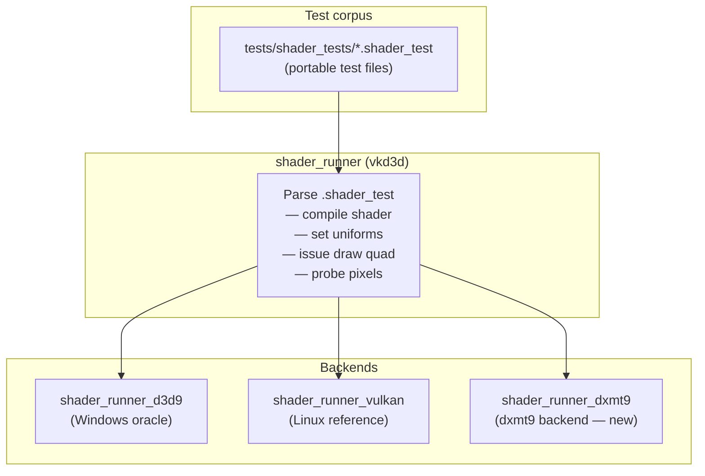

# Tests Design

---

## 1. Test Infrastructure: vkd3d shader_runner

The test infrastructure is built on the **vkd3d `shader_runner`** framework. The
framework has two parts: a backend-agnostic runner and pluggable backends.



`shader_runner_dxmt9` drives the dxmt9 `BackendDevice` interface directly — no Wine,
no D3D9 COM. It is a native macOS executable.

---

## 2. `.shader_test` File Format

Each `.shader_test` file is a self-describing test case. The format is defined by
vkd3d and documented in `tests/shader_runner.c`.

```
[require]
shader model >= ps_2_0           ; skip if backend does not support this

[pixel shader]
float4 main(float2 uv : TEXCOORD0) : COLOR
{
    return float4(uv.x, uv.y, 0.0, 1.0);
}

[test]
draw quad                        ; full-screen quad with UVs in [0,1]
probe (0,  0)  rgba(0.0, 0.0, 0.0, 1.0) 1    ; (x,y) pixel, ULP tolerance
probe (31, 0)  rgba(1.0, 0.0, 0.0, 1.0) 1
probe (0,  31) rgba(0.0, 1.0, 0.0, 1.0) 1
probe (31, 31) rgba(1.0, 1.0, 0.0, 1.0) 1
```

Key points:
- **`probe (x, y) rgba(...) N`** — compares the pixel at `(x, y)` to the expected
  RGBA value with a tolerance of `N` ULPs per channel (1 ULP in UNORM8 = 1/255).
- **`[pixel shader d3dbc-hex]`** — raw D3DBC bytecode as hex; used when the HLSL
  frontend cannot exercise a specific opcode directly.
- **`[require]`** — the runner skips the test if the backend does not meet the
  constraint (shader model, texture format, etc.).

---

## 3. Oracle Generation

Two oracle sources feed the test corpus. Neither is ever regenerated automatically —
updating an oracle value requires code review.

### 3a. vkd3d `shader_runner_d3d9` (SM2/SM3)

Run the `.shader_test` file on a Windows host to produce reference probe values:

```sh
# On Windows (hardware or WARP):
shader_runner_d3d9.exe tests/shader_tests/sincos.shader_test
# When a probe fails, the runner prints the actual value — copy it as the expected.
```

### 3b. Wine `visual.c` (ps_1_x, FFP, corner cases)

`dlls/d3d9/tests/visual.c` (Wine, LGPL-2.1) contains hardcoded expected D3DCOLOR
values verified against real D3D9 hardware. To port a test:

1. Locate the Wine test function (e.g., `fog_test`, `alpha_test`, `ps_1_4_test`)
2. Extract the inline shader assembly string and expected `D3DCOLOR` values
3. Convert `D3DCOLOR` (0xAARRGGBB) to float RGBA for the `probe` line:
   ```
   D3DCOLOR 0xff804020  →  probe (x, y) rgba(0.502, 0.251, 0.125, 1.0) 2
   ```
4. Add citation comment: `// derived from Wine: visual.c:<function_name>`

**Oracle sources by category:**

| Category | Oracle source |
|---|---|
| SM2/SM3 arithmetic, texture, flow control | `shader_runner_d3d9` (Windows/WARP) |
| ps_1_1, ps_1_4 | Wine `visual.c` hardcoded colors |
| Fixed-function lighting, fog, texop | `shader_runner_d3d9` or `visual.c` |
| Half-pixel offset, winding order | Math derivation (exact) |

---

## 4. `shader_runner_dxmt9` Backend

The backend must implement the vkd3d `struct shader_runner_ops` interface:

```c
struct shader_runner_ops {
    bool (*check_requirements)(struct shader_runner *, const struct shader_test_requirement *);
    bool (*compile_shader)(struct shader_runner *, const struct shader_bytecode *, ...);
    bool (*draw)(struct shader_runner *);
    void (*probe_pixel)(struct shader_runner *, unsigned x, unsigned y,
                        const struct vec4 *expected, unsigned tolerance);
    void (*destroy)(struct shader_runner *);
};
```

Internal flow:


The backend creates a 64×64 RGBA8 render target for all tests. The draw quad
generates UVs from `[0,1]×[0,1]` across the full target.

---

## 5. Comparison Criteria

| Category | Method | Tolerance |
|---|---|---|
| Shader arithmetic | ULP per channel (UNORM8) | 1 ULP (≤ 1/255) |
| Fixed-function lighting | ULP per channel | 2 ULP |
| Transcendentals (SINCOS, LOG, EXP) | ULP per channel | 2 ULP |
| Texture sampling (bilinear) | ULP per channel | 2 ULP |
| Rasterization coverage | Exact pixel mask | 0 |
| Depth buffer | Float absolute | ≤ 1e-5 |

These tolerances match those used in the vkd3d `shader_runner` D3D9 backend and
Wine `visual.c` (`max_diff = 1` or `2` per channel).

---

## 6. Opcode Coverage Workflow

For each missing opcode in `translateSpirvToMsl()`:

1. Write a `.shader_test` in `tests/shader_tests/<opcode>.shader_test`
2. Run on `shader_runner_d3d9` (Windows) to generate oracle `probe` values
3. Commit the `.shader_test` with the oracle values — test is now **failing** on dxmt9
4. Implement the opcode in `translateSpirvToMsl()`
5. Run `meson test` — test must pass before the opcode is marked ✅ in `gap.md`

---

## 7. Fixed-Function Coverage Matrix

Each cell is one `.shader_test` (or `visual.c`-derived test). Updated as tests pass.

| Feature | vs_ffp | ps_ffp |
|---|---|---|
| No lighting, no texture | ✗ | ✗ |
| Directional light, diffuse | ✗ | — |
| Point light + attenuation | ✗ | — |
| Spot light | ✗ | — |
| 8 mixed lights | ✗ | — |
| Specular | ✗ | — |
| Fog LINEAR vertex | ✗ | ✗ |
| Fog EXP pixel | ✗ | ✗ |
| TEXOP MODULATE | — | ✗ |
| TEXOP ADD | — | ✗ |
| TEXOP ADDSIGNED | — | ✗ |
| TEXOP DOTPRODUCT3 | — | ✗ |
| TEXOP BUMPENVMAP | — | ✗ |
| Alpha test LESS | — | ✗ |
| Alpha test GREATEREQUAL | — | ✗ |
| TexCoordGen SPHEREMAP | ✗ | — |
| Texture transform PROJECTED | ✗ | ✗ |

(✗ = not yet passing; — = not applicable to that stage)

---

## 8. File Layout

```
tests/
├── smoke.cpp                     Bootstrap sanity test
├── core_spec.cpp                 Core API tests
├── shader_tests/
│   ├── MANIFEST.toml             Machine-readable corpus index (R-TEST-10.1)
│   ├── ...                       vkd3d-format .shader_test files (each with provenance block)
│   ├── arithmetic/
│   │   ├── mov.shader_test
│   │   ├── mad.shader_test
│   │   ├── dp3_dp4.shader_test
│   │   └── ...
│   ├── flow_control/
│   │   ├── if_else.shader_test
│   │   ├── rep_endrep.shader_test
│   │   ├── loop.shader_test
│   │   └── call_ret.shader_test
│   ├── transcendental/
│   │   ├── sincos.shader_test
│   │   ├── log_exp.shader_test
│   │   └── ...
│   ├── texture/
│   │   ├── tex_2d.shader_test
│   │   ├── texldd.shader_test
│   │   └── ...
│   ├── matrix/
│   │   ├── m4x4.shader_test
│   │   └── ...
│   ├── ffp/                      Fixed-function (shader_runner-based)
│   │   ├── lighting_directional.shader_test
│   │   ├── fog_linear.shader_test
│   │   └── ...
│   └── visual_c/                 Ported from Wine visual.c (ps_1_x + FFP)
│       ├── ps_1_4_test.shader_test     ; // derived from Wine: visual.c:ps_1_4_test
│       ├── fog_test.shader_test        ; // derived from Wine: visual.c:fog_test
│       ├── alpha_test.shader_test      ; // derived from Wine: visual.c:alpha_test
│       └── ...
├── shader_runner_dxmt9.cpp       dxmt9 backend for shader_runner
└── meson.build
scripts/
├── check_manifest.sh             Fails if MANIFEST.toml ↔ filesystem diverge
└── check_drift.sh                Reports .shader_test files behind upstream commit
```

The `shader_runner_dxmt9` binary is built as a Meson test target and run with each
`.shader_test` file as a separate test case. Each `meson test` invocation runs the
full corpus.

---

## 9. Provenance Block

Every `.shader_test` file opens with a provenance block. The block is pure comments
(`;` prefix) so the vkd3d parser ignores it.

**vkd3d-sourced test:**

```
; [provenance]
; source: vkd3d
; upstream-url: https://gitlab.winehq.org/wine/vkd3d
; upstream-commit: 5a47802
; oracle: shader_runner_d3d9
; oracle-env: Windows 11 / WARP
; oracle-date: 2026-03-29

[require]
shader model >= ps_2_0

[pixel shader]
...
```

**Wine visual.c port:**

```
; [provenance]
; source: wine/visual.c:fog_test
; upstream-url: https://github.com/wine-mirror/wine
; upstream-commit: d3a9f12
; oracle: real D3D9 hardware (recorded in Wine test history)
; oracle-date: 2026-03-29

[require]
shader model >= ps_1_1
...
```

**Math-derived test:**

```
; [provenance]
; source: dxmt9
; oracle: math-derivation
; oracle-date: 2026-03-29
```

The `upstream-commit` field enables drift detection: a script can compare each
file's recorded commit against the current vkd3d or Wine HEAD and flag files that
are behind.

---

## 10. Manifest

`tests/shader_tests/MANIFEST.toml` is the machine-readable index of the corpus.

### Format

```toml
# MANIFEST.toml — generated and hand-maintained
# Run `scripts/check_manifest.sh` to verify it matches the filesystem.

[[test]]
file    = "arithmetic/mad.shader_test"
source  = "vkd3d"
models  = ["ps_2_0", "vs_2_0", "ps_3_0", "vs_3_0"]
opcodes = ["MAD"]
status  = "passing"

[[test]]
file    = "flow_control/if_else.shader_test"
source  = "vkd3d"
models  = ["ps_2_0", "ps_3_0"]
opcodes = ["IF", "ELSE", "ENDIF"]
status  = "failing"          # implementation pending

[[test]]
file    = "visual_c/fog_test.shader_test"
source  = "wine/visual.c:fog_test"
models  = ["ps_1_1"]
opcodes = ["TEX", "MUL", "ADD"]
status  = "passing"
```

### Enforcement

A Meson custom target `dxmt9-manifest-check` runs `scripts/check_manifest.sh`
before the test suite:

```sh
# scripts/check_manifest.sh
# Fails if any .shader_test file is missing from MANIFEST.toml
# or if MANIFEST.toml lists a file that does not exist.
find tests/shader_tests -name "*.shader_test" | sort > /tmp/actual.txt
tomlq -r '.test[].file' tests/shader_tests/MANIFEST.toml | sort > /tmp/manifest.txt
diff /tmp/actual.txt /tmp/manifest.txt
```

### Queries

```sh
# Opcodes with no passing test (coverage gap):
tomlq -r '.test[] | select(.status != "passing") | .opcodes[]' MANIFEST.toml | sort -u

# Tests behind upstream vkd3d HEAD:
# (compare provenance upstream-commit in each file vs. current vkd3d HEAD)
scripts/check_drift.sh

# Count by shader model:
tomlq -r '.test[] | .models[]' MANIFEST.toml | sort | uniq -c
```
