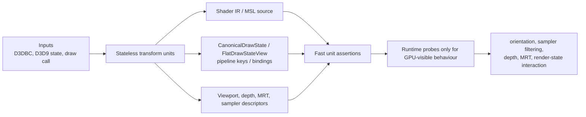
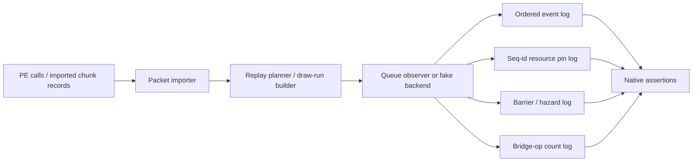
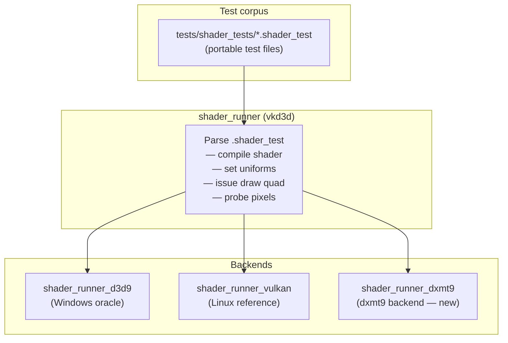
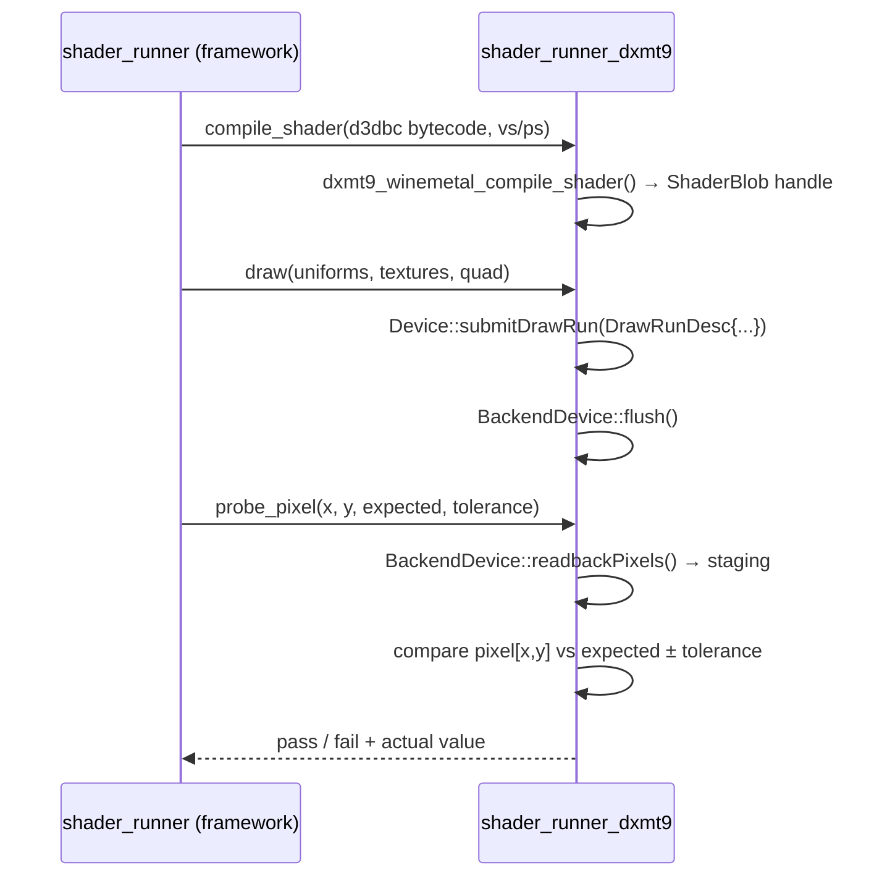
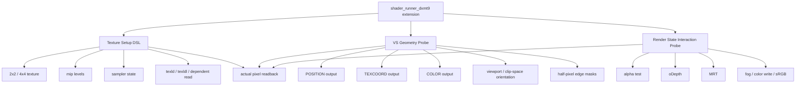
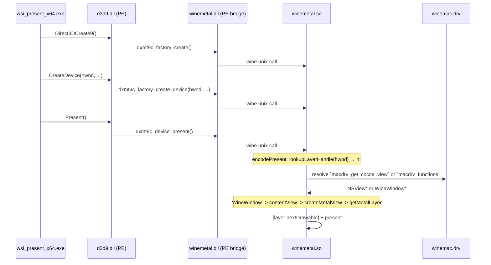
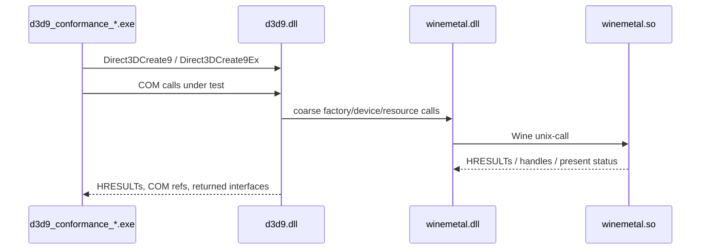

# Tests Design

---

## 0. Unit-First Strategy and Ownership

The test architecture follows DXMT-shaped ownership: each layer owns tests for
the data it transforms, and runtime tests are used only where static inspection
cannot prove the behaviour. Shader, state, and draw correctness should first be
validated by fast native unit tests over stateless transforms.



Primary confidence comes from tests that instantiate plain data inputs and assert
plain data outputs without Metal, Wine, COM, or asynchronous backend scheduling.
These suites should cover:

- D3DBC decode, token classification, register semantics, modifiers, masks, and
  control-flow lowering.
- Shader IR to MSL source generation for programmable and fixed-function paths.
- D3D9 render, texture, sampler, transform, stream, index, shader, constant, and
  render-target state snapshots to immutable production draw inputs:
  `CanonicalDrawState` plus `DrawRunDesc`, and imported `FlatDrawStateView`
  equivalents.
- Stateless key generation for FFP shaders, PSO, depth-stencil state, vertex
  layouts, sampler descriptors, blend/MRT state, and color-write masks.
- Viewport, half-pixel, depth-range, clip-plane, texture-coordinate, and
  semantic-index mapping decisions.

Runtime Metal/readback tests remain necessary, but only for behaviour that source
or descriptor inspection cannot prove: texture orientation as sampled by the GPU,
sampler filtering/addressing, depth writes/tests, MRT routing, alpha/fog/sRGB and
other render-state interactions, synchronization, and WSI presentation.
`shader_runner_dxmt9` probes sit in this runtime category. They are valuable
acceptance evidence for GPU-visible results, but they are not a substitute for
stateless transform suites or deterministic replay instrumentation.

Ownership is therefore:

| Owner | Primary tests | Runtime tests |
|---|---|---|
| Shader translator | D3DBC/IR/MSL stateless unit suites | Readback probes for sampling and shader/render-state interactions |
| Core state and draw builder | State snapshot to canonical draw state/run and key unit suites | Native backend draw/readback smoke for behaviour coupling |
| Metal backend | Descriptor encoding and resource lifecycle unit/sim tests | Metal readback, synchronization, WSI |
| PE D3D9 layer | HRESULT/refcount/state-machine PE conformance | Wine-hosted ABI and window integration |

---

## 0.1 Data-Oriented Replay and Bridge Evidence

DXMT merge compatibility depends on the shape of the data path, not only on the
final pixels. Tests for chunk import, replay planning, queue submission, and PE
bridge dispatch therefore use deterministic observers in addition to runtime
probes.



The observer is intentionally plain-data oriented. It records command kind,
packet index, draw-run grouping, resource handles, seq IDs, bridge operation
names, and barrier/hazard events. It must not depend on Metal side effects,
wall-clock sleeps, or real window presentation. Runtime `shader_runner` probes
may then verify that selected packets produce expected pixels, but acceptance of
the packet transform itself comes from the deterministic observer log.

Production backend tests must target the same inputs used by the runtime command
path: `CanonicalDrawState` plus `DrawRunDesc` and `DrawUniformPayload`, or
imported `FlatDrawStateView` views created by the packet importer. `fixture::DrawDesc`
remains available only for tests/offline fixtures that need compact expected data;
it must not be used as evidence that the production backend accepts `DrawDesc`
directly.

Required observer assertions:

| Area | Evidence |
|---|---|
| Imported replay order | Exact command-kind sequence, including draw-run boundaries, clear/copy/readback/present, and flush points. |
| Seq-id resource pinning | Resources retained for each imported seq ID and released only after the queue completes that seq ID. |
| Barrier/hazard order | Upload, render, readback, present, and hazard/barrier events appear before dependent use and are not reordered by batching. |
| Allocation-free hot path | A warmed fixed replay sequence performs zero general heap allocations, or only documented bounded scratch growth tested separately. |
| Bridge-op counts | Public PE calls and imported replay inputs emit expected bridge operation names/counts/order, preserving batching. |
| Packet transform coverage | Valid, malformed, truncated, variable-size, resource-bearing, state-delta, hazard-scope, and coalesced draw-run packets all have stateless expected-output cases. |

Allocation checks should run after setup and capacity warm-up. If a path grows a
scratch buffer by design, the test must split the first-growth case from the
steady-state case and assert the maximum retained capacity or allocation count.

---

## 1. Test Infrastructure: vkd3d shader_runner

The test infrastructure is built on the **vkd3d `shader_runner`** framework. The
framework has two parts: a backend-agnostic runner and pluggable backends.



`shader_runner_dxmt9` drives the dxmt9 `BackendDevice` interface directly — no Wine,
no D3D9 COM. It is a native macOS executable.

---

## 2. `.shader_test` File Format

Each `.shader_test` file is a self-describing test case. The format is defined by
vkd3d and documented in `tests/shader_runner.c`.

```
[require]
shader model >= ps_2_0           ; skip if backend does not support this

[pixel shader]
float4 main(float2 uv : TEXCOORD0) : COLOR
{
    return float4(uv.x, uv.y, 0.0, 1.0);
}

[test]
draw quad                        ; full-screen quad with UVs in [0,1]
probe (0,  0)  rgba(0.0, 0.0, 0.0, 1.0) 1    ; (x,y) pixel, ULP tolerance
probe (31, 0)  rgba(1.0, 0.0, 0.0, 1.0) 1
probe (0,  31) rgba(0.0, 1.0, 0.0, 1.0) 1
probe (31, 31) rgba(1.0, 1.0, 0.0, 1.0) 1
```

Key points:
- **`probe (x, y) rgba(...) N`** — compares the pixel at `(x, y)` to the expected
  RGBA value with a tolerance of `N` ULPs per channel (1 ULP in UNORM8 = 1/255).
- **`[pixel shader d3dbc-hex]`** — raw D3DBC bytecode as hex; used when the HLSL
  frontend cannot exercise a specific opcode directly.
- **`[require]`** — the runner skips the test if the backend does not meet the
  constraint (shader model, texture format, etc.).

---

## 3. Oracle Generation

Shader and rendering oracle values feed the test corpus. API conformance tests use
Wine's D3D9 tests as behavioural references. Neither category is regenerated
automatically — updating an oracle value or expected HRESULT requires code review.

### 3a. vkd3d `shader_runner_d3d9` (SM2/SM3)

Run the `.shader_test` file on a Windows host to produce reference probe values:

```sh
# On Windows (hardware or WARP):
shader_runner_d3d9.exe tests/shader_tests/sincos.shader_test
# When a probe fails, the runner prints the actual value — copy it as the expected.
```

### 3b. Wine `visual.c` (ps_1_x, FFP, corner cases)

`dlls/d3d9/tests/visual.c` (Wine, LGPL-2.1) contains hardcoded expected D3DCOLOR
values verified against real D3D9 hardware. To port a test:

1. Locate the Wine test function (e.g., `fog_test`, `alpha_test`, `ps_1_4_test`)
2. Extract the inline shader assembly string and expected `D3DCOLOR` values
3. Convert `D3DCOLOR` (0xAARRGGBB) to float RGBA for the `probe` line:
   ```
   D3DCOLOR 0xff804020  →  probe (x, y) rgba(0.502, 0.251, 0.125, 1.0) 2
   ```
4. Add citation comment: `// derived from Wine: visual.c:<function_name>`

**Oracle sources by category:**

| Category | Oracle source |
|---|---|
| SM2/SM3 arithmetic, texture, flow control | `shader_runner_d3d9` (Windows/WARP) |
| ps_1_1, ps_1_4 | Wine `visual.c` hardcoded colors |
| Fixed-function lighting, fog, texop | `shader_runner_d3d9` or `visual.c` |
| Half-pixel offset, winding order, default pixel texture V orientation | Math derivation plus native readback smoke |
| COM lifetime, D3D9Ex QI, reset, stateblock | Wine `device.c`, `d3d9ex.c`, `stateblock.c` expected HRESULT/refcount behaviour |

---

## 4. `shader_runner_dxmt9` Backend

The backend must implement the vkd3d `struct shader_runner_ops` interface:

```c
struct shader_runner_ops {
    bool (*check_requirements)(struct shader_runner *, const struct shader_test_requirement *);
    bool (*compile_shader)(struct shader_runner *, const struct shader_bytecode *, ...);
    bool (*draw)(struct shader_runner *);
    void (*probe_pixel)(struct shader_runner *, unsigned x, unsigned y,
                        const struct vec4 *expected, unsigned tolerance);
    void (*destroy)(struct shader_runner *);
};
```

Internal flow:



The backend creates a 64×64 RGBA8 render target for all tests. The draw quad
generates UVs from `[0,1]×[0,1]` across the full target.

### 4.1 Native Coordinate Source Contracts

`dxmt9-core-spec` carries a small native coordinate suite that runs outside Wine
and validates translator/source contracts that are easier to regress than to
notice visually:

- `testProgrammableTextureOrientationSmoke()` creates a 2x2 quadrant texture,
  draws it through a programmable `ps_2_0` `texld` shader on an 8x8 target, and
  reads the result back. The expected quadrants are top-left red, top-right
  green, bottom-left blue, and bottom-right white. A default pixel-shader V flip
  swaps the vertical quadrants and fails the test.
- Pixel shader source-contract tests run both with and without
  `DXMT_DEBUG_FORCE_PIXEL_V_FLIP`. The default source must preserve D3D texture
  V, while the debug run must visibly emit the forced `1.0f - v` transform.
- Vertex shader source-contract tests use `DXMT_DEBUG_FLIP_VERTEX_Y` separately
  and assert that vertex clip-space Y debugging does not imply a pixel sampler
  V flip.

The debug-source variants run as separate Meson tests with
`DXMT9_CORE_SPEC_SOURCE_CONTRACT_ONLY=1` so they validate generated shader text
without depending on a Metal render/readback path:
`dxmt9-core-spec-pixel-vflip-contract` sets
`DXMT_DEBUG_FORCE_PIXEL_V_FLIP=1`, and
`dxmt9-core-spec-vertex-yflip-contract` sets `DXMT_DEBUG_FLIP_VERTEX_Y=1`.

### 4.2 Extended Probe Layer

The portable vkd3d `.shader_test` syntax remains the base corpus format.
dxmt9-specific coverage that needs richer setup is expressed through a local
extended probe layer owned by `shader_runner_dxmt9`. The extension is used for
texture setup, vertex output geometry probes, and render-state interaction
probes that cannot be represented cleanly in the shared upstream corpus.
It is not the primary proof mechanism for shader/state/draw transforms; those
belong in the stateless unit suites described in section 0.



The extension is declarative: test files describe resources, render states,
shader bytecode or HLSL snippets, draw geometry, and expected probe pixels. The
runner translates that into backend calls, renders into an offscreen target,
performs readback, and compares the actual pixels. Generated shader source is
not a pass criterion for these probes; source and descriptor expectations belong
in fast transform unit tests. Extended probes are reserved for GPU-visible
behaviour such as orientation, sampler filtering/addressing, depth, MRT routing,
and combined render-state effects.

Current implemented command subset:

- `dxmt9-texture <id> <width> <height> A8R8G8B8 <texel...>` creates a named
  A8R8G8B8 2D managed texture and uploads row-major named texels.
- `dxmt9-sampler <stage> address_u=<mode> address_v=<mode>
  min_filter=<filter> mag_filter=<filter> mip_filter=<filter>` applies sampler
  state for the stage.
- `dxmt9-bind-texture <stage> <id>` binds a named texture to a sampler stage.
- `dxmt9-viewport <x> <y> <width> <height>` applies a viewport before the draw.
- `dxmt9-draw-textured-quad` renders an XYZRHW textured quad over the 64x64
  offscreen target and validates results through normal `probe` readback.
- `dxmt9-draw-vs-color-triangle` renders a programmable vertex-shader triangle
  with explicit POSITION and COLOR inputs and validates rasterized pixels.
- `dxmt9-render-state color_write=<mask>` applies a color-write mask such as
  `green`, `rgb`, or `rgba`.
- `dxmt9-draw-solid-quad` renders a full-target XYZRHW quad for render-state
  interaction probes.

The first implemented runtime probes are:

- `tests/shader_tests/texture/dxmt9_texture_2x2.shader_test` validates top-left
  / top-right / bottom-left / bottom-right texture orientation through real
  rendering.
- `tests/shader_tests/vs_specific/dxmt9_vs_color_triangle.shader_test`
  validates that programmable vertex POSITION and COLOR outputs affect
  rasterization and framebuffer color.
- `tests/shader_tests/viewport/dxmt9_viewport_vs_triangle.shader_test`
  validates that a bounded viewport changes the rasterized geometry mask through
  framebuffer readback.
- `tests/shader_tests/render_state/dxmt9_color_write_mask.shader_test`
  validates `RS_COLOR_WRITE_ENABLE` through framebuffer readback.
- `tests/shader_tests/render_state/dxmt9_color_write_rgb_preserves_alpha.shader_test`
  validates that RGB color-write masks update RGB channels while preserving the
  cleared alpha channel.

Mip-level contents, dependent reads, nonzero viewport origin, half-pixel
geometry interactions, alpha/oDepth/MRT/fog/sRGB render-state probes remain
future extension points. A first alpha-test reject runtime probe was attempted
but is not deterministic enough in the current runner/backend path to serve as
acceptance evidence.

**Texture setup DSL:**

```toml
[[texture]]
slot = 0
size = [2, 2]
format = "A8R8G8B8"
mip0 = [
  ["red", "green"],
  ["blue", "white"],
]

[sampler.0]
address_u = "clamp"
address_v = "clamp"
min_filter = "point"
mag_filter = "point"
mip_filter = "point"
```

The same schema may define 4x4 textures, additional mip levels, filter/address
state, LOD bias, and dependent-read inputs. The first required shader paths are
`texld`, `texldl`, and dependent `texld` where UVs are computed by a previous
instruction.

**VS geometry probes** render small geometry masks that prove vertex shader
outputs were consumed correctly. Current runtime coverage includes `POSITION`,
`COLOR`, and a bounded viewport mask. Required future probes cover `TEXCOORD`,
secondary color, nonzero viewport origin, clip-space orientation, and half-pixel
interactions.

**Render-state interaction probes** combine shader output with D3D9 render
state. Required probes cover alpha test, `oDepth`, MRT color outputs, fog,
color-write masks, and sRGB write/sampling state. Every probe verifies the final
framebuffer through readback.

---

## 5. Comparison Criteria

| Category | Method | Tolerance |
|---|---|---|
| Shader arithmetic | ULP per channel (UNORM8) | 1 ULP (≤ 1/255) |
| Fixed-function lighting | ULP per channel | 2 ULP |
| Transcendentals (SINCOS, LOG, EXP) | ULP per channel | 2 ULP |
| Texture sampling (bilinear) | ULP per channel | 2 ULP |
| Rasterization coverage | Exact pixel mask | 0 |
| Depth buffer | Float absolute | ≤ 1e-5 |

These tolerances match those used in the vkd3d `shader_runner` D3D9 backend and
Wine `visual.c` (`max_diff = 1` or `2` per channel).

---

## 6. Opcode Coverage Workflow

For each missing opcode in `translateSpirvToMsl()`:

1. Write a `.shader_test` in `tests/shader_tests/<opcode>.shader_test`
2. Run on `shader_runner_d3d9` (Windows) to generate oracle `probe` values
3. Commit the `.shader_test` with the oracle values — test is now **failing** on dxmt9
4. Implement the opcode in `translateSpirvToMsl()`
5. Run `meson test` — test must pass before the opcode is marked ✅ in `gap.md`

---

## 7. Fixed-Function Coverage Matrix

Each cell is one `.shader_test` (or `visual.c`-derived test). Updated as tests pass.

| Feature | vs_ffp | ps_ffp |
|---|---|---|
| No lighting, no texture | ✗ | ✗ |
| Directional light, diffuse | ✗ | — |
| Point light + attenuation | ✗ | — |
| Spot light | ✗ | — |
| 8 mixed lights | ✗ | — |
| Specular | ✗ | — |
| Fog LINEAR vertex | ✗ | ✗ |
| Fog EXP pixel | ✗ | ✗ |
| TEXOP MODULATE | — | ✗ |
| TEXOP ADD | — | ✗ |
| TEXOP ADDSIGNED | — | ✗ |
| TEXOP DOTPRODUCT3 | — | ✗ |
| TEXOP BUMPENVMAP | — | ✗ |
| Alpha test LESS | — | ✗ |
| Alpha test GREATEREQUAL | — | ✗ |
| TexCoordGen SPHEREMAP | ✗ | — |
| Texture transform PROJECTED | ✗ | ✗ |

(✗ = not yet passing; — = not applicable to that stage)

---

## 8. WSI Integration Test

The WSI test (`tests/wsi_present/`) is architecturally distinct from the rest
of the test suite: it is a cross-compiled Win32 PE executable that exercises
the full presentation stack end-to-end under Wine, including:

- `d3d9.dll` PE wrapper (COM entry points)
- `winemetal.dll` PE bridge/service module (Wine-visible thunk layer)
- `winemetal.so` unix-side Metal backend
- Legacy `macdrv_get_cocoa_view` or Heroic `macdrv_functions` HWND→Cocoa resolution
- `WineWindow -> contentView -> WineMetalView -> CAMetalLayer` fallback on Heroic Wine 11.5
- Metal `nextDrawable` + `presentDrawable` on a real `CAMetalLayer`



### Build

```sh
PATH=~/llvm-mingw/bin:$PATH
x86_64-w64-mingw32-clang++ -o tests/wsi_present/wsi_present_x64.exe \
    tests/wsi_present/main.cpp -ld3d9 -luser32 -lgdi32
```

The resulting `wsi_present_x64.exe` is checked in as a pre-built binary so the
test can be run without a separate cross-compile step on the common
Rosetta/Wine64 path.

### Run

```sh
# Build-time Wine toolchain root must provide winebuild, libwinecrt0.a,
# libntdll.a, libdbghelp.a, winemac.so, and ntdll.so.
meson setup build-win32-x64-builtin \
  --cross-file cross/x86_64-windows.ini \
  -Dwine_builtin_dll=true \
  -Dwine_install_path=<wine-toolchain-root>
meson compile -C build-win32-x64-builtin

meson setup build-x86_64-builtin \
  --native-file cross/x86_64-macos.ini \
  -Dwine_install_path=<wine-toolchain-root>
meson compile -C build-x86_64-builtin

cp build-win32-x64-builtin/src/win32/d3d9.dll ~/.wine/drive_c/windows/system32/d3d9.dll
cp build-win32-x64-builtin/src/winemetal/winemetal.dll \
  <wine-root>/lib/wine/x86_64-windows/winemetal.dll
cp build-x86_64-builtin/src/winemetal/unix/winemetal.so \
  <wine-root>/lib/wine/x86_64-unix/winemetal.so
WINEDLLOVERRIDES="d3d9,winemetal=n,b" wine tests/wsi_present/wsi_present_x64.exe
```

Requires a recent Wine64-capable build on macOS plus a Wine toolchain install
tree for the builtin bridge build. Heroic Wine 11.5 is the currently verified
host. The test is **not** part of `meson test` because it cannot run without
Wine.

### What is NOT tested by this path

| Scenario | Covered by |
|---|---|
| Metal shader correctness | `dxmt9-shader-corpus` |
| Device state, draw calls | `dxmt9-core-spec` |
| Present with null window (no WSI) | `dxmt9-core-spec` R-TEST-6.1 |
| x86_64 PE DLL loading | `wsi_present_x64.exe` under Wine64 |
| PE bridge ↔ unix module dispatch | `wsi_present_x64.exe` under Wine64 |
| WSI resolution (`macdrv_get_cocoa_view` or `macdrv_functions`) | `wsi_present_x64.exe` under Wine |
| Visual frame output | Manual observation |

---

## 9. Wine-Derived D3D9 API Conformance Harness

The conformance harness is a set of small PE executables compiled with
llvm-mingw and run under Wine. Unlike `dxmt9-core-spec`, these tests exercise
the real exported `d3d9.dll` ABI, COM vtables, Wine DLL search behaviour, and
the PE bridge path. Wine's D3D9 tests supply the Windows D3D9 API behaviour
oracle; dxmt9 still keeps the DXMT-compatible `winemetal` architecture.



### Porting Rules

- Keep each executable focused. Factory/Ex, resource wrappers, queries,
  stateblock, reset/lost-device, window/cursor, and auxiliary-export coverage
  are separate test programs so failures identify the implementation area.
- Copy only the minimal test logic needed from Wine; do not vendor whole Wine
  source files.
- Preserve expected HRESULTs, refcount probes, and comments explaining unusual
  D3D9 quirks.
- Skip Wine cases whose only expected result is a Windows access violation on
  invalid pointers; dxmt9 tests should assert the specified clean-failure path
  instead.
- For object creation failures, assert both the returned `HRESULT` and that the
  out pointer remains `NULL` or unchanged according to the Windows
  D3D9-compatible rule validated by the Wine-derived oracle.
- Prefer one local test function per Wine source function. When a Wine function
  is too broad, split it into named cases but preserve the Wine function anchor
  in each case's provenance.
- Add a provenance header near each ported test:

```c
/* [provenance]
 * source: wine/dlls/d3d9/tests/d3d9ex.c:test_qi_base_to_ex
 * upstream-commit: 6e073d28dee3af7f4c965daec94644e0f9f92727
 * oracle: Windows D3D9 behaviour captured by Wine D3D9 tests
 */
```

### Required Executables

| Executable | Wine source anchors | Primary checks |
|---|---|---|
| `d3d9_exports_x64.exe` | `d3d9.spec`, `d3d9_main.c` | export table compatibility, `D3DPERF_*` no-op return behaviour, loader-safe auxiliary stubs |
| `d3d9_factory_ex_x64.exe` | `d3d9ex.c` QI/display/LUID tests | base vs Ex QI, Ex-created normal devices, display-mode filters |
| `d3d9_factory_validation_x64.exe` | `directx.c`, `device.c:test_check_device_format`, display-mode tests | `CheckDeviceType`, `CheckDeviceFormat`, `CheckDeviceFormatConversion`, multisample quality-level writes, invalid enum/devtype return-code parity |
| `d3d9_device_lifetime_x64.exe` | `device.c` refcount/private-data/scene tests | public COM refcounts, `Get*` AddRef, scene transitions, private data |
| `d3d9_queries_x64.exe` | `device.c:test_query_support`, `test_occlusion_query`, `test_timestamp_query` | support probes, invalid query enums, `GetDataSize`, pre-issue data writes, short-buffer handling, flush behaviour |
| `d3d9_resources_x64.exe` | `device.c` resource wrapper tests | `GetContainer`, `GetLevelDesc`, lock/unlock invalid cases, block-compressed alignment, `GetDC`, LOD, autogen mipmaps, `D3DFMT_UNKNOWN` |
| `d3d9_stateblock_x64.exe` | `stateblock.c` create/capture/apply tests | `D3DSBT_*` masks, recording invalid calls, apply/capture quirks |
| `d3d9_present_params_x64.exe` | `device.c` swapchain-desc validation, reset tests | invalid swap effects, back-buffer counts, intervals, and `CreateDeviceEx`/`ResetEx` fullscreen-mode matching |
| `d3d9_shared_handle_x64.exe` | `device.c:test_shared_handle`, `d3d9ex.c:test_user_memory`, resource creation paths | non-Ex `E_NOTIMPL`, Ex pool/resource-class errors, user-memory lock pointer/pitch cases, and no silent handle ignore |
| `d3d9_reset_lost_x64.exe` | `device.c` / `d3d9ex.c` reset tests | base vs Ex cooperative-level behaviour, default-pool invalidation, exact failure HRESULTs |
| `d3d9_window_cursor_x64.exe` | `device.c` / `d3d9ex.c` window and cursor tests | cursor API return values, clipping, window ownership, wndproc transitions, fullscreen/windowed style changes, destroyed-window handling |
| `d3d9_device_misc_x64.exe` | `device.c` creation-flag and utility tests | `GetDirect3D`, `GetCreationParameters`, `ValidateDevice`, raster status, dialog-box mode, FPU preserve, multithreaded and no-window-changes flags |
| `d3d9_auxiliary_x64.exe` | `d3d9.spec`, `d3d9_main.c`, `device.c:test_shader_validator`, `test_d3d9on12` | shader-validator stub calls, `D3DPERF_*`, `DebugSetMute`, `Direct3DCreate9On12`, query-safe D3D9On12 failure |

The same source layout may also build x86 PE binaries when the configured Wine
runtime supports WoW64.

### Conformance Manifest

`tests/d3d9_conformance/MANIFEST.toml` is the source of truth for Wine-derived
API conformance coverage. It is separate from the shader corpus manifest
because these tests are PE executables, not `.shader_test` files.

```toml
[[case]]
executable = "dxmt9-d3d9-device-lifetime.exe"
source_file = "device_lifetime.cpp"
function   = "test_get_direct3d_addref"
source     = "wine/dlls/d3d9/tests/device.c:test_refcount"
upstream_commit = "6e073d28dee3af7f4c965daec94644e0f9f92727"
lanes      = ["app-local", "builtin"]
arches     = ["x64", "x86"]
area       = "device-lifetime"
owner      = "pe/com"
requirements = ["R-TEST-12.3", "R-TEST-12.18"]
acceptance = ["GetDirect3D returns parent and AddRefs it"]
status     = "scaffolded"
```

The manifest must be updated with every added, renamed, split, skipped, or
passing conformance case. A skipped case must record why it is not a dxmt9
target, for example crash-only invalid-pointer behaviour or a Windows-only
window-manager message sequence.

`scripts/check_d3d9_conformance_manifest.sh` validates that every manifest entry
has the required fields, valid lane / architecture / status values, R-TEST-12
anchors, a 40-character Wine upstream commit, no duplicate executable/function
pairs, and a local source/function match for scaffolded cases. It is wired into
`meson test` as `dxmt9-d3d9-conformance-manifest-check`.

### Run

```sh
# App-local lane example.
mkdir -p build/conformance-stage
cp build-win32-x64/src/win32/d3d9.dll build/conformance-stage/
cp build-win32-x64/src/winemetal/winemetal.dll build/conformance-stage/
cp build-x86_64/src/winemetal/unix/winemetal.so build/conformance-stage/
# Copy every PE runtime dependency listed in the selected deploy manifest variant,
# unless this is a statically linked app-local package with an empty dependency list.
for dep in libc++.dll libunwind.dll; do
  if [ -f "build-win32-x64/src/win32/$dep" ]; then
    cp "build-win32-x64/src/win32/$dep" build/conformance-stage/
  fi
done
cp tests/d3d9_conformance/d3d9_*_x64.exe build/conformance-stage/
(cd build/conformance-stage && \
  WINEDLLOVERRIDES="d3d9,winemetal=n,b" \
  DXMT9_WINEMETAL_SO="$PWD/winemetal.so" \
  DYLD_LIBRARY_PATH="<wine-root>/lib/wine/x86_64-unix${DYLD_LIBRARY_PATH:+:$DYLD_LIBRARY_PATH}" \
  wine d3d9_factory_ex_x64.exe)
```

For the builtin lane, install `d3d9.dll`, `winemetal.dll`, and `winemetal.so`
with the deployment helper, then run the same PE executables with
`WINEDLLOVERRIDES="d3d9,winemetal=n,b"` as described in the deployment spec.

---

## 10. File Layout

```
tests/
├── smoke.cpp                     Bootstrap sanity test
├── core_spec.cpp                 Core API tests
├── d3d9_conformance/
│   ├── MANIFEST.toml             Wine-derived PE conformance case index
│   ├── exports.cpp               D3D9 export-table and D3DPERF checks
│   ├── factory_ex.cpp            Wine d3d9ex.c-derived factory/Ex checks
│   ├── factory_validation.cpp    Wine directx.c/device.c validation checks
│   ├── device_lifetime.cpp       Wine device.c-derived refcount/private-data/scene checks
│   ├── d3d9_queries_x64.cpp      Wine device.c query support/data checks
│   ├── d3d9_resources_x64.cpp    Wine device.c resource wrapper checks
│   ├── d3d9_stateblock_matrix_x64.cpp
│   │                              Wine stateblock.c-derived stateblock checks
│   ├── present_params.cpp        Wine presentation parameter normalisation checks
│   ├── shared_handle.cpp         Wine shared-handle and Ex user-memory checks
│   ├── d3d9_reset_lost_x64.cpp   Wine device.c/d3d9ex.c-derived reset checks
│   ├── d3d9_window_cursor_x64.cpp
│   │                              Wine window/cursor ownership checks
│   ├── d3d9_device_misc_x64.cpp  Wine device utility/creation-flag checks
│   └── auxiliary.cpp             Shader validator and D3D9On12 safe-stub checks
├── wsi_present/
│   ├── main.cpp                  WSI integration test source (R-TEST-11.1)
│   ├── wsi_present.exe           Historical ARM64 PE smoke binary
│   └── wsi_present_x64.exe       Pre-built x86_64 PE smoke binary (validated)
├── shader_tests/
│   ├── MANIFEST.toml             Machine-readable corpus index (R-TEST-10.1)
│   ├── ...                       vkd3d-format .shader_test files (each with provenance block)
│   ├── arithmetic/
│   │   ├── mov.shader_test
│   │   ├── mad.shader_test
│   │   ├── dp3_dp4.shader_test
│   │   └── ...
│   ├── flow_control/
│   │   ├── if_else.shader_test
│   │   ├── rep_endrep.shader_test
│   │   ├── loop.shader_test
│   │   └── call_ret.shader_test
│   ├── transcendental/
│   │   ├── sincos.shader_test
│   │   ├── log_exp.shader_test
│   │   └── ...
│   ├── texture/
│   │   ├── tex_2d.shader_test
│   │   ├── texldd.shader_test
│   │   └── ...
│   ├── matrix/
│   │   ├── m4x4.shader_test
│   │   └── ...
│   ├── ffp/                      Fixed-function (shader_runner-based)
│   │   ├── lighting_directional.shader_test
│   │   ├── fog_linear.shader_test
│   │   └── ...
│   ├── viewport/                 dxmt9-local viewport/readback probes
│   └── visual_c/                 Ported from Wine visual.c (ps_1_x + FFP)
│       ├── ps_1_4_test.shader_test     ; // derived from Wine: visual.c:ps_1_4_test
│       ├── fog_test.shader_test        ; // derived from Wine: visual.c:fog_test
│       ├── alpha_test.shader_test      ; // derived from Wine: visual.c:alpha_test
│       └── ...
├── shader_runner_dxmt9.cpp       dxmt9 backend for shader_runner
└── meson.build
scripts/
├── check_manifest.sh             Fails if MANIFEST.toml ↔ filesystem diverge
├── check_drift.sh                Reports .shader_test files behind upstream commit
└── sync_corpus.sh                Refreshes vkd3d-sourced files from a local checkout
```

The `shader_runner_dxmt9` binary is built as a Meson test target and run with each
`.shader_test` file as a separate test case. Each `meson test` invocation runs the
full corpus.

---

## 11. Provenance Block

Every `.shader_test` file opens with a provenance block. The block is pure comments
(`;` prefix) so the vkd3d parser ignores it.

**vkd3d-sourced test:**

```
; [provenance]
; source: vkd3d
; upstream-url: https://gitlab.winehq.org/wine/vkd3d
; upstream-commit: 5a47802
; oracle: shader_runner_d3d9
; oracle-env: Windows 11 / WARP
; oracle-date: 2026-03-29

[require]
shader model >= ps_2_0

[pixel shader]
...
```

**Wine visual.c port:**

```
; [provenance]
; source: wine/visual.c:fog_test
; upstream-url: https://github.com/wine-mirror/wine
; upstream-commit: d3a9f12
; oracle: real D3D9 hardware (recorded in Wine test history)
; oracle-date: 2026-03-29

[require]
shader model >= ps_1_1
...
```

**Math-derived test:**

```
; [provenance]
; source: dxmt9
; oracle: math-derivation
; oracle-date: 2026-03-29
```

The `upstream-commit` field enables drift detection: a script can compare each
file's recorded commit against the current vkd3d or Wine HEAD and flag files that
are behind.

---

## 12. Manifest

`tests/shader_tests/MANIFEST.toml` is the machine-readable index of the corpus.
Rows for upstream-sourced tests may also carry `upstream-commit` so the sync tool
can keep provenance and manifest state aligned.

### Format

```toml
# MANIFEST.toml — generated and hand-maintained
# Run `scripts/check_manifest.sh` to verify it matches the filesystem.

[[test]]
file    = "arithmetic/mad.shader_test"
source  = "vkd3d"
models  = ["ps_2_0", "vs_2_0", "ps_3_0", "vs_3_0"]
opcodes = ["MAD"]
status  = "passing"

[[test]]
file    = "flow_control/if_else.shader_test"
source  = "vkd3d"
models  = ["ps_2_0", "ps_3_0"]
opcodes = ["IF", "ELSE", "ENDIF"]
status  = "failing"          # implementation pending

[[test]]
file    = "visual_c/fog_test.shader_test"
source  = "wine/visual.c:fog_test"
models  = ["ps_1_1"]
opcodes = ["TEX", "MUL", "ADD"]
status  = "passing"
```

### Enforcement

A Meson custom target `dxmt9-manifest-check` runs `scripts/check_manifest.sh`
before the test suite:

```sh
# scripts/check_manifest.sh
# Fails if any .shader_test file is missing from MANIFEST.toml
# or if MANIFEST.toml lists a file that does not exist.
find tests/shader_tests -name "*.shader_test" | sort > /tmp/actual.txt
tomlq -r '.test[].file' tests/shader_tests/MANIFEST.toml | sort > /tmp/manifest.txt
diff /tmp/actual.txt /tmp/manifest.txt
```

The sync workflow is separate:

```sh
# Refresh vkd3d-sourced tests from a local upstream checkout.
DXMT_UPSTREAM_ROOT=/path/to/vkd3d bash scripts/sync_corpus.sh

# Report which tracked vkd3d files are behind that checkout.
DXMT_UPSTREAM_ROOT=/path/to/vkd3d bash scripts/check_drift.sh
```

### Queries

```sh
# Opcodes with no passing test (coverage gap):
tomlq -r '.test[] | select(.status != "passing") | .opcodes[]' MANIFEST.toml | sort -u

# Tests behind upstream vkd3d HEAD:
# (compare recorded provenance commits against the configured checkout)
DXMT_UPSTREAM_ROOT=/path/to/vkd3d scripts/check_drift.sh

# Count by shader model:
tomlq -r '.test[] | .models[]' MANIFEST.toml | sort | uniq -c
```
