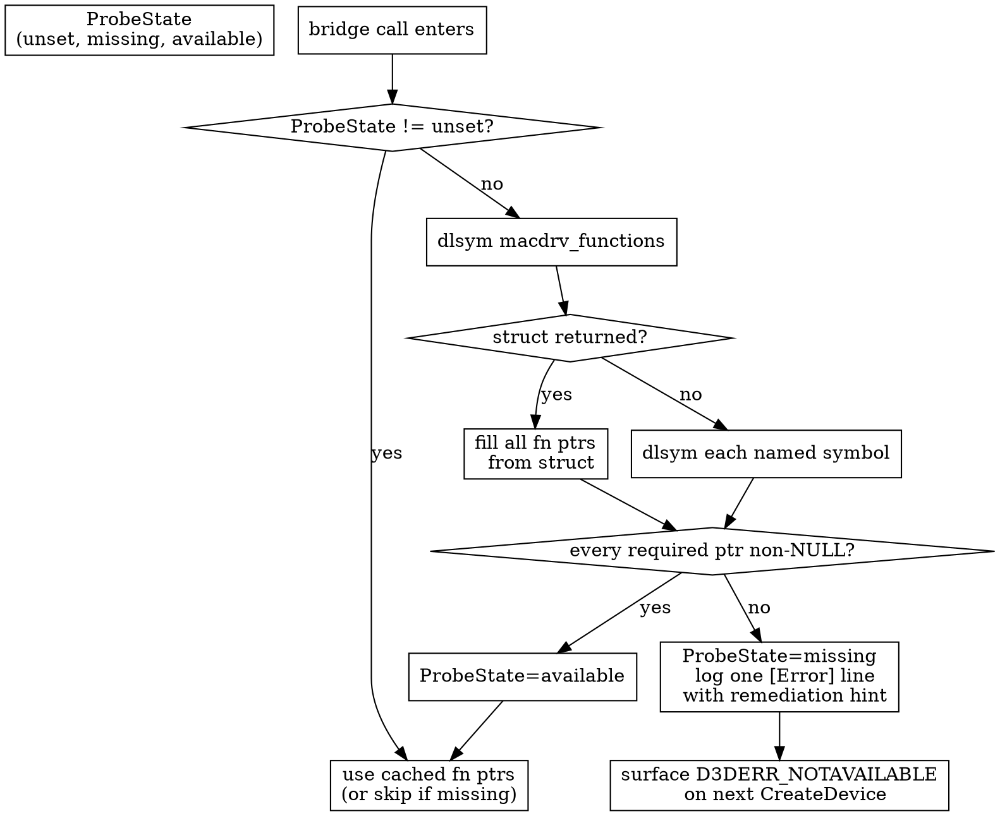

# winemetal Spec — Wine macdrv Symbol Bridge

Implements the requirements in `specs/winemetal/requirements.md`.
Defines the on-disk layout, the runtime probe, the manifest extension,
and the operator workflow for keeping a Wine root usable as a dxmt9
host.

Cross-references:
- Header schema: `specs/winemetal/assets/winemacdrv.h.example`
- Patch shape: `specs/winemetal/assets/macdrv-expose-symbols.patch.example`
- Manifest extension example: `specs/winemetal/assets/wine-manifest-requires-patch.toml.example`
- Spec sibling: `specs/d3d9/wsi/{requirements,spec}.md`
- Spec sibling: `specs/experiments/runtime/{requirements,spec}.md`
- Operational rule: `agents/rules/test_wild.rules.md`

---

## 1. On-Disk Layout

```
include/winemetal/
└── winemacdrv.h               # vendored signatures (R-WMB-3)

src/winemetal/unix/
└── winemetal_private_api.mm   # bridge consumer — uses winemacdrv.h
                               # types; replaces inline declarations.

src/dxmt9/
└── dxmt9_presenter_macdrv.cpp # presenter consumer — single source of
                               # the "I cannot get a metal layer" error.

wine/                          # NEW top-level directory
├── patches/
│   ├── README.md              # how to rebase, how to verify
│   ├── winemac-expose-symbols-11.7.patch
│   └── winemac-expose-symbols-staging-master.patch   # rebased per Wine bump
└── …

scripts/wine/
├── check_patch.py             # operator-run, ad-hoc verifier
└── …                          # (existing: resolve.py, bootstrap_prefix.py)

experiments/wine/
└── manifest.toml              # +requires_patch / +patch_status (R-WMB-5)
```

The header lives under `include/winemetal/` because it is consumed by
both unix-side (`winemetal_unix.c`, `winemetal_private_api.mm`) and
PE-side bridge code; placing it in the public include path matches
the existing `include/winemetal/` convention. The patch lives outside
`src/` so build systems and `meson` do not try to compile it.

---

## 2. Header Vendoring (`include/winemetal/winemacdrv.h`)

The header declares — only — the C signatures dxmt9 calls into. It
does not include any Wine implementation. A truncated example:

```c
// SPDX-License-Identifier: LGPL-2.1-or-later
// Signatures vendored from Wine's dlls/winemac.drv (LGPL-2.1+).
// Implementation lives in winemac.so; this header is declaration-only.

#pragma once
#include <stdint.h>
#include <stdbool.h>

typedef struct macdrv_opaque_metal_device *macdrv_metal_device;
typedef struct macdrv_opaque_metal_view   *macdrv_metal_view;
typedef struct macdrv_opaque_metal_layer  *macdrv_metal_layer;
typedef struct macdrv_opaque_view         *macdrv_view;
typedef struct macdrv_opaque_window       *macdrv_window;

struct macdrv_win_data;

struct macdrv_functions {
  void                  (*macdrv_init_display_devices)(int /*BOOL*/);
  struct macdrv_win_data *(*get_win_data)(void * /*HWND*/);
  void                  (*release_win_data)(struct macdrv_win_data *);
  macdrv_window         (*macdrv_get_cocoa_window)(void * /*HWND*/, int /*BOOL*/);
  macdrv_metal_device   (*macdrv_create_metal_device)(void);
  void                  (*macdrv_release_metal_device)(macdrv_metal_device);
  macdrv_metal_view     (*macdrv_view_create_metal_view)(macdrv_view, macdrv_metal_device);
  macdrv_metal_layer    (*macdrv_view_get_metal_layer)(macdrv_metal_view);
  void                  (*macdrv_view_release_metal_view)(macdrv_metal_view);
};

// The reduced view of macdrv_win_data dxmt9 reads.
struct macdrv_win_data_view {
  void *hwnd;
  macdrv_window cocoa_window;
  macdrv_view   cocoa_view;
  macdrv_view   client_cocoa_view;
};
```

The full schema lives in
`specs/winemetal/assets/winemacdrv.h.example`. The example carries
every field with a comment naming its source file in Wine and its
intended dxmt9 consumer.

---

## 3. Patch (`wine/patches/winemac-expose-symbols-<ver>.patch`)

The patch's only job: tell the Wine build to keep dxmt9's symbol set
in the dynamic symbol table of `winemac.so`. Two equivalent shapes
the patch may take:

**Shape A (preferred — visibility attribute on each declaration):**

```diff
--- a/dlls/winemac.drv/macdrv.h
+++ b/dlls/winemac.drv/macdrv.h
@@
-extern struct macdrv_win_data *get_win_data(HWND hwnd);
+extern __attribute__((visibility("default"))) struct macdrv_win_data *get_win_data(HWND hwnd);
```

(Same treatment for each symbol in `specs/winemetal/requirements.md` §2.)

**Shape B (linker version script):**

A small `dxmt9-exports.ver` added to the build with
`-Wl,--version-script=...`. Bigger build-system surface and less
portable; not preferred.

The README at `wine/patches/README.md` records which shape is used per
patch file and links to the upstream Wine commit the patch targets.

---

## 4. Wine Root Manifest Extension

`experiments/wine/manifest.toml` grows two optional per-entry fields
(see `specs/winemetal/assets/wine-manifest-requires-patch.toml.example`
for the full example):

```toml
[[wine]]
id            = "heroic-11.7"
source        = "heroic"
variant       = "vanilla"
version       = "11.7"
path          = "$HOME/Library/Application Support/heroic/tools/wine/Wine-11.7/Contents/Resources/wine"
requires_patch = true
patch_status   = "unpatched"   # stock Heroic 11.7 — no dxmt9 patch
notes          = "Will not produce a visible Metal layer without the dxmt9 patch."

[[wine]]
id            = "crossover-24"
source        = "crossover"
variant       = "patched"
version       = "24.0"
path          = "/Applications/CrossOver.app/Contents/SharedSupport/CrossOver/bin/wine"
requires_patch = true
patch_status   = "applied"    # CrossOver exposes the symbols natively
```

Schema notes:

- `requires_patch` defaults to `false` for backward compatibility with
  the existing manifest. A wild experiment that hits a `requires_patch
  = false` entry behaves exactly as today.
- `patch_status` defaults to `"unknown"` when omitted.
- `scripts/wine/check_patch.py` populates `patch_status` on demand
  (the operator runs it; the harness reads the manifest as-is).

---

## 5. Runtime Probe and Error Path

The probe is implemented in
`src/winemetal/unix/winemetal_private_api.mm`. It runs at the first
call into `CreateMetalViewFromHWND` (or `MacdrvMetalDevice_create` —
whichever fires first).

State machine:



`ProbeState` is a `std::atomic<int>` private to the bridge module —
no global header surface. The cached function pointers live alongside
it in the same anonymous namespace.

### Error format

When `ProbeState` transitions `unset → missing`, dxmt9 emits exactly:

```
[Error] dxmt9-presenter winemac.drv exposes no Metal-bridge symbols.
  wine_root=<resolved path>
  missing=<comma-separated list of symbols not found>
  remedy: this Wine needs the dxmt9 macdrv patch
    (see specs/winemetal/{requirements,spec}.md §6) or a CrossOver
    Wine 24+ build. Run scripts/wine/check_patch.py <wine_root> to
    inspect the .so directly.
```

Subsequent bridge calls hit the cached state and return immediately
(no re-log, no re-probe).

---

## 6. `scripts/wine/check_patch.py`

A small standalone script. Inputs: a wine root path. Output: one line
of stdout — `applied`, `unpatched`, or `unknown` — plus a
human-readable second line.

Algorithm:

```python
REQUIRED = (
    "get_win_data",
    "release_win_data",
    "macdrv_create_metal_device",
    "macdrv_release_metal_device",
    "macdrv_view_create_metal_view",
    "macdrv_view_get_metal_layer",
    "macdrv_view_release_metal_view",
    "macdrv_get_cocoa_window",
)

def check(wine_root: Path) -> tuple[str, str]:
    winemac_so = wine_root / "lib" / "wine" / "x86_64-unix" / "winemac.so"
    if not winemac_so.exists():
        # try fallback aarch64-darwin, x86_64-darwin per Wine 11.x layout
        ...
    out = subprocess.check_output(["nm", "-gU", str(winemac_so)], text=True)
    missing = [s for s in REQUIRED if not re.search(rf'\b{s}\b', out)]
    if not missing:
        return ("applied", f"{winemac_so}: all {len(REQUIRED)} symbols visible")
    return ("unpatched", f"{winemac_so}: missing {len(missing)} of {len(REQUIRED)}: {', '.join(missing)}")
```

Exit code 0 always; `applied` / `unpatched` distinguished by stdout.
Operators copy the first line into the manifest's `patch_status`
field, or wire the check into their own CI.

The script does **not** apply the patch, fetch Wine, or modify state.
Read-only operator tool.

---

## 7. Harness Integration (`scripts/run_apps/run_experiment.py`)

Two additions on top of the existing manifest resolver:

1. After resolving `wine_id` to a `WineEntry`, if `requires_patch =
   true` and `patch_status = "unpatched"`, raise `ManifestError`
   with a precise message before any prefix bootstrap or DLL staging
   happens. The runtime probe (R-WMB-7) is the second-line gate;
   the manifest gate exists for fail-fast.

2. After a run completes, append to `result.json`:

   ```json
   {
     "wine": {
       "id": "heroic-11.7",
       "requires_patch": true,
       "patch_status": "unpatched"
     }
   }
   ```

   so postmortem readers see exactly what the manifest declared,
   independent of whether the bridge probe succeeded.

The probe's own missing-symbols log line lands in the dxmt9 log file;
it is not re-encoded into `result.json` to avoid duplicating the
manifest declaration.

---

## 8. Documentation Touch-Points

| Doc | Edit |
|---|---|
| `agents/rules/test_wild.rules.md` | Add a checklist item: "Is the Wine root patched? `scripts/wine/check_patch.py <root>` returns `applied`?" Mention this spec by path. |
| `experiments/wine/README.md` | Add a paragraph on `requires_patch` / `patch_status` with a worked Heroic vs CrossOver example. |
| `wine/patches/README.md` | New file. Document: which Wine versions are supported, how to rebase a patch, how to verify with `check_patch.py`. |
| `specs/d3d9/wsi/spec.md` | One-line cross-reference: "Cocoa layer acquisition mechanics are owned by `specs/winemetal/`; this WSI design assumes the layer handle is available." |

---

## 9. Distribution & Operator Workflow

Two recipes lead to a working Wine root for dxmt9. **Path A is the
recommended default** because it is the cheapest fully-automated
setup. Path B is the reproducible-from-source alternative.

```dot
digraph workflow {
  rankdir=LR;
  start[shape=box,label="operator wants to run dxmt9"];
  pick[shape=diamond,label="path"];
  sika_dl[shape=box,label="path A — Sikarugir pre-built\nscripts/wine/install_wine.py --engine sika-cx-24.0.7"];
  sika_engine[shape=box,label="fetch WS12WineCX24.0.7_<rev>.tar.xz\nfrom Sikarugir-App/Engines"];
  sika_wrap[shape=box,label="fetch Template-<rev>.tar.xz\nfrom Sikarugir-App/Wrapper"];
  sika_layout[shape=box,label="extract wswine.bundle → experiments/wine/<id>/\nextract Frameworks/*.dylib → experiments/wine/"];
  sika_shim[shape=box,label="rename bin/wine → bin/wine.real (+ wineserver)\nwrite shims that export DYLD_FALLBACK_LIBRARY_PATH"];
  source_build[shape=box,label="path B — Wine source build\n(R-WMB-10.B; 3Shain geek guide)"];
  src_clone[shape=box,label="clone Wine tag (WineHQ / CodeWeavers source)"];
  src_patch[shape=box,label="apply wine/patches/winemac-expose-symbols-<ver>.patch"];
  src_build[shape=box,label="configure + make + install → experiments/wine/<id>/"];
  check[shape=box,label="scripts/wine/check_patch.py → applied"];
  manifest[shape=box,label="add [[wine]] entry to experiments/wine/manifest.toml\n(requires_patch=true, patch_status=applied)"];
  ready[shape=doublecircle,label="probe succeeds;\nCAMetalLayer attaches;\nharness uses POSIX binary path → Z: drive"];

  start -> pick;
  pick -> sika_dl [label="A — Sikarugir (default)"];
  pick -> source_build [label="B — source build"];
  sika_dl -> sika_engine -> sika_wrap -> sika_layout -> sika_shim -> check;
  source_build -> src_clone -> src_patch -> src_build -> check;
  check -> manifest -> ready;
}
```



### Path A — Sikarugir pre-built (recommended)

`Sikarugir-App/Engines` (`v1.0` release tag) ships Wine bundles with
`macdrv_functions` already exposed. The matching
`Sikarugir-App/Wrapper` `Template-*.tar.xz` ships the runtime dylibs
(`libfreetype`, `libinotify`, GStreamer.framework, ICU, etc.) that
Wine's `dlopen()` calls expect. dxmt9 places them side-by-side and
wraps `bin/wine` / `bin/wineserver` with shims that point dyld at
the co-located dylibs.

`scripts/wine/install_wine.py` automates the whole setup. On a
fresh repo:

```
python3 scripts/wine/install_wine.py \
  --engine sikarugir-cx-24.0.7 \
  --target-id sikarugir-cx-24.0.7 \
  --register-in-manifest
```

The script:
1. Downloads `WS12WineCX24.0.7_<rev>.tar.xz` from
   `Sikarugir-App/Engines` releases.
2. Extracts `wswine.bundle/` into `experiments/wine/<target-id>/`.
3. Downloads `Template-<rev>.tar.xz` from `Sikarugir-App/Wrapper`.
4. Extracts `Template-*.app/Contents/Frameworks/*.dylib` into
   `experiments/wine/` (so `bin/../../<lib>.dylib` resolves).
5. Renames `bin/wine` → `bin/wine.real`, `bin/wineserver` →
   `bin/wineserver.real`, then writes the shim scripts.
6. Audits `winemac.so` for `_macdrv_functions` (refuses to register
   if absent).
7. Optionally appends a `[[wine]]` entry to `manifest.toml`.

Verified 2026-05-11: SFIV runs end-to-end on this setup (status
pass, 76 s full benchmark, `mean_luma=33.5`, abi-hash handshake OK).

### Path B — Wine source build (reproducible alternative)

For maintainers who want fully-open tooling or a Wine version not
yet on Sikarugir Engines. Patch text at
`wine/patches/winemac-expose-symbols-<ver>.patch`; rebase per Wine
bump. After `make install`, `scripts/wine/check_patch.py` is the
gate. dxmt9 does not automate the build itself — see R-WMB-10.B.

This is the workflow 3Shain documents in its
[DXMT Installation Guide for Geeks](https://github.com/3Shain/dxmt/wiki/DXMT-Installation-Guide-for-Geeks);
dxmt9 follows the same recipe with only the patch contents and
manifest entry as dxmt9-specific deltas.

### Binary path resolution

R-WMB-6.5 forbids depending on `dosdevices/<letter>:` for the
binary path. Sikarugir's bundled Wine (and any other macOS Wine)
runs `wineboot` at startup, which rewrites `dosdevices/<letter>:`
for any letter Wine auto-claims. dxmt9 uses the **local POSIX path**
to the executable inside `experiments/apps_3rd/<name>/` and lets
Wine map it through its built-in `Z:` drive (mapped to `/`).

### What is **not** a workflow

- Heroic's Wine downloader (`Wine-11.x`, `Wine-11.x-DXMT`,
  `Wine-Crossover-23.7.1-1`). All current Gcenx / Heroic
  redistributed binaries are stripped. R-WMB-6.4 codifies the
  refusal; the probe is the runtime gate.
- Direct use of the licensed CodeWeavers CrossOver product.
  CrossOver 26 (`wine-11.0-8709`) exposes `_macdrv_functions` but
  carries four blockers, all confirmed by PoC on 2026-05-11:
  1. `bin/wine` Perl wrapper demands a default bottle dxmt9
     prefixes do not own. Bypassable two ways: direct `wineloader`
     invocation, or creating a bottle via
     `cxbottle --create --bottle <name> --template <type>` and
     running `wine --bottle <name>`. Both routes verified to start
     wine; neither resolves the remaining issues.
  2. wow64 `NtQueryVirtualMemory` is missing the
     `MemoryWineLoadUnixLibByName` arm (info class 1002 →
     `STATUS_INVALID_INFO_CLASS`). The same failure reproduces
     **inside a `cxbottle`-created bottle** — bottle context is
     a prefix-management layer with no effect on the wow64 thunk.
     Class 1000 (`MemoryWineLoadUnixLib`) **is** present.
  3. `ntdll.so` has `/opt/cxoffice/lib/wine` baked in as the
     unixlib search root. `WINEDLLDIR0` and `WINEDLLPATH` env
     overrides did **not** redirect the class-1000 lookup —
     `builtin unixlib lookup: info=1000 status=0xc0000135
     STATUS_DLL_NOT_FOUND` with both env vars pointing at our
     staged tree. The unixlib pairing mechanism inside CrossOver
     26's ntdll.so does not appear to consult these env vars.
  4. `~/Applications/CrossOver.app/Contents/SharedSupport/CrossOver/lib/wine/`
     is SIP/codesign-protected on macOS — `cp` returns
     `Operation not permitted`. The builtin-lane fallback that
     would otherwise stage `winemetal.so` next to `winemac.so`
     is foreclosed for the licensed bundle.

  Net effect: every attempt to drive CrossOver 26 from dxmt9 —
  via direct `wineloader`, via the `cxbottle` CLI, or with
  WINEDLLDIR overrides — hits one of (2), (3), or (4) and the
  bridge refuses to attach. Unblocking CrossOver 26 would require
  (a) deploying `winemetal.so` into `/opt/cxoffice/lib/wine/...`
  with `sudo` AND SIP entitlements, (b) patching the CrossOver
  wineloader (license-incompatible), or (c) waiting for
  CodeWeavers to repair the wow64 thunk and unixlib search path.
  dxmt9 takes none of these — CrossOver users should switch to
  Sikarugir-Engines or build Wine from source.

dxmt9 does not package Wine. The manifest names which roots are
known-good per machine.

---

## 10. Test Plan

| Test | What | Location |
|---|---|---|
| `check_patch_spec` (Python) | `scripts/wine/check_patch.py` returns `applied` on a synthesised .so with all symbols, `unpatched` when one is missing. Mock `nm` output. | `tests/scripts/test_check_patch.py` |
| Manifest schema gate | TOML loader rejects `patch_status` outside `applied/unpatched/unknown`; accepts `requires_patch` with bool default. | extend `tests/scripts/test_wine_resolve.py` |
| Probe state machine (C++) | Fake `dlsym` plumbing → assert probe transitions, single log emission, repeat-call short-circuit. | `tests/native/bridge/winemac_probe_spec.cpp` |
| Harness gate | `run_experiment.py` raises early when `requires_patch && patch_status=="unpatched"`. | extend an existing `tests/scripts/` python test |
| Doc audit | A `scripts/check/` audit confirms `agents/rules/test_wild.rules.md`, `experiments/wine/README.md`, and `wine/patches/README.md` exist and cross-reference this spec. | new audit script |

---

## 11. Open Questions (deferred)

- **Wine bundle packaging.** Some operators want a pre-built Wine
  bundle they can drop in. dxmt9 does not provide one (R-WMB-1.2);
  whether a sibling project should is out of scope.
- **Auto-patching.** A future helper script that takes a Wine source
  tree, applies the dxmt9 patch, and builds it could land under
  `scripts/wine/build_patched.sh`. Not in this spec.
- **Vulkan/MoltenVK alternate WSI** as a fallback. Explicitly rejected
  per R-WMB-9 of the requirements: dxmt9 stays native Metal. If
  reconsidered, a separate spec under `specs/winemetal/vulkan-wsi/`.
- **Slot-table dispatch via `__wine_unix_call_funcs[]`.** Empirically
  upstream Wine does not provide Metal slots in that table today
  (only `unix_init` / `unix_quit_result`). If a future Wine version
  *does* add Metal slots, dxmt9 will prefer that path and the patch
  goes away. Tracked here as a future migration trigger; no
  implementation in this spec.
