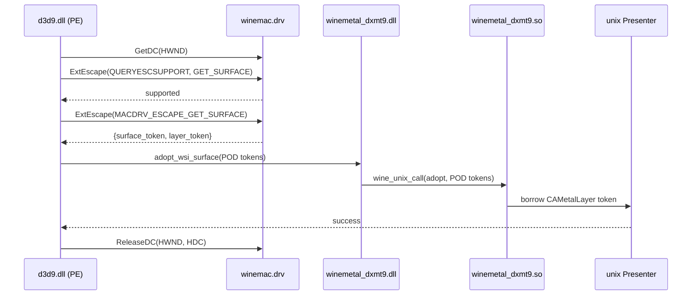
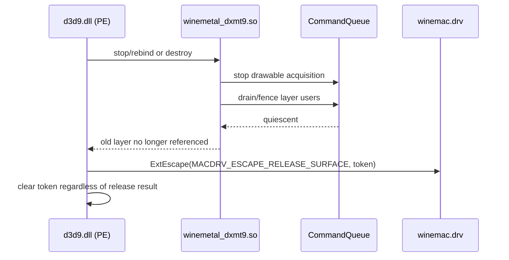

# winemetal Spec — Wine Metal Surface Bridge

## 1. Ownership

| Owner | Responsibility |
|---|---|
| PE D3D9 WSI control path | Own `HWND`/HDC operations, probe `ExtEscape`, retain opaque Wine surface token, issue exactly-once release |
| PE/unix bridge | Validate the fixed-width bootstrap payload and marshal opaque scalar tokens; never dereference them |
| unix presenter | Borrow the `CAMetalLayer`, configure drawable properties, stop acquisition and quiesce GPU work before release |
| `winemac.drv` | Create and retain the client surface, own the layer, define the escape protocol |
| deployment manifest | Declare the expected Wine protocol and record the exact runtime build |

The control-plane bootstrap is deliberately separate from pointer-free
`CommandChunk` traffic. PE code never calls Objective-C or Metal. Unix code
never calls GDI or owns the Wine client surface.

## 2. Acquisition Flow

The compatibility header owns the escape values and payload layout. PE passes
an exact two-`uint64_t` output buffer and accepts only a positive escape result
with nonzero surface and layer tokens. `QUERYESCSUPPORT` is mandatory because
Heroic/Gcenx packages can carry new DXMT DLLs beside an older unmodified Wine
runtime.

## 3. Lifetime and Rebind

The Wine surface token pins the borrowed layer. The PE swap chain keeps the
surface token; the unix presenter keeps only a borrowed layer wrapper.

For reset/rebind, PE acquires the candidate first. Unix adopts it atomically;
only a successful adoption permits release of the old token. This keeps reset
rollback possible and prevents a temporary null layer from escaping to present.

## 4. Legacy Fallback

If the escape query is unsupported, the unix provider may try the legacy
`macdrv_functions` path only when the active Wine manifest pins the exact build
as `legacy-macdrv-symbols`. Direct `dlsym` is not a generic fallback for Wine
11.x: `RTLD_LOCAL`, private struct churn, and the absence of a persistent client
view are independent blockers.

The legacy flow remains for exact Wine manifest entries already qualified as
`legacy-macdrv-symbols`. Wine distribution names identify evidence fixtures;
they do not name or define the fallback. The old visibility patch is archival
compatibility material, not the forward deployment strategy.

## 5. Failure Behavior

| Failure | Result |
|---|---|
| `GetDC` fails | creation/rebind fails; no escape is issued |
| Escape unsupported and no qualified legacy path | `D3DERR_NOTAVAILABLE` |
| Malformed or zero-token response | protocol error; release any valid returned surface defensively, then fail |
| Unix adoption fails | release candidate surface; preserve old binding where reset rules allow |
| Release fails | log once, clear PE token, never retry or double-release |

A windowed device that requested presentation must not succeed with an
unattached layer. Offscreen-only operation, if added later, requires an explicit
D3D9-facing contract rather than an implicit black-window fallback.

## 6. Compatibility and Rollout

The rollout has two independently versioned halves:

1. Wine must ship the accepted `MACDRV_ESCAPE_*_SURFACE` implementation.
2. dxmt9 must ship the matching PE client and unix adoption path.

Until both are present, a Gcenx/Heroic runtime remains unsupported by the new
path. Downstream Wine builds may carry the Wine change before upstream release,
but the manifest must identify the exact source revision and patch.

## 7. Verification Mapping

| Evidence | Contract |
|---|---|
| Native fake-escape protocol tests | response validation, rollback, balanced release |
| PE x64 and WoW64 WSI smoke | Wine escape availability and bridge scalar widths |
| Reset/additional-swap-chain integration | ordering and per-`HWND` ownership |
| Negative stock-Wine run | clean unsupported failure, no black-window success |
| DXMT coexistence smoke | distinct module identities and independent D3D9/D3D11 initialization |

Runtime evidence must record the Wine root hash, escape protocol, dxmt9 bridge
ABI hash, and loaded paths for `d3d9.dll`, `winemetal_dxmt9.dll`, and
`winemetal_dxmt9.so`.
